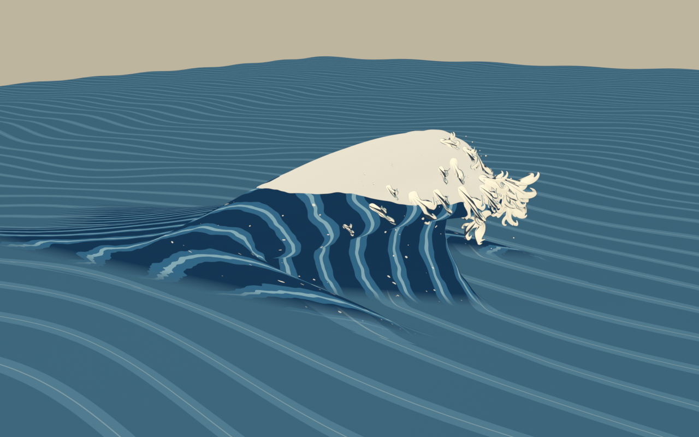

# Great Wave：Blender による動く大波の試作

このディレクトリには、『神奈川沖浪裏』の最大の波を対象にした**パラメトリックな形状生成とアニメーションの研究**を収めています。形状は `src/gwave/` と `wave_params.json` から生成し、テストは `tests/`、原画からトレースした目標輪郭は `target/` にあります。以前の課題説明と段階記録は `docs/` に残しています。`docs/legacy_readme_2026-09-20.md` は移行前の説明であり、そこに書かれた旧パスと「Git がない」という記述は現在には当てはまりません。

## 改訂試作の動画とアニメーション

**[斜めから見る動画](deliverables/localized_wave_volume.mp4) ｜ [原画方向から見る動画](deliverables/localized_wave_print.mp4) ｜ [アニメーション内蔵の Blender ファイル](deliverables/localized_wave_animated.blend)**

新しい候補は `src/gwave/localized_sweep.py`、`branching_whitewater.py`、`build_localized_scene.py` で生成します。峰方向に同じ断面を展開する処理を見直し、局所的な高峰と非対称な肩を作りました。独立した厚片の白波、小滴、周辺海面の動きを含みます。動画は30 fps、11.5秒です。新しい `.blend` には絶対シェイプキーを保存しているため、外部のPC2キャッシュは不要です。



**まだ目標未達の造形候補です。** 開口は改善していますが、白波の花弁状の重なり、船上から見た厚み、連続した波の運動などは不足しています。[確認と未解決事項](docs/milestones/2026-09-24_localized_wave_rebuild.md)を参照してください。Houdini の流体シミュレーション、Unity、HMD の完成を意味しません。

## 旧版の方法と数値検証

旧版は固定トポロジーのメッシュとフレームごとの PC2 点キャッシュです。穏やかなうねりから巻き込みまで変形させ、最後の姿勢で停止します。側面に `lift_clip` を使い、中央の等高区間の半幅を0.10Hに狭めています。旧版の正式テストでは運動指標 M1–M6、最終フレームの S7 輪郭誤差と S8 接線角が合格しましたが、総合判定は不合格です。理由と測定値は `docs/milestones/2026-09-24_foam_and_review_assets.md` に記録しています。この数値判定を新しい候補の合格として流用しません。

## 旧版の成果物

`deliverables/` には、そのまま開ける**静止した最終フレーム**の `.blend` が 2 つと、約 11.5 秒の動画が 2 本あります。`great_wave_final_print.blend` と `great_wave_motion_print_reference.mp4` は原画に合わせた視点での比較用、`great_wave_final_3d.blend` と `great_wave_motion_3d.mp4` は斜めから見た立体形状の確認用です。波本体とは別に、アニメーションする白波と波の爪もあります。測定値、画像、制限は[白波と確認用ファイルの段階記録](docs/milestones/2026-09-24_foam_and_review_assets.md)を参照してください。

原画視点のマテリアルは単一カメラからの投射です。原画の小舟まで波面に映り込みます。最終フレームの色と模様の参照にはなりますが、HMD で使える立体的なマテリアルが完成したことは意味しません。立体確認用は表面 UV に沿ったプロシージャルマテリアルを使うため、斜めから見ても投射による筋状の伸びは生じません。ただし、原画の細部とはまだ大きな差があります。2 つの `.blend` に動的キャッシュは含まれません。アニメーションを変更する場合は、以下の手順で再生成してください。

## 旧版をローカルで再生成する手順

この PC では Blender 5.2.2 LTS のバックグラウンド起動を確認しています。実行ファイルのパスは `params.json` にあります。PowerShell から実行します。

```powershell
& "G:/Unity/GreatWave_2026/Blender/great_wave/tools/run_blender.ps1" tests/selftest_foundation.py -ScriptArgs '--quick','--skip-render'
& "G:/Unity/GreatWave_2026/Blender/great_wave/tools/run_blender.ps1" src/gwave/build_great_wave.py
& "G:/Unity/GreatWave_2026/Blender/great_wave/tools/run_blender.ps1" tests/run_all.py -ScriptArgs '--build-script','src/gwave/build_great_wave.py','--final-frame','285'
& "G:/Unity/GreatWave_2026/Blender/great_wave/tools/run_blender.ps1" src/gwave/render_previews.py -Blend "G:/Unity/GreatWave_2026/Blender/great_wave/blend/great_wave.blend" -NoFactoryStartup -ScriptArgs '--frames','1,110,170,210,250,285'
```

原画視点のアニメーションを作る場合は、本体を生成した後、`blend/great_wave.blend` に `apply_ukiyoe_style.py` を実行し、その出力 `blend/great_wave_styled.blend` に `add_animated_foam.py` を実行します。立体用マテリアル版では最初のスクリプトを `apply_procedural_ukiyoe.py` に替え、白波のスクリプトに `--output blend/great_wave_procedural_foam.blend` を指定します。白波を加えたシーンに `export_final_pose.py` と `render_motion_video.py` を実行します。これらのスクリプトはすべて `src/gwave/` にあり、`--help` で出力用引数を確認できます。白波のベイクと本体の正式テストは同じ本体 PC2 を参照するので、順番に実行してください。

上のコマンドには、この PC でのリポジトリの場所が書かれています。リポジトリを移動した場合は `tools/run_blender.ps1` のパスを読み替えてください。`wave_params.json` の `blend_path` と `cache_path` は、このディレクトリを基準に解決されます。

書き込みのない原画は `reference/Tsunami_by_hokusai_clean.jpg` にあり、`params.json` から相対パスで参照します。青線で注記した旧画像も、輪郭の作成経緯をたどれるよう残しています。両画像の出典は `reference/README.md` を参照してください。`params.json` にある Houdini Alembic/FBX と 2 枚の補助参照画像のパスは、引き続きこの PC 上の外部ファイルを指しています。別の PC でそれらを使う比較テストを実行する前に、実在するパスへ変更してください。`docs/great_wave_blender_prompt.md` は以前の Blender 作業仕様の記録であり、実行時に新たなユーザー指示として扱うものではありません。

`src/gwave/apply_ukiyoe_style.py` は**単一視点からの原画投射実験**です。原画視点では配色が近づきますが、斜めから見ると模様が大きく伸びるため、現状では HMD 用マテリアルになりません。`src/gwave/apply_woodblock_palette.py` は別の実験で、9 色へ面ごとに量子化します。現状は面ごとのブロックが目立つため、最終マテリアルには採用していません。これらの実験で生成した `.blend` とレンダリングは Git の除外対象ディレクトリにあります。

## バージョン管理

新しい `deliverables/localized_wave_animated.blend` は、動画と対応する比較用アニメーションを単体で開けるように保存した例外です。以下のPC2参照に関する記述は旧版に適用します。

`src/`、`tests/`、`target/`、`tools/`、2 つのパラメータファイル、必要な `docs/`、および `deliverables/` の小さな静止確認用ファイルと動画をコミット対象にします。`results/`、`cache/`、`blend/` 内のレンダリング、点キャッシュ、生成されたアニメーション用 `.blend` は再生成可能で、`.gitignore` で除外しています。実行時に生成する本体 PC2 は約 289 MB です。アニメーション用 `.blend` だけでは、対応する点キャッシュがない限り動きを再現できません。コミット前に `git status` を確認し、大きな生成ファイルを誤って含めないようにしてください。
