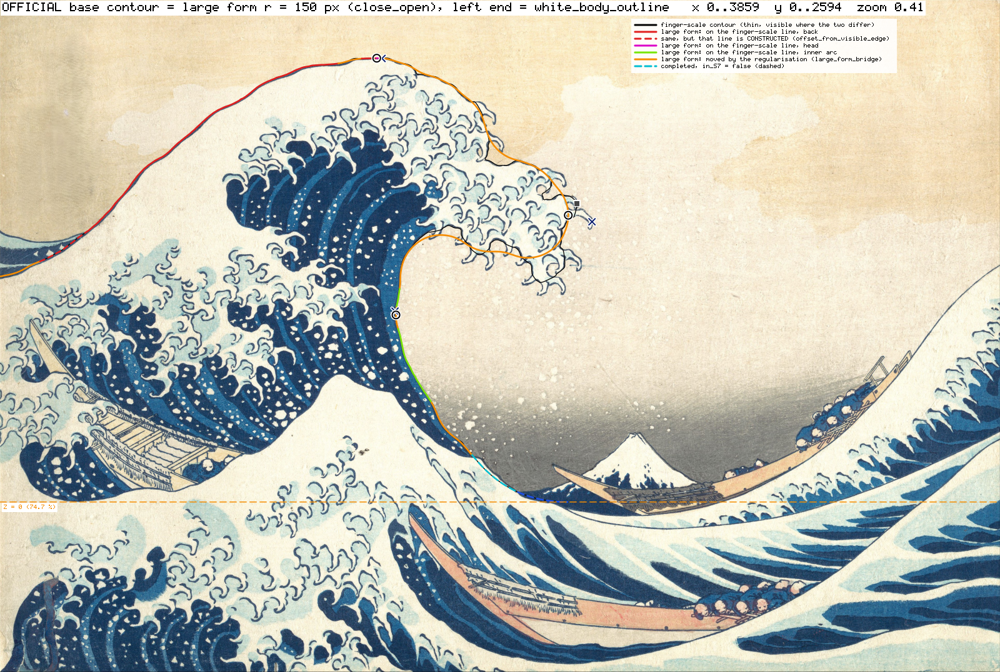

# 基準輪郭 报告（正式版 `target/base_contour.json`）

> **2026-09-20 追记（大形尺度的决定，待用户确认）**：`target/base_contour.json` 现在是**大形尺度**轮廓（见文末第 11 章）；本报告第 0–10 章描述的指状尺度轮廓原样保存在 `target/base_contour_finger_scale.json`，`build_base_contour.py` 现在写到那里；下面这张 `target/base_contour_overlay.png` 现在显示的是大形轮廓（粗线）叠在指状尺度轮廓（细黑线）上，原来的指状尺度叠加图在 `results/step1_prepare/contour_final/base_contour_finger_scale_overlay.png`。第 0–10 章的文字没有改动。

- 日期：2026-09-20　　第 1 步（准备）的产物，**停点：等用户确认基準輪郭**。
- 正解只有原画 `C:/Users/wang6/Pictures/Saved Pictures/Tsunami_by_hokusai_19th_century.jpg`（3859×2594）。没有用 Houdini 数据、CG 参考图的任何形状数据。
- 本文分三类写：**实测事实 / 推测 / 建议**。量不到的直接写「量不到」。差值单位一律是「画面高的 ％」（1％＝25.94 px＝0.01515 H，水平方向的差也用它）。
- 一条命令重建（约 18 s，无界面 Blender，只用自带 Python + numpy）：

```powershell
& "G:/research/Wave Simulation/blender/great_wave/tools/run_blender.ps1" src/contour/build_base_contour.py
```

  实测：连续运行两次，`target/base_contour.json` 的 SHA-256 完全相同（`85215972AF4CAC6D…`）。输入是两份候选的 JSON（各自也是一条命令重建，见 `docs/records/step1_contour_a.md`、`step1_contour_b.md`），全部参数和人工判断在 `src/contour/base_contour_params.json`，每一项都写了理由。



颜色：背＝红，波頭＝品红，内側の弧＝黄绿，爪根的连接段（`claw_root_bridge`）＝橙，被手前の浪挡住的补全＝青色虚线（`completed_occluded`），露出的海面里没有画出浪面、由我补的部分＝蓝色虚线（`completed_other`），左端的另一种读法＝紫色虚线，橙色虚线＝Z＝0（上から 74.7％）。

---

## 0. 需要用户先看的三件事

| # | 内容 | 先看哪里（px） | 图 |
|---|---|---|---|
| 1 | **背的左端是哪一条线**：我选了「白色浪体的轮廓」（在左端向左下降），而不是「相对天空的剪影」（在左端向左**上升**）。两种读法在 x < 338 px 处不同，在画面左端竖直相差 175 px＝画面高的 6.8％（点到折线的距离最大 6.3％）。请确认。 | x 0–400，y 880–1090 | `crop_01_back_left_end.png`、`crop_02_back_fork_zoom.png`、`plot_S4_back_slope.png` |
| 2 | **「爪」的尺度**：我按「一根一根的钩状爪」（指状尺度）去爪，泡沫的「瓣」保留。因此波頭的轮廓是台阶状的，**基準輪郭自身不满足 S8**（波頭段最大 86°）。如果用户心目中的「大形」要把瓣也抹平，基準輪郭要另做。 | 波頭一带 x 1830–2240，y 390–1100 | `crop_05`…`crop_10`、`diagnostic_lowpass_head.png` |
| 3 | **S5 的「朝向」用哪个定义**：同一条轮廓，定义不同，数值从 −45.8° 到 +5.4°。测试库现在的 φ 定义在基準輪郭上给出 +5.4°（朝上），与张出面积主轴的 −45.8° 相差 51°，S5 的 ±5° 无从谈起。 | 波頭の先 (2226, 785) 附近 | `diagnostic_S5_direction_and_thickness.png` |

---

## 1. 裁决：两份候选的比较（实测事实）

两份候选（A＝区域法，B＝轮廓线追踪法）画在同一张图上：`results/step1_prepare/contour_final/compare_ab_1600.png`；沿轮廓的距离曲线：`compare_ab_distance_plot.png`。

A–B 沿轮廓的距离（只算看得见的部分；画面高的 ％）：

| 段 | A→B 平均 / p95 / 最大 | B→A 平均 / p95 / 最大 |
|---|---|---|
| 背 | 0.010 / 0.022 / 0.127 | 0.010 / 0.022 / 0.133 |
| 波頭 | 0.169 / 0.963 / 1.128 | 0.110 / 0.707 / 1.007 |
| 内側の弧（含波頭下面） | 0.070 / 0.299 / 0.901 | 0.059 / 0.270 / 0.899 |
| 补全段（不计入 S7） | 平均 0.462，最大 3.795 | 平均 0.120，最大 0.202 |

- 两份候选的主文件对背的左端用的是同一种读法（天空剪影），所以背可以直接比：**整条背最大只差 0.13％**。
- 相差超过 0.5％ 的地方一共 4 处（看得见的）＋补全段 1 处。每一处我都放大看了原画再决定（`judge_V1…V5_*.png`，红＝A，绿＝B，黄色粗线＝最终采用）：

| 编号 | 位置（px） | 最大差 | A 的做法 | B 的做法 | 裁决 | 理由（看图得到的） |
|---|---|---|---|---|---|---|
| V1 | (1848,392)→(1873,437)，波頭上缘第 1 只钩爪 | 1.02％ | 沿爪背走到 (1877,420)，再用 R＝28 px 的圆弧回到爪下的凹口：留下 26 px 的「爪桩」 | 从上缘的小台阶 (1835,393)（爪背离开波頭大斜面的地方）到爪下凹口 (1862,446) 连一条弦 | **B** | 8 倍放大图上，上缘以约 38° 下行，在 x 1820–1835 有一小段平台，然后才甩出去成为爪。B 的弦延续了大斜面、连接的是两个爪根点；A 的圆弧是形态学开运算的副产物（爪根宽度略小于 2R 时圆弧会鼓进爪里最多 R）。「把爪的根部连起来」＝弦。 |
| V2 | (2099,648)→(2135,681)，第 3 瓣末端大钩爪的「肩」 | 1.0％ | 同上，沿爪背走到 (2135,680) 再圆弧回来 | 从上缘凹点 (2080,656) 到钩爪下爪根 (2129,695) 的弦 | **B** | 同 V1；爪背下面那块淡蓝晕染正是这幅画里爪根处常见的画法。 |
| V3 | (2060–2140, 695–790)，第 3 瓣与第 4 瓣之间的「天空小袋」 | 1.13％ | 去掉小袋右侧约 20 px 宽的细指，钻进环形卷爪的「眼」（天空色）(2076–2124, 718–768)，沿眼的左壁走 | 沿细指右侧下行到约 (2125,728)，斜切到凹口底 (2097,768)，再沿第 4 瓣上缘走（B 的 8 px 断口闭合把「眼」当作封闭的） | **B** | 小袋是环形卷爪的眼，属于爪的装饰，不是大形的特征；钻进去（A）会给基準輪郭加上一个 50×50 px 的凹坑。反过来，如果把 x＝2079 以右全部当爪、从 (2079,655) 直连 (2097,768)，会切进一块带有与波頭其它部分相同内部卷纹的泡沫约 1.5％。B 介于两者之间（离 A 最多 1.1％，离直连线约 1.5％）。**这是整条轮廓里最不确定的一处。** |
| V4 | (2140,1082)→(2097,1102)，波頭最下面一瓣的底 | 0.90％ | R＝28 px 圆弧，鼓进爪里 23 px | 两个爪根点 (2141,1066)–(2084,1090) 之间的弦 | **B** | 同 V1。 |
| V5 | 补全段 (1822,1756)→Z＝0 | 3.79％（只是 A 多出的一段平走） | 圆弧（R＝483 px，起点切向 51.5°）到 x＝2200，再沿 Z＝0 平走到 x＝2288 | 切向连续的抛物线（起点切向 52.7°），约束「任何采样点都不落在看得见的天空里」，止于 (2189.6, 1937.7)，没有平走段 | **B** | 两者都是纯外推、都标了 `in_S7=false`，不影响 S7。B 的曲线受一个看得见的事实约束（必须藏在手前の浪后面）；8 倍放大图上 A 的圆弧在 (1975–2000, 1880–1897) 露到手前の浪轮廓线的天空一侧 1–3 px。 |

- 其余（全部 `traced` 的部分）两份候选都落在墨线外缘上。我用**独立写的**检查（沿法线取亮度剖面，找天空与墨线之间半值点；正＝真实边缘在轮廓外侧）：

| | 背 中位 (p05…p95) px | 波頭 | 内側の弧 |
|---|---|---|---|
| A | +0.11 (−0.25…+0.54) | +0.11 (−0.65…+1.17) | +0.04 (−1.02…+1.35) |
| B | −0.07 (−0.40…+0.20) | −0.04 (−0.66…+0.51) | −0.09 (−0.67…+0.70) |
| **最终** | −0.06 (−0.32…+0.21)，n＝221 | −0.07 (−0.70…+0.55)，n＝150 | −0.08 (−0.71…+0.72)，n＝253 |

**最终轮廓的构成**：几何＝候选 B（理由：连接段是爪根点之间的弦；`traced` 点做过亚像素；补全受可见天空约束）＋ 背的左端换成「白色浪体轮廓」（§2）＋ 补全段重新分类标记。目前没有任何一处采用 A 的几何；如果用户对某一处裁决有不同意见，把参数文件 `verdicts` 里该项的 `use` 改成 `"A"` 重跑即可（拼接逻辑已用 V1、V4 试跑验证过：`contour_final/variant_splice_test/`）。最终轮廓与 A 的距离：波頭 平均 0.11 / p95 0.72 / 最大 1.02％，内側の弧 0.06 / 0.27 / 0.90％。

---

## 2. 背的左端（需要用户确认）

### 实测事实
- 背的墨线往左下走到 **(337, 894)** 处分叉（`crop_02_back_fork_zoom.png`，8 倍）：
  - 上支＝左侧深蓝色带的上缘。它与背的墨线外缘成一个折角（自身 S8 约 26°），先降到 (145, 932)，再**向左上升**，在 y＝891（上から 34.4％）碰到画面左端；左端处斜率 −17°（粗尺度）…−26°（细尺度）。
  - 下支＝深蓝色带与白色浪体的分界。它是背的墨线**内缘**不带任何折角的直线延续，单调下降，在 y＝1076（41.5％）碰到画面左端。
- 分叉处是一个 T 形交点：连续通过的线（背 → 下支）属于前面的物体，分出去的线（色带上缘）属于后面的物体。
- 说明书 S4「左端附近约 25°」：下支在 x＝100–200 处 22.5–29°（粗尺度），上支在同一位置是 −10…+5°。
- 说明书 §7b「原画在左端把背裁掉了，按左端的斜率平滑延伸到静水面」：只有向左下降的线才说得通。

### 我的做法（参数 `back_left_variant = white_body_outline`）
- x < 338 px 用下支。下支看得见的是「白/深蓝」分界＝墨线的**内**缘，而轮廓的其余部分定义在墨线**外**缘，所以把下支向外（色带一侧）平移一个墨线宽度：在分叉点上方 40–340 px 的一段背上实测墨线宽度，**中位数 8.84 px**（p05 6.1，p95 12.6，n＝150）。这样背的外缘穿过分叉点时没有横向台阶（接缝处平移前的法向台阶 0.96 px，用 σ＝6 px 在 ±30 px 内局部平滑，最大位移 0.87 px）。
- 结果：背在画面左端的位置 **(0, 1066.8) px＝上から 41.12％＝(−0.861 H, 0.509 H)**，该处斜率约 +18°（粗尺度）。看得见的白色边缘与「轮廓 − 8.84 px」的偏差：中位 −0.08 px（p05 −0.78，p95 +0.75，n＝57）。
- 这一段标为 `traced`、`in_S7=true`（它是看得见的边界）。
- 另一种读法（天空剪影）的完整轮廓每次都会同时输出：`results/step1_prepare/contour_final/base_contour_alt_sky_silhouette.json`（同一 schema）。切换只需改 `back_left_variant`；不想要 8.84 px 平移则把 `white_body_outward_offset` 改成 `"none"`。

### 推测
- 左侧的深蓝色带是大浪后面的另一片水（另一道涌，或者大浪更远处的背面），不是这次要做的「大浪的大形」的截面轮廓的一部分。
- 用户之前量 S4 时用的就是白色浪体这条线：按这条线重测得到 左端 18–26°／中段最大 49°（粗）／波頂前 8.6°（x＝1300），与说明书的 25°／47°／8° 一一对应；按天空剪影则左端是 −17°。

### 影响
- 两种读法在 x＝0 处竖直相差 175 px（6.8％；不含墨线宽度外移时是 184 px＝7.1％，即候选 B 记录里的数字），不同的部分占背的弧长约 22％，选错的话背的 S7 p95（≤2％）必然通不过，所以**这一项必须由用户定**。

---

## 3. §5 重测表（说明书 §5 注 4）

同一套定义分别作用于 A、B、最终轮廓（括号里是候选自己报告的数值，如不同）。

| 项 | 说明书 | A | B | **最终** | 最终与说明书之差（画面高的 ％） | >1％？ |
|---|---|---|---|---|---|---|
| S1 波頂（左％/上％） | 38.2 / 8.7 | 38.16 / 8.63（A 自报 38.42 / 8.62，用的是严格最高点） | 38.20 / 8.62 | **38.22 / 8.62**，px (1474.9, 223.5) | dx +0.03，dy −0.08（更高） | 否 |
| S2 内側の弧最深点 | 39.5 / 46.3 | 39.55 / 46.94（自报 47.07） | 39.56 / 46.93 | **39.56 / 46.92**，px (1526.6, 1217.1)，H (+0.0306, 0.4209) | dx +0.09，dy +0.62，距离 0.63 | 否 |
| S3 谷→波頂（谷 74.7％，高 66％） | 66 | 可见天空最低点 73.17％ → 64.55 | 海面上缘 73.01％ → 64.40 | 我独立量的海面上缘：y＝1894（1890–1897，x 2010–2080 共 71 列）＝**73.01％** → 若当作谷：64.40％；按框架 Z＝0（74.7％）：66.08％ | −1.60（若把海面上缘当谷）；+0.08（按框架） | **是，但这不是可靠的谷的测量**，见下 |
| S4 背の傾き | 左端≈25°／中段最大≈47°／波頂前≈8° | 见下表 | 见下表 | 见下表 | 角度无法换算成画面高的 ％ | — |
| S6 含爪最右点 | 59.2 / 33.0 | 59.29 / 32.99 | 59.29 / 33.02 | 我独立量：**59.29 / 33.06**，px (2288.0, 857.5) | dx +0.13，dy +0.06 | 否 |

- **与说明书相差超过 1％ 的项目：只有 S3，而且它量不到。** 谷底被手前の浪和船挡住；74.7％（y＝1937.7）落在手前の浪右侧露出的那块深蓝海面中间，对不上任何一笔。我量得到的只有那块海面的上缘 73.01％。与 74.7％ 不矛盾，也无法证实。框架的 Z＝0 保持 74.7％，没有改。
- S1：波頂是平顶。距最高行 2 px 以内的 x 范围 **1371–1501 px（宽 5.00％）**，中心在 x＝1435.9 px＝左 37.21％（比说明书的 x 偏左 38 px＝画面高的 1.47％）；严格最高点在 x＝1481。我取的波頂＝「σ＝0.5％ 平滑副本的最高点」＝x 1474.9。
- S2：最深点附近边界近乎竖直，x 在 2 px 以内的一段是上から 45.96–47.88％，说明书的 46.3 在其中。
- S6 由实测点算出：张出＝浪高的 47.5％，波頂→该点方向＝水平向下 37.9°（说明书 47％／38°）。

S4 明细（角度，正＝朝波頂上升；「弦」的窗口与测试库 `gw.profile_metrics` 相同）：

| | 说明书 | A | B | **最终（白色浪体）** | 另一种读法（天空剪影） |
|---|---|---|---|---|---|
| 左端：从左端起 5％ 弧长的弦 | ≈25 | −15.8 | −17.3 | **+20.2** | −17.3 |
| 左端：粗尺度（σ＝3％）切线，x＝0 / 100 / 150 / 200 | | −14.9 / −9.1 / −2.4 / +5.4 | −16.7 / −9.8 / −2.6 / +5.4 | **+17.6 / +22.5 / +25.8 / +29.1** | 同 B |
| 中段最大：2％ 弦 | ≈47 | 53.9 | 53.9 | **53.9**，在 (511, 704)＝左 13.2％/上 27.2％ | 53.9 |
| 中段最大：粗尺度（σ＝3％） | | 48.9 | 49.0 | **49.0**（位置：候选 B 的记录为 x≈480） | 49.0 |
| 波頂之前：弧长 8％→3％ 的弦 | ≈8 | 10.3 | 10.3 | **10.3** | 10.3 |
| 波頂之前：粗尺度 x＝1300 / 1400 | | 8.7 / 5.8 | 8.6 / 5.9 | **8.6 / 5.9** | 同 |
| 最陡点之后斜率回升的最大值（2％ 弦） | | 17.5 | 17.5 | 17.3 | 17.5 |

- 中段最陡：是。向波頂「逐渐」变缓：只在粗尺度上成立；手绘墨线有起伏（细尺度回升 17°，主要来自波頂平台左端 (1340–1390, 226–239) 的小肩）。
- 顶部没有折角，但波頂之后 5.2％ 弧长处 **(1607, 285)** 有一个真实的折角（约 51°）：波頂圆顶的轮廓线在这里扎进泡沫、波頭第一瓣的轮廓从这里开始（12 倍放大图确认是画出来的特征）。测试库对基準輪郭算出的 `top_is_round_no_corner = false` 就是因为它（±6％ 的窗口把它包进去了）。

---

## 4. S5、厚度、平滑度、各段长度（实测事实）

**S5 波頭の先（不含爪）**：px (2226.5, 785.1)＝左 57.70％ / 上 30.27％＝**(+0.4394 H, 0.6732 H)**。在 S6 说明书点的左 2.24％、上 2.73％（符合说明书「在其左上方」）。浪体的张出＝43.9％ H。

朝向（同一条轮廓，不同定义）：

| 定义 | 值 |
|---|---|
| **写进 JSON 的**：张出部分（过内側の弧最深点的铅垂线以右、由基準輪郭围成的面积，0.1101 H²，长短轴比 1.68）的面积主轴，多边形矩的精确公式 | **−45.8°**（A −46.1°，B −45.8°） |
| 波頂 → 波頭の先 连线 | −36.8° |
| 测试库的 φ：上表面距先端弧长 2％–8％ H 一段的弦 | **+5.4°** |
| 上表面最后 5％ / 10％ / 20％ H 的弦 | −24.5° / −15.6° / −40.4° |

**去爪后的波頭厚度**（H＝1712 px）：

| 先端后弧长 | 上下等弧长点对的距离 | 上边点到下边的最短距离 |
|---|---|---|
| 5％ H | 6.3％ H | 4.6％ H |
| 10％ H | 11.6％ H | 8.1％ H |
| 20％ H | 26.1％ H | 13.6％ H |

**轮廓自身的 S8**（1％ 间距，段内，4 个相位取最大）：背 最大 23.0°，66 个采样里 1 个 ≥15°，在 (1365, 226)（波頂平台左端的小肩）；波頭 最大 86.3°，44 个里 26 个 ≥15°，在 (2094, 757)（第 3、4 瓣之间的凹口）；内側の弧 最大 66.7°，75 个里 28 个 ≥15°，在 (1776, 884)（波頭下面的爪根；内側の弧本体是光滑的）。绕波頭の先的转角（测试库的定义，先端前后各排除 2％）：137°；±5％ 时 73°。

**各段**（2 px 采样，相邻段共用端点）：

| 段 | 点数 | 长度 | traced | claw_root_bridge | completed_occluded | completed_other | `in_S7=false` 占比 |
|---|---|---|---|---|---|---|---|
| back 背 | 880 | 1757.8 px＝67.8％＝1.027 H | 880 | 0 | – | – | 0％ |
| head 波頭 | 594 | 1185.7 px＝45.7％＝0.693 H | 464 | 129 | – | – | 0％ |
| inner_arc 内側の弧 | 1213 | 2422.7 px＝93.4％＝1.415 H | 763 | 235 | 115 | 99 | **17.7％**（214 点，约 428 px） |

- 内側の弧看得见的终点 (1821.5, 1755.3)＝左 47.20％/上 67.67％；补全终点 (2189.6, 1937.7)＝(+0.418 H, 0)。补全曲线在 (1998.9, 1899.5) 处从手前の浪后面出来、进入露出的海面，此后标为 `completed_other`（那里没有东西挡着，只是画上没有画浪面）。

**S7 与 S8 能否同时满足（诊断，不改变轮廓）**：把基準輪郭（含补全）沿弧长做高斯低通，当作「假想的光滑网格轮廓」，用**测试库自己的** `measure_profile` / `s7_deviation` 评价：

| 低通 σ（画面高 ％） | S8 判定值（背 / 波頭 / 内側の弧） | S7 平均 / p95：背 | 波頭 | 内側の弧 | 波頭の先位移 |
|---|---|---|---|---|---|
| 2.0 | 3.7 / 49.1 / 30.2 | 0.08 / 0.17 | 0.33 / 0.85 | 0.27 / 0.74 | 1.12 |
| 3.0 | 3.3 / 18.3 / 29.1 | 0.14 / 0.28 | 0.53 / 1.36 | 0.46 / 1.15 | 1.85 |
| 4.0 | 2.7 / **14.2** / 27.5 | 0.20 / 0.39 | 0.71 / 1.65 | 0.66 / 1.59 | 2.66 |
| 5.0 | 2.4 / 10.3 / 23.6 | 0.28 / 0.56 | 0.86 / 1.92 | 0.87 / **2.14** | 3.31 |

- 波頭段要到 σ≈4％ 才低于 15°，此时 S7 平均 0.71％、p95 1.65％（限值 1％ / 2％），余量不大。
- 内側の弧段一直在 24–29°，最大值在 (2106–2108, 1020–1052)＝波頭右侧面转入下面的那个角；单纯低通过不了，要靠网格在那里的造型。
- σ≥4％ 时波頭の先的位移超过 S5 的 2％（低通把钝头整体削圆了）；网格不是低通，这一行只说明「大形越光滑，先端离基準輪郭越远」。
- 图：`plot_lowpass_diagnostic.png`、`diagnostic_lowpass_head.png`。

---

## 5. 不确定的区间（请优先检查；px）

| 编号 | 范围 | 内容 |
|---|---|---|
| D1 | x 0–400，y 880–1090 | 背的左端取哪一支（§2）；两种读法在左端竖直相差 6.8％。白色浪体读法里含 8.84 px（0.34％）的墨线宽度外移。 |
| D2 | x 1371–1501，y 223–226 | 波頂平台宽 5.0％，波頂的左右位置只确定到这一段内；S1 的左右容差（2％）比平台窄。 |
| D10 | (1595–1620, 272–297) | 波頂之后的真实折角（约 51°）。 |
| D3 | (1825–1900, 385–615) | 波頭上缘竖直面上的两只钩爪，3 条弦；爪根点随滚球半径变化约 ±10 px。V1 在此。 |
| D4 | (2060–2150, 640–790) | 第 3 瓣末端的爪/卷纹群和「天空小袋」，三种读法相互在约 1.5％ 之内；**最不确定的一处**（V2、V3）。 |
| D5 | (2100–2240, 740–845) | 先端瓣。波頭の先落在跨过含爪最右那只爪的爪根的连接段上，不是描出来的点。先端瓣画出来的圆头（墨线止于 (2225, 775)，另有一小段在 x 2229–2234、y 782–800）在弦的**外侧**最多 7 px（0.27％）：两份候选都从瓣顶 (2197, 757) 直接连到爪的下爪根 (2215, 835)，因为环形卷纹的「眼」与圆头轮廓之间的泡沫比一根爪还薄。先端位置在指状尺度内的不确定度约 (+0.3, ±0.5)％；若去爪尺度取到 R≥55 px，整个先端瓣会被削掉，先端移动 (−1.4, +2.6)％（B 的敏感度试验）。 |
| D6 | (1655–2230, 785–1105) | 波頭右侧面和下面几乎全是爪：轮廓在「爪间凹口的顶（traced）」和「跨爪根的弦（bridge）」之间交替。(1938–1945, ≈640) 处墨线本身有约 6 px 的断口，轮廓平滑跨过。 |
| D7 | (1785–1850, 1700–1770) | 内側の弧下端手绘线的摆动；(1822,1756)–(1846,1764) 那 35 px 的细楔（大浪与手前の浪的轮廓并在一起）没有采用。 |
| D8 | (1820–2200, 1750–1945) | 补全段：纯外推，`in_S7=false`。起点切向的估计本身不稳（B 的记录：34–58°，采用 52.7°）。 |
| D9 | (1990–2300, 1885–1995) | 谷的水位量不到（§3 S3）。 |

图：`overlay_doubt_zones_1600.png`（蓝框＝上表的范围）；各处放大图 `crop_01`…`crop_16`（每张 ≤1600 px 宽，我逐张看过）。

---

## 6. 人工给出的值（全部在 `src/contour/base_contour_params.json`，都不是轮廓点）

| 参数 | 值 | 为什么需要 |
|---|---|---|
| `verdicts`（V1–V5） | 每处的范围框 ＋ 采用 A 还是 B | 看图做的裁决（§1）。脚本会自动找出 A–B 相差 >0.5％ 的区间；如果出现没有裁决覆盖的区间，脚本以退出码 1 结束，不会默默放过。 |
| `back_left_variant` | `white_body_outline` | §2，待用户确认。 |
| `base_candidate` | `B` | §1。 |
| `s6_window_px` | [2230, 800, 2330, 920] | 只是 S6 含爪最右点的搜索窗（避开 A 报告的 x 2200–2450、y 1055–1065 的印刷/扫描伪影）。 |
| `s3_sea_columns_px` | [2010, 2080] | 只是量海面上缘的列范围（与 B 相同）。 |
| `doubt_zones` | §5 的框 | 只用于画图和写进 JSON，供测试/用户定位。 |
| `candidate_sha256_expected` | A796F50B / 65F5418D / 4931690E | 我看图裁决时的候选文件版本；不一致只给警告。 |

其余都是算法参数（0.5％ 阈值、σ、墨线宽度测量区间、2 px 采样等），每项在 JSON 里有 comment。候选 A、B 自己的人工锚点见它们各自的参数文件和记录。

---

## 7. 推测

1. 左侧深蓝色带不是大浪截面的一部分（§2）。用户的 S4 是在白色浪体轮廓上量的。
2. 说明书的 S1 左 38.2％ 取的是平顶上靠近严格最高点的位置（严格最高点 x＝1481＝38.4％，平顶中心 37.2％）。
3. 说明书 74.7％ 的谷位大概取自露出的那块海面里的某个位置，而不是某一笔线条。
4. 用户说的「爪」是一根一根的钩状爪：`G:\research\爪形分析` 里的 100 个爪形切图，每一张都是单根钩爪（我看了 `过程图汇总/01_原图切割_100个爪形.png`）。那份资料的坐标都是各切图内部的局部坐标，没有找到对应原画位置的数据，所以**没有用它来定爪根位置**，只把它当作「爪的尺度」的旁证。
5. 按指状尺度去爪后，画里的波頭是一条约 25％ H 厚、沿 −45° 斜向右下的钝头泡沫带；说明书 §7 的「波頭の縁 ≤ 3％ H」只能出现在网格波頭の先附近，往回 10–20％ H 之内厚度就要长到 12–26％ H，否则 head / inner_arc 的 S7 过不了。

## 8. 建议

1. **请确认背的左端**（§2）。确认之前，测试可以先把基準輪郭 x < 400 px 的部分单独统计。
2. **S5 朝向的定义**：建议 S5 用对钝头稳定的面积主轴定义（基準輪郭 −45.8°），或者干脆用「波頂→波頭の先」连线（−36.8°）；测试库现在的 φ（上表面 2–8％ H 的弦）留给 M4 的逐帧单调性用，不要拿它去和基準輪郭比 ±5°（基準輪郭上它是 +5.4°，因为先端瓣的上缘是平的）。
3. **S1 的左右判定**：不要对平顶取 argmax；建议判「网格波頂是否落在 x＝1371–1501 px（X＝−0.060…+0.016 H）之上」或只判 X＝0 铅垂线处的高度，并报告平顶范围。
4. **S8 只对网格轮廓评价**；基準輪郭自身的 S8（86°）只报告、不判定。S7 的 p95≤2％ 与 S8 的 15° 在波頭段可以同时满足但余量小（§4 的表）；波頭右下角 (2106, 1035) 一带需要网格自己做出圆角。如果用户希望基準輪郭本身就是光滑的大形，需要用户先定尺度（例如把瓣也当作爪），我再另出一条；现在这条是按说明书字面（去爪、连爪根）做的。
5. **S3**：Z＝0 保持 74.7％；请用户告知 74.7％ 当初取自哪里。
6. §7b 的延伸：从 (−0.861 H, 0.509 H)、斜率约 18–22° 出发延伸到静水面（按白色浪体读法）。
7. 测试库的自动先端检测（「波頂之后第一个 X 局部最大且其后回退 ≥0.3％」）在有瓣的轮廓上会停在较早的瓣上（低通 σ≤1％ 的诊断里先端被判到 5％ 之外）。对基準輪郭请始终用 JSON 里给定的分段（`measure_base_contour(use_json_segmentation=True)`，现在的默认值）；对光滑网格没有这个问题。

---

## 9. JSON 的约定（schema `gw.base_contour.v1`，编排者给定的约定未改）

- `back`＝画面左端 → 波頂；`head`＝波頂 → 波頭の先（基準輪郭上波頭的最右点，不含爪）；`inner_arc`＝波頭の先 → 波頭下面 → 内側の弧 → 谷（Z＝0）。没有加沿谷的平走段。相邻段共用端点（px 和 H 都逐位相同）。
- 轮廓＝墨线**外缘**（朝天空一侧的半值点）；墨线粗约 4–9 px（背的下段实测中位 8.8 px，候选 B 记录别处 4–6 px），中心线在其内侧约 2–4 px。
- `source`：`traced` / `claw_root_bridge` / `completed_occluded` / `completed_other`；`in_S7` 只对 `completed_*` 为 false。
- 每段按 `长度 / round(长度 / 2)` 的间距等弧长重采样（实际 1.9998 / 2.0008 / 1.9996 px，写在 `actual_spacing_px`）；px 保留 3 位小数，H 保留 6 位。
- 坐标换算用 `gw.frame` 的公式值（frame_w＝2.254036 H，x_left＝−0.861042 H；与任务书示例里印的 2.254066 / −0.861053 差 3e-5 H，基础库记录里已说明）。
- schema 之外多写的键：`official`、`built_by`、`variant`、`contour_definition`、每段的 `actual_spacing_px` 和 `origin_runs`（每一段点来自 B / B_alt 内缘＋外移 / 接缝平滑）、`landmarks.*.pct`、`landmarks.crest.plateau_x_px`、`landmarks.head_tip.direction_alternatives_deg`、`landmarks.inner_arc_visible_end`、`landmarks.completion_end`、`remeasure.S5`、`remeasure.items_differing_…`、`head_thickness_claws_removed`、`own_S8`、`tip_turn_clockwise_deg`、`segment_summary`、`doubt_zones`、`provenance`。
- 测试库 `gw.profile_metrics.measure_base_contour()` 能直接读这份 JSON（已在构建脚本里跑过：φ＝+5.4°，S8 判定值 86.4°，S4 左端 20.2° / 中段 53.9° / 波頂前 10.3°）。

## 10. 文件

| 文件 | 内容 |
|---|---|
| `target/base_contour.json` | 正式基準輪郭 |
| `target/base_contour_overlay.png` | 叠在原画上的轮廓图（1600 px 宽） |
| `src/contour/build_base_contour.py`、`src/contour/base_contour_params.json` | 构建脚本和参数 |
| `results/step1_prepare/contour_final/overlay_full_res.png`、`overlay_wave_1600.png`、`overlay_doubt_zones_1600.png` | 原尺寸 / 大浪局部 / 不确定区间 |
| `…/compare_ab_1600.png`、`compare_ab_distance_plot.png`、`judge_V1…V5_*.png` | 候选比较与裁决用的放大图 |
| `…/crop_01…crop_16_*.png` | 最终轮廓的 16 张局部放大图 |
| `…/plot_S4_back_slope.png`、`plot_S8_own.png`、`plot_lowpass_diagnostic.png`、`diagnostic_lowpass_head.png`、`diagnostic_S5_direction_and_thickness.png` | 曲线与诊断 |
| `…/metrics.json` | 本文所有数值的来源 |
| `…/base_contour_alt_sky_silhouette.json` | 左端另一种读法的完整轮廓（非正式） |
| `…/variant_trial1/`、`…/variant_splice_test/` | 试跑输出（前者与正式版同参数；后者是把 V1、V4 改判给 A 来验证拼接逻辑）。可以忽略。 |

---

## 11. 大形尺度（large form）的正式基準輪郭（2026-09-20 追加；**停点：等用户确认**）

> 本章由 `src/contour/build_large_form.py` 的作者追加，前面 0–10 章是裁决者的原文，没有改动。
> 自本章起：**`target/base_contour.json`＝大形尺度轮廓（S5 / S7 / S8 的正式目标）**；第 0–10 章描述的指状尺度轮廓原样保存在 **`target/base_contour_finger_scale.json`**（只多了一个说明用的键），留给以后放爪 / 泡沫时用。这是编排者的决定，**需要用户在停点确认**。
> 一条命令重建（约 2 分钟）：`& ".../tools/run_blender.ps1" src/contour/build_large_form.py`。数值出处：`results/step1_prepare/contour_large_form/metrics.json`。


### 11.1 为什么要另做一条（实测事实）

- 指状尺度轮廓**自身**的 S8（1％ 间距、4 个相位、跨过先端一起算）：背 23.1°、波頭 86.4°、内側の弧 66.0°；758 个判定点（背 268、波頭 182、内側の弧 308）里 206 个 ≥ 15°。S7 要求网格贴着它走（平均 ≤ 1％、p95 ≤ 2％），S8 要求每 1％ 转角 < 15°，两者对这条轮廓不能同时满足（第 4 章的低通表、`docs/records/step1_tests.md` 第 4 节）。
- 说明书 §2 的范围是「大波の大形」，S8 要求轮廓光滑。S8 的限值换算成几何量：相邻采样点间距 1％＝25.94 px，转角 15°＝0.2618 rad → **曲率半径 ≥ 25.94 / 0.2618＝99.1 px**（画面高的 3.82％＝5.79％ H）。「大形」的尺度因此不是任选的，而是由 S8 给出下限。

### 11.2 「大形」在这里的定义（可重建，没有手调的点）

参数全部在 `src/contour/large_form_params.json`，每项写了理由。

1. 把指状尺度轮廓闭合成一个区域（浪体在内）：两端沿端点切线（首 / 末 2％ 的弦）各延长 900 px，在画面下方很远处闭合；在 3859×2594 的原始分辨率上栅格化。延长是为了不在画面左端和 Z＝0 处造出人为的折角。
2. 用半径 r 的圆盘做形态学**先闭后开**（精确欧氏距离变换）。闭＝在天空一侧滚球，填掉球进不去的凹处（瓣间凹口、先端瓣前的天空小袋、竖直面下的凹角、波頂右侧的台阶、腋部）；开＝在浪体里面滚球，磨圆球到不了的凸角、去掉比 2r 窄的瓣。正则化后的线曲率半径 ≥ r（栅格精度内）。
3. 重新取边界：沿像素缝跟踪，再把每个顶点沿梯度移到最后一次距离场的「距离＝r」等值面上（亚像素），1 px 重采样，弧长高斯 σ＝0.5％（13 px；对 r＝150 的圆弧只缩 0.6 px）。
4. **保留原线**：正则化后的线与原线相距 < 0.15％（3.9 px）**并且**原线自身每 1％ 的转角不超过球的转角（25.94 px ÷ r）的地方，用的是原来描出来的线（逐点落在原折线上）；其余用正则化后的线。两者之间用 2％ 长的 smoothstep 过渡，过渡放在两条线相差 < 1 px 的地方。
5. 标记：仍在指状尺度线上（≤ 0.02％，且连续 ≥ 2％）的点沿用原标记 `traced` / `claw_root_bridge`；被正则化移动的点标 **`large_form_bridge`**；`completed_*` 原样沿用。`in_S7`：`traced`、`large_form_bridge` 为 true，`completed_*` 为 false。
6. 地标重新计算：波頂＝σ 0.5％ 平滑副本的最高点（与指状尺度文件同一规则）＋平顶范围；波頭の先＝大形波頭的最右点（在距最大值 0.1％ 以内的一段上对 x(s) 拟合抛物线取顶点）；最深点＝平滑副本的最左点；谷位 74.7％ 和含爪最右点照抄。三段、2 px、共用端点，schema `gw.base_contour.v1`，另加键 `variant`、`r_px`、`morph_order`、`left_end_variant`、`derived_from`（路径＋SHA-256）、`measurements`、每段的 `dev_from_finger_scale_px`。

**其中两处是我加的判断（不是编排者原话），请知情：**

| | 内容 | 为什么 |
|---|---|---|
| (a) 顺序＝先闭后开 | 编排者要求两种顺序都试 | 实测先开后闭不稳定。指状尺度的波頭有两处细颈：先端瓣在天空小袋 (2127, 770) 与右侧面凹口 (2173, 881) 之间只有 120 px；波頭下块整体靠「竖直面下凹角一侧 (1910, 634) ↔ 下面第一个凹口 (1774, 883)」之间 284 px 的颈连着浪体。球的直径一超过颈宽，开运算就把颈外整块去掉：先端 x＝2169（r 100）/ 2110（120）/ 2099（135）/ **1920（150）**，r＝150 时波頭偏差 p95 10％、最大 12％。先闭后开先把凹口填上，颈就不存在了：先端 x＝2197 / 2194 / 2194 / 2193，r＝165 仍是 2188，r＝180 才开始后退（2165），r＝200 塌（2053）。图：`b_head_orders.png`。 |
| (b) 「原线自身转角 ≤ 球的转角」才保留原线 | 编排者的规则只有「偏离 < 0.15％ 就保留原线」 | 手绘线上 10–23° 的小折角，用 r ≤ 150 的球磨圆只移动 1–3 px（< 0.15％），单按距离规则它们会全部留下，大形轮廓在背上仍然是 23°（波頂平台左端的小肩 (1365, 226)）、内側の弧下端 30°（(1783, 1707)，第 5 章的 D7）。加了这一条之后这些地方改用正则化的线（偏离仍 < 0.15％）。代价：正式轮廓上「逐点在原线上」的点，背 85％、内側の弧可见部分 24％（其余都在原线 0.15％ 以内）。把参数 `keep_turn_rule` 改成 `none` 即回到纯距离规则。 |

### 11.3 每个变体的数字（实测事实）

颜色 / 图：`b_head_radii.png`（r 100 红、120 绿、150 蓝，橙虚线＝低通 σ 2％）、`b_head_tip_zoom.png`、`c_crest_step_radii.png`、`c_vertical_face_radii.png`、`d_armpit_radii.png`、`d_underside_radii.png`、各变体 S8 曲线 `g_S8_*.png`。

**自身 S8**（°；1％ 间距，4 相位，整条轮廓连续评价、**跨过先端**；括号＝≥ 15° 的判定点数）：

| 变体 | 背 | 波頭 | 内側の弧 | 补全段 | 最大值所在 px | 先端 ±2％ 内最大 | 球的设计值 |
|---|---|---|---|---|---|---|---|
| 指状尺度 | 23.1 (4) | 86.4 (94) | 66.0 (108) | 8.9 | (2094, 757) | 49.4 | – |
| r＝100 | 13.1 | 15.1 (1) | 15.2 (5) | 3.6 | (1748, 896) | 15.0 | 14.86 |
| r＝120 | 9.7 | 12.6 | 12.7 | 3.6 | (1750, 900) | 12.4 | 12.39 |
| r＝135 | 9.7 | 11.5 | 11.5 | 3.6 | (1728, 900) | 11.1 | 11.01 |
| **r＝150（正式）** | **9.7** | **9.9** | **10.3** | 3.6 | (1656, 914)，腋部圆弧 | **9.9** | 9.91 |
| 高斯低通 σ 2％（仅比较） | 3.7 | 49.0 (34) | 30.2 (46) | 3.5 | (2122, 751) | 36.4 | – |

- 大形轮廓的 S8 基本等于球的设计值（圆弧上每 1％ 转 25.94 / r），多出来的 0.3–0.4° 是栅格噪声（正则化线与原线在没变的地方相差 中位 +0.10 px，p05 −0.57，p95 +0.65）。
- 钝头绕先端是平滑转过去的：r＝150 时先端前后各 2％ 内最大 9.9°，先端前后各排除 2％ 的净转角 46°（指状尺度 137°）。测试库自己的 S8（先端两侧分开评价）给出同样的 10.31°。
- **r＝100 自身就是 15.2°，不满足 S8**；编排者的规则「自身 S8 ≤ 约 11°、取满足的最小 r」在候选 100 / 120 / 150 里选出 **150**（10.3°）。恰好对应 11° 的半径是 25.94 / 0.192＝135 px，实测 11.5°。

**S4（用测试库 `gw.profile_metrics` 算）**：

| 变体 | 左端 5％ 弦 | 中段最大 | 波頂前 8→3％ | 中段最陡 | 向波頂渐缓（回升，限 2°） | 顶部圆、无折角（波頂 ±6％ 内最大转角） |
|---|---|---|---|---|---|---|
| 指状尺度 | 20.2 | 53.9 | 10.3 | 是 | **否**（17.3°） | **否**（50.7°） |
| r＝100 / 120 / 135 | 20.2 / 20.1 / 20.1 | 53.9 | 10.1 / 10.0 / 9.9 | 是 | **否**（16.6°） | 是（11.6 / 10.2 / 9.2°） |
| **r＝150** | 19.9 | 53.9 | 9.8 | 是 | **否**（16.6°） | **是**（8.7°） |
| 低通 σ 2％ | 19.5 | 50.5 | 8.6 | 是 | 否（4.0°） | 是（4.9°） |

- 「顶部无折角」现在成立。
- 「向波頂渐缓」对任何半径都不成立，原因在背而不在波頭：手绘的背有起伏（2％ 弦斜率相对其 σ 3％ 趋势偏 −9.4…+13.0°，均方根 4.7°；位置上平均 0.13％ / 最大 0.29％），最大的一处是波頂平台左端的小坡（x 1320→1380 升 18 px＝0.70％）。这些起伏的曲率半径大于 150 px，S8 不要求去掉，按「偏离 < 0.15％ 保留原线」的规则也被保留。

**到指状尺度轮廓的距离**（画面高 ％；平均 / p95 / 最大；只算看得见的点）：

| 变体 | 指状 → 大形：背 | 波頭 | 内側の弧段（含波頭下面） | 大形 → 指状：波頭 | 内側の弧段 |
|---|---|---|---|---|---|
| r＝100 | 0.00 / 0.02 / 0.12 | 0.44 / 1.85 / 2.56 | 0.49 / 2.82 / 3.40 | 0.23 / 1.10 / 1.46 | 0.22 / 1.05 / 2.56 |
| r＝120 | 0.01 / 0.04 / 0.13 | 0.49 / 2.01 / 2.63 | 0.59 / 3.27 / 3.82 | 0.26 / 1.23 / 1.68 | 0.25 / 1.17 / 2.54 |
| r＝135 | 0.01 / 0.05 / 0.13 | 0.52 / 2.09 / 2.68 | 0.64 / 3.39 / 3.91 | 0.28 / 1.27 / 1.81 | 0.29 / 1.22 / 2.56 |
| **r＝150** | 0.01 / 0.05 / 0.14 | 0.54 / 2.16 / 2.67 | 0.70 / 3.41 / **3.88** | 0.29 / 1.32 / 1.90 | 0.33 / 1.37 / 2.55 |
| 低通 σ 2％ | 0.08 / 0.17 / 0.24 | 0.33 / 0.88 / 1.17 | 0.27 / 0.74 / 0.94 | 0.27 / 0.68 / 0.87 | 0.23 / 0.63 / 0.87 |

最大值在哪里（r＝150）：

| 位置 | 偏离 | 怎么回事 |
|---|---|---|
| 波頭最下面一瓣，最低点 (2086, 1091) | 3.88％（浪体被削） | 这一瓣在 y＝1000 / 1040 / 1080 处宽 158 / 120 / 46 px，比 2 × 99＝198 px 窄：**任何满足 S8 的 r 都会把它去掉**（r＝100 也是 3.40％） |
| 先端瓣前的天空小袋 (2098, 770) | 2.67％（填上） | 第 1 章 V3、第 5 章 D4 的那处 |
| 竖直面下的凹角，大形上的 (1933, 589) | 1.90％＝49 px（填上） | 凹角被半径 r 的圆弧填上（r＝100 / 120 / 135：1.46 / 1.68 / 1.81％） |
| 先端：大形 (2193.0, 831.0) vs 指状 (2226.5, 785.1) | 2.19％ | 先端瓣右上角被磨圆（r＝100：1.67％） |
| 腋部，空洞顶：指状 (1730, 871) → 大形 (1701, 907) | 1.4％（填上） | 空洞顶部在 y＝900 / 920 / 950 处只有 134 / 168 / 220 px 宽，直径 ≥ 198 px 的球进不到顶；r＝100 / 120 / 135 / 150 时顶的 y＝889 / 891 / 897 / 907（降 0.7 / 0.8 / 1.0 / 1.4％），见 `d_armpit_radii.png` |
| 背、内側の弧本体 | ≤ 0.14％ | 按规则 |

带符号统计（r＝150；＋＝大形在天空一侧＝浪体长出去）：波頭 平均 +0.08％，向外最多 1.90％、向内最多 1.40％；内側の弧段 平均 +0.04％，向外最多 1.48％、向内最多 2.55％（从大形一侧量）。即大形线大致走在瓣顶和凹口之间，不是一味取外包络。

**波頭の先、厚度、朝向、张出**：

| | 指状尺度 | r＝100 | r＝120 | r＝135 | **r＝150** | 低通 σ 2％ |
|---|---|---|---|---|---|---|
| 波頭の先（左％ / 上％） | 57.70 / 30.27 | 56.92 / 31.48 | 56.85 / 31.67 | 56.85 / 31.80 | **56.83 / 32.04**＝(+0.4199 H, 0.6464 H) | 57.19 / 31.17 |
| 相对说明书 S6 点 (59.2 / 33.0)：左 / 上（画面高 ％） | 2.24 / 2.73 | 3.39 / 1.52 | 3.50 / 1.33 | 3.49 / 1.20 | **3.53 / 0.96** | 2.99 / 1.83 |
| 厚度，先端后 5 / 10 / 20％ H，最短距离（％ H） | 4.6 / 8.1 / 13.6 | 4.9 / 9.8 / 18.6 | 4.9 / 9.7 / 18.6 | 4.9 / 9.7 / 18.6 | 4.9 / 9.7 / 18.6 | 4.5 / 8.8 / 17.9 |
| 同上，等弧长点对（％ H） | 6.3 / 11.6 / 26.1 | 9.2 / 17.6 / 20.8 | 9.4 / 17.3 / 20.7 | 9.5 / 17.1 / 21.0 | 9.5 / 17.0 / 21.4 | 7.8 / 16.7 / 25.5 |
| 先端处最大内切圆直径（％ H） | (1.4) | 11.6 | 14.3 | 15.9 | **17.6** | 5.0 |
| 测试库 φ，窗 2–8 / 3–10 / 5–15％ H（°） | +5.4 / −4.5 / −62.0 | −53.4 / −50.9 / −40.9 | −56.1 / −52.5 / −41.2 | −57.3 / −53.2 / −41.6 | −59.7 / −55.2 / −43.0 | −30.8 / −44.5 / −48.9 |
| 波頂→先端 方向（°） | −36.5 | −39.0 | −39.2 | −39.3 | −39.5 | −37.0 |
| 张出面积主轴（°，第 4 章的定义） | −45.8 | −46.1 | −46.3 | −46.5 | −47.0 | −46.3 |
| 张出 o / 空洞深度（H） | 0.4390 / 0.4088 | 0.4312 / 0.3914 | 0.4307 / 0.3898 | 0.4319 / 0.3890 | 0.4318 / 0.3884 | 0.4510 / 0.3939 |

- 先端在说明书 S6 点的**左上方**（左 3.5％、上 1.0％），给爪留了长度；比指状尺度的先端低 1.8％、靠左 1.3％。
- 测试库的 φ：在大形上不再像指状尺度那样正负乱跳（+5 / −4 / −62），各半径之间同一个窗相差 ≤ 6.3°；但它仍然随窗变化（−60 → −43°），因为钝头的上缘在先端前的圆弧上每 1％ H 转约 6.5°（＝9.9° ÷ 25.94 px × 17.12 px）。对同一条轮廓，「按 JSON 接缝」和「按检测」给出的 φ 相同（差 < 0.1°）。
- 波頂：正式轮廓 37.67％ / 8.66％（相对说明书：左 0.79％、高 0.04％）；平顶 x 1392–1488。S2：39.60％ / 46.84％（距说明书点 0.56％）。
- 宽度（H；`x_front`＝波頂之后最靠左的交点）：90％ H 0.536；**75％ H 0.8925**（这一高度擦着波頭下块几乎水平的上缘，高度变 1％ 前面移 39 px）；60％ H 0.793（到最外侧 1.087；腋部顶附近，同样病态）；**50％ H：背已出画面**，从画面左端起算 0.9022，按左端 5％ 弦外推 1.7％ 得 0.926；25％ H：背在画面外约 50％，量不到，从画面左端起算 0.9554。

### 11.4 测试库的分段与 JSON 接缝是否一致（编排者的问题 2）

对正式文件，`measure_base_contour(bc)`（用 JSON 接缝）与 `measure_base_contour(bc, use_json_segmentation=False)`（把同一条折线当模型、自动检测）：

| 地标 | JSON | 检测 | 相差（画面高 ％） |
|---|---|---|---|
| 波頂 | (1453.75, 224.68) | (1456.95, 224.66) | **0.123**（只有 dx） |
| 波頭の先 | (2192.97, 831.00) | (2192.97, 831.01) | 0.001 |
| 最深点 | (1528.09, 1215.83) | (1528.09, 1215.83) | 0.000 |

都在 0.2％ 之内。其它半径：先端、最深点同样一致（≤ 0.001％）；**波頂相差 0.19–0.30％**（r 135 / 120 / 100；指状尺度文件是 0.24％）。原因：波頂是宽约 100 px、平到 ±0.5 px 的平台，JSON 的规则（σ 0.5％ 平滑后取最高）和测试库的规则（水平集弦中点外推）都落在平台里，位置由亚像素差决定，只差在 dx，dz＝0.00％。这是第 5 章 D2 的老问题，换哪条规则都一样；正式文件的 0.12％ 不能保证换参数后仍 < 0.2％。

把正式轮廓扫成网格跑 `tests/test_shape.py`（`results/20260920_082807_shape_swept_large_form_r150/`）：目标自检（基準輪郭对自己）只剩 `S4.flattens_towards_crest` 一项不过（之前 9 项）；扫出的网格 spec 档另有 `S7.inner_arc.p95`＝3.16％ 和 `S8`＝65° 不过，两项都落在 (1565–1701, 995) 的一条水平直线上，是合成浪夹具的 `clip` 收束把空洞顶填平造成的（空洞顶在腋部最高 (1701, 907)，波頭下面向右降到 (2036, 995)）。其余（S1、S2、S3、S5 位置 0.14％ / 朝向 −1.0°、S6、S7 背和波頭）全过。

### 11.5 需要用户确认的事

| # | 内容 | 看哪里 |
|---|---|---|
| 1 | **大形的尺度 r**。现在的正式值 150 px（8.8％ H）＝编排者规则选出的；它意味着：波頭最下面一瓣整瓣不算大形（任何满足 S8 的 r 都如此）、先端瓣右上角磨圆 2.2％、竖直面下的凹角填 1.9％、天空小袋填 2.7％、空洞顶降 1.4％。r＝120 在腋部和先端更贴原画（空洞顶降 0.8％、先端差 1.9％），但自身 S8 12.7°，离 15° 只有 2.3° 的余量。改法：参数 `official_candidates_px` 只留一个值，重跑。 | 决策图 A、B；`b_head_radii.png`、`d_armpit_radii.png` |
| 2 | **背的左端读法**（第 2 章的老问题，未变）。大形对两种读法都做了：正式＝`white_body_outline`；另一种在 `target/large_form_variants/large_form_r150_alt_sky_silhouette.json`（背上自身 S8 9.6°，分叉处 (337, 893) 的折角被磨圆 0.18％）。 | 决策图 C；`e_left_end_readings.png` |
| 3 | **说明书 §7 / G3「波頭の縁 ≤ 3％ H」**与原画的关系，见 11.6。 | |
| 4 | 知情即可：`S4.flattens_towards_crest` 在基準輪郭自身上不成立（11.3）；S1 的左右位置在平顶上是病态的（11.4）。 | |

### 11.6 对 G3（縁的厚度 ≤ 3％ H）的后果

**实测事实**

- 原画去爪后的波頭厚度（最短距离）：先端后 5％ H 处 4.6％ H（指状）/ 4.9％ H（大形）；10％ H 处 8.1 / 9.7％ H；20％ H 处 13.6 / 18.6％ H。也就是说先端后 5％ H 处就已经超过 3％ H，20％ H 处是 3％ 的 4.5–6 倍。
- 按测试脚本 G3 的定义（在縁点处从浪体一侧相切、不穿出截面的最大内切圆直径）量大形轮廓的先端：r＝150 时 **17.6％ H（302 px）**，r＝100 时 11.6％ H。大形的端头是半径约 r 的圆头，这个数基本就是 2r。
- 3％ H 的縁＝端头圆弧半径 ≤ 1.5％ H＝25.7 px；这样的圆弧每 1％ 采样转 25.94 / 25.7＝1.01 rad＝58°。跨过先端评价的 S8 要求半径 ≥ 99 px，即「縁」≥ 11.6％ H。**G3 的 3％ 与「不排除先端的 S8」互相矛盾，与原画无关**；测试库是靠「先端前后各 2％ 不判 S8」绕开的。

**推测**

- 一个在 `CAM_print` 下贴着原画波頭走（S7）的截面，不可能在任何有意义的长度上是 ≤ 3％ H 厚的薄唇：原画的波頭是一块厚 17–19％ H 的钝头泡沫体。G3 的定义本身可以被一个很小的尖（先端处局部半径 ≤ 25.7 px 的小鼻，偏离大形不到 0.2％）在字面上满足，但那不是原画的形，也不是「縁」的本意。

**建议**

- 请用户决定 G3 针对的是什么：(i) 以后长爪的那一圈（爪根处的局部厚度，可以另外建模），还是 (ii) 浪体截面的端头。如果是 (ii)，限值需要改成与原画相容的数（大形端头 11.6–17.6％ H），或者 G3 只报告不判定。在用户决定之前，第 2 步做静态形时以 S7 / S8（大形轮廓）为准，G3 的实测值照报。

### 11.7 推测与建议（其它）

- 推测：波頭最下面一瓣和先端瓣的右上角属于「瓣 / 泡沫」层级，将来由爪和泡沫的几何补回来；大形轮廓在这两处位于原画泡沫之内，不会让以后加上去的东西超出原画的外形。竖直面下的凹角、天空小袋、腋部则相反：大形在那里比原画的泡沫多出 1–2.7％，以后加爪时这些地方不应再往外加东西。
- 建议：S5 的位置 / 朝向、S7、S8 都对大形轮廓判定；指状尺度文件只用于放爪和目视对照。S1 的 dx 按平顶范围（x 1392–1488 px）判或只判 X＝0 铅垂线处的高度（第 8 章建议 3，未变）。
- 建议：§7a 的两端收束方案要检查「空洞顶不被填平」（空洞顶在腋部最高，向右下降 88 px）。

### 11.8 文件

| 文件 | 内容 |
|---|---|
| `target/base_contour.json` | **正式**：大形 r＝150、先闭后开、左端 white_body_outline（＝`large_form_variants/large_form_r150.json`） |
| `target/base_contour_finger_scale.json` | 第 0–10 章的指状尺度轮廓（由 `build_base_contour.py` 重建；多一个键 `note_large_form_decision`） |
| `target/base_contour_overlay.png` | 正式轮廓叠在原画上（粗线；细黑线＝指状尺度）。原来的指状尺度叠加图现在写到 `results/step1_prepare/contour_final/base_contour_finger_scale_overlay.png` |
| `target/large_form_variants/` | r＝100 / 120 / 135 / 150，另一种顺序（r 150，仅对照），左端另一种读法（r 150） |
| `src/contour/build_large_form.py`、`large_form_params.json` | 构建脚本和参数 |
| `results/step1_prepare/contour_large_form/` | 决策图、各处放大图、S8 / 转角 / 偏差曲线、`metrics.json`、比较用低通轮廓；`trial_*` 是试跑输出，可忽略 |
| `docs/records/step1_large_form.md` | 本项工作的记录 |

---

## 12. 标记更正：背的左端是「构造」的，不是「描」的（2026-09-20 追加；只改标记，几何逐位不变）

> 本章由负责 `build_base_contour.py` / `build_large_form.py` 的后续修订者追加，前面 0–11 章原文未动。第 9 章里 `source` 的取值列表以本章为准。记录：`docs/records/step1_contour_flags.md`。

**实测事实**

- 两位独立复核者指出：白色浪体读法（`white_body_outline`）下，背在分叉点以左的一段**画面上没有墨线**，那一段线是「看得见的白色浪体边缘向外平移实测墨线宽度 8.84 px」**构造**出来的，却被标成了 `traced`。现在这段的 `source` 改为 **`offset_from_visible_edge`**：指状尺度文件里是背的第 0–190 点（191 点，x＝0 … 333.301 px）；正式大形文件（r＝150）里 x ≤ 334.093 px 的 191 个背点中，83 点本来就是 `large_form_bridge`（正则化移动过，`large_form_bridge` 优先），其余 108 点继承新标记。`in_S7` 仍为 true。
- 两份文件（以及 `target/large_form_variants/*.json`、左端另一种读法的文件）都新增顶层键 `pending_user_confirmation: ["back_left_variant"]` 和 `pending_stretches.back_left_variant`（`segment`、`x_range_px`、`x_range_H`、`index_range`、`flag_counts` 等），测试可以据此把这一段的 S7 **单独报告**。
- `claw_root_bridge` 的说明改为：**球平滑过的区间；包含只有一个墨线宽度的小凸起，不是每一段都是爪根**（该标记标的是滚球把原始轮廓改动超过容差的所有地方，见 `method_b_core.py label_and_bridge`，这一点我核对过代码；「有的区间只是墨线宽度的小凸起」是复核者看图得出的结论，我没有逐段重新分类）。指状尺度文件新增 `source_flags` 键写明各标记的含义。
- 大形文件的 `source_flags` 两处文字修正：(a) 0.02％（0.519 px）的容差是在 1 px 折线上、最后一次 2 px 重采样和 0.001 px 取整**之前**判定的，所以文件里带继承标记的点可以超出一个很小的 ε，实测值写进每个文件（正式文件：937 点中最大 0.531 px，1 点 > 0.519 px）；(b) 任何大形变体都没有 `claw_root_bridge` 点，该标记的说明只在出现时才写。
- 改动前后对 10 个 JSON 的 30 段 × 2（`points_px` / `points_H`）共 60 个数组做了 SHA-256：**60 / 60 逐位相同**；`in_S7`、`dev_from_finger_scale_px`、地标 px 也都相同。`gw.profile_metrics.measure_base_contour` 和 `tests/test_shape.py` 读新文件得到的数字与读旧文件完全一样（S7 背 0.0056 / 0.0174、S8 11.25°，唯一不过的仍是 `S4.flattens_towards_crest`）。
- 图上这一段现在画成**红色短虚线**（图例已加）：`target/base_contour_overlay.png`、`results/step1_prepare/contour_large_form/f_decision_sheet.png`（C 图和说明）、`e_left_end_readings.png`、`results/step1_prepare/contour_final/crop_01_back_left_end.png` 等。

**推测**

- 这一段对 S7 的贡献（背段 868 点里的 191 点，约 22％）取决于用户对左端读法的决定；在用户确认之前，背的 S7 合格与否不应只看整段的数字。

**建议**

- 测试侧读取 `pending_stretches.back_left_variant.x_range_H`，对背段按「区间内 / 区间外」各报一组 S7（平均 / p95），整段的判定值照旧。用户确认读法之后，把 `src/contour/base_contour_params.json` 里 `pending_user_confirmation` 的这一项删掉，重跑 `build_base_contour.py` 和 `build_large_form.py` 即可（只影响标记和元数据，几何不依赖这个参数；`offset_from_visible_edge` 标记保留，因为它说的是这段线怎么来的，不是确认没确认）。
