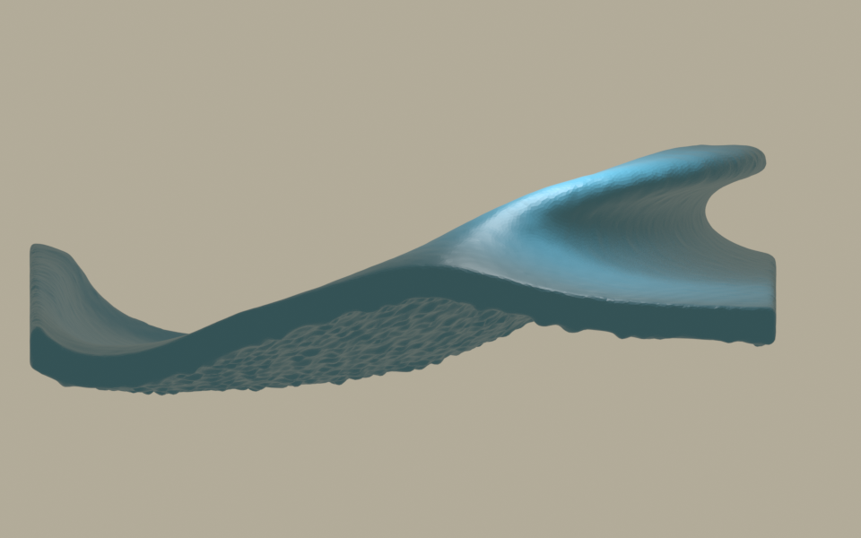
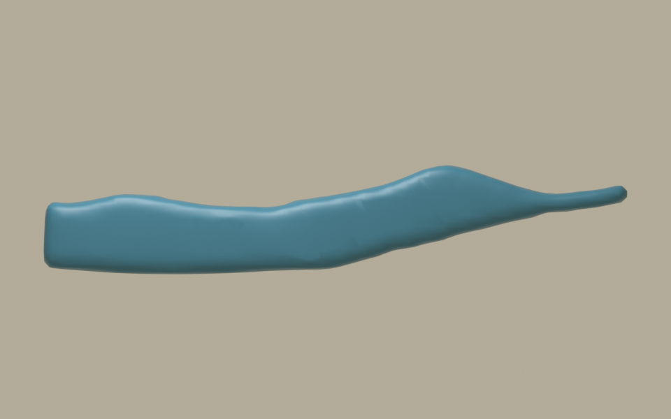
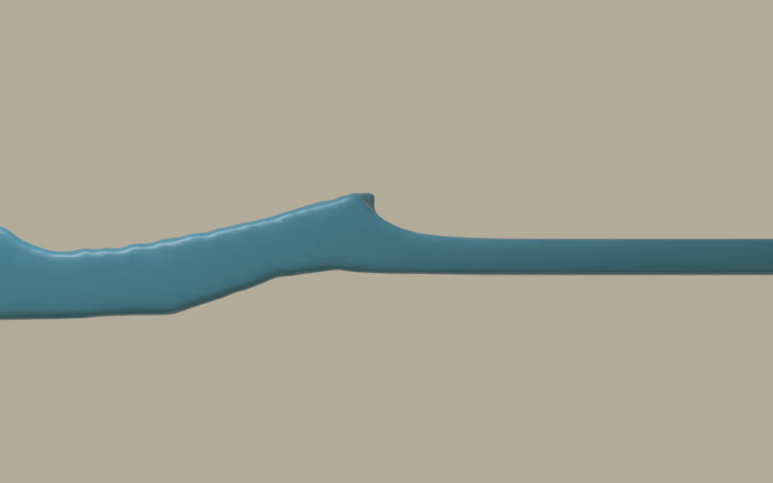

# 実際のFLIP計算と旧キャッシュの比較

## 判定

**作品の目標は未達。** 参照模型の幾何変形に加えて、Houdini Indie 22.0.429で圧力と重力を解く小規模な波槽を作った。計算サーフェスのAlembicを公式Blender MCPから読み込み、形状や時間を置き換えずに表示した。

形状を見分けるため、今回は藍色の単色材質を使う。白波の発生を色付けで代用せず、浮世絵の最終材質やHMD映像が完成したとも扱わない。

## 旧キャッシュを実際に表示した比較

利用者が保持する `1.abc` の第1～55フレームを、24 fpsのままBlender MCPで直接表示した。固定頂点に作り直した旧プレビューの流用ではない。動画は55フレーム、約2.29秒であり、最終姿勢を長く保持する加工もしていない。

[旧キャッシュの直接表示動画](../../../../Houdini/wave_tank/previews/旧キャッシュ_側面.mp4)

この姿勢には、厚い唇と明瞭なC形の開口がある。新しくFLIPを動かせただけでは、この形の水準を越えたことにならない。ただし、このABCと保存されていた旧HIPの生成履歴の対応は未確認であり、画像だけから自然な流体運動とも判定しない。

## 試作01：波の前進はあるが、巻込みは未確認

- 12m×3mの波槽、静水深1.4m、初期波高差0.7m、粒子間隔0.15m。
- 72フレーム、24 fps。全11,560粒子のIDを維持した。
- 第1、24、36、48、60、72フレームの側面と、第36フレームの斜め方向を実際に表示した。
- 低い波包の前進は見えるが、下に開口を残して前へ巻く水舌は、この確認画像では見られなかった。
- 下流端の近くで波が高くなる。第37フレームから壁に近い領域の水位上昇を検出しており、後半の高い姿勢を、自由な大波の形成に成功した証拠として使わない。

[試作01の固定側面動画](../../../../Houdini/wave_tank/previews/試作01_側面.mp4)

独立したBlender読込みでも7時刻の表面は閉じており、辺の向きの不整合は見つからなかった。表示メッシュの囲む体積は45.3486から46.1885 m³へ約1.85%増加した。これは厳密なFLIP質量誤差ではなく、自己交差も未検査である。

## 試作02：浅い水平床へ進む波包

- 波槽を24m×3mに延ばし、X=0～2mで床を0.8m上げ、その先を水平にした。静水深1.4m、初期水面増分1.0m、粒子間隔0.10m。
- 72フレーム、24 fps。全79,920粒子のIDを維持した。第1・24・48・72フレームのAlembic再読込みは、元の表面頂点と座標が一致した。
- 第1・24・36・48・60・72フレームの固定側面と、第36フレームの斜め方向を確認した。峰の前方に短い突出はあるが、参照模型や旧キャッシュのような大きいC形開口と、厚い水舌の巻下げは確認できない。後半は低く長い波として棚の上を進む。
- 高い水面が下流壁の近くへ来る条件は、今回の72フレームでは検出されなかった。この条件が不成立であることは、反射の影響が一切ない証明ではない。

[全槽の固定側面動画](../../../../Houdini/wave_tank/previews/試作02_側面.mp4) ｜ [波頭付近の固定拡大動画](../../../../Houdini/wave_tank/previews/試作02_側面拡大.mp4) ｜ [固定斜視動画](../../../../Houdini/wave_tank/previews/試作02_斜視.mp4)

**第2試行も造形の目標を満たさない。** 圧力が作用する流体計算を実行できたことを、参考作品と同等の巻浪の完成と取り違えない。独立した読込み検査は[表示検証02](../../../../Houdini/wave_tank/表示検証_02.json)に記録する。

## 表示と比較の条件

`src/gwave/fluid_preview.py` を公式Blender MCPの `execute_blender_code` から実行した。映像は実際のAlembicの全フレームを順に表示し、時間の引き延ばし、最終姿勢の保持、別の形状への差替えを行っていない。新しい動画は各72フレーム・24 fps・再生長3秒で、保存された最初から最後の姿勢の時間差は71/24秒である。旧キャッシュは55フレーム・約2.29秒のため、同じ長さの運動として比較しない。

BlenderではZを鉛直とし、Houdiniからの標準Alembic読込みによる軸変換を使った。試作02の全槽カメラは `(0,-25,1.4)` から `(0,0,1.4)` を向く水平の平行投影で、表示幅26m。拡大カメラは `(4,-25,1.4)` から `(4,0,1.4)`、表示幅15m。固定斜視は `(18,-22,13)` から `(3,0,1.2)`、表示幅23m。拡大映像の左右には槽の端が入らない。旧キャッシュの側面カメラは少し下を向くため、画面上の寸法を新試作と直接同じ縮尺で測らない。

初期条件、圧力が働かない構成を除外した対照、採用した衝突形状、計算場とキャッシュの説明は[波槽の記録](../../../../Houdini/wave_tank/README.md)にまとめる。粒子数が一定であることと、正確な体積保存・水圧・砕波を実証したことを混同しない。

## 次に判定する内容

[参考映像からの動きの判定表](2026-09-24_motion_targets.md)に従い、同じ波の形成、前伸し、巻下げ、前方水面との接触、接触後の変形を追う。展示映像では隠れていた段階も、計算の固定視点で示す。白波はこの主流体の表面・速度場から別計算し、必要な美術的な爪形状の制御範囲を記録する。
