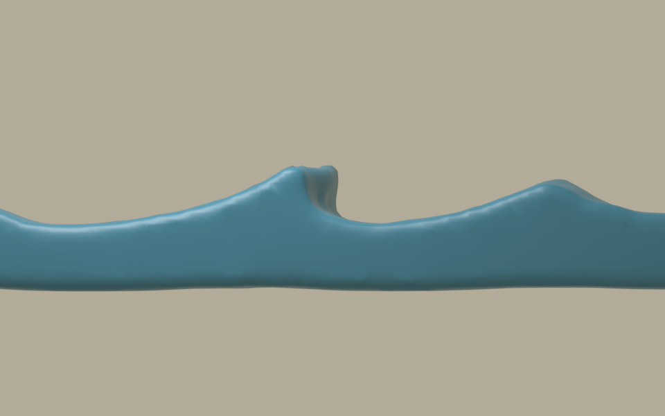
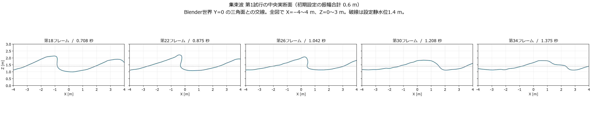

# 方向を持つ波群の集束：第1条件

## 提出物と判定

[固定側面の動画](../../../../Houdini/focused_packet/previews/集束波_側面.mp4) ｜ [固定斜視の動画](../../../../Houdini/focused_packet/previews/集束波_斜視.mp4)

各72フレーム、24 fps、再生長3秒。公式Blender MCPからHoudiniの実際のAlembicを読み、形状と時刻を変更せず表示した。藍色の単色材質であり、白波や浮世絵の最終材質は付けていない。

**作品の目標は未達。** 第24フレーム付近では前面が急になり、短い突出が見える。第36フレームではその前面が低く広がる。斜視では幅方向に湾曲した波冠が見えるが、参照模型のような高い局所峰、深いC形開口、長く厚い水舌の組合せは確認できない。旧Houdiniキャッシュの最終姿勢を越えた造形と評価しない。

観察した静止画は第1・12・24・36・48・60・72フレームの側面と、第24・36フレームの斜視。側面投影で肩が中央を隠す可能性があるため、[中央の実断面](../../../../Houdini/focused_packet/previews/中央断面.png)でも確認する。メッシュと動画の検査は[表示検証](../../../../Houdini/focused_packet/表示検証.json)に記録する。

中央断面の第18・22・26フレームには局所的な折返しがある。同じX位置の鉛直線が、槽底より上の表面と3回交わる部分を確認した。水平の折返し幅はそれぞれ約0.022m、0.109m、0.052mで、粒子間隔0.12mと同程度以下である。開口や巻込みが全くないという判定はしない。

ただし、参照のように大きく前へ張り出した水舌と深い開口にはならず、第30・34フレームでは低く広がる。側面で見えない大きい巻口が肩の奥に隠れている、という説明では今回の未達を解消できない。この観察は保存した表面メッシュについての結果であり、小さい折返しを物理的に十分な解像度で計算できた証明にはならない。

独立したBlender読込みで調べた7時刻は頂点が有限で、辺の閉鎖性と隣接面の向きに問題は見つからなかった。一方、第48フレームには極小または退化した三角形が2枚ある。表示表面の体積は初期比で最大約+1.240%、最終時刻で約+0.716%変化した。自己交差や厳密な流体質量は、この検査では確認していない。2本の動画は全72フレームを復号し、時刻の連続性と3秒の再生長を確認した。

## 変更した条件

前の2条件の深さ平均の初期速度から、有限水深の線形波の速度分布を持つ21成分の波群へ変更した。長さ24m、幅6m、水深1.4m、平底、粒子間隔0.12m。方向は−15°・0°・+15°で、名義の合計振幅は0.6m、線形設計での集中時刻は1.5秒である。初期状態を一度だけ設定した後はFLIPで自由発展させる。

全112,370粒子のIDを72フレームにわたって保持した。粒子数が一定であることは、厳密な水量保存や物理的収束の証拠にはならない。設定、速度式、初期場の解析検査と計測結果は[Houdini側の記録](../../../../Houdini/focused_packet/README.md)を参照する。

**線形設計の時間発展と実水面で必要な運動には差がある。** 線形設計でも開始時に水面増分の最大が約0.568mあり、名義の集中振幅0.6mの約95%に達している。低い海面から強く集中して育ったという説明は、この条件に合わない。実際に上下した初期水面へ線形設計の時間微分を当てはめると、非線形の運動学条件との残差がある。この解析残差は設計した線形の時間発展との差を表し、その後のFLIPが運動学条件を破ったという実測値ではない。初期調整の影響は、FLIPの変化からまだ分離していない。計算が正常に進んだことを、大振幅で厳密に設計した入射波の実証とは扱わない。

## 再表示するカメラ

BlenderのZを上とする。全槽側面は位置 `(0,-25,1.4)`、注視点 `(0,0,1.4)`、平行投影の表示幅26m。静止画の側面拡大は同じ位置と注視点で表示幅12m。斜視は位置 `(12,-18,12)`、注視点 `(0,0,1)`、表示幅19m。カメラは固定し、3秒の動画中に波を追いかけていない。

## 次の条件を選ぶ理由

まず、解析的な初期場の段階で、開始時の最大水面増分と実水面での不整合を抑える周波数帯・開始時刻を調べる。形態を確認する前に解像度と白波量を増やさない。幅方向の集中、初期調整、底の影響はそれぞれ別の仮説として条件を一つずつ変える。

参照OBJから既に巻いた初期水体を作る場合は、造形に基づく初期値問題として別に表示する。その落下だけを、低い海面からの自然な形成に成功した証拠にはしない。Unityの実時間再生、HMD、船の操作は今回の試験対象に含めていない。
