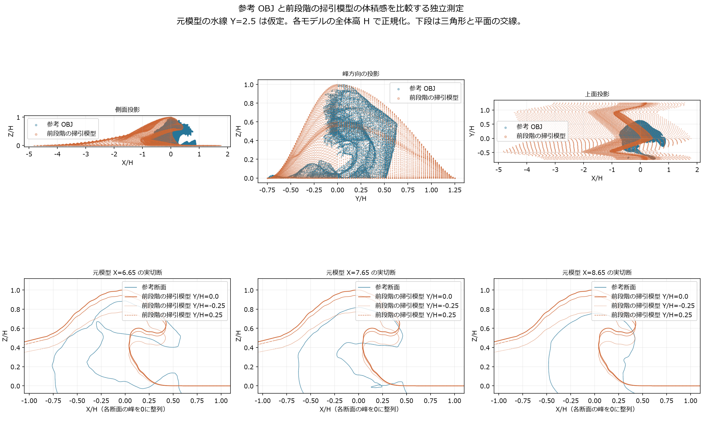

# 参照模型を底稿にした可変形の大波

## 判定と出典

**目標は未達である。** 今回の水体と爪の基礎造形は、利用者提供の `wave_repair_zbrush2.obj` から派生している。この形を新規に自作したとは扱わない。元模型の作者・配布条件は本記録では確認していない。原 OBJ は変更せず、リポジトリには比較用に簡略化・彩色・アニメーション化した派生ファイルを保存する。

これは Blender 上の造形・運動の試作であり、Houdini の流体シミュレーション、Unity の実行、HMD の性能が完成したという記録ではない。

参照OBJのSHA256は `ab4124f9720d6e27d80e2ae063916292898c87606a64441043f6a64de3d53d40`、サイズは78,990,821バイト。波の高さ11mと周辺海面の水準は表示比較のための仮定であり、原画や参照模型から実測した物理量ではない。

## 二次元断面の掃引から変更した理由

前段階の `localized_wave_animated.blend` と元 OBJ の実切断を比較した。参考の上方向は元 Y、進行方向は元 Z である。Blender へは `(X,Y,Z)=(元Z,元X,元Y)` の回転で移し、鏡映を行わない。

| 指標 | 前段階の主波 | 参照模型 |
| --- | ---: | ---: |
| 高さで正規化した前後の長さ | 6.648 | 1.619 |
| 高さで正規化した峰方向の幅 | 1.999 | 1.375 |
| 高峰からの唇の伸出し | 0.428H | 0.557～0.652H |
| 伸出し80%位置の上下の鉛直間隔 | 0.210H | 0.272～0.466H |

参考の水線は元Y=2.5という作業上の仮定で、実測水位ではない。唇の三断面は対応付けの自動最適化ではなく、C形状を持つ実断面の特徴比較である。鉛直間隔を表面法線方向の厚みや物理的な水量とは解釈しない。

この結果から、前のモデルに幅だけを足しても、長い裾と短く薄い唇を解消できないと判断した。`volumetric_sweep.py` による背面の膨らみと肩の回転も灰模で比較したが、今回の表示用模型には採用していない。



## 制作内容

- 公式 Blender MCP の `execute_blender_code` を通じ、元 OBJ の取込み、簡略化、材質の作成、アニメーションの格納、静止画と動画のレンダリングを実施した。
- 元模型の1,131,888頂点を62,210頂点、124,511三角形へ簡略化した。簡略化前後は灰模と斜め・正面・船上相当の視点で比較した。全表面の幾何誤差の上限は未測定。
- 後半の非線形変形で方向が乱れる細長い2面と隣接6面を局所細分し、最終的には62,216頂点、124,523三角形とした。共有辺の中点を共用するため、追加のT字接続を作らない。指定した8時刻で変更部分20面の向きを確認した。全非隣接面の衝突を検査したという意味ではない。
- 上方包絡面からの距離で白波領域を指定し、水体と白波を別メッシュへ分離した。元模型は連結成分が一つのため、離れた部品の分離だけで白波を得たわけではない。
- 色面を変形前の座標へ固定した。巻込みの弧に沿う藍色の帯、生成りの波冠、接触部分の陰影、輪郭線を組み合わせた。周辺海面を暗い輪郭線で一様に覆っていた途中の材質は修正した。
- 周辺海面は方向と大きさの異なる低い波を重ねた。水体の低い部分を同じ水位へ追従させ、接合部の色を周辺海面へ近づけた。
- 小滴は白波の位置・速度から放出する別メッシュとした。重力は与えるが、流体から物理的な放出量を求めてはいない。
- 1～450フレーム、30 fpsの比較区間を用意した。形成後も前進し、後続の低い波も動く。無縫合の循環動画ではない。
- 単純な前傾と圧縮では模型全体が沈むように見えたため、前側の上部に限定した回転速度場を小刻みに積分する方法へ変更した。240～320フレームでは主に唇が下へ巻き、310～405フレームで後背も低波へ移行する。これは美術的な局所変形で、流体圧力を解いた処理ではない。
- 斜めの比較動画は大波と同速で前進する追跡視点である。船上の高さを想定する別カメラは固定した。追跡動画を固定した船からの体験映像とは扱わない。

## 残る課題

- 白波には硬い切断面や三角形状の下垂が残る。原画の細かな回鉤の輪郭と配色は一致していない。
- 水体と海面の接合、色帯の間隔、背景の波模様に機械的な見え方が残る。
- 前進と下降を加えても、静的な模型の変形を流体の砕波と同一視できない。水舌の離脱、実際の着水衝突、砕けて広がる白波、次の高波との接続は引き続き必要である。
- 元模型にも境界辺と非多様体辺がある。自己交差の完全な除去と物理的な体積保存は未検証。
- 参考展示と同等の動き、原画全体の構図、船とHMD体験、Unityでの実時間性能は未達・未検証。

## 保存ファイルの独立確認

別の Blender プロセスで保存した巻き下げ版を開き、活動シーン、4メッシュ、4カメラ、光源1つを確認した。外部画像、点キャッシュ、リンクライブラリーへの依存はなかった。ファイルの SHA256 は `3893d577304d3fc433d596f3bcdcacbe8840a83c07412e9d78adb4f209d44600`、サイズは53,379,277バイト。

| メッシュ | 頂点数 | 絶対シェイプキー |
| --- | ---: | ---: |
| 主波 | 35,858 | 81 |
| 白波 | 27,195 | 81 |
| 周辺海面 | 29,141 | 51 |
| 小滴 | 2,520 | 151 |

水体と白波を分離した837組の共有境界は、第1、150、210、300、390、449、450フレームで評価済み座標が完全に一致した。第449から450フレームも主波・白波・周辺海面は変化した。小滴の放出は終わっているため、この最後の区間では静止している。

追跡カメラは位置の線形キーフレームを持ち、第1から450フレームにX方向へ約26.34m移動する。ほかの3カメラには位置やデータのアニメーション、親、制約がなく、比較した各フレームでワールド変換が同一だった。これは撮影条件の確認であり、HMDの動作検証ではない。

追跡・固定の両MP4を全フレーム復号し、各450フレーム、30 fps、15.0秒、960×600、H.264で、時刻情報が単調に増えることを確認した。各9姿勢を実際に確認し、第270～330フレームの前側の巻き下げと、空白のない末尾を確認した。動画ファイルの完全性と時刻情報の連続性を、目標映像と同等の品質という判定へ拡張しない。

## 再生成

`src` を Blender Python のモジュール探索先へ追加し、`gwave.build_reference_actor` の `build` を呼ぶ。最初は利用者の参照 OBJ を `source_path` に指定する。簡略化結果は `results/reference_actor/source_reduced.npz` に保存し、原ファイルの SHA256 が一致する場合だけ再利用する。元模型を持たない環境でも、配布した `.blend` のアニメーション再生に外部 OBJ は不要である。

```python
from gwave.build_reference_actor import build, render_movie
build(source_path=r"G:\research\model\wave_repair_zbrush2.obj", step=6, motion_mode="curl")
render_movie(suffix="volume")
```

固定視点は別の実行で `render_movie("CAM_固定した全体確認", suffix="fixed")` を呼ぶ。今回のMCP経由の連続2本レンダリングでは、約180秒後に通信エラーが発生した。公式実装の受信待機上限は180秒だが、この一致だけで原因を確定しない。実際の処理は続き、再接続と完成した出力の確認を行った。長い処理を一つの通信へまとめず、動画ごとに呼ぶ。

別の白波生成案 `crest_filaments.py` は、幅のある根から先細りの爪が分岐する連結メッシュを作る実験である。今回の参照模型の派生ファイルには使用していない。幾何学的な連結の確認と、映像としての評価は区別する。

## Houdini と実時間表示へ進む前の確認

**Steam版 Houdini Indie 22.0.429 の `hython` は正常に起動し、有効な Indie ライセンスを取得した。** 実行ファイルはこのPCの `G:/SteamLibrary/steamapps/common/Houdini Indie/bin/hython.exe`。ライセンスやログイン状態を変更していない。

先に調べた Program Files 配下の20.5.278は有効なライセンスを取得できず、21.0.729は `hou` 初期化中に異常終了した。これらの失敗を、Steam版を含めた本機全体のHoudiniが使用不能という結論へ一般化しない。

21.0は外部のPython設定、ユーザーの追加パッケージ、通常のユーザー環境を外した隔離プロセスでも同じ箇所で異常終了した。Houdini自身のPython関連DLLが読まれていた。原因をCodexの環境やユーザーのプラグインに断定せず、インストール本体や当該ビルド、実行環境の追加診断を残す。

既存の `1.abc` と `wave_flip_2_bak1.hiplc`～`wave_flip_2_bak4.hiplc` は存在するが、作成時期が異なり、同じ制作履歴のソースと出力であることは未確認。

[SideFX の製品比較](https://www.sidefx.com/products/compare/)では Indie は Alembic に対応し、Apprentice はインポートのみである。今回取得した Indie ライセンスで、81点・64面の正弦変形網を24 fpsの第1～3フレームにわたりAlembicへ書き出し、載せ直した全点の座標が各フレームで元と一致することを確認した。これは形式と入出力の検証であり、FLIPによる流体計算ではない。

[Unity Alembic の対応環境](https://docs.unity3d.com/Packages/com.unity.formats.alembic@2.4/manual/index.html)はデスクトップが対象で、Quest 単体の Android 実行を同じ方法で実現できるとは扱わない。今回の小規模キャッシュもUnityとHMDではまだ検証していない。

既存の `wave_flip_2_bak4.hiplc` は手動更新で読み取り、FLIP Solver、波槽、海面スペクトル、サーフェスキャッシュを含む429ノードを確認した。原ファイルのハッシュは変わっていない。粒子間隔0.022mの既存計算は実行していない。次は小さなキャッシュのUnity読込みと、低解像度の流体計算を別々に確認する。その後、参照造形の浪高・前伸し・開口・発生時刻を目標値として、低解像度の短い波槽を調整する。[Guided Ocean Waves](https://www.sidefx.com/docs/houdini/fluid/sopoceanwaves.html) の境界流による速度・圧力の入力は候補となる。誘導を弱めた自由発展区間も残し、体積変化や速度異常を調べる。粒子を毎時刻強制的に目標模型へ戻した結果を、自然な流体運動の検証とはしない。
