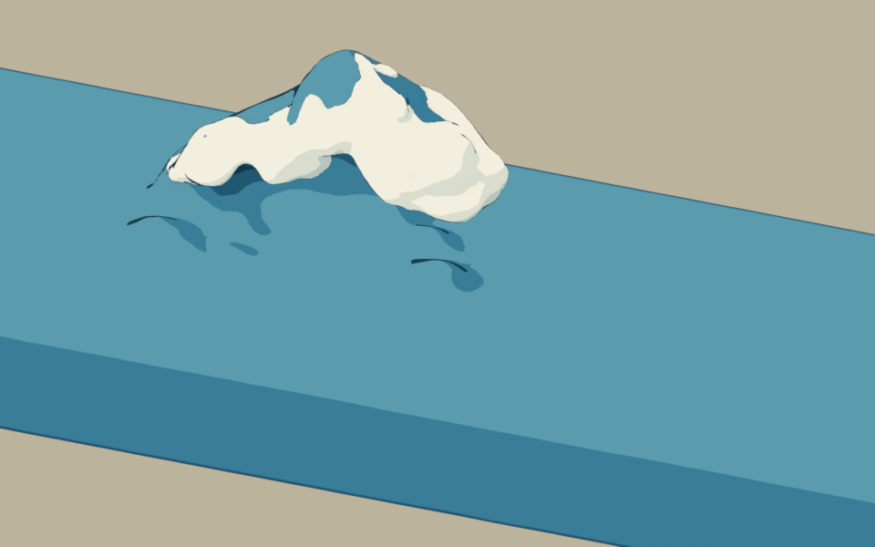
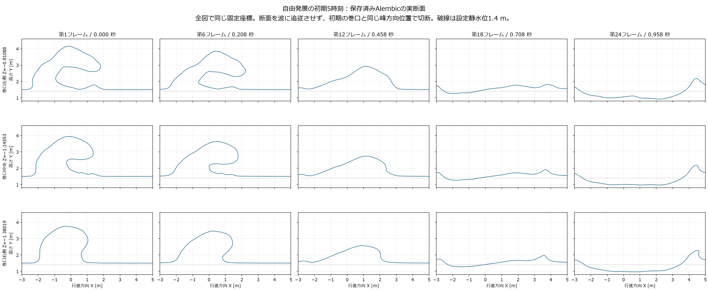

# 参照初期水体の自由発展と独立白波

## 判定

**作品の目標は未達。** 参照模型から作った大きい C 字は初期フレームでは見えるが、約 0.46 秒後には失われる。既に巻いている水体を初期値として与えた試験であり、低い海面から大波が形成される過程を計算したものではない。

## 動画

| 表示 | 斜視 | 側面 | 長さ |
| --- | --- | --- | --- |
| 実 FLIP の単色比較 | [斜視](../../../../Houdini/reference_release/previews/自由発展01_斜視.mp4) | [側面](../../../../Houdini/reference_release/previews/自由発展01_側面.mp4) | 96 フレーム、24 fps、4 秒 |
| 実 FLIP＋独立白波＋色面の試験 | [斜視](../../../../Houdini/reference_release/previews/自由発展01_白波と色面_斜視.mp4) | [側面](../../../../Houdini/reference_release/previews/自由発展01_白波と色面_側面.mp4) | 24 フレーム、24 fps、1 秒 |

両者は同じ主流体と固定カメラを使う。再生速度の変更、姿勢の保持、ループは加えない。先頭を経過 0 秒とすると、最終サンプルの時刻はそれぞれ 95/24 秒と 23/24 秒になる。

白波は実際に別の粒子として計算し、独立メッシュにした。ただし、現状は広い塊状の覆いとなり、参考の分岐する爪と飛沫には達していない。藍色の段階的な陰影も材質の試験であり、浮世絵表現の完成判定ではない。

## 実際に行った処理

1. 公式 Blender MCP の `execute_blender_code` を通じて参照造形を体積再構成し、閉じた入力 OBJ を作成した。水面下の切断は Houdini の SDF で行い、静水体と結合した。
2. Houdini Indie 22.0.429 の FLIP で 96 フレームを計算した。高さに応じた非ゼロの初期速度を一度だけ与え、その後は参照形状へ戻す外力を使っていない。
3. 実粒子から表面を作り、Alembic を出力・再読込した。主流体の第 1・24・48・96 フレームの全座標は元の表面と一致した。
4. 保存した主流体の `surface` と `vel` から、別の Whitewater Solver で第 2～24 フレームを計算した。白波の出生・移動・年齢と消失を確認し、別の Alembic を出力した。
5. Blender MCP で両キャッシュを読み、単色動画と色面・白波付き動画を出力した。形状キーによる補間や波を強制変形する処理は足していない。

参照形状は利用者提供の `wave_repair_zbrush2.obj` を底稿にしたもので、今回独自に造形した原作ではない。原 OBJ の作成者・配布条件は未確認。変換と SHA256 は [入力の由来](../../../../Houdini/reference_release/inputs/造形の由来.json) に記録した。元ファイルは変更していない。

## 形と時刻の確認

| フレーム | 経過時間 | 観察 |
| --- | --- | --- |
| 1 | 0 秒 | 大きい C 字と厚い唇が見える。初期値として与えた形状 |
| 6 | 約 0.208 秒 | C 字は残るが、初期形から下降・変形している |
| 12 | 約 0.458 秒 | 側面・斜視とも C 字が読めない。元の巻口を通る 3 断面も単峰の外形へ変わる |
| 18 | 約 0.708 秒 | 低い丘状・凹盆状に崩れ、周囲へ広がる |
| 24 | 約 0.958 秒 | 低く広がった水面。大波の持続を示さない |

第 12 フレームの変化は、カメラによる遮蔽だけでは説明できない。一方、これだけで全粒子の最初の接水時刻を決めることもできない。初期の厚い唇から選んだ 32 粒子と初期池水の距離による接水候補は第 14～18 フレームであり、別の場所の早い接触を除外しない。

初期から数値的な形状差もある。同一測線の開口は元模型より約 22～31% 狭く、唇の鉛直厚さは約 21～41% 増した。細い爪も保てていない。[初期断面の図](../../../../Houdini/reference_release/previews/初期断面.png) と [数値](../../../../Houdini/reference_release/初期形状検証.json) を参照。これらの差を無視して「主輪郭は変わらない」とは扱わない。

## 白波の範囲

第 2 フレームは空、第 3 フレームで 1,570 粒子が生まれ、第 24 フレームでは 17,395 粒子となった。`foam` と `bubble` は非ゼロだが、今回の全計算区間で `spray` は 0 だった。したがって、飛沫の状態が成立したとは主張しない。

Blender の Alembic 読込みでは先頭の空形状が最初の非空形状へ丸められた。このため第 1・2 フレームの白波は明示的に非表示にし、実際の出生より早く見せない。第 3 フレーム以降は元の時刻で表示する。詳細は [白波の計算と制限](../../../../Houdini/reference_release/whitewater/README.md) に記録した。

## 制限と次の判断

- 水面上の高さを 3 m に規定した美術指定の初期水体で、初期速度も測定された実波の速度ではない。FLIP を使うことだけで物理的正確性は保証されない。
- 第 17 フレームから側壁に近い高い水粒子があり、それ以後は壁の影響を考慮する必要がある。4 秒全体を無限の海の伝播とは扱わない。
- 粒子数と ID は全区間で保たれたが、これは体積の厳密な保存や数値収束の証明ではない。
- 同じ粒子の表面再構成だけを変え、Droplet Scale 1.0・0.8・0.6 を第 1・6・12 フレームで比較した。0.6 は初期の開口と厚みを元模型へ近づける一方、右の唇は約 0.109 m 薄くなる。第 12 フレームの C 字はどの値でも戻らず、表示半径だけで早い消失を説明できない。[感度の比較](../../../../Houdini/reference_release/表面感度.md) を参照。公開動画は元の 1.0 条件のままである。
- 形成の次案は短時間の速度誘導から解放する別条件である。解析場は NumPy で確認したが、FLIP への適用と C 字形成は未実行。現条件は非ゼロ初速度であり、設計案の初速度ゼロの A0 を実施したことにはならない。
- Unity のリアルタイム再生、HMD の性能、船の操作は今回の検証対象に達していない。

[Houdini の条件・再現手順](../../../../Houdini/reference_release/README.md)、[有限時間の制御案](../../../../Houdini/reference_release/制御と自由発展.md)、[Blender 表示コード](../../src/gwave/reference_release_preview.py) を参照する。
