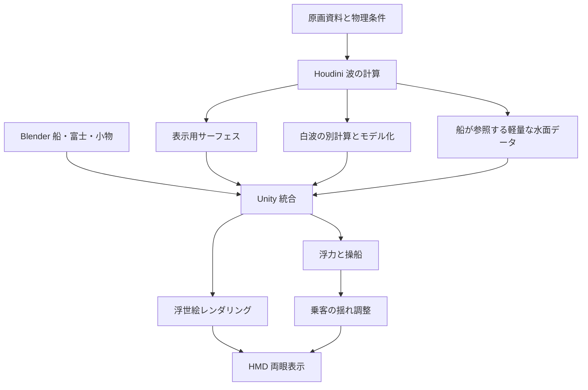

# 『神奈川沖浪裏』を体験するリアルタイムVR作品 — 制作設計書

作成日：2026-09-24

改訂履歴：

- 2026-09-24：作成。
- 2026-09-25（制作指示・美術優先）：利用者の指示により、評価の優先を美術に置き、物理は動きの「もっともらしさ」とした（§1。当初の文言を併記）。完成点で利用者の確認を待つ規則を戻し、「返答待ち停止の解除」の記述を削除した（§2、§14。11〜20の上限が当時解除されたことは§2に残す）。担当はClaude（進行役＝主会話、実装＝サブエージェント）へ移った。利用者の原文は[制作手順](../Workflow/Production_Workflow_ja.md#美術優先への切り替え2026-09-25)に引用している。
- 2026-09-25（22中止）：段階4の22を損切りで中止し（未完成・合否判定なし）、23〜25を取消とした。§4.1の物理ベンチマーク照合の追加も取消。
- 2026-09-25（新作業計画）：段階5以降（旧26〜60）と§9「途中の完成点」の表（M0〜M4）を、[美術優先の新作業計画](ArtFirst_Plan_2026-09-25_ja.md)で置き換えた。番号23〜44と完成点CP0〜CP6は新計画の意味で使う。主役波の技術経路も、新計画の経路（固定トポロジーのnumpy生成器 → keypose → Unity Built-inの無照明NPR）に替わり、§3の構成図、§5〜6のFLIP・Whitewater・Fluid VATの経路は主役波には使わない（この経路の変更は計画D2の既定値・利用者未回答に基づき、回答により変わりうる）。旧本文は削除せず、当初計画として残す。
- 2026-09-26（制作指示Q8・導師の指示）：利用者が伝えた導師の指示「まずは段階9まで早く進めてから、ブラッシュアップを進めてください」「基本的にバックログの順番に実行させて、勝手な順番を許さないようにしてください。」により、§9の段階5〜9（番号26〜50）を実行の順として再び適用する。利用者は「段階9」と「バックログの順番」がこの設計書の段階と番号を指すと選んだ（「仓库原设计书的段階和编号」）。番号26から50まで順に一つずつ、まず使える水準まで作り、精度の詰め（ブラッシュアップ）は段階9の後に行う。勝手に順番を変えない。美術優先の新作業計画はブラッシュアップの積み残しになり、その番号23〜44はコミット済みの作業の履歴として残す。例外は、利用者が走り切ると選んだCP2主線（美術優先の27修正01・26修正01・28修正01・30・31）だけ。主役波の技術経路は計画D2の既定値（利用者未回答）のまま。§9の段階5の前の注記と「途中の完成点」の注記に追記した（旧注記は残す）。HMDは利用者の手元にあるPS VR2（PCアダプターは未導入）になった。完成点の置き方、段階10・11の扱い、題名の付け方は、[段階9までの実行計画](Stage9_Plan_2026-09-26_ja.md)で提案した（下のQ9で採用）。原文は[制作手順のQ8](../Workflow/Production_Workflow_ja.md#q8導師の指示と段階9までの順番爪psvr2参照モデル2026-09-26)に引用している。
- 2026-09-26（制作指示Q9）：利用者が[段階9までの実行計画](Stage9_Plan_2026-09-26_ja.md)を採用した（「采用」）。主役波の経路（計画D2）は美術主導のrigに決まり（「用现有的美术驱动方式（推荐）」）、下の表のFLIP・Whitewaterによる作り方は使わない。完成点は段階5〜9のそれぞれの終わりに置き、題名は `設計NN：` などで設計書の番号を示す。M0で保留した08〜10のHMD実機項目は、PS VR2の導入の直後に行う（「装好就补做（推荐）」）。段階9の後のブラッシュアップも、この設計書の番号の順に行う（「按设计书编号」）。§9の段階5の前の注記と「途中の完成点」の注記に追記した。原文は[制作手順のQ9](../Workflow/Production_Workflow_ja.md#q9段階9までの実行計画の採用と順番の回答2026-09-26)に引用している。

対象：Houdiniで波・白波を制作、Blenderで船などを制作、Unityで乗船・操船・HMD表示を統合する作品。

状態：新規検証のための制作計画。実測は番号ごとの記録に分ける。HMD未所持のため、PC画面での準備を先行し、VR実機の合格は保留する。（2026-09-26、Q8：利用者の手元にPS VR2とPCアダプターがあると分かった。導入は利用者本人が行い、導入して実機で確かめるまで、VR実機の合格は保留のままとする）

制作依頼：[プロンプト原文](Original_Request_ja.md)

制作方針：旧試作を参照・比較・流用せず、公式資料と新しい検証から制作する。各番号を独立したコミットにし、完成点ごとに実画像・動画を保存して利用者の確認を待つ。詳細は [制作手順](../Workflow/Production_Workflow_ja.md) を参照する。

## 1. 目標と最初の完成形

**最初に完成させるのは「船一隻に座り、数秒の大波とモデル化した白波を、浮世絵の色・輪郭で体験できる小作品」**とする。そこから操作範囲、波の種類、体験時間を増やす。

作品を支える三つの評価を独立させる。2026-09-25の制作指示により、優先は美術、体験、物理の順とする。物理は、動きがもっともらしく見えるかを確かめる範囲に限る。

| 評価 | 何を確かめるか | 保存する証拠 |
|---|---|---|
| 美術（第一） | 大きな弧、爪状の白波、富士との余白、藍と生成りの関係が読めるか。原画視点で外輪郭・白・藍の色面・爪が原画と対応し、形成から終態まで途切れないか（バックログV2） | 原画比較、固定視点画像、形成の動画、船上の立体確認 |
| 体験 | 見回せるか、操作が分かるか、描画が安定するか、揺れを調整できるか | HMDの機種・設定、フレーム時間、試遊記録 |
| 物理（もっともらしさ） | 波の尺度・動き・船の浮き方が不自然に見えないか。理論値との精度照合は行わない（当初：「波の尺度・周期・伝播・砕波・船の浮き方が整合するか」） | 形成の動画と目視確認の記録（当初：「設定表、波高計の時系列、断面動画、解像度比較」。2026-09-25に取りやめた） |

原画一枚から実際の波高・周期・水深を一意に復元することはできない。「北斎が見た海を科学的に完全復元した」とは位置付けず、**原画の大波の形と色、その形成の動きを主役にし、物理は動きがもっともらしく見える範囲で参照する作品**として設計する（2026-09-25改訂。当初は「物理的に説明できる波を基礎に、北斎の形と色へどのように編集したかを記録する作品」としていた）。

### 現時点の仮置き

HMDと操船の自由度は未確定。設計を進めるため、まず以下を採用する。

- PC接続VR、着座、船一隻。HMD単体版は別の品質・配信経路として判断する。
- 「鑑賞する」モードを先に完成し、その後、演出範囲内で速度と進行方向を操作する。
- 導入・波の接近・砕波・余韻からなる約60〜90秒の体験を仮目標にする。これは一本の60〜90秒FLIPキャッシュを要求するものではない。
- 主役の砕波は、短い一回の出来事として作る。最初から無限ループを条件にしない。
- 物理検証時の時間倍率は1。鑑賞用スロー再生を加える場合は別モードとして表示する。

この前提はユーザーのHMD・操作範囲の決定で更新する。PCVRからHMD単体への変更は、単に画質を下げる作業とは限らない。

## 2. 新規検証の開始条件

番号01で制作物を含まない新しい開始点と出典方針を記録する。旧試作や履歴内の制作物を参照しない。以下を新しい素材と実行結果で確認する。

| 対象 | 新たに確認すること |
|---|---|
| 単位と軸 | Blenderの1m箱と非対称の目印をUnityへ渡し、寸法と方向を実測 |
| 描画方式 | インストール済みUnityと公式パッケージで最小シーンを作り、採用理由を記録 |
| HMD経路 | OpenXR設定と対象機器のprofileを確認し、機器入手後に両眼と頭部追跡を実測 |
| 浮力 | 将来の表示データと問い合わせデータを同じ座標・時刻へ合わせる |
| 白波と遮蔽 | 新しく作る形状が船や波の後ろで隠れるか、両眼で一致するか確認 |
| 性能 | 新規ビルドの条件を固定し、PC画面とHMDの測定を分ける |

現在は01〜10のPC成果を中間レビューとして提示する。M0の完成条件を変えず、HMD項目を保留する。2026-09-24の利用者の続行指示により、HMD不要の11〜20を先行する。M0の実機条件を合格へ変更せず、M1もPC中間成果として確認する。2026-09-25の最新指示（当時。代理が各番号を検査して最終作品へ継続する指示）で、11〜20の上限は解除された（当時解除）。その後、同日の美術優先の制作指示により、完成点では利用者の確認を待ち、完成点の間の番号は進行役のレビュー後に進める。HMD合格条件は維持する。
## 3. 全体構成



### 海は役割ごとに分ける

| 層 | 制作方法 | Unityでの役割 |
|---|---|---|
| 主役の巻き上がる波 | Houdiniの局所FLIP計算をサーフェス化 | 立体的な巻き込み・崩壊をキャッシュ再生 |
| 周囲のうねり | 同じ海況に基づくHoudini Oceanの変位をベイク | 固定トポロジーの海面を軽量に動かす |
| 白波の大きな塊・爪 | 波の結果から別計算し、追跡できる曲線・メッシュへ変換 | 独立したモデルとしてアニメーション |
| 小さな飛沫 | 白波の粒子から抽出し、必要な密度へ間引く | メッシュ粒子などで補助表現 |
| 船の近くの反応 | Unityの船の速度・喫水から近似生成 | 船首の泡・航跡。主役の流体へは逆作用しない |

周囲の海は新規のHoudini由来データで接続を検証する。別方式を検討するときは公式資料に基づく独立した小試験で、位相・振幅・座標の一致を新たに実証してから採用する。

### 事前計算と操船の境界

事前計算した波は、実行時に船の進路を変えても計算し直されない。したがって「自由操船」と「船が大波そのものを完全に押し返す双方向流体」は、同じ機能ではない。

| 体験方式 | 実現範囲 | 制作順 |
|---|---|---|
| 乗船鑑賞 | 波と船の大まかな経路を演出、頭は自由に動かす | 最初 |
| 範囲内の操船 | 波を観賞できる水域で前進・減速・旋回、船は水面データに反応 | 推奨する第一完成版 |
| 広い海の自由操船 | うねりの海を航行し、砕波イベントの配置と出現を管理 | 後続拡張 |
| 任意位置での完全な双方向流体 | 船が波形・流れ・崩壊をその場で変更 | 別の技術研究として再見積り |

操船版の主役波は、操作する船を含めずにベイクするのが初期案。決められた船の軌道を流体計算へ含めた場合は、その軌道から自由に外れると「実在しない位置の船が作った波・航跡」が残るため、演出用の別クリップとして扱う。

## 4. 物理と美術の基準

### 4.1 先に固定する物理条件

制作単位はメートル・秒・キログラム。Unityで1 unit = 1 mになる往復検証を行う。重力は初期条件として9.81 m/s²、水密度は採用値と理由を設定表に残す。船の大きさや波高は絵から断定せず、資料調査と試作で決める。

記録項目は波高H、代表周期T、代表波長λ、水深h、主方向、方向分散、計算領域、境界流入出、粒子間隔、タイムステップ、サブステップ、seed、立ち上げ時間、キャッシュ開始時刻とする。

最初の物理テストは「小振幅・砕けない一方向波」。線形重力波の基準として

`ω² = g k tanh(k h)`、`k = 2π/λ`、`ω = 2π/T`

から波長・周期・伝播速度の整合を確認する。これは砕波そのものの正解式ではなく、座標・時間・尺度が正しいかを確かめる入口である。[MIT Marine Hydrodynamics, Lecture 20](https://ocw.mit.edu/courses/2-20-marine-hydrodynamics-13-021-spring-2005/5d48a5937971d973fd8ca90c051a83f8_lecture20.pdf)

主役の砕波では以下を検証する。

- 低・中・高解像度の計算で、波高・砕ける時刻・位置がどれだけ変わるか。
- 静水・閉じた容器では体積の漂流、開いたタンクでは流入出を含めた収支。
- 境界で反射した波を主役の波と取り違えていないか。
- 飛沫の方向、重力落下、波頭の流れが連続しているか。
- メッシュ化・間引き・Unity再生のそれぞれで元の形をどれだけ失ったか。

解像度を上げて結果が安定することと、実際の現象へ一致することは別に評価する。砕波の物理精度を作品の主張にする場合は、同じ水深・入力波・境界条件を再現できる公開実験または検証用ベンチマークを選び、波高計・砕波位置・時刻を照合する工程を25〜29へ追加する。原画との輪郭一致を、この物理検証の代用にしない。（2026-09-25：物理を二次目標としたため、この工程の追加は取消。作品として物理精度を主張しない。）

物理の調整では、まず境界条件・入力波・水深・初期状態を変える。シルエットへの直接変形が必要な場合は、美術補正量を別パラメータにして、補正前後を両方保存する。見た目だけ波を大きくして速度を据え置く、白波だけ遅くする、といった変更は物理版へ混ぜない。

### 4.2 原画との比較

基準画像を一枚固定する。摺りや保存状態による色の違いを制作途中の色ぶれに混ぜない。例えばMet所蔵のPublic Domain画像を参照できる。富士を小さく見せる構図や青の配色は館の解説でも確認できる。[Met 所蔵作品](https://www.metmuseum.org/art/collection/search/45434)

観察項目は六つに絞る。

1. 主役の波の大きな弧と、巻き込みが作る空白。
2. 白波の爪の向き・大小・枝分かれのリズム。
3. 前景の波と奥の富士の形の呼応。
4. 船と人が波に対して小さく感じられる比率。
5. 藍・青・生成り・空の色の面積比。
6. 線と色面の整理による読みやすさ。

原画比較用の固定カメラと、船上のHMD視点を別に保存する。原画の視点をそのまま船上の目の位置にできるとは限らない。原画に近い一地点・一時刻を構図の基準にし、船上や側面からは立体として自然に読めるかを評価する。全視点で一枚の絵と同じ構図にすることは目標にしない。

## 5. Houdini → Unity の受け渡し

### 5.1 Houdini内の作業単位

一つの巨大なネットワークにまとめず、入力条件、流体、サーフェス、白波、出力を分ける。

```text
00_conditions     単位・海況・境界・seed
10_ocean_base     周囲のうねりと境界用の波
20_hero_flip      主役の局所流体計算
30_surface       表示サーフェス、法線、速度、領域端のマスク
40_whitewater    発生・移流・寿命・飛散
50_foam_shapes   爪・帯・塊のモデル化
60_queries       操船域の高さ・流速などの軽量データ
70_export        再生形式ごとの書き出し
```

最初はSOPのFLIP Configure Wave Tankなどで、小さな領域の波・境界・メッシュ出力を確認する。導入用の構成がそのまま北斎の巻き波を作るとは考えず、波の集中や地形による砕波など、選んだ発生機構を明記する。Beach Tankを使うなら地形のある条件を制作上採用したことを記録する。[SideFX Wave Tank](https://www.sidefx.com/docs/houdini/fluid/sopconfigwave.html)、[Oceanの各方式](https://www.sidefx.com/docs/houdini/fluid/oceans.html)

海全体をFLIPにする必要はない。主役領域へ計算量を集中し、外周は同じ海況から作る。接続部は、波高だけでなく位置・速度・法線が近づく帯を設計する。二枚の海面を重ねて透明度だけで隠す案は、VRで二重輪郭や深度競合が出るため合格条件にしない。

### 5.2 再生方式の採用は小試験で決める

| 方式 | 適するもの | 先に確認する制約 | 初期の役割 |
|---|---|---|---|
| Alembic | 毎フレーム形・頂点構成が変わる表面の受け渡し | 対応プラットフォーム、CPU・I/O・頂点更新負荷、時間補間 | PCで元形状との比較基準 |
| Dynamic Remeshing VAT | トポロジーが変化する流体のGPU再生 | テクスチャ容量、デコード精度、描画方式・XR対応、時間的な滑らかさ | 主役波の有力候補 |
| 固定トポロジーの変位/VAT | 巻き込まない周辺海面、形状対応を維持した白波モデル | 破断・結合を直接表せない。頂点対応を維持する必要 | 周囲の海と一部白波 |
| ボーン・モデルのインスタンス | 曲がる爪、泡の塊、制御しやすい補助形状 | 数、近接時の反復感、表面への追従 | 白波の形を読みやすくする |

Unity公式Alembicパッケージの対応ビルド対象はデスクトップ系であり、AndroidのQuest単体向け経路として採用しない。PCへ接続して使うQuestは、PCビルドの経路として別に扱う。[Unity Alembic](https://docs.unity.com/en-us/engine/6000.0/manual/packages-list/packages-all/pack-safe/com-unity-formats-alembic)

SideFXのVATには固定トポロジー用とDynamic Remeshing用がある。現在確認できるUnity用URP_VAT3は、Unity 2021.3・URP 12を基準とする設定を含む。これをもって新規プロジェクトのUnity・描画方式・HMDとの互換性を保証しない。エクスポーターとデコーダーの版を一組で固定し、必要なら別の小プロジェクトでURPを比較する。[SideFX VAT](https://www.sidefx.com/docs/houdini/nodes/out/labs--vertex_animation_textures-3.1.html)、[URP_VAT3 package.json](https://raw.githubusercontent.com/sideeffects/SideFXLabs/Development/unity/shaders/URP_VAT3/package.json)

### 5.3 最重要の時間補間テスト

HMDが90Hzで描画しても、30サンプル/秒でしか形が変わらなければ、波は段階的に見えることがある。形が毎フレーム再構成されるメッシュを、頂点番号だけで線形補間してはいけない。

Unity Alembicのメッシュ補間には頂点・インデックス数の不変という条件がある。流体VATについても、選んだ版のデコーダーがどの補間に対応するかを確認し、対応していると推測しない。[Unity Alembic import options](https://github.com/Unity-Technologies/com.unity.formats.alembic/blob/main/com.unity.formats.alembic/Documentation~/import-options-scene.md)

同じ2〜3秒の試料を、まず30/60サンプル毎秒、必要なら表示周期に近い密度で比較する。キャッシュ出力の密度と、ソルバー内部の時間刻みは別の設定であり、既存30fpsデータを単に複製しても中間形状は増えない。白波の尖端・崩壊部・頭を動かしたときの動きを見る。改善に必要な容量が予算を超えるなら、クリップ長・領域・形状密度・一部のモデル表現を見直す。

### 5.4 共通データ仕様

各クリップと一緒に以下のメタデータを保存する。ファイルが置けることより、同じ場所・時刻を指せることが重要。

| 項目 | 内容 |
|---|---|
| 識別 | clip ID、版、元のhipファイル、Houdini/Labs/Unity/デコーダー版 |
| 空間 | 単位、上方向、前方向、左右の座標系、原点、変換行列、領域bounds |
| 時間 | 秒、開始時刻、サンプル時刻またはfps、サンプル数、最終サンプルの扱い、再生可能区間 |
| 表示面 | トポロジー種別、法線、速度、安定したマスク、デコード範囲 |
| 白波 | 安定ID、誕生時刻、寿命、位置、方向、速度、サイズ、種類 |
| 船用データ | 有効領域、グリッド原点と間隔、時刻、高さ、流速、必要に応じ法線・SDF |
| 接続 | 周辺海面との合成領域、境界条件、終了時の状態 |
| 再現 | seed、出力設定、ファイルのハッシュ、簡易プレビュー |

再生時は一つの秒単位の時計から、水面・白波・船用データ・演出を進める。物理更新では物理時刻、描画では描画時刻を同じ時間軸上で評価する。停止・再開・途中再生で別々のタイマーがずれないようにする。

最初の実験は一回再生。ループ化は、表面・速度・白波の年齢・発生イベント・船用データまで始終端がつながることを証明してから行う。再生設定のLoopチェックだけではつながらない。

## 6. 白波を「別計算のアニメーションモデル」にする

白波は完全に独立した手付け物ではなく、波の結果を原因にして別計算する。

1. 流体から波頭・曲率・加速度など、使用ソルバーが提供する発生指標を得る。
2. 発生粒子を流速場で移流し、海面の泡・空中の飛沫・必要なら水中の気泡に分ける。
3. 主役になる粒子群や曲線へIDを与え、フレームをまたいで追跡する。
4. 波頭に沿う大きな白い帯、その先の爪、中小の飛沫へ階層化する。
5. 帯・爪をHoudiniでメッシュ化し、曲がり・伸び・分岐の見た目を整える。
6. 固定頂点で動かせる部分はSoft VATやボーン、分裂・結合が必要な部分はFluid VATなどを比較する。

爪は例えば「発生→伸長→先端の分かれ→落下→崩壊→消失」の順序を持たせる。速度や寿命は流体に由来する基準を保ち、先端の形・太さ・本数は美術側の調整として保存する。毎フレーム無関係に爪を配置し直すと、数が同じでも輪郭がちらつく。

巻き込み部分は同じXZ上に複数の水面があるため、高さだけで泡を貼る方式を使わない。3Dの流れ・粒子の追跡・対応する表面などを使い、裏側や空中へ移る動きも保つ。

最初は不透明な少数の白波モデルで成立させる。細粒の透明表現は後から足し、近距離の見た目と重なりの描画負荷を測る。粒子だけで輪郭を作ろうとせず、大きな白い形をモデルで設計することが作品の特徴になる。

## 7. Blender、船、HMDの設計

### 7.1 静的モデルの制作

船は最初から精密化せず、箱と船縁で寸法・目の高さを確認する。押送船などの船型・構造を採用する場合は資料で確かめ、船長・幅・喫水を明記する。絵から推定した寸法と史料で分かった寸法は区別する。

Blenderでは船体、船縁、床、櫂・舵などの操作物、小物を役割に応じて分ける。移動しない構造物もUnityでは船全体に追従する。表示用モデル、単純な衝突形状、浮力の計算用船体を分ける。

`.blend`を制作元とし、Unityへの受け渡しは検証したFBXプリセットなどで固定する。最初に1mの箱・XYZ方向の目印・左右非対称形状を出力し、尺度、反転、法線、ピボットを確認する。軸の変換設定はBlenderとUnityの双方で重複適用しない。[Blender FBX manual](https://docs.blender.org/manual/en/5.2/files/import_export/fbx_legacy.html)

### 7.2 船が浮く仕組み

表示メッシュそのものを毎フレーム巨大なMeshColliderに変換する方法を基本にしない。Houdiniから書き出した軽量な水面・流速データを船用に参照する。

最初の操船域は、巻き込みのない一価の水面で表せる範囲に限定する。船底に複数の浮力点を置き、排水容積の近似、重心、抵抗を調整する。静水で `浮力 ≈ 水密度 × 重力 × 排水容積` と船の重さが釣り合うことを確認してから波へ進む。これは初期の準静的モデルであり、砕波の衝撃圧を再現するモデルではない。

砕ける波の内側へ船を進める場合は、高さマップだけでは不十分。3DのSDF/流速場や別の接触モデルが必要になり、跳ね上げ・転覆・水没を含む追加設計となる。第一完成版では主役波を近くに見られる観賞域とし、操船域をその外側へ設定する。

高さデータ、表示面、白波は同じ座標と時刻を使う。後から見た目の波高を増幅するなら、船用データも同じ定義に合わせるか、物理と美術の差として意図的に記録する。

### 7.3 船の物理と乗客の視点を分ける

以下は役割を示した概念構造。物理船と乗客側は兄弟のルートにし、船の回転が二重に乗客へ適用されないようにする。

```text
World
├─ BoatSimulationRoot       浮力・推進・旋回の物理結果
│  └─ BoatVisualRoot        船体の表示
├─ RiderComfortRoot        座席位置と、乗客へ伝える揺れを計算
│  └─ XR Origin
│     └─ Camera Offset
│        └─ HMD Camera     実際の頭の移動と回転
└─ WaterPlayback           水面・白波・船用データの共通時間
```

HMD Cameraのローカル姿勢は頭部追跡へ任せる。頭の動きへ平滑化、逆回転、演出用の揺れを上書きしない。UnityではXR Originを基準に追跡対象が配置される。[Unity XR Origin](https://docs.unity3d.com/ja/6000.0/Manual/xr-origin.html)

最初の乗客設定は「着座、水平維持、上下動最小」。次に弱い上下動、旋回、傾斜を一種類ずつ追加する。船体を強く傾けながら乗客を水平に保つと船縁や手元との相対位置が変わるので、座席・手の到達位置・船体へのめり込みも評価する。快適性設定は物理の正確さとは別の評価項目として残す。[Meta locomotion comfort](https://developers.meta.com/horizon/design/locomotion-comfort-usability/)

操作は前進/減速・左右旋回・停止・姿勢再調整から始める。櫂を握って漕ぐ表現は、基本操作が成立した後に追加する。原画の構図へ戻す際も、HMDの頭を勝手に回さず、経路と演出で観賞地点へ導く。

## 8. 浮世絵レンダリング

見た目は次の順で積み上げ、各段階でHMDを確認する。

1. 波と白波の形だけを、単色・不透明で表示する。
2. 藍・青・生成りを基準にした限定色を置く。
3. 明暗を少数の色面へ整理し、波の方向を読む線を加える。
4. 形状に沿った線、必要なら輪郭線を加える。
5. 紙・摺りの質感を弱く加える。
6. 必要性が確認できた部分へだけ反射・透過・飛沫の透明感を足す。

流線や色面はモデルまたは安定した座標へ結び付け、頭の移動で模様が泳がないようにする。紙の質感も細かすぎる高周波を避け、ちらつきと画面に貼り付く違和感を比較する。

輪郭線は、左右眼で同じ位置関係に見えること、近接時に異常に太くならないこと、片眼だけ欠けないことを確認する。VATで動く形状は、本体・深度・影・輪郭の各パスで同じ変形を再現し、全アニメーションのboundsを用意する。

描画方式は、新規最小シーンと公式のVAT/XR資料に基づく小試験から決定する。シェーダーは新たに作成するか正規の配布元から導入する。VRの描画モードに応じたシェーダー対応を検証する。[Unity XR graphics](https://docs.unity3d.com/6000.0/Documentation/Manual/xr-graphics.html)

富士は遠い立体モデルまたは意図した奥行きの背景として配置する。HMDの向きについて回る画像にせず、左右眼と頭の平行移動で距離感が破綻しないかを確認する。

## 9. 60の小ステップで進める制作工程

各行を一つの作業カードにする。作業を終えたら、成果物と確認結果を残す。一つの行で複数の問題が発生した場合はさらに分割し、次の工程で帳尻を合わせない。計算待ちの間は、独立する資料整理・モデル制作・ログ整理を進められる。

### 段階0：制作条件と新規開始点を固定する

| 番号 | やること | 作るもの・確認すること |
|---|---|---|
| 01 | 新しいチェックアウトの開始点と出典方針を記録する | Git保存点、制作物が空であること、新規検証の記録方法 |
| 02 | PC/GPU/VRAMとHMDの有無を調べる | PC接続VRを仮定。HMD未所持、表示周波数・実機画質は未定 |
| 03 | Unity・Houdini・Labs・Blenderの版と利用可能な出力形式を確認 | 互換性表。ライセンス種別を含む実際の書き出し可否 |
| 04 | 原画資料を一枚選び、六つの特徴を注記する | 基準画像、配色と構図の観察シート |
| 05 | 第一完成版の範囲を決める | 船一隻、着座、単発波、操作範囲、体験時間の仮仕様 |

**次へ進む条件：** 使用機器または仮の対象が明記され、今後の成功を何で判断するか説明できる。未確定項目は空欄のまま隠さず残す。

### 段階1：静止した船でHMDを成立させる

| 番号 | やること | 作るもの・確認すること |
|---|---|---|
| 06 | 新規プロジェクトに検証シーンを作る | 平面、1m箱、方位、水平線だけの軽いシーン |
| 07 | Blenderの1m箱と非対称の方向目印を輸出入する | 尺度、軸、左右反転、ピボットが一致 |
| 08 | Windows向けOpenXRの準備をする | 設定・検証結果・XR Origin。機器固有profileと実機入力はHMD入手後 |
| 09 | 箱の船と座席を配置し、静止状態で見回す | PC視点操作を先行。実寸感・目の高さ・頭部移動はHMDで再確認 |
| 10 | PCビルドを検証しHMD項目を保留する | PC起動・停止・画像・動画。HMD起動・再センタリング・性能は実機で追加 |

**次へ進む条件：** 頭の動きと両眼表示が正常で、波を入れる前の性能が記録されている。OpenXRの導入は対象プラットフォームごとに確認する。[Unity OpenXR設定](https://docs.unity3d.com/Packages/com.unity.xr.openxr@1.14/manual/project-configuration.html)

### 段階2：静止画として北斎の構図を作る

| 番号 | やること | 作るもの・確認すること |
|---|---|---|
| 11 | 単純な立体で主役の波の弧を置く | 仮の静止波。ここでは流体の正しさを合格扱いしない |
| 12 | 船と富士の大きさ・位置を調整する | 原画比較用カメラと、その設定値 |
| 13 | 白い塊を少数置いて爪のリズムを決める | 波・白波・空の大きな面積関係 |
| 14 | 船上、横、背後から確認する | 書き割り・極端な薄さ・不自然な裏面の一覧 |
| 15 | 観賞位置と操船できる範囲を仮設定する | 主役波へ近づきすぎない航行域、演出の地図 |

**次へ進む条件：** 固定視点で北斎の特徴を説明でき、船上からも立体として読める。原画構図の一致と船上体験の違いが整理されている。

### 段階3：2〜3秒のキャッシュがUnityとHMDで動くか確かめる

| 番号 | やること | 作るもの・確認すること |
|---|---|---|
| 16 | Houdiniで固定トポロジーの単純変形を作る | 短い基準クリップ。座標と時間の往復確認 |
| 17 | 分裂・結合する小さな流体試料を作る | 毎フレーム再メッシュされる実際の試料 |
| 18 | PCではAlembic、候補環境ではFluid VATを比較する | 元形状との差、再生負荷、出力・読込設定 |
| 19 | サンプル密度とHMD描画を比較する | 30/60、必要なら90等の試料。尖端の段差、両眼、深度・影 |
| 20 | 再生形式と描画方式を採用判断する | 採用組合せ、却下理由、必要な改修、容量の実測 |

**次へ進む条件：** 実行ビルドで、再メッシュ流体が正しい形と速度で見え、実機の容量・フレーム時間へ収める見通しがある。満たせない間は大規模FLIP・大量白波の計算へ進まない。

### 段階4：波の物理基準を作る

> **2026-09-25の状態：** 21は完了（条件・測定契約・解析式の検算）。22は損切りで中止（未完成・合否判定なし。[中止の記録](../Progress/Step_22_ja.md#22中止損切り2026-09-25)）。23〜25は取消。下の表と「次へ進む条件」は当初計画として残し、適用しない。

| 番号 | やること | 作るもの・確認すること |
|---|---|---|
| 21 | 単位・重力・静水面・波条件を表にする | メートル/秒、波高、周期、水深、進行方向 |
| 22 | 砕けない小振幅波を作る | 2〜3か所の波高計時系列と伝播動画 |
| 23 | 理論上の周期・波長・速度と比較する | 測定値、相対誤差、測定方法 |
| 24 | 粒子間隔と時間刻みを変えて比較する | 同条件での波高・速度・数値減衰の差 |
| 25 | 静水と境界のテストを行う | 閉領域の体積変化、開領域の流入出、反射波の確認 |

**次へ進む条件：** 数値を変えると波がどう変わるか説明できる。見た目だけで「物理的に正しい」と判断していない。

> **2026-09-25：段階5〜11（旧26〜60）は[美術優先の新作業計画](ArtFirst_Plan_2026-09-25_ja.md)で置き換えた。** 以下は当初計画として残すが、適用しない。番号23以降は新計画の番号表の意味で使い、ここに書かれた旧番号の意味は使わない。
>
> **2026-09-26（制作指示Q8・導師の指示）：段階5〜9（番号26〜50）を、実行の順として再び適用する。** 上の注記の「適用しない」と「旧番号の意味は使わない」は、段階5〜9については置き換わった。番号26から50まで順に一つずつ、まず使える水準まで作り、精度の詰め（ブラッシュアップ）は段階9の後に行う。勝手に順番を変えず、この表にない作業を途中へ差し込まない。各段階の「次へ進む条件」も使う。美術優先の新作業計画はブラッシュアップの積み残しになり、その番号23〜44はコミット済みの作業の履歴として残す。同じ数字でも意味が違うので、文書ではこの設計書の番号を「設計NN」、美術優先の番号を「美術優先NN」と書き分ける。例外は、利用者が走り切ると選んだCP2主線（美術優先の27修正01・26修正01・28修正01・30・31）だけで、その成果は対応する設計の番号に数える。下の表のFLIP・Whitewaterによる作り方は使わない。計画D2はQ9（2026-09-26）で美術主導のrigに決まり、numpy生成器 → keypose → 無照明NPRの経路で、各番号の「作るもの・確認すること」を満たす（28の入力条件の比較、31のWhitewater、35の物理版の読み替えは[段階9までの実行計画](Stage9_Plan_2026-09-26_ja.md)の第2節）。段階10・11（番号51〜60）は、同じ計画で、ブラッシュアップの後、納品の前に最小（51・55・58・60）だけを入れる（D28、既定値・利用者未回答）。08〜10のHMD実機項目は、PS VR2の導入の直後に行う（Q9）。原文と決定は[制作手順のQ8](../Workflow/Production_Workflow_ja.md#q8導師の指示と段階9までの順番爪psvr2参照モデル2026-09-26)にある。

### 段階5：主役の砕ける波を作る

| 番号 | やること | 作るもの・確認すること |
|---|---|---|
| 26 | 砕波の発生条件を選ぶ | 集中波群・海底地形など、採用条件と理由 |
| 27 | 低解像度で単発砕波を計算する | 立ち上げ区間を除いた数秒の巻き込みと崩壊 |
| 28 | 原画の弧へ近づける調整を比較する | 入力条件の変更と、美術的な誘導・変形を別に記録 |
| 29 | 解像度比較後、表示用サーフェスを作る | 原版と軽量版。穴、法線、薄膜、波頭の欠落を点検 |
| 30 | 周囲の海と接続しUnityへ入れる | 境界の高さ・速度・法線の連続、単発再生 |

**次へ進む条件：** 砕波の原因と美術補正が説明でき、船上から巻き込みが読める。接続部・デコード・再生終了に目立つ破綻がない。

### 段階6：別計算の白波モデルを動かす

| 番号 | やること | 作るもの・確認すること |
|---|---|---|
| 31 | 主役波から少量のWhitewaterを計算する | 発生位置、移流、空中へ出る粒子の確認 |
| 32 | 目立つ白波群を選びIDで追跡する | 同じ群が翌フレームでも継続する履歴 |
| 33 | 波頭の帯と3〜5種類程度の爪の試作を作る | シルエット、成長・曲がり・消失の一巡 |
| 34 | 帯・爪・小飛沫を別々にUnityで再生する | 水面との同期、立体感、船の後ろでの遮蔽 |
| 35 | 数量・大きさ・寿命を変えて比較する | 物理版と美術調整版、最大密度時の負荷 |

**次へ進む条件：** 白波が水面と無関係に漂わず、輪郭がフレームごとに飛ばない。爪の房が両眼で同じ位置に見える。Whitewaterの計算は流体の表面・速度などを参照する。[SideFX Whitewater Solver](https://www.sidefx.com/docs/houdini/nodes/dop/whitewatersolver.html)

### 段階7：浮世絵の色と線を整える

| 番号 | やること | 作るもの・確認すること |
|---|---|---|
| 36 | 限定色と少数の陰影段階を実装する | 色票、原画との面積・明度関係 |
| 37 | 波の流れに沿う線を加える | 水面の変形と模様の安定性 |
| 38 | 必要な輪郭線を加える | 片眼欠け、線幅、奥行き、頭の移動時のちらつき |
| 39 | 紙・摺り・小飛沫を一つずつ加える | オン/オフ比較、追加GPU時間 |
| 40 | 原画カメラと船上カメラで比較する | 色面・輪郭・余白の合格画像とHMD記録 |

**次へ進む条件：** エフェクトを説明しなくても浮世絵として読め、静止画像だけでなく動きの中でも線と色が安定する。

### 段階8：船を浮かべ、操作する

| 番号 | やること | 作るもの・確認すること |
|---|---|---|
| 41 | 仮船を資料に基づいたBlenderモデルへ置き換える | 船体・船縁・操作物、衝突形状、浮力計算用形状 |
| 42 | 静水で重量・排水容積・重心を合わせる | 喫水、静止姿勢、外力後の戻り方 |
| 43 | 船用水面データで小波へ反応させる | 表示面と船底の差、位置・時間ずれの計測 |
| 44 | 前進・減速・旋回・停止を加える | 入力から加速と抵抗が働く操船、範囲外への対応 |
| 45 | 乗客の揺れを一種類ずつ調整する | 水平維持→弱い上下動→旋回→傾斜の試遊記録 |

**次へ進む条件：** 船の浮き方が表示面と整合し、操作が理解でき、頭部追跡を上書きしない。手元や座席が船体へめり込まない。

### 段階9：体験を一本につなぐ

| 番号 | やること | 作るもの・確認すること |
|---|---|---|
| 46 | 共通時計で水面・白波・船用データを同期する | 停止・再開・初期化でずれない再生 |
| 47 | 導入→接近→砕波→余韻をつなぐ | 短い体験の絵コンテと演出イベント |
| 48 | 船首泡・航跡などの局所反応を加える | 操作した方向に反応し、主役波と矛盾しすぎない表現 |
| 49 | 波・木船・風の音を位置と出来事へ合わせる | 波の見た目との時刻・方向の整合 |
| 50 | 初めての人が入口から出口まで試す | 操作説明、停止・揺れ軽減、体験終了が分かるか |

**次へ進む条件：** 一度も開発者操作を挟まず体験できる。船が途中で止まっても演出が破綻せず、観賞位置から外れた場合の扱いが決まっている。

### 段階10：最も重い場面で最適化する

| 番号 | やること | 作るもの・確認すること |
|---|---|---|
| 51 | 波頭へ近づき最大量の白波を出して測定する | CPU/GPUフレーム時間、メモリ、再投影、読込停止 |
| 52 | 水面・白波・輪郭を個別に切って費用を測る | 何に何msかかるかの比較表 |
| 53 | メッシュ密度・白波数・描画解像度を調整する | 見た目と性能の差。品質の優先順位に沿って調整 |
| 54 | クリップの先読みと同時常駐数を調整する | 入場直後・切替・終了時の停止と最大メモリ |
| 55 | 同じ条件で連続運転する | 10〜15分以上を初期目安に、展示時間へ延長して性能低下を確認 |

**次へ進む条件：** 指定機器・指定画質で、通常時だけでなく最大負荷と切替時も予算に収まる。平均FPSだけで判断しない。

### 段階11：完成版として再現できる状態にする

| 番号 | やること | 作るもの・確認すること |
|---|---|---|
| 56 | 物理・美術・VRの評価票を分けて見直す | 未解決点、意図した美術補正、採用値の一覧 |
| 57 | 経験の異なる人に短時間ずつ試してもらう | 見たい対象、操作の迷い、揺れの感じ方を記録 |
| 58 | 品質設定と起動手順を固定する | HMD設定、対応機器、操作案内、停止・復帰方法 |
| 59 | 制作元と書き出し手順を保存する | hip、blend、設定、メタデータ、必要キャッシュの対応表 |
| 60 | 配布用ビルドを再起動後に通して確認する | 起動から終了、依存ファイル欠落、再現動画、完成版の保存点 |

**完成条件：** 同じ資料・設定から再出力でき、別の起動でも同じ作品を体験できる。検証していない機器を対応済みと記載しない。

### 途中の完成点

> **2026-09-25：この完成点表（M0〜M4）は[美術優先の新作業計画](ArtFirst_Plan_2026-09-25_ja.md)の完成点CP0〜CP6で置き換えた。** M0・M1の記録は当時のまま残す。下の表は当初計画である。
>
> **2026-09-26（制作指示Q8）：** CP0・CP1は利用者確認済み。美術優先の番号に結び付いていたCP2〜CP6は、設計書の順へ戻したので置き直す。CP2主線の後の完成点は、段階5〜9のそれぞれの終わり（M2・M3の範囲を段階ごとに分けたもの）に置き、CP2主線の成果は段階5の確認で一緒に示す（Q9で決定。[段階9までの実行計画](Stage9_Plan_2026-09-26_ja.md)の第3.1節。確認は `段階N確認：` のコミットで提示する）。M4（51〜60）に当たる段階10・11は、同じ計画の第5節で、最小（51・55・58・60）を納品の前に入れる（D28、既定値・利用者未回答）。

| 完成点 | 対応番号 | その時点で見せられるもの |
|---|---|---|
| M0 | 01〜10 | 静止した船に乗って見回せるVR。現在はPC準備を先行し、HMD試験と利用者確認まで未完了 |
| M1 | 11〜20 | 原画の構図と、短い流体のHMD再生 |
| M2 | 21〜35 | 検証した主役波と独立した白波モデル |
| M3 | 36〜50 | 浮世絵表現の中で鑑賞・操船できる短い作品 |
| M4 | 51〜60 | 実機性能と再現性を確認した展示・配布用作品 |

最初の大きな判断点はM1。ここまでの実測から本制作の波の長さ・解像度・白波数を決める。日程は計算機・習熟度・手直し量に依存するため、M1の実績から見積もる。

## 10. 性能とデータ量の管理

### フレーム時間

表示周期の目安は `1000 ÷ Hz` ミリ秒。90Hzなら約11.11ms、72Hzなら約13.89ms。これは水面一個の予算でも、片眼ごとに使える予算でもない。CPUとGPUは単純加算せず各段階の制約と待ち時間を確認し、フレーム全体として余裕を持たせる。[Unity VR frame timing](https://docs.unity3d.com/6000.0/Documentation/Manual/VRFrameTiming.html)

計測の最初に、HMD・表示周波数・片眼解像度/描画倍率・Graphics API・描画方式・実行ビルド・画質を固定する。CPU、GPUのp95/p99、最大スパイク、落ちたフレーム、再投影、メモリ、読み込み時間を記録する。

初期の管理目安として、定常部分のp95を表示周期の80%程度以内へ収めることを検討する。これは機器共通の合格保証ではない。実際のXRランタイム・計測ツール・配信条件に合わせて確定する。

### VATの容量

圧縮された出力ファイルの大きさと、実行時のGPUメモリは違う。

- RGBA Halfは1画素8バイトなので、4096×4096の1枚は128MiB。2枚で256MiB。Lookup Table、法線、色、メッシュ、別クリップは追加になる。
- 固定60,000点×180サンプル×8バイトなら、位置データだけで約82.4MiB。配置の余白などは含まない。
- Dynamic Remeshing VATは固定頂点の式だけで見積もらず、実際の出力テクスチャの寸法・形式を合計する。
- 同じ長さで30から90サンプル/秒へ増やすと、基本データ量はおおむね3倍になる。形式・余白によって実際の比率は変わる。
- 短いクリップに分けても、全クリップを同時に読み込めば常駐メモリは減らない。

VATのデータテクスチャは通常の色画像とは別に扱う。選んだ書き出し仕様に従い、sRGB、サンプリング、圧縮、mipmap、最大サイズ、メッシュ最適化を固定する。デコードに必要なUVや頂点対応を最適化で壊さない。[SideFX VAT import guide](https://raw.githubusercontent.com/sideeffects/SideFXLabs/Development/unity/shaders/URP_VAT3/VAT%20Import%20Settings%20Guide.txt)

### 重いときに下げる順番

主役の大きなシルエットと頭部追跡を優先して保つ。最初に遠景の小飛沫・不可視部分・不要な全画面処理を減らし、次に白波の数、メッシュ密度、キャッシュの常駐量を調整する。波のサンプル密度は滑らかさへの影響を見て判断する。画質設定はPCVRとHMD単体で別に用意し、それぞれ測定する。

## 11. 合否を曖昧にしないための検証票

以下の数値は制作のための**仮の開始基準**。使用機器・波の尺度・求める研究精度に応じ、試験開始時に改訂する。合格を演出都合で後から緩めた場合は、その理由を記録する。

| 試験 | 記録するもの | 仮の判断基準 |
|---|---|---|
| 単位と軸 | 1m箱の寸法、左右非対称の目印 | 寸法・方向が一致、意図しない鏡映がない |
| 小振幅波 | 波長、周期、位相速度 | 理論との相対差を記録。まず5%以内を目標に原因を調べる |
| 砕波の解像度依存 | 波高、砕波時刻・位置、輪郭 | 中→高解像度で差が縮むか。普遍的な誤差率はここで決めない |
| キャッシュ変換 | 基準時刻でHoudini/Unityの位置と断面 | 主役の形の欠落、速度・方向の反転がない |
| 海の接続 | 境界帯の高さ・法線・速度 | 船上で穴、段差、二重面が読めない。数値差も保存 |
| 浮力と表示面 | 非砕波域の船底サンプルの高さ差 | 仮に最大5cmを出発点とし、船と波の尺度から再設定 |
| 白波の連続性 | ID、発生・消滅、輪郭動画 | 同一群の瞬間移動・意図しない点滅がない |
| 両眼と遮蔽 | 両眼の近接観察、船の後ろの白波 | 片眼欠け・奥行き無視・頭に追従する貼り付きがない |
| 原画構図 | 固定カメラで六つの観察項目 | 弧・爪・富士・船・配色・線が説明できる |
| 操作と快適性 | 停止、頭部追跡、個別の試遊記録 | 即停止でき、苦痛があればその場で調整。平均点で埋めない |
| 性能 | 指定条件のCPU/GPU、スパイク、メモリ | 対象表示周期と確定したメモリ予算内、繰返しで増大しない |

### 一回分の作業記録テンプレート

```text
作業番号／日付：
今回確かめること（ひとつ）：
使用機器・ソフトとバージョン：
開始時のシーン・キャッシュID：
変更した値：
比較条件（視点・時刻・画質）：
成果物（画像・動画・計測）：
結果（合格／修正して再試験／採用しない）：
分かったこと：
次に一つだけ変えること：
```

## 12. 制作データの置き方

新規チェックアウト直下に制作元と記録を分ける。Unityは `Unity/` 自体をプロジェクトの根とする。

```text
GreatWave_2026_Fresh/
  Docs/Design/                 設計と決定理由
  Docs/Workflow/               担当・手順・確認条件
  Docs/Progress/               番号ごとの実行記録
  Docs/References/             所蔵館原画・出典・観察
  Docs/Evidence/M0/            実際のUnity出力画像・動画
  Blender/                     新規モデルの制作元と出力手順
  Houdini/                     新規流体計算の制作元
  Whitewater/                  新規白波モデルと別計算
  Unity/
    Assets/GreatWave/
      Scenes/Tests/            単位・静止船・VR等の検証
      Scenes/Experience/       後続の統合体験
      Art/                     Unityへ渡した新規素材
      Scripts/                 入力・計測・表示
    Packages/                  manifestと固定した版
    ProjectSettings/           再現可能な設定
```

大量の粒子・VDB・連番キャッシュとビルドは `Houdini/cache/`、`Unity/Builds/` など追跡外へ置き、再生成条件をGitに保存する。巨大キャッシュを通常のGitへ無条件に追加しない。必要時にGit LFSまたは別ストレージを判断する。

ユーザー指定の `G:\AI\Models` はAIモデル用であり流体キャッシュには使わない。本制作でAIモデルのダウンロードは必要ない。
## 13. 判断が必要になったときの分岐

| 問題 | 最初の対応 | 次の選択肢 |
|---|---|---|
| Fluid VATが現描画方式で動かない | 小試験でエクスポーターとデコーダーの組を確認 | URPの別試験、PCでのAlembic採用、必要部分の実装を比較 |
| 波がコマ送りに見える | 時間サンプルと対応関係を確認 | 出力密度増、短区間化、固定トポロジー部分を分離 |
| 原画の爪と物理泡が合わない | 物理側の発生・移動を保ち、モデルの形を調整 | 美術補正と物理版を保存して差を評価 |
| 船が浮いたり沈んだりして面と合わない | 座標、単位、共通時刻、表示側の増幅を確認 | サンプル密度・浮力モデルを改善 |
| HMDで疲れる | 静止船へ戻し、上下動・旋回・傾斜を個別評価 | 乗客の揺れを軽減し、鑑賞モードを標準にする |
| 操船で見せたい構図から外れる | 操船域と進行イベントを調整 | 原画鑑賞と自由航行を別モードにする |
| HMD単体へ変更する | 再生形式と容量を再確認 | 短い波、低密度白波、別品質素材を作る |
| シームレスループが成立しない | 単発の導入と終幕で作品を完成する | 別途、始終端の場・白波の連続性を設計する |

## 14. 最初の着手セット

初回は01〜10、次の続行指示で11〜20のPC準備へ進んだ。2026-09-25の美術優先の制作指示以降は、完成点ごとに利用者の確認を待って進める。新規開始点・機器・ソフト・原画・完成条件を記録した後、新規Unityシーン、Blenderとの単位・軸、OpenXR、静止船、PCビルドを検証する。

HMDがない間は、実際のPCビルド画像・動画、バージョン表、単位・軸の実測、PC動作結果、HMD保留一覧を提示する。この中間成果をM0完成としない。利用者の続行指示により、M0の実機検証を保留したまま11〜20の独立した構図・受け渡し検証を先行する。静止形状を流体の合格と呼ばず、M1のPC中間成果と未実施条件を記録する。完成点では利用者の確認を待ち、完成点の間の番号は進行役のレビュー後に進める。
