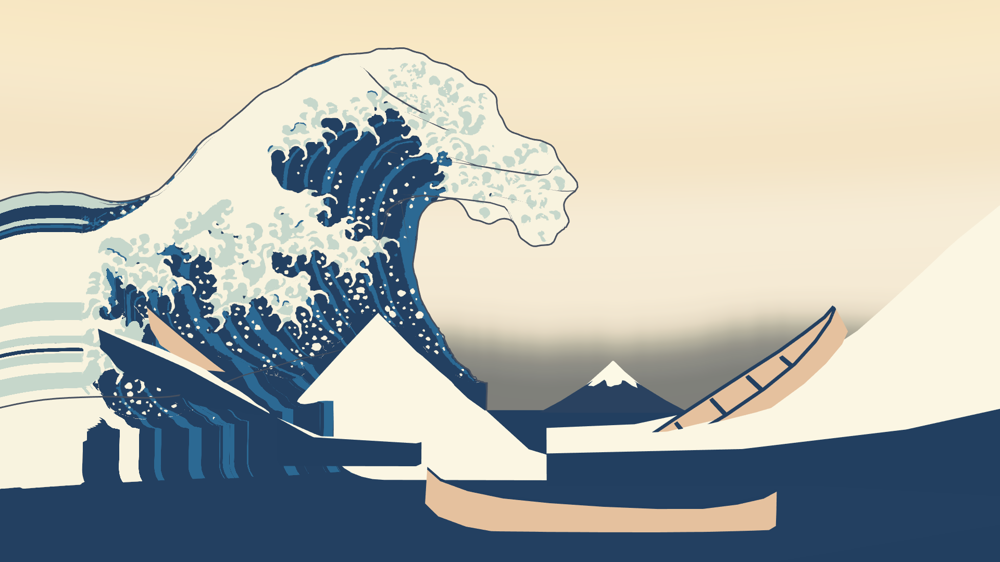
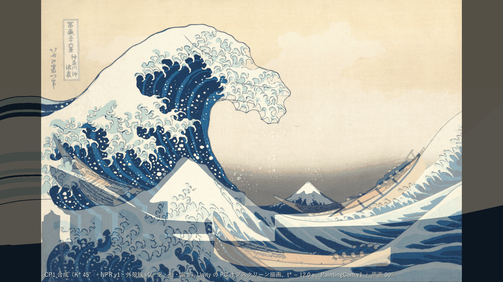
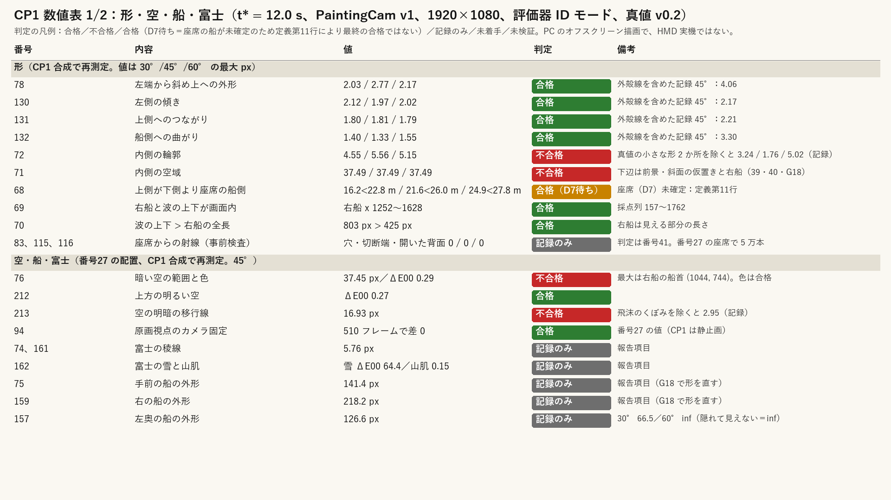
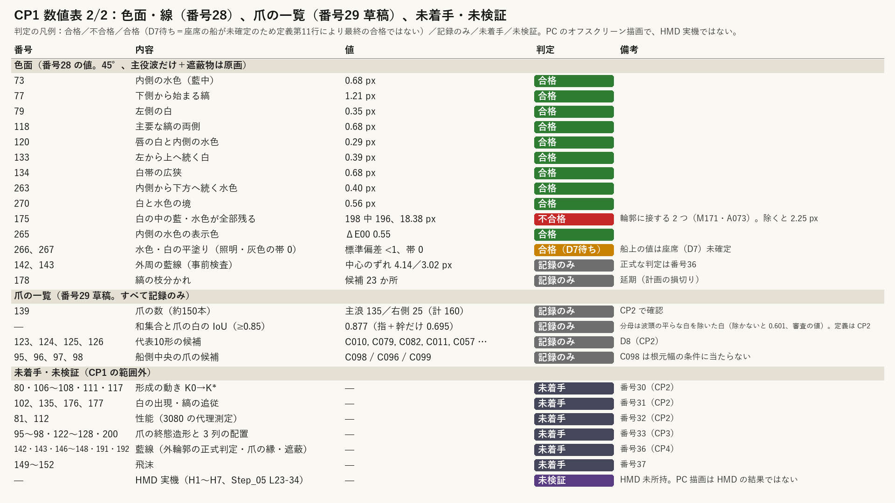
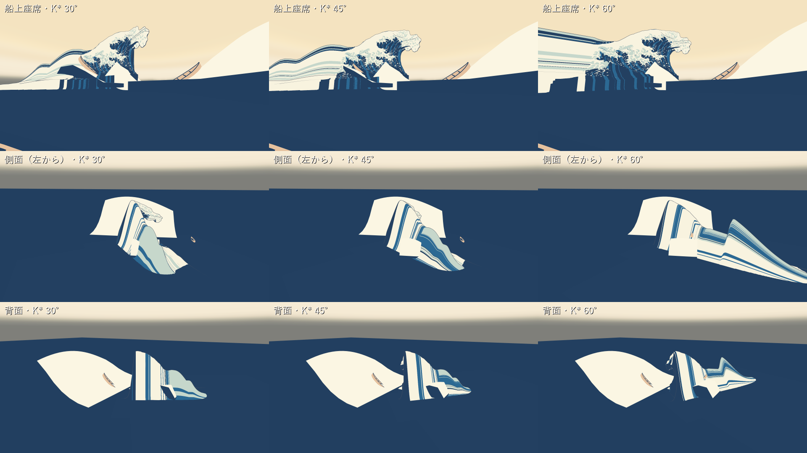
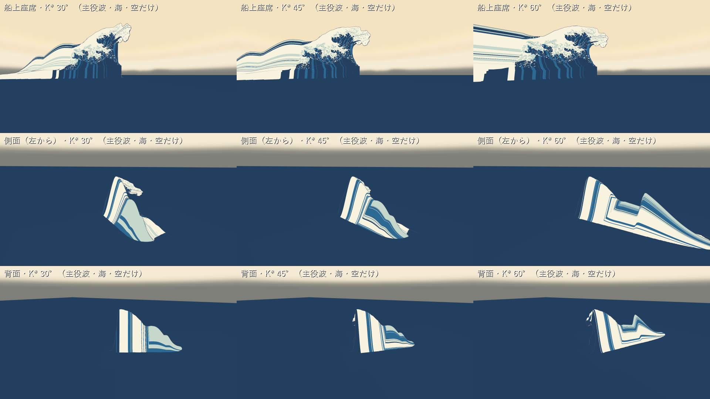
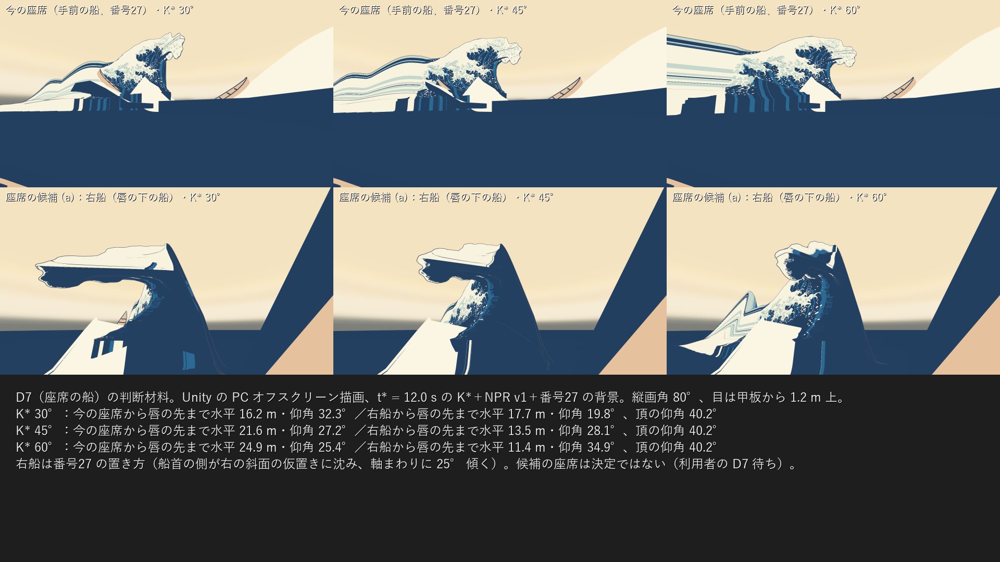
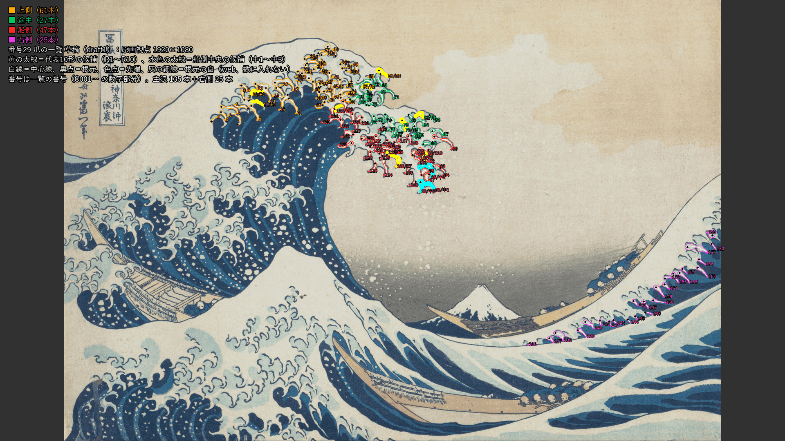

# CP1：原画視点の静止した大波（形・色・線・空・船・富士）

日付：2026-09-26／結果：番号26 の K\*（立体解釈 30°・45°・60°）に番号28 の NPR shader v1 と外殻線 v0 を付け、番号27 の空のドーム・海・3隻・富士・仮置きと一つのシーン `AF_CP1.unity` に合成した。Unity で原画視点（t\* = 12.0 s、PaintingCam v1）・船上座席・側面・背面・俯瞰を描き、原画視点を番号23 の評価器（ID モード、包絡版）で測り直した。**外輪郭 78・130・131・132（外殻線なしの ID 画像で判定。外殻線の外縁を含めた記録では 45° の 78 が 4.06 px）、69・70・212 は合格。72・71・76・213・175 は不合格。68 と 266／267 は判定値は合格だが、座席の船（D7）が決まっていないので最終の合格ではない。** 爪の一覧（番号29）は草稿で、すべて記録のみ。HMD の項目は未検証。

この CP1 で利用者に決めてほしいのは、**D6（立体解釈）、D7（座席の船）、D13（過去の「承認」表記）、D16（Houdini の下書き FLIP を行うか）** の4つである。作業計画の改訂（2026-09-26）で CP1 に加えた D18〜D20（参照モデル）も、引き続き回答待ちである（下の「利用者に決めてほしいこと」）。

- 時間の上限：0.5 日（進行役の指示）。実績は約 0.75 時間（2026-09-26 07:40 頃〜08:25 頃、同じ時計）。
- 修正回数：0（CP1 の最初の提出）。提出前に直したこと（下の「作る途中で直したこと」）は、提出した画像に対する修正ではないので数えていない。コミット前の独立レビューの指摘で、輪郭の偏差図を判定の用途ごとに 2 枚にし（空の判定用の `CP1_contour_a45_sky.png` を加えた）、証拠のスクリプトを Unity なしで回し直した（下の「確かめたこと」）。
- 対応するバックログ：番号26（68〜72、78、130〜132、事前検査 83・115・116）、番号27（76、212、213、94、報告 74・75・157・159・161・162）、番号28（73、77、79、118、120、133、134、175、263、265〜267、270、事前検査 142・143、178）、番号29（95〜98、122〜129、136〜139 の前提、記録のみ）。
- 証拠の種類：Unity 6000.4.3f1 Editor の batchmode による **PC のオフスクリーン描画**（RTX 3080、Direct3D11、Linear 色空間）と、その画像を番号23 の評価器で測った値。座席からの射線は Blender 5.2.2 ヘッドレス（番号26 のスクリプト）。**HMD 実機の結果ではない。**
- 評価器の状態：3 案とも `provisional: false`（較正門は全項目合格、門の後に真値 v0.2 は変わっていない）。真値 v0.2 と較正門の記録は番号23修正02 の版（CP1 の作業時点では未コミットの作業ツリーの状態）で、この CP1 では変えていない。CP1 は番号23修正02・26・27・28・29 に依存し、そのコミットの後に置く。
- 参照モデル（Q5、`wave_repair_zbrush2.obj`）は CP1 では開いていない。比較図は番号26 の証拠へのリンクで示す（下の「見るもの」）。

## 見るもの

| 原画視点（CP1 合成、K\* 45°、Unity、t\*） | 原画 50% 重ね |
| --- | --- |
|  |  |
| **数値表 1/2（形・空・船・富士）** | **数値表 2/2（色面・線・爪・未着手）** |
|  |  |
| **3 解釈の船上座席・側面・背面（合成のまま）** | **同じ機位で主役波・海・空だけ（確認図）** |
|  |  |
| **D7 の材料：今の座席と候補 (a) 右船** | **爪の一覧の草稿（番号29、原画視点）** |
|  |  |

- 船上座席（1920×1080）：[30°](../Evidence/ArtFirst/CP1/CP1_seat_a30.png)／[45°](../Evidence/ArtFirst/CP1/CP1_seat_a45.png)／[60°](../Evidence/ArtFirst/CP1/CP1_seat_a60.png)。座席は番号27 で置き直した手前の船（目の位置 (2.955, 1.160, −32.152)、縦画角 80°）。
- 偏差図（45°、評価器。水色が真値、緑 ≤2 px、黄 ≤4 px、赤 >4 px）は、判定に使う ID 画像ごとに 2 枚ある。
  - [輪郭の判定用](../Evidence/ArtFirst/CP1/CP1_contour_a45.png)：外殻線なしの ID 画像（番号26 と同じ条件）。78〜72・71 の輪郭と、富士・3隻（報告項目）はこの図の値で判定・記録する。この図に赤で出る `sky_dark 94.44`・`sky_transition 21.64` は、外殻線ありの色画像と外殻線なしの ID 画像を組んだ測り方の不整合による記録値で（下の「作る途中で直したこと」1）、76・213 の判定には使わない。図の上端にもそう書き込んだ。
  - [空の判定用](../Evidence/ArtFirst/CP1/CP1_contour_a45_sky.png)：色画像と同じ外殻線ありの ID 画像。76（`sky_dark` 37.45 px、印は右船の船首 (1044, 744) で `boat_mid` の文字と重なる）と 213（`sky_transition` 16.93 px）はこの図の値で判定する。この図の 78〜72 の値（78 4.06 など）は外殻線の外縁を含む記録値で、輪郭の判定には使わない。
- [俯瞰（45°）](../Evidence/ArtFirst/CP1/CP1_overview_a45.png)
- 参照モデル（Q5）との比較（番号26 の証拠、記録のみ）：[原画視点の重ね図](../Evidence/ArtFirst/26/26_ref_painting_overlay.png)／[断面の比較](../Evidence/ArtFirst/26/26_ref_sections.png)／[船上・側面・背面の並べ図](../Evidence/ArtFirst/26/26_compare_views.png)。比率の表は [Step_26](Step_26_ja.md#参照モデルq5との比較記録のみ合否には数えない)。
- 各番号の詳しい図：[26](Step_26_ja.md)（形、72 の拡大）、[27](Step_27_ja.md)（空の帯の拡大、接地、形成動画）、[28](Step_28_ja.md)（色区の境界の偏差図、拡大）、[29](Step_29_ja.md)（爪の列ごとの拡大、代表10形の候補）
- 数値：[metrics.json](../Evidence/ArtFirst/CP1/metrics.json)（`status` がバックログ項目ごとの一覧、`items` が値）、実行条件と SHA-256：[run.json](../Evidence/ArtFirst/CP1/run.json)

原画視点・船上座席・側面・背面・俯瞰は Unity の実描画（無照明の調色板の平塗り、外殻線あり）。50% 重ね・並べ図・数値表・座席の比較図は人が見るための図で、測定には使っていない。「主役波・海・空だけ」は、番号27 の船・富士・仮置きをその描画の間だけ隠した確認図で、場面の見え方ではない。爪の図は番号29 の図をそのまま複製した（SHA-256 は run.json）。

## 利用者に決めてほしいこと

### D6：立体解釈（30°／45°／60°）と、原画と船上がぶつかったときの優先

既定値（利用者未回答）は **45°・原画 4 px を優先**。

- 原画視点では 3 案はほぼ同じに見える（投影固定で輪郭を原画に貼り付けているため）。外輪郭 78・130・131・132 は 3 案とも ≤4 px。内輪郭 72 は 3 案とも超える（4.55／5.56／5.15 px）。72 の最大の所は真値の内壁の外縁にある藍線の半幅より細い2つの小さな形で、そこを除くと 30° 3.24、45° 1.76 px は 4 px 以内、60° は唇先の下で 5.02 px が残る（記録、番号26 と同じ値）。
- 違いは原画視点以外で出る（[主役波だけの並べ図](../Evidence/ArtFirst/CP1/CP1_views_waveonly.png)）：
  - 30°：唇が前へ長く張り出す（断面の張り出し 0.54H）。座席から唇の先まで水平 16.2 m。
  - 45°：中間（張り出し 0.41H、壁の厚さ 0.28H。参照モデルの中央部の範囲に入る）。座席から唇の先まで 21.6 m。
  - 60°：手前の肩が長く（頂が半分を超える区間 1.87H）、画面の左の外（c ≈ −33 m）にもう一つ高まりができる。唇が厚い。座席から唇の先まで 24.9 m。
  - どの案も、原画の空に収めるため奥の端が頂から約 5 m で終わり（背面から見ると崖）、唇は波峰線の方向に頂の前後 1〜2 m にしかない（番号26 の限界 3）。
- 左奥の船（157）の見え方も解釈で変わる：見える面積（ID 画像、表示 px²）は 30° 14,653、45° 5,489、60° 0（手前の肩に全部隠れる）。輪郭の偏差（報告項目）は 30° 66.5 px、45° 126.6 px。

### D7：座席をどの船に置くか

既定値（利用者未回答）は **(a) 座席を唇の下の船へ移す**。(b) 今の座席（手前の船）を保ち、108／109「水面が座席の上方へ延びる」は満たさない。(c) 唇を約 30 m 前へ張り出す（原画のシルエットを崩すので推奨しない）。

- [座席の比較図](../Evidence/ArtFirst/CP1/CP1_seat_candidates.png)：上段が今の座席（番号27 の手前の船）、下段が候補 (a) の右船（番号27 と同じ測り方で甲板の 1.2 m 上に置いた確認用の機位。決定ではない）。
- 今の座席から見た K\* は、座席から 16〜25 m 先、唇の先の仰角 25〜32° の「遠くの波」で、頭上を覆わない。候補 (a) の右船からは唇の先まで水平 11.4〜17.7 m、仰角 20〜35°、頂の仰角 40°。45°・60° では右船の上へ波が迫って見えるが、どの案も唇が座席の真上には来ない（唇の範囲が短いため）。108／109 を満たすには、D7 の後に番号30 で唇の形を変える必要がある。
- 関連する番号27 の保留：座席の目は M1 から 3.89 m 動いた。3隻の実寸がそろわない（8.45／14.61／9.98 m）。右船は船首の側が右の斜面の仮置きに沈み、軸まわりに 25° 傾く。
- 定義第11行「原画／船上機位は工程資料で特定する必要がある。未特定のまま合格とはしない」により、船上の視点を使う項目（68、266／267、83／115／116 の事前検査）は D7 が決まるまで最終の合格にしない。

### D13：過去の「承認」表記

前回の監査で挙げた「承認済み」表記 9 か所（c800816、4be834c、91869e6、852d461、c4d7cc4／40eabce、f55ee10、56f15ce、0611dbe、3c30afa）を一件ずつ確認または撤回してほしい。既定値（利用者未回答）は「利用者確認待ち」を維持する。結果は別の「制作指示：」コミットで記録する。

### D16：Houdini の下書き FLIP（任意項目 O1）を行うか

唇が投げ出される時機の参考動画としてだけ使う薄い FLIP（dp 0.3 m、1回の計算 ≤30 分、合計 ≤0.5 日、HIP は保存しない）。行う場合は FXHOUDINIMCP_TIMEOUT の調整への同意も要る。既定値（利用者未回答）は **行わない**。

### 引き続き回答待ち（作業計画の改訂で CP1 に加えたもの）

- D18 参照モデルの出所と利用条件、D19「参考」の範囲（既定 (a) 比率と断面だけ）、D20 参照モデルの爪・前景の小波・船・単位（既定：使わない）。
- 各番号の文書に書いた個別の判断（72 の扱い、71 の範囲、76 の範囲、213 の飛沫のくぼみ、175 の扱い、船の大きさと右船の置き方、「水色」の対応、見えない面の外挿の方針、爪の列の境目と IoU の読み方）。一覧は下の「状態」の備考と、[26](Step_26_ja.md#利用者に決めてほしいこと)・[27](Step_27_ja.md#利用者に決めてほしいこと)・[28](Step_28_ja.md#利用者に決めてほしいこと)・[29](Step_29_ja.md#未実施保留cp2で利用者に確かめること) にある。

## 状態（バックログ項目ごと）

t\* = 12.0 s、PaintingCam v1、1920×1080。「合成」は CP1 の合成を評価器で測り直した値、「26」〜「29」は各番号の値の引き継ぎ（出典の SHA-256 は metrics.json の `sources`）。値は最大（表示 px）。判定は 45°（D6 の既定値）で行い、30°／60° は記録。

| 番号 | 内容 | 値（30°／45°／60°） | 出典 | 判定 |
| --- | --- | --- | --- | --- |
| 78 | 左端から斜め上への外形 | 2.03／2.77／2.17 | 合成 | 合格 |
| 130 | 左側の傾き | 2.12／1.97／2.02 | 合成 | 合格 |
| 131 | 上側へのつながり | 1.80／1.81／1.79 | 合成 | 合格 |
| 132 | 船側への曲がり | 1.40／1.33／1.55 | 合成 | 合格 |
| 72 | 内側の輪郭 | 4.55／5.56／5.15 | 合成 | **不合格** |
| 71 | 内側の空域 | 37.49（3 案とも） | 合成 | **不合格** |
| 68 | 上側が下側より座席の船側 | 唇の先 16.2／21.6／24.9 m ＜ 内壁の下端 22.8／26.0／27.8 m | 合成 | 合格（D7 待ち） |
| 69 | 右船と波の上下が画面内 | 右船 x 1252〜1628（採点列 157〜1762）、頂 y 93.7、海 y 896.5。番号26 の不合格（M1 の置き方で右船の船尾が x 1763）から変わったのは、番号27 の置き方で右船の船尾が画面内に入り、左下の端（約 x 1113〜1250）が斜面の仮置きに沈んで見えなくなったため。投影した両端 (1115, 903)・(1600, 587) も採点列の中 | 合成 | 合格 |
| 70 | 波の上下 ＞ 右船の全長 | 803 px ＞ 425 px（右船の見える部分） | 合成 | 合格 |
| 83・115・116 | 座席からの射線（事前検査） | 穴・切断端・開いた背面 0（3 案） | 合成（Blender） | 記録のみ（判定は番号41） |
| 76 | 暗い空の範囲と色 | 37.45 px、ΔE00 0.29 | 合成 | **不合格**（色は合格） |
| 212 | 上方の明るい空 | ΔE00 0.27 | 合成 | 合格 |
| 213 | 空の明暗の移行線 | 16.93 px（飛沫のくぼみを除くと 2.95） | 合成 | **不合格** |
| 94 | 原画視点のカメラ固定 | 510 フレームで差 0 | 27 | 合格 |
| 74・161 | 富士の稜線 | 5.76 px | 合成 | 記録のみ |
| 162 | 富士の雪と山肌 | 雪 ΔE00 64.4、山肌 0.15 | 合成 | 記録のみ |
| 75 | 手前の船 | 141.4 px | 合成 | 記録のみ |
| 159 | 右の船 | 218.2 px | 合成 | 記録のみ |
| 157 | 左奥の船 | 66.5／126.6／見えない（inf） | 合成 | 記録のみ |
| 73 | 内側の水色（藍中） | 0.68 | 28 | 合格 |
| 77 | 下側から始まる縞 | 1.21（本数・順 18 対 18） | 28 | 合格 |
| 79 | 左側の白 | 0.35 | 28 | 合格 |
| 118 | 主要な縞の両側 | 0.68 | 28 | 合格 |
| 120 | 唇の白と内側の水色 | 0.29 | 28 | 合格 |
| 133 | 左から上へ続く白 | 0.39 | 28 | 合格 |
| 134 | 白帯の広狭 | 0.68（狭→広→狭が一致） | 28 | 合格 |
| 263 | 内側から下方へ続く水色 | 0.40 | 28 | 合格 |
| 270 | 白と水色の境 | 0.56 | 28 | 合格 |
| 175 | 白の中の藍・水色が全部残る | 198 中 196、18.38 px | 28 | **不合格** |
| 265 | 内側の水色の表示色 | ΔE00 0.55 | 28 | 合格 |
| 266・267 | 水色・白の平塗り | 標準偏差 <1、帯 0 | 28 | 合格（D7 待ち） |
| 142・143 | 外周の藍線（事前検査） | 中心のずれ 4.14／3.02 px | 28 | 記録のみ（判定は番号36） |
| 178 | 縞の枝分かれ | 候補 23 か所 | 28 | 記録のみ（延期） |
| 139 など | 爪の数・IoU・代表10形・船側中央の候補 | 主浪 135（右側 25）、爪の白との IoU 0.877（指＋幹 0.695。分母は波頭の平らな白を除いた白で、除かないと 0.601・0.473＝独立レビューの値） | 29 草稿 | 記録のみ（CP2 で確認） |
| 80・106〜108・111・117 | 形成の動き | — | — | 未着手（番号30） |
| 102・135・176・177 | 白の出現・縞の追従 | — | — | 未着手（番号31） |
| 81・112 | 性能 | — | — | 未着手（番号32） |
| 95〜98・122〜128・200 | 爪の終態 | — | — | 未着手（番号33） |
| 142・143（正式）・146〜148・191・192 | 藍線 | — | — | 未着手（番号36） |
| 149〜152 | 飛沫 | — | — | 未着手（番号37） |
| H1〜H7、Step_05 L23-34 | HMD 実機 | — | — | 未検証（HMD 未所持） |

- 数：合格 18、不合格 5、合格（D7 待ち）2、記録のみ 12、未着手 6、未検証 1（metrics.json の `status_counts`。行のまとめ方は数値表の画像と同じ）。
- **合格は完成を意味しない**。色面の値の多くが 1 px 未満なのは、原画視点から投影して焼いたので構造上一致するためである（作業計画 R11）。形成の途中と船上の見え方は番号30・31・41 で別に確かめる。
- 外殻線を含めた輪郭（記録）：78 4.11／4.06／3.83、130 2.24／2.17／2.17、131 2.21／2.21／2.41、132 3.50／3.30／4.70、72 6.22／3.96／6.60 px。外殻線は K\* の輪郭（原画の線の中心）から外へ線幅いっぱいに出るので、外縁が原画より約半線幅外になる。正式な線の判定は番号36。

### 不合格の中身（どれも CP1 の合成では新しく生じたものではない）

- **72**：番号26 と同じ値。原因は真値の小さな形（上の D6）。
- **71**：37.49 px（番号26 の 43.47 px から下がった）。最大は (1044, 744) の右船の船首の所。空域の下辺は番号27 の前景のうねり・斜面の仮置きと右船が作る（番号39・40・G18）。
- **76**：37.45 px（番号27 と同じ）。境界の内訳（真値→描画、45°）：右船 37.45、その他の波（水平線の波頭など）24.01、空の中の移行線 16.93、富士 5.61、主役波の内側 4.14 px。空のドームの色は合格（ΔE00 0.29）。
- **213**：16.93 px（番号27 と同じ）。飛沫の白点が暗い空の帯の上端にかかる1か所だけで、そこを除くと 2.95 px。
- **175**：番号28 と同じ。主役波の輪郭に接する小さな色区2つ（M171、A073）が残らない。原因は形（爪のない包絡の輪郭）で、色の焼き込みでは直せない。

## CP1 の合成の作り方

- **シーン**（[AFCP1Composite.cs](../../Unity/Assets/GreatWave/ArtFirst/Editor/AFCP1Composite.cs)）：空のシーンに番号27 のプレハブ `AF27_Context.prefab` をそのまま置き、番号26 の K\*（`kstar_a30／a45／a60.gwb`、`AF26KStarMesh` で読む）3 案に番号28 の `AF28_NPR.mat`（色区テクスチャ `af28_uvsdf_<key>.bin` と UV3 の表を `AF28NprWave` で付ける）と外殻線 `AF28_Outline.mat` を付けた。既定の表示は 45°。番号26・27・28 のプレハブ・マテリアル・シェーダー・テクスチャ・スクリプト・シーン 22 ファイルは読むだけで、組み立てと描画の前後で SHA-256 が一致した（`cp1_build_report.json`・`cp1_render_report.json` の `protectedUnchanged`）。
- **カメラ**：PaintingCam v1（(0, 3, −62) → (−2.5, 9.7, 4)、縦画角 26°）。船上座席は番号27 の `context_layout.json` の座席（縦画角 80°、注視点 (−7, 5, 3)）。側面は番号27 と同じ左側 (−90, 30, −14) から主役波 (−5, 8, −3) を見る（番号26・28 の右側 (53, 22, −2) は番号27 の右の斜面の仮置きの裏になる）。背面は番号26・28 と同じ (−45, 30, 60)。俯瞰は番号27 と同じ。D7 の材料の右船の機位は、番号27 と同じ測り方（船の局所 (0, 10, −2) から船の局所の下向きに甲板を測り、1.2 m 上、目 (11.274, 5.048, −1.582)）で、注視点は (−5, 12, −2)。
- **評価**（[cp1_evidence.py](../../Tools/PaintingTruth/cp1/cp1_evidence.py)）：原画視点の色画像（外殻線あり）と、3840×2160 の ID 画像 2 種（外殻線なし／外殻線あり。空＝番号27 の空のドーム、3隻はそれぞれの色、ほかは other。外殻線は番号28 の ID 表示 (255, 0, 255) で other）を作り、番号23 の評価器に通した。輪郭の項目（78〜72、71、富士、3隻）は番号26 と同じ条件の外殻線なしの ID で判定し、外殻線ありは記録にした。空の項目（76・212・213）は、色画像と同じ外殻線ありの ID で測った。68・69・70 は番号26 と同じ式で、座席は番号27 の座席、右船は番号27 の配置。76 の内訳と 213 の飛沫のくぼみを除いた値は番号27 と同じ手順。72 の小さな形を除いた値は番号26 と同じ手順。
- **座席からの射線**：番号26 の [af26_blender_qa.py](../../Tools/GWWaveGen/af26_blender_qa.py) を、番号27 の座席の目 (2.9554, 1.1602, −32.152) で実行した（番号26 は M1 の座席の目で実行していた）。K\* と海面だけを置いた 5 万本で、3 案とも穴・切断端・開いた背面は 0。
- 色面の項目（番号28）は合成で測り直していない。番号28 の評価は主役波だけを描き、主役波以外を原画の値で置き換えたもので、CP1 の合成（番号27 の仮置きが原画と違う）とは条件が違う。

## 作る途中で直したこと（提出前。修正回数には数えない）

1. **外殻線の ID**：最初は外殻線にも ID 用の平塗りマテリアルを当てたため、頂点シェーダーでの押し出しがなくなり、外殻線ありの ID 画像が外殻線なしと同じになった。その ID と外殻線ありの色画像を組み合わせたので、空の側に入った線の画素が暗い空と数えられ、76 が最大 86.6〜94.4 px、213 が 21.6 px になった（測り方の不整合）。外殻線は材質を替えずに番号28 の ID 表示で描くように直し、空の項目は外殻線ありの ID で測った。直した後の 76・213 は番号27 の値と同じ（37.45・16.93 px）。最初の値は metrics.json の `items.76.record_noline_ids` に残した。外殻線なしの ID で描いた輪郭の偏差図 `CP1_contour_a45.png` にも、この記録値（94.44・21.64 px）が赤で出るので、図に判定の用途を書き込み、空の判定用の偏差図 `CP1_contour_a45_sky.png` を別に加えた（コミット前の独立レビューの指摘）。
2. **側面・背面**：合成のままでは、左側から見る側面で番号27 の左の支えの仮置き（白い板）と前景のうねりの仮置きが主役波の手前と奥に重なり、形が読みにくかった。同じ機位で主役波・海・空だけを描く確認図を加えた。
3. **D7 の材料**：座席の候補 (a)（右船）からの図を加えた。

## 確かめたこと

- 最終の版で Unity の組み立てと描画から証拠までを同じ入力で続けて 3 回行った。2 回目と 3 回目で、Unity の描画 33 枚と証拠の画像 13 枚の SHA-256 がすべて一致した（1 回目の画像は控えを取り損ねたので比べていない）。metrics.json は 3 回とも、シーンの SHA-256 だけが違った（シーンは毎回作り直し、Unity がオブジェクトの fileID を振り直すため）。証拠のスクリプトは同じ描画に対して 2 回実行し、metrics.json まで一致した。
- 合成で測った 78〜72 は番号26 の値と小数4桁まで一致した（番号27 の物が主役波の輪郭を隠していない）。76 の輪郭・212・213・74・75・159・162 は番号27 の値と一致した。76 の色は ΔE00 0.289 → 0.285 と少し変わった（主役波が 24 v0 から K\* に替わり、暗い空の見える範囲が変わったため）。71 は 43.47 → 37.49 px、157 は番号27 の「全部隠れる（inf）」から 30°・45° で一部が見えるようになった。
- Unity の 1 回の実行は約 13 秒（描画は約 4 秒）。毎回 `Unity/Build/unity.lock` を作ってから 1 プロセスだけ動かし、終了後に消した（実行は計 8 回。上の「作る途中で直したこと」と再現の確認を含む）。
- コミット前の独立レビューの指摘で、`cp1_evidence.py` を直して、Unity は動かさずに保存済みの描画から回し直した（約 36 秒）。直したのは、偏差図を 2 枚にしたこと（`CP1_contour_a45.png` に判定の用途を書き込み、外殻線ありの ID の偏差図を `CP1_contour_a45_sky.png` として加えた）、数値表 2/2 の爪の IoU の行（分母の定義）、metrics.json の評価器の注記である。評価器の出力 6 組は生成時刻とコマンドの記録を除いて前と同じで、ほかの証拠の画像 11 枚は前と同じ bytes だった。metrics.json は、上の文言と、番号26・27 の metrics.json の SHA-256（26・27 のレビューの直しで変わった）だけが変わった。証拠の画像は 14 枚になった。

## 限界と保留

1. 原画視点の場面の下半分は、番号27 の仮置き（前景のうねり・斜面の白い角柱）と blockout の船のままで、原画と形が違う（75 141 px、159 218 px、富士の雪 ΔE00 64）。前景の波・右側の波は番号39・40、船と富士の形は G18。
2. K\* には爪がない（包絡の輪郭）。番号29 の一覧は草稿で、造形は番号33。
3. 原画で見えない面（船上・側面・背面から見える肩・胴の下部・背面）は、焼き込みの外挿で色の筋になる（番号41）。原画視点でも、原画では前景の波に隠れていた左下（x ≈ 160〜650、y ≈ 780〜920）に外挿の縦の筋が見える（藍の直接のテクセルがない行では白も延びる。番号28 の限界 2）。外殻線は原画に線のない折れ目にも出る（番号36）。
4. 座席（D7）が決まっていないので、船上の視点を使う項目は最終の合格ではない。
5. PC のオフスクリーン描画だけで、HMD・立体視の描画は確かめていない（SPI はコンパイルだけ、番号28）。
6. 前提：CP1 は番号23修正02・26・27・28・29 の作業ツリーの状態（CP1 の作業時点では未コミット）に依存し、そのコミットの後に置く。それらのファイルがこの後で変わったら、`cp1_evidence.py` を回し直す（metrics.json の `sources` と run.json に出典の SHA-256 がある）。
7. シーン `AF_CP1.unity` は実行のたびに作り直すので、SHA-256 は実行ごとに変わる（run.json の値は最後の実行のもの）。

## 再現方法と生成物

リポジトリの根で次を順に実行する（Python 3.10.6、numpy 2.2.6、OpenCV 4.12.0、Pillow 12.0.0、Unity 6000.4.3f1、Blender 5.2.2 LTS）。番号26 の K\*（`Unity/Build/ArtFirst/26/kstar/`）と番号28 の焼き込み（`Unity/Build/ArtFirst/28/bake/`）が要る。全体で約 1 分。

```
powershell -NoProfile -ExecutionPolicy Bypass -File Tools/PaintingTruth/cp1/run_cp1_unity.ps1 -Method GreatWave.ArtFirst.EditorTools.AFCP1Composite.BuildAndRender -Log build_render
blender --background --factory-startup --python-exit-code 1 --python Tools/GWWaveGen/af26_blender_qa.py -- Unity/Build/ArtFirst/26/kstar Unity/Build/ArtFirst/CP1/cp1_seat_rays_blender.json 2.9554 1.1602 -32.152 -7 5 3
py -3.10 Tools/PaintingTruth/cp1/cp1_evidence.py
```

- Git に入れるもの：`Unity/Assets/GreatWave/ArtFirst/Editor/AFCP1Composite.cs`（と .meta）、`Unity/Assets/GreatWave/Scenes/Tests/AF_CP1.unity`（と .meta）、`Tools/PaintingTruth/cp1/`（`cp1_evidence.py`、`run_cp1_unity.ps1`）、証拠 `Docs/Evidence/ArtFirst/CP1/`（図 14 枚、metrics.json、run.json、約 5.7 MB）、この文書。
- Git に入れないもの：`Unity/Build/ArtFirst/CP1/`（既存の `/Unity/Build/` の規則で対象外）。Unity の生の描画 33 枚、ID 画像、評価器の出力、座席からの射線の結果、組み立てと描画の報告、ログ。SHA-256 は run.json の `not_committed_sha256`。
- 記録した SHA-256 と Git のブロブを一致させるため、進行役が CP1 のコミットで `.gitattributes` に `/Unity/Assets/GreatWave/Scenes/Tests/AF_CP1.unity* -text` を加えた（core.autocrlf = true のため。`Tools/PaintingTruth/**`・`Docs/Evidence/ArtFirst/**`・`Unity/Assets/GreatWave/ArtFirst/**` は既存の規則の対象）。
- 旧試作の禁止場所、`G:\research\model`（参照モデルを含む）、732e198 より前の履歴には触れていない。Houdini は使っていない。番号26・27・28・29 のファイルは変えていない（番号26 の Blender スクリプトは出力先を CP1 のフォルダーにして実行しただけ）。
