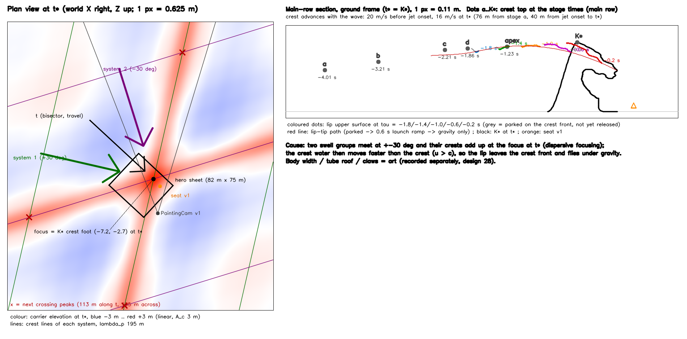
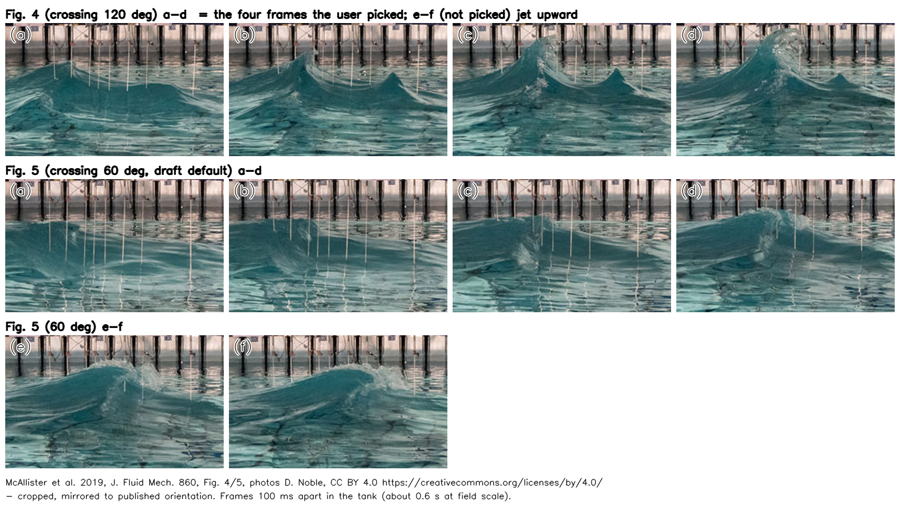
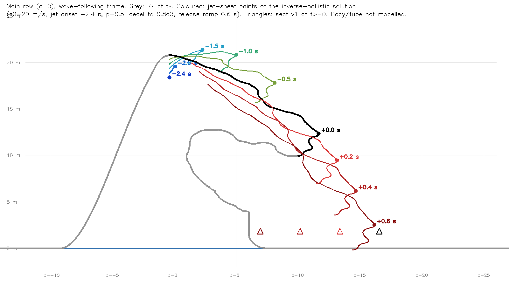
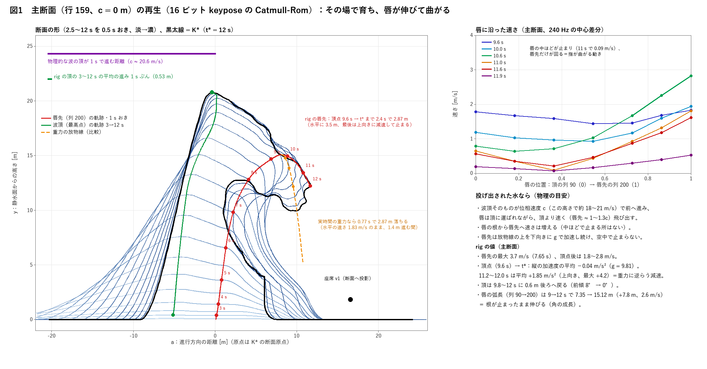

# 設計26：砕波の発生条件を選ぶ ― 大波の動きの物理の根拠

日付：2026-09-27／状態：初回提出（文書と numpy の実験のみ・Unity と HMD なし）。コミットの前に、利用者の Q11（2026-09-27）の回答を反映した。D30（噴流は既定の 60°、形成の過程は利用者の写真に従う）・D31（既定の時間曲線。代案も描いて比べる）・D37（解算は力の場で押し上げた波。単位は未回答で 1 単位 = 1 m のまま）は回答済み。作る範囲は形成から原画の瞬間 t\* までで、t\* の後の崩壊は作らない（回答の読み方は進行役の解釈。第10.1節）。D32・D33・D35 は既定値・利用者未回答、D36 は既定値・利用者未確認。写真の錐状の副峰を主役波の横に足さないことも、この記録の既定で利用者未確認（第10節）。

- 対象：[制作設計書](../Design/GreatWave_VR_Production_Design_ja.md) §9 段階5 の設計26「砕波の発生条件を選ぶ｜集中波群・海底地形など、採用条件と理由」。[段階9までの実行計画](../Design/Stage9_Plan_2026-09-26_ja.md)（以下「計画」）§2.1 の設計26 の成果物（条件と理由の一枚、rig のパラメータの区分表、原因の文と図、美術補正量の JSON）を含む。**計画の「一枚」は §0・§1・§10** で、この文書の前半に置いた。§2〜§9・§11・§12 は根拠の付録。節の番号は草稿のままにした（本文の参照が合うように）。
- きっかけ：利用者の Q10（2026-09-26、Claude Code の会話。原文と進行役の解釈は[制作手順のQ10](../Workflow/Production_Workflow_ja.md#q10大波の動きに物理の根拠を求める指示と利用者のhoudini解算2026-09-26)）。要点：美術優先30・31 の形成の動画を見て、大波の動きが「原画と参照モデルの形に無理に合わせた動き」に見える。海洋学の正しさではなく、見て納得できる物理の根拠がほしい。論文の写真 a→b→c→d の順で作るか、利用者の Houdini の解算の動きを借りる。
- 回答：利用者の Q11（2026-09-27、Claude Code の会話。原文と進行役の解釈は[制作手順のQ11](../Workflow/Production_Workflow_ja.md#q11設計26の決めごとへの回答と大波を作る範囲2026-09-27)と第10.1節）。要点（進行役の解釈）：噴流は既定の 60°（前へ＋少し上）で、形成の過程（a→b→c→d の順と見た目）は利用者の写真（論文 Fig. 4 a〜d）に従う。時間曲線は既定のとおり。解算の波は力の場で上向きの力を与えて起こした。作品の大波は形成から原画の瞬間 t\* までで、崩壊は作らない。
- D2 との関係：技術の経路（固定位相の numpy 生成器 → keypose → Unity の無照明 NPR）は D2 のまま変えない。変えるのは**動きの根拠**で、「美術主導の rig」から「物理に基づく動き＋別に記録した美術の誘導」へ置き換える。これは Q10 の進行役の解釈で、利用者の確認は第10節の D36 で求める（Q11 でも異論はなかったが、明示の確認ではないので既定値のまま）。Houdini は動かさない。利用者の解算は、測った数値だけを使う。
- 時間の上限：0.5 日（計画は 0.25 日。第9節で +0.25 日）。実績は約 3 時間（2026-09-26 23:30 頃〜09-27 02:30 頃、ファイルの時刻から。論文と解算の測定、美術優先30・31 の診断、実験 E1〜E6、草稿 2 版と独立レビューの必須修正 17 件、リポジトリへの移植と再実行を含む）。Q11 の反映（2026-09-27）は文書の修正だけで、実験は再計算していない（その時間は上の実績に含めていない）。
- 修正回数：0（最初の提出）。草稿のレビュー対応（第12節）と Q11 の反映（第12.3節）は、コミットの前の作業なので数えていない。
- 対応するバックログ：直接の項目なし（段階5 の出口条件。計画 §2.1）。
- 証拠の種類：文書、numpy の実験（K\* と美術優先30 の keypose を読むだけ）、PIL・OpenCV の図。**Unity の描画・Houdini の計算・HMD 実機の結果ではない。** 実験は成果物ではなく、既定値が実行できるかの確認である。
- 根拠資料（すべて読むだけ）：利用者の解算の測定、論文ノート、美術優先30・31 の診断（どれも本文はリポジトリ外（本機のみ）。この記録に要る数値はすべてここと [metrics.json](../Evidence/Design/26/metrics.json) に写した）、計画 §2.1・§2.6・§4.2・D2・D22・R3、設計書 §4.1、[Step_30](Step_30_ja.md)・[Step_31](Step_31_ja.md)。実験のスクリプトは [Tools/GWWaveGen/ds26/](../../Tools/GWWaveGen/ds26/)（第8節）。
- 座標と単位：m・s。K\* の断面座標（a = 進行方向 t、y = 上、c = 波峰線方向 e。主断面は c = 0）。τ は物理の時刻（t\* を 0 とする秒）、t は体験の時刻（秒、t\* = 12.0 s）。H\* = 20.80 m（K\* の主断面の頂）。

## 見るもの

| 原因の図（左：t\* の平面図、右：主断面の断面図） | 論文 Fig. 4 a〜d（120°）と Fig. 5 a〜f（60°）の並べ図（PDF の写真だけ、CC BY 4.0） |
| --- | --- |
|  |  |
| **E1：主断面の唇の膜の軌跡（波の枠。旧規則＝頂の 1 点・補間 0.6 s の解）** | **診断の図1：美術優先30 の主断面の再生（その場で育ち、唇が伸びて曲がる）** |
|  |  |

- 美術優先30 の診断の図：[図2 形成の時系列](../Evidence/Design/26/diag_f2_timeseries.png)（高さと体積、水平の位置、速さ、唇先の加速度、前面の角、白の割合）、[図3 時空間図](../Evidence/Design/26/diag_f3_spacetime.png)（波がその場で育つ）、[図4 波峰線に沿った時刻](../Evidence/Design/26/diag_f4_rowsync.png)（全行が同じ時刻に育つ）、[図5 見た目の手がかり](../Evidence/Design/26/diag_f5_visual_cues.png)（番号30・31 の証拠の静止画の切り出し）。
- 値の一覧：[ds26_conditions.json](../Evidence/Design/26/ds26_conditions.json)（物理の入力・較正・美術の誘導・数値の条件、既定値と切った値）。この JSON は初回提出の時点の値で、SHA-256 を run.json に記録したので書き換えない。`status_ja` の「利用者未回答」、`time_warp` の再開（`restart_ramp_s`）、`keypose_hz` の `breaking_and_collapse` は Q11 の前の書き方のままである。Q11 の決定（D30・D31 は既定を採用、t\* の後は作らない）は、設計27 で `Tools/GWWaveGen/ds26_conditions.json` へ写すときに入れる。数値：[metrics.json](../Evidence/Design/26/metrics.json)（E1〜E6、時間曲線の関門 P16、美術優先30 の診断の値）。metrics.json の `P16_time_warp` の `post`・`post_tstar`（唇先が座席の上を通る時刻、前面が座席に届く時刻、唇先の着水、崩壊の終わり、`tip_over_seat_height_m` 9.36 など）は t\* の後の出来事で、Q11 の後は参考の数値である（第3.2節・第5節）。実行条件と SHA-256：[run.json](../Evidence/Design/26/run.json)。
- 原因の図・E1 の図・診断の図1〜4 は numpy の値を人が見るための図で、Unity の描画ではない。診断の図5 は番号30・31 のコミット済みの Unity の静止画の切り出し。論文の並べ図は PDF から取り出した写真だけを使い、掲載の向きに左右を直し、画像の中に出典を書いた。利用者の高解像度の 4 枚と、その画素を含む画像、利用者の解算の形・断面・描画は入れていない（第7節）。

---

## 0. 結論

1. **採用する発生条件**：2 つのうねりの系を**約 60°**（二等分線を K\* の進行方向 t に取り、それぞれ ±30°）で交差させた**分散集中**。焦点は K\* の頂の下の海面（ワールド (−7.23, 0, −2.71) m）、焦点の時刻は t\*。論文（McAllister ほか 2019）が水槽で試した交差海の集中波で、60° では 2 つの峰の合流に沿って砕け、噴流は前向き（巻き）と上向きの両方を持つ（Fig. 5）。北斎の「前へ投げ出す唇」に最も近い。
   - 論文は x 方向の JONSWAP の主の波列と、Δθ 方向の一時的な波群を重ね、各系に σ = 30° の方向の広がりを付けた（§2.2、p.770〜771）。**対称・同振幅・一方向の ±30° の 2 系は我々の単純化**である。
   - 利用者が選んだ a〜d は論文の Fig. 4（120°）で、報道が「北斎に似ている」と伝えた波でもある。選択は d で止まり、その後の上向きの噴流（e・f）は含まない。a→b→c→d の**順と見た目**の手本にする。c・d の判定（ほぼ鉛直の壁 → 前へ出る噴流）の根拠は Fig. 3（0°、p.774）と利用者の解算で、Fig. 4 からは取らない。
   - **Q11 で利用者が決めた（D30）**：「浪尖使用默认60度 浪的形成过程依旧是使用我的照片」。噴流は既定の 60°（前へ＋少し上）で、形成の過程は利用者の写真に従う。進行役の解釈では、写真の見た目の順を第3.1節の判定（P15）へ次のように写す：a＝幅の広い丸い峰、b＝鋭く尖った塔、c＝塔の先に飛沫と白が出る（最初の白は唇先、それより前は白 0）、d＝頂が前へ返り始める（峰はまだ上がる）。表は §1.1。
   - 60° の物理からは、利用者の b・c にある**尖った塔と、すぐ横の錐状の副峰は出ない**。Fig. 5 の峰は長く、λ ≈ 195 m では次の交差の山は t 方向に約 113 m、横に約 195 m 先にある。尖った塔の見た目は美術の本体（K\* 系の幅と背面、`ds_body_narrow`・`ds_back_steep`）から来る（D30）。**錐状の副峰は、既定では主役波の横に足さない**（この記録の既定で、利用者未確認。60° の物理では次の交差の山が約 113 m・195 m 先にあり、近くに置くと t\* の原画視点の画面が変わる）。記録のみ：この副峰は、原画の富士の手前の小さな波（前景の波）に当たるのかもしれない。前景の波は、計画では設計30（周囲の海。仮置きの美術優先27・27修正01 をそのまま使う）とブラッシュアップの仕上げ30 の②（前景の波の置き換え）で扱う。どの番号にも新しい作業は差し込まない（設計30 でも仮置きのまま）。
2. **作り方は H（混成）**。海・平行移動・谷・唇の飛び方は物理で決め、波の本体の形は K\* 系の rig（美術）を物理の段階の時計で動かす。値は **物理の入力／較正／美術の誘導／数値の条件** の 4 つに分ける（§1.3。「較正」は、物理の範囲の中で K\* に着くように選んだ値）。美術の誘導は名前の付いた値で、切れる。値の一覧は [ds26_conditions.json](../Evidence/Design/26/ds26_conditions.json)（初回提出の時点の既定値。Q11 の決定は、設計27 で生成器の入力へ写すときに入れる）。
3. **実験の結果**（第8節）：
   - 唇（噴流の膜）の 133 行・16,468 点について、t\* に K\* へ着く重力だけの軌跡を逆算した（E1）。放出の前の点を、峰の前面に 2 cm おきに並べる新しい規則（前縁の帯）で解き直すと、評価した点の **97.5%** が自前の目安の範囲に入る（外れは手前の端の小さい行 c −29.5〜−27.3 m の上向きの速さ）。旧版の「全点を頂の 1 点に置く」規則は 100% だったが、面積 0 の三角形の帯を作っていた。
   - 放出の補間の加速度を**全 133 行**で測った。旧版（0.6 s の補間）は p95 1.97 g、最大 3.05 g で、4.6% の点が 2 g を超えていた（主断面だけなら 1.55 g。E4 の測り方による値で、E3 の表の同じ場合の 1.57 g とは点の選び方と時間の刻みが違う）。前縁の帯、行ごとの噴流の始まりの下限 1.2 s、補間の長さ min(0.6 s, 放出から t\* までの半分) にすると、地面の座標で最大 **1.57 g**（2 g を超える点 0）。
   - 本体を物理の波からそのまま作ると、K\* との差は RMS 7〜8 m、最大 16〜24 m。K\* の幅は物理の波の 0.2〜0.3 倍しかない。**幅は美術、動きは物理**と分けて扱う。
   - 美術の誘導をすべて切った版（P14）の t\* の姿の初見積もり：唇の上面は K\* から RMS 0.57 m（最大 1.55 m）に着くが、本体は足跡 61 m（K\* 20.9 m）、背面 41°（K\* 72°）。**唇の終点 K\* も美術の標的**である。
   - keypose：唇の区間を 30 Hz にすると Catmull-Rom の差 1.2 mm。容量は約 256 層、読み取り可能なテクスチャのままだと Unity の見積もりで 562 MiB（上限 512 MiB）。設計29 で対策する。Q11 で t\* の後の崩壊を作らないので、τ ≤ 0 までなら約 166 層・約 365 MiB（同じ比例の見積もり）で上限の内に入る見込み（第8節 E3。設計29 で測る）。
4. **時間**：t\* = 12.0 s は変えない。旧版の既定（8〜12 s で滑らかに止める）は、落ちている唇先の見かけの加速度が t ≈ 9.9 s から上向きになり（最大 +3.7 m/s²）、**唇が宙でブレーキをかけて留まる**。これが利用者の退けた見え方なので、既定を替えた：**t 7.9 s まで実時間 → 1 s で 0.5 倍へ（唇先が最初に頂点に着く 8.9 s で終える）→ 0.5 倍の一定のスロー → 0.4 s で止めて t\* で 2 s 保持**。保持の後（余韻へのつなぎ）は設計47 で決める（Q11 で崩壊を作らない）。スローの間、唇先はいつも下向きに加速する（見かけの重力 2.45 m/s²）。画面での落下（主断面の唇先の頂点 → t\*）は 2.7 s（物理の時間 1.23 s）。代案は「実時間のまま t\* で瞬間に止める」（落下 1.23 s）。**Q11 で利用者は既定を選んだ**（「按你说的做」、D31。既定の採用と読むのは進行役の解釈）。約束どおり、代案も設計27 で描いて比べる。新しい関門 P16 で、体験の時刻の見かけの加速度を測る。
5. **日程**：設計26〜30 の時間枠の上限は合計 **3.5 日**（草稿の 4.0 日から、Q11 で設計27 の崩壊の分 0.5 日を引いた。Q9 で採用した計画では 2.0 日）。段階5確認は 10/1 → **10/2** のまま（余裕 0 → 0.5 日）。1 日の遅れはブラッシュアップから差し引く（10/17 → 10/18 開始、第9節）。
6. **作る範囲（Q11）**：作品の大波は、形成から原画の瞬間 t\* まで（「我们的工作中只考虑浪形成到原画那一瞬间，不考虑崩塌」）。進行役の解釈：第5節の崩壊は範囲外で、計算した崩壊の出来事は参考の数値として残す。D22 の崩壊 4 s と D34（t\* の後の座席）も範囲外。t\* の 2 s の保持は D31 の既定のまま使い、保持の後の余韻へのつなぎは設計47 で決める。

---

## 1. 採用条件と理由（設計26 の成果物）

### 1.1 採用：交差する 2 つの波群の分散集中（約 60°）

分散集中とは、周期（速さ）の違う波を、決めた場所と時刻で同じ位相に重ねて大波を作る方法である。論文は、直径 25 m の円形水槽（造波機 168 台、水深 2 m、縮尺 1:35）で、Draupner 波（峰 18.5 m、全波高 25.6 m）をこの方法で再現した（§2.2〜2.3、p.770〜772）。

選んだ理由：

- **場所と時刻を決められる**。「t\* に K\* の位置で最大」という我々の条件にそのまま合う。
- **交差角で砕け方が変わる**（論文 §3.3、p.774〜777）。0°（追い波、Fig. 3）は前面にほぼ鉛直の水の壁ができ、そこから前へ巻く噴流が出る（p.774）。ただし 17.2 m で峰の高さが頭打ちになる。120°（Fig. 4）は上向きの噴流で、部分的な定在波になり、「典型的な巻き波は見られない」（p.775）。60°（Fig. 5）は合流に沿って砕け、前向きと上向きの噴流を持つ（p.775〜776）。前へ投げ出す唇には 60° が合う。
- 峰の水の速さと峰の模様の速さの比は、同じ高さの追い波の cos²(Δθ/2) 倍になる（論文ノートの自前の導出で、論文にはない）。60° で 0.75、120° で 0.25。前へ投げる唇を作るには 60° 程度までが限度になる。
- **単純化**：論文は主の波列（JONSWAP、x 方向）と一時的な波群（Δθ 方向）の 2 系で、各系に σ = 30° の方向の広がりがある（§2.2）。我々は対称・同振幅・一方向の ±30° の 2 系にした（1 か所・1 時刻に集める条件と、式の簡単さのため）。一方向の 2 系では、焦点で交わる 2 本の長い峰（X 字）になる（[原因の図](../Evidence/Design/26/fig_ds26_cause.png)の左）。主役波の局在（長さ約 35 m の塔）は、この単純化の物理からは出ない美術の本体である。
- 北斎の波の先行の読み：Cartwright & Nakamura（2009）は、沖の嵐の大波（巻き波）と見た。Dudley ほか（2013）は、進行方向と横の両方への局在が線形の方向集中で説明できるとした（どちらも二次資料による。原典は未読）。岸の地形は描かれていない。
- **利用者の選択について知っておいてほしいこと**：
  1. 利用者の a〜d は Fig. 4 a〜d（120°）そのもの（画像の相関 0.96〜0.99。掲載の向きでは同じ柱・同じ副峰が写る。解像度が高いので、報道か HTML 版の同じ写真と思われる。ファイルの出所だけが未確認）。報道が北斎に似ていると伝えたのも 120° の波である（論文ノート §5）。
  2. 選択は d で止まり、Fig. 4 の e・f（上へ噴き上がり、その場で崩れる）は含まない。
  3. 既定の 60° では、b・c の尖った塔と近くの錐状の副峰は物理からは出ない。Fig. 5 の峰は長く、次の交差の山は約 113 m（t 方向）・195 m（横）先にある。
  4. **Q11 の回答（D30）**：利用者は、噴流を既定の 60° とし、形成の過程は自分の写真に従うとした（「浪尖使用默认60度 浪的形成过程依旧是使用我的照片」）。写真への写し方は下の表（進行役の解釈）。
  - 並べ図：[fig_paper_fig4_fig5.png](../Evidence/Design/26/fig_paper_fig4_fig5.png)（Fig. 4 a〜d と Fig. 5 a〜f、掲載の向き、CC BY の表示つき。PDF から取り出した写真だけを使う）。

**形成の過程を利用者の写真に合わせる（Q11・D30。進行役の解釈）**。噴流の向きは 60° の物理で決め、a→b→c→d の順と各段階の見た目は写真（Fig. 4 a〜d、掲載の向き）に合わせる。判定の数値は第3.1節の表のまま変えない。

| 段階 | 写真の見た目 | 我々の判定（第3.1節、P15） | 見た目の出どころ |
| --- | --- | --- | --- |
| a | 幅の広い丸い峰 | θc ≥ 140°、φ ≤ 30〜35°、Lo 0、H/H\* 0.5〜0.7（0.5 に届いた時刻）、白 0 | 搬送波の上で本体が育つ。時刻は物理の段階の時計、形は K\* 系の rig |
| b | 鋭く尖った塔（前後が非対称） | φ ≥ 45°（45〜70°）、θc ≤ 130°、Lo 0、H/H\* 0.65〜0.8、前後が非対称、白 0 | 塔の細さと背面は美術の本体（`ds_body_narrow`・`ds_back_steep`）。60° の物理だけでは峰は長く太い（E2） |
| c | 塔の先に飛沫と白が出る | 頂の下 0.1〜0.2H で φ ≥ 90°、θc ≈ 120°、Lo < 0.05H、H/H\* 0.8〜0.9、最初の白が唇先に出る（それより前には出ない） | 噴流の始まり。白は放出の時刻から作る（第6節）。鉛直の壁の根拠は Fig. 3 と解算 |
| d | 頂が前へ返り始める | Lo ≥ 0.1H、H/H\* ≥ 0.9 で**まだ上がっている**、唇先が峰より速い（B ≥ 1） | 60° の噴流（前へ＋少し上）。唇は弾道。Fig. 4 d は見た目だけで、その後の e・f（上へ噴き上がる）は使わない |

- 関門 P15：主断面と峰で最も高い巻きの行（c +3.85 m）で、a・b・c・d を**初めて満たす時刻**がこの順に並び、それぞれ第3.1節の表の τ の ±0.3 s。最初の白は c で出て、それより前には出ない。設計27 で、我々の波（原画視点と左の側面）と Fig. 4 a〜d を 4 コマ並べた図を出す（PDF の写真を掲載の向きにし、出典を書く。利用者の webp は使わない）。
- 写真の錐状の副峰は、既定では主役波の横に足さない（この記録の既定で、利用者未確認。第10節）。60° の物理では次の交差の山は約 113 m・195 m 先で、主役波の近くに置くと t\* の原画視点の画面（第4.2節の原画の関門）が変わる。記録のみ：この副峰は、原画の富士の手前の小さな波（前景の波。設計書 §4.2 の観察項目 3「前景の波と奥の富士の形の呼応」）に当たるのかもしれない。前景の波は計画では設計30（周囲の海。仮置きの美術優先27・27修正01 をそのまま使う）とブラッシュアップの仕上げ30 の②で扱う。どの番号にも新しい作業は差し込まない（設計30 でも仮置きのまま）。

### 1.2 採らなかった発生機構と理由

| 機構 | 採らない理由 |
| --- | --- |
| 海底地形・浅水変形（斜面・リーフ・浅瀬。例：FLIP の Beach Tank） | **場面が沖だから**。利用者が選んだ論文（沖の交差海の集中）と、Cartwright & Nakamura の読み（沖の嵐の大波）に合わせる。原画に岸も浅瀬も描かれていない。局所のリーフや浅瀬は、太い管を持つ尖った巻き波を作れる（サーフィンの波）ので、形だけなら候補になるが、場面に海底を置くことになる。利用者の解算も浅水変形ではない（峰が加速する。解算の測定 §8） |
| 一方向の追い波の集中（0°） | 峰が長く一様で、局在しない。峰が 17.2 m で頭打ちになる（論文 表1・p.775）。巻き方の根拠（Fig. 3）には使う（D30 の (b)） |
| 120° の交差 | 上向きの噴流と部分的な定在波になり、前へ投げ出す唇と管ができない（論文 p.775）。成長の順と見た目（a〜d）の手本にだけ使う（D30 の (c)） |
| 定在波（その場で育つ波。今の美術優先30 の実質） | 定在波の砕波は上向きの噴流で、前へ巻く唇とは両立しない。診断（10 s で峰が 4 m しか進まない。[診断の図3](../Evidence/Design/26/diag_f3_spacetime.png)） |
| 風による成長 | 波が育つのに数分〜数時間かかり、17 s の場面には合わない |
| 外から力で押して育てる（利用者の解算の作り方。Q11 で利用者が、力の場で上向きの力を与えたと答えた。D37） | 峰が自由な波の 1.1〜1.8 倍まで加速し、「押されて滑る」ように見える。沖の海には、そのような押す物がない |
| ソリトンの衝突（Cartwright & Nakamura が論じた。二次資料） | 線形の方向集中で局在は説明できる（Dudley ほか）。確かめられない仕組みを足さない |
| 美術主導の rig だけ（Q9 の (b)、美術優先30） | 診断の関門 P1〜P12 をすべて落とす（第4節）。Q10 の指摘そのもの |
| Houdini の FLIP を新しく計算する（D2 の (a)） | 実行時には使わない。22 の二の舞の危険（計画 R9）。参照の役目は、利用者がすでに持つ解算の測定で果たせる |

### 1.3 条件の数値（既定値）と、値の区分

区分（設計28 で使う）：**物理の入力**＝設計28 の「入力条件の変更」で動かす値。**較正**＝物理の範囲の中で、K\* に着くように E1・E2 で選んだ値（設計28 では入力の変更ではなく、較正の掃引として別に記録）。**美術の誘導**＝名前の付いた値で、切れる。切った版と入れた版を両方残す（設計書 §4.1、P14）。**数値の条件**＝網・補間・加速度の上限のための値。JSON は [Docs/Evidence/Design/26/ds26_conditions.json](../Evidence/Design/26/ds26_conditions.json)（確定後に `Tools/GWWaveGen/ds26_conditions.json` として設計27 の生成器が読む予定）。

| 値 | 既定値 | 根拠 | 区分 |
| --- | --- | --- | --- |
| 交差角 Δθ | 60°（t から ±30°、対称・同振幅・一方向の 2 系） | 論文 Fig. 5・§1.1。2 系の形は我々の単純化 | 物理の入力 |
| 代表の波長・周期 | λp ≈ 195 m、T ≈ 11.2 s、位相速度 17.4 m/s（JONSWAP γ 3.3） | 論文の Draupner を K\* の高さへ換算（λ 187〜293 m）の短い側 | 物理の入力 |
| 峰の模様の速さ（t 方向） | c0 = 17.4 / cos 30° ≈ **20 m/s** | Δθ と λ から決まる（交差の模様は c / cos(Δθ/2)） | 物理の入力（従属） |
| 背景の交差うねりの強さ | Hs ≈ 5 m（0.24 H\*） | P11、設計30 | 物理の入力 |
| 焦点の位置と時刻 | ワールド (−7.23, 0, −2.71) m、τ = 0 | K\* の頂の下 | 物理の入力 |
| 集中の中心の波（搬送波）の振幅 | A_c ≈ 3 m（主断面で K\* の水量と釣り合う 2.9〜3.2 m） | E2（K\* から逆に決めた） | **較正** |
| 噴流の始まり（峰で最も高い巻きの行、c = +3.85 m） | τ = **−2.4 s**（主断面 −2.21 s）。行ごとの下限は t\* の 1.2 s 前 | E1（2.0〜2.8 s で成立）。解算の外挿（唇先が 0.59H まで落ちるのが噴流の始まりの 1.25 s 後 × 1.84〜2.08 = 2.3〜2.6 s） | **較正** |
| 放出の順 | 唇先から根元へ。τ_i = τ_row × (1 − s_i)^0.5（s_i は唇先からの弧長の比） | E1（p = 0.5 と 1 の両方が成立） | **較正** |
| 波峰線に沿った砕波の広がり | 20 m/s（峰の最も高い巻きの行から両側へ） | E1。解算の 15〜18 m/s を Froude で換算すると 28〜33 m/s。30 m/s でも 96%（設計28 の較正の掃引に入れる） | **較正** |
| 噴流の後の峰の減速 | t\* で 0.8 c0 = 16 m/s（噴流の始まりから線形）。t\* の後もこの速さ（t\* の後は Q11 で作らない） | E1。独立の根拠：Banner ほか（2014）は、砕ける峰の速さが線形理論より約 20% 遅いと報告した。減速を噴流の前から始める案は設計28 の較正の掃引で見る | **較正** |
| 噴流の後の頂の上昇 | 1 m/s（t\* で H\*） | E1。解算は d の間も 1.9 m/s（換算 3.5 m/s）で上がる | **較正** |
| 段階の時刻と高さ | 第3.1節の表 | 解算の段階の長さ × 1.84〜2.08（a・b は目安）、E1 | **較正** |
| 重力 | 9.81 m/s²（放出の後の唇は重力だけで動く） | 設計書 §4.1 | 物理 |
| 放出の前の唇の置き方 | 前縁の帯：峰の前面に列の順で 2 cm おき（上面は水平から 40° 下向き、下面は 80°） | E4（面積 0 の三角形をなくす） | 数値の条件 |
| 放出の滑らかさ | 速度の補間。長さ min(0.6 s, 放出から t\* までの半分) | E4：全 133 行で加速度 ≤ 1.57 g | 数値の条件 |
| 唇と管の天井の継ぎ目 | 縁の最小点 rim と内壁 0.3H の錨の間に、K\* の管の天井の形を相似変換で置く | E4b：継ぎ目の伸び 0.30〜2.37 倍 | 数値の条件 |
| 主役波の高さ | H\* = 20.80 m（K\* のまま） | 26修正01 | 美術（大きさの選択。P14 でも変えない） |
| 本体の幅と背面（足跡 20.9 m、背面 72°） | K\* のまま。物理の波の 0.2〜0.3 倍の幅 | E2 | **美術の誘導** `ds_body_narrow`・`ds_back_steep` |
| 管の天井・内壁と、唇の縁の鉤・爪 | K\* のまま。rim より奥は、噴流の膜ではなく本体として動かす | E1（弾道にすると 15〜40 m/s で下へ投げる必要がある） | **美術の誘導** `ds_tube_shape`・`ds_claws` |
| 唇の終点 | K\*（逆算の標的） | E5：前向きの積分でも唇の上面は 0.57 m RMS まで近づく | **美術の誘導** `ds_lip_target_kstar` |
| 奥の壁（c > +3.9 m、最高 23.3 m、唇なし） | t\* までに砕けない | 物理の順（高い所が先）に反する | **美術の誘導** `ds_farwall_hold` |
| 管の中の白（着水の前） | 段階 d の後に出す（第6節） | 着水の前に管の中は泡立たない | **美術の誘導** `ds_tube_white_early` |
| 背景のうねりを主役波のまわりで静める | τ −4 s から t\* までに 0 へ。**最後の数秒、主役波のまわりの海が目に見えて静まる** | 分散集中で集まるのは群自身の成分で、無関係な背景のうねりが主役波へ吸い込まれることはない。物理の根拠はないので美術 | **美術の誘導** `ds_swell_calm`（切ると Hs 5 m のまま） |
| t\* の原画視点で見える周りの海を平らにする | 画面の 4.2% に当たる周りの海を、最後の約 2 s で平らへ | E6：物理の搬送波は −0.5〜+2.5 m で、像を最大 87 px 動かす | **美術の誘導** `ds_sea_calm_painting` |

美術優先30 の rig の値の扱い（計画 §2.1 の表の要求）：

| 美術優先30 の値 | 新しい扱い | 区分 |
| --- | --- | --- |
| H(u) 頂の高さ | 物理の段階の時計で S 字に上げる。目安の H/H\* は a 0.60、b 0.72、c 0.89、d 0.91、t\* 1.0（上昇の約半分が b→c） | 時刻は較正、終点は K\* |
| L 足跡の横の広がり（背面 3→1 倍、前面 0.45→1 倍） | 背面を狭める量は美術。水の量は、行ごとの断面積の釣り合い（P2・P3）で縛る | 美術の誘導 |
| κ・δ(w) 回転角の補間と、唇の位相遅れ | 本体の前面（管の天井・内壁）だけに使う。唇は弾道に置き換える | 形は美術、時刻は較正 |
| 唇の伸び g(u)（0.2→1 倍） | 廃止。唇の長さは、放出の順と弾道で決まる | — |
| 細部 D(u)（鉤・爪） | 管の天井と唇の縁の鉤・爪として、段階 c より後に出す | 美術の誘導 |
| 前傾（0→8°→0） | 廃止（頂が 0.6 m 後ろへ戻る原因）。前面の立ち方は φ の表で決める（解算の比） | 物理の参照 |
| 足跡の平行移動（4 m） | 廃止。波の枠を c(τ) で進める（t = 0 から t\* までに約 200 m） | 物理 |
| 唇先の放物線（縦の補正） | 廃止。唇は重力だけで動く（逆算） | 物理 |
| 端の傾き 0 の PCHIP | 廃止。t\* でも水は動いている。止めるのは τ(t) だけ | 物理 |
| 形成の進み u = (t − 2)/10 | 物理の時計 τ と、行ごとの遅れ（20 m/s の広がり）に置き換える | 較正 |

### 1.4 砕波の原因（文と図）

- **何が波を立たせるか**：2 つのうねりの波群が ±30° から来て、周期の違う成分が t\* に焦点で同じ位相に重なる（分散集中）。焦点の搬送波は 3 m ほどで、その上に主役波の本体（美術の本体、20.8 m）が乗る。波の枠は c0 = 20 m/s で進み、噴流の後は 16 m/s へ減速する。
- **何が唇を投げるか**：峰の水の前向きの速さが峰の模様の速さを超えると（u > c）、水は峰の前面から離れ、あとは重力だけで飛ぶ。唇の点は峰の前面に並んだまま運ばれ、唇先から順に打ち出される（E1 の逆算で上向きの初速 0.24〜0.64 √(gH)、前向き 0.89〜1.13 c0）。
- 図：[fig_ds26_cause.png](../Evidence/Design/26/fig_ds26_cause.png)。左＝t\* の平面図（2 系の峰の線、搬送波の高さ、焦点、主役波のシート、PaintingCam v1 の視野、座席、次の交差の山）。右＝主断面の断面図（段階 a〜d と t\* の頂の位置、前面に並んだ唇、唇先の軌跡、K\*）。本体は設計27 で作るので、図には頂の点と唇の点だけを描いた。

---

## 10. 利用者に決めてほしいこと（既定値つき）と、Q11 の回答

番号は計画の D の表（D30〜D37）と同じ。Q11（2026-09-27）で D30・D31・D37 の①に回答があり、作る範囲が決まった（第10.1節）。**D32・D33・D35 と D37 の②は既定値・利用者未回答のまま、D36 は既定値・利用者未確認**（Q11 で異論はなかったが、明示の確認ではないので既定値として扱う）。**D30 の回答のうち、写真の錐状の副峰を主役波の横に足さないことは、この記録の既定で、利用者未確認**である（写真の b〜d にはこの副峰が写っている。b・c で大きい。§0 の 1・§1.1）。D34 と D22 の崩壊 4 s は、Q11 で範囲外になった。右の列の「回答」の読み方は進行役の解釈。

| # | 事項 | 選択肢 | 既定値・回答 |
| --- | --- | --- | --- |
| D30 | 噴流の見え方（交差角） | (a) **60°**（論文 Fig. 5）：峰の合流に沿って砕け、噴流は前向き＋上向き。唇先は峰の前面から打ち出され、頂の高さ（+0.3 m 以内）まで上がってから前へ落ちる。前へ投げ出す唇に最も近いので勧める。ただし、利用者の b・c にある尖った塔と、すぐ横の錐状の副峰は、この条件の物理からは出ない（Fig. 5 の峰は長く、次の交差の山は約 113 m・195 m 先）。それらの見た目は美術の本体から来る（Q11 の後：美術の本体から来るのは尖った塔だけで、錐状の副峰は §1.1 のとおり既定で足さない）。(b) 0° 寄り（上向きを弱めた巻き。噴流の始まり t\* の 2.0 s 前）：唇先は頂より約 1 m 下のまま前へ出る（E4 で 97.5%）。Fig. 3 の追い波の巻き波に近い。(c) **120°**（論文 Fig. 4）：利用者の写真で、報道が北斎に似ていると伝えた波。a〜d をそのまま使い、その後（e・f）は上へ噴き上がってその場で崩れる（前へ巻く唇と管にはならない）。並べ図 [fig_paper_fig4_fig5.png](../Evidence/Design/26/fig_paper_fig4_fig5.png) | **回答（Q11）：(a) 60°**。形成の過程（a→b→c→d の順と見た目）は利用者の写真（Fig. 4 a〜d）に従う（§1.1 の表、P15）。錐状の副峰は既定で足さない（この記録の既定・利用者未確認。§0 の 1） |
| D31 | 時間の伸び縮み（世界全体に一本） | (a) **t 7.9 s まで実時間、1 s で半分の速さへ、0.5 倍のまま t\* の 0.4 s 前まで、0.4 s で止めて 2 s 保持**（唇はいつも下向きに加速し、宙で止まらない。画面の落下 2.7 s。草稿の「再開」は Q11 で外し、保持の後は設計47 で決める）。(b) 実時間のまま、t\* で瞬間に止めて 2 s 保持（落下 1.2 s、止まる瞬間は写真のよう）。(c) 止めずに 0.1 倍のスローで t\* を通す（原画の姿は一瞬）。(d) 伸び縮みなし（止めない）。前稿の既定（8〜12 s で滑らかに止める）は、唇が宙でブレーキをかけて留まるので外した。設計27 で (a) と (b) を描いて見せる | **回答（Q11）：(a)**（「按你说的做」）。約束どおり、代案 (b) も設計27 で描いて比べる |
| D32 | 実時間の長さ | 予備と集中 約 6 s（τ −10.1〜−4.2 s）、a→d 2.15 s、噴流の始まり → t\* 2.4 s、崩壊 3 s（崩壊は Q11 で範囲外）。波の高さは K\* の 20.8 m のまま。高さを北斎の波の見積もり（約 10 m）と読むなら、時間はすべて 0.69 倍 | 20.8 m で左のとおり（既定値・利用者未回答） |
| D33 | 解算から借りる範囲 | (a) 時刻と速さの数値だけ（段階の長さ、前面の立ち方、噴流の初速の比、広がる速さ）。(b) それに加え、正規化した断面の変化を a〜c の本体の形の手本にする（K\* との差が大きく、t\* の前に大きな寄せが要る。**Q10 の解釈を超えるので、明示の許可が要る**） | (a)（既定値・利用者未回答） |
| D34 | t\* の後の座席 | (a) 唇が頭上を越え、前面が船に届いた所で白に包まれて余韻へ。(b) 船が前面に持ち上げられる（設計43 の後に作る）。(c) 崩壊は原画視点だけで見せ、座席は保持の後に余韻へ | **範囲外（Q11）**：t\* の後の崩壊を作らないので決めない。座席で保持の後に見せるものは設計47 で決める |
| D35 | 海の荒さ | (a) 背景の交差うねり Hs 5 m（主役波の峰 20.8 m の 0.24 倍。Draupner は峰／Hs = 1.55）。**最後の約 4 s で主役波のまわりの海が目に見えて静まり**、t\* の原画視点の海は平ら（どちらも美術の誘導で、切れる）。(b) うねりを t\* まで残す（原画の関門を測り直す）。(c) 隣の峰が 0.3〜0.4H\* の大きめの群を、原画の画面の外に置く（塔が 5 m の海から一本だけ立つ見え方を和らげる） | (a)（既定値・利用者未回答） |
| D36 | Q10 の解釈の確認 | Q10 は、Q9 の回答「用现有的美术驱动方式」を**動きの根拠**について置き換える（動きは物理の根拠に基づき、原画への寄せは別に記録する）。技術の経路 D2（numpy 生成器 → keypose → 無照明 NPR）は変えない。利用者の Houdini 解算から測った数値は、リポジトリの文書と小さな JSON（`ds27_user_sim_timing.json`）に入れ、出典はファイル名と SHA-256 だけ。形・断面・メッシュは入れない。これに伴い、計画 §2.1 の設計26 の成果物の「(b)：発生条件を美術主導の変形 rig とする」は置き換わる | この解釈（既定値・利用者未確認。Q11 で異論はなかったが、明示の確認ではない） |
| D37 | 解算について二つの質問 | ① Houdini の波はどう駆動したか（初速、速度源、見えない押し出し体など。表面からは押されているように見えるが推測）。② 1 単位 = 1 m か。Froude の倍率 1.84〜2.08 がこの答えに依存する | **① 回答（Q11）**：力の場で上向きの力を与えた（「就是堆力场给他一个向上的力」）。押されて育った波なので、借りるのは噴流の始まりの後の唇の軌跡と段階の時間だけ（前進の速さは借りない。a・b の長さは目安のまま。表との対応は §7.1）。**② 回答なし**：1 単位 = 1 m のまま（唇先の放物線の当てはめ 0.82〜0.84 g が 1 g に近い） |
| D22（既存） | t\* の後の長さ | t\* 保持 2 s → 崩壊 4 s → 余韻 | **Q11**：保持 2 s は D31 の既定のまま。崩壊 4 s は範囲外。保持の後（余韻へのつなぎ）は設計47 で決める |
| 108（既存・保留） | 唇が座席の真上へ来るか | 草稿の案：崩壊で唇先が座席の真上（約 9.4 m）を通るので、読み (2) を崩壊の区間で判定する。Q11 で崩壊を作らないので、この案は取り下げる | 利用者の選択待ち（美術優先30 の保留のまま） |

### 10.1 Q11 の回答（2026-09-27）と、この記録での扱い

経路は Claude Code の会話、日付は 2026-09-27。進行役の問い（進行役の言葉。進行役の記録のとおり）は「①浪尖怎么甩（D30）、②慢动作（D31）、③关于 Houdini 解算：是用什么方式推起来的／1 个单位是否 1 米／有没有更长的缓存（包括浪唇砸下去之后）」。制作手順の記録は[制作手順のQ11](../Workflow/Production_Workflow_ja.md#q11設計26の決めごとへの回答と大波を作る範囲2026-09-27)。

利用者の回答（原文のまま。翻訳しない）：

> 1. 浪尖使用默认60度 浪的形成过程依旧是使用我的照片
> 2. 按你说的做
> 3. 就是堆力场给他一个向上的力，我们的工作中只考虑浪形成到原画那一瞬间，不考虑崩塌

進行役の解釈（この記録での扱い）：

| 事項 | 回答か既定か | この記録での扱い（進行役の解釈） |
| --- | --- | --- |
| D30 | 回答 | 噴流は既定の 60°（前へ＋少し上）。形成の過程（a→b→c→d の順と見た目）は利用者の写真（Fig. 4 a〜d）に従う。写し方は §1.1 の表と P15 |
| D30 の中の副峰 | 既定（利用者未確認） | 写真の b〜d の錐状の副峰は、主役波の横に足さない（この記録の既定。60° の物理では次の交差の山が約 113 m・195 m 先で、近くに置くと t\* の原画視点が変わる）。原画の前景の波に当たるかもしれないことは記録のみ（設計30・仕上げ30 の範囲）。利用者の確認を求める |
| D31 | 回答 | 既定の時間曲線（t\* の前に世界全体を 0.5 倍へ落とし、t\* で 2 s 保持）。約束どおり、代案（実時間のまま t\* で瞬間に止める）も設計27 で描いて比べる |
| D37 の① | 回答 | 力の場で上向きの力を与えて起こした波。「外から押されて育った波」という見立てが確かめられたので、借りるのは噴流の始まりの後の唇の軌跡と段階の時間だけ（§7.1 の表の後に対応を書いた）。前進の速さは借りない。段階 a・b の長さ（と押された区間の上昇率・前面の 30°→90°）は目安のまま。D33 の既定 (a) は変わらない |
| D37 の② | 未回答 | 1 単位 = 1 m のまま（唇先の縦の加速度の当てはめ 0.82〜0.84 g が 1 g に近いことから）。Froude の倍率 1.84〜2.08 はこの前提のまま |
| 作る範囲 | 回答 | 作品の大波は形成から原画の瞬間 t\* まで。t\* の後の崩壊は作らない：第5節は範囲外（計算した出来事は参考の数値として残す）、D22 の崩壊 4 s と D34 は範囲外、設計27 の作業から崩壊を外す（第9節。時間枠 1.75 → 1.25 日）。t\* の保持の後の余韻へのつなぎは設計47 で決める |
| 解算の長い区間（問い③の後半） | 回答なし | 「更长的缓存」への直接の答えはなかった。崩壊を作らないので要らない |
| D32・D33・D35 | 未回答 | 既定値のまま |
| D36 | 未確認 | 既定値のまま（Q11 で異論はなかったが、明示の確認ではない） |

---

## 付録：根拠（§2〜§9・§11・§12）

ここから下は「一枚」（§0・§1・§10）の根拠である。

## 2. 作り方の比較：S・M・H

| 案 | 中身 | 証拠 | 判定 |
| --- | --- | --- | --- |
| S 解算の移植 | 利用者の解算の動き（断面の変化、または頂点の対応）を K\* の固定位相のシートへ移し、K\* で終える | 解算は毎フレーム作り直した三角形の集まりで、頂点の対応がない（頂点ごとの移植はできない）。断面なら移せるが、終盤の断面を Froude で縮尺しても K\* との差は RMS 7.2〜7.8 m（最大 21〜24 m）。横を 0.40〜0.43 倍に縮めても RMS 2.1〜2.6 m（最大 7〜8 m）残り、最後に大きく寄せることになる（＝今と同じ無理な合わせ）。平行移動は押されているように見え、自由な波の 1.1〜1.8 倍の速さ。長さは 2.29 s だけで、予備・着水・崩壊がない | 直接の素材にはしない。**数値を借りる** |
| M 物理モデルだけ | 交差する波群（線形＋2 次）で本体を作り、噴流の後は唇を弾道にし、残りを美術の層にする | 集中した波群を 20.8 m にすると、山の幅は 68〜108 m（K\* は 20.9 m）。K\* との差は RMS 7.0〜8.0 m、最大 16〜18.5 m で、美術の層が本体のほとんどになる。線形の急さ kA も 0.66〜0.88 で、物理の上限を超える。前面が立たないので、打ち出した唇が本体に埋まる（E5：唇の上面 113 点のうち 108 点） | 単独では採らない |
| **H 混成** | M の海・平行移動・体積・唇の弾道 ＋ S の測定値（段階の長さ、前面の立ち方、噴流の初速の比、広がる速さ）＋ 論文の a〜d の順 ＋ K\* 系の本体の形（美術。別に記録） | E1：唇の逆算は既定値で 97.5% が目安の範囲。E2：幅を美術とすれば、残る寄せは管の天井と鉤。E3・E4：keypose で再生でき、加速度 ≤ 1.57 g | **採用** |

進行役の事前の見立ては H だった。上の証拠で H に決めた。決め手は二つある。本体の形は物理からは作れない（E2）が、唇の動きは物理のまま K\* に着ける（E1）。

### H の層

| 層 | 動かすもの | 決め方 | 実装（設計27） |
| --- | --- | --- | --- |
| 1 海 | 搬送波（集中する 2 系）と背景の交差うねり | 線形＋狭帯域の 2 次。ワールド座標の解析式で、周りの海（設計30）と同じ式。行ごと・コマごとの搬送波の振幅 A_c,r(τ) で水量を釣り合わせる（P2・P3） | numpy で主役波のシートにも同じ式を足す。keypose に焼かず頂点シェーダーで評価する案（継ぎ目の連続とメモリの節約）と、波の枠とともに動く周りの海の切り抜きは、設計30 の 0.75 日の枠の中で決める |
| 2 平行移動 | 波の枠（シートの原点）が t 方向へ c(τ) で進む | c0 = 20 m/s、噴流の後は 0.8 c0 へ。枠の曲線は峰の行に合わせ、行ごとの減速の差（最大約 3 m のずれ）は keypose に入れる | keypose は波の枠で保存する（外接箱は今の大きさのまま、量子化 ≤1.2 mm）。移動は CPU の曲線を 1 本、頂点シェーダーへ渡す |
| 3 本体 | 頂・背面・前面・管の天井・内壁 | 美術優先30 の rig（H、L、κ、δ、D）を、行ごとの段階の時計 φ_r(τ) で動かす。表の終点は K\*、t\* での傾きは 0 にしない。唇の境の列（根元・唇先・rim）は行の間でなめらかに変える（E4b：K\* のままだと行の間で 36 倍に伸びる） | af30_formation.py の仕組みを流用し、時計と表を差し替える |
| 4 唇（噴流の膜） | 上面（頂→唇先）と下面（唇先→縁の最小点 rim） | 放出の前は「前縁の帯」：本体の前面に、列の順に 2 cm おきに並ぶ（唇先が帯の先端。上面は頂から前へ、下面は唇先から下へ）。各点は自分の置き場から、速度の補間 min(0.6 s, 放出から t\* までの半分) で打ち出され、以後は重力だけ。rim より奥の管の天井は、rim と内壁 0.3H の錨の間の相似変換で置く | 行ごとに (t_i, u_i, w_i) を解く（線形） |
| 5 美術の誘導 | `ds_body_narrow`・`ds_back_steep`・`ds_tube_shape`・`ds_claws`・`ds_lip_target_kstar`・`ds_farwall_hold`・`ds_tube_white_early`・`ds_swell_calm`・`ds_sea_calm_painting` | 名前の付いた値。切れる | 切った版と入れた版を両方出す（P14） |
| 6 白 | 白の出現の時間場 | 放出の時刻から作る（第6節） | 美術優先31 の T_white の仕組みを流用 |
| 7 時間 | 全部 | 一本の τ(t)（第3.2節） | 採取では各コマに τ を直接与える。Unity の単発再生は設計30 |

---

## 3. a→b→c→d の順序：判定と時刻

### 3.1 段階の表

判定は、固定位相のシートの行ごとに測る（論文ノート §2.3 の定義。θc＝頂から 0.1H 下の前後の点への弦のなす角、φ＝前面の最大の傾き、90° で鉛直、それを超えると張り出し。Lo＝張り出し（定義 A：内壁 0.3H から唇先まで））。τ は峰で最も高い巻きの行（c = +3.85 m）の時刻で、ほかの行は波峰線に沿って 20 m/s で遅れる（主断面は +0.19 s）。各段階は「判定を初めて満たした時刻」で測る（P15）。t は第3.2節の既定の τ(t) と、代案（実時間＋瞬間の停止）での体験の時刻。

| 段階 | 判定（既定値） | τ 峰の行／主断面 [s] | t 既定／代案 [s] | 根拠 |
| --- | --- | --- | --- | --- |
| 予備 | 交差うねり（Hs 5 m）が動いている。主役の峰は t\* の位置の約 200 m（t = 0）〜160 m（t = 2 s）後ろにいて、搬送波の 3 m ほど。平らな海は出さない | −10.1〜−8.1 | 0〜2 | P11 |
| 集中 | 波群が集まり、峰が 3 m → 0.5H\* へ育ちながら 20 m/s で近づく。φ ≤ 30° | −8.1〜−4.2 | 2〜5.9 | 論文ノート §3.3 |
| **a** 丸い峰 | θc ≥ 140°、φ ≤ 30〜35°、Lo 0、H/H\* 0.5〜0.7（0.5 に届いた時刻）、白 0 | −4.2／−4.01 | 5.9／7.8 | 見た目と順：Fig. 4 a。a→b の長さ 0.8 s＝解算の a 0.42 s × 1.84〜2.08（目安。押されて育った波の値） |
| **b** 尖った峰 | φ ≥ 45°（45〜70°）、θc ≤ 130°、Lo 0、H/H\* 0.65〜0.8、前後が非対称、白 0 | −3.4／−3.21 | 6.7／8.6 | 見た目と順：Fig. 4 b。b→c の長さ 1.0 s＝解算の b 0.54 s × 1.84〜2.08（目安）。上昇の約半分が b→c（Fig. 4 の輪郭の測定では約 6 割）。**錐状の副峰は 60° では主役波の近くに出ないので判定から外す** |
| **c** ほぼ鉛直の壁、噴流の始まり | 頂の下 0.1〜0.2H で φ ≥ 90°、θc ≈ 120°、Lo < 0.05H、H/H\* 0.8〜0.9、**最初の白が唇先に出る（それより前には出ない）** | −2.4／−2.21 | 7.7／9.6（主断面 7.9／9.8） | Fig. 3 a〜c（0°：焦点に近づくと前面にほぼ鉛直の壁ができる、p.774）。解算：鉛直と噴流の始まりが同じコマ（s39）、その時の峰は最終の 0.79 倍。E1：H/H\* 0.89（頂の上昇 1 m/s）。Fig. 4 c は見た目（峰先の白）だけ |
| **d** 先が前へ返る、峰はまだ上がる | Lo ≥ 0.1H、H/H\* ≥ 0.9 で**まだ上がっている**（dH/dτ > 0）、唇先が峰より速い（B ≥ 1） | −2.05／−1.86 | 8.1／10.0（主断面 8.3／10.1） | Fig. 3 d〜f（壁から巻く噴流が出る、p.774）。解算：Lo ≥ 0.1H は噴流の始まりの 0.167 s 後（× 1.84〜2.08 = 0.31〜0.35 s）、d の間も峰は 1.9 m/s（換算 3.5 m/s）で上がる。Fig. 5 d〜f（前へ＋上へ）と Fig. 4 d は見た目だけ |
| （d の中）唇先の頂点 | 主断面：峰の前面の 1.44 m 下から打ち出され、19.8 m まで上がる（その時の峰より最大 0.26 m 上）。峰の行：21.4 m | −1.36／−1.23 | 9.1／10.6（主断面 9.3／10.8） | E4（前縁の帯＋補間）。旧 E1（頂の 1 点から、補間なし）では 21.8 m・τ −1.39 s・峰より最大 2.49 m 上（この相対の上がり (w − vH)²/2g は vH によらない） |
| K\*（原画） | Lo 0.41H、唇先 0.59H（12.3 m）。唇先は −11.7 m/s で落ちている途中 | 0 | 12.0 | 26修正01 |

- τ の列の間隔は、引いた長さと合わせた：a→b 0.8 s、b→c 1.0 s、c→d 0.35 s。a→d は 2.15 s。論文の 3 間隔（1 コマ × 1.06 = 0.63 s）は 1.6〜1.9 s だが、これは写真を撮った時刻の間隔で、段階に入った時刻の間隔ではない。解算の a の始まり → d の始まり（1.21 s）を換算すると 2.2〜2.5 s で、その間にある。
- 前稿の「c 0.46 s」は解算の c 全体（φ ≥ 80°、噴流の始まりの 0.08 s 前から）の長さだった。ここでは c＝鉛直＝噴流の始まりなので、c→d は 0.167 s × 1.84〜2.08 = 0.31〜0.35 s。
- 解算の a・b の長さは**目安**として扱う。解算の峰は自由な波の 1.1〜1.8 倍の速さで進み、実効の g が 9.81 m/s² よりずっと大きいように振る舞う（押されて育った波）。Froude の縮尺でそのまま移せるのは、噴流の始まりの後の唇（0.83 g の放物線）だけである。Q11 で利用者が、力の場で上向きの力を与えたと答えたので（D37）、この扱いのままにする。
- 噴流の始まり → t\* は 2.4 s（主断面 2.21 s）。行ごとの下限は 1.2 s（E4 の加速度の対策）。
- Froude の倍率：時間は √(長さの比)。解算 → K\*（20.8 m）は、最終の峰 6.15 m を基準にすると **1.84 倍**、噴流の始まりの峰 4.83 m を基準にすると √(20.8/4.83) = **2.08 倍**。この文書では 1.84〜2.08 の幅で使う。論文の現地の尺度（峰 18.5 m）→ K\* は 1.06 倍（1 コマ 0.63 s）。

### 3.2 世界全体の時間曲線 τ(t)（既定値。Q11 で利用者が採用、D31）

速さ r(t) = dτ/dt を次のように置く（S は smoothstep、S(x) = 3x² − 2x³）。**波・唇・白・飛沫・周りの海・船は、すべて同じ τ を読む。**部分ごとの減速はしない（P8）。

| 体験の区間 t | r(t) | 物理の時刻 τ | 見え方 |
| --- | --- | --- | --- |
| 0〜7.94 s | 1（実時間） | −10.12 → −2.18 s | 予備・接近・a・b・c（峰の行の c は 7.72 s）は実時間 |
| 7.94〜8.94 s | 1 → 0.5（S で 1 s） | −2.18 → −1.43 s | 世界全体が 1 s かけて半分の速さへ。終わりは、唇先が最初に頂点に着く時刻（τ −1.43 s、c +3.4 m の行）。d（8.1〜8.3 s）はこの中 |
| 8.94〜11.6 s | 0.5 | −1.43 → −0.10 s | 0.5 倍の一定のスロー。見かけの重力 2.45 m/s²。唇先は頂点から落ち続ける |
| 11.6〜12.0 s | 0.5 → 0（S で 0.4 s） | −0.10 → 0 | 止まるための 0.4 s（P16 の対象外） |
| 12〜14 s | 0 | 0 | t\* で保持（D22・D31 の 2 s）。時が止まる演出として、全体を同時に止める |
| 14 s〜 | — | — | 保持の後は設計47（余韻へのつなぎ）で決める。Q11 で崩壊を作らないので、草稿の再開（14〜16 s、S((t − 14)/2)、τ 0 → +1.0 s）と崩壊の後半（16〜18 s、τ +1.0 → +3.0 s）は外した |

- **体験の時刻の関門（P16）**：各巻きの行の唇先の見かけの縦の加速度 A(t) = Y''(τ) r² + Y'(τ) r'（r' = dr/dt）が、打ち出しの補間が終わってから止まるための 0.4 s の前まで、いつも下向き（≤ 0）であること。落ちている唇先で r を下げると（Y' < 0、r' < 0）、Y' r' が上向きになり、唇がブレーキをかけて宙に留まるように見える。美術優先30 の P4 の不合格（落下 2.4 s に対して 0.77 s、+1.85 m/s² 上向き）と同じ現象である。P1〜P12 は物理の時刻で測るので、これを見落としていた。
  - 前稿の既定（8〜12 s で r を 1 → 0）：133 行すべてで上向きになる（最大 +3.7 m/s²）。主断面の唇先は t 9.9 s から上向き、t 10 s で +0.7、11 s で +3.0 m/s²（旧 E1 の唇先の動きでは 9.84 s から、+1.0／+3.2 m/s²。レビューの +1.3／+3.5 m/s² は補間のない弾道の値で、同じ傾向）。画面での落下（頂点 → t\*）3.2〜3.4 s（物理 1.23〜1.39 s）。
  - 新しい既定：133 行すべて下向き（最大 −2.45 m/s²）。r を下げる 1 s は、唇先がまだ上っている間（Y' > 0）に置いたので、Y' r' も下向き。画面での落下 **2.66 s**（物理 1.23 s）。一定の 0.5 倍の間は、見かけの重力が 2.45 m/s² で変わらない。
  - 代案（実時間＋t\* で瞬間に止める、D31 の (b)）：いつも −9.8 m/s²。画面での落下 1.23 s。止まり方は「写真」の瞬間になる。
  - 注意：r を下げる 1 s の間は、世界全体の見かけの速さが半分へ落ちる（峰の見かけの速さ 20 → 10 m/s）。これは部分ではなく全体の速さの変化で、落下の区間には入れていない。
- 参考（範囲外、Q11）：崩壊の出来事（新しい既定の E1 の解。t は草稿の再開の曲線での値）：唇先が座席の上を通る τ +0.23 s（t 15.08 s、高さ約 9.4 m）、前面が座席に届く +0.30 s（t 15.2 s）、唇先の着水 +0.51〜0.80 s（中央値 +0.73 s、t 15.72 s、地面で座席の約 8.5 m 先）、崩壊の終わり +3.0 s（t 18.0 s）→ 余韻（設計47）。崩壊は作らないが、数値は第5節とともに参考に残す。
- 測定の約束：P1〜P15 は物理の時刻 τ で測る。P16 は体験の時刻 t で測る。P13 の連続性は両方で測る。表は `Unity/Build/Design/26/feas/timewarp_v2.json`（Git 対象外。要点は [metrics.json](../Evidence/Design/26/metrics.json) の `P16_time_warp`）。

---

## 4. 関門

### 4.1 物理の見え方の関門（新しい動きが通る必要がある。今の美術優先30 はすべて落ちる）

しきい値は診断の提案（P1〜P13）から取り、E1〜E6 とレビューで直した。P14 は設計書 §4.1 から、P15 は利用者の a→b→c→d の要求から、P16 は時間曲線のレビューから足した。「美術優先30」の列は、再生される 16 ビットの keypose（SHA-256 3d652c89…d066）を Unity と同じ非一様 Catmull-Rom で測った診断の値（主な値は metrics.json の `diag_af30`）。

| # | 関門 | しきい値 | 美術優先30 | 新しい動きの見込み（設計27 で測る） |
| --- | --- | --- | --- | --- |
| P1 | 峰が進む | τ −3〜0 s の峰の平均の速さ（地面）≥ 10 m/s。後ろへの戻り ≤ 0.1 m | 0.53 m/s、9〜12 s は −0.06 m/s、0.6 m 戻る | 16〜20 m/s（作りで満たす） |
| P2 | 谷と釣り合う | **行ごとの符号付きの断面積**（行の断面の折れ線と y = 0 で囲む面積を shoelace で。`e2_residual.py` と同じ。張り出しや管の下の空気は自動で引かれる）を、峰の頂を中心に搬送波 1 波長（t 方向 225 m）の窓で、シートの断面と、その外の解析式の海をつないで測る。毎フレーム \|A_net\| ≤ 0.2 A_pos（A_pos は y > 0 の部分の面積）。段階 a〜c の間、峰の前 0.5 波長以内に η ≤ −0.1H\*（−2.1 m）がある | 谷 0、比 1.0 | 搬送波の谷 −3 m（0.14H\*）が約 112 m 前後。`ds_sea_calm_painting` で平らにした行・コマは除外して記録（切った版では測る） |
| P3 | 巻いても水が消えない | 前面が鉛直になってから t\* まで、P2 と同じ行ごとの A_net の変化 ≤ その行の t\* の A_pos の 10% | −23% | **仕組み**：行ごと・コマごとに搬送波の振幅 A_c,r(τ) を一次式で解き、窓の中の A_net を 0 にする（塔の水は搬送波の山から来て、±112 m の搬送波の谷が埋め合わせを受け持つ）。谷はシートの外なので、周りの海（設計30）は同じ A_c,r(τ) を小さな表（行 × keypose）から読む。美術優先30 の rig は仕組みがなく 23% を失ったので、作りで 0 とは書かず、毎フレーム測る |
| P4 | 唇先は投げ出された水 | 唇先の最高点（または張り出し 0.05H）から t\* まで、0.3 s ごとの縦の加速度の平均が −12.8〜−6.9 m/s²。上向きの加速が 0.1 s を超えて続かない。最高点から K\* の唇先の高さまでの落下時間が √(2Δy/g) の ±30%（物理の時刻） | 平均 −0.04、区間 −2.0／+0.05／+1.85 m/s²、落下 2.4 s | 打ち出しの補間（主断面は τ −1.6 s に終わる）の後は −g そのもの。主断面の最高点 19.8 m（τ −1.23 s）→ 12.3 m：1.23 s（√(2Δy/g) = 1.23 s） |
| P5 | 唇先の速さ | 噴流が出る時の唇先の水平の速さ ≥ 16 m/s、かつ峰の速さ以上 | 1.8〜3.7 m/s | 22.7 m/s（1.13 c0。弾道の値） |
| P6 | 唇は頂に運ばれる | t\* で、唇に沿った地面での速さが根元から唇先へ減らない（途中の最小 ≥ 0.5 × 根元）。根元の水平の速さ ≥ 0.6 × 唇先の水平の速さ | 途中 0.09 m/s（根元の 0.13 倍）、根元／唇先 0.35 | 速さ 16.0 → 27.1 m/s で単調（主断面、旧規則の E3 の解。唇先は列 199）。水平の比 16.00 / 22.68 = 0.71（根元（頂、列 87）の水平は E3 の解で t\* の波の枠の速さ 0.8 c0 = 16.0 m/s。唇に沿った速さ 16.03 m/s はこれと頂の上昇 1 m/s の合成。唇先の水平は新しい既定の解の 1.134 c0 で、P5 と同じ） |
| P7 | 巻きの時間 | 前面が鉛直（噴流の始まり）→ t\* が物理の時刻で 1.6〜2.8 s。主断面と峰で最も高い巻きの行で測る（c < −12 m の小さい行（H ≤ 0.63H\*）は広がりの尾で 1.2〜1.6 s、記録のみ）。根拠は K\* によらない解算の外挿（唇先が 0.59H まで落ちるのが噴流の始まりの 1.25 s 後 × 1.84〜2.08 = 2.3〜2.6 s）と論文の Fig. 3 d〜f。K\* は Fig. 3 f より後の段なので、E1（K\* への当てはめ）は根拠にしない | 主断面 3.63 s、巻きの行 3.4〜5.8 s | 2.21 s（主断面）、2.4 s（峰の行） |
| P8 | 止め方 | 物理の時刻で τ = −0.2 s の水面の速さ（地面の座標、p95）≥ 最大の 50%。止めるのは τ(t) だけ（部分ごとの減速なし） | 11.8 s で 18% | 作りで満たす（t\* でも唇先は 26 m/s） |
| P9 | 白は砕波から | 行ごとの最初の白 ≥ その行の噴流の始まり − 0.3 s。主断面の始まりでの白の割合 ≤ 5%。最初の白は唇先 | 最初の白 2.01 s（6.4 s 早い）、始まりで 55%、頂から | 放出の時刻から作る（第6節） |
| P10 | 波峰線に沿った順 | 巻きのある 133 行で、噴流の始まりの時刻と頂の高さの相関 ≤ −0.3。0.5H に届く時刻の行の間の標準偏差 ≥ 0.1 s | +0.80、0 s | 峰で最も高い巻きの行から 20 m/s で広がる。奥の壁は対象外（`ds_farwall_hold`） |
| P11 | 海が波を運ぶ | τ ≤ −4 s（うねりを静める前）の予備と形成の間、主役の峰の前後に波高（谷から山）≥ 0.2H\*（4.2 m）の波が見える。主役の峰の外の水面の RMS ≥ 0.05H\*（1.04 m） | 全区間 η = 0 | Hs 5 m で RMS 1.25 m。切った版では t\* まで測る |
| P12 | 峰が後ろへ戻らない | t\* までの峰の位置が単調（許容 0.05 m） | 0.6 m 戻る | 作りで満たす |
| P13 | 連続性の検査一式（Step_30） | 今の項目に次を足す・変える：(1) 1 フレームの変位は波の枠で測る（平行移動を除く）。t\* までは 30 Hz で < 0.6 m、t\* の後の自由落下は 60 Hz で < 0.6 m（t\* の後は Q11 で作らないので対象外）。(2) 二階差分 ≤ 2g（30 Hz で 0.0218 m）を、**地面の座標**（keypose＋枠の曲線＝見える位置）で、**全ての巻きの行の全ての点**に当てる。波の枠の減速 (1 − β)c0/τ_row（≤ 3.3 m/s²）はここに含まれる。(3)「海面より下の点なし」を「−0.5H\* より下の点なし」にする。(4) 波峰の高さの単調は t\* まで。唇先の速さの上限 12 m/s は外し、P4・P5 で見る。**(5) 網の形**：唇・管の天井・継ぎ目にかかる三角形の面積 ≥ 1×10⁻⁴ m²（K\* のこの部分の最小は 7.7×10⁻⁴ m²）、行の方向の辺 ≥ 5 mm（量子化 1.2 mm の約 4 倍）、辺の長さの K\* に対する比が行の方向・行の間とも 0.05〜4 倍、rim と最初の管の天井の点の継ぎ目の比が 0.25〜4 倍、自己交差 0、30 Hz の隣のコマとの面の法線の内積 > 0（反転 0）。**(6) 法線**：全頂点の法線が有限（1 環に面積 0 の面がない）。放出の前の点は本体の前面の上にあるので、面から作った法線がそのまま本体の法線になる。外殻線は (5)(6) を満たす網でだけ作る | 合格 | E4：放出 0.6 s／下限 1.2 s／補間 min(0.6 s, 半分) で全行の加速度 ≤ 1.57 g（地面）。E4b（本体の代理での初見）：三角形の最小 2.9×10⁻⁴ m²、反転 0、継ぎ目 0.30〜2.37 倍は合格。**辺の最小 1.4 mm、行の間の伸び 36 倍、自己交差 126 は不合格**（K\* の唇の境の列が隣の行で跳ぶ、管の代理が噴流の始まり前の帯と交わる）→ 設計27 で直す（第8節 E4b） |
| P14 | 美術の誘導を分ける | 美術の誘導（1.3 節）は名前の付いた値で、切れる。**切った版**：本体＝E2 の物理の交差波群（λ 195 m、同じ時計、t\* で頂 20.8 m）の背面と足跡＋前面の立ち方（φ の表、解算の比。前面を立てないと唇が本体に埋まる：E5 で 113 点中 108 点）。唇＝E1 の打ち出しの速さの中央値の分布（唇先 1.11 c0・0.58 √(gH) → 根元 0.88 c0・0.23 √(gH)）から前へ積分（K\* へ着くように逆算しない）。t\* の姿は K\* ではない（E5 の主断面の初見積もり：唇先 (10.4, 11.4) m、K\* は (11.7, 12.3) m、唇の上面の差 RMS 0.57 m、足跡 61 m、背面 41°、上の輪郭の差 RMS 4.5 m・最大 15.6 m）。切った版の終態を標的に E1 を回し直し（前向き積分と一致することの確認）、P1〜P13 と P15・P16 を通す。t\* での差（RMS・最大・場所）を設計28 に記録する。入れた版と切った版を両方出して保存する | 区別なし（形・時刻・白がすべて K\* からの逆算） | 設計27 で作る |
| P15 | a→b→c→d の順 | 主断面と峰で最も高い巻きの行（c +3.85 m）で、第3.1節の判定 a・b・c・d を**初めて満たす時刻**がこの順に並び、それぞれ表の τ の ±0.3 s。最初の白は c で出て、それより前（τ_c − 1 コマ）には出ない。あわせて、我々の波（原画視点と左の側面）と論文 Fig. 4 a〜d を 4 コマ並べた図を出す（PDF から取り出した写真を掲載の向きへ左右反転し、出典を書く。利用者の webp は使わない） | 順は目で見た目安で約 5 s かける（診断） | 設計27 で測る |
| P16 | 体験の時刻で唇がブレーキをかけない | 第3.2節のとおり：打ち出しの補間の後から止めるための ≤0.5 s の前まで、各巻きの行の唇先の見かけの縦の加速度 ≤ 0。頂点 → t\* の画面での落下時間を記録する | 美術優先30 は P4 と同じ理由で不合格 | 既定 −2.45 m/s²（全行）、落下 2.66 s。代案 −9.8 m/s²、1.23 s |

### 4.2 原画の関門（t\* で保つもの）

K\* は変えないので、t\* のシートは K\* と同じ（rig で ≤1×10⁻⁴ m、再生される keypose で ≤1.2 mm）。回帰の確認は計画 §2.0 のとおり：

- 美術優先23 の評価器を毎回回し、CP1・26修正01 で合格した項目（78・130・131・132 の輪郭、72 の p95、69・70・212、73・77・79・118・120・133・134・263・265〜267・270）を後退させない。
- t\* の再測定は 26修正01／28修正01 と ±0.5 px。シェーダーの補間と numpy の差は全区間 ≤2 cm、t\* で ≤1 px。
- 80・106・107・111・117（Step_30）と、102・135・176・177（Step_31）は t\* の値を引き継ぐ。135 は世界での読み（上に出た白が唇とともに船側へ運ばれる）で満たす見込み。UV での白の到着の順は美術優先31 と逆になる（唇先が先）。
- **t\* の原画視点の周りの海**（E6）：PaintingCam v1 の画面（原画の列 157〜1762）のうち、主役波のシート（本体と平らな縁）は 54%、シートの外の見える周りの海は **4.2%**（残りは空）（カメラから 24〜630 m、中央値 105 m。ワールドで X 2〜191 m、Z −38〜577 m。主役波の右と奥）。「今の平らな海と同じ」を数値で決める：**見える周りの海の水面による像のずれ ≤ 0.5 px（|η| ≤ 5〜22 mm に当たる）かつ傾き ≤ 0.5°**。物理の値はこれを満たさない：搬送波（2 系の波群、A_c 3 m）は −0.47〜+2.54 m（シートの奥の端 c = 15 m の先で峰の続きが +2.5 m）、像のずれ最大 87 px、見える周りの海の 97% が 0.5 px を超える。背景のうねり Hs 5 m は中央値 28 px。主断面の後ろの谷（ワールド (−89.8, 73.8) m）は画面の外（x −473 px）。→ 平らにする操作は美術の誘導 `ds_sea_calm_painting`（場所＝この 4.2% の足跡＋余白、時間＝最後の約 2 s）と `ds_swell_calm` として記録する。切った版（P14）では、原画の関門を測り直して後退を記録する。
- 108（前方の水面が座席の上方へ延びる）：草稿では、崩壊で唇先が座席の真上を通る（τ +0.23 s、高さ約 9.4 m）ので、読み (2)「水平 5 m 以内・仰角 70° 以上」を崩壊の区間で判定する案を出した。Q11 で崩壊を作らないので、この案は取り下げる。108 は美術優先30 の保留のまま（利用者の読みの選択待ち）。
- 診断の色の手がかり（予備の平らな海の上の色の縞、唇の下面の暗い帯、座席からの櫛の歯。[診断の図5](../Evidence/Design/26/diag_f5_visual_cues.png)）は、設計26〜30 では扱わない。新しい移動するシートでは、UV に結び付いた 28修正01 の色が約 200 m 先から運ばれてくる。扱うのは段階7 の設計36（限定色。色区を UV から外し、放出・白の時刻などの状態から塗る）と設計38（輪郭線。櫛の歯）で、残りはブラッシュアップ。**段階5 の動画には、これらの色の手がかりが残る。**

---

## 5. t\* の後の崩壊 ― 範囲外（Q11）

Q11 で、作品の大波は形成から原画の瞬間 t\* までと決まった（「我们的工作中只考虑浪形成到原画那一瞬间，不考虑崩塌」）。この節の崩壊は作らない。下の表は、草稿で E1 の解から計算した出来事と作り方の案を、**参考の数値**として残したもので、設計27 の作業ではない（t は草稿の再開の曲線での値）。t\* の保持の後（余韻へのつなぎ）は設計47 で決める。

| τ [s] | t [s] | 起きること（参考） | 草稿の作り方の案（作らない） |
| --- | --- | --- | --- |
| 0 | 12〜14 | 保持（全体が止まる） | τ(t) の r = 0 |
| 0 → +0.3 | 14〜15.2 | 唇は弾道のまま前へ落ちる。本体は減速した速さ（16 m/s）で進み、表は t\* の傾きのまま崩壊の表へ続く。+0.23 s に唇先が座席の上（約 9.4 m）を越え、+0.30 s に前面が座席に届く | 唇は逆算した速さのまま（新しい力なし）。放出の途中だった根元付近の点は、補間を続ける |
| +0.51〜+0.80 | 15.5〜15.8 | 唇先が着水する（地面で座席の約 8.5 m 先）。唇の厚みは 0.3 s で 4.4 → 5.1 m に広がる | 着水した唇の点は前の水面の 5 cm 上に留め、前の水とともに運ぶ（交差させない） |
| +0.5 → +1.5 | 15.5〜16.5 | 管が閉じる。巻きが、前へ進む丸い泡の山（高さ約 0.5H\*）へまとまる | 本体と唇を、崩壊の表（頂の高さ・前面の角・天井の高さ）で泡の山の形へ移す。継ぎ目は白で覆う |
| +1.5 → +3.0 | 16.5〜18 | 泡の山が約 0.3H\* まで下がりながら 0.8 c0 で進む。海は交差うねりへ戻る | シートの縁を解析式の海へ移す |
| — | — | 跳ね上がり・しぶき | メッシュでは作らない。着水の線と時刻を、設計31（飛沫 v0）の出どころとして渡す |

- 座席の視点（草稿の既定値の案、範囲外）：前面が座席に届く所（τ +0.30 s）から 0.3 s で画面を白で満たし、余韻（設計47）へつなぐ。船の揺れは設計43 の担当なので、設計27 では船を固定の置物にする（D34）。Q11 で D34 は範囲外になった。
- 連続性（参考）：草稿では P13 の一式（自己交差 0 を含む）を崩壊の区間にも通すとしていた。E1（旧）では、唇の膜の断面は t\* の後 +0.6 s まで自己交差 0。
- D22 の既定値（t\* 保持 2 s → 崩壊 4 s → 余韻）のうち、崩壊 4 s は Q11 で範囲外。保持 2 s は D31 の既定のまま使う。草稿では出来事の全体が体験の 18 s だった。
- 表の最後の行の「着水の線と時刻を設計31（飛沫 v0）へ渡す」も、崩壊を作らないのでなくなる。t\* までの飛沫の出どころ（唇先・放出の時刻・白）は設計31 で決める。

---

## 6. 白の出現（美術優先31）を物理の段階に合わせ直す

美術優先31 の仕組み（R32F 400×240 の頂点ごとの時刻 T_white、終態の白の所だけを白にし、その前は「白の前の色」で塗る）をそのまま使い、**時刻の場だけを物理の時刻 τ で作り直す**。

| 部分 | T_white（物理の時刻） | 結果 |
| --- | --- | --- |
| 唇の膜（上面・下面の縁） | その点の放出の時刻 t_i + 0.1 s | 峰で最も高い行の唇先に τ −2.3 s（段階 c の中）で最初の白が出る。白は放出の順に唇の根元へ、行の間は 20 m/s で波峰線に沿って広がる |
| 頂と背面（終態で白の所） | その行の噴流の始まりから、面に沿って後ろへ一定の速さで広げ、t\* の 0.3 s 前に届き終える（主断面の背面の弧 約 23 m → 約 12 m/s。波の枠で見た面の水の後ろ向きの流れ 10〜20 m/s と同じ桁） | 主断面の背面は τ −2.2〜−0.3 s に白くなる |
| 管の天井・内壁（終態で白の所） | 段階 d の後（τ −1.0〜−0.2 s）に、唇の縁から奥へ広げる（主断面で約 20 m を約 25 m/s） | **例外**：着水の前に管の中が白いのは原画の約束事なので、美術の誘導 `ds_tube_white_early` として設計28 に記録する。出す時刻をできるだけ遅くして、物理との食い違いを小さくする。切った版では t\* まで管の中を白くしない（着水は t\* の後で範囲外） |
| 崩壊の泡（t\* の後。終態の白の外） | 範囲外（Q11） | 作らない（草稿では、着水の線から前面と泡の山へ広げる、崩壊用の第二の場としていた） |

- 関門：P9、P15（最初の白は c）。t\* では終態の白と同じ集合なので、102・176・177 は同じ値になる。135 は第4.2節のとおり。
- 美術優先31 の「白の前の色（藍中）」と、30 Hz の 1 フレームの増分 ≤2%（102 の目安）はそのまま使う。スローの区間では増分が自然に小さくなる。

---

## 7. 利用者の解算と論文の扱い

### 7.1 利用者の Houdini の解算（1.abc・1.fbx）

- 使うのは**測った数値と曲線だけ**。形（メッシュ、断面の線）は成果物に入れず、複製もしない。二つのファイルは、利用者が渡した読み取り専用の例外で、置き場所は試作禁止のフォルダにある（同じフォルダのほかのファイルは禁止のまま）。リポジトリには、ファイル名と SHA-256 だけを出典として書く（1.abc `e945d8a6072b92be7cbab6158b1f28af808a2791513c65b7ebca54d0cb977220`、1.fbx `b63e2ebe7c149416f90da7f48ac83793d5dc756cf2cec279b6dbe7ff4cf1cc7b`）。Alembic のヘッダに入っている書き出し元の個人のパスは、リポジトリの文書に写さない。
- 設計27 では、下の表の値だけを小さな JSON（`Tools/GWWaveGen/ds27_user_sim_timing.json`、数 kB）に「利用者の Houdini 解算から測った値」と明記して入れる（D36 の確認の後）。解算から作った断面の npz（`profiles_main_lateral.npz`、SHA-256 `17def6da6460bcac74824985cadc57ae3b3194df411cd6271d2862be995224e2`）と確認の画像・描画は、リポジトリ外（本機のみ）に置いたままにする。正規化した断面の変化を道具に入れる案（D33 の (b)）は、Q10 の解釈を超えるので、利用者の明示の許可が要る。
- 解算の作り方は、草稿では表面だけからの推定（押し続ける速度源という読み。解算の測定 §8）だった。Q11 で利用者が答えた（D37 の①）：「就是堆力场给他一个向上的力」。進行役の解釈：力の場で上向きの力を与えて起こした波で、表面から読んだ「外から押されて育った波」という見立てが確かめられた。したがって、借りるのは**噴流の始まりの後の唇の軌跡と段階の時間だけ**にし、前進の速さは借りない（下の表との対応と「借りないもの」は表の後）。段階 a・b の長さは力で押し上げている区間の値なので、目安のまま扱う（第3.1節）。
- 1 単位 = 1 m か（D37 の②）には答えがなかった。唇先の縦の加速度の当てはめ（1 単位 = 1 m、24 fps として 0.82〜0.84 g）が 1 g に近いので、1 単位 = 1 m のままとする（進行役の解釈）。Froude の倍率 1.84〜2.08 はこの前提による。

| 借りる値 | 解算（峰 6.15 m、噴流の始まり 4.83 m） | K\*（20.8 m）へ（時間 ×1.84〜2.08、長さ ×3.38〜4.31） |
| --- | --- | --- |
| 段階の長さ a／b／c（φ ≥ 80°）／d | 0.42／0.54／0.25／≥0.50 s（a・b は押された波の値で目安） | 0.77〜0.87／0.99〜1.12／0.46〜0.52／≥0.92〜1.04 s |
| 噴流の始まり → Lo ≥ 0.1H | 0.167 s | 0.31〜0.35 s |
| 前面の立ち方 | 30°→90° に 0.6 s（押された区間の値で目安）、90°→160° に 0.65 s | 1.1〜1.25 s（目安）、1.2〜1.35 s |
| 前面が鉛直になる時の頂の角 | 約 120°（Stokes の限界の角） | 同じ（無次元） |
| 峰の上昇率 a／b／c／d | 3.1／4.1／3.8／1.9 m/s（a・b は押された波の値で目安） | 5.7〜6.4／7.5〜8.5／7.0〜7.9／3.5〜4.0 m/s |
| 噴流の始まりの峰の高さ | 最終の 0.79 倍 | 段階 c の H/H\* 0.8〜0.9 |
| 鉛直の前面と噴流の始まり | 同じコマ | 同じ |
| 噴流の初速 | 上向き 4.0〜4.6 m/s（0.51〜0.59 √(gH)）、水平は峰の速さの 1.07〜1.1 倍 | 比をそのまま使う（E1 の既定値：上向き 0.24〜0.64 √(gH)、唇先 1.13 c0） |
| 唇先の縦の加速度 | 0.82〜0.84 g | 放出の後は 1 g（唇先は形の上の点なので、少し小さく見えるのは普通） |
| 唇先が 0.59H まで落ちる時刻 | 噴流の始まりの 1.25 s 後 | 2.3〜2.6 s（P7 の根拠） |
| 砕波の横への広がり | 最も高い点から始まり 15〜18 m/s | 28〜33 m/s。既定値は E1 の 20 m/s（30 m/s を設計28 の較正の掃引に入れる） |
| d の間も頂は上がり続ける | 1.9 → 0.2 m/s | 段階 d の判定（まだ上がっている）と、形の表の終わりの傾き |

- 表と「借りるのは噴流の始まりの後の唇の軌跡と段階の時間だけ」の対応（進行役の解釈）：段階の長さ、噴流の始まり → Lo ≥ 0.1H、前面の立ち方、峰の上昇率、d の間の頂の上昇、横への広がり（行ごとの段階の遅れ）と、段階の判定に使う値（鉛直の前面の頂の角、噴流の始まりの峰の高さ、鉛直と噴流の始まりが同じコマ）は「段階の時間」に当たる。噴流の初速の比、唇先の縦の加速度、唇先が 0.59H まで落ちる時刻は「唇の軌跡」に当たる。噴流の始まりの前の、力で押し上げている区間の値（a・b の長さ、a・b の上昇率、前面の 30°→90°）は目安として扱う。借りない速さは峰の前進の速さ（平行移動）だけなので、D33 の既定 (a)（時刻と速さの数値：段階の長さ、前面の立ち方、噴流の初速の比、広がる速さ）は変わらない。
- 借りないもの：平行移動の速さ（押されているように見え、8 → 17.5 m/s に加速する）、後ろの深い谷（−3.4 m）と約 23 m の背面、太く丸い唇の先（半径 0.5〜1 m）、前の谷がないこと、領域の壁の影響、解算の作り方。

### 7.2 論文の引用

- M. L. McAllister, S. Draycott, T. A. A. Adcock, P. H. Taylor, T. S. van den Bremer (2019) "Laboratory recreation of the Draupner wave and the role of breaking in crossing seas", *J. Fluid Mech.* 860, 767–786, doi:10.1017/jfm.2018.886。**CC BY 4.0**。写真の撮影は D. Noble（謝辞、p.780）。
- 文書では図とページを示して引く（例「McAllister ほか 2019、Fig. 3 a〜f（0°）、p.774」「Fig. 4 a〜d（120°）、p.775」「Fig. 5（60°）、p.775〜776」）。
- 証拠の画像に写真を使う場合は、**PDF から取り出した写真だけ**を使い、画像の中に次の出典を書く：「McAllister et al. 2019, J. Fluid Mech. 860, Fig. 4/5, photos D. Noble, CC BY 4.0 https://creativecommons.org/licenses/by/4.0/ — cropped, mirrored to published orientation」。PDF の埋め込み画像は掲載の向きと左右が逆なので、掲載の向きに直す。例：[fig_paper_fig4_fig5.png](../Evidence/Design/26/fig_paper_fig4_fig5.png)（PDF の SHA-256 `05014cbfcebe4c4ee81292f3265788d214164e6c947a80497a3bb544074a337f`、埋め込み JPEG の obj 465〜468・476〜481。`fig_paper_panels.py` が PDF から取り出して作る）。
- **リポジトリに入れない画像**（リポジトリ外（本機のみ））：利用者の高解像度の 4 枚（webp、出所が未確認）と、その画素を含む画像すべて（掲載の向きの並べ図の 4 段目、輪郭の重ね図、d と c の拡大、PDF の Fig. 4 との並べ図）。利用者の解算の描画・断面の図も入れない。
- 利用者の 4 枚は、掲載の向きの Fig. 4 a〜d と同じ場面（同じ柱と同じ副峰）で、解像度の高い同じ写真と思われる。未確認なのは画像ファイルの出所だけで、中身ではない。

---

## 8. 実行可能性の確認（実験。成果物ではない）

スクリプトはすべて [Tools/GWWaveGen/ds26/](../../Tools/GWWaveGen/ds26/) にあり、出力は `Unity/Build/Design/26/feas/`（Git 対象外）。numpy だけで、K\* は読むだけ。入力の SHA-256（`ds26_paths.py` が使う前に照合する）：`kstar_a45_rows.npz` c9eff8dd…9322bb、`kstar_a45_meta.json` 0651821b…3f22fb、`profiles_main_lateral.npz`（解算から作った断面、リポジトリ外（本機のみ））17def6da…5224e2。

### E1 唇の逆算（`e1_inverse_ballistic.py`、旧規則）と E4 での解き直し

- 仮定：巻きのある 133 行（張り出し ≥0.2H）の唇の膜（上面の頂→唇先と、下面の唇先→縁の最小点 rim。16,468 点）の各点は、時刻 t_i に放出され、以後は重力だけで動いて t\* に K\* の位置へ着く。峰は波の枠とともに c(τ) で進み、1 m/s で上がる。放出の順は唇先からの弧長の順。解は (u_i, w_i) の連立一次式で、t\* の位置は K\* とぴったり一致する。
- 目安の範囲（自前）：u/c0 が 0.6〜1.3、w/√(gH_row) が −0.2〜0.8。t\* の 0.15 s 前より後に放出される根元の点は評価しない。
- 旧規則（放出の前の点を全部、頂の 1 点に置く）の結果（c0 20 m/s、p 0.5、広がり 20 m/s）：

| 噴流の始まり（t\* の前） | 0.8 s | 1.2 s | 1.6 s | 2.0 s | **2.4 s** | 2.8 s |
| --- | --- | --- | --- | --- | --- | --- |
| 範囲内の割合（減速なし） | 1% | 9% | 25% | 67% | 100% | 99% |
| 範囲内の割合（0.8 c0 へ減速） | 6% | 24% | 63% | 99% | **100%** | 99% |

- 旧規則の欠点：放出の前の点が全部同じ位置に重なり、t\* の 2.4 s 前から面積 0 の三角形の帯ができる（法線と面の反転の検査が定義できない）。
- **新規則（前縁の帯）で解き直した結果**（E4、`e4_prerelease_ramp.py`）：既定（噴流の始まり 2.4 s、広がり 20 m/s、下限 1.2 s）で **97.5%**（16,304 点中 400 点が外れ。全部が上向きの速さ w > 0.8 √(gH) で、手前の端の小さい行 c −29.5〜−27.3 m（H 3.5〜6 m）、放出 τ −1.2〜−0.73 s）。u/c0 は 5／50／95 百分位で 0.89／1.03／1.13、w は 2.9／5.8／8.6 m/s（0.24／0.47／0.64 √(gH)）、唇先 1.13 c0。感度（範囲内の割合）：

| 条件（前縁の帯） | 始まり 1.6 s | 2.0 s | 2.4 s | 2.8 s |
| --- | --- | --- | --- | --- |
| 広がり 20 m/s、下限なし（0.3 s） | 91.3% | 99.7% | 99.3% | 96.4% |
| 広がり 20 m/s、下限 1.2 s（既定） | 97.5% | 97.5% | **97.5%** | 96.4% |
| 広がり 30 m/s（下限なし） | 99.7% | 98.8% | 96.0% | 81.6% |

  帯の間隔 1／2／4 cm で 98.1／97.5／95.8%。
- 放出の補間の加速度（全 133 行、各点の放出から t\* まで、地面の座標。E3 は主断面だけだった）：

| 規則 | p50 | p95 | p99 | 最大 | 2 g 超 |
| --- | --- | --- | --- | --- | --- |
| 旧（頂の 1 点、補間 0.6 s）※レビューの再計算を再現 | 1.23 g | 1.97 g | 2.55 g | 3.05 g | 4.6% |
| 旧、補間 0.8 s | 1.23 g | 2.27 g | 2.71 g | 3.14 g | 9.4% |
| 前縁の帯、補間 0.6 s | 1.14 g | 1.47 g | 1.71 g | 2.00 g | 0% |
| 前縁の帯、補間 min(0.6 s, 半分)、下限なし | 1.04 g | 1.38 g | 1.49 g | 2.43 g | 0.1% |
| **前縁の帯、補間 min(0.6 s, 半分)、下限 1.2 s（既定）** | 1.03 g | 1.38 g | 1.47 g | **1.57 g** | 0% |
| 前縁の帯、補間 0.6 s、広がり 30 m/s | 1.08 g | 1.43 g | 1.51 g | 1.72 g | 0% |

  旧規則の超過は手前の端の行（c ≈ −28 m、噴流の始まりが t\* の 0.73〜0.8 s 前）の、t\* の 0.6 s 以内に放出される点に集まっていた。行の峰の座標（減速する枠）で見ると、枠の加速度 (1 − β)c0/τ_row（下限 1.2 s で ≤ 3.3 m/s²、旧規則では最大 5.5 m/s²）の分だけ変わる（既定で最大 1.65 g）。P13(2) は地面の座標で測る。
- 唇先の頂点：旧 E1（頂の 1 点、補間なし）で主断面 21.8 m・τ −1.39 s・峰より最大 2.49 m 上。前縁の帯＋補間では主断面 19.8 m・τ −1.23 s・峰より最大 0.26 m 上、峰の行 21.4 m・τ −1.36 s。最も早い頂点は c +3.4 m の行の τ −1.43 s（時間曲線の 1 s の減速の終わり）。
- 管の天井と内壁（rim より奥）まで弾道にすると、旧規則で最良でも 93%。外れる点は列 280〜314 に集まり、15〜40 m/s で下へ投げる必要がある。これらは噴流の膜ではなく、K\* の美術の形（管の天井・鉤）である → 本体として動かし、設計28 に記録する。

### E4b 唇の帯と継ぎ目の網の検査（`e4b_mesh.py`、本体の代理での初見）

30 Hz、τ −2.7〜0 s、巻きのある全 133 行。本体はまだないので代理を置いた：rim より手前の背面＝K\* を峰とともに動かし vH·T だけ下げたもの、rim より奥＝下の 2 通り。

| 規則 | 三角形の最小 | 行の方向の辺の最小 | 伸びの最大（行の方向／行の間） | 継ぎ目の比 | 面の反転 | 自己交差 |
| --- | --- | --- | --- | --- | --- | --- |
| 旧（頂の 1 点）＋管は前面に置いてから K\* へ | 0 | 0 | 1,528／140 | 1.0〜1,528 | 553 | 2,434 |
| 前縁の帯＋管は前面に置いてから K\* へ | 3.5×10⁻⁵ m² | 0.9 mm | 1,388／129 | 0.13〜1,388 | 560 | 2,900 |
| **前縁の帯＋管は rim と錨の相似変換（既定）** | 2.9×10⁻⁴ m² | 1.4 mm | 10.3／36 | **0.30〜2.37** | **0** | 126 |

- 既定で残る不合格：(1) 辺の最小 1.4 mm と行の方向の伸び 10.3 倍は、手前の端の行 c −29.5 m（H 3.5 m）。(2) 行の間の伸び 36 倍は c ≈ 0 m で、K\* の rim の列が隣の行で 205 → 225 へ跳ぶため（根元の列も 84 → 97 と跳ぶ行がある）。(3) 自己交差 126 は c −29.5〜+3.7 m の一部の行、τ −2.7〜−0.87 s（例：端の行で、噴流の始まり前の帯と管の代理が交わる）。
- 設計27 でやること：唇の境の列（根元・唇先・rim）を行の間でなめらかに決める、管の天井の rig が噴流の始まり前の帯に触れないようにする、手前の端の小さい行の帯の間隔を行の高さに比例させる。P13(5)(6) で検査する。

### E2 本体を物理から作った場合の差（`e2_residual.py`、`e2c_sim_window.py`）

| 本体の出どころ | K\* との差（K\* の足跡の上、縦の差） | 幅 |
| --- | --- | --- |
| 集中する交差波群（±30°、線形＋狭帯域の 2 次、頂 20.8 m）λ 200／250／290 m | RMS 7.0／7.6／8.0 m、最大 16.1／17.7／18.5 m。線形の kA 0.88／0.74／0.66（物理の上限を超える）。前後の谷 −3.9〜−4.4 m | 山の幅 68／90／108 m（K\* 20.9 m の 3.3〜5.2 倍） |
| 利用者の解算の終盤の断面（s45〜s54、頂の周り ±1.5H）を Froude で縮尺 | 断面どうしの距離（chamfer）RMS 7.2〜7.8 m、最大 21〜24 m | 0.3H での幅 25〜32 m（K\* 17.4 m） |
| 同じ断面を横だけ 0.40〜0.43 倍に縮める | RMS 2.1〜2.6 m、最大 7.0〜8.1 m | — |

- 水量が釣り合う搬送波の振幅（K\* の盛り上がりの水を、シートの上の搬送波の山から取る）：λ 200 m で中央値 2.6 m（行の 5〜95 百分位 0.3〜3.5 m）、主断面 3.2 m。λ 250 m で 2.3 m、主断面 2.9 m。→ 既定値 A_c ≈ 3 m（較正）。
- E2 の解算の部分（`e2_residual.py` の (c) と `e2c_sim_window.py`）は、解算から作った断面の npz（リポジトリ外（本機のみ））が要るので、リポジトリだけでは再現できない。npz が無いと、この 2 つのスクリプトは理由を書いて止まる（`e2_residual.py --skip-sim` は (a)(b) だけを計算する）。

### E3 keypose の間隔と容量（`e3_keypose_sampling.py`）

主断面の唇の膜（139 点）を、旧既定値の解で波の枠の軌跡にし、480 Hz の真値と一様な Catmull-Rom を比べた（τ −3.0〜0 s）。

| 放出の仕方 | 15 Hz | 30 Hz | 60 Hz | 最大の加速度 |
| --- | --- | --- | --- | --- |
| 瞬間に切り替え | 10.6 cm | 5.1 cm | 2.5 cm | 衝撃（上限外） |
| 速度を 0.4 s で補間 | 4.8 mm | 1.2 mm | 0.3 mm | 2.62 g |
| 速度を 0.6 s で補間 | 4.8 mm | **1.2 mm** | 0.3 mm | 1.57 g |
| 速度を 0.8 s で補間 | 4.9 mm | 1.2 mm | 0.3 mm | 1.41 g |

- 4 mm の規則（美術優先30）では、唇の区間は 30 Hz が要る。K\* への着地の誤差は 2×10⁻¹² m。
- Unity の keypose のシェーダーは不均一な節点の Catmull-Rom（Step_30）なので、設計29 で 7.5 → 30 Hz の間隔の切り替わりの所の差を測り直す。
- 容量：物理の時刻 −10〜+3 s を、接近 6 s は 7.5 Hz、砕波と崩壊 7 s は 30 Hz にすると約 256 層。ファイルは 281 MiB（1 層 1.152 MB）。Unity の見積もりは、読み取り可能なテクスチャのまま（美術優先30 の 397.7 MiB / 181 層 = 2.20 MiB/層）で 562 MiB になり、上限 512 MiB を超える。読み取り不可にすれば約 281 MiB（仮定。設計29 で測る）、動く部分の矩形（58%）だけなら 326 MiB（読み取り可能のまま）。
- Q11 の後の見込み（再計算していない比例の見積もり）：崩壊（τ 0〜+3 s、30 Hz で 90 層）を作らないので、τ −10〜0 s なら約 166 層。ファイルは約 182 MiB、読み取り可能なテクスチャのままの Unity の見積もり（2.20 MiB/層）で約 365 MiB となり、上限 512 MiB の内に入る。保持の後に τ を進めるかは設計47 で決め、実測は設計29 で行う。

### E5 美術の誘導を切った版の初見積もり（`e5_artoff.py`、主断面）

- 本体＝集中する交差波群（λ 195 m、頂 20.8 m、線形＋2 次）、唇＝E4 の打ち出しの速さの中央値の分布から前へ積分（放出の順と時刻は既定、前縁の帯から）。
- 唇の上面は K\* の唇から RMS 0.57 m・最大 1.55 m、唇先 (10.4, 11.4) m（K\* (11.7, 12.3) m）。本体は足跡 61 m（K\* 20.9 m）、背面 41°（K\* 72°）、上の輪郭の差 RMS 4.5 m・最大 15.6 m。
- 波群の前面は立たないので、唇の上面 113 点のうち 108 点が本体の中に入る（`ds26_evidence.py` が E5 の断面から数える）。切った版の本体には、前面の立ち方（φ の表、解算の比）を入れる（P14）。

### E6 t\* の原画視点の周りの海（`e6_painting_sea.py`）

- PaintingCam v1（位置 (0, 3, −62)、注視点 (−2.5, 9.7, 4)、縦の画角 26°、1920×1080、原画の列 157〜1762）の光線を 4 px おきに海面へ当て、K\* の高さの包絡で隠れを判定した。結果は第4.2節。
- 搬送波の 2 つの模型：2 系の JONSWAP 波群（γ 3.3、λp 195 m、一方向、焦点で A_c 3 m）と、E2 の単色の搬送波（上限の見積もり、−2.2〜+2.9 m、像のずれ最大 178 px）。周りの置物の波（美術優先27）は入れていない。

### 時間曲線の検査（`tw_gate.py`）

- 唇先の軌跡（E4 の既定の解、全 133 行）に τ(t) を当て、A(t) = Y'' r² + Y' r' を 1 ms おきに測った。候補（r0 0.3／0.4／0.5、減速 0.5／1.0 s、止める 0.3／0.5 s）はすべて合格。画面での落下は r0 0.3 で 4.3 s、0.4 で 3.2〜3.3 s、0.5 で 2.6〜2.7 s。既定は r0 0.5、減速 1 s、止める 0.4 s。結果は `Unity/Build/Design/26/feas/timewarp_v2.json`（要点は metrics.json）。

### 美術優先30・31 の診断（`diag_measure.py`・`diag_figs.py`・`diag_cues.py`）

- 再生される 16 ビットの keypose（`Unity/Build/ArtFirst/30/keypose/af30_pos_rgba16.bin`、SHA-256 3d652c89…d066）を、Unity の AF30KeyposeWave と同じ非一様 Catmull-Rom（`af30_formation.cr_weights` をそのまま使う）で補間し、K\* の断面座標で測った（出力は `Unity/Build/Design/26/diag/`、Git 対象外）。rig との差は ≤2.5 mm（Step_30）なので、不自然さは再生ではなく rig の設計から来る。
- 所見の要点（第4.1節の「美術優先30」の列）：(1) 波がその場で育ち進まない（3〜12 s の頂の平均の進み 0.53 m/s、物理の目安 c ≈ 20.6 m/s の 2.6%。[図3](../Evidence/Design/26/diag_f3_spacetime.png)）。(2) 谷がなく、海面より上の水が 0 から作られ、唇の区間で 23% 消える（5,784 m³（9.15 s）→ 4,446 m³（t\*）。[図2](../Evidence/Design/26/diag_f2_timeseries.png) (1)）。(3) 唇先は投げ出された水ではなく、根が止まったまま伸びて曲がる指の動き（最大 3.7 m/s、頂点の後の縦の加速度の平均 −0.04 m/s²、最後は上向き。[図1](../Evidence/Design/26/diag_f1_section_kinematics.png)）。(4) 前面が鉛直（8.37 s）から t\* まで 3.63 s で長すぎ、頂は 0.6 m 後ろへ戻る。(5) 全行が同じ時刻に育つ（0.5H の時刻の標準偏差 0、[図4](../Evidence/Design/26/diag_f4_rowsync.png)）。(6) 全頂点が t\* で速さ 0 になり、原画の形が「溶け込んで」止まる。(7) 色（28修正01 の焼き込み）と白（31）は、終態から逆算して形成の前から水面に貼り付いている（[図5](../Evidence/Design/26/diag_f5_visual_cues.png)）。
- 物理の目安の速さ：論文の Draupner 波（H 25.6 m、頂 18.5 m、水深 70 m）→ 波長 ≈ 259 m、位相速度 ≈ 19.5 m/s。主断面の頂 20.8 m へ Froude で直すと c ≈ 20.6 m/s（診断の図の目安。設計の既定値の c0 20 m/s は §1.3 の交差の模様の速さ）。

### 限界

- E1・E4 は行ごとの 2 次元。E4b だけが行の間の三角形を見るが、本体は代理である。目安の範囲は自前（u の 0.6〜1.3 は依頼の値、w は解算の値を広げたもの）。
- E2 の 2 次は交差波の完全な 2 次ではなく、二等分線に沿った狭帯域の式。2 系は一方向で、論文の方向の広がり（σ 30°）を入れていない。
- E3 は主断面だけ。本体の動きの補間の差は測っていない（実時間の本体は美術優先30 より約 2 倍速いので、30 Hz を既定にする）。Unity の容量は 1 回の測定からの比例。
- E5 は主断面だけの初見積もりで、前面の立ち方を入れていない。
- 解算の作り方は、Q11 で利用者が答えた（力の場で上向きの力。D37 の①）。単位（D37 の②）は未回答で、1 単位 = 1 m は唇先の放物線の当てはめからの推定のまま。

### 再現

リポジトリの根で（PowerShell）。K\* と美術優先30・31 の出力（Git 対象外）が本機にあることが前提。

```
powershell -NoProfile -ExecutionPolicy Bypass -File Tools/GWWaveGen/ds26/run_ds26.ps1 -SimNpz <profiles_main_lateral.npz> -PaperPdf <McAllister 2019 の PDF>
```

- `-SimNpz` を省くと、E2 は (a)(b) だけ（`e2_result_nosim.json`）を計算し、E2c は飛ばす。`-PaperPdf` を省くと、論文の並べ図は作り直さない（コミット済みの図を残す）。どちらも環境変数 `GW_DS26_SIM_NPZ`・`GW_DS26_PAPER_PDF` でも渡せる。
- 個別の実行：`py -3.12 -B Tools/GWWaveGen/ds26/<スクリプト>`（実験。E1 は `restrict` で唇の膜だけ）、`py -3.10 -B Tools/GWWaveGen/ds26/<図・診断のスクリプト>`（OpenCV・PIL）。入出力の場所と入力の照合は `ds26_paths.py`。順と所要時間は下の実績。
- 実績（この記録の実行）：Python 3.12.10（numpy 2.5.1）、図と診断は Python 3.10.6（numpy 2.2.6、OpenCV 4.12.0、Pillow 12.0.0）。`run_ds26.ps1` の 1 回で全体 583 秒（約 10 分。うち E4b の網の検査 475 秒、E2 と E2c が合わせて 52 秒、診断の測定 24 秒、ほかは各 12 秒以下。1 回の計算の上限 30 分の内）。その前に同じスクリプトを 1 本ずつ走らせた実行（E4b は 545 秒）とあわせて、草稿の実験の出力と、リポジトリから走らせた出力を比べ、JSON・CSV・npz の値と図の画素がすべて一致した（E1 の全体版の JSON は、既定の組 D0 の詳細が一つ多いだけで、共通の値は同じ。草稿の全体版はこの組を足す前の実行だった）。

---

## 9. 作業の区切り・時間枠・日程・損切り

設計書の番号の順（26 → 27 → 28 → 29 → 30）を守る。表にない作業は差し込まない。周りの海のうねりは設計30、白の広がりは計画の設計27 の成果物（「白が広がり」）、Unity の τ(t) の単発再生は設計30 の「単発再生」に含める。設計27 の動画は、採取の各コマに τ を直接与える（美術優先30 の SetSeconds と同じ）ので、GWClock を先に変える必要はない。

| 設計 | 使える水準の成果物 | 時間枠（上限） | 日付 | 計画との差 |
| --- | --- | --- | --- | --- |
| 26 | この文書（条件と理由の一枚、段階と時刻、関門、値の区分）、原因の図、`ds26_conditions.json`、実験 | ≤0.5 日 | 9/27 草稿とレビュー対応 → 利用者の回答（Q11、9/27）を反映して 9/27 に確定（草稿の見込みは 9/28 午前） | +0.25 日 |
| 27 | 単発砕波の生成器（第2節の層 1〜7、美術の誘導は切れる値、前縁の帯と継ぎ目の規則）、波の枠の keypose と移動の曲線、新しい T_white。**入れた版と切った版**、時間曲線の既定と代案（D31 は既定を採用。代案は比べるために描く）。2 視点の動画（原画視点・座席 v1、1920×1080、30 fps）＋左の側面。動画は形成から t\* の保持まで（Q11 で崩壊は作らない）。P1〜P16 と原画の関門の metrics.json、P15 の Fig. 4 との 4 コマの並べ図 | ≤1.25 日（Q11：草稿の 1.75 日から崩壊の分 0.5 日を引いた。下の注） | 9/28 午後〜9/30 午前（上限まで使っても 9/29 の終わりに終わり、9/30 午前は余裕） | +0.5 日 |
| 28 | **入力条件の変更**（交差角 0°／60°／120°、波長 195／250 m を低解像度で 1 本ずつ）と、**較正の掃引**（噴流の始まり 2.0／2.4／2.8 s、広がり 20／30 m/s、c0 16 m/s の見え方（幅 21 m の本体が 20 m/s で滑って見えないか）、減速を噴流の前から始める案）と、美術の誘導（切った版と入れた版）を別々に記録。計画の「(b) の読み替え」は要らなくなる | ≤0.5 日 | 9/30 | +0.5 日（計画は新しい作業なし） |
| 29 | 表示用サーフェスの密度の比較（3 密度）と keypose の容量の実測、不均一な節点での補間の差（7.5 → 30 Hz）。512 MiB を超えたら下の S3 | ≤0.5 日 | 10/1 午前 | 同じ |
| 30 | 周りの海（同じ交差うねりと搬送波の解析式、行ごとの A_c,r(τ) の表、接続帯、波の枠とともに動く切り抜き、`ds_swell_calm`・`ds_sea_calm_painting`）と、Unity での τ(t) の単発再生 | ≤0.75 日 | 10/1 午後〜10/2 | +0.25 日 |
| 段階5確認 | 形成から t\* の保持までの 2 視点の動画を **3 本並べる**（今の美術優先30、新しい動き（美術の誘導を入れた版）、同じ（切った版））＋時間曲線の既定と代案、K\* の評価表、この文書の条件と理由、関門の表、周りの海の接続図、密度の比較 | — | **10/2**（計画 10/1、余裕 0.5 日。草稿では余裕 0） | +1 日 |

- 設計27 の時間枠の計算（Q11）：草稿の 1.75 日は、計画（Q9 の版）の 0.75 日（t\* の後に崩壊と余韻を同じ rig で足す作業と、形成から崩壊までの 2 視点の動画）に、Q10 の +1.0 日（形成を物理の根拠で作り直す：生成器の層 1〜7、keypose、T_white、入れた版と切った版、時間曲線の 2 案、P1〜P16）を足したものである。Q11 で外すのは崩壊の項目だけとした（計画 §2.1 の設計27 と制作手順の Q11 と同じ分け方）：0.75 日のうち崩壊そのもの（崩壊の表＝第5節の唇の着水・管が閉じる・泡の山・海へ戻す、崩壊の白の第二の場、崩壊の区間の連続性の検査、崩壊の途中の静止画）を 0.5 日と見積もって除く。t\* の後の keypose（τ 0〜+3 s、90 層）と、座席を白で満たす処理（D34）も、この崩壊の分に含まれる。0.75 日の残りの 0.25 日（2 視点の動画・連続性の検査・記録。原画の関門の測り直しを含む）は、形成だけでも要るので残す。よって設計27 は 1.75 − 0.5 = **1.25 日**、設計26〜30 の合計は 4.0 − 0.5 = **3.5 日**。日付は変えず、浮いた 0.5 日は段階5確認（10/2）までの余裕（9/30 の午前）にする。計画（§2.1 の段階5 の見込みと §2.6）は、10/1 へは戻さないと決めた（Q10 の日程では余裕が 0 で、10/1 へ戻すには 1 日縮める必要があるが、縮むのは 0.5 日だけのため）。
- 影響：段階6 は 10/3 から（計画 10/2）。計画 §2.6 の規則に従い、1 日の遅れはブラッシュアップ（10/17〜10/25 → 10/18〜10/25）から差し引く。番号の順は変えない。国慶節（R2）で確認が遅れても、確認に依存しない次の番号は進める。
- 設計08〜10 の HMD 項目（PS VR2 の導入の直後）は計画のまま。
- 計画の文言の更新（進行役へ。作業の項目ではない）：(1) 計画 §2.1 設計30 の既定「うねりは形成の区間で 0 へ収束させ、t\* の原画視点を変えない」は、美術の誘導 `ds_swell_calm`・`ds_sea_calm_painting`（切れる、静まるのが見える）に変わる（D35）。(2) 設計47 の「形成（10 s。美術優先30 の K0→K\*）」は、予備・接近・スロー（t\* = 12.0 s）の新しい時間の骨格に変わる（D31・D32）。(3) 設計26 の成果物の「(b)：発生条件を美術主導の変形 rig とする」は D36 で置き換わる。(4) 設計28 の「新しい作業はしない」は上の表の 0.5 日に変わる。(5) Q11：設計27 の題と成果物から崩壊を外す（時間枠 1.75 → 1.25 日、上の注）。D22 の崩壊 4 s と D34 は範囲外、D30・D31・D37 は回答済み。(6) Q11：設計47 の「→ 崩壊（設計27）→ 余韻」は「t\* の 2 s の保持 → 余韻へのつなぎ（設計47 で決める）」に変わる。

損切りの規則：

- S1（設計27）：時間枠 1.25 日（草稿の 1.75 日から Q11 で崩壊の分を引いた）、修正は 2 回まで。2 回直しても P1〜P9・P15・P16 のどれかが落ちたら、**F1** に下げる：通った物理の部分（平行移動、τ(t)、唇の弾道、白の時刻）は残し、落ちた部分だけ美術優先30 の rig の表を物理の時計で動かし直したものに替える。落ちた関門は「記録のみ」として利用者に見せる。
- S2（見え方）：見え方を 2 回否決されたら（計画 R3）、段階の時刻と τ(t) を CTRL の表にして、利用者が直接決める。
- S3（容量）：keypose が 512 MiB を超えたら、次の順で直す。(1) Texture2DArray を読み取り不可にする、(2) 動く部分の矩形だけを keypose にする、(3) 唇を頂点シェーダーの解析式にする（頂点ごとの放出の時刻と初速のテクスチャ、約 3 MB）。4 mm の規則より粗い間隔にはしない。
- S4（唇の逆算）：本体を入れた設計27 で、唇の膜の点のうち目安の範囲に入る割合が 95% を下回ったら（今 97.5%）、外れた点（縁の爪と手前の端の行を予想）を本体に乗せて動かす美術の誘導へ移す。K\* は変えない。
- S5：1 回の計算は 30 分以内（AGENTS.md）。Houdini は使わない。利用者が新しい解算を望む場合は、仕上げ27 の任意項目（≤1 日）として扱い、段階5 へ差し込まない。
- S6：利用者が物理に基づく動きの方向そのものを否決したら、美術優先30（Q9 の (b)）に τ(t) を足す形へ戻す（草稿では崩壊も足すとしていたが、Q11 で崩壊は範囲外。約 1 日の損失）。

---

## 11. 出典

- McAllister, Draycott, Adcock, Taylor, van den Bremer (2019) *J. Fluid Mech.* 860, 767–786, doi:10.1017/jfm.2018.886（CC BY 4.0）。PDF の SHA-256 `05014cbfcebe4c4ee81292f3265788d214164e6c947a80497a3bb544074a337f`。本文の抜き出しと図の照合、論文ノートはリポジトリ外（本機のみ）。
- Banner, Barthelemy, Fedele, Allis, Benetazzo, Dias & Peirson (2014) "Linking reduced breaking crest speeds to unsteady nonlinear water wave group behavior", *Phys. Rev. Lett.* 112, 114502（書誌と要旨を確認。本文は未読）。
- Dudley, Sarano & Dias (2013) *Notes Rec. R. Soc.* 67, 159–164（Cartwright & Nakamura 2009 の要約を含む二次資料。原典は未読）。
- 利用者の Houdini 解算：`1.abc`（SHA-256 `e945d8a6072b92be7cbab6158b1f28af808a2791513c65b7ebca54d0cb977220`）、`1.fbx`（`b63e2ebe7c149416f90da7f48ac83793d5dc756cf2cec279b6dbe7ff4cf1cc7b`）。測定の本文はリポジトリ外（本機のみ）で、この記録には借りる数値だけを写した（第7.1節）。
- 美術優先30・31 の診断：美術優先30 の keypose 3d652c89…d066 を再生して測った値。スクリプトは `Tools/GWWaveGen/ds26/diag_*.py`、図は `Docs/Evidence/Design/26/diag_f1〜f5`、値は metrics.json の `diag_af30`。診断の報告の本文はリポジトリ外（本機のみ。利用者の写真との並べ図を含むため）。
- リポジトリ（読むだけ）：`Docs/Design/GreatWave_VR_Production_Design_ja.md`（§4.1・§9 段階5・段階7）、`Docs/Design/Stage9_Plan_2026-09-26_ja.md`（§2.1・§2.3・§2.6・§4.2・R3・D2・D22）、`Docs/Progress/Step_30_ja.md`・`Step_31_ja.md`、`Unity/Build/ArtFirst/26修正01/kstar/`（K\*）、`Tools/PaintingTruth/painting_truth.json`（PaintingCam v1）。
- この番号で作ったもの：[fig_ds26_cause.png](../Evidence/Design/26/fig_ds26_cause.png)（原因の図）、[fig_paper_fig4_fig5.png](../Evidence/Design/26/fig_paper_fig4_fig5.png)（論文の写真の並べ図、PDF の写真だけ）、[e1_mainrow_history.png](../Evidence/Design/26/e1_mainrow_history.png)、診断の図 f1〜f5、[ds26_conditions.json](../Evidence/Design/26/ds26_conditions.json)（値の一覧）、[metrics.json](../Evidence/Design/26/metrics.json)・[run.json](../Evidence/Design/26/run.json)、`Tools/GWWaveGen/ds26/`（実験 E1〜E6・時間曲線の検査・図・診断のスクリプトと `run_ds26.ps1`）。

---

## 12. レビュー対応と、リポジトリへの移植で直したこと

### 12.1 草稿の独立レビューへの対応（提出前）

表の「要約」は、利用者向けの中国語の要約（リポジトリ外・本機のみ）を指す。「要約の 7」などはその項目の番号。

| # | 指摘 | 対応 |
| --- | --- | --- |
| 1 | 時間曲線の既定が唇を宙で止める | 体験の時刻の関門 P16 を足した（§3.2・§4.1）。旧既定は全 133 行で上向き（最大 +3.7 m/s²、主断面は t 9.9 s から）と再計算で確認。既定を「実時間 → 唇先の最初の頂点で終わる 1 s の減速 → 0.5 倍 → 0.4 s で停止」に替え、全行で下向き（−2.45 m/s²）。画面の落下 2.66 s を記録。代案（実時間＋瞬間の停止、1.23 s）とともに設計27 で描く（§0・§9・D31、`tw_gate.py`） |
| 2 | 段階と時刻の数値 | c の H/H\* を 0.8〜0.9、d を「0.9 以上でまだ上がっている」に直した。Froude の倍率を 1.84〜2.08 に直した（1.97 を削除）。τ の列を引いた長さ（0.8／1.0／0.35 s）に合わせ、前稿の c 0.46 s が φ ≥ 80° の長さだったことを書いた。唇先の頂点を再計算：旧規則で 21.8 m・τ −1.39 s・峰より 2.49 m 上（vH によらない）を確認し、新規則の値（19.8 m、−1.23 s、+0.26 m）を載せた（§3.1、E4） |
| 3 | 論文への忠実さ | c・d の根拠を Fig. 3（p.774）と解算に替え、Fig. 4 は順と見た目だけにした。対称・同振幅の ±30° が我々の単純化であることを書いた（論文は JONSWAP の主の波列＋一時的な波群、各 σ 30°）。D30 に次の交差の山が約 113 m・195 m 先にあることを書いた。海底地形を退ける理由を場面（沖）に替え、リーフや浅瀬が尖った巻き波を作れることを認めた（§1.1・§1.2・§3.1・D30） |
| 4 | 放出の補間の加速度は主断面だけ | 全 133 行で再実装し、旧規則でレビューの値を再現（p95 1.97 g、p99 2.55 g、最大 3.05 g、4.6%。0.8 s で 9.4%）。対策は「行ごとの噴流の始まりの下限 1.2 s」＋「補間 min(0.6 s, 半分)」（前縁の帯と合わせて最大 1.57 g、超過 0）。P13(2) は地面の座標で測ると明記し、枠の減速の分（≤ 3.3 m/s²）を書いた（E4、§4.1 P13） |
| 5 | 放出の前の唇の置き方と網の正しさ | 規則を一つ選んだ：前縁の帯（前面に列の順で 2 cm おき）。この置き場から E1 を解き直し 97.5%。P13 に三角形の最小面積・辺の最小・伸びの範囲（行の間と継ぎ目を含む）・反転・法線の規則を足した。継ぎ目は rim と内壁の錨の相似変換にした。代理の本体での初見の網の検査で、残る不合格（辺 1.4 mm、行の間 36 倍、自己交差 126）と原因を書き、設計27 の作業にした（§2 層4、§4.1 P13、E4・E4b） |
| 6 | 水量と原画視点の海 | PaintingCam の視野の足跡を計算し、t\* の η を書いた（見える周りの海 4.2%、搬送波 −0.47〜+2.54 m、像のずれ最大 87 px）。平らな海に数値の許容（≤0.5 px、傾き ≤0.5°）を付け、平らにする操作を美術の誘導として記録した。P2・P3 を行ごとの符号付き断面積（shoelace）で定義し、仕組み（行ごと・コマごとの A_c,r(τ)）を書いた（§4.1・§4.2・E6） |
| 7 | 背景のうねりを静めるのは物理ではない | 美術の誘導 `ds_swell_calm`（切れる）に区分を替え、P14 の対象にした。D35 に「最後の数秒で主役波のまわりの海が目に見えて静まる」と書いた（§1.3・D35、利用者向けの要約の 7） |
| 8 | a→d の関門と P14 の中身 | P15 を足した（主断面と峰の行で a〜d を順に初めて満たし、各 ±0.3 s、最初の白は c）。P14 の切った版の本体・唇・切る値と切った値・t\* の姿（K\* ではない）を書き、終態で E1 を回し直すことを要求した（§4.1、E5、`ds26_conditions.json`） |
| 9 | 利用者向けの中国語の要約（リポジトリ外）の言い過ぎ | (a) 原画との比較は測り直すと書いた。(b) 16,468 点は投げ出された唇の膜だけで、管の天井・内壁・爪は最大 93% で画の様式として扱うこと、自前の範囲での初見積もりで、本体はまだ作っていないことを書いた。(c) 形成中も本体は原画へ形を変えること（美術）と、物理に従う範囲、爪が c の後に出ることを書き、切った版の比較動画を見せると書いた。(d) 押されているのは推測と書き、作り方を尋ねた。(e) 管の中が着水前に白くなる例外を書いた |
| 10 | 利用者に決めてほしいことの抜け | D36（Q10 が Q9 の回答を動きの根拠について置き換える確認、数値だけ・ファイル名と SHA-256 だけ）を §10 と要約に足した。D32 を要約に足した。要約の 7 に各決定の代案を一行ずつ書いた |
| 11 | 利用者の選択の事情 | §1.1・D30・要約の 2 に、報道が 120° を北斎と比べたこと、選択が d で止まること、60° では塔と副峰が物理から出ないことを書いた。D30 (c) を中立に言い直し、(a) を理由つきで勧めた。Fig. 4 a〜d と Fig. 5 a〜f の並べ図（掲載の向き、CC BY）を作った（`fig_paper_fig4_fig5.png`） |
| 12 | a→b→c→d の関門がない | P15 として足した（#8 と同じ）。4 コマの並べ図は PDF の写真を掲載の向きにして出典を書く。d の判定を「H/H\* ≥ 0.9 かつ Lo ≥ 0.1H、まだ上がっている」にした。例の 0.97 は、頂の上昇 1 m/s では τ −0.6 s まで届かず表の d（−2.05 s）と合わないので採らなかった |
| 13 | 設計28 の区分 | 「較正」を足した（噴流の始まり、p、広がり、減速、A_c、頂の上昇、段階の時刻）。物理の入力は Δθ、λ・T、Hs、焦点の位置と時刻。設計28 の入力の変更を交差角と波長（195／250 m）にし、噴流の始まりなどは較正の掃引へ移した（§1.3・§9） |
| 14 | P14 は測れない | 切った版を定義した（本体＝E2 の波群＋前面の立ち方、唇＝中央値の打ち出しから前へ積分）。唇の終点 K\* も美術の標的と明記した。主断面の初見積もりを E5 に書いた |
| 15 | リポジトリに入れない画像 | 利用者の画素を含む 4 つの画像を追加し、リポジトリの証拠は PDF の写真だけ、出典の文をそのまま書くと決めた（§7.2） |
| 16 | 計画の最小の受入（原因の文と図、JSON） | 原因の文（§1.4）と図 `fig_ds26_cause.png`（平面図と断面図）を作った。値の JSON `ds26_conditions.json`（物理の入力・較正・美術の誘導・既定値・切る値）を作った。解算の JSON を `ds27_user_sim_timing.json` に改名した |
| 17 | 診断の色の手がかり | 設計26〜30 では扱わず、設計36（限定色）と設計38（輪郭線）で扱うと書いた。段階5 の動画に残ることを要約に書いた（§4.2、要約の 8） |
| 任意 | 採ったもの | Banner ほか 2014 を減速の独立の根拠に（書誌を確認）。広がり 30 m/s・c0 16 m/s を較正の掃引へ。P7 の根拠を K\* によらない解算の外挿へ。解算の a・b の長さを目安と明記。峰／Hs の比と大きめの群の案を D35 へ。解析式を頂点シェーダーで評価する案を設計30 の枠へ。不均一な節点の補間の再測定を設計29 へ。P8 は地面の座標。「一枚」は §0・§1・§10。計画の文言の更新 4 点を §9 に。D33 (b) には明示の許可が要ると明記。個人のパスを写さない。E2 の解算の部分はリポジトリだけでは再現できないと明記し npz の SHA を書いた。要約の「约 3–5 倍」「从卷得最高的那段开始」。解算について二つの質問（D37）。段階5確認で 3 本の動画を並べる |

### 12.2 リポジトリへの移植と再実行で直したこと（数値は出力のまま、記録の文だけを直した）

- 旧 E1 の唇先の頂点の「峰より最大 2.48 m 上」を **2.49 m** に直した（出力は 2.4906 m。§3.1・E4・§12.1 の 2）。
- P6 の美術優先30 の値「途中 0.09 m/s（根元の 0.14 倍）」を **0.13 倍** に直した（11.0 s の唇に沿った速さ：根元（列 90）0.643、中ほど（列 130）0.085 m/s。0.14 は丸めた値どうしの比だった）。
- P6 の新しい動きの見込み「速さ 16.0 → 26.1 m/s」を **16.0 → 27.1 m/s** に直し、出どころ（旧規則の E3 の解、唇先は列 199）を書いた（26.1 は唇先の一つ手前の列 183 の値だった）。
- P6 の水平の比「16.0 / 23.1 = 0.69」を **16.00 / 22.68 = 0.71** に直した。23.1 m/s はどの出力にもなかった。唇先の水平の速さは新しい既定の解の主断面の 1.134 c0 = 22.68 m/s（metrics.json の `E4_strip_rule.default.tip_u_over_c0_main`。P5 の 22.7 m/s と同じ）、根元の水平は E3 の解で t\* の波の枠の速さ 0.8 c0 = 16.0 m/s。関門の判定（≥ 0.6）は変わらない。
- E1 の旧規則の表の「範囲内の割合（0.8 c0 へ減速）」の 0.8 s を 7% から **6%** に直した（出力は 0.0647。metrics.json の `E1_old_rule.frac_plausible_by_jet_onset_s`、`e1_grid_restricted.csv` の c0 20・τ0 0.8・p 0.5・β 0.8・広がり 20・da 0・vH 1.0 の行。草稿の誤り）。
- §0 の「主断面だけなら 1.55 g」に、E4 の測り方の値で E3 の表の 1.57 g とは測り方が違うことを書き足した。§12.1 の「要約」が何を指すかを表の前に書いた。
- 実験の所要時間：草稿の「約 3 分」「約 10 分」「合計約 15 分」を、この記録の実行の実績（第8節の再現）に替えた。
- スクリプトは草稿のものを写し、変えたのは入出力の場所（引数から `ds26_paths.py` のリポジトリの場所と入力の SHA-256 の照合へ）、E2 の `--skip-sim`、論文の並べ図の入力（取り出し済みの JPEG から、PDF の埋め込み JPEG をその場で取り出す形へ）、診断の図の出力先（証拠のフォルダへ）、説明のコメントだけ。計算の中身は同じで、出力が一致することを第8節の再現で確かめた。metrics.json・run.json をまとめる `ds26_evidence.py` と `run_ds26.ps1` は新しく書いた。
- ファイル名の接頭辞：計画 §4.2 の接頭辞 `DS`（例 `ds27_collapse.py`）は、フォルダ名 `Tools/GWWaveGen/ds26/` で満たす形にした。草稿のファイル名（`e1_…`・`diag_…`・`fig_…` など）は変えずに写し、新しく書いた `ds26_paths.py`・`ds26_evidence.py`・`run_ds26.ps1` だけが接頭辞つき。設計27 からの揃え方は設計27 で決める。
- 草稿の図と scratchpad の場所の参照を、リポジトリの場所（`Docs/Evidence/Design/26/`・`Tools/GWWaveGen/ds26/`・`Unity/Build/Design/26/`）と「リポジトリ外（本機のみ）」に替えた。E1 の全体版の JSON の違い（既定の組 D0 の詳細が一つ多い）は第8節の再現に書いた。

### 12.3 Q11 の反映（2026-09-27、コミットの前。文書だけで、数値の出力は変えていない）

利用者の Q11 の回答（第10.1節）を受けて、この記録の文を次のように直した。実験・図・`ds26_conditions.json`・metrics.json・run.json は変えていない（SHA-256 を run.json に記録した出力なので、Q11 の前の書き方が残る所は本文に書いた）。

- 冒頭の状態と「きっかけ」の次に、Q11 の回答の要点と[制作手順のQ11](../Workflow/Production_Workflow_ja.md#q11設計26の決めごとへの回答と大波を作る範囲2026-09-27)へのリンクを足した。修正回数は 0 のまま（コミットの前の作業）。
- D30（回答）：§0 の 1 と §1.1 に、噴流は 60°、形成の過程は利用者の写真に従うと書き、a（幅の広い丸い峰）→ b（鋭く尖った塔）→ c（塔の先に飛沫と白）→ d（頂が前へ返り始める）を第3.1節の判定と P15 に対応させた表を足した。判定の数値は変えていない。写真の錐状の副峰は既定で足さない（次の交差の山は約 113 m・195 m 先で、近くに置くと t\* の原画視点が変わる）。副峰を足さないのはこの記録の既定で、利用者未確認として §10 と §10.1 に書いた（D30 の行の (a) にも Q11 の後の注を足した）。原画の前景の波に当たるかもしれないことは記録のみとし、計画の設計30・仕上げ30 の②の範囲として作業を差し込まない。
- D31（回答）：§0 の 4、§3.2 の見出し、§10 に、既定の時間曲線を採用したこと（「按你说的做」）と、約束どおり代案も設計27 で描いて比べることを書いた。
- D37（回答と未回答）：§1.2 の表、§3.1、§7.1、第8節の限界、§10 に、解算は力の場で上向きの力を与えた波（利用者の回答）と書いた。借りるのは噴流の始まりの後の唇の軌跡と段階の時間だけで、a・b の長さは目安のまま。§7.1 の表の後に、表の値がこの二つのどちらに当たるかを書き、押された区間の上昇率と前面の 30°→90° も目安とした（D33 の既定 (a) は変わらない）。単位は未回答で、唇先の放物線の当てはめ（0.82〜0.84 g）から 1 単位 = 1 m のまま。
- 作る範囲（回答）：§0 に 6 を足した。§5 を「範囲外（Q11）」にし、表と出来事は参考の数値として残した。§3.2 の τ(t) の表の保持の後を「設計47（余韻へのつなぎ）で決める」に替え、草稿の再開と崩壊の後半の行を外した（値は注に残した）。崩壊の出来事（metrics.json の `P16_time_warp` の `post`・`post_tstar` を含む。見るもの）、§5 の設計31 への着水の線の受け渡し、§6 の崩壊の泡と切った版の管の中の白、P13 (1) の t\* の後、§4.2 の 108 の案、§1.3 の t\* の後の峰の速さに、範囲外と書いた。D22 の崩壊 4 s と D34 は範囲外、D32 の崩壊 3 s に範囲外と書き添えた。
- 日程：設計27 から崩壊の項目を外し、時間枠を 1.75 → 1.25 日にした（計算は第9節の注。除く項目と残す 0.25 日の中身は、計画 §2.1 と制作手順の Q11 と同じ言い方にした）。設計26〜30 の合計は 4.0 → 3.5 日。日付は変えず、段階5確認（10/2）までの余裕を 0 → 0.5 日とした（10/1 へは戻さないという計画の決定を引いた）。S1・S6 と、計画の文言の更新の (5)(6) を足した。設計26 の確定の日付を 9/27 にした。
- keypose の容量（§0 の 3、E3）：崩壊を作らないので τ ≤ 0 までなら約 166 層・約 365 MiB の見込み、と比例の見積もりを足した（再計算していない。実測は設計29）。
- 未回答・未確認のまま：D32・D33・D35 と D37 の②は既定値・利用者未回答、D36 は既定値・利用者未確認（異論はなかったが、明示の確認ではない）、D30 の中の副峰を足さないことはこの記録の既定で利用者未確認。§10 の表の右の列と §10.1 の表に、回答か既定かを書き分けた。
- 言い方：§10.1 の進行役の問いは、原文ではなく進行役の言葉（進行役の記録のとおり）と書いた。冒頭の実績の約 3 時間に Q11 の反映の時間は入っていないと書いた。
