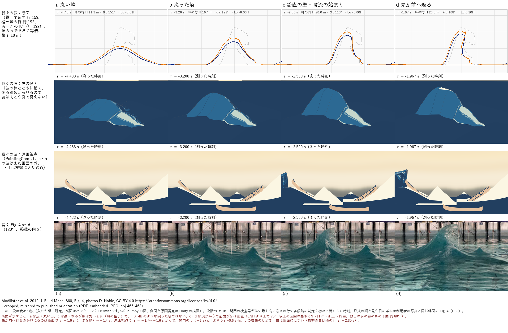
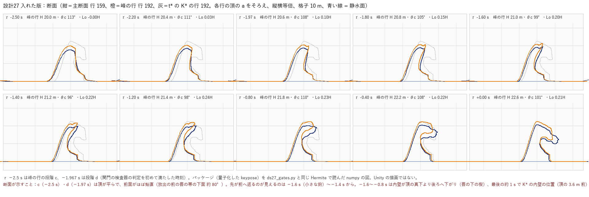
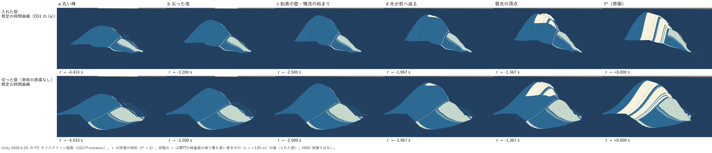
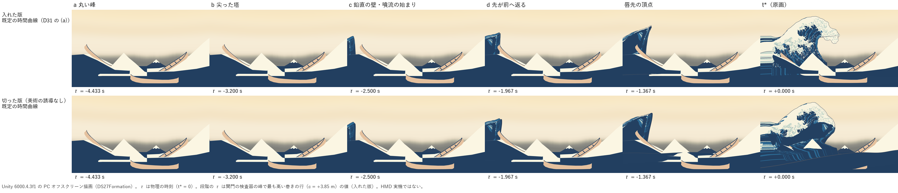

# 設計27：単発砕波を形成から t\* まで作り、2 視点と側面で見せる

日付：2026-09-27／状態：初回提出＋レビュー対応（修正 2 回の後、損切り F1 を適用。レビュー対応では生成器を変えていない。numpy の生成器・関門の検査器と、Unity の PC オフスクリーン描画。**HMD 実機の結果ではない**）。

- 対象：[制作設計書](../Design/GreatWave_VR_Production_Design_ja.md) §9 段階5 の設計27「低解像度で単発砕波を計算する」を、利用者の Q11 の範囲（形成から原画の瞬間 t\* まで。t\* の後の崩壊は作らない）で作った。[段階9までの実行計画](../Design/Stage9_Plan_2026-09-26_ja.md)（以下「計画」）§2.1 の設計27（［Q10］［Q11］［Q12］の注記）の成果物。仕様は[設計26 の記録](Design_26_ja.md)（§1.3 の値の区分、§2 の方式 H の層 1〜7、§3.1 の段階の表、§3.2 の時間曲線、§4.1 の関門 P1〜P16、§4.2 の原画の関門、§6 の白、§9 の損切り、§10 の決めごと）と、その値の JSON [ds26_conditions.json](../Evidence/Design/26/ds26_conditions.json)。
- 時間の上限：≤1.25 日（計画 §2.1、損切り S1：修正 2 回まで、その後 F1）。実績：初回提出は約 4.3 時間（2026-09-27 03:25 頃〜07:45 頃、ファイルの時刻から。生成器・関門の検査器・Unity の再生器を並べて作った約 2.5 時間と、統合・修正 2 回・描画・記録の約 1.8 時間）、レビュー対応は 08:00 頃〜08:45 頃（約 0.8 時間。生成器は変えず、測定・図・記録を直した）。1 回の計算はどれも 30 分以内（生成は版ごとに 9〜10 分、関門は 1 回 5〜6 分、Unity は 1 回 50 秒以内）。
- 修正回数：2（第3節）。2 回直しても P2（入れた版）と、切った版の P2・P3・P9・P15・P16 が落ちたので、設計26 §9 の S1 に従い F1 を適用し、これらを「記録のみ」とした（第3.4節）。**F1 の置き換え（落ちた部分を美術優先30 の rig の表に替える）は行っていない**。理由は第3.4節（設計26 §9 からの逸脱）。入れた版の P3 は、判定の区間がほとんどないので「判定できない（記録のみ）」とした（レビュー対応、第2.1節）。P13 の網の検査（5b〜5e・5g）は S1 の対象の外で、AGENTS.md の「同じ問題の修正は 2 回まで」により、残りを記録して選択肢を示す（第6節）。
- 対応するバックログ（計画 §2.1）：80・106・107・111（形成と重なる区間の後退なし）、112 の前提。項目ごとの値と判定（[metrics.json](../Evidence/Design/27/metrics.json) の `backlog`）：**80 記録のみ、106 不合格**（行の間の辺の伸び 10.9 倍）、**107 不合格**（面の反転 30）、111 記録のみ、112 の前提 記録のみ。これらは連続性の項目なので、t\* の原画の関門の測り直しでは確かめられない。同じ検査器では美術優先30 も P13 の 12 項目中 7 項目が不合格（面の反転 15,013）だが、美術優先30 の記録（自前の検査一式）では 4 項目とも合格だったので、「後退なし」とは書かない（第2.5節）。
- 証拠の種類：numpy の生成器（パッケージを作る）と関門の検査器（パッケージを Hermite で補間して読む）、関門の外の numpy の測定（`ds27_review_measure.py`、記録のみ）、Unity 6000.4.3f1 Editor の batchmode による PC のオフスクリーン描画（RTX 3080、Direct3D11、Linear）と、その t\* の画像の美術優先23 の評価器による測り直し。Houdini は使っていない。利用者の Houdini 解算のファイルは開いておらず、設計26 の記録に写した数値だけを使った。
- 座標と単位：m・s。K\* の断面座標（a = 進行方向 t、y = 上、c = 波峰線方向 e。主断面は c = 0、行 159。峰で最も高い巻きの行は c = +3.85 m、行 192）。τ は物理の時刻（t\* = 0）、t は体験の時刻（t\* = 12.0 s）。H\* = 20.80 m。
- 利用者の決定（第5節）：D30（60°、形成の過程は利用者の写真＝論文 Fig. 4 a〜d）と D31（既定の時間曲線。代案も描いて比べる）は回答済み（Q11）、写真の錐状の副峰を足さないことは Q12 で確認済み。D32・D33・D35 は既定値・利用者未回答、D36 は既定値・利用者未確認（解算の数値をリポジトリへ入れる形は Q12 で確認済み）。
- レビュー対応の一覧は第9節。

## 見るもの

| 論文 Fig. 4 a〜d と我々の波（P15。入れた版・既定。上から断面・左の側面・原画視点・論文） | 断面の並べ図：噴流の始まりから t\* まで（入れた版） |
| --- | --- |
|  |  |
| **段階の並べ図：左の側面（入れた版・切った版）** | **段階の並べ図：原画視点（PaintingCam v1）** |
|  |  |

- 動画（1280×720、30 fps、t 0〜14 s、421 コマ。左上＝入れた版・既定の時間曲線、右上＝入れた版・代案（実時間のまま t\* で瞬間に止める）、左下＝切った版・既定）：[原画視点](../Evidence/Design/27/ds27_compare_painting.mp4)／[座席 v1](../Evidence/Design/27/ds27_compare_seat.mp4)／[左の側面](../Evidence/Design/27/ds27_compare_side_left.mp4)。1920×1080 の動画（原画視点・座席 v1・左の側面・座席の仰角 30°、版と時間曲線の 3 組。切った版は既定の時間曲線だけ）と連番は Git 対象外の `Unity/Build/Design/27/<版>_<時間曲線>/video/`・`frames/` にあり、SHA-256 は run.json。
- 座席 v1 の動画の左下（切った版）は、t 9.9〜10.1 s に画面全体が暗い青になる。再生器の不具合ではなく、切った版のシートの前の端（静水面の上 2.5〜2.7 m）が座席の目（1.83 m）の上を通るため（第4節の限界 1、設計30 の海の継ぎ目）。
- ほかの図：[段階の並べ図：座席から仰角 30°（seat_form）](../Evidence/Design/27/fig_ds27_stages_seat_form.png)、[段階の並べ図：座席 v1](../Evidence/Design/27/fig_ds27_stages_seat.png)（座席 v1 は上を急に見上げるので、波は t ≈ 10 s まで画面に入らない。段階 a〜d の 4 枚は同じ画像）、[修正ごとの静止画](../Evidence/Design/27/fig_ds27_revisions.png)（初回・修正1・修正2 を同じ τ で）。
- 数値：[metrics.json](../Evidence/Design/27/metrics.json)（版と時間曲線ごとの関門 P1〜P16 と P13 の内訳、関門ごとの判定の語 `verdicts`、バックログの対応表 `backlog`、最小の受入 `minimum_acceptance_q11`、t\* の原画の関門、t\* の画像の画素の差、再生の照合、keypose の容量と Hermite の再生の差、決定性の確認、関門の外の測定 `review_measurements`、描画の時間、修正の記録、F1 で記録のみにした関門）。実行条件と SHA-256：[run.json](../Evidence/Design/27/run.json)。
- 側面・原画視点・座席の図と動画は Unity の実描画。断面の図（P15 の並べ図の 1 段目と断面の並べ図）はパッケージを関門の検査器と同じ Hermite で読んだ numpy の図。主役波は DS27 の keypose の頂点シェーダー（色は 28修正01 の焼き込み r01、白は τ で作り直した T_white）、背景は 27修正01 のプレハブ（右船・座席 v1・前景と右の仮置き・平らな仮の海）。左の側面は波の枠とともに動くカメラで、主役波・空・海だけを描いた（並べ図は画面の中ほどを 16:9 のまま切り出した）。段階の静止画は、関門の検査器が峰で最も高い巻きの行で各段階の判定を初めて満たした τ（入れた版）で描き、切った版も同じ τ で描いた。論文の写真は PDF から取り出した埋め込み JPEG（設計26 の run.json の SHA-256 を照合）を掲載の向きへ左右反転し、図の中に CC BY の表示を書いた。利用者の高解像度の写真（webp）は使っていない。

## 0. 結論

1. **形成から t\* までの単発砕波を、物理に基づく動き＋別に記録した美術の誘導で作った**。2 つのうねりの波群（±30°）の分散集中の搬送波の上を、K\* 系の本体が約 20 m/s で進みながら育ち（t = 0 で t\* の位置の約 200 m 後ろ）、巻きの行の唇は前縁の帯から唇先の順に打ち出されて重力だけで飛び、t\* にぴったり K\* になる（量子化の差 1.2 mm）。入れた版（美術の誘導 9 個をすべて入れる）と切った版（9 個の切り替えをすべて切る。行ごとの頂の高さや唇の列などは K\* から受け継ぐ、第1.1節）を、原画視点・座席 v1・左の側面の 3 視点で描いた。時間曲線は入れた版で既定と代案、切った版は既定だけ。
2. **入れた版は、関門 P1〜P16 のうち P2（記録のみ、F1）・P3（判定できない、記録のみ）・P13（不合格）以外が合格**（既定・代案とも）。P3 は検査器の判定では合格（0.034）だが、`ds_sea_calm_painting` のため τ > −2.0 s を判定から除くので、判定の区間は主断面 0.43 s・峰の行 0.62 s しかなく、巻きの行 133 行のうち 51 行は区間が空。除いた区間を含めると、始まり → t\* の窓の A_net の変化は t\* の A_pos の主断面 1.02 倍・峰の行 0.97 倍（最大 3.80、行 60）で、周りの海を全体に平らにして谷がなくなる分と、下の 4 の本体の水の減りと戻りを含む。P15：a→b→c→d が主断面と峰の行でこの順に、それぞれ設計26 §3.1 の τ の ±0.3 s に入り、最初の白は段階 c の唇先に出る（ただし検査器の読みの寛い側で合格。第4節の限界 16）。P4：唇先の縦の加速度は頂点から t\* まで −9.7 m/s²（落下時間は √(2Δy/g) の 1.00 倍）。P16：既定の時間曲線で全 133 行の唇先の見かけの縦の加速度が下向き（最大 −1.5 m/s²）、画面での落下 2.7 s（代案は −3.4 m/s²、1.25 s）。
3. **t\* の原画の関門は後退なし**：美術優先23 の評価器で 28修正01・26修正01 と最大 0.247 px の差（基準 ±0.5 px）、合否は 28修正01 と全項目で同じ（175 は 28修正01 から不合格のまま）。レビュー対応で測り直し、同じ値だった。t\* の画像は 28修正01 と画素が 1.06% 違う（量子化の外接箱の違いによる縁の画素。ID の画像では 0.024%）。
4. **関門が見ていない所で、原画の姿へ引き戻す動きが残っている**（レビュー対応で測った。第2.5節・第4節の限界 14）：入れた版のシートの上の本体の水は、巻きの間に 5,276 m³（τ −3.13 s）から 3,349 m³（τ −1.08 s）へ 37% 減り、最後の約 1 s で 4,447 m³（t\*）へ 33% 戻る（主断面の断面積は 251 → 136 → 205 m²）。内壁の 0.3H の点が頂の 8.2 m 前（τ −3.0 s）から 0.8 m 後ろ（τ −1.2 s）へ下がり、t\* に K\* の 3.6 m 前へ戻る。仕組みは、内壁の錨を t\* の K\* へ寄せる ease-in（τ −2.0 s から）と、管の天井を K\* の形へ寄せる ψ_t。Q10 で利用者が否決した「原画の姿へ引き寄せる」動きそのもので、P3 の区間の外なのでどの関門にも出ない。美術優先30 は P3 −23% で落ちた。利用者に見てもらう（第6節）。
5. **落ちたもの**：
   - P2（入れた版、0.594）：主断面と峰の行は、窓が周りの海の標本に収まる τ −11.0 s（峰の行 −10.8 s）から −2.0 s まで 0.041・0.053 まで釣り合った。それより前は窓の後ろが標本の範囲（地面の a ≥ −330 m）から欠ける（検査器の主断面 0.257）。窓が収まるコマだけでも、手前の端の巻きの行 46 行（c −29.5〜−11.9 m）は背景のうねりを静める係数を生成器の釣り合いに入れていないので、判定の区間の終わり τ −2.0 s へ向けて谷が多すぎる（最大 行 68 の 0.594）。修正 2 回の後なので F1 で記録のみ（第3.4節）。
   - P3（入れた版）：上の 2。判定できない（記録のみ）。
   - P13（網の検査、12 項目中 5 項目）：行 60 の唇の辺 1.1 mm、管の天井の列 303 の辺が K\* の 4.27 倍、行の間の辺の伸び 10.9 倍（K\* の列の割り付けが行の間で変わる所）、rim の継ぎ目 0.14（放出の前）、奥の壁の手前の行の面の反転 30。自己交差・二階差分（2 g 以内）・頂の高さの単調・法線は合格。
   - 切った版：P2・P3・P9・P13・P15（段階 b が遅い）・P16（唇のない小さい行）。切った版の t\* は K\* から RMS 6.08 m・最大 26.0 m（設計28 へ渡す）。F1 で記録のみ。
6. **修正で変えた設計26 の値**：噴流の始まりの帯の上面の角 40° → 28°（段階 c の頂の角 θc を約 120° の範囲へ）、頂の帽子と背面の倍率（段階 a〜c の見え方）、本体の上にうねりを足さない、搬送波の振幅の上限（峰の行で最大 6.0 m。設計26 の較正の 3 m の約 2 倍）。すべて `ds27_params.json` に理由とともに書いた（第3節）。修正ではないが、`ds_swell_calm`・`ds_sea_calm_painting` を場所によらず全体に掛けている（設計26 §4.2 は見える周りの海の約 4.2% の足跡と余白。第4節の限界 13）。
7. **形成の見た目は Fig. 4 の順に読めるが、b と d の見た目は写真と違う**（P15 の並べ図の断面の段、第6節）：a は広く丸い山、b は高くなるが頂は丸いまま（尖った塔ではない）、c・d は頂が丸く平たく前面がほぼ鉛直、先が前へ返るのが見えるのは断面で τ −1.6〜−1.4 s、原画視点で τ ≈ −1.7〜−1.6 s からで、関門の d（−1.97 s）より 0.3〜0.6 s 後。

---

## 1. 作ったもの

### 1.1 生成器（numpy、`Tools/GWWaveGen/ds27/`）

設計26 の方式 H の層 1〜7 を 1 本の生成器にした。入力は K\*（26修正01、読むだけ、SHA-256 を照合）、設計26 の値の JSON（`Docs/Evidence/Design/26/ds26_conditions.json`、SHA-256 `ec8ae040…c072` を照合）と、設計27 で決めた rig の表・数値の条件・Q11 の反映を書いた [ds27_params.json](../../Tools/GWWaveGen/ds27/ds27_params.json)。

| 層 | 中身（設計27 で作ったもの） | ファイル |
| --- | --- | --- |
| 1 海 | 搬送波：t から ±30° の 2 系（対称・同振幅・一方向、JONSWAP γ 3.3、λp 195 m）を焦点（K\* の頂の下、τ = 0）で同じ位相に重ねた波群。成分の振幅は NewWave（S(f)Δf に比例。設計26 の E2・E6 は √S だった。限界 5）。行ごと・時刻ごとの振幅 A_c,r(τ) を、頂を中心に 225 m の窓の符号付きの断面積が 0 になるように一次式で解く（本体が搬送波の山と、修正1 からはうねりも置き換える）。背景のうねり：同じスペクトル・同じ 2 方向のランダムな位相、Hs 5 m（種を固定）。シートの外の海は `ds27_sea.npz` に標本化（設計30 と検査器が読む）。静める係数（層5 の `ds_swell_calm`・`ds_sea_calm_painting`）は場所によらず全体に掛かる（限界 13） | `ds27_model.py`（`sea`・`sea_outside`） |
| 2 平行移動 | 波の枠の原点 O(τ) が t 方向へ c0 = 20 m/s、噴流の始まり（峰の行 τ −2.4 s）から t\* まで 0.8 c0 へ線形に減速。480 Hz の表。行ごとの減速の差（せん断、最大約 2.4 m）は局所の位置に入れる | `origin`・`crest` |
| 3 本体 | 美術優先30 の rig の仕組み（背面の横の倍率 Lb、前の足の倍率 F、内壁の錨、内壁の回転角の補間）を、行ごとの段階の時計 σ_r(τ)（峰の行の τ に合わせ、20 m/s で波峰線に沿って遅れる）で動かす。頂の高さは上昇の速さの表の積分（頂の加速度 ≤ 2 g）。修正1 で頂の帽子（背面の頂の近くの下がりを縦に縮めて頂を丸める。t\* で 0）を足した。内壁の錨は τ −2.0 s から t\* の K\* の位置へ ease-in で寄せる（`anchor.to_kstar_sigma`。限界 14） | `sections`・`crest` |
| 4 唇 | 前縁の帯（頂から列の順に 2 cm おき（手前の端の小さい行は高さに比例して縮め、下限 8 mm）。上面は水平から θ1 下向き（噴流の始まりで 28°。設計26 は 40°、修正1）、下面は 80°）に並べ、唇先から根元へ τ_i = −T_row·(1 − s_i)^0.5 で放出。速度の補間 min(0.6 s, 放出から t\* の半分)、以後は重力だけ。入れた版は t\* に K\* へ着くように行ごとに打ち出しの速さを一次式で解く（設計26 e4_common の ramp_solve と同じ式）。切った版は設計26 E4c の中央値の打ち出しの速さから前へ積分する。管の天井は rim と内壁の錨の間の Hermite と K\* の相似変換を ψ_t で混ぜる。唇の重み κ < 1 の行（峰の行の外側の 22 行など）は唇が本体の前面と混ざり、重力だけでは動かない（限界 7） | `_lip_setup`・`lip_state`・`sections` |
| 5 美術の誘導 | 設計26 の 9 個（`ds_body_narrow`・`ds_back_steep`・`ds_tube_shape`・`ds_claws`・`ds_lip_target_kstar`・`ds_farwall_hold`・`ds_tube_white_early`・`ds_swell_calm`・`ds_sea_calm_painting`）を名前の付いた切り替えにした。入れた版（art_on）はすべて入れ、切った版（art_off）は 9 個をすべて切る。**ただし切った版も「美術をすべて切った波」ではない**：(1) 行ごとの頂の高さを K\* の頂から作るので、t\* の行ごとの頂の高さは K\* のまま（H ≥ 3 m の 175 行で相関 0.99999、差の最大 0.30 m。設計26 §1.1 が美術に数える約 35 m の局所の塔の形）、(2) 頂・唇先・rim・内壁の錨の列と内壁の線分の向きを K\* から受け継ぐ、(3) 修正1 の `swell_replaced_by_body`（海の数値の条件で、切り替えではない）が切った版でも本体の下のうねりを消す。切り替えの効果そのものは出ている：t\* でもうねりが残り（平らな縁の RMS 1.20 m、入れた版 0.24 m）、奥の壁が巻き（行 200〜220 の唇が頂から約 11 m 前へ出る。K\* は 1.4〜4.7 m）、管の天井は白くならず（14,497 頂点）、t\* は K\* ではない | `ds27_params.json` の `switches` |
| 6 白 | 美術優先31 の T_white（R32F 400×240、τ の秒）の仕組みで、物理の時刻から作り直した。唇の膜は放出の時刻 + 0.1 s、頂と背面は行の噴流の始まり + 0.15 s から −0.3 s までに背面の足へ、管の天井・内壁は入れた版だけ τ −1.0 s から −0.2 s（`ds_tube_white_early`）。崩壊の第二の場は作らない（Q11）。切った版の 33 頂点は T_white が (0, 0.061] s にあり（τ ≤ 0 では白にならないが、約束の +1e9 の外） | `twhite` |
| 7 時間 | 世界全体の τ(t) の表 2 本（240 Hz、t 0〜14 s）。既定（D31 の (a)）：t 7.936 s まで実時間 → 1 s で 0.5 倍 → 0.5 倍 → 0.4 s で止め、t\* = 12 s から 2 s 保持。代案（(b)）：τ = t − 12、t\* で瞬間に止めて 2 s 保持 | `ds27_timewarp.py`、`timewarp_default.json`・`timewarp_alt.json` |

- keypose の節点：τ −12.0〜−3.0 s は 0.25 s おき、−3.0〜0 s は 1/30 s おき。各区間の 6 点で Hermite と解析の生成器の差が 2.5 mm を超えたら中点を足す（最大 6 回）。最後の節点は τ = 0（t\* = K\*）。
- パッケージ（生成器と Unity の再生器の約束）：`Unity/Build/Design/27/<版>/` に `ds27_pos_rgba16.bin`（RGBA16 UNORM、層 × 240 × 400 × 4、波の枠の局所座標 = ワールド − O(τ)）、`ds27_keypose.json`（層の数・外接箱・節点の τ・枠の原点の 480 Hz の表・SHA-256）、`ds27_twhite_r32f.bin`。補間は節点の間の 3 次 Hermite（傾きは中心差分、端は片側。等間隔なら一様の Catmull-Rom と同じ）で、numpy とシェーダーで同じ式。
- 決定性：提出版（修正2）のパッケージを、同じ入力（`ds27_model.py`・`ds27_params.json`・K\*・ds26_conditions.json）から `Unity/Build/Design/27/_twice/` へ作り直し（`run_ds27.ps1 -Twice` の 2 回目と同じ引数）、3 ファイル × 2 版の SHA-256 がすべて一致した（レビュー対応。metrics.json の `determinism`）。生成器の自前の検査（`ds27_checks.json`）もパッケージの横に書く。

### 1.2 関門の検査器（`ds27_gates.py`）

生成器から独立に、設計26 の記録（§3.1・§3.2・§4.1・§4.2・§6）だけから作った。パッケージを Hermite で補間して読み、P1〜P16 と t\* の原画の関門の前提（τ = 0 の位置 = K\*）を測る。設計26 の記録が数で決めていない所の読み方（段階の判定の数値化、頂の定義、P13 の網の検査の範囲と量子化の扱いなど）は、報告の `readings_ja` に書いた（第4節の限界 9）。美術優先30 の keypose を包みの形に写す `ds27_gates_af30.py` で、美術優先30 の診断の値 33 個のうち 32 個を許容の内で再現し、P1〜P12 がすべて落ちることを確かめた（1 個は白の割合の重みの違い）。

統合で直したこと（設計27 の中、検査器の修正）：P2・P3 は、設計26 §4.1 の定義どおり、頂を中心に 225 m の窓（シートの断面 ＋ 生成器が書いた周りの海 `ds27_sea.npz` の標本、τ で線形に補間）の符号付きの断面積で測る。初めの版は `--sea` を谷と P11 にだけ使い、面積はシートの上（約 82 m）だけで測っていた。入れた版では、`ds_sea_calm_painting` で周りの海を平らにする τ > −2.0 s を P2・P3 の判定から除き、値は記録する（設計26 §4.1 P2 の「平らにした行・コマは除外して記録」）。

レビュー対応で足したこと（判定と値は変えない。記録だけ）：P3 の詳細に、主断面・峰の行の判定の区間の長さと、除いた区間を含めた始まり → t\* の値（`rows_record`）、判定の区間が空の行の数、シートの上の水の量の最大の後の最小（`volume_min_after_max_*`）。P5 の詳細に、打ち出しの補間の後の唇先の速さ（`打ち出しの補間の後の唇先_記録`）。3 組と美術優先30 での確かめを走らせ直し、元の値がすべて同じで、美術優先30 の再現も 32/33 のままであることを確かめた。

関門の外の測定 `ds27_review_measure.py`（レビュー対応。記録のみ）：本体の水と K\* への引き戻し、Hermite の再生の差の独立の標本、唇の弾道の当てはめ、切った版が K\* から受け継ぐもの、周りの海を静める範囲、P2 の窓の広がり、段階の断面の形、P15 の読みの余裕、搬送波の振幅、切った版の座席の暗転。出力は `Unity/Build/Design/27/review/ds27_review_measure.json`（Git 対象外）で、全体を metrics.json の `review_measurements` に写した。

### 1.3 Unity の再生器と採取（`Unity/Assets/GreatWave/Design27/`）

- `DS27KeyposePlayer`：パッケージを読み、位置を 16 bit × 3（6 バイト/頂点）の StructuredBuffer に詰め（RGBA64 の Texture2DArray の 3/4）、頂点シェーダーで同じ Hermite の重みで補間する。枠の原点 O(τ) は CPU で線形補間し、ワールド = O(τ) + 局所。法線はパッケージにないので、外殻線のシェーダーが K\* の格子の 6 つの三角形から求める（美術優先30 と同じ定義）。白は τ ≥ T_white（+1e9 は t\* までに白にならない）。美術優先の番号のファイルは変えていない。
- `DS27Formation`（Editor）：場面 `Scenes/Tests/DS27_Formation.unity`（27修正01 のプレハブ：船・空・富士・座席 v1 の印）を作り、版と時間曲線ごとに、t\* の色と ID の画像（美術優先28修正01 と同じ名前・同じ採取の設定）、GPU の読み戻し、段階の静止画（原画視点・座席 v1・左の側面）、動画（1920×1080、30 fps、t 0〜14 s、421 コマ。原画視点・座席 v1・左の側面、任意で座席の仰角 30° の seat_form）を書く。採取の各コマに τ を時間曲線の表から直接与える（GWClock の単発再生は設計30）。左の側面は波の枠とともに動くカメラで、主役波・空・海だけを描く。
- 照合：`ds27_player_ref.py check`（GPU の読み戻しと numpy の Hermite の差）、`ds27_tstar_eval.py`（t\* の画像を 28修正01 の評価の手順で測り直す）。
- Unity の実行は毎回 `Tools/GWWaveGen/ds27/run_ds27_unity.ps1`（`Unity/Build/unity.lock` を排他的に作ってから 1 プロセスだけ動かし、30 分で止める）。レビュー対応では Unity を走らせていない（パッケージを変えていないので、描画は初回提出のまま）。

---

## 2. 結果

### 2.1 関門 P1〜P16（`ds27_gates.py`、提出版＝修正2。レビュー対応で走らせ直した値）

しきい値は設計26 §4.1。値は検査器の出力（`Unity/Build/Design/27/gates/<版>_<時間曲線>.json`・`.md`、Git 対象外。要点は metrics.json の `gates`、判定の語は `verdicts`）。P1〜P15 は物理の時刻で測るので、入れた版の既定と代案は P16 と時間曲線の確認のほかは同じ値。「記録のみ（F1）」は、修正 2 回の後も落ちたので設計26 §9 の S1 により記録のみにした関門。「判定できない（記録のみ）」は、検査器は合格と出すが、判定の区間がほとんどないので合格と書かない関門。

| # | 関門（しきい値） | 入れた版・既定 | 入れた版・代案 | 切った版・既定 |
| --- | --- | --- | --- | --- |
| P1 | 峰が進む（τ −3〜0 s の地面の平均の速さ ≥ 10 m/s、戻り ≤ 0.1 m） | 18.4 m/s、戻り 0 m：合格 | 同左：合格 | 18.5 m/s、0 m：合格 |
| P2 | 谷と釣り合う（225 m の窓の \|A_net\|/A_pos ≤ 0.2、前の谷 ≤ −2.08 m） | 0.594（行 68、τ −2.0 s）。主断面 0.257（窓が周りの海の標本から欠ける τ −12〜−11.1 s。欠けを除くと 0.041、峰の行 0.053）、谷 −3.6 m：**記録のみ（F1）** | 同左：**記録のみ（F1）** | 0.374（τ −12.0 s。窓の欠けを除くと 0.214、行 192・t\*）、谷 −4.3 m：**記録のみ（F1）** |
| P3 | 巻いても水が消えない（前面が鉛直になってから t\* までの A_net の変化 ≤ 0.1 A_pos） | 判定の区間は主断面 0.43 s・峰の行 0.62 s だけ、133 行のうち 51 行は空。その区間の値 0.034（行 188）。除いた区間を含めると主断面 1.02・峰の行 0.97（最大 3.80、行 60）：**判定できない（記録のみ）** | 同左：**判定できない（記録のみ）** | 0.125（行 192）：**記録のみ（F1）** |
| P4 | 唇先は投げ出された水（頂点 → t\* の 0.3 s ごとの縦の加速度 −12.8〜−6.9 m/s²、落下時間 ±30%） | 主断面 −9.68 m/s²・落下 1.25 s（基準 1.25 s）、峰の行（κ 0.97）−8.5〜−9.5 m/s²：合格。見るのはこの 2 行だけ（峰の行の外側は限界 7） | 同左：合格 | −9.68 m/s²：合格 |
| P5 | 唇先の速さ（≥ 16 m/s かつ ≥ 峰の速さ） | 20.1 m/s（峰 19.4 m/s）：合格。窓は打ち出しの補間の途中で終わる。補間の後の唇先の水平の速さ（記録）は主断面 23.0・峰の行 20.5・巻きの行の中央値 22.5 m/s（設計26 の 22.7 m/s と合う） | 同左：合格 | 21.5 m/s：合格 |
| P6 | 唇は頂に運ばれる（途中の最小 ≥ 0.5 × 根元、根元の水平 ≥ 0.6 × 唇先） | 1.06、0.70：合格 | 同左：合格 | 1.04、0.72：合格 |
| P7 | 巻きの時間（前面が鉛直 → t\* が 1.6〜2.8 s） | 主断面 2.43 s、峰の行 2.62 s：合格 | 同左：合格 | 2.27 s、2.47 s：合格 |
| P8 | 止め方（τ −0.2 s の水面の速さ p95 ≥ 最大の 50%） | 0.963：合格 | 同左：合格 | 0.966：合格 |
| P9 | 白は砕波から（最初の白 ≥ 始まり − 0.3 s、始まりの白 ≤ 5%、最初の白は唇先） | 最初の白 τ −2.30 s の 13 頂点がすべて唇先、主断面の始まりで 0%：合格 | 同左：合格 | 最初の白 132 頂点のうち 4 頂点が唇先の外：**記録のみ（F1）** |
| P10 | 波峰線に沿った順（始まりと頂の高さの相関 ≤ −0.3、0.5H の時刻の標準偏差 ≥ 0.1 s） | −0.95、0.43 s：合格 | 同左：合格 | −0.42、0.41 s：合格 |
| P11 | 海が波を運ぶ（τ ≤ −4 s の峰の外の RMS ≥ 1.04 m、波高 ≥ 4.16 m） | 1.21 m、4.8 m 以上：合格 | 同左：合格 | 1.25 m：合格 |
| P12 | 峰が後ろへ戻らない（主断面と峰の行 ≤ 0.05 m） | 0 m：合格（記録：ほかの巻きの行の最大は行 129 の 1.89 m。予備の区間（τ −10.5 s ごろ）の低く平らな頂で、最高点の列が 92 → 85 と跳ぶため） | 同左：合格 | 0 m：合格 |
| P13 | 連続性の検査一式（第2.2節） | 12 項目中 5 項目が不合格 | 同左 | 12 項目中 8 項目が不合格 |
| P14 | 美術の誘導を分ける | 両方の版あり：合格。切った版の t\* と K\* の差は RMS 6.08 m、最大 26.0 m（行 74 の後ろの足、c −23.5 m）、主断面 RMS 6.41 m（設計28 へ）。切った版も行ごとの頂の高さ・唇の列などを K\* から受け継ぐ（第1.1節の層5） | 同左 | 同左 |
| P15 | a→b→c→d の順（各 ±0.3 s、最初の白は c） | 主断面 a −4.25 b −3.03 c −2.27 d −1.80 s（表 −4.01／−3.21／−2.21／−1.86）、峰の行 a −4.43 b −3.20 c −2.50 d −1.97 s（表 −4.2／−3.4／−2.4／−2.05）、最初の白 主断面 −2.11 s・峰の行 −2.30 s：合格（読みの寛い側。限界 16） | 同左：合格 | 主断面 a −4.18 b −2.82 c −2.22 d −1.60、峰の行 a −4.35 b −2.97 c −2.42 d −1.83。b が表より 0.39・0.43 s 遅い：**記録のみ（F1）** |
| P16 | 体験の時刻で唇がブレーキをかけない（唇先の見かけの縦の加速度 ≤ 0） | 全 133 行で下向き、最大 −1.52 m/s²。主断面の画面での落下 2.70 s（物理 1.25 s）：合格。見るのは K\* で巻く 133 行だけ（限界 7） | 最大 −3.42 m/s²、落下 1.25 s：合格 | +0.179 m/s²（14 行、行 69、t 11.4 s。唇のない小さい行）：**記録のみ（F1）** |
| 原画の前提 | τ = 0 の位置 = K\*（≤ 1.31 mm） | 1.20 mm：合格 | 同左：合格 | 判定なし（t\* は K\* ではない。P14） |

- まとめ（metrics.json の `verdicts`）：入れた版は既定・代案とも、合格 13（P1・P4〜P12・P14〜P16）、記録のみ（F1）1（P2）、判定できない（記録のみ）1（P3）、不合格 1（P13）と原画の前提 合格。切った版は、合格 10、記録のみ（F1）5、不合格 1（P13）。
- 時間曲線の表は設計26 §3.2 の参照の曲線と一致した（既定と参照の既定の差 0、代案と参照の代案の差 0。τ(0) は既定 −10.118 s、代案 −12.0 s）。パッケージの書式の確認（大きさ・SHA-256・節点・枠の表 ≥240 Hz）はすべて合格。
- 美術優先30 の keypose を同じ検査器で測ると、P1〜P12 がすべて落ち、設計26 の記録の値 33 個のうち 32 個を許容の内で再現する（`ds27_gates_af30.py`。P2・P3 の窓を直した後と、レビュー対応の後にも走らせ直して同じ結果）。
- 唇の逆算の目安の範囲（設計26 E1 の u/c0 0.6〜1.3、w/√(gH) −0.2〜0.8）：入れた版で 97.9%（20,086 点。設計26 の 97.5%、S4 の下限 95%）。
- 切った版の P2 の主断面の値 0.257 は入れた版と同じ。どちらも τ −12 s の窓の欠け（窓の後ろの一部が周りの海の標本の外）の時刻の値で、この時刻は両方の版で本体がまだ小さい（予備の頂は約 0.12H\*）。同じ値になる細かい理由は測っていない。

### 2.2 P13 の内訳（入れた版。代案も同じ）

| 項目 | 値 | しきい値 | 判定 | 場所・時刻 |
| --- | --- | --- | --- | --- |
| (1) 波の枠の 1 コマの変位（30 Hz） | 0.512 m | < 0.6 m | 合格 | |
| (2) 地面の二階差分（30 Hz、全巻きの行） | 0.0199 m | ≤ 0.0218 m（2 g） | 合格 | 初回 0.0233・修正1 0.0248 から直した |
| (3) 最も低い点 | −1.50 m | ≥ −10.4 m | 合格 | |
| (4) 頂の高さの単調 | 0.0002 m | ≤ 0.05 m | 合格 | 初回 0.65 m から直した |
| (5a) 唇・管の三角形の面積の最小 | 2.3×10⁻⁴ m² | ≥ 1×10⁻⁴ m² | 合格 | |
| (5b) 行の方向の辺の最小 | 1.14 mm | ≥ 5 mm | **不合格** | 行 60（手前の端の最初の巻きの行、H 3.5 m）の唇、τ −9.7〜−0.4 s、394 件（辺 × コマ） |
| (5c) 辺の長さの K\* に対する比（行の方向） | 0.08〜4.27 | 0.05〜4 | **不合格** | 管の天井の列 303（行 115〜160）、τ −4.9〜−3.5 s、97 件 |
| (5d) 同じ（行の間） | 0.03〜10.9 | 0.05〜4 | **不合格** | 行 157/158 の管（K\* の rim の列が 205 → 225 と跳ぶ所）、行 180/181 の唇先の列の切り替わり（198 → 212）、行 187〜189、全区間、14,273 件 |
| (5e) rim と管の天井の継ぎ目の比 | 0.14〜2.27 | 0.25〜4 | **不合格** | 行 180〜187、放出の前（τ −12〜−2.1 s）、1,487 件 |
| (5f) 自己交差 | 0 | 0 | 合格 | |
| (5g) 面の反転（30 Hz） | 30 | 0 | **不合格** | 奥の壁の手前の行 199 付近の唇、τ −1.77〜−0.47 s（唇・管の領域の外） |
| (6) 法線が有限 | 2.9×10⁻⁵ m² | > 0 | 合格 | |

- 切った版：(1)(3)(4)(5f) は合格。(2) 0.0270 m（行 84 列 390、τ −0.9 s）、(5a)(5b)(6) は 0（行 59・60 の予備の区間、前向きに積分する唇の帯が重なる）、(5c) 9.57、(5d) 5.16、(5e) 4.84、(5g) 3 が不合格。
- 同じ検査器で美術優先30 を測ると、12 項目中 7 項目が不合格（(5a)(5b)(5d) 10.66 倍・(5e)(5f) 14・(5g) 15,013・(6)）。

### 2.3 t\* の原画の関門（Unity の描画を美術優先23 の評価器で測り直し。`ds27_tstar_eval.py`）

入れた版の既定と代案は、t\* で同じパッケージの同じ層なので、t\* の画像は画素まで同じ（確認済み）。動画の t = 12 s のコマは t\* の色の画像と画素まで同じで、12〜14 s の保持のコマも同じ。レビュー対応で 3 組とも走らせ直し、出力の値（1 組あたり 492 個）がすべて前と同じだった。

| 項目 | 設計27 | 26修正01 | 差 | 判定 |
| --- | --- | --- | --- | --- |
| 差の最大（28修正01 と比べた全項目の境界・輪郭） | 0.247 px | — | — | 合格（±0.5 px） |
| 78 の輪郭 最大／p95 | 1.641／1.432 px | 1.641／1.435 | 0／−0.003 | 後退なし |
| 130 最大／p95 | 1.927／1.827 px | 1.953／1.829 | −0.026／−0.002 | 後退なし |
| 131 最大／p95 | 1.798／1.663 px | 1.798／1.647 | 0／+0.017 | 後退なし |
| 132 最大／p95 | 1.653／1.397 px | 1.574／1.409 | +0.079／−0.011 | 後退なし（±0.5 px の内） |
| 72 最大／p95 | 5.776／1.732 px | 5.776／1.723 | 0／+0.009 | 後退なし |
| 境界 73・77・79・118・120・133・134・263・270 | 28修正01 との差 0〜0.067 px | | | すべて合格（28修正01 と同じ） |
| 175 | 0.988 px | 28修正01 0.865 px | +0.123 | 不合格（28修正01 から不合格。この番号の原因ではない） |
| 色 265・266・267 | 265 ΔE00 0.545 | 28修正01 と同じ | 0 | 合格 |

- 71 は 28修正01 と同じ値（126.2 px。26修正01 との差 88.8 px は 28修正01 からあるもので、回帰の確認の項目の外）。
- t\* の画像の画素の差（色の違う画素の割合）：28修正01 と比べて原画視点 1.06%（8 段階を超えるのは 1,118 px）、座席 0.53%、ID の画像 0.024%（1,959 px）・線の ID 0.025%。美術優先30 の t\* と比べて原画視点 1.22%、ID 0.033%。どれも外接箱が違う 16 ビットの量子化（最大 1.2 mm）による縁の画素。
- 切った版の t\* は K\* ではないので、原画の関門は大きく外れる（差の最大 220 px、原画視点の画素の 33% が違う）。記録のみ（P14 の目的どおり）。

### 2.4 keypose・再生・時間

| 項目 | 入れた版 | 切った版 |
| --- | --- | --- |
| 層の数（τ −12.0〜0 s） | 160 | 149 |
| 位置のファイル（RGBA16） | 117.2 MiB | 109.1 MiB |
| GPU の位置のバッファ（16 bit × 3）＋ T_white | 87.9 MiB ＋ 0.37 MiB（読み込みで測ったグラフィックスの増分 92,544,000 B と一致） | 81.8 MiB ＋ 0.37 MiB |
| Hermite の再生の差（量子化を含む。生成器の最後の検査：30 Hz の 361 コマ＋節点の間の中点、全頂点の最大） | 最大 2.99 mm（τ −3.09 s。30 Hz のコマだけなら 2.85 mm） | 最大 2.29 mm（τ −4.33 s） |
| 同じ（レビュー対応の独立の標本：32 区間の中点と 1/4 の点の 64 点、パッケージと生成器 `Generator.world` の差） | 最大 2.62 mm（τ −3.34 s） | 最大 2.15 mm（τ −4.47 s） |
| Unity の GPU の読み戻しと numpy の Hermite の差 | 0.023 mm（112 時刻。基準 2 cm）、t\* と K\* 1.20 mm | 0.023 mm（113 時刻） |
| 決定性（作り直した 3 ファイルの SHA-256） | 3 ファイルとも一致 | 3 ファイルとも一致 |
| 生成の時間（海の標本・自前の検査を含む） | 583 s | 525 s |
| 関門の検査器の時間 | 321〜370 s | 321〜370 s |
| Unity の 1 回（場面の読み込みから t\* の組・読み戻し・静止画 18 枚・1920×1080 の動画 4 本まで） | 48〜50 s（動画 1 本 7.2〜7.6 s） | 48 s |

- Hermite の再生の差はどれも 4 mm の規則（節点の検査 2.5 mm ＋ 量子化 1.2 mm）の内。初回提出で書いた「最大 0.48 mm（切った版 1.41 mm）」は、生成の記録の最後の適応の回（入れた版は「節点 5 回目」の 4 区間、切った版は「節点 2 回目」の 28 区間で 1.32 mm）に検査した区間だけの値で、全体の最大ではなかった（レビュー対応で直した）。
- 上限 512 MiB（計画の設計29）の内。設計26 E3 の見積もり（約 166 層・約 365 MiB）より小さいのは、読み取り不可のバッファに 6 バイト/頂点で詰めたため。
- 搬送波の振幅 A_c,r(τ) は入れた版で最大 6.0 m（行 201、τ −3.9 s）、主断面は 5.54 m（τ −3.5 s）→ 3.24 m（τ −1.0 s）→ 4.55 m（t\*）と、本体の断面積に合わせて毎コマ解き直すので最大 1.8 m/s で上下する（限界 17）。切った版は最大 8.6 m（t\*、行 203。物理の幅の本体の水量）。周りの海の表は `ds27_sea.npz`（10 Hz、Git 対象外）の `Ac`・`Ac_knots` で、設計30 が同じ値を読む。

### 2.5 関門の外で測ったこと（レビュー対応、`ds27_review_measure.py`。記録のみ）

| 測ったこと | 値 | 意味 |
| --- | --- | --- |
| 本体の水（入れた版、シートの上の符号付きの断面積 × 行の間隔の和） | 5,276 m³（τ −3.13 s）→ 3,349 m³（τ −1.08 s、−37%）→ 4,447 m³（t\*、+33%）。主断面の断面積 251 → 136（τ −1.2 s）→ 205 m² | 巻きの間に水が減り、最後の約 1 s で K\* の量へ戻る（限界 14）。美術優先30 は P3 −23% |
| その仕組み（主断面） | 内壁の 0.3H の点は頂の +8.2 m（τ −3.0 s）→ +1.6 m（−2.0 s）→ −0.4 m（−1.6 s）→ −0.8 m（−1.2 s）→ +0.4 m（−0.8 s）→ +1.9 m（−0.4 s）→ +3.6 m（t\*、K\* と同じ）。錨を K\* へ寄せる重み E は −2.0 s まで 0、−1.2 s 0.21、−0.8 s 0.43、t\* 1。管の天井の ψ_t は −1.2 s 0.27 → 1 | 錨の ease-in と ψ_t が、最後の約 1 s で内壁を K\* の位置へ前へ押し出す |
| 唇の弾道（入れた版、打ち出しの補間の後から t\* までの 2 次式の当てはめ） | K\* で巻く 133 行の 399 点（唇先と上面の s 0.25・0.5）のうち 396 点が −g ± 0.5 m/s² で水平の加速度 ≈ 0。外れは行 60（κ 0.74）の 3 点（−7.0 m/s²）。峰の行（κ 0.97）の唇先 −9.46 m/s²。**峰の行の外側の 22 行（193〜214、c 3.92〜5.50 m、H 22.6〜23.3 m）は κ 0.95 → 0.03 で、唇先の縦の加速度 −9.3 → −0.5 m/s²**。手前の端の行 58・59（H 2.5〜3.0 m、κ 0.06・0.31）も 0.0・−1.9 m/s² | 峰の行の外側は弾道ではない。P4 は行 159・192 だけ、P16 は 133 行だけを見るので関門に出ない（限界 7）。修正1 で κ を外へ広げたので、減衰の帯が P4 の峰の行からその外側の行へ移った |
| 切った版が K\* から受け継ぐもの | t\* の行ごとの頂の高さ：175 行で相関 0.99999、差の最大 0.30 m。内壁の錨・rim・頂の列は入れた版と同じ（唇先の列はならす）。平らな縁の RMS 1.20 m（入れた版 0.24 m）。奥の壁の唇が頂から約 11 m 前（K\* 1.4〜4.7 m）。管の天井の白 0（14,497 頂点が t\* まで白くならない） | 切った版は「美術をすべて切った波」ではない（第1.1節の層5、第6.1節） |
| 周りの海を静める範囲 | 入れた版の `ds27_sea.npz` は t\* で全 240 行・地面の a −330〜130 m の \|η\| の最大 0.000 m（τ −2.0 s は RMS 1.39 m、−1.0 s は 0.53 m）。静める係数は搬送波 κ_c：−2.0 s 1 → −1.0 s 0.5 → 0、うねり κ_s：−3.0 s 0.84 → −2.0 s 0.5 → 0 で、場所によらない。シートの上の搬送波も 0 | 設計26 §4.2 の「見える約 4.2% の足跡＋余白」より広い（限界 13）。P2・P3 の判定の区間が τ −2.0 s で終わる原因 |
| P2 の窓の広がり（10 Hz、窓が標本に収まるコマだけ） | 入れた版：主断面は τ −11.0 s・峰の行は −10.8 s から収まる。収まるコマでは主断面 0.041・峰の行 0.053。0.2 を超えるのは手前の端の 46 行（c −29.5〜−11.9 m）で、どれも τ −2.0 s で最大（行 68 の 0.594）。切った版：収まるコマで最大 0.214（行 192、t\*）、12 行が 0.2 を超える | 第3.4節の P2 の原因 (1)(2) の範囲を直した（初回提出の「行 68・100 など、c −26〜−14 m」は狭すぎた） |
| 段階の断面の形（入れた版、峰の行の段階の τ） | a（−4.43 s）θc 151°・φ 34°・丸い山。b（−3.20 s）θc 129°・φ 65°・頂は丸い。c（−2.50 s）θc 113°、前面の 75° 以上の区間が 0.3H より上で 9〜11 m。d（−1.97 s）Lo 0.10H、同じ区間 11〜13 m。一番前の点は τ −1.8〜−1.2 s に頂より上（唇が頂を越える）、先が垂れて頂の 0.9 倍を切るのは τ −0.6 s | 第6節の 1。P15 の並べ図の断面の段と断面の並べ図 |
| P15 の段階 a の読みの余裕 | φ の上限を検査器の読み 35° にすると a は主断面 7 コマ・峰の行 6 コマ（約 0.1 s）だけ成り立ち、設計26 §3.1 の「φ ≤ 30〜35°」の下側 30° で読むとどちらの行でも成り立たない（a での φ は 33.7°・34.0°）。表との差は a −0.24／−0.23 s、b +0.18／+0.20 s（許容 ±0.3 s）。c の θc は 110°・113°（読み 105〜135°、表の文は約 120°） | P15 の合格は読みの寛い側（限界 16）。修正1 の値（帯の上面の角 28°・頂の帽子・前の足の倍率・上昇の速さ）はこの読みに合わせて決めたので、読みは進行役の確認を待つ |
| 切った版の座席の暗転 | 座席 v1 の目（ワールド (3.95, 1.83, −15.03)）の上を、切った版のシートの前の端（列 399、静水面の上 2.66〜2.78 m）が f297（t 9.90 s）に通る。暗い青が f291 から増え、f298〜f303（t 9.93〜10.10 s）は画面全体（目が列 399〜398 の水面 2.5〜2.8 m の下にある）、f304（t 10.13 s）に目の上が列 397（1.6 m、目より低い）の側へ移って一度に消える。seat_form も同じコマ。入れた版の前の端は 0.43〜0.68 m で起きない | 限界 1。設計30 の海の継ぎ目。再生器の不具合ではない |
| 最小の受入（計画 §2.1［Q11］） | 連続性の検査一式：不合格（P13 12 項目中 5 項目）。t\* の ±0.5 px：合格（0.247 px）。P1〜P16：一部不合格（P2 記録のみ（F1）、P3 判定できない、P13 不合格）。座席の静止画 3 枚（噴流の始まり・段階 d・t\*）：座席 v1 では噴流の始まりと段階 d に波が入らない（段階 a〜d の 4 枚が同じ画像）ので、seat_form のコマで代えた（代替、記録のみ） | metrics.json の `minimum_acceptance_q11` |
| バックログ（metrics.json の `backlog`） | 80 記録のみ（形の切替・欠落 0 だが、座席 v1 の仰角の値は測り直していない）、106 不合格（行の間の伸び 10.9 倍。同じ検査器で美術優先30 は 10.66 倍）、107 不合格（面の反転 30。美術優先30 は同じ検査器で 15,013）、111 記録のみ（巻きの行の唇先は弾道、峰の行の外側は弾道でない）、112 の前提 記録のみ（keypose 87.9 MiB ≤ 512 MiB、性能は未測定） | 初回提出の「後退なし（t\* の原画の関門の測り直しで確かめた）」は根拠にならないので取り下げた |

---

## 3. 修正の記録（損切り S1：修正は 2 回まで）

生成器・関門の検査器・Unity の再生器を別々に作り（互いのコードを見ずに、上の書式の約束だけを共有）、統合して最初に測った版を「初回」とした。修正ごとに生成器を走らせ直し、関門を 3 組で測り、Unity で描き直した（[修正ごとの静止画](../Evidence/Design/27/fig_ds27_revisions.png)。初回と修正1 の描画と関門の出力は Git 対象外の `Unity/Build/Design/27/r00/`・`r01/` に残し、SHA-256 を run.json に書いた）。記録の要点は metrics.json の `revisions`。レビュー対応では生成器を変えていないので、修正の回数は 2 のまま。

### 3.1 初回

- 入れた版・既定で落ちた関門：P2・P3・P4・P9・P13・P15。切った版：P1・P2・P3・P9・P12・P13・P15・P16。
- 原因：
  - P2・P3：**検査器と約束の不一致**。検査器は `--sea`（生成器が書く周りの海の標本 `ds27_sea.npz`）を谷と P11 にだけ使い、面積はシートの上（約 82 m）だけで測っていた。設計26 §4.1 の定義は、頂を中心に 225 m の窓で、シートと周りの海をつないで測る。入れた版で周りの海を平らにする区間を除くことも入っていなかった。
  - P4：峰で最も高い巻きの行（c +3.85 m）は巻きの行の最後の行で、奥の壁へ唇を消す平滑で唇の重み κ が 0.78 だった。唇の位置が本体と混ざり、唇先の縦の加速度が −6.97 m/s²（下限 −6.9 より弱い）。
  - P9：最初の白の 21 頂点のうち 8 頂点が、巻きの行でない奥の壁の手前の行（193〜196）の唇だった。
  - P13(2)：管の天井（行 187 列 290）で t\* の直前に 2.13 g（K\* の管の天井の相似変換が、重力で落ちる rim に引かれて回り、弦から遠い点の加速度が約 2 倍になる）。
  - P13(4)：背景のうねり（Hs 5 m）を本体にも足していたので、予備の区間で頂が上下した（0.65 m 戻る）。
  - P15：段階 c が一度も成り立たない。頂の角 θc（頂から 0.1H 下の前後の点への弦のなす角）が 80〜88° で、判定の 105〜135° に入らない（美術の本体の細く急な背面と、帯の上面 40° のため）。前面が鉛直になる時の H/Hf も、うねりの分 0.92 と高かった。
- 切った版の t\* と K\* の差、P14 の値は初回から記録した。代案の時間曲線は、生成の範囲が τ ≥ −10.125 s だったので、最初の 1.88 s が止まっていた。

### 3.2 修正1

| 変えたこと | 狙い | ファイル |
| --- | --- | --- |
| 検査器の P2・P3 を 225 m の窓（シート＋周りの海の標本を τ で線形補間）で測り、入れた版は τ > −2.0 s（`ds_sea_calm_painting`）を判定から除いて記録（統合の不一致の修正） | P2・P3 | `ds27_gates.py` |
| うねりも本体が置き換える（本体の上にうねりを足さず、釣り合いにその分を入れる） | P13(4)、P15 の高さ | `ds27_model.py`（`sea`）、`swell_replaced_by_body` |
| 奥の壁の側で、κ を平滑の前に外へ広げる（1.0 m） | P4 | `curl_weight_dilate_far_m` |
| 巻きの行でない行の唇の白を 0.1 s 遅らせる | P9 | `noncurl_lip_extra_delay_s` |
| 帯の間隔の下限 5 mm → 8 mm | P13(5b) | `strip_spacing_min_factor` |
| 段階 a〜c の見え方：頂の帽子（背面の頂の近くの下がりを縦に縮めて頂を丸める。σ −6 s の 0 から −2.4 s の 0.75 へ、t\* で 0。美術の本体だけ）、背面の倍率 Lb を広げる（−3.4 s 1.5 → 2.0）、噴流の始まりの帯の上面の角 40° → 28°、内壁の錨の最初の位置 0.62H → 0.72H、前の足の倍率 F、頂の上昇の速さの表（0.5H に届く時刻を約 0.2 s 早める） | P15 の a（φ ≤ 35°）・b（前後の非対称）・c（θc） | `crest_cap`・`Lb_table`・`strip_angle_override_deg`・`anchor`・`foot_F_table`・`rise_rate_table` |
| 余白の帯の幅の min を滑らかな最小にした（足が前へ出て切り替わる所で、余白の頂点の速度が折れていた） | keypose の Hermite の差、P13(2) | `ds27_model.py`（`margin_weight`） |
| 管の天井の相似変換を、奥ほど K\* の管の天井を両端の変位の線形補間で平行に動かす形へ寄せる（時間によらない重み、t\* では同じ K\*） | P13(2) | `tube.translate_blend` |
| 生成の範囲を τ −12 s まで広げ、代案を τ = t − 12 にした | 代案の最初の 1.88 s の停止 | `range.tau_min_s`、`ds27_timewarp.py` |

結果：入れた版は P4（−9.68 m/s²）・P9・P15 が合格に変わり、P2（0.512）・P3（0.136）・P13 が残った。P2・P3 は搬送波の振幅の上限（tanh、6 m）で窓の釣り合いが 0.2〜0.25 残ったため。P13 は (2) 0.0248 m（前の足。F の表の節点で二階微分が跳ぶ）、(4) 全行の最高の頂 0.257 m と (5g) 面の反転 971（κ を広げすぎて、奥の壁の手前の行 205〜207 の唇が本体より上へ出て裏返る）が新しく出た。切った版は P1・P12 が合格に変わった。

### 3.3 修正2（提出版）

| 変えたこと | 狙い | 値 |
| --- | --- | --- |
| 搬送波の振幅の上限を、上限の手前までほぼ恒等な x/(1 + (x/A_max)^6)^(1/6)、A_max 9 m にした | P2・P3 | `Ac_max_m` 9.0、`Ac_soft_cap_power` 6 |
| κ を外へ広げる幅 1.0 → 0.5 m | P13(4)(5g) | 峰の行の κ 0.97 |
| 前の足の倍率 F を表からロジスティックへ（F(−4.2) 1.90、F(−3.4) 1.45、F(0) 1） | P13(2) | `foot_F_logistic` |
| 内壁の錨の最初の位置 0.72H → 0.67H | P13(5c) | `anchor.offset_start_over_H` |

結果：入れた版は P3 の検査器の値（0.034）・P13(2)（0.0199 m）・P13(4)（0.0002 m）が合格に変わり、検査器の判定では P1〜P16 のうち P2 と P13 だけが残った（第2節）。P3 は判定の区間がほとんどないので、レビュー対応で「判定できない（記録のみ）」とした。

### 3.4 損切り F1

設計26 §9 の S1 により、2 回直しても落ちた P1〜P9・P15・P16 を「記録のみ」にした：入れた版の P2（既定・代案）、切った版の P2・P3・P9・P15・P16。

- P2（入れた版）の残りの 2 つの原因：(1) 窓が周りの海の標本に収まる前（主断面 τ −11.1 s まで、峰の行 −10.9 s まで）は、窓（頂 ±112.5 m）の後ろが標本の範囲（地面の a ≥ −330 m。生成の範囲を τ −12 s へ広げた時に、標本の範囲を広げなかった）の外へ出て、窓の一部が欠ける（検査器の主断面 0.257、峰の行 約 0.34）。(2) 窓が収まるコマでも、手前の端の巻きの行 46 行（c −29.5〜−11.9 m）は、判定の区間の終わり τ −2.0 s に向けて谷が多すぎる（最大 行 68 の 0.594）。比はうねりを静める係数（`ds_swell_calm`、τ −4 s から。−3 s で 0.84、−2 s で 0.5）が下がるのに合わせて増える。生成器は この係数を入れずに釣り合いを解いているため（生成器の自前の窓の値は行 68・τ −2.3 s で −1.8 m²、検査器は −26 m²）。どちらも直し方は分かっている（標本の範囲を −400 m へ、釣り合いに静める係数を入れる）が、3 回目の修正になるので行っていない（第6節の選択肢）。主断面と峰の行は、窓が収まる τ −11.0〜−2.0 s で 0.041・0.053。
- **F1 の「落ちた部分だけ美術優先30 の rig の表を物理の時計で動かし直したものに替える」は行わなかった（設計26 §9 からの逸脱。進行役の確認を待つ）**。P2 は周りの海の水量の釣り合いの関門で、美術優先30 の rig には谷がない（|A_net|/A_pos = 1.0）ので、替えても良くならない。層3 の本体はもともと美術優先30 の rig の仕組みを物理の時計で動かしたものである。切った版は美術の誘導を切った比較の版なので、美術の rig に替えない。
- 切った版の落ちた関門の原因：P15 の b（尖った塔）は、設計26 §1.1 の表のとおり塔の細さと背面が美術の本体（`ds_body_narrow`・`ds_back_steep`）から来るので、物理の幅の背面（約 40°）では頂の角 θc が 130° を切るのが遅い。P16 は、切った版では唇を H 8〜14 m より高い行にだけ付けたので、唇のない小さい行（c −25 m 付近）の唇先の列が本体の点で、スローの間に上向きに加速する。P9 は、奥の壁が砕ける（`ds_farwall_hold` を切る）ので峰の行が奥の壁へ移り、最初の白の一部が巻きの行の外（奥の壁の頂、行 212〜215・列 87）に出る。P2・P3 は (1) と、物理の幅の本体の大きな水量（搬送波の振幅 最大 8.6 m）。窓の欠けを除くと切った版の P2 は 0.214（行 192、t\*）。

---

## 4. 限界

1. **周りの海はまだ仮置き**。動画の主役波のシート（a 方向に約 80 m、波峰線方向に約 75 m）は、搬送波とうねりを持って約 20 m/s で進むが、シートの外は美術優先27 の平らな仮置きの海のままなので、シートの端（平らな海との段差）と、シートが平らな海の上を滑ってくる様子が見える。シートの外の解析式の海は `ds27_sea.npz` に標本化してあり、設計30 で同じ式・同じ A_c,r(τ)・同じ静める係数でつなぐ（ただし限界 13）。標本の範囲（地面の a −330〜130 m）は τ −12〜−11.0 s の窓に足りない（第3.4節）。**切った版の座席の暗転**：座席 v1 と seat_form の動画（`Unity/Build/Design/27/art_off_default/video/`、並べた動画の座席の左下）で、暗い青が f291 から増え、f298〜f303（t 9.93〜10.10 s）は画面全体を覆い、f304 で一度に消える。切った版のシートの前の端（列 399）は静水面の上 2.66〜2.78 m（うねりと搬送波を静めないため）で、座席の目（1.83 m）の上を通り、目が列 399〜398 の水面の下に入る。f304 で目の上が列 397（1.6 m）の側へ移って消える。入れた版の前の端は 0.43〜0.68 m で起きない。設計30 の海の継ぎ目の問題で、記録のみ（第2.5節）。
2. **色の手がかりは設計36・38**。色は 28修正01 の UV に結び付いた焼き込みのままなので、t\* の色区が約 200 m 先から運ばれてくる。予備の平らな海の上の色の縞、唇の下面の暗い帯、座席からの櫛の歯も残る（設計26 §4.2）。形成の途中の色は評価していない。レビューの指摘：放出の前の唇の帯（列が 2 cm おき）に UV の色が詰まり、原画視点の τ −2.5〜−1.6 s（f228〜f258）に鉛直の前面に細かい横の縞が出る。側面では、背面の白が行ごとの T_white と原画に投影した色のために、縁のはっきりした横のワイプと行ごとの縦の青い帯として下りる（頂点 τ −1.37 s ごろ）。唇の下の暗い楔は最後の約 0.4 s で閉じる（美術優先30 はもっと大きく長く t 10.5〜11.8 s 残った。後退ではない）。
3. **HMD 実機ではない**。すべて PC のオフスクリーン描画（Unity 6000.4.3f1、RTX 3080、Direct3D11）。再生器の立体視（SPI）はコンパイルだけ、GWClock から τ(t) の表で読む単発の再生は Play モードで試していない（設計30 の担当）。
4. **座席 v1 の視点では、波は t ≈ 10 s まで画面に入らない**（座席 v1 は上を急に見上げる）。形成を座席から見る参考に、美術優先30 と同じ仰角 30° の視点（seat_form）の動画と、その連番から抜いた並べ図を足した。seat_form の画面の下半分は、手前の白い三角と右の暗い斜面（設計39・40 までの仮置き）が覆い、段階 a・b は仮置きに隠れる。原画視点は既定の時間曲線で最初の 6.9 s（代案 8.7 s）は画面が変わらない（連番のコマの差 0。最初に変わるのは既定 f207・代案 f263）。**利用者向けの視点で形成の段階 a・b が見えるのは、左の側面だけ**。VR では頭を回して近づく波を見られるので、座席の目から波の来る方向を向く視点を足すことを第6節の選択肢に挙げる。左の側面は波の枠とともに動くので、波がその場で育つように見える（約 20 m/s で進むことは原画視点で読める：t ≈ 7 s に左から入り、船の方へ右へ進む）。
5. **搬送波の重みを NewWave にした**（S(f)Δf に比例）。設計26 の E2・E6 は √S で、そのままでは窓の釣り合いに設計26 の較正値 3 m の約 2 倍の振幅が要った。生成器の選択で、設計26 の記録にはない。修正1 で背面を広げ、修正2 で振幅の上限を上げたので、入れた版の振幅は最大 6.0 m（主断面 5.5 m）と、設計26 の較正の 3 m の約 2 倍になった。形成の途中、主役波の前後に深さ 3.6〜4.1 m の谷ができる。
6. **本体の上にはうねりを足さない**（修正1）。予備の区間（τ −12〜−4 s）では、主役波の足跡の中だけうねりが消え、余白の帯（後ろ 15 m・前 10 m）で周りのうねりに戻る。これは切った版にも掛かる（限界 15）。
7. **奥の壁の手前の行の唇は弾道ではない**（κ の減衰を c 3.9〜約 6 m の行へ移した。修正1・2）。峰の行の外側の 22 行（行 193〜214、c 3.92〜5.50 m、H 22.6〜23.3 m）は、峰の行（行 192）のすぐ隣の、一番高い行である。唇は κ 0.95 → 0.03 で本体の前面と混ざり、打ち出しの補間の後の唇先の縦の加速度は −9.3 → −0.5 m/s²（−9.81 ではない）。P4 は行 159・192 だけ、P16 は K\* で巻く 133 行だけを見るので、どの関門にも出ない。修正1 の κ の広げで、減衰の帯が P4 の見る峰の行（今は κ 0.97、唇先 −9.46 m/s²）からその外側の行へ移った。「峰で最も高い巻きの行の唇は重力だけで動く」は「唇が弾道」ではない。K\* で巻く 133 行の唇は弾道（399 点中 396 点が −g ± 0.5 m/s²、外れは行 60（κ 0.74）の −7.0 m/s²）。手前の端の行 58・59（H 2.5〜3.0 m）も κ が小さく弾道でない。これらの行の唇の白は 0.1 s 遅らせた。奥の壁の本体（`ds_farwall_hold`）は t\* まで砕けない。
8. **設計26 の数値の条件を変えた所**：噴流の始まりの帯の上面の角 40° → 28°（段階 c の頂の角）。唇の逆算の目安の範囲の割合は 97.9%（設計26 は 97.5%）。頂の帽子（背面の頂の近くを縦に縮める）は美術の本体（`ds_body_narrow`・`ds_back_steep`）にだけ掛けるので、切った版では使わない。
9. **関門の検査器の読み**：設計26 の記録が数で決めていない所（段階の判定の数値、頂の定義、P13 の網の検査の範囲と量子化の扱い、P16 の許容など）は検査器の読みで、報告の `readings_ja` にある。P2・P3 の窓は統合で設計26 の定義に合わせて直した。レビュー対応では判定を変えず、記録の値だけを足した。進行役のレビューを待つ。
10. **パッケージの決定性**：生成器を作った時（初回の版）に確かめ、レビュー対応で提出版（修正2）も作り直して 3 ファイル × 2 版のバイトが同じことを確かめた（第1.1節）。
11. 論文の並べ図（P15）の我々の波は、段階の判定を初めて満たした時刻の静止画と断面で、論文の写真とは視点も縮尺も違う（見た目の順を比べるための図）。論文の写真は 120° の交差（Fig. 4）、我々の波は 60° の物理に美術の本体を乗せたもの（D30）。左の側面は後ろ斜めから見る（カメラの向きと t の内積 0.62、e との内積 0.74）ので、唇は向こう側で見えない。
12. 初回の生成器の担当は、τ −2.4〜−0.8 s に前の足の近くの下の壁に小さな縦の段が見える（K\* の谷の部分を補間している所）と記録した。修正では扱っておらず、提出版で残っているかは確かめていない。
13. **周りの海を静める係数を全体に掛けている（設計26 からの逸脱）**。生成器は `ds_swell_calm`（うねり、τ −4 s から）と `ds_sea_calm_painting`（搬送波、τ −2 s から）を、行・場所によらない 1 つの係数として、シートの上とシートの外の全体に掛ける。`ds27_sea.npz` の周りの海は t\* で全 240 行・地面の a −330〜130 m で \|η\| = 0（τ −2.0 s は RMS 1.39 m）、シートの上の搬送波も τ −2〜0 s で 0 になる。設計26 §4.2 は平らにする場所を「原画視点で見える周りの海の約 4.2% の足跡＋余白」、D35 は「主役波のまわり」としている。この全体の平らにし方が、P2・P3 の判定の区間を全行で τ −2.0 s で終わらせている。設計30 は同じ係数を使うように書いてあるので、そのままでは逸脱を引き継ぐ（第6.1節）。
14. **入れた版は巻きの間に本体の水を保たず、最後に K\* へ引き戻す**（第0節の 4、第2.5節）。シートの上の本体の水は 5,276 m³（τ −3.13 s）→ 3,349 m³（τ −1.08 s、−37%）→ 4,447 m³（t\*、最後の約 1 s で +33%）、主断面の断面積は 251 → 136 → 205 m²。内壁の 0.3H の点が頂の 8.2 m 前（τ −3.0 s）から 0.8 m 後ろ（τ −1.2 s）へ下がり、t\* に K\* の 3.6 m 前へ進む。錨を t\* の K\* へ寄せる ease-in（`anchor.to_kstar_sigma`、τ −2.0 s から）と管の天井の ψ_t（`ds_tube_shape`）による。Q10 で利用者が否決した「原画の姿へ無理に引き寄せる」動きそのものである。P3 の判定の区間の外（限界 13）なので、どの関門にも出ない。美術優先30 は P3 −23% で落ちた。利用者に見てもらい（第6節）、設計28 へ渡す（第6.1節）。
15. **切った版は「美術をすべて切った版」ではない**（第1.1節の層5）：t\* の行ごとの頂の高さは K\* のまま（175 行で相関 0.99999、差の最大 0.30 m。設計26 §1.1 が美術に数える約 35 m の局所の塔の形）、唇・rim・錨の列と内壁の向きも K\* から受け継ぎ、`swell_replaced_by_body` が本体の下のうねりも消す。P14 は切った版に P1〜P13・P15・P16 の合格を求めるが、設計26 §1.1 自身が段階 b の尖った塔を美術の本体のものとしているので、切った版の P15 の b は仕様どおりには通らない（仕様の矛盾。設計28 へ）。
16. **P15 の合格は検査器の読みの寛い側にある**（第2.5節）：段階 a は φ の上限を 35° で読んだ時だけ約 0.1 s 成り立ち、設計26 §3.1 の「φ ≤ 30〜35°」の 30° で読むと成り立たない。a・b の時刻は表から 0.18〜0.24 s ずれ（許容 0.3 s）、c の θc は 110〜113°（読み 105〜135°、表の文は約 120°）。修正1 の値はこの読みに合わせて決めたので、進行役が読みを確かめるまで P15 を根拠にしない。
17. **搬送波の振幅を毎コマ解き直す**ので、主断面の振幅は 5.54 m（τ −3.5 s）→ 3.24 m（−1.0 s）→ 4.55 m（t\*）と、本体の断面積の変化に合わせて最大 1.8 m/s で上下する。約 100 m 先の谷が本体の rig に合わせて浅くなったり深くなったりするので、因果が逆である。今は平らな仮置きの海で見えないが、設計30 で見える。
18. 切った版の T_white の 33 頂点が (0, 0.061] s にある（τ ≤ 0 では白にならないが、約束の +1e9 の外）。P12 の行 129 の戻り 1.89 m は頂の定義による見かけの値で、頂を頂点から 1% 以内の高さの重心で定めると 133 行すべてで 0（レビューの確認。この番号では測り直していない）。

---

## 5. 決めごとと既定値

| 事項 | この番号での扱い | 状態 |
| --- | --- | --- |
| D30（噴流の見え方） | 60°（前へ＋少し上）。形成の過程（a→b→c→d の順と見た目）は利用者の写真（論文 Fig. 4 a〜d）に従う。P15 の判定と Fig. 4 との並べ図（断面の段を足した） | 回答済み（Q11。読み方は進行役の解釈）。見た目が写真どおりかは利用者の確認待ち（第6節の 1） |
| 写真の錐状の副峰 | 主役波の横に足さない | Q12 で利用者が既定を確認 |
| D31（時間の伸び縮み） | 既定 (a) を採用し、代案 (b)（実時間のまま t\* で瞬間に止める）も描いて並べた | 回答済み（Q11） |
| D32（実時間の長さ） | 波の高さ 20.8 m（K\*）のまま、予備と集中 約 6 s（代案は約 7.6 s）、a→d は測った値で約 2.45 s（設計26 の表は 2.15 s。各段階は ±0.3 s の内）、噴流の始まり → t\* 2.4 s（峰の行） | 既定値・利用者未回答 |
| D33（解算から借りる範囲） | (a) 時刻と速さの数値だけ。設計27 は設計26 の記録に写した数値だけを使い、解算のファイルは開いていない | 既定値・利用者未回答 |
| D35（海の荒さ） | 背景のうねり Hs 5 m、最後の約 4 s でうねりが静まる（`ds_swell_calm`）、最後の約 2 s で搬送波も平らになる（`ds_sea_calm_painting`）。**生成器はどちらも場所によらず全体に掛ける**（設計26 §4.2 の「見える約 4.2% の足跡＋余白」と D35 の「主役波のまわり」からの逸脱。限界 13）。修正1 で、本体の上にはうねりを足さないことにした（本体が置き換える） | 既定値・利用者未回答。全体に掛けることは逸脱として記録（設計30 で扱う） |
| D36（Q10 の解釈） | 動きの根拠は物理＋別に記録した美術の誘導。技術の経路 D2 は同じ | 既定値・利用者未確認（解算の数値をリポジトリへ入れる形は Q12 で確認済み） |
| 解算の数値の JSON（`Tools/GWWaveGen/ds27_user_sim_timing.json`） | この番号では入れていない（進行役の指示。生成器は設計26 の記録の数値だけを使う）。Q12（c292c2e）で入れてよいことになったので、入れるかどうかは進行役が決める | 保留 |
| 設計26 の値の JSON | 設計26 の計画では、Q11 を反映した写し `Tools/GWWaveGen/ds26_conditions.json` を作る予定だったが、作っていない。生成器はコミット済みの `Docs/Evidence/Design/26/ds26_conditions.json`（SHA-256 `ec8ae040…c072`）を照合して読み、Q11 の反映（崩壊と再開なし、形成だけ）は `ds27_params.json` に書いた | 記録 |
| 損切り F1 の置き換え | 行っていない（第3.4節。設計26 §9 からの逸脱） | 進行役の確認待ち |

---

## 6. 利用者に見てほしいことと、残りの選択肢

見てほしいこと：

1. **形成の過程が写真（Fig. 4 a〜d）の順と見た目に読めるか**（D30）。[P15 の並べ図](../Evidence/Design/27/fig_ds27_p15_fig4.png)の 1 段目（断面：紺＝主断面、橙＝峰の行、灰＝t\* の K\*）と[断面の並べ図](../Evidence/Design/27/fig_ds27_sections.png)で、形を比べられる。左の側面は後ろ斜めから見るので唇は向こう側で見えず、原画視点は a・b で波がまだ画面の外にある（c・d は左端に入り始めたところ）。断面が示すことを正直に書く：
   - a（τ −4.43 s）：広く丸い山。Fig. 4a と合う。
   - b（τ −3.20 s）：高くなった山だが、頂は丸いまま（修正1 の頂の帽子）。Fig. 4b のような鋭く尖った塔ではない。
   - c（τ −2.50 s）・d（τ −1.97 s）：頂は丸く平たく、前面がほぼ鉛直（0.3H より上で 75° 以上の区間が c 9〜11 m・d 11〜13 m）。この鉛直の前面は、放出の前の唇の帯の下面（約 80°）でできている。c の唇先のしぶき・白は断面にはなく、最初の白は峰の行で τ −2.30 s（c の後）。
   - 先が前へ返るのが見えるのは、断面で τ −1.6 s（小さな鉤）〜−1.4 s から、原画視点で τ ≈ −1.7〜−1.6 s（f255〜f259）からで、関門の d（−1.97 s）より 0.3〜0.6 s 後。
   - 設計26 の読みでは P15 は合格だが、読みの寛い側での合格である（限界 16）。
2. **時間曲線の既定と代案**（D31、[原画視点の並べた動画](../Evidence/Design/27/ds27_compare_painting.mp4)の上の 2 つ）。既定は t 7.9 s から世界全体が 0.5 倍へ落ち、唇先は画面で 2.7 s かけて落ちる。代案は実時間のまま t\* で瞬間に止まる（落下 1.25 s）。
3. **入れた版と切った版**（左下）。切った版は幅の広い物理の波群で、t\* の姿は K\* から RMS 6.1 m 離れる（設計28 で記録する）。ただし切った版も行ごとの頂の高さ（約 35 m の局所の塔の形）と唇の列を K\* から受け継ぐので、「美術をすべて切った波」ではない（限界 15）。座席の左下の t 9.9〜10.1 s の暗転は海の継ぎ目で、不具合ではない（限界 1）。
4. **最後の約 1 s に本体が原画の姿へ引き戻される動き**（限界 14）。[断面の並べ図](../Evidence/Design/27/fig_ds27_sections.png)の τ −1.6〜−0.8 s で内壁が頂の真下より後ろへ下がり（唇の下の楔）、−0.4 s〜t\* で K\* の位置へ前へ押し出される。本体の水は巻きの間に 37% 減り、最後の 1 s で 33% 戻る。Q10 で否決された「原画に無理に合わせた」動きに見えるかを見てほしい。

損切りの後に残ったもの（AGENTS.md：同じ問題の修正は 2 回まで。3 回目は選択肢を示して止める）：

| 残り | 選択肢（進行役・利用者が選ぶ） |
| --- | --- |
| P2 の窓の釣り合い（入れた版、記録のみ） | (a) 記録のみのまま段階5確認へ進む（主断面と峰の行は、窓が収まる τ −11.0〜−2.0 s で 0.041・0.053）。(b) 設計30（周りの海を同じ式でつなぐ番号）の中で、周りの海の標本の範囲を広げ、釣り合いに背景のうねりを静める係数を入れる（生成器の 2 か所、約 0.1 日） |
| P3 の判定できない区間と、本体の水の減りと K\* への引き戻し（限界 13・14） | (a) 記録のみのまま設計28 へ渡す。(b) 設計30 で静める係数を見える足跡と余白に限り（設計26 §4.2 どおり）、P2・P3 を t\* まで判定できるようにする。(c) 仕上げ27 で、錨の ease-in と ψ_t の代わりに、巻きの間の水を保つ拘束（行ごとの本体の断面積を一定にする）を入れる。(b)(c) は生成器の変更なので、修正の回数とは別の番号で行う |
| P13(5) の網の検査（行の間の伸び 10.9 倍、rim の継ぎ目、行 60 の短い辺、列 303 の伸び 4.27 倍、奥の壁の手前の面の反転 30） | (a) 記録のみのまま進み、設計29（表示用サーフェスの密度と軽量版）で網を作り直す時に扱う。(b) ブラッシュアップの仕上げ27 で、唇の境の列（唇先・rim）を行の間で小数の列としてなめらかに決め直す（初回の生成器の担当は、変位の平滑で自己交差が 4,037 に増えたので採らなかった）。(c) 行の間の伸びの判定を、K\* の列の割り付けが跳ぶ行（157/158・180/181）だけ K\* 自身の比で測る読みに変える（検査器の読みの変更で、進行役の承認が要る） |
| 峰の行の外側の唇（限界 7） | (a) 記録のみで設計28 へ渡す。(b) 仕上げ27 で、κ の減衰を唇の位置の混ぜ合わせではなく打ち出しの速さの減衰で作る（κ < 1 の行も弾道にする） |
| 切った版の P2・P3・P9・P15・P16（記録のみ） | 切った版は美術の誘導を切った比較の版で、落ちる理由（塔の細さは美術、唇のない小さい行、奥の壁が砕ける）は設計26 の区分と合っている。ただし切った版も K\* から頂の高さなどを受け継ぐ（限界 15）。設計28 の較正の掃引と美術の誘導の記録で扱う |
| 形成が見える利用者向けの視点（限界 4） | (a) 左の側面で見る（今のまま）。(b) 座席の目から、近づく波の方向（後ろ斜め）を向く視点を描き足す（Unity の採取の設定の追加、約 0.1 日。VR では頭を回して見られる） |

### 6.1 設計28・設計30 への引き継ぎ

- **本体の水と K\* への引き戻し**（限界 14）：入れた版の本体の水は巻きの間に −37%、最後の約 1 s で +33%（主断面 251 → 136 → 205 m²）。錨の ease-in（τ −2.0 s から）と ψ_t による。設計28 の「美術の誘導」の記録に、名前の付いた値として加える（今は切り替えではない：`anchor.to_kstar_sigma` は切った版にも掛かる数値の条件）。
- **峰の行の外側の唇**（限界 7）：行 193〜214（c 3.92〜5.50 m、H 22.6〜23.3 m）は κ 0.95 → 0.03、唇先の縦の加速度 −9.3 → −0.5 m/s²。設計28 の較正の掃引で、κ の減衰の作り方を比べる。
- **切った版が K\* から受け継ぐもの**（限界 15）：t\* の行ごとの頂の高さ（相関 0.99999、差の最大 0.30 m）、唇・rim・錨の列、内壁の向き、`swell_replaced_by_body`。P14 の「切った版も P1〜P13・P15・P16 を通す」と、設計26 §1.1 の「段階 b の尖った塔は美術の本体」は矛盾する。設計28 で、切った版を「物理の頂の高さ（行ごとに K\* から受け継がない）」でも作るかを決める。
- **周りの海を静める係数**（限界 13、設計30 へ）：生成器は `ds_swell_calm`・`ds_sea_calm_painting` を全体に掛ける。設計30 は同じ係数を使うように書かれているので、そのままでは逸脱を引き継ぐ。設計30 で、設計26 §4.2 の場所（見える約 4.2% の足跡＋余白）に限るかを決める。限れば P2・P3 を t\* まで判定できる。
- **搬送波の振幅の解き直し**（限界 17、設計30 へ）：約 100 m 先の谷が本体の rig に合わせて上下する。周りの海をつなぐと見える。

---

## 7. 再現

リポジトリの根で。K\*（`Unity/Build/ArtFirst/26修正01/kstar/`）、28修正01 の焼き込みと描画、美術優先30 の t\* の描画、設計26 の論文の図の JPEG（`Unity/Build/Design/26/paper/`、設計26 の `fig_paper_panels.py` が PDF から取り出す）が本機にあることが前提（どれも Git 対象外）。Python は `py -3.10`（numpy 2.2.6、Pillow 12.0.0）。

1. 生成（版ごとに 1 回。1 回 約 9〜10 分、2 つを並べて走らせてよい）：
   `py -3.10 -B Tools/GWWaveGen/ds27/ds27_generate.py --versions art_on --out Unity/Build/Design/27`（`art_off` も同じ）。時間曲線の表 `Tools/GWWaveGen/ds27/timewarp_default.json`・`timewarp_alt.json` も書く。`run_ds27.ps1` は同じことを版ごとに順に行う。決定性の確認は `run_ds27.ps1 -Twice`、またはパッケージを変えずに 2 回目だけ：`py -3.10 -B Tools/GWWaveGen/ds27/ds27_generate.py --versions art_on --no-check --no-sea --no-tables --out Unity/Build/Design/27/_twice`（`art_off` も同じ）の後、3 ファイルの SHA-256 を比べる（`ds27_evidence.py` が metrics.json の `determinism` に書く）。
2. 関門（1 回 約 5〜6 分、3 つを並べてよい）：
   `py -3.10 -B Tools/GWWaveGen/ds27/ds27_gates.py --package Unity/Build/Design/27/art_on --timewarp Tools/GWWaveGen/ds27/timewarp_default.json --sea Unity/Build/Design/27/art_on/ds27_sea.npz --out Unity/Build/Design/27/gates/art_on_default.json`（`art_on` × `alt`、`art_off` × `default` も同じ）。美術優先30 での確かめは `py -3.10 -B Tools/GWWaveGen/ds27/ds27_gates_af30.py`。
3. Unity（毎回 `run_ds27_unity.ps1`。場面を作るのは最初の 1 回だけ）：
   `powershell -NoProfile -ExecutionPolicy Bypass -File Tools/GWWaveGen/ds27/run_ds27_unity.ps1 -Method GreatWave.Design27.EditorTools.DS27Formation.BuildAndRender -Log art_on_default -Version art_on -Warp default -Views painting,seat,side_left,seat_form`。
   残りの 2 組は `-Method GreatWave.Design27.EditorTools.DS27Formation.RenderOnly` で `-Version art_on -Warp alt`・`-Version art_off -Warp default`（`-Views` は同じ）。
   段階の静止画は、関門の出力の P15（峰で最も高い巻きの行）の a〜d と P4 の唇先の頂点の τ で描く：`… -Method GreatWave.Design27.EditorTools.DS27Formation.RenderOnly -Log art_on_default_stages -Version art_on -Warp default -OutDir Build/Design/27/art_on_default_stages -Stills "a=-4.433,b=-3.200,c=-2.500,d=-1.967,apex=-1.367,tstar=0" -Skip video,frames,t28,capture`（切った版も同じ τ で `art_off_default_stages` へ）。
4. 照合：`py -3.10 Tools/GWWaveGen/ds27/ds27_player_ref.py check --package Unity/Build/Design/27/<版> --capture Unity/Build/Design/27/<版>_<時間曲線>/gpu_capture`、`py -3.10 -B Tools/GWWaveGen/ds27/ds27_tstar_eval.py --run Unity/Build/Design/27/<版>_<時間曲線>`（1 回 約 30 s）。
5. 関門の外の測定（レビュー対応、1 回 約 1 分）：`py -3.10 -B Tools/GWWaveGen/ds27/ds27_review_measure.py`（`Unity/Build/Design/27/review/ds27_review_measure.json` を書く。関門の出力と Unity の連番を読む）。
6. 証拠：`py -3.10 -B Tools/GWWaveGen/ds27/ds27_evidence.py --revisions Unity/Build/Design/27/ds27_revisions.json --records-only "art_on_default:P2,art_on_alt:P2,art_off_default:P2,art_off_default:P3,art_off_default:P9,art_off_default:P15,art_off_default:P16" --not-judgeable "art_on_default:P3,art_on_alt:P3"`（図・並べた動画・metrics.json・run.json を `Docs/Evidence/Design/27/` に書く。ffmpeg は `G:/ffmpeg-2024-12-19-git-494c961379-full_build/bin/ffmpeg.exe` をリポジトリの根で相対パスで呼ぶ、字形は Windows の游ゴシック）。`ds27_revisions.json`（修正の記録）は Git 対象外で、中身は metrics.json の `revisions` にある。

---

## 8. 出典と、この番号で作ったもの

- 仕様：[設計26 の記録](Design_26_ja.md)、[ds26_conditions.json](../Evidence/Design/26/ds26_conditions.json)（SHA-256 `ec8ae040da4a10a371815b207bee7ad5e8c44af6d56b0fb35989aeee8fb6c072`、生成器と検査器が照合する）、計画 §2.1・§4.2、[制作手順の Q11・Q12](../Workflow/Production_Workflow_ja.md)。
- K\*（読むだけ、SHA-256 を照合）：`Unity/Build/ArtFirst/26修正01/kstar/kstar_a45.gwb`（`e9bc3572…cd26`）、`kstar_a45_rows.npz`（`c9eff8dd…22bb`）、`kstar_a45_meta.json`（`0651821b…22fb`）。
- 論文：M. L. McAllister ほか（2019）*J. Fluid Mech.* 860, 767–786, doi:10.1017/jfm.2018.886、CC BY 4.0、写真 D. Noble。Fig. 4 a〜d の PDF の埋め込み JPEG（obj 465〜468。設計26 の `fig_paper_panels.py` が取り出した `Unity/Build/Design/26/paper/`、設計26 の run.json の SHA-256 を照合）。
- 利用者の Houdini 解算：この番号では開いていない。設計26 の記録（§3.1・§7.1）に写した数値だけを使った。
- 比較の t\* の画像：28修正01（`Unity/Build/ArtFirst/28修正01/render/`）、美術優先30（`Unity/Build/ArtFirst/30/t28/render/`）。評価器は美術優先23（`Tools/PaintingTruth/`）と 28修正01 の `af28r01_evaluate.py`。バックログの項目名と美術優先30 の記録の値は `Docs/Evidence/ArtFirst/30/metrics.json`。
- この番号で作ったもの（コミットするもの）：
  - 生成器 `Tools/GWWaveGen/ds27/`：`ds27_model.py`（層 1〜7）、`ds27_params.json`（全パラメータと修正の理由）、`ds27_timewarp.py`・`timewarp_default.json`・`timewarp_alt.json`（層7）、`ds27_generate.py`（パッケージと時間曲線を書く）、`ds27_package.py`（書式と Hermite の重み）、`ds27_checks.py`（生成器の自前の検査）、`run_ds27.ps1`。
  - 関門の検査器：`ds27_gates.py`（P1〜P16 と原画の前提）、`ds27_gates_af30.py`（美術優先30 での確かめ）。関門の外の測定：`ds27_review_measure.py`（レビュー対応）。
  - Unity の再生器と採取：`Unity/Assets/GreatWave/Design27/`（`Scripts/DS27KeyposePlayer.cs`・`DS27TimeWarp.cs`・`DS27Json.cs`、`Shaders/DS27KeyposeCore.cginc`・`DS27Keypose.cginc`・`DS27_NPR_White.shader`・`DS27_Outline_Keypose.shader`・`DS27KeyposeCapture.compute`、`Materials/`、`Editor/DS27Formation.cs`）、場面 `Unity/Assets/GreatWave/Scenes/Tests/DS27_Formation.unity`、`Tools/GWWaveGen/ds27/run_ds27_unity.ps1`（unity.lock の手順）、`ds27_player_ref.py`（numpy の参照と GPU の読み戻しの照合）、`ds27_player_synthetic.py`（再生器の試験用の合成パッケージ）、`ds27_tstar_eval.py`（t\* の測り直し）。
  - 証拠：`ds27_evidence.py` と `Docs/Evidence/Design/27/`（図 7 枚、1280×720 の動画 3 本、metrics.json、run.json）。
- 美術優先の番号のファイル（AF27〜AF31 のスクリプト・シェーダー・マテリアル・プレハブ・場面、K\*、28修正01 の焼き込み、seat_v1.json）は変えていない（Unity の採取が毎回 SHA-256 を照合し、`protectedUnchanged` を記録）。

---

## 9. レビュー対応（2026-09-27）

生成器・パッケージ・Unity の描画は変えていない（修正は 2 回のまま、S1 を守る）。関門の検査器と評価器は走らせ直して、元の値がすべて同じことを確かめた。

| # | 指摘 | 対応 |
| --- | --- | --- |
| 1 | 入れた版の P3 の合格は、判定の区間がほとんどない | 「判定できない（記録のみ）」にした（第0節の 2、第2.1節、metrics.json の `verdicts`・`gates.art_on_*.P3.note_ja`、`--not-judgeable`）。判定の区間の長さ（主断面 0.43 s・峰の行 0.62 s、51 行は空）と、除いた区間を含めた値（主断面 1.02・峰の行 0.97、最大 3.80）を検査器の記録に足した |
| 2 | 巻きの間に本体の水が減り、最後に K\* へ引き戻される | 測って記録した（5,276 → 3,349 → 4,447 m³、主断面 251 → 136 → 205 m²、内壁の 0.3H の点 +8.2 → −0.8 → +3.6 m）。第0節の 4、第2.5節、限界 14、第6節の 4、第6.1節 |
| 3 | Hermite の再生の差の数字が違う | 生成器の最後の検査の 2.99 mm（30 Hz 2.85 mm）／2.29 mm と、独立の標本 2.62 mm／2.15 mm に直し、metrics.json の `keypose.<版>.hermite_playback_err_m` に入れた（第2.4節） |
| 4 | 峰の行の外側の 22 行の唇は弾道ではない | 当てはめて記録した（κ 0.95 → 0.03、−9.3 → −0.5 m/s²。133 行は 399 点中 396 点が弾道）。限界 7、第2.5節、第6.1節 |
| 5 | 切った版は「美術をすべて切った版」ではない | 受け継ぐもの（頂の高さの相関 0.99999・差の最大 0.30 m、列、内壁の向き、`swell_replaced_by_body`）を第1.1節の層5・P14 の行・限界 15・第6.1節に書いた |
| 6 | 静める係数を全体に掛けているのは設計26 からの逸脱 | 限界 13、第5節の D35、第6.1節（設計30 が引き継ぐ）に書いた（t\* で周りの海の \|η\| の最大 0.000 m、τ −2.0 s の RMS 1.39 m） |
| 7 | P15 の並べ図では D30 を判断できない | 並べ図の 1 段目に、同じ τ の主断面と峰の行の断面を足し、断面の並べ図 `fig_ds27_sections.png`（噴流の始まりから t\* まで 10 の τ）を足した。第6節の 1 に断面が示すことを書いた（b は丸い頂、c・d は平たい頂と鉛直の前面、先が前へ返るのは d の 0.3〜0.6 s 後）。プレビューの写しも替えた |
| 8 | 切った版の座席の暗転が記録にない | 測って限界 1・見るもの・並べた動画の説明の枠・プレビューの説明に書いた（f298〜f303、前の端 2.7 m、目 1.83 m） |
| 9 | コミットの一式に、進行役が直す 2 つの追跡済みのファイルがない | `list_27.txt` に `Docs/Progress/README.md` と `.gitattributes`（変更）を足し、`msg_27.txt` の成果物に 2 行を足し、`row_27.txt` に記録の列と行全体を足した |
| 10 | バックログの「後退なし」に根拠がない | metrics.json に `backlog`（80・106・107・111・112 の値と判定）を足し、記録とメッセージの文を直した（106・107 不合格） |
| 11 | 所要の時刻が違う | 初回提出を 03:25〜07:45 頃（約 4.3 時間）、レビュー対応を別に書いた |
| 12 | 決定性を確かめたと書いたが、提出版では確かめていない | 提出版を作り直し、3 ファイル × 2 版の SHA-256 が一致した（第1.1節、metrics.json の `determinism`） |
| 13 | F1 の置き換えをしていないことがコミットに出ない | 第3.4節・第5節に逸脱と書き、`msg_27.txt` の保留と `row_27.txt` に一文を足した |
| 任意 | P2 の広がり（46 行、窓の欠けは −11.0 s まで）、P15 の読みの余裕、搬送波の振幅の上下、P5 の補間の後の速さ、切った版の T_white の値、P12 の行 129、色の縞と白のワイプ、形成が見える視点、側面の見え方、楔、P2 の数字の食い違い、切った版の P2 の 0.257、generate_seconds、r00 の関門の出力の SHA-256、絶対パス、最小の受入の表、（切った版は既定のみ） | 第2.1節・第2.4節・第2.5節・第3.4節・限界 2・4・16〜18、第6節の選択肢、metrics.json（`minimum_acceptance_q11`・`keypose.*.generate_seconds`）、run.json（`Unity/Build/Design/27/r00/gates/` の SHA-256、ffmpeg はリポジトリからの相対パス）に反映した。P12 の行 129 はレビューの確認の引用（この番号では測り直していない） |
