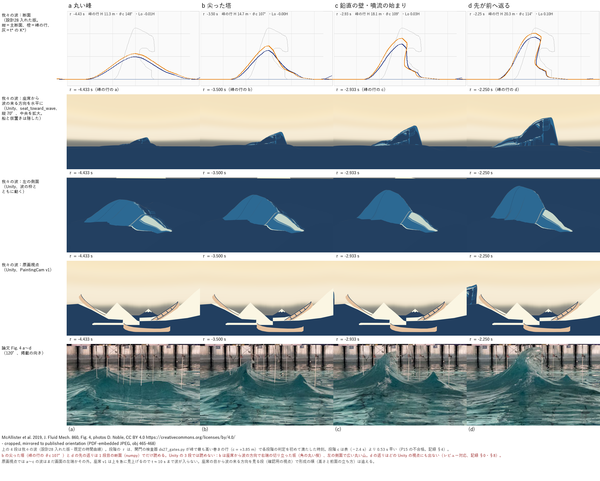
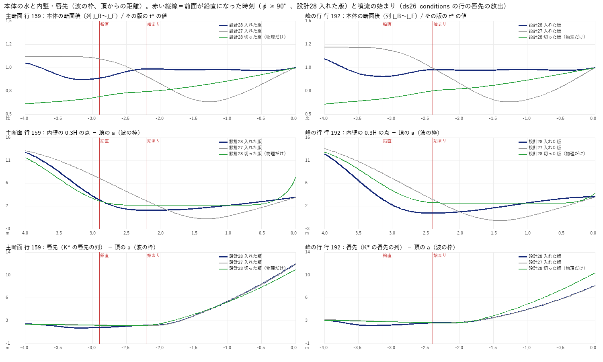
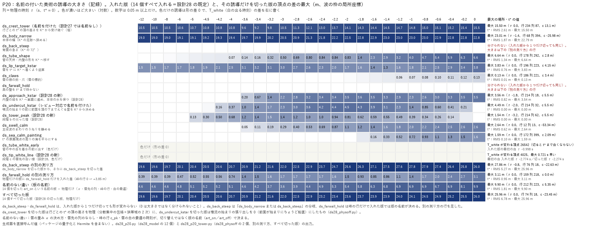
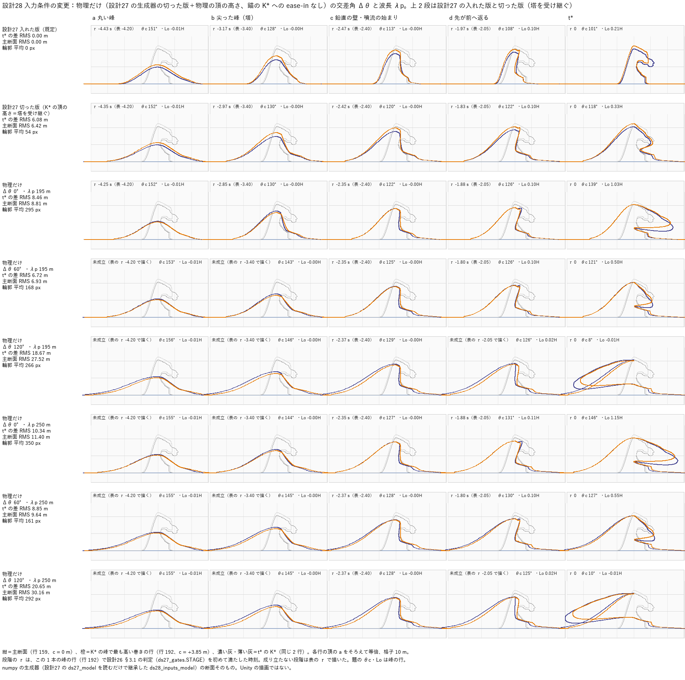

# 設計28：原画の弧へ近づける調整を比べる ― 入力条件の変更（物理）と美術の誘導を別に記録する

日付：2026-09-27／状態：初回提出＋レビュー対応（第11節。numpy の生成器・関門の検査器と、Unity の PC オフスクリーン描画。**HMD 実機の結果ではない**）。

- 対象：[制作設計書](../Design/GreatWave_VR_Production_Design_ja.md) §9 段階5 の設計28「原画の弧へ近づける調整を比較する｜入力条件の変更と、美術的な誘導・変形を別に記録」。[段階9までの実行計画](../Design/Stage9_Plan_2026-09-26_ja.md)（以下「計画」）§2.1 の設計28（［Q10］：入力条件の変更（交差角 0／60／120°、波長 195／250 m）、較正の掃引（噴流の始まり 2.0／2.4／2.8 s、砕波の広がり 20／30 m/s、c0 16 m/s の見え方、減速を噴流の前から始める案）、美術の誘導（切った版と入れた版）を別々に記録）と、[設計26 の記録](Design_26_ja.md) §9 の設計28 の行、[設計27 の記録](Design_27_ja.md) §6.1 の引き継ぎ 1〜5。
- 時間の上限：計画は ≤0.5 日。実績（2026-09-27、ファイルの時刻から）：物理の側（入力条件の変更・較正の掃引・解算の数値の JSON）08:40〜09:25（約 0.75 時間）、美術の誘導の作り直し 08:45〜11:30（約 2.75 時間。前と並べて走らせた）、統合（切った版の物理の頂の高さ、確認用の視点、描画、証拠、記録、コミットの一式）11:29〜12:10（約 0.7 時間）。初回提出までは通しで 08:40〜12:10（約 3.5 時間、0.44 日）で、上限の内。レビュー対応（第11節）が 12:25〜13:15（約 0.8 時間）。合計 約 4.3 時間（0.54 日）で、計画の上限を超えた。超えたのはレビューの指摘の直しの分で、この記録では上限を変えない（AGENTS.md の時間枠の 2 のとおり、残りの選択肢を第8節で報告する）。1 回の計算はどれも 30 分以内（生成 8〜13 分、関門 1 回 3.5〜8 分、Unity 1 回 10〜70 秒）。
- 修正回数：美術の誘導の生成器は初回の統合（r00）の後に修正 2 回（r01・r02）。その後、動きを変えない数値の条件（節点の適応の回数の上限 6 → 9）だけで作り直した。入力条件の掃引は統合の後に 1 回直した（Δθ 0° の砕波の広がりの起点）。損切り（修正 2 回まで）に従い、残った不合格は記録のみにした（第6節）。統合で足したもの（切った版の物理の頂の高さ、確認用の視点）とレビュー対応（ds_undercut_kstar の名前付けと、切った版・入力条件の掃引の「物理だけ」の作り直し）は入れた版の動きを変えない（入れた版のパッケージは SHA-256 まで同じ）ので、修正に数えない。
- 対応するバックログ：計画 §2.1 の設計28 には項目番号が書かれていない（時間の上限だけ）。この番号で値を持つのは、t\* の原画の関門の回帰の確認（28修正01 と同じ評価器の項目。後退なし）と、連続性の項目 80（記録のみ）・106（不合格、行の間の伸び 14.2 倍。設計27 10.9 倍）・107（不合格、面の反転 4。設計27 30）・111（記録のみ。唇のすべての列 16,785 点が重力だけ）。[metrics.json](../Evidence/Design/28/metrics.json) の `backlog`。
- 証拠の種類：numpy の生成器（パッケージを作る）と関門の検査器（パッケージを Hermite で読む）。入力条件の掃引は、生成器の解析式を直接測った値（パッケージでも Unity でもない）。Unity 6000.4.3f1 の batchmode の PC オフスクリーン描画（RTX 3080、Direct3D11）。Houdini は使っていない。利用者の Houdini 解算のファイルは開いておらず、設計26 の記録に写した数値だけを使った。
- 座標と単位：設計27 と同じ（m・s。K\* の断面座標 a = 進行方向 t、y = 上、c = 波峰線方向。主断面は c = 0 の行 159、峰で最も高い巻きの行（峰の行）は c = +3.85 m の行 192。τ は物理の時刻で t\* = 0、t は体験の時刻で t\* = 12.0 s）。H\* = 20.80 m。
- 利用者の決定（第7節）：D30（60°、形成の過程は利用者の写真＝論文 Fig. 4 a〜d）・D31（既定の時間曲線と代案）・崩壊を作らない（Q11）・副峰を足さない（Q12）・解算の数値を数値だけ入れる（Q12）。

## 見るもの

| 段階 a〜d と論文 Fig. 4 a〜d（入れた版・既定。上から断面・座席から波の方向・左の側面・原画視点・論文） | 本体の水・内壁・唇先（設計27 と設計28 の入れた版、設計28 の切った版） |
| --- | --- |
|  |  |
| **美術の誘導 14 個の大きさ（P20）** | **入力条件の変更（物理だけ）の断面：Δθ 0／60／120°・λp 195／250 m** |
|  |  |

- 動画（1280×720、30 fps、t 0〜14 s、421 コマ。左上＝設計27 の入れた版、右上＝設計28 の入れた版（既定）、左下＝設計28 の切った版（物理だけ、14 個を切る）、右下＝凡例と時間の目盛り（赤＝段階、青い縦線＝今の t）。既定の時間曲線）：[原画視点](../Evidence/Design/28/ds28_compare3_painting.mp4)／[座席から波の方向](../Evidence/Design/28/ds28_compare3_seat_toward_wave.mp4)／[左の側面](../Evidence/Design/28/ds28_compare3_side_left.mp4)／[座席 v1](../Evidence/Design/28/ds28_compare3_seat.mp4)。1920×1080 の元の動画（入れた版の代案の時間曲線、座席の仰角 30° を含む）と連番は Git 対象外の `Unity/Build/Design/28/<組>/video/`・`frames/` にあり、SHA-256 は run.json。
- 段階の静止画は物理の時刻 τ で描くので、入れた版の代案の時間曲線も既定と同じ画像になる（代案は動画だけ別に描いた）。
- **Unity の描画で見えることは小さい**（レビュー対応で測った）：設計27 と設計28 の入れた版の動画の連番を f150〜f360 の 6 コマおきに比べると、色が 0.1 を超えて違う画素は最大で原画視点 2.9%・座席から波の方向 6.1%・左の側面 1.3%・座席 v1 1.2%。t\* の画像は同じ。段階 b の尖った塔、d の前への返り、噴流の後の引き戻しがなくなったことは、断面の図（[断面の並べ図](../Evidence/Design/28/fig_ds28_sections.png)、[Fig. 4 の図](../Evidence/Design/28/fig_ds28_p15_fig4.png)の 1 段目）と[水と内壁の図](../Evidence/Design/28/fig_ds28_water_wall.png)で見る（第8節）。
- **座席から波の方向（seat_toward_wave）は確認用の視点で、設計の変更ではない**。座席 v1 の目（甲板の 1.2 m 上）から、波の枠の進む向き t の逆を水平に、縦の画角 70° で見る。座席 v1 は上を急に見上げるので形成が画面に入らず（設計27 の限界 4）、座席の仰角 30° は前景の仮置きが隠したので足した。前景（白い三角と暗い斜面の仮置き。設計39・40 まで）を描くと段階 a〜c の波を隠すので、証拠の動画と並べ図は船・富士・前景を隠して描いた（隠さない静止画も `Unity/Build/Design/28/art_on_default/stills/ds27_seat_toward_wave_ctx_*.png` に残した）。
- ほかの図：[段階の並べ図：3 つの版 × 座席から波の方向・左の側面 × a・b・c・d・唇先の頂点・t\*](../Evidence/Design/28/fig_ds28_stages_compare.png)、[段階 c〜d の唇先の白（原画視点と座席から波の方向の拡大）](../Evidence/Design/28/fig_ds28_white_c.png)、[断面の並べ図：設計27 と設計28 の入れた版、噴流の始まりの前から t\*](../Evidence/Design/28/fig_ds28_sections.png)、[修正ごとの断面](../Evidence/Design/28/fig_ds28_revisions.png)、入力条件の変更の図（[原画視点の上の輪郭](../Evidence/Design/28/fig_ds28_inputs_outline.png)・[物理の頂の高さと育ち方](../Evidence/Design/28/fig_ds28_crest_physics.png)・[物理の育ち方にした断面](../Evidence/Design/28/fig_ds28_inputs_growth_sections.png)・[Unity の左の側面](../Evidence/Design/28/fig_ds28_inputs_unity_side.png)）、[較正の掃引の断面](../Evidence/Design/28/fig_ds28_calib_sections.png)。
- 数値：[metrics.json](../Evidence/Design/28/metrics.json)（既定の決め方 `default_decision`、組ごとの関門と判定の語 `gates`、P20 `p20`、入力条件の掃引の全体 `inputs_sweep`、t\* の測り直し、再生の照合、keypose、決定性、唇の弾道、確認用の視点、修正の記録、時間、バックログ、引き継ぎの対応）。実行条件と SHA-256：[run.json](../Evidence/Design/28/run.json)。
- 断面の図・P20・入力条件の図は numpy の図、座席・側面・原画視点の図と動画は Unity の実描画。論文の写真は PDF から取り出した埋め込み JPEG（設計26 の run.json の SHA-256 を照合）を掲載の向きへ左右反転し、図の中に CC BY の表示を書いた。利用者の高解像度の写真（webp）は使っていない。

## 0. 結論

1. **設計28 の既定の動きは、美術の誘導を作り直した入れた版にした**（`Tools/GWWaveGen/ds28/ds28_model.py` の art_on。名前の付いた美術の誘導 14 個をすべて入れる。t\* = K\*、差 1.20 mm）。設計27 の入れた版から変わったのは次の 4 つ（第3節）。どれも**数値と numpy の断面では変わったが、Unity の描画ではほとんど見えない**（入れた版どうしの画素の差は最大 1.2〜6.1%、t\* は同じ。第8節）：
   - **噴流の始まりの後の K\* への押し戻しをなくし、引き戻しを半分ほどにして噴流の始まりの前へ移した**（引き継ぎ 1）：内壁の錨の ease-in と ψ_t を、名前の付いた誘導 `ds_approach_kstar` に替えた。ds26 の較正の噴流の始まり（行の唇先の放出）からは、内壁と唇先は波の枠で前へだけ進む（戻りの最大 0.167 m、設計27 は同じ検査器で 4.49 m・117 行）。**ただし前面が鉛直になった時刻（P7・P17 の起点）から測ると、内壁の 0.3H の点は最大 2.97 m 頂へ戻り（行 191、τ −2.42 s）、133 行中 119 行が 0.3 m を超える**（設計27 は同じ読みで 6.32 m・120 行）。この「えぐり」は K\* から決めていて（レビュー対応で `ds_undercut_kstar` と名付けた）、噴流の始まりの後に錨が K\* の位置へ進むので、戻ってから前へ出る動き自体は残っている。内壁の 0.3H の点は頂より後ろへは出ない（最小 主断面 +0.90 m・峰の行 +0.29 m。設計27 は −0.86 m・−1.22 m）。シートの上の本体の水（設計27 の −37%・+33% と同じ定義）は 4,873 m³（τ −4.2 s）→ 3,933 m³（τ −2.8 s、−19%）→ 4,447 m³（t\*、+13%）。P17（前面が鉛直 → t\*）は主断面 11.3%・峰の行 9.5%・巻きの行の最大 11.5%（設計27 は 35%・45%・47%）。
   - **段階 b の頂を numpy の断面で尖らせた**（引き継ぎ 2）：`ds_tower_peak`。峰の行の b の頂の角 θc 107.0°（主断面 108.6°、設計27 128.9°）。**Unity の描画では b は塔に読めない**（座席から波の方向では右端の切り立った坂＝角の丸い楔、左の側面では広い丸い山。設計27 も同じ）。
   - **段階 c の唇先の白**（引き継ぎ 2）：色だけの `ds_tip_white_line`。最初の白は τ −2.77 s（設計27 −2.30 s）。**原画視点と座席から波の方向の拡大で、約 −2.6 s から途切れた細い白が読める**（設計27 は −2.1 s ごろから）。拡大しないと読めず、設計28 の峰の行の段階 c（−2.93 s）にはまだない。原画視点では c の波はまだ画面の左端かその外。
   - **峰の行の外側の唇も重力だけで飛ぶ**（引き継ぎ 3）：唇のすべての列（147 行・16,785 点）が −9.81 ± 0.5 m/s²（設計27 の行 193〜214 は −9.3 → −0.5 m/s²）。d の前への返りは断面では出るが、どの Unity の視点にも出ない。
2. **入力条件の変更（物理だけ）では、既定の 60°・195 m が最も K\* と写真の順に近い**（第2節）。入力条件の掃引の「物理だけ」は、設計27 の生成器で美術の誘導をすべて切り、行ごとの t\* の頂の高さも物理（分散集中の包絡＋2 次）にし、**レビュー対応で設計27 の錨の K\* への ease-in も切った**版（設計28 の切った版とは別の生成器。第2.1節）。t\* の K\* との差 RMS 6.72 m（ease-in 入りでは 6.80 m）、落ちるのは P15 だけで唇は前へ巻く。0° は張り出しが K\* の約 2.7 倍で波峰線に沿った順（P10）もない、120° は波峰線に沿った局在は最も塔に近いが前へ巻かない（論文の上向きの噴流と同じ向き）、250 m はどの角でも差が 2〜4 m 増える。**どの入力の物理からも b の尖った塔は出ない**（θc 130〜146°）。塔は美術の誘導である（設計26 §1.1 と同じ結論）。
3. **較正の掃引から既定に採った値はない**（噴流の始まり 2.4 s・広がり 20 m/s・c0 20 m/s・β 0.8 のまま）。広がり 30 m/s は関門を通し利用者の解算の換算（設計26 §7.1 の 28〜33 m/s）とも合うが、生成器の 3 回目の修正になり、主断面の段階 a が許容の端に寄り、関門の表も変える必要があるので採らず、選択肢にした（第2.4節・第8節）。
4. **美術の誘導は 14 個を名前で記録した**（第3節、P20）。設計27 で名前のなかった「行ごとの t\* の頂の高さ（塔）」を `ds_crest_tower`、レビューで見つかった「噴流の始まりの前のえぐりの量を K\* から決める分岐」を `ds_undercut_kstar` と名付け、切った版（物理だけ）ではどちらも切った（引き継ぎ 4）。大きさ（入れた版からその 1 つだけを切った差の最大）は `ds_body_narrow` 23.0 m、`ds_crest_tower` 15.5 m、`ds_tube_shape` 6.6 m、`ds_undercut_kstar` 4.5 m（t\* で 0）、`ds_lip_target_kstar` 3.8 m、`ds_approach_kstar` 3.6 m、`ds_swell_calm` 2.6 m、`ds_sea_calm_painting` 1.6 m、`ds_tower_peak` 1.5 m、`ds_claws` 0.13 m。**`ds_back_steep`・`ds_farwall_hold` は入れた版から 1 つだけ切っても形が変わらない（分けられない）**ので、別の測り方で測った：`ds_back_steep` は `ds_body_narrow` を切った後にさらに切ると最大 27.9 m（背面全体）、`ds_farwall_hold` は物理だけの版に 1 つだけ入れると 3.1 m。**名前のない、版の名前（art_on／art_off）で決まる違い**（唇の重み κ・唇先の列のならし・峰の行・白の最遅の時刻）もあり、最大 9.9 m・白の時刻が変わる頂点 39,562。14 個すべて切ると t\* の差は RMS 6.78 m・最大 26.0 m。
5. **関門**（第4節）：入れた版（既定・代案）は P1・P4〜P6・P8〜P12・P14・P16・P19・原画の前提が合格。**P18 は読みで分かれる**（ds26 の較正の噴流の始まりから測ると 0.167 m で合格、前面が鉛直になった時刻から測ると 2.97 m で不合格。記録のみ扱い）。**P2・P3・P7・P13・P15・P17 は不合格で、修正 2 回の後なので記録のみ**。P15 は段階 c が表より早い（主断面 −2.73 s（表 −2.21）、峰の行 −2.93 s（表 −2.40）。a・b・d は ±0.3 s の内）、P7 はそのため前面が鉛直 → t\* が 2.90・3.15 s（上限 2.8 s）、P17 は主断面だけ 11.3%（上限 10%）。P14 の「合格」は設計27 と同じ読み（両方の版があり、差を記録した）で、「切った版も P1〜P13・P15・P16 を通す」は満たさない（第3.3節）。t\* の原画の関門は後退なし（差の最大 0.247 px、±0.5 px。t\* の画像は設計27 の入れた版と画素まで同じ）。
6. **正直に書くこと**：噴流の始まりの後の押し戻しはなくなったが、そのかわり**噴流の始まりの前（段階 b〜c）に前面を頂の下までえぐる**。本体の断面積は段階 b の後に t\* の値の 0.87〜0.91 倍まで下がり（τ −3.2〜−3.1 s）、噴流の始まりまでに約 0.98 倍へ戻る。えぐりの量は K\* から決めている（`ds_undercut_kstar`。切ると前面は噴流の始まりにちょうど鉛直になり、入れた版の 37 行で錨が始まりの後に最大 0.54 m 戻る）。利用者の解算では前面が鉛直になるコマと噴流の始まりが同じ（設計26 §7.1）だが、設計28 の入れた版は噴流の始まりの 0.5〜0.75 s 前に前面が鉛直を過ぎる。利用者が同じ「引き戻し」に見るかは見てもらう必要がある（第8節の 1）。段階 c の早さ（P15・P7）もこのえぐりが原因で、今の唇の速さでは、P15 の c・d と、P18（どちらの読みでも）・P13(2)（2 g）を同時には満たせない（第5節の 1）。

---

## 1. 目的

設計書の設計28 は「原画の弧へ近づける調整を比較し、入力条件の変更と、美術的な誘導・変形を別に記録する」。Q10（2026-09-26）で大波の動きに物理の入力（交差角・波長）ができたので、計画の「(b) の読み替え」（立体解釈 3 案を入力の代わりに読む）はやめ、次の 3 つを分けて記録した。

- **入力条件の変更（物理）**：交差角 Δθ 0／60／120°、代表の波長 λp 195／250 m を 1 本ずつ変えた「物理だけ」の波（第2節）。
- **較正の掃引**：物理の範囲の中で選んだ値（噴流の始まり、砕波の広がり、c0、減速の始め）を振った（第2.4節）。
- **美術の誘導**：名前の付いた値で、切れる。入れた版と切った版、その 1 つだけを切った版との差（P20）で大きさを記録した（第3節）。

あわせて、設計27 から渡された 5 つ（K\* への引き戻し、段階 b の見え方と c の白、峰の行の外側の唇、切った版の頂の高さ、解算の数値の JSON）を扱った。

---

## 2. 入力条件の変更の比較（物理）

担当の出力：`Unity/Build/Design/28/inputs/`（Git 対象外）。表は [metrics.json](../Evidence/Design/28/metrics.json) の `inputs_sweep`、図は `fig_ds28_inputs_*.png`・`fig_ds28_crest_physics.png`・`fig_ds28_calib_sections.png`。生成器は設計27 の `ds27_model.Generator`（コミット c2b6839、`ds27_model.py`・`ds27_params.json`・`ds27_gates.py` の SHA-256 を照合して読むだけ）を継承した `Tools/GWWaveGen/ds28/ds28_inputs_model.py` の `InputGen`。既定の値で設計27 の入れた版・切った版と頂点まで同じ（差 1×10⁻¹⁴ m、レビュー対応の後も確かめた）で、測定器 `ds28_inputs_measure.py` は設計27 の関門の値を再現する（切った版の t\* RMS 6.08／最大 26.0 m（行 74）／主断面 6.42 m、入れた版 P1 18.4 m/s、P7 2.43／2.63 s、P15 峰の行 −4.43／−3.17／−2.47／−1.97 s、P16 −1.57 m/s²）。43 本を 8 プロセスで約 7 分。全 240 行を解析式で直接測った（低解像度にする必要はなかった）。

### 2.1 「物理だけ」の作り方（入力条件の掃引）

- 美術の誘導 9 個（設計27 の切り替え）をすべて切る。
- **設計27 の錨の K\* への ease-in を切る**（レビュー対応）。設計27 の生成器は、内壁の錨を a_ja = 頂 + H·[D(σ)(1 − E) + q\*·E] に置き、E は τ −2.0 s から t\* への ease-in、q\* は K\* の錨の位置である。これは切り替えの外にあり、切った版にも掛かっていた。初回の提出の「物理だけ」も同じで、主断面の錨は 0.14H（τ −2.4 s）→ 0.068H（−1.0 s）→ 0.174H（t\*、K\* と同じ）と、戻ってから K\* へ押し出されていた。`InputGen` に `anchor_to_kstar` を足し、物理だけでは E の項を消した。錨は設計27 の表 D(σ) のままで、寝た前面 0.67H から σ −4.6〜−1.1 で頂の真下へ寄り、切った版は 0.02H で止まる。この D(σ) は K\* から決めた値ではないが、噴流の始まりの後も σ −1.1 まで錨が頂へ寄る（主断面 0.14H → 0.02H）。
- **行ごとの t\* の頂の高さを物理から決める**（設計27 の引き継ぎ 4）：±Δθ/2 の 2 系の分散集中（設計27 の搬送波と同じ成分、JONSWAP γ 3.3、NewWave の重み）の波峰線に沿った包絡 E(c) と、狭帯域の 2 次 H = A_L·E + ½·k̄·(A_L·E)²（設計26 E2 と同じ式）。焦点（c = 0）で H\* = 20.80 m（K\* の大きさは美術の選択として変えない）。K\* の頂が 3 m 以上の 175 行に当て、各行の K\* の断面を縦に H_phys/H_K\* 倍した手本を使う（唇先・rim・錨の列は元の K\*）。
- 唇の水平の打ち出しは cos²(Δθ/2) に比例（60° で 1 倍、0° で 4/3 倍、120° で 1/3 倍。設計26 §1.1 の自前の導出）。c0 は入力から（20.0 m/s ×（c(λp)/c(195 m)）×（cos 30°/cos(Δθ/2)））。
- t\* の行ごとの頂の高さ（c = −29.5／−15／0／+5.5／+12 m）：K\* 3.5／11.2／20.8／23.3／8.7 m。60°・195 m 14.2／18.8／20.8／20.5／19.5、120°・195 m 7.3／15.4／20.8／20.0／17.1、0° は一様 20.8。K\* の奥の +5 m の塔と c > 8 m の落ち込みは、どの入力でも出ない。
- **設計28 の切った版（物理だけ）とは別の生成器**である。設計28 の切った版は設計28 の生成器（`ds28_physoff.py`）で 14 個の誘導を切り、錨は噴流の始まりに前面がちょうど鉛直になる位置へ寄ってそこに留まる（第3.3節）。掃引は入力どうしを比べるための版で、t\* の差の値を設計28 の切った版の値と同じものとして比べない（[metrics.json](../Evidence/Design/28/metrics.json) の `physics_only_definitions`）。

### 2.2 入力の 6 本（物理だけ。噴流の始まり 2.4 s・広がり 20 m/s）

「輪郭」は原画視点（PaintingCam v1）の t\* の上の輪郭の差の平均（numpy の投影）。段階は峰の行（表 −4.2／−3.4／−2.4／−2.05 s）、「—」は成り立たない。値はレビュー対応の後（錨の ease-in なし）。括弧の中はレビューの前（ease-in 入り）の t\* の差 RMS。

| 入力 | c0（m/s） | t\* の差 RMS（全頂点／本体の列／主断面、m） | 最大（m） | 輪郭（px） | 張り出し Lo/H（主断面・峰の行。K\* 0.41・0.21） | 段階 a／b／c／d（s） | b の θc | 落ちた関門 |
| --- | --- | --- | --- | --- | --- | --- | --- | --- |
| 参考：設計27 の切った版（塔と ease-in を受け継ぐ） | 20.0 | 6.08／6.59／6.42 | 26.0 | 54 | 0.31・0.33 | −4.35／−2.97／−2.42／−1.83 | 130° | P15 |
| 0°・195 m | 17.3 | 8.46／9.86／8.81（8.59） | 22.0 | 295 | 1.10・1.03 | −4.25／−2.85／−2.35／−1.88 | 130° | P6・P10・P15 |
| **60°・195 m（既定）** | 20.0 | **6.72／7.43／6.93**（6.80） | 26.0 | 168 | 0.52・0.50 | —／—／−2.35／−1.80 | 143° | P15 |
| 120°・195 m | 34.6 | 18.67／22.01／27.52（18.57） | 48.1 | 266 | −0.01・−0.01 | —／—／−2.37／— | 146° | P6・P15 |
| 0°・250 m | 19.6 | 10.34／11.88／11.40（10.48） | 31.5 | 350 | 1.24・1.15 | —／—／−2.35／−1.88 | 144° | P6・P10・P15 |
| 60°・250 m | 22.6 | 8.85／9.72／9.64（8.93） | 37.1 | 161 | 0.58・0.55 | —／—／−2.37／−1.80 | 145° | P15 |
| 120°・250 m | 39.2 | 20.65／24.40／30.16（20.54） | 53.1 | 292 | −0.01・−0.01 | —／—／−2.37／— | 145° | P6・P15 |

- P1・P4・P5・P7・P16 はすべての入力で合格（60°・195 m の P7 は主断面 2.52 s・峰の行 2.38 s）。唇の逆算の目安の範囲の割合（設計26 E1）は入力によらず 0.979。測っていない関門：P2・P3・P8・P9・P11〜P13（解析式の直接の測定なので）。**「落ちるのは P15 だけ」は、測った 8 つの関門（P1・P4〜P7・P10・P15・P16）の中の話**で、設計28 の切った版（第4節）はパッケージで測った関門のうち P2・P3・P5・P7・P9・P13・P17・P18 も落とす。
- ease-in を切っても t\* の差 RMS は小さく変わっただけ（60° で 6.80 → 6.72 m）。錨を K\* へ寄せても管の天井や唇の形は K\* に合わないので、全体の差は K\* へ寄っていなかった。張り出し Lo/H は大きくなった（60° の主断面 0.36 → 0.52。錨が頂の真下に残るため）。落ちる関門の組は変わらない。
- 120° では模様の速さ 34.6 m/s に水（0.37 c0 = 12.8 m/s）がついて行けず、唇が峰の後ろへ残る（t\* の断面の後ろの輪は、我々の唇の模型をこの角へ当てはめた結果で、論文の上向きの噴流そのものではない）。0° は唇が 1.47 c0 で前へ飛び、張り出しが K\* の 2.7 倍になる。

### 2.3 物理の育ち方（主役の峰を模様の速さで追った高さ、主断面。Δθ によらない）

| τ（s） | −10.12 | −8 | −6 | −4.2（a） | −3.4（b） | −2.4（c） | −2.05（d） | −1 | 0 |
| --- | --- | --- | --- | --- | --- | --- | --- | --- | --- |
| 物理 λp 195 m（H/H\*） | 0.505 | 0.571 | 0.647 | 0.743 | 0.790 | 0.874 | 0.904 | 0.975 | 1 |
| 物理 λp 250 m | 0.546 | 0.612 | 0.693 | 0.775 | 0.825 | 0.901 | 0.926 | 0.981 | 1 |
| 設計27 の較正（峰の行） | 0.170 | 0.209 | 0.332 | 0.532 | 0.676 | 0.894 | 0.909 | 0.956 | 1 |

段階 c・d からの高さは物理と 0.02 以内で合う。a・b より前は合わない：線形の分散集中では、体験の始まり（τ −10.1 s）に峰がもう約 10 m ある。設計27 の「約 3.5 m から 6 s で育つ」は較正（美術寄りの選択）である。物理の育ち方にすると峰の行の段階 a・b は成り立たず、λp 250 m では全行が τ −12 s より前に 0.5H を超えて P10 が落ちる（[物理の育ち方の断面](../Evidence/Design/28/fig_ds28_inputs_growth_sections.png)）。この版では育ち方を変えず、記録だけにした（第5節の 8）。

### 2.4 較正の掃引（既定の入力 60°・195 m）

| 値 | 入れた版（設計27 の生成器、t\* = K\*）の落ちた関門 | E1 | 物理だけ（ease-in なし） | そのほか |
| --- | --- | --- | --- | --- |
| 噴流の始まり 2.0 s | P15（c が成り立たず、白の判定も落ちる） | 0.979 | P15 | |
| **2.4 s（設計26、既定）** | なし | 0.979 | P15 | |
| 2.8 s | P5（峰の行の唇先 0.997 × 峰）、P7（3.02 s）、P15、P16（+2.62 m/s²。時間曲線が 2.4 s 用のまま） | 0.965 | P7・P15 | |
| 広がり 30 m/s | なし（P15 主断面 a の差 −0.29 s、許容 0.3） | 0.974 | P15 | 行の始まりから当てはめた広がり 31.9 m/s（20 m/s は 23.9）。解算の 15〜18 m/s の換算は 28〜33 m/s（設計26 §7.1 と同じ最終の峰の基準。噴流の始まりの峰の基準まで含めると 27.6〜37.4 m/s） |
| c0 16 m/s | なし（P1 14.7 m/s、P5 峰の行の唇先 16.26 m/s） | 0.979 | P15 | 下の「滑って見えるか」 |
| 減速を噴流の 1.8 s 前（段階 a）から | なし（P1 17.4 m/s） | 0.979 | P15 | |

- **滑って見えるか**（c0 16 m/s の見え方）：t\* の主断面の足跡は入れた版 20.0 m、物理だけ 42.8 m。その 2 倍の波長の自由な波の速さとの比は、入れた版 2.53（c0 16 m/s で 2.03）、物理だけ 1.73。**滑って見える原因は幅の細い美術の本体（`ds_body_narrow`）で、c0 を 16 m/s にしても比は 2.0 までしか下がらず、入力（60°・195 m の模様の速さ 20 m/s）とも合わなくなる**。
- **既定の決め方**（[metrics.json](../Evidence/Design/28/metrics.json) の `default_decision`）：どれも既定に採らなかった。
  - 2.0 s・2.8 s は関門を落とす。c0 16 m/s は滑りを解かない。減速を前から始める案は見え方の差が小さい（ただし設計28 の入れた版の P15 の c・P7 を直す候補。第5節の 1 の選択肢 (b)）。
  - **広がり 30 m/s は採らず、選択肢にした**。関門は通り、利用者の解算の換算とも合う（20 m/s の 23.9 m/s は換算の範囲より低い）。採らなかった理由：(1) 設計28 の生成器を作り直すと、修正 2 回（r01・r02）の後の 3 回目になる。(2) 主断面の段階の時刻が約 0.064 s 早まり（峰の行からの遅れ 3.85/20 → 3.85/30 s）、設計28 の入れた版の主断面の a（表との差 −0.24 s）が許容 ±0.3 s の端（約 −0.30 s、見積もり）に寄る。関門の表の主断面の時刻は設計26 の 20 m/s で作られているので、30 m/s にするなら表も変える（設計26 の値の変更）。見え方の差は、砕波が波峰線に沿って速く広がることだけ。

### 2.5 利用者の解算の時間との比較（引き継ぎ 5）

`Tools/GWWaveGen/ds27_user_sim_timing.json` を作った（Q12 で入れてよいとされた形）。**値は設計26 §7.1 の表の数値だけ**（表の見出しの峰の高さ 6.15 m・4.83 m、段階の長さ、噴流の始まり → Lo 0.1H、前面の立ち方、鉛直の前面の頂の角、鉛直の前面と噴流の始まりが同じコマであること、峰の上昇率、d の間の頂の上昇、噴流の初速と比、唇先の縦の加速度、唇先が 0.59H まで落ちる時刻、横への広がり。23 個）。出典はファイル名と SHA-256（1.abc `e945d8a6…7220`、1.fbx `b63e2ebe…cc7b`）と記録の節だけで、形・断面・メッシュ・置き場所（個人のパス）は入れていない。単位は 1 単位 = 1 m・24 fps の前提（D37 の②は未回答）と書いた。初回の提出では、表の外の 3 つ（φ ≥ 80° が噴流の始まりの 0.08 s 前から、段階 a の始まり → d の始まり 1.21 s（どちらも設計26 §3.1）、借りない平行移動の速さ 8〜17.5 m/s（§7.1 の「借りないもの」））とコマの番号も入れていたので、レビュー対応で消した（どのコードも読んでいなかった）。

K\* へ Froude で換算した値（時間 ×1.84〜2.08）と、峰の行の値：

| 量 | 解算（K\* へ換算） | 設計27 入れた版 | 物理だけ 60°・195 m（ease-in なし） |
| --- | --- | --- | --- |
| a → b（s） | 0.77〜0.87 | 1.27 | —（a・b が成り立たない） |
| b → c（s） | 0.99〜1.12 | 0.70 | — |
| 噴流の始まり → Lo 0.1H（s） | 0.31〜0.35 | 0.67 | 0.58 |
| 噴流の始まり → 唇先が 0.59H（s） | 2.30〜2.59 | 2.55 | 2.15 |
| 前面 90° → 160°（s） | 1.20〜1.35 | 1.52 | 2.23 |
| 唇先の打ち出し u / 峰の速さ | 1.07〜1.10 | 1.03 | 1.12 |
| 噴流の始まりの H/Hf | 0.79 | 0.87 | 0.88 |
| 噴流の始まりの θc | 120° | 115° | 125° |
| 横への広がり（m/s） | 28〜33 | 23.9 | 22.7 |

設計28 の入れた版は段階 c が早く（第4節）、a → b 0.93 s・b → c 0.57 s（峰の行の関門の時刻から）。解算の b → c（約 1 s）より短い。また解算では前面が鉛直になるコマと噴流の始まりが同じ（表の値）だが、設計28 の入れた版は前面が噴流の始まりの 0.5〜0.75 s 前に鉛直を過ぎる（第0節の 6）。

### 2.6 結論（物理の側）

1. 入力は既定の 60°・195 m のまま（D30 は変えない）。
2. 写真の見た目（b の塔、c の飛沫、d の返り）はどの入力の物理からも出ない：b の θc は 130〜146°（目標 ≤ 110°）、60° の物理だけでは峰の行の a・b が成り立たない。c の白は層6 の白の時刻で c に出る。b の塔は美術の誘導（`ds_crest_tower`・`ds_body_narrow`・`ds_back_steep`・`ds_tower_peak`）で作るしかない。
3. 較正は設計26 の値のまま（上の 2.4 節）。
4. レビュー対応で掃引の物理だけから K\* への ease-in を切っても、上の 1〜3 は変わらない。

---

## 3. 美術の誘導の記録（名前付きの値ごと）

大きさは P20：入れた版（14 個すべて入れる＝設計28 の既定）と、その 1 つだけを切った版の頂点の差（波の枠の局所座標、生成器を直接呼んだ値。`Unity/Build/Design/28/p20/ds28_p20.json`・`ds28_p20_tower.json`）。表の τ は差の最大の時刻、「効き始め」は差が 5 mm を超える最初の τ（τ の並びは −12, −10, −8, −6, −5, −4.5, −4.2, −4, −3.6 … −0.2, 0）。全体の図は [P20 の表](../Evidence/Design/28/fig_ds28_guidance_p20.png)。`ds28_model.py` の 12 個は `ds28_params.json` の切り替え、`ds_crest_tower`・`ds_undercut_kstar` は `ds28_physoff.Generator` の引数（入れた版のパッケージのバイトと記録の SHA-256 を保つため、`ds28_model.py`・`ds28_params.json` は変えていない。`ds28_params.json` の切り替えの一覧と「12 個」の注はこの 2 個を含まない）。

### 3.1 14 個の表

| 誘導（由来） | 入れたとき（入れた版） | 切ったとき（切った版） | 差の最大（m）・τ・場所 | t\* の差（RMS・最大、m） | 効き始め |
| --- | --- | --- | --- | --- | --- |
| `ds_crest_tower`（設計28 で名付けた。設計27 では名前がなく切った版にも掛かっていた） | 行ごとの t\* の頂の高さ = K\*（約 35 m の局所の塔の形） | 物理の頂の高さ（第2.1節の式、60°・195 m） | 15.5・t\*・行 234（c +13.1 m、K\* の頂が落ちる奥の壁の外側） | 2.61・15.5 | τ −12（全区間） |
| `ds_body_narrow`（設計26） | 本体の幅を K\* の足跡へ狭める | 物理の交差波群の背面と足跡 | 23.0・−1.4 s・行 68 列 394（c −26 m、前の足） | 1.87・22.8 | τ −12 |
| `ds_back_steep`（設計26） | 背面の急さ（K\* の 72°） | 物理の背面（約 40°） | **分けられない**（入れた版から 1 つだけ切っても形が同じ。`ds_body_narrow` と「どちらか入っていれば K\* の背面」の分岐）。別の測り方：`ds_body_narrow` を切った版からさらに切ると 27.9・−0.8 s・行 76 列 18（c −22.6 m、背面の足）。2 個を一緒に切ると t\* で最大 26.0。物理だけの版に 1 つだけ入れても t\* で最大 26.0 | 別の測り方で 5.27・26.0 | τ −12 |
| `ds_tube_shape`（設計26。設計28 で作り直し） | 管の天井を、噴流の始まりの形から K\* の形へ、唇の rim の進みに合わせて移す | 始まりの形のまま（両端とともに動く） | 6.6・t\*・行 178 列 292（管の天井） | 1.34・6.6 | τ −8 |
| `ds_lip_target_kstar`（設計26） | 唇が t\* に K\* へ着くよう打ち出しを逆算 | E1 の中央値の打ち出しから前へ積分 | 3.8・t\*・行 196（唇先） | 0.76・3.8 | τ −12（放出の前から 1.5 m） |
| `ds_claws`（設計26） | 唇の縁の鉤・爪を唇の標的に残す | 標的をならす | 0.13・t\*・行 186 | 0.01・0.13 | τ −2.0 |
| `ds_farwall_hold`（設計26） | 峰の行（砕波の広がりの起点）を +3.85 m にする | 物理の頂の峰（c = 0） | **分けられない**（入れた版では版の名前 art_on が峰の行を +3.85 m に決めるので、切っても同じ。「奥の壁を t\* まで砕かない」の実際の仕組みは下の名前のない違いの κ と白の時刻）。別の測り方：物理だけの版に 1 つだけ入れると 3.1・t\*・行 159 列 218（c 0）、白の時刻が変わる頂点 32,795 | 別の測り方で 0.95・3.1 | τ −12 |
| `ds_approach_kstar`（**設計28 の新**、設計27 の錨の ease-in と ψ_t の置き換え） | 噴流の始まりの後、内壁の錨を唇の rim の進みに合わせて K\* の位置へ単調に進める。本体の水を、始まりの 0.6 s 前の値（K\* の ±6%）から t\* の K\* へ一次式でつなぎ、背面の横の倍率 Lb を 2 つのなめらかな山で合わせる | 錨は始まりの位置のまま、Lb は表のまま | 3.6・−1.8 s・行 214 列 18（奥の壁の行の背面の足） | 0.82・3.5（行 206 の内壁） | τ −3.6 |
| `ds_undercut_kstar`（**レビュー対応で名前を付けた**。設計28 の修正2 の `ds28_model.anchor_q` の σ < −2.4 の分岐） | 噴流の始まりの前（σ −4.7〜−2.4）に、錨を始まりの位置 q_on まで寄せ、前面を頂の下までえぐる。q_on は放出の前の帯の一番前から、始まりの張り出し Lo_on = clip(0.2 − 0.45·ov_K\*, 0.06, 0.11)·h_c·H（ov_K\* は K\* の張り出しをならした値）を引いた位置で、K\* の錨の位置で頭打ち。えぐりの横の量は主断面 1.12 m・峰の行 2.16 m（本体の行の中央値 1.04 m、最大 2.30 m） | 始まりの張り出し 0（前面は噴流の始まりにちょうど鉛直。設計26 §7.1 の表の「鉛直の前面と噴流の始まりが同じコマ」）、K\* の錨で頭打ちしない。入れた版から切ると、37 行で錨が噴流の始まりの後に最大 0.54 m 戻る（K\* の錨が始まりの位置より頂に近い行） | 4.5・−2.0 s・行 214 列 32（c +5.5 m） | 0・0 | τ −4.5 |
| `ds_tower_peak`（**設計28 の新**） | 頂の帽子 ω を b で 0.02、c へ 0.75。放出の前の帯の上面の角を b で 46°（前面が頂から急に下りる）→ c で 28° | 設計27 の表（b で丸い帽子） | 1.5・−3.2 s・行 214 列 62 | 0・0 | τ −5.0（t\* で 0） |
| `ds_swell_calm`（設計26） | 主役波のまわりのうねりを最後の約 4 s で静める | うねりが残る | 2.6・t\*・行 12（シートの端） | 0.62・2.6 | τ −3.6 |
| `ds_sea_calm_painting`（設計26） | t\* の原画視点の周りの海（搬送波）を平らにする | 搬送波が残る | 1.6・t\*・行 172 列 399（シートの前の端） | 0.10・1.6 | τ −1.8 |
| `ds_tube_white_early`（設計26、色だけ） | 管の中・内壁の白を着水の前（τ −1.0〜−0.2 s）に出す | t\* まで白くならない（26,542 頂点） | 形 0 | 0 | τ −1.0 |
| `ds_tip_white_line`（**設計28 の新**、色だけ） | 唇先から K\* の弧長で 0.1H 以内の白を、行の唇先の放出の 0.4 s 前から 0.08 s で出す | 放出 + 0.1 s | 形 0。T_white が変わる頂点 4,025、最大 0.72 s 早い（最初の白 −2.77 s、切ると −2.27 s） | 0 | τ −2.8 |
| （名前のない違い：版の名前 art_on／art_off で決まる） | 唇の重み κ を K\* の巻きから行ごとに決める（157 行、44 行が κ < 1）、峰の行 +3.85 m、唇の白の最遅の時刻 | κ は頂の高さの smoothstep（175 行、κ < 1 なし）、唇先の列を波峰線方向にならす、峰の行は物理の頂の峰 | 9.9・t\*・行 212 列 223（c +5.35 m、奥の壁の外側の唇）。白の時刻が変わる頂点 39,562 | 1.81・9.9 | τ −12 |
| （14 個すべて切った版＝設計28 の切った版） | — | — | 26.0・t\*・行 74（c −23.5 m） | 6.78・26.0 | τ −12 |

- 14 個のうち、形を変えて t\* で効くのは `ds_crest_tower`・`ds_body_narrow`・`ds_back_steep`（分けられない）・`ds_tube_shape`・`ds_lip_target_kstar`・`ds_approach_kstar`・`ds_swell_calm`・`ds_sea_calm_painting`・`ds_claws`（と、物理だけの版に入れたときの `ds_farwall_hold`）。`ds_tower_peak` と `ds_undercut_kstar` は噴流の始まりの前後だけで効き、t\* では 0。色だけの 2 個は白の出る時刻だけを変える。
- 名前のない違い（最大 9.9 m）は切り替えではなく版の名前で決まるので、切った版（物理だけ）は「art_off という名前」の側にある。切り替えの外の違いとして記録した（`p20.unnamed_version_keyed`）。
- 原画視点の t\* の上の輪郭に効くのは、`ds_crest_tower`（切ると 120 px）と `ds_lip_target_kstar`（53 px）。`ds_body_narrow` は背面が原画視点で隠れるので 0 px（入力条件の掃引の t\* の測定、`inputs_sweep.summary.switches_tstar`）。

### 3.2 作り直した誘導の中身（引き継ぎ 1〜3）

生成器は `Tools/GWWaveGen/ds28/ds28_model.py`（設計27 の `ds27_model.Generator` を継承し、錨・管の天井・水の釣り合い・κ < 1 の唇・T_white を上書き。設計27 のファイルは変えていない）、値は `ds28_params.json`（設計27 の `ds27_params.json` の SHA-256 を照合して重ね、設計28 の値と修正の理由を書いた）。レビュー対応で名前を付けた 2 個は `ds28_physoff.py`。

- **`ds_undercut_kstar`（引き継ぎ 1 の前半。レビュー対応で分けた）**：噴流の始まり（行の唇先の放出。ds26_conditions の較正、峰の行で τ −2.4 s）の前は、内壁の錨を設計27 と同じ寝た前面（頂から 0.67H）から、行ごとの始まりの位置 q_on へ最小躍度の曲線で寄せる（σ −4.7〜−2.4、約 2.3 s。2 g の内）。q_on は、放出の前の帯の一番前の点から、始まりの張り出し Lo_on（行ごとに K\* の張り出しから 0.06〜0.11H）を引いた位置で、K\* の錨の位置で頭打ちし、頂より前に残る。`ds28_model.anchor_q` はこの分岐で切り替えを見ない（`ds_approach_kstar` を切っても残る）。初回の提出はこれを `ds_approach_kstar` の一部と書いたが、切れず、切った版（物理だけ）にも入っていた（レビューの前の切った版の前面が鉛直になった時刻からの戻り 3.63 m・133 行）。切ると、錨は同じ時刻に「帯の一番前の真下」（前面が噴流の始まりにちょうど鉛直）へ寄る。錨が寝た前面から寄ること（前面が立つこと）自体は切っても残る（K\* から決めた値ではない。時刻は設計28 の修正1 の較正）。
- **`ds_approach_kstar`（引き継ぎ 1 の後半）**：始まりの後は、唇の rim の局所の a が始まりの時の位置から K\* の位置まで進んだ割合 M（0〜1、単調）で q_on から K\* の錨の位置へ進む（後ろへは戻らない）。管の天井は、始まりの時の形から K\* の形へ同じ M で移し、両端の動きを列の割合で足す。本体の水は、行ごとの本体の断面積を、始まりの 0.6 s 前の値（K\* の ±6% に収める）から t\* の K\* の値へ一次式でつなぐよう、背面の横の倍率 Lb を 2 つのなめらかな山（始まりの 1.6 s 前から始まりまで 0 → 1、始まりから t\* まで 1 → 0 の最小躍度と、sin²）の最小二乗で合わせる。
- **`ds_tower_peak`（引き継ぎ 2）**：背面の頂の近くを縦に縮める頂の帽子 ω（設計27 の修正1。頂を丸める）の表を、段階 b で 0.02（ほぼなし）にし、c へ 0.75 へ上げる。放出の前の帯の上面の角を b で 46°（前面が頂から急に下りる）、c で 28°（設計27 と同じ）にする。断面では写真 b の尖った塔（峰の行の θc 107°）。Unity の描画では塔に読めない（第8節）。別に、背面の横の倍率 Lb の表を b（σ −3.4）で 2.0 → 1.75 に細くした（`ds28_params.json` の `overrides.back`。`ds_body_narrow` の表の値の変更で、`ds_tower_peak` を切っても残る）。
- **`ds_tip_white_line`（引き継ぎ 2、色だけ）**：写真 c の唇先の白。放出の 0.4 s 前から、唇先の近くだけ白くする。白は t\* の色区が白の頂点にだけ出る（シェーダーは設計27 のまま）ので、途切れた短い線になり、拡大しないと読めない。
- **κ < 1 の行の唇（引き継ぎ 3。切り替えではなく層4 の作り方）**：設計27 は唇の位置を本体の前面と κ で混ぜた（弾道でない）。設計28 は、放出の前は帯の置き場と本体の前面を κ で混ぜた所に置き、放出の時刻を κ 倍へ遅らせ（κ が小さいほど遅く、短く飛ぶ。対象は峰の行の外側の行 186〜214 と手前の端の行 58〜62）、放出の時の速さ・加速度から打ち出しの補間を経て、その後は重力だけで飛ばす（入れた版は t\* に K\* へ着くよう打ち出しを逆算）。K\* で巻く行のうち κ < 0.9 の行 60 は、打ち出しの補間を設計26 の表の時刻までに終える。当てはめ（打ち出しの補間の後 0.02 s から t\* まで、240 Hz、2 次式）：唇先と上面の s 0.25・0.5 の 440 点、**唇のすべての列（147 行・16,785 点、`ds28_review_checks.py`）のすべてが縦 −9.81 ± 0.5・水平 0 ± 0.5 m/s²**（縦 −9.85〜−9.77、水平の最大 0.14）。行 193〜206 の唇先は −9.81〜−9.80 m/s²。行 207〜214（κ ≤ 0.22）と手前の端の行 58・59 は、**打ち出しの補間の終わりから t\* までが 0.25 s に届かない**ので当てはめない（例：行 207 は唇先の放出 τ −0.51 s、補間の終わり −0.254 s、窓 0.234 s）。

### 3.3 `ds_crest_tower`・`ds_undercut_kstar` と、P14 と設計26 §1.1 の矛盾の扱い（引き継ぎ 4）

- 設計27 の切った版は、9 個の切り替えを切っても行ごとの t\* の頂の高さを K\* から受け継ぎ（175 行で相関 0.99999）、錨の ease-in（`anchor.to_kstar_sigma`）も掛かっていた。P14 は切った版に P1〜P13・P15・P16 の合格を求めるが、設計26 §1.1 は段階 b の尖った塔を美術の本体のものとしているので、切った版の P15 の b は仕様どおりには通らなかった（設計27 の限界 15）。
- 設計28 の扱い：
  1. 行ごとの t\* の頂の高さを名前の付いた美術の誘導 `ds_crest_tower` とし、**切った版では物理の頂の高さにする**（統合で作った `Tools/GWWaveGen/ds28/ds28_physoff.py`。`ds28_model` の切った版に、`ds28_inputs_model` の物理の頂の高さを重ねた。設計27 の錨の ease-in は設計28 の生成器にはない）。**レビュー対応で、噴流の始まりの前のえぐり（`ds_undercut_kstar`）も切った版で切った**。これが設計28 の切った版（物理だけ、14 個を切る）で、並べた動画の左下。レビューの前の切った版（えぐり入り）は `Unity/Build/Design/28/review_r0/` に参考として残した。
  2. **P15 の a・b（塔）と P19 は入れた版だけで判定し、切った版では記録のみとする**（進行役の判断、第7節）。塔は設計26 §1.1 のとおり美術なので、切った版に塔を求めない。
  3. **P14 の「切った版も P1〜P13・P15・P16 を通す」は満たさない**。切った版（物理だけ）は、塔と関係のない関門でも P2（0.472）・P3（0.124）・P5（峰の行の唇先 19.96 m/s が峰の速さ 20.02 m/s を超えない）・P7（前面が鉛直 → t\* 主断面 3.05 s・峰の行 2.87 s）・P9（最初の白 139 頂点のうち 17 が唇先の外）・P13（12 項目中 9 項目）と、設計28 の P17（0.33）・P18（0.425 m）を落とす（どれも記録のみ。[metrics.json](../Evidence/Design/28/metrics.json) の `gates.art_off_phys_default.verdicts`）。通るのは P1・P4・P6・P8・P10〜P12・P16。第4節の表の P14 の「合格」は設計27 と同じ読み（両方の版があり、切った版の t\* と K\* の差を記録した）で、「切った版も通す」の部分は含まない。初回の提出は、通る関門だけを並べて P14 の範囲のように書いていたので直した（この範囲を狭める決めごとはしていない）。
  4. 参考に、塔とえぐりを受け継ぐ切った版（`ds28_model` の 12 個を切り、頂の高さは K\*、`ds_undercut_kstar` は入る。設計27 の切った版と同じ扱い）も残し、関門を測った（第4節の表の参考の列）。
- 物理だけの版の t\* と K\* の差：RMS 6.78 m・最大 25.96 m（行 74 の後ろの足、c −23.5 m）・主断面 RMS 6.95 m（ds27_gates の P14 と同じ式。検査器はフォルダー名 art_on／art_off で隣の版を探すので、art_off_phys の報告の P14 は「見つからない」と出る。[metrics.json](../Evidence/Design/28/metrics.json) の `gates.*.P14_pair_ds28`）。レビューの前の切った版は RMS 6.73 m、塔とえぐりを受け継ぐ切った版は RMS 6.01 m（検査器の報告 `gates/art_on_default.json` の P14 の値 6.0086 はこの版と組んだ値）。
- **「物理だけ」は 2 つある**：この切った版（設計28 の生成器、14 個を切る）と、入力条件の掃引の物理だけ（設計27 の生成器、9 個を切り、錨の K\* への ease-in を切る。第2.1節）。別の生成器なので t\* の差（6.78 m と 6.72 m）を同じ版の値として比べない。

---

## 4. 関門の表

しきい値は設計26 §4.1、P17〜P19 は設計28 の検査器 `ds28_gates_extra.py`（P17：本体の水、前面が鉛直 → t\* の本体の断面積の変化 / t\* の値、主断面・峰の行 ≤ 0.10、巻きの行すべて ≤ 0.15。P18：噴流の始まりの後、内壁の 0.3H・0.5H の点と唇先が波の枠で後ろへ戻らない ≤ 0.3 m。起点は ds26_conditions の行の唇先の放出（較正の噴流の始まり）で、前面が鉛直になった時刻（ds27_gates の噴流の始まり、P7・P17 の起点）からの値も記録する。P19：峰の行の段階 b の θc ≤ 110°）。P1〜P15・P17〜P19 は物理の時刻で測るので、入れた版の既定と代案は P16 のほかは同じ値。値は `Unity/Build/Design/28/gates/<組>.json`・`.md`（Git 対象外）で、要点と判定の語は [metrics.json](../Evidence/Design/28/metrics.json) の `gates`。「記録のみ」は修正 2 回の後も落ちたので記録にした不合格。切った版は比較の版なので、判定はすべて記録のみ（第3.3節）。切った版（物理だけ）の列はレビュー対応の後（14 個を切る。えぐりも切った）の値で、括弧の中はレビューの前（えぐり入り）の値。

| # | 入れた版・既定（設計28 の既定） | 入れた版・代案 | 切った版（物理だけ）・既定 | 参考：塔とえぐりを受け継ぐ切った版 | 設計27 入れた版 |
| --- | --- | --- | --- | --- | --- |
| P1 | 18.4 m/s、戻り 0：合格 | 同左：合格 | 18.4 m/s（記録） | 18.5 m/s | 18.4 m/s 合格 |
| P2 | 0.644（行 68、τ −2.0 s）、主断面 0.257：**不合格・記録のみ** | 同左 | 0.472（行 60、τ −12 s） | 0.374 | 0.594 記録のみ（F1） |
| P3 | 0.285（行 60。主断面 −2.1%）：**不合格・記録のみ** | 同左 | 0.124（0.124） | 0.149 | 0.034 判定できない |
| P4 | −9.75 m/s²、落下 1.00 倍：合格 | 同左：合格 | −9.71 m/s² | −9.68 | −9.68 合格 |
| P5 | 20.8 m/s：合格 | 同左：合格 | 19.96 m/s（峰の行。峰の速さ 20.02 未満）（19.82） | 19.8 | 20.1 合格 |
| P6 | 1.06：合格 | 同左：合格 | 1.05 | 1.04 | 1.06 合格 |
| P7 | 主断面 2.90 s・峰の行 3.15 s（上限 2.8）：**不合格・記録のみ** | 同左 | 3.05 s・2.87 s（3.18・3.07 s） | 2.90 s・3.15 s | 2.43・2.62 s 合格 |
| P8 | 0.97：合格 | 同左：合格 | 0.97 | 0.97 | 0.96 合格 |
| P9 | 最初の白 τ −2.77 s の 58 頂点がすべて唇先：合格 | 同左：合格 | 139 頂点のうち 17 が唇先の外 | 132 頂点のうち 4 が唇先の外 | 合格 |
| P10 | −0.96、0.43 s：合格 | 同左：合格 | −0.95 | −0.74 | −0.95 合格 |
| P11 | 1.21 m：合格 | 同左：合格 | 1.23 m | 1.25 m | 1.21 m 合格 |
| P12 | 0 m：合格 | 同左：合格 | 0 m | 0 m | 0 m 合格 |
| P13 | 12 項目中 6 項目（第4.1節）：**不合格・記録のみ** | 同左 | 12 項目中 9 項目 | 9 項目 | 5 項目 不合格 |
| P14 | 両方の版があり、差を記録した：合格（設計27 と同じ読み）。切った版（物理だけ）の t\* の差 RMS 6.78 m・最大 26.0 m。「切った版も P1〜P13・P15・P16 を通す」は満たさない（第3.3節） | 同左 | （同じ組） | RMS 6.01 m（検査器の値 6.0086 はこの組） | 6.08 m 合格 |
| P15 | 主断面 a −4.25 b −3.32 c −2.73 d −1.63（表 −4.01／−3.21／−2.21／−1.86）、峰の行 a −4.43 b −3.50 c −2.93 d −2.25（表 −4.2／−3.4／−2.4／−2.05）。順は正しく、c だけ表より早い（0.52・0.53 s）。最初の白は主断面 −2.61 s・峰の行 −2.73 s の唇先：**不合格・記録のみ** | 同左 | 峰の行の a・b が成り立たない（c −2.73、d −1.28 s）。主断面 a −4.40 b −3.08 c −2.90 d −1.47 | 峰の行の c が成り立たない | 合格（読みの寛い側） |
| P16 | 全 133 行で下向き、最大 −1.40 m/s²、画面の落下 2.70 s：合格 | −2.97 m/s²、1.25 s：合格 | −1.46 m/s²（落下 3.31 s） | +1.65 m/s²（行 87） | −1.52 合格 |
| 原画の前提（t\* = K\*、≤ 1.31 mm） | 1.20 mm：合格 | 同左：合格 | 判定なし（t\* は K\* ではない） | 判定なし | 1.20 mm 合格 |
| P17 | 主断面 0.113・峰の行 0.095・巻きの行の最大 0.115（行 167）：**主断面だけ不合格・記録のみ**。噴流の始まりから測ると 0.020・0.022・最大 0.069 | 同左 | 0.328・0.305・0.328（0.348・0.334・0.349） | 0.316・0.330・0.506 | 0.354・0.446・0.469（不合格） |
| P18 | **読みで分かれる（記録のみ扱い）**：較正の噴流の始まりから 0.167 m（行 192 の 0.5H）で合格。前面が鉛直になった時刻から 2.97 m（行 191 の 0.3H、τ −2.42 s）・133 行中 119 行が 0.3 m を超えて不合格 | 同左 | 較正の始まりから 0.425 m（主断面の 0.5H、t\*）。鉛直から 1.81 m（行 146）・133 行（3.63 m・133 行） | 0.13 m。鉛直から 3.96 m・126 行 | 較正の始まりから 4.49 m（117 行）、鉛直から 6.32 m（120 行）：不合格 |
| P19 | 峰の行 107.0°（主断面 108.6°）：合格（numpy の断面の値。Unity の描画では塔に読めない、第8節） | 同左：合格 | b が成り立たない（記録） | 129.7° | 128.9° 不合格 |
| P20 | 記録（第3節） | | | | |

- まとめ（入れた版・既定と代案）：合格 13（P1・P4〜P6・P8〜P12・P14・P16・P19・原画の前提）、読みで分かれる 1（P18。記録のみ扱い）、不合格・記録のみ 6（P2・P3・P7・P13・P15・P17）、記録 1（P20）。P14 の合格は設計27 と同じ読みで、切った版が P1〜P13・P15・P16 を通すことは含まない。
- 設計27 との差：良くなったのは P17（35 → 11%）・P18（較正の始まりから 4.49 → 0.17 m、前面が鉛直からは 6.32 → 2.97 m）・P19（128.9 → 107.0°。断面の値）と、峰の行の外側の唇（弾道でない → 弾道）。悪くなったのは P3（判定できない → 0.285。えぐりで前面が鉛直になる時刻が早まり、判定の区間が長くなって、手前の端の小さい行 60 が落ちた）・P7・P15（段階 c が早い）・P13 の (2)（2 g の 1.13 倍）。
- **P18 の起点の選び方**：判定を較正の噴流の始まり（唇先の放出）からにしたのは進行役の判断（第7節）で、P7・P17 と同じ前面が鉛直の起点にすると入れた版は落ちる。内壁は頂より後ろへは出ない（0.3H の点の最小 主断面 +0.90 m・峰の行 +0.29 m）が、前面が鉛直を過ぎた後も噴流の始まりまで頂へ寄り（えぐり）、その後に K\* の位置へ前へ出る。噴流の後の押し戻しがなくなったのではなく、戻りが半分ほどに小さくなって噴流の始まりの前へ移った。
- 設計27 の入れた版の P17〜P19 は、設計28 の検査器で `Unity/Build/Design/27/art_on` を測った値（`Unity/Build/Design/28/gates/ds27_art_on_default_extra.json`）。
- 切った版（物理だけ）の P5 は唇先の水平の速さ 19.96 m/s が峰の速さ 20.02 m/s を超えない（打ち出しの補間の後は 22 m/s 前後）、P9 は奥の壁も砕けて最初の白の一部が唇先の外、P18 は主断面の付近の行の 0.5H の点が t\* の直前に最大 0.43 m 戻る。えぐりを切っても、前面が鉛直になった時刻からの戻り（1.81 m、全 133 行）が残る：錨が寝た前面から噴流の始まりにちょうど鉛直になる位置まで寄る間に、上の方が先に鉛直を過ぎるため（K\* から決めた値ではない）。どれも誘導を切った比較の版の値で、記録のみ。

### 本体の水（レビュー対応で測った。記録のみ）

設計27 の記録 §2.5 の見出しの量と同じ定義（シートの上の行ごとの符号付きの断面積 × 行の間隔の和。`ds28_review_checks.py`、τ −4.6〜0 s を 0.1 s おき）。P17（行ごとの本体の列、前面が鉛直 → t\*）より広い区間と範囲の値。

| 版 | 最大（τ） | その後の最小（τ、減り） | t\*（最小からの戻り） |
| --- | --- | --- | --- |
| 設計27 入れた版 | 5,276 m³（−3.1 s） | 3,350 m³（−1.1 s、−36.5%） | 4,447 m³（+32.8%） |
| **設計28 入れた版** | 4,873 m³（−4.2 s） | 3,933 m³（−2.8 s、−19.3%） | 4,447 m³（+13.1%） |
| 設計28 切った版（物理だけ） | 15,613 m³（t\*。増えるだけで、減ってから戻る動きはない） | — | 15,613 m³ |

設計28 の入れた版でも、減ってから戻る動きは小さくなって前（段階 b〜c）へ移っただけで、残っている。

### 4.1 P13 の内訳（入れた版。代案も同じ）

| 項目 | 値 | しきい値 | 判定 | 場所・時刻 |
| --- | --- | --- | --- | --- |
| (1) 波の枠の 1 コマの変位（30 Hz） | 0.512 m | < 0.6 m | 合格 | 行 185、t\* |
| (2) 地面の二階差分（30 Hz） | 0.0245 m | ≤ 0.0218 m（2 g） | **不合格** | 行 192 列 391（前の足の近くの内壁）、τ −3.0 s。錨が頂の下へ寄る間に内壁の形が回る。設計27 は 0.0199 m |
| (3) 最も低い点 | −1.50 m | ≥ −10.4 m | 合格 | |
| (4) 頂の高さの単調 | 0.0002 m | ≤ 0.05 m | 合格 | |
| (5a) 唇・管の三角形の面積の最小 | 1.8×10⁻⁴ m² | ≥ 1×10⁻⁴ m² | 合格 | |
| (5b) 行の方向の辺の最小 | 1.69 mm | ≥ 5 mm | **不合格** | 行 186 列 239、τ −8.2〜−0.4 s、218 件（設計27 は行 60 の 1.14 mm） |
| (5c) 辺の長さの K\* に対する比（行の方向） | 0.014〜10.4 | 0.05〜4 | **不合格** | τ −4.9〜−0.2 s、97 件（設計27 0.08〜4.27） |
| (5d) 同じ（行の間） | 0.031〜14.2 | 0.05〜4 | **不合格** | 全区間、18,193 件（設計27 10.9 倍） |
| (5e) rim と管の天井の継ぎ目の比 | 0.14〜2.23 | 0.25〜4 | **不合格** | 放出の前（τ −12〜−2.1 s）、1,488 件（設計27 と同じ） |
| (5f) 自己交差 | 0 | 0 | 合格 | |
| (5g) 面の反転（30 Hz） | 4 | 0 | **不合格** | 行 185 列 239 付近、τ −0.87 s〜（設計27 は 30） |
| (6) 法線が有限 | 合格 | > 0 | 合格 | |

切った版（物理だけ、レビュー対応の後）：(1)(3)(4) は合格、(2) 0.0268 m、(5a)(5b)(6) 0、(5c) 18.3、(5d) 5.17、(5e) 6.16、(5f) 1,523、(5g) 609 が不合格（誘導を切った版で、唇の帯が本体と重なる所がある。記録のみ。レビューの前は (2) 0.0312 m、(5f) 1,537、(5g) 615）。

### 4.2 t\* の原画の関門（Unity の描画を美術優先23 の評価器で測り直し。`ds27_tstar_eval.py`）

- 入れた版の既定・代案とも、28修正01 との差の最大 **0.247 px**（基準 ±0.5 px）で合格。合否は 28修正01 と全項目で同じ（175 は 28修正01 から不合格のまま）。設計27 の測り直しと同じ値。
- t\* の画像（原画視点・座席・座席の低い視点）は、既定と代案で SHA-256 が同じ（同じパッケージの同じ層）。設計27 の入れた版の t\* の画像とも画素まで同じ（違う画素 0）。

### 4.3 keypose・再生・決定性

| 項目 | 入れた版（既定の動き） | 切った版（物理だけ、レビュー対応の後） | 参考：塔とえぐりを受け継ぐ切った版 |
| --- | --- | --- | --- |
| 層の数（τ −12〜0 s） | 186 | 155 | 152 |
| 位置のファイル（RGBA16） | 136.2 MiB | 113.5 MiB | 111.3 MiB |
| GPU の位置のバッファ（16 bit × 3） | 102.2 MiB ＋ T_white 0.37 MiB | 85.1 MiB | 83.5 MiB |
| Hermite の再生の差（生成器の最後の検査、量子化を含む） | 3.40 mm | 3.03 mm | 2.71 mm |
| Unity の GPU の読み戻しと numpy の Hermite の差 | 0.023 mm（112 時刻）、t\* と K\* 1.20 mm | 0.023 mm（112 時刻） | — |
| 決定性（作り直した 3 ファイルの SHA-256） | 一致 | 一致 | 一致 |
| 生成の時間 | 750 s | 711 s | 571 s |

どれも 4 mm の規則（節点の検査 2.5 mm ＋ 量子化 1.2 mm）と 512 MiB（計画の設計29）の内。入れた版は節点の適応の回数の上限を 6 → 9 にして 4.36 → 3.40 mm に下げた（動きは同じ）。レビュー対応で入れた版のパッケージは作り直していない（3 ファイルの SHA-256 が初回の提出と同じ）。切った版は作り直し、決定性（`_twice` の 3 ファイル）・GPU の読み戻し（最大 0.023 mm）・Unity の描画（場面と設計27 のファイルの前後の SHA-256 が同じ）をもう一度確かめた。

### 4.4 確認用の視点 seat_toward_wave

- `Unity/Assets/GreatWave/Design28/Editor/DS28ReviewView.cs`（新しいフォルダー）。設計27 の場面 `DS27_Formation.unity` を開き、座席 v1 のカメラ（`DS27 seat`）と同じ目の位置 (3.954, 1.832, −15.031) に、波の枠の原点 O(τ) が最初の節点から t\* まで進む向き t = (0.733, 0, −0.680) の逆を水平に向くカメラを、メモリの上だけに足して描く（縦 70°）。場面は保存しない（場面と設計27 の再生器・採取・マテリアル・シェーダーの前後の SHA-256 が同じことを毎回記録）。静止画と動画の採取の設定は設計27 の `DS27Formation` と同じ（写し）。1 回 10〜18 s。
- 設計27 の Unity のファイルは変えていない。Unity の実行は `Tools/GWWaveGen/ds28/run_ds28_unity.ps1`（設計27 の `run_ds27_unity.ps1` の unity.lock の手順・30 分の上限を写し、ログを `Build/Design/28/logs` に置く。統合で、追加の引数を Unity へそのまま渡す `-Extra` を足した）。
- この視点の限界：縦 70° の水平の視点なので、並べた動画では f290 ごろ（τ 約 −1.1 s）から頂が 30 px の見出しの帯の下に入り、f302 ごろ（τ 約 −0.87 s）から画面の上で切れる。唇が飛んで落ちる最後の約 1 s はこの視点では判断できない。波の右の端は段階 a から切り立った崖に見える（K\* の奥の壁、c > +13 m。3 つの版とも）。切った版（物理だけ）では f292〜f303 に座席の目が周りの海の下に入る（第5節の 7）。

---

## 5. 限界（矛盾を含む）

1. **P15 の段階 c・d の時刻と、単調な内壁（P18）・2 g（P13(2)）・前面が鉛直 → t\*（P7）は、今の唇の速さでは同時に満たせない**。峰の行の K\* の唇は短い（t\* で唇先が頂の 8.5 m 前、張り出し 0.21H）ので、唇先は峰とほぼ同じ速さで出て（打ち出しの補間の後 20.5 m/s）、前へ出る分の大半は峰の減速（β = 0.8、噴流の始まりから線形）から来る。そのため唇先だけでは、表の d（c の 0.35 s 後）に張り出し 0.1H に届かない（峰の行で約 −1.4 s）。設計27 はこれを、噴流の始まりの後に内壁を頂の真下より後ろへ下げる動き（利用者が否決した引き戻し）で満たしていた。設計28 は、えぐりを噴流の始まりの前に終え（その後は前へだけ）、d は表の ±0.3 s に入るが、2 g の内でえぐるには約 0.5 s かかり、前面が鉛直になる時刻（c、P7 の起点）が噴流の始まりの 0.5〜0.75 s 前になる。えぐりを噴流の始まりの後に回せば P18 が落ち、急にすれば P13(1)(2) が落ちる（初回 r00 がそれ：1 コマ 0.86 m、6 g）。選択肢は第8節。
2. **P18 の起点**：判定は ds26_conditions の噴流の始まり（行の唇先の放出）から（進行役の判断、第7節）。ds27_gates の噴流の始まり（前面が φ ≥ 90° を初めて満たす時刻。P7・P17 の起点）から測ると 2.97 m（133 行中 119 行が 0.3 m を超える）で不合格。この差が上の 1 のえぐり（始まりの約 0.3〜0.75 s 前）で、内壁の 0.3H の点は頂のほぼ真下まで寄るが後ろへは出ない（最小 主断面 +0.90 m・峰の行 +0.29 m）。えぐりの量は K\* から決めている（`ds_undercut_kstar`）。噴流の始まりの後に錨が K\* の位置へ前へ出るので、「戻ってから押し出す」動きは、設計27（鉛直から 6.32 m）より小さく、前へ移って残っている。
3. **P17 の起点も前面が鉛直になる時刻**なので、えぐりの途中の水の減りが入り、主断面で 11.3%（噴流の始まりから測ると 2.0%）。段階 b の後から前面が鉛直になるまでは、本体の断面積が t\* の値の 0.87〜0.91 倍まで下がる（主断面 τ −3.2 s・峰の行 −3.1 s）。行ごとの最大の幅は 20%（行 68）。
4. **水の釣り合いは背面の幅で取る**：巻きの間、背面の横の倍率 Lb は表（1.7 → 1.0）より最大 +0.3 ほど広く、t\* へ向けて K\* の幅へ狭まる（本体の水が唇と内壁の前進へ回る見え方）。P20 の `ds_approach_kstar` の最大 3.6 m は奥の壁の行の背面の足。
5. **段階 c の白は、原画視点と座席から波の方向（確認用の視点）の拡大でだけ読める**。最初の白は τ −2.77 s だが、読めるのは約 −2.6 s からで、設計28 の峰の行の段階 c（−2.93 s）にはまだない。原画視点では c の波はまだ画面の左端かその外。座席 v1 は t ≈ 10 s まで波が画面の外、座席の仰角 30° は手前の仮置きが波を隠す。座席から波の方向でも、前景の仮置きを描くと段階 a〜c の波が隠れる（設計39・40 の担当）。白は t\* の色区が白の頂点にだけ出るので、線は途切れた短い白になる。写真 c の飛沫（しぶき）の立体は作っていない（設計31〜35 の白波）。
6. P13(2) は 0.0245 m（2 g の 1.13 倍）。上の 1 のえぐりの間に内壁の形（K\* の向きの補間）が回るため。設計27 の P13 の (5b)〜(5e)・(5g) は残る（(5g) は 30 → 4）。
7. **切った版（物理だけ）の頂の高さは、K\* の頂が 3 m 以上の 175 行だけ**。それより外（c < −30 m と c > 13 m）は K\* のまま平らなので、シートの端で物理の峰が切れる（0° なら波峰線全体が 20.8 m のはず）。物理だけの版は波がシートの幅いっぱいに高いので、**シートの縁（前の端と横の端）が平らな仮置きの海の上に箱のように見える**（座席から波の方向と原画視点の動画の左下、d の後）。周りの海（設計30）の範囲。 **座席から波の方向と座席 v1 の動画の左下（物理だけ）では、f292〜f303（t 9.73〜10.10 s、τ −1.03〜−0.85 s）に座席の目が周りの海（静めていない搬送波とシート）の下に入り、画面全体が平らな暗い面に覆われ、f304 で 1 コマで晴れる**（コマの差の平均 0.19、前後は約 0.01。えぐりを切った作り直しの後も同じ）。物理の動きでも描画の不具合でもなく、周りの海の範囲（設計30）。
8. **物理の育ち方は体験の始まりから主役の峰が約 0.5H\* ある**（較正の 0.17 と違う、第2.3節）。設計27・28 の段階 a・b の育ち方（約 3.5 m から 6 s で育つ）は較正（美術寄りの選択）で、P14 を厳しく読むなら名前の付いた誘導にできる。この番号では変えていない。
9. 入力条件の掃引の値は、生成器の解析式を直接測った値（検査器は包みの Hermite。差は再現の範囲）で、P2・P3・P8・P9・P11〜P13 は測っていない。物理の頂の高さの 2 次は設計26 E2 と同じ狭帯域の式（交差波の完全な 2 次ではない）で、0° の峰の頭打ち（論文の 17.2 m）は入れていない。唇の打ち出しの cos² の換算と 60° で較正した E4c の打ち出しの表は自前の仮定で、120° の唇の形（峰の後ろに残る唇）は模型の外。入力条件の Unity の静止画（`fig_ds28_inputs_unity_side.png`）のパッケージは節点の適応を簡易にした（1 回・1 区間 1 点。2.5 mm の規則は確かめていない）。
10. **HMD 実機ではない**。すべて PC のオフスクリーン描画。
11. 色は 28修正01 の UV に結び付いた焼き込みのまま（設計36・38）。周りの海は仮置きのまま、`ds_swell_calm`・`ds_sea_calm_painting` を場所によらず全体に掛ける（設計27 の限界 13、設計30 へ）。搬送波の振幅を毎コマ解き直すこと（設計27 の限界 17）も同じ。
12. 初回（r00）の `ds28_params.json` の中身は残していない（修正のたびに直した）。r00 のパッケージ（`Unity/Build/Design/28/r00/`、Git 対象外）の記録に SHA-256 `79bcdee5…f0fcf1` がある。修正ごとの断面は [fig_ds28_revisions.png](../Evidence/Design/28/fig_ds28_revisions.png)。
13. 関門の検査器の読み（P15 の段階の数値化など）は設計27 のまま（設計27 の限界 9・16）。P15 の a は φ の上限 35° の読みで成り立つ（設計27 と同じ寛い側）。
14. **名前のない誘導が残る**：唇の重み κ の決め方、唇先の列のならし、峰の行（砕波の広がりの起点）、唇の白の最遅の時刻は、切り替えではなく版の名前（art_on／art_off）で決まる（最大 9.9 m、白の時刻が変わる頂点 39,562。第3.1節）。`ds_farwall_hold` は峰の行だけに効き、入れた版では版の名前に上書きされる。この番号では名前を付けて記録するだけにし、切り替えにはしていない（入れた版のバイトを保つため）。
15. **入力条件の掃引の物理だけの錨**：K\* への ease-in を切っても、設計27 の表 D(σ) で噴流の始まりの後も σ −1.1 まで錨が頂へ寄る（主断面 0.14H → 0.02H、約 2.5 m）。K\* から決めた値ではないが、始まりの後の戻りである。設計28 の切った版（錨は始まりに留まる）とは違う（第2.1節）。
16. **Unity の描画では、設計27 からの変化はほとんど見えない**（入れた版どうしの画素の差は最大 1.2〜6.1%、t\* は同じ）。段階 b の塔（θc 107°）、d の前への返り、噴流の後の押し戻しがなくなったこと、本体の水は、numpy の断面と時系列の図でだけ読める。内壁と管の断面が見える Unity の視点はない（左の側面は後ろ斜めからの視点で、丸い山に見える）。断面のアニメーションや真横のカメラは、損切りの後の新しい描画になるので作っていない（仕上げ28 の候補）。

---

## 6. 修正の記録（損切り：修正は 2 回まで）

美術の誘導の担当と物理の側の担当を並べて走らせ（互いのファイルに触れない）、統合で 1 つにした。修正ごとに生成器を走らせ直し、関門を測り、描き直した（修正ごとの断面：[fig_ds28_revisions.png](../Evidence/Design/28/fig_ds28_revisions.png)。r00・r01 の描画と関門の出力は Git 対象外の `Unity/Build/Design/28/r00/`・`r01/`）。記録の要点は metrics.json の `revisions`。

| 版 | 変えたこと | 結果（入れた版・既定） |
| --- | --- | --- |
| 物理の側の直し（修正に数える） | Δθ 0° では頂が波峰線に沿って一様で、砕波の広がりの起点が任意の行（c −21.4 m）になったので、焦点の行 c = 0 に固定し、0° の 4 本を測り直した | 0° の P7 2.52／2.37 s |
| 初回の統合 r00 | 錨を噴流の始まりの前（σ −3.3〜−2.4 の smoothstep）に頂の下（張り出し 0.11H）まで寄せ、始まりの後は rim の進みに合わせて K\* へ。管の天井を形の移しに。水は Lb をコマごとに解く。κ < 1 の行は放出を κ 倍に遅らせる。塔と白 | P15・P18・P19 合格、P17 は 2 行だけ超える。P13(1) 0.86 m（錨が約 15 m を 0.9 s で動く、最大 26 m/s）、(2) 0.144 m、P16 行 60（+0.41 m/s²） |
| 修正1 r01 | 錨を最小躍度の曲線で σ −4.7〜−2.4 に、水の Lb を 2 つのなめらかな山の当てはめに、頂の帽子の上がりをなめらかに、κ 0.7 以上の行は遅らせない、白を放出の 0.4 s 前から | P13(1)・P16 が合格に。前面が鉛直になる時刻が早まり、P7・P15 の c が落ちた。κ 0.7〜1 の行の唇が長く飛んで P13(4) 0.15 m・(5f) 980・(5g) 518 |
| 修正2 r02（提出版） | κ の放出を初回の κ 倍へ戻し、K\* で巻く行のうち κ < 0.9（行 60）だけ打ち出しの補間を設計26 の表の時刻までに終える。えぐり（噴流の始まりの張り出し）を行ごとに K\* の張り出しから 0.06〜0.11H | P13 の (4)(5a)(5f)(6) が合格に戻り、(5g) 4。P7・P15 の c・P13(2)・P17 の主断面が残った（記録のみ） |
| 数値の条件（修正に数えない） | 節点の適応の回数の上限 6 → 9（動きは同じ） | Hermite の再生の差 4.36 → 3.40 mm |
| 統合（修正に数えない） | 切った版を物理の頂の高さで作った（`ds_crest_tower` を切る、`ds28_physoff.py`）。確認用の視点 seat_toward_wave（`DS28ReviewView.cs`）。較正の掃引から既定に採った値はない | 入れた版は変わらない（`ds28_physoff` の入れた版と `ds28_model` の入れた版の差 0 m を確かめた） |
| レビュー対応（修正に数えない） | `ds28_model.anchor_q` の噴流の始まりの前のえぐり（K\* から決める）を 14 個目の名前の付いた誘導 `ds_undercut_kstar` にし（`ds28_physoff.py` の引数）、切った版（物理だけ）ではこれも切って作り直した（生成・決定性・関門・Unity の描画・GPU の読み戻し・P20）。入力条件の掃引の物理だけから設計27 の錨の K\* への ease-in を切って 43 本と Unity の静止画 3 組を測り直した。解算の数値の JSON から表の外の 3 つを消した。記録・証拠・図の言い過ぎを直した（第11節） | 入れた版のパッケージは初回の提出と SHA-256 まで同じ（`ds28_model.py`・`ds28_params.json` も変えていない）。切った版：前面が鉛直 → t\* 3.18 → 3.05 s、鉛直からの内壁の戻り 3.63 → 1.81 m、t\* の差 RMS 6.73 → 6.78 m。落ちる関門の組は同じ |

---

## 7. 決めごとと既定値

| 事項 | この番号での扱い | 状態 |
| --- | --- | --- |
| D30（噴流の見え方） | 60° のまま（入力条件の掃引でも 60°・195 m が最も近い）。形成の過程は利用者の写真（Fig. 4 a〜d）：b の尖った塔（`ds_tower_peak`、断面の θc 107°）と c の唇先の白（`ds_tip_white_line`）を名前の付いた誘導で足した。Unity の描画では b の塔と d の返りは読めず、白は拡大でだけ読める | 回答済み（Q11）。見た目が写真どおりかは利用者の確認待ち（第8節） |
| 写真の錐状の副峰 | 足さない | Q12 で確認済み |
| D31（時間曲線） | 既定 (a) と代案 (b) を設計27 のまま使う（表は `Tools/GWWaveGen/ds27/timewarp_*.json`） | 回答済み（Q11） |
| 較正の値 | 設計26 のまま（噴流の始まり 2.4 s、広がり 20 m/s、c0 20 m/s、β 0.8）。広がり 30 m/s は選択肢 | 進行役の判断（第2.4節）。30 m/s は利用者の選択を待つ |
| `ds_crest_tower`・`ds_undercut_kstar` | 行ごとの頂の高さ（塔）を 13 個目、噴流の始まりの前のえぐりの量を K\* から決める分岐を 14 個目（レビュー対応）の名前の付いた美術の誘導にした。切った版はどちらも切る（物理の頂の高さ、始まりの張り出し 0） | 進行役の判断（引き継ぎ 4 の解き方） |
| P15 の a・b と P19 の扱い | 入れた版だけで判定、切った版は記録のみ。P14 の『切った版も P1〜P13・P15・P16 を通す』の範囲は狭めない（切った版は塔と関係のない関門も落とし、満たさない） | 進行役の判断（P14 と設計26 §1.1 の矛盾の解き方） |
| 確認用の視点 seat_toward_wave | 証拠のための視点。座席の設計（座席 v1）は変えない | 視点を体験に使うかは設計40（原画カメラと船上カメラで比較）の範囲 |
| P17〜P19 の定義 | P17：本体の列 j_B〜j_E の断面積の変化、起点は前面が鉛直になった時刻（ds27_gates の噴流の始まり）。P18：内壁の 0.3H・0.5H の点と唇先の戻り、**起点は ds26_conditions の較正の噴流の始まり（唇先の放出）**。前面が鉛直からの値（入れた版 2.97 m・119 行）は記録。P19：峰の行の P15 の b の時刻の θc | 進行役の判断（作業指示のしきい値を検査器にした時の読み）。P18 の起点を前面が鉛直にすると入れた版は落ちる（第4節）。利用者の確認はない |
| 「物理だけ」の定義 | 設計28 の切った版（`ds28_physoff.py`、14 個を切る）と、入力条件の掃引の物理だけ（設計27 の生成器、9 個と錨の K\* への ease-in を切る）の 2 つ。別の生成器として記録する | 進行役の判断（レビュー対応） |
| D32・D33・D35 | 設計27 のまま | 既定値・利用者未回答 |
| D36（Q10 の解釈） | 動きの根拠は物理＋別に記録した美術の誘導 | 既定値・利用者未確認（解算の数値の入れ方は Q12 で確認済み。JSON は作った） |

---

## 8. 利用者に見てほしいことと、残りの選択肢

先に：**Unity の描画（並べた動画・静止画）では、設計27 から設計28 への変化はほとんど見えない**（入れた版どうしの画素の差は最大で原画視点 2.9%・座席から波の方向 6.1%・左の側面 1.3%・座席 v1 1.2%、t\* は同じ）。下の 1〜3 の多くは numpy の断面と時系列の図で見てほしい。

見てほしいこと：

1. **「原画の姿への引き戻し」を今も感じるか**（Q10、引き継ぎ 1）。[水と内壁の図](../Evidence/Design/28/fig_ds28_water_wall.png)の中の段（内壁の 0.3H の点）、[断面の並べ図](../Evidence/Design/28/fig_ds28_sections.png)、[Fig. 4 の図](../Evidence/Design/28/fig_ds28_p15_fig4.png)の 1 段目。設計28 では噴流の始まりの後に内壁が後ろへ下がって押し戻される動きはないが、**噴流の始まりの前（段階 b〜c、τ −3.6〜−2.4 s）に前面が頂の下までえぐれ（量は K\* から決めた `ds_undercut_kstar`）、その後に K\* の位置へ前へ出る**。前面が鉛直になった時刻から測ると内壁は最大 2.97 m 戻る（設計27 は 6.32 m）。利用者の解算では前面が鉛直になるコマと噴流の始まりが同じ（設計26 §7.1）だが、設計28 は噴流の始まりの 0.5〜0.75 s 前に前面が鉛直を過ぎる。これを「引き戻し」と見るかを見てほしい。並べた動画（[原画視点](../Evidence/Design/28/ds28_compare3_painting.mp4)）では、設計27 の引き戻しも後退には見えない（レビューの測定：原画視点の y = 300・400・450 px で前面の縁を追うと、設計27 も 28 も毎コマ前へ進み、設計27 が τ −1.2〜−0.5 s に最大約 29 px（1920 幅）遅れてから追いつくだけ）。最後の約 0.5 s に原画視点で唇の下の暗い楔が t\* にちょうど細い線へ閉じる（唇が K\* に端から揃う。設計27 と同じ）のが、最後の 1 s に残る「原画へ合わせた」見え方である。
2. **b の尖った塔と c の唇先の白と d の返りが写真に近いか**（D30）。**断面（numpy）では**、a（τ −4.43 s）は広く丸い山、b（−3.50 s）は頂が尖った塔（θc 107°）、c（−2.93 s）は前面がほぼ鉛直、d（−2.25 s）は先が前へ出る（Lo 0.10H）。ただし c は表（−2.4 s）より 0.53 s 早い。**Unity の描画では**：b は塔に読めない（[Fig. 4 の図](../Evidence/Design/28/fig_ds28_p15_fig4.png)の 2 段目の座席から波の方向では右端の切り立った坂＝角の丸い楔、3 段目の左の側面では広い丸い山。設計27 も同じ）。c の唇先の白は[拡大](../Evidence/Design/28/fig_ds28_white_c.png)で約 −2.6 s から途切れた細い線として読めるだけで、c の時刻（−2.93 s）にはまだなく、原画視点では c の波はまだ画面の左端かその外。d の前への返りはどの Unity の視点にも出ない。立体の飛沫は作っていない。
3. **美術の誘導の量**：並べた動画の左下（物理だけ、14 個を切る）と右上（既定）の差が、14 個の誘導の合計（t\* で RMS 6.8 m・最大 26 m）。物理だけの波は幅が広く低い（塔がない）、唇が前へ長く飛ぶ。
4. 並べた動画の左下（物理だけ）で、d の後にシートの縁が平らな仮置きの海の上に箱のように見える。また座席から波の方向と座席 v1 の左下では、f292〜f303（t 9.73〜10.10 s）に画面全体が平らな暗い面に覆われ、f304 で 1 コマで晴れる。座席の目が物理だけの版の周りの海の下に入るためで、物理の動きでも描画の不具合でもない（第5節の 7、設計30 の周りの海）。
5. 設計27 からある描画の傷（設計28 で入れたものではない。設計29・36・38 の範囲）：唇の端の梯子・モアレの塊、座席から波の方向の画面に固定した縦の継ぎ目、前面の足の縦の筋、τ −1〜−0.3 s に頂の上で投影された爪の模様が埋まっていくこと、t\* ごろの原画視点の左端の横縞。既定の時間曲線では、画像の変わり方が t\* の約 10 コマ前に最も速く、約 0.33 s で止まる（D31 のとおり。急に止まって見えるかもしれない）。

残りの選択肢（AGENTS.md：同じ問題の修正は 2 回まで。3 回目は選択肢を示して止める）：

| 残り | 選択肢（進行役・利用者が選ぶ） |
| --- | --- |
| P15 の c が早い・P7（第5節の 1） | (a) 記録のみのまま段階5確認へ進む（a・b・d は表の ±0.3 s、順は正しい）。(b) 較正：峰の減速を噴流の前から始める（較正の掃引の「1.8 s 前から」。唇先が早く前へ出るので、えぐりを減らして c を遅らせられる見込み）。設計28修正01 として生成器を 1 回（約 0.5 日）。(c) 峰の行の d の読みを、唇先の前進で測る読みに変える（検査器の読みの変更、進行役の承認が要る）。(d) 設計26 の表の c・d の時刻を、峰の行だけ今の物理の値に合わせる（設計26 の表の変更） |
| えぐり（第5節の 2・3）を「引き戻し」と見る場合 | (b) と同じ（減速を前から始めてえぐりを減らす）か、`ds_undercut_kstar` を切る（前面は噴流の始まりにちょうど鉛直になるが、入れた版の 37 行で錨が始まりの後に最大 0.54 m 戻り、d の張り出しが減る。生成器の 3 回目の修正に当たる）か、仕上げ28 で唇の打ち出しを K\* の唇の長さに合わせて強める（唇先の前進で d に届かせる） |
| 広がり 30 m/s（第2.4節） | (a) 20 m/s のまま（既定）。(b) 30 m/s にする（解算の換算と合う。関門の表の主断面の時刻も 30 m/s で作り直す。設計28修正01 か仕上げ28） |
| P13 の網の検査（(2)・(5b)〜(5e)・(5g)） | 設計27 の選択肢のまま（設計29 の表示用サーフェスで網を作り直すか、仕上げ27・28） |
| P2（周りの海の釣り合い）・P3 の行 60 | 設計30 で、周りの海の標本の範囲を広げ、静める係数を見える足跡に限る（設計27 の選択肢のまま） |
| 形成を座席から見る視点 | 確認用の視点 seat_toward_wave を、設計40（原画カメラと船上カメラで比較）の比較に入れるかを決める。前景の仮置き（設計39・40）が波を隠さない置き方も同じ番号。この視点は最後の約 1 s に頂が切れる。波の右の端（K\* の奥の壁）が切り立った崖に見えるのは、仕上げ（塔）か設計39・40 へ渡す |
| 時間の上限 | 計画の ≤0.5 日を超えた（レビュー対応の分）。(a) このまま段階5確認へ進む（入れた版は初回の提出と同じ）。(b) 上の P15・えぐりの選択肢 (b) を設計28修正01 として別の時間枠で行う |
| 引き戻しを動きで判断する材料 | Unity のどの視点も内壁と管の断面を見せない。(a) 断面の図と水と内壁の図で判断する（今）。(b) 仕上げ28 で断面のアニメーション（設計27・28 の入れた版と物理だけ、主断面と峰の行、τ −4〜0 s）か、峰の行を c 方向から見る真横のカメラ（手前の行を切る）を作る |

### 8.1 設計29・30 への引き継ぎ

- 設計29：keypose は入れた版 186 層・GPU 102 MiB（512 MiB の内）。P13 の (5b)〜(5e)・(5g) は網の割り付けの問題で、表示用サーフェスの密度の比較で扱う。
- 設計30：切った版（物理だけ）のシートの縁が見え、座席の目が周りの海の下に入る（第5節の 7）。周りの海をつなぐ時は、物理の頂の高さの版も同じ搬送波でつなぐ。`ds_swell_calm`・`ds_sea_calm_painting` の全体への掛け方（設計27 の限界 13）と P2 の窓の標本の範囲はそのまま。

---

## 9. 再現

リポジトリの根で。K\*（`Unity/Build/ArtFirst/26修正01/kstar/`）、28修正01 の焼き込みと描画、設計27 のパッケージと描画（`Unity/Build/Design/27/`）、設計26 の論文の図の JPEG（`Unity/Build/Design/26/paper/`）が本機にあることが前提（どれも Git 対象外）。Python は `py -3.10`（numpy 2.2.6、Pillow 12.0.0）。コマンドの全体は [run.json](../Evidence/Design/28/run.json) の `commands`。

1. 入力条件の変更と較正の掃引（物理の側）：`py -3.10 -B Tools/GWWaveGen/ds28/ds28_inputs_run.py --jobs 8`（43 本、約 7 分。物理だけは錨の K\* への ease-in なし）→ `py -3.10 -B Tools/GWWaveGen/ds28/ds28_inputs_summary.py`。任意の Unity の静止画：`ds28_inputs_package.py --name in_d60_l195`（0°・120° も、1 本 約 1.5 分）→ `run_ds28_unity.ps1 -Method GreatWave.Design27.EditorTools.DS27Formation.RenderOnly -Version art_off -Warp default -Package Build/Design/28/inputs/pkg/<名前> -OutDir Build/Design/28/inputs/unity/<名前> -Stills "a=-4.2,b=-3.4,c=-2.4,d=-2.05,apex=-1.3,tstar=0" -Views painting,side_left -Skip video,frames,t28,capture`（初回の提出は `run_ds27_unity.ps1` で同じ引数）→ `ds28_inputs_unity_sheet.py`。
2. 生成（1 回 9〜13 分）：`py -3.10 -B Tools/GWWaveGen/ds28/ds28_generate.py --version art_on`（参考の `art_off` も）、切った版（物理だけ、14 個を切る）は `py -3.10 -B Tools/GWWaveGen/ds28/ds28_physoff.py`（`Unity/Build/Design/28/art_off_phys/`。`--undercut-kstar` でレビューの前の切った版）。決定性は `--no-check --no-sea --out Unity/Build/Design/28/_twice` で作り直して 3 ファイルの SHA-256 を比べる。
3. P20：`py -3.10 -B Tools/GWWaveGen/ds28/ds28_p20.py`（約 8 分）→ `py -3.10 -B Tools/GWWaveGen/ds28/ds28_p20_tower.py`（約 6.5 分。`ds_crest_tower`・`ds_undercut_kstar`、分けられない 2 個の別の測り方、名前のない違い、すべて切った版）。レビュー対応の記録：`PYTHONIOENCODING=utf-8 py -3.10 -B Tools/GWWaveGen/ds28/ds28_review_checks.py`（シートの上の本体の水、唇のすべての列の弾道。約 3 分）。
4. 関門（1 回 3.5〜8 分）：`py -3.10 -B Tools/GWWaveGen/ds28/ds28_gates.py --package Unity/Build/Design/28/art_on --timewarp Tools/GWWaveGen/ds27/timewarp_default.json --sea Unity/Build/Design/28/art_on/ds27_sea.npz --p20 Unity/Build/Design/28/p20/ds28_p20.json --out Unity/Build/Design/28/gates/art_on_default.json`（`art_on` × `alt`、`art_off_phys` × `default`（`--out …/art_off_phys_default.json`）、参考の `art_off` × `default` も）。設計27 の比較：`py -3.10 -B Tools/GWWaveGen/ds28/ds28_gates_extra.py --package Unity/Build/Design/27/art_on --gates Unity/Build/Design/27/gates/art_on_default.json --out Unity/Build/Design/28/gates/ds27_art_on_default_extra.json`。
5. Unity（毎回 `powershell -NoProfile -ExecutionPolicy Bypass -File Tools/GWWaveGen/ds28/run_ds28_unity.ps1 …`）：
   - 動画と t\*：`-Method GreatWave.Design27.EditorTools.DS27Formation.RenderOnly -Log art_off_phys_default -Version art_off -Warp default -Package Build/Design/28/art_off_phys -OutDir Build/Design/28/art_off_phys_default -Views painting,seat,side_left,seat_form`（入れた版は `-Package Build/Design/28/art_on -OutDir Build/Design/28/art_on_default`、代案は `-Warp alt -OutDir Build/Design/28/art_on_alt`）。
   - 段階の静止画：同じ Method で `-OutDir Build/Design/28/<組>_stages -Stills "a=-4.433,b=-3.500,c=-2.933,d=-2.250,apex=-1.333,tstar=0" -Skip video,frames,t28,capture`（設計27 の入れた版も同じ τ で `-Package Build/Design/27/art_on -OutDir Build/Design/28/ref27_art_on_default_stages`）。
   - 確認用の視点：`-Method GreatWave.Design28.EditorTools.DS28ReviewView.Render -Log stw_art_on_default -Version art_on -Warp default -Package Build/Design/28/art_on -OutDir Build/Design/28/art_on_default -Stills "a=-4.433,b=-3.500,c=-2.933,d=-2.250,apex=-1.333,tstar=0" -Extra "-ds28HideContext 1"`（代案・切った版・設計27 の入れた版（`-Package Build/Design/27/art_on -OutDir Build/Design/28/ref27_art_on_default`）も。前景つきの静止画は `-Skip video -Extra "-ds28ViewName seat_toward_wave_ctx"`）。
6. 照合：`py -3.10 -B Tools/GWWaveGen/ds27/ds27_tstar_eval.py --run Unity/Build/Design/28/art_on_default`（`art_on_alt` も）、`py -3.10 Tools/GWWaveGen/ds27/ds27_player_ref.py check --package Unity/Build/Design/28/<包み> --capture Unity/Build/Design/28/<組>/gpu_capture`。
7. 証拠：`py -3.10 -B Tools/GWWaveGen/ds28/ds28_record.py`（図・並べた動画・metrics.json・run.json を `Docs/Evidence/Design/28/` に書く。ffmpeg は `G:/ffmpeg-2024-12-19-git-494c961379-full_build/bin/ffmpeg.exe`、字形は Windows の游ゴシック）。`ds28_evidence.py` は図の関数の置き場で、その main() は美術の誘導の担当の草稿を Git 対象外の `Unity/Build/Design/28/evidence_draft/` へ書く。

---

## 10. 出典と、この番号で作ったもの

- 仕様：[設計26 の記録](Design_26_ja.md)（§1.1・§1.3・§3.1・§4.1・§7.1・§9）、[ds26_conditions.json](../Evidence/Design/26/ds26_conditions.json)（SHA-256 `ec8ae040…c072`、生成器と検査器が照合する）、[設計27 の記録](Design_27_ja.md)（§4・§6.1）、計画 §2.1、[制作手順の Q10〜Q12](../Workflow/Production_Workflow_ja.md)。
- K\*（読むだけ、SHA-256 を照合）：`Unity/Build/ArtFirst/26修正01/kstar/`。
- 論文：M. L. McAllister ほか（2019）*J. Fluid Mech.* 860, 767–786, doi:10.1017/jfm.2018.886、CC BY 4.0、写真 D. Noble。Fig. 4 a〜d の PDF の埋め込み JPEG（obj 465〜468）。
- 利用者の Houdini 解算：この番号では開いていない。設計26 の記録 §7.1 の表の数値だけを `ds27_user_sim_timing.json` に写した。
- 設計26・27 のコミット済みのファイルは変えていない（`ds27_model.py`・`ds27_params.json`・`ds27_gates.py` は各生成器が SHA-256 を照合、Unity の採取が場面と DS27 のファイルの前後の SHA-256 を記録）。
- この番号で作ったもの（コミットするもの）：
  - `Tools/GWWaveGen/ds27_user_sim_timing.json`（解算の数値だけ。引き継ぎ 5）。
  - 物理の側 `Tools/GWWaveGen/ds28/`：`ds28_inputs_model.py`（入力・較正・物理の頂の高さ）、`ds28_inputs_measure.py`・`ds28_inputs_run.py`・`ds28_inputs_summary.py`（測定と表）、`ds28_inputs_package.py`・`ds28_inputs_unity_sheet.py`（任意の Unity の静止画）。
  - 美術の誘導 `Tools/GWWaveGen/ds28/`：`ds28_model.py`・`ds28_params.json`（生成器）、`ds28_generate.py`（パッケージ）、`ds28_gates.py`・`ds28_gates_extra.py`（P1〜P19）、`ds28_p20.py`（P20）、`ds28_evidence.py`（図の関数）、`run_ds28_unity.ps1`（Unity の手順）。
  - 統合とレビュー対応 `Tools/GWWaveGen/ds28/`：`ds28_physoff.py`（切った版＝物理だけ、`ds_crest_tower`・`ds_undercut_kstar`）、`ds28_p20_tower.py`（P20 の ds28_model の外の 2 個、分けられない 2 個、名前のない違い、すべて切った版）、`ds28_review_checks.py`（本体の水、唇のすべての列の弾道）、`ds28_record.py`（証拠）。Unity：`Unity/Assets/GreatWave/Design28/`（`Editor/DS28ReviewView.cs`、確認用の視点）。
  - 証拠 `Docs/Evidence/Design/28/`：図 13 枚、1280×720 の並べた動画 4 本、metrics.json、run.json。

---

## 11. レビュー対応

初回の提出（2026-09-27 12:10）の後、進行役のレビューの必須の指摘 8 つと任意の提案に対応した（12:25〜13:15）。**入れた版（既定の動き）の生成器とパッケージは変えていない**（`ds28_model.py`・`ds28_params.json` と、パッケージの 6 ファイルの SHA-256 が初回の提出と同じ）。損切り（修正 2 回まで）はそのままで、残った不合格は記録のみ。一覧は [metrics.json](../Evidence/Design/28/metrics.json) の `review_response`。

| # | 指摘 | 対応 |
| --- | --- | --- |
| 1 | P18 の合格は ds26 の較正の噴流の始まりから測る読みだけで、前面が鉛直になった時刻から測ると 2.97 m・119 行で落ちる。引き戻しはなくなったのではなく、半分ほどに小さくなって前へ移った | 第0節の 1・5、第4節の P18 の欄とまとめ（合格 14 → 合格 13＋読みで分かれる 1）、第5節の 2、第7節（P18 の起点を進行役の判断として記録）、README の行、コミットの文、`verdicts.P18` を直した。シートの上の本体の水（設計27 の −37%・+33% と同じ定義）を測り、設計28 は −19%・+13% と書いた |
| 2 | 噴流の始まりの前のえぐり（`ds28_model.anchor_q` の σ < −2.4 の分岐、K\* から決める）が切り替えを見ず、`ds_approach_kstar` の一部と書かれていた。物理だけの版にも入っていた | 14 個目の名前の付いた誘導 `ds_undercut_kstar` にした（`ds28_physoff.py` の引数。切ると始まりの張り出し 0、K\* の錨で頭打ちしない）。P20：最大 4.5 m（τ −2.0 s）、t\* で 0、えぐりの横の量は主断面 1.12 m・峰の行 2.16 m、切ると 37 行で錨が始まりの後に最大 0.54 m 戻る。切った版（物理だけ）はこれも切って作り直した（生成・決定性・関門・Unity の描画 3 回・GPU の読み戻し）。前面が鉛直 → t\* は 3.18 → 3.05 s、鉛直からの内壁の戻りは 3.63 → 1.81 m（残るのは K\* から決めていない前面の立ち上がり）、t\* の差 RMS 6.73 → 6.78 m。第3.1・3.2・3.3節 |
| 3 | 入力条件の掃引の物理だけに設計27 の錨の K\* への ease-in が入っていた。2 つの物理だけの定義が違う | `InputGen` に `anchor_to_kstar` を足し、物理だけで切って 43 本を測り直した（図 6 枚、Unity の静止画 3 組も）。60°・195 m の t\* の差 RMS 6.80 → 6.72 m、落ちる関門の組は同じ。2 つの定義を第2.1・3.3節と `physics_only_definitions` に書き、第3.3節の「物理だけは塔と関係のない関門をすべて通す」ような書き方を直した |
| 4 | `ds_back_steep`・`ds_farwall_hold` の P20 の 0 は、分けられないのに大きさがないように読める。版の名前で決まる違いに名前がない | 「分けられない」と書き、別の測り方の大きさを足した（`ds_back_steep`：`ds_body_narrow` を切った後にさらに切ると 27.9 m、`ds_farwall_hold`：物理だけの版に 1 つだけ入れると 3.1 m）。版の名前で決まる違い（κ・唇先の列・峰の行・白の最遅）を名前のない誘導として列挙し、最大 9.9 m・白の時刻が変わる頂点 39,562 と記録した（第3.1節、第5節の 14、P20 の図） |
| 5 | 見た目の変化の言い過ぎ（入れた版どうしの画素の差は原画視点 2.9%・座席から波の方向 6.1%・左の側面 1.3%・座席 v1 1.2%、t\* は同じ。b の塔・c の白・d の返り・引き戻しの消え方は Unity の描画では読めない） | 同じ方法で測り直して同じ値を得た。第0節の 1、第8節、図の説明（Fig. 4 の図・白の拡大）、コミットの文（「拡大で」）、利用者向けのプレビューの説明を事実に直し、塔・d・引き戻しは断面の図・水と内壁の図・Fig. 4 の図の 1 段目で見るように書いた。損切りの後なので文書だけの直し |
| 6 | 物理だけの版の座席から波の方向・座席 v1 で f292〜f303 に画面が暗い面に覆われ、f304 で 1 コマで晴れる | 座席の目が物理だけの版の周りの海の下に入るため（設計30 の範囲）と、第5節の 7、第8節の 4、`known_view_issues`、プレビューの説明に書いた。作り直した物理だけの版でも同じ（コマの差の平均 0.19） |
| 7 | 解算の数値の JSON に設計26 §7.1 の表の外の 3 つ（0.08 s、1.21 s、借りない平行移動の速さ）とコマの番号が入っていた | 3 つとコマの番号を消し（23 個）、出典の書き方を「§7.1 の表の値だけ」にした。第2.5節、コミットの文、`handoffs_from_ds27.5_sim_timing_json` を直し、SHA-256 を run.json・metrics.json で更新した |
| 8 | 第3.3節の 2 が、切った版が通す関門だけを並べて P14 の範囲に見せていた | 切った版が落とす塔と関係のない関門（P2・P3・P5・P7・P9・P13・P17・P18）を並べ、P14 の「合格」は設計27 と同じ読みで「切った版も通す」は満たさないと書いた（第3.3節、第4節、`verdicts.P14`） |
| 提案 | 任意の提案 | 採った：本体の水の時系列、P14 の検査器の値 6.0086 の注、唇のすべての列の弾道（16,785 点）と行 207〜214 の除外の理由（打ち出しの補間の終わりから t\* まで 0.25 s に届かない）、`ds_crest_tower`・`ds_undercut_kstar` の置き場の注（`ds28_params.json` は入れた版のバイトを保つため変えない）、横への広がりの換算を設計26 §7.1 の 28〜33 m/s にそろえた、解算では前面が鉛直のコマと噴流の始まりが同じという事実、座席から波の方向の頂の切れ・右端の崖、最後の 0.5 s の暗い楔、設計27 からある描画の傷、時間曲線の止まり方、時間の上限の書き方（「進行役が 1 日まで認めた」を消した）、コミットの題、節点の回数の作り直しの記載、2 つの物理だけの注、metrics の P14_pair の文の写し間違い、P17〜P19 の定義を第7節へ、`ds28_evidence.py` の説明、`.gitattributes` の追記が注の 1 行と規則の 2 行であること。採らなかった：断面のアニメーションと真横のカメラ（損切りの後の新しい描画になるので、断面の図と水と内壁の図で代え、第8節の選択肢にした） |

レビューの前の出力（切った版のパッケージ・描画・関門、入力条件の掃引）は Git 対象外の `Unity/Build/Design/28/review_r0/` に残した（metrics.json の `review_r0_physoff` に要点）。
