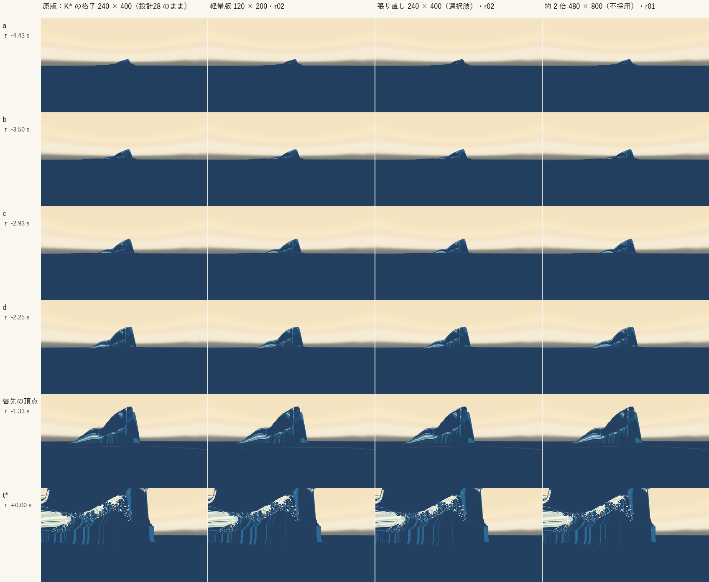
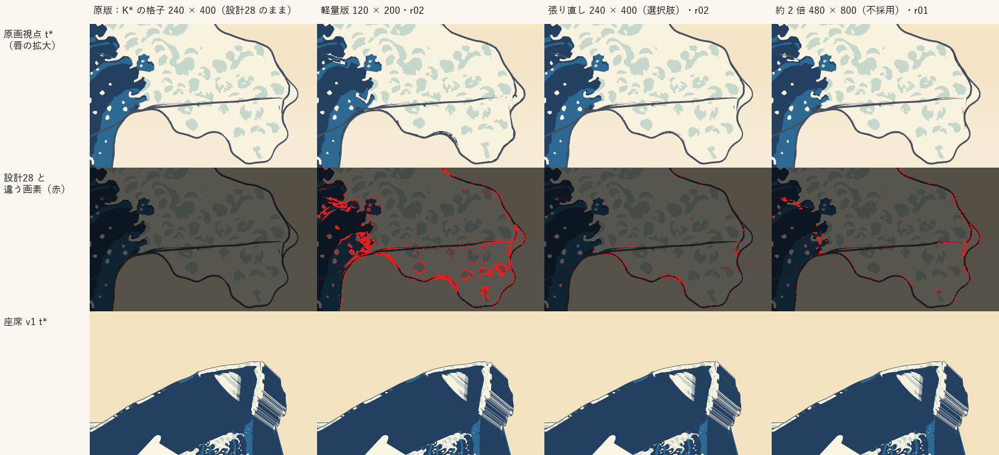

# 設計29：表示用サーフェスを作る ― 密度の比較（原版と軽量版）、網の張り直しの試み

日付：2026-09-27／状態：初回提出＋レビュー対応（第11節。numpy の網の組み立て・測定と独立の検査器、Blender 5.2.2 ヘッドレスの射線と自己交差、Unity の PC オフスクリーン描画。**HMD 実機の結果ではない**）。

- 対象：[制作設計書](../Design/GreatWave_VR_Production_Design_ja.md) §9 段階5 の設計29「解像度比較後、表示用サーフェスを作る｜原版と軽量版。穴、法線、薄膜、波頭の欠落を点検」。[段階9までの実行計画](../Design/Stage9_Plan_2026-09-26_ja.md)（以下「計画」）§2.1 の設計29（［Q10］・［Q11］の注記を含む）と、[設計28 の記録](Design_28_ja.md) §8.1 の引き継ぎ（P13 の網の不合格 (5b)〜(5e)・(5g) と (2) は、表示用サーフェスで網を張り直して扱う）。
- 時間の上限：計画は ≤0.5 日。実績（ファイルの時刻から）：網の組み立てと測定（r00・r01）約 3 時間（13:15〜16:05 ごろ）、独立の検査器 13:15〜14:15 ごろ（並べて）、統合（Unity の再生器と描画、検査の実行、修正2、証拠、記録）16:10〜17:30 ごろ（約 1.3 時間）。通しで約 4.3 時間（0.53 日）で、**計画の上限を超えた**。超えた分は 2 回目の修正（r02・r02b の組み立てと測り直し）。レビュー対応（第11節）が 18:00〜18:40 ごろ（約 0.7 時間。合計 約 5.0 時間）で、網とパッケージは作り直していない（測り直しと文書の直しだけ）。1 回の計算はどれも 30 分以内（第9節）。
- 修正回数：2（第7節）。r00 が初回の統合、r01 が修正1、r02（候補 A・B の 2 つを並べた）が修正2。損切り（統合の後の修正は 2 回まで）に従い、残った不合格は記録のみにした。
- 対応するバックログ（計画 §2.1）：117（つなぎ目の穴と切断 0）、83・115・116（座席からの射線の事前検査）。**83・115・116 合格（事前検査。判定は番号41）、117 は原版で合格・軽量版の座席の輪郭で不合格（記録のみ）**。設計28 から引き継いだ 106・107 は原版で不合格のまま（記録のみ）。[metrics.json](../Evidence/Design/29/metrics.json) の `backlog`。
- 証拠の種類：numpy の網の組み立て（`ds29_build.py`）と測定（`ds29_measure.py`、設計27・28 の P13 の写し。設計28 の値を再現する）、作り手のコードを読まずに作った独立の検査器（`ds29_qa.py`・`ds29_blender_qa.py`。設計27・28 の P13 と美術優先26修正01 の射線の値を再現する）、Unity 6000.4.3f1 の batchmode の PC オフスクリーン描画（RTX 3080、Direct3D11）と、その t\* の画像の美術優先23 系の評価器（`ds27_tstar_eval.py`）。
- 動きは設計28 の既定（art_on）のまま変えていない。表示の網の頂点は、どの τ でも設計28 の面の上の点（源の三角形の重心座標）。K\*（26修正01）は読むだけ。
- 座標と単位：設計27・28 と同じ（m・s、τ は物理の時刻で t\* = 0）。「行・列」は K\* の格子（240 行 × 400 列）の番号、「表示の行・列」は張り直した網の番号。

## 見るもの

| 密度の並べ図（段階 a〜t\* × 4 組、座席から波の方向） | t\* の唇の拡大と、設計28 と違う画素（赤） |
| --- | --- |
|  |  |

- 4 組：**原版＝K\* の格子 240 × 400（設計28 のパッケージのまま）**、**軽量版＝120 × 200 の張り直し（r02）**、張り直した 240 × 400（r02、選択肢）、約 2 倍 480 × 800（r01、不採用）。
- 並べた動画（1280 × 720、30 fps、t 0〜14 s、左上＝原版、右上＝軽量版、左下＝張り直し、右下＝約 2 倍。既定の時間曲線）：[原画視点](../Evidence/Design/29/ds29_compare_painting.mp4)（波の周りを切り出した）／[座席から波の方向](../Evidence/Design/29/ds29_compare_seat_toward_wave.mp4)（設計28 の確認用の視点。船・富士・前景の仮置きを隠す）／[左の側面](../Evidence/Design/29/ds29_compare_side_left.mp4)。
- 段階の並べ図：[原画視点](../Evidence/Design/29/fig_ds29_density_painting.png)・[座席 v1](../Evidence/Design/29/fig_ds29_density_seat.png)・[座席から波の方向](../Evidence/Design/29/fig_ds29_density_seat_toward_wave.png)・[左の側面](../Evidence/Design/29/fig_ds29_density_side_left.png)（段階の τ は設計28 と同じ a −4.433・b −3.500・c −2.933・d −2.250・唇先の頂点 −1.333・t\* 0 s）。座席 v1 の並べ図は、t\* まで波が画面の下の外にあるので段階 a〜唇先の頂点は空だけが写る（形成は座席から波の方向の並べ図で見る）。
- **唇の端の 1:1 の切り出し**（レビュー対応）：[fig_ds29_lipend_crops.png](../Evidence/Design/29/fig_ds29_lipend_crops.png)（座席から波の方向の x 940〜1200・y 0〜560 を τ −1.333・−1.0・−0.6・−0.3・0 s で、座席 v1 の t\* の x 700〜1180・y 520〜940。4 組、縮小なし）。並べた動画の座席から波の方向は 1 つの視点を 640 × 360 に縮めるので唇の端の梯子は約 30 px の幅しかなく、左の 2 つの区画では組の名前の札（x 0〜435・0〜347、y 0〜30）が動きの終わりに唇の列にかかり、唇の端は τ −0.9 s ごろから画面の上の外へ出る。梯子と継ぎ目はこの切り出しで見る。
- **描画の傷は残っている**（第6節の 11）：設計28 §8 の 5 で設計29・36・38 へ渡された唇の端の梯子・モアレの塊、座席から波の方向の画面に固定した縦の継ぎ目、前面の足の縦の筋、τ −1〜−0.3 s に頂の上の爪の模様が埋まっていくこと、t\* ごろの原画視点の左端の横縞は、原版でそのまま見え、4 つの密度で同じように出る。表示用サーフェス（網の密度）では直らない。
- numpy の図（Unity の描画ではない）：[断面の網の頂点](../Evidence/Design/29/fig_ds29_sections.png)（峰の行、密度 × τ）、[唇〜管の天井の網の辺](../Evidence/Design/29/fig_ds29_lip_wire.png)（設計28 の網と張り直し r02、τ −1.33 s と t\*）。
- **密度の違いは、この大きさの描画ではほとんど見分けられない**。違いが見えるのは t\* の拡大（上の右の図）で、軽量版は唇の下の縁と爪の模様の境が数 px 動き、張り直しの 240 × 400 は輪郭に沿って 1 px の差が点々と出る。
- 数値：[metrics.json](../Evidence/Design/29/metrics.json)（組ごとの全部の値 `sets`、採用 `decision`、原版の最小の受入 `acceptance_original`、バックログ `backlog`、修正 `revisions`、関門の検査器の読みの不一致 `gate_harness_on_remeshed_grid`、Hermite `hermite_nonuniform`、GPU の時間の測り方 `gpu_timing`、時間 `time`、引き継ぎ `handoffs`）、[密度ごとの表](../Evidence/Design/29/ds29_display_table.md)（作り手の測定、8 組）、[独立の検査器の表](../Evidence/Design/29/qa/)（`ds29_qa_r01_*`・`ds29_qa_r02_half_full`・`ds29_qa_r02b_half_full` と、検査器の確かめ `ds29_qa_validation_d27/d28`・`ds29_qa_selftest`）、[GPU の読み戻しと t\* の輪郭](../Evidence/Design/29/ds29_unity_check.json)、レビュー対応の追加の検査（30 Hz の全コマの自己交差・行 185 の折れ・管の天井の折れ・描画の傷の密度ごとの差・設計28 の描画との一致）：[ds29_review_checks.json](../Evidence/Design/29/ds29_review_checks.json)（`review_response` は metrics.json）、実行条件と SHA-256：[run.json](../Evidence/Design/29/run.json)。

## 0. 結論

1. **原版（表示用サーフェス）は、設計28 のパッケージの網（K\* の格子 240 × 400、186 層）をそのまま使う**。最小の受入（メッシュ検査 0・座席の射線 0・keypose ≤ 512 MiB・原画視点の回帰なし）を全部満たしたのはこの組だけだった（第3節）。**ただしこれは、メッシュ検査を美術優先26 と同じ静止の網の読みで判定した場合に限る**：3 次元の自己交差は、頂点を共有する面の組を除き、両方の面の最小の高さ ≥ 5 mm の組だけを数え、τ −4.433〜0 s の 36 コマだけを見た。レビュー対応で 30 Hz の全コマ（τ −12〜0 s、361 コマ）へ広げると、原版にも自己交差が 7 コマある：頂点を 1 つ共有する面の組の貫通が 7 コマ（行 54〜55・列 348〜349 の τ −10.433〜−10.333 s の 4 コマ、深さ 0.03〜0.04 mm と、行 59〜60・列 149〜151 の τ −0.567〜−0.5 s の 3 コマ、深さ 2.3〜3.5 mm。後者は断面の「5.7 mm の折れ」と同じ所）、頂点を共有しない組が同じ τ −10.4 s ごろの 4 コマ（行 54 の列 348 と 350 の面）。設計28 の生成器の正確な網（量子化の前）ではどれも 0 なので、16 bit の量子化が (5b) の短い行の辺をつぶして起きる。mm の大きさで描画では見えないが、この厳しい読みでは原版も不合格で、最小の受入を全部満たす組はない（規則の「満たす組がなければ原画視点の回帰なしを優先」で、選ぶ組は同じ原版）。GPU の実測 109.1 MiB（位置のバッファ 102.2 MiB）、原画の関門は 28修正01 と差 0.247 px。
2. **網を張り直した 240 × 400 は、網の連続性の検査は良くなったが、t\* の原画の関門で 28修正01 から 0.5 px を超えて動いた**（修正2 の r02 で最大 1.101 px、4 つの測り方が 0.53〜1.10 px、266 が不合格）。面の反転（30 Hz の通し）0・断面の自己交差 0・rim の継ぎ目の比 (5e) 合格と、設計28 の網より良い（設計28 は 7・1・不合格）。ただしレビュー対応の 30 Hz の全コマの検査では、r02 にも τ −10.4 s ごろの自己交差（原版と同じ行 54 の面、頂点を共有する組・しない組とも 4 コマ。r02 の壁の区間は K\* の列の割り付けのまま）と、管の天井の折れ（隣 2 つと内積 < −0.8、行 178〜192 で原版 9 面・r02 4 面）がある。原版の行 185 の折れ（第6節の 1）は r02 にないが、網の連続性の差は検査の数ほど大きくはなく、3 つの視点の描画でも見分けられない（第8節）。原画視点と網の連続性を同時に満たす網は、修正2 までの張り方ではできなかった。**選択肢として残し、採るかは利用者・進行役が決める**（第8節）。
3. **軽量版は 120 × 200 の張り直し（r02）**：24,000 頂点、GPU 32.8 MiB、主役波の描画の時間 原画視点 0.084 ms（原版 0.137 ms）。穴・継ぎ目・背面・3 次元の自己交差・面の反転は 0、唇先の厚さ 0.568 m（≥ 0.3 m）。ただし **t\* の原画の関門は大きく落ち**（item 175 の藍濃の境界の測り方が 150.9 px、合否は 8 項目が不合格に変わる）、**原版との輪郭の差は座席 v1 で 10.6 px**（117 の基準 ≤ 4 px）。レビュー対応で t\* の画像を 4 倍に拡大して確かめた：原画視点では、唇の根元の爪の巻き（x 約 820〜860・y 約 345〜375、1920 × 1080）の形が崩れ、水色の中の白い巻きの代わりに白い V 字が出て、その左上（x 約 775〜810・y 約 285〜310）に白い細片が 2 本（小さな裂け目）出る。座席 v1 では頂の尖りが鈍い凹みになり、その下に暗い V 字が出る（x 約 1000・y 約 550）。原画視点・座席の見え方の代わりにはならず、名前を付けた非常用の予備（体験全体の切り替え）に限る。原版の描画の時間が約 0.14 ms なので、軽量版を作らない選択（第8節の (b)）も同じ重さで考えてよい。
4. 約 2 倍（480 × 800）は不採用：位置のバッファだけで 529.5 MiB（上限 512 MiB）、面の反転 53・3 次元の自己交差 2。
5. **動きの問題は表示の網では直らない**：P13 (2)（2 g の 1.13 倍、行 192 列 391、τ −3.0 s）はどの網でも同じ。独立の検査器が見つけた奥の壁の行 209〜214 の最後の 0.067 s の急な下がり（30 Hz の二階差分 0.111 m、約 10 g。P13 (2) は巻きの行だけを見る）も設計28 の動きの問題（第6節）。
6. **Unity の再生器は格子の大きさを選ばなくなった**：`DS29KeyposePlayer`（行・列をパッケージの json から読み、t\* の網の .gwb と頂点ごとの UV3 を読む）。設計28 のパッケージを同じ道で描くと、t\* の画像 10 枚と段階の静止画 24 枚（6 段階 × 4 視点）が設計28 と画素まで同じで、30 fps の動画 3 本は SHA-256 まで同じ（440cffd5…・0c62aae5…・816472d1…）。GPU の読み戻しと numpy の Hermite の差はどの組も 0.023 mm 以下。
7. **設計28 から渡された描画の傷は、原版にすべて残る**（唇の端の梯子・モアレ、座席から波の方向の縦の継ぎ目、前面の足の縦の筋、頂の爪の模様が埋まっていくこと、原画視点の左端の横縞）。4 つの密度で同じように出て（傷の場所で原版と違う画素は、組と場所ごとの最大で 2.1〜5.0%、平均で 0.6〜2.0%）、網の密度が原因ではない。28修正01 の色の焼き込み・原画の投影の UV を浅い角度から見ることによると読み、設計36・38（色と外殻線）か仕上げへ渡し直す（第6節の 11、第8.1節）。**「表示用サーフェスができた」は「梯子と継ぎ目が直った」ではない**。

---

## 1. 目的

設計書の設計29 は、解像度を比べたうえで表示用サーフェスを作り（原版と軽量版）、穴・法線・薄膜・波頭の欠落を点検する。計画 §2.1 の成果物は、K\* と形成の keypose を 3 つの密度で出して原画視点・座席・側面で並べること、密度ごとの点検の表（穴、法線、薄膜＝唇先の厚さ ≥ 0.3 m、波頭の欠落）、採用する密度と理由、keypose の GPU メモリの実測（≤ 512 MiB）。最小の受入は、採用した密度で、メッシュ検査（非多様体・面の反転・自己交差）0、座席からの射線で穴・切断端・開いた背面 0、keypose ≤ 512 MiB、原画視点の回帰なし。［Q10］で、不等間隔の節点での補間の差もここで測る。

あわせて、設計28 §8.1 の引き継ぎ（P13 の網の割り付けの不合格：(5b) 短い辺 1.69 mm、(5c) 行の方向の伸び 10.4 倍、(5d) 行の間の伸び 14.2 倍、(5e) rim の継ぎ目の比、(5g) 面の反転 4、(2) 2 g の 1.13 倍）を、網を張り直して扱った。動き（物質の点と唇の点の位置、t\* の形 = K\*）は変えず、K\* はバイトまで同じまま参照にする。

---

## 2. 密度の比較の表

値は、作り手の測定（`ds29_measure.py`）、独立の検査器（`ds29_qa.py`、36 コマ＝τ −3.0〜0 s を 0.1 s ごと＋段階の 6 コマ。つまり τ −4.433〜0 s だけ。座席 v1 の目から 5 万本の射線、Blender の BVH）、Unity の描画（`DS29Render`）、レビュー対応の追加の検査（`ds29_review_checks.py`、30 Hz の全コマ τ −12〜0 s の 361 コマ）から。τ −12〜−4.43 s は、初回の提出では検査器の 30 Hz の numpy の通し（面の反転・二階差分・辺の長さ）だけで、静止の網の検査（BVH・射線・下を向いた面）は見ていなかった。レビュー対応で BVH の自己交差だけを 361 コマへ広げた。全部の組（r01・r02b の組を含む 8 組）は [ds29_display_table.md](../Evidence/Design/29/ds29_display_table.md) と metrics.json の `sets`。

| 項目 | **原版**：K\* の格子 240 × 400（設計28 のまま） | **軽量版**：120 × 200（r02） | 張り直し 240 × 400（r02、選択肢） | 約 2 倍 480 × 800（r01、不採用） |
| --- | --- | --- | --- | --- |
| 頂点・三角形 | 96,000・190,722 | 24,000・47,362 | 96,000・190,722 | 384,000・765,442 |
| 層（τ −12〜0 s） | 186 | 226 | 210 | 241 |
| GPU の実測（Unity）：位置＋T_white＋網の頂点・添字 | **109.1 MiB**（102.2＋0.37＋4.39＋2.18） | **32.8 MiB**（31.0＋0.09＋1.10＋0.54） | 122.3 MiB（115.4＋0.37＋4.39＋2.18） | **557.3 MiB**（529.5＋1.47＋17.6＋8.76）＞ 512 |
| 確かめ：Unity の割り当ての数（位置と T_white を読んだ前後の増え。独立の測りではなく、頼んだバッファの大きさの繰り返し） | 102.5 MiB（= 位置＋T_white の 107,520,000 B） | 31.1 MiB（= 32,640,000 B） | 115.7 MiB（= 121,344,000 B） | 531.0 MiB（= 556,800,000 B） |
| 主役波の描画の時間（原画視点／座席 v1、1920 × 1080・MSAA 8x、600 コマ × 3 回。同じ組の 180 コマの回とは約 50% 違う＝下の注） | 0.137／0.083 ms | 0.084／0.050 ms | 0.142／0.088 ms | 0.291／0.219 ms |
| 静止の網（36 コマ、τ −4.433〜0 s）：非多様体・巻き方向の食い違い・下を向いた面・3 次元の自己交差（BVH。頂点を共有する組を除き、両方の面の最小の高さ ≥ 5 mm） | 0・0・0・0 | 0・0・0・0 | 0・0・0・0 | 0・0・0・**2** |
| 3 次元の自己交差、30 Hz の全コマ（361 コマ、τ −12〜0 s、両方の面 ≥ 5 mm）：頂点を共有しない組（BVH）／頂点を 1 つ共有する組の貫通（レビュー対応） | **4 コマ／7 コマ**（τ −10.433〜−10.333 s の行 54〜55・列 348〜350、深さ 0.03〜0.04 mm と、τ −0.567〜−0.5 s の行 59〜60・列 149〜151、深さ 2.3〜3.5 mm。正確な網では 0＝量子化による） | 0／0 | **4 コマ／4 コマ**（τ −10.4 s ごろの同じ行 54 の面だけ） | 測っていない |
| 座席 v1 の射線：穴・開いた背面・継ぎ目の切断（36 コマ）・t\* の切断端 | 0・0・0・0 | 0・0・0・0 | 0・0・0・0 | 0・0・0・0 |
| 30 Hz の通しの面の反転（検査器）／P13 (5g) | **7／4** | 0／0 | 0／0 | **53／51** |
| 断面の自己交差（線分 ≥ 5 mm、コマの和） | **1**（τ −0.5 s、行 59 の 5.7 mm の折れ） | 0 | 0 | 0 |
| 管の天井の折れ（行 178〜192・列 200〜300、τ −1.5〜−0.2 s、隣 2 つ以上と単位法線の内積 < −0.8／< 0 の面。レビュー対応） | 9 面・20 面コマ／37 面・243 面コマ（行 185・列 239 の三角形 1 は 13 コマ続く。第6節の 1） | — | 4 面・17 面コマ／127 面・981 面コマ（行 185 の面は 0） | — |
| 決まらない頂点法線（周りの面がすべて面積 0、コマの最大。シェーダーは +Y に置き換える） | 199 | 3 | 81 | 231 |
| 薄膜：唇先の厚さの最小（唇先から 0.75 m 奥の鉛直、36 コマ、≥ 0.3 m） | 0.557 m | 0.568 m | 0.562 m | 0.558 m |
| 同じ（作り手、唇先から 1 m、t\*・τ −0.5・−1.33・−2.25 s） | 0.564・0.764・0.786・0.888 m | 0.578・0.849・0.752・0.895 m | 0.565・0.776・0.754・0.891 m | 0.564・0.854・0.774・0.887 m |
| 波頭の欠落：巻きの行の頂の高さ（正確な網、源の同じ c の切り口との差の最大） | 0 | **4.7 cm**（行 51、t\*） | 1.4 cm | 1.25 cm |
| 同じ（検査器、設計28 の唇・管の点から網までの 3 次元の距離の最大、暫定 ≤ 2 cm） | 0 | **0.415 m** | 3.2 cm | 12.9 cm |
| t\* の K\* との差（辺の上の点の法線方向、最大／RMS） | 1.2 mm（量子化） | 0.267 m／12.9 mm | 0.121 m／1.7 mm | 0.069 m／1.45 mm |
| **t\* の原画の関門（28修正01 との差の最大、合否が変わった項目）** | **0.247 px、なし** | **150.9 px**、73・77・118・120・134・266・267・270 | **1.101 px**、266 | **2.448 px**、266 |
| t\* の輪郭の差（原版との、原画視点／座席 v1／座席の低い視点） | 0 | 3.6／**10.6**／8.1 px | 1.0／1.0／1.0 px | 0.7／3.2／2.8 px |
| P13 の不合格（12 項目、作り手の写し） | 6：(2)(5b)(5c)(5d)(5e)(5g) | 3：(2)(4)(5d) | 4：(2)(5b)(5c)(5d) | 7：(2)(4)(5a)(5b)(5c)(5d)(5g) |
| Hermite の再生の差：30 Hz の全コマ／節点の間隔が変わる区間 | 3.40／3.51 mm | 3.44／3.51 mm | 3.28／3.39 mm | 3.47／3.58 mm |
| GPU の読み戻しと numpy の Hermite の差（15 時刻） | 0.023 mm | 0.021 mm | 0.023 mm | 0.023 mm |

- **不等間隔の節点での補間の差**（計画［Q10］）：間隔が隣と 1.5 倍以上変わる区間ごとに 8 点で測った。どの組も最も悪いのは τ −4.27 s（間隔 0.0625 → 0.03125 s）で、0.25 s → 1/30 s の切り替わり（τ −3.0 s）ではない。最大 3.39〜3.58 mm で、4 mm の規則（節点の検査 2.5 mm ＋ 量子化 1.2 mm）の内。
- GPU の容量は、設計27 の再生器と同じ詰め方（頂点ごとに 16 bit × 3 を GPU だけの StructuredBuffer に置く＝読み取り不可）の実測。色区テクスチャ（28修正01 の焼き込み、4096² RGBA32、64 MiB）は全組で共通なので別。［Q11］の見込み（約 166 層・約 365 MiB）に対し、原版は 186 層・109 MiB（Q10 の 562 MiB は読み取り可能なテクスチャの見積もり）。
- 描画の時間は、主役波（面と外殻線）を描く場合と隠した場合の差（600 コマの平均を 3 回、中央値）。毎コマ 1 画素を読み戻して GPU を待つ壁時計の時間で、GPU のタイマーの値ではない。PC の片目の値で、HMD（両眼）では頂点の処理がおよそ 2 倍になる。どの組も 1 ms より十分小さい。**同じパッケージでも回によって約 50% 違う**（原版は描画の回の 180 コマで 0.214／0.116 ms、時間だけの回の 600 コマで 0.137／0.083 ms。480 × 800 は 0.544／0.371 と 0.291／0.219 ms）。この揺れは軽量版と原版の差（0.05 ms 前後）と同じくらいなので、密度どうしの小さな差は順番の目安にしかならない。
- GPU の容量の「確かめ」の行は、Unity の割り当ての数の増え（driverBytesAfterKeypose − driverBytesAfterSurface）で、どの組も位置と T_white のバッファの大きさのちょうど和（原版 107,520,000 B、軽量版 32,640,000 B）。Unity 自身が頼まれた大きさを数え直した値で、独立の測りではない（初回の提出は「グラフィックドライバーの割り当ての増え」と書いたが、バッファの大きさの確かめと読むのが正しい）。
- 座席 v1 の射線の「開いた背面 0」は、検査器が持ち上がった外周の縁の下をくぐる射線を、網より先にカーテン（縁から海までの鉛直の幕）に当てて under_edge に分けることに依る（縁の下を通って網の裏へ当たる射線は背面に数えない）。t\* より前の under_edge は下の行のとおり周りの海（設計30）の範囲。
- 外周の縁が平らな仮置きの海より持ち上がる所の射線（t\* より前の切断端 37,215 本・縁の下 33,303 本、240 × 400 の組で同じ）は、周りの海（設計30）の範囲で記録のみ。t\* では 0。

---

## 3. 採用と理由

**規則**（r02・r02b の網の検査の結果を見る前に決めた）：最小の受入を全部満たす組を原版にする。満たす組がなければ、原画視点の回帰なしを優先する。原画視点は段階5 の全番号で守ってきた関門（設計27・28 は 28修正01 と ±0.5 px）で、網の連続性の不合格は設計27・28 でも記録のみにしてきたため。

| 最小の受入 | 原版（設計28 の網） | 張り直し 240 × 400（r01／r02／r02b） |
| --- | --- | --- |
| メッシュ検査（非多様体・面の反転・自己交差）0：静止の網の読み（美術優先26 と同じ。36 コマ＝τ −4.433〜0 s、自己交差は頂点を共有する組を除き両方の面 ≥ 5 mm） | 合格：非多様体 0、巻き方向の食い違い 0、下を向いた面 0、3 次元の自己交差 0 | 合格（同じ 4 つが 0） |
| 同じ：厳しい読み（30 Hz の全コマ、頂点を共有する組を含む、面の反転は前のコマと比べる。レビュー対応） | **不合格**：自己交差 7 コマ（頂点を共有する組の貫通 7、共有しない組 4。τ −10.4 s ごろと τ −0.5 s ごろ、量子化による mm の大きさ）、30 Hz の面の反転 7（P13 (5g) 4） | r02：**不合格**：自己交差 4 コマ（τ −10.4 s ごろ、原版と同じ行 54 の面）、面の反転 0。r01・r02b は測っていない |
| 座席の射線で穴・切断端・開いた背面 0 | 合格：0・0（t\*）・0（5 万本 × 36 コマ） | 合格 |
| keypose ≤ 512 MiB | 合格：109.1 MiB | 合格：122.3／122.3／127.8 MiB |
| 原画視点の回帰なし（28修正01 と ±0.5 px） | 合格：0.247 px、合否はすべて同じ | **不合格**：1.451／1.101／1.142 px |

- メッシュ検査の「面の反転」は、美術優先26 の Blender のメッシュ検査（1 コマの網の向きの反転）の読み。30 Hz の通しで前のコマと比べた面の反転（P13 (5g)、バックログ 107）は連続性の項目で、原版は設計28 と同じく不合格（記録のみ、7・4）、張り直し r02 は 0。
- **「最小の受入を全部満たしたのは原版だけ」は、静止の網の読みの場合に限る**。静止の網の読みの自己交差は、(i) 頂点を共有する面の組を除き、(ii) 両方の面の最小の高さ ≥ 5 mm の組だけを数え、(iii) τ −4.433〜0 s の 36 コマだけを見た。レビュー対応で (i)(iii) を外して測ると、原版は 7 コマで自己交差がある（第0節の 1、[ds29_review_checks.json](../Evidence/Design/29/ds29_review_checks.json)）：
  - 行 54〜55・列 348〜350、τ −10.433〜−10.333 s（4 コマ、QA の窓の外）：頂点（行 55・列 349）を共有する面 (54, 348, 1)・(54, 349, 1) の貫通 深さ 0.03〜0.04 mm と、頂点を共有しない面 (54, 348, 1)・(54, 350, 0) の交差（BVH）。
  - 行 59〜60・列 149〜151、τ −0.567〜−0.5 s（3 コマ）：頂点（行 60・列 150／151）を共有する面の貫通 深さ 2.3〜3.5 mm。断面の自己交差の「τ −0.5 s、行 59 の 5.7 mm の折れ」と同じ所。
  - どれも設計28 の生成器の正確な網（float64、量子化の前）では 0（同じコマ、周りの行 ±6・列 ±14 の総当たり）。16 bit の量子化（最大 1.2 mm）が (5b) の短い行の辺（1.1〜1.7 mm）をつぶして起きる。mm の大きさで、描画では見えない。軽量版 r02 は 0。
  - 厳しい読みでは最小の受入を全部満たす組はなく、規則の後半（原画視点の回帰なしを優先）で同じ原版を選ぶ。どちらの読みを採るかは第8節の表で進行役・利用者が確かめる。
- **採用：原版＝設計28 の網のまま、軽量版＝120 × 200（r02）**。張り直し 240 × 400（r02）は選択肢（第8節）。480 × 800 は容量の上限を超え、面の反転と自己交差もあるので不採用。
- 軽量版に r02 を選んだ理由：120 × 200 の 3 つの版（r01・r02・r02b）の中で、原版との輪郭の差（原画視点 3.6 px、r01 は 5.0）と頂の高さの欠落（4.7 cm、r01 は 5.3 cm）が小さく、面の反転 0・P13 の不合格 3（r02b は 4）。3 つとも原画の関門は大きく落ちる（147.9〜150.9 px）。

---

## 4. 網の直し方

作り手の `Tools/GWWaveGen/ds29/ds29_surface.py`（README は冒頭の注釈）。

- 表示の頂点は、源（設計28 の既定の生成器 `ds28_model.Generator("art_on")`。設計28 のパッケージを量子化 1.209 mm まで再現する）の格子の媒介変数 (ρ, κ) の点で、源の三角形の重心座標で求める。どの τ でも表示の頂点は源の面の上にある（t\* では K\* の面の上）。三角形の分け方は K\* の .gwb と同じ。
- 行：表示の行は源の行の番号で等間隔（240 行なら源の行そのもの）。
- 列：源の行ごとの目印の列（0・j_B・頂 root・rim・内壁の錨 ja・j_E・最後の列。生成器の整数の列）を、表示では全行で同じ列の番号に置く。区間ごとの張り方：
  - `column`：目印の間を K\* の列の割り付けのまま線形に写す（背面・内壁の下・平らな余白。r02 では唇も）。時刻によらない物質の点なので、唇は重力だけの動きのまま。
  - `arc_tstar`：t\*（K\*）の弧長で一様（r01 の唇）。
  - `arc_tau`：その時刻の源の弧長で一様（管の天井と内壁の上 rim〜ja）。τ −2.0 s までは全部、−1.0 s までに smoothstep で t\* の弧長の割り付けへ戻す（t\* の直前の滑りは二階差分と節点を増やすため）。
  - `arc_tau_col`（r02b で足した）：`arc_tau` と同じだが、t\* の土台を `column` にする。
- 色：UV・UV2・UV3（28修正01 の焼き込み用の UV の表を頂点ごとにしたもの、`ds29_uv3_f32.bin`）と白の時刻 T_white は、t\* の媒介変数の点で源から補間する。`arc_tau` の区間は形成の間に源の面の上を滑るので、色は t\* の場所の色のまま動く（t\* では一致）。
- 節点：源の節点（186）から、`arc_tau` の区間の滑りで Hermite の差が 2.5 mm を超える区間に節点を足す（最大 3 回）。
- パッケージは設計27 の書式（`ds27_keypose.json` に rows・cols を書く）に、t\* の網（`tstar/kstar_a45.gwb`・`.obj`・`_meta.json`）、頂点ごとの UV3、媒介変数（`ds29_map.npz`）を足した。
- **張り直しで t\* の原画の関門が動く理由**：表示の網は t\* で K\* の面の上にあるが、K\* の頂点を通らない。K\* は区分的に平らな面で、折れ目（爪の先、唇の下の縁、水色の境）は K\* の辺にあるので、別の頂点で張った網は折れ目を弦で切る（t\* の法線方向の差 最大 0.121 m・RMS 1.7 mm、原画視点で 1 px 前後）。目印の列を表示の網で全行そろえる限り、行ごとの目印の列が違う K\* とは t\* で同じ網にならない。
- Unity：`Unity/Assets/GreatWave/Design29/Scripts/DS29KeyposePlayer.cs`（設計27 の `DS27KeyposePlayer` の写し。格子の大きさをパッケージの json から読み、`AF26KStarMesh` にパッケージの t\* の網を読ませ、頂点ごとの UV3 と色区テクスチャを自分で当てる。シェーダーは設計27 のものを同じ大域の値の名前でそのまま使う。法線は `_DS27Grid` から格子を読むので密度によらない）と `Editor/DS29Render.cs`（設計27 の場面をメモリの上だけで使い、設計27 の主役波を隠して表示用サーフェスの主役波を足して描く。場面は保存しない）。実行は `Tools/GWWaveGen/ds29/run_ds29_unity.ps1`（設計28 の手順の写し、unity.lock、30 分以内）。設計28 のパッケージをこの道で描くと、t\* の 10 枚の画像と段階の静止画 24 枚が設計28 の描画と画素まで同じで、30 fps の動画 3 本は SHA-256 まで同じ（レビュー対応で確かめた）。

---

## 5. 関門の表

| 項目 | 基準 | 原版（採用） | 軽量版（r02） | 判定（原版） |
| --- | --- | --- | --- | --- |
| メッシュ検査：非多様体・巻き方向・下を向いた面・3 次元の自己交差（静止の網の読み：36 コマ＝τ −4.433〜0 s、頂点を共有する組を除き両方の面 ≥ 5 mm） | 0 | 0・0・0・0 | 0・0・0・0 | 合格（この読みで） |
| 3 次元の自己交差（厳しい読み：30 Hz の 361 コマ、頂点を共有する組を含む。レビュー対応） | 0 | 7 コマ（頂点を共有する組 7・共有しない組 4、深さ ≤ 3.5 mm、正確な網では 0） | 0 | 不合格・記録のみ（量子化による。第3節） |
| 座席 v1 の射線：穴・開いた背面・t\* の切断端（83・115・116） | 0 | 0・0・0 | 0・0・0 | 合格（事前検査。判定は番号41） |
| 継ぎ目の穴と切断（117） | 0 | 縁の輪 0・継ぎ目の切断 0・穴 0 | 同じ 0 | 合格 |
| 減面前との輪郭の差（117） | ≤ 4 px | 0（減面なし） | 原画視点 3.6・座席 v1 10.6・座席の低い視点 8.1 px | 合格（軽量版は不合格・記録のみ） |
| keypose の GPU メモリ | ≤ 512 MiB | 109.1 MiB | 32.8 MiB | 合格 |
| 原画視点の回帰なし | 28修正01 と ±0.5 px | 0.247 px | 150.9 px | 合格（軽量版は不合格・記録のみ） |
| 薄膜：唇先の厚さ | ≥ 0.3 m | 0.557 m | 0.568 m | 合格 |
| 波頭の欠落 | 暫定 ≤ 2 cm | 0 | 4.7 cm（3 次元 0.415 m） | 合格（軽量版は不合格・記録のみ） |
| 不等間隔の節点の補間の差 | 4 mm の規則 | 3.51 mm | 3.51 mm | 合格 |
| 30 Hz の面の反転（P13 (5g)、107） | 0 | 4（検査器 7） | 0 | 不合格・記録のみ（設計28 と同じ） |
| 形成の間の折れ（行 185・列 239 の三角形 1 が隣 2 つと逆向きのまま、107 の仲間。レビュー対応） | 0 | 13 コマ（τ −0.867〜−0.467 s） | — | 不合格・記録のみ（静止の検査では見えない。第6節の 1） |
| 行の間の伸び（P13 (5d)、106） | 0.05〜4 | 14.2 倍 | 6.7 倍 | 不合格・記録のみ（設計28 と同じ） |
| P13 のほか（(2)(5b)(5c)(5e)） | — | 設計28 と同じ値 | (2)(4) が不合格 | 不合格・記録のみ |

- **設計28 の関門の検査器（`ds28_gates.py`）は、列を張り直した網には読みが合わない**：張り直し 240 × 400（r01）へそのまま当てると P4・P14・P16・原画の前提が新しく落ち、P3 が通った（P4 −9.752 m/s² で峰の行の窓 −6.86、P16 +2.083 m/s²、原画の前提 3.02 m、P3 0.082。設計28 は −9.745・−1.395・0.0012 m・0.285）。検査器は頂点の番号を K\* の頂点として読む（唇先の列、行ごとの tip_col、t\* の位置 = K\* の頂点）ので、張り直した網では別の点を測る。表示の網は設計28 の面の上にあるので動きの関門（P1〜P19）は設計28 の値のまま。網に依る項目は作り手の P13 の写しと独立の検査器で測った。原版は設計28 のパッケージそのものなので、設計28 の関門の値がそのまま当てはまる。
- 検査器の確かめ：作り手の P13 の写しは設計28 のパッケージで ds27/28 の関門と同じ値（(2) 0.0245、(5b) 1.69 mm・218 件、(5c) 0.0136〜10.4・97 件、(5d) 0.031〜14.2・18,193 件、(5e) 0.141〜2.23・1,488 件、(5g) 4）。独立の検査器は、K\* の 5 万本の射線で美術優先26修正01 と同じ値（表 27,234・背面 0・切断 0・穴 0・海 982・空 21,784）、設計27・28 の P13 を場所まで再現し、わざと壊した K\*（穴・継ぎ目の割れ・裏返し・潰れた唇先）の 4 つをすべて検出した（[qa/](../Evidence/Design/29/qa/)）。

---

## 6. 限界

1. **原画視点と網の連続性を同時に満たす網は作れていない**。張り直しは t\* で K\* の頂点を通らないので原画視点が動き、設計28 の網は t\* で K\* そのものだが、形成の間に行 185 の折れと rim の継ぎ目の比が残る。
   - **行 185 の折れ**（初回の提出は「τ −0.87 s の面の反転」と書いたが、1 コマの反転ではない）：面（行 185・列 239・三角形 1、rim の 13 列内側の管の天井）が τ −0.9 s で幅 1.6 mm までつぶれて裏返り、τ −0.867〜−0.467 s の **13 コマ（30 Hz）続けて**、3 つの隣のうち 2 つと逆を向いたままになる（単位法線の内積 −0.94〜−0.10、残りの 1 つとは +0.8〜+0.9）。その間の面は長さ 0.36〜0.40 m・幅 1.9〜25.5 mm（τ −0.8〜−0.5 s は 5.5〜23 mm）の細い帯で、τ −0.433 s で元へ戻る。
   - **静止の検査では見えない**：巻き方向の食い違いは添字だけの位相の検査なので、どの格子でも 0。「上に網のない下向きの面」は管の中（上に網がある）では当たらない。座席 v1 の 5 万本の射線は約 0.64° おきで、座席から約 30.5 m の幅 2 cm の帯（約 0.04°）には粗すぎる。
   - **描画に出うる**：面のシェーダーは Cull Off、外殻線は Cull Front なので、裏返った帯は陰の筋や外殻線の筋として出うる。3 つの視点の動画では、原版だけに出る時間の飛びとしては見つからなかった（第6節の 11 の注）。
   - 同じ種類の折れはほかの面にもある（行 178〜192・列 200〜300、τ −1.5〜−0.2 s で、隣 2 つと内積 < −0.8 の面が原版 9 面・20 面コマ、< 0 では 37 面・243 面コマ）。張り直し r02 は行 185 の面は 0 だが、同じ区域に内積 < −0.8 の面が 4 面・17 面コマ（< 0 では 127 面・981 面コマ）ある。r02 の網の連続性の良さは 30 Hz の面の反転と断面の交差ではっきりしているが、折れで数えると差は小さい。
   - 行ごとの目印を K\* の列にそろえ、管の天井だけ形成の間に弧長で均す張り方（第8節の (c)）なら、原画視点の回帰 0 と (5e) の直しは両立する見込みだが、行 185 の折れは t\* の網と同じ割り付けの時刻なので残る見込み。
2. 軽量版は、原画視点で item 175 の藍濃の境界が 150.9 px になり、座席 v1 の輪郭が原版と 10.6 px 違う。t\* の 4 倍の拡大で確かめた傷：原画視点の唇の根元の爪の巻き（x 約 820〜860・y 約 345〜375）の形が崩れて白い V 字が出る、その左上（x 約 775〜810・y 約 285〜310）に白い細片が 2 本（小さな裂け目）、座席 v1 の頂の尖りが鈍い凹みになりその下に暗い V 字（x 約 1000・y 約 550）。3 次元の距離では唇・管の点から網まで最大 0.415 m 離れる所がある。見え方の代わりにはならない（非常用の予備に限る）。
3. P13 (2)（2 g の 1.13 倍）は動きの値で、どの網でも同じ。独立の検査器の 30 Hz の二階差分（全頂点）0.111 m は奥の壁の行 209〜214 の最後の 0.067 s の急な下がり（約 10 g）で、P13 (2) は巻きの行だけを見るので出ない。設計28 の動きの問題で、表示の網では直らない（設計30 か仕上げ28 へ）。
4. 決まらない頂点法線（周りの面がすべて面積 0）：原版で 1 コマ最大 199 頂点（行 3〜46 の列 208〜212・303 など、16 bit の量子化で詰まった列がつぶれた所）。シェーダーは +Y に置き換えるので NaN にはならない。張り直し r02 は 81、軽量版は 3。
5. K\* 自身に二面角 120° を超える折れ返りが 78 ある（行 156〜158・190〜198、唇・rim の列の割り付けが跳ぶ所）。検査器の「隣と逆向きの面」はどの網でも 0 にならず（原版 161、軽量版 89）、判定の基準を K\* にするかは決めていない（記録のみ）。t\* の座席 v1 の白い rim の帯の縁の約 15 px の段々、唇の下の白い区画の櫛の歯、暗い面の斜めの折り目の線は、張り直し r02 を含むどの密度でも同じに出る。表示の網では変わらないので、K\* の行ごとの色・UV の境（(5d) の「列の割り付けが跳ぶ行」）で決まると読み、3 回目の張り方（第8節の (c)）でも消えない見込み（1:1 の切り出しの右の列で 4 組とも同じ）。
6. 波頭の欠落の許容 2 cm（原画視点 1080 px で約 0.7 px）は暫定。断面の値は、行の間隔が狭く行の間で形が大きく変わる所で切り口がずれやすいので、判定は 3 次元の距離で行った。
7. GPU の時間は壁時計の値で、GPU のタイマーではない。PC の片目で、HMD 実機ではない。主役波の分はどの組も 0.3 ms 未満（600 コマの回）で、密度の選択を決める差にはならなかった。同じパッケージの回どうしで約 50% 揺れる（第2節の注）。GPU の容量は Unity のバッファの大きさで、Unity の割り当ての数の増えはその確かめ（独立の測りではない）。
8. 張り直した網の `arc_tau` の区間は、形成の間に色（UV3・T_white、t\* の場所の色）が管の天井の上を滑る（r00 で τ −8 s に最大約 49 列）。t\* では一致する。並べた動画では見分けられないが、形成の途中の色の模様は設計28 と少し違う。
9. 作り手の r02 の組み立ては、`arc_tau_col` を足す前のコードで始めた（組み立ての記録 `ds29_build_log_*.json` の code_sha256 は 9a383ca…、パッケージの json の code_sha256 は今のファイルと同じ 5a51432…。組み立ての途中でファイルが書き換わった）。今のコードで作り直した 16 ファイル（8 ファイル × 2 網）の SHA-256 は同じ（第7節）。**不採用の r01 の 3 つのパッケージも前のコード（9a383ca…、組み立ての記録・パッケージの json とも）で作り、今のコードでは作り直していない**（`arc_tau_col` を足しただけで r01 の張り方の道は変えていないが、確かめてはいない）。
10. **HMD 実機ではない**。すべて PC のオフスクリーン描画。
11. **設計28 から渡された描画の傷は、原版にすべて残り、密度では変わらない**（レビュー対応。設計28 §8 の 5 と設計28 の metrics.json は「設計29・36・38 の範囲」とした）。原版の 30 fps の動画 3 本は設計28 と SHA-256 まで同じ（440cffd5…・0c62aae5…・816472d1…）、段階の静止画 24 枚は画素まで同じ。傷の場所で、動画の全コマ（421）について原版と違う画素（RGB のどれかが 24/255 を超えて違う）の割合を測った（`ds29_review_checks.json` の `artefact_regions_vs_original`）。表の後の 2 つの注も含めて、傷の扱いは第8.1節の引き継ぎに書いた。

| 傷 | 今の状態 | 密度ごとの違い（原版と違う画素の最大／a 以降の平均：軽量版・張り直し r02・480 × 800） | 表示の網の問題か | 渡し先 |
| --- | --- | --- | --- | --- |
| 唇の端の梯子・モアレの塊（座席から波の方向の x 940〜1200・y 0〜560） | 残る | 3.6／1.7%・3.0／1.0%・2.9／1.0%。[1:1 の切り出し](../Evidence/Design/29/fig_ds29_lipend_crops.png)では 4 組とも同じ梯子 | ちがう | 設計36・38（色と外殻線）か仕上げ |
| 座席から波の方向の画面に固定した縦の継ぎ目 | 残る | 4 組とも同じ所に出る（並べた動画） | ちがう | 同上 |
| 前面の足の縦の筋（同じ視点の x 0〜1300・y 330〜420） | 残る | 3.3／1.6%・2.2／0.6%・2.1／0.6% | ちがう | 同上 |
| τ −1〜−0.3 s に頂の上の爪の模様が埋まっていく | 残る | 4 組とも同じ（1:1 の切り出しの τ −1.0・−0.6・−0.3 s の列） | ちがう | 同上 |
| t\* ごろの原画視点の左端の横縞（x 0〜400・y 200〜800） | 残る | 5.0／2.0%・4.4／1.0%・4.3／1.0% | ちがう | 同上 |

- 違う画素は網を張り直した組でも数 % で、傷の形は 4 組で同じ。傷は網の密度ではなく、28修正01 の色の焼き込み・原画の投影の UV を浅い角度から見ることによると読む（色区の境と外殻線の問題。設計36・38 か仕上げ28・29）。
- **ポッピングの確かめ**（`ds29_review_checks.py temporal`、f295〜f360＝τ −0.93〜0 s）：コマの差の平均の大きいコマは、原画視点が f347〜f352（τ −0.12〜−0.04 s）、座席から波の方向が f344〜f349（τ −0.17〜−0.08 s）で、4 組とも同じコマが上位に来る（コマの差の曲線の相関 0.9979〜1.0）。60 × 60 px の区画ごとの二階差分の最大で「原版だけに出る飛び」（原版 ≥ 20 かつ比べる組の 2 倍を超える区画）は、張り直し r02・480 × 800 に対して 3 視点とも 0（軽量版に対して原画視点で 1 区画）。t\* の直前の大きな変わりは設計28 の動きと色の変わり方（D31 の急な止め）によるもので、網の飛びではない。

---

## 7. 修正の記録（損切り：修正は 2 回まで）

| 版 | 変えたこと | 結果（240 × 400） |
| --- | --- | --- |
| r00（初回の統合、作り手） | 目印の列を行の間でならし、管の天井は全区間でその時刻の弧長で一様 | t\* の直前の滑りで P13 (2) 0.054、層が 28〜149 増え、480 × 800 は 736 MiB |
| r01（修正1、作り手） | 目印は生成器の整数の列。管の天井の弧長は τ −2.0 s まで、−1.0 s で t\* の弧長の割り付けへ。唇は t\* の弧長で一様 | P13 の不合格 6 → 4、(5g) 0。**統合で測った原画の関門 1.451 px**（120 × 200 は 147.9、480 × 800 は 2.448）、266 が不合格。検査器の通しで面の反転 1（行 235、τ −9.17 s） |
| r02（修正2 の候補 A、統合） | 唇を `arc_tstar` から `column`（K\* の列の割り付け）へ | 原画の関門 1.101 px（266 は不合格のまま）、t\* の輪郭の差 1.0 px。P13 の不合格 4、検査器の面の反転 0・断面の交差 0。**選択肢として残した** |
| r02b（修正2 の候補 B、統合） | r02 に加えて、管の天井の t\* の土台も `column`（`arc_tau_col`） | 原画の関門 1.142 px（合否はすべて 28修正01 と同じ）。P13 (5e) 78 件・(5g) 2 に戻り、層 220。不採用 |

- 2 回直しても、張り直した 240 × 400 は原画の関門で ±0.5 px を超えた。損切りに従い、3 回目（行ごとの目印を K\* の列にそろえる張り方）は作らず、原版は規則どおり設計28 の網にした。
- 決定性：r02 の 240 × 400 と 120 × 200 を今のコードで作り直し（`Unity/Build/Design/29/r02/_twice`）、8 ファイル × 2 網＝16 ファイル（`ds27_keypose.json`・`ds27_pos_rgba16.bin`・`ds27_twhite_r32f.bin`・`ds29_uv3_f32.bin`・`ds29_map.npz`・`tstar/kstar_a45.gwb`・`.obj`・`_meta.json`）の SHA-256 がすべて同じ（レビュー対応で数え直した。初回の提出は 5・6・12 ファイルと書き分けていた）。作り手の r01 も 2 回作って同じ（前のコード）。
- 修正の値の詳しい記録：r00・r01 は [ds29_revisions.json](../Evidence/Design/29/ds29_revisions.json)（作り手）、r02・r02b は metrics.json の `revisions`。

---

## 8. 利用者に見てほしいことと、残りの選択肢

見てほしいこと：

1. [t\* の唇の拡大](../Evidence/Design/29/fig_ds29_tstar_detail.png)と[原画視点の並べた動画](../Evidence/Design/29/ds29_compare_painting.mp4)で、張り直した 240 × 400（左下）の 1 px 前後の違いが気になるか。気にならなければ、張り直し（面の反転 0）を原版にする選択がある。**ただし張り直しの網の連続性の良さは、3 つの視点の描画では見分けられない**：傷の場所の違う画素は最大 2.2〜4.4%・平均 0.6〜1.0%（t\* の前の色の滑りと 1 px の縁）で、見える違いはほぼ t\* の輪郭に沿った約 1 px だけ。行 185 の折れ（τ −0.867〜−0.467 s）も、原版だけに出る時間の飛びとしては見つからなかった（f295〜f360 の区画ごとの二階差分で、r02 に対して原版だけの区画 0。第6節の 11 の注）。
2. **描画の傷（唇の端の梯子・縦の継ぎ目・前面の足の縦の筋・爪の模様が埋まる・左端の横縞）は、この番号では直っていない**（第6節の 11）。[唇の端の 1:1 の切り出し](../Evidence/Design/29/fig_ds29_lipend_crops.png)で、4 つの密度で同じに出ることを見てほしい。
3. 軽量版（右上）の唇の下の縁と爪の模様の違い（第6節の 2）。軽量版をどこで使うか（今は使う場面がない。PC の描画の時間は原版でも 0.14 ms）。

| 残り | 選択肢（進行役・利用者が選ぶ） |
| --- | --- |
| メッシュ検査の読み（最小の受入の「面の反転・自己交差 0」） | (a) 静止の網の読み（既定。美術優先26 と同じ 1 コマの検査、36 コマ、頂点を共有する組を除く、両方の面 ≥ 5 mm）：原版は合格。(b) 厳しい読み（30 Hz の全コマ、前のコマと比べた面の反転、頂点を共有する組を含む）：原版は自己交差 7 コマ・面の反転 7 で不合格、r02 も自己交差 4 コマで不合格、軽量版 r02 だけが 0（ただし原画視点で不合格）。どちらでも規則で選ぶ原版は同じ。進行役・利用者がどちらの読みかを確かめる |
| 原版の網 | (a) 設計28 の網のまま（既定。原画視点は同じ、網の連続性の不合格は設計28 と同じく記録のみ）。(b) 張り直し r02 を原版にする（面の反転 0・断面の交差 0・行 185 の折れ 0、原画の関門は 1.101 px で 266 が不合格。τ −10.4 s ごろの自己交差 4 コマと管の天井の折れは r02 にもある。描画では網の連続性の差は見分けられない。再生は DS29KeyposePlayer）。(c) 仕上げ29 で 3 回目の張り方（行ごとの目印を K\* の列にそろえる）を試す（原画視点の回帰 0 と (5e) の直しの両立の見込み。行 185 の折れは残る見込み。量子化でつぶれる (5b) の短い辺の所を避けられれば、τ −0.5 s の自己交差も減る見込み） |
| 描画の傷（第6節の 11） | 設計36・38（色と外殻線）か仕上げ28・29 へ渡し直す（既定）。表示の網の密度では直らない |
| 軽量版 | (a) 120 × 200 の r02 を名前を付けた非常用の予備として残す（既定）。(b) 軽量版を作らない（原版の描画の時間が約 0.14 ms と小さく、軽量版は見え方の代わりにならないので、(a) と同じ重さで考えてよい）。(c) HMD の実機（設計08〜10 の保留の回収）で時間が足りなかったときに、行だけ減らす（240 × 200 など）版を作り直す |
| 動きの問題（P13 (2)、奥の壁の行 209〜214 の急な下がり） | 設計30（周りの海とつなぐ時）か仕上げ28 で、設計28 の動きを直す |
| 折れ返りの基準 | K\* の 78 を基準にするか、0 を求めるか（仕上げ29） |

### 8.1 設計30 と、ほかの番号への引き継ぎ

- 原版は設計28 のパッケージ（`Unity/Build/Design/28/art_on`）のままで、設計27 の再生器（`DS27KeyposePlayer`）でそのまま再生できる。張り直し・軽量版を使う時は `DS29KeyposePlayer`（格子の大きさ、t\* の網、頂点ごとの UV3 をパッケージから読む）。
- 外周の縁が平らな仮置きの海より持ち上がる（t\* より前の切断端 37,215 本・縁の下 33,303 本）。周りの海とのつなぎで扱う。
- 奥の壁の行 209〜214 の最後の 0.067 s の急な下がり（上の限界 3）。
- 設計36・38（色と外殻線）か仕上げ：設計28 §8 の 5 から来た描画の傷 5 つ（唇の端の梯子・モアレ、座席から波の方向の縦の継ぎ目、前面の足の縦の筋、頂の爪の模様が埋まっていくこと、原画視点の左端の横縞）。**設計29 では直していない**。どれも残り、4 つの密度で同じなので表示の網の問題ではない（第6節の 11）。
- 仕上げ29（採るなら）：量子化の自己交差（τ −10.4 s の行 54、τ −0.5 s の行 60）と行 185 の折れ（第6節の 1）。

---

## 9. 再現

リポジトリの根で。K\*（`Unity/Build/ArtFirst/26修正01/kstar/`）、28修正01 の焼き込みと描画、設計28 のパッケージ（`Unity/Build/Design/28/art_on`）が本機にあることが前提（どれも Git 対象外）。Python は `py -3.10`（numpy 2.2.6、Pillow 12.0.0）。コマンドの全体は [run.json](../Evidence/Design/29/run.json) の `commands`。

1. 網の組み立て（作り手、1 回 7〜25 分）：`py -3.10 -B Tools/GWWaveGen/ds29/ds29_build.py --out Unity/Build/Design/29/r01`（3 つの密度）。修正2：`--out Unity/Build/Design/29/r02 --only none --variant full_240x400:240:400:lip=column --variant half_120x200:120:200:lip=column`（r02b は各 `--variant` に `:tube=arc_tau_col` を足して `--out Unity/Build/Design/29/r02b`）。決定性は `--out Unity/Build/Design/29/r02/_twice` で作り直して SHA-256 を比べる。
2. 測定（1 回 14〜28 分）：`py -3.10 -B Tools/GWWaveGen/ds29/ds29_measure.py --display src --out Unity/Build/Design/29/r01/measure`、`--display Unity/Build/Design/29/<版>/<網> --out Unity/Build/Design/29/<版>/measure`（480 × 800 は `--dev-every 6 --si-last-hz 2`）。表：各版の測定の JSON を `Unity/Build/Design/29/measure_all/` へ名前を変えて写し、`py -3.10 -B Tools/GWWaveGen/ds29/ds29_table.py --names src,half_r01,half_r02,half_r02b,full_r01,full_r02,full_r02b,double_r01 --measure Unity/Build/Design/29/measure_all --out Docs/Evidence/Design/29`。numpy の図：`py -3.10 -B Tools/GWWaveGen/ds29/ds29_figures.py --root Unity/Build/Design/29/r02 --names half_120x200,full_240x400`。
3. 独立の検査器（1 回 25〜43 分、Blender 5.2.2）：`py -3.10 -B Tools/GWWaveGen/ds29/ds29_qa.py --package half_120x200=Unity/Build/Design/29/<版>/half_120x200 --package full_240x400=Unity/Build/Design/29/<版>/full_240x400 --ref Unity/Build/Design/28/art_on --blender --out Unity/Build/Design/29/qa_<版> --summary-name ds29_qa_<版>_half_full`。検査器の確かめは `Docs/Evidence/Design/29/qa/ds29_qa_validation_*.md`・`ds29_qa_selftest.md` の手順。
4. Unity（毎回 `powershell -NoProfile -ExecutionPolicy Bypass -File Tools/GWWaveGen/ds29/run_ds29_unity.ps1 -Method GreatWave.Design29.EditorTools.DS29Render.Render …`。1 回 43〜93 s：手順の `DS29_UNITY … seconds=` の行で、描画の 8 回（r01 と src_d28 は `logs/unity_all.txt` の 44・76・93・91 s、r02・r02b は `logs/unity_*_r02*.txt` の 43・56・59・88 s）。GPU の時間の 4 回と src_d28 の確かめの 1 回は手順の行を残しておらず、続けて回した時間の 4 回のログの書き終わりの間隔は 17〜23 s。初回の提出の「15〜47 s」は DS29Render の中の totalSeconds（実際は 6.2〜59.4 s）で、手順の時間ではなかった。どれも 30 分より十分短い）：`-Log <名前> -Package Build/Design/29/<版>/<網> -OutDir Build/Design/29/unity/<網>_<版> -Views "painting,seat_toward_wave,side_left" -Extra "-ds29Name <名前>"`（r01 の出力は `unity/<網>`）。原版＝設計28 の網：`-Package Build/Design/28/art_on -OutDir Build/Design/29/unity/src_d28 -Extra "-ds29Name src_d28 -ds29MeshFromPackage 0"`。GPU の時間：`-OutDir Build/Design/29/unity/timing/<名前> -Skip "t28,capture,stills,video" -Extra "-ds29Name <名前> -ds29TimingFrames 600"`。
5. 照合：`py -3.10 -B Tools/GWWaveGen/ds27/ds27_tstar_eval.py --run Unity/Build/Design/29/unity/<組>`（1〜4 分）、`py -3.10 -B Tools/GWWaveGen/ds29/ds29_unity_check.py --runs <名前>=<出力> … --packages <名前>=<パッケージ> … --lod half_r02:src_d28 … --out Unity/Build/Design/29/unity/ds29_unity_check.json`（GPU の読み戻しと t\* の輪郭の差）。設計28 の関門の検査器の読みの確かめ：`py -3.10 -B Tools/GWWaveGen/ds28/ds28_gates.py --package Unity/Build/Design/29/r01/full_240x400 --timewarp Tools/GWWaveGen/ds27/timewarp_default.json --sea Unity/Build/Design/28/art_on/ds27_sea.npz --p20 Unity/Build/Design/28/p20/ds28_p20.json --out Unity/Build/Design/29/gates/full_240x400_default.json`。
6. 証拠：`py -3.10 -B Tools/GWWaveGen/ds29/ds29_record.py --half-rev r02 --full-rev r02`（図・並べた動画・metrics.json・run.json。metrics.json の `decision` などは `Unity/Build/Design/29/record_extra.json` から、コマンドの一覧は `record_commands.json` から読む。ffmpeg は `G:/ffmpeg-2024-12-19-git-494c961379-full_build/bin/ffmpeg.exe`、字形は Windows の游ゴシック）。レビュー対応では図と動画を作り直さず `--meta-only` で metrics.json・run.json だけを書き直した（run.json の `evidence` は `qa/` を含む証拠のすべてのファイル）。
7. レビュー対応の追加の検査（`Tools/GWWaveGen/ds29/ds29_review_checks.py`、出力は `Unity/Build/Design/29/review/`、まとめは `Docs/Evidence/Design/29/ds29_review_checks.json`）：`mesh --package src_d28=Unity/Build/Design/28/art_on --package full_r02=Unity/Build/Design/29/r02/full_240x400 --package half_r02=Unity/Build/Design/29/r02/half_120x200 --exact src_d28`（30 Hz の 361 コマの頂点を共有する組の貫通・折れ・行 185 の面、1 組 1〜6 分）、`blender`（同じ 3 組、`ds29_review_blender.py` で 361 コマの BVH、1 組 0.5〜3.5 分）、`exact_local --package src_d28=… --site 54,348@-10.433333,-10.4,-10.366667,-10.333333 --site 60,150@-0.566667,-0.533333,-0.5`（正確な網との比べ）、`folds_region --package src_d28=… --package full_r02=…`（管の天井の折れ）、`temporal`（f295〜f360 の 4 組の動画の時間の飛びの比べ、約 3 分）、`render`（設計28 の描画との一致、傷の場所の違う画素、唇の端の 1:1 の切り出し `fig_ds29_lipend_crops.png`、約 2 分）、`summary`。

---

## 10. 出典と、この番号で作ったもの

- 仕様：計画 §2.1 の設計29（［Q10］・［Q11］の注記）、[設計28 の記録](Design_28_ja.md)（§4.1・§8.1）、[設計27 の記録](Design_27_ja.md)（P13 の定義）、[美術優先26修正01](Step_26_修正01_ja.md)（座席 v1 の射線 5 万本の定義）。
- 動きの源：設計28 の既定の生成器（`Tools/GWWaveGen/ds28/ds28_model.py`・`ds28_params.json`、読むだけ）とパッケージ（`Unity/Build/Design/28/art_on`、SHA-256 を照合）。K\*（`Unity/Build/ArtFirst/26修正01/kstar/`）と 28修正01 の焼き込み（`Unity/Build/ArtFirst/28修正01/bake/`）は読むだけ。
- 設計26〜28 のコミット済みのファイルは変えていない（Unity の描画は設計27・28 のファイル・場面・K\*・焼き込みの前後の SHA-256 を `ds29_render_report.json` に記録し、場面は保存しない）。
- この番号で作ったもの（コミットするもの）：
  - 網の組み立てと測定（作り手）`Tools/GWWaveGen/ds29/`：`ds29_surface.py`（源と表示の網。統合で `arc_tau_col` を足した）、`ds29_params.json`、`ds29_build.py`、`ds29_measure.py`、`ds29_table.py`、`ds29_figures.py`。
  - 独立の検査器 `Tools/GWWaveGen/ds29/`：`ds29_qa.py`、`ds29_blender_qa.py`。
  - 統合 `Tools/GWWaveGen/ds29/`：`ds29_unity_check.py`（GPU の読み戻しと t\* の輪郭の差）、`ds29_record.py`（証拠と試写。レビュー対応で `--meta-only` と `qa/` を含む証拠の SHA-256 を足した）、`run_ds29_unity.ps1`（Unity の手順）。
  - レビュー対応 `Tools/GWWaveGen/ds29/`：`ds29_review_checks.py`（30 Hz の全コマの自己交差と折れ、正確な網との比べ、描画の傷の密度ごとの差、唇の端の切り出し）、`ds29_review_blender.py`（361 コマの BVH）。
  - Unity `Unity/Assets/GreatWave/Design29/`：`Scripts/DS29KeyposePlayer.cs`（格子の大きさを選ばない再生器）、`Editor/DS29Render.cs`（描画・GPU の容量・おおよその GPU の時間）。
  - 証拠 `Docs/Evidence/Design/29/`：図 8 枚（レビュー対応の唇の端の 1:1 の切り出しを含む）、1280 × 720 の並べた動画 3 本、密度ごとの表（md・json）、修正の記録（r00・r01）、GPU の読み戻しと輪郭の JSON、独立の検査器の表と確かめ（`qa/`）、レビュー対応の検査のまとめ（`ds29_review_checks.json`）、metrics.json、run.json。

---

## 11. レビュー対応

初回の提出（2026-09-27 17:30）の後、進行役のレビューの必須の指摘 6 つと任意の提案に対応した（18:00〜18:40 ごろ）。**網とパッケージ・Unity の描画は作り直していない**（原版は設計28 のパッケージのまま、r01・r02・r02b のパッケージと描画の SHA-256 は初回の提出と同じ）。足したのは測り直し（`ds29_review_checks.py`・`ds29_review_blender.py`、出力は Git 対象外の `Unity/Build/Design/29/review/`）と、唇の端の 1:1 の切り出しの図、文書・metrics.json・run.json・kit・試写の説明の直し。損切り（統合の後の修正は 2 回まで）はそのままで、新しい網の修正はしていない。一覧は [metrics.json](../Evidence/Design/29/metrics.json) の `review_response`、検査の値は [ds29_review_checks.json](../Evidence/Design/29/ds29_review_checks.json)。

| # | 指摘 | 対応 |
| --- | --- | --- |
| 1 | 原版の「3 次元の自己交差 0」は、頂点を共有する組を除き、両方の面 ≥ 5 mm の組だけを数え、τ −4.433〜0 s の 36 コマだけを見た値。30 Hz の全コマでは、頂点を 1 つ共有して貫通する組が 7 コマある（行 55・列 349 の τ −10.433〜−10.333 s、行 60・列 150/151 の τ −0.567〜−0.5 s） | 30 Hz の 361 コマで測り直して同じ 7 コマを得た（深さ 0.03〜0.04 mm と 2.3〜3.5 mm）。さらに BVH を 361 コマへ広げ、**頂点を共有しない組も τ −10.433〜−10.333 s に 4 コマ**（行 54 の列 348 と 350 の面、QA の窓の外）あった。設計28 の生成器の正確な網ではどれも 0（量子化による）。軽量版 r02 は 0、**r02（240 × 400）は τ −10.4 s ごろの 4 コマ**（壁の区間が K\* の列のまま）。第0節の 1、第2節の表と注、第3節（厳しい読みの行と、「唯一の組」は静止の網の読みに限ること）、第5節、第8節の表（読みの行を足した）、`acceptance_original`・`decision` を直した |
| 2 | 行 185 の項目は「τ −0.87 s の反転」ではなく、面が約 13 コマ隣 2 つと折れたまま。静止の検査では見えない。Cull Off と Cull Front で筋として出うる | 測り直して同じ（τ −0.867〜−0.467 s の 13 コマ、内積 −0.94〜−0.10、長さ 0.36〜0.40 m・幅 1.9〜25.5 mm、座席から 30.5 m）。シェーダーの Cull Off・外殻線の Cull Front も確かめた。第6節の 1、第5節、第8節、backlog 107 を直した。**r02 は行 185 の面は 0 だが、同じ区域（行 178〜192・列 200〜300、τ −1.5〜−0.2 s）に隣 2 つと内積 < −0.8 の面が 4（原版 9）ある**と足した |
| 3 | 設計28 §8 の 5 で設計29・36・38 へ渡された描画の傷に触れていない。原版の動画は設計28 とバイトまで同じで、傷はどの密度でも同じ | 原版の動画 3 本が SHA-256 まで同じ、静止画 24 枚が画素まで同じことを確かめ、傷の場所で密度ごとの違う画素を動画の全コマで測った（最大 2.1〜5.0%）。唇の端の 1:1 の切り出し [fig_ds29_lipend_crops.png](../Evidence/Design/29/fig_ds29_lipend_crops.png) を足した。第0節の 7、見るもの、第6節の 11（傷ごとの状態の表）、第8節、第8.1節、`handoffs.design36_38_ja`、試写の説明（`预览说明.txt`）に、傷は残り、密度で変わらず、表示の網の問題ではなく、設計36・38 か仕上げへ渡し直すと書いた |
| 4 | README の行の記録の列が `[29](Design_29_ja.md)` で、設計26〜28 の `[設計26]`〜`[設計28]` と違い、美術優先29 の `[29](Step_29_ja.md)` と紛れる | kit の `row_29.txt` を `[設計29](Design_29_ja.md)` にした（`row29_apply.py` の列の数の照合はそのまま） |
| 5 | run.json の `evidence` に `qa/` の 14 ファイルがない（15／29） | `ds29_record.py` の `evidence` を `Docs/Evidence/Design/29/` の下のすべてのファイル（`qa/` を含む、run.json を除く）にし、`build_outputs` に `qa_*/` のまとめ（`qa/` の元）とレビュー対応の検査の JSON を足した。`--meta-only`（図と動画を作り直さない）で metrics.json と run.json を書き直した |
| 6 | Unity の 1 回の時間「15〜47 s」が違う | 手順の `DS29_UNITY … seconds=` の 43〜93 s（描画の 8 回）に直した（第9節の 4、`time.per_run_ja`、msg_29.txt）。15〜47 s は DS29Render の中の totalSeconds だった。30 分の上限の内は変わらない |
| 提案 | 任意の提案 | 採った：「グラフィックドライバーの割り当ての増え」をバッファの大きさの確かめと書き直した、GPU の時間の約 50% の揺れ、静止の検査が τ −4.433〜0 s だけだったこと（BVH は 361 コマへ広げた）、開いた背面 0 が under_edge の分け方に依ること、軽量版の t\* の傷（4 倍の拡大で自分で確かめて書いた。「小さな藍濃の領域が描かれなくなった」という読みを消した）と、軽量版を作らない選択の重さ、r02 の網の連続性の差が描画では見分けられないこと、t\* の直前の大きな変わりはポッピングではないこと（`temporal` で 4 組の動画のコマの差と 60 px の区画の二階差分を比べた）、唇の端の 1:1 の切り出し、座席 v1 の並べ図が空だけの理由、24 枚と 3 本の一致、t\* の段々・櫛の歯・斜めの線が K\* の色・UV の境で決まること、決定性のファイルの数（8 × 2 = 16）、r01 も前のコードで作ったこと、`ds29_record.py` の使い方の `--half-rev`・`--full-rev`、`__pycache__` の消去、メッシュ検査の読みを第8節の表へ、kit の `README_ja.txt` を今の状態に。**違ったもの**：提案の「r02（240 × 400）は頂点を共有する組の交差と行 185 の折れを含めどの検査も 0」は、測ると r02 にも τ −10.4 s ごろの自己交差 4 コマと同じ区域の別の面の折れがあったので、そのとおりには書かなかった。書かなかった：コミットの手順（`list_29.txt` を pathspec にする、`.gitattributes` と行を `git add` の前に）は進行役の作業なので kit の msg と README_ja に残した |

- レビュー対応の数値は、原版と r02 のパッケージをそのまま読んで測った（K\* は `e9bc3572…` のまま）。設計26〜28 のコミット済みのファイルは変えていない。
- 厳しい読みの自己交差・行 185 の折れは、どれも初回の提出の判定（原版の採用）を変えない。変わったのは、判定がどの読みの上に立っているかの書き方と、選択肢 (b)（r02）の利点の大きさ。
