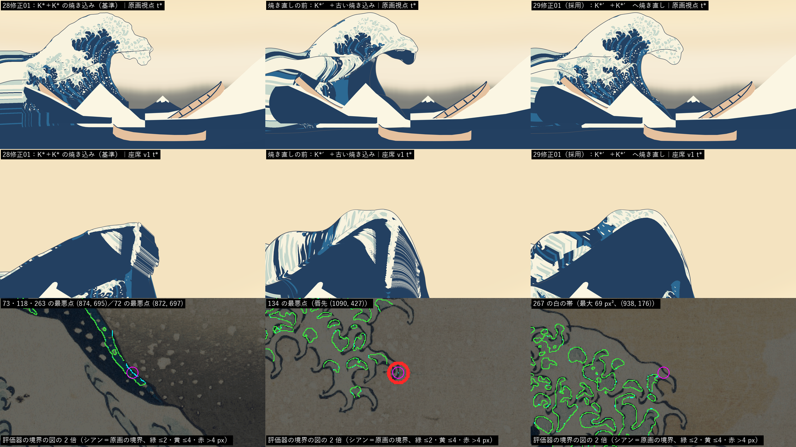

# 設計29修正01：表示用サーフェスを新しい動き（F\_final・K\*′）で作り直す ― 再生器が精度の層を読み、色面を K\*′ へ焼き直す

日付：2026-09-29／状態：**閉じた（最小の受入は満たした。ただし色面の後退の判定は、輪郭の両側を除く読みでの合格）**。Part A（再生器）と Part B（測定）を並べて行い、進行役の独立の検査で必須の指摘 1 つ（色面の焼き直し）が出たので、1 回だけ直した。証拠の種類：numpy の検査器（設計29 の検査器を精度の層つきで走らせた）、Blender 5.2.2 ヘッドレスの射線と BVH、Unity 6000.4.3f1 の batchmode の PC オフスクリーン描画（RTX 3080、Direct3D11）と美術優先28修正01 の評価器、進行役の独立の検査。**HMD 実機の結果ではない。**

- 対象：[段階9までの実行計画](../Design/Stage9_Plan_2026-09-26_ja.md)（以下「計画」）§2.1 の設計29 と、その［Q22］の注記の「設計29修正01（表示用サーフェスを新しい動きで作り直す）」。あわせて、[設計28修正01 の記録](Design_28_修正01_ja.md) §8 の「設計29修正01」への引き継ぎ（(a) 色面の焼き直し、(b) GPU メモリ、(c) 行 239、(d) 原画の大きな輪郭を Unity の画像から測る）。
- 時間の上限：[制作手順の Q26](../Workflow/Production_Workflow_ja.md#q26段階9を今週末までに届かせるよう作業を速める指示2026-09-29) の日程の表では 3 時間。設計28修正01 からの引き継ぎ (a)〜(d) を含めて、進行役がこの番号を 4 時間とした。実績はファイルの時刻で 9/29 14:46（最初のファイル）〜15:36（直しの回の最後）、記録は 15:41 から。上限の内。Unity の 1 回はどれも 30 分より十分短い（`DS29Render`・`DS27Formation` の中の時間 7.6〜42.2 s。ログの `DS29_RENDER_DONE`・`DS27_RENDER_DONE` の行）。
- 修正回数：1（色面の焼き直し）。Q26 の「直しは 1 回まで」のとおり、2 回目はしていない（第 6 節）。
- 対応するバックログ（計画 §2.1）：117、83・115・116（座席からの射線の事前検査）と、設計28 から引き継いだ 106・107。**6 つとも合格**（83・115・116 は事前検査で、判定は番号41）。[metrics.json](../Evidence/Design/29R01/metrics.json) の `backlog`。
- 動き（設計28修正01 の F\_final のパッケージ `Unity/Build/Design/28R01F/F_final/art_on`、242 層）と最後の一コマ K\*′（`Unity/Build/Design/28R01F/kstar_final/kstarR4_a45.gwb`、SHA-256 `38a9b11a…`）は読むだけで、変えていない。
- 座標と単位は設計27〜29 と同じ（m・s、τ は物理の時刻で t\* = 0）。「行・列」は K\*′ の格子（240 行 × 400 列）の番号。「精度の層」は設計28修正01 の試行E で足した `ds27_pos_lo_rgba8.bin`（位置の 16 bit の丸めの残りを 8 bit で持つ。16 bit だけでは刻み約 1.2 mm、精度の層つきでは約 7 µm）。

## 見るもの

| t\* の比べ（上段：原画視点、中段：座席 v1、下段：色面の後退が残る所の 2 倍の切り出し） |
| --- |
|  |

- 上の図の左から、美術優先28修正01 の描画（K\* ＋ K\* の焼き込み。後退の判定の基準）、焼き直しの前（K\*′ に古い焼き込みを当てたまま。Part A の描画）、**採用した描画（K\*′ へ焼き直した色面）**。焼き直しの前は、原画視点で爪の模様がほとんど消え、白・水色・藍の太い帯が原画にない形で切れていた。焼き直しの後は、原画の爪の模様と色の配置に戻った。左下の暗い丸い形は、焼き直しの前も後も同じ手前の波の仮置き（第 5 節の 8）。
- 下段は評価器の境界の図（シアン＝原画の色区の境界、緑・黄・赤＝描画の境界の点の差 ≤2・≤4・>4 px）の 2 倍の切り出し。マゼンタの丸が、評価器の定義のままの読みで残った後退の場所（第 2.2 節）。どれも波の輪郭のすぐ内側で、描画の空が原画の色区へ入り込んだ所。
- 採用した描画の動画（1920 × 1080、30 fps、421 コマ、t 0〜14 s、F\_final の時間曲線 `timewarp_F_final.json`）：[原画視点](../Evidence/Design/29R01/ds29r01_painting_30fps.mp4)／[座席 v1](../Evidence/Design/29R01/ds29r01_seat_30fps.mp4)／[座席から波の方向](../Evidence/Design/29R01/ds29r01_seat_toward_wave_30fps.mp4)／[左の側面](../Evidence/Design/29R01/ds29r01_side_left_30fps.mp4)。
- 静止画：[原画視点の t\*](../Evidence/Design/29R01/ds29r01_painting_tstar.png)、[座席から波の方向の t\*](../Evidence/Design/29R01/ds29r01_seat_toward_wave_tstar.png)、[4 視点 × τ −3・−1・0 s の一覧](../Evidence/Design/29R01/fig_ds29r01_stills_sheet.png)、[動画のコマ（240・330・390・420）の一覧](../Evidence/Design/29R01/fig_ds29r01_video_frames.png)（行は上から原画視点・座席 v1・座席から波の方向・左の側面）。
- 行 239（K\*′ の最後の行）の見え方：[左の側面 t\* の奥の斜めの縁](../Evidence/Design/29R01/fig_ds29r01_row239_farline.png)（上＝精度の層を読む再生器、下＝16 bit だけの再生器）。16 bit だけでは外殻線が太く点々になり、精度の層つきでは 1 本のきれいな線になる。
- 唇先の薄い断面（記録のみ）：[fig_ds29r01_lip_thin_sections.png](../Evidence/Design/29R01/fig_ds29r01_lip_thin_sections.png)。
- 数値：[metrics.json](../Evidence/Design/29R01/metrics.json)（最小の受入 `acceptance`、引き継ぎ `handoffs_from_design28r01`、バックログ `backlog`、記録のみ `record_only`、採った読み `decision`、渡し先 `handoffs_out`）、表示用サーフェスの表 [ds29r01_display_table.md](../Evidence/Design/29R01/ds29r01_display_table.md)（設計29 の原版と並べた、Part B）、Unity の照合 [ds29r01_unity_check.json](../Evidence/Design/29R01/ds29r01_unity_check.json)（Part A）、焼き直しのまとめ [ds29r01_rebake_summary.json](../Evidence/Design/29R01/ds29r01_rebake_summary.json)、t\* の判定 [ds29r01_tstar_verdict.json](../Evidence/Design/29R01/ds29r01_tstar_verdict.json)、両側の読み [ds29r01_tstar_sym.json](../Evidence/Design/29R01/ds29r01_tstar_sym.json)、大きな輪郭の関門 [ds29r01_lfgate_unity.json](../Evidence/Design/29R01/ds29r01_lfgate_unity.json)、実行条件と SHA-256 [run.json](../Evidence/Design/29R01/run.json)。
- **描画の傷は残っている**：設計28 から設計36・38 へ渡した唇の端の梯子・モアレ、座席から波の方向の縦の継ぎ目、前面の足の縦の筋、爪の模様が埋まっていくこと、左端の横縞は、この番号でも直していない（この番号の範囲の外。第 7 節）。t\* の原画視点で、面の中を横切る外殻線（K\*′ の折れの線）も見える。

## 0. 結論

1. **原版＝設計28修正01 の F\_final のパッケージそのもの（K\*′ の格子 240 × 400、242 層）を、精度の層を読む再生器 `DS29KeyposePlayer` で描く**（設計29 §3 の規則：原版はパッケージ自身の網）。網は張り直していない。
2. **メッシュ検査は、静止の網の読みと厳しい読み（30 Hz の全 361 コマ、頂点を共有する組を含む）の両方で 0**。設計29 の原版は厳しい読みで自己交差 7 コマ・面の反転 7 だった。ただし 0 になるのは精度の層を読んだ時だけで、16 bit だけで読むと自己交差が戻る（頂点を共有しない組 112 コマ・529 組、頂点を 1 つ共有する組 40 コマ・57 組）。**精度の層を読むことは、この網の条件である。**
3. **座席 v1 の射線（5 万本 × 36 コマ）：穴・開いた背面・t\* の切断端・継ぎ目の切断は 0。** keypose の GPU メモリは **221.92 MiB**（位置 132.93 ＋ 精度の層 88.62 ＋ T\_white 0.37。GPU だけのバッファで、読み取り可能の写しを持たない）で、上限 512 MiB の内。
4. **Unity の GPU の読み戻しと numpy の Hermite の差は最大 0.0252 mm**（τ −6〜0 s の 519 コマ。基準 0.25 mm）。同じ読み戻しを 16 bit だけの復号と比べると 1.20〜1.48 mm 離れるので、GPU は精度の層を読んでいる。設計27・28 の古いパッケージは、今のコードで描いても画像と動画の SHA-256 まで同じ。
5. **色面を K\*′ へ焼き直した**（引き継ぎ (a)）。色区の項目の 28修正01 との差の最大は、焼き直しの前の 146.47 px から 13.64 px に減った。**評価器の定義のままの読みでは、6 項目（73・79・118・134・175・263）がまだ ±0.5 px を超え、134 と 267 は合格から不合格に変わる。** 残った差はどれも、描画の空が原画の色区へ入り込んだ所にある。K\*′ の輪郭が原画から 2.7〜3.8 px ずれている（Unity の画像の 78／130／131 の最大は 3.03／3.51／3.04 px。28修正01 の K\* は 1.64／1.95／1.80 px）ためで、焼き込みでは動かせない。
6. **輪郭の両側（原画の空または描画の空から 2 px 以内）を除く読みでは、色区の項目の 28修正01 との差は、悪くなった向きで最大 +0.414 px（118）で、±0.5 px の内**。±0.5 px を超えるのは 175 の藍中の境界の −1.153 px だけで、これは良くなった向き（`ds29r01_tstar_sym.json` の `pass` は差の絶対値で判定するので false と出る）。267 の白の帯も 0 になる。**この読みを採って、最小の受入の「原画視点の後退なし」を満たしたとした。** 直しの回が推奨した案を、Q24 に従って採った。評価器の定義を変えた読みなので、進行役の決定として記録する（利用者の決定ではない）。定義のままの読みの値は、K\*′ の輪郭の直しと一緒に仕上げ28 へ渡す。
7. **原画視点の輪郭は K\*′ の値から動いていない**：幾何で差 0.000 px。Unity の画像で 78／130／131 は 3.029／3.513／3.043 px（K\*′ との差 +0.29／−0.32／+0.12 px）、132 の大きな輪郭（σ 12）は 3.755 px。**72 の大きな輪郭（σ 24）は Unity の画像で p95 4.0075 px** で、K\*′ の値 3.746 px との差 +0.26 px は ±0.5 px の内だが、4 px の関門は 0.0075 px 超える（引き継ぎ (d)。記録して仕上げ28 へ）。
8. **行 239（引き継ぎ (c)）は直さなくてよい**：精度の層つきでは、決まらない法線 0、t\* の行 239 の法線は K\*′ と 0.4° 以内、左の側面の奥の縁は 1 本のきれいな線で描かれる。
9. 記録のみ：唇先の厚さは最小 0.021 m（t\* で 0.259 m。基準 ≥ 0.3 m）で不合格。K\*′ と動きの値で、表示の網では変わらない（仕上げ28）。設計29 の奥の壁の最後の急な下がり（0.111 m）は 0.0126 m になり消えた。

---

## 1. 目的

計画 §2.1 の設計29 の最小の受入（採用した網で、メッシュ検査（非多様体・面の反転・自己交差）0、座席からの射線で穴・切断端・開いた背面 0、keypose ≤ 512 MiB、原画視点の後退なし）を、設計28修正01 の新しい動き F\_final と最後の一コマ K\*′ で満たし直す。設計29 では、16 bit の量子化（約 1.2 mm）で短い辺がつぶれ、厳しい読みで mm の大きさの自己交差が出ていた。設計28修正01 の試行E で、それを消すための精度の層をパッケージに足したが、Unity の再生器はまだ読んでいなかった。

この番号では次の 3 つを行った。

- Part A：再生器が精度の層を読むようにする。古いパッケージ（設計27・28）の描画は 1 画素も変えない。
- Part B：新しいパッケージを、設計29 と同じ検査器で、静止の網の読みと厳しい読みの両方で測る。
- 直しの回：色面（NPR の色区）を K\*′ へ焼き直す（設計28修正01 からの引き継ぎ (a)）。

最小の受入の範囲は、Q26（段階9 を 10/4 までに）により、計画の最小の受入と、設計28修正01 から渡された引き継ぎ (a)〜(d) だけにした。

---

## 2. 表

### 2.1 表示用サーフェス（設計29 の原版との比べ）

値は Part B の表 [ds29r01_display_table.md](../Evidence/Design/29R01/ds29r01_display_table.md) と Part A の照合 [ds29r01_unity_check.json](../Evidence/Design/29R01/ds29r01_unity_check.json) から。

| 項目 | 基準 | 設計29 の原版（設計28 の網、16 bit） | **29修正01 の原版（精度の層つき）** | 同じ網を 16 bit だけで読む（参考） |
| --- | --- | --- | --- | --- |
| 静止の網の読み（36 コマ、τ −4.433〜0 s）：非多様体・巻き方向の食い違い・上に網のない下向きの面・3 次元の自己交差（頂点を共有する組を除き、両方の面 ≥ 5 mm） | 0 | 0・0・0・0 | **0・0・0・0** | — |
| 断面の自己交差（線分 ≥ 5 mm、36 コマの和） | 0 | 1 | **0** | — |
| 厳しい読み（30 Hz の 361 コマ、τ −12〜0 s）：頂点を 1 つ共有する組の貫通（コマ・組・最大の深さ mm） | 0 | 7・7・3.45 | **0・0・0** | 40・57・0.02 |
| 同：頂点を共有しない組（BVH、コマ・組） | 0 | 4・4 | **0・0** | 112・529 |
| 同：30 Hz で前のコマと比べた面の反転 | 0 | 7 | **0** | — |
| 座席 v1 の射線 5 万本 × 36 コマ：穴・開いた背面・t\* の切断端・継ぎ目の切断 | 0 | 0・0・0・0 | **0・0・0・0** | — |
| keypose の GPU メモリ（Unity のバッファの大きさ） | ≤ 512 MiB | 109.1 MiB（位置＋T\_white＋網） | **221.92 MiB**（位置＋精度の層＋T\_white。網 6.58 MiB は別） | 133.30 MiB（精度の層を除く） |
| GPU の読み戻しと numpy の Hermite の差 | ≤ 0.25 mm | 0.023 mm（15 時刻） | **0.0252 mm**（519 コマ） | — |
| t\* の網と K\*′ の差（頂点の最大） | 記録 | 1.2 mm（K\* と） | **0.009 mm** | 1.21 mm |
| 原画視点の関門の幾何：78／130／131 最大、132 の大きな輪郭 σ 12 最大、72 の大きな輪郭 σ 24 p95（px） | 各 ≤ 4、K\*′ と ±0.5 | — | **2.741／3.831／2.924／3.905／3.746**（K\*′ と差 0.000） | 2.741／3.831／2.92／3.946／3.747 |
| 層の数 | 記録 | 186 | 242 | 242 |

- 厳しい読みの 0 は独立の検査でも同じだった（Blender の BVH で両方の面 ≥ 5 mm の組 0、頂点を 1 つ共有する組の貫通 0、30 Hz の面の反転 0、決まらない法線 0）。5 mm の条件を外すと、頂点を共有しない組の接触が 1,384 組・150 コマある（τ −12〜−5.37 s）。記録された面はどれも行 238〜239 の間の四角形（列 143〜178）で、両方の面が 5 mm より細い面どうしの接触である。描画では見えない（記録のみ。第 5 節の 4）。
- 16 bit だけで読むと、独立の検査では 30 Hz の面の反転が 204 コマで 31,219、決まらない法線が最大 187 あった。精度の層を読まない再生器では、この網は使えない。

### 2.2 色区の項目（t\* の原画視点、28修正01 との比べ）

評価器は美術優先28修正01 の手順（`ds27_tstar_eval.py`）。値は各項目の最大（px）。

| 項目 | 28修正01（基準） | 焼き直しの前（K\*′ ＋ 古い焼き込み） | **焼き直し：評価器の定義のまま** | 両側の読み：28修正01 | **両側の読み：焼き直し** |
| --- | --- | --- | --- | --- | --- |
| 73 内側の水色（藍中）の境界 | 0.655 | 65.058 | 2.484 | 0.303 | 0.303 |
| 77 下側から始まる縞の下端 | 1.17 | 85.562 | 0.867 | 1.17 | 0.867 |
| 79 左側の白 | 0.34 | 45.774 | 1.012 | 0.34 | 0.357 |
| 118 主要な縞の両側 | 0.655 | 86.153 | 2.484 | 0.453 | 0.867 |
| 120 | 0.288 | 39.716 | 0.288 | 0.288 | 0.288 |
| 133 左から上へ続く白 | 0.402 | 37.408 | 0.718 | 0.402 | 0.718 |
| 134 白帯 | 0.977 | 45.878 | **8.996（不合格）** | 0.661 | 0.634 |
| 175 藍濃の境界 | 0.309 | 146.778 | 0.428 | 0.309 | 0.428 |
| 175 藍中の境界 | 2.41 | 88.382 | 16.052 | 1.625 | 0.472 |
| 175 淡い水色の境界 | 18.375 | 91.049 | 18.401 | 0.865 | 0.978 |
| 263 内側から下方へ続く水色の下部 | 0.559 | 24.896 | 2.484 | 0.301 | 0.25 |
| 270 白と水色の境 | 0.563 | 67.885 | 0.563 | 0.563 | 0.563 |
| 265 内側の水色の表示色（ΔE00） | 0.545 | 14.221（不合格） | 0.545 | 合格 | 合格 |
| 266 水色の平塗り | 合格 | 不合格 | 合格 | 合格 | 合格 |
| 267 白の平塗り（20 px 以上の帯） | 0 | 不合格 | **7（不合格）** | 0 | 0 |
| 28修正01 との差の最大 | — | 146.47 | 13.642 | — | 1.153（175 藍中、改善の向き） |

- 175 は 28修正01 から不合格（失われる色区 M171・A073 は 28修正01 と同じ）。
- 「焼き直しの前」の値は精度の層つきの描画。16 bit だけの描画と比べると、263 の下部だけが +1.875 px（23.021 → 24.896）動き、ほかは 0.42 px 以内。どちらも古い焼き込みなので、判定には使っていない。
- 評価器の定義のままの読みで残った後退の場所（[ds29r01_rebake_summary.json](../Evidence/Design/29R01/ds29r01_rebake_summary.json) の `strict_worst_points_at_kstar_prime_silhouette`・`strict_267_bands`）：
  - 73・118・263 の最悪点（873.7, 695.0）は描画の空から 0 px、原画の空から 2.83 px。72 の大きな輪郭の最悪点（872, 697）と同じ所。
  - 79（(378, 284)）と 134（唇先 (1090, 427)）は描画の空から 0 px、原画の空から 2.24 px。175 の藍中は 1.41 px と 3.61 px。
  - 267 の白の帯 7 つ（面積 23〜69 px²）は、帯の 85.5〜100% が描画の空。
  - つまり、どれも「K\*′ の輪郭が原画の輪郭より内側にある所で、原画では色区、描画では空」になっている。評価器は、原画の空から 2 px 以内の点を輪郭の項目として色区の項目から除くが、描画の空から 2 px 以内の点は除かない。K\* では輪郭の差が小さかった（78／130／131 の最大 1.64／1.95／1.80 px）ので、この片側の除き方で足りていた。

---

## 3. 採用と理由

**採用**：

- 網：F\_final のパッケージの K\*′ の格子（240 × 400、242 層）そのもの。
- 再生器：精度の層を読む `DS29KeyposePlayer`。
- 色面：K\*′ へ焼き直した表（`af28r01_uvsdf_a45.bin` SHA-256 `69c0b26d…`、UV3 の表 `af28r01_uvwarp_a45.json` `fbd95c90…`）。
- 描画の道：`DS29Render` に `-ds29KStarGwb`・`-ds29Sdf`・`-ds29Warp` を渡す（第 8 節）。

**理由**：

- 設計29 §3 の規則（原版はパッケージ自身の網）で、網の張り直しは要らなかった。精度の層つきで、メッシュ検査は静止と厳しい読みの両方で 0、座席の射線 0、t\* は K\*′ と 0.009 mm。
- 最小の受入の各項目の判定は第 4 節の表のとおり。

**作り方**（Part A と直しの回。コードの説明は各ファイルの冒頭）：

- 精度の層の読み方：
  - `DS29KeyposePlayer` が `ds27_pos_lo_rgba8.bin` をバイトのまま GPU だけの `StructuredBuffer<uint>` に置く（頂点 × 層ごとに 4 バイト）。読む前にファイルの SHA-256 と、A が 255 であることを確かめる。
  - その上で大域のキーワード `DS27_POS_LO` を入れる。
  - `DS27KeyposeCore.cginc` は、キーワードがある時だけ位置を bbox\_min ＋ (q16 ＋ lo/255 − 0.5)/65535 × bbox\_size で復号する。法線の差は、16 bit の整数の差に 8 bit の整数の差 / 255 を足して作る。
  - キーワードのない変種は元の式のまま。3 つのシェーダー（`DS27_NPR_White`・`DS27_Outline_Keypose`・`DS27KeyposeCapture.compute`）には `#pragma multi_compile _ DS27_POS_LO` を 1 行ずつ足した。
- 設計27 の再生器 `DS27KeyposePlayer` は精度の層を読まない（設計27・28 の証拠を変えないため）。値を渡すたびにキーワードを切る。
- 色面の焼き直し：
  - 美術優先28修正01 の焼き込みの道具を、入力と出力の置き場所だけ変えて K\*′ で走らせた。`ds29r01_bake_input.py` は `af28_bake_input.py` を包み、`DS29R01ProjectionBaker` は `AF28R01ProjectionBaker` の写しで、変えたのは出力のフォルダーとログの印だけ。`DS29R01Bake.BakeKStarPrime` が、描画と同じ「DS27 painting」のカメラで焼く。
  - 原画の側の入力（符号付き距離・有効域）は 28修正01 とバイトまで同じ。K\*′ の UV3 の表は 1 テクセルあたり 0.581／0.542 px（28修正01 は 0.599／0.446）。
  - 規則 r01 で直接 3,461,866 テクセル、空き 0、ラスタ化されないテクセル 0。2 回目の焼き込みで色面・UV3 の表の SHA-256 が同じ。

**採った読みと、落とした案**（Q24。直しの回の推奨の案を採った。利用者の決定ではない）：

- 採った：色区の後退は、輪郭の両側（原画の空または描画の空から 2 px 以内）を除く読み（`ds29r01_tstar_sym.py`）で判定する。同じ読みを 28修正01 の描画にも当てて、同じ読みどうしで比べる。評価器の定義のままの読みの値は記録して、仕上げ28 へ渡す。
  - 理由：残った差の場所がすべて K\*′ の輪郭の差の所で、色面の問題ではない。輪郭の差は、設計28修正01 で原画視点の輪郭 ≤ 4 px の関門の内として受け入れている。
  - 両側の読みで除いた画素は、267 の白の範囲で 608 px（白の範囲 101,971 px のうち）。
- 落とした (1)：評価器の定義のままの読みで不合格として止める。焼き込みでは K\*′ の輪郭の差を動かせないので、止めても直す手がない。
- 落とした (2)：2 回目の直し（輪郭の差の所で色区を空の側へ伸ばす焼き込みの規則を足す）。Q26 の「直しは 1 回まで」を超え、原画にない色を空の側へ塗ることになる。

---

## 4. 関門

| 最小の受入・引き継ぎ | 基準 | 値 | 判定 |
| --- | --- | --- | --- |
| メッシュ検査：静止の網の読み（36 コマ） | 0 | 非多様体 0・巻き方向 0・下向きの面 0・3 次元の自己交差 0・断面の交差 0 | 合格 |
| メッシュ検査：厳しい読み（30 Hz の 361 コマ、頂点を共有する組を含む） | 0 | 貫通 0・BVH 0・面の反転 0 | 合格（精度の層つき。16 bit だけでは不合格） |
| 座席 v1 の射線：穴・切断端・開いた背面（83・115・116）、継ぎ目の切断（117） | 0 | 0・0・0、0 | 合格（事前検査。判定は番号41） |
| keypose の GPU メモリ（精度の層つき、引き継ぎ (b)） | ≤ 512 MiB | 221.92 MiB。Unity の割り当ての数の増えも同じ。読み取り可能の写しなし | 合格 |
| 原画視点の後退なし：輪郭（K\*′ の値と） | ±0.5 px | 幾何 0.000 px。Unity の画像の 78／130／131 は +0.29／−0.32／+0.12 px、132 σ 12 は −0.15 px、72 σ 24 は +0.26 px | 合格 |
| 同：色区の項目（28修正01 の値と、引き継ぎ (a)） | ±0.5 px | 両側の読み：最大 +0.414 px（118）。175 藍中 −1.153 px（改善）。267 の帯 0 | **合格（両側の読みで。第 3 節）** |
| 同：評価器の定義のままの読み（記録） | ±0.5 px | 73・118・263 は +1.83〜1.93、79 は +0.67、134 は +8.02（不合格へ）、175 藍中は +13.64 px。267 の帯 7 | 不合格・記録のみ（仕上げ28） |
| 72 の大きな輪郭 σ 24 p95（Unity の画像、引き継ぎ (d)） | ≤ 4 px | 4.0075 px | 記録のみ（関門を 0.0075 px 超える。仕上げ28） |
| Unity の GPU の読み戻しと numpy の Hermite | ≤ 0.25 mm | 0.0252 mm（519 コマ）。焼き直しの描画の 15 コマでも 0.0263 mm | 合格 |
| 古いパッケージ（設計27・28）の描画が同じ | 画素まで同じ | 設計28：34/34 ファイル・3/3 動画（直しの後も 34/34・3/3）。設計27：29/29・4/4 | 合格 |
| シェーダーの変種のコンパイル（SPI を含む 24） | 全部通る | 24/24、ステレオの出力に SV\_RenderTargetArrayIndex、compute のエラー 0 | 合格（コンパイルだけ。ステレオの描画と HMD は未検証） |
| 行 239 の法線（引き継ぎ (c)） | K\*′ と同じ | 決まらない法線 0。t\* で行 239 は K\*′ と 0.4° 以内、行 238 との角度 27.14°（K\*′ 自身 27.15°） | 合格（直しは要らない） |
| 106：行の間の伸び（P13 (5d)） | 0.05〜4 | 0.195／2.098 | 合格（設計28・29 は不合格） |
| 107：30 Hz の面の反転（P13 (5g)） | 0 | 0 | 合格（設計29 の原版は 7） |
| 薄膜：唇先の厚さ（36 コマの最小） | ≥ 0.3 m | 0.021 m（t\* で 0.259 m） | 不合格・記録のみ（K\*′ と動き。仕上げ28） |

- 独立の検査（進行役が作り手のコードを読まずに書いた復号器）でも、GPU の読み戻しは全 520 コマで最大 0.0263 mm、GPU の法線は自前の式と 0.015° 以内、座席の射線・静止と厳しい読みの検査は同じ 0 だった。
- 設計28 のパッケージの確かめは、Part A の後と、直しの回で `DS29Render` に引数を足した後の 2 回行った。設計27 の道（`DS27Formation`）は Part A の後で確かめた。設計27 のファイルは Part A の変更（14:46）の後で変わっていない（直しの回の描画の報告の `protectedFiles` の SHA-256 が Part A の記録と同じ）。

---

## 5. 限界

1. **色区の後退の合格は、両側の読みでの合格**である。評価器の定義のままの読みでは 6 項目が ±0.5 px を超え、134（唇先の白帯、8.996 px）と 267（白の平塗り、帯 7）は不合格になる。原因は K\*′ の輪郭の差（Unity の画像で 78／130／131 の最大 3.03／3.51／3.04 px）で、表示用サーフェスでも色面でもない。見え方で言えば、原画視点で波の輪郭が原画より 2〜3 px 内側にある所が、原画では色、描画では空になっている。
2. **72 の大きな輪郭（σ 24）は Unity の画像で 4.0075 px** で、4 px を超える。幾何の値（3.746 px）との差 +0.26 px は、ID 画像の画素の被覆の読みの差。σ 24 の読み自体が進行役の決定である（設計28修正01 §4.3）。
3. **唇先の厚さは ≥ 0.3 m を満たさない**。最小 0.021 m（τ −2.7 s。形成の途中は τ −2.7〜−2.4 s の唇の出始めに 0.021〜0.085 m。Part B の読みでは、唇の出始めの小さな鉤に、唇先から 0.75 m 奥の鉛直が当たる）、唇先の頂点（τ −1.333 s）で 0.111 m、t\* で 0.259 m（c −24.2 の 4 断面。K\*′ 自身も 0.259 m）。K\*′ と動きの値で、表示の網では変わらない（設計29 の原版は 0.557 m）。
4. 行 238〜239 の間には、5 mm より細い面どうしの接触が残る（1,384 組・150 コマ、τ −12〜−5.37 s、列 143〜178）。行 239 の線分 399 本のうち 376 本は 1 mm 未満（K\*′ の gwb でちょうど長さ 0 の線分は 0 本。設計28修正01 §8 の「216 本」とは数え方が違う）。形成の間、行 239 と行 238 の法線の角度は最大 87.7°（τ −11.8 s）になる。これは K\*′ の奥の端の幾何で、量子化ではない。左の側面の動画のコマ 60・150・240・330 で、精度の層つきと 16 bit だけの描画の違い（RGB のどれかが 24/255 を超えて違う画素）は 109・150・295・499 画素で、傷は見えなかった（独立の検査が書き出したコマ `indep_check/frames/side_*_*.png` を記録の時に数えた）。
5. 形成の間、行 235〜237 × 列 199〜315（c +14.2〜+14.6、高さ 2 m 未満の奥の端）で、再生器の法線が 1 つ手前の行と 90° を超えて違う（最悪 τ −8.63 s に 113 頂点。精度の層つきでも 16 bit でも出る）。K\*′ の行 234 と 235 の間で列の割り付けが約 1 m 跳ぶ所の剪断で、t\* では 0。28R01F の静止画では見えない（座席から波の方向では 88〜123 m 先で船の陰、原画視点の τ −3.2 s では画面の左端の幅約 0.5 px の一様な藍濃）。
6. 動きの値（記録のみ）：
   - 30 Hz の地面の二階差分の最大は 0.0673 m（頂点 75194＝行 187・列 394、τ −5.667 s。2 g の 0.0218 m を超える）。
   - P13 の (2)(5b)(5c)(5e) は不合格（(5b) 2.9 mm、(5c) 0.011／2.472、(5e) 0.248）。
   - 二面角 120° を超える面は 1 コマで最大 59（K\*′ 自身 11）。
   - t\* より前の外周の切断端／縁の下は 27,866／1,396 本（周りの海は設計30）。
7. **座席の見えない内壁は平らな藍濃**で、左側に横の外挿の帯が出る（[t\* の比べ](../Evidence/Design/29R01/fig_ds29r01_tstar_compare.png) の中段右）。美術優先28修正01 の外挿の規則のままで、この番号では変えていない（番号41 と設計36・38）。
8. **原画視点の左下の暗い丸い形は、27修正01 の手前の波の仮置き**である。K\*′ の左下がその後ろに入ったので見えるようになった。主役波だけを描いた色区の ID 画像では、その場所は縞の色区で、丸い形はない。色区の項目は、主役波の外を原画で置き換えて評価するので、影響しない（置き換えは設計39・40）。
9. **軽量版 120 × 200**（設計29 の r02 の張り方を F\_final から作り直した。307 層、2 回作って 9 ファイルの SHA-256 が同じ）：
   - メッシュ検査と座席の射線は 0。
   - 原画視点の幾何で K\*′ から 0.669 px 動く（後退の規則で不合格）。72 σ 24 は 4.415 px。
   - UV3 は古い 28修正01 の表のままで、色区と座席の視点の輪郭は測っていない。
   - 名前を付けた非常用の予備にとどめる。
10. 描画の時間（壁時計のおおよその値、600 コマ × 3 回の中央値）は、精度の層つきで 0.123／0.101 ms（原画視点／座席）、なしで 0.157／0.093 ms。同じ組でも回によって約 50% 揺れるので（設計29）、差は揺れの内。PC の片目の値。
11. **HMD 実機ではない**。すべて PC のオフスクリーン描画。SPI（ステレオ）はシェーダーのコンパイルだけを確かめた。
12. 再生器は、`DS29KeyposePlayer` だけが精度の層を読む。`DS27KeyposePlayer`（`DS27Formation`・`DS28ReviewView`）は 16 bit だけのまま。両方を 1 つの場面で同時に使うと大域のキーワードが切り替わり合う。今の描画の道にはそういう場面はない。

---

## 6. 修正の記録（Q26：直しは 1 回まで）

| 回 | 変えたこと | 結果 |
| --- | --- | --- |
| 初回（Part A・Part B、14:46〜15:02） | 再生器が精度の層を読む（シェーダーの変種、`DS29KeyposePlayer`、`DS29Render` の `-ds29PosLo`・`-ds29CaptureRange`）。新しいパッケージを設計29 の検査器で精度の層つきで測る | 最小の受入のうち、メッシュ検査・射線・GPU メモリ・読み戻し・古いパッケージは合格。t\* の色区は古い焼き込みのままで 24.9〜146.8 px ずれた（焼き直しの前） |
| 独立の検査（15:08〜15:18、ファイルの時刻） | 自前の復号器と Blender の BVH・射線、t\* の評価のやり直し、動画のコマの目視 | 必須の指摘 1 つ：引き継ぎ (a) の焼き直しが未着手で、色区の後退が残る（第 10 節） |
| 直し 1（15:23〜15:35、ファイルの時刻） | K\*′ への色面の焼き直し（`ds29r01_bake_input.py`・`DS29R01ProjectionBaker`・`DS29R01Bake`）、`DS29Render` に `-ds29KStarGwb`・`-ds29Sdf`・`-ds29Warp`、F\_final を描き直して評価、両側の読み（`ds29r01_tstar_sym.py`）と Unity の画像の大きな輪郭（`ds29r01_lfgate.py`） | 差の最大 146.47 → 13.64 px。評価器の定義のままでは 6 項目が残り、両側の読みでは悪くなった向きの差が最大 +0.414 px（超えるのは改善の向きの 175 藍中 −1.153 px だけ）。第 3 節の読みを採って閉じた |

- 記録の時に、焼き直しの描画の 15 コマの GPU の読み戻しも照合した（最大 0.0263 mm、`check_gpu_f_final_kp.json`）。

---

## 7. 引き継ぎ（設計30・36・38・仕上げ29、ほか）

**設計30**（次の番号）

- t\* より前の外周の切断端／縁の下（27,866／1,396 本。設計29 は 37,215／33,303）。周りの海とのつなぎで扱う。
- 設計28修正01 から：座席の船を新しい谷に座らせる、右の波の接続、谷から周りの海への続き。
- 再生は `DS29KeyposePlayer`（精度の層を読む）で行う。`DS27KeyposePlayer` で F\_final を描くと、厳しい読みの自己交差と行 239 の法線の裏返りが戻る。

**設計36・38**（色と外殻線）

- 設計28 から渡された描画の傷 5 つ：唇の端の梯子・モアレ、座席から波の方向の縦の継ぎ目、前面の足の縦の筋、爪の模様が埋まっていくこと、左端の横縞。この番号では直していない。
- 焼き直しの後の t\* の原画視点で、面の中を横切る外殻線（K\*′ の面の折れの線）。
- 座席の見えない内壁の平らな藍濃と、左の横の外挿の帯（番号41 とも関わる）。

**仕上げ28**（K\*′ の縁を原画に合わせ直す時に一緒に）

- 評価器の定義のままの読みの色区の差：73・118・263 は 2.484 px、79 は 1.012 px、134 は 8.996 px（不合格）、175 の藍中は 16.052 px、267 の白の帯 7。
- 72 σ 24 の Unity の画像の値 4.0075 px。
- 唇先の厚さ（最小 0.021 m、t\* で 0.259 m）。
- 30 Hz の地面の二階差分 0.0673 m。

**仕上げ29**（表示用サーフェスの仕上げ）

- 行 234〜239 の張り直し：形成の間の行 235〜237 の法線の折れと、行 238〜239 の 5 mm 未満の細い面どうしの接触。HMD で見えた時だけ行う。
- 軽量版を新しい UV3 の表（`af28r01_uvwarp_a45.json`）で作り直し、色区と座席の輪郭を Unity で測る。

**設計08〜10**（PS VR2 の導入の後）：ステレオの描画と HMD は未検証。

---

## 8. 再現

リポジトリの根で行う。前提：設計28修正01 の F\_final のパッケージ（`Unity/Build/Design/28R01F/F_final/`）、K\*′（`Unity/Build/Design/28R01F/kstar_final/`）、美術優先28修正01 の焼き込みと描画（`Unity/Build/ArtFirst/28修正01/`）、設計29 の描画（`Unity/Build/Design/29/unity/src_d28`）、設計27 の描画（`Unity/Build/Design/27/art_on_default`）が本機にあること（どれも Git 対象外）。Python は `py -3.10`（numpy 2.2.6、Pillow 12.0.0）。Unity は `Tools/GWWaveGen/ds29r01/run_ds29r01_unity.ps1` で 1 回ずつ（`Unity/Build/unity.lock` を取って、終わったら消す。30 分の上限）。コマンドの全体は [run.json](../Evidence/Design/29R01/run.json) の `commands`。

1. Part A（再生器）：
   - `run_ds29r01_unity.ps1 -Method GreatWave.Design29.EditorTools.DS29Render.Render -Log f_final -Package Build/Design/28R01F/F_final/art_on -WarpFile Build/Design/28R01F/F_final/timewarp_F_final.json -OutDir Build/Design/29R01/unity/f_final …`（`-Extra "-ds29Name f_final -ds29MeshFromPackage 0 -ds29CaptureRange -6,0"`）
   - 古いパッケージ：`-Log regress_d28`（設計28）と、`-Method GreatWave.Design27.EditorTools.DS27Formation.RenderOnly -Log regress_d27`（設計27）
   - シェーダーの変種：`-Method GreatWave.Design29.EditorTools.DS29R01ShaderCheck.Run`
   - 照合：`py -3.10 -B Tools/GWWaveGen/ds29r01/ds29r01_unity_check.py gpu|regress|summary`
2. Part B（測定）：`py -3.10 -B Tools/GWWaveGen/ds29r01/ds29r01_measure.py qa|strict --decode fine|hi`、`ds29r01_extra.py memory|tstar|farwall|normals`、`ds29r01_light.py`、`ds29r01_table.py`。出力は `Unity/Build/Design/29R01/measure/`。
3. 直しの回（色面の焼き直し）：
   1. `py -3.10 -B Tools/GWWaveGen/ds29r01/ds29r01_bake_input.py`
   2. `run_ds29r01_unity.ps1 -Method GreatWave.Design29.EditorTools.DS29R01Bake.BakeKStarPrime -Log bake_kp`（決定性の確かめは `-Extra "-ds29r01BakeRoot Build/Design/29R01/bake_kp_rep"`）
   3. `run_ds29r01_unity.ps1 -Method GreatWave.Design29.EditorTools.DS29Render.Render -Log f_final_kp …`（`-Extra "-ds29Name f_final_kp -ds29MeshFromPackage 0 -ds29KStarGwb Build/Design/29R01/bake_kp/kstar/kstar_a45.gwb -ds29Sdf Build/Design/29R01/bake_kp/bake/af28r01_uvsdf_a45.bin -ds29Warp Build/Design/29R01/bake_kp/bake/af28r01_uvwarp_a45.json"`）
   4. `py -3.10 -B Tools/GWWaveGen/ds29r01/ds29r01_tstar_eval.py --run Unity/Build/Design/29R01/unity/f_final_kp`、`ds29r01_tstar_sym.py`、`ds29r01_lfgate.py`
   5. `DS29Render` を変えた後の設計28 の確かめ：`-Log regress_d28_kp`
4. 証拠：`py -3.10 -B Tools/GWWaveGen/ds29r01/ds29r01_figures.py` が図と静止画を書く（上の t\* の比べの下段は、評価器の境界の図 `f_final_kp/t28/evidence/28R01_boundaries.png` の 2 倍の切り出し）。動画は `f_final_kp/video/` の 4 本をそのまま写した。`py -3.10 -B Tools/GWWaveGen/ds29r01/ds29r01_record.py` が metrics.json と run.json を書く。

---

## 9. 出典と、この番号で作ったもの

- 仕様：計画 §2.1 の設計29（［Q10］・［Q11］・［Q22］の注記）、[設計29 の記録](Design_29_ja.md)（§0・§3・§8.1・§9）、[設計28修正01 の記録](Design_28_修正01_ja.md)（§2.6・§4.3・§8）、[美術優先28修正01](Step_28_修正01_ja.md)（色区の評価の手順と値）。
- 読むだけ：F\_final のパッケージ（SHA-256：json `33499241…`、位置 `af08cd4e…`、精度の層 `99a29d6a…`）、K\*′（`38a9b11a…`）、美術優先28 の焼き込みの道具と `Tools/PaintingTruth`、設計27〜29 の証拠の描画。
- 設計26〜28 のコミット済みのファイルと、美術優先28・28修正01 の焼き込みは変えていない。Unity の描画は場面を保存しない（`DS29Render` の報告で `protectedUnchanged = true`）。
- この番号で作ったもの（コミットするもの）：
  - Unity の再生器（Part A）：
    - `Unity/Assets/GreatWave/Design27/Shaders/DS27KeyposeCore.cginc`（精度の層の変種）
    - `DS27_NPR_White.shader`・`DS27_Outline_Keypose.shader`・`DS27KeyposeCapture.compute`（変種の 1 行）
    - `Design27/Scripts/DS27KeyposePlayer.cs`（キーワードを切る）
    - `Design29/Scripts/DS29KeyposePlayer.cs`（精度の層を読む）
    - `Design29/Editor/DS29Render.cs`（精度の層・読み戻しの範囲・K\*′ の網と焼き直した色面の引数）
    - `Design29/Editor/DS29R01ShaderCheck.cs`
  - Unity の焼き直し（直しの回）：`Design29/Editor/DS29R01ProjectionBaker.cs`・`DS29R01Bake.cs`
  - 道具 `Tools/GWWaveGen/ds29r01/`：
    - 測定：`ds29r01_common.py`・`ds29r01_measure.py`・`ds29r01_extra.py`・`ds29r01_light.py`・`ds29r01_table.py`
    - Unity の照合：`ds29r01_unity_check.py`
    - 焼き直しと評価：`ds29r01_bake_input.py`・`ds29r01_tstar_eval.py`・`ds29r01_tstar_sym.py`・`ds29r01_lfgate.py`
    - 手順：`run_ds29r01_unity.ps1`
    - 記録：`ds29r01_figures.py`（図）・`ds29r01_record.py`（metrics.json・run.json）
  - 証拠 `Docs/Evidence/Design/29R01/`：
    - 図と静止画 7 枚（1920 × 1080 の枠に収めた）
    - 1920 × 1080 の動画 4 本（各 5 MB 未満）
    - 表と照合の JSON・md 7 つ
    - metrics.json、run.json
- コミットしないもの：進行役の独立の検査の道具（`ic_decode.py`・`ic_check1.py`・`ic_strict.py`・`ic_blender.py`・`ic_painting.py`）は会話の作業フォルダー（リポジトリの外）にある。結果は Git 対象外の `Unity/Build/Design/29R01/indep_check/` に置いた（SHA-256 は run.json の `build_outputs`）。

---

## 10. レビュー対応

Part A・Part B の後、進行役の独立の検査（ファイルの時刻で 15:08〜15:18）を通した。必須の指摘は 1 つで、1 回だけ直した（第 6 節）。

| # | 指摘 | 対応 |
| --- | --- | --- |
| 1（必須） | 引き継ぎ (a) の焼き直しが未着手。t\* の色区は 28修正01 の古い焼き込みを K\*′ に当てたままで、73・77・79・118・120・133・134・175・263・270 が 24.9〜146.8 px ずれ、265〜267 が不合格。計画 §2.0 の後退の規則を満たさない | 焼き直した（第 3 節）。差の最大は 146.47 → 13.64 px。評価器の定義のままの読みで残る 6 項目は、場所を調べて K\*′ の輪郭の差によると確かめた（第 2.2 節）。両側の読みでは悪くなった向きの差が最大 +0.414 px で ±0.5 px の内（第 3 節の採った読み）。直した後、78／130／131・132 σ 12・72 σ 24 を新しい画像で測り直した（値は焼き直しの前と同じ。輪郭は幾何で決まり、焼き込みでは動かない） |
| 2（記録） | 72 σ 24 が Unity の画像で 4.0075 px（関門を 0.0075 px 超える）。K\*′ との差 +0.26 px は ±0.5 の内 | 仕上げ28 の項目として記録した（第 5 節の 2、第 7 節） |
| 3（記録） | 5 mm の条件を外した BVH で、行 238〜239 の細い面どうしの接触 1,384 組・150 コマ | 記録した（第 5 節の 4）。描画では見えない。仕上げ29 の張り直しの項目 |
| 4（記録） | 行 239 と行 238 の法線が形成の間に 87.7° まで開く（精度の層つきでも） | K\*′ の奥の端の幾何と確かめた。左の側面の動画で傷は見えない（第 5 節の 4） |
| 5（記録） | 16 bit と精度の層で 263 の下部が +1.875 px 動いた（古い焼き込みの上） | 焼き直しの後の値で判定した（第 2.2 節の注） |
| 6（記録） | `DS27KeyposePlayer` と `DS29KeyposePlayer` が同じ場面にあると、大域のキーワードが切り替わり合う | 今の描画の道にはない。第 5 節の 12 に書いた |
| 7（記録） | VR（SPI）はコンパイルだけ | 第 5 節の 11 |

- Part B が Part A に付けた条件（「再生器が精度の層を読むこと」「keypose を GPU だけに置くこと」）は、Part A で満たした（第 4 節）。
- 独立の検査は、パッケージの json の書式の説明と .gwb の構造だけから書いた復号器で、作り手の組み立てのコードを読まずに測った。値は第 4 節の注のとおり作り手の値と合った。
