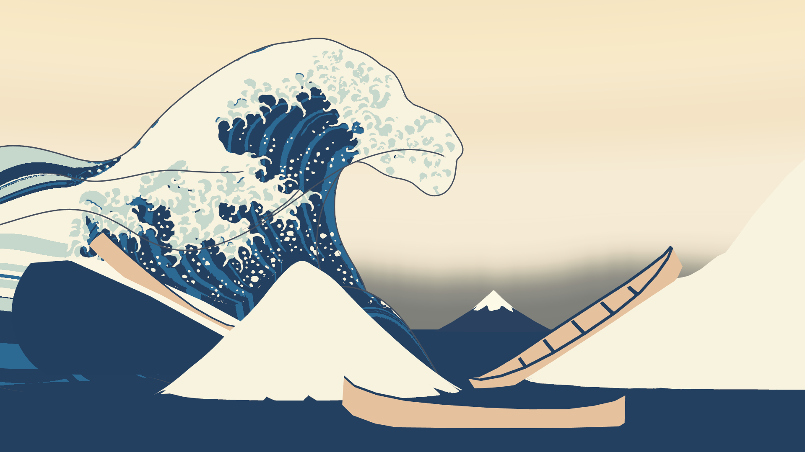
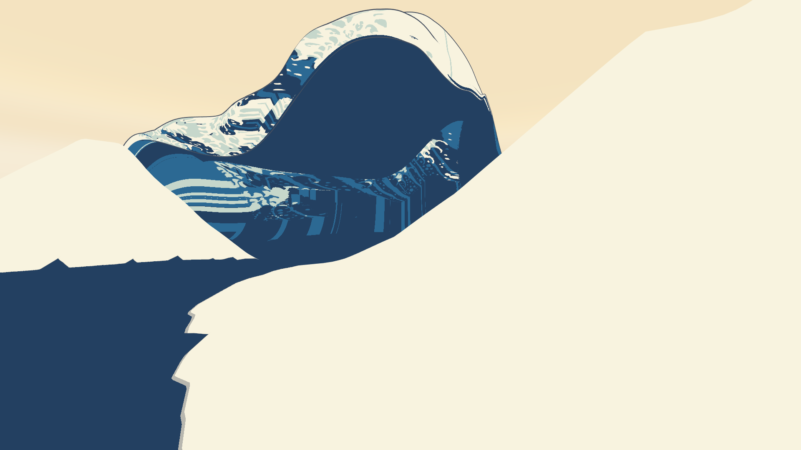

# 設計30：周囲の海と接続し、Unity で単発再生する ― 主役波と同じ式の周りの海、接続帯、右の高い波・手前の小波・谷の続き、座席の船の支え

日付：2026-09-29／状態：**閉じた（最小の受入は満たした）**。進行役の独立の検査で、見え方の傷が 2 つ見つかった（浮いた泡の仮置き、継ぎ目に沿う灰色の線）。直しを 1 回行い、どちらも消えた。証拠の種類は次のとおり。**HMD 実機の結果ではない。**

- numpy の生成器と検査（第A部）
- Unity 6000.4.3f1 の batchmode の PC オフスクリーン描画（RTX 3080、Direct3D11）と、Editor の batch の Play モード（第B部・直し1）
- 美術優先28修正01 の評価器（設計29修正01 と同じ読み）
- 進行役の独立の検査（作り手のコードを読まずに書いた numpy。リポジトリの外）

番号の前提：

- 対象：[段階9までの実行計画](../Design/Stage9_Plan_2026-09-26_ja.md)（以下「計画」）§2.1 の設計30 と、その［Q10］・［Q16］・［Q17・Q18］の注記。
- 引き継ぎ：
  - [設計27](Design_27_ja.md) §6.1：周りの海を静める係数、搬送波の振幅。
  - [設計28](Design_28_ja.md) §8.1：切った版の縁と座席の目。
  - [設計28修正01](Design_28_修正01_ja.md) §8：座席の船を新しい谷に座らせる、右の波の接続、谷から周りの海への続き、手前の小波と配置。
  - [設計29](Design_29_ja.md) §8.1・[設計29修正01](Design_29_修正01_ja.md) §7：外周の切断端（37,215 本／27,866 本）。再生は精度の層を読む再生器で行う。
- 利用者の言葉：
  - Q16：右側の波を大波とつなぐ、波の前の谷。
  - Q18：手前の小波・右の高い波・大波の下の谷は、参照モデルの配置に合わせてから二次設計する（参照モデルは一つの球で、作品は一面の海の上にある）。
  - Q19・Q20：参照モデルは他者の展示作品で、参考にとどめ、写し取らない。
  - 作業の指示にあった Q20 の原文の控え（Q20_quotes.txt）は、会話の作業フォルダーになかった。Q20 は AGENTS.md の引用で読んだ。
- 時間の上限：Q26（段階9 を 10/4 までに）により、進行役がこの番号を 8 時間とした。範囲は最小の受入だけで、直しは 1 回まで。
  - 実績（ファイルの時刻）：9/29 16:01（最初のファイル）〜18:10（直し1 の最後）。記録は 18:13 から。上限の内。
  - Unity の 1 回はどれも 30 分より十分短い（`DS30Render` の中の時間は 43.3 s と 42.9 s）。
- 修正回数：1（直し1。独立の検査の必須の指摘 2 つ）。第A部の生成器の中の修正1 は、検査の値を決める前の作り手の直し（第 6 節）。
- 対応するバックログ（計画 §2.1）：88・93（海面が途切れない。記録）、94（原画カメラ固定。記録）。値は [metrics.json](../Evidence/Design/30/metrics.json) の `backlog`。
- 読むだけで変えていないもの：
  - 動き F\_final のパッケージ（`Unity/Build/Design/28R01F/F_final/art_on`、242 層、精度の層つき）
  - 最後の一コマ K\*′ の網と、29修正01 で焼き直した色面
  - 設計27〜29 のコミット済みのファイル（`DS30Render` の報告で `protectedUnchanged = true`、変わったファイルは 0）
- 座標と単位は設計27〜29 と同じ。
  - m・s。τ は物理の時刻で t\* = 0。t は体験の時刻で、t\* は t = 12 s。
  - a・c は主役波の波の枠の軸（a：進む向き、c：波峰線の向き）。原点は波の枠の原点 O(τ)。
  - 「行・列」は K\*′ の格子（240 × 400）の番号。
- 出典：配置の一次設計には、他者の展示作品（北斎『神奈川沖浪裏』の立体作品）のスキャン `wave_repair_zbrush2.obj` から測った数値だけを使った。作者・所蔵は未確認。形は写していない。

## 見るもの

| 原画視点の t\*（Unity、直し1 の後） | 座席から波の方向の t 10 s（右の高い波・手前の小波・谷） |
| --- | --- |
|  |  |

動画（1920 × 1080、30 fps、421 コマ）：

- 範囲は t 0〜14 s。時間曲線は F\_final のもの。t\* = 12 s の後は止まったまま。
- [原画視点](../Evidence/Design/30/ds30_painting_30fps.mp4)／[座席 v1](../Evidence/Design/30/ds30_seat_30fps.mp4)／[座席から波の方向](../Evidence/Design/30/ds30_seat_toward_wave_30fps.mp4)／[左の側面](../Evidence/Design/30/ds30_side_left_30fps.mp4)
- 4 つを並べたもの：[2 × 2](../Evidence/Design/30/ds30_grid_2x2_30fps.mp4)（左上＝原画視点、右上＝座席 v1、左下＝座席から波の方向、右下＝左の側面）

静止画：

- [4 視点 × t 2・6・8・10・11・12 s の一覧](../Evidence/Design/30/fig_ds30_stills_sheet.png)
- [座席から波の方向の t\*](../Evidence/Design/30/ds30_seat_toward_wave_tstar.png)
- [座席の低い視点の t\*](../Evidence/Design/30/ds30_seat_low_tstar.png)

直しの前と後：

- [fig_ds30_fix1.png](../Evidence/Design/30/fig_ds30_fix1.png)。左が直しの前、右が後。行は上から次のとおり。
  1. 座席から波の方向のコマ 390：継ぎ目に沿う灰色の線
  2. 原画視点のコマ 315：手前の小波の横の二つ目の白い V 字
  3. 座席の低い視点の t\*：小波の上の白い Λ と、海を横切る白い帯

numpy の図（Unity の描画ではない）：

- [t\* の平面図](../Evidence/Design/30/fig_ds30_layout_plan.png)：海の高さの地図。白の × が一次設計（参照モデルの配置）の位置、赤の ◇ が二次設計の位置、黄が座席の目。
- [第A部の t\* の原画視点の ID の違い](../Evidence/Design/30/ds30_numpy_painting_ids_diff.png)

数値：

- [metrics.json](../Evidence/Design/30/metrics.json)：最小の受入 `acceptance`、中身 `design`、バックログ `backlog`、記録のみ `record_only`、修正 `revisions`、食い違い `discrepancies_ja`、採った読み `decision`、渡し先 `handoffs`
- Unity のまとめ [ds30_unity_summary.json](../Evidence/Design/30/ds30_unity_summary.json)
- t\* の回帰 [ds30_tstar_regress.json](../Evidence/Design/30/ds30_tstar_regress.json)
- 直し1 の測り [ds30_fix1.json](../Evidence/Design/30/ds30_fix1.json)
- 第A部の検査 [ds30_checks_numpy.json](../Evidence/Design/30/ds30_checks_numpy.json)・[ds30_painting_regression_numpy.json](../Evidence/Design/30/ds30_painting_regression_numpy.json)
- 配置の記録 [ds30_layout_record.json](../Evidence/Design/30/ds30_layout_record.json)（参照モデルは数値だけ）と、一時キャッシュの記録 [ds30_ref_cache_log.json](../Evidence/Design/30/ds30_ref_cache_log.json)
- 設計43 の船が読む海の式 [ds30_sea_function.json](../Evidence/Design/30/ds30_sea_function.json)
- 実行条件と SHA-256 [run.json](../Evidence/Design/30/run.json)

**見え方の注意**：

- 海の色は仮の 2 色（藍濃と白）。
- 座席から右の高い波を見ると、大きな平らなクリーム色の面になる。
- 谷は幾何にはあるが、光を使わない平塗りでは読めない。
- 手前の小波には泡と線がない（直し1 で泡の仮置きを隠した）。
- 色と線は設計36・38 で作る（第 5 節）。

## 0. 結論

1. **周りの海を主役波と同じ式で作り、主役波と同じ時計で 1 回再生できるようにした。**
   - シートは 3 枚：主役波、近い海 near（44 行 × 1231 列）、遠い海 far（19 行 × 247 列）。
   - 3 枚は同じ 242 個の節点の時刻（knot\_tau）と、同じ波の枠の原点の表（frame.origin）を持つ。
   - 1 つの時刻 t から時間曲線 τ(t) で τ を決め、3 枚に同じ τ を渡す。t = 0 で待ち、再生し、t\* = 12 s で止まる。
2. **接続帯の値を記録した。** near の行 0 は、主役波の本体の境の輪（1230 点）そのもの。主役波は本体の列 18〜394 だけを描く（190,722 のうち 179,728 の三角形）。
   - 継ぎ目の位置の差：numpy で 0.0076 mm、Unity の GPU の読み戻しで 0.033 mm（高さ 0.001 mm）。16 bit だけで読むと 2.8 mm 開くので、精度の層を読むことが条件である。
   - 速度の差：0.96 mm/s（numpy）、0.041 mm/s（Unity）。
   - 法線の内積：後ろ（列 18 の側）は最小 0.892。前（列 394 の側）は最小 0.32 で、低いのは座席の船の支えの所。Unity の両側の読みでは最小 0.309。錐の点（主役波の行 0・239 の縮んだ点）では法線が決まらない。
   - 独立の検査も同じ大きさの値だった（位置 0.0076 mm、高さ 0.0007 mm、速度 1.26 mm/s）。
3. **座席と原画視点で、穴・二重面・段差は見えない（直し1 の後）。**
   - 穴：10 Hz の 141 コマで、座席の 5 面と原画視点とも 0 px。
   - 貫通：独立の検査で、主役波と near の貫通は 46 節点で 0。
   - 自由な縁：far のすその下端（y = −8 m）だけ。主役波の切断端は 0。
   - 直しの前は、次の 2 つがあった。直し1 で両方消えた（第 6 節）。
     - 泡の仮置き M1\_ForegroundFoam\_Static が新しい小波から離れて浮き、二重の白に見えた。
     - 主役波と near の継ぎ目に沿って、灰色の外殻線が見えた。
4. **t\* の原画視点の回帰はない。**
   - 主役波と海を ID 画像に入れた読みで、29修正01 と全部の値の差が 0。値は 78／130／131 が 3.0289／3.5131／3.0431 px、132 σ12 が 3.7552 px、72 σ24 p95 が 4.0075 px、色区の定義のままの読みの最悪が 13.642 px、両側の読みの最悪が 1.153 px。
   - 海を隠した対照の 10 枚は、29修正01 と画素まで同じ。
   - ID 画像で変わったのは空から波へ 728,891 px だけ。波から空へは 0。
   - 28修正01 に対する 134・267 の不合格（定義のままの読み）と、72 σ24 p95 の 4 px 超えは、29修正01 から引き継いだもの。
5. **再生の始めと終わりで形が跳ばない。**
   - 待機のコマは t = 0 のコマと、静止のコマは t\* のコマと、頂点の SHA-256 が同じ。
   - 最初の 1 コマの動きは 0.692 m で、続く 30 コマの最大 0.695 m と同じ大きさ。t\* へ入るコマの動きは 0.26 mm。静止の間の動きは 0。
   - Play モードでも t は 12.0 まで単調に進み、3 枚はどのフレームでも同じ τ を受け取った。
6. **座席の目は一度も水に入らない。**
   - Unity の 406 コマで 0 回。余裕の最小は 1.0728 m（t 11.03 s）。
   - 船は t\* の姿勢のまま、鉛直だけ −3.69〜+0.91 m 上下する。
   - t\* の竜骨の沈みは 0.45〜0.61 m（喫水 0.38 m）で、船は谷に座っている。
7. **Q16・Q18 の 3 つの配置を作った。**
   - 右の高い波：大波と一続きの面で、一緒に動く。頂は 19.0 m（0.94 H）、c +31.5。
   - 手前の富士形の小波：頂 5.64 m。原画視点では、仮置きの頂と同じ射線の上にある。
   - 大波の下の谷の続き：主役波の右の端の先で最大 2.2 m、c +46 で海へ戻る。
   - 配置は、まず参照モデルの数値に合わせ（一次設計。数値の記録だけ）、次に一面の海の上に置くために二次設計した。わざと変えた所は D30-1〜D30-8 の 8 つ。
   - 参照モデルを読んだのは測定の道具 `ds30_refmeasure.py` だけ。一時キャッシュは消し、npz の SHA-256 は作った時と消した時で同じだった（`7d138b07…`）。
8. 名前の付いた誘導 `ds_swell_calm`（τ −4→0）と `ds_sea_calm_painting`（τ −2→0）で、最後の数秒に周りの海が静まり、t\* では y = 0 と地形の誘導だけになる。
9. **記録のみで残したもの**（第 5 節）：
   - 前の継ぎ目の船の支えの所の稜（t\* で 0.80 m）と、その外の溝
   - near の帯の一時的な溝と動きの折れ（二階差分 0.199 m／コマ²）
   - 海の色の仮置き
   - far の半径方向の弱めが海の式の記録（sea\_function.json）にないこと
   - 上下の加速度（最大 6.0 m/s²）の VR での快適さ
   - HMD・ステレオ・実時間の再生

---

## 1. 目的

設計書の設計30 は、周囲の海と主役波を接続し、Unity で単発再生する番号である。計画 §2.1 の成果物は次のとおり。

- 周りの海の小さなうねり（固定トポロジーの解析式。設計43 の船も同じ式を読む）
- 主役波のシートとの間の接続帯（高さ・法線・速度を連続させる）
- Unity での導入からの単発再生（最後のフレームで止める）

最小の受入は次のとおり。

- 接続帯の高さの差・法線の内積・速度の差を記録する。
- 座席と原画視点で、段差・二重面・穴が見えない（静止画と動画）。
- t\* の原画視点の回帰がない。
- 再生の開始・終了で形が跳ばない。

作業の指示では、座席の目がいつも水の上にあること、主役波の外周の縁が海の上に出ないこと（設計29 §8.1 の切断端 37,215 本）も最小の受入に含めた。

注記で足された中身：

- ［Q10］周りの海は主役波と同じ交差うねりと搬送波の式で作る。行ごとの搬送波の振幅の表、接続帯、波の枠とともに動く切り抜きを含める。静める誘導を 2 つ使い、最後の数秒に静まるのが見えるようにする。
- ［Q16］右側の波を大波と一続きの面にして一緒に動かし、前の谷を周りの海へ続ける。
- ［Q17・Q18］手前の小波・右の高い波・大波の下の谷を、参照モデルの配置に合わせてから二次設計する。

Q26 により、この番号は最小の受入だけを満たし、直しは 1 回までとした。

---

## 2. 表

### 2.1 接続帯と継ぎ目

値は第A部の numpy の検査（242 節点）、第B部と直し1 の Unity の GPU の読み戻し（再生の全コマ）、独立の検査から取った。

| 項目 | 第A部（numpy） | Unity | 独立の検査 |
| --- | --- | --- | --- |
| 主役波の境の輪と near の行 0：位置の差（精度の層つき） | 0.0076 mm | 0.033 mm | 0.0076 mm |
| 同：高さの差 | — | 0.001 mm | 0.0007 mm |
| 同：16 bit だけで読んだ時 | 2.8 mm | — | 2.80 mm（高さ 0.37 mm） |
| 同：速度の差 | 0.96 mm/s | 0.041 mm/s | 1.26 mm/s（節点の間 1.02 mm/s） |
| 法線の内積：列 18 の側（後ろ） | 最小 0.892、1 パーセント点 0.992 | 両側あわせて最小 0.309、1 パーセント点 0.363、0.9 未満は 1 コマで最大 76／477 点 | 最小 0.892、1 パーセント点 0.992 |
| 法線の内積：列 394 の側（前） | 船の支えの外で最小 0.695（行 238、τ −3.875 s）、1 パーセント点 0.962。船の下で最小 0.32 | （上の行と同じ） | 最小 0.323（行 187、τ −2.775 s）、1 パーセント点 0.530。t\* で最小 0.586（0.9 未満は 30 点） |
| 錐の点（主役波の行 0・239） | 法線が決まらない（最小 −0.997） | 法線が決まらない（最小 −0.98） | 錐の点の広がりは 7.5／8.6 mm |
| near の外周と far の行 0 | 0.046 mm | 0.11 mm（法線の内積の最小 0.9989） | 0.046 mm |
| T 字の継ぎ目の残り（near の点と far の辺） | 0.012 mm | 0.094 mm | 0.049 mm |
| 裏返った面 | near は 1 節点に最大 205（輪 0〜1 の錐の細片）、far は 0 | — | near の行 0 の錐の扇に 149／節点（面積 ≤ 0.0013 m²）、far は 0 |

- 継ぎ目の辺 1230 本は、向きが全部そろっている（独立の検査）。
- 法線の内積が低い所は 2 つ。1 つは錐の点のまわり、もう 1 つは前の継ぎ目の、主役波の行 140〜220 あたり（座席の船の支えの所を含む。独立の検査）。
- 描画は光を使わない平塗りなので、法線の折れは陰影には出ない。効くのは外殻線を押し出す向きだけで、これが直し1 の灰色の線にかかわった（第 6 節）。
- 16 bit だけの刻みは near 3.9 mm、far 19.8 mm。精度の層つきの誤差は near 0.0076 mm、far 0.039 mm（`ds30_generate_log.json`）。

### 2.2 t\* の原画視点（計画 §2.0 の回帰の項目）

- 評価器は美術優先28修正01 の手順。読み方は設計29修正01 と同じ。
- 設計30 の値は、主役波と海を ID 画像に入れた読み（`t28_seaids`）のもの。
- 色区の値は、各項目で 28修正01 との差が最も大きい測り方の最大（`ds29r01_tstar_verdict.json`、単位 px）。

| 項目 | 28修正01 | 29修正01 | **設計30** | 判定 |
| --- | --- | --- | --- | --- |
| 78／130／131 輪郭（Unity の画像） | — | 3.0289／3.5131／3.0431 | **3.0289／3.5131／3.0431** | 後退なし（29修正01 と差 0） |
| 132 大きな輪郭 σ12 最大 | — | 3.7552 | **3.7552** | 後退なし |
| 72 大きな輪郭 σ24 p95 | — | 4.0075 | **4.0075** | 後退なし（4 px の超えは 29修正01 から） |
| 73 内側の水色の境界 | 0.655 | 2.484 | **2.484** | 29修正01 と同じ |
| 77 下側から始まる縞の下端 | 1.17 | 0.867 | **0.867** | 同じ |
| 79 左側の白 | 0.34 | 1.012 | **1.012** | 同じ |
| 118 主要な縞の両側 | 0.655 | 2.484 | **2.484** | 同じ |
| 120 | 0.288 | 0.288 | **0.288** | 同じ |
| 133 左から上へ続く白 | 0.402 | 0.718 | **0.718** | 同じ |
| 134 白帯 | 0.977 | 8.996（不合格） | **8.996（不合格）** | 同じ（29修正01 から） |
| 175 藍中の境界（記録） | 2.41 | 16.052 | **16.052** | 同じ |
| 263 水色の下部 | 0.559 | 2.484 | **2.484** | 同じ |
| 270 白と水色の境 | 0.661 | 1.028 | **1.028** | 同じ |
| 265・266 | 合格 | 合格 | **合格** | 同じ |
| 267 白の平塗り（定義のままの読み） | 合格 | 不合格 | **不合格** | 同じ（29修正01 から） |
| 輪郭の両側を除く読み：28修正01 との差の最悪 | — | 1.153（175 藍中、改善の向き） | **1.153** | 29修正01 と差 0。267 の帯は 0 |

- **海を隠した対照**（`t28_ctrl`）：10 枚が 29修正01 の `f_final_kp` と画素まで同じ。
- **212**（空の上の方）：原画視点の画像の行 0〜379 は、29修正01 と画素まで同じ。
- **69・70**（右の船と波の高さ）：t\* の主役波と右の船は変わらない。212・69・70 は別には評価していない。
- **ID 画像**（3840 × 2160）：29修正01 から変わったのは、空から波への 728,891 px だけ（周りの海が空だった所を埋めた）。波から空へは 0。
- **主役波だけの ID の読み**（`t28`）は使えない。余白の列を描かないので、海の所が空になる。評価器はそこを輪郭と読み、78 が 691.48 px、72 σ24 p95 が 562.04 px になる。回帰ではなく読みの誤りなので、判定は `t28_seaids` で行った。
- **第A部の numpy の ID の検査**：
  - 78・130・131・132・72 の線の両側 6 px で、主役波と空の画素の違いは 0。
  - 原画の大波の区域で、主役波の見える画素が 594 px 変わった。手前の小波の右の斜面に沿った、幅 21 px 以下の帯である。
  - この違いは、評価器の色区の値には出なかった（上の表）。評価器の ID 画像には、前も後も仮置きの小波が入っていないため。

### 2.3 配置：参照モデルの数値 → 一次設計 → 二次設計（採用）

参照モデルの数値は `ds30_refmeasure.py` が測った（`ds30_ref_layout.json`。Git 対象外）。原点は参照モデル自身の頂で、Δa・Δc は主役波の枠と同じ軸。一次設計は、参照モデルの配置を主役波の頂を原点にして H の比 0.934（主役波 20.27 m ／参照モデル 21.70 m）で置いたもので、数値の記録だけでパッケージは作っていない。

| 項目 | 参照モデル（数値） | 一次設計 | **二次設計（採用）** |
| --- | --- | --- | --- |
| 手前の小波の頂 | Δa +14.25・Δc −10.25、2.38 m（0.11 H） | a 13.1・c −10.4、2.2 m | **a 15.0・c −13.5、5.64 m（0.28 H）**。ワールドで (−5.43, 5.64, −22.84) |
| 大波の下の谷 | Δa +7.25、深さ 9.29 m（0.43 H） | a 6.6・c −0.6、深さ 8.7 m | **主役波のシートの谷のまま**（a 10.2・c 0.2、深さ 5.72 m、0.28 H） |
| 谷の続き | 球の縁で切れる | — | **主役波の右の端（c +15）の先の浅い谷**：深さ c +15 で 1.2 m、c +20 で 2.2 m（最大）、c +28 で 2.0 m、c +46 で 0 |
| 右側 | 別の波はない。大波の右の部分が 0.71 H（15.39 m、Δc +11.75）のまま球の縁まで続く | a 1.5・c 10.2、14.4 m | **右の高い波**：頂 19.0 m（0.94 H）、c +31.5・a +23.4。波頭の高さは c −8 で 0 m、c −3 で 0.7 m、c +3.6 で 5.3 m、c +6 で 7.2 m、c +13.5 で 12.2 m |
| 周りの海 | ない（台座の上の直径約 30 m の球。足跡 Δa −11.25〜+18.75、Δc −16.25〜+16.25） | — | **半径 650 m**、主役波と同じ式 |
| 座席の船 | 殻に溶け込んだ浮彫 | — | **t\* で竜骨 + 喫水の水面**（船の支えの誘導） |

わざと変えた所（`ds30_layout_record.json` の `differences`。理由の要点）：

- **D30-1 手前の小波の位置**：原画視点の像を、仮置き（M1\_ForegroundSwell\_Static）の頂と同じ射線に置いた。そのうえで、主役波の本体の前の縁から 5 m 前に出した。一次設計の点は本体の前の縁から 2 m しかなく、裾が本体の中に入る。
- **D30-2 小波の高さ**：参照モデルの 0.11 H（2.2 m）では、原画の小波の頂に届かない。原画視点の射線が決める 5.64 m にした。
- **D30-3 小波の形**：後ろを短くし（4.2 m。主役波の谷の前の壁からそのまま立ち上がる）、前を 7.6 m、横を 7.2 m にした。斜面はわずかに凹（1.38 乗）。原画視点で仮置きの輪郭に合わせるため。
- **D30-4 谷の深さ**：参照モデルの谷は、球の彫刻に掘った椀（0.43 H）。一面の海の上では、主役波の谷（設計28修正01、0.28 H）のままにした。
- **D30-5 谷の続き**：参照モデルでは球の縁で切れる。二次設計では、主役波の右の端の先へ浅い谷として続けた。
- **D30-6 右の高い波**：参照モデルには右側の別の波がない。二次設計では、同じ波群の波峰線が大波の右の端から前へ曲がった所として作った。像の高さは仮置きの右の斜面（各 c の最も高い所）に合わせた。
- **D30-7 周りの海**：参照モデルにはない。主役波と同じ式で半径 650 m まで広げ、最後の数秒に静めた。
- **D30-8 座席の船の支え**：参照モデルの船は殻に溶け込んだ浮彫。二次設計では、t\* で竜骨 + 喫水の水面にし、t\* より前は船を鉛直に上下させた。

---

## 3. 作り方と、採ったもの

### 3.1 周りの海（第A部、numpy。`Tools/GWWaveGen/ds30/`）

- **式**：主役波と同じ式にした。
  - 成分は、F\_final の `ds27_keypose.json` の sea\_model にある搬送波 128 とうねり 64。
  - 行ごとの搬送波の振幅 A\_c は、F\_final の `ds27_sea.npz`（SHA-256 `b20f45db…`）の `Ac_knots` を τ と c で補間した。行の範囲の外は、端の値に exp(−(Δc/15)²) を掛ける。
  - 計画の「2〜3 成分の解析式」には従わなかった。Q10 の注記（主役波と同じ交差うねりと搬送波の式）を優先したためで、成分を減らすと主役波の境で式が合わなくなる。
- **静める誘導**：
  - `ds_swell_calm`：τ −4→0 でうねりを 0 へ。
  - `ds_sea_calm_painting`：τ −2→0 で搬送波を 0 へ。
  - どちらも κ = 1 − smoothstep で、名前の付いた値として切れる。t\* では、海は y = 0 と地形の誘導だけになる。
- **地形の誘導**（名前の付いた値。どれも切れる）：`ds30_right_wave`、`ds30_small_wave`、`ds30_trough_continue`、`ds30_boat_support`。
  - 4 つとも波の枠とともに動く。
  - 大きさは g(τ) で育つ。g は主役波の頂の高さの t\* への比（242 点、t\* で 1）で、主役波と同じ集中する波群の一部として同じ時計で育つ。
- **シート**：
  - near：本体の境の輪（行 0）から、競技場形の外周（前 a +105、後 a −110、右 c +125、左 c −130 m）まで 44 行。
  - far：near の外周の 5 列ごとを行 0 とし、半径 650 m まで 19 行。外周は y = 0 で、その下に −8 m のすそを付けた。
  - どちらも波の枠とともに動く切り抜き。far は半径 380〜600 m で式の海を y = 0 へ弱める（`ds30_params.json` の `far_taper_start_m`・`far_taper_end_m`。第 5 節の 7）。
  - t\* の高さの範囲：near −3.56〜18.79 m、far −4.12〜3.90 m（すそを除く）。
- **接続帯**：y(s) = (1 − w\_c)·(y0 + σ·s·e^(−s/3)) + w\_c·海 + w\_f·地形の誘導。
  - s は輪 0 からの距離（m）。y0 と σ は、主役波の境の高さと外向きの傾き（各節点）。
  - w\_c = smootherstep(s/10)、w\_f = smootherstep(s/4)。船の支えは 1 m で混ぜる。
  - s = 0 で、高さと傾きが主役波と同じになり、重みの曲がりも 0 になる。主役波の平らな余白の役目を、この帯が受け持つ。
- **書式**：設計27 の keypose と同じ（拡張 `ds30_grid/1`）。
  - 同じ 242 個の knot\_tau と、同じ frame.origin を持つ。
  - near の行 0 の列 j が主役波のどの（行, 列）かは、`ds30_ring0_index.json` にある。
  - 色の区分 `ds30_class_u8.bin`、白くなる時刻 `ds27_twhite_r32f.bin`、t\* の網 `ds30_tstar.gwb` も付けた。
- **座席の船**：
  - t\* では、竜骨の線（`seat_v1.json` の water\_contact、11 点）の下の水面を、竜骨 + 喫水にした（`ds30_boat_support`：1.2 m 以内は重み 1、4 m で 0、両端の先 2 m で 0）。
  - t\* より前は、t\* の姿勢のまま鉛直だけ上下させる（heave）。上下の量は、座席の目の点の下の水面の t\* からの差を 0.3 s の窓でならしたもの（`boat_support.json`、30 Hz × 421 コマ）。
- **設計43 の船が読む式**：`sea_function.json`（numpy の参照は `ds30_sea.py` の `sea_eta`）。帯と主役波の中は、式ではなくシートを読む。
- **参照モデル**：
  - 読むのは `ds30_refmeasure.py` だけ。SHA-256 を照合してから、Git 対象外の `Unity/Build/Design/30/_objcache/` に一時キャッシュを作った（16:11）。
  - 数値だけを `ds30_ref_layout.json` に書いた。確認用の平面図の画像 3 枚と npz は 17:05 に消した。npz の SHA-256 は作った時と消した時で同じで、消した後にフォルダーはない（`ds30_ref_cache_log.json`）。
  - 生成器（`ds30_generate.py`・`ds30_sea.py`）は、OBJ も数値のファイルも読まない。配置の記録 `ds30_layout.py` は、数値のファイルだけを読む。

### 3.2 Unity の単発再生（第B部。`Unity/Assets/GreatWave/Design30/`）

- **`DS30SheetPlayer`**：DS27 形式のシートを 1 枚ずつ GPU で再生する。
  - 29修正01 の `DS29KeyposePlayer` の読み込みを写した。違いは、値を大域ではなくレンダラーごとの MaterialPropertyBlock で渡すことで、そのため何枚でも同じ場面で描ける。
  - 精度の層は 3 枚ともパッケージのものを読む。キーワード `DS27_POS_LO` は大域で入れたまま、1 回の描画の中で切り替えない。
  - 主役波は本体の列 18〜394 だけを描く。外殻線は、縁から 10 列内側からだけ描く（直し1 の `outlineColInset`）。
  - 位置のバッファは GPU だけに置く。大きさは主役波 221.93 MiB、near 125.21 MiB、far 10.85 MiB で、合計 357.98 MiB（上限 512 MiB）。
- **`DS30SinglePlayback`**：1 つの時刻 t から τ(t)（`timewarp_F_final.json`、SHA-256 `627815c7…`、τ(0) = −7.889、τ(12) = 0）を決め、全シートへ同じ τ を渡す。
  - 状態は、待機（t = 0 のコマ）→ 再生 → 静止（t\*）で、折り返さない。
  - 1 コマの進みは 1/15 s で頭打ちにする。
  - Play モードの Update と Editor の採取は、同じ `Tick` を通る。
- **`DS30BoatHeave`**：座席の船 boat\_mid と座席の 3 つのカメラを、`boat_support.json` の値で鉛直に動かす。原画視点のカメラは動かさない（バックログ 94）。
- **`DS30SeamCurtain`**：near と far の T 字の継ぎ目の下に、鉛直の幕（1 cm 上から 1 m 下まで）を張る。
- **場面**：`DS30Render` が、設計27 の場面から単発再生の場面 `DS30_SinglePlayback.unity`（SHA-256 `e67daaa8…`）を作って保存し、描画と検査を行う。
  - 平らな仮置きの海は、上面 y −9 m へ下げた。
  - 仮置きは 3 つを隠した：右の斜面 M1\_Revision\_RightSlope、手前の小波 M1\_ForegroundSwell\_Static、泡 M1\_ForegroundFoam\_Static。
- **海の色（仮）**：藍濃と白の 2 色。
  - 白は、t\* の高さ 0.5 m の等高線の上（near で 3,557 頂点）。頂点の側は第A部の区分に従い、等高線の読みと 54,149／54,164 頂点が一致した。
  - 白くなる時刻は、第A部の T\_white。
- **`DS30PlayModeCheck`**：保存した場面を Editor の Play モードで 1 回再生し、実際の経路（OnEnable → Start → Update）で t\* まで進むことを記録する。
- どれも引数で切れる：`-ds30Curtain 0`、`-ds30FlatSea`、`-ds30Hide`、`-ds30AttachFoam 1`、`-ds30LineInset`。

### 3.3 採った読みと、落とした案（Q24。進行役の判断で、利用者の決定ではない）

- **採った**：
  - 3 枚を、同じ knot\_tau・同じ frame.origin・同じ τ(t) で再生する。
  - 主役波の余白を描かず、near の帯に置き換える。
  - 平らな仮置きの海を y −9 m へ下げ、T 字の継ぎ目の下に幕を置く。
  - 仮置き 3 つを隠す。座席の船は heave にする。
  - t\* の回帰は、主役波と海の ID 画像（`t28_seaids`）で 29修正01 と比べる。色区は、29修正01 で採った両側の読みを引き継ぐ。
- **落とした (1)**：泡の仮置きを、新しい小波に合わせて置き直すこと。小波の泡と線は設計36・38 で作り直すので、今は隠した。
- **落とした (2)**：継ぎ目の外殻線を縁の 1 列だけ切ること。灰色の画素は変わらなかった（第 6 節）。
- **落とした (3)**：near と far の T 字を、生成器で直すこと（far の行 0 に near の全列を持たせる）。幕で割れ目が 0 px になったので、仕上げ30 へ回した。

---

## 4. 関門

| 最小の受入 | 基準 | 値 | 判定 |
| --- | --- | --- | --- |
| 接続帯の高さの差・法線の内積・速度の差 | 記録 | 第 2.1 節の表（Unity：位置 0.033 mm、高さ 0.001 mm、速度 0.041 mm/s、法線の内積の最小 0.309） | 合格（記録） |
| 座席と原画視点の穴 | 0 | 10 Hz × 141 コマ：座席の 5 面 0 px、原画視点 0 px | 合格 |
| 同：平らな海を下げず、幕もない場合（参考） | — | 座席 2 px（6 コマ）、原画視点 2 px（8 コマ）。穴の 16 画素はどれも near と far の画素だけに隣り合う（T 字の割れ目） | 幕と下げた海で 0 |
| 二重面：浮いた泡の仮置き | 見えない | 直し1 で隠した。t\* の座席の低い視点の白の画素は 138,126 → 110,586 | 合格（直し1 の後） |
| 段差：継ぎ目に沿う灰色の線 | 見えない | 座席から波の方向の灰色の画素（y ≥ 760）。コマ 330：4,384 → 1,020。360：7,561 → 72。390・420：7,581 → 72 | 合格（直し1 の後。残りは第 6 節） |
| 主役波と near の貫通（独立の検査） | 0 | 46 節点で 0 | 合格 |
| 外周の縁が海の上に出ない | 0 | 自由な縁は far のすその下端だけ（246 本、y −8.0 m、どの τ でも同じ）。主役波の切断端は 0（設計29：37,215、29修正01：27,866） | 合格 |
| t\* の原画視点の回帰 | 29修正01 と差 0（28修正01 と ±0.5 px の規則） | 全部の値で差 0（第 2.2 節） | 合格（設計30 による後退なし） |
| 再生の開始 | 跳ばない | 待機のコマは t = 0 のコマと SHA-256 が同じ。最初の 1 コマは 0.6924 m で、続く 30 コマの最大は 0.6950 m（主役波。near も同じ、far は 0.6680／0.6680 m） | 合格 |
| 再生の終了 | 跳ばない | t\* へ入るコマ 0.26／0.21／0.24 mm（主役波／near／far）。その前 30 コマの最大は 0.31／0.26／0.26 m。静止のコマは t\* のコマと SHA-256 が同じで、動き 0 | 合格 |
| 揺れる dt | τ が跳ばない | 582 回、dt は最大 1.21 s。τ の進みは最大 0.0667 s（1/15 s）で、τ = 0 で終わる | 合格 |
| Play モード | 待機 → 再生 → 静止 | 749 フレーム（再生 601、静止 148）。t は単調に 12.0 まで進み、3 枚は毎フレーム同じ τ | 合格（Editor の batch、0.02 s ずつ） |
| 座席の目が水の下に入らない | 0 | 406 コマで 0。余裕の最小 1.0728 m（t 11.03 s）。第A部の numpy も 421 コマで 0（1.0728 m）、独立の検査も 0（コマ 331） | 合格 |
| keypose の GPU メモリ | ≤ 512 MiB | 357.98 MiB（3 枚の位置・精度の層・T\_white のバッファの大きさ） | 合格 |
| 88 船の周囲から前方の波まで一続きの水面 | 記録 | 穴 0 px、貫通 0、継ぎ目 ≤ 0.033 mm | 記録（交接の前・中・後は段階9） |
| 93 三船の向こうから水平線まで海が続く | 記録 | far の半径 650 m、原画視点の穴 0 px | 記録 |
| 94 原画構図の観察位置と向きが一定 | 記録 | 原画視点のカメラ（PaintingCam v1）は船の上下で動かさない。6 時刻の静止画で原画視点の富士の位置は同じ | 記録 |

- 独立の検査は、パッケージの復号・Hermite の補間・τ(t) を自分で書き、動画 4 本のコマも自分で抜き出して見た。
- 第A部の numpy の値と Unity の値は、再生の動きの大きさを除いて合った（第 5 節の 2）。

---

## 5. 限界

1. **前の継ぎ目の、座席の船の支えの所に稜がある**（独立の検査）。
   - 場所は主役波の行 約 150〜158・列 394。τ −1.8 s から育ち、t\* で 0.80 m になる。その 0.6 m 外に −1.0 m の溝がある（船の支えの 1 m の混ぜによる）。
   - 法線の内積は 0.32〜0.59。t\* では一部が座席の船の下に隠れるが、それより前は波の枠とともに動く。
   - 仕上げ30 の目標：継ぎ目の両側で法線の内積 ≥ 0.9、竜骨の外で稜・溝 ≤ 0.1 m。
2. **near の帯に、一時的な溝・稜と動きの折れがある**（独立の検査）。
   - τ −3.03〜−2.48 s（t 5.3〜6.5 s）に、主役波の行 172〜193（列 394）の 1〜2 m 外に出る。深さ・高さは 0.4〜1.05 m で、傾きは 45° より急。
   - 頂点ごとの y の二階差分は最大 0.199 m／コマ²（コマ 171）。
   - 第A部の「コマの動きの変化の最大 0.013 m」は、全頂点の動きの大きさの最大がコマごとにどれだけ変わるかの値で、頂点ごとの二階差分ではない。
   - 同じく第A部の numpy の再生の値（最初の動き 0.508 m、最大 0.608 m）は、Unity と独立の検査の値（0.692 m、最大 0.829 m）と合わない。原因は確かめていない。判定は Unity と独立の検査の値で行った。
   - 独立の検査の報告では、座席から約 45 m 先の同じ藍濃の所なので、平塗りの描画では見えない。仕上げ30 の目標：≤ 0.05 m／コマ²、45° 以下。
3. **継ぎ目の法線の内積が低い**。
   - 列 394 の側で最小 0.32（numpy）・0.309（Unity）。t\* では 0.586。錐の点では法線が決まらない。
   - 主役波の法線は、描かない余白の列も含む格子で求めている。
   - 平塗りなので陰影には出ない。外殻線の押し出しの向きには効く。
4. **near と far の T 字の継ぎ目に、1 画素より細い割れ目が出る**。幕と下げた平らな海で 0 px にした。きれいな直し方は、生成器で far の行 0 に near の全列を持たせることで、そうすれば幕は切れる（`-ds30Curtain 0`）。
5. **色と線は仮置き**である（設計36・38）。
   - 海は 2 色で、T\_white が走る間、白と藍濃の境がぎざぎざになる。
   - 座席から見ると、右の高い波は大きな平らなクリーム色の面になる。
   - 海のシートには外殻線がない。直し1 の後は、主役波の外殻線も本体の縁から 10 列内側までない。
   - 手前の小波には泡と線がない。
   - 主役波の藍濃 (34,63,96)（色区テクスチャ）と、海の藍濃 (35,64,97) の間に 1 段の差がある（直し1 の報告。普通の見え方では分からない）。
6. **右の高い波は、面では大波と一続きだが、波頭の稜では続かない**。
   - 主役波の右の端は約 0 m の錐である。右の高い波は、c −8 の 0 m の肩から立ち上がり、c +31.5 で 19.0 m になる。
   - 座席から波の方向では、大波の右の肩から立ち上がるように見える。
   - これで Q16 の「右の波を大波とつなぐ」を満たすかは、段階5 の自己評審で確かめる。
   - 右の高い波は、仮置きの各 c の最も高い所に合わせた媒介変数の稜で、輪の間隔が粗い所では縞に見える恐れがある（第A部の報告）。
7. **far の半径方向の弱め（380〜600 m）が、`sea_function.json` の式に書いていない**。`ds30_params.json` にはある。独立の検査は、約 400 m より外で式と最大 3.4 m 違うと報告した（数値の出力ファイルは残っていない）。約 100 m 以内の船には効かないが、設計43 の前に書く。
8. **座席の船は、t\* の姿勢（船首上げ 33°）のまま鉛直だけ動く**。
   - 平らな海では、船首が最大 4.8 m 水面の上に出て、船尾が最大 2.6 m 沈む。
   - 上下の加速度は最大 5.97 m/s²（0.3 s の窓でならした後）。VR での快適さは試していない。
   - 上下させない読みでも目は水に入らないが、余裕は最小 0.17 m になる。
   - 船の傾きを水面に合わせるのは段階8。
9. **静止物が浮く・沈む**。M1\_Revision\_LeftSupport と、ほかの船の仮置きは、t\* より前に浮いたり沈んだりする（前から同じ）。
10. **再生の始めに、待機からいきなり波の速さへ入る**（1 コマ 0.692 m、約 20.8 m/s）。Play モードの既定は、待たずに始める（autoStartDelay 0）。導入（設計47）から、走ったまま渡す。
11. **左の側面の確認用の視点で、空のドームが遠くの面で切れる**。カメラが波の枠とともに動くためで、29修正01 からある。確認用の視点だけの問題。
12. **一次設計（参照モデルの配置）は数値の記録だけ**で、パッケージは作っていない（時間の上限のため）。
13. **記録と実際の値の食い違い**：
    - `boat_support.json` の説明と `DS30BoatHeave.cs` の説明は「0.1 s でならす」のまま。生成に使った値は `ds30_params.json` の 0.3 s。
    - `Unity/Build/Design/30/sea/README_interface.txt` の (4) は、泡の仮置きを残す前提のまま。直し1 で、既定は隠すに変わった。
    - 作業の指示の「甲板の 1.83 m 上の目」は、目のワールドの高さ y 1.83 m のこと。目は甲板の 1.2 m 上（`seat_v1`）。
14. **HMD 実機ではない**。PC のオフスクリーン描画と、Editor の batch の Play モード（0.02 s ずつ）だけ。実時間の再生、ステレオ（SPI）、PS VR2 は試していない。

---

## 6. 修正の記録（Q26：直しは 1 回まで）

| 回 | 変えたこと | 結果 |
| --- | --- | --- |
| 第A部の初回と修正1（16:01〜17:11、作り手） | 生成器の中で、検査の値を決める前に直した（下の注） | パッケージ、検査、配置の記録、第B部との約束（README\_interface.txt）ができた |
| 第B部（〜17:26） | シートの再生器、単発再生、船の上下、幕、平らな海の下げ、場面の保存、描画・穴・再生・Play モードの検査 | 最小の受入の数値は全部通った。泡の仮置きは、小波の頂の頂点に付けて動かした |
| 独立の検査（17:31〜） | 自前の復号・射線・投影、4 本の動画のコマの目視 | 必須の指摘 2 つ（第 10 節）。「段差・二重面・穴が見えない」が不合格 |
| **直し1（17:55〜18:10）** | (1) 泡の仮置きを、海があるときの既定で隠した（小波への取り付けは既定で切った）。(2) 主役波の外殻線を、本体の縁から 10 列内側からだけ描く（面の描画は変えない） | 2 つとも消えた。ほかの値はすべて直しの前と同じ（`ds30_tstar_regress.json` は値が同じ、`ds30b_summary.json` は隠した物・取り付けた泡・Play モードのフレームの数 748 → 749 だけが違う） |

第A部の修正1 で変えたこと：

- 混ぜを smoothstep から smootherstep にした。
- 外向きの傾き σ を頑健に求めるようにした。1 コマで 3 m 跳ぶ所が消えた。
- 船の支えに 1 m の混ぜを足した。
- 上下の量を、竜骨の平均から、目の点の下の水面に変えた。竜骨の平均では、421 コマのうち 311 コマで目が水の下に入った。
- 上下を 0.3 s の窓でならした。0.1 s では、加速度が最大 15 m/s² になった。
- 手前の小波の半径と裾の形を直した。
- numpy の描画の 2 つの誤りを直した（近い面での切りがない、平らな面を並べていない）。どちらも偽の穴に見えていた。

**灰色の線の原因と、10 列の選び方**：

- 独立の検査は、原因を「外殻線の押し出しの法線を描かない余白の列から求めること」と読んだ。しかし縁の 1 列だけを切っても、灰色の画素は変わらなかった（下の表の 0 と 1）。
- 実際の原因は次のとおり。座席の低い目からは、主役波の谷の奥の壁が継ぎ目まで立ち上がり、縁から 2〜13 列内側がほぼ横から見える。そこに外殻線が引かれる一方、海のシートには線がないので、線が継ぎ目で途切れて見える。
- 10 列と 8・12 列は、原画視点・座席・座席から波の方向の t 6・10・11・12 s の静止画と、t\* の画像の 22 ファイルで SHA-256 まで同じだった。
- 下の表の値は、記録の時に診断の描画の静止画から数え直したもの。規則は 50 < R < 160 かつ B − R < 40、y ≥ 560。直し1 の報告の t 11 s の値とは 97 px 違うが、原因は確かめていない。

| 内側から切る列 | 0 | 1 | 3 | **10（採用）** | 30 | 外殻線なし |
| --- | --- | --- | --- | --- | --- | --- |
| 座席から波の方向 t 11 s の灰色の画素 | 5,991 | 5,991 | 3,251 | **675** | 662 | 411 |
| 同 t 12 s | 9,932 | 9,932 | 8,920 | **1,158** | 813 | 0 |

- コマ 330 に残る 1,020 px は、白い波の形の柔らかい縁で、線ではない。そのコマの白の画素は 22,534。
- t\* の座席の低い視点で残る 3,823 px のうち 3,790 px は、海なしの対照にも同じ規則で出る（29修正01 の画像も 3,790 px）。前からある線と柔らかい縁である。
- 直し1 で、t\* の原画視点の外殻線の ID 画像（3840 × 2160）は 2,296 px 変わった（行 1842〜1932）。評価器の値は変わらない。

---

## 7. 引き継ぎ

**段階5 の自己評審**

- Q16 の「右の波を大波とつなぐ」の読みを確かめる：面では一続き、波頭の稜では続かない（第 5 節の 6）。
- 谷が平塗りで読めないこと（Q16 の「平らな所から生える」は、今は幾何でだけ満たしている）。

**仕上げ30**

- 前の継ぎ目の船の支えの稜 0.80 m と溝 −1.0 m。目標は、法線の内積 ≥ 0.9、竜骨の外で稜・溝 ≤ 0.1 m。
- near の帯の、τ −3.03〜−2.48 s の溝と動きの折れ。目標は ≤ 0.05 m／コマ²、45° 以下。
- 右の高い波の形と、輪の間隔。
- 一次設計（参照モデルの配置）のパッケージ。
- near と far の T 字（far の行 0 に near の全列を持たせる）。

**設計36・38**（色と線）

- 海のシートの色（2 色の仮置き）と、外殻線。
- 継ぎ目をまたぐ外殻線（今は主役波の縁の 10 列と、海に線がない）。目標は、座席から波の方向のコマ 330〜420 で、継ぎ目に沿う線の画素 0。
- 手前の小波の泡と線。
- 主役波と海の藍濃の 1 段の差。

**設計43**（船）

- `sea_function.json` に、far の半径方向の弱めを書く。船は式を読み、帯と主役波の中はシートを読む。

**段階8**：船の傾きを水面に合わせる。浮く・沈む静止物。

**設計47**：導入から、走ったまま単発再生へ渡す。

**設計08〜10**（PS VR2 の導入の後）：ステレオ、実時間の再生、上下の加速度の快適さ。

---

## 8. 再現

リポジトリの根で行う。

前提（どれも Git 対象外）：

- 設計28修正01 の F\_final のパッケージ（`Unity/Build/Design/28R01F/F_final/`）
- 設計29修正01 の焼き直し（`Unity/Build/Design/29R01/bake_kp/`）と描画（`Unity/Build/Design/29R01/unity/f_final_kp`）

道具：

- Python は `py -3.10`（numpy 2.2.6、Pillow 12.0.0、OpenCV）。
- Unity は `Tools/GWWaveGen/ds30/run_ds30_unity.ps1` で 1 回ずつ動かす（`Unity/Build/unity.lock` を取り、終わったら消す。30 分の上限）。
- コマンドの全体は [run.json](../Evidence/Design/30/run.json) の `commands`。

1. 参照モデルの数値（必要な時だけ）：`py -3.10 -B Tools/GWWaveGen/ds30/ds30_refmeasure.py` で、キャッシュを作る → 測る → 消す。SHA-256 を照合してから作り、消した記録を `ref/ds30_ref_cache_log.json` に残す。
2. 第A部：
   - `py -3.10 -B Tools/GWWaveGen/ds30/ds30_generate.py`（約 48 s。出力は `Unity/Build/Design/30/sea`）
   - `ds30_checks.py`（約 123 s。出力は `checks/`）
   - `ds30_layout.py`（出力は `layout/`）
3. 単発再生（直し1 の後の既定のまま）：
   - `powershell -NoProfile -ExecutionPolicy Bypass -File Tools/GWWaveGen/ds30/run_ds30_unity.ps1 -Method GreatWave.Design30.EditorTools.DS30Render.Render -Log single_fix1 -Extra "-ds30Name single_fix1"`
   - Play モード：同じ手順に `-NoQuit -Method GreatWave.Design30.EditorTools.DS30PlayModeCheck.Run -Log playmode_fix1 -Extra "-ds30Out Build/Design/30/unity/single_fix1/playmode"` を渡す。
4. 照合：
   - `py -3.10 -B Tools/GWWaveGen/ds30/ds30b_tstar_regress.py --out Unity/Build/Design/30/unity/single_fix1`
   - `ds30b_summary.py`・`ds30b_sheet.py` も同じ `--out` で動かす。
   - `ds30_fix1_measure.py`（直しの前後の比べ）
5. 証拠：`py -3.10 -B Tools/GWWaveGen/ds30/ds30_record.py`。
   - 図を 1920 × 1080 の枠に収め、動画・JSON を写し、metrics.json と run.json を書く。
   - 外殻線の切り方の数え直しと、t\* の ID 画像の空・波の違いも、ここで数える。
   - 動画は `ffmpeg`（`G:/ffmpeg-2024-12-19-git-494c961379-full_build/bin/`）で作られたもので、この手順ではそのまま写す。

---

## 9. 出典と、この番号で作ったもの

- 仕様：計画 §2.1 の設計30（［Q10］・［Q16］・［Q17・Q18］の注記）と §2.0（回帰の規則）。[制作手順](../Workflow/Production_Workflow_ja.md)の Q16・Q18・Q19・Q20・Q24・Q26。設計27〜29修正01 の記録の引き継ぎ。
- 読むだけ：
  - F\_final のパッケージ（json `33499241…`、位置 `af08cd4e…`、精度の層 `99a29d6a…`）
  - K\*′ の網（`38a9b11a…`）と焼き直した色面（UV3 の表 `fbd95c90…`）
  - `Tools/GWContext/seat_v1.json`・`context_layout.json`、`Tools/PaintingTruth` の目標
  - 美術優先26 の参照モデルの置き方（`align_B_upright.json`）
- 参照モデル：`G:\research\model\wave_repair_zbrush2.obj`（SHA-256 `AB4124F9…3D40`。Q5 の例外の 1 ファイル）。
  - `ds30_refmeasure.py` が読むだけで、数値だけを使った。
  - 形・画像・キャッシュは、リポジトリと成果物に入れていない。
  - 他者の展示作品（北斎『神奈川沖浪裏』の立体作品）のスキャンで、作者・所蔵は未確認（制作手順の表の D18）。
- この番号で作ったもの（コミットするもの）：
  - 道具 `Tools/GWWaveGen/ds30/`：
    - 海と配置：`ds30_sea.py`（式と地形の誘導）、`ds30_generate.py`、`ds30_params.json`、`ds30_checks.py`、`ds30_layout.py`、`ds30_refmeasure.py`
    - Unity の手順と照合：`run_ds30_unity.ps1`、`ds30b_tstar_regress.py`、`ds30b_summary.py`、`ds30b_sheet.py`、`ds30_fix1_measure.py`
    - 記録：`ds30_record.py`
  - Unity `Unity/Assets/GreatWave/Design30/`（と .meta）：
    - `Scripts/DS30SheetPlayer.cs`・`DS30SinglePlayback.cs`・`DS30BoatHeave.cs`・`DS30SeamCurtain.cs`
    - `Scripts/DS30FlatSeaRing.cs`（平らな海を far の足跡で抜く輪。既定は使わない）
    - `Scripts/DS30AttachToVertex.cs`（直し1 の後は既定で使わない）
    - `Editor/DS30Render.cs`・`DS30PlayModeCheck.cs`
    - 場面 `Scenes/DS30_SinglePlayback.unity`
  - `.gitattributes` に `Design30` の 2 行（設計27〜29 と同じ `-text`）。
  - 証拠 `Docs/Evidence/Design/30/`：
    - 1920 × 1080 の PNG 8 枚（一覧・直しの前後・平面図の 3 枚は、縮尺だけ変えて枠に収めた）
    - 1920 × 1080 の動画 5 本（どれも 5 MB 未満）
    - JSON の写し 8 つ、metrics.json、run.json
  - 記録：この文書と、進捗の表の設計30 の行。
- コミットしないもの：
  - 進行役の独立の検査のコードは、会話の作業フォルダー（リポジトリの外）にある。出力の写しは、Git 対象外の `Unity/Build/Design/30/indep_check/` に置いた（SHA-256 は run.json）。
  - 海のパッケージ（near の位置 105 MB・精度の層 52 MB など）、描画の全出力、診断の描画（`unity/fix1_diag_*`）は、Git 対象外の `Unity/Build/Design/30/` に置いた。

---

## 10. レビュー対応

第A部・第B部の後、進行役の独立の検査を通した（ファイルの時刻で 17:31〜）。必須の指摘は 2 つで、直し1 で 1 回だけ直した（第 6 節）。

| # | 指摘 | 対応 |
| --- | --- | --- |
| 1（必須） | 泡の仮置き M1\_ForegroundFoam\_Static が浮く。新しい小波は同じ射線の上で約 10 m 手前にあるので、泡の線が何にも乗らない。t\* の座席の低い視点では、小波の上に白い Λ と、海を横切る白い帯が見える。原画視点の動画のコマ 約 285〜345 では、小波の横に二つ目の白い V 字が出る | 海があるときの既定で隠した。t\* の座席の低い視点の Λ と帯、原画視点の二つ目の V 字は消えた（`fig_ds30_fix1.png` の 2・3 行目）。t\* の評価器の値は同じ（ID 画像は仮置きを含まない） |
| 2（必須） | 主役波と near の継ぎ目に沿って、灰色の外殻線（6〜12 px、(72,78,95)）が海の上に見える。座席から波の方向のコマ 330〜420 と、t\* の座席の低い視点。29修正01 にはない | 外殻線を本体の縁から 10 列内側からだけ描くようにした。灰色の画素はコマ 360〜420 で 7,561〜7,581 → 72。縁の 1 列だけを切る案（指摘の推す案）は、画素が変わらなかった（第 6 節） |
| 3（記録） | 前の継ぎ目の船の支えの稜と溝 | 第 5 節の 1、仕上げ30 |
| 4（記録） | near の帯の一時的な溝と動きの折れ。第A部の「0.013 m」と食い違う | 第 5 節の 2。食い違いは、測っているものの違いと書いた |
| 5（記録） | 色の仮置き（ぎざぎざの境、大きなクリーム色の面） | 第 5 節の 5、設計36・38 |
| 6（記録） | 右の高い波は面ではつながるが、稜ではつながらない | 第 5 節の 6、段階5 の自己評審 |
| 7（記録） | 谷は幾何にあるが、平塗りで読めない | 第 5 節、段階7 |
| 8（記録） | far の半径方向の弱めが sea\_function.json にない | 第 5 節の 7、設計43 の前に書く |
| 9（記録） | Q20 の原文の控えのファイルがない | 前提の項に書いた（Q20 は AGENTS.md の引用で読んだ） |

- 独立の検査の値は、第 2.1 節・第 4 節の「独立の検査」の列のとおり、作り手の値と同じ大きさだった。
- 第A部の numpy の再生の値（最初の動き 0.508 m、最大 0.608 m）だけが、Unity・独立の検査と合わない（第 5 節の 2）。
- 直しの後、4 視点の動画・t\* の組・静止画・再生の検査・穴の検査・Play モードを描き直して測り直した。直しにかかわらない値は、全部直しの前と同じだった。
