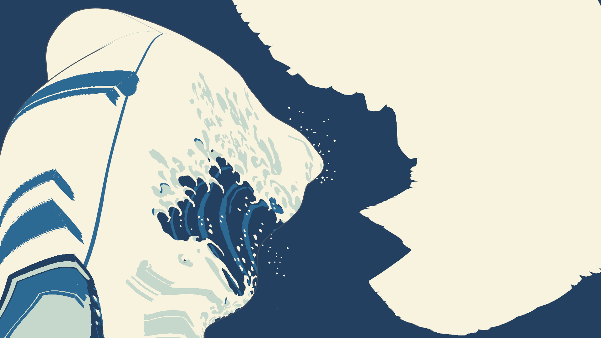

# 設計31：主役波から少量の白波を出す ― 白の出現 T\_white を発生位置と時刻に使い、飛沫 v0 を足す

日付：2026-09-29／状態：**閉じた（最小の受入は満たした）**。直しは 1 回（102 の白の出現の速さ。第 6 節）。独立の検査で必須の指摘はなかった。証拠の種類は次のとおり。**HMD 実機の結果ではない。**

- numpy の生成器と検査（白の部 `ds31_white.py`、飛沫の部 `ds31_spray.py`・`ds31_spray_checks.py`）
- Unity 6000.4.3f1 の batchmode の PC オフスクリーン描画（RTX 3080、Direct3D11）。Play モードの描画は確かめていない
- 美術優先28修正01 の評価器（設計29修正01・設計30 と同じ読み）
- 進行役の独立の検査（作り手のコードを使わずに書いた numpy。リポジトリの外）

番号の前提：

- 対象：[段階9までの実行計画](../Design/Stage9_Plan_2026-09-26_ja.md)（以下「計画」）§2.2 の設計31。
- 引き継ぎ：
  - [美術優先31](Step_31_ja.md)：白の出現 T\_white と、102・176 の読み（30 Hz の 1 コマで白くなる割合が終態の白の 2% 以下）。
  - [設計30](Design_30_ja.md)：単発再生の場面、周りの海、t\* の回帰の読み（主役波と海を ID に入れる `t28_seaids`）。
  - [段階5確認](Stage5_SelfReview_ja.md) §7：「設計31 の白の出現で、S5-1 のコマを見る」。§6.3：回帰は直前の番号と CP1 の両方で書く。
- 時間の上限：Q26 の日程（計画 §2.6 の表）で 3 時間。範囲は最小の受入だけで、直しは 1 回まで。
  - 実績（ファイルの時刻）：9/29 18:36:47（`Unity/Build/Design/31` の作成）〜19:26:41（白の部の最後の出力）。独立の検査 19:29〜19:40。記録は 19:42 から。上限の内。
  - Unity の 1 回は `DS31Render` の中の時間で 97.8 s（30 分の上限より十分短い）。
- 修正回数：1（`ds31_white_rate_cap`）。飛沫の部の作る途中の直しは、検査の値を決める前のもので数えない（第 6 節）。
- 対応するバックログ（計画 §2.2）：102・135・176・177（引き継ぎ）、149〜152（使える水準）。値は [metrics.json](../Evidence/Design/31/metrics.json) の `backlog`。
- 読むだけで変えていないもの：
  - 動き F\_final のパッケージ（`Unity/Build/Design/28R01F/F_final/art_on`、位置 `af08cd4e…`、精度の層 `99a29d6a…`）
  - 29修正01 の色面（`af28r01_uvsdf_a45.bin` `69c0b26d…`、UV の表 `fbd95c90…`）
  - 設計30 の場面・スクリプト・海のパッケージ（`DS31Render` の報告で `protectedUnchanged = true`、変わったファイル 0）
- 座標と単位は設計27〜30 と同じ。m・s。τ は物理の時刻で t\* = 0。t は体験の時刻で、t\* は t = 12 s（τ(0) = −7.889）。
- 使っていないもの：爪形分析（Q8 の例外のフォルダー）、参照モデル、利用者の解算。飛沫の点は、リポジトリの原画 `Docs/References/Met_JP1847_DP130155.jpg`（`cbb9988f…`）と空のマスク `Tools/PaintingTruth/targets/masks/sky_claws_cov.png`（`443586a3…`）から取った。

## 見るもの

| 原画視点の t\*（Unity、飛沫あり） | 確認用の視点 side\_top の t 11 s（Unity、作品の色） |
| --- | --- |
|  |  |

動画（Unity、1920 × 1080、30 fps、421 コマ、t 0〜14 s。t\* = 12 s の後は止まったまま）：

- [3 × 4 の並べ動画](../Evidence/Design/31/ds31_grid_3x4_30fps.mp4)（1920 × 810）。行は gen・adv・air、列は painting・seat・side\_left・side\_top。
  - gen（発生位置）：赤＝いま白くなった所の印（白くなって 0.25 s 以内の頂点、コマごと最大 3,000）。飛沫は確認用の赤紫。
  - adv（移流）：朱＝白くなった後もシートに付いて動く印（526 頂点）。飛沫は赤紫。
  - air（空中の粒子）：飛沫だけを作品の色（調色板の白）で描く。
- 1 本ずつ：[air・原画視点](../Evidence/Design/31/ds31_air_painting_30fps.mp4)／[air・side\_top](../Evidence/Design/31/ds31_air_side_top_30fps.mp4)／[gen・原画視点](../Evidence/Design/31/ds31_gen_painting_30fps.mp4)／[adv・原画視点](../Evidence/Design/31/ds31_adv_painting_30fps.mp4)。残りの 8 本は Git 対象外の `Unity/Build/Design/31/white/unity/main/video/`（SHA-256 は [ds31_unity_summary.json](../Evidence/Design/31/ds31_unity_summary.json)）。

静止画（Unity）：

- 4 視点 × t 9・10・10.5・11・12 s の一覧：[gen](../Evidence/Design/31/fig_ds31_gen_stills_sheet.png)／[adv](../Evidence/Design/31/fig_ds31_adv_stills_sheet.png)／[air](../Evidence/Design/31/fig_ds31_air_stills_sheet.png)
- [原画視点の t 11 s（air）](../Evidence/Design/31/ds31_air_painting_t11.png)
- [152 の拡大](../Evidence/Design/31/fig_ds31_152_crops.png)：飛沫ありの画像を 2 倍（最近傍）にしたもの。左は原画視点 t 11.0 s、右は座席 t 11.5 s。四角い下地・黒い縁・光る縁がないことを目で見る図。

数の図：

- [白の出現](../Evidence/Design/31/fig_ds31_white_onset.png)：左上は白の割合（青＝テクセル、緑＝世界の面積）、右上は 30 Hz の 1 コマの増分（赤線 2%）。numpy の値。下の 2 つは Unity の ID の数（左は表示の白、右は「表示が白で終態が白でない画素」で、0 のまま）。

numpy の図（Unity の描画ではない）：

- [t\* の比べ](../Evidence/Design/31/fig_ds31_spray_tstar_compare.png)：左から原画、取り出した白い点 186 個（赤の丸）、numpy の t\* の描画。
- [飛沫の軌跡](../Evidence/Design/31/fig_ds31_spray_stills.png)：上は原画視点の τ −1.0・−0.7・−0.45・−0.2・0 s、下は主役波の行 100〜190 の横の断面に、波の枠から見た軌跡を描いた確認図。

数値：

- [metrics.json](../Evidence/Design/31/metrics.json)：最小の受入 `acceptance`、中身 `design`、バックログ `backlog`、記録のみ `record_only`、修正 `revisions`、独立の検査 `independent`、食い違い `discrepancies_ja`、採った読み `decision`、渡し先 `handoffs`、時間 `time`
- 白の部 [ds31\_white\_metrics.json](../Evidence/Design/31/ds31_white_metrics.json)・[ds31\_white\_run.json](../Evidence/Design/31/ds31_white_run.json)・発生の表のまとめ [ds31\_white\_onset.json](../Evidence/Design/31/ds31_white_onset.json)
- 飛沫の部 [ds31\_spray\_checks.json](../Evidence/Design/31/ds31_spray_checks.json)・[ds31\_spray\_generate\_log.json](../Evidence/Design/31/ds31_spray_generate_log.json)・[ds31\_spray\_package.json](../Evidence/Design/31/ds31_spray_package.json)
- Unity のまとめ [ds31\_unity\_summary.json](../Evidence/Design/31/ds31_unity_summary.json)、飛沫を ID に入れた読みの評価器 [ds31\_tstar\_regress.json](../Evidence/Design/31/ds31_tstar_regress.json)
- 記録の時に数えたもの：[ds31\_ids\_spray\_sky.json](../Evidence/Design/31/ds31_ids_spray_sky.json)（ID の空と波）、[ds31\_s51\_frames.json](../Evidence/Design/31/ds31_s51_frames.json)（段階5確認の S5-1）
- 実行条件と SHA-256 [run.json](../Evidence/Design/31/run.json)

**見え方の注意**：

- 飛沫は原画の空と同じクリーム色に近い白なので、空の前ではほとんど見えない（原画でも同じ）。見えるのは波の藍や暗い海の前（座席の t 11〜12 s、side\_top）。
- 左の側面（side\_left）では、空中の飛沫はほぼ見えない（独立の検査で飛沫が変えた画素 6）。
- 原画視点の t 9〜11 s の大きなクリーム色の三角と斜面は、設計30 の手前の小波と右の高い波で、色は仮置き（段階5確認の S5-2）。

## 0. 結論

1. **白の出現を、主役波のパッケージの T\_white（物理の時刻）から作り、「発生位置と時刻」の表にした。**
   - 表は 27,027 頂点（終態が白で、描く本体の列 18〜394 の頂点）。区間ごとに、背面 7,761、唇の上面 12,751、唇の下面 6,439、内壁 76。
   - 最初の白は t 5.800 s（τ −2.800）に唇の上面で出る。唇の下面は t 5.84 s、背面は t 6.95 s、内壁は t 9.91 s から。全部そろうのは t 11.267 s。
   - 印を付けた頂点は、白くなった時から t\* まで、中央値 14.6 m（最小 1.8 m、最大 56.6 m）シートとともに運ばれる。
2. **102 は、直し1 の後に合格した。**
   - 元の T\_white では、30 Hz の 1 コマで白くなるテクセルの割合が最大 2.34% で、3 コマが 2% を超えた（独立の検査も同じ）。
   - 名前の付いた誘導 `ds31_white_rate_cap` で、白を早める向きだけに付け替えた（9,020 頂点、最大 0.026 s。t 10.30〜10.47 s の 6 コマ）。
   - 後は 1.83%（独立の検査の双一次の読みで 1.82%、2% を超えるコマ 0）。世界の面積の増分の最大は 1.74%。
   - 終態の白の外に出た白：頂点 0。Unity の ID（原画視点・座席の各 32 時刻）で、表示が白で終態が白でない画素 0。
3. **176 は合格。** 原画視点・座席の各 32 時刻で、白で表示された白でない色区の画素 0、表示が終態と違う色区の画素 0。独立の検査も 0。
4. **飛沫 v0 を作った。186 個、全部が逆弾道で唇から出る（F8 の固定配置は 0）。**
   - 原画の唇の前の区域（表示 x 790〜1260、y 290〜770）の白い点を取り出し（空全体で 260 個、区域の中 186 個）、PaintingCam v1 の射線の上で唇（K\*′ の列 200）の前方 0.505〜2.988 m に置いた。t\* の投影の誤差は最大 0.00011 px。
   - 放出は唇のまわりの頂点（行 118〜196、列 176〜224）から、τ\_e −1.36〜−0.40 s。v0 と水面の速度の角度は最大 10.46°（中央値 0.43°）、速さの比 0.69〜1.57、落ちる高さ 1.06〜9.95 m。半径 0.030〜0.111 m。
   - 描画は光を使わない不透明の単色（sRGB (251, 246, 227)）の 42 頂点の球を、1 回の `DrawMeshInstancedProcedural` で描く。
5. **150（水面へ引き戻される粒 0）は合格。** 飛沫の部の検査（240 Hz）で引き戻し 0、水の中 0、離れない粒 0。独立の検査の断面の読み（120 Hz、20,602 の標本）でも水の中 0。
6. **152（四角い下地・黒い縁・光る縁 0）は、Unity の描画で合格。**
   - 飛沫あり・なしの 60 組で、飛沫が変えた画素 59,151。黒い縁 0、光る縁 0。64 画素以上の成分 217 のうち四角 0（外接の四角に対する面積の比の最大 0.889）。
   - 独立の検査も、t\* の組を足した 61 組（63,178 画素）で、暗い縁・明るい縁・混ぜで説明できない画素がどれも 0、比の最大 0.8875。
7. **発生位置・移流・空中の粒子を、Unity の動画 12 本と 3 × 4 の並べ動画で見せた。**
8. **t\* の原画視点の回帰はない（設計31 による後退はない）。**
   - 飛沫を ID に入れない読み（採った読み）で、t\* の 10 枚が設計30 と SHA-256 まで同じ（独立の検査も同じ）。値は設計30・29修正01 と同じ。
   - CP1 に対しては、段階5確認 §6.3 の後退のまま（78／130／131 1.64／1.95／1.80 → 3.03／3.51／3.04 px など。第 2.3 節）。
   - 飛沫を ID に入れた読みでは、132 σ12 最大 126.75 px、72 σ24 p95 122.60 px になる。飛沫が変えた ID の画素 14,000 のうち 13,979 は空の上で、評価器が空の中の点を輪郭と読むため。記録のみ（第 5 節の 2）。
9. **記録のみで残したもの**（第 5 節）：
   - 飛沫の放出点の 63／186 が、終態が白でない頂点にある（独立の検査）
   - 評価器が飛沫の層を分けられない
   - 飛沫の数 186（計画は 2〜3 千個）
   - 151 の ΔE00（最大 30.4）、135・177 はこの番号では測り直していない
   - 段階5確認の S5-1（コマ 184→185 の切り替わり）は設計31 の描画にも残る
   - Play モードの描画、PC ビルドでのシェーダー、HMD（保留）

---

## 1. 目的

設計書の設計31 は、主役波から少量の白波（Whitewater）を出す番号で、確かめることは発生位置、移流、空中へ出る粒子である。計画 §2.2 の成果物は次のとおり。

- 白の出現（美術優先31 の T\_white）を、設計31 の「発生位置と時刻」として使う。
- 飛沫 v0 を足す：原画の白い点を抽出し、唇の前方 0.5〜3 m の層へ射線に沿って置き、逆弾道の簡易版で放出する。収束しないときは t\* 付近の固定配置と短い落下にする（美術優先計画の F8）。
- 描画は無照明・不透明の小球の instancing（2〜3 千個）。

最小の受入は次のとおり。

- 102（白が 0 から連続して現れ、終態の白の内側）と 176（白で塗りつぶさない）は、美術優先31 の値を引き継ぐ。
- 飛沫：水面へ引き戻されるもの 0（150）、四角い下地・黒い縁 0（152）。
- 発生位置・移流・空中の粒子を動画で見せる。

加えて、計画 §2.0 の回帰（原画視点の値を後退させない）を確かめる。Q26 により、この番号は最小の受入だけを満たし、直しは 1 回までとした。

---

## 2. 表

### 2.1 白の出現（102・176）

| 項目 | 美術優先31（古い動き） | **設計31**（白の部） | 独立の検査 |
| --- | --- | --- | --- |
| T\_white の元 | 美術優先31 の時機の表 | 主役波のパッケージ（`ds27_twhite_r32f.bin` `17cf6188…`）＋ `ds31_white_rate_cap` → `ds31_twhite_r32f.bin`（`5ffc93de…`） | 有限の頂点の集まりは同じ。9,018 頂点が早まり（最大 0.0130 τ-s）、遅れた頂点 0、順の入れ替わり 0 |
| 最初の白 | t 2.012 s | **t 5.800 s**（τ −2.800）。Unity の ID は t 6.00 s（0.25 s おき） | t 5.833 s（30 Hz） |
| 全部そろう | — | **t 11.267 s**（τ −0.095） | t 11.267 s |
| 1 コマの増分の最大（テクセル） | 0.72% | **1.83%**（誘導の前 2.34%） | 1.82%（双一次、t 10.37 s。2% を超えるコマ 0）。誘導の前 2.34%、3 コマ |
| 1 コマの増分の最大（世界の面積） | 1.16% | **1.74%** | — |
| 1 コマの増分の最大（頂点の数。記録のみ） | — | 2.08% | 2.08% |
| 終態の白の外に出る白 | 0 | **頂点 0**。Unity の ID で 0 画素（原画視点・座席の各 32 時刻） | 0 画素（同じ 64 枚） |
| t\* までに白にならない終態の白のテクセル | — | 704／4,030,214 | 704 |
| 176：白で表示された白でない色区の画素 | 0 | **0**。表示が終態と違う色区の画素も 0 | 0（空の食い違いも 0） |
| t = 12 s の表示の白と終態の白（ID） | — | 原画視点 199,513 = 199,513、座席 88,560 = 88,560 | 原画視点は同じ |

- 美術優先31 と値が違うのは、T\_white を主役波のパッケージの物理の時刻から取ったためで、読み（2% の目安）は同じ。
- 頂点の数の読みは、唇の帯の列が 2 cm おきに詰まっているので面の広がりにならない（白の部の注記）。判定はテクセルと世界の面積で行った（美術優先31 と同じ）。

### 2.2 飛沫 v0（149〜152）

| 項目 | 飛沫の部（numpy） | Unity | 独立の検査 |
| --- | --- | --- | --- |
| 数と方式 | 186（逆弾道 186、F8 0、捨てた点 0）。150 で落とした候補の軌跡 1,120 | 186 を描いた（確認用の印 3,000・526 と同じ場面、飛沫のバッファ 2,976 B、球 80 三角形） | — |
| 150 水面へ引き戻し | 0（240 Hz。水の中 0、離れない 0） | — | 断面の読みで水の中 0（120 Hz、20,602 標本）。最も近い三角形の符号の読みは 31・84 の 2 粒を水の側とした（頂点が最も近く符号が決まらない所。第 10 節） |
| 離れるまでの時間 | 最大 0.227 s（中央値 0.089 s） | — | 最大 0.080 s（離れた＝半径 + 0.02 m） |
| 離れた後の最小の距離 | 0.137 m（離れた＝半径 + 0.10 m） | — | 0.0092 m（離れた＝半径 + 0.02 m）。放出の直後を含めた最小は −0.010 m（半径を最初から全部の大きさで数えた値。検査の報告では、描く半径は 0.08 s かけて大きくなるので重ならない） |
| t\* の水面からの距離 | 最小 0.454 m、中央値 4.02 m | — | 最小 0.408 m、中央値 3.95 m（最も近い面は主役波 184、near 2） |
| 152 四角い下地・黒い縁 | t\* の numpy の描画で 0・0（見える 186、外接 5 px 以上 90 個の比 0.52〜0.889） | 60 組、変えた画素 59,151、黒い縁 0、光る縁 0、成分 1,639（64 画素以上 217）、四角 0、比の最大 0.889 | 61 組、63,178 画素、暗い縁 0・明るい縁 0・混ぜで説明できない 0、成分 1,831（64 画素以上 156）、比 0.9 超 0、四隅が白 0 |
| 149 隙間（記録） | 放出の 0.2 s 後の距離 最小 0.131 m、中央値 0.389 m | 動画で唇から離れる白い点が見える（air・side\_top） | — |
| 151 ΔE00（記録） | 中央値 1.96、p90 5.22、最大 30.4（原画の点の中心と調色板の白） | — | — |
| コマの表と解析式 | 放出の後の Hermite と解析式の差 最大 0.45 mm | 30 Hz × 421 コマの表（`9db0a428…`）を描いた | 表と解析式の差 3.4 µm、放出の前に見える粒 0、最初に見える t 8.7 s、t 12 s で 186 個 |
| Mock の両眼（記録） | — | ±0.032 m の 2 回の描画で、飛沫の画素の左右差 最大 0.97% | — |

### 2.3 t\* の原画視点（計画 §2.0 の回帰。段階5確認 §6.3 により、直前の番号と CP1 の両方で書く）

| 項目 | CP1／26修正01 | 設計30（直前） | **設計31**（飛沫を ID に入れない。採った読み） | 飛沫を ID に入れた読み（記録のみ） |
| --- | --- | --- | --- | --- |
| 78／130／131 | 1.64／1.95／1.80 px | 3.0289／3.5131／3.0431 px | **同じ**（画像が同じ） | 同じ（差 0） |
| 132 大きな輪郭 σ12 最大 | 1.57 px | 3.7552 px | **同じ** | 126.75 px（+122.99） |
| 72 大きな輪郭 σ24 p95 | 1.72 px | 4.0075 px | **同じ** | 122.60 px（+118.60） |
| 色区の定義のままの読みの最悪 | — | 13.642 px | **同じ** | 13.642 px |
| 輪郭の両側を除く読みの最悪 | — | 1.153 px | **同じ** | 1.153 px（29修正01 と差 0） |
| 134・267 | 合格 | 不合格（29修正01 から） | **同じ** | 不合格（設計30 と同じ） |
| 212（空の上の方、行 0〜379） | — | 29修正01 と画素まで同じ | **同じ** | 飛沫が 283 px 変える |

- 採った読みの 10 枚（`t28_white`：原画視点・座席・座席の低い視点、その K\* の組、色区 ID 3 枚、線の ID）は、設計30 の `t28_seaids` と SHA-256 まで同じ（白の部と独立の検査）。白は t\* までに全部そろうので、白の出現を変えても t\* の画像は変わらない。
- 飛沫ありの t\* の画像は、設計30 から原画視点 4,981 px、座席 13,988 px、座席の低い視点 11,919 px 変わる。
- 色区 ID（3840 × 2160）で飛沫が変えた 14,000 画素のうち、13,979 は飛沫なしの ID で空、21 は波の上（記録の時に数えた。[ds31\_ids\_spray\_sky.json](../Evidence/Design/31/ds31_ids_spray_sky.json)）。評価器は空の中の白い点を波の輪郭として読むので、132・72 が大きくなる。設計27 の測り直しの輪郭も最悪 175.67 px になる（`regress_stdout.txt`）。
- CP1 に対する後退（段階5確認 §6.3）は、設計31 では増えも減りもしない。

---

## 3. 作り方と、採ったもの

### 3.1 白の部（numpy。`Tools/GWWaveGen/ds31/ds31_white.py`）

- **T\_white**：主役波のパッケージ（F\_final/art\_on）の `ds27_twhite_r32f.bin` を元にした。96,000 頂点のうち 94,800 が有限。
- **`ds31_white_rate_cap`**（名前の付いた美術の誘導。直し1）：30 Hz の 1 コマで白くなるテクセルの割合を 1.8%（cap 0.018）以下にするため、白くなる時刻を早める向きだけに付け替える。白の広がる順と場所は変えない。切る：`--rate-cap 0`。
- **発生の表** `ds31_white_onset.json`＋`ds31_white_onset_f32.bin`（15 値 × 27,027 記録、T\_white の早い順）：行・列・τ・t・ワールドの位置と速度・区間・t\* の法線・頂点番号。選び方は、T\_white が有限、29修正01 の色面で頂点の色区が白、本体の列 18〜394 の 3 つ。設計32 の ID の根元の候補にもなる。
- **区間ごとの速さ**（水面の速度の中央値）：背面 19.7 m/s、唇の上面 19.8 m/s、唇の下面 18.3 m/s、内壁 14.2 m/s。
- **確認用の印**（作品には入れない。書式 `GreatWave.DS31.particles/1`）：
  - `ds31_marks_born`：いま白くなった所（白くなって 0.25 s 以内の頂点。コマごと最大 3,000。多いコマは 3,760 あるので間引く）。赤。
  - `ds31_marks_trace`：区間ごとに層別に選んだ 526 頂点（背面・唇の上面・唇の下面 各 150、内壁 76）。白くなった時から t\* まで頂点に付いて動く。朱。
- **`hero_pkg/`**：F\_final/art\_on の写し。位置のファイルは元へのハードリンクで、T\_white だけ `ds31_twhite_r32f.bin`。Unity の `DS31Render` は既定でこれを読む。

### 3.2 飛沫の部（numpy。`Tools/GWWaveGen/ds31/ds31_spray.py`）

- **取り出し**：高解像度の原画から、空の中の白い点を取る。白さ W = ΔL\* − 1.5·Δb\* の DoG（σ 3・10）の極大で、局所の雑音の 3 倍より強いもの。大きさは半値の連結成分。唇の前の区域だけを使う（空全体 260 個 → 区域 186 個。表示の直径 1.7〜9.8 px）。
- **置き方**：各点の画素を通る PaintingCam v1 の射線の上で、唇（K\*′ の列 200、行 125〜195）の前方（進む向き a）へ d = 0.5 + 2.5·hash(id) m の層に置く。設計30 の場面の t\* の z バッファより手前にあることを確かめた（186 個とも見える）。半径は画素の大きさ × 奥行き ÷ 焦点距離で、最小 0.03 m。
- **逆弾道**：唇のまわり（行 110〜215、列 176〜224 を 2 列おき）の頂点と、放出の時刻 τ\_e（−2.8〜−0.08 s、0.02 s おき）を総当たりし、v0 = (p\* − p\_e)/Δt − ½gΔt で解く。
  - 条件：v0 と水面の速度の角度 ≤ 45°、速さの比 0.5〜2、τ\_e ≥ その頂点の T\_white、水面から空気の側へ向かう。
  - 点ごとに上位 16 の候補を 240 Hz の軌跡で確かめ、150 を通った最良を採る。通らなければ F8（実際は 0）。
  - 放出点は頂点から空気の側へ（半径 + 0.01 m）離す（第 6 節）。放出は、頂点が白くなった後 最短 0.0003 s。
- **パッケージ**（`Unity/Build/Design/31/spray/`、Git 対象外。約束は `README_interface.txt`）：
  - 解析式の表 `ds31_spray_inst_f32.bin`（186 × 12 の float32、`c764fe07…`）。推奨の形。位置 = p\_e + v0·Δ + ½gΔ²、半径は放出から 0.08 s で 0 から大きくなる。t\* の後は τ = 0 のまま止まる。
  - 主役波の 242 節点での標本 `ds31_spray_knots_f32.bin`（`373a8a68…`）。
  - 30 Hz × 421 コマの表 `ds31_spray_frames.bin`（`9db0a428…`）。Unity が描いたのはこれ。
  - 単位球 `ds31_sphere42.obj`（42 頂点、80 三角形）。色は調色板の白（`Tools/PaintingTruth/targets/palette.json` の white）。
- **検査**（`ds31_spray_checks.py`）：生成器と別の実装。パッケージの解析式だけから位置を出し、主役波・near・far の網への厳密な距離と、真下への半直線の偶奇（生成器は真上）で水の側を決める。
- 生成は 103.8 s、検査は 766 s。2 回目の生成で 3 つのバイナリの SHA-256 が同じ（飛沫の部の報告）。

### 3.3 Unity（`Unity/Assets/GreatWave/Design31/`）

- **`DS31InstancedParticles`**：粒子の表（`GreatWave.DS31.particles/1`）を読み、GraphicsBuffer（float4 × 数）と単位球（正二十面体の分割 1 段＝80 三角形）で、1 回の `DrawMeshInstancedProcedural` で描く。採取はカメラの CommandBuffer（AfterForwardOpaque）。Play モードは Update で GWClock の秒を読み、30 Hz のコマの間を線形に補う。
- **シェーダー `GreatWave/Design31/DS31 Spray Unlit`**：光を使わない不透明の平塗り 1 色。縁の線・光る縁・板は作らない。3 組のキーワード（なし、INSTANCING\_ON、STEREO\_INSTANCING\_ON）でコンパイルでき、立体視の頂点の出力に SV\_RenderTargetArrayIndex がある（コンパイルだけ確かめた）。
- **場面 `DS31_WhiteSpray.unity`**（`2c36fd24…`）：設計30 の単発再生の場面の写しに、主役波のパッケージを `hero_pkg` へ替え、粒子 4 組（spray、確認用の spray\_diag・born・trace）を足した。設計30 の場面は変えていない。
- **`DS31Render`**（Editor）：場面を作って保存し、4 視点（painting・seat・side\_left と、この番号で足した確認用の side\_top。side\_top は場面に保存しない）× 3 組（gen・adv・air）の動画、ID の連続（102・176）、152 の飛沫あり・なしの組、t\* の組（`t28_white`・`t28_spray`）、Mock の両眼を描く。実行は `run_ds31w_unity.ps1`（`Unity/Build/unity.lock` を取り、終わったら消す）。

### 3.4 採った読みと、落とした案（Q24。進行役の判断で、利用者の決定ではない）

- **採った**：
  - 白の出現は主役波のパッケージの T\_white に `ds31_white_rate_cap` を掛けたもの。102 の判定はテクセルと世界の面積で行う（美術優先31 と同じ）。
  - 飛沫の区域は唇の前の空だけ。波の面の白い点は 29修正01 の色面にあるので飛沫にしない。
  - 飛沫は放出の時刻 τ\_e に見え始め、0.08 s で大きくなる。t\* の後は τ = 0 で止まる。
  - 原画視点の回帰は、飛沫の層を色区 ID に入れない読み（設計30 と同じ画像）で測る。
- **落とした (1)**：飛沫を ID に入れた読みで回帰を判定すること。評価器が空の中の点を輪郭と読むので、値が波の形を表さない（13,979／14,000 画素が空）。
- **落とした (2)**：102 を頂点の数で読むこと（2.08%）。唇の帯の列が詰まっているので、面の広がりにならない。
- **落とした (3)**：飛沫の区域を空全体と波の面へ広げること。仕上げ31 と設計39 の小飛沫へ回した。
- **落とした (4)**：放出点を、終態が白の頂点に限ること。独立の検査の後に見つかり、Q26 の直しの 1 回は 102 に使ったので、仕上げ31 へ回した（第 5 節の 1）。

---

## 4. 関門

| 最小の受入 | 基準 | 値 | 判定 |
| --- | --- | --- | --- |
| 102 白が 0 から連続して現れる | 30 Hz の 1 コマで白くなる割合 ≤ 2%（美術優先31 の読み） | テクセル 1.83%（独立 1.82%、2% を超えるコマ 0）、世界の面積 1.74%。単調 | 合格（直し1 の後） |
| 102 終態の白の内側 | 終態が白でない所が白になる数 0 | 頂点 0。Unity の ID で 0 画素（原画視点・座席 各 32 時刻）。独立も 0 | 合格 |
| 176 白で塗りつぶさない | 白でない色区が白く表示される数 0 | 0（表示が終態と違う色区の画素も 0）。独立も 0 | 合格 |
| 150 水面へ引き戻される粒 | 0 | 0／186（240 Hz）。独立の断面の読みで水の中 0 | 合格 |
| 152 四角い下地・黒い縁・光る縁 | 0 | Unity の 60 組：黒い縁 0、光る縁 0、四角 0。独立の 61 組も 0。numpy の t\* も 0 | 合格（Unity の描画） |
| 発生位置・移流・空中の粒子の動画 | 動画で見せる | Unity の 12 本（1920 × 1080、30 fps、421 コマ）と 3 × 4 の並べ動画 | 合格（PC の描画） |
| t\* の原画視点の回帰（計画 §2.0） | 直前の番号から後退しない | 採った読みの 10 枚が設計30 と SHA-256 まで同じ。CP1 に対しては段階5確認 §6.3 のまま | 合格（設計31 による後退なし） |
| 102・135・176・177（引き継ぎ） | 美術優先31 の値 | 102・176 は上のとおり。135・177 はこの番号では測り直していない | 102・176 合格、135・177 記録のみ |
| 149 小片が水面から離れ、隙間が見える | 記録 | 放出の 0.2 s 後の距離 最小 0.131 m | 記録 |
| 151 ΔE00 ≤ 5 | 記録 | 中央値 1.96、p90 5.22、最大 30.4 | 記録のみ（全部では満たさない） |

- 独立の検査は、パッケージの復号・軌跡・Hermite の補間・ID と画像の数えを自分で書き、Unity の動画 4 本から抜き出したコマと拡大を目で見た。Unity は走らせていない。

---

## 5. 限界

1. **飛沫の放出点の 63／186 が、終態が白でない頂点にある**（独立の検査。`indep_check/emit2_out.txt`）。
   - 内訳は淡い水色 39、藍濃 19、藍中 5。63 のうち、まわりの UV の四角の半分より多くが白なのは 8。
   - これらの頂点は白くならないので、「τ\_e ≥ その頂点の T\_white」の条件は何も縛らない。藍や水色の唇の面から飛沫が出ることになる。
   - 仕上げ31 の目標：放出点を、終態が白の頂点かテクセルに限る。
2. **評価器が飛沫の層を分けられない。**
   - 飛沫を色区 ID に入れると、132 σ12 最大 126.75 px、72 σ24 p95 122.60 px になる。設計27 の測り直しの輪郭も最悪 175.67 px。
   - この番号の判定は、飛沫を ID に入れない読み（設計30 と同じ画像）で行った。評価器に飛沫の層を除くマスクを入れるのは、設計34・39 か仕上げ。
   - 212（空の上の方）は、飛沫ありの画像では 283 px 変わる。原画の空の白い点に当たるが、評価器の 212 の読みで良くなるか悪くなるかは測っていない。
3. **飛沫は 186 個で、計画の 2〜3 千個より少ない。** v0 は唇の前の区域の原画の点だけで、自由な粒子はない。instancing は同じ場面で 3,000＋526＋186 × 2 個を描けた。数・大きさ・分布は仕上げ31 と設計39 の小飛沫。
4. **点の取り出しは自動で、手の注記と照合していない。** 取りこぼし・誤った点と、区域の外の点（右上の空、左の波、船の近く）は入っていない（仕上げ31）。
5. **t\* で主役波の前に来る点がある**（6／186。記録の時に数えた。ID の飛沫なしの画素が空でない所）。原画では爪の間の空で、設計33 の爪ができるまで、藍の上の白い点に見える。
6. **151（記録のみ）**：ΔE00 の最大 30.4。暗い灰色の空の帯では、原画の小さな点が地の色と混ざるため。色の詰めは仕上げ31・設計36。
7. **135・177 は、この番号では測り直していない。**
   - 美術優先31 の値（135：上側から船側へ、区間の到着の順位相関 0.988。177：藍中の帯 25 本が同じ水面とともに上がる）は、古い動き（美術優先30）のもの。
   - 今の T\_white は唇の上面から始まる（t 5.80 s）。176 の ID の連続では、白でない色区の表示は全 64 時刻で終態と同じ。
   - 今の動きでの測りは仕上げ31。
8. **段階5確認の S5-1（コマ 184→185 の切り替わり）は、設計31 の描画にも残る。**
   - 左の側面の動画で、コマ 184→185 の平均の差 2.204（前後のコマは 0.480〜0.513）、差が 16 を超える画素 36,012（前後は 13,537〜14,809）。設計30 の証拠の動画も 2.205・35,917 で、ほぼ同じ（[ds31\_s51\_frames.json](../Evidence/Design/31/ds31_s51_frames.json)）。
   - 設計31 の白の付け替えは t 10.30〜10.47 s だけで、t ≈ 6.17 s のこのコマには触れていない。原因（near の帯か右の波の T\_white の始まりか）の診断は仕上げ30。
9. **白の出現の細かい所**：終態の白のテクセル 704（0.017%）が t\* までに白にならない（主役波のパッケージからの引き継ぎ）。t = 12 s の ID では表示の白と終態の白が同じなので、見た目には出ない。
10. **美術優先31 の数値は再現しない**（最初の白 2.012 s、0.72%／1.16%）。T\_white を物理の時刻から取ったためで、読みは同じ。
11. **見え方**：
    - 白い飛沫は、クリーム色の空の前ではほとんど見えない（原画と同じ）。座席では空の前の飛沫がほぼ消える。
    - 左の側面（side\_left）は遠く後ろ寄りで、空中の飛沫は見えない。確認用の視点 side\_top を足した（場面には保存しない）。
12. **F8 は作ってあるが、使った粒が 0 なので、見え方は試していない。**
13. **Play モードの描画は確かめていない。** Play モードは 30 Hz のコマの間を線形に補う（飛沫の部が勧める解析式ではない）。
14. **PC ビルドのシェーダー**：`DS31InstancedParticles` はシェーダーを `Shader.Find` で探し、材質の資産からは参照していない。PC ビルドで除かれないかは確かめていない（設計34・47）。
15. **HMD（PS VR2）の項目は保留。** 確かめたのは、SPI のキーワードでのコンパイルと、Mock の両眼（左右差 最大 0.97%）だけ。実時間の再生も試していない。
16. **記録と実際の値の食い違い**（`metrics.json` の `discrepancies_ja`）：
    - `ds31_white_rate_cap` で動いた頂点：白の部 9,020、独立の検査 9,018（比べ方の違い。原因は確かめていない）。
    - 誘導の目標は 1.8% だが、結果は 1.83%（白の部）・1.82%（独立）。判定の 2% の内。
    - 150 の「離れた後の最小の距離」は、飛沫の部 0.137 m と独立の検査 0.0092 m で違う。「離れた」の定義（半径 + 0.10 m と + 0.02 m）が違うため。
    - 離れるまでの時間の最大：150 の検査 0.227 s、149 の記録 0.298 s（生成器の読み）。
    - `DS31Render.cs` の説明は実行の手順を `run_ds31_unity.ps1` と書くが、ファイルは `run_ds31w_unity.ps1`。
    - `ds31_spray.py` の冒頭の説明は候補の確かめを 120 Hz と書くが、使った値は 240 Hz。
    - 作業の指示の白の部の要約は開始を 18:34 とするが、最初のフォルダーの作成は 18:36:47。

---

## 6. 修正の記録（Q26：直しは 1 回まで）

| 回 | 変えたこと | 結果 |
| --- | --- | --- |
| 白の部の初回 | 主役波のパッケージの T\_white をそのまま使った | 102 のテクセルの読みで 1 コマの増分の最大 2.34%、3 コマが 2% を超えた（独立の検査で最大は t 10.43 s） |
| **直し1**（白の部。出力の時刻 18:50） | 名前の付いた誘導 `ds31_white_rate_cap`（cap 1.8%）。白を早める向きだけの単調な付け替え（9,020 頂点、最大 0.026 s） | 1.83%。102 合格。t\* の画像は変わらない（白は t\* までに全部そろう） |
| 飛沫の部（`ds31_spray.py` の作成 18:56 〜 19:23、作り手） | 作る途中で、値を決める前に直した（下の注） | 150・152 とも 0。2 回目の直しはない |
| Unity（〜19:23）と証拠（〜19:26） | 動画 12 本、ID、152 の組、t\* の組、Mock の両眼 | 最小の受入の数値は全部通った |
| 独立の検査（19:29〜19:40） | 自前の復号・軌跡・ID と画像の数え、動画のコマの目視 | 必須の指摘 0。記録の指摘 3 つ（第 10 節） |

飛沫の部の作る途中の直し（数えない）：

- 最初の検査は、48 粒を「水の中」とした。唇の折り返しで、最も近い面の符号の読みが誤るためで、生成器と検査の両方を半直線の偶奇の読みに変えた。
- 偶奇の読みで、放出の直後の約 20 ms に唇の下の面を 1〜2 mm かすめる粒が 3 つ残った。放出点を空気の側へ（半径 + 0.01 m）離して消した。

---

## 7. 引き継ぎ

**仕上げ31**（白波の発生と飛沫）

- 放出点を、終態が白の頂点・テクセルに限る（今は 63／186 が白でない頂点）。
- 点の取り出しを手の注記と照合する。区域の外の点（右上の空、左の波、船の近く）。
- 151 の ΔE00（最大 30.4）。飛沫の大小と分布。
- 135・177 を今の動きで測る。

**設計32・33**

- 発生の表（`ds31_white_onset`、27,027 記録）は、爪の根元の候補として使える。
- t\* で主役波の前に来る 6 点は、設計33 の爪ができるまで藍の上の白い点に見える。

**設計34**（3 層を Unity で再生）

- 飛沫は解析式の表（`ds31_spray_inst_f32.bin`）で、主役波と同じ τ で描くのを勧める（今の Play モードは 30 Hz の線形の補い）。
- Play モードの描画と、PC ビルドでシェーダーが残るか（`Shader.Find`）を確かめる。
- Mock の両眼の左右差（今 0.97%）を、目安 <10% で判定する。

**設計39・仕上げ**：評価器に飛沫の層を除くマスク。小飛沫で数を 2〜3 千個へ。

**仕上げ30**：S5-1（コマ 184→185）の診断。設計31 の描画にも同じ大きさで残る。

**設計08〜10**（PS VR2 の導入の後）：ステレオ（SPI）、実時間の再生。

---

## 8. 再現

リポジトリの根で行う。

前提（どれも Git 対象外）：

- 設計28修正01 の F\_final のパッケージ（`Unity/Build/Design/28R01F/F_final/`）と時間曲線 `timewarp_F_final.json`（`627815c7…`）
- 設計29修正01 の焼き直し（`Unity/Build/Design/29R01/bake_kp/`）
- 設計30 の海のパッケージ（`Unity/Build/Design/30/sea/`）と描画（`Unity/Build/Design/30/unity/single_fix1`）

道具：

- Python は `py -3.10`（numpy 2.2.6、OpenCV 4.12.0、SciPy）。
- Unity は `Tools/GWWaveGen/ds31/run_ds31w_unity.ps1` で 1 回ずつ動かす（`Unity/Build/unity.lock` を取り、終わったら消す。30 分の上限）。
- コマンドの全体は [run.json](../Evidence/Design/31/run.json) の `commands`。

1. 白の部：`py -3.10 Tools/GWWaveGen/ds31/ds31_white.py`（約 13 s。出力 `Unity/Build/Design/31/white`）。誘導を切るときは `--rate-cap 0`。
2. 飛沫の部（白の部の `ds31_twhite_r32f.bin` を読むので、1 の後）：
   - `py -3.10 Tools/GWWaveGen/ds31/ds31_spray.py`（約 104 s。出力 `Unity/Build/Design/31/spray`）
   - `py -3.10 Tools/GWWaveGen/ds31/ds31_spray_checks.py`（約 766 s）
3. Unity：`powershell -NoProfile -ExecutionPolicy Bypass -File Tools/GWWaveGen/ds31/run_ds31w_unity.ps1 -Method GreatWave.Design31.EditorTools.DS31Render.Render -Log main -Extra "-ds31Out Build/Design/31/white/unity/main"`（約 98 s）。
4. 飛沫を ID に入れた読みの記録：`py -3.10 -B Tools/GWWaveGen/ds30/ds30b_tstar_regress.py --out Unity/Build/Design/31/white/unity/main --sets t28_spray`。
5. 白の部の証拠：`py -3.10 -B Tools/GWWaveGen/ds31/ds31_white_evidence.py --run Unity/Build/Design/31/white/unity/main`。
6. 記録：`py -3.10 -B Tools/GWWaveGen/ds31/ds31_record.py`。
   - 図を 1920 × 1080 の枠に収め、動画・JSON を写し、metrics.json と run.json を書く。
   - ID の空と波の数え、t\* で波の前に来る点の数え、S5-1 のコマの差も、ここで数える。
   - 独立の検査の出力の写し（`Unity/Build/Design/31/indep_check/`）を読む。検査のコードはリポジトリの外にある。

---

## 9. 出典と、この番号で作ったもの

- 仕様：計画 §2.2 の設計31 と §2.0（回帰の規則）、§2.6（Q26 の日程）。[制作手順](../Workflow/Production_Workflow_ja.md)の Q24・Q26。美術優先31・設計30・段階5確認の記録の引き継ぎ。バックログの受入（美術優先計画の 31 と 37 の行：102・135・176・177、149〜152）。
- 読むだけ：
  - F\_final のパッケージ（位置 `af08cd4e…`、精度の層 `99a29d6a…`、T\_white `17cf6188…`）と時間曲線（`627815c7…`）
  - 29修正01 の色面（`69c0b26d…`・`fbd95c90…`）
  - 設計30 の near の位置（`cb62dd8f…`）と場面
  - 原画 `Docs/References/Met_JP1847_DP130155.jpg`（`cbb9988f…`）、空のマスク `Tools/PaintingTruth/targets/masks/sky_claws_cov.png`（`443586a3…`）、調色板 `Tools/PaintingTruth/targets/palette.json`
- 参照モデル・利用者の解算・爪形分析・写真のフォルダーは使っていない。
- この番号で作ったもの（コミットするもの）：
  - 道具 `Tools/GWWaveGen/ds31/`：
    - 白の部：`ds31_white.py`、`ds31_white_evidence.py`、`run_ds31w_unity.ps1`
    - 飛沫の部：`ds31_spray.py`（設計30 の `ds30_checks.py` を読み込む）、`ds31_spray_checks.py`
    - 記録：`ds31_record.py`
  - Unity `Unity/Assets/GreatWave/Design31/`（と .meta）：
    - `Scripts/DS31InstancedParticles.cs`
    - `Shaders/DS31_Spray_Unlit.shader`
    - `Editor/DS31Render.cs`
    - 場面 `Scenes/DS31_WhiteSpray.unity`
  - `.gitattributes` に `Design31` の 2 行（設計27〜30 と同じ `-text`）。
  - 証拠 `Docs/Evidence/Design/31/`：
    - 1920 × 1080 の PNG 10 枚（一覧 3 枚は余白を足し、numpy の図 2 枚は縮めて枠に収めた。152 の拡大は記録の時に作った）
    - 動画 5 本（どれも 5 MB 未満。並べ動画は 1920 × 810）
    - JSON 10（写し 7、記録の時に数えたもの 2、Unity の報告の抜き出し 1）、metrics.json、run.json
  - 記録：この文書と、進捗の表の設計31 の行。
- コミットしないもの（Git 対象外の `Unity/Build/Design/31/`）：
  - 白の部・飛沫の部のパッケージ（印 20 MB、コマの表 1.3 MB など）と `hero_pkg`
  - Unity の描画の全出力（`white/unity/main`：動画 12 本、ID 128 枚、152 の組 60 組、両眼、静止画、t\* の組）
  - 試しの出力（`white/_tests`、`spray/_work`）。要らなければ消してよい
  - 進行役の独立の検査の出力の写し（`indep_check/`）と、記録の時の数え（`record/`）。検査のコードは会話の作業フォルダー（リポジトリの外）

---

## 10. レビュー対応

白の部・飛沫の部の後、進行役の独立の検査を通した（ファイルの時刻で 19:29〜19:40）。必須の指摘は 0 で、直しはしていない。記録の指摘は次のとおり。

| # | 指摘 | 対応 |
| --- | --- | --- |
| 1（記録） | 飛沫の放出点の 63／186 が、終態が白でない頂点にある（淡い水色 39、藍濃 19、藍中 5）。τ\_e ≥ T\_white は、白にならない頂点では何も縛らない | 第 5 節の 1。最小の受入の項目ではないので、仕上げ31 へ（Q26 の直しの 1 回は 102 に使った） |
| 2（記録） | 大きな輪郭の関門（132・72）は、飛沫を ID に入れない読みでだけ通る。ID に入れると約 +123 px。変わった ID の画素はほぼ空で、評価器の読みの問題 | 第 2.3 節と第 5 節の 2。記録の時に数え直した（14,000 画素のうち空 13,979、波 21） |
| 3（記録） | 飛沫は 186 個で、計画の成果物の 2〜3 千個より少ない | 第 5 節の 3。仕上げ31・設計39 |
| 4（記録） | 座席では白い飛沫が空の前でほぼ見えない。t\* で唇の前の白と色の差が小さい点、唇の塊の前に来る点がある | 第 5 節の 5・11。唇の塊の前の点は記録の時に 6 個と数えた。色の差の小さい点の数は検査の報告の値で、ファイルに残っていないので書かない |
| 5（記録） | 102 を頂点の数で読むと 2.08% で 2% を超える | 第 2.1 節。定義の読みはテクセル（1.83%・1.82%）と世界の面積（1.74%）。記録のみ |
| 6（記録） | 終態の白のテクセル 704 が t\* までに白にならない | 第 5 節の 9 |
| 7（記録） | 150 で、独立の検査の最も近い三角形の符号の読みが 31・84 の 2 粒を水の側とした | 最も近い点が網の頂点で符号が決まらない所。断面の多角形の読み（20,602 標本）では 2 粒とも水の中 0。合格のまま |
| 8（記録） | 統合の前に、`.gitattributes` の Design31 の行、記録、証拠の写し、README の更新がまだ | `.gitattributes` の 2 行、この記録、証拠は用意した。README は統合の時に進行役が書く |

- 独立の検査の値は、第 2 節の「独立の検査」の列のとおり、作り手の値と同じ大きさだった。違いは「離れた」の定義による 150 の距離の値だけ（第 5 節の 16）。
- 独立の検査は、Unity の動画のコマを抜き出して見た：gen では赤の印が頂から唇の下の面へ広がり、adv では朱の印がシートとともに動き、air（原画視点と side\_top）では丸い白い点が唇の面から離れて唇の前へ広がる。
