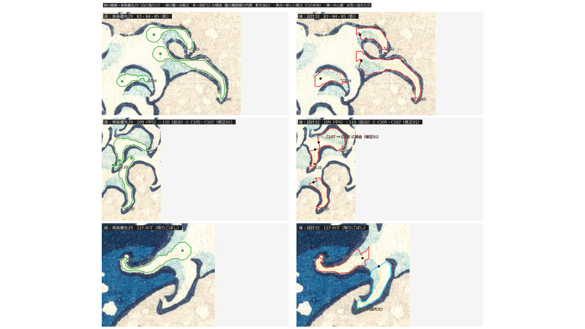
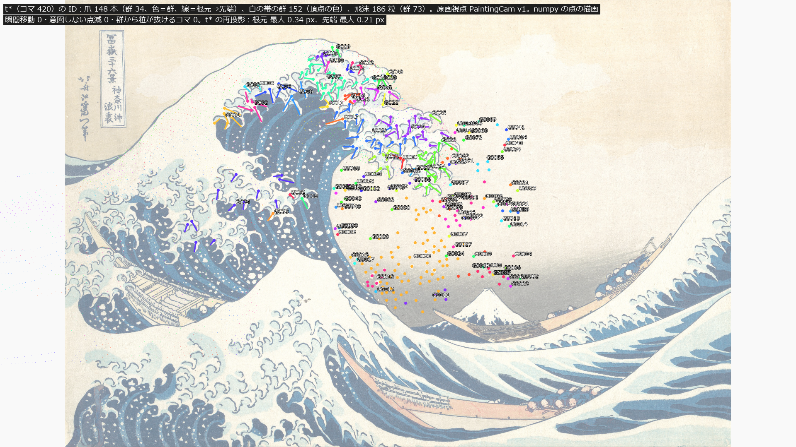

# 設計32：目立つ白波群を選び ID で追跡する ― 爪の一覧を使える水準まで直し、爪・白の帯・飛沫の群に ID を付けて主役波のシートに結び付ける

日付：2026-09-29／状態：**閉じた（最小の受入は満たした）**。修正は 1 回（修正01：進行役の独立の検査の必須の指摘 3 つ。第 6 節）。証拠の種類は次のとおり。**Unity の描画でも、HMD 実機の結果でもない。利用者は確かめていない。**

- 高解像度原画 DP130155 の numpy/OpenCV の計算と重ね図（爪の一覧の部 `ds32_claw_list.py`・`ds32_claw_figs.py`・`ds32_fix01_figs.py`）
- 利用者の爪 100 本の位置合わせ（`ds32_user100_register.py`。爪形分析は読み取りのみ）
- 主役波のパッケージの numpy の評価と点の描画（ID の部 `ds32_ids.py`・`ds32_ids_figs.py`）と、生成器の側の独立の検査（`ds32_ids_indep_check.py`。別の Hermite と別の投影の式）
- 進行役の独立の検査（作り手のコードを使わずに書いた numpy。リポジトリの外。修正01 の前の出力に対して）

番号の前提：

- 対象：[段階9までの実行計画](../Design/Stage9_Plan_2026-09-26_ja.md)（以下「計画」）§2.2 の設計32 と §6（爪の修正の位置）。
- 引き継ぎ：
  - [美術優先29](Step_29_ja.md)：爪の一覧（153 本、`Tools/PaintingTruth/claws29/claw_inventory.json` の final1、`1a0af1fd…`）。この番号の土台。
  - [設計31](Design_31_ja.md)：主役波のパッケージ `hero_pkg`（F\_final の位置＋設計31 の T\_white `5ffc93de…`）と飛沫 v0（186 粒）。群の ID の元。
  - [設計28修正01](Design_28_修正01_ja.md)：段階6 へ渡した爪のでこぼこ（輪郭 132・72）、b区域の爪の房、Q16 の浪尖の爪。この番号では一覧に載せるところまで（第 7 節）。
- 時間の上限：Q26 の日程（計画 §2.6 の表）で 4 時間。範囲は最小の受入だけで、修正は 1 回まで。
  - 実績（ファイルの時刻）：9/29 19:46:28（`Unity/Build/Design/32` と `Tools/GWWaveGen/ds32` の作成）〜20:21（最初の出力）。進行役の独立の検査 20:25〜20:39。修正01 は 20:43（修正の前の出力の写し `list+ids_prefix01` の作成。最初の試みは途中で止まった）〜23:04（修正01 の後の `run.json`）。記録は 23:08〜23:30 ごろ。
  - 壁の時計で 19:46〜23:04 は 3 時間 18 分、記録を含めて約 3 時間 45 分で、上限の内。20:43〜22:50 には、止まった最初の試みの時間が入っていて、作業の時間とは分けられない。
  - 1 回の計算は長くて約 103 s（位置合わせ）。30 分の上限より十分短い。
- 修正回数：1（修正01）。最初の出力を作る途中の調整（領域のとげを落とす処理、断面の広がりの上限、重複の除去）は、受入の評価より前のもので数えない。
- 対応するバックログ（計画 §2.2）：95〜98・122〜129・136〜139 の前提、129（群の瞬間的な置き換え 0）。値は [metrics.json](../Evidence/Design/32/metrics.json) の `backlog`。
- 読むだけで変えていないもの：
  - 高解像度原画 `Docs/References/Met_JP1847_DP130155.jpg`（`cbb9988f…`、3859 × 2594）、美術優先29 の一覧（`1a0af1fd…`）、`painting_truth.json`（PaintingCam v1）、調色板
  - 主役波のパッケージ（`Unity/Build/Design/31/white/hero_pkg`、位置 `af08cd4e…`、精度の層 `99a29d6a…`）、時間曲線 `timewarp_F_final.json`（`627815c7…`）、29修正01 の色面（`69c0b26d…`・`fbd95c90…`）、設計31 の飛沫の表（`79ab20ca…`・`9db0a428…`）
- 座標と単位：爪の座標 `*_ref` は高解像度原画の画素（画素の中心が整数）。`*_display` は番号23 の表示フレーム（1920 × 1080、PaintingCam v1）。履歴はワールドの m・s。t は体験の時刻で、t\* は t = 12 s（コマ 360）。
- 爪形分析（Q8 の例外、D14/D23）：`G:\research\爪形分析` を読み取りのみで使った。画像とマスクはリポジトリにも成果物にも複製していない。コミットするのは派生の数値（対応表と位置合わせの残差）と、パス・SHA-256 だけ（読んだ 2 つの CSV と 100 本の `original.png`・`fill_mask.png` の SHA-256 は [run.json](../Evidence/Design/32/run.json) の `user_read_only_inputs`・`user_files_sha256`）。説明の README 1 ファイル（Q8 の例外）も読んだ。
- 使っていないもの：参照モデル（D20：爪に参照モデルを使わない）、利用者の解算、写真のフォルダー、Unity・Blender・Houdini。

## 見るもの

| 名指しの所の前後（左＝美術優先29、右＝設計32） | t\* の ID（爪 148 本、白の帯、飛沫） |
| --- | --- |
|  |  |

どの図も numpy/OpenCV の図で、Unity の描画ではない。1920 × 1080 の枠に収めた（元の大きさの図は Git 対象外の `Unity/Build/Design/32/list+ids/fig/`）。

爪の一覧（計画 §6。色：緑の細線＝美術優先29 の白の多角形、緑の輪＝古い根元、赤＝設計32 の領域（藍の輪郭線の内側、影を含む）、黒点＝新しい根元、黄＝中心線、水色＝加えた爪）：

- [名指しの所の前後](../Evidence/Design/32/fig_ds32_named_before_after.png)：83・84・85（影）、109（中5）・110（起点）と C105・C107、127 の下（取りこぼし C154）。
- 列ごとの重ね図：[上側](../Evidence/Design/32/fig_ds32_rows_upper.png)／[途中](../Evidence/Design/32/fig_ds32_rows_middle.png)／[船側](../Evidence/Design/32/fig_ds32_rows_boat.png)／[b区域](../Evidence/Design/32/fig_ds32_rows_bregion.png)／[右側（低優先・未修正）](../Evidence/Design/32/fig_ds32_rows_right_untouched.png)
- [利用者の 100 本](../Evidence/Design/32/fig_ds32_user100.png)：位置合わせで原画へ写した根元 → 先端の矢印（緑＝一覧と対応、水色＝加えた、灰＝対応なし）。利用者の画像とマスクは描いていない。

修正01 の前後（左＝修正01 の前、右＝後）：

- [C105・C107・C110](../Evidence/Design/32/fig_ds32_fix01_c105_c110.png)：前は C105 の領域が C110 の指と C107 を呑み込む。後は C105 が房だけになり、C107 は C105 に統合した。
- 短く切られた爪 16 本の前後：[1〜8 本目](../Evidence/Design/32/fig_ds32_fix01_truncated_1.png)／[9〜16 本目](../Evidence/Design/32/fig_ds32_fix01_truncated_2.png)（元の 8 段の図を 4 段ずつ 2 枚に分けた）
- [C163・C169](../Evidence/Design/32/fig_ds32_fix01_c163_c169.png)：前は C169 が C163 と同じ指で、根元と先端が逆。後は C169 を重複として消した。
- [修正01 の検査で出た爪](../Evidence/Design/32/fig_ds32_fix01_flags.png)（根元の先で指が続く疑い 8 本。記録のみ）

ID と履歴：

- [爪の根元の軌跡](../Evidence/Design/32/fig_ds32_ids_tracks.png)：見えるコマだけ。左は原画視点、右は波の枠の横から。
- [動画](../Evidence/Design/32/ds32_ids_30fps.mp4)（1920 × 540、30 fps、421 コマ、t 0〜14 s。左＝原画視点、右＝波の枠の横）。爪は t 8.5 s ごろから伸び、t\* の後は止まったまま。numpy の点の描画で、元の 5,956,733 バイトの動画を 5 MB 以下へ符号化し直した（大きさ・コマ数は同じ）。

数値：

- [metrics.json](../Evidence/Design/32/metrics.json)：最小の受入 `acceptance`、中身 `design`、バックログ `backlog`、記録のみ `record_only`、修正 `revisions`、独立の検査 `independent`、食い違い `discrepancies_ja`、採った読み `decision`、渡し先 `handoffs`、時間 `time`
- 爪の一覧の要約 [ds32\_claw\_table.json](../Evidence/Design/32/ds32_claw_table.json)（173 本の状態・根元・先端・長さ・影の割合・シートの (行, 列)・誕生の時刻・群。領域の多角形は Git 対象外の一覧の本体にある）
- 一覧の検査 [ds32\_claw\_list\_checks.json](../Evidence/Design/32/ds32_claw_list_checks.json)、利用者の 100 本の対応表 [ds32\_user100\_correspondence.json](../Evidence/Design/32/ds32_user100_correspondence.json)
- ID の検査 [ds32\_id\_checks.json](../Evidence/Design/32/ds32_id_checks.json)・[ds32\_ids\_indep\_check.json](../Evidence/Design/32/ds32_ids_indep_check.json)
- 記録の時に数えたもの [ds32\_record\_counts.json](../Evidence/Design/32/ds32_record_counts.json)（修正01 の前後の重なりと長さ、右側の爪が変わっていないこと、位置合わせの残差のまとめ、進行役の独立の影の検査のまとめ）
- 実行条件と SHA-256 [run.json](../Evidence/Design/32/run.json)

**見え方の注意**：

- 赤の領域は藍の輪郭線の内側を断面でたどったもので、縁は原画の輪郭線にぴったりとは合っていない（爪ごとに輪郭線へ合わせるのは仕上げ32。計画 §6）。重なりやとげが見える所がある（第 5 節の 4）。
- t\* の ID の図と動画は、爪を根元 → 先端の線と点で描いた確認用の図で、爪の形ではない。爪の形は設計33。
- 上側の列の根元は美術優先29 のまま（第 3.2 節）。

## 0. 結論

1. **爪の一覧を使える水準まで直した（計画 §6 の 1〜4）。173 本。**
   - 美術優先29 の 153 本のうち 152 本（ID C001〜C153 を保つ。C107 は C105 に統合して欠番）と、加えた 21 本（C154〜C175。C169 は重複で欠番）。
   - 列：上側 64（美術優先29 60＋加えた 4）、途中 25（24＋1）、船側 45（43＋2）、b区域 14（加えた 14）、右側 25（美術優先29 のまま）。b区域の帯にかかる爪（`b_region_q16`）は、上側の C172 を含めて 15 本。
   - 爪の領域は D25 の仮の定義（藍の輪郭線の内側。白と水色の影を含む）。起点は「口」の中央。右側の 25 本は触っていない（根元・先端・中心線の座標の差 0.0 px）。
2. **囲まれた影を外した爪は 0 本（148 本を検査）。** 美術優先29 の白の多角形は 127 本。
   - 囲まれた影のうち領域に入る割合：設計32 の最小 0.63、中央値 0.92。0.8 未満 10 本、0.9 未満 51 本。美術優先29 は中央値 0.029、最大 0.114。
   - 「外した」を割合 0.5 未満と読んだのは進行役の判断（Q24）。進行役の独立の検査の別の定義（修正01 の前の一覧）では 0.5 未満が 33／149、中央値 0.727（美術優先29 は 0.044）。定義の決め直しは仕上げ32（D25）。
3. **名指しの所の前後図を出した。** 影は内側に入り（C083 0.979、C084 0.955、C085 0.978、C109 0.957、C110 0.908。美術優先29 は 0.011〜0.029）、C109 の根元は 64.4 px、C110 は 40.5 px 動いて口の中央に来た。127 の下は C154 として加えた。
4. **利用者の 100 本：一覧と対応 51（一覧の爪で数えると 43 本）、加えた 20、対応なし 29（理由つき）。**
   - 対応なしの内訳：手前の波 11、主浪の範囲と b区域の帯の外 9、位置合わせが不確か（NCC < 0.70）7、利用者の爪どうしの重複 1、重複か位置合わせの誤り 1（claw071。加えた C169 を修正01 で消した）。
   - 位置合わせの残差：ECC の後の NCC の中央値 0.838、下位 10% 点 0.707、最小 0.509。四隅での ECC と相似変換の差（爪ごとの最大）の中央値 4.3 px、上位 10% 点 10.3 px、最大 43.3 px。
5. **IoU は記録のみ。** 設計32 の領域 0.4376（分母A′）／0.3317（分母B′）。美術優先29 の多角形を同じ分母で測ると 0.3178／0.2399。美術優先29 の記録の値（分母A・B、全部の部分）0.8766／0.6006 も並べた。
6. **主浪の 148 本を、K\*′ のシートの (行, 列) に結び付け、421 コマの ID ごとの根元・先端の履歴を出した。** t\* の再投影は根元 最大 0.336 px、先端 最大 0.208 px。右側の 25 本は主役波のシートの外なので結び付けていない。
7. **瞬間移動 0、意図しない点滅 0、群から粒が抜けるコマ 0（129）。どれも numpy の履歴で合格。**
   - コマあたりの最大の動き：根元 0.3921 m、先端 0.3952 m、飛沫の粒 0.5022 m。シートの頂点の最大は 0.8294 m。
   - 生成器の側の独立の検査：根元の差 2.5e-5 m、根元の動きがシートの頂点の最大を超えるコマ 0、先端の剛体の長さの差 6.6e-5 m、見える ↔ 誕生の食い違い 0。
8. **群：爪の房 34（目立つ 14）、白の帯 152（目立つ 97）、飛沫 73（目立つ 8）。** どの爪・飛沫の粒もちょうど 1 つの群に入り、白の帯の頂点は重ならない。
9. **修正01 で、進行役の独立の検査の必須の指摘 3 つを直した**（第 6 節と第 10 節）。C105 が C110 の指を呑む（重なり 549 → 0 px）、口の規則が爪を短く切る（名指しの 11 本が 9〜64 px から 38〜152 px へ）、C169 が C163 の重複。残る限界は仕上げ32 などへ送った（第 5 節）。
10. **原画視点の描画は変えていない**ので、評価器を回す対象ではない（計画 §2.0 の回帰。t\* の値は設計31 のまま）。
11. 決定性：2 回目の実行で、一覧と ID の JSON（経過時間の欄を除く）と bin がすべて同じ。

---

## 1. 目的

設計書の設計32 は、目立つ白波群を選んで ID で追跡する番号である。計画 §2.2 は、ここで爪の一覧の修正（計画 §6）も行うとした。成果物は次のとおり。

- 爪の一覧の修正版（使える水準）と、爪・白の帯・飛沫の群の ID。
- 爪の根元を K\* の水面シートの (u, v) に結び付け、全フレームで ID ごとの根元・先端の位置の履歴を出す。

計画 §6 で使える水準として直すのは、次の 4 つだけ。

1. 爪の領域を、白の画素だけでなく「爪を囲む藍の輪郭線の内側」にする（淡い水色・藍の影を含む。D25 の仮の定義）。
2. 起点（根元）を、爪が胴や白い帯から分かれる口の中央に置く（109・中5・110 を直し、船側と途中の列で同じ誤りを探す）。
3. 取りこぼしを加える（127 の下。利用者の 100 本を 1 本ずつ突き合わせ、加えるか理由を書く）。
4. ID を保つ（変わらない爪は美術優先29 の ID、加えた爪は新しい ID、消した爪は理由を残す）。

最小の受入は、計画 §6 の 5 項目（名指しの所の前後図、利用者の 100 本の対応、囲まれた影を外した爪 0、列ごとの重ね図、IoU の記録）と、ID の履歴で同じ群の瞬間移動 0・意図しない点滅 0（設計書 §11「白波の連続性」）である。Q26 により、この番号は最小の受入だけを満たし、修正は 1 回までとした。爪ごとに原画の輪郭線へ合わせること、印刷工程の調査、爪の基礎色と IoU の定義は仕上げ32、成長と遮蔽の精度は仕上げ33、右側の爪はブラッシュアップの最後へ回す（計画 §6）。

---

## 2. 表

### 2.1 爪の一覧（計画 §6）

| 項目 | 美術優先29 | **設計32**（修正01 の後） | 修正01 の前 | 独立の検査（進行役、修正01 の前の一覧） |
| --- | --- | --- | --- | --- |
| 本数 | 153（上側 60・途中 24・船側 44・右側 25） | **173**（上側 64・途中 25・船側 45・b区域 14・右側 25） | 175（上側 64・途中 25・船側 46・b区域 15・右側 25） | — |
| 消した爪 | — | C107（C105 に統合）、C169（C163 の重複）。ID は欠番 | 0 | — |
| 爪の領域 | 白の指の多角形 | 藍の輪郭線の内側（白＋水色の影）。中心線の法線の両側へ、藍か空に当たるまでたどった断面の和（片側 40 px まで） | 同じ | — |
| 囲まれた影を外した爪（割合 < 0.5） | 127／148 | **0／148** | 0／150（美術優先29 128） | 33／149（別の定義。中央値 0.727、美術優先29 0.044） |
| 割合 < 0.8／< 0.9 | 127／127 | 10／51 | 12／51 | — |
| 割合の分布 | p0 0.0・中央値 0.029・p90 0.06・最大 0.114 | p0 0.63・p5 0.781・p10 0.822・p25 0.879・中央値 0.92 | p0 0.63・p5 0.739・p10 0.818・p25 0.876・中央値 0.92 | — |
| 根元が 8 px 以上動いた爪 | — | 途中 10・船側 20 | 途中 16・船側 27 | — |
| IoU（主浪。分母A′／B′。記録のみ） | 多角形 0.3178／0.2399（記録の値 0.8766／0.6006） | **0.4376／0.3317** | 0.402／0.3046 | — |
| 右側の爪（C129〜C153） | — | 触らない。根元・先端・中心線の座標の差 0.0 px（長さは同じ中心線で数え直して最大 1.4 px 違う） | 同じ | 変わっていない（表示の丸め 0.01 px と長さの数え直しだけ） |

- IoU の分母A′は「平らな白を除く白＋その白に囲まれた影」（340,114 px）、分母B′は「白の全体＋囲まれた影」（451,326 px）。分子は設計32 の領域の和 157,043 px、美術優先29 の多角形の和 108,908 px。美術優先29 の記録の値（分母A・B）は白だけで影を含まないので、同じ物差しではない（合否は出さない。仕上げ32 で定義を決め直す）。
- 起点の状態（修正01 の後の 173 本）：口 69、美術優先29 の根元のまま（上側）60、右側 25、修正01 の歯止めで美術優先29 の根元に戻した 15、口が見つからない 2、両側の線が終わる所を口にした 1（C072）、歯止めを戻した 1（C066）。

名指しの所（計画 §6 の受入1。`metrics.json` の `acceptance.6_1_named`）：

| 爪 | 影が領域に入る割合（設計32／美術優先29） | 独立の検査（修正01 の前） | 根元の移動 | 備考 |
| --- | --- | --- | --- | --- |
| C083 | 0.979／0.024 | 0.934 | 19.0 px | 83 |
| C084 | 0.955／0.022 | 0.896 | 7.8 px | 84 |
| C085 | 0.978／0.029 | 0.926 | 15.5 px | 85 |
| C109 | 0.957／0.029 | 0.888 | 64.4 px | 109（中5）。口の中央へ。長さ 132.8 → 77.7 px |
| C110 | 0.908／0.011 | 0.662 | 40.5 px | 110。進行役の目視の種で根元を上の口へ置き直した（元は V 字の鉤の中の 15 px） |
| C105 | 0.964／0.004 | — | 43.6 px | 110 の隣。修正01 で房だけにした（第 6 節） |
| C154 | 0.946／— | 0.760 | — | 127 の下。加えた爪（進行役の目視の種） |

### 2.2 利用者の 100 本（計画 §6 の 3。`ds32_user100_correspondence.json`）

| 項目 | 値 |
| --- | --- |
| 一覧と対応 | 51（一覧の爪で数えると 43 本。C060 に 3 本、C066・C089・C102・C104・C106・C127 に 2 本ずつ） |
| 加えた | 20（b区域 14、上側 4、途中 1、船側 1）。127 の下の C154 は進行役の目視の種で、この 20 に入らない |
| 対応なし | 29：手前の波 11、主浪の範囲と b区域の帯の外 9、位置合わせが不確か（NCC < 0.70）7、利用者の爪どうしの重複 1（claw098 と同じ所）、重複か位置合わせの誤り 1（claw071） |
| 対応の決め方 | 利用者のマスクを位置合わせで原画へ写し（メモリの中だけ）、一覧の爪の領域に入る割合が最も大きい爪を対応とする（0.35 以上）。対応しない爪は、位置合わせが確か（NCC ≥ 0.70）で主浪の波頭か b区域にあれば、利用者の根元・先端を種にしてこちらの方法で作って加える |
| 位置合わせ | テンプレート照合（倍率の探索 → 等倍の詰め → ECC）。ECC を使ったのは 89／100。倍率 0.075〜0.763 |
| 残差：ECC の後の NCC | 中央値 0.838、下位 10% 点 0.707、最小 0.509、最大 0.965。0.70 未満 9 本 |
| 残差：四隅での ECC と相似変換の差（爪ごとの最大） | 中央値 4.3 px、上位 10% 点 10.3 px、最大 43.3 px |
| 不確かな対応（記録のみ） | 先端の距離が 60 px を超える対応 4 本（claw004 67.8 px・claw010 68.4 px → C089、claw078 65.1 px・claw097 62.2 px → C060）。対応か追加で峰の差 < 0.02 の 6 本（claw009・claw040・claw077・claw084・claw085・claw097）。claw069 と claw076 は同じ画像 |
| 修正01 の前 | 対応 51、加えた 21、対応なし 28 |

- 利用者の切り抜きは別のデジタル画像（README の記録では `Tsunami_by_hokusai_19th_century.jpg`）から切り出されているので、NCC は 1 に届かない。
- b区域で加えた 14 本は、利用者が切り出した爪からだけ作った。b区域の爪を全部数えたわけではない。

### 2.3 ID と履歴（`ds32_ids.json`・`ds32_id_checks.json`）

| 項目 | **設計32**（修正01 の後） | 生成器の側の独立の検査 | 修正01 の前 |
| --- | --- | --- | --- |
| 結び付けた爪 | 148（右側の 25 本は結び付けない） | どの爪も 1 つの群に入る 148／148 | 150 |
| コマ | 421（30 Hz、t 0〜14 s、コマ 360 が t\*。t ≥ 12 s は t\* の保持） | — | 同じ |
| t\* の再投影（表示の px） | 根元 最大 0.336・p95 0.048、先端 最大 0.208・p95 0.075。寄せた根元 0 | truthlib の投影で根元 0.336、先端 0.208 | 根元 p95 0.055、先端 p95 0.074 |
| 先端の置き方 | シートの上 127、根元のカメラの深さの面 21 | — | 128・22 |
| 誕生 t\_birth | 6.05〜10.02 s（中央値 8.46 s） | — | — |
| t\* の長さ | 0.087〜1.701 m（中央値 0.574 m） | — | — |
| 瞬間移動 | **0**。コマあたりの最大：根元 0.3921 m、先端 0.3952 m、飛沫の粒 0.5022 m、爪の房・白の帯・飛沫の群の共通の粒の重心 0.3916・0.3907・0.5022 m。シートの頂点の最大 0.8294 m | 根元の差 2.5e-5 m。根元の動き（全コマ、見えない間を含む）の最大 0.6717 m で、シートの頂点の最大を超えるコマ 0。先端の剛体の長さの差 6.6e-5 m、突出 0。爪の房の共通の粒の重心 0.3916 m | 0（独立の根元の差 2.1e-5 m） |
| 意図しない点滅 | **0**。成長が減るコマ 0 | 見える ↔ 誕生の食い違い 0、1 → 0 の変化 0 | 0 |
| 129 群から粒が抜けるコマ | **0** | 飛沫 186／186 がちょうど 1 つの群、白の帯の頂点の重なり 0 | 0 |

- 瞬間移動の判定（`teleport_rule_ja`）：(a) コマの間の動きが、シートの頂点・飛沫の粒の動きの最大 × 1.5 + 0.02 m を超える、(b) 前後のコマの動きの大きい方の 4 倍 + 0.05 m を超える突出。両方のコマで見えるものだけを数える。群は共通の粒の重心で同じ判定をする。
- (a) のしきい値は全体の値で、約 1.26 m／コマとゆるい。生成器の側の独立の検査は、根元の動きがそのコマのシートの頂点の最大（+ 1 mm）を超えないかで確かめ、0 だった。

### 2.4 群（`ds32_ids.json` の `groups`）

| 群 | 数（目立つ） | 作り方 | 見える粒の重み付きの重心の最大の動き（記録のみ） |
| --- | --- | --- | --- |
| 爪の房 GC01〜 | 34（14） | 列ごとに、t\* の根元の位置を、最も近い根元までの距離の中央値の 2.5 倍以内でつないでまとめる。目立つ＝3 本以上 | 0.4266 m／コマ（しきい値 (a) を超えるコマ 0） |
| 白の帯 GW001〜 | 152（97） | t\* の色区が白の頂点の 4 連結を 16 × 16 の区画で切った片。目立つ＝120 頂点以上 | 3.801 m／コマ（31 群・61 コマで (a) を超える） |
| 飛沫 GS001〜 | 73（8） | 設計31 の dot\_id を放出の点と時刻の近さでまとめる。目立つ＝4 粒以上 | 0.5022 m／コマ（0） |

- 白の帯の重み付きの重心が大きく動くのは、新しい頂点が白くなる所で重心が移るためで、同じ粒の動きではない（`weighted_centroid_note_ja`）。瞬間移動の判定は共通の粒の重心で行った（進行役の判断、Q24）。設計33〜34 では、白の帯を群の重心ではなく頂点ごとの T\_white で描く。

---

## 3. 作り方と、採ったもの

### 3.1 爪の領域（`ds32_claw_list.py`。D25 の仮の定義）

- 中心線の各点で、法線の両側へ、白か水色で空・黄土でない画素を、藍（mix・藍中・藍濃）か空に当たるまでたどる（片側 40 px まで）。その断面の和を爪の領域にする。水色の影は領域に入る。
- この定義は、印刷工程の調査（仕上げ32）までの仮のもの。

### 3.2 起点（根元）

- 先端から根元へ断面をたどり、片側が 40 px の中で藍に当たらなくなる（開く）か、幅が直前 8 断面の中央値の 2.4 倍を超え、かつ 10 px 以上広がる所が 2 断面続く最初の所を「口」とする。根元はその一つ手前の断面の中央。
- 中心線は断面の中点を 5 点の移動平均でなめらかにし、先端は美術優先29 のまま。口に届かない爪は、断面の中点をたどって最大 80 px 延ばす。
- 当てはめたのは途中・船側の列と加えた爪。上側の列（60 本）は美術優先29 の根元のまま（計画 §6 の 2 が船側と途中の列を対象にしているため）。
- **修正01 の歯止め**：最初の口の候補で元の長さの 0.5 倍未満に縮むときは、両側の線がどちらも終わる所（両側とも 40 px の中で藍に当たらない断面が 2 つ続く所）だけを口と認める。元の根元までになければ、美術優先29 の根元の断面の中央を根元にする。戻した根元で領域が他の爪の中心線の半分以上を含むときは、最初の候補に戻す（C066 だけ）。
- C110 と C105 は、進行役の目視の種で根元を置き直した（`manual_override_ja`）。

### 3.3 取りこぼしの追加

- 127 の下：C154（進行役の目視の種。C127 の根元のすぐ下の白の胴から左下へ垂れる指）。
- 利用者の 100 本：テンプレート照合で DP130155 へ合わせ（`ds32_user100_register.py`、約 103 s）、対応を決めた（第 2.2 節）。加えた爪は、利用者の根元・先端を種にして、こちらの領域と口の規則で作った。
- 重複の検査：加えた爪を、一覧の爪と、加えた爪どうしの両方と比べる（修正01 で加えた爪どうしを足した）。
- 加えた爪で、根元が一覧の爪の先端の近くにあるもの（`possible_continuation_of`）：C174 → C002（根元が C002 の先端から 10.3 px）。記録のみ。

### 3.4 ID

- C001〜C153 を保つ。加えた爪は C154 から。修正01 でも、加えた爪の ID は初回の種ごとに保った（C170〜C175 は変わらない）。
- 消した爪（統合 C107、重複 C169）の ID は欠番にし、理由を `removed_claws` と対応表に残した。ID で並べるときは欠番を飛ばす。

### 3.5 シートへの結び付けと履歴（`ds32_ids.py`）

- シート：`Unity/Build/Design/31/white/hero_pkg`（240 行 × 400 列、本体の列 18〜394、最後の層（τ = 0）が K\*′ R4）。
- t\* の本体を PaintingCam v1 で z バッファに描き、爪の根元の表示の画素を通る射線が最初に当たる三角形との交点から、シートの連続の座標 (行 r, 列 c) を求めた（寄せた根元 0）。`sheet_uv = (c/399, r/239)`、`uv3` は 29修正01 の色面の UV。
- 先端は、根元の局所の座標系 [e1, e2, n]（e1 = ∂P/∂c の向き、n = 空気の側の法線、e2 = n × e1）でのずれ `tip_local_offset_m` で持つ。シートの上に置けない 21 本は、根元のカメラの深さの面の上に置いた。
- 履歴 `ds32_claw_hist_f32.bin`：421 コマ × 148 × 8（根元 xyz、先端 xyz、g、見える 0/1）。根元はシートの (r, c) の双線形、先端は根元 + g(τ)·[e1 e2 n]·ずれ。
- g(τ) は仮の成長で、根元の T\_white（誕生 τ\_b）から t\* まで smoothstep で 0 → 1。設計33 で置き換える。

### 3.6 群

- 爪の房・白の帯・飛沫の 3 種類、259 群。群の履歴 `ds32_group_hist_f32.bin`（421 コマ × 259 × 4：見える粒の重み付きの重心 xyz、重みの和）と、白の帯の頂点 `ds32_band_members_i32.bin`。
- 設計33〜35 は目立つ群から使う（`prominent_rule_ja`）。

### 3.7 採った読みと、落とした案（Q24。進行役の判断で、利用者の決定ではない）

- **採った**：
  - 爪の領域は D25 の仮の定義。影の検査のしきい値は 0.5（0.8・0.9 の数も並べる）。
  - 上側の列の根元は美術優先29 のまま。
  - 修正01 の歯止め（元の長さの 0.5 倍未満に縮む口は、両側の線が終わる所だけ）。
  - 利用者の 100 本は NCC ≥ 0.70 を確かな位置合わせとし、主浪と b区域の帯の外の爪は加えない。
  - C110・C105・127 の下（C154）は進行役の目視の種。
  - 群の瞬間移動は共通の粒の重心で判定し、見える粒の重み付きの重心は記録のみ。
  - 消した爪の ID は欠番、加えた爪の ID は初回のまま。
- **落とした (1)**：上側の列にも口の規則を当てること。計画 §6 の 2 の範囲の外。上側の根元 9 本が他の爪の領域の中にあるが、仕上げ32 で見る。
- **落とした (2)**：範囲の外の利用者の爪（手前の波、主浪の左の群の下側など）を加えること。一覧の範囲を広げるかは仕上げ32 で決める。
- **落とした (3)**：爪ごとに原画の輪郭線へ合わせること。計画で仕上げ32 へ移した。
- **落とした (4)**：C066 の根元を美術優先29 へ戻すこと。戻すと領域が C057 の指を呑み込む。

---

## 4. 関門

| 最小の受入 | 基準 | 値 | 判定 |
| --- | --- | --- | --- |
| §6-1 名指しの所の前後図 | 影が内側、起点が口の中央、取りこぼしが加わる | 前後図 2 枚（名指しの所、C105・C110）。影の割合 0.908〜0.979、C109 64.4 px・C110 40.5 px、C154 を加えた | 合格（修正01 の後。進行役の目視、利用者は未確認） |
| §6-2 利用者の 100 本 | 対応した本数と、対応しない爪の一覧（理由つき）。残差の記録 | 対応 51、加えた 20、対応なし 29（理由つき）。NCC の中央値 0.838 | 合格 |
| §6-3 囲まれた影を外した爪 | 0（自動検査） | 0／148（しきい値 0.5）。美術優先29 127 | 合格（読みは進行役の判断。独立の検査の別の定義では 33／149） |
| §6-4 列ごとの重ね図 | 上側・途中・船側。右側は「低優先・未修正」 | 5 枚（b区域を足した）。右側の座標の差 0.0 px | 合格 |
| §6-5 IoU | 記録（合否なし） | 0.4376／0.3317（美術優先29 の多角形 0.3178／0.2399） | 記録のみ |
| §2.2 シートへの結び付けと全コマの履歴 | 根元を (u, v) に結び付け、ID ごとの根元・先端の履歴 | 148 本 × 421 コマ。t\* の再投影 根元 ≤ 0.336 px、先端 ≤ 0.208 px | 合格（numpy） |
| §11 同じ群の瞬間移動 | 0 | 0（生成器の側の独立の検査も 0） | 合格（numpy） |
| §11 意図しない点滅 | 0 | 0（独立も 0） | 合格（numpy） |
| 129 群の瞬間的な置き換え | 0 | 群から粒が抜けるコマ 0 | 合格（numpy。使える水準） |
| 計画 §2.0 の回帰 | 原画視点に触れたら評価器 | 原画視点の描画を変えていない | 対象外（記録） |
| 95〜98・122〜128・136〜139 | 前提 | 一覧の修正版と ID を設計33 へ渡す | 記録のみ |

- 進行役の独立の検査（修正01 の前）は pass = false で、必須の指摘が 3 つあった。修正01 の後に一覧と ID を回し直し、上の値はすべて修正01 の後のもの。修正01 の後に進行役の独立の検査を回し直してはいない（Q26 の修正は 1 回まで。修正01 の中で作り手の検査を足し、記録の時に重なりを数え直した。第 6 節）。

---

## 5. 限界

1. **C066 は元の長さの 0.49 倍（233.3 → 115.4 px）のまま。** 美術優先29 の根元まで戻すと、領域が C057 の指を呑み込む。仕上げ32。
2. **元の長さの 0.5〜0.6 倍の爪**：C112（17.9 → 9.3 px）、C113（91.8 → 51.7 px）。C109（中5）の 0.59 倍（132.8 → 77.7 px）は、名指しの起点の直しの結果。仕上げ32。
3. **根元の先で指が続く疑い 8 本**（C066・C071・C079・C089・C093・C097・C105・C174。根元の先 20 px の断面の 60〜90% で両側が藍に閉じる）。目視では多くが体の中の線に当たるだけの誤検出で、C105 の根元は房の口で正しく見える。記録のみ、仕上げ32。
4. **領域の縁の精度**：
   - 領域の重なり 40 組、小さい方の 20% を超えるもの 9 組（C006／C007 0.298 など）。縁のとげ（C007・C082・C093 など）。
   - 他の爪の領域の中にある根元 15（上側 9・途中 2・船側 4）。上側は美術優先29 の根元のまま、途中・船側の多くは修正01 で戻した美術優先29 の根元どうしの重なり（例：C087 が C092 の中）。
   - 影の割合が 0.8 未満の爪 10 本、0.9 未満 51 本。仕上げ32 で爪ごとに輪郭線へ合わせる。
5. **影の検査の定義**：二つの爪の凹みの側の共有の水色を、どちらの爪に入れるか。進行役の独立の検査は、最も近い中心線の爪だけに数える別の定義で、0.5 未満が 33／149（修正01 の前）。見た中（C007・C018・C050・C051・C114・C005）に、はっきりした失敗はなかった（独立の検査の報告）。作り手の検査は根元より先の影を数えないので、切り詰めた爪は見つけられない（修正01 の検査で補った）。仕上げ32（D25 の決め直し）。
6. **利用者の 100 本の位置合わせの不確かさ**：先端の距離 62〜68 px の対応 4 本、峰の差 < 0.02 の 6 本（そのうち claw077 は加えた C172 の種）、同じ画像の claw069・claw076。対応表の `notes_fix01` に記録した。仕上げ32。
7. **利用者の爪のうち 29 本は対応なし**。範囲の外の 9 本（主浪の左の群の下側など）と手前の波の 11 本を一覧に加えるかは、仕上げ32 で決める。
8. **C174 は C002 の先の続きかもしれない**（根元が C002 の先端から 10.3 px）。まとめていない。仕上げ32。
9. **上側の列（60 本）の根元は美術優先29 のまま**で、口の規則を当てていない。
10. **成長 g(τ) は仮**（根元の T\_white から t\* まで）。先端はシートに対して剛体として動かしているので、曲がりと遮蔽は扱っていない。設計33・仕上げ33。
11. **先端 21 本は根元のカメラの深さの面の上**にあり、シートから浮くことがある。設計33（仕上げ33）。
12. **瞬間移動のしきい値 (a) は全体の値**（約 1.26 m／コマ）。爪ごとの局所の検査も 0 だったので判定は変わらないが、設計34 で局所の読みへ替える。
13. **白の帯の群の、見える粒の重み付きの重心**は、最大 3.801 m／コマ動く（31 群・61 コマ）。記録のみ。
14. **この一覧は美術優先29 の爪ごとの測定（幅・節・segment\_length\_ratio・bend\_deg）を持たない。** 設計33 は元の一覧から読む。
15. **右側の爪（C129〜C153）は触らず、結び付けてもいない**（低優先・未修正。ブラッシュアップの最後）。
16. **証拠はすべて numpy。** Unity での再生と Mock の両眼の確認は設計34。**HMD（PS VR2）の項目は保留**（導入は利用者の手）。利用者は確かめていない。
17. **主役波が仕上げ28 で変わったら、シートへの結び付けと履歴を作り直す**（段階5確認の記録 §7 の危険）。
18. **記録と実際の値の食い違い**（`metrics.json` の `discrepancies_ja`）：
    - 最初の部の要約の「根元が 8 px 以上動いた爪 途中 16・船側 27」は修正01 の前の値で、後は途中 10・船側 20。
    - `list+ids/metrics.json` の残る限界は、先端が深さの面にある爪を 22 本とするが、修正01 の後の `ds32_ids.json` では 21 本（148 本のうち。修正01 の前は 22／150）。
    - 独立の検査の報告は、C110 の中心線の 75% が C105 の領域の中、C163 の中心線の 93% が C169 の領域の中とする。記録の時に多角形を塗って数えると 0.805 と 1.0（塗り方の違い。C105 と C110 の領域の重なり 549／710 px は同じ）。
    - 作業の指示の最初の部の要約は開始を 19:42 とするが、フォルダーの作成は 19:46:28。
    - `README_interface.txt` の列の数は b区域 14 で、`b_region_q16` は 15 本。15 本目は上側の列に入れた C172。
    - `list+ids/run.json` の `ds32_list_ids_run.py` の SHA-256（`d507afd8…`）は、記録の時の変更（第 6 節の最後）の前の値。

---

## 6. 修正の記録（Q26：修正は 1 回まで）

| 回 | 変えたこと | 結果 |
| --- | --- | --- |
| 最初の出力（19:46〜20:21、作り手） | 計画 §6 の 1〜4、シートへの結び付けと履歴、群。値を決める前に、領域のとげを落とす処理、断面の広がりの上限、重複の除去を調整した（数えない） | 175 本。影を外した爪 0／150、瞬間移動・点滅・129 すべて 0、IoU 0.402／0.3046 |
| 進行役の独立の検査（20:25〜20:39） | 自前の ID の復号・Hermite・投影、自前の影の検査、拡大の目視 | pass = false。必須の指摘 3 つ（第 10 節）。ID の履歴・瞬間移動・点滅・129・再投影・群・右側・ID の保持は合格 |
| **修正01**（20:43 に前の出力を `list+ids_prefix01` へ写して開始。最初の試みは途中で止まり、22:50〜23:04 にやり直した） | ① C105 を房だけにし、C107 を C105 に統合。② 口の規則に歯止め（第 3.2 節）。③ C169 を C163 の重複として消し、重複の検査を加えた爪どうしにも回した。前後図 4 枚、名指しの図と途中・船側の重ね図を描き直した | 173 本。C105 ∩ C110 549 → 0 px。名指しの 11 本が元の長さへ（例：C075 16.1 → 76.1 px、C092 63.9 → 151.6 px）。他の爪の中心線の半分以上を含む領域の組 0。影を外した爪 0／148、瞬間移動・点滅・129 すべて 0、IoU 0.4376／0.3317。決定性も同じ |

修正01 の歯止めで長さが戻った爪（`ds32_record_counts.json` の `fix01_lengths_px`。美術優先29 → 修正01 の前 → 後、px）：

| 爪 | 美術優先29 | 前 | 後 | 後の状態 |
| --- | --- | --- | --- | --- |
| C074 | 56.3 | 17.0 | 53.2 | 美術優先29 の根元（歯止め） |
| C075（代表 R6） | 70.1 | 16.1 | 76.1 | 同じ |
| C078 | 68.1 | 15.5 | 76.4 | 同じ |
| C080 | 106.4 | 34.5 | 117.5 | 同じ（曲がり目を口と読んでいた） |
| C081 | 37.6 | 9.9 | 38.2 | 同じ |
| C082 | 42.2 | 9.2 | 41.5 | 同じ |
| C087 | 36.0 | 13.8 | 41.2 | 同じ |
| C092（代表 R10／中2） | 141.0 | 63.9 | 151.6 | 同じ（曲がり目を口と読んでいた） |
| C093 | 50.2 | 15.9 | 47.6 | 同じ |
| C098 | 42.1 | 12.5 | 43.9 | 同じ |
| C106（代表 R8） | 68.0 | 15.8 | 68.4 | 同じ |
| C107 | 38.7 | 19.6 | — | C105 に統合 |
| C071 | 63.6 | 27.9 | 64.8 | 美術優先29 の根元（歯止め） |
| C072 | 107.6 | 51.6 | 90.7 | 両側の線が終わる所を口にした |
| C108 | 53.7 | 23.5 | 52.0 | 美術優先29 の根元（歯止め） |
| C120 | 25.0 | 12.3 | 26.9 | 同じ |
| C156（加えた） | — | 19.5 | 66.2 | 同じ（初回の長さに対する歯止め） |
| C066 | 233.3 | 115.4 | 115.4 | 最初の候補のまま（戻すと C057 を呑む。限界） |

- 修正01 の後、作り手の検査（`ds32_claw_list_checks.json` の `fix01`）は、他の爪の中心線の半分以上を含む領域の組 0、元の長さの 0.5 倍未満の爪 1（C066）とした。記録の時に多角形を塗って数え直すと、C105 と C110 の重なりは 0 px、C110 の中心線のうち C105 の中は 0.0 で、C107 と C169 は一覧にない（`ds32_record_counts.json`）。
- **記録の時の変更（修正に数えない）**：`ds32_list_ids_run.py` の決定性の検査の 2 回目の出力の置き場が、会話の作業フォルダー（リポジトリの外の一時フォルダー）の絶対パスだったので、Git 対象外の `Unity/Build/Design/32/_det` へ変えた。処理は同じで、出力は回し直していない。

---

## 7. 引き継ぎ

**設計33**（波頭の帯と 3〜5 種類の爪の試作）

- 爪の根元は `sheet_rc` に固定し、各コマで [e1 e2 n] を作り直す（履歴と同じ式）。根元から水面までの距離は 0（双線形の点はシートの上）。
- 形は `region_polygon_ref`（原画の領域、影を含む）と `centerline_ref`／`centerline_local_offsets_m` から作る。成長の時刻は `tau_birth` から（今の g(τ) は仮）。
- 先端 21 本は根元の深さの面の上にある。シートに沿わせる。
- 爪ごとの幅・節・segment\_length\_ratio・bend\_deg は美術優先29 の一覧（`Tools/PaintingTruth/claws29/claw_inventory.json`）から読む。C066 は代表の測定に使わない。代表の R6（C075）・R8（C106）・R10（C092）は修正01 で元の長さに戻っている。
- b区域の 15 本で、設計28修正01 から渡された b区域の爪の房と Q16 の浪尖の爪を扱う。
- 輪郭 132・72 の爪のでこぼこ（設計28修正01 から段階6 へ渡したもの）は、シートを変えずに、この爪と白の帯をシートの上に載せて直す。
- 白の帯は群の重心ではなく、頂点ごとの T\_white で描く。
- 欠番（C107、C169）を飛ばして ID で並べる。

**設計34**（3 層を Unity で再生）

- Unity の再生と Mock の両眼の確認（爪の画素数の左右差 < 10%）。瞬間移動のしきい値を爪ごとの局所の読みへ替える。

**仕上げ32**（白波群と ID、爪の一覧）

- D25 の定義し直し（共有の水色の数え方、IoU の定義）と、爪ごとに原画の輪郭線へ合わせること。
- 領域の重なり 40 組・とげ・他の爪の領域の中の根元 15、C066・C112・C113、根元の先で指が続く疑い 8 本、上側の列の根元。
- 利用者の 100 本の位置合わせの不確かさと、範囲の外の爪を加えるか。C174 と C002。

**仕上げ33**：成長・曲がり・遮蔽の精度。先端がシートから浮くこと。

**右側の爪**（ブラッシュアップの最後）：C129〜C153 の形・重なり・動き。シートに結び付けていない。

**仕上げ28 の後**：主役波が変わったら、シートへの結び付けと履歴を作り直す（`ds32_ids.py` を回し直す）。

**設計08〜10**（PS VR2 の導入の後）：HMD の項目は保留。

---

## 8. 再現

リポジトリの根で行う。前提（どれも Git 対象外）：設計31 の `Unity/Build/Design/31/white/hero_pkg` と `spray/`、設計28修正01 の時間曲線と K\*′（`Unity/Build/Design/28R01F/`）、設計29修正01 の色面（`Unity/Build/Design/29R01/bake_kp/`）。爪形分析のフォルダー（読み取りのみ）。

道具は `py -3.10`（numpy 2.2.6、OpenCV 4.12.0、Pillow）と ffmpeg。コマンドの全体と SHA-256 は [run.json](../Evidence/Design/32/run.json)。

1. 利用者の 100 本の位置合わせ：`py -3.10 -X utf8 Tools/GWWaveGen/ds32/ds32_user100_register.py`（約 103 s）
2. 一覧と ID をまとめて：`py -3.10 Tools/GWWaveGen/ds32/ds32_list_ids_run.py --skip-register --determinism`
   - 中で `ds32_claw_list.py`（9.5 s）→ `ds32_claw_figs.py`（3.9 s）→ `ds32_fix01_figs.py`（1.1 s）→ `ds32_ids.py`（16.1 s）→ `ds32_ids_figs.py`（18.1 s）→ `ds32_ids_indep_check.py`（7.0 s）を回し、`list+ids/metrics.json` と `run.json` を書く。
   - `--determinism` は一覧と ID を `Unity/Build/Design/32/_det` へもう一度作り、SHA-256 を比べる。
   - `ds32_fix01_figs.py` の前の側は、修正01 の前の出力の写し `Unity/Build/Design/32/list+ids_prefix01/`。
3. 記録：`py -3.10 -B Tools/GWWaveGen/ds32/ds32_record.py`（約 30 s）
   - 図を 1920 × 1080 の枠に収め、動画を 5 MB 以下へ符号化し直し、JSON を写し、爪の一覧の要約・metrics.json・run.json を書く。
   - 修正01 の前後の重なりと長さ、右側の爪、位置合わせの残差、独立の影の検査のまとめも、ここで数える（`Unity/Build/Design/32/record/`）。
   - 進行役の独立の検査のコードと出力の写し（`Unity/Build/Design/32/indep_check/`）を読む。

---

## 9. 出典と、この番号で作ったもの

- 仕様：計画 §2.2 の設計32、§6（爪の修正の位置）、§2.0（回帰の規則）、§2.6（Q26 の日程）。[制作手順](../Workflow/Production_Workflow_ja.md)の Q8（爪形分析と README）・Q16（浪尖）・Q24・Q26。美術優先29・設計28修正01・設計31 の記録の引き継ぎ。
- 読むだけ：第 0 節の前の「読むだけで変えていないもの」と、爪形分析（`G:\research\爪形分析\final_100_claws_centerlines_from_fill_masks_v3` の `index.csv`（`a1958245…`）と 100 本の `original.png`・`fill_mask.png`、`final_100_claw_structural_points_v2/final_points_long.csv`（`39474fff…`））、Q8 の例外の README 1 ファイル。SHA-256 は run.json。
- 参照モデル・利用者の解算・写真のフォルダーは使っていない。
- この番号で作ったもの（コミットするもの）：
  - 道具 `Tools/GWWaveGen/ds32/`：
    - 一覧：`ds32_user100_register.py`、`ds32_claw_list.py`、`ds32_claw_figs.py`、`ds32_fix01_figs.py`
    - ID：`ds32_ids.py`（設計30 の `ds30_checks.py` と設計31 の `ds31_white.py` を読み込む）、`ds32_ids_figs.py`、`ds32_ids_indep_check.py`（`ds31_white.py` と `truthlib.py` を読み込む）
    - まとめて回す：`ds32_list_ids_run.py`。記録：`ds32_record.py`
  - Unity の資産はない（`Unity/Assets/GreatWave/Design32/` は作っていない）。
  - 証拠 `Docs/Evidence/Design/32/`：
    - 1920 × 1080 の PNG 14 枚（重ね図・ID の図 8 枚はそのまま、名指しの前後図・修正01 の前後図 4 枚は枠へ収め、短く切られた爪の図は 2 枚に分けた）
    - 動画 1 本（1920 × 540、421 コマ、3,317,249 バイト）
    - JSON 6（写し 4、爪の一覧の要約 1、記録の時の数え 1）、metrics.json、run.json
  - 記録：この文書と、進捗の表の設計32 の行。
- コミットしないもの（Git 対象外の `Unity/Build/Design/32/`）：
  - 一覧と ID の全出力 `list+ids/`（一覧の本体 `ds32_claw_inventory.json`（`9b73086b…`）、`ds32_ids.json`（`6fc81ea5…`）、履歴の bin、位置合わせ `ds32_user100_registration.json`（`a6fd0b71…`）、全解像度の図と動画）
  - 修正01 の前の出力 `list+ids_prefix01/`、決定性の検査の 2 回目 `_det/`
  - 進行役の独立の検査のコードと出力の写し `indep_check/`、記録の数え `record/`
- 爪形分析の画像とマスクは、どこにも複製していない。`fig_ds32_user100.png` に描いたのは、位置合わせで原画へ写した根元・先端の矢印（派生の数値）だけで、背景はリポジトリの原画。

---

## 10. レビュー対応

一覧と ID の最初の出力の後、進行役の独立の検査を通した（ファイルの時刻で 20:25〜20:39。Unity・git・重い計算は使っていない）。判定は pass = false で、必須の指摘 3 つを修正01 で直した。

| # | 指摘 | 対応 |
| --- | --- | --- |
| 1（必須） | 名指しの所 110 で、C105（口なし、美術優先29 の根元 (1867.8, 922.7) のまま）が C110 の指を呑み込む。根元は C110 の先端から 9.6 px。C110 の領域 710 px のうち 549 px が C105 の中。C107 は中心線の 100%、面積の 98.7% が C105 の中。名指しの図に C105 が描かれていない | 修正01 の ①。C105 は房（上の線と下の線に囲まれた所）だけにし、根元を房の左の口 (1879.1, 874.6) に置いた（長さ 131.0 → 71.7 px）。C107 は同じ房の上の白の縁なので C105 に統合（欠番、理由は `removed_claws`）。C105 ∩ C110 は 0 px。名指しの図に C105・C107 を描き足し、前後図を足した |
| 2（必須） | 口の規則が、先端の鉤のすぐ上や曲がり目を口と読んで、途中・船側の約 10 本を切り株にする（C074・C075・C078・C081・C082・C087・C093・C098・C106・C107）。C080・C092 は曲がり目を口と読む。代表の R6（C075）・R8（C106）・R10／中2（C092）を含む。影の検査は根元より先の影を数えないので見つけられない | 修正01 の ②。歯止め（第 3.2 節）で 11 本を元の長さへ戻し、C071・C072・C108・C120・C156 も戻した。0.5 倍未満は C066 だけ（限界）。前後図 16 組、途中・船側の重ね図を描き直した |
| 3（必須） | 加えた C169（利用者の claw071 から、口なし）は、C163（claw060 から）と同じ指で根元と先端が逆。「続きかもしれない」と記録しただけ。加えた爪どうしの重複の検査がない | 修正01 の ③。C169 を重複として消した（重なり 0.986、C163 の中心線の 100% が C169 の中、根元が C163 の先端から 1.2 px、なす角 170.7°）。claw071 は対応表で対応なし（重複か位置合わせの誤り）。重複の検査を加えた爪どうしにも回した。ID は欠番、C170〜C175 は変わらない |
| 4（記録） | 影の検査の合格は「囲まれた影」の定義による。独立の定義では 0.5 未満が 33／149（主に凹みの側の共有の水色） | 第 5 節の 5。仕上げ32（D25） |
| 5（記録） | 51 の対応は一覧の爪で 43 本。先端の距離 62〜68 px の対応 4 本、峰の差 < 0.02 の 6 本、同じ画像の claw069・claw076 が書かれていない | 対応表の `notes_fix01` に書いた（第 2.2 節、第 5 節の 6） |
| 6（記録） | 領域が重なる組が多く、C007 の領域に胴へ入るとげがある | 修正01 の後の作り手の検査で 40 組（小さい方の 20% 超 9 組）。第 5 節の 4、仕上げ32 |
| 7（記録） | C174 は C002 の先の続きに見える | 第 5 節の 8、仕上げ32 |
| 8（記録） | 美術優先29 の根元のままの上側の列で、根元が隣の爪の領域の中にある爪がある | 修正01 の後の作り手の検査で上側 9 本。第 5 節の 4、仕上げ32 |
| 9（記録） | 瞬間移動のしきい値 (a) は全体の値でゆるい | 第 5 節の 12。設計34 |
| 10（記録） | 先端 22 本は根元の深さの面の上 | 修正01 の後は 21 本。第 5 節の 11。設計33 |
| 11（記録） | 新しい一覧は美術優先29 の爪ごとの測定を持たない。切り詰めた爪を代表の測定に使わない | 第 7 節の設計33。修正01 の後は代表の 3 本とも元の長さ。C066 は使わない |
| 12（記録） | 証拠はすべて numpy。Unity・Mock は設計34、HMD は保留、利用者は未確認 | 第 5 節の 16 |

- 独立の検査で合格したもの（修正01 の前の出力に対して）：ID の履歴（自前の復号・Hermite・時間曲線の読みで根元を再現）、爪ごとの局所の瞬間移動 0（根元の動きがその爪のシートの四隅の動きの最大を超えない）、点滅 0、129 = 0、t\* の再投影、群の所属、右側の爪が変わっていないこと、ID C001〜C153 の保持、爪形分析から何も複製していないこと。独立の検査の報告の細かい値はファイルに残っていないので、ここには書かない（検査のコードは `indep_check/idchk.py`・`grpchk.py`）。
- 独立の検査の影の検査の値（33／149、中央値 0.727、名指しの爪の値）は、写しの `Unity/Build/Design/32/indep_check/shchk2.json` から数えた（`ds32_record_counts.json`）。
- 修正01 の後に進行役の独立の検査は回し直していない。修正01 の中で作り手が検査を足し（`fix01`）、記録の時に重なりと長さを数え直した（第 6 節）。
