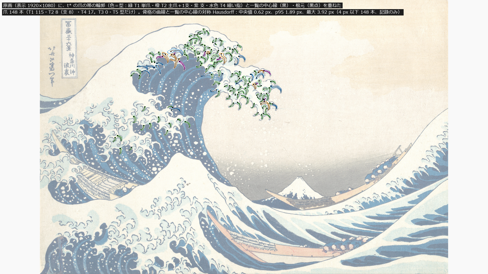
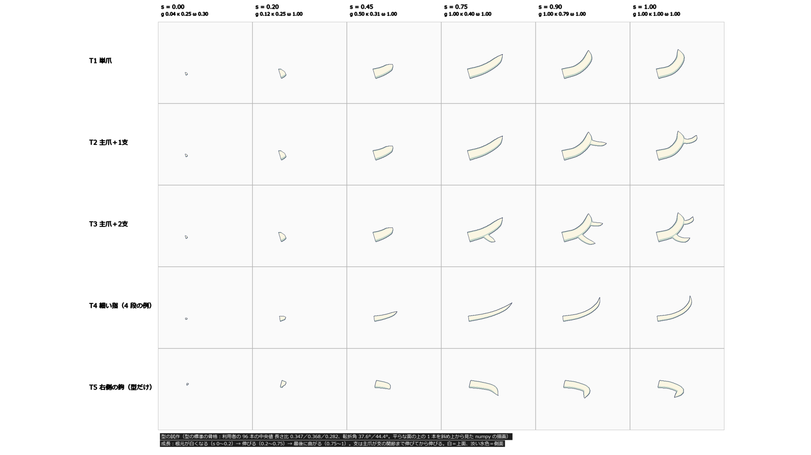

# 設計33：波頭の帯と 3〜5 種類の爪の試作 ― 爪の型を 5 種類と支に分け、主浪の 148 本を厚い帯のメッシュにして、根元をシートに固定し 3 段の標準曲線で伸ばす

日付：2026-09-29〜30／状態：**閉じた（最小の受入は満たした）**。修正は 0 回（Q26 の 1 回は使っていない。第 6 節）。進行役の独立の検査で必須の指摘はなかった。証拠の種類は次のとおり。**Unity の描画でも、HMD 実機の結果でもない。利用者は確かめていない。**

- numpy の生成器と検査（爪の部 `ds33_claw_rig.py`・`ds33_claw_anim.py`・`ds33_claw_render.py`、生成器の側の独立の検査 `ds33_claws_indep_check.py`）と、numpy の z バッファの描画（仮の NPR）
- 独立の測定器（測定器の部 `ds33_harness.py`。爪は作らず、爪の部の出力を別の式で測る。自己試験つき）
- 進行役の独立の検査（作り手のコードを使わずに書いた numpy。リポジトリの外。コードと出力の写しは Git 対象外の `Unity/Build/Design/33/indep_check/`）
- 記録の道具 `ds33_record.py`（帯の形の数え直しと、限界の図）

番号の前提：

- 対象：[段階9までの実行計画](../Design/Stage9_Plan_2026-09-26_ja.md)（以下「計画」）§2.2 の設計33。
- 引き継ぎ：
  - [設計32](Design_32_ja.md)（修正01 の後）：爪の一覧（173 本。主浪の 148 本をシートの (行, 列) に結び付けた。`ds32_claw_inventory.json` `9b73086b…`、`ds32_ids.json` `6fc81ea5…`）。この番号の土台。
  - [設計31](Design_31_ja.md)：主役波のパッケージ `hero_pkg`（F\_final の位置 `af08cd4e…`・精度の層 `99a29d6a…`＋設計31 の T\_white `5ffc93de…`）。爪の誕生の時刻。
  - [設計28修正01](Design_28_修正01_ja.md)：段階6 へ渡した爪のでこぼこ（輪郭 132 の細部込み最大 5.911 px、72 の細部込み p95 8.717 px。シートを変えずに、爪と白の帯を上に載せて直す）、b区域の爪の房、Q16 の浪尖の爪。
  - [設計29修正01](Design_29_修正01_ja.md)・[設計30](Design_30_ja.md)：t\* の原画視点の値（回帰の基準）と色面。
- 時間の上限：Q26 の日程（計画 §2.6 の表）で 8 時間。範囲は最小の受入だけで、修正は 1 回まで。
  - 実績：作業の指示の記録では 9/29 23:06 開始。ファイルの時刻では `Tools/GWWaveGen/ds33` の作成 23:16:26、`Unity/Build/Design/33` の作成 23:18:22、爪の部の最後の記録 00:31:38（`claws/run.json`）、測定器の最後の出力 00:47:13（`harness/README_interface.txt`）、進行役の独立の検査 00:51〜00:57、記録 01:00〜01:25 ごろ。
  - 23:06〜00:57 は約 1 時間 51 分、記録を含めて約 2 時間 20 分で、上限の内。
  - 1 回の計算：いちばん長いのは爪の部の動画の描画で約 40 分（`claws/README_interface.txt` の見積もり）。numpy の描画で、AGENTS.md の 30 分の上限（Unity・Houdini の 1 回の計算）の対象ではないが、長い。測定器は 1 回 243.6 s、自己試験は 316.7 s。
- 修正回数：0。受入の評価より前の開発中の調整 4 つ（第 6 節）は数えない。
- 対応するバックログ（計画 §2.2）：95〜98・101・103〜105・122〜129・136〜139・200（使える水準。精度は仕上げ32・33）。値は [metrics.json](../Evidence/Design/33/metrics.json) の `backlog`。項目の中身は[美術優先の作業計画](../Design/ArtFirst_Plan_2026-09-25_ja.md)の 33・35 の受入の書き方による。
- 読むだけで変えていないもの：
  - 設計32 の一覧と ID（上）、主役波のパッケージ（上）、時間曲線 `timewarp_F_final.json`（`627815c7…`）
  - 29修正01 の色面（`af28r01_uvsdf_a45.bin` `69c0b26d…`、UV の表 `fbd95c90…`。描画の色だけに使う）、`painting_truth.json`（PaintingCam v1、`392860eb…`）、高解像度原画 `Docs/References/Met_JP1847_DP130155.jpg`（`cbb9988f…`）
  - 設計30 の周りの海 `Unity/Build/Design/30/sea`（輪郭の読みの場面）
- 座標と単位：m・s。t は体験の時刻（コマ k は t = k/30 s、421 コマ）、t\* は t = 12 s（コマ 360）。t ≥ 12 s は t\* の保持。τ は物理の時刻で t\* = 0。表示の px は PaintingCam v1 の 1920 × 1080。
- 爪形分析（Q8 の例外、D14/D23）：爪の部が、Q8 の例外の README 1 ファイル（`G:\Unity\Ukeyoe_Claw\Docs\Research\Claw_Analysis\README.md`、`09ae4ef7…`）から、96 本の中央値と四分位の数値だけを写した。爪形分析のフォルダー（`G:\research\爪形分析`）の画像とマスクは、どの部も開いておらず、複製もしていない。
- 使っていないもの：参照モデル（D20：爪に参照モデルを使わない）、利用者の解算、写真のフォルダー、Unity・Blender・Houdini、git の操作。

## 見るもの

| t\* の重ね図（原画に、爪の帯の輪郭と一覧の中心線） | 型の試作（型 × 成長の段） |
| --- | --- |
|  |  |

どの図も numpy の図で、Unity の描画ではない。1920 × 1080 の枠に収めた（元の図は Git 対象外の `Unity/Build/Design/33/claws/fig/` と `harness/claws_run/`）。

爪の形と位置（t\*、原画視点）：

- [t\* の重ね図](../Evidence/Design/33/fig_ds33_tstar_overlay.png)：原画に t\* の帯の輪郭（色は型：緑＝T1、橙＝T2、紫＝支、水色＝T4）と、一覧の中心線（黒）・根元（黒点）を重ねた。
- 列ごとの重ね図（拡大）：[上側](../Evidence/Design/33/fig_ds33_rows_upper.png)／[途中](../Evidence/Design/33/fig_ds33_rows_middle.png)／[船側](../Evidence/Design/33/fig_ds33_rows_boat.png)／[b区域](../Evidence/Design/33/fig_ds33_rows_bregion.png)
- 列ごとの numpy の描画：[上側](../Evidence/Design/33/fig_ds33_rows_upper_render.png)／[途中](../Evidence/Design/33/fig_ds33_rows_middle_render.png)／[船側](../Evidence/Design/33/fig_ds33_rows_boat_render.png)／[b区域](../Evidence/Design/33/fig_ds33_rows_bregion_render.png)
- [t\* の numpy の描画](../Evidence/Design/33/fig_ds33_tstar_render.png)：主役波のシート（29修正01 の色面）＋爪 148 本。見出しのコマ 420 は t\* の保持の間で、形はコマ 360 と同じ。

成長：

- [型の試作](../Evidence/Design/33/fig_ds33_types.png)：T1〜T5 を成長の段（s 0・0.2・0.45・0.75・0.9・1）で並べた。T3 と T5 はこの図だけにある。
- [代表の爪の成長](../Evidence/Design/33/fig_ds33_single_growth.png)：C092（R10、T2、唇から空へ出る）・C075（R6、T4）・C015（R2、T2）・C165（b区域）を近くから。赤の縁がその爪。
- 成長の静止画：[t 7.0・8.5・9.5・10.3 s](../Evidence/Design/33/fig_ds33_growth_stills_1.png)／[t 11.0・12.0 s](../Evidence/Design/33/fig_ds33_growth_stills_2.png)。左＝原画視点の拡大、右上＝波頭を斜め横から、右下＝唇の船側の爪の近く。
- [動画](../Evidence/Design/33/ds33_claws_growth_30fps.mp4)（1920 × 1080、30 fps、256 コマ、t 5.5〜14 s。画面の分け方は静止画と同じ）。視点は波の枠と一緒に動き、t\* で原画視点と一致する。元の 6,058,543 バイトの動画を crf 24 で 4,196,027 バイトへ符号化し直した（大きさ・コマ数は同じ）。

輪郭（回帰）：

- [爪の部の輪郭の比べ](../Evidence/Design/33/fig_ds33_contour_tstar.png)：爪なし → 爪ありの原画視点の輪郭。赤は爪で空でなくなった画素。
- [独立の測定器の輪郭](../Evidence/Design/33/fig_ds33h_outline_132_72.png)：シート＋爪を評価器で測った図（28修正01 の読み）。下の英語の凡例は、記録の時に日本語の説明の帯で覆った。

限界：

- [帯を近くから](../Evidence/Design/33/fig_ds33_limit_band_folds.png)：上＝C072 の輪の断面が 1 コマで回る所（コマ 216〜219）。下＝t\* で隣り合う輪の向きの差が大きい 4 本（C013・C021・C042・C065）。

数値：

- [metrics.json](../Evidence/Design/33/metrics.json)：最小の受入 `acceptance`、バックログ `backlog`、中身 `design`、回帰 `regression`、記録のみ `record_only`、計画の最小の外の検査 `extra_checks`、修正 `revisions`、独立の検査 `independent`、食い違い `discrepancies_ja`、採った読み `decision`、渡し先 `handoffs`、時間 `time`
- 爪の部の出力の写し：[ds33\_claws\_part\_metrics.json](../Evidence/Design/33/ds33_claws_part_metrics.json)、[ds33\_claw\_checks.json](../Evidence/Design/33/ds33_claw_checks.json)、[ds33\_claws\_indep\_check.json](../Evidence/Design/33/ds33_claws_indep_check.json)、[ds33\_contour\_tstar.json](../Evidence/Design/33/ds33_contour_tstar.json)、[ds33\_visibility\_tstar.json](../Evidence/Design/33/ds33_visibility_tstar.json)、設計34 への並び [ds33\_claw\_layout.json](../Evidence/Design/33/ds33_claw_layout.json)
- 測定器：[ds33\_harness\_metrics.json](../Evidence/Design/33/ds33_harness_metrics.json)、[ds33\_harness\_selftest.json](../Evidence/Design/33/ds33_harness_selftest.json)
- 進行役の独立の検査：[ds33\_indep\_chk\_geom.json](../Evidence/Design/33/ds33_indep_chk_geom.json)、[ds33\_indep\_chk\_growth.json](../Evidence/Design/33/ds33_indep_chk_growth.json)
- 記録の時に数えたもの：[ds33\_record\_counts.json](../Evidence/Design/33/ds33_record_counts.json)（t\* の帯の形、C072 の断面のコマごとの変化、段の原画視点での大きさ、弧長、根元の色区が藍濃の爪）
- 実行条件と SHA-256：[run.json](../Evidence/Design/33/run.json)

**見え方の注意**：

- 描画は仮の NPR（白＝上面、淡い水色＝縁の側面と下面、線は仮）。色と線は段階7。
- 帯の見かけの幅は、原画の指より細い（第 5 節の 4）。
- 崩壊での消失は作らない（Q11）。動画は「成長 → 曲がり → t\* の保持」。

## 0. 結論

1. **爪の型を 5 種類と支に分けた。** T1 単爪、T2 主爪＋1支、T3 主爪＋2支、T4 細い指、T5 右側の鉤（型だけ）。
   - 主浪の 148 本（上側 64・途中 25・船側 45・b区域 14）を、型と一覧のパラメータから生成した。内訳は T1 115、T2 8（支 8）、T4 17。
   - T3 は、一覧に当てはまる爪（1 本の爪の領域から 2 本の支が出る爪）がなく 0 本。T5 は、右側の爪がシートに結び付いていないので生成しない。どちらも型の試作の図だけ。
2. **骨格は 3 段（長く曲がる 16 本は 4 段）で、一覧の中心線に当てはめた。** 一覧の 3 段の中央値は長さ比 0.367／0.362／0.254、転折角 31.0°／40.9°。利用者の 96 本の中央値（0.347／0.368／0.282、37.6°／44.4°。README の値）に近い。18 px 未満の短い 6 本だけ、利用者の中央値を型の標準の骨格にした。
3. **帯のメッシュ**：輪 8 頂点 × 20 個（支は 16 個）＋閉じた先端。根元が広く、側面の厚みは正面の幅の 0.18（支）・0.20（T1・T2）・0.25（T4）。1 本 最大 171 頂点、主爪＋支で最大 310、全体で 25,052 頂点・48,032 三角形。
4. **最小の受入はすべて合格。** 爪の部・測定器・進行役の 3 つの読みで判定は同じ。
   - 重ね図の対応：合格（目視）。根元の差 ≤ 0.148 px、先端の差 ≤ 1.98 px、向きの差 ≤ 7.2°。描いた 148 本すべてで、最も近い一覧の爪が自分の ID。
   - 105 根元から水面まで ≤ 1 mm：最大 3.79e-6 m（進行役、見えないコマを含む全コマ）。
   - 137 根元の滑り 0：最大 7.3e-6 m（進行役、全コマ）。許容 1 mm は float32 の丸めのため。
   - 139 成長の途中の欠落 0：途切れ 0、面積 0 のコマ 0、NaN 0。148 本（150 ± 15 の内）。
   - 1 本あたり ≤ 600 頂点：最大 171。
5. **成長は 3 段の標準曲線**（根元が白くなる s 0〜0.2 → 伸びる 0.2〜0.75 → 最後に曲がる 0.75〜1）。計画の損切りの形を、はじめから既定にした。
   - 根元の T\_white で生まれ、t\* の後は保持する。支は、主爪が支の根元まで伸びてから伸びる。
   - 誕生は t 6.07〜10.17 s。t 7.0 s は 32 本がすべて根元が白くなる段、t 10.3 s は 148 本（伸びる 114、曲がる 32）、t 12 s は 148 本すべてできあがり（成長の静止画の見出し）。
6. **根元は設計32 の `sheet_rc` に固定**し、描画と同じ三角形の上の点に置いた。関節はシートの (行, 列) に結び付け、空へ出る 15 本の先は直前の関節の局所の座標系で持つ。座標系はコマごとに作り直す。
7. **波頭の白い帯（web）とのつなぎ**：根元の T\_white での誕生と、シートに付く根元の白の円。根元の色区は白 114・淡い水色 32・藍濃 2。
8. **回帰（計画 §2.0）：後退なし。** Unity の原画視点の描画は変えていない（Unity の資産はない）ので、評価器は回していない。爪をシートに載せた値を numpy の 2 つの読みで測った。
   - Unity に近い読み：78／130／131 は 3.0289／3.5131／3.0431 px、132 σ12 は 3.7552 px で変わらない。72 σ24 p95 は 4.0075 → 3.8423 px。
   - 細部込み：132 最大 5.9472 → 5.2998 px、72 p95 8.7546 → 7.8009 px。良くなったが、4 px には届かない。
   - 測定器の 28修正01 の読みでも、132 最大 5.9114 → 5.5738 px、72 p95 8.717 → 7.6945 px。
9. **計画の最小の外の欠点を 2 つ記録した**（修正の回は使っていない）。
   - C072 の輪の断面が、コマ 203 と 218 で急に回る。測定器の追加の読み（139b）で不合格で、コマ 218 で面積が 19.5% 減る。C083・C114 にも小さな段がある。
   - t\* で中心線が急に折れる爪が 29 本（45° 超）あり、そのうちの多くで帯の内側の縁が折れ返る（折れ返る所のある爪 48 本）。
   - 固定の原画視点で読むと、段は最大 2.2 px（C072、爪の大きさ 5.2 px）。近くからは見えるので、設計34 と仕上げ33 へ渡した。
10. **HMD（PS VR2）の項目は保留**（導入は利用者の手）。崩壊での消失は作らない（Q11）。

---

## 1. 目的

設計書の設計33 は、波頭の帯と 3〜5 種類の爪を試作する番号である。計画 §2.2 の成果物は次のとおり。

- 爪の型を 3〜5 種類（例：単爪、主爪＋1支、主爪＋2支、細い指、右側の鉤は型だけ）。
- 骨格は 3 段（一部 4 段）。節の長さ比と曲がり角は、一覧の測定値と利用者の 100 本の測定（3 段 96 本の中央値）を参照する。
- 厚い帯としてメッシュにする（根元が広く先端が閉じる。側面の厚みは正面の幅の 15〜25%）。主浪の爪を型と一覧のパラメータから生成する（計画の書いた時点では 128 本。設計32 の後は 148 本）。
- 根元はシートの (u, v) に固定し、キーごとに接線の座標系を作り直す。波頭の白い帯（web）とつなぐ。
- 成長 → 曲がり → 崩壊での消失の一巡を 1 本の動画にする（Q11 により崩壊での消失は作らない）。

最小の受入は、原画視点で一覧の爪の位置・向きの対応が見て取れること（重ね図。爪ごとの 4 px は記録のみ）、105（根元から水面まで ≤ 1 mm）、137（根元の滑り 0）、139（成長の途中の欠落 0、使える水準）、1 本あたり ≤ 600 頂点である。Q26 により、この番号は最小の受入だけを満たし、修正は 1 回までとした。爪ごとの輪郭の合わせは仕上げ32、成長と遮蔽の精度は仕上げ33、右側の爪はブラッシュアップの最後へ回す。

---

## 2. 表

### 2.1 型と生成（`metrics.json` の `design`）

| 型 | 中身 | 本数 | 側面の厚み／正面の幅 | 輪の数 |
| --- | --- | --- | --- | --- |
| T1 単爪 | 1 本の帯 | 115 | 0.20 | 20 |
| T2 主爪＋1支 | 主爪の領域の中から支が 1 本出る | 8（支 8） | 0.20（支 0.18） | 20（支 16） |
| T3 主爪＋2支 | 支が 2 本 | 0（型の試作の図だけ） | 0.20 | 20 |
| T4 細い指 | 長さ／幅 ≥ 6。先細りが強い | 17 | 0.25 | 20 |
| T5 右側の鉤 | 型だけ | 0（型の試作の図だけ） | 0.20 | 20 |

| 項目 | 値 |
| --- | --- |
| 列 | 上側 64・途中 25・船側 45・b区域 14（計 148） |
| 段の数 | 3 段 132 本、4 段 16 本 |
| 関節の当てはめ | 3 段 120、4 段 15、支の 3 段 3、節が潰れて当て直した 3 段 3・4 段 1、型の標準の骨格（18 px 未満）6 |
| 空へ出る爪（関節の一部がシートに付かない） | 15 本 |
| b区域と Q16 の浪尖（`b_region_q16`） | 15 本。房 GC32（C158）、GC33（C159）、GC34（C160・C161・C163〜C168・C170・C171・C173・C175）、C172 は上側の列（GC18） |
| 成長の段のパラメータ | s1 0.2、s2 0.75、誕生の長さ g 0.04、段 1 の終わりの g 0.12、曲がり κ 0.25 → 0.4 → 1、幅 ω 0.3 → 1 |
| 根元の色区 | 白 114、淡い水色 32、藍濃 2（C163・C165。どちらも b区域） |
| 根元から最も近い白の頂点まで | 中央値 0.087 m、p95 0.206 m、最大 0.270 m |
| 帯の弧長（t\*） | 中央値 0.807 m、最小 0.115 m、最大 4.037 m（C092） |

### 2.2 最小の受入（3 つの読み）

| 項目 | 爪の部（生成器／その独立の検査） | 測定器 | 進行役の独立の検査 |
| --- | --- | --- | --- |
| 重ね図の対応（t\*） | 根元 最大 0.148 px、先端 最大 1.976 px。骨格の曲線と一覧の中心線の対称 Hausdorff：中央値 0.62、p95 1.89、最大 3.92 px（148 本すべて ≤ 4 px） | 描いた 148／148、最も近い一覧の爪が自分 148。根元 最大 0.148 px、先端 中央値 0.008・最大 1.976 px、向き 中央値 0.018°・最大 7.162°、中心線までの平均 最大 0.704 px。自動の旗 1（C073、シートが手前の割合 0.517） | 根元 最大 0.148 px、先端 中央値 0.008・最大 1.976 px、向き 中央値 0.017°・最大 7.16°、中心線まで（輪の中心の折れ線）中央値 0.66・p95 2.11・最大 5.02 px（147 本 ≤ 4 px。C075 が 5.02 px）。自前の重ね図で目視 |
| 105 根元から水面まで | 1.65e-6 m／1.71e-6 m | 2e-6 m | 見えるコマ 1.65e-6 m、全コマ 3.79e-6 m（C115、コマ 93） |
| 137 根元の滑り | 2.02e-6 m・8.3e-5 セル／2.73e-6 m・8.3e-5 セル | 6e-6 m・1.1e-4 セル | 見えるコマ 2.09e-6 m・8.3e-5 セル、全コマ 7.3e-6 m・2.6e-4 セル |
| 139 成長の途中の欠落 | 途切れ 0、一度も見えない 0、s・g・κ・ω が減るコマ 0、NaN 0、面積 0 のコマ 0／見えると τ ≥ τ\_start の食い違い 0、見える → 見えない 0 | 途切れ 0、面積 0 0、有限でない値 0、148 本、設計32 の 148 本のうち出てこない ID 0 | 途切れ 0、誕生の食い違い 0、誕生 t 6.07〜10.17 s、t\* の保持の間の面積の変化 0 |
| 頂点 ≤ 600 | 1 本 171、主爪＋支 310 | 171 | 171、全体 25,052。どの三角形も自分の爪の頂点だけを使う |

- 3 つの読みの 105・137 の差は、読み方（見えるコマか全コマか、6 桁の丸め、最初に見えたコマからの動きか結び付けからの差か）の違い。どれも 1 mm より 2 桁以上小さい。
- 爪の部の生成器の側の独立の検査は、設計31 の Hermite（`ds31_white.Pkg`）と truthlib の投影を使う。成長の順も確かめた：どの爪も ω が 1 に届いてから g が 0.5 を越え、g が 0.99 に届いた時の κ は最大 0.3996（最後に曲がる）。先端の突出 0。
- 瞬間移動 0（爪の部）。爪の頂点のコマの間の動きの最大は 0.520 m で、シートの頂点の最大 0.829 m より小さい。

### 2.3 回帰（原画視点 t\*。numpy の 2 つの読み。単位は表示の px）

| 項目 | 基準（29修正01・設計30 の Unity） | 爪の部：爪なし → 爪あり（Unity に近い読み） | 測定器：Unity に近い読み | 測定器：28修正01 の読み（シートだけ → 爪あり） |
| --- | --- | --- | --- | --- |
| 78 | 3.0289 | 3.0289 → 3.0289 | 3.0289 → 3.0289 | 2.741 → 2.741 |
| 130 | 3.5131 | 3.5131 → 3.5131 | 3.5131 → 3.5131 | 3.8308 → 3.8308 |
| 131 | 3.0431 | 3.0431 → 3.0431 | 3.0431 → 3.0431 | 2.9243 → 2.9243 |
| 132 σ12 最大 | 3.7552 | 3.7552 → 3.7552 | 3.7552 → 3.7552 | 3.9052 → 3.9052 |
| 72 σ24 p95 | 4.0075 | 4.0075 → **3.8423** | 4.0075 → 3.8423 | 3.7465 → 3.6643 |
| 132 細部込み 最大 | 5.947 | 5.9472 → **5.2998** | 5.9472 → 5.2998 | 5.9114 → 5.5738 |
| 72 細部込み p95 | 8.755 | 8.7546 → **7.8009** | 8.7546 → 7.8009 | 8.717 → 7.6945 |

- どの読みでも、爪なしの値は基準と一致した（Unity に近い読みは設計31 の Unity の値、28修正01 の読みは設計28修正01 の値）。そのうえで爪あり − 爪なしを読み、後退はない。
- 爪の部の読みでは、評価器の「爪の版」（包絡ではない版。関門ではない）も記録した：132 最大 45.0326 → 45.0446 px（+0.012）、72 p95 28.4576 → 28.3381 px。
- 色の項目（73・77・79・118・120・133・134・263・265〜267・270）は、Unity の原画視点を変えていないので 29修正01・設計30 のまま。
- 2 つの読みは、72 σ24 の爪なしで 3.7465 と 4.0075 px のように最大 0.26 px 違う。4 px の近くでは読みで合否が分かれうるので、両方を記録した。

### 2.4 記録のみ

| 項目 | 値 | 出典 |
| --- | --- | --- |
| 原画視点 t\* で爪がシートに隠れない割合（爪の部） | 最小 0.613・p5 0.943・p10 0.976・p25 0.997・中央値 1.0。0.5 未満 0、0.8 未満 4（C095 0.613、C109 0.647、C094 0.656、C096 0.723。どれも唇から空へ出る T1） | `ds33_visibility_tstar.json` |
| シートが手前の割合（測定器、別の定義） | 中央値 0.259、p90 0.392、最大 0.517（C073） | `ds33_harness_metrics.json` |
| 爪ごとの 4 px（測定器） | 根元 148／148、先端 148／148、縁の対称 Hausdorff p95 ≤ 4 px が 94／148（中央値 3.162、最大 13.061）、最大 ≤ 4 px が 61／148（中央値 4.736、最大 14.56） | 同じ |
| 領域の IoU（測定器） | 中央値 0.571、p90 0.714、最大 0.825 | 同じ |
| 帯の見かけの幅 | 一覧の領域の幅の中央値 0.72 倍（中心線の 1/3 の所、四分位 0.61〜0.95）・0.81 倍（1/2 の所） | `ds33_claws_part_metrics.json` の `limits_ja` |
| 136 成長の始まり | 支でない爪は根元の T\_white の最初のコマで見え始める（tau\_birth は根元の 2 × 2 のセルの T\_white の最小、差 ≤ 5e-5 s）。支は主爪を待つので最大 1.41 s 遅い。t\* で全部伸び切る | 進行役・測定器 |
| 138 根元の近くの向きの変化 | 30% 成長の後で最大 56.0°（根元の局所の座標系。粗い読み） | 測定器 |
| 根元から最も遠い頂点までの距離が減るコマのある爪 | 78 本（曲がると減る） | 測定器 |
| 弧長が 1% を超えて減るコマ | 3（C088・C095） | 爪の部 |
| 根元の点から最初の輪の中心まで | 最大 0.029 m（C017） | 進行役 |

**t\* の帯の形**（記録の時に数えた。`ds33_record_counts.json` の `band_shape_tstar`。輪 j の幅の軸＝輪の頂点 0 − 頂点 4）：

| 読み | 45° 超 | 30° 超 | 大きい爪 |
| --- | --- | --- | --- |
| 隣り合う輪の幅の軸の向きの差（ねじれと面の中の曲がりの両方） | 13 | 36 | C013 95.3°、C021 80.4°、C042 69.7°、C065 69.3°、C078 68.6° |
| 接線まわりのねじれ（2 つの輪の中心を結ぶ向きに垂直な面へ写した差） | 1 | 3 | C013 85.2°、C154 34.2°、C072 34.1° |
| 中心線の折れ（隣り合う 2 区間の向きの差） | 29 | 53 | C013 152.2°、C093 84.3°、C078 83.7°、C021 83.5°、C049 83.2° |
| 帯の内側の縁が折れ返る所（折れの所の曲率の半径 < 輪の幅の半分） | 48 本（82 か所） | — | C020・C112 各 5 か所、C049 4 か所 |

- 近くから見て帯がつぶれたように見える主な原因は、接線まわりのねじれではなく、中心線の急な折れで帯の内側の縁が折れ返ることである。

### 2.5 計画の最小の外の検査（`metrics.json` の `extra_checks`）

測定器の追加の読み 139b（面積が 1 コマで 10% を超えて減る、または頂点が段や突出で跳ぶコマ 0）は、**C072 だけ不合格**（頂点の跳び：コマ 202・203・217・218、面積の減り：コマ 218 で 19.5%）。計画の 139 そのものは合格。

進行役の独立の検査の段（根元に対する頂点の 1 コマの動きの最大が、前後数コマの中央値の 4 倍 + 1 cm を超え、かつ根元から先端までの距離の 0.2 倍を超えるもの）と、その原画視点での大きさ（固定の PaintingCam v1。記録の時に数えた）：

| 爪 | コマ | 段（cm） | 前後の中央値（cm） | 根元から先端まで（cm） | 原画視点の段（px） | その時の爪の大きさ（px） |
| --- | --- | --- | --- | --- | --- | --- |
| C072 | 203 | 5.09 | 0.42 | 5.07 | 0.86 | 2.2 |
| C072 | 218 | 13.54 | 0.56 | 10.09 | 2.22 | 5.2 |
| C083 | 209 | 3.24 | 0.50 | 7.82 | 0.65 | 2.9 |
| C083 | 219 | 1.91 | 0.14 | 9.45 | 0.42 | 3.6 |
| C114 | 220 | 2.50 | 0.29 | 2.66 | 0.24 | 2.8 |
| C114 | 235 | 2.43 | 0.18 | 4.04 | 0.29 | 3.2 |
| C114 | 241 | 2.51 | 0.33 | 5.64 | 0.37 | 3.2 |
| C114 | 247 | 2.79 | 0.40 | 7.95 | 0.43 | 3.3 |

- C072 の接線まわりのねじれの最大は、見え始め（コマ 197）から 104.9° あり、コマ 217 の 120.7° まで増える。その場所は、輪の組 2 → 1（コマ 203）→ 0（コマ 218）と根元の側へ移り、コマ 218 で 57.0° に下がる（`c072_twist_series`）。段は、このねじれの場所が 1 コマで移る所に出る。t\* の C072 のねじれは 34.1°。
- 固定の原画視点では、この時刻の爪は画面の左の端（根元の x −46〜192 px）にある。動画の左の視点は波の枠と一緒に動くので、この px は目安。

---

## 3. 作り方と、採ったもの

### 3.1 型と骨格（`ds33_claw_rig.py`）

- 一覧（設計32）の中心線に、3 段（長く曲がる爪は 4 段）の関節を最小二乗で当てはめた。18 px 未満の短い 6 本は、利用者の 96 本の中央値（長さ比 0.347／0.368／0.282、転折角 37.6°／44.4°）を型の標準の骨格にした。
- 節が潰れる当てはめ（4 本）は、型の骨格に替えず、節の最小を 20% にして当て直した。
- T4 は長さ／幅 ≥ 6 の細い指。支（T2 の支）は、根元が他の爪の領域（藍の輪郭線の内側）の中にあり、その爪の中心線の 10〜95% の所にある一覧の爪とした（仮の規則）。
- 幅は、一覧の領域（D25 の仮の定義）の距離変換を型の先細りの 0.6〜1 倍に収めた。面の傾きの補正の下限 0.4、根元の幅の上限は長さの 0.45 倍。

### 3.2 帯（`ds33_claw_anim.py` の `sweep`）

- 関節を通る centripetal Catmull-Rom の曲線を、弧長で 20 個（支は 16 個）の輪と先端の 1 点に取り直す。輪は 8 頂点の扁平な楕円（φ 0°＝幅の向き、φ 90°＝上＝法線の向き）。
- 輪の幅＝型の幅 × ω(s)、厚み＝型の比 × 幅。輪の中心は骨格の線から法線の向きへ厚みの 0.25 だけ上げ、下の縁は面へ厚みの 0.25 だけ沈める。
- 両端の関節がシートに付く区間の輪は、そのコマのシートへ射影して面の上へ載せ直す（関節の間で面がふくらんで帯が埋まるのを防ぐ）。
- 面の種類：上面（φ 45〜135°）は白、縁の側面と下面は淡い水色、根元の白の円は白。
- 爪ごとの頂点の並び：根元の点 1、輪 × 8、先端 1、根元の白の円の中心 1、円 8。

### 3.3 根元・関節とシート

- 根元：設計32 の `sheet_rc`（行, 列）に固定し、そのコマのシートの、描画と同じ三角形（Unity と同じ分け方。`grid_tris` の (a, b, cc)・(cc, b, d)）の上の点に置く。
- 関節：t\* の原画視点の画素の射線がシートに当たる所に、シートの (行, 列) で結び付ける。前にある面はいつも採り、奥は直前の関節の深さ + 1.5 m まで。当たらない関節（唇から空へ出る 15 本の先）は、直前のシートの関節の局所の座標系 [e1 e2 n] で持つ。
- 各コマで、シートからこの座標系を作り直す（計画の「キーごとに接線の座標系を作り直す」）。

### 3.4 成長

- s = (τ − τ\_start)/(0 − τ\_start)。τ\_start は根元の T\_white（設計32 の `tau_birth`）、支は主爪が支の根元まで伸びた時。
- 根元が白くなる（s 0〜0.2。幅 ω 0.3 → 1、長さ g 0.04 → 0.12）→ 伸びる（0.2〜0.75。g → 1、κ 0.25 → 0.4）→ 最後に曲がる（0.75〜1。κ → 1）。
- κ は t\* の 3 次元の転折角の倍率（1 本目の節の向きは t\* のまま）。τ ≥ τ\_start で見え、t\* の後は保持する。

### 3.5 波頭の白い帯（web）とのつなぎ

- 波頭の白い帯は、設計31 の T\_white で白くなるシートの色区（設計32 の約束）。爪はその根元の白の出現で生まれ、根元の白の円（シートの (行, 列) の 8 点＋中心。面から 4 mm 上）でシートの白に重なる。

### 3.6 設計34 へのファイル（`ds33_claw_layout.json`）

- `ds33_claw_frames_f32.bin`：float32、421 コマ × 25,052 頂点 × 3（ワールドの m）。見えないコマの爪は根元の点に潰してある。
- `ds33_claw_tris_i32.bin`（48,032 三角形）、`ds33_claw_tri_attr_u16.bin`（爪の番号、面の種類）、`ds33_claw_skel_f32.bin`（421 × 148 × 36：関節 5 × xyz、関節の法線 5 × xyz、s、g、κ、ω、見える、帯の弧長 m）。
- 並びと SHA-256 は layout にある。ID は設計32 の ID（欠番 C107・C169、右側 C129〜C153 は含まない）。

### 3.7 独立の測定器（`ds33_harness.py`）

- 爪の部の出力を、自前の最も近い点の探し方（Unity と同じ三角形の分け方、精度の層つき）と、自前の z バッファ・被覆で測る。原画視点の輪郭は 2 つの読み（設計28修正01 の読みと、GPU のように画素の中心を標本にする Unity に近い読み）で測り、どちらも爪なしで基準の値を再現した。
- 自己試験：設計32 の ID から作った試験用の帯で、正しい帯では 105（0 m）・137（0 m）・139・139b・頂点の数が合格。入れた 8 つの欠陥（滑り C006、遅れ C021、3 mm の浮き C041、見えない途切れ C061、1 コマの成長の減り C081、700 頂点 C101、向きの反転 C122、欠けた爪 C167）をすべて見つけ、ほかの爪の誤検出は 0。
- 呼び方（`ArrayProvider` + `evaluate()`、ファイルの書式、爪の部の layout の読み）は `Unity/Build/Design/33/harness/README_interface.txt`。

### 3.8 採った読みと、落とした案（Q24。進行役の判断で、利用者の決定ではない）

- **採った**：
  - 3 段の標準曲線（計画の損切りの形）をはじめから既定にした。見え方の否決はまだない。
  - T3・T5 は型の試作の図だけ。支の判定の規則は仮。
  - 関節の置き方：前にある面はいつも採る（設計32 の ±1.5 m の窓をやめた）。
  - 両端がシートに付く区間の輪を面に沿わせる。
  - 回帰は、Unity の原画視点を変えていないので評価器を回さず、numpy の 2 つの読みで爪ありの後退がないことを確かめた。
  - 修正の回は開かない（第 6 節）。
- **落とした (1)**：設計32 の ±1.5 m の窓で関節を置くこと。唇の前の面の奥に置かれて、C092 などが隠れた。
- **落とした (2)**：節が潰れる当てはめを型の標準の骨格に替えること。一覧の形から離れる。
- **落とした (3)**：C072 の断面の回りと帯の折れ返りを、Q26 の 1 回の修正で直すこと。計画の最小の外で、固定の原画視点では最大 2.2 px。Q26 の速さを優先し、近くの見え方を確かめる設計34 と仕上げ33 へ送った。
- **落とした (4)**：崩壊での消失（Q11 で範囲外）。

---

## 4. 関門

| 最小の受入 | 基準 | 値 | 判定 |
| --- | --- | --- | --- |
| 原画視点の重ね図の対応 | 一覧の爪の位置・向きの対応が見て取れる（爪ごとの 4 px は記録のみ） | 3 つの読みで根元 ≤ 0.148 px、先端 ≤ 1.98 px、向き ≤ 7.2°。重ね図 5 枚（全体と列ごと 4 枚） | 合格（進行役の目視。利用者は未確認） |
| 105 根元から水面まで | ≤ 1 mm（全コマ） | 最大 3.79e-6 m（3 つの読みの最大） | 合格（numpy） |
| 137 根元の滑り | 0 | 最大 7.3e-6 m・2.6e-4 セル（全コマ） | 合格（numpy。許容 1 mm は float32 の丸め） |
| 139 成長の途中の欠落 | 0（使える水準） | 途切れ 0、面積 0 のコマ 0、NaN 0、148 本 | 合格（numpy） |
| 1 本あたりの頂点 | ≤ 600 | 171（主爪＋支 310） | 合格 |
| 計画 §2.0 の回帰 | 原画視点に触れたら評価器 | Unity の原画視点を変えていない。numpy の 2 つの読みで後退なし | 対象外（記録） |
| 側面の厚み（成果物の条件） | 正面の幅の 15〜25% | 0.18〜0.25 | 範囲の内 |
| 型の数（成果物の条件） | 3〜5 種類 | 5 種類と支（生成したのは T1・T2・T4 と支） | 記録 |
| 動画（成果物の条件） | 成長 → 曲がり → 崩壊での消失 | 成長 → 曲がり → t\* の保持（消失は Q11 で範囲外） | 記録 |
| 139b（測定器の追加の読み、計画の外） | 面積の急な減り・頂点の跳び 0 | C072 だけ不合格（コマ 202・203・217・218、面積 −19.5%） | 記録（限界、第 5 節の 2） |
| HMD（PS VR2） | — | — | 保留（導入は利用者の手） |

---

## 5. 限界

1. **T3（主爪＋2支）は 0 本、T5（右側の鉤）は型だけ。** 支の判定の規則（根元が主爪の領域の中、主爪の中心線の 10〜95% の所）は仮。仕上げ32・33。
2. **帯の形の乱れ（近くから見える）。**
   - C072 の輪の断面が、コマ 203・218 で急に回る（段 5.09・13.54 cm、面積 −19.5%）。C083（コマ 209・219）・C114（コマ 220・235・241・247）にも 1.9〜3.2 cm の段がある。
   - t\* で中心線が急に折れる爪が 29 本（45° 超。C013 は 152.2° で折り返す）あり、帯の内側の縁が折れ返る所のある爪が 48 本。近くの図（`fig_ds33_limit_band_folds.png`）では、しわが寄ったり、折れたりして見える。
   - 固定の原画視点では段は最大 2.2 px で、渡された t\* の描画の拡大の切り抜きや動画の画面では見えない（進行役の目視）。仕上げ33 で、輪の断面の向きを輪の間とコマの間で続ける（根元の座標系からの平行移動）ことと、急な折れの所の幅を直す。座席からの見え方は設計34。
3. **唇から空へ出る爪の一部は、t\* でシートに一部が隠れる**（見える割合の最小 0.613、0.8 未満 4 本）。測定器の旗は C073（シートが手前の割合 0.517）。近くから見た図では、面に沿う爪（C075 の t\*）の一部も手前の面のふくらみに隠れる（原画視点の見える割合は 0.942）。座席からの見え方は設計34。
4. **帯の見かけの幅は、一覧の領域の幅の中央値 0.72〜0.81 倍**で、原画の指より細い爪がある。領域の IoU は中央値 0.571、縁の Hausdorff p95 ≤ 4 px は 94／148。爪ごとの輪郭の合わせは仕上げ32・33。
5. **132・72 の爪のこぶは、4 px に届かない。** 細部込みで 132 最大 5.2998 px、72 p95 7.8009 px（Unity に近い読み）。爪で良くなったが、仕上げ28・32・33 に残す。
6. **関節の置き方を設計32 から変えた。** 空へ出る爪は 15 本。3 次元の弧長が長い爪がある（最大 4.037 m、C092）。支の成長の始まりは、主爪が支の根元まで伸びた時に遅らせた。**設計32 の履歴（`ds32_claw_hist`）とは、成長 g・支・爪の形が違う。** 設計32 の履歴の根元は双線形の面の上にあり、描画の三角形から最大 9.2 mm 離れる（試験用の帯で 148 本中 11 本：C068・C071・C081・C103・C104・C115・C119・C121・C154・C165・C171）。設計34 は ds33 のメッシュを使う。
7. **根元の色区が藍濃の爪が 2 本**（C163・C165、b区域）。根元から最も近い白の頂点まで最大 0.270 m で、白の帯とのつながりが弱い所がある。根元の白の円（中心＋8 点）は、動画の近くの画面で角ばった八角形に見える（進行役の目視）。段階7（色と線）・仕上げ32・33。
8. **136・138 は記録のみ。** 支は T\_white より最大 1.41 s 遅れて伸び始める（設計どおり）。138 の読みは粗い。
9. **原画視点の対応がほぼ完全なのは、一部は作りによる。** 爪は設計32 の一覧から作ったので、この対応は一覧に対するもので、原画に対して独立に確かめたものではない。
10. **2 つの輪郭の読みは最大 0.26 px 違う。** 4 px の近くでは読みで合否が分かれうる（両方を記録した）。
11. **崩壊での消失は作らない（Q11）。** 計画の「成長 → 曲がり → 崩壊での消失の一巡」のうち、消失は範囲外。
12. **動画の描画は 1 回 約 40 分**（見積もり）と長い。numpy の描画で Unity・Houdini の計算ではないが、仕上げでは短くする。
13. **右側の爪（C129〜C153）は結び付けておらず、生成していない**（T5 は型だけ。ブラッシュアップの最後）。
14. **証拠はすべて numpy。** 描画は numpy の z バッファの仮の NPR で、Unity ではない。Unity での 3 層の再生、船の後ろの遮蔽、Mock の両眼の確認は設計34。**HMD（PS VR2）の項目は保留**（導入は利用者の手）。利用者は確かめていない。
15. **主役波が仕上げ28 で変わったら、設計32 の結び付けと、この番号の帯を作り直す**（`ds32_ids.py` → `ds33_claw_rig.py` → `ds33_claw_anim.py`）。
16. **記録と実際の値の食い違い**（`metrics.json` の `discrepancies_ja`）：
    - 105・137 の最大は読みで少し違う（第 2.2 節）。どれも 1 mm より 2 桁以上小さい。
    - 進行役の独立の検査の報告は、t\* で隣り合う輪の間の「ねじれ」が 45° を超える爪を 13 本とした。記録の時に数え直すと、それは幅の軸の向きの差（面の中の曲がりを含む）の数で、接線まわりのねじれだけなら 1 本（C013）。
    - C075 の中心線の差は、爪の部（関節を通る曲線）で 2.314 px、進行役（輪の中心の折れ線）で 5.02 px。
    - 測定器の自動の旗 C073 は、爪の部の見える割合（別の定義）では 1.0。
    - 作業の指示の記録では開始 23:06、ファイルの時刻ではフォルダーの作成 23:16:26。
    - 爪の部の t\* の描画の図の見出しはコマ 420（t\* の保持で、形はコマ 360 と同じ）。
    - 爪の部の報告の「空へ出る爪 22 本 → 15 本」の 22 は、設計32 の修正01 の前の値。修正01 の後の `ds32_ids.json` では、根元の深さの面の上の先端は 21 本。
    - 爪の部の報告の 3 次元の弧長の最大 4.05 m は、骨格の表の t\* の値では 4.037 m（C092）。

---

## 6. 修正の記録（Q26：修正は 1 回まで）

| 回 | 変えたこと | 結果 |
| --- | --- | --- |
| 最初の出力（爪の部、23:06〜00:31） | 型・骨格・帯・成長・根元と関節の結び付け。受入の評価より前に、見た目の調整を 4 つ入れた（数えない）：① 幅の先細りを緩めた、② 節が潰れる当てはめは節の最小を 20% にして当て直した、③ 関節の置き方（前にある面はいつも採る。これで唇の前の面の奥に置かれて隠れていた C092 などが見えるようになった）、④ 輪を面に沿わせた | 最小の受入はすべて合格（`all_acceptance_pass = true`）。書き込みが一度、一時的な OSError で失敗し、回し直して通った |
| 独立の測定器（〜00:47） | 爪の部の出力（frames の SHA-256 `6e762988…`）を自前の式で測った。自己試験も通した | 最小の受入はすべて合格、回帰は後退なし。追加の 139b で C072 だけ不合格。1 回の修正で直すことを勧め、直さないなら限界として記録するとした |
| 進行役の独立の検査（00:51〜00:57） | 自前の復号（16 bit の位置＋精度の層、τ の Hermite、O(τ)、時間曲線）、描画の三角形への最も近い点、自前の投影・重ね図・近くからの図。動画の 256 コマを取り出して見た | pass = true、必須の指摘 0。C072・C083・C114 の段と t\* の帯の乱れを見つけ、原画視点で見えないので必須にはせず、1 回の修正か限界の記録を勧めた |
| 修正 | なし | Q26 の 1 回を使わなかった。理由：独立の検査の必須の指摘が 0 で、欠点は計画の最小の外、原画視点で最大 2.2 px。近くの見え方を確かめる設計34 と、成長と形の精度の仕上げ33 で扱う（進行役の判断、Q24・Q26） |

---

## 7. 引き継ぎ

**設計34**（帯・爪・小飛沫を別々に Unity で再生する）

- 頂点のコマの表 `ds33_claw_frames_f32.bin` を、主役波と同じコマ番号で、1 つの結合メッシュの頂点に差し替える（3 層の時刻のずれ 0 の条件）。実時間で作り直すなら、skel の関節・法線と `ds33_claw_rig.npz` の幅・厚みから、`ds33_claw_anim.sweep` と同じ式で輪を作れる。
- 根元は ds33 のメッシュ（描画と同じ三角形の上）を使う。設計32 の履歴の根元（双線形の面）は、描画の三角形から最大 9.2 mm 離れる。
- 座席からの見え方：唇から空へ出る爪の隠れ、面に沿う爪の隠れ（C075）、帯の折れ返りと C072 の断面の回り。船の後ろの遮蔽、Mock の両眼（爪の画素数の左右差 < 10%）。
- 測定器 `ds33_harness.py` の `--unity-ids` で、Unity の t\* の色区 ID の画像からも輪郭を測れる。
- HMD の項目は保留。

**仕上げ32**（白波群と ID、爪の一覧）

- 爪ごとの輪郭の合わせ（帯の見かけの幅が領域の 0.72〜0.81 倍）、支の判定の規則、代表の形（R6 C075、R8 C106、R10 C092）。

**仕上げ33**（成長・曲がり・遮蔽の精度）

- 帯の断面の向きを輪の間とコマの間で続ける（根元の座標系からの平行移動）。中心線の急な折れの所の幅（折れ返る所 48 本）。成長の時刻。132・72 の爪のこぶ（細部込みで 4 px に届かない）。
- 動画の描画を短くする。

**段階7**（色と線）：根元の白の円の角ばり、爪の色と線（200 の根元の白の ΔE00 は測っていない）、根元が藍濃の 2 本。

**右側の爪**（ブラッシュアップの最後）：C129〜C153 のシートへの結び付けから、T5 を生成する。

**仕上げ28 の後**：主役波が変わったら、設計32 の結び付けと、この番号の帯を作り直す。

**設計08〜10**（PS VR2 の導入の後）：HMD の項目は保留。

---

## 8. 再現

リポジトリの根で行う。前提（どれも Git 対象外）：設計32 の `Unity/Build/Design/32/list+ids/`（一覧と ID）、設計31 の `Unity/Build/Design/31/white/hero_pkg`、設計28修正01 の時間曲線（`Unity/Build/Design/28R01F/F_final/`）、設計29修正01 の色面（`Unity/Build/Design/29R01/bake_kp/`）、設計30 の周りの海（`Unity/Build/Design/30/sea`）。Q8 の例外の README 1 ファイル（読み取りのみ）。

道具は `py -3.10`（numpy 2.2.6、OpenCV 4.12.0、Pillow）と ffmpeg。コマンドの全体と SHA-256 は [run.json](../Evidence/Design/33/run.json)。

1. 爪の部（約 50 分、うち動画 約 40 分）：
   - `py -3.10 -B Tools/GWWaveGen/ds33/ds33_claw_rig.py`（型・骨格・幅・成長の段の結び付け、約 45 s）
   - `py -3.10 -B Tools/GWWaveGen/ds33/ds33_claw_anim.py`（全コマの帯のメッシュと受入の検査、約 2.5 分）
   - `py -3.10 -B Tools/GWWaveGen/ds33/ds33_claw_render.py --parts still,rows,types,contour,single`（図と輪郭の比べ、約 3 分）
   - `py -3.10 -B Tools/GWWaveGen/ds33/ds33_claw_render.py --parts video`（動画）
   - `py -3.10 -B Tools/GWWaveGen/ds33/ds33_claws_indep_check.py`、`py -3.10 -B Tools/GWWaveGen/ds33/ds33_claws_record.py`
   - 注意：`ds33_claw_anim.py` は `ds33_claw_frames_f32.bin` を書き直すので、描画や測定器と同時に回さない。
2. 測定器：`py -3.10 -B Tools/GWWaveGen/ds33/ds33_harness.py --selftest`（自己試験）、`py -3.10 -B Tools/GWWaveGen/ds33/ds33_harness_claws.py`（爪の部の出力を測る、約 4 分）
3. 記録：`py -3.10 -B Tools/GWWaveGen/ds33/ds33_record.py`（約 30 s）
   - 図を 1920 × 1080 の枠に収め、動画を 5 MB 以下へ符号化し直し、JSON を写し、metrics.json・run.json を書く。
   - t\* の帯の形、C072 の断面の変化、段の原画視点での大きさ、弧長を数え（`Unity/Build/Design/33/record/`）、限界の図を描く。
   - 爪の部の出力の SHA-256 が、測定器・独立の検査で測ったものと同じかを確かめる（違えば止まる）。
   - 進行役の独立の検査の出力の写し（`Unity/Build/Design/33/indep_check/`）を読む。

---

## 9. 出典と、この番号で作ったもの

- 仕様：計画 §2.2 の設計33、§2.0（回帰の規則）、§2.6（Q26 の日程）。美術優先の作業計画の 33・35（バックログの項目の受入の書き方と、成長の損切り）。[制作手順](../Workflow/Production_Workflow_ja.md)の Q8（爪形分析と README）・Q11（崩壊を作らない）・Q16（浪尖）・Q24・Q26。設計28修正01・設計31・設計32 の記録の引き継ぎ。
- 読むだけ：番号の前提の「読むだけで変えていないもの」と、Q8 の例外の README 1 ファイル（96 本の中央値と四分位の数値だけ）。SHA-256 は run.json の `inputs`・`harness_inputs_sha256`。
- 参照モデル・利用者の解算・写真のフォルダーは使っていない。爪形分析のフォルダーの画像とマスクは開いておらず、どこにも複製していない。
- この番号で作ったもの（コミットするもの）：
  - 道具 `Tools/GWWaveGen/ds33/`：
    - 爪の部：`ds33_common.py`（設計30 の `ds30_checks.py` と設計31 の `ds31_white.py` を読み込む）、`ds33_claw_rig.py`、`ds33_claw_anim.py`、`ds33_claw_render.py`（設計32 の `ds32_claw_figs.py`、評価器 `evaluate.py`・`truthlib.py`・`kh_gate_lfR4.py` を読み込む）、`ds33_claws_indep_check.py`、`ds33_claws_record.py`
    - 測定器：`ds33_harness.py`（`gw_wavegen.py`・`kh_gate_lf.py`・`kh_gate_lfR4.py`・`candA_common.py`・`af27common.py`・`evaluate.py` を読み込む）、`ds33_harness_selftest.py`、`ds33_harness_claws.py`
    - 記録：`ds33_record.py`
  - Unity の資産はない（`Unity/Assets/GreatWave/Design33/` は作っていない）。シーンもない。
  - 証拠 `Docs/Evidence/Design/33/`：
    - 1920 × 1080 の PNG 17 枚（爪の部の図 11 枚はそのまま、型の試作と代表の爪の成長は枠へ収め、成長の静止画は 2 枚に分け、測定器の輪郭の図は凡例を日本語の帯で覆い、限界の図はこの番号の記録の道具で描いた）
    - 動画 1 本（1920 × 1080、256 コマ、4,196,027 バイト）
    - JSON 11（爪の部の写し 6、測定器 2、進行役の独立の検査 2、記録の時の数え 1）、metrics.json、run.json
  - 記録：この文書と、進捗の表の設計33 の行。
- コミットしないもの（Git 対象外の `Unity/Build/Design/33/`）：
  - 爪の部の全出力 `claws/`（頂点のコマの表 `ds33_claw_frames_f32.bin` 126,562,704 バイト・`6e762988…`、三角形・骨格の表、`ds33_claw_rig.json`・`.npz`、全解像度の図と元の動画）
  - 測定器の出力 `harness/`（`claws_run/`・`selftest/`、爪ごとの値 `harness_per_claw.json`）
  - 進行役の独立の検査のコードと出力の写し `indep_check/`、記録の数えと限界の図の元 `record/`

---

## 10. レビュー対応

爪の部の最初の出力の後、独立の測定器と進行役の独立の検査を通した。どちらも最小の受入の不合格はなく、進行役の判定は pass = true・必須の指摘 0。

| # | 指摘（出どころ） | 対応 |
| --- | --- | --- |
| 1（測定器の must\_fix。計画の外） | C072 の輪の断面がコマ 202／203（輪 2）と 217／218（輪 1）で急に回る。側面の頂点が 1 コマで 5〜13.5 cm 跳び、コマ 218 で面積が 19.5% 減る。1 回の修正で、輪ごとの断面の向きをコマの間で続けることを勧める。直さないなら限界として記録 | 修正の回を開かず、限界として記録した（第 5 節の 2、第 6 節）。記録の時に、ねじれの場所が 1 コマで移ることを確かめ（第 2.5 節）、固定の原画視点で 2.22 px（爪の大きさ 5.2 px）と数えた。仕上げ33・設計34 へ |
| 2（進行役。記録） | C083（コマ 209・219）・C114（コマ 220・235・241・247）にも 1.9〜3.2 cm の段。t\* で隣り合う輪の間の「ねじれ」が 45° を超える爪が 13 本（C013 95°、C021 80° など）で、近くからしわや折れに見える | 第 2.4・2.5 節、第 5 節の 2。記録の時に数え直すと、13 本は幅の軸の向きの差（面の中の曲がりを含む）の数で、主な原因は中心線の急な折れ（45° 超 29 本）と帯の内側の縁の折れ返り（48 本）。限界の図を加えた |
| 3（測定器。記録） | C073 は 29 px の爪で、画素の 51.7% がシートの後ろ（旗のしきい値 0.5 を少し超える）。自動の対応の旗はこの 1 本だけ | 第 5 節の 3。爪の部の見える割合（別の定義）では 1.0 |
| 4（測定器。設計34） | 設計32 の ID の履歴は根元を双線形の面に置くので、描画の三角形から最大 9.2 mm 離れる（11 本）。そのまま再生すると 105 を落とす | 第 5 節の 6、第 7 節の設計34。ds33 のメッシュは描画の三角形の上（2e-6 m） |
| 5（測定器。記録） | 細部込みの輪郭は爪で良くなるが 4 px を超えたまま | 第 2.3 節、第 5 節の 5。仕上げ28・32・33 |
| 6（測定器。記録） | 2 つの読みは 72 σ24 で最大 0.26 px 違い、4 px の近くで合否が読みで分かれうる | 第 2.3 節、第 5 節の 10。両方を記録 |
| 7（測定器。記録） | 自動の対応のしきい値（12 px・45°・12 px・隠れる割合 0.5）と 139b の規則は測定器の既定で、計画にない。138 は記録のみ | 第 2.4・2.5 節で規則を書き、判定は計画の最小だけで出した |
| 8（測定器・進行役。記録） | 対応がほぼ完全なのは、一覧から作ったため。原画に対して独立ではない | 第 5 節の 9 |
| 9（進行役。記録） | C075 は輪の中心の折れ線で一覧の中心線から 5.0 px（爪の部の読みは 3.92 px）。爪ごとの 4 px は記録のみ | 第 5 節の 16。記録の時に見ると、爪の部の読みでは C075 は 2.314 px で、3.92 px は C092 の値だった（`ds33_claw_checks.json` の `worst`） |
| 10（進行役。記録） | 根元が藍濃の色区にある爪が 2 本。最も近い白の頂点まで p95 0.21 m・最大 0.27 m で、白の帯とのつながりが弱い | 第 5 節の 7。C163・C165（b区域）。仕上げ32・33・段階7 |
| 11（進行役。記録） | 根元の白の円（9 点）は、動画の近くの画面の t 12 s で角ばった八角形に縁の線つきで見える | 第 5 節の 7。設計34（Unity）と段階7 |
| 12（進行役・爪の部。記録） | 崩壊での消失は作っていない（Q11） | 第 5 節の 11 |
| 13（全部。記録） | 証拠はすべて numpy。HMD は保留。輪郭の関門 78〜72 を進行役は自分で数え直していない（2 つの読みが一致し、Unity の原画視点も変わっていないことによる） | 第 5 節の 14、第 2.3 節 |
| 14（測定器。記録） | 爪の部の `claws/README.txt` は測定器の終わり（00:47）までに現れず、00:31 に記録された出力を測った | 記録の時に、爪の部の出力の SHA-256 が測定器・独立の検査で測ったもの（`6e762988…`）と同じことを確かめた（`ds33_record.py` が照合する） |

- 独立の検査で合格したもの：105・137（自前の復号と描画の三角形への最も近い点）、139（面積による見える／見えないと誕生のコマ）、頂点の数と三角形の範囲、厚みの比（支 0.18、T1・T2 0.20、T4 0.25）、どの爪も根元がいちばん広く先端が 1 点で閉じること、4 つの出力ファイルの SHA-256 が layout と同じこと、Unity の資産が変わっていないこと。
- 進行役の独立の検査の報告のうち、ファイルに残っていない値（自前の重ね図の見え方、動画のコマの差の読み）は、目視の結論だけを書いた。
