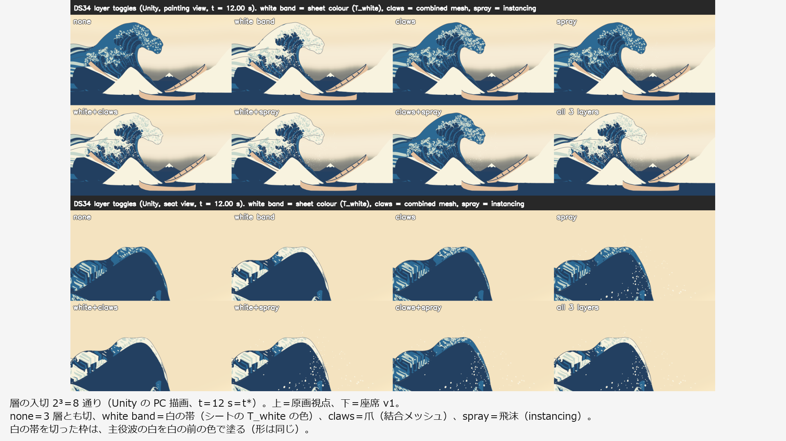
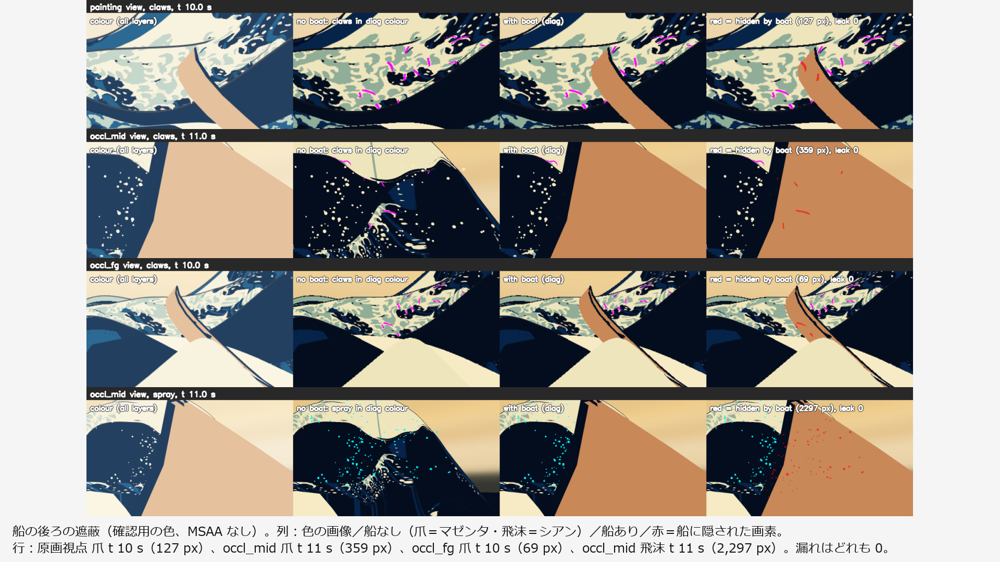

# 設計34：帯・爪・小飛沫を別々に Unity で再生する ― 白の帯（シートの色）・爪（結合メッシュ）・飛沫（instancing）を一つの時計で再生し、層ごとに入切する

日付：2026-09-30／状態：**閉じた（最小の受入は満たした）**。修正は 0 回（Q26 の 1 回は使っていない。第 6 節）。進行役の独立の検査で必須の指摘はなかった。ただし、**原画視点の色区の回帰は「爪の層を除いた読み」で後退なしとした（進行役の決定、Q24。利用者の決定ではない）**。爪を色区 ID に入れた読みでは 133・134・267 が合格から不合格になり、限界として記録した（第 2.3 節・第 3.4 節・第 5 節の 1）。証拠の種類は次のとおり。**HMD 実機の結果ではない。利用者は確かめていない。**

- Unity 6000.4.3f1 の batchmode の PC オフスクリーン描画（RTX 3080、Direct3D11、Editor の `camera.Render`）
- Editor の batch の Play モード（dt 0.02 s 固定、814 フレーム）。PC ビルドの実時間の再生ではない
- 美術優先28修正01 の評価器（`ds30b_tstar_regress.py`。設計29修正01・設計30・設計31 と同じ 3 つの読み）
- 進行役の独立の検査（Unity の部のコードを使わずに書いた numpy/OpenCV。動画から取り出したコマと、保存された画像を自分で数えた。リポジトリの外。コードと出力の写しは Git 対象外の `Unity/Build/Design/34/indep_check/`）
- 記録の道具 `ds34_record.py`（描画の報告と Play モードの CSV の数え直し、両側の読みの色区の表、証拠の図）

番号の前提：

- 対象：[段階9までの実行計画](../Design/Stage9_Plan_2026-09-26_ja.md)（以下「計画」）§2.2 の設計34。
- 引き継ぎ：
  - [設計33](Design_33_ja.md)：爪の帯 148 本（25,052 頂点・48,032 三角形）。頂点のコマの表 `ds33_claw_frames_f32.bin`（`6e762988…`）と並び `ds33_claw_layout.json`（`715b20d6…`）。C072 の輪の断面の回りなどの限界。
  - [設計31](Design_31_ja.md)：白の出現 T\_white（`ds31_twhite_r32f.bin` `5ffc93de…`）、飛沫 v0（186 個、`ds31_spray_frames.bin` `9db0a428…`）、場面 `DS31_WhiteSpray.unity`（`2c36fd24…`）、飛沫を ID に入れない読み。
  - [設計30](Design_30_ja.md)：単発再生（`DS30SinglePlayback`・`DS30SheetPlayer`）、周りの海、t\* の回帰の道具 `ds30b_tstar_regress.py`。
  - [設計29修正01](Design_29_修正01_ja.md)：t\* の原画視点の値と、色区の項目の「両側の読み」（採った読み）。
  - [設計28修正01](Design_28_修正01_ja.md)：時間曲線 `timewarp_F_final.json`（`627815c7…`）。
- 時間の上限：Q26 の日程（計画 §2.6 の表）で 3 時間。範囲は最小の受入だけで、修正は 1 回まで。
  - 実績（ファイルの時刻。`ds34_record_counts.json` の `file_times`）：`Unity/Build/Design/34` の作成 01:02:16（Unity の部の `_started.txt` の最初の行も 01:02:16）。Unity の部は 01:11:52 に再開した（`_started.txt` の「再開（Try again）」。`Tools/GWWaveGen/ds34` と `Unity/Assets/GreatWave/Design34` の作成も同じ時刻）。Unity の実行 01:18:48〜01:33:43、Unity の部の最後の出力 01:35:30（`README_interface.txt`）。進行役の独立の検査 01:39:57〜02:04:06（`indep_check` の作成と `ic34_summary.json`）。記録 02:07〜02:22 ごろ（終わりは `Unity/Build/Design/34/READY_TO_COMMIT.txt` の時刻）。
  - 01:02〜02:04 は約 1 時間、記録を含めて約 1 時間 20 分で、上限の内。
  - Unity の部の README の「01:05〜02:55」は誤り（第 10 節の 2）。
  - 1 回の計算：いちばん長いのは評価器で 3 分 41 秒。Unity の 1 回は 26 s（主）・65 s（動画 8 本）・18 s（入切の一覧）・19 s（Play モード）で、30 分の上限より十分短い。
- 修正回数：0。受入の値を決める前の検査の道具の直し 2 つ（第 6 節）は数えない。
- 対応するバックログ（計画 §2.2）：148（奥の線が透けない、事前検査）、206（記録）。値は [metrics.json](../Evidence/Design/34/metrics.json) の `backlog`。
- 読むだけで変えていないもの：設計27・30・31・33 のファイル。Unity の部は守る 21 ファイルの SHA-256 を前後で比べ、変わったファイル 0（`protectedUnchanged = true`）。独立の検査も git で追跡中のファイルの変更 0 を確かめた。
- 座標と単位：m・s。t は体験の時刻（コマ k は t = k/30 s、421 コマ）、t\* は t = 12 s（コマ 360）。t ≥ 12 s は t\* の保持。τ は物理の時刻で t\* = 0。表示の px は PaintingCam v1 の 1920 × 1080。
- 使っていないもの：参照モデル（D20：爪に参照モデルを使わない）、利用者の解算、写真のフォルダー、Blender・Houdini、git の操作。爪形分析のフォルダー（`G:\research\爪形分析`）は、作る部も検査も開いていない。記録の時のコミットの一覧の点検でだけ、そのフォルダーのファイルの SHA-256 を読み取りのみで計算し、コミットするファイルと同じものが 0 であることを確かめた（第 9 節）。

## 見るもの

| 層の入切（t\*、上＝原画視点・下＝座席 v1） | 船の後ろの遮蔽（赤＝船に隠された画素） |
| --- | --- |
|  |  |

図は Unity の PC 描画と、その数値のグラフである（t\* の爪の見え方の図だけは、進行役の独立の検査が Unity の動画から取り出したコマ）。1920 × 1080 の枠に収め、余白に日本語の説明を入れた。元の図の英語の見出しは残した（元の図は Git 対象外の `Unity/Build/Design/34/unity3/fig/`）。

3 層と入切：

- [層の入切 t\*](../Evidence/Design/34/fig_ds34_toggles_t12p00.png)・[層の入切 t 11.5 s](../Evidence/Design/34/fig_ds34_toggles_t11p50.png)：2³ = 8 通り（none／white band／claws／spray／white+claws／white+spray／claws+spray／all 3 layers）。white band＝白の帯（シートの T\_white の色）、claws＝爪、spray＝飛沫。白の帯を切った枠は、主役波の白を白の前の色で塗る（形は同じ）。
- [Play モードの入切](../Evidence/Design/34/fig_ds34_playmode_toggles.png)：Play モードで t\* の保持の間に、① 3 層すべて → ② 白の帯を切る → ③ 爪も切る → ④ 3 層とも切る、と順に切った原画視点。⑤ 入れ直した画像は ① と SHA-256 まで同じ。
- [4 視点 × 4 時刻](../Evidence/Design/34/fig_ds34_stills_sheet.png)：原画視点・座席 v1・座席の低い視点・座席から波の方向 × t 8・10・11・12 s（3 層すべて）。

一つの時計・遮蔽・両眼：

- [一つの時計](../Evidence/Design/34/fig_ds34_one_clock.png)：上＝同じコマ k での爪の根元とシートの結び付けの点の距離の最大（青、148 本、Unity の GPU で読み戻したシート）と、爪を 1 コマ早く（赤）・遅く（マゼンタ）した対照。黒の横線が 1 mm（105）、緑の縦線が t\*。下＝層ごとのコマのずれ（採取と Play モード）。
- [船の後ろの遮蔽](../Evidence/Design/34/fig_ds34_occlusion_boat.png)：列＝色の画像／船なし（爪＝マゼンタ・飛沫＝シアン）／船あり／赤＝船に隠された画素。行＝原画視点の爪 t 10 s（127 px）、確認用の視点 occl\_mid の爪 t 11 s（359 px）、occl\_fg の爪 t 10 s（69 px）、occl\_mid の飛沫 t 11 s（2,297 px）。漏れはどれも 0。
- [Mock の両眼](../Evidence/Design/34/fig_ds34_mock_stereo.png)：カメラを ±32 mm ずらして 2 回描いた L・R と、爪の確認用の色の画像と画素数（座席 t 11・12 s、原画視点 t 11・12 s）。

見え方と限界：

- [t\* の爪の見え方](../Evidence/Design/34/fig_ds34_claws_tstar_look.png)（進行役の独立の検査の切り抜き）：上＝白の帯だけと 3 層すべて。下＝唇の先の拡大（白の帯だけ／3 層すべて／爪だけ）。
- [色区 133 の最悪の点](../Evidence/Design/34/fig_ds34_colour133_claws.png)：爪を色区 ID に入れると、爪の白と淡い水色の帯が焼き込みの模様の上に重なる。

動画（1920 × 1080、30 fps、421 コマ、t 0〜14 s）：

- [層の並べ 原画視点](../Evidence/Design/34/ds34_layers_2x2_painting_30fps.mp4)（2,426,050 バイト）・[層の並べ 座席 v1](../Evidence/Design/34/ds34_layers_2x2_seat_30fps.mp4)（865,052 バイト）：左上＝白の帯だけ、右上＝爪だけ、左下＝飛沫だけ、右下＝3 層すべて。
- [3 層すべて 原画視点](../Evidence/Design/34/ds34_all_painting_30fps.mp4)（2,631,515 バイト）。

数値：

- [metrics.json](../Evidence/Design/34/metrics.json)：最小の受入 `acceptance`（Unity の部・独立の検査・記録の数え直しの 3 つの読み）、バックログ `backlog`、回帰 `regression`、採った読み `decision`、修正 `revisions`、独立の検査 `independent`、食い違い `discrepancies_ja`、渡し先 `handoffs`、時間 `time`
- Unity の部の写し：[ds34\_unity3\_metrics.json](../Evidence/Design/34/ds34_unity3_metrics.json)、描画の報告のまとめ [ds34\_render\_report\_summary.json](../Evidence/Design/34/ds34_render_report_summary.json)、評価器 [ds34\_tstar\_regress.json](../Evidence/Design/34/ds34_tstar_regress.json)・両側の読み [爪なし](../Evidence/Design/34/ds34_tstar_sym_no_claws.json)／[爪あり](../Evidence/Design/34/ds34_tstar_sym_claws.json)
- 進行役の独立の検査：[まとめ](../Evidence/Design/34/ds34_indep_summary.json)、A1 [爪と飛沫の動画](../Evidence/Design/34/ds34_indep_a1_video.json)・[シートの上の縁](../Evidence/Design/34/ds34_indep_a1_sheet_line.json)・[根元](../Evidence/Design/34/ds34_indep_a1_roots.json)・[白の帯を切った時](../Evidence/Design/34/ds34_indep_a1_sheet_whiteoff.json)、A2 [画像の数え直し](../Evidence/Design/34/ds34_indep_a2_recount.json)・[動画](../Evidence/Design/34/ds34_indep_a2_video.json)、A3 [両眼](../Evidence/Design/34/ds34_indep_a3_stereo.json)
- 記録の時に数えたもの：[ds34\_record\_counts.json](../Evidence/Design/34/ds34_record_counts.json)
- 実行条件と SHA-256：[run.json](../Evidence/Design/34/run.json)

**見え方の注意**：爪は白（上面）と淡い水色（縁の側面と下面）の平塗りで、線はない。色と線は段階7（設計36・38）。崩壊での消失は作らない（Q11）。

## 0. 結論

1. **3 層を一つの時計で再生し、層ごとに入切できる場面を作った**（`DS34_ThreeLayers.unity`。設計31 の場面の写しから確認用の印を除いた）。
   - 白の帯＝主役波のシートの T\_white の色。切るときは、主役波のレンダラーの `_DS27Tau` だけを −1e7 にする（白の比べにしか使わないので形は変わらない）。
   - 爪＝`DS34ClawPlayer`：設計33 の 148 本を 1 つの結合メッシュ（25,052 頂点、白 12,600・淡い水色 35,432 三角形）にし、421 コマの表の頂点を差し替える。
   - 飛沫＝設計31 の `DS31InstancedParticles`（186 個）。
   - 入切は `DS34LayerSet`（Play モードでは数字キー 1・2・3）。
2. **最小の受入はすべて合格。** Unity の部・進行役の独立の検査・記録の数え直しの 3 つの読みで判定は同じ。
   - 3 層の時刻のずれ 0：採取の 421 コマで、爪のコマ − k = 0、飛沫のコマ − k ≤ 2.8e-14、主役波の τ − τ(t) = 0。爪の根元とシートの結び付けの点の距離は、Unity の GPU で読み戻したシートで全コマ・148 本の最大 0.0216 mm（1 コマずらすと t\* までの中央値 392.3 mm）。Play モードの 814 フレームでフレーム番号の食い違い 0。独立の検査は、動画から取り出したコマで、爪・飛沫・シートがどれもずれ 0 で最もよく合うことを確かめた。
   - 船体の後ろの爪・飛沫が船に隠れる：7 視点 × 7 時刻 × 2 層で、船に隠されるべき画素 爪 1,989 px・飛沫 4,207 px のうち、見えてしまう画素（漏れ）0。原画視点では爪 286 px が船の後ろにあり、どれも隠れた。
   - Mock の両眼で爪の画素数の左右差 < 10%：判定に使った 9 組で最大 1.04%。
3. **PS VR2 の H1・H3・H4 は保留**（導入は利用者の手）。Mock の両眼（PC でカメラを 2 回描く代理）で代えた。爪のシェーダーは立体の変種（STEREO\_INSTANCING\_ON）のコンパイルだけ確かめた。
4. **回帰（計画 §2.0）：輪郭は後退なし、色区は読みで分かれる。**
   - 爪なしの 10 枚は設計31 と SHA-256 まで同じ（値も同じ）。
   - 輪郭（爪を ID に入れた読み）：78／130／131 は 3.0289／3.5131／3.0431 px、132 σ12 は 3.7552 px で変わらない。72 σ24 p95 は 4.0075 → 3.8423 px で良くなった（設計33 の numpy の値と同じ）。
   - 色区：爪の層を除いたシートの色で測る読み（採った読み）では、設計31・29修正01 と同じで後退なし。**爪を色区 ID に入れた両側の読みでは、133（0.718 → 8.837 px）・134（0.634 → 9.399 px）・267（白の 20 px 以上の帯 0 → 49）が合格 → 不合格**。79・270 は悪くなるが合格のまま。
5. **採った読み（第 3.4 節）**：色区は爪の層を除いて測り、爪を入れた読みの 3 項目の不合格は限界として設計36（限定色）・設計38（輪郭線）・仕上げ33 へ渡す（Unity の部の推奨、進行役の決定、Q24）。原画の爪はすでに焼き込みの色面の模様として描かれていて、3D の爪はその上に重なるため。独立の検査は「この読みは設計31 の飛沫の除き方より弱い」と述べ、その指摘も記録した。
6. **t\* の見え方（限界）**：爪の白い上面は白の帯に溶け、淡い水色の細い弧が焼き込みの模様の上に重なって見える。空へ出る爪の先 4〜6 本が、唇の輪郭に小さな白い欠けを作る（進行役の独立の検査の目視）。形の欠陥ではない（根元はシートの上、浮き・点滅・遮蔽の漏れはない）。
7. **バックログ**：148 は事前検査として記録（爪・飛沫は不透明で深度を書く。船の後ろの漏れ 0）、206 は記録（t\* の原画視点で爪の画素 L 15,310・R 15,287 px。射線の値は設計33 の numpy を引き継ぎ）。

---

## 1. 目的

設計書の設計34 は、段階6 の白の帯・爪・小飛沫を、別々の層として Unity で再生する番号である。計画 §2.2 の成果物は次のとおり。

- 3 層（白の帯＝シートの色、爪＝結合メッシュ、飛沫＝instancing）を一つの時計で再生し、層ごとに入切できるシーン。
- 座席 v1 と原画視点、船の後ろでの遮蔽の確認図。Mock の両眼画像。PS VR2 が導入済みなら H1・H3・H4（計画 §3.2）。

最小の受入は、3 層の時刻のずれ 0（同じフレーム番号で描く）、船体の後ろの爪・飛沫が船に隠れること、Mock の両眼で爪の画素数の左右差 < 10% である。Q26 により、この番号は最小の受入だけを満たし、修正は 1 回までとした。原画視点に爪を足すので、計画 §2.0 の回帰の規則（評価器を回し、合格した項目を後退させない）がかかる。

---

## 2. 表

### 2.1 場面と 3 層（`ds34_unity3_metrics.json`・`ds34_render_report_summary.json`）

| 層 | 中身 | 時刻の受け取り方 | 切り方 |
| --- | --- | --- | --- |
| 白の帯 | 主役波のシートの色（設計31 の T\_white の白の時間場、DS27 NPR White） | 再生器 `DS30SinglePlayback`（実行順 50）が τ(t) を渡す | `DS34LayerSet` が主役波のレンダラーの MaterialPropertyBlock の `_DS27Tau` を −1e7 にし、終態が白の所を白の前の色（藍中）で塗る |
| 爪 | `DS34ClawPlayer`（実行順 60）：148 本、25,052 頂点・48,032 三角形（部分メッシュ 白 12,600／淡い水色 35,432）、421 コマ・30 Hz、読み込み 0.97 s | 同じ GWClock の秒。コマの格子の上ならそのコマ、間は隣の 2 コマの線形補間 | レンダラーを切る |
| 飛沫 | 設計31 の `DS31InstancedParticles`（186 個、1 回の instancing の描画） | 同じ GWClock の秒 | 描画を止める |
| 入切 | `DS34LayerSet`（実行順 70）。各層が受け取った時刻を記録する | — | Play モードでは数字キー 1・2・3（新しい Input System） |

- 爪のシェーダー `GreatWave/Design34/DS34 Claw Unlit`：不透明・無照明の平塗り、Cull Off、ZWrite On。色区 ID の描画では白＝赤、淡い水色＝緑。
- 遮蔽の検査だけに使う `DS34 Depth Only`（色を書かず深度だけ）。作品には使わない。
- 描画の報告の爪のコマの表の SHA-256 は設計33 と同じ（`6e762988…`）。飛沫は `9db0a428…`。

### 2.2 最小の受入（3 つの読み）

| 項目 | Unity の部 | 進行役の独立の検査 | 記録の数え直し |
| --- | --- | --- | --- |
| A1 3 層の時刻のずれ 0 | 採取 421 コマ：爪のコマ − k 最大 0、飛沫 2.842e-14、主役波 τ − τ(t) 0。爪の根元とシートの点 最大 0.0216 mm（三角形の面まで 0.0118 mm）。対照：爪を 1 コマ早めると t\* までのコマの最大の中央値 392.3 mm。Play モード 814 フレーム：フレーム番号の食い違い 爪 0・飛沫 0、爪・飛沫の t と再生器の t の差 最大 4.73e-7 s、主役波 τ − τ(t) 0 | 爪だけの動画と設計33 の表の numpy の投影：k 198〜348 でずれ 0 が最もよく合う（k 300 の IoU：0 で 0.496、±1 で 0.162〜0.175、±2 で 0.119〜0.121）。飛沫：k 270〜348 でずれ 0。シート（自前の復号と投影）の上の縁と、白の帯だけの動画の輪郭の線の内側の縁：25 コマのうち k 210〜348 の 24 コマでずれ 0（平均の差 0.392〜0.813 px、±1 で 0.992〜4.603 px）。設計33 の根元は自前のシートの上に中央値 0.000 mm、±1 では 128.2〜152.9 mm。白の帯を切った動画でもずれ 0（0.674〜0.873 px）。Play モードの CSV：t の差 最大 4.73e-7 s、入切の旗とレンダラーの状態の食い違い 0 | 描画の報告：爪のコマ − k 最大 0、飛沫 2.842e-14、根元 最大 0.0216 mm、根元の表 148 本。Play モードの CSV 814 行：t の差 4.731e-7 s、爪のコマ − 30t 最大 9.91e-5 コマ、主役波 τ と時間曲線の τ の差 0、入切の旗とレンダラーの食い違い 0・0、入切の順 111 → 011 → 001 → 000 → 111（白・爪・飛沫。t 12 s の保持の間） |
| A2 船体の後ろの爪・飛沫が船に隠れる | 7 視点 × 7 時刻（t 8〜12 s）× 2 層 = 98 例、各 4 回の描画。船に隠されるべき画素 爪 1,989 px・飛沫 4,207 px、漏れ 0。確認用の色が普通の描画に出る画素 0 | 保存された 6 組の 4 回の描画を数え直し、隠れた画素と漏れが報告と一致（爪 127・4・359・69、飛沫 2,297・203、漏れ 0）。船があるときだけ消える画素はどれも船の後ろの範囲の中。原画視点の動画（k 240〜420 を 3 コマおき、61 コマ）：numpy の爪の投影が船に重なる 1,465 px（k 282〜315）はすべて描かれていない。船の上に描かれた爪の画素 5（孤立した 1 画素で、爪の投影がない所。動画の圧縮の雑音）。座席の動画 0・0 | 描画の報告の足し直し：爪 1,989 px・飛沫 4,207 px、漏れ 0、誤検出 0。原画視点の爪 286 px（t 10 s 127 px、t 10.5 s 159 px） |
| A3 Mock の両眼の爪の画素数の左右差 < 10% | 両目とも 500 px 以上の 9 組（座席 t 10〜13 s、原画視点 t 9〜13 s）で最大 1.04%（原画視点 t 10 s：5,983／6,046 px）。500 px 未満の 3 組は記録のみ（座席 t 8 s 0／0、座席 t 9 s 272／267、原画視点 t 8 s 373／373 px）。飛沫の左右差 最大 0.89%（記録） | 確認用の色の画像を自分で数えて、原画視点 t 10／11／12 s で 1.07／0.44／0.15 %、座席 t 10／11／12 s で 0.95／0.90／0.21 %。numpy の ±32 mm の投影（遮蔽なし）で最大 0.21 %（原画視点 t 9〜12 s） | 描画の報告の足し直し：12 組のうち判定 9 組、最大 1.042% |

- 採取は、コマ k ごとに 1 つの t = k/30 を再生器・爪・飛沫へ渡して描く。飛沫の 2.8e-14 コマは、飛沫の報告の値 (t − t0)·hz の倍精度の丸め。
- Play モードでは、爪と飛沫は GWClock の秒（float）を読むので、再生器の t（double）と最大 4.7e-7 s ずれる。フレーム番号は同じ。
- 独立の検査の A1 のシートの読みで、単純な縁の合わせ（chamfer）は k 216〜252 で +1 を選んだ（`ic34_a1_sheet_early.json`）。原因は、輪郭の線がシルエットの外側に描かれることで、時刻のずれではない。線の内側の縁で比べ直すと、上のとおりずれ 0。

### 2.3 回帰（原画視点 t\*。計画 §2.0。単位は表示の px）

輪郭（評価器。爪を ID に入れた読み）：

| 項目 | 設計29修正01（基準） | 爪なし（設計31 と同じ画像） | 爪あり |
| --- | --- | --- | --- |
| 78／130／131 | 3.0289／3.5131／3.0431 | 同じ（差 0） | 同じ（差 0） |
| 132 σ12 最大 | 3.7552 | 3.7552 | 3.7552 |
| 72 σ24 p95 | 4.0075 | 4.0075 | **3.8423**（−0.1652） |

色区（評価器の両側の読み。設計29修正01 が採った読み。原画の空と描画の空から 2 px 以内を色区の項目から除く。`ds34_tstar_sym_no_claws.json`・`ds34_tstar_sym_claws.json`）：

| 項目 | 28修正01（両側の読み） | 爪なし（＝設計31・29修正01） | **爪あり** | 判定 |
| --- | --- | --- | --- | --- |
| 73 内側の水色（藍中）の境界 | 0.303 | 0.303 | 0.303 | 合格のまま |
| 77 下側から始まる縞の下端 | 1.17 | 0.867 | 0.867 | 合格のまま |
| 79 左側の白 | 0.34 | 0.357 | 1.608 | 合格のまま（悪くなる） |
| 118 主要な縞の両側 | 0.453 | 0.867 | 0.867 | 合格のまま |
| 120 | 0.288 | 0.288 | 0.288 | 合格のまま |
| 133 左から上へ続く白 | 0.402 | 0.718 | **8.837** | **合格 → 不合格** |
| 134 白帯 | 0.661 | 0.634 | **9.399** | **合格 → 不合格** |
| 175 藍濃／藍中／淡い水色の境界 | 0.309／1.625／0.865 | 0.428／0.472／0.978 | 0.428／0.472／22.382 | もともと不合格（淡い水色が悪くなる） |
| 263 内側から下方へ続く水色の下部 | 0.301 | 0.25 | 0.25 | 合格のまま |
| 270 白と水色の境 | 0.563 | 0.563 | 3.04 | 合格のまま（悪くなる） |
| 270 淡い水色の記録の読み | 0.661 | 0.634 | 8.65 | 記録の読み |
| 266 水色の平塗り（淡い水色の 20 px 以上の帯） | 合格（帯 0） | 合格（帯 0） | 評価器の判定は合格（帯 12） | 合格のまま（記録） |
| 267 白の平塗り（白の 20 px 以上の帯） | 0 | 0 | **49** | **合格 → 不合格** |

- 採った読み（第 3.4 節）：色区の項目は、爪の層を除いたシートの色で測る。この読みでは、爪なしの 10 枚が設計31 と SHA-256 まで同じなので、値も設計31・29修正01 と同じで後退なし。
- 評価器の定義のままの読み（Unity の部の metrics.json の表）では、爪なし → 爪ありで 133 は 0.718 → 8.837、134 は 8.996 → 9.399（爪なしで不合格。29修正01 がこの読みを採らなかった値）、175 は 16.052 → 22.382、79 は 1.012 → 1.608、270 の記録の読みは 1.028 → 8.65。267 の帯は 7 → 55。
- 133 の最悪の点は表示 (751, 188)。爪の白と淡い水色の帯が、焼き込みの色面の白と淡い水色の模様の上に重なり、描画の白が真値の白の境界から離れる（[図](../Evidence/Design/34/fig_ds34_colour133_claws.png)）。
- 212（空の上の方、表示の行 0〜379）は別には評価していない（設計30・31 と同じ）。記録の時に数えると、爪は爪なしの画像で空だった画素のうち、行 0〜379 の 117 px を変える（原画視点の色の画像で爪が変える画素は全体で 10,952 px、そのうち行 0〜379 が 8,640 px。ほとんどは波の本体の上）。69・70（右の船と波の高さ）：主役波と船は変わらない（爪なしの画像が設計31 と同じ）。

### 2.4 記録のみ（バックログと、計画の最小の外）

| 項目 | 値 | 出典 |
| --- | --- | --- |
| 148 奥の線が透けない（事前検査） | 爪・飛沫は不透明（ZWrite On・ZTest LEqual）。遮蔽の検査の③で、船の後ろの爪・飛沫が透ける画素 0。爪の後ろの藍の線が透けないことは設計38 で測る | `ds34_unity3_metrics.json` の `record_only` |
| 206（記録） | 原画視点 t\* の Unity の爪の画素 L 15,310・R 15,287 px（Mock の片目ずつ、遮蔽あり）。射線の検査の値は設計33 の numpy の再投影（骨格と一覧の中心線の対称 Hausdorff 中央値 0.62 px・最大 3.9 px）を引き継ぎ、Unity では測り直していない | 同じ |
| 視点ごとの船の後ろの爪の画素（隠れた数） | 原画視点 286、座席 v1 0、座席の低い視点 8、座席から波の方向 10、確認用の視点 occl\_mid 477・occl\_fg 149・occl\_left 1,059 | `ds34_render_report_summary.json` の `occlusion` |
| 視点ごとの船の後ろの飛沫の画素 | occl\_mid 4,207 だけ。原画視点・座席の 3 視点・occl\_fg・occl\_left では 0 | 同じ |
| 爪のシェーダー | 3 つの変種（キーワードなし・INSTANCING\_ON・STEREO\_INSTANCING\_ON）の頂点と断片がすべてコンパイル。STEREO\_INSTANCING\_ON の頂点の出力に SV\_RenderTargetArrayIndex がある | `ds34_unity3_metrics.json` の `shader_checks` |
| Play モードの入切の画像 | ⑤ すべて入れ直した画像は ① と SHA-256 まで同じ | `ds34_record_counts.json` の `playmode_images_same` |

---

## 3. 作り方と、採ったもの

### 3.1 場面（`Unity/Assets/GreatWave/Design34/`）

- `Scenes/DS34_ThreeLayers.unity`：設計31 の `DS31_WhiteSpray.unity` の写し。飛沫 v0 だけを残し、確認用の印（born・trace・spray\_diag）を除いた。主役波・周りの海・船・時計は設計30・31 のまま。
- `Scripts/DS34ClawPlayer.cs`：設計33 の並び（`ds33_claw_layout.json`）から結合メッシュを作り、コマの表の頂点を差し替える。見えないコマの爪は設計33 の表で根元の点に潰してあり、面積 0 で描かれない。読み込むときに SHA-256 を確かめる。
- `Scripts/DS34LayerSet.cs`：3 層の入切と、各層が受け取った時刻の記録。
- `Shaders/DS34_Claw_Unlit.shader`・`Shaders/DS34_DepthOnly.shader`（第 2.1 節）。
- `Editor/DS34Render.cs`：採取・静止画・動画・入切の一覧・遮蔽・両眼・シェーダーの検査と、守るファイルの SHA-256 の比べ。`Editor/DS34PlayModeCheck.cs`：Play モードの確認。
- 爪と飛沫の表は、Git 対象外の `Unity/Build/Design/33/claws/` と `Unity/Build/Design/31/spray/` から読む（第 8 節）。

### 3.2 一つの時計

- `DS30SinglePlayback`（実行順 50）が GWClock に t を書き、主役波と海へ τ(t) を渡す。爪と飛沫（実行順 60）は同じ GWClock の秒を読む。`DS34LayerSet`（実行順 70）が入切を当て、各層が受け取った時刻を記録する。
- 採取（`DS34Render`）は、コマ k ごとに同じ t = k/30 を再生器・爪・飛沫へ渡す。
- 爪の t がコマの格子の上（|t·hz − k| < 1e-4）ならそのコマを使い、間は隣の 2 コマの線形補間（Play モードの 90 Hz など）。

### 3.3 検査の作り

- **A1**：採取の 421 コマで、各層のコマ番号と τ を記録する。さらに、主役波のシートの頂点を Unity の GPU から読み戻し（設計27 の `DS27KeyposeCapture`）、各爪の根元（最初の頂点）と、設計32 の sheet\_rc の点（描画と同じ三角形の上）の距離を測る。対照として爪を 1 コマずらした距離も測る。
- **A2**：同じコマで 4 回描く（確認用の色、MSAA なし）。① その層だけ、② その層＋船（深度だけ）、③ 場面全体、④ 場面全体から船を消す。①にあって②にない画素＝船の後ろ、そのうち④で見える画素＝船に隠されるべき画素、そのうち③で見える画素＝漏れ。
  - 視点は原画視点・座席 v1・座席の低い視点・座席から波の方向と、確認用の occl\_mid・occl\_fg・occl\_left（舷の外、上端の 0.35 m 下。場面には保存していない）。
- **A3**：座席 v1 と原画視点のカメラを右の向きへ ±32 mm（IPD 64 mm）ずらして 2 回描き、確認用の色の爪の画素を数える（場面全体、遮蔽あり、MSAA なし）。両目とも 500 px 以上のコマを判定に使う（生え始めの爪は小さい）。
- **Play モード**：Editor の batch で Play モードに入り（dt 0.02 s）、814 フレームの時刻・コマ・入切の旗を CSV に書く。t\* の保持に入って 1.5 s の間に、層の入切を 4 回行い、それぞれ原画視点を撮る。
- **回帰**：原画視点 t\* の色と ID の画像を、爪なし（`t28_white`）と爪あり（`t28_claws`）で撮り、評価器（`ds30b_tstar_regress.py`）で 3 つの読み（定義のまま・大きな輪郭の関門・両側の読み）を測る。

### 3.4 採った読みと、落とした案（Q24。進行役の判断で、利用者の決定ではない）

- **採った**：
  - 輪郭の項目は、爪を ID に入れて測る（後退なし。72 は良くなる）。
  - **色区の項目は、爪の層を除いたシートの色（爪なしの色区 ID）で測る**（後退なし）。爪を色区 ID に入れた両側の読みの 133・134・267 の合格 → 不合格は、限界として記録し、設計36・設計38・仕上げ33 へ渡す（Unity の部の推奨の読み。Unity の部は 133 だけを挙げ、134 は独立の検査の指摘、267 は記録の時に加えた）。
  - 理由：
    1. 原画の爪は、29修正01 の焼き込みの色面の白と淡い水色の模様として、すでにシートに描かれている。設計33 の 3D の爪はその上に重なるので、評価器の色区の真値（爪の層を持たない）とは二重になる。
    2. 爪の色（今は白と淡い水色の平塗り）を色区と模様に合わせることは、設計36（限定色。最小の受入に「爪の内側の影の色（第6節の定義）が一覧の色区と合う。265・266/267 の回帰なし」がある）の作業である。この番号の Q26 の 1 回の修正で先に行うと、番号の順を崩す。
    3. 輪郭の項目は爪を入れても後退がない。
  - 修正の回は開かない（第 6 節）。
- **落とした (1)**：爪を色区 ID に入れた読みを関門にして、この番号を統合しないこと（計画 §2.0 の文言どおりの読み）。段階6 の再生の土台（設計35 の比較）が止まり、直す作業は設計36 の中身になる。
- **落とした (2)**：Q26 の 1 回の修正で、爪の色を下の色区の色に合わせるか、3D の爪がある所の焼き込みの爪の模様を消すこと。設計36 の作業の先取りで、爪の見え方の決め方（焼き込みと 3D の爪のどちらを主にするか）も決まっていない。
- **落とした (3)**：評価器に爪と飛沫の層を分けるマスクを入れること（設計31 からの引き継ぎ）。層の入切の 2 つの読みで代え、マスクは設計39 へ送った。
- **反対の意見（進行役の独立の検査）**：この読みは設計31 の飛沫の除き方より弱い。飛沫が変えた ID の画素は主に空（14,000 のうち 13,979）だったが、爪は波の本体の上にあり、原画視点の色を本当に変える。この指摘のとおり、爪を入れた原画視点の色は「爪の見え方の問題」として設計36・38 と仕上げ33 で直す。設計40 の最小の受入（CP1 と 26修正01 の合格項目の回帰なし）は、爪を入れた原画視点で判定することになるので、それまでに 133・134・267 を戻すか、設計40 で改めて決める。

---

## 4. 関門

| 最小の受入 | 基準 | 値 | 判定 |
| --- | --- | --- | --- |
| 3 層の時刻のずれ 0 | 同じフレーム番号で描く | 採取 421 コマで爪 0・飛沫 2.8e-14 コマ・τ 0。根元とシート 最大 0.0216 mm。Play モード 814 フレームで食い違い 0。動画からの独立の検査でずれ 0 | 合格（PC の描画と Editor の Play モード） |
| 船体の後ろの爪・飛沫が船に隠れる | 船の後ろの画素が見えない | 隠されるべき画素 爪 1,989・飛沫 4,207 px のうち漏れ 0。原画視点の動画で船に重なる爪 1,465 px がすべて描かれていない | 合格（PC の描画） |
| Mock の両眼で爪の画素数の左右差 | < 10% | 判定 9 組で最大 1.04%（独立の検査 1.07%） | 合格（PC の代理） |
| 計画 §2.0 の回帰：輪郭 | 後退なし | 78／130／131・132 σ12 は差 0、72 σ24 p95 −0.1652 px | 合格 |
| 計画 §2.0 の回帰：色区 | 後退なし | 爪の層を除いた読みで差 0（採った読み）。爪を入れた両側の読みで 133・134・267 が不合格 | 採った読みで合格（進行役の決定、Q24）。爪を入れた読みは限界（第 5 節の 1） |
| 148（事前検査） | — | 船の後ろの透け 0 | 記録 |
| 206 | — | L 15,310・R 15,287 px | 記録 |
| HMD（PS VR2）の H1・H3・H4 | — | — | 保留（導入は利用者の手） |

---

## 5. 限界

1. **爪を色区 ID に入れた原画視点では、色区 133・134・267 が不合格になる**（両側の読みで 133 0.718 → 8.837 px、134 0.634 → 9.399 px、267 の白の帯 0 → 49）。79（0.357 → 1.608 px）・270（0.563 → 3.04 px）は悪くなるが合格のまま、175 の淡い水色の境界は 0.978 → 22.382 px（もともと不合格）。爪の帯が焼き込みの模様の上に重なるためで、この番号は爪の層を除いた読みで閉じた（第 3.4 節）。設計36（爪の色）・設計38（爪の縁の線）・仕上げ33（爪の幅と色区への当てはめ）、133・134 の項目の群は仕上げ28。設計40 までに戻すか、設計40 で改めて決める。
2. **t\* の爪の見え方**：爪の白い上面は白の帯に溶け、淡い水色の細い弧が焼き込みの模様の上に重なって、読める爪というより模様の乱れに見える。空へ出る爪の先 4〜6 本が、唇の輪郭に小さな白い欠けを作る（進行役の独立の検査の目視。[図](../Evidence/Design/34/fig_ds34_claws_tstar_look.png)）。焼き込みの爪と 3D の爪の役割の分け方を、設計36・38 と仕上げ33 で決める。
3. **Mock の両眼は PC の代理**で、立体の描画経路（SPI）ではない。爪のシェーダーは立体の変種のコンパイルだけ確かめた。**PS VR2 の H1・H3・H4 は保留**。
4. **Play モードは Editor の batch（dt 0.02 s 固定）だけ**で確かめた。実時間の PC ビルドと HMD では確かめていない。爪と飛沫は GWClock の秒（float）を読むので、再生器の t（double）と最大 4.7e-7 s ずれる（フレーム番号は同じ）。
5. **遮蔽の検査の偏り**：飛沫が船に隠される画素は確認用の視点 occl\_mid だけにある（原画視点と座席の 3 視点では、飛沫が船の後ろに来ない）。座席 v1 では船の後ろの爪も 0 で、座席 v1 の遮蔽の確認は中身がない（独立の検査の動画の読みでも 0・0）。確認用の視点は場面に保存していない。
6. **206 は Unity で測り直していない**（射線の値は設計33 の numpy の再投影）。
7. **色と線は仮**（爪は白と淡い水色の平塗りで線なし）。設計36・38。
8. **評価器は層を分けられない**。この番号は、爪を ID に入れる／入れない 2 つの読みで代えた。層を除くマスクは設計39。
9. **場面は Git 対象外の出力に依存する**：爪の表（設計33 の `Unity/Build/Design/33/claws/`。コマの表は 126,562,704 バイト）と飛沫の表（設計31 の `Unity/Build/Design/31/spray/`）。無ければ設計31・33 の生成器で作り直す（第 8 節）。
10. **設計33 の帯の限界はそのまま**（コマの表の SHA-256 が同じ）：C072 の輪の断面の回り（コマ 203・218）、t\* で帯の内側の縁が折れ返る爪 48 本、根元の白の円の角ばり。Unity の近くの見え方では測っていない。仕上げ33・段階7。
11. **崩壊での消失は作らない（Q11）**。
12. **記録と実際の値の食い違い**（`metrics.json` の `discrepancies_ja`。第 10 節）：Unity の部の README の作業時間、Unity の部の色区の表の読みの混ざり、267 の見落とし、原画視点の船の後ろの爪の時刻（README の「t 10〜11.5 s」はファイルでは t 10 s と 10.5 s だけ）、独立の検査の報告の範囲の丸め。

---

## 6. 修正の記録（Q26：修正は 1 回まで）

| 回 | 変えたこと | 結果 |
| --- | --- | --- |
| Unity の部の最初の始まり（01:02） | — | 01:11:52 に再開した（`_started.txt`。途中で止まった理由はファイルに残っていない） |
| Unity の部（01:11〜01:35） | 場面・爪の再生器・入切・シェーダー・検査の道具。受入の値を決める前に、検査の道具を 2 つ直した（数えない）：① 最初の採取（01:18:48〜01:19:20）で確認用の視点が水の中にあり、漏れの検査が水面に隠されて自明になっていたので、舷の外・上端の 0.35 m 下へ置き直し、④（船を消した場面全体）を足した。② 入切の一覧のファイル名が大文字・小文字で入切を表していて、Windows で 8 通りが 4 枚に重なったので、W0／W1 の形に直して一覧だけ撮り直した（01:33）。古い図は `main/_stale_run1/` に退けた | 最小の受入はすべて合格。色区の回帰の読みを進行役に問うた |
| 進行役の独立の検査（01:39〜02:04） | 自前のコードで、動画から取り出したコマ・保存された画像・Play モードの CSV を読んだ | pass = true、必須の指摘 0。記録の直し 2 つ（134 も不合格になる、作業時間の誤り） |
| 修正 | なし | Q26 の 1 回を使わなかった。理由：最小の受入はすべて合格で、残った問題（爪を入れた色区の不合格）は爪の色と線の作業（設計36・38）の中身であり、1 回の修正で直すと番号の順を崩す（第 3.4 節。進行役の判断、Q24・Q26） |

---

## 7. 引き継ぎ

**設計35**（数量・大きさ・寿命を変えて比較する）

- 3 版の比較は、この場面（`DS34_ThreeLayers`）と `DS34ClawPlayer`・`DS31InstancedParticles` の上で行う。最大密度の性能の代理（1920×1080 と立体の代理）。
- 層の入切（`DS34LayerSet`）で、層ごとの負荷を分けて測れる。

**設計36**（限定色）

- 爪の色を色区と焼き込みの模様に合わせ、爪を色区 ID に入れた読みの 133・134・267 を合格へ戻す（設計36 の最小の受入「爪の内側の影の色（第6節の定義）が一覧の色区と合う。265・266/267 の回帰なし」）。焼き込みの爪と 3D の爪の役割の分け方を決める。
- 評価器は、爪なし（`t28_white`）と爪あり（`t28_claws`）の 2 つを回す（`ds30b_tstar_regress.py --sets t28_claws,t28_white`）。

**設計38**（輪郭線）：爪の縁の線（今は線なし）。空へ出る爪が唇の輪郭に作る白い欠け。148 の奥の線。Mock の両眼で線画素の左右差。

**設計39**：評価器に飛沫と爪の層を分けるマスク（設計31 からの引き継ぎ）。

**設計40**：CP1 と 26修正01 の合格項目の回帰なしは、爪を入れた原画視点で判定することになる。133・134・267 がそれまでに戻っていなければ、ここで改めて決める。

**仕上げ33**：爪の幅と色区への当てはめ。設計33 から引き継いだ C072 の断面の回りと帯の折れ返り。

**仕上げ28**：133・134 の項目の群（計画 §5）。

**設計08〜10（PS VR2 の導入の後）**：H1・H3・H4。立体の描画経路で爪・飛沫が両眼で一致し、頭を動かしても点滅しないこと、船上から見た高さ・厚み・内側空間。

---

## 8. 再現

リポジトリの根で行う。前提（どれも Git 対象外）：設計33 の `Unity/Build/Design/33/claws/`（爪の表。無ければ `ds33_claw_rig.py` → `ds33_claw_anim.py`）、設計31 の `Unity/Build/Design/31/spray/`・`white/`（飛沫と T\_white）、設計28修正01 の時間曲線（`Unity/Build/Design/28R01F/F_final/`）、設計29修正01 の焼き込み、設計30 の周りの海。

道具は Unity 6000.4.3f1（batchmode、`Unity/Build/unity.lock` で排他）、`py -3.10`（numpy 2.2.6、OpenCV 4.12.0、Pillow 12.0.0）、ffmpeg。コマンドの全体と SHA-256 は [run.json](../Evidence/Design/34/run.json)。

1. Unity の部（どの回も 30 分より十分短い）：
   - `powershell -NoProfile -ExecutionPolicy Bypass -File Tools/GWWaveGen/ds34/run_ds34_unity.ps1 -Method GreatWave.Design34.EditorTools.DS34Render.Render -Log main2 -Extra "-ds34Out G:/Unity/GreatWave_2026_Fresh/Unity/Build/Design/34/unity3/main -ds34Skip video"`（26 s。場面・採取・静止画・入切・遮蔽・両眼・シェーダー）
   - 同じ `-Log video -Extra "-ds34Out G:/Unity/GreatWave_2026_Fresh/Unity/Build/Design/34/unity3/video_run -ds34Skip scene,t28,timing,stills,toggles,occl,stereo,shader"`（65 s、動画 8 本）
   - 同じ `-Log toggles -Extra "-ds34Out G:/Unity/GreatWave_2026_Fresh/Unity/Build/Design/34/unity3/toggles_run -ds34Skip scene,t28,timing,stills,occl,stereo,shader,video"`（18 s、入切の一覧）
   - `... -NoQuit -Method GreatWave.Design34.EditorTools.DS34PlayModeCheck.Run -Log playmode -Extra "-ds34Out G:/Unity/GreatWave_2026_Fresh/Unity/Build/Design/34/unity3/playmode"`（19 s）
   - `py -3.10 -B Tools/GWWaveGen/ds30/ds30b_tstar_regress.py --out Unity/Build/Design/34/unity3/main --sets t28_claws,t28_white`（評価器、3 分 41 秒）
   - `py -3.10 -B Tools/GWWaveGen/ds34/ds34u3_evidence.py`（図・並べ動画・Unity の部の metrics.json・run.json）
2. 記録：`py -3.10 -B Tools/GWWaveGen/ds34/ds34_record.py`（約 1 s）
   - Unity の部の run.json のコードの SHA-256 といまのコード、爪のコマの表の SHA-256 と設計33 を照合する（違えば止まる）。
   - 描画の報告・Play モードの CSV・両側の読みの色区・212 の目安を数え（`Unity/Build/Design/34/record/ds34_record_counts.json`）、図を 1920 × 1080 に収め、動画と JSON を写し、metrics.json・run.json を書く。
3. 進行役の独立の検査は、リポジトリの外のコード（写しは `Unity/Build/Design/34/indep_check/ic34_*.py`）。

---

## 9. 出典と、この番号で作ったもの

- 仕様：計画 §2.2 の設計34、§2.0（回帰の規則）、§2.3 の設計36・38・40（渡し先の受入）、§2.6（Q26 の日程）、§3.2（H1〜H7）。[制作手順](../Workflow/Production_Workflow_ja.md)の Q11（崩壊を作らない）・Q24・Q26。設計29修正01（両側の読み）・設計31（飛沫を ID に入れない読み）・設計33 の記録の引き継ぎ。
- 読むだけ：番号の前提の「引き継ぎ」の出力と場面。SHA-256 は run.json の `inputs_sha256`・`protected_files`。
- 参照モデル・利用者の解算・写真のフォルダーは使っていない。爪形分析のフォルダーの画像とマスクは、作る部も検査も開いておらず、どこにも複製していない。
- コミットの一覧の点検（リポジトリの外の一時の道具。記録の時）：
  - コミットする 51 ファイルのうち文字のファイルから、禁止の場所の文字列を探した。見つかったのは、この文書の「爪形分析のフォルダーは開いていない」という 3 か所の記述だけ。
  - 爪形分析のフォルダーの 5,368 ファイル（画像・マスクらしい拡張子 4,108）の SHA-256 を読み取りのみで計算し、コミットするファイルと同じものは 0。
  - Git の ignore にかかるファイルは 0。
- この番号で作ったもの（コミットするもの）：
  - Unity の資産 `Unity/Assets/GreatWave/Design34/`（と各 .meta）：場面 `Scenes/DS34_ThreeLayers.unity`、`Scripts/DS34ClawPlayer.cs`・`DS34LayerSet.cs`、`Shaders/DS34_Claw_Unlit.shader`・`DS34_DepthOnly.shader`、`Editor/DS34Render.cs`・`DS34PlayModeCheck.cs`。場面が参照するほかの資産（設計27・30・31 のスクリプトと材質、美術優先のスクリプト・材質・網）はすでにコミット済み（場面の GUID 24 個を .meta から引いて確かめた）。
  - 道具 `Tools/GWWaveGen/ds34/`：`run_ds34_unity.ps1`（Unity の 1 回の実行）、`ds34u3_evidence.py`（Unity の部の図と数値）、`ds34_record.py`（記録）。
  - 証拠 `Docs/Evidence/Design/34/`：1920 × 1080 の PNG 9 枚、MP4 3 本（最大 2,631,515 バイト）、JSON 14（Unity の部の写し 4、描画の報告のまとめ 1、独立の検査の写し 8、記録の数え 1）、metrics.json、run.json。
  - 記録：この文書と、進捗の表の設計34 の行。
- コミットしないもの（Git 対象外の `Unity/Build/Design/34/`）：Unity の部の全出力 `unity3/`（採取の画像、動画 8 本と並べ動画、評価器の画像、Play モードの CSV と画像、ログ、古い回 `main/_stale_run1/`）、進行役の独立の検査のコードと出力の写し `indep_check/`（動画から取り出したコマを含む）、記録の数え `record/`。

---

## 10. レビュー対応

Unity の部の出力の後、進行役の独立の検査を通した。最小の受入の不合格はなく、進行役の判定は pass = true・必須の指摘 0。記録の時に、両側の読みの色区の表と作業の時刻を数え直した。

| # | 指摘（出どころ） | 対応 |
| --- | --- | --- |
| 1（独立の検査。記録の直し） | 色区の後退は 1 項目ではなく 2 項目。設計29修正01 が採った両側の読みでは、爪を色区 ID に入れると 133（0.718 → 8.837 px）と 134（0.634 → 9.399 px）がどちらも合格 → 不合格。Unity の部が 134 を「もともと不合格」としたのは、定義のままの読みの 8.996 px で、29修正01 が採らなかった読み | 第 2.3 節の表を両側の読みの値（`tstar_sym.json`）で作り、134 を限界に入れた（第 5 節の 1） |
| 2（独立の検査。記録の直し） | Unity の部の README の作業時間 01:05〜02:55 は誤り。ファイルでは開始 01:02、終わり 01:35 ごろ | 番号の前提の時間をファイルの時刻で書いた |
| 3（記録の時） | 両側の読みでは 267（白の平塗り）も、白の 20 px 以上の帯が 0 → 49 になる（Unity の部と独立の検査の報告に出ていない。`tstar_sym.json` の `verdicts_kp_sym` の 267 は定義のままの判定の写し） | 第 2.3 節・第 5 節の 1 に加え、渡し先を設計36（265・266/267 の回帰なし）とした |
| 4（Unity の部。決定の依頼） | 色区は爪の層を除いて測る読みを推奨。受け入れないなら必須の直し | 採った（第 3.4 節。進行役の決定、Q24）。落とした案と、独立の検査の反対の意見を記録した |
| 5（独立の検査。記録） | t\* の見え方：爪の白い上面は白の帯に溶け、淡い水色の細い弧が焼き込みの模様の上に重なる。空へ出る爪 4〜6 本が唇の輪郭に小さな白い欠け。形の欠陥ではない | 第 5 節の 2。見え方の図を証拠に入れた。設計36・38・仕上げ33 |
| 6（独立の検査・Unity の部。記録） | H1・H3・H4 は保留。Mock の両眼は 2 回の描画。Play モードは Editor の batch（dt 0.02 s）だけ | 第 5 節の 3・4 |
| 7（独立の検査・Unity の部。記録） | 飛沫の遮蔽は occl\_mid だけ。座席の動画では船の近くに爪がなく、座席の遮蔽の確認は中身がない。確認用の視点は場面にない | 第 5 節の 5。記録の時に視点ごとの数を表にした（第 2.4 節） |
| 8（Unity の部。記録） | 206 は Unity で測り直していない。色と線は仮 | 第 5 節の 6・7 |
| 9（Unity の部。記録） | 設計31 から渡された評価器の飛沫の層の除外は入れず、層の入切の 2 つの読みで代えた | 第 3.4 節の落とした (3)、第 7 節の設計39 |
| 10（記録の時） | Unity の部の README の「原画視点では爪 286 px が船の後ろ（t 10〜11.5 s）」は、描画の報告では t 10 s の 127 px と t 10.5 s の 159 px だけ | 第 2.2 節の値をファイルから書いた |
| 11（記録の時） | 独立の検査の報告の値の丸め：シートの上の縁の「±1 で 0.99〜4.9 px」はファイルで 0.992〜4.603 px、「25／25 で d＝0」は 25 コマのうち 24 コマ（k 354 は d＝−1、差 0.05 px）、根元の「±1 で約 130〜150 mm」は 128.2〜152.9 mm、「爪のコマの位相 ≤ 9.7e-5」は記録の数え直しで 9.91e-5 コマ | 第 2.2 節はファイルの値で書いた。判定は変わらない |

- 独立の検査で合格したもの：A1（動画から取り出したコマで、爪・飛沫・シートのずれ 0。根元が自前のシートの上に 0.000 mm）、A2（保存された画像の数え直しと、原画視点の動画で船に重なる爪がすべて描かれていないこと）、A3（自前の数えで最大 1.07%）、守るファイルが変わっていないこと。
- 独立の検査の報告のうち、ファイルに残っていない値（動画を見た印象）は、目視の結論だけを書いた。
