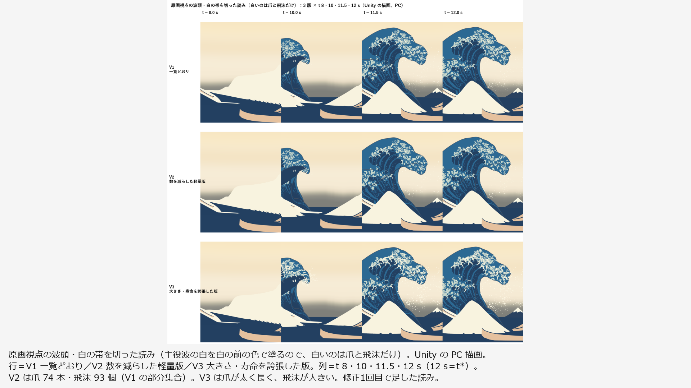
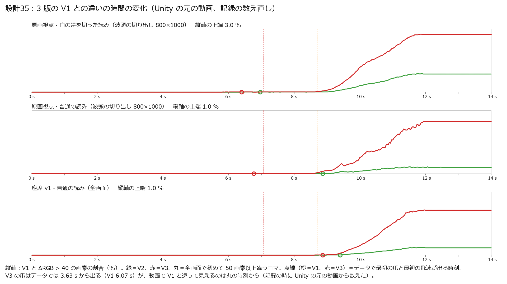

# 設計35：数量・大きさ・寿命を変えて比較する ― 爪と飛沫の 3 版（一覧どおり・数を減らした軽量版・大きさと寿命を誇張した版）の並べ動画と、最大密度の区間の性能

日付：2026-09-30／状態：**閉じた（最小の受入は満たした）**。修正は 1 回（Q26 の上限。第 6 節）。進行役の独立の検査で必須の指摘はなかった。**既定の版は V1（一覧どおり）とした（進行役の決定、Q24。利用者の決定ではない。利用者の段階6確認で変えられる）**。ただし、A1（3 版の違いが動画で分かる）は、**白の帯を切った読みの段で合格した**もので、利用者が見る普通の読みでは V2（軽量版）と V1 の違いは小さい（第 5 節の 2）。証拠の種類は次のとおり。**HMD 実機の結果ではない。対象 PC（RTX3060）の実測でもない。利用者は確かめていない。**

- データ：numpy の生成器（`ds35_variants.py`）
- 動画と静止画：Unity 6000.4.3f1 の Editor の batchmode の PC オフスクリーン描画（camera.Render、8×MSAA、RTX 3080。設計34 の動画と同じ描き方）
- 性能：Release（BuildOptions.None）の Windows プレイヤーを見えるウィンドウで動かした PC の実測（RTX 3080、Direct3D11、i7-12700K）
- 進行役の独立の検査（variants の部のコードを使わずに書いた numpy/OpenCV。動画から取り出したコマ、データ、プレイヤーの生の計時を自分で読んだ。リポジトリの外。コードの写しと、記録の時に回し直した出力は Git 対象外の `Unity/Build/Design/35/indep_check/`）
- 記録の道具 `ds35_record.py`（性能の生の計時・データ・動画の数え直し、証拠の図）

番号の前提：

- 対象：[段階9までの実行計画](../Design/Stage9_Plan_2026-09-26_ja.md)（以下「計画」）§2.2 の設計35。
- 引き継ぎ：
  - [設計34](Design_34_ja.md)：場面 `DS34_ThreeLayers.unity`（`2bf63bff…`）、爪の再生 `DS34ClawPlayer`、層の入切 `DS34LayerSet`。色区 133・134・267 の読みの決定（爪の層を除いた読みを採り、爪を入れた読みの不合格は限界）。
  - [設計33](Design_33_ja.md)：爪の帯 148 本（25,052 頂点・48,032 三角形）。コマの表 `ds33_claw_frames_f32.bin`（`6e762988…`）、生成器 `ds33_claw_anim.py`。
  - [設計31](Design_31_ja.md)：飛沫 v0（186 個、`ds31_spray_frames.bin` `9db0a428…`）と逆弾道の検査 `check_paths`（150）。
  - [設計28修正01](Design_28_修正01_ja.md)：時間曲線（`627815c7…`）。
- 時間の上限：Q26 の日程（計画 §2.6 の表）で 2 時間。範囲は最小の受入だけで、修正は 1 回まで。
  - 実績（ファイルの時刻。`ds35_record_counts.json` の `file_times`）：`Unity/Build/Design/35` の作成 02:10:21、`Tools/GWWaveGen/ds35` の作成 02:11:47、最初のデータ（V2）02:12:08。プレイヤーの測定 02:21:28〜02:23:48（run1）・02:24:15〜02:26:36（run2）。修正1回目の `DS35Build.cs` の変更 02:28:13。variants の部の最後の出力 02:34:45（metrics.json・run.json）。進行役の独立の検査 02:36:49〜02:42:38（作業の場所の作成と最後のファイル）。記録 02:47〜03:06 ごろ（終わりは `Unity/Build/Design/35/READY_TO_COMMIT.txt` の時刻）。
  - 02:10〜02:43 は約 35 分、記録を含めて約 1 時間で、上限の内。
  - variants の部の README の「02:04〜02:36」は、ファイルでは確かめられない（最初のファイルは 02:10:21。02:36 は README を書いた 02:34 にはまだ来ていない時刻。第 10 節の 4）。
  - 1 回の計算：いちばん長いのは V3 の生成（`ds35_variants_exag.log` で 241.7 s、飛沫の作り直し 125.5 s）とプレイヤーの 1 回（run1 149.8 s・run2 149.6 s）で、30 分の上限より十分短い。Unity の batchmode はビルド 16 s・動画 55 s・動画（白の帯を切った読み）33 s（README）。
- 修正回数：1（A1。第 6 節）。受入の値を決める前の生成器の直し 1 つ（V3 の飛沫の作り直し）は数えない。
- 対応するバックログ（計画 §2.2）：81・112・199（代理の測定。判定は RTX3060 の実測がないので保留）。値は [metrics.json](../Evidence/Design/35/metrics.json) の `backlog`。
- D2＝(b)（Q9：美術主導の rig）なので、設計書の設計35 の「物理版」はない。3 版はどれも美術主導の rig の上の数・大きさ・寿命の違いで、物理の解算の版は作っていない（V3 の飛沫は設計31 と同じ逆弾道で解き直したが、美術の配置 p\* へ着く誘導で、流体の解算ではない）。
- 読むだけで変えていないもの：設計30・31・33・34 のスクリプト・シェーダー・場面、設計33 の爪、設計31 の飛沫。ビルドと動画の描画の前後で守るファイルの SHA-256 が同じ（`protectedUnchanged = true`。設計34 の場面は `2bf63bff…` のまま）。ビルドの間だけ `enableFrameTimingStats` を true にし、終わりに戻した（ProjectSettings の戻したファイル 0）。
- 座標と単位：m・s。t は体験の時刻（コマ k は t = k/30 s、421 コマ）、t\* は t = 12 s（コマ 360）。t ≥ 12 s は t\* の保持。τ は物理の時刻で t\* = 0。
- 使っていないもの：参照モデル（D20：爪に参照モデルを使わない）、利用者の解算、写真のフォルダー、Blender・Houdini、git の操作。爪形分析のフォルダー（`G:\research\爪形分析`）は、作る部も検査も開いていない。記録の時のコミットの一覧の点検でだけ、そのフォルダーのファイルの大きさと SHA-256 を読み取りのみで調べ、コミットするファイルと同じものが 0 であることを確かめた（第 9 節）。

## 見るもの

| 原画視点の波頭・白の帯を切った読み（白いのは爪と飛沫だけ） | V1 との違いの時間の変化（動画から） |
| --- | --- |
|  |  |

図は Unity の PC 描画と、その数値のグラフである。1920 × 1080 の枠に収め、余白に日本語の説明を入れた（元の図は Git 対象外の `Unity/Build/Design/35/variants/fig/`）。

動画（1920 × 1080、30 fps、421 コマ、t 0〜14 s。Unity の PC 描画を並べたもの）：

- [3 版の波頭の並べ](../Evidence/Design/35/ds35_variants_3up_painting_crest_30fps.mp4)（2,650,913 バイト）：原画視点の波頭（切り出し x 430〜1230・y 70〜710 を 0.8 倍）を 3 版横並び（左から V1・V2・V3）× 2 段（上＝普通の読み、下＝白の帯を切った読み）。**A1 の判定に使った動画。**
- [3 版の 2×2 原画視点](../Evidence/Design/35/ds35_variants_2x2_painting_30fps.mp4)（2,059,739 バイト）・[3 版の 2×2 座席 v1](../Evidence/Design/35/ds35_variants_2x2_seat_30fps.mp4)（894,720 バイト）：左上 V1・右上 V2・左下 V3・右下 説明。説明の「最初の爪 3.6 s」はデータの値で、動画ではその時刻に V3 の爪は画面に見えない（第 5 節の 1）。

3 版の見え方：

- [原画視点の波頭・白の帯を切った読み](../Evidence/Design/35/fig_ds35_stills_painting_crest_w0.png)・[普通の読み](../Evidence/Design/35/fig_ds35_stills_painting_crest.png)・[座席 v1](../Evidence/Design/35/fig_ds35_stills_seat.png)：3 版 × t 8・10・11.5・12 s。
- [独立の検査の普通の読みの違い](../Evidence/Design/35/fig_ds35_indep_v2_normal_t12.png)：動画から取り出した t 12 s の原画視点で、V1 と違う画素を赤で示した V2・V3。V2 の違いはほとんどが根元の前の飛沫の点。
- [違いの時間の変化](../Evidence/Design/35/fig_ds35_diff_curve.png)：3 版の元の動画をコマごとに比べた V1 との違いの割合と、データで最初の爪・飛沫が出る時刻。

性能：

- [最大密度の区間](../Evidence/Design/35/fig_ds35_density_window.png)：描く三角形の数の時間の変化と、測った区間 t 11〜12 s。
- [性能の表](../Evidence/Design/35/fig_ds35_perf_table.png)・[プレイヤーの画面](../Evidence/Design/35/fig_ds35_player_screens.png)（測定の後に t 11.95 s で撮った。立体の代理の L・R を含む）。

数値：

- [metrics.json](../Evidence/Design/35/metrics.json)：最小の受入 `acceptance`（variants の部・記録の数え直し）、バックログ `backlog`、回帰 `regression`、V3 の中身 `v3`、V2 の部分集合 `v2_subset`、SHA-256 の照合 `sha_consistency`、修正 `fix_rounds`、時間 `time`
- variants の部の写し：[ds35\_variants\_metrics.json](../Evidence/Design/35/ds35_variants_metrics.json)、[ds35\_variants\_summary.json](../Evidence/Design/35/ds35_variants_summary.json)（3 版の規則と数）、[ds35\_build\_report.json](../Evidence/Design/35/ds35_build_report.json)、[ds35\_video\_reports.json](../Evidence/Design/35/ds35_video_reports.json)
- 記録の数え直し：[ds35\_perf\_recount.json](../Evidence/Design/35/ds35_perf_recount.json)（性能の表）、[ds35\_record\_counts.json](../Evidence/Design/35/ds35_record_counts.json)（データ・動画・時刻）
- 進行役の独立の検査（記録の時に回し直した出力）：[性能](../Evidence/Design/35/ds35_indep_perf_out.txt)・[データ](../Evidence/Design/35/ds35_indep_data_out.txt)・[コマの違い](../Evidence/Design/35/ds35_indep_a1_diff_out.txt)・[違いの時間の変化](../Evidence/Design/35/ds35_indep_a1_curve_out.txt)
- 実行条件と SHA-256：[run.json](../Evidence/Design/35/run.json)

**見え方の注意**：爪は白（上面）と淡い水色（縁の側面と下面）の平塗り、飛沫は白の小球で、線はない。色と線は段階7（設計36・38）。崩壊での消失は作らない（Q11）。

## 0. 結論

1. **爪と飛沫の 3 版を作った**（白の帯＝主役波のシートの T\_white の色は 3 版とも同じ）。
   - V1 一覧どおり：設計33 の爪 148 本と設計31 の飛沫 186 個をそのまま使う（データの SHA-256 は設計34 と同じ）。
   - V2 数を減らした軽量版：爪 74 本（主爪と支を 1 群とし、t\* の長さの大きい順）、飛沫 93 個（t\* の半径の大きい順）。どちらも V1 の値のままの部分集合（記録の数え直しで爪の差の最大 0 m、飛沫 93 列がすべて V1 にある）。
   - V3 大きさ・寿命を誇張した版：爪を設計33 の生成器と同じ式で作り直し、幅・厚み・根元の白の円 × 1.5、長さ × 1.3、成長の始まり × 1.6。最初の爪 3.633 s（V1 6.067 s）、t\* の爪の広がりの中央値 × 1.304。根元の点は V1 と同じ（全コマで差 0 m）。飛沫は半径 × 1.6 で、放出を早めて逆弾道を解き直した（設計31 の 150 の違反 0）。最初の飛沫 7.067 s（V1 8.70 s）。
2. **最小の受入はすべて合格。**
   - A1 3 版の違いが動画で分かる：3 版を並べた動画 3 本。t 11.5・12 s の原画視点の波頭（800 × 1000）で V1 と違う画素（ΔRGB > 40）の割合は、白の帯を切った読みで V2 0.83〜0.85%・V3 2.61〜2.73%（動画から。記録の数え直し）。普通の読みでは V2 0.10〜0.11%・V3 0.71〜0.82%。
   - A2 最大密度で 1920 × 1080 の平均 ≥ 30 fps・95% ≤ 33.3 ms（代理）：3 版 × 2 視点で最小 1,850.1 fps、間隔の p95 最大 0.935 ms、33.3 ms を超えるフレーム 0。
   - A3 立体の代理の GPU p95 ≤ 8.9 ms：最大 1.151 ms（V3）。
   - A4 既定の版を 1 つ決める：V1（第 3.3 節）。
3. **PS VR2 の H1・H3・H4 は保留**（導入は利用者の手）。立体は 2 カメラの代理（2064 × 2208 × 2、4×MSAA）で、SPI・PS VR2・Link は含まない。バックログ 81・112・199 は RTX 3080 の代理の値を記録し、本判定（RTX3060）は保留。
4. **回帰（計画 §2.0）**：既定の V1 は設計34 と同じデータ（爪のコマの表 `6e762988…`・飛沫 `9db0a428…`）なので、原画視点は変わっておらず、評価器は回していない（設計34 の値を引き継ぐ）。V2・V3 は比べるための版で、原画視点へ統合しない。
5. **限界（第 5 節）**：V3 の爪が 2.4 s 早く出ることはデータの上の話で、動画で V3 が V1 と違って見え始めるのは 6.4 s（原画視点・白の帯を切った読み）からで、V1 の最初の爪（6.07 s）とほとんど変わらない。普通の読みの V2 は違いが小さく、A1 の合格は白の帯を切った読みの段による（その基準は修正の回で決めた）。V3 の飛沫の寿命は、見えている時間で平均 × 1.16（中央値 × 1.0）にとどまる。

---

## 1. 目的

設計書の設計35 は、段階6 の白波（爪と飛沫）の数量・大きさ・寿命を変えた版を比べ、見え方と負荷から既定の版を決める番号である。計画 §2.2 の成果物は次のとおり。

- 3 版（一覧どおり／数を減らした軽量版／大きさ・寿命を誇張した版）の並べ動画。
- 最大密度の区間の性能（RTX3080 の代理。1920 × 1080 と立体の代理、美術優先32 の計測器）。
- D2＝(b) なので設計書の「物理版」はない。その旨を記録する。

最小の受入は、3 版の違いが動画で分かること、最大密度で 1920 × 1080 の平均 ≥ 30 fps・95% ≤ 33.3 ms（代理）、立体の代理の GPU p95 ≤ 8.9 ms、既定の版を 1 つ決めること（利用者の段階6確認で変えられる）である。Q26 により、この番号は最小の受入だけを満たし、修正は 1 回までとした。

---

## 2. 表

### 2.1 3 版（`ds35_variants_metrics.json` の `variants`・`v3_details`、記録の数え直し `ds35_record_counts.json` の `data`）

| | V1 一覧どおり | V2 数を減らした軽量版 | V3 大きさ・寿命を誇張した版 |
| --- | --- | --- | --- |
| 爪 | 148 本（25,052 頂点・48,032 三角形） | 74 本（12,430 頂点・23,824 三角形） | 148 本（25,052 頂点・48,032 三角形） |
| 飛沫 | 186 個 | 93 個 | 186 個 |
| 作り方 | 設計33 の爪と設計31 の飛沫をそのまま参照 | 爪：主爪（parent なし）と支を 1 群とし、主爪の t\* の 3 次元の長さの大きい順に 148 × 0.5 = 74 本に届くまで。飛沫：t\* の半径の大きい順に 186 × 0.5 = 93 個 | 爪：`ds33_claw_anim` と同じ式で、輪の幅・厚み・根元の白の円 × 1.5、根元からの (行, 列) のずれと局所のずれ × 1.3、成長の始まり τ\_start × 1.6（t = 0 の τ ＋ 0.3 s で頭打ち）。飛沫：半径 × 1.6、放出を早めて逆弾道を解き直す（第 2.2 節） |
| 最初の爪 | 6.067 s | 6.333 s | 3.633 s |
| 爪が全部見える | 10.167 s | 10.167 s | 9.433 s |
| 最初の飛沫 | 8.700 s | 8.700 s | 7.067 s |
| 飛沫が全部そろう | 10.633 s | 10.633 s | 10.567 s |
| t\* の爪の広がりの中央値（根元の点から最も遠い頂点まで） | 0.674 m | 0.997 m（長い群を残した） | 0.894 m（V1 の × 1.304 が中央値。p10 1.278・p90 1.344） |
| t\* の飛沫の半径 | 0.030〜0.111 m | 0.052〜0.111 m | 0.048〜0.178 m |
| 描く三角形の最大（爪 ＋ 飛沫 × 80） | 62,912 | 31,264 | 62,912 |
| データの SHA-256（爪のコマの表／飛沫） | `6e762988…`／`9db0a428…`（設計33・31 と同じ） | `4a8134af…`／`1470762f…` | `077d262c…`／`6217c1da…` |

- 最初の爪・飛沫の時刻と数は、variants の部・独立の検査・記録の数え直しの 3 つの読みで同じ。
- V2 の部分集合（記録の数え直し）：74 本の爪の頂点の V1 との差の最大 0 m、飛沫の 93 列がすべて V1 の列と完全に一致し、t\* の半径の大きい 93 個と同じ集合。
- V3 の爪の根元の点（各爪の最初の頂点。`ds33_claw_anim` の頂点の並びで根元の点）は、全コマで V1 との差 0 m（記録の数え直し）。variants の部の「根元のずれ 0 m」と同じ。
- V3 の爪の t\* の弧の長さの中央値 0.816 → 1.078 m（比 1.303。variants の部）。V3 の成長の時間（τ）は 0.62／1.45／2.68 s → 0.99／2.31／4.28 s（最小／中央値／最大。variants の部）。爪のコマの NaN 0。

### 2.2 V3 の飛沫（`v3_details.spray_info`、記録の数え直し `v3.record_recount_spray`）

- 規則：粒ごとに、同じ放出の頂点から、放出の時刻 τ\_e を × 1.6・× 1.4・× 1.2・× 1.0（同じ τ\_e で半径だけ大きく解き直す）の順に p\* への逆弾道を解き、設計31 の `check_paths`（150：水面へ引き戻されない・水の側へ入らない・放出の後に離れる）を通る最初のものを採る。どれも通らなければ元の経路（半径 × 1.6）、それも通らなければ元の経路と元の半径。
- 結果：× 1.6 が 61 個、× 1.4 が 5 個、× 1.2 が 15 個、同じ τ\_e で半径だけ 104 個、元の経路と元の半径 1 個（半径 × 1.6 では 150 に触れた）。150 の違反 0（`chosen_contact`・`chosen_inside`・`chosen_never_left` 0）。
- t\* の位置は V1 と同じ（差 0 m）。t\* の半径の比は 1.0〜1.6（中央値 1.6）。
- 寿命の比の読み：
  - variants の部の「寿命の比 中央値 1.0・平均 1.22」は、放出の時刻の倍率（1.6・1.4・1.2・1.0）の平均。
  - 記録の数え直しで、t\* まで（コマ 0〜360）に見えている時間（半径 > 0 のコマ）の比は中央値 1.0・平均 1.163、長くなった粒 81・同じ 105・短くなった粒 0。見えている時間は V1 1.40／2.50／3.33 s → V3 1.47／2.73／4.97 s（最小／中央値／最大）。t\* の後の保持を含む全コマの比は平均 1.088。

### 2.3 最小の受入（variants の部・記録の数え直し・独立の検査）

| 項目 | variants の部 | 記録の数え直し | 進行役の独立の検査 |
| --- | --- | --- | --- |
| A1 3 版の違いが動画で分かる | 静止画（PNG）で V1 と ΔRGB > 40 の画素の割合。原画視点の波頭 800 × 1000、t 11.5／12 s：V2 普通 0.148／0.133%・白の帯を切った読み 0.804／0.828%、V3 普通 0.982／1.037%・白を切った読み 2.578／2.685%。座席（全画面）：V2 0.116／0.122%、V3 0.714／0.744%。基準（修正1回目で決めた）：V2・V3 のそれぞれが t 11.5・12 s の原画視点で、普通の読みか白の帯を切った読みのどちらかで 0.5% 以上 | 元の動画（H.264）をコマごとに比べた同じ割合。原画視点の波頭 800 × 1000、t 11.5／12 s：V2 普通 0.108／0.100%・白を切った読み 0.833／0.855%、V3 普通 0.714／0.823%・白を切った読み 2.609／2.728%。座席（全画面）：V2 0.113／0.115%、V3 0.678／0.712%。全画面で初めて 50 画素以上違うコマ：V3 は 6.400 s（白を切った読み）・6.767 s（普通）・8.867 s（座席）、V2 は 6.967・8.867・9.400 s | 並べ動画の 6 つの枠を元の動画と照らし、列が V1・V2・V3、段が普通の読み・白の帯を切った読みであることを確かめた。白の帯を切った段で V2 の爪が少なく、V3 の爪が太く長いのが見て取れる。普通の段では V3 の大きい飛沫と爪が見えるが、V2 の違いは根元の前の飛沫の点がほとんど（[図](../Evidence/Design/35/fig_ds35_indep_v2_normal_t12.png)）。最初に 50 画素以上違うコマ：V3 6.4・6.77・8.87 s、V2 6.97・8.87・9.4 s（`ds35_indep_a1_curve_out.txt`） |
| A2 最大密度で 1920 × 1080 の平均 ≥ 30 fps・95% ≤ 33.3 ms | 第 2.4 節の表 | 生の計時から数え直して同じ値（第 2.4 節） | 同じ値（`ds35_indep_perf_out.txt`）。最も長いフレーム 5.47 ms |
| A3 立体の代理の GPU p95 ≤ 8.9 ms | 1.123（V1）・1.112（V2）・1.151（V3）ms | 同じ | 同じ。この条件の GPU の 0 の値は 0.8〜4.3% で、間隔の p95 も最大 1.246 ms なので、0 を除くことに結果は左右されない |
| A4 既定の版を 1 つ決める | V1（第 3.3 節） | — | 同じ読み。V1 のデータの SHA-256 が設計34 の描画の報告と同じ |

- 記録の数え直しの動画の値は、独立の検査の報告の値（800 × 1000 の切り出し）と小数第 3 位まで同じ。variants の部の値（静止画）との差は動画の圧縮による。
- 独立の検査の保存されたコード `ic35_a1_diff.py` は並べ動画の切り出し（800 × 640、y 70〜710）で数えていて、その出力（`ds35_indep_a1_diff_out.txt` の `crest%`）は報告の値と違う（第 10 節の 5）。

### 2.4 性能（最大密度の区間 t 11〜12 s。`ds35_perf_recount.json`）

Release プレイヤー `DS35Perf.exe`（BuildOptions.None、品質 Ultra・4×MSAA、垂直同期なし、1920 × 1080 のウィンドウ）で、条件ごとに助走 3 s・測定 12 s、2 回（run1・run2。どちらも終了コード 0、`isDebugBuild` false）。数え方は美術優先32 と同じ：各条件で先頭 8 件を除き、フレームの開始時刻の差を間隔、平均 fps＝1000／間隔の平均、GPU は 0 より大きく 1 s 未満の値の p95。fps は 2 回の小さい方、p95 は大きい方。

| 版 | 1920 × 1080・原画視点 | 1920 × 1080・座席 v1 | 立体の代理・座席 v1（2064 × 2208 × 2、4×MSAA） |
| --- | --- | --- | --- |
| V1 | 1,902.8 fps・間隔 p95 0.935 ms・最大 2.90 ms | 2,040.3 fps・0.838 ms・最大 4.42 ms | GPU p95 1.123 ms（間隔 p95 1.236 ms） |
| V2 | 2,098.5 fps・0.888 ms・最大 5.47 ms | 2,412.0 fps・0.736 ms・最大 3.38 ms | 1.112 ms（1.204 ms） |
| V3 | 1,850.1 fps・0.927 ms・最大 3.60 ms | 2,060.5 fps・0.833 ms・最大 3.09 ms | 1.151 ms（1.246 ms） |

- 33.3 ms を超えるフレームはどの条件も 0。
- 測った時刻は 11.000〜12.000 s の中。飛沫は測定の間ずっと全部生きている（186／93／186）。描いた爪の三角形は 48,032／23,824／48,032。
- 最大密度の区間：描く三角形の数（見えている爪の三角形 ＋ 生きている飛沫 × 80）は、V1・V2 が 10.633 s、V3 が 10.567 s から最大の平ら（62,912／31,264／62,912）で、t\* の後も変わらない。区間 t 11〜12 s の最小も最大の値と同じ（`densest_interval`）。
- FrameTiming の GPU の値の 0 の割合は、1920 × 1080 の条件で 14.7〜42.8%、立体の代理で 0.8〜4.3%（2,000 fps 近い速さで GPU の計時が間に合わないとみられる）。1 s を超える壊れた値は条件ごとに 0〜4 件。どちらも除いた。1920 × 1080 の受入はフレームの開始時刻の間隔で見るので、GPU の値の欠けに左右されない。
- プレイヤーと動画が読んだデータの SHA-256 は、いまのデータのファイルと同じ（`sha_consistency`）。V3 の飛沫（`6217c1da…`）はビルドの後に作り直したが、プレイヤーは実行の時に Build のフォルダーから読むので、測定は作り直した後のデータ。
- プレイヤーの起動の時に OpenXR のローダーが XR\_ERROR\_RUNTIME\_UNAVAILABLE を出すが、XR は使っていない（2 カメラの代理）。

---

## 3. 作り方と、採ったもの

### 3.1 データ（`Tools/GWWaveGen/ds35/ds35_variants.py`）

- V2：設計33 の並び（`ds33_claw_layout.json`）とコマの表、設計31 の飛沫の表から、規則（第 2.1 節）で部分集合を取り出す。値は変えない。
- V3 の爪：`ds33_claw_anim` のメッシュの部分と同じ式（関節の (行, 列) と局所のずれ → そのコマのシートで作り直し、帯の輪と根元の白の円）で、倍率を掛けて作り直す（検査の部分は写さない）。根元は設計32 の sheet\_rc のまま。
- V3 の飛沫：設計31 の生成器 `ds31_spray.py` の `check_paths` を借りて解き直す（第 2.2 節）。
- 出力は Git 対象外の `Unity/Build/Design/35/variants/data/`。規則と数は `variants_summary.json`。

### 3.2 Unity（`Unity/Assets/GreatWave/Design35/`）

- `Scenes/DS35_Perf.unity`：設計34 の場面の写しに、計測器 `DS35PerfRunner`（3 版の表）を置いた。再生器 `DS30SinglePlayback` はこの場面では切ってあり、計測器が時刻を決める。
- `Materials/DS35_Keep_ClawUnlit.mat`・`DS35_Keep_SprayUnlit.mat`：爪・飛沫のシェーダーをプレイヤーへ入れるための参照用の材質（instancing 有効）。
- `Scripts/DS35PerfRunner.cs`：プレイヤーの中で 3 版を順に読み込み、1920 × 1080 の原画視点・座席 v1 と立体の代理（座席 v1 の 2 眼のカメラ）で、t 11〜12 s を実時間の速さで繰り返して FrameTiming を記録する。
- `Editor/DS35Build.cs`：プレイヤーのビルド（BuildAll）と、3 版の動画の描画（RenderVideos。視点 painting・seat・painting\_w0）。白の帯を切った読み painting\_w0 は設計34 の `DS34LayerSet` の白の帯の入切を使う。
- 道具：`run_ds35_unity.ps1`（Unity の 1 回の実行、`unity.lock` と設定のバイトの確かめ）、`run_ds35_player.ps1`（プレイヤーの 1 回の実行と GPU の外からの記録）、`ds35_variants_evidence.py`（図・並べ動画・variants の部の metrics.json・run.json）、`ds35_record.py`（記録）。

### 3.3 採ったもの（Q24。進行役の判断で、利用者の決定ではない）

- **既定の版は V1（一覧どおり）**。利用者の段階6確認で変えられる。理由：
  1. 設計32・33 の爪の一覧（原画の爪の位置・向き）に対応する唯一の版で、原画視点のデータは設計34 と SHA-256 まで同じ。設計34 の回帰の値がそのまま使える。
  2. 最大密度でも 3 版とも性能の受入に大きな余裕がある（最小 1,850 fps・立体の代理の GPU p95 最大 1.151 ms）。数を減らす理由がない。V2 は PS VR2 の実測で予算を超えたときの控えにする。
  3. V3 は爪が原画の爪より長く太く（t\* の広がり × 1.304）、原画の輪郭との対応が崩れ、飛沫も早く出る。誇張の比較用。
- **A1 の読み**：計画の文言「3 版の違いが動画で分かる」を、並べ動画の白の帯を切った段で違いが見て取れることで満たすと読んだ（修正1回目の基準。進行役の決定、Q24）。白の帯を切った段は、並べ動画そのものの中にあり、爪と飛沫の数・大きさ・時刻の違いを見せるための段である。
- **落とした (1)**：普通の読みだけで A1 を判定し、V2 の違いが小さいので不合格として段階6確認まで持ち越すこと。V2 の違いが小さい原因（爪が焼き込みの色面の同じ色の模様に重なる）は設計34 の色区 133 の限界と同じで、爪の色の作業（設計36）の中身である。
- **落とした (2)**：V2 の減らし方を変えて（たとえば目立つ爪を残さず飛沫を減らさない）普通の読みの違いを大きくすること。Q26 の修正の回は 1 回で、軽量版の目的（負荷を減らす）と逆になる。
- **落とした (3)**：V3 の爪が画面の外で伸び始める問題を、視点か成長の始まりを変えて直すこと。比べるための版で、既定ではない。

---

## 4. 関門

| 最小の受入 | 基準 | 値 | 判定 |
| --- | --- | --- | --- |
| 3 版の違いが動画で分かる | 並べ動画で違いが見て取れる（目安：t 11.5・12 s の原画視点の波頭で、普通の読みか白の帯を切った読みのどちらかで V1 との違い 0.5% 以上） | 白の帯を切った読み V2 0.80〜0.85%・V3 2.58〜2.73%。普通の読み V2 0.10〜0.15%・V3 0.71〜1.04%（静止画と動画） | 合格（白の帯を切った読みで。修正1回目の後。PC の描画） |
| 最大密度で 1920 × 1080 の平均 ≥ 30 fps・95% ≤ 33.3 ms | 代理 | 最小 1,850.1 fps、間隔 p95 最大 0.935 ms、> 33.3 ms 0 件 | 合格（RTX 3080 の代理） |
| 立体の代理の GPU p95 ≤ 8.9 ms | 美術優先32 の計測器 | 最大 1.151 ms | 合格（2 カメラの代理） |
| 既定の版を 1 つ決める | 利用者の段階6確認で変えられる | V1 | 合格（進行役の決定、Q24） |
| 計画 §2.0 の回帰 | 後退なし | 既定の V1 は設計34 と同じデータ。原画視点は変わらない | 設計34 の値を引き継ぐ（評価器は回していない） |
| 81・112 | — | 1920 × 1080・最大密度の代理で上のとおり | 記録（本判定 RTX3060 は保留） |
| 199 | — | 立体の代理の GPU p95 最大 1.151 ms | 記録（PS VR2 の実機は保留） |
| HMD（PS VR2）の H1・H3・H4 | — | — | 保留（導入は利用者の手） |

---

## 5. 限界

1. **V3 の爪が 2.4 s 早く出ることは、動画ではほとんど見えない。** データでは V3 の最初の爪は 3.633 s（V1 6.067 s）だが、動画で V3 が V1 と 50 画素以上違って見え始めるのは 6.400 s（原画視点・白の帯を切った読み）・6.767 s（原画視点・普通の読み）・8.867 s（座席 v1）で、V1 の最初の爪（データで 6.067 s）より後である（記録の数え直し。独立の検査も 6.4・6.77・8.87 s）。V3 の爪が伸び始める所は、両方の視点で約 6.4 s まで画面の外にある（独立の検査の読み）。2×2 の動画の説明の「最初の爪 3.6 s」はデータの値で、この注はない（動画は作り直していない）。
2. **普通の読みでは、V2 と V1 の違いが小さい。** 動画の原画視点の波頭で 0.100〜0.108%（静止画で 0.133〜0.148%）で、ほとんどが根元の前の飛沫の点。爪の白と淡い水色が、焼き込みの色面の同じ色の模様に重なるためで、設計34 の色区 133 の限界と同じ原因。A1 の合格は白の帯を切った読みの段による。その 0.5% の目安は、1 回目の基準（普通の読み）で V2 が届かなかった後、修正の回で決めた（第 6 節）。
3. **V3 の飛沫の寿命は狙いの × 1.6 に届かない。** 150 を通る範囲に下げたので、t\* までに見えている時間の比は中央値 1.0・平均 1.163（長くなったのは 81／186 個）。V3 の飛沫の 150 は variants の部の `check_paths` の結果（違反 0）で、独立の検査は測り直していない（シートの形が要り、この番号の最小の受入ではない）。
4. **性能は RTX 3080 の PC の代理**（対象 PC の RTX3060 ではない）。81・112・199 の本判定は保留。立体は 2 カメラの代理で、PS VR2 の実機・SPI・Link の圧縮・合成器・レンズの歪みは含まない（H1・H3・H4 は保留）。
5. **FrameTiming の GPU の値の欠け**：1920 × 1080 の条件で 14.7〜42.8% が 0。0 と 1 s を超える値（条件ごとに 0〜4 件）は除いた。1920 × 1080 の受入は間隔で見るので左右されない。立体の代理の欠けは 0.8〜4.3%。
6. **V3 の原画視点の輪郭（78・130〜132・72）と色区の値は測っていない**（比べるための版で、既定ではない）。V2 も原画視点の評価器は回していない。
7. **設計34 の限界はそのまま**：爪を色区 ID に入れた読みの 133・134・267 の不合格、t\* で爪の淡い水色の弧が焼き込みの模様に重なる見え方、Mock の両眼は PC の代理、Play モードは Editor の batch だけ。
8. **違いの目安（画素の割合）は記録で、見え方の良し悪しの判定ではない**。並べ動画の違いが「分かる」かの判断は、目安と、独立の検査の目視による。
9. **データと場面は Git 対象外の出力に依存する**：3 版のデータ（`Unity/Build/Design/35/variants/data/`。V3 の爪のコマの表は 126,562,704 バイト）、設計33 の爪、設計31 の飛沫。プレイヤー（`variants/player/`）も Git 対象外。無ければ第 8 節の手順で作り直す。
10. **記録と実際の値の食い違い**（第 10 節）：variants の部の README の作業時間、寿命の比の読み、独立の検査の保存されたコードの切り出しと報告の値の違い、独立の検査の報告の「根元の位置が最大 1.9 cm 動く」（記録の数え直しでは 0 m）。

---

## 6. 修正の記録（Q26：修正は 1 回まで）

| 回 | 変えたこと | 結果 |
| --- | --- | --- |
| variants の部（02:10〜02:26。プレイヤーの run2 の終わり 02:26:36 まで） | 3 版のデータ・プレイヤー・計測器・動画・図。受入の値を決める前に、V3 の飛沫の生成を 1 回直した（数えない）：最初の生成（`ds35_variants_exag.log`、02:16:14）では、寿命 × 1.6 の候補が通らない粒を同じ τ\_e で半径だけ大きくし、それも通らなければ元の経路にしたが、元の経路でも 150 に触れる粒が 1 個残った（`orig_failed150` 1）。× 1.4・× 1.2 の候補と、元の経路と元の半径を足して作り直した（`ds35_variants_exag_spray2.log`、02:18:42）。動画の描画（02:19〜）とプレイヤーの測定（02:21〜）はどれも作り直した後のデータ | 1 回目の提出：A2〜A4 は合格。A1 は、基準（普通の読みの原画視点と座席の全部で V1 との違い 0.5% 以上）で V2 が 0.12〜0.15% しかなく不合格 |
| 修正1回目（`DS35Build.cs` の変更 02:28:13〜最後の出力 02:34:45） | 白の帯を切った読み（主役波の白の時間場を白の前の色で塗る。白いのは爪と飛沫だけ）の原画視点の動画を足し、並べ動画を 2 段（普通の読み・白の帯を切った読み）にした。基準を「V2・V3 のそれぞれが t 11.5・12 s の原画視点で、普通の読みか白の帯を切った読みのどちらかで 0.5% 以上」にした。あわせて 2×2 の動画のコマの速さ（説明の静止画の入力の既定 25 fps のために 50 fps・8.4 s になっていた）を 30 fps に直した（421 コマ、14.03 s）。`DS35Build.cs` は動画の部だけを変え、プレイヤーと性能の値は修正の前後で同じ | A1 合格（V2 0.80〜0.83%）。最小の受入はすべて合格 |
| 進行役の独立の検査（02:36〜02:43） | 自前のコードで、動画から取り出したコマ・データ・プレイヤーの生の計時を読んだ | pass = true、必須の指摘 0。記録の直し 4 つ（第 10 節） |

---

## 7. 引き継ぎ

**段階6確認（自己評審）**

- 既定の版は V1。並べ動画 3 本と、この記録の第 2.3〜2.4 節で、既定を変えるかを決める（変えるなら、原画視点の評価器を回し直す）。
- 爪の修正の前後図（計画 §2.2 の段階6 の見込み）は、設計32・33 の記録にある。

**設計36**（限定色）：爪の色を色区と焼き込みの模様に合わせる（設計34 からの引き継ぎ）。直れば、普通の読みでも爪の数の違い（V2）が見えるようになるかを確かめる。

**仕上げ31**（白波の発生と飛沫）：V3 の飛沫の寿命が 150 のために延ばせない粒（105／186 個が同じ）。飛沫の大小と分布。

**仕上げ33**（爪の造形）：爪の成長の始まりを早めても、伸び始める所が画面の外にあること（V3 の 3.6〜6.4 s）。

**仕上げ35**（数量と負荷）：RTX3060 を借りられれば、同じプレイヤー（`DS35Perf.exe`、`run_ds35_player.ps1`）で実測する（D10）。借りられなければ代理のまま「代理測定」と明記。81・112・199 の本判定。

**設計08〜10（PS VR2 の導入の後）**：H1・H3・H4。立体の描画経路で爪・飛沫の負荷と、両眼での一致。

**設計51**（最大負荷の測定）：この番号の計測器（t 11〜12 s の繰り返し、美術優先32 の数え方）を使える。

---

## 8. 再現

リポジトリの根で行う。前提（どれも Git 対象外）：設計33 の `Unity/Build/Design/33/claws/`（爪の表と `ds33_claw_rig.json`・`.npz`・骨格の表。無ければ `ds33_claw_rig.py` → `ds33_claw_anim.py`）、設計31 の `Unity/Build/Design/31/spray/`（飛沫の表）、設計28修正01 の時間曲線、設計29修正01 の焼き込み、設計30 の周りの海、設計34 の場面。

道具は Unity 6000.4.3f1（batchmode、`Unity/Build/unity.lock` で排他）、`py -3.10`（numpy 2.2.6、OpenCV 4.12.0、Pillow 12.0.0）、ffmpeg。コマンドの全体と SHA-256 は [run.json](../Evidence/Design/35/run.json)。

1. variants の部（どの回も 30 分より十分短い。プレイヤーはほかの重い処理と同時に回さない）：
   - `py -3.10 -B Tools/GWWaveGen/ds35/ds35_variants.py`（3 版のデータ）
   - `powershell -NoProfile -ExecutionPolicy Bypass -File Tools/GWWaveGen/ds35/run_ds35_unity.ps1 -Method GreatWave.Design35.EditorTools.DS35Build.BuildAll -Log build`（プレイヤーのビルド、16 s）
   - 同じ `-Method GreatWave.Design35.EditorTools.DS35Build.RenderVideos -Log video -Extra "-ds35Views painting,seat"`（55 s）と `-Log video_w0 -Extra "-ds35Views painting_w0"`（33 s）
   - `powershell -NoProfile -ExecutionPolicy Bypass -File Tools/GWWaveGen/ds35/run_ds35_player.ps1 -Tag run1`、同じく `-Tag run2`（各 150 s、見えるウィンドウが開く）
   - `py -3.10 -B Tools/GWWaveGen/ds35/ds35_variants_evidence.py --tags run1,run2`（図・並べ動画・variants の部の metrics.json・run.json）
2. 記録：`py -3.10 -B Tools/GWWaveGen/ds35/ds35_record.py`（約 3.5 分。ほとんどは動画 9 本の読み込み）
   - variants の部の run.json のコードと場面の SHA-256 といまのファイル、V1 のデータと設計33・31 を照合する（違えば止まる）。
   - 性能の生の計時・データ・動画を数え直し（`Unity/Build/Design/35/record/ds35_record_counts.json`）、図を 1920 × 1080 に収め、動画と JSON を写し、metrics.json・run.json を書く。
3. 進行役の独立の検査は、リポジトリの外のコード（写しと、記録の時に回し直した出力は `Unity/Build/Design/35/indep_check/ic35_*`）。

---

## 9. 出典と、この番号で作ったもの

- 仕様：計画 §2.2 の設計35、§2.0（回帰の規則）、§2.6（Q26 の日程）、§3.2（H1〜H7）、§5（仕上げ31・33・35）。[制作手順](../Workflow/Production_Workflow_ja.md)の Q9（D2）・Q11（崩壊を作らない）・Q24・Q26。美術優先32 の計測器の数え方。設計31・33・34 の記録の引き継ぎ。
- 読むだけ：番号の前提の「引き継ぎ」の出力と場面。SHA-256 は run.json の `inputs`・`build_report`。
- 参照モデル・利用者の解算・写真のフォルダーは使っていない。爪形分析のフォルダーの画像とマスクは、作る部も検査も開いておらず、どこにも複製していない。
- コミットの一覧の点検（リポジトリの外の一時の道具。記録の時）：
  - コミットする 44 ファイルのうち文字のファイルから、禁止の場所の文字列（旧試作の各フォルダー、参照モデル、利用者の解算、写真のフォルダー、爪形分析など）を探した。見つかったのは「爪形分析」の語 6 か所だけで、この文書の「爪形分析のフォルダーは開いていない」などの記述 5 か所と、`ds35_variants_evidence.py` の「触れていない」という記録の文字列 1 か所。
  - 爪形分析のフォルダーの 5,368 ファイル（画像・配列らしい拡張子 4,109）の大きさを読み取りのみで調べ、コミットするファイルと大きさが同じ 1 ファイルの SHA-256 を計算して比べた。同じファイルは 0。
  - Git の ignore にかかるファイルは 0。場面と材質が参照する GUID 29 個は、コミット済み 24・このコミットの .meta 3・Unity の組み込み 2 で、欠けは 0。
- この番号で作ったもの（コミットするもの）：
  - Unity の資産 `Unity/Assets/GreatWave/Design35/`（と各 .meta）：場面 `Scenes/DS35_Perf.unity`、`Scripts/DS35PerfRunner.cs`、`Editor/DS35Build.cs`、`Materials/DS35_Keep_ClawUnlit.mat`・`DS35_Keep_SprayUnlit.mat`。
  - 道具 `Tools/GWWaveGen/ds35/`：`ds35_variants.py`、`ds35_variants_evidence.py`、`run_ds35_unity.ps1`、`run_ds35_player.ps1`、`ds35_record.py`。
  - 証拠 `Docs/Evidence/Design/35/`：1920 × 1080 の PNG 8 枚、MP4 3 本（最大 2,650,913 バイト）、JSON 6（variants の部の写し 4、記録の数え直し 2）、独立の検査の回し直しの出力 4、metrics.json、run.json。
  - 記録：この文書と、進捗の表の設計35 の行。
- コミットしないもの（Git 対象外の `Unity/Build/Design/35/`）：variants の部の全出力 `variants/`（3 版のデータ、プレイヤー、元の動画 9 本、静止画、性能の生の計時と画面、ログ）、進行役の独立の検査のコードと出力の写し `indep_check/`、記録の数え `record/`。

---

## 10. レビュー対応

variants の部の出力の後、進行役の独立の検査を通した。最小の受入の不合格はなく、進行役の判定は pass = true・必須の指摘 0。記録の時に、性能の生の計時・データ・動画を数え直した。

| # | 指摘（出どころ） | 対応 |
| --- | --- | --- |
| 1（独立の検査。記録の直し） | 動画では V3 の爪が 2.4 s 早く出ることが見えない。伸びる所は約 6.4 s まで両方の視点で画面の外。最初に 50 画素以上違うのは 6.4 s（白の帯を切った原画視点）・6.8 s（普通の原画視点）・8.9 s（座席）。2×2 の動画の説明と README は「最初の爪 3.6 s」と注なしで書く | 記録の数え直しで同じ時刻（6.400・6.767・8.867 s）を確かめ、[図](../Evidence/Design/35/fig_ds35_diff_curve.png)を加えた。2.4 s の先行はデータの上の話と書いた（第 0 節の 5・第 5 節の 1）。動画は作り直していない |
| 2（独立の検査。記録） | A1 の合格は白の帯を切った診断の段による。普通の読みでは V2 の違いは 0.10〜0.15% で、ほとんどが飛沫の点。0.5% の目安（どちらかの読み）は、1 回目の基準が不合格になった後の修正の回で決めた | 限界 2 と第 3.3 節の「A1 の読み」に書き、進行役の決定（Q24）とした。落とした案も記録した。原因は設計34 の色区 133 と同じで、設計36 へ |
| 3（独立の検査。記録の直し） | V3 の飛沫の「平均 1.22」は放出の時刻の倍率の平均。見えている時間の比は平均 1.165・中央値 1.0 | 記録の数え直しで、t\* までに見えている時間の比 平均 1.163・中央値 1.0（長くなった粒 81）、全コマでは平均 1.088（`ds35_indep_data_out.txt` の「mean 1.088」はこちらの読み）。第 2.2 節に 3 つの読みを分けて書いた |
| 4（独立の検査。記録の直し） | README の終わりの時刻 02:36 は、02:34 に README へ書かれた。最初のファイルは 02:11〜02:12 で、02:04 の開始はファイルで確かめられない | 番号の前提の時間をファイルの時刻で書いた（最初のファイルは `Unity/Build/Design/35` の作成 02:10:21） |
| 5（記録の時） | 独立の検査の報告の A1 の値（800 × 1000 の切り出し）は、保存されたコード `ic35_a1_diff.py` の出力（800 × 640 の切り出し。V2 普通 0.164／0.137%、白を切った読み 1.295／1.316% など）とは違う | 記録の数え直しで 800 × 1000 の切り出しを数え、報告の値と小数第 3 位まで同じ（`ds35_record_counts.json` の `video`）。第 2.3 節は記録の数え直しの値で書いた。判定は変わらない |
| 6（記録の時） | 独立の検査の報告の「V3 の爪の根元の位置は最大 1.9 cm 動く」は、ファイルに残っていない | 記録の数え直しで、各爪の根元の点（最初の頂点）の V1 との差は全コマで 0 m。variants の部の「根元のずれ 0 m」と同じ（第 2.1 節） |
| 7（独立の検査・variants の部。記録） | 性能は RTX 3080 の代理。81・112・199 の本判定（RTX3060）と H1・H3・H4 は保留。立体は 2 カメラの代理 | 限界 4、第 7 節の仕上げ35・設計08〜10 |
| 8（variants の部。記録） | GPU の値の 0 が 1920 × 1080 の条件で 15〜45% | 記録の数え直しで 14.7〜42.8%（立体の代理 0.8〜4.3%）。限界 5 |
| 9（独立の検査。記録） | V3 の飛沫の 150 は独立に測り直していない | 限界 3 |
| 10（variants の部。記録） | 既定の V1 は設計34 と同じデータなので評価器は回していない。V3 の輪郭と色区は測っていない。設計34 の色区 133・134 の読みの決定はそのまま | 第 0 節の 4、限界 6・7。設計34 の読みの決定は設計34 の記録のとおりで、この番号では変えていない |
| 11（variants の部。記録） | git status で `Docs/Progress/Design_34_ja.md` が変更ありになっている（この部は触っていない） | この番号のコミットの一覧に入れない。この記録でも触っていない |

- 独立の検査で合格したもの：A1（並べ動画の枠の照合と目視、データの数と部分集合）、A2・A3（生の計時からの数え直し）、A4（V1 のデータの SHA-256 が設計34 と同じ）、守るファイルが変わっていないこと。
- 独立の検査の報告のうち、ファイルに残っていない値（動画を見た印象）は、目視の結論だけを書いた。
