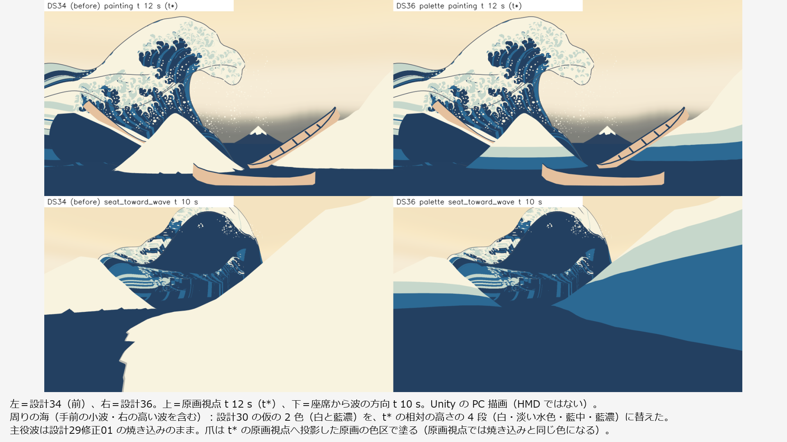
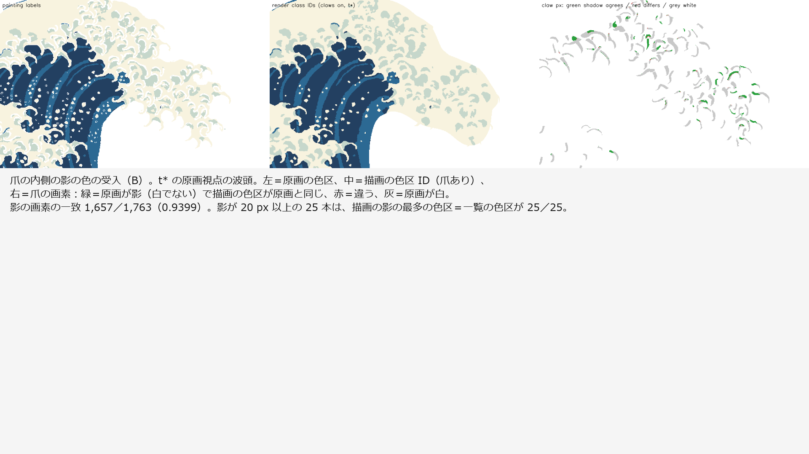

# 設計36：限定色と少数の陰影段階 ― 爪・周りの海・飛沫へ主役波と同じ調色板を当て、爪の影の色を一覧の色区に合わせる（色票の表：面積・明度）

日付：2026-09-30／状態：**閉じた（最小の受入は満たした）**。修正は 1 回（Q26 の上限。第 6 節）。進行役の独立の検査で必須の指摘はなかった（pass = true、must\_fix 0）。段階6確認 §4.2 の条件 1（爪ありの読みで 133・134・267 を合格へ戻す）も満たした。証拠の種類は次のとおり。**HMD 実機の結果ではない。利用者は確かめていない。**

- 調色板の部：numpy/OpenCV の準備（`ds36_palette_prep.py`）と評価（`ds36_palette_eval.py`）、Unity 6000.4.3f1 の Editor の batchmode の PC オフスクリーン描画（camera.Render、RTX 3080、Direct3D11。設計34 の描画と同じ描き方）、原画視点の評価器（`ds30b_tstar_regress.py --sets t28_claws,t28_white`。美術優先28修正01 の評価器と設計29修正01 の両側の読み）
- 進行役の独立の検査（調色板の部の評価のコードを使わずに書いた numpy/OpenCV。評価器は t\* の画像の写しで回し直した。動画から取り出したコマを自分で見た。コードと出力は Git 対象外の `Unity/Build/Design/36/indep_check/`）
- 記録の道具 `ds36_record.py`（回帰の表の照合、藍濃の 1 段と 1 コマだけの色の跳びの数え直し、証拠の図）

番号の前提：

- 対象：[段階9までの実行計画](../Design/Stage9_Plan_2026-09-26_ja.md)（以下「計画」）§2.3 の設計36。使える水準の成果物は「爪・飛沫・形成途中へ同じ調色板（白・淡い水色・藍中・藍濃・藍の線）を当てることと、色票の表」、最小の受入は「爪の内側の影の色（第6節の定義）が一覧の色区と合う。265・266/267 の回帰なし」、バックログは 200（根元の白、記録）。
- 引き継ぎ：
  - [設計29修正01](Design_29_修正01_ja.md)：主役波の表示用サーフェスと色の焼き込み（原画の色区の符号付き距離 `paint_sdf_rgba16f.bin` と UV の表）。色区の項目の「輪郭の両側を除く」読み（以下「両側の読み」）。厳しい色の読み（73・79・118・134・175・263・267）は仕上げ28 のまま。
  - [設計30](Design_30_ja.md)：周りの海 near・far のパッケージ（`Unity/Build/Design/30/sea/near/ds27_keypose.json` `cc2c8905…`・`far` `f5d7b2d8…`）と再生器 `DS30SheetPlayer`。海の仮の 2 色（t\* の高さ ≥ 0.5 m を白、ほかは藍濃）、主役波と海の藍濃の 1 段の差。
  - [設計31](Design_31_ja.md)：飛沫 v0（JSON の色 (251,246,227)）。
  - [設計32](Design_32_ja.md)：爪の一覧と爪の領域（計画 §6 の仮の定義 D25：藍の輪郭線の内側、白＋影。`_regions.npy` `b5313786…`、`ds32_claw_inventory.json` `9b73086b…`）。
  - [設計33](Design_33_ja.md)・[設計34](Design_34_ja.md)：爪の帯 148 本（コマの表 `ds33_claw_frames_f32.bin` `6e762988…`）と場面 `DS34_ThreeLayers.unity`（`2bf63bff…`）。設計34 で、爪を色区 ID に入れた両側の読みの 133・134・267 が不合格になった。
  - [段階6確認](Stage6_SelfReview_ja.md) §4.2 の条件 1 と F6-1（原画視点で 3D の爪がほとんど読めない。焼き込みの爪と 3D の爪の役割を分ける）。[段階5確認](Stage5_SelfReview_ja.md) の、平塗りで谷が読めないこと。
- 時間の上限：Q26 の日程（計画 §2.6）で 2 時間。範囲は最小の受入だけで、修正は 1 回まで。
  - 実績（ファイルの時刻。`palette/_started.txt` と `ds36_record_counts.json` の `file_times`）：着手 03:30:55、調色板の部の終了 04:32:09（約 61 分）。修正の前の出力を写したフォルダー `unity_r1_facing/` の作成 04:05、修正1回目の奥行きのシェーダーの `.meta` の作成 04:18:19、Unity の最後の描画の報告 04:18:55、評価器 04:20〜04:27、評価の JSON と図 04:29。進行役の独立の検査 04:34〜04:42。記録 04:47 ごろ〜（終わりは `Unity/Build/Design/36/READY_TO_COMMIT.txt` の時刻）。
  - 調色板の部の README の「04:35（約 65 分）」は、`_started.txt` の終了の行（04:32:09）と合わない（第 10 節の 9）。
  - 1 回の計算：Unity の描画は 32.6 s（`ds36_render_report.json` の `secondsTotal`）、評価器は約 7 分、記録の道具は約 3.5 分。どれも 30 分の上限より十分短い。
- 修正回数：1（見える面の決め方。第 6 節）。最初の評価の前の作る途中の直し 4 つは数えない。
- 対応するバックログ：200（記録のみ）、265・266・267（回帰なし）。121・175 は仕上げ36 の項目で、この番号では触らず、悪くしない。値は [metrics.json](../Evidence/Design/36/metrics.json) の `acceptance`・`record_only_200_root_white`・`backlog`。
- 読むだけで変えていないもの：設計27 の主役波のシェーダー、設計30・31・34 の場面・スクリプト・シェーダー、設計29修正01 の焼き込み、設計33 の爪の表、設計30 の海のパッケージ（12 ファイル。描画の前後で SHA-256 が同じ、`protectedUnchanged = true`）。評価器のファイルも変えていない。
- 座標と単位：m・s。t は体験の時刻（コマ k は t = k/30 s、421 コマ）、t\* は t = 12 s（コマ 360）。
- 使っていないもの：参照モデル（D20：爪に参照モデルを使わない）、利用者の解算、写真のフォルダー、Blender・Houdini。爪形分析のフォルダー（`G:\research\爪形分析`）は、作る部も検査も開いていない。記録の時のコミットの一覧の点検でだけ、そのフォルダーのファイルの大きさと SHA-256 を読み取りのみで調べた（第 9 節）。
- git：作る部と検査は使っていない。記録の部で、読み取りのみの `git status --short` と `git log --oneline -5` を 1 回ずつ実行した（この番号の指示は git を使わないことだった。何も変えていない。第 10 節の 10）。

## 見るもの

| 設計34（左）と設計36（右）：原画視点 t\*・座席から波の方向 t 10 s | 爪の内側の影の色（t\* の原画視点の波頭） |
| --- | --- |
|  |  |

図は Unity の PC 描画と、その数値の図である。1920 × 1080 の枠に収め、余白に日本語の説明を入れた（元の図は Git 対象外の `Unity/Build/Design/36/palette/fig/` と `indep_check/frames/`）。

動画（1920 × 1080、30 fps、421 コマ、t 0〜14 s。Unity の PC 描画。爪・飛沫・白の帯の 3 層を入れた普通の読み）：

- [原画視点](../Evidence/Design/36/ds36_palette_painting_30fps.mp4)（2,479,680 バイト）
- [座席 v1](../Evidence/Design/36/ds36_palette_seat_30fps.mp4)（1,030,044 バイト）
- [座席から波の方向](../Evidence/Design/36/ds36_palette_seat_toward_wave_30fps.mp4)（2,363,656 バイト）

色と調色板：

- [色票の表](../Evidence/Design/36/fig_ds36_colour_chart.png)：5 色の見本（sRGB・L\*）と、原画視点 t\*・座席 v1 t\*・座席の低い視点 t\*・座席から波の方向 t 10 s の領域ごとの面積と明度。全 122 行は [ds36\_colour\_chart.csv](../Evidence/Design/36/ds36_colour_chart.csv)。
- [前後（座席の低い視点 t\*・原画視点 t 8 s）](../Evidence/Design/36/fig_ds36_before_after_low.png)・[形成の途中](../Evidence/Design/36/fig_ds36_formation_frames.png)（3 視点 × t 4・6・8・10・12 s）。

限界を示す図：

- [藍濃の 1 段](../Evidence/Design/36/fig_ds36_aidark_step_tstar.png)（記録の数え直し）：主役波・海の藍濃 (35,64,97) と、美術優先27 の平塗りの藍濃 (34,63,96) が接する所。
- [1 コマだけの色の跳び・原画視点](../Evidence/Design/36/fig_ds36_indep_flicker_painting_f328.png)・[同・座席から波の方向](../Evidence/Design/36/fig_ds36_indep_flicker_seat_toward_wave_f328.png)（独立の検査のコマ 328）。
- [前面の足の縦の筋](../Evidence/Design/36/fig_ds36_indep_foot_streaks_f345.png)（独立の検査。座席から波の方向のコマ 345、t 11.5 s。設計28 から渡された描画の傷）。

数値：

- [metrics.json](../Evidence/Design/36/metrics.json)：最小の受入 `acceptance`（調色板の部と独立の検査）、回帰 `regression_plan_2_0`・`regression_verdicts_sym`、記録 `record_only_200_root_white`・`trough_record`・`claw_colours_by_view`、記録の数え直し `ai_dark_step_tstar`・`flicker`、修正 `fix_rounds`、時間 `time`
- 調色板の部の写し：[ds36\_palette\_metrics.json](../Evidence/Design/36/ds36_palette_metrics.json)、[ds36\_claw\_shadow\_per\_claw.json](../Evidence/Design/36/ds36_claw_shadow_per_claw.json)（爪ごとの影の色）、[ds36\_render\_report.json](../Evidence/Design/36/ds36_render_report.json)、[ds36\_palette\_prep.json](../Evidence/Design/36/ds36_palette_prep.json)、評価器の出力 [ds36\_tstar\_regress.json](../Evidence/Design/36/ds36_tstar_regress.json)・[爪あり](../Evidence/Design/36/ds36_tstar_sym_claws.json)・[爪なし](../Evidence/Design/36/ds36_tstar_sym_no_claws.json)
- 進行役の独立の検査：[爪](../Evidence/Design/36/ds36_indep_claws.json)・[1 コマだけの跳び](../Evidence/Design/36/ds36_indep_flicker.json)
- 記録の数え直し：[ds36\_record\_counts.json](../Evidence/Design/36/ds36_record_counts.json)
- 実行条件と SHA-256：[run.json](../Evidence/Design/36/run.json)

**見え方の注意**：色は光を使わない平塗りで、線は設計27〜30 の外殻線 v0 のまま（爪の縁の線、継ぎ目をまたぐ線、海の線はまだない。設計38）。崩壊は作らない（Q11）。

## 0. 結論

1. **調色板を 1 つにそろえた。** 主役波の材質の値（白 #F8F3DF・淡い水色 #C6D7CB・藍中 #2C6993・藍濃 #234061、藍の線 #47505F）を、爪・周りの海・飛沫へ当てた。
   - 爪：新しいシェーダー `DS36 Claw Palette` と部品 `DS36ClawPalette`。t\* に原画のカメラから見える面は、主役波の焼き込みと同じ原画の色区を t\* の原画視点から投影して塗る。隠れる面は、上面と根元の白の円を白、縁の側面と下面を一覧の影の色（淡い水色 144 本・藍中 1 本・藍濃 3 本）にした。
   - 周りの海 near・far（手前の小波と右の高い波を含む）：設計30 の仮の 2 色を、t\* の相対の高さの 4 段（白は白の時間場のある頂点だけ、淡い水色、藍中、藍濃）に替え、白が届く前は淡い水色にした。谷のまわりに、なめらかな藍中の 1 段（508 頂点）を置いた。
   - 飛沫：JSON の色 (251,246,227) から調色板の白 (248,243,223) へ。
   - 主役波は設計29修正01 の焼き込みのまま。どの時刻も同じ 4 色と線で塗られる（形成の途中は t 4〜12 s の色票と動画 3 本で確かめた）。
2. **最小の受入はすべて合格。**
   - 爪の内側の影の色が一覧の色区と合う：(A) 隠れる面の色＝一覧の色区が 148／148。(B) t\* の原画視点で、爪の領域の中の爪の画素のうち原画が影（白でない）の画素の 0.9399（1,657／1,763 px。独立の検査は 2 × 2 の多数決で 0.9575）が原画と同じ色区。影が 20 px 以上ある 25 本は、描画の影の最多の色区＝一覧の色区が 25／25。
   - 265・266/267 の回帰なし（両側の読み。爪あり・爪なしの両方）：265 ΔE00 0.545、266 の帯 0、267 の白の帯 0。どれも設計29修正01 と同じ。
   - 200（根元の白、記録）：148 本のうち、原画で白 122、描画で白 125、両方で白 122。
3. **段階6確認 §4.2 の条件 1 を満たした。** 爪ありの両側の読みで、133 は 8.837 → 0.718 px、134 は 9.399 → 0.634 px、267 の白の帯は 49 → 0（設計34 → 設計36）。両側の読みの全ての行が設計29修正01 と差 0.0 px。
4. **計画 §2.0 の回帰なし（原画視点）**：78・130・131 の差 0.0、132 σ12 3.7552 px（同じ）、72 σ24 p95 3.8423 px（爪あり）・4.0075 px（爪なし、29修正01 と同じ）。船・富士は変わっていない（設計34 と違う画素のうち主役波・海・爪・飛沫の領域の外の 409 画素は、どれも領域から 1.4 px 以内の縁）。調色板の部と独立の検査の評価器の出力は、数値 74 個がすべて同じ（記録の照合）。
5. **HMD（PS VR2）は保留**（導入は利用者の手）。この番号では Mock の両眼も描いていない。
6. **限界（第 5 節）**：谷の読みは弱い（藍中の段が小さい）。海の色の帯は形成の間に頂点について動く。1 コマだけの色の跳びが、爪と海の新しい色の境に加わった（座席から波の方向の最大 2,481 画素、設計30 は 1,177）。藍濃の 1 段は、美術優先27 の平塗りの物との境に残る。設計28・29 から渡された描画の傷 5 つはこの番号で直していない。爪の 2 つの受入は作りから真に近く、爪の読みやすさ（F6-1）はまだ残る。

---

## 1. 目的

設計書の設計36 は、浮世絵の限られた色と少ない陰影の段で、波・爪・海を塗り分ける番号である。主役波の調色板は美術優先の番号（35e9002）と設計29修正01 でほぼ済んでいて、計画 §2.3 の残りは次の 2 つである。

- 爪・飛沫・形成途中へ、同じ調色板（白・淡い水色・藍中・藍濃・藍の線）を当てる。
- 色票の表（各色の面積と明度）を作る。

最小の受入は、爪の内側の影の色（計画 §6 の定義 D25：藍の輪郭線の内側の、白でない所）が一覧の色区と合うこと、265・266/267 の回帰なしである。あわせて、前の番号から渡された次のものをこの番号で受けた：設計30 の海の仮の 2 色と藍濃の 1 段の差、段階5確認の「平塗りで谷が読めない」、段階6確認 §4.2 の条件 1 と F6-1。設計28・29 から渡された描画の傷と、線に関わるもの（継ぎ目をまたぐ外殻線、海と小波の線）は設計38 の中身で、この番号では記録して渡す。Q26 により、最小の受入だけを満たし、修正は 1 回までとした。

---

## 2. 表

### 2.1 調色板（`ds36_palette_metrics.json` の `palette`）

| 名前 | sRGB | 16 進 | L\*（CIELAB） | 使う所 |
| --- | --- | --- | --- | --- |
| 白 | (248,243,223) | #F8F3DF | 95.74 | 主役波の白の帯、爪の上面と根元の白の円、海の頂（白の時間場のある頂点）、飛沫 |
| 淡い水色 | (198,215,203) | #C6D7CB | 84.44 | 主役波の影、爪の影（144 本）、海の高い斜面と白が届く前 |
| 藍中 | (44,105,147) | #2C6993 | 42.37 | 主役波の中間、爪の影（1 本）、海の中ほどの斜面と谷の縁の段 |
| 藍濃 | (35,64,97) | #234061 | 26.41 | 主役波の暗部、爪の影（3 本）、海の低い所・谷・平らな海 |
| 藍の線 | (71,80,95) | #47505F | 33.78 | 外殻線（線は設計38） |

- 値は主役波の材質（`DS27 NPR White` の \_White・\_Mizuiro・\_AiMid・\_AiDark）と、外殻線の材質の \_LineColor。海のシートは MaterialPropertyBlock で同じ値を渡し、爪は `DS36 Claw Palette` に同じ値を渡した。
- 明度の段は 95.7／84.4／42.4／26.4 の 4 段（線 33.8）。

### 2.2 最小の受入（調色板の部・独立の検査・記録）

| 項目 | 調色板の部 | 進行役の独立の検査 | 判定 |
| --- | --- | --- | --- |
| (A) t\* に隠れる面の色＝一覧の色区 | 148／148（Unity の報告の爪ごとの影の色と `ds36_claw_palette.json` が一致。淡い水色 144・藍中 1・藍濃 3） | 原画の色区 `mw_colour_labels_hi.png` から設計32 の領域ごとに自分で数え直し、148／148 が同じ色区。シェーダーのコードで、隠れる面が爪ごとの色区（UV1.x）を使うことを確かめた | 合格 |
| (B) t\* の原画視点で、爪の画素のうち原画が影の画素の色区の一致 | 0.9399（1,657／1,763 px）。影 20 px 以上の 25 本で最多の色区＝一覧の色区 25／25。爪の画素全体 0.9892（14,435 px）。基準：≥ 0.90 と ≥ 0.90 | 0.9575（1,688／1,763 px。3840 × 2160 の ID 画像を 2 × 2 の多数決で縮めた。調色板の部は 2 × 2 の 1 画素を取った）。25／25。爪の画素全体 0.9947。原画から表示への位置合わせは、一覧の先端と根元の 346 組から自分で当てはめた（残差の最大 0.005 px） | 合格 |
| 爪の領域全体（シート＋爪。見る人が見るもの）の原画との一致 | — | 設計36 0.9928（影の画素だけ 0.9687）、29修正01 0.9926（0.9683）、設計34 0.8773（0.7596） | 記録（29修正01 と同じ水準へ戻った） |
| 265 内側の水色の表示色 | ΔE00 0.545（爪あり・爪なし。29修正01 0.545） | 評価器を t\* の画像の写しで回し直し、同じ値 | 合格 |
| 266 水色の平塗り | 両側の読みで藍中・淡い水色の 20 px 以上の帯 0（29修正01 0。設計34 の爪ありは淡い水色 12） | 同じ | 合格 |
| 267 白の平塗り | 両側の読みで白の 20 px 以上の帯 0（29修正01 0。設計34 の爪ありは 49） | 同じ | 合格（両側の読み） |
| 200 根元の白（記録） | 一覧の根元 148 本の半径 2 px（5 × 5）で白の割合 ≥ 0.5：原画 122・描画 125・両方 122・描画だけ 3・原画だけ 0 | 報告では、同じ窓で描画 124・原画 122・両方 122・描画だけ 2・原画だけ 0（この値はファイルに残っていない） | 記録のみ（仕上げ33） |

- (B) の爪の画素の決め方：爪ありと爪なしの色区 ID が違う画素 218 はすべて、膨らませた爪のマスクの中にある（独立の検査）。
- 267 の判定の欄（`verdicts_sym`）は、29修正01 と同じく fail の文字になる。この欄は評価器の定義のままの判定を写したもので（設計34 の記録の第 10 節の 3）、両側の読みの白の帯は 0 である。

### 2.3 回帰（原画視点 t\*。計画 §2.0。単位は表示の px。`ds36_tstar_regress.json`・`metrics.json` の `regression_plan_2_0`）

| 項目 | 29修正01 | 設計34 爪あり | 設計36 爪あり | 設計36 爪なし |
| --- | --- | --- | --- | --- |
| 78／130／131 最大（Unity の画像） | 3.0289／3.5131／3.0431 | 同じ | 同じ（差 0.0） | 同じ（差 0.0） |
| 132 σ12 最大 | 3.7552 | 3.7552 | 3.7552 | 3.7552 |
| 72 σ24 p95 | 4.0075 | 3.8423 | 3.8423 | 4.0075 |
| 133 左から上へ続く白（両側の読み） | 0.718 | 8.837（不合格） | 0.718 | 0.718 |
| 134 白帯（両側の読み） | 0.634 | 9.399（不合格） | 0.634 | 0.634 |
| 79（両側の読み） | 0.357 | 1.608 | 0.357 | 0.357 |
| 270 白と水色の境（両側の読み） | 0.563 | 3.04 | 0.563 | 0.563 |
| 175 藍濃／藍中／淡い水色の境（両側の読み） | 0.428／0.472／0.978（不合格） | 淡い水色 22.382 | 0.428／0.472／0.978（不合格のまま） | 同じ |
| 265 ΔE00 | 0.545 | 0.545 | 0.545 | 0.545 |
| 266 の帯（藍中／淡い水色） | 0／0 | 0／12 | 0／0 | 0／0 |
| 267 白の帯（両側の読み／定義のままの読み） | 0／7 | 49／— | 0／4 | 0／7 |
| 134 定義のままの読み | 8.996（不合格） | — | 2.047（合格） | 8.996（不合格） |

- 29修正01 の列は `ds36_palette_metrics.json` の `regression.reference.29R01` と設計29修正01 の記録、設計34 の列は設計34 の記録の第 5 節の 1 と `reference.DS34_claws`。
- 両側の読みの全ての行が、爪あり・爪なしとも 29修正01 と差 0.0 px（`sym_worst_diff_vs_29r01_px`）。判定の欄の変化 0（`sym_verdict_changes_vs_29r01` が空）。
- 定義のままの読みの色区の差の最大は 13.642 px（175 の藍中）で、29修正01 と同じ。±0.5 px を超える 6 項目（73・79・118・134・175・263）も同じ（仕上げ28）。
- 72 が爪ありで 3.8423 px になるのは、設計33・34 と同じ。
- 船・富士：設計34 の t\* の静止画と比べ、主役波・海・爪・飛沫の領域の外で違う画素は 409 で、どれも最も近い領域から 1.4 px 以内（縁のぼかし。記録の数え直し `other_region_diff_vs_ds34_tstar`。独立の検査も、領域の外の違いは縁だけと読んだ）。

### 2.4 色票の抜粋（`ds36_colour_chart.csv`。割合は領域の画素に対する %）

| 視点・時刻 | 領域 | 画面の割合 | 白 | 淡い水色 | 藍中 | 藍濃 | 線 | 調色板の外 | 平均 L\* |
| --- | --- | --- | --- | --- | --- | --- | --- | --- | --- |
| 原画視点 t\* | 主役波 | 20.76 | 37.5 | 14.5 | 9.2 | 30.7 | 1.0 | 7.0 | 65.2 |
| 原画視点 t\* | 周りの海 near | 25.46 | 18.8 | 10.9 | 16.7 | 53.0 | 0.0 | 0.7 | 48.6 |
| 原画視点 t\* | 周りの海 far | 0.36 | 0.0 | 0.0 | 0.0 | 97.5 | 1.1 | 1.4 | 26.6 |
| 原画視点 t\* | 爪 | 0.74 | 83.9 | 10.3 | 0.0 | 0.2 | 0.3 | 5.3 | 93.8 |
| 原画視点 t\* | 飛沫 | 0.18 | 82.4 | 0.0 | 0.0 | 0.0 | 0.0 | 17.6 | 94.6 |
| 座席 v1 t\* | 主役波 | 28.31 | 13.3 | 5.4 | 4.7 | 74.2 | 0.2 | 2.2 | 40.4 |
| 座席 v1 t\* | 爪 | 0.30 | 79.1 | 11.2 | 0.0 | 0.0 | 0.2 | 9.6 | 93.2 |
| 座席の低い視点 t\* | 主役波 | 49.12 | 9.9 | 5.5 | 5.8 | 76.4 | 0.2 | 2.2 | 38.2 |
| 座席の低い視点 t\* | 周りの海 near | 0.20 | 0.0 | 0.0 | 1.9 | 93.6 | 0.7 | 3.9 | 27.1 |
| 座席から波の方向 t 10 s | 主役波 | 15.90 | 10.6 | 6.8 | 12.5 | 64.9 | 0.4 | 4.8 | 41.3 |
| 座席から波の方向 t 10 s | 周りの海 near | 67.19 | 6.9 | 10.0 | 28.7 | 54.2 | 0.0 | 0.3 | 41.7 |

- 表は 7 時刻（t 4・6・8・9・10・11・12 s）× 4 視点（原画視点・座席 v1・座席の低い視点・座席から波の方向）× 領域で 122 行。領域は Unity の平塗りの領域の画像（主役波 赤・near 緑・far 青・爪 マゼンタ・飛沫 シアン）で分けた。
- 調色板の外の画素は、アンチエイリアスの縁・線・空との混ざり。主役波で 2〜8%。
- 爪は、どの視点でも白 70〜84%・淡い水色 9〜12%（`claw_colours_by_view`）。座席の視点では、爪は白の帯の上で白が多く、影の色はほとんど淡い水色。

### 2.5 周りの海の段と谷（`ds36_palette_prep.json`・`metrics.json` の `trough_record`）

- 段の決め方：t\* の高さ y\* を、近くの最も高い所（格子の上の最大値の広がり）で割った相対の高さ h で、白 h ≥ 0.45（白の時間場のある頂点だけ）・淡い水色 ≥ 0.30・藍中 ≥ 0.14・藍濃（それ未満、谷、平らな海）。
- near（44 × 1231 頂点）：白 1,173・淡い水色 551・藍中 1,383・藍濃 51,057 頂点。谷（y\* < −0.5 m）の 1,585 頂点はすべて藍濃。谷の縁の藍中の段は 508 頂点（主役波との継ぎ目の側の行 0〜2 には置かない）。far（19 × 247）は全部藍濃。
- 谷の読み（near の画素の色の割合）：座席から波の方向 t 10 s で藍中 28.7%・藍濃 54.2%、座席の低い視点 t\* で藍中 1.9%・藍濃 93.6%、原画視点 t\* で藍中 16.7%・藍濃 53.0%。

### 2.6 記録の数え直し（`ds36_record_counts.json`）

**藍濃の 1 段**（原画視点 t\*、爪あり、1920 × 1080）

| | (35,64,97) の画素 | (34,63,96) の画素 | 互いに接する画素（両側、4 近傍） |
| --- | --- | --- | --- |
| 設計36 | 418,062 | 108,672 | 2,292 |
| 設計34 | 377,631 | 108,646 | 2,182 |

- (35,64,97) は主役波と周りの海の藍濃、(34,63,96) は美術優先27 の平塗りの材質 `AF27_Flat_ai_dark.mat`（\_Color 0.13333334, 0.24705882, 0.3764706。場面で 13 か所が参照）を使う物。設計36 の (34,63,96) の画素は、すべて主役波・海・爪・飛沫の領域の外にある。
- 主役波と海の間の 1 段は、設計34 の t\* の静止画でもすでにどちらも (35,64,97) で、この番号で消したものではない。残っている段は、海と平塗りの物の間にある（RGB で 1 の差で、目では見えない）。

**1 コマだけの色の跳び**（960 × 540 に縮め、調色板の 4 色へ分けたコマで、前後のコマと違うコマだけの画素のうち 3 × 3 に 4 画素以上まとまったもの。ic36\_flicker.py と同じ読み）

| 動画 | 全コマの最大（コマ） | 50 画素を超えるコマ | コマ 362 から（t\* の後） |
| --- | --- | --- | --- |
| 設計36 原画視点 | 1,192（328） | 70 | 0 |
| 設計34 原画視点（3 層） | 867（328） | 87 | 0 |
| 設計30 原画視点 | 1,237（328） | 91 | 0 |
| 設計36 座席 v1 | 1,597（330） | 46 | 0 |
| 設計34 座席 v1（3 層） | 1,466（330） | 40 | 0 |
| 設計30 座席 v1 | 1,619（330） | 48 | 0 |
| 設計36 座席から波の方向 | 2,481（328） | 53 | 0 |
| 設計30 座席から波の方向 | 1,177（329） | 82 | 0 |

- 設計36 のコマ 330（t 11.0 s）を、同じ時刻の領域の画像で分けると：原画視点 1,120 画素（主役波 959・爪 160・飛沫 1）、座席 v1 1,597 画素（主役波 1,534・爪 50・飛沫 13）、座席から波の方向 2,038 画素（主役波 1,092・周りの海 near 895・爪 46・飛沫 5）。
- 50 画素を超えるコマの数は、設計36 が設計30・34 より多くはない（原画視点 70／設計34 87／設計30 91、座席から波の方向 53／設計30 82）。最大の値が大きくなったのは、下の新しい境が同じコマで加わったため。
- 跳びのほとんどは t ≈ 10.9〜11.1 s の主役波の白と淡い水色の模様で、設計30・34 からある。設計36 で加わったのは、爪（原画の模様を投影したので、動く爪の上で模様の境が跳ぶ）と、周りの海の段の境（手前の小波の裾の鋸歯と、右の波の淡い水色と藍中の境）。

---

## 3. 作り方と、採ったもの

### 3.1 準備（`Tools/GWWaveGen/ds36/ds36_palette_prep.py`、約 1 s）

- 爪の投影の表：主役波の焼き込みと同じ原画の色区の符号付き距離（設計29修正01 の `paint_sdf_rgba16f.bin`）を、表示フレームの 2 倍（3840 × 2160）へ写した RGBA8（`ds36_claw_label_sdf_3840x2160_rgba8.bin` `ddedb0a7…`）。
- 爪ごとの影の色（一覧の色区）：設計32 の爪の領域の中の原画の色区で、白でない色区（淡い水色・藍中・藍濃）のうち最も多いもの（`ds36_claw_palette.json` `015fe6c2…`）。
- 周りの海の 4 段と谷の縁の段：頂点ごとの UV3（near `d14b43fe…`・far `af332a1d…`）と、u に沿った 4 色区の符号付き距離の表（256 × 256、`1f802be8…`）。`DS30SheetPlayer` の既存の読み込み（sdfPath・uv3File）でそのまま読める形で、設計30 のファイルは変えていない。

### 3.2 Unity（`Unity/Assets/GreatWave/Design36/`）

- `Scenes/DS36_Palette.unity`（`38a02743…`）：設計34 の `DS34_ThreeLayers.unity` の写しに、下の 2 つの部品を足した。
- `Scripts/DS36ClawPalette.cs` と `Shaders/DS36_Claw_Palette.shader`：爪の頂点に、t\*（コマ 360）の原画視点の画面の位置（UV0）と、爪の一覧の影の色区・t\* の目の奥行き（UV1）を付ける。t\* に原画のカメラから見える面（t\* の爪だけを描いた奥行きの表と比べる）は投影の表で原画の色区の色、隠れる面は上面と根元の白の円が白、縁の側面と下面が一覧の影の色。
- `Shaders/DS36_Claw_TDepth.shader`：t\* の爪だけを原画視点で描いた奥行きの表（3840 × 2160）を作る（修正1回目で足した）。
- `Scripts/DS36SeaPalette.cs`：near・far のシートに 4 段の表と UV3 を渡し、主役波の材質の調色板の値を MaterialPropertyBlock で写す。
- `Editor/DS36Render.cs`：場面を作り、t\* の 2 組（爪あり `t28_claws`・爪なし `t28_white`）の評価器の画像、色票の 56 枚（4 視点 × 7 時刻 × 色と領域）、面の向きの確かめ、動画 3 本を描く。守るファイルの SHA-256 を前後で比べる。
- 道具：`run_ds36_unity.ps1`（Unity の 1 回の実行と `unity.lock`）、`ds36_palette_eval.py`（受入・色票・図）、`ds36_record.py`（記録）。

### 3.3 採ったもの（Q24。進行役の判断で、利用者の決定ではない）

- **爪の色は、t\* の原画視点への投影で決める。** 理由：原画視点の色区を後退させずに（計画 §2.0）、爪の内側の影の色を原画の色区に合わせる一番直接な方法で、主役波の焼き込み（美術優先28 の投影）と同じ考え。
- **焼き込みの爪と 3D の爪の役割（段階6 F6-1）**：原画視点では原画の模様が主で、3D の爪は同じ色になって模様を乱さない。ほかの視点では、3D の爪が同じ模様と影の色を立体で運ぶ。
- **平らな海は藍濃のまま。** 理由：主役波の根元（藍濃）との継ぎ目に色の段を作らない。谷は、周りの斜面の明るい段と谷の縁の藍中の段で読ませる。
- **落とした (1)**：爪を一覧の影の色の平塗り（白＋1 色）にする案。原画の爪の中の白と影の細かい模様と合わず、原画視点の色区（133・134・267）が戻らない。
- **落とした (2)**：3D の爪がある所の焼き込みの爪の模様を消す案（段階6確認 §4.2 の条件 2 の例）。焼き直しが要り、時間の上限に入らない。仕上げ33。
- **落とした (3)**：平らな海を藍中にして、谷を藍濃で読ませる案。主役波の本体の縁の継ぎ目に沿って色の境が出る。
- **落とした (4)**：海の段を今の高さでコマごとに決める案。シェーダーとデータの作り直しが要り、Q26 の範囲の外。仕上げ30（限界 2）。

---

## 4. 関門

| 最小の受入・規則 | 基準 | 値 | 判定 |
| --- | --- | --- | --- |
| 爪の内側の影の色が一覧の色区と合う | (A) 148／148。(B) 影の画素の一致 ≥ 0.90、影 20 px 以上の爪で最多の色区＝一覧の色区 ≥ 0.90 | (A) 148／148。(B) 0.9399（独立 0.9575）、25／25 | 合格（PC の描画。作りから真に近い：限界 8） |
| 265・266/267 の回帰なし | 29修正01 の両側の読みから後退なし | 265 0.545、266 の帯 0、267 の白の帯 0（爪あり・爪なし） | 合格 |
| 200 根元の白 | — | 原画 122・描画 125・両方 122 | 記録のみ |
| 計画 §2.0 の回帰 | 78・130・131・132・72・69・70・212、色区の項目は 29修正01 の読み | 差 0.0（72 は爪ありで 3.8423）。船・富士は領域の外の違いが縁だけ（1.4 px 以内） | 合格（後退なし） |
| 段階6確認 §4.2 の条件 1 | 爪ありの読みで 133・134・267 を合格へ | 0.718 px・0.634 px・帯 0 | 満たした |
| 121・175（仕上げ36） | 悪くしない | 175 は 29修正01 と同じ値で不合格のまま。121 は触っていない | 悪くしていない |
| HMD（PS VR2） | — | — | 保留（導入は利用者の手） |

---

## 5. 限界

1. **谷の読みは弱い。** 座席から波の方向（t 10 s）では、谷は小波と右の高い波の藍中・淡い水色の斜面にはさまれた藍濃の谷として読める（[前後の図](../Evidence/Design/36/fig_ds36_before_after_painting.png)の下段）。谷の縁の藍中の段は 508 頂点と小さく、座席の低い視点の t\* では near の画素の藍中は 1.9%で、ほとんど見えない。谷の底を線で締めるのは設計38、海の色の連続は仕上げ30 の①。
2. **海の色の帯は、形成の間に頂点について動く。** 色は t\* の高さから頂点ごとに決めたので、t 4〜8 s の右の高い波にも t\* の帯が見え、今の高さに従わない（[形成の途中](../Evidence/Design/36/fig_ds36_formation_frames.png)）。仕上げ30。
3. **手前の小波の裾の鋸歯が、藍中の段の境として見える**（座席から波の方向 t 11〜12 s）。形は段階5確認の S5-2・S5-3 で仕上げ30。設計34 では白と藍濃の境として同じ形が見えていた（独立の検査）。
4. **シートの焼き込みの爪の模様は残る。** 原画視点以外では、焼き込みの模様と 3D の爪が視差でずれて二重に見えうる。t\* の奥行きの表は爪どうしの隠れだけで、主役波のシートが爪を隠すことは入れていない。仕上げ33。
5. **1 コマだけの色の跳びが、爪と海の新しい色の境に加わった**（第 2.6 節）。座席から波の方向の最大は設計36 2,481・設計30 1,177 画素で、コマ 330 では周りの海 near に 895 画素、爪に 46 画素。原画視点のコマ 330 では爪に 160 画素。主役波の模様の跳び（t ≈ 10.9〜11.1 s）は設計30 からある。独立の検査は原画視点の設計30（1,237）とだけ比べて「設計36 の後退ではない」としたが、記録の数え直しで、海と爪の分は設計36 で加わったと分かった。最小の受入の外で、修正の回は使い切ったので、模様と線の安定（177・191）の設計37・38 と、海の段を今の高さで決める仕上げ30 へ渡す。t\* の後（コマ 362 から）はどの動画も 0。
6. **藍濃の 1 段は残る。** 調色板の部の「藍濃の 1 段の差はなくなった」は言い過ぎで、主役波と海はどちらも (35,64,97) だが、それは設計34 でもすでに同じだった。美術優先27 の平塗りの藍濃 (34,63,96) の物（左下の藍濃の大きな面と、船の縁の暗い線。[図](../Evidence/Design/36/fig_ds36_aidark_step_tstar.png)）が海と接する所に、両側で 2,292 画素の境がある（設計34 2,182。第 2.6 節）。RGB で 1 の差で目では見えない。平塗りの物の材質をそろえるのは設計38 か仕上げ30。
7. **設計28・29 から渡された描画の傷 5 つは、この番号で直していない**：唇の端の梯子・モアレ、座席から波の方向の縦の継ぎ目、前面の足の縦の筋（[独立の検査のコマ 345](../Evidence/Design/36/fig_ds36_indep_foot_streaks_f345.png)ではっきり見える）、頂の爪の模様が埋まっていくこと、原画視点の左端の横縞。設計29修正01 の、面の中を横切る外殻線（K\*′ の折れの線）と、座席の見えない内壁の平らな藍濃と左の横の外挿の帯も同じ。どれも色区の境と外殻線の問題で、設計38（外殻線と色の境）へ渡し、残れば仕上げ28・29 へ。
8. **爪の 2 つの受入は、作りから真に近い。** (B) は、爪が主役波の焼き込みと同じ色区を投影するので合う。t\* の原画視点で爪あり・爪なしの色区 ID が違う画素は 218 だけで、3D の爪は原画視点ではほとんど見えない。(A) は Unity が受け取った爪ごとの色区の照合で、描いた画素ではない。画面で隠れる面が一覧の影の色を出す画素は少ない（座席 v1 t\* の面の確かめで 38 画素：白 24・淡い水色 6・縁の混ざり 8）。座席の切り出しでも、爪の白い上面は白の帯に溶けて読みにくい。F6-1（爪の読みやすさ）は残り、設計38（爪の縁の線）と仕上げ33（爪の幅）へ渡す。
9. **175 は不合格のまま**（29修正01 と同じ値）。121 は触っていない（仕上げ36）。評価器の定義のままの読みの 6 項目（73・79・118・134・175・263）の ±0.5 px 超えと 267 の帯は、仕上げ28 のまま（134 は爪ありでは 2.047 px の合格、267 の帯は爪ありで 4）。
10. **V1 と V2 の違いが普通の読みで見えるか（段階6確認の確かめごと）は測っていない。** 原画視点では 3D の爪が原画の色になるので、違いは原画視点以外で出る。
11. **線はない所が残る**：爪の縁の線、継ぎ目をまたぐ外殻線（主役波の縁の 10 列と海のシートに線がない）、手前の小波の線は設計38。手前の小波の泡の形（白の縁の模様）は作っていない（仕上げ30 の②）。
12. **Mock の両眼は描いていない。HMD は保留。** この番号の証拠は PC の描画だけ。

---

## 6. 修正の記録（Q26：修正は 1 回まで）

| 回 | 変えたこと | 結果 |
| --- | --- | --- |
| 作る途中（最初の評価の前。数えない） | 4 つを直した：① 準備で設計32 の爪の領域の座標を (y0, x0) と読み、切り出しの原点を足していなかった（領域は (x0, y0, M) で原点は切り出し [180, 0]）。② batchmode の Editor ではカメラの縦横比が 4:3 のままで（`cameraAspectBeforeApply` 1.3333）、爪の投影が 16:9 の描画とずれた（爪の画素の原画との一致 0.64 → 0.997）。③ 爪の投影の表を、`mw_colour_labels.png` を埋めた表から、主役波の焼き込みと同じ `paint_sdf_rgba16f.bin` へ替えた（2 つの一致は 98.9%。違う所が爪の縁に余計な色の境を作った）。④ 谷の縁の段を、頂点ごとの段（ぎざぎざ）から、ぼかしから作ったなめらかな値へ | 最初の評価へ |
| 最初の評価（出力は `palette/unity_r1_facing/`） | t\* の向き（画面の位置の微分と面の表裏）で「見える面」を決めた版 | t\* の原画視点で、縁の薄い所の裏の面が 1〜2 px の淡い水色の点になり、両側の読みの 133 が 8.661 px（28修正01 との差 8.259 px）で不合格（場所は表示 (751, 188.5)。README） |
| 修正1回目（04:18 ごろ） | t\* の爪だけを原画視点で描いた奥行きの表（3840 × 2160、`DS36_Claw_TDepth.shader`）と比べる「t\* に見える面」に替えた | 133 は 0.718 px で合格。両側の読みの全ての行が 29修正01 と差 0.0。最小の受入はすべて合格 |
| 進行役の独立の検査（04:34〜04:42） | 自前のコードで爪の色区・位置合わせ・影の画素を数え直し、評価器を写しで回し直し、動画 3 本のコマを見た | pass = true、必須の指摘 0。記録の直し 3 つと記録 3 つ（第 10 節） |

---

## 7. 引き継ぎ

**段階7確認（自己評審）**：段階6確認 §4.2 の 3 項目（133・134・267 の爪ありの読み）は、この番号で 29修正01 と同じ値へ戻った。最初に見るものは、[前後の図](../Evidence/Design/36/fig_ds36_before_after_painting.png)、動画 3 本、第 2.3 節の表。座席から谷が読めるか（段階5確認）は、設計38 の後にもう一度見る。

**設計37**（流れに沿う線）：t ≈ 10.9〜11.1 s の主役波の模様の 1 コマだけの跳び（177）と、設計36 で爪と海の段の境に加わった跳び（第 2.6 節・限界 5）。

**設計38**（輪郭線）

- 爪の縁の線（F6-1。今は線なし）。空へ出る爪が唇の輪郭に作る白い欠け。
- 継ぎ目をまたぐ外殻線（主役波の縁の 10 列と海のシート。目標は座席から波の方向のコマ 330〜420 で継ぎ目に沿う線の画素 0）。手前の小波の線。谷の底を締める線（限界 1）。
- 設計28・29 から渡された描画の傷 5 つと、設計29修正01 の面の中を横切る外殻線・座席の見えない内壁（限界 7）。
- 藍濃の 1 段（平塗りの物の材質、限界 6）。線の点滅・跳び（191）は、設計36 で加わった色の境の跳びも含めて見る。
- 評価器は、爪あり（`t28_claws`）と爪なし（`t28_white`）の両方で回し続ける（段階6確認 §4.2 の条件 1）。

**設計39**：評価器に飛沫と爪の層を分けるマスク（設計31 から）。

**設計40**：CP1 と 26修正01 の合格項目の回帰なしを、爪を入れた原画視点で判定する（段階6確認 §4.2 の条件 2）。133・134・267 はこの番号で戻っている。

**仕上げ28**：評価器の定義のままの読みの 6 項目と 267 の帯（K\*′ の縁を原画に合わせ直す時）。

**仕上げ30**（周りの海）：海の段を今の高さで決める（限界 2）、谷の縁の段と海の色の連続（①、限界 1）、手前の小波の裾の鋸歯と泡（S5-2・S5-3、②、限界 3・11）、右の高い波（③）、海の段の境の跳び（限界 5）。

**仕上げ33**（爪の造形）：焼き込みの爪の模様と 3D の爪の二重（限界 4）、爪の読みやすさと幅（F6-1、限界 8）、根元の白（200：描画だけ白 3 本）。

**仕上げ36**（限定色）：121（船上から見上げる面の配色）、175（輪郭に接する色区）。

**設計08〜10（PS VR2 の導入の後）**：両眼での色の見え方。

---

## 8. 再現

リポジトリの根で行う。前提（どれも Git 対象外）：設計29修正01 の焼き込み（`Unity/Build/Design/29R01/bake_kp/`）、設計30 の周りの海（`Unity/Build/Design/30/sea/`）、設計31 の飛沫、設計32 の爪の領域（`Unity/Build/Design/32/list+ids/`）、設計33 の爪（`Unity/Build/Design/33/claws/`）、原画の色区（`Tools/PaintingTruth/colour/masks/`）。

道具は Unity 6000.4.3f1（batchmode、`Unity/Build/unity.lock` で排他）、`py -3.10`（numpy 2.2.6、OpenCV 4.12.0、Pillow 12.0.0）、ffmpeg。コマンドの全体と SHA-256 は [run.json](../Evidence/Design/36/run.json)。

1. `py -3.10 -B Tools/GWWaveGen/ds36/ds36_palette_prep.py`（約 1 s。`Unity/Build/Design/36/palette/prep/`）
2. `powershell -NoProfile -ExecutionPolicy Bypass -File Tools/GWWaveGen/ds36/run_ds36_unity.ps1 -Method GreatWave.Design36.EditorTools.DS36Render.Render -Log run5 -Extra "-ds36Out G:/Unity/GreatWave_2026_Fresh/Unity/Build/Design/36/palette/unity"`（約 40 s。場面・t\* の 2 組・面の向き・色票 56 枚・動画 3 本）
3. `py -3.10 -B Tools/GWWaveGen/ds30/ds30b_tstar_regress.py --out Unity/Build/Design/36/palette/unity --sets t28_claws,t28_white`（評価器、約 7 分。ほかの重い numpy の処理と同時に回さない）
4. `py -3.10 -B Tools/GWWaveGen/ds36/ds36_palette_eval.py`（約 1 分。`ds36_palette_metrics.json`・色票の表・図）
5. 記録：`py -3.10 -B Tools/GWWaveGen/ds36/ds36_record.py`（約 3.5 分。ほとんどは動画 8 本の読み込み）
   - 調色板の部の出力といまの評価のコード・場面・爪の表・動画の SHA-256 を照合する（違えば止まる）。
   - 回帰の表の照合、藍濃の 1 段と 1 コマだけの跳びを数え直し（`Unity/Build/Design/36/record/ds36_record_counts.json`）、図を 1920 × 1080 に収め、動画と JSON を写し、metrics.json・run.json を書く。
6. 進行役の独立の検査は、リポジトリの外のコード（写しと出力は `Unity/Build/Design/36/indep_check/`）。

---

## 9. 出典と、この番号で作ったもの

- 仕様：計画 §2.3 の設計36、§2.0（回帰の規則）、§2.6（Q26 の日程）、§5（仕上げ28・30・33・36）、§6（爪の領域の定義 D25）。[制作手順](../Workflow/Production_Workflow_ja.md)の Q11（崩壊を作らない）・Q24・Q26。設計29修正01・30・34 の記録と段階5確認・段階6確認の引き継ぎ。
- 読むだけ：番号の前提の「引き継ぎ」の出力と場面。原画の色区 `Tools/PaintingTruth/colour/masks/mw_colour_labels.png`（`1507106b…`）。SHA-256 は run.json の `inputs_sha256`・`protected_files`。
- 参照モデル・利用者の解算・写真のフォルダーは使っていない。爪形分析のフォルダーの画像とマスクは、作る部も検査も開いておらず、どこにも複製していない。
- コミットの一覧の点検（記録の時）：リポジトリの外の一時の道具で、コミットする 47 ファイル（`Unity/Build/Design/36/commit_list.txt`）を点検した（結果は Git 対象外の `Unity/Build/Design/36/record/ds36_commit_scan.json`）。
  - 文字のファイル 35 から、禁止の場所の文字列（旧試作の各フォルダー、参照モデル、利用者の解算、写真のフォルダー、爪形分析など）を探した。見つかったのは「爪形分析」の語 8 か所だけで、この文書の「開いていない」「大きさを調べた」などの記述 6 か所（4 行。この点検の説明を含む）と、`ds36_record.py` と run.json の「開いていない」という記録の文字列 各 1 か所。フォルダーの中のファイルの名前やパスの写しはない。
  - 爪形分析のフォルダーの 5,368 ファイル（画像・配列らしい拡張子 4,108）の大きさを読み取りのみで調べ、コミットするファイルと大きさが同じ 1 ファイルの SHA-256 を比べた。同じファイルは 0。
  - フォルダーの .meta と各ファイルの .meta の欠けは 0。場面が参照する GUID 24 個（Unity の組み込みを除く）は、このコミットの .meta 2（`DS36ClawPalette.cs`・`DS36SeaPalette.cs`）と、前の番号の資産 22（美術優先・M1・設計27・30・31・34 のフォルダー。ディスクで .meta を見つけた。コミット済みかは、git を使わないので確かめていない）。
  - Git の ignore は、git を使わずに `.gitignore` の文を読み、この 47 ファイルにかかる文がないことを確かめた。この番号の間に ProjectSettings・Packages と、ほかの番号の資産（設計37 を除く）は変わっていない（ファイルの時刻）。
- この番号で作ったもの（コミットするもの）：
  - Unity の資産 `Unity/Assets/GreatWave/Design36/`（と各 .meta、フォルダーの .meta）：場面 `Scenes/DS36_Palette.unity`、`Scripts/DS36ClawPalette.cs`・`DS36SeaPalette.cs`、`Shaders/DS36_Claw_Palette.shader`・`DS36_Claw_TDepth.shader`、`Editor/DS36Render.cs`。
  - 道具 `Tools/GWWaveGen/ds36/`：`ds36_palette_prep.py`、`ds36_palette_eval.py`、`run_ds36_unity.ps1`、`ds36_record.py`。
  - 証拠 `Docs/Evidence/Design/36/`：1920 × 1080 の PNG 9 枚、MP4 3 本（最大 2,479,680 バイト）、調色板の部の写し 8（JSON 7・CSV 1）、独立の検査の写し 2、記録の数え直し 1、metrics.json、run.json。
  - 記録：この文書と、進捗の表の設計36 の行。
- コミットしないもの（Git 対象外の `Unity/Build/Design/36/`）：調色板の部の全出力 `palette/`（準備の表、Unity の描画・色票の 56 枚・面の向き・評価器の画像と出力、動画、修正の前の出力 `unity_r1_facing/`、ログ）、進行役の独立の検査のコードと出力 `indep_check/`、記録の数え `record/`。

---

## 10. レビュー対応

調色板の部の出力の後、進行役の独立の検査を通した。最小の受入の不合格はなく、進行役の判定は pass = true・必須の指摘 0。記録の時に、回帰の表を照合し、藍濃の 1 段と 1 コマだけの跳びを数え直した。

| # | 指摘（出どころ） | 対応 |
| --- | --- | --- |
| 1（独立の検査。記録の直し） | 「藍濃の 1 段の差はなくなった」は言い過ぎ。主役波と海の (35,64,97) は設計34 の t\* の静止画でもすでに同じ。主役波・海の外の物が (34,63,96) で、原画視点 t\* でその境が残る（境の画素の数は報告だけで、ファイルに残っていない） | 記録の数え直しで、両側の 4 近傍の境 2,292（設計34 2,182）と数え、(34,63,96) が美術優先27 の材質 `AF27_Flat_ai_dark.mat` の値であることを確かめた。第 2.6 節・限界 6 に「残っている」と書き、設計38 か仕上げ30 へ渡した |
| 2（独立の検査。記録の直し） | 設計29・29修正01 から 36・38 へ渡された描画の傷（唇の端の梯子・モアレ、縦の継ぎ目、足の縦の筋、左端の横縞、爪の模様が埋まる）を、直してもおらず記録もしていない。足の縦の筋は座席から波の方向のコマ 345 ではっきり見える | 限界 7 に全部を書き、設計38（残れば仕上げ28・29）へ渡した。コマ 345 を[図](../Evidence/Design/36/fig_ds36_indep_foot_streaks_f345.png)として証拠に入れた |
| 3（独立の検査。記録の直し） | 爪の 2 つの受入は作りから真に近い。(B) は爪が焼き込みと同じ色区を投影するので合い、爪あり・爪なしの ID の違いは 218 画素だけ。(A) は Unity が受け取った色区の照合で描いた画素ではなく、画面の隠れた面は 38 画素。座席では白い上面が白の帯に溶け、F6-1 は残る | 第 4 節の判定に注を付け、限界 8 に書いた。設計38・仕上げ33 へ |
| 4（独立の検査。記録） | t ≈ 10.9〜11.1 s に主役波の模様が 1 コマだけ跳ぶ（`ds36_indep_flicker.json`：960 × 540 の最大 原画視点 1,192・座席 v1 1,597・座席から波の方向 2,481 画素）。設計30 の原画視点にもある（`ic36_flicker_cmp.py` の比べ）ので設計36 の後退ではない | 記録の数え直しで 8 本の動画を数えると、主役波の模様の跳びは前からあるが、座席から波の方向の最大は設計36 2,481・設計30 1,177 で、コマ 330 の周りの海 near に 895 画素、原画視点のコマ 330 の爪に 160 画素があった。**海の段の境と爪の跳びは設計36 で加わった**（独立の検査の結論を改めた）。最小の受入の外で修正の回は使い切ったので、限界 5 として設計37・38・仕上げ30 へ渡した |
| 5（独立の検査・調色板の部。記録） | 谷の読みが弱い、藍中の段が小さい、形成の間に海の帯が頂点について動く、手前の小波の裾の鋸歯、焼き込みの爪の模様が視差で二重になりうる | 限界 1〜4。設計38・仕上げ30・仕上げ33 |
| 6（独立の検査。記録） | (B) の値の違い（調色板の部 0.9399、独立 0.9575）は 2 × 2 の縮め方 | 第 2.2 節に両方を書いた。判定は変わらない |
| 7（独立の検査。記録） | 200 の値の違い（描画で白 125 と 124） | 第 2.2 節に両方を書いた（独立の検査の値はファイルに残っていないので、報告の値と明記した）。記録のみの項目で、判定はない |
| 8（調色板の部・独立の検査。記録） | Mock の両眼・HMD・V1 と V2 の普通の読みでの違いは、この番号でも検査でも見ていない | 限界 10・12。HMD は保留 |
| 9（記録の時） | 調色板の部の README の作業時間「03:30:55〜04:35（約 65 分）」は、`_started.txt` の終了の行 04:32:09 と合わない | 番号の前提の時間をファイルの時刻（着手 03:30:55、終了 04:32:09、約 61 分）で書いた |
| 10（記録の時） | この番号の記録は git を使わない指示だったが、記録の部で読み取りのみの `git status --short` と `git log --oneline -5` を 1 回ずつ実行した | 何も変えていない（読み取りだけ）。コミットの一覧の Git の ignore の点検は、git を使わずに `.gitignore` の文を読んで行った（第 9 節） |
| 11（記録の時） | 評価器の出力を調色板の部と独立の検査で照合 | 数値の葉 74 個がすべて同じ（`regress_match`。文字列は比べていない） |

- 独立の検査で合格したもの：(A)・(B) の数え直し、評価器の回し直し（値の照合）、200、計画 §2.0 の回帰、守るファイルが変わっていないこと、色票の原画視点 t\* の行（主役波・near・爪を同じ値で再現）、動画 3 本のコマの目視（海の仮の 2 色はなくなり、小波と右の波が白・淡い水色・藍中・藍濃の段で読める。独立の検査は設計36 が原因の新しい目立つ傷はないと読んだが、1 コマだけの跳びは記録の数え直しで設計36 の分が見つかった。限界 5）。
- 独立の検査の報告のうち、ファイルに残っていない値（動画を見た印象）は、目視の結論だけを書いた。
