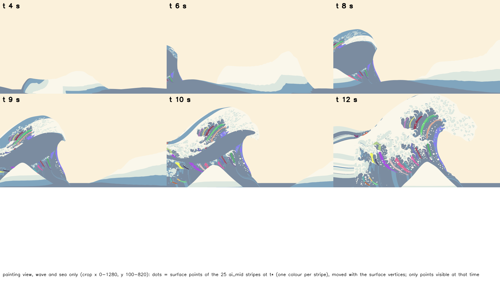
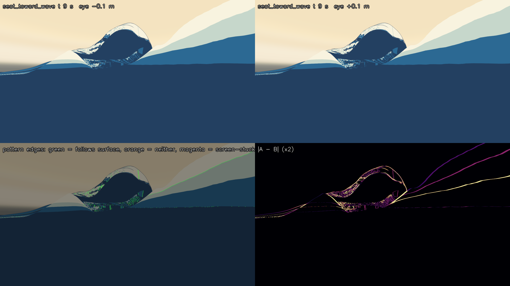

# 設計37：波の流れに沿う線（水面の変形と模様の安定） ― 縞と海の段が面に付いて動き、形成の全区間と頭の揺れ（左右 ±0.1 m）で画面に貼り付かないことを確かめる

日付：2026-09-30／状態：**閉じた（最小の受入は満たした）**。修正は 1 回（Q26 の上限。第 6 節）。進行役の独立の検査は pass = true で、必須の指摘 1 つ（頭の揺れの形成の動画のカメラ）を修正1回目で直した。証拠の種類は次のとおり。**HMD 実機の結果ではない。利用者は確かめていない。**

- 作る部（第「流れに沿う線」部）：Unity 6000.4.3f1 の Editor の batchmode の PC オフスクリーン描画（camera.Render、RTX 3080、Direct3D11。設計36 の場面の描き方のまま）と、numpy/OpenCV の評価（`ds37_flow_eval.py`）。頭の揺れは、座席のカメラを左右へずらした PC の描画で、HMD の頭の追跡ではない。
- 進行役の独立の検査（作る部の評価のコードを使わずに書いた numpy/OpenCV。動画から取り出したコマを自分で見た。シェーダーのコードを読んだ。写しは Git 対象外の `Unity/Build/Design/37/indep_check/`）
- 修正1回目の確かめ（`ds37_fix1_check.py`）と、記録の道具 `ds37_record.py`（作る部の出力とコードの SHA-256 の照合、設計36 と同じファイルであることの照合、証拠の図と写し、metrics.json・run.json）

番号の前提：

- 対象：[段階9までの実行計画](../Design/Stage9_Plan_2026-09-26_ja.md)（以下「計画」）§2.3 の設計37。使える水準の成果物は「縞（美術優先31 の追従）を形成・崩壊の全区間で見る動画」と「座席で頭を動かす想定の視点の揺れ（左右 ±0.1 m）でも模様が泳がないことの動画」、最小の受入は「177 の値を引き継ぐ。模様の画面への貼り付き 0」、バックログは 177・191（事前検査）。崩壊は作らない（Q11）ので、「全区間」は形成の t 0〜14 s と読んだ。
- 引き継ぎ：
  - 主役波の動き：設計28修正01 の `Unity/Build/Design/28R01F/F_final`（DS27 ＋精度の層）と最後の一コマ `kstar_final`（K\*′ R4）。表示用サーフェスと色の焼き込みは[設計29修正01](Design_29_修正01_ja.md)（UV-SDF の表 `af28r01_uvsdf_a45.bin` `69c0b26d…`）。
  - [設計30](Design_30_ja.md)：周りの海 near・far と単一再生。[設計31](Design_31_ja.md)〜[設計35](Design_35_ja.md)：白の帯・飛沫・爪の 3 層と既定の版。
  - [設計36](Design_36_ja.md)：場面 `DS36_Palette.unity`（`38a02743…`。調色板と海の 4 段）。設計36 から設計37 へ渡されたのは、t ≈ 10.9〜11.1 s の主役波の模様の 1 コマだけの跳びと、爪と海の段の境に加わった跳び（設計36 の限界 5）。
  - [美術優先31](Step_31_ja.md) の 177（同じ縞が同じ水面とともに上がる）：藍中の帯 25 本、帯の表示は全 47 時刻で 100% 藍中（ID の画像）、下側 8 本の並びの入れ替わり 0、終点 77 1.17 px・118 0.66 px。
- 時間の上限：Q26 の日程で 3 時間（計画の時間枠は ≤0.5 日）。範囲は最小の受入だけで、修正は 1 回まで。
  - 実績（ファイルの時刻。`flowlines/_started.txt` と [metrics.json](../Evidence/Design/37/metrics.json) の `time`）：作る部の着手 04:50:45、終了 05:21:33（約 31 分）。進行役の独立の検査 05:26〜05:35。修正1回目 05:37:01〜05:40:31（約 3.5 分）。記録 05:44 ごろ〜（終わりは `Unity/Build/Design/37/READY_TO_COMMIT.txt` の時刻）。修正の終わりまでで約 50 分。
  - 1 回の計算：Unity の描画 53.0 s（作る部の最後の実行 run4）と 27.8 s（修正1回目）、評価 173.3 s、記録の道具 約 10 s。どれも 30 分の上限より十分短い。
- 修正回数：1（頭の揺れの部品の基準の位置。第 6 節）。受入の判定の前の作る途中の直し 3 つは数えない。
- 対応するバックログ：177（合格）、191（事前検査、記録のみ。合否は設計38）。模様の画面への貼り付き 0（合格）。値は [metrics.json](../Evidence/Design/37/metrics.json) の `acceptance`・`record_only_191_precheck`・`backlog`。
- 読むだけで変えていないもの：設計30・34・36 の場面、設計27・30・31・34・36 のシェーダーとスクリプト、設計29修正01 の焼き込み、設計33 の爪の表、設計36 の海の表、設計30 の海のパッケージ（守るファイル 18 個。作る部と修正1回目の描画の前後で SHA-256 が同じ、`protectedUnchanged = true`。一覧は run.json の `protected_files`）。評価器のファイルも変えていない。
- 座標と単位：m・s。t は体験の時刻（コマ k は t = k/30 s、421 コマ）、t\* は t = 12 s（コマ 360）。画像の画素は 1920 × 1080 の表示の px。
- 使っていないもの：参照モデル、利用者の解算、写真のフォルダー、Blender・Houdini。爪形分析のフォルダー（`G:\research\爪形分析`）は、作る部も検査も記録の道具も開いていない。記録の時のコミットの一覧の点検でだけ、そのフォルダーのファイルの大きさと SHA-256 を読み取りのみで調べた（第 9 節）。
- git：作る部・修正・記録は使っていない。進行役の独立の検査は、読み取りのみの `git status` で tracked のファイルに変更がないことを見た（報告の値。何も変えていない）。

## 見るもの

| 縞（藍中の帯 25 本）の面の点を、同じ面の点のまま形成の途中へ動かした図（原画視点、t 4・6・8・9・10・12 s） | 頭の揺れ：座席から波の方向 t 9 s、目 −0.1 m と +0.1 m（下左は模様の縁の判定、下右は差） |
| --- | --- |
|  |  |

図は Unity の PC 描画と、その数値の図である（1920 × 1080。元の図は Git 対象外の `Unity/Build/Design/37/flowlines/fig/`）。帯の追跡の図は、t\* の帯の画素の面の点（帯ごとの色の点）を各時刻の頂点で原画視点へ投影したもので、見えている点だけを描いた。下の 3 分の 1 は空白（見た目だけの傷。第 10 節の 8）。

動画（1920 × 1080、30 fps。Unity の PC 描画。白の時間場・爪・飛沫を入れた作品のままの読み）：

- 頭の揺れ：[座席・形成の全区間 t 0〜14 s を目 ±0.1 m・周期 2 s で揺らしながら](../Evidence/Design/37/ds37_sway_seat_formation_30fps.mp4)（421 コマ、1,430,775 バイト。修正1回目で描き直したもの）、[座席・t\* のまま 4 s 揺らす](../Evidence/Design/37/ds37_sway_seat_tstar_30fps.mp4)（121 コマ、852,858 バイト）、[座席から波の方向・t 9 s のまま 4 s 揺らす](../Evidence/Design/37/ds37_sway_seat_toward_wave_t09_30fps.mp4)（121 コマ、418,232 バイト）
- 形成の全区間（t 0〜14 s）：原画視点と座席の動画は設計36 の動画と SHA-256 まで同じファイルなので、写さずに設計36 の証拠を指す：[原画視点](../Evidence/Design/36/ds36_palette_painting_30fps.mp4)（`26cedf9c…`）・[座席 v1](../Evidence/Design/36/ds36_palette_seat_30fps.mp4)（`bff6297d…`）

図：

- [頭の揺れの拡大](../Evidence/Design/37/fig_ds37_sway_triptych.png)：座席から波の方向 t 9 s と座席 t\* の、目 −0.1・0・+0.1 m。
- [組ごとの追従と残り](../Evidence/Design/37/fig_ds37_follow_vs_stay.png)：形成の組（t, t + 0.1 s）と頭の揺れの組の、面とともに動いた割合（緑）、画面の元の位置に残った割合（紫）、光学的な流れの比（黒の点）。
- [191 の事前検査](../Evidence/Design/37/fig_ds37_191_precheck.png)：外殻線の連続 301 コマの時系列（原画視点 青・座席 橙）。
- 修正1回目：[揺れなし・修正前・修正後（t 4・8・9 s）](../Evidence/Design/37/fig_ds37_fix1_sway_formation_a.png)・[同（t 10.5・12・13.5 s）](../Evidence/Design/37/fig_ds37_fix1_sway_formation_b.png)。修正前は t 8 s ごろから船体の内側が画面を埋める。

数値：

- [metrics.json](../Evidence/Design/37/metrics.json)：最小の受入 `acceptance`（作る部・独立の検査・組の集計 `builder_groups`）、`record_only_191_precheck`、回帰 `regression_plan_2_0`、設計36 から渡された跳び `ds36_handoff_single_frame_flicker`、修正 `fix_rounds`、時間 `time`
- 作る部の写し：[ds37\_flowlines\_metrics.json](../Evidence/Design/37/ds37_flowlines_metrics.json)（組ごと・帯ごと・191 の時系列・修正1回目のコマごとの値）、[ds37\_run.json](../Evidence/Design/37/ds37_run.json)
- 進行役の独立の検査：[貼り付き](../Evidence/Design/37/ds37_indep_stick.json)（70 組）・[177](../Evidence/Design/37/ds37_indep_177.json)
- 実行条件と SHA-256：[run.json](../Evidence/Design/37/run.json)

**見え方の注意**：この番号は作品の見え方を変えていない（原画視点・形成の動画は設計36 と同じファイル）。新しい線は足していない。線は設計27〜30 の外殻線 v0 のまま（爪の縁の線、継ぎ目をまたぐ線、海と手前の小波の線はまだない。設計38）。崩壊は作らない（Q11）。

## 0. 結論

1. **模様は面に付いて動き、画面に貼り付かない。** 流れに沿う線は、新しい要素を足さずに、今ある 2 つの模様とした。
   - 主役波の縞：美術優先28 の UV-SDF（設計29修正01 の焼き込みを UV3 で読む）。
   - 周りの海 near・far（手前の小波と右の高い波を含む）の設計36 の段：頂点ごとの t\* の相対の高さ。
   - どちらも色は頂点に付いた値だけで決まり、画面の位置や視線の向きを使わない（シェーダー `DS27 NPR White` と設計36 の表。独立の検査もコードを読んで同じと確かめた）。この番号では、形成の全区間と頭の揺れで、それが画面の上で本当に面とともに動くことを画素ごとに測った。
2. **最小の受入はすべて合格。**
   - 177 の値を引き継ぐ（今の動きで測り直した）：藍中の帯 25／25 本が面の成分へ対応し、同じ面の点が t 2 s → t\* で全部上がる（1.57〜8.41 m）。下側 8 本の原画視点の並びの入れ替わりは t 2〜12 s の 41 時刻で 0。帯の画素が白の時間場で白に塗られるのは 26 時刻で 0 画素。終点 77 0.867 px・118 0.867 px（≤ 4 px）。独立の検査も同じ読み（上がり 1.52〜8.38 m、入れ替わり 0、白 0）。
   - 模様の画面への貼り付き 0：形成の組（t, t + 0.1 s）52 組と頭の揺れの組 18 組の計 70 組で、貼り付きの塊（10 px 以上）0 個。見分けられる模様の縁 251,437 画素のうち、面とともに動いた割合 0.935、元の位置に残った割合 0.042。感度の対照（次の画像を前の画像に置き換えた＝画面に貼り付いた模様）では、見分けられる縁が 200 px 以上の 37 組の全部で塊が出た。独立の検査（別の測り方）でも、模様だけの形成の組と頭の揺れの組で、面とともに動いた割合 0.9999・0.9996。
3. **191（事前検査、記録のみ）**：外殻線の連続 301 コマ（t 2〜12 s）で、一瞬だけ出た線 0、跳び 0。一瞬だけ消えた線の塊は原画視点 530・座席 35（2 本の線が寄り合う所と、1〜2 px の細い線のちらつき）。合否は設計38。
4. **計画 §2.0 の回帰なし（原画視点）**：原画視点に触れていない。t\* の原画視点の画像は設計36 の画像と SHA-256 まで同じ（`ba5fcc16…`）なので、評価器の値は設計36 のまま（78・130・131 の差 0.0、132 σ12 3.7552 px、72 σ24 p95 3.8423 px）。
5. **修正1回目**：独立の検査が見つけた動画の傷（頭の揺れの形成の動画で、座席のカメラが船の上下に付いていかず、t 8 s ごろから船体の内側が映る）を直した。揺れ 0 のコマ 15 枚で揺れのない座席の動画との差の平均は最大 0.273（修正前 52.688）。受入の数は変わらない（入力が同じファイル）。
6. **HMD（PS VR2）は保留**（導入は利用者の手）。Mock の両眼も描いていない（設計38）。
7. **限界（第 5 節）**：座席は t 1〜7 s に模様の縁がほとんど見えない、far のシートは見分けられる縁が少ない、爪は数で測っていない。設計36 から渡された 1 コマだけの跳びは測っていない（値は設計36 のまま）。細い線のちらつきと 191 の欠けは設計38 へ。新しい流れの線（手前の小波・海の縞）は足していない。

---

## 1. 目的

設計書の設計37 は、波の流れに沿う線（縞）が、水面の変形とともに動き、模様が画面の上で泳がない（画面に貼り付かない）ことを作る番号である。縞そのものは美術優先の番号（35e9002 の UV-SDF）と美術優先31（177 の追従）でほぼ作ってあり、計画 §2.3 の残りは次の 2 つである。

- 縞を形成の全区間で見る動画（177 の値を今の動きで引き継ぐ）。
- 座席で頭を左右 ±0.1 m 動かす想定でも、模様が泳がないことの動画と、模様の画面への貼り付き 0 の確かめ。

設計28修正01 で動きが F\_final に、設計29修正01 で表示用サーフェスが作り直され、設計36 で周りの海に段の模様が付いたので、この番号では今の動きと今の場面で測り直した。あわせて 191（線の点滅・跳び）の事前検査を記録した。Q26 により、最小の受入だけを満たし、修正は 1 回までとした。設計36 から渡された 1 コマだけの跳び、設計28・29・30 から渡された描画の傷、線に関わるもの（継ぎ目をまたぐ外殻線、海と小波の線、谷の線）は、この番号の最小の受入の外で、設計38 へ渡す。

---

## 2. 表

### 2.1 最小の受入（作る部・進行役の独立の検査）

| 項目 | 作る部 | 進行役の独立の検査 | 判定 |
| --- | --- | --- | --- |
| 177 帯の対応 | 美術優先31 と同じ藍中の帯 25 本（`colour_truth.json` の `stripes.ai_mid_bands`）のうち 25 本を、主役波の色区の表の藍中の成分へ対応（t\* の帯の画素 24,338、帯ごとに 102 以上） | 25 本。t\* の頂点から自分の補間と原画のカメラの行列で投影し直した位置の誤差 p99 ≤ 0.412 px（面の座標の描画が正しいことの確かめも兼ねる） | 合格 |
| 177 同じ面の点が上がる | 全 25 本が t 2 s → t\* で上がる：1.573〜8.409 m（高さ t 2 s 0.916〜4.924 m → t\* 2.636〜13.149 m）。途中で下がる帯は 12 本で、下がりの合計の最大 1.211 m・0.25 s ごとの最大 0.142 m（どちらも A005、唇が投げ出された後に水面ごと下がる） | 全 25 本が上がる：1.515〜8.375 m（高さ 0.915〜4.863 m → 2.618〜12.969 m）。0.25 s ごとの下がりの最大 0.144 m（A005）。違いは画素の選び方と補間（作る部は三角形、検査は双線形） | 合格 |
| 177 下側 8 本の並び | A024・A021・A028・A018・A002・A006・A003・A001 の原画視点の x の並びの入れ替わり：t 2〜12 s の 41 時刻で 0 | 0（41 時刻） | 合格 |
| 177 帯の表示 | 26 時刻（t 1〜13 s と +0.1 s）で、帯の画素が白で塗られる 0 画素。表示が藍中の割合は最小 0.99375（帯が 20 px 以上見える 16 時刻。記録のみ。藍中でない画素は帯の中の 1 画素より細い白・淡い水色の点の混色） | 背景と外殻線を切った原画視点で、帯の面の点を 26 時刻追った：19,294 画素のうち藍中 19,225、白 0、淡い水色 0、藍濃 0、混色 69（藍中の割合 0.9964）。帯がこの視点で見え始めるのは t 6.1 s | 合格（白 0。藍中の割合は記録） |
| 177 終点 | 77 0.867 px・118 0.867 px（設計36 の t28\_claws の評価器。t\* の原画視点の画像が同じ） | 同じ（画像が設計36 と同じファイルで、設計36 の検査が評価器の値を再現済み） | 合格（≤ 4 px） |
| 模様の画面への貼り付き 0 | 70 組で貼り付きの塊 0 個（貼り付きの画素は全部で 27、どれも 10 px 未満のまとまり）。感度の対照は 200 px 以上の 37 組の全部で検出（最少 2 個） | 70 組。模様だけ（白の時間場なし）の形成 26 組：塊 0、面とともに動いた割合 0.9999（最も低い組 0.9997）。頭の揺れ 18 組：0.9996（最も低い組 0.9985）、塊 1 個（11 px、細い線のアンチエイリアス。下の注）。白の時間場ありの形成 26 組：塊 11 個（どれも白の前線が面の上を広がる所。下の注）。対照は 37 組の全部で検出（元の位置に残った割合 1.0） | 合格 |

- 美術優先31 との比べ：美術優先31 は t 2 s の高さが 0 m だったが、今の動き（F\_final）は t 2 s ですでに 0.9〜4.9 m 上がっている。上がり方・並び・白で塗られないことの読みは同じで、終点は 77 が 1.17 → 0.867 px、118 が 0.66 → 0.867 px（どちらも ≤ 4 px）。
- 帯の読みは、背景（船・富士など）と外殻線を切った原画視点（評価器の K\* の画像と同じ切り方）で行った。背景ありでは左下の 4 本（A024・A021・A028・A018）が手前の船に隠れる。
- 独立の検査の頭の揺れの塊：座席から波の方向 t 12 s、目 −0.1 → +0.1 m、表示 (927, 497) の 11 px。幅 1 px の藍中の線が、視点がずれた後（この組の面の動きの中央値 11.19 px）にアンチエイリアスで違う切れ方をした所で、線そのものは面とともに動いた（独立の検査の読み。作る部も同じ組に「移し替えの試しだけ」の塊を 1 個数え、その塊の光学的な流れの比は 1.0003）。
- 独立の検査の白の時間場ありの塊 11 個（原画視点の t 6・9・10 s）：前の画像では白が届く前の藍中、次の画像の同じ面の点は白で、白の時間場を切った描画（終態の色区）でもそこは白（独立の検査の読み）。白が面の上を広がる作りどおりの動きで、画面への貼り付きではない。

### 2.2 貼り付きの組の集計（作る部。`metrics.json` の `builder_groups`）

「見分けられる縁」は、模様の縁の画素のうち面の動きの法線の成分が 3 px 以上のもの（追従と貼り付きを見分けられる所）。追従は面の動きどおりの位置に同じ模様があった割合、残りは画面の元の位置に残った割合（どちらも見分けられる縁の画素の重み付き）。光学的な流れの比は、OpenCV の DIS の法線の成分 ÷ 面の動きの法線の成分の、組ごとの中央値（追従 1、貼り付き 0）。

| 組 | 組の数（縁のある組） | 見分けられる縁（主役波／near／far） | 追従 | 残り | 流れの比（組ごと） | 貼り付きの塊 | 対照（塊の最少） |
| --- | --- | --- | --- | --- | --- | --- | --- |
| 形成 原画視点 白なし | 13（9） | 62,296（48,106／14,190／0） | 0.9313 | 0.0600 | 0.9035〜1.0 | 0 | 5 |
| 形成 原画視点 白あり | 13（9） | 59,442（45,230／14,212／0） | 0.9276 | 0.0565 | 0.8684〜0.9995 | 0 | 5 |
| 形成 座席 白なし | 13（4） | 14,897（13,161／1,736／0） | 0.9558 | 0.0287 | 0.9938〜0.9994 | 0 | 9 |
| 形成 座席 白あり | 13（4） | 14,888（13,152／1,736／0） | 0.9558 | 0.0287 | 0.9945〜0.9994 | 0 | 9 |
| 頭の揺れ 座席（t 6・9・12 s） | 9（6） | 38,358（36,029／2,329／0） | 0.9651 | 0.0168 | 0.9949〜0.9995 | 0 | 2 |
| 頭の揺れ 座席から波の方向（t 6・9・12 s） | 9（7） | 61,556（54,264／7,292／0） | 0.9163 | 0.0316 | 0.9964〜1.0023 | 0 | 3 |
| **合計** | **70（39）** | **251,437（209,942／41,495／0）** | **0.9348** | **0.0419** | **0.8684〜1.0023（中央値 0.9976）** | **0** | **2** |
| 記録のみ：形成 1 s の組（t, t + 1 s） | 48（24） | 165,432 | 0.8991 | 0.0189 | −0.5446〜1.0002 | 0 | 13 |

- 形成の組は t = 1〜13 s（1 s ごと）の (t, t + 0.1 s)（3 コマ）。座席は t 1〜7 s に模様の縁が見えず（空と船がほとんど）、t 12・13 s は t\* の後で面が動かないので、縁のある組は t 8〜11 s だけ。頭の揺れの組は、目 0 → +0.1・0 → −0.1・−0.1 → +0.1 m の 3 組 × 3 時刻 × 2 視点。
- 追従でも残りでもない画素（見分けられる縁が 200 px 以上の組）：形成の組で 0〜12.8%、頭の揺れで 0〜8.8%。中身はアンチエイリアス・隠れ・細い線と、唇の縁の細かい模様（限界 5）。
- 貼り付きの判定は「移し替えの試し」と「光学的な流れの比が 0.5 未満」の両方が示す画素（第 3.2 節）。片方だけの塊は、移し替えの試しだけ 4 個（どれも幅 1〜2 px の細い藍の線の中で、流れの比 1.0044・0.9981・0.9984・1.0003）、流れの比 < 0.3 だけ 12 個（11 個が白の時間場ありの原画視点 t 10.0 → 10.1 s で、そのうち 10 個は白の前線から 4 px 以内）。
- 1 s の組は、1 s の間に唇が伸びて細かい模様の形が変わり、170 px ほど動く所では動かさない所が別の細かい模様と偶然合うので、記録のみにした（貼り付きの塊 0。追従の最も低い組 0.4091）。

### 2.3 191 の事前検査（記録のみ。`record_only_191_precheck`）

外殻線（ID の描画のマゼンタ）の連続 301 コマ（コマ 60〜360、t 2.0〜12.0 s、飛沫なし・爪あり）。

| 視点 | 線の画素の中央値 | 一瞬だけ出た線の塊 | 一瞬だけ消えた線の塊（最初のコマ） | 跳びの塊 | 主役波の頂点の画面の動きの最大（中央値） |
| --- | --- | --- | --- | --- | --- |
| 原画視点 | 1,682 | 0 | 530（コマ 169〜：t 5.6 s〜） | 0 | 9.942 px／コマ |
| 座席 | 0 | 0 | 35（コマ 271〜：t 9.0 s〜） | 0 | 0.0 px／コマ |

- 一瞬だけ消えた線：前後のコマで同じ画素に線があり、そのコマだけ 1.5 px の内に線がない所の 10 px 以上の塊。動く速さの違う 2 本の線が寄り合う所と、1〜2 px の細い線のアンチエイリアスのちらつき。
- 単純な点滅の割合（前後と違い、前後どうしは同じ画素）の中央値は原画視点 0.59 で、細い線が 1 コマに線幅より大きく動くと大きくなるので意味をなさない（記録のみ）。動きの遅いコマ（原画視点 15・座席 200）では点滅の塊 0。
- 座席は t 8.6 s ごろまで外殻線がほとんど映らない（[時系列の図](../Evidence/Design/37/fig_ds37_191_precheck.png)）。独立の検査は 191 を測り直していない（記録のみの項目なので）。

### 2.4 回帰（原画視点。計画 §2.0。`regression_plan_2_0`）

| 比べたもの | 設計37 | 設計36 | 同じか |
| --- | --- | --- | --- |
| t\* の原画視点の画像（爪あり） | `unity/check/ds37_painting_tstar.png` | `t28_claws/t28/render/af28r01_painting.png` | SHA-256 まで同じ（`ba5fcc16…`） |
| 形成の動画 原画視点 | `ds37_formation_painting_30fps.mp4` | `ds36_palette_painting_30fps.mp4` | 同じ（`26cedf9c…`） |
| 形成の動画 座席 | `ds37_formation_seat_30fps.mp4` | `ds36_palette_seat_30fps.mp4` | 同じ（`bff6297d…`） |

- 画像が同じなので、その画像から測る評価器の値は設計36 の爪ありの値のまま：78・130・131 の差 0.0、132 σ12 最大 3.7552 px、72 σ24 p95 3.8423 px、両側の読みの判定の変化 0（175 は不合格のまま、267 の判定の欄は評価器の定義のままの読みを写した fail の文字で、両側の読みの白の帯は 0。設計36 の記録の第 2.2 節）。評価器は回し直していない。
- 爪なし（`t28_white`）の画像は、この番号では描いていない。
- 独立の検査は、背景と外殻線を切った t\* の原画視点の画像も、設計36 の画像と画素まで同じと確かめた。

### 2.5 修正1回目の確かめ（`fix_rounds`・`ds37_fix1_check.py`）

頭の揺れの形成の動画を、揺れのない座席の形成の動画とコマごとに比べた（差は 0〜255 の画素の差の絶対値の平均。ずれは位相相関で 1920 × 1080 の px に直した値）。

| 読み | 修正前 | 修正後 |
| --- | --- | --- |
| 揺れ 0 のコマ（i が 30 の倍数、15 コマ）の差の平均の最大 | 52.688 | 0.273（15 コマの平均 0.081） |
| t 8・9・12 s（揺れ 0）の差の平均 | 19.655・37.211・52.683 | 0.016・0.021・0.242 |
| t ≥ 8 s の全コマの差の平均 | 46.619 | 1.765 |
| 全 421 コマの差の平均の最大 | — | 5.583（揺れ ±0.1 m のコマ） |
| 全 421 コマの画面のずれの最大（上下／左右） | 船体で画面が埋まり意味をなさない | 0.947 px／6.384 px |

- 合否の読み（進行役の判断）：揺れ 0 のコマの差の平均 ≤ 1、上下のずれ ≤ 2 px（揺れは左右だけ）→ 合格。
- 修正の描き直しで、ほかの動画 4 本、頭の揺れの静止画 18 組（色と面の座標の 36 ファイル。記録の道具で数え直し 36／36）、t\* の原画視点の画像は、修正の前と SHA-256 まで同じ。変わったのは頭の揺れの形成の動画だけ（`62da63e2…` → `4b9a51c0…`）。

---

## 3. 作り方と、採ったもの

### 3.1 Unity（`Unity/Assets/GreatWave/Design37/`）

- `Scenes/DS37_FlowLines.unity`（`9f0ca68c…`）：設計36 の `DS36_Palette.unity` の写しに、座席 `seat` と `seat_toward_wave` のカメラへ部品 `DS37HeadSway` を足しただけ（独立の検査も、違いはこの 2 つだけと確かめた）。色の描画の設定は設計36 のまま。
- `Scripts/DS37HeadSway.cs`：カメラをそのカメラの右の向きへ dx ずらす部品。Editor の検査は `Apply`・`Restore` を直接呼び、Play モードでは `swayInPlayMode` のとき振幅 0.1 m（計画の値）・周期 2 s（既定値）の正弦波で揺らす（場面では切）。修正1回目で、ほかの部品（船の上下 `DS30BoatHeave`）が位置を書き換えていたら今の位置を基準に読み直す形にした。
- `Shaders/DS37_Surface_Coord.shader`：検査用。シート（主役波・near・far）の格子の座標（列・行。三角形の中は透視補正の線形補間＝面の上の同じ点）とシートの番号を浮動小数で書く。作品の描画には使わない。
- `Editor/DS37Render.cs`：t\* の原画視点（回帰の確かめ）、形成の組（t 1〜13 s と +0.1 s・+1 s、原画視点・座席、白の時間場あり・なし、色・面の座標・カメラの行列・全頂点の位置）、177 の原画視点（背景と外殻線を切った `flowk`）、頭の揺れ（2 視点 × t 6・9・12 s × 目 −0.1・0・+0.1 m）、177 の主役波の頂点（0.25 s ごと）、191 の外殻線の連続 301 コマ（1 bit）、動画 5 本を描く（約 1 分）。守るファイルの SHA-256 を前後で比べる。
- 道具（`Tools/GWWaveGen/ds37/`）：`run_ds37_unity.ps1`（Unity の 1 回の実行と `unity.lock`）、`ds37_flow_eval.py`（受入と図 3 枚）、`ds37_figs.py`（帯の追跡と頭の揺れの拡大の図）、`ds37_run_record.py`（作る部の実行の記録）、`ds37_fix1_check.py`（修正1回目の確かめ）、`ds37_record.py`（記録）。

### 3.2 測り方（作る部）

- **面の動き**：前の画像の各画素の面の座標（シート・列・行）の点を、次の時刻の全頂点の位置（GPU の読み戻し、頂点シェーダーと同じ関数）で同じ三角形に補間し、次のカメラの行列で投影した位置との差。自分のカメラへ戻した誤差は p99 ≤ 0.041 px。次の画像で同じ面の点が見えているかも確かめる。
- **模様**：画素を調色板の 4 色（白・淡い水色・藍中・藍濃）の最も近い色へ分けた色区。縁の画素＝同じシートの中の 2 つの色区の境（線・シートの縁・爪・調色板の外から 2 px 離す）。
- **貼り付きの画素**：(1) 移し替えの試し（縁の両側 ±1.5 px の色区が、動かさない所では次の画像と合い、面の動きだけ動かした所では合わない）と、(2) 光学的な流れ（DIS、MEDIUM）の法線の成分が面の動きの法線の成分の半分未満、の両方。8 近傍の 10 px 以上の塊を数え、全ての組で 0 を合格とした（既定値、進行役の判断）。
- **177**：t\* の原画視点で多角形（1 px 縮めた）の中の藍中に見える主役波の画素の面の点を、色区の表の藍中の 8 近傍の成分へ分け、帯の画素の 10% 以上が入る成分をその帯の成分とした（美術優先31 と同じ規則。テクセルではなく画素の面の点）。高さは同じ面の点のワールドの y の平均（0.25 s ごと）、並びは同じ面の点の原画視点の x の中央値。
- **独立の検査の測り方**（別のコード）：面の動きは、次の画像の面の座標の描画を逆に引いて求めた（最も近い画素と Newton の 1 歩。頂点の読み戻しとカメラの行列を使わない）。画素は 3 × 3 の内側の色区で、面が 3 px 以上動き、2 つの仮説（面とともに動く・画面に残る）が次の画像で違う色区を予言する所だけを判定した。

### 3.3 採ったもの（Q24。進行役の判断で、利用者の決定ではない）

- **新しい線の要素を足さず、今の縞（UV-SDF）と海の段（頂点の値）が面に付いていることを、形成の全区間と頭の揺れで確かめる。** 理由：計画 §2.3 の設計37 の使える水準は「縞を全区間で見る動画」と「頭の揺れで模様が泳がないことの動画」で、原画視点を変えないので計画 §2.0 の回帰の危険がない。Q26 の最小の受入。
- **貼り付きの判定を 2 つの測り方の両方が示す所にする。** 理由：移し替えの試しだけでは、±1.5 px の両側の見本が 1〜2 px の細い線を分けられず、線の中に誤った塊が出た（最初の実行で 4 個。流れの比は 0.998〜1.004 で、模様は面とともに動いていた）。光学的な流れの比だけでは、白の前線（面の上を広がる作りどおりの動き）を誤って数える。
- **頭の揺れは振幅 0.1 m・周期 2 s の正弦波**（振幅は計画の値、周期は既定値）。静止画の組は目 0 → ±0.1、−0.1 → +0.1 m の 3 組。
- **落とした (1)**：周りの海の斜面に t\* の高さの等高線の縞（流れに沿う線）を足す案。新しい見え方で原画視点が変わり、評価器の回帰の確かめが要る。手前の小波の線は設計38 に割り当て済み。
- **落とした (2)**：片方だけの貼り付きの判定（上の理由）。
- **落とした (3)**：1 s の組で合否を出すこと。1 s の間に唇の細かい模様の形が変わり、動かさない所で偶然合う（第 2.2 節）。画面への貼り付き（泳ぎ）はコマの間の現象なので、合否は 0.1 s（3 コマ）の組と頭の揺れで出した。

---

## 4. 関門

| 最小の受入・規則 | 基準 | 値 | 判定 |
| --- | --- | --- | --- |
| 177 の値を引き継ぐ | 25／25 本、全部上がる、下側 8 本の入れ替わり 0、帯の画素が白で塗られる 0、終点 ≤ 4 px（読みは進行役の判断） | 25／25、1.57〜8.41 m、入れ替わり 0、白 0、77 0.867 px・118 0.867 px（独立の検査も同じ読み） | 合格（PC の描画） |
| 模様の画面への貼り付き 0 | 全ての組で貼り付きの塊（10 px 以上）0、感度の対照が塊を出すこと（既定値） | 70 組で 0、対照は 37／37 組で検出（独立の検査も模様だけの組と頭の揺れで追従 0.9999・0.9996） | 合格（PC の描画。HMD の頭の追跡は保留） |
| 191（事前検査） | — | 一瞬だけ出た線 0・跳び 0・一瞬だけ消えた線 原画視点 530・座席 35 | 記録のみ（合否は設計38） |
| 計画 §2.0 の回帰 | 78・130・131・132・72・69・70・212、色区の項目は 29修正01 の読み | 原画視点の画像が設計36 と同じファイル。値は設計36 のまま | 合格（後退なし） |
| 121・175（仕上げ36）、厳しい色の読み（仕上げ28） | 悪くしない | 原画視点が同じなので同じ値（175 は不合格のまま） | 悪くしていない |
| HMD（PS VR2） | — | — | 保留（導入は利用者の手） |

---

## 5. 限界

1. **座席は形成の前半に模様がほとんど見えない。** 座席のカメラは船とともに揺れ、t 1〜7 s は空と船がほとんどで、見分けられる模様の縁がない（頭の揺れの t 6 s も 0）。模様の多い確かめは、原画視点、座席から波の方向、座席の t 8〜12 s から来ている。
2. **far のシートの証拠は少ない。** 見分けられる縁（面の動き 3 px 以上）は作る部で 0 画素、独立の検査で 108 画素（小さく遠い）。周りの海は near（作る部 41,495 画素）で見た。
3. **爪は数で測っていない。** 爪の色は頂点の値（UV0・UV1）で決まり、作りから面に付く（シェーダーのコードで確かめた）。動画で見える。飛沫は模様を持たない。
4. **191 の一瞬だけ消えた線**（原画視点 530・座席 35）。線幅・アンチエイリアス・線の連続は設計38。
5. **唇の縁の段・モアレ（設計29修正01 から渡されたもの）は別に測っていない。** 追従でも残りでもない画素（形成 0〜12.8%、頭の揺れ 0〜8.8%）にはこれとアンチエイリアス・隠れが入る。
6. **幅 1 px の細い藍中の線は、視点がずれるとアンチエイリアスの切れ方が変わる**（独立の検査の頭の揺れの唯一の塊。線は面とともに動いた）。191 のちらつきとともに設計38・仕上げ37。
7. **白の時間場の前線は面の上を広がる**（作りどおり）。白ありの組の独立の検査の塊 11 個と、作る部の流れの比だけの低い塊の多くはこれ。
8. **設計36 から渡された 1 コマだけの色の跳びは、この番号で測っていない。** t ≈ 10.9〜11.1 s の主役波の白と淡い水色の模様の跳びと、爪と海の段の境の跳び。形成の動画は設計36 と同じファイルなので、値は設計36 の記録の数え直しのまま（原画視点の最大 1,192 画素（コマ 328）・50 画素を超えるコマ 70、座席 v1 1,597 画素（コマ 330）・46。`ds36_handoff_single_frame_flicker`）。0.1 s（3 コマ）の貼り付きの試しは 1 コマだけの跳びを見分けない。設計38（線と色の境の点滅・跳び）と仕上げ30・37 へ渡す。
9. **新しい流れの線は足していない。** 手前の小波・右の高い波の流れの線と海の上の縞はない。手前の小波の線は設計38、縞の分岐と船上で新たに見える面の縞は仕上げ37。
10. **海の段は t\* の高さから頂点ごとに決まる**（設計36 の限界 2）。模様が面に付いて動くことはこの番号で確かめたが、形成の途中の今の高さには従わない。仕上げ30。
11. **設計28・29・30 から渡された描画の傷と線は直していない**：唇の端の梯子・モアレ、縦の継ぎ目、前面の足の縦の筋（[頭の揺れの拡大の図](../Evidence/Design/37/fig_ds37_sway_triptych.png)の座席から波の方向 t 9 s でも、波の足に縦の段が見える）、頂の爪の模様が埋まること、原画視点の左端の横縞、海のシートと主役波の縁の 10 列に外殻線がないこと（継ぎ目をまたぐ線）、手前の小波の泡と線、谷を読ませる線。設計38 へ。
12. **177 の「表示が藍中の割合」は記録のみ。** 美術優先31 の ≥ 0.999 は ID の画像の読みで、ここはアンチエイリアスありの色の画像（最小 0.99375、独立の検査 0.9964）。
13. **HMD（PS VR2）の頭の追跡での泳ぎは保留。** この番号の頭の揺れは PC のカメラのずらしで、Mock の両眼も描いていない（設計38）。
14. **崩壊は作らない**（Q11）。計画の「形成・崩壊の全区間」のうち、形成の t 0〜14 s だけを見た。
15. **検査用のシェーダーのファイルの時刻。** `DS37_Surface_Coord.shader` のファイルの時刻（05:22:05）は、作る部の最後の全部の描画（05:12）と作る部の終わり（05:21:33）より後。修正1回目の描き直しでこのシェーダーを読み込み直して描いた頭の揺れの静止画 36 ファイル（色 18・面の座標 18）は、修正前と SHA-256 まで同じ（記録の道具で数え直し 36／36）なので、コミットするシェーダーで同じ出力が出る。形成の組の面の座標は描き直していない。

---

## 6. 修正の記録（Q26：修正は 1 回まで）

| 回 | 変えたこと | 結果 |
| --- | --- | --- |
| 作る途中（受入の判定の前。修正の回に数えない） | 3 つを直した：① 1 回目の Unity の実行が batchmode で AsyncGPUReadback の一時の領域がたまってメモリーが尽きて落ちた（191 の 1 本目の途中。ログ `unity_ds37f_run1_crash_asyncreadback.log`）。落ちたのは自分の実行（`unity.lock` は DS37F run1）だったので止め、出力を消し、ReadPixels に替えた。② 177 の最初の試しで全部の藍中の成分（87 個）を帯としたのを、美術優先31 と同じ 25 本へ改め、背景ありの描画で左下の 4 本が船に隠れたので、背景を切った原画視点（`flowk`）を足した。③ 評価の 1 回目の試しの後、貼り付きの定義に光学的な流れの条件を足した（移し替えの試しだけの塊 4 個が細い線の誤検出だったため。`transfer_only_*` に残した。第 3.3 節） | 受入の判定へ |
| 受入の判定（Unity の run4 の出力 05:12:36、評価の出力 `eval_stdout.txt` 05:18:46。作る部の終わり 05:21:33） | — | 最小の受入はすべて合格（第 2 節） |
| 進行役の独立の検査（05:26〜05:35） | 自前のコードで 177 と貼り付きを測り直し、動画 5 本のコマを見て、シェーダーのコードを読んだ | pass = true。必須の指摘 1：頭の揺れの形成の動画で、t 8 s ごろから座席のカメラが船体の中に入る（揺れ 0 のコマでも揺れのない動画と差の平均 t 9 s 49・t 12 s 71。作る部の README の写し。独立の検査の図 `fig_chk37_sway_formation_camera_defect.jpg` は Git 対象外の `indep_check/`） |
| 修正1回目（05:37:01〜05:40:31） | 原因：`DS37HeadSway.Apply` が基準の位置を最初の 1 回だけ読み、動画の繰り返しでは t = 1/30 s 以降揺れが厳密に 0 にならないので `Restore` が呼ばれず、t = 1/30 s のカメラの位置が、`DS30BoatHeave` が時刻合わせのたびに書く船の上下を毎コマ上書きしていた（Play モードの揺れも同じ持ち越し）。直したこと：`DS37HeadSway` は、前に置いた位置からほかの部品に動かされていたら今の位置を基準に読み直す。`Restore` はほかの部品が書き換えた後の位置に触らない。`DS37Render.Video` は各コマで揺れを外してから時刻を合わせ、そのあと揺れを足す。場面は変えていない（直した欄は保存されない）。Unity を 1 回（27.8 s、`-ds37Skip scene,flow,flowk,h177,l191`、出力 `unity_fix1/`） | 揺れ 0 のコマの差の平均の最大 0.273（修正前 52.688）、上下のずれ ≤ 0.947 px（第 2.5 節）。変わったのは頭の揺れの形成の動画だけ。修正前の動画は Git 対象外の `unity_r1_sway_defect/` に残した |

---

## 7. 引き継ぎ

**段階7確認（自己評審）**：最初に見るものは、[帯の追跡の図](../Evidence/Design/37/fig_ds37_formation_bands.png)、頭の揺れの動画 3 本、第 2.1・2.2 節の表。この番号は作品の見え方を変えていないので、見え方の確認は設計36・38 の動画で行う。

**設計38**（輪郭線）

- 191：一瞬だけ消えた線（原画視点 530・座席 35。2 本の線が寄り合う所と細い線のちらつき）。一瞬だけ出た線と跳びは事前検査で 0。
- 幅 1 px の細い藍中の線のアンチエイリアスの切れ方（限界 6）。
- 設計36 から渡された 1 コマだけの色の跳び（t ≈ 10.9〜11.1 s の主役波の模様、爪と海の段の境。限界 8）。設計37 は測っていない。
- 設計28・29・30 から渡された描画の傷と線（限界 11）：唇の端の梯子・モアレ、縦の継ぎ目、足の縦の筋、爪の模様が埋まる、左端の横縞、継ぎ目をまたぐ外殻線、手前の小波の線、谷の線。
- Mock の両眼（線画素の左右差）。PS VR2 の H3・H6 は保留。
- 貼り付きの測り方（面の座標の描画と `DS37HeadSway`）は、線の「古い位置に残る線 0（192）」にそのまま使える。

**設計39**（紙・摺り・小飛沫）：「オンでも頭の移動で質感が泳がない」の確かめに、この番号の面の座標の描画・頭の揺れの部品・貼り付きの試しを使える。

**設計40**：原画視点はこの番号で変わっていないので、回帰の入力は設計36 と同じ。

**仕上げ37**（縞）：縞の分岐、船上で新たに見える面の縞、177〜179・209〜211・268・269。海の流れの線（落とした (1)）。

**仕上げ38**（線）：191〜198。

**仕上げ30**（周りの海）：海の段を今の高さで決める（限界 10）、手前の小波の泡、海の段の境の跳び。

**設計08〜10（PS VR2 の導入の後）**：HMD の頭の追跡で模様が泳がないことの確かめ（限界 13）。

---

## 8. 再現

リポジトリの根で行う。前提（どれも Git 対象外）：設計36 の準備の表と場面（`Unity/Build/Design/36/palette/prep/` と `DS36_Palette.unity`）、設計29修正01 の焼き込み（`Unity/Build/Design/29R01/bake_kp/`）、設計30 の周りの海、設計33 の爪、原画の色区の真値（`Tools/PaintingTruth/colour/colour_truth.json`）、設計36 の評価器の出力（`Unity/Build/Design/36/palette/unity/tstar_sym_t28_claws/tstar_sym.json`）。

道具は Unity 6000.4.3f1（batchmode、`Unity/Build/unity.lock` で排他）、`py -3.10`（numpy 2.2.6、OpenCV 4.12.0、Pillow）、ffmpeg。コマンドの全体と SHA-256 は [run.json](../Evidence/Design/37/run.json)。

1. `powershell -NoProfile -ExecutionPolicy Bypass -File Tools/GWWaveGen/ds37/run_ds37_unity.ps1 -Method GreatWave.Design37.EditorTools.DS37Render.Render -Log run4 -Extra "-ds37Out G:/Unity/GreatWave_2026_Fresh/Unity/Build/Design/37/flowlines/unity"`（約 1 分）
2. `py -3.10 -B Tools/GWWaveGen/ds37/ds37_flow_eval.py`（約 3 分。`ds37_flowlines_metrics.json` と図 3 枚。ほかの重い numpy の処理と同時に回さない）
3. `py -3.10 -B Tools/GWWaveGen/ds37/ds37_figs.py`（約 30 秒）
4. 修正1回目：1. と同じ命令を `-Log fix1 -Extra "-ds37Out G:/Unity/GreatWave_2026_Fresh/Unity/Build/Design/37/flowlines/unity_fix1 -ds37Skip scene,flow,flowk,h177,l191"` で（約 40 秒）。`unity_fix1/video/ds37_sway_seat_formation_30fps.mp4` を `unity/video/` へ写し、`py -3.10 -B Tools/GWWaveGen/ds37/ds37_fix1_check.py`（約 40 秒。修正前の動画 `unity_r1_sway_defect/` が要る。2. の後に回す：2. は metrics を書き直す）。今のコードで 1. から回すと、頭の揺れの形成の動画は最初から修正後のものになる。
5. `py -3.10 -B Tools/GWWaveGen/ds37/ds37_run_record.py`（`ds37_run.json`）
6. 記録：`py -3.10 -B Tools/GWWaveGen/ds37/ds37_record.py`（約 10 秒）。作る部の出力とコードの SHA-256 を `ds37_run.json` と照合し（違えば止まる）、設計36 と同じファイルであることを照合し、図を 1920 × 1080 に収め、動画と JSON を写し、metrics.json・run.json を書く。独立の検査の写し（`Unity/Build/Design/37/indep_check/`）が要る。
7. 進行役の独立の検査は、リポジトリの外のコード（写しと出力は `Unity/Build/Design/37/indep_check/`。面の座標を読むので、1. の出力が要る）。

---

## 9. 出典と、この番号で作ったもの

- 仕様：計画 §2.3 の設計37、§2.0（回帰の規則）、§2.6（Q26 の日程）、§5（仕上げ30・37・38）。[制作手順](../Workflow/Production_Workflow_ja.md)の Q11（崩壊を作らない）・Q24・Q26。美術優先31（177）と設計36 の記録の引き継ぎ。
- 読むだけ：番号の前提の「引き継ぎ」の出力と場面。原画の色区の真値 `Tools/PaintingTruth/colour/colour_truth.json`（`cf85baab…`）・`colour_polylines.json`（`2c2e9ff7…`）。SHA-256 は run.json の `inputs_sha256`・`protected_files`。
- 参照モデル・利用者の解算・写真のフォルダーは使っていない。爪形分析のフォルダーの画像とマスクは、作る部も検査も記録も開いておらず、どこにも複製していない。
- コミットの一覧の点検（記録の時）：リポジトリの外の一時の道具で、コミットする 36 ファイル（`Unity/Build/Design/37/commit_list.txt`）を読み取りのみで点検した（結果は Git 対象外の `Unity/Build/Design/37/record/ds37_commit_scan.json`）。
  - 文字のファイル 26 から、禁止の場所の文字列（旧試作の各フォルダー、参照モデル、利用者の解算、写真のフォルダー、爪形分析など）を探した。見つかったのは「爪形分析」の語だけで、この文書の「開いていない」「大きさを調べた」という記述と、`ds37_record.py` と run.json の「開いていない」という記録の文字列（数は `ds37_commit_scan.json` の `hits`）。フォルダーの中のファイルの名前やパスの写しはない。
  - 爪形分析のフォルダーの 5,368 ファイル（画像・配列らしい拡張子 4,109）の大きさを読み取りのみで調べた。コミットするファイルと大きさが同じファイルは 0 で、同じファイルも 0。
  - 5 MB を超えるファイルは 0（最大は頭の揺れの形成の動画 1,430,775 バイト、36 ファイルの合計は約 5.3 MB）。
  - フォルダーの .meta と各ファイルの .meta の欠けは 0。場面が参照する GUID 25 個（Unity の組み込みを除く）は、すべてディスクの .meta で見つかった：このコミットの 1（`DS37HeadSway.cs`）と、前の番号の資産 24（Art・ArtFirst・設計27・30・31・34・36 のフォルダー。コミット済みかは、git を使わないので確かめていない）。
  - Git の ignore は、git を使わずに `.gitignore` の文を読み、この 36 ファイルにかかる文がないことを確かめた。`.gitattributes` には設計27〜31 のフォルダーの `-text` の文があり、設計32〜37 にはない（設計36 と同じ扱い。変えていない）。
- この番号で作ったもの（コミットするもの）：
  - Unity の資産 `Unity/Assets/GreatWave/Design37/`（と各 .meta、フォルダーの .meta）：場面 `Scenes/DS37_FlowLines.unity`、`Scripts/DS37HeadSway.cs`、`Shaders/DS37_Surface_Coord.shader`、`Editor/DS37Render.cs`。
  - 道具 `Tools/GWWaveGen/ds37/`：`run_ds37_unity.ps1`、`ds37_flow_eval.py`、`ds37_figs.py`、`ds37_run_record.py`、`ds37_fix1_check.py`、`ds37_record.py`。
  - 証拠 `Docs/Evidence/Design/37/`：1920 × 1080 の PNG 7 枚、MP4 3 本（最大 1,430,775 バイト）、作る部の写し 2（`ds37_flowlines_metrics.json`・`ds37_run.json`）、独立の検査の写し 2、metrics.json、run.json。
  - 記録：この文書と、進捗の表の設計37 の行。
- コミットしないもの（Git 対象外の `Unity/Build/Design/37/`）：作る部の全出力 `flowlines/`（Unity の描画の色の画像と面の座標、頂点の位置、191 の 1 bit の表、動画、ログ、修正1回目の出力 `unity_fix1/`、修正前の動画 `unity_r1_sway_defect/`。全体で約 1.8 GB）、進行役の独立の検査のコードと出力の写し `indep_check/`、記録の点検 `record/`。

---

## 10. レビュー対応

作る部の出力の後、進行役の独立の検査を通した。判定は pass = true、必須の指摘 1 つ（修正1回目で直した）。記録の時に、作る部の出力とコードの SHA-256（33 件）、設計36 と同じファイルであること、修正の前後の頭の揺れの静止画を照合した。

| # | 指摘（出どころ） | 対応 |
| --- | --- | --- |
| 1（独立の検査。必須） | 頭の揺れの形成の動画で、t 8 s ごろから座席のカメラが船体の中に入る（`DS37HeadSway` の基準の位置の持ち越し） | 修正1回目で直した（第 6 節）。揺れ 0 のコマの差の平均 ≤ 0.273、上下のずれ ≤ 0.947 px。修正前後の図を証拠に入れた |
| 2（独立の検査） | Play モードの揺れも同じ持ち越しをする（場面では切） | 修正1回目で同じ直しに入れた |
| 3（独立の検査。記録） | 頭の揺れの組の唯一の塊（座席から波の方向 t 12 s、(927, 497)、11 px）は幅 1 px の藍中の線のアンチエイリアスで、貼り付きではない | 第 2.1 節の注と限界 6。設計38・仕上げ37 |
| 4（独立の検査。記録） | 白の時間場ありの形成の組の塊 11 個は白の前線の到着 | 第 2.1 節の注と限界 7 |
| 5（独立の検査・作る部。記録） | 証拠の範囲：座席は t 1〜7 s に模様の証拠がない、far は 108 画素だけ、爪はコードだけで確かめた | 限界 1〜3 |
| 6（独立の検査。記録） | 191 は測り直していない | 第 2.3 節に書いた（記録のみの項目） |
| 7（独立の検査。記録） | 177 の上がりの範囲の違い（検査 1.52〜8.38 m、作る部 1.57〜8.41 m）は画素の選び方と補間 | 第 2.1 節に両方を書いた。判定は変わらない |
| 8（独立の検査。記録） | 図 `fig_ds37_sway_triptych.png`・`fig_ds37_formation_bands.png` の下の 3 分の 1 が空白 | 見た目だけ。修正の回を使い切ったので直さない（仕上げ） |
| 9（作る部。記録） | 唇の縁の段・モアレは別に測っていない | 限界 5・11。設計38 |
| 10（作る部。記録） | `unity/ds37_render_report.json` の頭の揺れの形成の動画の SHA-256 は修正前のまま | 今の動画は `unity_fix1/ds37_render_report.json` と同じ。run.json の `fix1_note_ja` に書いた |
| 11（作る部。記録） | `ds37_flow_eval.py` を回し直すと metrics を書き直すので、`ds37_fix1_check.py` はその後に回す | 第 8 節の 4 |
| 12（記録の時） | 設計36 から設計37 へ渡された 1 コマだけの跳び（t ≈ 10.9〜11.1 s、爪と海の段の境）を、作る部も検査も扱っていない。0.1 s の組の貼り付きの試しは 1 コマだけの跳びを見分けない | 形成の動画が設計36 と同じファイルであることを照合し、値は設計36 のままと書いた（metrics.json の `ds36_handoff_single_frame_flicker`）。限界 8 とし、設計38・仕上げ30・37 へ渡した |
| 13（記録の時） | 検査用のシェーダーのファイルの時刻（05:22:05）が、作る部の最後の全部の描画と作る部の終わりより後 | 修正1回目の描き直しの頭の揺れの静止画 36 ファイル（色 18・面の座標 18）が修正前と同じ（36／36）ことを数え直した。限界 15 |
| 14（記録の時） | 作る部の 177 の要約の「16 時刻」は、帯が 20 px 以上見える時刻の数（表示の検査の全体は 26 時刻） | 第 2.1 節で両方を分けて書いた |
| 15（記録の時） | 計画の「形成・崩壊の全区間」 | 崩壊は作らない（Q11）ので形成の t 0〜14 s と読んだ（限界 14） |

- 独立の検査で合格したもの：177（対応・上がり・並び・白 0・終点）、貼り付き 0（別の測り方で 70 組）、感度の対照、シェーダーのコード（主役波と海の色は頂点の値だけ、`fwidth` はアンチエイリアスの幅だけ。爪の `ComputeScreenPos` は面の向きの判定だけで、奥行きの表の判定が優先）、原画視点が設計36 と同じこと（SHA-256 と画素）、tracked のファイルに変更がないこと（読み取りのみの `git status`。報告の値でファイルに残っていない）、場面の違いが頭の揺れの部品 2 つだけであること。
- 独立の検査の報告のうち、ファイルに残っていない値（動画を見た印象、git の状態）は、結論だけを書いた。
