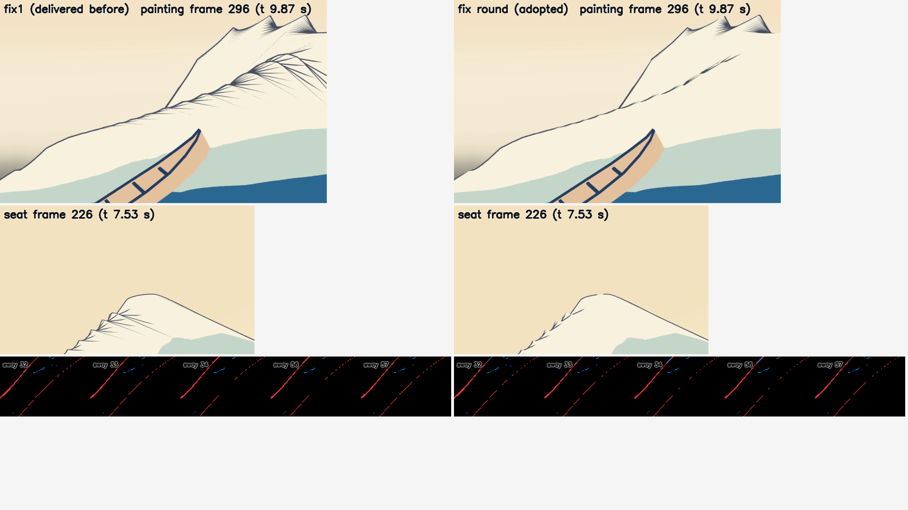
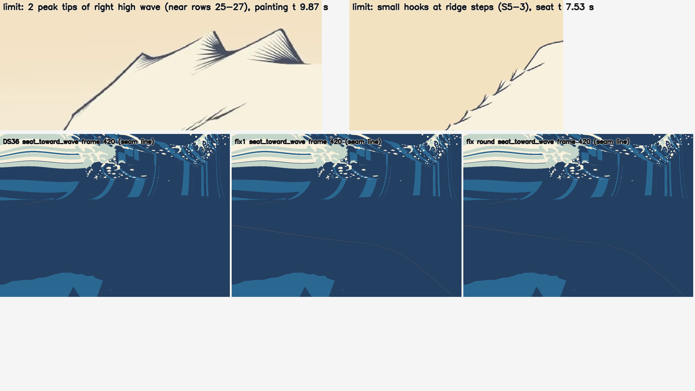

# 設計38：必要な輪郭線（片眼欠け、線幅、奥行き、頭の移動時のちらつき） ― 主役波・手前の海・爪に反転シェルの線を付け、線幅の決まりを改め、原画視点では原画にない線を消す。191 と Mock の左右差は満たさず、限界として仕上げへ送る

日付：2026-09-30／状態：**閉じた（使える水準。最小の受入 4 つのうち、192 と近くの線幅は合格、191 と Mock の両眼の左右差は不合格。Q26 により、不合格の 2 つは限界として仕上げ30・38 へ送った）**。修正は、作る部の中の修正1 と、進行役の検査の後の修正の回の 2 つ（第 6 節。Q26 の 1 回の数え方の注も同じ節）。証拠の種類は次のとおり。**HMD 実機の結果ではない。利用者は確かめていない。**

- 作る部（第「輪郭線」部と修正の回）：Unity 6000.4.3f1 の Editor の batchmode の PC オフスクリーン描画（camera.Render、RTX 3080、Direct3D11）と、numpy/OpenCV の評価（`ds38_line_eval.py`・`ds38_fix_eval.py`）、原画視点の評価器（`ds30b_tstar_regress.py`、爪あり `t28_claws`・爪なし `t28_white`）。Mock の両眼は、座席のカメラを右の向きへ ±0.032 m ずらした 2 回の PC の描画で、PS VR2 の立体視（SPI）の描画ではない。頭の揺れは座席のカメラを左右へずらした PC の描画で、HMD の頭の追跡ではない。
- 進行役の独立の検査（修正1 の版に対して。作る部の評価のコードを使わずに書いた numpy/OpenCV。動画から取り出したコマを見た。写しは Git 対象外の `Unity/Build/Design/38/indep_check/`）。**修正の回の版は独立の検査を通していない**（記録の照合だけ。下）。
- 記録の道具 `ds38_record.py`：作る部の出力とコードの SHA-256 の照合（115 件）、作る部の評価のコードを使わない照合（t\* の原画視点の画像の違い、原画視点の主役波の線、頭の揺れの線の出入りの数え直し）、証拠の写し、metrics.json・run.json。

番号の前提：

- 対象：[段階9までの実行計画](../Design/Stage9_Plan_2026-09-26_ja.md)（以下「計画」）§2.3 の設計38。使える水準の成果物は「外殻線 v0 を形成・崩壊の全区間へ。爪の縁の線と、爪が重なる所の手前の線（使える水準）。Mock の両眼。PS VR2 なら H3・H6」、最小の受入は「連続300フレームで線の点滅・跳び 0（191）。古い位置に残る線 0（192）。Mock の両眼で線画素の左右差 <10%。近くで線が太りすぎない（世界寸法の上限）」、バックログは 142・143・146・147（記録、精度は仕上げ38）。崩壊は作らない（Q11）ので、「全区間」は形成の t 0〜14 s と読んだ。
- 引き継ぎ：
  - 主役波の動き：設計28修正01 の `Unity/Build/Design/28R01F/F_final` と最後の一コマ `kstar_final`（K\*′ R4）。表示用サーフェスと色の焼き込みは[設計29修正01](Design_29_修正01_ja.md)。
  - [設計30](Design_30_ja.md)（周りの海 near・far と単一再生）、[設計31](Design_31_ja.md)〜[設計35](Design_35_ja.md)（白の帯・飛沫・爪の 3 層と既定の版）、[設計36](Design_36_ja.md)（調色板と海の 4 段）、[設計37](Design_37_ja.md)（場面 `DS37_FlowLines.unity` `9f0ca68c…` と頭の揺れの部品 `DS37HeadSway`）。
  - 設計36 から設計38 へ渡されたもの：爪の縁の線（段階6確認の F6-1）、空へ出る爪が唇の輪郭に作る白い欠け、継ぎ目をまたぐ外殻線（目標は、座席から波の方向のコマ 330〜420 で継ぎ目に沿う線の画素 0）、手前の小波の線、谷の底を締める線、設計28・29 から渡された描画の傷 5 つ（唇の端の梯子・モアレ、縦の継ぎ目、前面の足の縦の筋、頂の爪の模様が埋まること、原画視点の左端の横縞）と設計29修正01 の面を横切る外殻線・座席の見えない内壁、藍濃の 1 段（平塗りの物の材質）、評価器を爪あり・爪なしの両方で回し続けること。
  - 設計37 から設計38 へ渡されたもの：191 の事前検査（一瞬だけ消えた線 原画視点 530・座席 35）、幅 1 px の細い線のアンチエイリアス、設計36 から渡された 1 コマだけの色の跳び、Mock の両眼。
- 時間の上限：Q26 の日程で 4 時間（計画の時間枠は ≤1 日）。範囲は最小の受入だけで、修正は 1 回まで。
  - 実績（ファイルの時刻。[metrics.json](../Evidence/Design/38/metrics.json) の `time`）：作る部の着手 05:41（`_started.txt`）、作る部の修正1 の描画の終わり 06:09:58、作る部の終わりは 06:40 ごろ（作る部の README の記述）。進行役の独立の検査 06:35:59〜06:46:13（検査の写しのファイルの時刻）。修正の回の着手 06:53（`_fixround_started.txt`）、採った設定の全部の描画 07:16:27〜07:18:40（Unity のログの開始の時刻と、描画の報告の時刻）、評価器 07:22:22、線の評価 07:23:25、`ds38_fix_eval.json` 07:26:57、受入の表 07:30:33、試し X5 の描画 〜07:32:58、作る部の実行の記録 `ds38_run.json` 07:35:38。記録 07:37 ごろ〜（終わりは `Unity/Build/Design/38/READY_TO_COMMIT.txt` の時刻）。着手から修正の回の終わりまで約 1 時間 55 分で、4 時間の上限の内。
  - 1 回の計算：Unity の全部の描画 125.8 s（修正の回）、試しの描画 約 96〜97 s ずつ、評価器 約 7 分、線の評価 約 1 分、記録の道具 約 1〜2 分。どれも 30 分の上限より十分短い。
- 対応するバックログ：191（不合格）、192（合格）、Mock の両眼の左右差 <10%（不合格、1 組）、近くの線幅（合格）、142・143（記録。設計36 と同じ値）、146・147（記録のみ。測っていない）。PS VR2 の H3・H6 は保留。値は [metrics.json](../Evidence/Design/38/metrics.json) の `acceptance`・`backlog`。
- 読むだけで変えていないもの：設計27〜37 の場面・スクリプト・シェーダー、設計29修正01 の焼き込み、設計30 の海のパッケージ、設計33 の爪の表、設計36 の海の表（守るファイル 21 個。どの描画の前後でも SHA-256 が同じ、`protectedUnchanged = true`。一覧は [run.json](../Evidence/Design/38/run.json) の `protected_files`）。評価器のファイルも変えていない。
- 座標と単位：m・s。t は体験の時刻（コマ k は t = k/30 s、421 コマ）、t\* は t = 12 s（コマ 360）。191 の連続の描画はコマ 60〜360（t 2.0〜12.0 s）の 301 コマ。画像の画素は 1920 × 1080 の表示の px。
- 使っていないもの：参照モデル、利用者の解算、写真のフォルダー、Blender・Houdini。爪形分析のフォルダー（`G:\research\爪形分析`）は、作る部も検査も記録の道具も開いていない。記録の時のコミットの一覧の点検でだけ、そのフォルダーのファイルの大きさと SHA-256 を読み取りのみで調べた（第 9 節）。
- git：作る部・修正・記録は使っていない。

## 見るもの

| 修正の回の前後：原画視点 t 9.87 s（コマ 296）と座席 t 7.53 s（コマ 226）。左が修正1、右が修正の回（納める版）。下の段は頭の揺れの線の出どころの描画 | 残る傷：右の高い波の 2 つの尖りの扇（原画視点 t 9.87 s）、稜線の段の小さな鉤（座席 t 7.53 s）、座席から波の方向のコマ 420 の継ぎ目の線（設計36・修正1・修正の回） |
| --- | --- |
|  |  |

図は Unity の PC 描画と、その数値の図である（1920 × 1080。元の図は Git 対象外の `Unity/Build/Design/38/outlines/fig/`）。右の図の上の 2 つは修正の回の後にも残る傷で、限界 1 にあたる。

動画（1920 × 1080、30 fps。Unity の PC 描画。白・爪・飛沫を入れた作品のままの読み。修正の回の版）：

- 形成の全区間（t 0〜14 s、421 コマ）：[原画視点](../Evidence/Design/38/ds38_formation_painting_30fps.mp4)（2,835,303 バイト）・[座席](../Evidence/Design/38/ds38_formation_seat_30fps.mp4)（1,284,599 バイト）・[座席から波の方向](../Evidence/Design/38/ds38_formation_seat_toward_wave_30fps.mp4)（2,678,605 バイト）
- 頭の揺れ：[座席から波の方向・t 9 s のまま目を ±0.1 m・周期 2 s で 4 s 揺らす](../Evidence/Design/38/ds38_sway_seat_toward_wave_t09_30fps.mp4)（121 コマ、491,025 バイト）

図：

- [設計36 と設計38 の比べ](../Evidence/Design/38/fig_ds38_before_after.png)：原画視点 t\*・座席 t\*・座席から波の方向 t 10.5 s（修正の回の出力で描き直したもの。中央の列は空白で、見た目だけの傷。第 10 節）。
- [原画視点の線の出どころ](../Evidence/Design/38/fig_ds38_painting_mask.png)：t\* の線の ID（マゼンタ）。左が設計36、右が設計38（原画にない主役波の面の中の線を消した。手前の海 near の線が加わった）。
- [爪の縁の線](../Evidence/Design/38/fig_ds38_claws_seat.png)：座席 t\* の頂の拡大。左が設計36（爪の線なし）、右が設計38。
- [継ぎ目](../Evidence/Design/38/fig_ds38_seam.png)：座席から波の方向 t 11.0・11.9 s、設計36 と設計38。
- [近くの線幅](../Evidence/Design/38/fig_ds38_near.png)：主役波の最も近い点から 4・8・16 m のカメラで、設計27 の外殻線 v0 の決まり（上）と設計38 の決まり（下）。
- [Mock の両眼](../Evidence/Design/38/fig_ds38_mock.png)と、[不合格の組（座席の低い視点 t 6 s）](../Evidence/Design/38/fig_ds38_mock_limit_seat_low_t06.png)。
- [191 の時系列](../Evidence/Design/38/fig_ds38_191.png)：4 つの連続の描画の線の画素の数と、コマごとの塊。
- [修正1 の棘の線](../Evidence/Design/38/fig_ds38_fix1_spikes.png)：修正の回の前の、右の高い波の稜線の段の扇（座席 t 7.67 s と座席から波の方向 t 7.5 s。作る部の `unity_fix1/fig_fix1/fig_ds38_191_limit_spikes.png` を名前を変えて写した）。

数値：

- [metrics.json](../Evidence/Design/38/metrics.json)：最小の受入 `acceptance`（修正の回・修正1・1 回目の評価）、検査の定義での 191 `loose_191`、記録 `record_only`、回帰 `regression_plan_2_0`、修正 `fix_rounds`、記録の照合 `recorder_crosscheck`、時間 `time`
- 作る部の写し：[ds38\_acceptance.json](../Evidence/Design/38/ds38_acceptance.json)（受入の表と試し X1〜X4・候補A）、[ds38\_outlines\_metrics.json](../Evidence/Design/38/ds38_outlines_metrics.json)（組ごとの値）、[ds38\_fix\_eval.json](../Evidence/Design/38/ds38_fix_eval.json)（検査の定義での数え）、[ds38\_run.json](../Evidence/Design/38/ds38_run.json)
- 評価器の出力は設計36 の [ds36\_tstar\_regress.json](../Evidence/Design/36/ds36_tstar_regress.json) と SHA-256 まで同じファイル（`4ca57d3a…`）なので、写していない。
- 実行条件と SHA-256：[run.json](../Evidence/Design/38/run.json)

**見え方の注意**：線は、面と同じ keypose を読む反転シェル（面を法線の向きへ押し出して裏面だけを描く）で、画面の処理ではない。原画視点では、原画にない主役波の面の中の線と爪の線を描かない（焼き込みの色面が線を担う）。そのぶん原画視点では、設計36 になかった手前の海 near の線が見える（右の高い波の白い面を横切る線、手前の小波の足から暗い海を船へ向かう細い線。限界 7）。唇の端の梯子・モアレなど色の焼き込みの傷は直していない。崩壊は作らない（Q11）。

## 0. 結論

1. **輪郭線を、主役波・手前の海 near・爪に付けた。** 線は面と同じ keypose・同じ時刻の値を読む反転シェルで、画面の処理を使わない。
   - 線幅の決まりを改めた：押し出し幅 = max(min(d × 0.0012866, 0.3 m), d × 1.5 px の角)（d は中心眼からの距離）。設計27 の世界寸法の下限 5 cm を外し（近くで画面で太った）、1.5 px の下限を足した（座席の視野 80° では角幅 0.0012866 rad が 0.83 px で、線が切れた）。原画視点（視野 26°）では 3.0 px のままで、この下限は効かない。
   - 主役波の法線を描く列（18〜394）の中の三角形だけで求め、継ぎ目の上の 10 列にも線を描いた（`outlineColInset` 10 → 0）。原画視点では、near の線が主役波の線へ続く。
   - near（手前の小波・谷・右の高い波・主役波への接続帯）に線を付けた。far（遠くのうねり）には付けない。
   - 爪の縁の線と、爪が重なる所の手前の爪の線を付けた（座席の視点）。
   - 原画視点（中心眼が原画のカメラから 5 m 以内で重み 0、10 m 以上で 1。座席は 47.15 m 離れている）では、爪の線と、原画にない主役波の面の中の線（2,382 頂点の印）を描かない。設計29修正01 から渡された「面を横切る外殻線」は原画視点で消えた。
2. **最小の受入（修正の回の後＝納める版）**：
   - 192 古い位置に残る線 0：**合格**。でたらめな順で描き直した 48 コマの線の画素が、連続の描画と 0 画素違い。面から 4 px より離れた線の塊 0（画面の縁から 40 px の帯を除く）。
   - 近くで線が太りすぎない：**合格**。主役波の最も近い点から 4・8 m で、線の太さ p95 2.8 px・最大 4.4 px（設計27 の決まりでは 4 m で 8.4・10.0 px、8 m で 4.4・6.0 px）。
   - 191 連続 300 コマで線の点滅・跳び 0：**不合格**。一瞬だけ出た線・一瞬だけ消えた線・跳びの塊は、原画視点 2・0・17、座席 0・3・4、座席から波の方向 0・2・6、頭の揺れ 0・0・5。爪の跳び 3（座席から波の方向）を除いてすべて near。
   - Mock の両眼で線画素の左右差 < 10%：**不合格（1 組）**。判定した 11 組のうち 10 組が合格（最大 7.7%）、座席の低い視点 t 6 s が 17.3%（左目 2,434・右目 2,046 px）。x < 1440 では 1,893・1,887 px（0.3%）で、差は目の 0.5 m 先の船体の視差の所（x ≥ 1440 で 541・159 px）にある。線が片眼で欠けているのではない。
3. **修正の回で、191 の塊は大きく減ったが 0 にはならない。** near の扇の線（粗い near の格子の稜線の段の細い折れで、面の法線では裏、頂点の法線では表を向く三角形が押し出されていた）は、表裏を 3 頂点の法線の和で決めて消した。一瞬だけ消えた線の塊は 59・590・132 → 0・3・2。頭の揺れの主役波の線の出入り（(815, 286) 付近の 12〜14 px）は、主役波のシェルを奥へ 3 × 線幅押し下げて 30 → 0 にした（原画視点では押し下げない）。Mock の座席の低い視点 t 6 s は 26.0% → 17.3%。
4. **計画 §2.0 の回帰なし（原画視点）。** 原画視点の画像は線が変わったので評価器を回し直した。出力は設計36 の出力と SHA-256 まで同じファイルで、112 個の値がすべて同じ（78・130・131 の差 0.0、132 σ12 3.7552 px、72 σ24 p95 3.8423 px（爪あり）・4.0075 px（爪なし））。142・143（記録）も同じ（線あり 1.0・0.974、中心のずれ p95 6.046・6.396 px）。ただし、評価器が読む色区の ID の画像は設計36 と同じファイルで、評価器は線の変化を見ない（第 2.5 節の注）。
5. **検査の指摘と記録の照合（第 10 節）**：頭の揺れの主役波の線の出入りについて、作る部の最初の記録の「修正1 で入った後退で、候補A の設定で直る」は、検査が指摘したとおり言い過ぎだった。一方、検査の「同じ線が 1 回目の評価・修正1・候補A で 30 回ずつ出入りする」も、記録の数え直しと合わない（1 回目の評価と候補A は別の細い線が 20 回、修正1 は (820, 290) 付近の線が 30 回）。修正の回ではどちらも 0。
6. **HMD（PS VR2）の H3・H6 は保留**（導入は利用者の手）。Mock の両眼と頭の揺れは PC の描画。SPI の立体視（幾何シェーダーを含む）と Play モードは確かめていない。
7. **限界（第 5 節）**：191 の残り（near の粗い格子の稜線の段の鉤・切れ目と 2 つの尖りの扇、遠くの平らな海の 1 px の横の線、主役波の 1 px 未満の破線、爪の塊、跳びの判定の弱さ）、Mock の遮る物の視差、座席から波の方向の継ぎ目の線、原画視点の新しい near の線、色の焼き込みの傷。仕上げ28・29・30・33・38 と設計47 へ送った。

---

## 1. 目的

設計書の設計38 は、必要な輪郭線を、片眼で欠けず、線幅が近くで太りすぎず、奥行きで正しく隠れ、頭を動かしてもちらつかない形で作る番号である。美術優先の番号で外殻線 v0（中心眼で線幅を決める反転シェル）と Mock の両眼の試し（線の画素差 0.46%）までは作ってあり、計画 §2.3 の残りは次のとおり。

- 外殻線を形成の全区間へ広げ、爪の縁の線と、爪が重なる所の手前の線を使える水準で付ける。
- 連続 300 コマで線の点滅・跳び 0（191）、古い位置に残る線 0（192）、Mock の両眼で線画素の左右差 < 10%、近くで線が太りすぎないこと（世界寸法の上限）。
- 142・143・146・147 は記録（精度は仕上げ38）。PS VR2 があれば H3・H6。

あわせて、設計30・36・37 から渡された線の宿題（継ぎ目をまたぐ線、手前の小波の線、谷の線、爪の線、設計29修正01 の面を横切る線）を受けた。Q26 により、最小の受入だけを満たし、修正は 1 回までとした。

---

## 2. 表

### 2.1 最小の受入（修正の回・修正1・進行役の独立の検査）

| 項目 | 修正の回（納める版） | 修正1（検査を受けた版） | 進行役の独立の検査（修正1 の版） | 判定 |
| --- | --- | --- | --- | --- |
| 191 連続 300 コマで線の点滅・跳び 0 | 一瞬だけ出た線・一瞬だけ消えた線・跳びの塊：原画視点 2・0・17、座席 0・3・4、座席から波の方向 0・2・6、頭の揺れ 0・0・5 | 3・59・16、1・590・5、0・132・4、頭の揺れ 0・0・15（主役波） | 不合格。自分の定義（出どころの種類だけをそろえた、ゆるい定義）でも near の塊が多い。動画でも扇の線が見える（原画視点のコマ 296〜303、座席のコマ 226〜233） | 不合格（大きく減った） |
| 192 古い位置に残る線 0 | 描き直しの差 0 画素（48 コマ）。面から 4 px より離れた線の塊 0、画素 10（縁の帯を含めると 93 画素・2 塊） | 差 0、塊 0、画素 11（縁の帯を含めると 97 画素・2 塊） | 合格。描き直し 48 コマの差 0。自分の数え方では、原画視点の鋭い角の先に 10〜14 px の小さな塊があり、古い線ではなく角のはみ出し | 合格 |
| Mock の両眼で線画素の左右差 < 10% | 11 組のうち 10 組が合格（最大 7.7%）。座席の低い視点 t 6 s が 17.3%（2,434・2,046 px）。x < 1440 では 0.3% | 最大 26.0%（座席の低い視点 t 6 s、3,875・2,982 px）。x < 1440 では 2.1%（2,813・2,755 px） | 不合格（文字どおり）。差は x ≥ 1440 の、目の近くの船体が右目の視野を隠す所だけ | 不合格（1 組） |
| 近くで線が太りすぎない（世界寸法の上限） | 4・8 m で p95 2.8 px・最大 4.4 px（設計27 の決まり：4 m 8.4・10.0 px、8 m 4.4・6.0 px）。16 m では線の画素 1 | 同じ p95・最大 | 合格（別の測り方でも、設計38 の線は設計27 の決まりより細い） | 合格 |

- 修正の回の値は [ds38\_acceptance.json](../Evidence/Design/38/ds38_acceptance.json) の `acceptance_after_fixround`、修正1 の値は `acceptance_after_fix1`。
- 進行役の独立の検査の欄は結論だけを書いた。検査の数値の多くはファイルに残っていない（検査の写しは Git 対象外の `indep_check/` にコードと切り出しの画像だけ）。検査の 191 のゆるい定義と Mock の位置の分け方は、作る部が `ds38_fix_eval.py` と受入の表で書き直して修正1 の版に当てた（第 2.2・2.3 節の修正1 の欄）。

### 2.2 191 の内訳

作る部の定義（公式）：一瞬だけ出た線＝コマ f の線で、f−1 と f+1 のどちらにも（シートの頂点の画面の動きの最大 + 2 px）の内に線がないもの。跳び＝f の線で、f+1 の最も近い線まで同じ許しより遠いもの。一瞬だけ消えた線＝f−1 と f+1 の同じ画素に同じ出どころ（同じシート、列・行の差 2 以内。爪は同じ爪・輪の差 2 以内）の線があり、f だけ 1.5 px の内に線がないもの。どれも 8 近傍で 10 px 以上の塊。出どころをそろえたのは、別の 2 本の線が交わって通り過ぎる所を数えないため（設計37 の事前検査の定義との違い）。

| 連続の描画（301 コマ） | 修正の回：出た・消えた・跳び | 修正1 | 1 回目の評価 | 設計37 の定義（出どころを見ない）の消えた線：修正の回／修正1 | near の線の画素（301 コマの和）：修正の回／修正1 |
| --- | --- | --- | --- | --- | --- |
| 原画視点 | 2・0・17（すべて near） | 3・59・16 | 2・59・12 | 342／879 | 1,700,586／2,578,483 |
| 座席 | 0・3・4（すべて near） | 1・590・5 | 1・590・6 | 316／1,497 | 324,830／704,744 |
| 座席から波の方向 | 0・2・6（near 0・2・3、爪の跳び 3） | 0・132・4 | 0・132・4 | 158／442 | 1,172,402／1,454,402 |
| 頭の揺れ（座席から波の方向 t 9 s、目 ±0.1 m・周期 2 s） | 0・0・5（near） | 0・0・15（主役波） | 0・0・0 | 0／0 | — |

検査の定義（ゆるい定義。`ds38_fix_eval.py`：f−1 と f+1 の同じ画素に同じ種類（主役波・near・爪）の線があり、f ではどの線も 1 px の内にない 10 px 以上の塊）：

| 連続の描画 | 修正の回：主役波・near・爪 | 修正1：主役波・near・爪 |
| --- | --- | --- |
| 原画視点 | 230・106・0 | 230・643・0 |
| 座席 | 33・199・18 | 33・1,378・16 |
| 座席から波の方向 | 16・73・13 | 16・345・13 |
| 頭の揺れ：出た・消えた（次のコマの線から 5.5 px より遠い塊） | 主役波 0・0、near 5・5（(1378, 183) の 10 px の鉤） | 主役波 15・15、near 0・0 |

- 残る塊の中身（作る部の README の読み。塊の一覧は `ds38_outlines_metrics.json` の `cluster_list`）：
  - 原画視点のコマ 56〜116 の near の高さ 1 px の横の線（x 1,574〜1,883、y 829〜906）。遠くの平らな海の浅い角度の輪郭が出入りする。
  - 跳び：原画視点のコマ 263〜265、座席 256〜261、座席から波の方向 265〜278。座席のカメラが船と一緒に大きく動く所と、船が線の前を通る所で、色の動画では面も一緒に動く・隠れる（作る部が 2 か所を確かめた）。跳びの判定の許しはシートの頂点の動きだけで、船に隠れる動きを含まない（判定の弱さ。修正1 にも同じ塊がある）。
  - 座席のコマ 207・256・257 と座席から波の方向の 241・243 の 10〜18 px の消えた線：右の高い波の稜線の段に残る小さな鉤・切れ目。頭の揺れの near の出入りも同じ。
  - 主役波の破線の細い線（ゆるい定義の主役波 230・33・16）：修正の回で変わっていない。原画視点は原画視点の描画を変えない決まりで触っていない。
- 跳びの判定の許しは、座席から波の方向では画面の外や目の近くの near の頂点の大きな動きを含むので大きい（作る部の README：中央値 138 px。原画視点 25 px、座席 6.7 px、頭の揺れ 3.5 px）。座席から波の方向の一瞬だけ出た線と跳びの数が 0 に近いのは、弱い判定による。

### 2.3 Mock の両眼（修正の回）

座席のカメラを右の向きへ ±0.032 m ずらした 2 回の描画（線の幅と表裏と押し下げを決める中心眼は両眼でそろえた）。判定は両眼の平均が 500 px 以上の組。片眼だけの線（記録）＝一方の目の線の画素のうち、他方の目に同じ出どころ（番号が同じで列・行の差 3 以内）の線がない割合。

| 視点 | t 6 s | t 9 s | t 10.5 s | t 12 s |
| --- | --- | --- | --- | --- |
| 座席 | 0・0（判定しない） | 4,561・4,551（0.2%） | 6,068・5,890（3.0%） | 5,921・5,828（1.6%） |
| 座席の低い視点 | **2,434・2,046（17.3%）** | 5,608・5,533（1.3%） | 9,313・9,042（3.0%） | 7,297・6,758（7.7%） |
| 座席から波の方向 | 5,787・5,797（0.2%） | 6,960・6,940（0.3%） | 8,734・8,589（1.7%） | 7,273・7,278（0.1%） |

- 左目・右目の線の画素（差 ÷ 平均）。片眼だけの線の割合の最大は、座席の低い視点 t 6 s の左目 10.7%（修正1 では最大 2.4%）。
- 座席の低い視点 t 6 s の位置の分け方：修正の回 x < 1440 で 1,893・1,887（0.3%）、x ≥ 1440 で 541・159。修正1 は x < 1440 で 2,813・2,755（2.1%）、x ≥ 1440 で 1,062・227。
- 1 回目の評価（far に線あり）の最大は 25.3%。候補A（採らない）の最大は 9.0%。

### 2.4 近くの線幅（修正の回）

座席のカメラを複製し、t\* の主役波の描く列の頂点のうち座席の視野の中央 60% で最も近い点へ、同じ向き（視野 80°）で寄せた。太さ＝線の ID の画像の距離変換の中心の値 × 2。

| 距離 | 設計38：線の画素・p50・p95・最大 | 設計27 の外殻線 v0：線の画素・p50・p95・最大 |
| --- | --- | --- |
| 4 m | 8,461・2.0・2.8・4.4 px | 22,020・2.0・8.4・10.0 px |
| 8 m | 6,004・2.0・2.8・4.4 px | 10,560・2.0・4.4・6.0 px |
| 16 m | 1・2.0・2.0・2.0 px | 1・2.0・2.0・2.0 px |

- 16 m ではこの向きの線がほとんど映らない（線の画素 1）。合否は 4・8 m で読んだ（p95 ≤ 3 px。作る部の決めた既定値）。

### 2.5 回帰（原画視点。計画 §2.0）と 142・143

| 比べたもの | 設計38（修正の回） | 設計36 | 同じか |
| --- | --- | --- | --- |
| 評価器の出力 `ds30_tstar_regress.json`（爪あり・爪なし） | `unity/ds30_tstar_regress.json` | `Unity/Build/Design/36/palette/unity/ds30_tstar_regress.json`・証拠の `ds36_tstar_regress.json` | SHA-256 まで同じ（`4ca57d3a…`）。112 個の値の違い 0 |
| 78・130・131 の差 | 0.0・0.0・0.0 | 0.0・0.0・0.0 | 同じ |
| 132 σ12 最大／72 σ24 p95 | 3.7552 px／3.8423 px（爪あり）・4.0075 px（爪なし） | 同じ | 同じ |
| 142（区間 78・130） | 線あり 1.0、中心のずれ p95 6.046 px・最大 7.046 px、線幅の中央値 3.25 px | 同じ | 同じ |
| 143（区間 131・132） | 線あり 0.9743、中心のずれ p95 6.396 px・最大 8.021 px、線幅の中央値 3.25 px | 同じ | 同じ |
| t\* の原画視点の画像（爪あり） | `9c417474…` | `ba5fcc16…` | 違う：16,768 画素（修正1 と設計36 は 18,356 画素、修正の回と修正1 は 2,178 画素。記録の照合） |
| 評価器の数える外殻線の内側の線（記録） | 7,295 px | 6,556 px | 増えた（修正1 は 8,287 px。どれも near の線が加わった分） |

- **評価器は線の変化を見ない。** 評価器の多くの値は色区の ID の画像から測り、その画像（`af28r01_class_ids.png`、爪あり `c1003bbc…`）は設計36 と同じファイルである。線の ID の画像（`af28r01_line_ids.png`）は変わった（設計36 `ab751fae…` → `589071cb…`）が、142・143 は主役波の外輪郭の線だけを見るので同じ値になった。原画視点に加わった near の線（限界 7）は、評価器の値には出ない。
- 両側の読みの判定の変化 0。175 は不合格のまま、267 の判定の欄は評価器の定義のままの読み（設計36 の記録の第 2.2 節）。厳しい色の読み（29修正01 の 73・79・118・134・175・263・267）は仕上げ28 のまま、悪くしていない。

### 2.6 修正の回の試し（`fixround_experiments`）

描画は 191 の連続の描画だけ（Unity 約 96〜97 s ずつ）。組の書き方は「シート:表裏の選別:内積の下限:押し下げ:原画視点の重み:表裏の判定」。

| 試し | 設定 | 結果（公式の消えた線の塊 原画視点・座席・座席から波の方向、頭の揺れ） | 採否 |
| --- | --- | --- | --- |
| X1 | 主役波・near とも押し下げ 1 × 線幅、表裏は面の法線 | 52・586・132。頭の揺れの主役波の跳び 5（ゆるい定義の出入り 5・5） | near の扇は変わらない（押し出しの目の側の成分が原因ではない） |
| X2 | X1 ＋ 表裏：主役波は原画視点の外で頂点の法線、near は頂点の法線 | 0・3・2。頭の揺れの跳び 10（主役波 5・near 5） | near の設定を採った |
| X3 | 主役波 押し下げ 3、near に内積の下限 0.1、爪 押し下げ 1 | 1・10・4。頭の揺れ 0。near の線の画素が減り輪郭が破線になり、爪の線の画素 −30%（爪が重なる所の線が減る） | 主役波の設定だけを採った |
| X4 | 表裏を「面の法線で裏 かつ 頂点の法線の内積 < 0.15」 | 2・148・27（扇が戻る） | 採らない（コードは消した） |
| X5 | near 押し下げ 3 | 作る部の README：右の高い波の 2 つの尖りの箱の線の画素 1,070 → 813 と、少し減るだけ（受入の表には入っていない） | 採らない |

採った値（`DS38Render.Adopted`。材質と描画の報告で同じ値）：主役波 押し下げ 3・原画視点の重みを掛ける・表裏 2（原画視点では修正1 のまま）、near 押し下げ 1・表裏 1、爪 変えない（押し下げ 0・表裏 0）。どれも表裏の選別あり・内積の下限 0。

### 2.7 記録の照合（`ds38_record.py`。作る部の評価のコードを使わない。`recorder_crosscheck`）

- 作る部の出力・コード・入力の SHA-256 115 件が `ds38_run.json` と同じ。
- 原画視点の連続 301 コマで、主役波の線の画素が修正1 と違う所は、なくなった 35・増えた 528 画素で、どれも near の線と重なる画素（near の線と重ならない所で違う主役波の画素 0）。原画視点の主役波の線は修正1 のまま（作る部の報告と同じ）。
- 頭の揺れの 301 コマの線の出入り（検査の定義を書き直して数え直した：次のコマまたは前のコマのどの線からも 5.5 px より遠い、10 px 以上の塊）：

| 版 | 主役波 | near | 位置と出どころ |
| --- | --- | --- | --- |
| 1 回目の評価（表裏の選別なし） | 20 | 0 | (730, 370) 付近の 11 px（主役波の列 196・行 107〜109） |
| 修正1 | 30 | 0 | (820, 290) 付近の 12〜14 px（列 213〜215・行 126〜129） |
| 修正1 の後の確かめ（内積の下限 0） | 30 | 0 | 修正1 と同じ |
| 候補A（採らない） | 20 | 20 | 主役波は 1 回目の評価と同じ (730, 370)。near は (1430, 150)・(1070, 430) に 10 ずつ |
| 修正の回（納める版） | 0 | 10 | near の (1380, 180) の 10 px（near の列 662・行 13） |

  - 主役波の列 212〜216・行 124〜131 から出る線の画素の数は、コマ 24〜35 で 1 回目の評価・修正1・候補A とも同じ（24, 20, 16, 14, 25, 20, 11, 15, 26, 23, 11, 15）。この細い線の破線の形は修正1 で変わっていない（検査の読みのとおり）。ただし、この線が「出入り」として数えられるのは修正1 だけで、1 回目の評価と候補A では、別の細い線（列 196・行 107〜111。修正1 ではこの線の画素が 0）が出入りする。
  - 公式の跳びの判定（許し 3.5 px 前後）では、1 回目の評価 0、修正1 15（主役波）、候補A 10（near）、修正の回 5（near）。

---

## 3. 作り方と、採ったもの

### 3.1 Unity（`Unity/Assets/GreatWave/Design38/`）

- `Shaders/DS38LineCommon.cginc`（`a9408250…`）：線幅の決まり（押し出し幅 = max(min(d × 0.0012866, 0.3 m), d × 1.5 px の角)。d は中心眼からの距離）、中心眼（Mock の両眼では `_DS38EyeOverride` でそろえる）、原画視点の重み（原画のカメラから 5 m で 0、10 m で 1）、修正の回の奥への押し下げ（`_DS38PushBack` × 線幅、中心眼から頂点への向きの逆へ。`_DS38PushPaint` = 1 なら原画視点の重みを掛ける）。
- `Shaders/DS38_Outline_Keypose.shader`（`05f0fa69…`）：主役波と near の反転シェル。設計27 の `DS27Keypose.cginc` で面と同じ keypose の頂点を補間する。列の範囲の中の三角形だけの法線、頂点ごとの印（原画視点で描かない線）、幾何シェーダー（修正1：中心眼に表を向ける元の三角形の押し出しを捨てる。修正の回：表裏の判定の選び `_DS38FacingMode`、0 面の法線・1 3 頂点の法線の和・2 原画視点の重み ≥ 0.5 の所だけ 1）。
- `Shaders/DS38_Outline_Mesh.shader`（`fb853205…`）：爪の反転シェル（線幅・表裏・押し下げは同じ決まり）。
- `Scripts/DS38SheetOutline.cs`：シートの線の描画（印のバッファは `Start` で作る）。`Scripts/DS38ClawOutline.cs`：設計34 の爪の結合メッシュの頂点を `LateUpdate` で写し、なめらかな法線を付けた反転シェル。`Scripts/DS38LineGlobals.cs`：中心眼と原画視点の重みを全部のシェーダーへ渡す。
- `Materials/DS38_Outline_hero.mat`・`DS38_Outline_near.mat`・`DS38_Outline_claws.mat`：線の色は藍の線 (71, 80, 95)。値は第 2.6 節の採った値。
- `Scenes/DS38_Outlines.unity`（`75f19c51…`）：設計37 の `DS37_FlowLines.unity` に上の部品を足した（頭の揺れの部品 `DS37HeadSway` はそのまま）。
- `Editor/DS38Render.cs`（`237986be…`）：場面の作成、原画視点の印（t 10・11・11.5・12 s の原画視点で主役波の面の外から 4 px より内側に出た線の頂点 1,709 から、どの時刻でも輪郭の 4 px 以内に出た頂点 2,229 を除き、1 格子広げた 2,382 頂点。`ds38_hero_linemask_f32.bin` `33803245…`）、t\* の組（爪あり・爪なし）、191 の連続の描画 4 本（線の画素と出どころの表）、192 の描き直し 48 コマ、Mock の両眼 12 組、近くの線幅、動画 4 本。試しは `-ds38Candidate` で材質の写しに値を入れる（材質のアセットは変えない）。守るファイルの SHA-256 を前後で比べる。
- 道具（`Tools/GWWaveGen/ds38/`）：`run_ds38_unity.ps1`（Unity の 1 回の実行と `unity.lock`）、`ds38_line_eval.py`（受入の 4 項目）、`ds38_fix_eval.py`（検査の定義での 191）、`ds38_figs.py`・`ds38_fixround_figs.py`（図）、`ds38_summary.py`（受入の表）、`ds38_run_record.py`（作る部の実行の記録）、`ds38_record.py`（記録）。

### 3.2 測り方（作る部）

- 線の画素：線のシェーダーの座標の描画（MSAA なし）で線のある画素と、その出どころ（1 主役波・2 near・4 爪、列・行または爪の番号・輪の番号、中心眼からの距離）。
- 191：連続 301 コマ × 3 視点と頭の揺れの 301 コマ。定義は第 2.2 節。合格は各組で 0。
- 192：(a) 原画視点・座席から波の方向の各 24 コマを、別の時刻へ合わせて 1 回描いてから描き直し、連続の描画の線の画素と比べる（線が時刻だけで決まるか）。(b) 線の画素のうち、面（主役波・near・far・爪。背景を切って描いた 1 bit）から 4 px より離れたもの。画面の縁から 40 px の帯は、線を作る面が画面の外にあるので除いた（1 回目の評価の後の定義の直し）。
- Mock：第 2.3 節。近く：第 2.4 節。

### 3.3 採ったもの（Q24。進行役の判断で、利用者の決定ではない）

- **線は反転シェル（画面の処理ではない）。** 理由：面と同じ keypose・同じ時刻の値を読むので、古い位置に残らない（192）。落とした：画面の縁の検出（深さ・ID の段差）。原画視点の評価器が見る主役波の外殻線 v0 の位置を変えてしまう。
- **線幅は中心眼からの距離の角幅＋世界寸法の上限＋画素の下限 1.5 px。** 落とした：設計27 の世界寸法の下限 5 cm（近くで太る）。
- **原画視点では、原画にない主役波の面の中の線と爪の線を描かない。** 理由：原画の焼き込みが線を担い、回帰の危険がなく、原画視点が原画に近づく。落とした：全部の視点で同じ線（原画視点で焼き込みの爪と 1〜3 px ずれた二重の線と、面を横切る折れ目の線が残る）。
- **継ぎ目の上の 10 列にも線を描き、法線は列の範囲の中だけで求める**（設計30 の引き継ぎ）。
- **far には線を付けない**（修正1。水平線の近くの細い線が原画視点で跳び、目ごとに出入りした）。
- **191 の「一瞬だけ消えた線」に出どころの一致の条件を足した。** 落とした：設計37 の定義だけ（交わる 2 本の線を消えたと数える。値は `hole_ds37_def` に残した）。
- **修正の回は、near の表裏を頂点の法線で決め（X2）、主役波を奥へ 3 × 線幅押し下げる（X3。原画視点では 0）。爪は変えない。** 落とした：near の内積の下限（輪郭が破線になる）、爪の押し下げ（爪が重なる所の手前の線が減る）、X4・X5（第 2.6 節）。
- **候補A は採らない**（修正1 の後に測ったもので、採ると修正がもう 1 回増える。191 の near の扇も残る）。

---

## 4. 関門

| 最小の受入・規則 | 基準 | 値（修正の回） | 判定 |
| --- | --- | --- | --- |
| 191 | 連続 300 コマ（301 コマ × 3 視点と頭の揺れ）で、一瞬だけ出た線・消えた線・跳びの塊 0 | 原画視点 2・0・17、座席 0・3・4、座席から波の方向 0・2・6、頭の揺れ 0・0・5 | 不合格（限界として仕上げ30・38 へ。Q26） |
| 192 | 描き直しの差 0、面から 4 px より離れた線の塊 0 | 差 0（48 コマ）、塊 0（縁の帯を除く） | 合格（PC の描画） |
| Mock の両眼 | 線画素の左右差 < 10%（平均 500 px 以上の組） | 11 組のうち 10 組 ≤ 7.7%、座席の低い視点 t 6 s 17.3%（x < 1440 では 0.3%） | 不合格（1 組。限界として仕上げ38 へ。Q26） |
| 近くの線幅 | 4・8 m で線の太さ p95 ≤ 3 px（既定値） | 2.8・2.8 px（設計27 の決まりでは 8.4・4.4 px） | 合格（PC の描画） |
| 計画 §2.0 の回帰 | 78・130・131・132・72・69・70・212、色区の項目は 29修正01 の読み | 評価器の出力が設計36 と同じファイル（112 個の値が同じ） | 合格（後退なし。評価器は線の変化を見ない。第 2.5 節） |
| 142・143 | 記録 | 線あり 1.0・0.974、中心のずれ p95 6.046・6.396 px（設計36 と同じ） | 記録のみ |
| 146・147 | 記録 | 測っていない（原画視点では爪の線を描かない決まり） | 記録のみ（仕上げ38） |
| 121・175（仕上げ36）、厳しい色の読み（仕上げ28） | 悪くしない | 評価器の値が設計36 と同じ（175 は不合格のまま） | 悪くしていない |
| HMD（PS VR2）の H3・H6 | — | — | 保留（導入は利用者の手） |

---

## 5. 限界

1. **191 の near の残り。** 根は near のシートの粗さ（44 行 × 1,231 列。段階5確認の S5-3 の稜線の段）。
   - 右の高い波の 2 つの尖り（near の行 25〜27・列 556〜601、細い三角形が集まる所）の扇が、原画視点 t 9.87 s でまだ見える（[残る傷の図](../Evidence/Design/38/fig_ds38_fixround_limits.png)の左上）。
   - 稜線の段の小さな鉤・切れ目（座席 t 7.53 s。同じ図の右上）と、頭の揺れの near の出入り（(1378, 183) の 10 px、5 回ずつ）。修正の回の原画視点では、稜線の線が短い破線になる所がある（[前後の図](../Evidence/Design/38/fig_ds38_fixround_before_after.png)の右上）。
   - 原画視点のコマ 56〜116 の遠くの平らな海の 1 px の横の線と、t 3 s ごろ暗い海を横切る細い線。
   - 仕上げ30（near の格子と稜線）と仕上げ38（線の決まり）へ。
2. **191 の主役波の 1 px 未満の破線の細い線**（ゆるい定義で 230・33・16）。原画視点は修正1 のまま（原画視点の描画を変えない決まり）。MSAA の色の動画では淡いちらつきとして見える。仕上げ38。
3. **191 の爪の塊**（ゆるい定義 0・18・13、公式の跳び 3）。押し下げは爪が重なる所の手前の線を減らしたので採らなかった。仕上げ38・仕上げ33。
4. **191 の跳びの判定の弱さ。** 許し（シートの頂点の画面の動きの最大 + 2 px）が、船に隠れる動きと画面の外へ出る動きを含まず、カメラが船と大きく動く所で跳びを数える。座席から波の方向では許しが大きすぎて弱い判定になる（第 2.2 節）。設計37 のような画素ごとの動きの許しへ直すのは仕上げ38。
5. **Mock の不合格（座席の低い視点 t 6 s 17.3%）は、目の 0.5 m 先の船体の視差による。** x < 1440 では 0.3%。画素の数の差の読みは、目の近くの遮る物に弱い。隠れる画素を除く測り方（どちらかの目で近くの物に隠れる画素を数えない）か、出どころで数える読みへ変えるかは、仕上げ38 で決める。
6. **座席から波の方向のコマ 330〜420 の、暗い海を横切る継ぎ目の線。** 主役波の足の輪郭（主役波の列 363〜370・390〜392、行 106〜200）から出る。作る部の README の数え（コマ 420 の、線の色との差 < 40 の画素）：設計36 5,636、修正1 9,111、修正の回 8,854。設計36 の引き継ぎの目標「継ぎ目に沿う線の画素 0」は満たさない（最小の受入の外）。連続の描画はコマ 360 までで、コマ 361〜420 は動画だけで確かめた。仕上げ29・30・38。
7. **原画視点の t\* に、設計36 になかった near の線が残る**：右の高い波の白い面を横切る線、手前の小波の足から暗い海を船へ向かう細い線。評価器の値は同じで、評価器はこれを見ない。原画視点の主役波の面の中の線を消したのと同じ理由で消すべき線で、仕上げ38 へ。
8. **192 の外れ。** 縁の帯の外で 10 画素（塊 0）。検査の数え方では、修正1 の原画視点の鋭い角の先に 10〜14 px の小さな塊があった（古い線ではなく角のはみ出し）。修正の回の版では検査の数え方で数え直していない。仕上げ38。
9. **色の焼き込みの傷は直していない。** 唇の端の梯子・モアレ、縦の継ぎ目、前面の足の縦の筋、左端の横縞の色の帯は、色の焼き込みの投影の問題で、線の経路の外（線の外の色は設計36 のまま）。仕上げ28・29。頂の爪の模様が埋まっていくことは仕上げ33。原画視点の主役波の面を横切る線（設計29修正01 から渡されたもの）だけは、この番号で消した。
10. **設計36 から渡された宿題のうち、この番号で扱っていないもの**：空へ出る爪が唇の輪郭に作る白い欠け、谷の底を締める線（near の線は輪郭だけで、谷の底の線は作っていない）、座席の見えない内壁、藍濃の 1 段（平塗りの物の材質）、設計36 で加わった色の境の 1 コマだけの跳び（191 は線だけを測った）。どれも作る部の記録に記述がなく、この番号では確かめていない。仕上げ28・29・30・38。
11. **far（遠くのうねり）には線がない**（修正1 の決定）。遠くの海の線は仕上げ30・38。
12. **原画視点での線の切り替え。** 爪の線と主役波の印の線は、中心眼が原画のカメラから 5〜10 m の間で出入りし、主役波の押し下げもこの間で 0 から 3 × 線幅へ変わる。余韻で原画視点へ移る所の見え方は設計47 で確かめる。
13. **測っていないもの**：146・147（爪の線の原画との位置）、195〜198（線幅の違い）、Play モード（印のバッファは `Start` で作り、爪は `LateUpdate` で写す）、SPI の立体視（幾何シェーダーを含む。立体視のマクロは書いたが確かめていない）。PS VR2 の H3・H6 は保留。
14. **修正の回の版は、進行役の独立の検査を通していない。** 記録の照合（第 2.7 節）は、SHA-256、原画視点の主役波の線、頭の揺れの線の出入りだけを確かめた。
15. **崩壊は作らない**（Q11）。計画の「形成・崩壊の全区間」のうち、形成の t 0〜14 s だけを見た。

---

## 6. 修正の記録（Q26：修正は 1 回まで）

| 回 | 変えたこと | 結果 |
| --- | --- | --- |
| 作る途中（最初の評価の前。数えない） | 場面の保存先のフォルダーがなかった。`DS38Render` の面の座標の描画で爪の材質の戻し方を直した（書き換えの誤りで同じ関数が 2 つになっていたのを消した） | 最初の評価へ |
| 1 回目の評価（06:04 ごろ。出力 `unity_r1_t28/`・`unity_r1_seq/`） | 主役波・near・far・爪に線 | 191 の公式の塊：原画視点 2・59・12、座席 1・590・6、座席から波の方向 0・132・4、頭の揺れ 0。192 の描き直しの差 0。Mock の最大 25.3%。近くの線幅は合格。評価器の値は設計36 と同じ |
| 作る部の修正1（06:05〜06:11。Unity 1 回 125.4 s） | ① 幾何シェーダーを足し、中心眼に表を向ける元の三角形の押し出しを捨てた（棘の線を、押し出しで裏返った三角形と読んだ）。② far の線を外した。③ 192 の面の 1 bit を背景を切って描く（測り方） | near の棘は減らなかった（棘は裏返りではなかった）。191：3・59・16、1・590・5、0・132・4、頭の揺れの主役波の跳び 0 → 15。Mock の最大 26.0%。192 合格。評価器の値は同じ |
| 修正1 の後の確かめ（作品は変えていない） | 幾何シェーダーに内積の下限 `_DS38FacingMin`（既定 0）を足した。既定のままの描き直し（`unity_verify/`） | 連続の描画 4 本が修正1 と同じ（`verify_tau0_l191_identical_to_fix1 = true`） |
| 候補A（測っただけ。採らない。`unity_cand_a/`・`unity_cand_a_tv/`） | 主役波は選別なし、near は選別あり＋内積の下限 0.15、爪は選別あり | 191：0・60・12、0・462・10、0・82・7、頭の揺れ 10（near）。Mock の最大 9.0%。192・近くの線幅は合格。評価器の値は同じ |
| 進行役の独立の検査（06:35:59〜06:46:13。修正1 の版） | 自前のコードで 191・192・Mock・近くを測り直し、動画のコマを見た | 不合格（191 と Mock）。必須の指摘 3：near の扇の線、頭の揺れの主役波の線の出入り（修正1 のせいではない、候補A でも直らない）、Mock の座席の低い視点 t 6 s（遮る物の視差）。記録の指摘 8（第 10 節） |
| 修正の回（06:53〜07:35。Q26 の 1 回。採った設定の全部の描画 07:16:27〜07:18:40、125.8 s） | 試し X1〜X5（第 2.6 節）の後、near の表裏を 3 頂点の法線の和で決め、near を押し下げ 1、主役波を押し下げ 3（原画視点では 0。表裏は原画視点の外で頂点の法線）。爪は変えない。修正1 の出力は `unity_fix1/` へ移した | 191：2・0・17、0・3・4、0・2・6、頭の揺れ 0・0・5（near）。頭の揺れの主役波の出入り 30 → 0。Mock の最大 17.3%。192・近くの線幅は合格。評価器の値は設計36 と同じ（112 個）。原画視点の印は描き直しても同じ（`fixround_mask_identical_to_fix1 = true`） |

- **修正の回数の数え方（Q26）。** 最初の評価の後に作品を変えたのは、作る部の修正1 と、進行役の検査の後の修正の回の 2 回である。作る部は修正1 を Q26 の 1 回と数えて閉じたが、進行役は検査の後に修正の回を 1 回行った。進行役の工程（検査 → 修正の回）を Q26 の 1 回とし、作る部の修正1 を作る部の中の直しとして扱った読みである（進行役の判断）。厳しく数えれば 2 回になる。修正の回の後は直していない。
- 修正の回で、作る部の記録の誤り（頭の揺れの主役波の跳びは修正1 で入った後退で、候補A の設定で直る見込み）を、作る部の README の F・0 の節で訂正した。記録の照合による補足は第 2.7 節と第 10 節の 2。

---

## 7. 引き継ぎ

**段階7確認（自己評審）**：最初に見るものは、[修正の回の前後の図](../Evidence/Design/38/fig_ds38_fixround_before_after.png)、[残る傷の図](../Evidence/Design/38/fig_ds38_fixround_limits.png)、形成の動画 3 本と頭の揺れの動画、第 2.1 節の表。191 と Mock の左右差は不合格のまま（限界 1〜5）。原画視点の near の新しい線（限界 7）は、評価器の値に出ないので画像で見る。座席から谷が読めるか（段階5確認・設計36 の引き継ぎ）は、この番号の画像でもう一度見る（谷の底の線は作っていない）。

**設計39**（紙・摺り・小飛沫）：線の決まりはこの番号のまま。「オンでも頭の移動で質感が泳がない」の確かめに、設計37 の面の座標の描画と頭の揺れの部品が使える。評価と原画比較はオフで行う。

**設計40**：原画視点の画像は設計36 から変わった（線だけ。色区の ID の画像は同じ）。回帰の入力はこの番号の t\* の画像（`Unity/Build/Design/38/outlines/unity/t28_claws`・`t28_white`）。評価器は線の変化を見ないので、並べ図で near の新しい線を見る。

**設計47**（余韻で原画視点へ移る所）：爪の線と主役波の印の線の出入り、主役波の押し下げが、原画のカメラから 5〜10 m の間で切り替わる（限界 12）。

**仕上げ38**（線）：191〜198。191 の跳びの判定の許し（限界 4）、Mock の測り方（限界 5）、主役波の破線の細い線（限界 2）、爪の塊（限界 3）、原画視点の near の新しい線と t 3 s ごろの細い線（限界 7・1）、192 の角のはみ出し（限界 8）、146・147・195〜198（限界 13）、142・143 の精度。

**仕上げ30**（周りの海）：near の格子と稜線の段（S5-3。限界 1 の根）、右の高い波の尖りの扇、far の線（限界 11）、谷の底を締める線と谷の縁の段（限界 10）、藍濃の 1 段。

**仕上げ29・30・38**：座席から波の方向の継ぎ目の線（限界 6）。

**仕上げ28・29**：色の焼き込みの傷（唇の端の梯子・モアレ、縦の継ぎ目、足の縦の筋、左端の横縞。限界 9）、座席の見えない内壁、空へ出る爪が唇の輪郭に作る白い欠け。**仕上げ33**：頂の爪の模様が埋まること、爪が重なる所の線の精度。

**設計08〜10（PS VR2 の導入の後）**：H3・H6、SPI の立体視での幾何シェーダー、Play モードでの線（限界 13）。

---

## 8. 再現

リポジトリの根で行う。前提（どれも Git 対象外）：設計37 の場面、設計36 の準備の表（`Unity/Build/Design/36/palette/prep/`）と評価器の出力、設計29修正01 の焼き込み（`Unity/Build/Design/29R01/bake_kp/`）、設計30 の周りの海、設計33 の爪。

道具は Unity 6000.4.3f1（batchmode、`Unity/Build/unity.lock` で排他）、`py -3.10`（numpy 2.2.6、OpenCV 4.12.0、Pillow）、ffmpeg。コマンドの全体と SHA-256 は [run.json](../Evidence/Design/38/run.json)。

1. `powershell -NoProfile -ExecutionPolicy Bypass -File Tools/GWWaveGen/ds38/run_ds38_unity.ps1 -Method GreatWave.Design38.EditorTools.DS38Render.Render -Log fixround -Extra "-ds38Out G:/Unity/GreatWave_2026_Fresh/Unity/Build/Design/38/outlines/unity"`（約 2.2 分。材質の値は `DS38Render.Adopted`）
2. `py -3.10 -B Tools/GWWaveGen/ds30/ds30b_tstar_regress.py --out Unity/Build/Design/38/outlines/unity --sets t28_claws,t28_white`（評価器、約 7 分。ほかの重い numpy の処理と同時に回さない）
3. `py -3.10 -B Tools/GWWaveGen/ds38/ds38_line_eval.py --unity Unity/Build/Design/38/outlines/unity --out Unity/Build/Design/38/outlines`（約 1 分）
4. `py -3.10 -B Tools/GWWaveGen/ds38/ds38_fix_eval.py --unity Unity/Build/Design/38/outlines/unity --out Unity/Build/Design/38/outlines/unity/ds38_fix_eval.json`（修正1 の版は `unity_fix1` に同じもの）
5. `py -3.10 -B Tools/GWWaveGen/ds38/ds38_figs.py --unity Unity/Build/Design/38/outlines/unity --t28 Unity/Build/Design/38/outlines/unity --fig Unity/Build/Design/38/outlines/fig`、`py -3.10 -B Tools/GWWaveGen/ds38/ds38_fixround_figs.py`、`py -3.10 -B Tools/GWWaveGen/ds38/ds38_summary.py`（受入の表）、`py -3.10 -B Tools/GWWaveGen/ds38/ds38_run_record.py`（`ds38_run.json`）
6. 修正1・候補A・試しの再現：1. の前に修正1 の出力を `unity_fix1/` へ移しておく。試しは 1. に `-ds38Skip scene,mask,t28,s192,mock,near,video -ds38Candidate <組>` と別の `-ds38Out` を付ける（`fixr_xN/`。組は第 2.6 節）。候補A は `-ds38Candidate hero:0:0,near:1:0.15,claws:1:0`。
7. 記録：`py -3.10 -B Tools/GWWaveGen/ds38/ds38_record.py`（約 1〜2 分）。作る部の出力とコードの SHA-256 を `ds38_run.json` と照合し（違えば止まる）、評価器の出力が設計36 と同じファイルであることを照合し、記録の照合をして、図・動画・JSON を写し、metrics.json・run.json を書く。1 回目の評価・修正1・確かめ・候補A の出力（`unity_r1_seq/`・`unity_fix1/`・`unity_verify/`・`unity_cand_a/`）と、検査の写し（`indep_check/`）が要る。
8. 進行役の独立の検査は、リポジトリの外のコード（写しは `Unity/Build/Design/38/indep_check/`。修正1 の出力を読む）。

---

## 9. 出典と、この番号で作ったもの

- 仕様：計画 §2.3 の設計38、§2.0（回帰の規則）、§2.6（Q26 の日程）、§3.2（H3・H6）、§5（仕上げ28・29・30・33・38）。[制作手順](../Workflow/Production_Workflow_ja.md)の Q11（崩壊を作らない）・Q24・Q26。設計30・36・37 の記録の引き継ぎ。
- 読むだけ：番号の前提の「引き継ぎ」の出力と場面。SHA-256 は run.json の `inputs_sha256`・`protected_files`。
- 参照モデル・利用者の解算・写真のフォルダーは使っていない。爪形分析のフォルダーの画像とマスクは、作る部も検査も記録も開いておらず、どこにも複製していない。
- コミットの一覧の点検（記録の時）：リポジトリの外の一時の道具で、コミットする 58 ファイル（`Unity/Build/Design/38/commit_list.txt`）を読み取りのみで点検した（結果は Git 対象外の `Unity/Build/Design/38/record/ds38_commit_scan.json`）。
  - 文字のファイルから、禁止の場所の文字列（旧試作の各フォルダー、参照モデル、利用者の解算、写真のフォルダー、爪形分析など）と、リポジトリの外の一時の場所の文字列を探した。見つかったのは「爪形分析」の語だけで、この文書の「開いていない」「大きさを調べた」という記述と、`ds38_record.py` と run.json の「開いていない」という記録の文字列（数は `ds38_commit_scan.json` の `hits`）。フォルダーの中のファイルの名前やパスの写しはない。
  - 爪形分析のフォルダーの 5,368 ファイル（画像・配列らしい拡張子 4,109）の大きさを読み取りのみで調べた。コミットするファイルと大きさが同じファイルは 5 組あり、SHA-256 を比べて同じファイルは 0。
  - 5 MB を超えるファイルは 0（最大は原画視点の形成の動画 2,835,303 バイト）。
  - フォルダーの .meta と各ファイルの .meta の欠けは 0。場面が参照する GUID（Unity の組み込みを除く 30 個）は、すべてディスクの .meta で見つかった：このコミットの 6 個（DS38 のスクリプト 3 本と材質 3 つ）と、前の番号の資産（Art・ArtFirst・設計27・30・31・34・36・37 のフォルダー。コミット済みかは、git を使わないので確かめていない）。材質 3 つのシェーダーの GUID はこのコミットの 2 つのシェーダー。コードが参照する前の番号の部品（`DS27Keypose.cginc`、`DS30SheetPlayer`・`DS30SinglePlayback`・`DS31InstancedParticles`・`DS34ClawPlayer`・`DS34LayerSet`・`DS36ClawPalette`・`DS36Render`・`DS36SeaPalette`・`DS37HeadSway`）は、どれも設計27〜37 のフォルダーにある。
  - Git の ignore は、git を使わずに `.gitignore` の文を読み、この 58 ファイルにかかる文がないことを確かめた。`.gitattributes` には設計27〜31 のフォルダーの `-text` の文があり、設計32〜38 にはない（設計36・37 と同じ扱い。変えていない）。
- この番号で作ったもの（コミットするもの）：
  - Unity の資産 `Unity/Assets/GreatWave/Design38/`（と各 .meta、フォルダーの .meta、`Design38.meta`）：場面 `Scenes/DS38_Outlines.unity`、スクリプト 3 本、シェーダー 2 本と `DS38LineCommon.cginc`、材質 3 つ、`Editor/DS38Render.cs`。
  - 道具 `Tools/GWWaveGen/ds38/`：`run_ds38_unity.ps1`、`ds38_line_eval.py`、`ds38_fix_eval.py`、`ds38_figs.py`、`ds38_fixround_figs.py`、`ds38_summary.py`、`ds38_run_record.py`、`ds38_record.py`。
  - 証拠 `Docs/Evidence/Design/38/`：1920 × 1080 の PNG 11 枚、MP4 4 本（最大 2,835,303 バイト）、作る部の写し 4（`ds38_acceptance.json`・`ds38_outlines_metrics.json`・`ds38_fix_eval.json`・`ds38_run.json`）、metrics.json、run.json。
  - 記録：この文書と、進捗の表の設計38 の行。
- コミットしないもの（Git 対象外の `Unity/Build/Design/38/`）：作る部の全出力 `outlines/`（Unity の描画、線の画素の表、192・Mock・近くの出力、動画、ログ、評価器の出力、1 回目の評価・修正1・確かめ・候補A・試し X1〜X5 の出力。全体で約 1 GB）、進行役の独立の検査のコードと切り出しの写し `indep_check/`、記録の点検 `record/`。

---

## 10. レビュー対応

修正1 の版の後に進行役の独立の検査を通した。判定は不合格（191 と Mock）、必須の指摘 3 つ。Q26 の修正の回で 1 つを直し、2 つを減らした。修正の回の版は独立の検査を通しておらず、記録の時に SHA-256（115 件）と記録の照合（第 2.7 節）だけを行った。

| # | 指摘（出どころ） | 対応 |
| --- | --- | --- |
| 1（独立の検査。必須） | 191：near の棘と扇の線（右の高い波の稜線の段と手前の小波の足）が塊の大半。原画視点のコマ 296〜303、座席のコマ 226〜233 で濃い斜線の扇として見え、細い線がコマごとに変わる | 修正の回で、near の表裏を 3 頂点の法線の和で決めて扇を消した（公式の消えた線の塊 59・590・132 → 0・3・2、ゆるい定義の near 643・1,378・345 → 106・199・73）。2 つの尖りの扇と段の鉤は残る（限界 1。仕上げ30・38） |
| 2（独立の検査。必須） | 頭の揺れで、(815, 286) 付近の主役波の 12〜14 px の線が 301 コマで 30 回出入りする。1 回目の評価・修正1・候補A に同じようにあるので、修正1 のせいではなく、候補A では直らない | 修正の回で、主役波のシェルを奥へ 3 × 線幅押し下げて 0 にした（原画視点では押し下げない）。記録の数え直し（第 2.7 節）：列 213〜215 の破線の形は 3 つの版で同じで（検査の読みのとおり）、候補A にも主役波の出入りがある（20）。ただし、出入りとして数えられるのは修正1 の 30 だけで、1 回目の評価と候補A の 20 は別の細い線（(730, 370)、列 196）。「同じ線が 3 つの版で 30 回ずつ」は数え直しと合わない |
| 3（独立の検査。必須） | Mock（文字どおり不合格）：座席の低い視点 t 6 s 26.0%。差は x ≥ 1440 の遮る物の所だけで、x < 1440 では 2.1% | 修正の回で 17.3% に下がったが不合格のまま（x < 1440 では 0.3%）。限界 5。測り方の変更は仕上げ38 |
| 4（独立の検査。記録） | 作る部の記録の「頭の揺れの主役波の跳びは修正1 で入った後退、候補A で直る見込み」は誤り | 作る部が README の F・0 の節で訂正した。記録の数え直しでは、公式の跳びの判定では 1 回目の評価 0 → 修正1 15 で、修正1 で数えられるようになったのは事実。ゆるい定義では 1 回目の評価にも別の線の出入り 20 がある（第 2.7 節） |
| 5（独立の検査。記録） | 座席から波の方向の継ぎ目の線は、コマ 360 で止まらずコマ 361〜420 も続く | 限界 6 に書いた。作る部の README の数え（コマ 420）：設計36 5,636、修正1 9,111、修正の回 8,854 |
| 6（独立の検査。記録） | 原画視点 t\* に near の新しい線（右の高い波の白い面を横切る線、手前の小波の足から暗い海を船へ向かう細い線）。評価器は同じ値で、これを見ない | 修正の回でも残る（t\* の画像は修正1 と 2,178 画素違い、どれも near の線）。限界 7。仕上げ38 |
| 7（独立の検査。記録） | 原画視点 t 3 s ごろ、暗い海を細い near の線が横切る | 限界 1・7 |
| 8（独立の検査。記録） | 主役波と爪の 1 px 未満の破線の細い線のちらつき（ゆるい定義） | 主役波 230・33・16 は変わらない、爪 0・18・13（修正1 は 0・16・13）。限界 2・3 |
| 9（独立の検査。記録） | 192：原画視点の鋭い角の先に 10〜14 px の小さな塊（古い線ではない） | 限界 8。修正の回の版は検査の数え方で数え直していない |
| 10（独立の検査。記録） | 146・147・195〜198、Play モード、SPI の立体視、H3・H6 は測っていない | 限界 13。H3・H6 は保留 |
| 11（記録の時） | 修正の回の後、材質 3 つのファイルの時刻（07:31:22）が採った設定の描画（07:18:40）より後。試し X5 の実行で Unity が保存し直した | 採った設定の描画と X5 の Unity のログで、材質 3 つの読み込みの結果の ID が同じ（中身が同じ）。材質の値は描画の報告の値と同じ。材質の SHA-256 は `ds38_run.json` と同じ |
| 12（記録の時） | 評価器が読む色区の ID の画像は設計36 と同じファイルで、評価器は線の変化を見ない | 第 2.5 節の注に書いた。設計40 の引き継ぎに、並べ図で線を見ることを書いた |
| 13（記録の時） | 最初の評価の後の作品の変更が 2 回（作る部の修正1 と修正の回） | 第 6 節に数え方を書いた（進行役の判断。厳しく数えれば 2 回） |
| 14（記録の時） | 試し X5 の値は受入の表に入っておらず、作る部の README の文だけ | 第 2.6 節でそう書いた。metrics.json の `x5_from_readme_ja` は README の文の写し |
| 15（記録の時） | 作る部の README の「全部の描画は 07:14〜07:17」は、Unity のログの開始（07:16:27）と描画の報告（07:18:40）と合わない。README の境の頂点の数 2,227 は描画の報告の 2,229 と違う | この文書はログと報告の値を使った |
| 16（作る部・記録の時。記録） | `fig_ds38_before_after.png` の中央の列が空白。`fig_ds38_191_limit_spikes.png` は修正の回の出力で描き直され、題（棘の線）と絵が合わない | 前者は見た目だけで直さない（仕上げ）。後者は写さず、修正1 の図を `fig_ds38_fix1_spikes.png` として写した |

- 独立の検査で合格したもの：192（描き直し 48 コマの差 0）、近くの線幅（別の測り方で設計27 の決まりより細い）、評価器の値の後退なし（設計36 と同じ）、座席のカメラの枠が設計37 と同じこと、爪の縁の線と爪が重なる所の線が座席の視点にあること。
- 独立の検査の報告のうち、ファイルに残っていない値は、結論だけを書いた。
