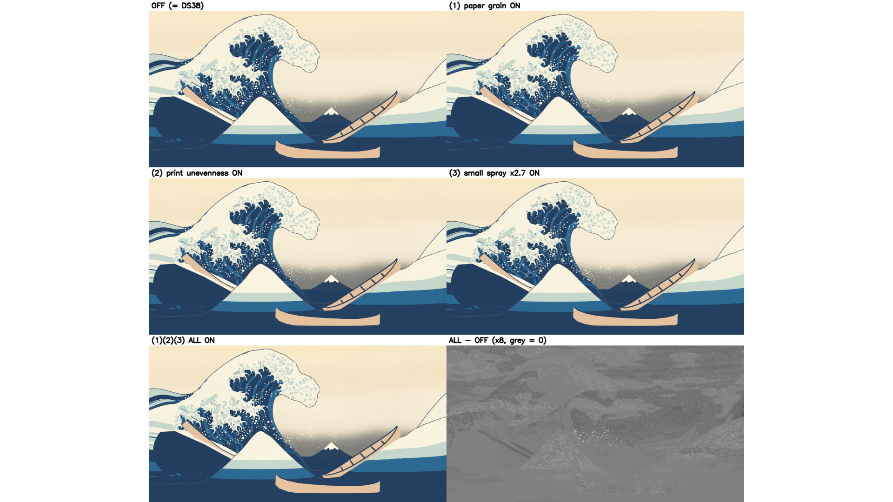
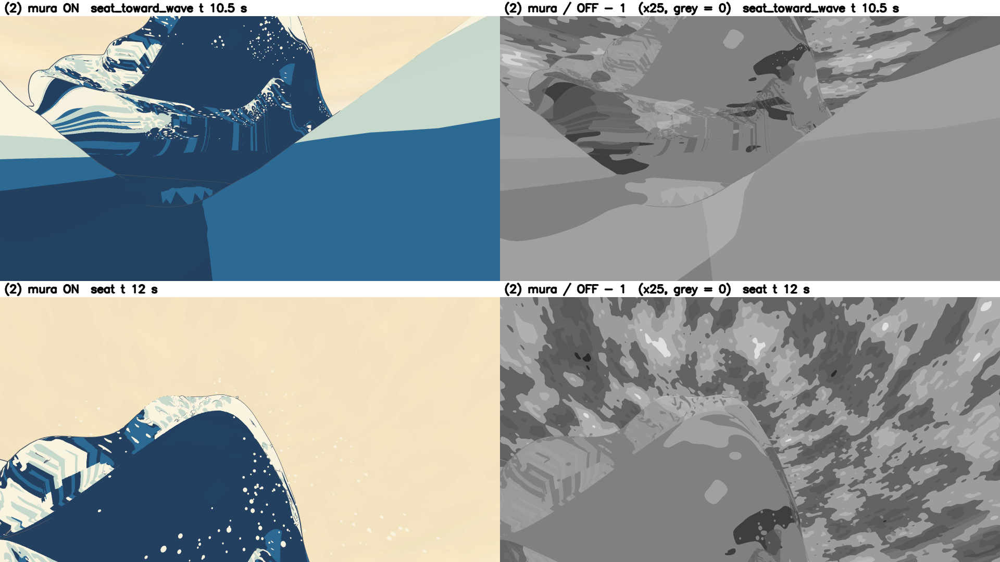

# 設計39：紙・摺り・小飛沫を一つずつ加える（オン/オフ、追加 GPU 時間） ― 紙の地と摺りのむらを面・物体に固定した掛け算の重ねで、小飛沫を設計31 の飛沫の子で足す。既定は全部切で、最小の受入は 2 つとも合格

日付：2026-09-30／状態：**閉じた（使える水準。最小の受入 2 つとも合格、成果物（入切の画像と追加 GPU 時間）あり）**。修正は 0 回（Q26 の 1 回は使っていない。頭の揺れの測り方を受入の判定の前に 2 回直したが、製品は変えていない。第 6 節）。証拠の種類は次のとおり。**HMD 実機の結果ではない。利用者は確かめていない。**

- 作る部（第「紙」部）：Unity 6000.4.3f1 の Editor の batchmode の PC オフスクリーン描画（camera.Render、RTX 3080、Direct3D11）、Release の Windows プレイヤー `DS39Perf.exe` の PC の実測（FrameTiming。RTX 3080 の代理で、設計35 と同じ測り方）、numpy/OpenCV/scikit-image の評価（`ds39_eval.py`）、原画視点の評価器（`ds30b_tstar_regress.py`、爪あり `t28_claws`・爪なし `t28_white`）。頭の揺れは座席のカメラを右の向きへずらした PC の描画で、HMD の頭の追跡ではない。
- 進行役の独立の検査（作る部の評価のコードを使わずに書いた numpy/OpenCV/SciPy。面の座標の線形補間で頭の揺れを測り直し、図とシェーダーのコードと動画から取り出したコマを見た。写しは Git 対象外の `Unity/Build/Design/39/indep_check/`）。判定は pass = true、必須の指摘 0。
- 記録の道具 `ds39_record.py`：作る部の出力・コード・入力・守るファイルの SHA-256 の照合（81 件）、作る部の評価のコードを使わない数え直し（全部切の t\* の組の全ファイル、入切の画像の ΔE00 > 2 の画素の数、①② の見えやすさ、プレイヤーの画面の入切）、むらの継ぎ目の図、証拠の写し、metrics.json・run.json。

番号の前提：

- 対象：[段階9までの実行計画](../Design/Stage9_Plan_2026-09-26_ja.md)（以下「計画」）§2.3 の設計39。使える水準の成果物は「一つずつ入切：① 紙の地の弱い質感（UV か世界に固定。画面空間は使わない）、② 摺りのむら（弱い）、③ 小飛沫（設計31 の飛沫の密度を上げた版）。各オン/オフの画像と追加 GPU 時間」、最小の受入は「評価と原画比較はオフで行う（ΔE00 の測定を乱さない）。オンでも頭の移動で質感が泳がない」。依存は設計36〜38 で、中身は印刷工程の調査（仕上げ32）で後から直す。計画の表には、この番号のバックログの項目番号の記載はない。
- 引き継ぎ：
  - 主役波の動き：設計28修正01 の `Unity/Build/Design/28R01F/F_final` と最後の一コマ `kstar_final`（K\*′ R4）。表示用サーフェスと色の焼き込みは[設計29修正01](Design_29_修正01_ja.md)。
  - [設計30](Design_30_ja.md)（周りの海 near・far と単一再生）、[設計31](Design_31_ja.md)（飛沫 186 粒と逆弾道の検査 150）〜[設計35](Design_35_ja.md)（既定の版と、計測器の測り方・立体の代理の予算 p95 ≤ 8.9 ms）、[設計36](Design_36_ja.md)（調色板と海の 4 段）、[設計37](Design_37_ja.md)（頭の揺れの部品 `DS37HeadSway` と面の座標の描画 `DS37 Surface Coord`）、[設計38](Design_38_ja.md)（場面 `DS38_Outlines.unity` `75f19c51…`。輪郭線）。
  - 設計38 から設計39 へ渡されたもの：線の決まりは設計38 のまま。「オンでも頭の移動で質感が泳がない」の確かめに設計37 の面の座標の描画と頭の揺れの部品を使う。評価と原画比較はオフで行う。
- 時間の上限：Q26 の日程で 2 時間（計画の時間枠は ≤0.5 日）。範囲は最小の受入だけで、修正は 1 回まで。
  - 実績（ファイルの時刻。[metrics.json](../Evidence/Design/39/metrics.json) の `time`）：作る部の着手 07:40:50（`paper/_started.txt`。作る部の README の題は 07:36 と書く）、小飛沫の子のデータ 07:45:58、Unity の描画の終わり 07:51:24、利得 15 の揺れの描き直し 07:54:10、プレイヤーのビルド 07:54:26、計時 run1 07:57:32・run2 08:00:32、評価 08:02:25、評価器 08:04:07、作る部の最後のファイル（README）08:04:54。作る部は約 24 分。進行役の独立の検査 08:08:04〜08:17:17（検査の写しのファイルの時刻）。記録 08:19 ごろ〜（終わりは `Unity/Build/Design/39/READY_TO_COMMIT.txt` の時刻）。2 時間の上限の内。
  - 1 回の計算：小飛沫の子 33.3 s、Unity の描画 31.0 s（`DS39_RENDER_DONE`）と揺れの描き直し 11.2 s、ビルド 5.7 s、計時 1 回 約 3 分、評価 48.5 s、評価器 約 3 分（出力のフォルダーの時刻 08:01〜08:04）、記録の道具 約 18 s。どれも 30 分の上限より十分短い。
- 読むだけで変えていないもの：設計27〜38 の場面・スクリプト・シェーダー・材質（守るファイル 20 個。描画の前後で SHA-256 が同じ、`protectedUnchanged = true`。ビルドの報告も true）、設計29修正01 の焼き込み、設計31 の飛沫のデータ、設計33 の爪の表、設計36 の海の表、評価器のファイル。ProjectSettings は Unity の実行の前後でバイトが同じ（戻したファイル 0。`paper/logs/ds39_settings_restore_*.json`）。
- 座標と単位：m・s。t は体験の時刻（コマ k は t = k/30 s、421 コマ）、t\* は t = 12 s（コマ 360）。画像の画素は 1920 × 1080 の表示の px。
- 使っていないもの：参照モデル、利用者の解算、写真のフォルダー、Blender・Houdini。爪形分析のフォルダー（`G:\research\爪形分析`）は、作る部も検査も記録の道具も開いていない。記録の時のコミットの一覧の点検でだけ、そのフォルダーのファイルの大きさと SHA-256 を読み取りのみで調べた（第 9 節）。
- git：作る部と記録は使っていない。進行役の独立の検査は、読み取りのみの `git status` で、tracked のファイル（Unity/Assets・ProjectSettings・Packages）に変更がなく、新しいのは Design39 だけであることを見た（報告の結論。何も変えていない）。

## 見るもの

| 入切の並べ：原画視点 t\*。切（= 設計38）・① 紙の地・② 摺りのむら・③ 小飛沫・全部と、全部 − 切（× 8、灰 = 0） | むらの継ぎ目：② を入れた画像と、② ÷ 切 − 1 を 25 倍にした灰（座席から波の方向 t 10.5 s と座席 t\*） |
| --- | --- |
|  |  |

図は Unity の PC 描画と、それから作った図である（1920 × 1080。入切の並べは作る部の 1280 × 1080 の図に白の余白を足した。元の図は Git 対象外の `Unity/Build/Design/39/paper/fig/`）。右の図は記録の道具が作った（第 5 節の限界 4）。

**見え方の注意**：①② は作品の強さ（利得 1）ではとても弱い。係数 1 ± 3%・1 ± 4% は雑音の山の値で、入 ÷ 切 の明るさの比の散らばり（標準偏差）は ① 0.23〜0.31%・② 0.37〜0.47% しかない（第 2.3 節）。並べの図の ①② は、拡大の図か全部 − 切の図でないと見分けにくい。③ は唇の前の空に白い点を足す。

動画（1920 × 1080、30 fps。Unity の PC 描画。全部入は ①②③ をすべて入れた作品の強さ）：

- 形成の全区間（t 0〜14 s、421 コマ、全部入）：[原画視点](../Evidence/Design/39/ds39_formation_painting_all_30fps.mp4)（3,461,165 バイト）・[座席](../Evidence/Design/39/ds39_formation_seat_all_30fps.mp4)（1,779,568 バイト）
- 頭の揺れ（目 ±0.1 m・周期 2 s で 4 s、121 コマ）：[座席から波の方向 t 9 s・全部入](../Evidence/Design/39/ds39_sway_seat_toward_wave_t09_all_30fps.mp4)（571,600 バイト）、[座席 t\*・全部入](../Evidence/Design/39/ds39_sway_seat_tstar_all_30fps.mp4)（1,239,045 バイト）、[座席から波の方向 t 9 s・①② を 6 倍に強めた検査用](../Evidence/Design/39/ds39_sway_seat_toward_wave_t09_paper_mura_gain6_30fps.mp4)（878,590 バイト。作品の値ではない）

図：

- 入切の並べ（切・①・②・③・全部・全部 − 切）：[原画視点 t\*](../Evidence/Design/39/fig_ds39_onoff_painting_t120.png)・[座席 t\*](../Evidence/Design/39/fig_ds39_onoff_seat_t120.png)・[座席の低い視点 t\*](../Evidence/Design/39/fig_ds39_onoff_seat_low_t120.png)・[座席から波の方向 t 10.5 s](../Evidence/Design/39/fig_ds39_onoff_seat_toward_wave_t105.png)
- 拡大（切・①・②・全部）：[原画視点の唇](../Evidence/Design/39/fig_ds39_zoom_painting_t120.png)・[座席の頂と空](../Evidence/Design/39/fig_ds39_zoom_seat_t120.png)
- 頭の揺れの検査（①② を利得 15 で描いた係数、目 −0.1・+0.1 m と画面の同じ画素の差）：[座席から波の方向 t 9 s](../Evidence/Design/39/fig_ds39_swim_seat_toward_wave_t090.png)・[座席 t\*](../Evidence/Design/39/fig_ds39_swim_seat_t120.png)（作る部の 1920 × 720 の図に余白を足した）
- [むらの継ぎ目](../Evidence/Design/39/fig_ds39_mura_seams.png)（記録の道具）

数値：

- [metrics.json](../Evidence/Design/39/metrics.json)：最小の受入 `acceptance`（作る部・独立の検査・記録の数え直し）、記録 `record_only`（入切の ΔE00 と見えやすさ、プレイヤーの画面、GPU の全部の行、小飛沫）、回帰 `regression_plan_2_0`、修正 `fix_rounds`、記録の照合 `recorder_crosscheck`、時間 `time`
- 作る部の写し：[ds39\_acceptance.json](../Evidence/Design/39/ds39_acceptance.json)（受入の表と回帰）、[ds39\_paper\_metrics.json](../Evidence/Design/39/ds39_paper_metrics.json)（切ったら同じ・入切の ΔE00・頭の揺れ・GPU 時間の全部の値）、[ds39\_run.json](../Evidence/Design/39/ds39_run.json)、[ds39\_spray\_dense\_log.json](../Evidence/Design/39/ds39_spray_dense_log.json)（小飛沫の子の作り方と数）
- 評価器の出力は設計38 の出力と SHA-256 まで同じファイル（`4ca57d3a…`）なので、写していない（設計36 の証拠の [ds36\_tstar\_regress.json](../Evidence/Design/36/ds36_tstar_regress.json) と同じファイル）。
- 実行条件と SHA-256：[run.json](../Evidence/Design/39/run.json)

## 0. 結論

1. **紙の地（①）・摺りのむら（②）・小飛沫（③）を、それぞれ入切できる形で足した。既定は全部切。** `DS39PaperLayers.Set(紙, むら, 小飛沫)` で切り替え、切ったときは足した材質と子のレンダラーを外すので、描画は設計38 と同じになる。
   - ①②：面か物体に固定した 3 次元の座標の値の雑音を、掛け算で重ねる描画（`Blend DstColor SrcColor`、深度は書かない、`LEqual` と `Offset −1,−1`）。画面の座標は使わない。主役波・near・far は t\*（層 241、重み 1）のその頂点のワールドの位置を座標にする（面に固定。UV と同じ働き）。富士・船・平らな海・継ぎ目の幕は物体に固定し、空のドームは目からの向き × 100 m（無限遠）にした。外殻線・爪・飛沫には重ねない。
   - ① は細かい繊維と粒（振幅 ±3%）、② は横に長いむら（約 20 m × 3 m）・大きな斑（約 8 m）・木目の筋（振幅 ±4%）。
   - ③ は設計31 の飛沫 186 粒の各粒から子を 3 粒ずつ作り、設計31 の逆弾道の検査（150）を通った 317 粒（558 粒のうち）を残した。合わせて 503 粒（密度 × 2.70）。
2. **最小の受入（計画 §2.3）はどちらも合格。**
   - 評価と原画比較は全部切で行い、ΔE00 の測定を乱さない：**合格**。全部切の t\* の組（爪なし・爪あり）の 48 ファイル（PNG 46・`idmap.json` 2）が、設計38 のファイルと画素・バイトまで同じ（記録の数え直し。作る部は PNG 20 枚を比べた）。評価器の出力は設計38 と SHA-256 まで同じ（`4ca57d3a…`、112 個の値が同じ）。2 つの場面の既定は全部切。
   - 入れても頭の移動（±0.1 m）で質感が泳がない：**合格（PC 描画の揺れ）**。面の座標で予測した残り ÷ 模様の散らばり N は、① 0.092〜0.235（画面に貼り付けた模様の対照は 0.95〜1.35）、② 0.036〜0.180（対照 0.12〜0.24）。画面の同じ画素との比 S は ① 0.096〜0.198。基準 0.35。独立の検査の別の測り方（面の座標の線形補間。升を使わない）でも、near の ① N 0.09（対照 1.18〜1.36）・② N 0.019（対照 0.12〜0.19）、座席 t\* の主役波の ① N 0.15〜0.17（対照 0.96〜1.27）。
3. **成果物：入切の画像 20 枚（4 視点 × 切・①・②・③・全部）と追加 GPU 時間。** 立体の代理（座席、2064 × 2208 × 2 眼、4×MSAA）の GPU の中央値の差（run1／run2）は、① +0.716／+0.748 ms、② +1.097／+1.137 ms、③ +0.061／+0.041 ms、全部 +2.297／+2.328 ms。全部入の GPU p95 は 3.909／3.906 ms で、設計35 の予算 8.9 ms の中。①② は画面のほぼ全部へもう 1 回ずつ描くので重い（限界 1）。
4. **計画 §2.0 の回帰なし。** 既定の全部切は設計38 と同じ画像で、評価器の 112 個の値が同じ（78・130・131 の差 0.0、132 σ12 3.7552 px、72 σ24 p95 3.8423 px（爪あり）・4.0075 px（爪なし））。
5. **HMD（PS VR2）での見え方・立体視（SPI）・GPU 時間は保留**（導入は利用者の手）。頭の揺れは PC の描画。
6. **限界（第 5 節）**：①② の GPU 時間、①② が作品の強さでほとんど見えないこと、爪・飛沫・線に質感がないこと、むらがシートと物体の境で切れること、Offset の二重の重ね（測っていない）、質感の中身が調査に基づかないこと、③ が原画の白い点と対応しないこと、測り方の弱さ。仕上げ31・32・33・35・37 と設計08〜10（PS VR2 の後）・段階9 へ送った。

---

## 1. 目的

設計書の設計39 は、浮世絵の紙と摺りの感じ（紙の地、摺りのむら）と小さな飛沫を、一つずつ入切できる形で足し、それぞれの見え方と GPU の負荷を比べる番号である。美術優先の計画では削除（10/29 以降へ延期）していたので、ここで初めて作る。計画 §2.3 の求めは次のとおり。

- ① 紙の地の弱い質感（UV か世界に固定。画面空間は使わない）、② 摺りのむら（弱い）、③ 小飛沫（設計31 の飛沫の密度を上げた版）を一つずつ入切し、各オン/オフの画像と追加 GPU 時間を出す。
- 評価と原画比較はオフで行い（ΔE00 の測定を乱さない）、オンでも頭の移動で質感が泳がないこと。
- 質感の中身は、仕上げ32 の印刷工程の調査で後から直す。

Q26 により、最小の受入だけを満たし、修正は 1 回までとした。

---

## 2. 表

### 2.1 最小の受入（作る部・進行役の独立の検査・記録の数え直し）

| 項目 | 作る部 | 進行役の独立の検査 | 記録の数え直し（`ds39_record.py`） | 判定 |
| --- | --- | --- | --- | --- |
| 評価と原画比較は全部切（ΔE00 を乱さない） | 全部切の t\* の組の PNG 20 枚が設計38 と画素まで同じ。評価器の出力が設計38 と SHA-256 まで同じ（112 個の値）。既定は全部切 | 合格。組の 48 ファイル（idmap.json を含む）が設計38 と同じ。t\* の描画は `Build()` の後の `Set(false, false, false)` で、「作ってから切った」状態を試している。場面の既定は全部切 | 48 ファイル（PNG 46・`idmap.json` 2）が同じ、違い 0。評価器の出力の SHA-256 が同じ。2 つの場面で `paperOn`・`muraOn`・`sprayOn` が 0、密な飛沫の `drawInPlayMode` 0 | 合格 |
| 入れても頭の移動で質感が泳がない（±0.1 m） | ① S 0.096〜0.198・N 0.092〜0.235（対照 N 0.95〜1.35）、② N 0.036〜0.180（対照 0.12〜0.24）。基準 0.35 | 合格。面の座標の線形補間で、near の ① N 0.090〜0.092（対照 1.18〜1.36）・② N 0.019（対照 0.12〜0.19）、座席 t\* の主役波の ① N 0.149〜0.169・S 0.133〜0.156（対照 0.96〜1.27）、② N 0.130〜0.167（対照 0.21〜0.28）。シェーダーの模様の座標は面・物体・空の向きだけ。利得 6 の揺れの動画で空のコマの差 0 | — | 合格（PC 描画の揺れ。HMD は保留） |
| 各オン/オフの画像と追加 GPU 時間 | 画像 20 枚と図、GPU の中央値の差（第 2.4 節） | 画像 20 枚がある。生の FrameTiming から数え直した中央値の差が記録と同じ。プレイヤーの画面で層が切り替わる（小飛沫 186 → 503） | プレイヤーの画面で ①② を入れると 68.5〜80.4% の画素が変わり、最大の差は 2〜5 段（第 2.3 節） | 作った（記録） |

- 作る部の値は [ds39\_acceptance.json](../Evidence/Design/39/ds39_acceptance.json) と [ds39\_paper\_metrics.json](../Evidence/Design/39/ds39_paper_metrics.json) の `swim`、検査の値は metrics.json の `acceptance.no_swim_with_head_motion.indep_check`（元は `indep_check/swim_indep.json`）、記録の値は metrics.json の `acceptance.off_does_not_disturb_de00.recorder`・`scene_defaults` と `record_only.player_screens_recorder`。
- 検査の欄の「生の FrameTiming から数え直した値が同じ」「利得 6 の動画で空のコマの差 0」は検査の報告の結論で、値のファイルは残っていない。

### 2.2 頭の揺れの内訳（作る部。利得 15 の描画、面の座標の升は格子の 1/64）

作る部の定義：同じ時刻で目の位置だけ違う 2 枚（A・B）で、模様の係数 F（利得 15 で描いた入の明るさ ÷ 切の明るさ）を比べる。A の F を面の座標（シートの番号・列・行）の升ごとに平均した表で B の画素を予測した残りを d\_面、画面の同じ画素の差を d\_画面とし、N = RMS(d\_面) ÷ std(F\_B)、S = RMS(d\_面) ÷ RMS(d\_画面)。対照は、模様が画面に貼り付いていたとき（B の画素に A の同じ画素の値を置く）の N。使う画素は主役波・near・far の内側（7 × 7）で、切の明るさ ≥ 0.08。合格は ① S・N ≤ 0.35、② N ≤ 0.35（すべての組。シートをまとめた値）。

| 視点・目の組（m） | 画面の移りの中央値 | ① S・N（対照） | ② N（対照）［S は記録］ | 主役波だけの ① N（記録） |
| --- | --- | --- | --- | --- |
| 座席から波の方向 t 9 s、−0.1・+0.1 | 49.67 px | 0.173・0.235（1.346） | 0.036（0.172）［0.204］ | 0.458 |
| 同、−0.05・+0.05 | 24.67 px | 0.197・0.234（1.169） | 0.038（0.115）［0.314］ | 0.461 |
| 同、−0.1・0 | 24.69 px | 0.197・0.235（1.171） | 0.037（0.115）［0.312］ | 0.437 |
| 同、0・+0.1 | 24.55 px | 0.198・0.235（1.168） | 0.037（0.116）［0.313］ | 0.449 |
| 座席 t\*、−0.1・+0.1 | 11.0 px | 0.102・0.128（1.254） | 0.180（0.236）［0.703］ | （主役波だけ） |
| 同、−0.05・+0.05 | 6.0 px | 0.102・0.097（0.950） | 0.066（0.191）［0.326］ | 同 |
| 同、−0.1・0 | 6.0 px | 0.109・0.104（0.947） | 0.069（0.192）［0.338］ | 同 |
| 同、0・+0.1 | 6.0 px | 0.096・0.092（0.954） | 0.064（0.190）［0.321］ | 同 |

- 座席から波の方向の画素のほとんどは near（1,096,727〜1,120,922 px）で、主役波は 7,674〜13,644 px。**主役波だけの ① N は 0.437〜0.461 で基準 0.35 を超える**が、合否はシートをまとめた値で読む定義なので、作る部の要約には出ていない（第 10 節の 2）。独立の検査では、この視点の主役波の ① の模様の散らばりは利得 15 でも 0.0019 しかなく（near は 0.034）、N は模様ではなく描画の丸めを測っている（検査の N 0.40〜0.41、同じ所の対照 0.76〜0.91）。
- 升の大きさの読み（−0.1・+0.1 の組、①）：座席から波の方向で 1/16 格子 N 0.544、1/64 格子 0.235、1/256 格子 0.109。座席 t\* で 0.230・0.128・0.100。near の格子は粗く（44 行 × 1,231 列）、1/16 格子の升は紙の地の粒より大きいので、升の表そのものが粒をならして N を上げる。1/64 を採った（第 6 節）。
- ② は低い周波数なので、この揺れの幅では画面に貼り付けた対照も N 0.12〜0.24 と基準の内に入り、この定義では見分けられない（作る部の記録）。独立の検査の線形補間では、near で ② N 0.019 と対照 0.12〜0.19 が分かれた（第 10 節の 3）。

### 2.3 入切の ΔE00 と、①② の見えやすさ（全部切との差、記録）

作る部の ΔE00（CIEDE2000、sRGB → Lab）の平均・p95 と、記録の道具が数え直した ΔE00 > 2 の画素の数（作る部の割合は小数 5 桁に丸めてあり、1 画素は 0.0 になる）。

| 視点 | ① 平均・p95・> 2 の画素 | ② 平均・p95・> 2 の画素 | ③ > 2 の画素（割合） | 全部 平均・p95 |
| --- | --- | --- | --- | --- |
| 原画視点 t\* | 0.215・0.579・0 | 0.269・0.641・0 | 1,621（0.078%） | 0.349・0.864 |
| 座席 t\* | 0.180・0.236・0 | 0.239・0.517・1（最大 2.07） | 4,966（0.239%） | 0.460・0.635 |
| 座席の低い視点 t\* | 0.115・0.416・1（最大 4.80） | 0.163・0.544・1（最大 4.80） | 4,866（0.235%） | 0.323・0.707 |
| 座席から波の方向 t 10.5 s | 0.226・0.517・0 | 0.331・0.623・0 | 2,563（0.124%） | 0.545・1.042 |

- ①② の ΔE00 > 2 は、座席の低い視点の (1051, 167) の 1 画素（① と ② の同じ画素）と、座席の (857, 459) の 1 画素だけ。作る部の「ΔE00 > 2 の画素 0」は 1 画素ずつ違う（第 10 節の 9）。
- ①② の見えやすさ（記録の道具。切の明るさ ≥ 0.08 の画素で、入 ÷ 切 の明るさの比 − 1）：

| 視点 | ① 散らばり（標準偏差）・\|比 − 1\| の p99・値が変わった画素 | ② 散らばり・p99・値が変わった画素 |
| --- | --- | --- |
| 原画視点 t\* | 0.307%・0.503%・71.8% | 0.427%・1.02%・77.0% |
| 座席 t\* | 0.231%・0.452%・77.8% | 0.469%・1.02%・80.4% |
| 座席の低い視点 t\* | 0.241%・0.487%・42.6% | 0.372%・1.02%・48.4% |
| 座席から波の方向 t 10.5 s | 0.308%・0.676%・65.8% | 0.367%・1.02%・78.3% |

- プレイヤーの画面（Release、run1・run2 で同じ値）：① を入れると 68.5〜77.8%、② は 72.1〜80.4% の画素が変わり、最大の差は ① 2〜3 段・② 4〜5 段、p99 は 1・2 段。③ は 0.11〜0.39% の画素。
- ③ の平均 ΔE00 は 0.009〜0.105 で、変わるのは粒の所だけ（p95 は 0）。

### 2.4 追加 GPU 時間（作る部。Release の `DS39Perf.exe`、RTX 3080）

区間 t 11〜12 s（最も密な所）、助走 3 s・測定 8 s、垂直同期なし、2 回。数え方は設計35（各条件の先頭 8 件を除き、GPU は 0 より大きく 1 s 未満）。基準＝全部切＝設計38 の描画。値は GPU の中央値の差（run1／run2、ms）。

| 入切 | 1920 × 1080 原画視点 | 1920 × 1080 座席 | 立体の代理（座席、2064 × 2208 × 2 眼、4×MSAA） |
| --- | --- | --- | --- |
| 基準（全部切）の中央値 | 0.469／0.472 | 0.364／0.364 | 1.034／1.013（p95 1.407／1.284） |
| ① 紙の地 | +0.436／+0.364 | +0.302／+0.275 | +0.716／+0.748 |
| ② 摺りのむら | +0.379／+0.372 | +0.329／+0.283 | +1.097／+1.137 |
| ③ 小飛沫 | +0.035／+0.037 | +0.028／+0.032 | +0.061／+0.041 |
| 全部 | +0.790／+0.772 | +0.600／+0.587 | +2.297／+2.328 |
| 全部入の中央値・p95 | 1.259・1.739／1.244・1.723 | 0.964・1.114／0.950・1.081 | 3.331・3.909／3.341・3.906 |

- GPU の値が 0 の割合（除いた割合）：立体の代理の基準 30.1%／28.0%、① 0.2%／0.4%、② 0.0%／0.03%、全部 0／0。1920 × 1080 では基準 7.6〜15.8%、①② 22.5〜37.5%。1,000 fps 前後で GPU の計時が間に合わないためで、設計35 と同じ扱い。立体の代理では基準だけ 0 が多いので、基準の中央値が偏り、差の値は目安として読む（第 10 節の 6）。
- 小飛沫の数：基準・①・② 186、③・全部 503（プレイヤーの記録 `spray_count`）。

### 2.5 回帰（原画視点。計画 §2.0）

| 比べたもの | 設計39（全部切） | 設計38 | 同じか |
| --- | --- | --- | --- |
| 評価器の出力 `ds30_tstar_regress.json`（爪あり・爪なし） | `paper/unity/ds30_tstar_regress.json` | `Unity/Build/Design/38/outlines/unity/ds30_tstar_regress.json` | SHA-256 まで同じ（`4ca57d3a…`）。112 個の値が同じ |
| 78・130・131 の差 | 0.0・0.0・0.0 | 同じ | 同じ |
| 132 σ12 最大／72 σ24 p95 | 3.7552 px／3.8423 px（爪あり）・4.0075 px（爪なし） | 同じ | 同じ |
| t\* の組のファイル | 48（PNG 46・`idmap.json` 2） | 48 | 全部同じ（違い 0） |

- 既定が全部切なので、評価器の表と原画比較の入力は設計38 のまま。厳しい色の読み（29修正01 の 73・79・118・134・175・263・267）は仕上げ28 のまま、悪くしていない。
- 守るファイル 20 個は描画の前後で同じ。設計38 の材質 `DS38_Outline_hero.mat`・`DS38_Outline_near.mat` はファイルの時刻が 07:54:10（揺れの描き直しの終わり）に変わったが、SHA-256 は設計38 の記録と同じ（Unity が同じ中身で保存し直した）。

### 2.6 小飛沫（③）の子（`ds39_spray_dense.py`。値は [ds39\_spray\_dense\_log.json](../Evidence/Design/39/ds39_spray_dense_log.json)）

| 項目 | 値 |
| --- | --- |
| 親（設計31 の飛沫） | 186 粒（半径 0.030〜0.111 m、中央値 0.052 m） |
| 子の作り方 | 親 1 粒に 3 粒。放出の時刻 +0〜0.06 s、放出の点を 3〜15 cm ずらす、初速の向き ≤ 7°・速さ × 0.85〜1.10、半径 × 0.35〜0.65（下限 0.015 m）。乱数の種 39031 |
| 作った子・残した子 | 558 粒・317 粒（設計31 の逆弾道の検査 150 で落とした 241 粒） |
| 合わせて | 503 粒（密度 × 2.704） |
| 子の半径 | 0.015〜0.065 m（中央値 0.025 m） |
| 子の出る時刻 | 最初の子 t 8.8 s。t 10 s で 282 粒、t 11 s からは 317 粒全部 |

- 独立の検査は、残した 317 粒のデータの SHA-256 が記録と同じで、接触・内側・水面を離れない粒がどれも 0 であることを確かめた（検査の報告の結論）。

---

## 3. 作り方と、採ったもの

### 3.1 Unity（`Unity/Assets/GreatWave/Design39/`）

- `Shaders/DS39PaperCommon.cginc`（`4cbc6ec9…`）：3 次元の値の雑音。係数 f = 1 + 振幅 × (2g − 1)（g は 0〜1 の雑音）を、2 倍の掛け算で出す。
  - ①：x・z の水平の 2 方向へ引き伸ばした繊維（長さ約 33 cm、幅約 7 cm）と、等方の粒 3 オクターブ（1 m あたり 6・16・40）。
  - ②：横に長いむら（約 20 m × 3 m）、大きな斑（約 8 m）、木目の細い筋。
  - オクターブごとに、画素あたりの周期の数（fwidth(p) × 周波数）が 0.25 を超えると平均へ寄せ、0.5 で消す。細かすぎる模様を消すだけで、模様の位置は座標 p だけで決まる。
  - 大域の `_DS39Gain` は検査の描画で模様を強めるためだけに使う（作品の描画では入れない）。
- `Shaders/DS39_Paper_Keypose.shader`（`4f404490…`）：主役波・near・far 用。t\* の 4 層の重み付きの和（`_DS39RestSlices`・`_DS39RestWeights`・`_DS39RestOrigin`）で、その頂点の t\* のワールドの位置を座標にする。面のレンダラーの材質の配列の後ろに足すので、`DS30SheetPlayer` の keypose の値（MaterialPropertyBlock）をそのまま読む。`ZWrite Off`・`ZTest LEqual`・`Offset -1, -1`・`Blend DstColor SrcColor`・`Queue Geometry+20`・両面。
- `Shaders/DS39_Paper_Mesh.shader`（`a890a106…`）：ほかのメッシュ用。同じメッシュを共有する子のレンダラーとして足す。座標は物体に固定（物体の座標 × 物体の尺度）か、空の向き（目からの向き × 100 m）。
- `Scripts/DS39PaperLayers.cs`（`ba6c7f98…`）：`Build()`（t\* の値を読み、材質を写し、子のレンダラーを作る）と `Set(紙, むら, 小飛沫)`。子のレンダラーは、親が描かれるときだけ入る。重ねないシェーダーの語（Outline・Depth・Claw・Coord・Spray・DS39）を外す。
  - 描画の報告の対象：シート 3 枚（層 241、重み 1）と、メッシュ 51 個（空のドーム 1、AF27 Flat 22（富士・船 3 隻・平らな海など）、Standard 28）。Standard の 28 個は古い `M1_Foam_*` で、場面ではどれも `m_IsActive: 0`（記録の時に場面のファイルを読んで数えた）なので、重ねは描かれない。
- `Scripts/DS39PerfRunner.cs`（`cf04f889…`）：計測器（美術優先32・設計35 の測り方）。条件ごとに入切を変え、FrameTiming と画面の写しを残す。
- 材質 `Materials/DS39_Paper_Keypose.mat`・`DS39_Mura_Keypose.mat`・`DS39_Paper_Mesh.mat`・`DS39_Mura_Mesh.mat`（実行時にシートごとに写して t\* の値を入れる）。振幅 ① 0.03・② 0.04。
- ③：2 つ目の `DS31InstancedParticles`（「DS39 spray dense」）で子の 317 粒を描く（親の 186 粒は設計31 のまま）。Play モードでは `Set` が `drawInPlayMode` を切り替える。
- 場面 `Scenes/DS39_Paper.unity`（`7480a99b…`。設計38 の場面に上の部品を足して全部切で保存）、計測器の場面 `Scenes/DS39_Perf.unity`（`b0795a9e…`）。
- `Editor/DS39Render.cs`（`da13f13c…`）：場面の作成、全部切の t\* の組、入切の画像 20 枚、頭の揺れの描画（切・① 利得 15・② 利得 15 と面の座標）、動画 5 本、プレイヤーのビルド。守るファイルの SHA-256 を前後で比べる。
- 道具（`Tools/GWWaveGen/ds39/`）：`ds39_spray_dense.py`（小飛沫の子）、`run_ds39_unity.ps1`（Unity の 1 回の実行と `unity.lock`、ProjectSettings の控えと戻し）、`run_ds39_player.ps1`（プレイヤーの計時）、`ds39_eval.py`（評価と図）、`ds39_run_record.py`（作る部の実行の記録）、`ds39_record.py`（記録）。

### 3.2 測り方（作る部）

- 切ったら同じ：全部切の t\* の組（`Build()` の後に `Set(false, false, false)`）を、設計38 の同じ名前の画像と画素で比べ、評価器を全部切の組で回して設計38 の出力と比べる。
- 入切：4 視点（原画視点 t\*、座席 t\*、座席の低い視点 t\*、座席から波の方向 t 10.5 s）× 切・①・②・③・全部。全部切との ΔE00。
- 頭の揺れ：第 2.2 節。視点は座席から波の方向 t 9 s と座席 t\*、目 −0.1・−0.05・0・+0.05・+0.1 m。
- GPU：第 2.4 節。

### 3.3 採ったもの（Q24。進行役の判断で、利用者の決定ではない）

- **①② の座標は、シートは t\* の頂点の位置、ほかは物体の座標、空は向き。** 理由：計画の「UV か世界に固定。画面空間は使わない」を満たし、keypose の面が動いても模様が面に付いて動く。落とした：その時刻のワールドの座標そのもの（形成の間に面が動くと、模様が面の上を流れる）。
- **掛け算の重ねの描画（材質の追加）にした。** 理由：設計27〜38 のシェーダーを変えずに入切でき、切れば設計38 と同じになる。落とした：面のシェーダーに質感を入れる（守るファイルが変わる）。代わりに画面のほぼ全部へもう 1 回描くので重い（限界 1）。
- **振幅は ① ±3%・② ±4%（進行役の既定値）。** 「弱い」の読み。見えやすさは第 2.3 節で、作品の強さではとても弱い（限界 2）。
- **③ は設計31 の逆弾道の検査（150）を通った子だけを残した。** 水面へ引き戻される粒を足さないため。
- **既定は全部切。** 計画の「評価と原画比較はオフ」のため。
- **頭の揺れの判定は、シートをまとめた値で、升は格子の 1/64（第 6 節）。** シートごとの値は記録した（第 2.2 節）。

---

## 4. 関門

| 最小の受入・規則 | 基準 | 値 | 判定 |
| --- | --- | --- | --- |
| 評価と原画比較は全部切（ΔE00 を乱さない） | 全部切で設計38 と同じ。既定は全部切 | t\* の組 48 ファイルが同じ、評価器の出力が SHA-256 まで同じ（112 個の値）、2 つの場面の既定は全部切 | 合格 |
| 入れても頭の移動で質感が泳がない | ① S・N ≤ 0.35、② N ≤ 0.35（すべての組、既定値） | ① S 0.096〜0.198・N 0.092〜0.235（対照 0.95〜1.35）、② N 0.036〜0.180（対照 0.12〜0.24） | 合格（PC 描画の揺れ） |
| 各オン/オフの画像と追加 GPU 時間 | 成果物 | 画像 20 枚、立体の代理の中央値の差 ① +0.72〜0.75・② +1.10〜1.14・③ +0.04〜0.06・全部 +2.30〜2.33 ms | 作った（記録） |
| 立体の代理の GPU p95（設計35 の予算、記録） | ≤ 8.9 ms | 全部入 3.909／3.906 ms | 予算の中（記録） |
| 計画 §2.0 の回帰 | 78・130・131・132・72・69・70・212、色区の項目は 29修正01 の読み | 評価器の出力が設計38 と同じファイル | 合格（後退なし） |
| 守るファイル・ProjectSettings | 変えない | 20 個が同じ、ProjectSettings の戻し 0 | 合格 |
| HMD（PS VR2）での見え方・立体視（SPI） | — | — | 保留（導入は利用者の手） |

---

## 5. 限界

1. **①② の GPU 時間が大きい。** 画面のほぼ全部（空のドーム・海・主役波）へもう 1 回ずつ描く重ねなので、立体の代理で ① +0.72〜0.75 ms、② +1.10〜1.14 ms、全部 +2.30〜2.33 ms。① と ② を 1 回の描画にまとめる、雑音を表のテクスチャーにする、空だけ別にする、などで減らせる見込み。② が ① より重い理由は調べていない。仕上げ35（負荷）と仕上げ32（中身を決め直すとき）へ。
2. **①② は作品の強さではほとんど見えない。** 係数の ±3%・±4% は雑音の山の値で、比の散らばりは ① 0.23〜0.31%・② 0.37〜0.47%、プレイヤーの画面の最大の差は 2〜5 段（第 2.3 節）。空は 100 m 先として扱うので、粒のオクターブは画素より細かくて消え、繊維の長い向きの成分しか残らない（シェーダーの決まりからの読み）。暗い藍の面では 8 bit の丸めで模様が消える（[むらの継ぎ目の図](../Evidence/Design/39/fig_ds39_mura_seams.png)の主役波の暗い面は平らな灰）。独立の検査の読みでは、紙の地が見えるのは白い泡・富士・近くの船くらい。中身と振幅は仕上げ32 へ。
3. **爪・飛沫・外殻線には紙の地もむらも重ねていない。** 爪は CPU で毎コマ作り直す世界の座標のメッシュで、面の座標がない。仕上げ32・33 へ。
4. **② のむらは、シート・物体ごとの座標なので、輪郭と境で切れる。** 主役波・near・far・物体の境で模様が続かない（[むらの継ぎ目の図](../Evidence/Design/39/fig_ds39_mura_seams.png)の右の列、25 倍）。本物の摺りのむらは紙に付くので、作品の強さでは見えないが、中身として正しくない。① も同じ座標なので、継ぎ目では続かないことがある（測っていない）。仕上げ32 へ。
5. **Offset −1,−1 の重ね。** 同じ面の上だけに重なる前提で、ほぼ同じ深さの 2 枚（継ぎ目・唇の重なり）では 2 回重なることがありうる。測っていない。独立の検査の読みでは、明るい平らな所で入 ÷ 切 の比が 1 層の振幅を超える画素はなく、二重の重ねの印は見えなかった（検査の報告の結論）。仕上げ32 へ。
6. **質感の中身（繊維の向き、むらの形、振幅）は進行役の既定値で、この作品の摺りの調査に基づいていない。** 計画のとおり、仕上げ32 の摺りの工程の調査で直す。
7. **③ の子の粒は原画の白い点に対応しない。** 原画視点では唇の前の空に点が増える（ΔE00 > 2 の画素 1,621）。原画比較は全部切で行う。飛沫の大小と分布は仕上げ31 へ。
8. **頭の揺れの測り方の弱さ。**
   - 合否はシートをまとめた値で読むので、座席から波の方向の主役波だけの ① N 0.437〜0.461（基準超え）が要約に出ない。独立の検査では、この値は模様ではなく描画の丸めを測っている（模様の散らばり 0.0019）。
   - ② は低い周波数なので、作る部の定義では画面に貼り付けた対照も基準の内に入る（N 0.12〜0.24）。独立の検査の線形補間では near で分かれた（② N 0.019、対照 0.12〜0.19）。
   - 数値の検査はシート（主役波・near・far）だけ。空（向きの座標）と船・富士（物体に固定）は作りから固定されているが、数値では測っていない（利得 6 の動画で空のコマの差 0 は検査の報告の結論）。
   - どれも仕上げ32 と仕上げ37（模様の追従の測り方）で直す。
9. **GPU の値の 0 の割合。** 立体の代理の基準だけ 28〜30% が 0 で、①② はほぼ 0。基準の中央値が偏りうるので、差は目安（第 2.4 節）。RTX3060 の実測を含め仕上げ35 へ。
10. **密な飛沫のデータの場所。** 場面の `dataPath` は G: の絶対のパス（`Unity/Build/Design/39/paper/spray/…`、Git 対象外）で、設計31 の飛沫は相対のパス。データは `ds39_spray_dense.py` で作り直せるが、別の場所へ移すと読めない。段階9 で場面をつなぐときに相対のパスへ直す。
11. **測っていないもの**：PS VR2 の HMD での見え方と GPU 時間、SPI の立体視（立体視のマクロは書いたが立体視の描画では確かめていない）、Play モードの入切（計測器のプレイヤーの中でだけ確かめた）。保留（Q24）。
12. **崩壊は作らない**（Q11）。

---

## 6. 修正の記録（Q26：修正は 1 回まで）

| 回 | 変えたこと | 結果 |
| --- | --- | --- |
| 作る部（07:40:50〜08:04:54） | ①②③ と場面・計測器を作り、Unity の描画（揺れの描き直しを含めて 2 回）・ビルド 1 回・計時 2 回・評価器・評価を回した | 最小の受入は 2 つとも合格。修正の回は使わなかった |
| 頭の揺れの測り方の直し 1（受入の判定の前。製品は変えていない） | 最初の定義（利得 6、面の座標の 1/4 格子の升で画素を対応させた中央値の差の比 ≤ 0.35）をやめ、利得を 15 に上げて揺れだけを描き直し（`-Log swim15`）、升の表で予測する定義へ替えた | 最初の定義では、8 bit の丸めが模様の振れと同じ大きさになり、② は画面の移りで値がほとんど変わらず、画面の同じ画素の差が 0 になって判定できなかった |
| 頭の揺れの測り方の直し 2（受入の判定の前。製品は変えていない） | 升を格子の 1/16 から 1/64 へ | 1/16 では near の升が紙の地の粒（2.5〜7 cm）より大きく N 0.544 になった。1/16・1/64・1/256 の読み（N 0.544・0.235・0.109）で、残りが升の粗さによると分かったので 1/64 にした |
| 進行役の独立の検査（08:08:04〜08:17:17） | 自前のコードで、全部切の組・SHA-256・頭の揺れ（線形補間）・GPU の数え直し・動画のコマを見た | pass = true、必須の指摘 0。記録の指摘 8（第 10 節） |

- 修正の回数は 0。測り方の 2 回の直しは、どちらも合否を出す前で、作品のコード・場面・材質を変えていない（作る部の判断。進行役もそう読んだ）。ただし、升の大きさを結果を見て選んだので、独立の検査の升を使わない測り方で確かめた（第 2.1 節）。
- 記録の時に、記録の道具の書き誤り（環境の欄の名前の重なりで止まった）を 1 回直した。作品と作る部の出力には関係しない。

---

## 7. 引き継ぎ

**設計40**（原画カメラと船上カメラで比較する）：評価器の表と原画比較は全部切（既定）で行う。原画視点の t\* の画像は設計38 と同じファイルなので、回帰の入力は設計38 の `Unity/Build/Design/38/outlines/unity/t28_claws`・`t28_white` と同じ中身（この番号の `Unity/Build/Design/39/paper/unity/t28_*` も同じ）。座席・側面・背面の並べ図に全部入を足すなら、記録として分けて並べる。

**段階7確認（自己評審）**：最初に見るものは、[原画視点の入切の並べ](../Evidence/Design/39/fig_ds39_onoff_painting_t120.png)、[原画視点の唇の拡大](../Evidence/Design/39/fig_ds39_zoom_painting_t120.png)、[むらの継ぎ目の図](../Evidence/Design/39/fig_ds39_mura_seams.png)、頭の揺れの動画 3 本、第 2.4 節の GPU の表。①② が作品の強さで見えるか（限界 2）と、全部入の既定にするかは、この確認で決める（この番号の既定は全部切）。

**仕上げ32**（摺りの工程の調査）：①② の中身と振幅（限界 2・6）、むらを紙に付ける座標（シートと物体の境で続く座標。限界 4）、爪・飛沫・線への質感（限界 3）、Offset の二重の重ねの測り（限界 5）、頭の揺れの測り方（シートごとの値と、② を見分けられる測り方。限界 8）。

**仕上げ35**（負荷）：①② の GPU 時間（1 回の描画にまとめる、テクスチャーにする。限界 1）、立体の代理の基準の 0 の割合（限界 9）、RTX3060 の実測（D10）。

**仕上げ31**（飛沫）：③ の子の粒の大小と分布を原画の白い点に合わせる（限界 7）。**仕上げ33**：爪の質感（限界 3）。**仕上げ37**：模様の追従の測り方（限界 8）。

**段階9（設計46〜）**：密な飛沫のデータの絶対のパスを相対へ（限界 10）。

**設計08〜10（PS VR2 の導入の後）**：HMD での質感の泳ぎ、SPI の立体視、HMD での GPU 時間（限界 11）。

---

## 8. 再現

リポジトリの根で行う。前提（どれも Git 対象外）：設計38 の場面と出力（`Unity/Build/Design/38/outlines/unity/`）、設計36 の準備の表、設計29修正01 の焼き込み、設計30 の周りの海、設計31 の飛沫（`Unity/Build/Design/31/spray/`）、設計33 の爪。

道具は Unity 6000.4.3f1（batchmode、`Unity/Build/unity.lock` で排他）、`py -3.10`（numpy 2.2.6、OpenCV 4.12.0、scikit-image、Pillow）、ffmpeg。コマンドの全体と SHA-256 は [run.json](../Evidence/Design/39/run.json)。

1. `py -3.10 -B Tools/GWWaveGen/ds39/ds39_spray_dense.py`（小飛沫の子、約 33 s）
2. `powershell -NoProfile -ExecutionPolicy Bypass -File Tools/GWWaveGen/ds39/run_ds39_unity.ps1 -Method GreatWave.Design39.EditorTools.DS39Render.Render -Log render`（場面・t\* の組・入切・揺れ・動画。約 40 s。この実行の揺れは利得 6 で、動画 `…_gain6_…` はこのときのもの）
3. 同じコマンドに `-Log swim15 -Extra "-ds39Skip scene,t28,onoff,video"`（揺れを利得 15 で描き直す。`unity/ds39_render_report.json` はこの実行で上書きされる）
4. 同じ `run_ds39_unity.ps1` に `-Method GreatWave.Design39.EditorTools.DS39Render.BuildPerf -Log build`（Release プレイヤー）
5. `powershell -NoProfile -ExecutionPolicy Bypass -File Tools/GWWaveGen/ds39/run_ds39_player.ps1 -Tag run1 -Measure 8`、同じく `-Tag run2`（1 回 約 3 分）
6. `py -3.10 -B Tools/GWWaveGen/ds30/ds30b_tstar_regress.py --out Unity/Build/Design/39/paper/unity --sets t28_claws,t28_white`（評価器。ほかの重い numpy の処理と同時に回さない）
7. `py -3.10 -B Tools/GWWaveGen/ds39/ds39_eval.py --perf run1,run2`、`py -3.10 -B Tools/GWWaveGen/ds39/ds39_run_record.py`
8. 記録：`py -3.10 -B Tools/GWWaveGen/ds39/ds39_record.py`（約 18 s）。作る部の SHA-256 を `ds39_run.json` と照合し（違えば止まる）、全部切の組と評価器の出力が設計38 と同じことを確かめ、数え直しをして、図・動画・JSON を写し、metrics.json・run.json を書く。独立の検査の値は `Unity/Build/Design/39/indep_check/swim_indep.json` から読む（なければ空）。
9. 進行役の独立の検査は、リポジトリの外のコード（写しは `Unity/Build/Design/39/indep_check/`。作る部の出力を読む）。

---

## 9. 出典と、この番号で作ったもの

- 仕様：計画 §2.3 の設計39、§2.0（回帰の規則）、§2.6（Q26 の日程）、§5（仕上げ31・32・33・35・37）。[制作手順](../Workflow/Production_Workflow_ja.md)の Q11（崩壊を作らない）・Q24・Q26。設計38 の記録の引き継ぎ。
- 読むだけ：番号の前提の「引き継ぎ」の出力と場面。SHA-256 は run.json の `inputs_sha256`・`protected_files`。
- 参照モデル・利用者の解算・写真のフォルダーは使っていない。爪形分析のフォルダーの画像とマスクは、作る部も検査も記録も開いておらず、どこにも複製していない。
- コミットの一覧の点検（記録の時）：リポジトリの外の一時の道具で、コミットする 57 ファイル（`Unity/Build/Design/39/commit_list.txt`）を読み取りのみで点検した（結果は Git 対象外の `Unity/Build/Design/39/record/ds39_commit_scan.json`）。
  - 文字のファイル 43 個から、禁止の場所の文字列（旧試作の各フォルダー、参照モデル、利用者の解算、写真のフォルダー、爪形分析など）と、リポジトリの外の一時の場所の文字列を探した。見つかったのは「爪形分析」の語だけで、この文書の「開いていない」「大きさを調べた」という記述と、`ds39_run_record.py`・`ds39_record.py`・`ds39_run.json`・run.json の「使っていない」「大きさを調べただけ」という記録の文字列（場所と数は `ds39_commit_scan.json` の `hits`）。フォルダーの中のファイルの名前やパスの写しはない。
  - 爪形分析のフォルダーの 5,368 ファイル（画像・配列らしい拡張子 4,109）の大きさを読み取りのみで調べた。コミットするファイルと大きさが同じファイルは 3 組（材質 3 つ）あり、SHA-256 を比べて同じファイルは 0。
  - 5 MB を超えるファイルは 0（最大は原画視点の形成の動画 3,461,165 バイト。57 ファイルの合計 12,031,927 バイト）。
  - フォルダーの .meta と各ファイルの .meta の欠けは 0。場面が参照する GUID（Unity の組み込みを除く。`DS39_Paper.unity` 35 個・`DS39_Perf.unity` 38 個）は、すべてディスクの .meta で見つかった：このコミットの資産（DS39 のスクリプト（`DS39_Paper.unity` は 1 本、`DS39_Perf.unity` は 2 本）と材質 4 つ）と、前の番号の資産（Art・ArtFirst・設計27・30・31・34・35・36・37・38 のフォルダー。コミット済みかは、git を使わないので確かめていない。設計38 の資産は設計38 のコミットに入る）。材質 4 つのシェーダーの GUID はこのコミットの 2 つのシェーダー。コードが参照する前の番号の部品（`DS27Keypose.cginc`・`DS27KeyposeCore.cginc` の `DS27LoadLocal`、`DS30SheetPlayer`・`DS30SinglePlayback`・`DS31InstancedParticles`・`DS34ClawPlayer`・`DS34LayerSet`・`DS34Render`・`DS35PerfRunner`・`DS36ClawPalette`・`DS36SeaPalette`・`DS37HeadSway`・`DS38ClawOutline`・`DS38LineGlobals`・`DS38Render`・`DS38SheetOutline`）は、どれも設計27〜38 のフォルダーにある。
  - Git の ignore は、git を使わずに `.gitignore` の文を読み、この 57 ファイルにかかる文がないことを確かめた。`.gitattributes` には設計27〜31 のフォルダーの `-text` の文があり、設計32〜39 にはない（設計36〜38 と同じ扱い。変えていない）。
- この番号で作ったもの（コミットするもの）：
  - Unity の資産 `Unity/Assets/GreatWave/Design39/`（と各 .meta、フォルダーの .meta、`Design39.meta`）：場面 2 つ（`DS39_Paper.unity`・`DS39_Perf.unity`）、スクリプト 2 本（`DS39PaperLayers.cs`・`DS39PerfRunner.cs`）、シェーダー 2 本と `DS39PaperCommon.cginc`、材質 4 つ、`Editor/DS39Render.cs`。
  - 道具 `Tools/GWWaveGen/ds39/`：`ds39_spray_dense.py`、`run_ds39_unity.ps1`、`run_ds39_player.ps1`、`ds39_eval.py`、`ds39_run_record.py`、`ds39_record.py`。
  - 証拠 `Docs/Evidence/Design/39/`：1920 × 1080 の PNG 9 枚、MP4 5 本（最大 3,461,165 バイト）、作る部の写し 4（`ds39_acceptance.json`・`ds39_paper_metrics.json`・`ds39_run.json`・`ds39_spray_dense_log.json`）、metrics.json、run.json。
  - 記録：この文書と、進捗の表の設計39 の行。
- コミットしないもの（Git 対象外の `Unity/Build/Design/39/`）：作る部の全出力 `paper/`（Unity の描画、入切・揺れの画像と面の座標、動画、評価器の出力、プレイヤー（約 101 MB）と計時と画面の写し、小飛沫のデータ、ログ）、進行役の独立の検査の写し `indep_check/`、記録の点検 `record/`。

---

## 10. レビュー対応

作る部の後に進行役の独立の検査を通した。判定は pass = true、必須の指摘 0、記録の指摘 8。記録の時に、SHA-256（81 件）と記録の数え直しを行い、指摘 6 つを足した。

| # | 指摘（出どころ） | 対応 |
| --- | --- | --- |
| 1（独立の検査。記録） | ①② は作品の強さでほとんど見えない。±3%・±4% は山の値で、典型の変化はずっと小さい。空は 100 m 先で粒が消え、暗い藍では 8 bit の丸めで消える | 記録の道具で数え直した（比の散らばり ① 0.23〜0.31%・② 0.37〜0.47%、プレイヤーの画面の最大の差 2〜5 段。第 2.3 節）。限界 2。仕上げ32 |
| 2（独立の検査。記録） | 頭の揺れの記録が、シートごとの値を 1 つ隠している：座席から波の方向の主役波だけの ① N 0.44〜0.46 は基準を超える。ただし主役波の模様の散らばりは利得 15 でも 0.0019 で、比は丸めを測っている | 第 2.2 節の表の右の列と注に書いた（作る部の値 0.437〜0.461、検査の値 0.40〜0.41）。限界 8 |
| 3（独立の検査。記録） | 「② は検査で見分けられない」という限界は悲観的すぎる。線形補間では near で分かれる（② N 0.019、対照 0.12〜0.19）。座席 t\* では主役波の上の飛沫が残りを乱す | 第 2.2 節と限界 8 に書いた。作る部の定義では見分けられないこと自体は正しいので、両方を残した |
| 4（独立の検査。記録） | `unity/ds39_render_report.json` は利得 15 の描き直しで上書きされ、`t28Files`・`images`・`videos`・`scene39` が空。最初の実行の記録はログだけに残る | metrics.json の `record_only.render_report_note_ja` と第 8 節の 3. に書いた。最初の実行の時刻と秒数は `logs/unity_ds39_render.log`（`DS39_RENDER_DONE seconds=31.0 protectedUnchanged=True`）から取った |
| 5（独立の検査。記録） | ② はシート・物体ごとの座標なので、輪郭とシートの境ごとに切れる。本物の摺りのむらは紙に付く | 記録の道具で[むらの継ぎ目の図](../Evidence/Design/39/fig_ds39_mura_seams.png)を作った。限界 4。仕上げ32 |
| 6（独立の検査。記録） | 立体の代理の基準は GPU の値の 30% までが 0 で、①② はほぼ 0。基準の中央値が偏りうる | 第 2.4 節と限界 9 に書いた（基準 30.1%／28.0%、① 0.2%／0.4%、② 0.0%／0.03%）。差は目安として読む |
| 7（独立の検査。記録） | 密な飛沫の `dataPath` が G: の絶対のパス（設計31 は相対） | 限界 10。段階9 で直す |
| 8（独立の検査。記録） | PS VR2 の HMD と SPI の立体視は試していない | 限界 11。保留 |
| 9（記録の時） | 作る部の「①② の ΔE00 > 2 の画素 0」は、小数 5 桁に丸めた割合の読み。数えると座席の低い視点で ①② 1 画素ずつ（(1051, 167)、最大 4.80）、座席で ② 1 画素（(857, 459)、2.07） | 第 2.3 節に数を書いた。1 画素ずつで、見え方の判定は変わらない |
| 10（記録の時） | `ds39_eval.py` の冒頭の説明の 3)（頭の揺れ）は、直す前の最初の定義（利得 6、中央値の差、1/4 格子）のままで、関数 `swim` の説明がそれを指している。実際の計算は升の表の予測（第 2.2 節） | この文書は関数の中身と `note_ja` の定義で書いた。作る部のコードの SHA-256 を変えないため、コードの説明は直していない（仕上げ32 で測り方を直すときに直す） |
| 11（記録の時） | 着手の時刻が、`_started.txt` の 07:40:50 と作る部の README の 07:36 で違う | ファイルの 07:40:50 を使い、README の値を並べて書いた（番号の前提） |
| 12（記録の時） | 設計38 の材質 2 つのファイルの時刻が、この番号の揺れの描き直しの終わり（07:54:10）に変わった | SHA-256 は設計38 の記録と同じ（第 2.5 節）。中身は変わっていない |
| 13（記録の時） | 作る部は全部切の組の PNG 20 枚を比べ、検査は 48 ファイルを比べた | 記録の道具で 48 ファイル（PNG 46・`idmap.json` 2）を比べ直し、違い 0（第 2.1 節） |
| 14（記録の時） | 作る部の入切の図は 1280 × 1080、頭の揺れの図は 1920 × 720 で、証拠の 1920 × 1080 に合わない | 白の余白を足して 1920 × 1080 にした（中身は変えていない。run.json の `figures`） |

- 独立の検査で合格したもの：全部切の組の 48 ファイルと評価器の出力が設計38 と同じ、場面の既定が全部切、tracked のファイルの変更なし（検査の報告の結論）、`ds39_run.json` の SHA-256、頭の揺れ（線形補間）、シェーダーの模様の座標、GPU の中央値の差の数え直し、プレイヤーの画面で層が切り替わること、小飛沫のデータ、Unity のログにシェーダー・コンパイルのエラーがないこと（記録の道具の数え：Unity のログはどれもライセンスの 1 行だけ、プレイヤーのログは PS VR2 の OpenXR が見つからない行 5 つ）、形成の動画の並べで設計38 から新しい傷がないこと。
- 独立の検査の報告のうち、ファイルに残っていない値は、結論だけを書いた。
