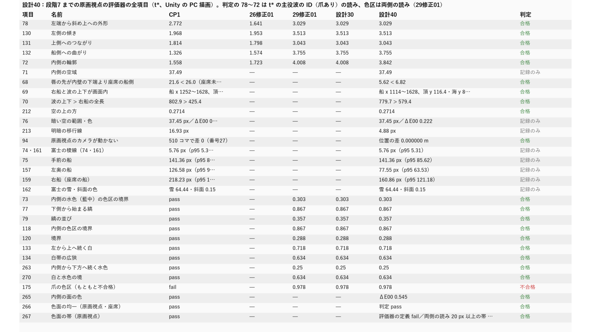
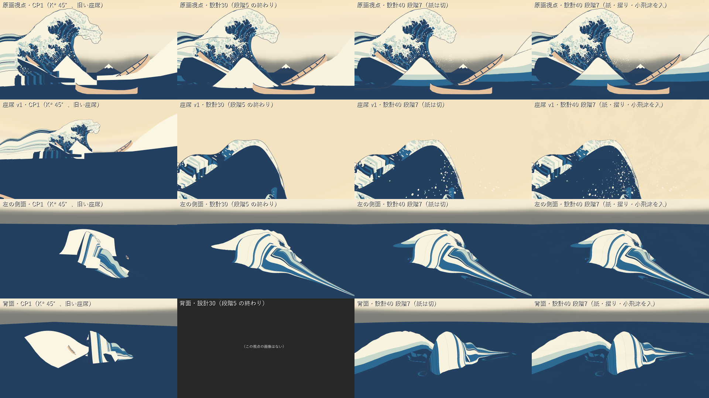

# 設計40：原画カメラと船上カメラで比較する（色面・輪郭・余白の合格画像と HMD 記録） ― 段階7 までを入れた原画視点で評価器の全項目を回し、座席 v1・側面・背面と並べる。直前の番号に対する回帰なしは合格、CP1／26修正01 に対する後退は段階5・6 の終わりと同じ値のまま書く

日付：2026-09-30／状態：**閉じた（使える水準。最小の受入 3 つを満たし、HMD の H4・H5 は保留）**。修正は 0 回（Q26 の 1 回は使っていない）。製品（場面・シェーダー・材質・データ）は変えていない。証拠の種類は次のとおり。**HMD 実機の結果ではない。利用者は確かめていない。**

- 作る部（第「比較」部）：Unity 6000.4.3f1 の Editor の batchmode の PC オフスクリーン描画（camera.Render、RTX 3080、Direct3D11）。段階7 の場面 `DS39_Paper.unity`（`7480a99b…`）を開くだけで保存していない。原画視点の評価器23（`Tools/PaintingTruth/evaluate.py`）を 5 回、回帰の評価器（`ds30b_tstar_regress.py`、爪あり `t28_claws`・爪なし `t28_white`）、numpy/OpenCV の 68・69・70・94 と配置の比較（`ds40_compare.py`）。
- 進行役の独立の検査（作る部の比べのコードを使わずに書いた numpy/OpenCV。評価器23 を自分で回し直し、68・69・70・94・配置の印・Mock の両眼を自前のコードで測り直し、図と画像を見た。写しは Git 対象外の `Unity/Build/Design/40/indep_check/`）。判定は pass = true、必須の指摘 0。
- 記録の道具 `ds40_record.py`：作る部のコード・入力・出力の SHA-256 の照合（359 件）と守るファイル（30 件）の照合、作る部の比べのコードを使わない数え直し（t\* の組の全ファイル、設計39 の画像との違い、評価器の出力と項目の表、独立の検査の評価器との照合、ID 画像の色の数、Mock の両眼）、Mock の両眼の図、証拠の写し、metrics.json・run.json。

番号の前提：

- 対象：[段階9までの実行計画](../Design/Stage9_Plan_2026-09-26_ja.md)（以下「計画」）§2.3 の設計40。使える水準の成果物は「段階7までを入れた原画視点（評価器の全項目の表）と座席 v1・側面・背面の並べ図。参照モデル（Q5）の配置との比較図（記録のみ、D24）。PS VR2 なら H4・H5 の記録」、最小の受入は「CP1 と 26修正01 の合格項目の回帰なし。71・76・213 は仮置きのため記録のみ（Q7 の既定）」。依存は設計36〜39、バックログは 68〜79・130〜134（回帰）、94。
- 回帰の読み：段階5確認 §6.3 で、計画 §2.0 の「後退したら統合しない」は段階として損切りで覆され、「各番号の回帰なしは、直前の番号に対する値と、CP1 に対する値の両方で書く」と決まった。段階6確認 §4.2 の条件 2 で、設計40 は爪を入れた原画視点で判定する。この番号はこの 2 つの読みで判定した（進行役の判断、Q24）。
- 引き継ぎ：
  - 主役波の動き：設計28修正01 の `Unity/Build/Design/28R01F/F_final` と最後の一コマ `kstar_final`（K\*′ R4）。表示用サーフェスと色の焼き込みは[設計29修正01](Design_29_修正01_ja.md)。
  - [設計30](Design_30_ja.md)（周りの海と配置の二次設計）、[設計31](Design_31_ja.md)〜[設計35](Design_35_ja.md)（白・飛沫・爪・3 層の再生・既定の版）、[設計36](Design_36_ja.md)（調色板）、[設計37](Design_37_ja.md)（頭の揺れの部品 `DS37HeadSway`）、[設計38](Design_38_ja.md)（輪郭線）、[設計39](Design_39_ja.md)（紙・摺り・小飛沫。場面 `DS39_Paper.unity`、既定は全部切）。
  - 設計39 から設計40 へ渡されたもの：評価器の表と原画比較は全部切（既定）で行う。座席・側面・背面の並べ図に全部入を足すなら、記録として分けて並べる。
- 時間の上限：Q26 の日程で 2 時間（計画の時間枠は ≤0.5 日）。範囲は最小の受入だけで、修正は 1 回まで。
  - 実績（ファイルの時刻。[metrics.json](../Evidence/Design/40/metrics.json) の `time`）：作る部の読み 08:18 ごろ（作る部の README の題）、着手の印 08:24:42（`compare/_started.txt`）、Unity の描画の終わり 08:27:11、回帰の評価器 08:31:56、比べの表と図 08:35:19、作る部の最後のファイル（`ds40_run.json`）08:37:19。作る部は着手の印から約 13 分、読みから約 19 分（作る部の README の題は「08:18〜08:40ごろ、約 25 分」と書く）。進行役の独立の検査 08:40:05〜08:42:44（検査の写しのファイルの時刻）。記録 08:46 ごろ〜（記録の道具の最後の実行は 08:59:47 に終わった（run.json の `record_run`）。記録の終わりは `Unity/Build/Design/40/READY_TO_COMMIT.txt` の時刻）。2 時間の上限の内。
  - 1 回の計算：Unity の描画 11.8 s（`DS40_RENDER_DONE seconds=11.8 protectedUnchanged=True`）、回帰の評価器 3 分 20 秒（`logs/ds30b_regress.log` の real 3m20.101s）、評価器23 を 5 回回す比べ（`logs/ds40_compare.log` の real 23.9 s。作る部の README は約 45 秒と書く）、記録の道具 26.1 s。どれも 30 分の上限より十分短い。
- 読むだけで変えていないもの：設計27〜39 の場面・スクリプト・シェーダー・材質とデータ（守るファイル 30 個。描画の前後で SHA-256 が同じ、`protectedUnchanged = true`、`changedFiles` は空）。ProjectSettings は Unity の実行の前後でバイトが同じ（戻したファイル 0。`compare/logs/ds40_settings_restore_render.json`）。
- 座標と単位：m・s。t は体験の時刻、t\* は t = 12 s。画像の画素は 1920 × 1080 の表示の px（全体の合成の ID 画像だけ 3840 × 2160）。
- 使っていないもの：参照モデルの OBJ（設計30 が測った数値の JSON `Unity/Build/Design/30/ref/ds30_ref_layout.json`（`82b0d798…`）だけを読んだ。OBJ は開かず、一時キャッシュも作っていない）、利用者の解算、写真のフォルダー、Blender・Houdini。爪形分析のフォルダー（`G:\research\爪形分析`）は、作る部も検査も記録の道具も開いていない。記録の時のコミットの一覧の点検でだけ、そのフォルダーのファイルの大きさを読み取りのみで調べた（第 9 節）。
- git：作る部・記録とも使っていない。進行役の独立の検査は、読み取りのみの `git status` で、tracked のファイルに変更がなく、新しいのは Design40 と ds40 のコードだけであることを見た（検査の報告の結論。何も変えていない）。

## 見るもの

| 評価器の全項目の表（CP1・26修正01・29修正01・設計30・設計40・判定） | 並べ図：行＝原画視点・座席 v1・左の側面・背面、列＝CP1・設計30・設計40（紙は切）・設計40（全部入） |
| --- | --- |
|  |  |

図は Unity の PC 描画と、それから作った図である（1920 × 1080。項目の表は作る部の 1920 × 1156 の図を 0.934 倍に縮めて白の余白を足した。元の図は Git 対象外の `Unity/Build/Design/40/compare/fig/`）。並べ図の設計30 の背面は画像がない（図の中に「この視点の画像はない」と書いてある）。

作品の画像（紙・摺り・小飛沫は切。評価の状態。作る部の画像をバイトのまま写した）：

- [原画視点 t\*](../Evidence/Design/40/ds40_painting_t120_off.png)（`cca51fbd…`。設計39 の全部切の画像と画素まで同じ）
- [座席 v1 t\*](../Evidence/Design/40/ds40_seat_t120_off.png)

図：

- [原画 50% の重ね](../Evidence/Design/40/fig_ds40_painting_overlay50.png)（段階7 の原画視点に原画を 50% で重ねた）
- 評価器23 の輪郭の偏差図：[線なしの ID](../Evidence/Design/40/fig_ds40_contour_off_noline.png)（輪郭の項目はこちら）・[線ありの ID](../Evidence/Design/40/fig_ds40_contour_off_line.png)（空の項目はこちら）。どちらも全体の合成（near・船・富士入り）の値で、判定の 78〜72 は t\* の主役波の ID の値を使う（第 2.1 節）
- [ほかの視点](../Evidence/Design/40/fig_ds40_views_extra.png)：座席の低い視点、座席から波の方向 t 10.5・12 s、側面・背面の波だけ、Mock の左右（作る部の 1920 × 540 の図に白の余白を足した）
- [Mock の両眼](../Evidence/Design/40/fig_ds40_mock_seat_t120.png)：座席 v1 の左目・右目（±0.032 m）、赤青の重ね、左右の差 × 4（記録の道具が作った）
- [配置の比較](../Evidence/Design/40/fig_ds40_layout_reference.png)：設計40 の原画視点を淡くした上に、参照モデルの配置の数値の印（黒の ×）と今の配置（赤の ◇）と船の中心（橙の ○）。作る部の 3840 × 1080 の図の左半分で、右半分は設計30 の平面図（[fig\_ds30\_layout\_plan.png](../Evidence/Design/30/fig_ds30_layout_plan.png)）と、下の説明の帯（行 1041〜1060）を除いて画素まで同じなので写していない

動画はない。この番号は t\* の静止画の比較で、製品を変えていない（形成の動画は[設計39 の証拠](../Evidence/Design/39/)のまま）。

数値：

- [metrics.json](../Evidence/Design/40/metrics.json)：最小の受入 `acceptance`、作る部の項目の表 `item_table_builder`、記録の道具が評価器の出力から読み直した値 `evaluator_values_recorder`、評価器のコマンド `evaluator_commands`、記録 `record_only`（紙を全部入れた値、Mock、ID の色、配置の比較）、回帰 `regression_plan_2_0`、修正 `fix_rounds`、記録の照合 `recorder_crosscheck`、独立の検査の値 `indep_check`、時間 `time`
- 作る部の写し：[ds40\_acceptance.json](../Evidence/Design/40/ds40_acceptance.json)、[ds40\_compare\_metrics.json](../Evidence/Design/40/ds40_compare_metrics.json)（項目の表・全体の合成の評価器・68〜94・配置）、[ds40\_run.json](../Evidence/Design/40/ds40_run.json)、[ds40\_render\_report.json](../Evidence/Design/40/ds40_render_report.json)（カメラの行列・物の位置・ID の決め方）
- 評価器23 の全項目の出力：[線なしの ID](../Evidence/Design/40/ds40_eval_off_noline_metrics.json)・[線ありの ID](../Evidence/Design/40/ds40_eval_off_line_metrics.json)（紙は切。23 項目）
- 回帰の評価器の出力は設計36・38・39 の出力と SHA-256 まで同じファイル（`4ca57d3a…`）なので写していない（設計36 の証拠の [ds36\_tstar\_regress.json](../Evidence/Design/36/ds36_tstar_regress.json) と同じファイル）。
- 実行条件と SHA-256：[run.json](../Evidence/Design/40/run.json)

## 0. 結論

1. **段階7 までを入れた原画視点で、評価器の全項目の表を作った。** 入力は紙・摺り・小飛沫を切った作品のままの色画像（白・爪・飛沫・線）と、全体の合成（near・右の高い波・3 隻・富士）の ID 画像。t\* の組（爪あり・爪なし）の 48 ファイルは設計39 と画素・バイトまで同じで、回帰の評価器の出力は設計36・38・39 と SHA-256 まで同じ（`4ca57d3a…`）。原画視点の色画像も設計39 の全部切と画素まで同じ（違い 0）。
2. **最小の受入 1：直前の番号に対する回帰なしは合格。後退した項目は 0。**
   - 78／130／131：3.0289／3.5131／3.0431 px（29修正01 との差 0.0）。132 大きな輪郭 σ12 最大 3.7552 px（差 0.0）。72 大きな輪郭 σ24 p95 3.8423 px（爪あり、判定）・4.0075 px（爪なし、記録）。
   - 色区（両側の読み、爪あり）：73 0.303・77 0.867・79 0.357・118 0.867・120 0.288・133 0.718・134 0.634・263 0.25・270 0.634 px、265 ΔE00 0.545、266 合格、267 は両側の読みで 20 px 以上の帯 0。29修正01 との最悪の差 0.0 px。175 はもともとの不合格のまま（0.978 px）。
   - 68（座席 v1 から唇の先 5.616 m < 内壁の下端 6.82 m、唇の先の仰角 60.9°）・69（右船 x 1113.5〜1627.5・y 587〜927.5、頂 y 116.44・海 y 896.16 が画面内）・70（波の上下 779.72 px > 右船 579.38 px）・212（ΔE00 0.2714）・94（原画視点のカメラの位置の差 0.0 m）：合格。
3. **最小の受入 2：CP1／26修正01 に対する後退は、段階5・6 の終わりと同じ値で残っている（書いた。隠さない）。** 78／130／131 は CP1 2.772／1.968／1.814・26修正01 1.641／1.953／1.798 px → 3.029／3.513／3.043 px。132 は CP1 1.326・26修正01 1.574 → 3.755 px（細部込みの最大 5.2998 px）。72 は CP1 1.558・26修正01 1.723 → 3.842 px（細部込みの p95 7.8009 px）。評価器の定義のままの読みでは、28修正01 から 267（爪あり）、134・267（爪なし）の判定が変わる。**この合格は、段階として採った読み（段階5確認 §6.3・段階6確認 §4.2、σ12・σ24 の大きな輪郭、両側の読み）の下でだけ成り立つ。** 計画の文字どおりの基準（CP1／26修正01 に対して後退なし）では後退している。戻す先は仕上げ28。
4. **最小の受入 3：71・76・213 は記録のみ。** 71 最大 37.4944 px・p95 9.6781 px、76 暗い空の範囲 37.4511 px・p95 19.2455 px・色 ΔE00 0.2224、213 移行線 4.8815 px・p95 2.724 px。
5. **成果物：項目の表、座席 v1・側面・背面の並べ図、配置の比較図（記録のみ、D24）。** 配置の比較は設計30 が測った数値だけを使い、周りの海のパッケージ 17 ファイルが設計30 の SHA-256 のままなので、配置は設計30 の二次設計のまま。一次設計（参照モデルの配置）との差は、手前の小波の頂 5.015 m（原画視点で 211.9 px）、大波の下の谷の底 4.734 m（どちらの点も画面の下の外）。
6. **HMD（PS VR2）の H4・H5 は保留**（導入は利用者の手）。座席 v1 の Mock の両眼（±0.032 m）と PC の描画だけ。
7. **限界（第 5 節）**：合格が採った読みに依ること、爪なしの 72 が 4 px を超えること、表の 69・70・212・265〜267 に 29修正01・設計30 の値がないこと、71・76・213 と船・富士の報告項目、画像で見えて測っていない傷（前の番号から渡されたもの）、Mock が座席 v1 だけ、94 が静止画だけ、など。仕上げ28・30・36・38・40・41・47、設計41、設計08〜10・45（PS VR2 の後）へ送った。

---

## 1. 目的

設計書の設計40 は、段階7（浮世絵の色と線）までを入れた作品を、原画のカメラと船上のカメラで並べて確かめる番号である。計画 §2.3 の求めは次のとおり。

- 原画視点で評価器の全項目の表を作り、座席 v1・側面・背面の並べ図を作る。参照モデル（Q5）の配置との比較図を記録のみで作る（D24。既定値・利用者未回答）。PS VR2 があれば H4（船上から見た高さ・厚み・内側空間と実寸）・H5（唇が頭上を越えるときの快適性）を記録する。
- CP1 と 26修正01 の合格項目の回帰なし。71・76・213 は仮置きのため記録のみ（Q7 の既定）。

Q26 により、最小の受入だけを満たし、修正は 1 回までとした。

---

## 2. 表

### 2.1 評価器の全項目（原画視点 t\*、紙などは切）

判定の読み（作る部の決定。第 3.2 節）：78・130・131 は t\* の主役波の ID（評価器23、包絡版）の最大 px を K\*′ の幾何の値と比べる（29修正01 の読み）。132・72 は大きな輪郭（σ12 最大・σ24 p95、28修正01 の関門の読み）。色区は両側の読み（29修正01）。どれも爪あり（`t28_claws`）。

| 項目 | 名前 | CP1 | 26修正01 | 29修正01／設計30 | 設計40 | 判定 |
| --- | --- | --- | --- | --- | --- | --- |
| 78 | 左端から斜め上への外形 | 2.772 | 1.641 | 3.029 | 3.029（K\*′ の幾何との差 0.288） | 合格 |
| 130 | 左側の傾き | 1.968 | 1.953 | 3.513 | 3.513（差 −0.318） | 合格 |
| 131 | 上側へのつながり | 1.814 | 1.798 | 3.043 | 3.043（差 0.119） | 合格 |
| 132 | 船側への曲がり（σ12 最大） | 1.326 | 1.574 | 3.755 | 3.755（細部込み 5.2998） | 合格 |
| 72 | 内側の輪郭（σ24 p95） | 1.558 | 1.723 | 4.008 | 3.842 爪あり（爪なし 4.0075、細部込み p95 7.8009・最大 10.2687） | 合格 |
| 71 | 内側の空域 | 37.49 | — | — | 37.4944（p95 9.6781、IoU 0.96293） | 記録のみ |
| 68 | 唇の先が内壁の下端より座席の船側 | 21.6 < 26.0（座席未確定） | — | — | 5.616 < 6.82 m（仰角 60.9°） | 合格 |
| 69 | 右船と波の上下が画面内 | 船 x 1252〜1628、頂 y 93.7・海 y 896.5 | — | — | 船 x 1114〜1628、頂 y 116.4・海 y 896.2 | 合格 |
| 70 | 波の上下 > 右船の全長 | 802.9 > 425.4 | — | — | 779.7 > 579.4 | 合格 |
| 212 | 空の上の方（ΔE00） | 0.2714 | — | — | 0.2714 | 合格 |
| 76 | 暗い空の範囲・色 | 37.45 px（p95 20.20）／ΔE00 0.285 | — | — | 37.45 px（p95 19.25）／ΔE00 0.222 | 記録のみ |
| 213 | 明暗の移行線 | 16.93 px（p95 1.86） | — | — | 4.88 px（p95 2.72） | 記録のみ |
| 94 | 原画視点のカメラが動かない | 510 コマで差 0（番号27） | — | — | 位置の差 0.0 m（静止画の照合） | 合格 |
| 74・161 | 富士の稜線 | 5.76 px（p95 5.31） | — | — | 5.76 px（p95 5.31） | 記録（報告項目） |
| 75 | 手前の船 | 141.36 px（p95 85.62） | — | — | 141.36 px（p95 85.62） | 記録（報告項目） |
| 157 | 左奥の船 | 126.58 px（p95 98.32） | — | — | 77.55 px（p95 63.53） | 記録（報告項目） |
| 159 | 右船（座席の船） | 218.23 px（p95 171.43） | — | — | 160.86 px（p95 121.18） | 記録（報告項目） |
| 162 | 富士の雪・斜面の色（ΔE00） | 雪 64.44・斜面 0.15 | — | — | 雪 64.44・斜面 0.15 | 記録（報告項目） |
| 73 | 内側の水色（藍中）の色区の境界 | 合格 | — | 0.303 | 0.303 | 合格 |
| 77 | 下側から始まる縞 | 合格 | — | 0.867 | 0.867 | 合格 |
| 79 | 縞の並び | 合格 | — | 0.357 | 0.357 | 合格 |
| 118 | 内側の色区の境界 | 合格 | — | 0.867 | 0.867 | 合格 |
| 120 | 境界 | 合格 | — | 0.288 | 0.288 | 合格 |
| 133 | 左から上へ続く白 | 合格 | — | 0.718 | 0.718 | 合格 |
| 134 | 白帯の広狭 | 合格 | — | 0.634 | 0.634 | 合格 |
| 263 | 内側から下方へ続く水色 | 合格 | — | 0.25 | 0.25 | 合格 |
| 270 | 白と水色の境 | 合格 | — | 0.634 | 0.634 | 合格 |
| 175 | 爪の色区 | 不合格 | — | 0.978 | 0.978 | 不合格（もともと） |
| 265 | 内側の面の色 | 合格 | — | — | ΔE00 0.545 | 合格 |
| 266 | 色面の均一（原画視点・座席） | 合格 | — | — | 合格 | 合格 |
| 267 | 色面の帯（原画視点） | 合格 | — | — | 両側の読みで 20 px 以上の帯 0（評価器の定義のままでは不合格） | 合格 |

- 値の出どころ：[ds40\_compare\_metrics.json](../Evidence/Design/40/ds40_compare_metrics.json) の `item_table`（作る部）と、回帰の評価器の出力 `unity/ds30_tstar_regress.json`（`4ca57d3a…`）、評価器23 の出力 `eval/off_noline`・`eval/off_line` の metrics.json。記録の道具は、評価器23 の出力から 78・130・131・71・132 細部込み・72 細部込み p95・76・213 を読み直し、作る部の表と同じ値であることを確かめた（metrics.json の `recorder_crosscheck.evaluator_vs_item_table`）。
- 項目の表の図と上の表で、69・70・212・265〜267 の 29修正01・設計30 の欄は「—」。29修正01・設計30 では、これらを別には評価していない（設計30 の記録の回帰の節、段階6確認 §4.1）。この 5 項目の「直前の番号に対する」読みは、次の 2 つに依る：t\* の組・原画視点の色画像・回帰の評価器の出力が設計39 と同じファイルであること（第 2.4 節）、212 の値が CP1 と同じ 0.2714 であること。265〜267 の両側の読みは回帰の評価器の出力に入っていて、29修正01 との差は 0.0。
- 評価器の定義のままの読み（記録）：73 2.484・79 1.012・118 2.484・134 2.047・263 2.484 px など（28修正01 との差が ±0.5 px を超える 6 項目は 73・79・118・134・175・263）。厳しい色の読みの最悪は 13.642 px で、29修正01 の基の値と同じ（悪くしていない）。この読みは仕上げ28 のまま。
- 空の項目（76・212・213）は線ありの ID、輪郭の項目は線なしの ID で読む（CP1 と同じ組み合わせ）。線なしの ID で読むと 76 は 61.0855 px、213 は 21.6359 px になり、線ありの ID で読むと 78／130／131 は 5.6768／6.6931／5.7971 px になる（記録。metrics.json の `full_composite_evaluator_builder`）。
- 全体の合成（near・船・富士入り）で読んでも、78・130・131 は t\* の主役波の ID と同じ値（3.0289・3.5131・3.0431）。132・72 の細部込みの値（5.2998・p95 7.8009）は、29修正01・設計30 の同じ読みでもすでに 4 px を超えていた（段階5確認 §6.3 の表では爪なしの 5.95・8.75、段階6確認 §4.1 で爪ありの 5.2998・7.8009）ので、後退ではない。

### 2.2 CP1／26修正01 に対する後退（段階5確認 §6.3 の表の続き）

| 項目 | CP1 | 26修正01 | 段階5 の終わり（設計30） | 段階6 の終わり | 設計40（段階7 の終わり） |
| --- | --- | --- | --- | --- | --- |
| 78／130／131 | 2.772／1.968／1.814 | 1.641／1.953／1.798 | 3.03／3.51／3.04 | 3.0289／3.5131／3.0431 | 3.0289／3.5131／3.0431 |
| 132（大きな輪郭 σ12 最大／細部込み最大） | 1.326 | 1.574 | 3.7552／5.95 | 3.7552／5.2998 | 3.7552／5.2998 |
| 72（大きな輪郭 σ24 p95／細部込み p95） | 1.558 | 1.723 | 4.0075／8.75 | 3.8423／7.8009 | 3.8423／7.8009（爪なし 4.0075） |
| 134・267（評価器の定義のままの読み） | 合格 | 合格 | 不合格 | — | 28修正01 から判定が変わる：爪あり 267、爪なし 134・267 |

- CP1・26修正01・設計40 の値は ds40\_acceptance.json の `cp1_26r01_regression_stated`、段階5・6 の終わりの値は段階5確認 §6.3 と段階6確認 §4.1 の表から写した。判定の変わりは回帰の評価器の出力の `verdict_changes_vs_28r01`（爪あり `["267"]`、爪なし `["134", "267"]`）。
- 段階7 の間（設計36〜40）に、この表の値は増えも減りもしていない（回帰の評価器の出力が設計36・38・39・40 で同じファイル）。

### 2.3 座席 v1・側面・背面の並べ（記録）

| 視点 | 設計40 の切の画像と設計39 の切の画像 | 全部入と切の違い（独立の検査、ΔE76） | 全部入の設計39 との違い（記録の道具） |
| --- | --- | --- | --- |
| 原画視点 t\* | 違い 0 画素 | — | 885 画素、最大 3 段（2 段を超える画素 1） |
| 座席 v1 t\* | 違い 0 画素 | 平均 0.605、> 2 の画素 0.24% | 52 画素、最大 1 段 |
| 座席の低い視点 t\* | 違い 0 画素 | 平均 0.432、> 2 の画素 0.24% | 251 画素、最大 2 段 |
| 座席から波の方向 t 10.5 s | 違い 0 画素 | 平均 0.826、> 2 の画素 0.13% | 410 画素、最大 2 段 |
| 座席から波の方向 t\* | （設計39 に同じ画像なし） | 平均 0.458、> 2 の画素 0.23% | — |
| 左の側面 t\* | （同） | 平均 0.296、> 2 の画素 0.0% | — |
| 背面 t\* | （同） | 平均 0.333、> 2 の画素 0.01% | — |

- 全部入の違い（最大 3 段）は、作る部の読みでは小飛沫の子の粒の描き順と、設計39 の入切の画像が ①→②→③ の順に入切した後の描画であることによる。評価には使わない（記録）。
- 側面の画像は、切でも全部入でも背景の船・富士・仮置きを隠して描く（設計39 と同じ `HideFor`）。そのため側面の「波だけ」の画像は、側面の切の画像と同じファイル（SHA-256 が同じ）。背面の「波だけ」は切と違う画像。
- 背面は、場面を変えないように、この描画の間だけの一時のカメラで描いた（CP1・美術優先28修正01 と同じ (−45, 30, 60) → (−5, 8, −3)、縦画角 50°。作る部の README）。
- Mock の両眼（座席 v1、±0.032 m、t\*）：チャンネルの差 > 8 の画素 70,564（作る部と記録の道具が同じ値）、灰の差 > 8 の画素 67,531（独立の検査と記録の道具が同じ値）。独立の検査の位相の相関で、左右の像のずれは横 −4.0 px（上・中・下の帯で −4.06・−4.13・−4.84 px）、縦 0.2 px 以下。

### 2.4 回帰と照合（計画 §2.0）

| 比べたもの | 設計40 | 前の番号 | 同じか |
| --- | --- | --- | --- |
| 回帰の評価器の出力 `ds30_tstar_regress.json`（爪あり・爪なし） | `compare/unity/ds30_tstar_regress.json` | 設計39 `paper/unity/`、設計38 `outlines/unity/`、設計36 の証拠の写し | SHA-256 まで同じ（`4ca57d3a…`） |
| t\* の組の `t28/render` のファイル | 48（PNG 46・`idmap.json` 2） | 設計39 の 48 | 全部同じ（違い 0） |
| 原画視点の色画像（紙などは切） | `full/painting_t120_off.png`（`cca51fbd…`） | 設計39 の `ds39_painting_t120_off.png` | 画素まで同じ |
| 大きな輪郭と輪郭の差（29修正01 との差） | 78・130・131 0.0、132 0.0、72 −0.1652（爪あり）・0.0（爪なし） | — | 後退なし |
| 評価器23 の出し直し（独立の検査） | 線なし・線ありの ID の 441 の値（数値 298） | 作る部の `eval/off_noline`・`eval/off_line` | 全部同じ（違い 0） |

- 全体の合成の ID 画像の色の数：線なし 9 色、線あり 10 色（線の色区 (255,0,255) が加わる）。重なりはない。船の ID の色は、作る部が 0.4（102）を渡したつもりが線形の描画先で 34 になった。評価器の `eval/idmap.json` は実際の値 34 を使う（記録の道具の数え：boat\_left (34,0,0) 46,803 画素、boat\_mid (0,34,0) 142,064 画素、boat\_fg (34,34,0) 164,818 画素。線なし、3840 × 2160）。
- 独立の検査は、68・69・70・94 と配置の印を自前のコードで測り直した：右船の bbox (1113.5, 587, 1627.5, 927.5) が同じ、右船の最長の長さ（max Feret）579.41 px（作る部は主軸（SVD）の向きの長さで 579.38 px）、描画の波の最も上 y 93、頂を海面へ投影した長さ 791.6 px・描画の最も上から 804.9 px（どれも 579.4 px を超えるので 70 はどの読みでも合格）、68 の唇の先 5.616 m・内壁の下端 6.820 m・仰角 60.9°・唇の張り出し（進む向き）1.24 m、原画視点のカメラの値から自前の射影で配置と船の印の画素を 0.06 px 以内で再現（`indep40.json`）。

### 2.5 配置の比較（記録のみ、D24）

参照モデルの数値は設計30 の `ds30_refmeasure.py` が測った `ds30_ref_layout.json`（`82b0d798…`。出典の OBJ の SHA-256 `AB4124F9…`）だけを読んだ。一次設計は、参照モデルの配置を主役波の頂を原点に H の比 0.934 で置いたもの（設計30 の `ds30_layout_record.json`、`da51406b…`）。

| 点 | 一次設計と今の差 | 原画視点の差 | 画面の内か |
| --- | --- | --- | --- |
| 主役波の頂（共通の原点） | 0.0 m | 0.0 px | 両方とも内 |
| 手前の小波の頂 | 5.015 m | 211.9 px | 両方とも内 |
| 大波の下の谷の底 | 4.734 m | 183.6 px | 両方とも外（画面の下） |
| 右側の最も高い所／右の高い波の頂 | 30.962 m | 1089.0 px | 一次設計は内、今は外 |

- 右側は、参照モデルでは大波の右の部分（0.71 H）で別の波はなく、今の右の高い波（設計30 の D30-6）とは別の物なので、30.962 m は配置のずれではない。
- 参照モデルの船は殻に溶け込んだ浮彫で、位置を数値にしていない（設計30 の D30-8）。富士・空は参照モデルにない。
- 周りの海のパッケージ（`Unity/Build/Design/30/sea/` の 17 ファイル）は設計30 の run.json の SHA-256 と全部同じ。配置は段階6・7 で変わっていない。
- 参照モデルは他者の展示作品（北斎『神奈川沖浪裏』の立体作品）のスキャンで、作者・所蔵は未確認（D18）。数値だけを借り、形は写さない。

---

## 3. 作り方と、採ったもの

### 3.1 Unity と道具

- `Unity/Assets/GreatWave/Design40/Editor/DS40Render.cs`（`c0482e72…`）：`DS40Render.Render` が `DS39_Paper.unity` を開き（保存しない）、t\* で次を描く。
  - t\* の組（`t28_claws`・`t28_white`。紙の 3 層は切）。
  - 原画視点の作品のままの色画像（白・爪・飛沫・線）：紙などを切（評価の状態）と全部入（記録）。
  - 評価器23 の ID モード用の全体の ID 画像（3840 × 2160、線形、MSAA なし）：線なし・線あり × 爪あり・爪なし。keypose のシートと爪は色区の ID、線は (255,0,255)、船 3 隻は別の色、CPU のメッシュは other (0,0,0)、空は (0,255,255)。飛沫は入れない（設計31 の決まり）。
  - 座席 v1・座席の低い視点・座席から波の方向（t 10.5・12 s）・左の側面・背面 × 切・全部入と、側面・背面の波だけ。
  - 座席 v1 の Mock の両眼（`DS37HeadSway` で ±0.032 m）。
  - 守るファイル 30 個の SHA-256 を前後で比べる。
- 道具（`Tools/GWWaveGen/ds40/`）：`run_ds40_unity.ps1`（Unity の 1 回の実行と `unity.lock`、ProjectSettings の控えと戻し。設計39 の道具を写してログの置き場所を変えた）、`ds40_compare.py`（評価器23 を 5 回、68・69・70・94、配置の比較、図と表）、`ds40_run_record.py`（作る部の実行の記録）、`ds40_record.py`（記録）。

### 3.2 採ったもの（Q24。進行役の判断で、利用者の決定ではない）

- **判定の 78〜72 は t\* の主役波の ID の読み（29修正01 が採った読み）、全体の合成の値は記録。** 理由：計画 §2.0 の比べの基準は、合格したときと同じ読み。全体の合成でも 78・130・131 は同じ値で、132・72 の細部込みの値は 29修正01・設計30 の同じ読みでもすでに 4 px を超えていた。落とした：全体の合成の細部込みの値で判定する（29修正01 の時点から不合格で、段階の比べにならない）。
- **判定は爪あり、爪なしは記録。** 段階6確認 §4.2 の条件 2。
- **評価は紙・摺り・小飛沫を切って行った。全部入は記録。** 計画の設計39 の最小の受入「評価と原画比較はオフ」。
- **空の項目は線ありの ID、輪郭は線なしの ID。** CP1 と同じ組み合わせ（独立の検査が CP1 の記録で確かめた）。
- **参照モデルは設計30 が測った数値の JSON だけを使い、OBJ を開き直さなかった。** D24 は数値と印だけで足り、一時キャッシュを作って消す手間と誤りの元がない。
- **背面は、場面を変えないように一時のカメラで描いた**（CP1・美術優先28修正01 と同じ位置）。

---

## 4. 関門

| 最小の受入・規則 | 基準 | 値 | 判定 |
| --- | --- | --- | --- |
| CP1 と 26修正01 の合格項目の回帰なし（段階5確認 §6.3・段階6確認 §4.2 の読み：直前の番号に対して、爪ありで） | 78・130・131・132 大きな輪郭・72 σ24 p95・69・70・212、色区（両側の読み）が 29修正01／設計30 の判定のまま | 後退した項目 0。輪郭の差 0.0、72 −0.1652、色区の最悪の差 0.0。68・69・70・212・94 合格 | 合格 |
| 同、CP1／26修正01 に対する値を書く | 隠さない | 第 2.2 節（段階5・6 の終わりと同じ値） | 書いた（文字どおりの基準では後退。仕上げ28） |
| 71・76・213 は記録のみ | 記録 | 71 37.4944 px、76 37.4511 px・ΔE00 0.2224、213 4.8815 px | 記録のみ |
| 評価器の全項目の表・並べ図・配置の比較図 | 成果物 | 第 2.1・2.3・2.5 節と図 | 作った |
| 回帰の評価器の出力・t\* の組 | 設計39 と同じ | SHA-256 まで同じ（`4ca57d3a…`）、48 ファイルが同じ | 合格 |
| 守るファイル・ProjectSettings | 変えない | 30 個が同じ、`changedFiles` 空、ProjectSettings の戻し 0 | 合格 |
| PS VR2 の H4・H5 | — | — | 保留（導入は利用者の手） |

---

## 5. 限界

1. **合格は、段階として採った読みに依る。** 計画の文字どおりの基準（CP1／26修正01 に対して後退なし）と評価器の定義のままの読みでは、132（細部込み 5.2998 px）・72（細部込み p95 7.8009 px）・134・267 は CP1 より後ろにある（第 2.2 節）。段階5確認 §6.3 と段階6確認 §4.2 の上書きと、σ12・σ24 の大きな輪郭の読みの下でだけ合格。設計40 で新しく生まれた後退ではない。戻す先は仕上げ28（段階5確認 §6.3：78・130・131・132・72 を定義どおりの読みで ≤ 4 px、134・267 を合格へ）。
2. **72 σ24 p95 は、爪ありの読み（3.8423 px）でだけ 4 px を下回る。** 爪なしは 4.0075 px で、29修正01・設計30 と同じく 4 px を超える（回帰の評価器の出力の `base_29r01.lfgate.gate_4px` も 72 は false）。判定の読みは爪あり（段階6確認 §4.2）だが、爪なしの値も記録に残す。仕上げ28。
3. **項目の表の 69・70・212・265〜267 に、29修正01・設計30 の値がない**（その時点で別に評価していない）。直前の番号に対する読みは、同じファイルであることと CP1 の値に依る（第 2.1 節）。
4. **71・76・213 は評価器の 4 px を超える**（37.4944・37.4511・4.8815 px）。仮置きのため記録のみ（Q7 の既定）。下辺は near の小波・右の高い波と座席の船（作る部の注）。仕上げ30 で前景と右側を置き換えた後、仕上げ40 で判定する。
5. **船・富士の報告項目**：75 手前の船 141.36 px、157 左奥の船 77.55 px、159 右船 160.86 px、74・161 富士の稜線 5.76 px、162 富士の雪 ΔE00 64.44（評価器の出力では、原画の雪の区の所の描画の色が斜面の区と同じ Lab (27.388, 0.5, −20.573) で、原画の雪は L 97.65）。どれも記録で、船は設計41・仕上げ41、富士と空は仕上げ40。
6. **画像で見えて、測っていない傷**（どれも前の番号から渡されたもので、設計40 で新しく生まれたものではない。直していない）：
   - 側面・背面から、右の高い波がその波峰線に沿って細長い尖りのように見える（作る部の気づき）。仕上げ30。
   - 座席から波の方向 t 10.5 s で、near の右の高い波の面が大きな平らな淡い水色の面として見え、縦の硬い色の段の境がある（作る部と独立の検査の気づき。設計30 の 2 色の海の間に合わせ、設計36 の 4 段のまま）。仕上げ30。
   - 原画視点に、設計38 で加わった near の線が見える（右の高い波の白い面と暗い海を横切る線。設計38 の限界 7）。評価器は見ない。仕上げ38。
   - 原画視点の左の手前の小波が平らな暗い面で、足が鋸歯（設計36 の限界 3）。仕上げ30。
   - 座席から波の方向の主役波の足の縦の筋と継ぎ目（設計36 の限界 7・設計38 の限界 9）。仕上げ28・29。
   - 座席 v1 の t\* では主役波の内壁が画面の大半で、谷の底は見えない。谷の底の線は作っていない（段階5 から渡されたまま）。仕上げ30・36。
7. **Mock の両眼は座席 v1 だけ。** 座席の低い視点のカメラには揺れの部品 `DS37HeadSway` がないので描いていない。Mock は PC の描画で、HMD の立体視（SPI）ではない。
8. **94 は静止画の照合だけ。** 原画視点のカメラの値が CP1 と同じことを確かめた。コマを通したカメラの検査は回していない（番号27 の 510 コマの値を引き継ぐ）。
9. **配置の比較は、設計30 の数値の読み直し。** 参照モデルの船は数値にしていない。精度は仕上げ47（D24）。
10. **ID の船の色が 34（作る部の描画の報告の説明は 102 と書く）。** 評価器は実際の値で読むので値は正しいが、`ds40_render_report.json` の `idLegendJa` は実際と違う。飛沫は ID 画像に入れていない（設計31 の決まり）ので、空の飛沫の画素は色の画像でだけ数える（212・76 の色）。
11. **全部入の画像は設計39 の全部入と 52〜885 画素違う（最大 1〜3 段）。** 描き順による。記録のみで、評価は切で行う。
12. **作る部の記録の欠け。** `ds40_compare_metrics.json` の `evaluator_commands` は、最後の実行が `--skip-eval` だったため「（前回の出力を読んだ）」の文字だけで、コマンドは各 `eval/*/metrics.json` の `command` にある。記録の道具が読んで metrics.json と run.json の `evaluator_commands` に入れた（第 10 節）。
13. **`DS40Render.cs` は、Unity 6000.4 で古い形とされた `FindObjectsByType` の並べ方の引数を使う**（Unity のログの警告 CS0618 が 18 行。エラーではない）。次にこのファイルに触れるときに直す。
14. **測っていないもの**：PS VR2 の H4・H5、SPI の立体視、Play モード、形成の途中の比べ（t\* の静止画だけ）。保留（Q24）。
15. **崩壊は作らない**（Q11）。

---

## 6. 修正の記録（Q26：修正は 1 回まで）

| 回 | 変えたこと | 結果 |
| --- | --- | --- |
| 作る部（08:24:42〜08:37:19） | `DS40Render` を作り、Unity の描画 1 回、回帰の評価器 1 回、評価器23 を 5 回回す比べ（最後は `--skip-eval` で図と表だけ作り直した）、実行の記録 | 最小の受入を満たした。修正の回は使わなかった |
| 進行役の独立の検査（08:40:05〜08:42:44） | 自前のコードで、評価器23 の出し直し、68・69・70・94、配置の印、Mock、画像を見た | pass = true、必須の指摘 0。記録の指摘 7（第 10 節） |
| 記録（08:46 ごろ〜） | `ds40_record.py` で照合と数え直し、証拠を作った | 作品には触れていない |

- 修正の回数は 0。

---

## 7. 引き継ぎ

**段階7確認（自己評審）**：段階6確認 §4.2 の条件 3 のとおり、最初に 133・134・267 を爪ありで見る。設計40 では両側の読みで 133 0.718 px・134 0.634 px・267 の 20 px 以上の帯 0 で合格（設計36 で戻ったまま）。次に[項目の表](../Evidence/Design/40/fig_ds40_item_table.png)、[並べ図](../Evidence/Design/40/fig_ds40_views_sheet.png)、[原画視点 t\*](../Evidence/Design/40/ds40_painting_t120_off.png)、[原画 50% の重ね](../Evidence/Design/40/fig_ds40_painting_overlay50.png)、第 2.2 節の CP1 の表。段階の出口（浮世絵として読め、動きの中でも線と色が安定する）の動きの確かめは、設計36〜39 の動画で行う（この番号は静止画だけ）。

**設計41**（資料に基づく船）：計画の受入「原画視点の 74・75・157・159 を記録し、CP1 からの変化を示す」の比べの基準は、この番号の値（74 5.76 px・75 141.36 px・157 77.55 px・159 160.86 px）。全体の合成の ID 画像の作り方（`DS40Render`、船の ID の色は 34）を使える。

**仕上げ28**：CP1／26修正01 の値へ戻すこと（限界 1・2）。評価器の定義のままの読みの 73・79・118・134・175・263・267。

**仕上げ30**：右の高い波の側面・背面の尖り、near の平らな面と色の段、手前の小波（平らな暗い面と足の鋸歯）、谷の底（限界 6）。終わったら 71・76・213 を仕上げ40 で判定する（限界 4）。

**仕上げ38**：原画視点の near の線（限界 6）。**仕上げ29**：主役波の足の縦の筋と継ぎ目。**仕上げ36**：谷の底の線。

**仕上げ40**（原画カメラの比較）：空の境界と富士（74・76・161・162・212・213）。限界 4・5。

**仕上げ41**：船の報告項目 75・157・159（限界 5）。**仕上げ47**（D24）：配置の比較の精度（限界 9）。

**設計08〜10・45（PS VR2 の導入の後）**：H4・H5、座席の低い視点の Mock の両眼と SPI の立体視（限界 7・14）。

---

## 8. 再現

リポジトリの根で行う。前提（どれも Git 対象外）：設計39 の場面と出力（`Unity/Build/Design/39/paper/`）、設計38 の出力、設計36 の準備の表、設計33 の爪、設計31 の飛沫、設計30 の周りの海と `ref/ds30_ref_layout.json`、設計29修正01 の焼き込み、設計28修正01 の `kstar_final`、CP1 の画像（`Unity/Build/ArtFirst/CP1/`）。

道具は Unity 6000.4.3f1（batchmode、`Unity/Build/unity.lock` で排他）、`py -3.10`（numpy 2.2.6、OpenCV 4.12.0、Pillow）。コマンドの全体と SHA-256 は [run.json](../Evidence/Design/40/run.json)。

1. `powershell -NoProfile -ExecutionPolicy Bypass -File Tools/GWWaveGen/ds40/run_ds40_unity.ps1 -Method GreatWave.Design40.EditorTools.DS40Render.Render -Log render`（約 20 s、描画 11.8 s。`-Extra "-ds40Skip t28,full,views,mock"` で段を飛ばせる）
2. `py -3.10 -B Tools/GWWaveGen/ds30/ds30b_tstar_regress.py --out Unity/Build/Design/40/compare/unity --sets t28_claws,t28_white`（3 分 20 秒。ほかの重い numpy の処理と同時に回さない）
3. `py -3.10 -B Tools/GWWaveGen/ds40/ds40_compare.py`（評価器23 を 5 回。`--skip-eval` で評価器の出力を読み直して図と表だけ作る）。評価器23 の各回のコマンドは、たとえば `py -3.10 Tools/PaintingTruth/evaluate.py --render Unity/Build/Design/40/compare/unity/full/painting_t120_off.png --ids Unity/Build/Design/40/compare/unity/full/ids_noline.png --idmap Unity/Build/Design/40/compare/eval/idmap.json --out-dir Unity/Build/Design/40/compare/eval/off_noline --name off_noline`（5 回分は metrics.json の `evaluator_commands`）
4. `py -3.10 -B Tools/GWWaveGen/ds40/ds40_run_record.py`
5. 記録：`py -3.10 -B Tools/GWWaveGen/ds40/ds40_record.py`（26.1 s）。作る部の SHA-256 を `ds40_run.json` と照合し（違えば止まる）、t\* の組と評価器の出力が設計39 と同じことを確かめ、数え直しをして、図・JSON を写し、metrics.json・run.json を書く。独立の検査の値は `Unity/Build/Design/40/indep_check/indep40.json` と `indep_check/eval_*` から読む。
6. 進行役の独立の検査は、リポジトリの外のコード（写しは `Unity/Build/Design/40/indep_check/`。作る部の出力を読む）。

---

## 9. 出典と、この番号で作ったもの

- 仕様：計画 §2.3 の設計40、§2.0（回帰の規則）、§3.2（H4・H5）、§5（仕上げ28・30・38・40・41・47）、§7.2 の D24。[段階5確認](Stage5_SelfReview_ja.md) §6.3、[段階6確認](Stage6_SelfReview_ja.md) §4.1・§4.2。[制作手順](../Workflow/Production_Workflow_ja.md)の Q7（71・76・213 の既定）・Q11（崩壊を作らない）・Q24・Q26。設計39 の記録の引き継ぎ。
- 読むだけ：番号の前提の「引き継ぎ」の出力と場面、CP1 の値（`Docs/Evidence/ArtFirst/CP1/metrics.json`）、座席 v1（`Tools/GWContext/seat_v1.json`）、設計30 の配置の記録。SHA-256 は run.json の `inputs_sha256`・`protected_files`。
- 参照モデル：他者の展示作品のスキャン（作者・所蔵は未確認、D18）。この番号は設計30 が測った数値だけを読み、OBJ は開いていない。利用者の解算・写真のフォルダーは使っていない。爪形分析のフォルダーの画像とマスクは、作る部も検査も記録も開いておらず、どこにも複製していない。
- コミットの一覧の点検（記録の時）：リポジトリの外の一時の道具で、コミットする 27 ファイル（`Unity/Build/Design/40/commit_list.txt`）を読み取りのみで点検した（結果は Git 対象外の `Unity/Build/Design/40/record/ds40_commit_scan.json`）。
  - 文字のファイル 17 個から、禁止の場所の文字列（旧試作の各フォルダー、参照モデルのフォルダー、利用者の解算、写真のフォルダー、爪形分析など）と、リポジトリの外の一時の場所の文字列を探した。見つかったのは 2 種類だけ：参照モデルのファイルの名前 2 か所（設計30 の出典の引用。`ds40_compare_metrics.json` と metrics.json の `layout_vs_reference.reference_numbers.source`）と、「爪形分析」の語 10 か所（この文書と `ds40_run_record.py`・`ds40_record.py`・`ds40_run.json`・run.json の「使っていない」「大きさを調べただけ」という記録の文字列）。場所と数は `ds40_commit_scan.json` の `hits`。フォルダーの中のファイルの名前やパスの写しはない。
  - 爪形分析のフォルダーの 5,368 ファイル（画像・配列らしい拡張子 4,109）の大きさを読み取りのみで調べた。コミットするファイルと大きさが同じファイルは 0。
  - 5 MB を超えるファイルは 0（最大は原画 50% の重ね 2,733,622 バイト）。
  - フォルダーの .meta と各ファイルの .meta の欠けは 0。`DS40Render.cs` が使う前の番号の部品（設計30・31・34・36・37・38・39 の名前空間）は、どれも設計30〜39 のフォルダーにある（コミット済みかは、git を使わないので確かめていない。設計39 の資産は設計39 のコミットに入る）。`ds40_compare.py` が読む `Tools/PaintingTruth/evaluate.py`・`truthlib.py`・`Tools/GWWaveGen/gw_wavegen.py` は前の番号のファイル。新しい場面はない。
  - Git の ignore は、git を使わずに `.gitignore` の文を読み、この 27 ファイルにかかる文がないことを確かめた。`.gitattributes` には設計40 の文はない（設計36〜39 と同じ扱い）。
- この番号で作ったもの（コミットするもの）：
  - Unity の資産 `Unity/Assets/GreatWave/Design40/`（と `Design40.meta`・`Editor.meta`）：`Editor/DS40Render.cs` と .meta。
  - 道具 `Tools/GWWaveGen/ds40/`：`run_ds40_unity.ps1`、`ds40_compare.py`、`ds40_run_record.py`、`ds40_record.py`。
  - 証拠 `Docs/Evidence/Design/40/`：1920 × 1080 の PNG 10 枚（図 8・作品の画像 2）、作る部の写し 6（`ds40_acceptance.json`・`ds40_compare_metrics.json`・`ds40_run.json`・`ds40_render_report.json`・評価器23 の出力 2）、metrics.json、run.json。動画はない。
  - 記録：この文書と、進捗の表の設計40 の行。
- コミットしないもの（Git 対象外の `Unity/Build/Design/40/`）：作る部の全出力 `compare/`（Unity の描画、t\* の組、全体の合成の色と ID の画像、座席・側面・背面の画像、Mock の両眼、評価器の出力、図、ログ）、進行役の独立の検査の写し `indep_check/`、記録の点検 `record/`。

---

## 10. レビュー対応

作る部の後に進行役の独立の検査を通した。判定は pass = true、必須の指摘 0、記録の指摘 7。記録の時に、SHA-256（359 件と守るファイル 30 件）と記録の数え直しを行い、指摘を足した。

| # | 指摘（出どころ） | 対応 |
| --- | --- | --- |
| 1（独立の検査。記録） | 合格は採った読みに依る。計画の文字どおりの基準と評価器の定義のままの読みでは、132（5.30）・72（p95 7.80）・134・267 が CP1 より後ろ。記録ではっきり繰り返すこと | 第 0 節の 3、第 2.2 節、限界 1 に書いた |
| 2（独立の検査。記録） | 72 σ24 p95 が 4 px を下回るのは爪ありの読み（3.8423）だけで、爪なしは 4.0075 px のまま。爪なしの値も見えるように残すこと | 第 2.1 節の表の 72 の行、第 2.2 節、限界 2 に書いた |
| 3（独立の検査。記録） | `ds40_compare_metrics.json` の `evaluator_commands` が「（前回の出力を読んだ）」の文字だけ（最後の実行が `--skip-eval`）。コマンドは各 `eval/*/metrics.json` の `command` にある | 記録の道具が読んで metrics.json・run.json の `evaluator_commands` に入れ、第 8 節に 1 回分を書いた。限界 12 |
| 4（独立の検査。記録） | 項目の表の図で、69・70・212・265〜267 の 29修正01・設計30 の欄が「—」。直前の番号に対する読みは表でなく CP1 の値と文に依る | 第 2.1 節の注と限界 3 に書いた（その時点で別に評価していない。同じファイルであることと CP1 の値に依る） |
| 5（独立の検査。記録） | 作る部の「見て気づいたこと」に、画像ではっきり見える前の番号からの傷（主役波の足の縦の筋と継ぎ目、手前の小波の足の鋸歯、座席から波の方向 t 10.5 s の縦の硬い色の段の境、原画視点の平らな暗い手前の小波）がない | 限界 6 に、設計36・38 の限界への参照と送り先を付けて書いた |
| 6（独立の検査。記録） | Design\_40\_ja.md と証拠のフォルダーがまだない | この文書と `Docs/Evidence/Design/40/` を作った |
| 7（独立の検査。記録） | H4・H5 は保留のまま。座席の低い視点には揺れの部品がないので Mock がない | 第 0 節の 6、限界 7・14 |
| 8（記録の時） | 側面の「波だけ」の画像が、側面の切の画像と同じファイル（SHA-256 が同じ） | 側面は切でも背景を隠して描くため（設計39 と同じ `HideFor`）。第 2.3 節に書いた。ほかの視点の図の「側面（波だけ）」は並べ図の側面の切と同じ画像 |
| 9（記録の時） | 作る部の描画の報告の `idLegendJa` は船の ID を 102 と書くが、実際の画像は 34 | 評価器は実際の値 34 で読んでいる（`eval/idmap.json`）。第 2.4 節と限界 10 |
| 10（記録の時） | Mock の左右の差の画素が、作る部 70,564 と独立の検査 67,531 で違う | 数え方が違う（チャンネルの差 > 8 と灰の差 > 8）。記録の道具で両方を数え、どちらも同じ値になった（第 2.3 節） |
| 11（記録の時） | 全部入の画像が、原画視点だけでなく座席の 3 視点でも設計39 の全部入と違う（52・251・410 画素、最大 1〜2 段） | 第 2.3 節に書いた。記録のみで評価に使わない。限界 11 |
| 12（記録の時） | 作る部の図の大きさ：項目の表 1920 × 1156、ほかの視点 1920 × 540、配置の比較 3840 × 1080 で、証拠の 1920 × 1080 に合わない | 項目の表は 0.934 倍に縮め、ほかの視点は白の余白を足し、配置の比較は左半分を写した（右半分は設計30 の平面図と、説明の帯を除いて画素まで同じ）。run.json の `figures` |
| 13（記録の時） | 作る部の README は評価器23 を 5 回回す比べを約 45 秒と書くが、`logs/ds40_compare.log` の real は 23.9 s | ログの値を第「番号の前提」に書き、README の値を並べた |
| 14（記録の時） | Unity のログに、`DS40Render.cs` の 415 行の古い形の API の警告 CS0618 が 18 行 | エラーではない（エラーの行はライセンスの 1 行だけ）。限界 13 |

- 独立の検査で合格したもの：t\* の組の 24／24 ファイル × 2 組が設計39 と同じ、回帰の評価器の出力が設計36・38・39 と同じで 40 の中で本当に 3 分 20 秒回ったこと（ログ）、両側の読みの 29修正01 との差 0.0（13 行）、厳しい色の読みの最悪 13.642 px が 29修正01 の基と同じ、評価器23 の出し直しで 441 の値が同じ（線なし・線あり）、どの ID をどの項目に使うかが CP1 の記録と同じ、69・70・68・94 の測り直し、Mock の両眼の視差、座席・座席の低い視点・座席から波の方向 t 10.5 s の切が設計39 と 0 画素違い、ID 画像の 9 色で重なりなし、tracked のファイルの変更なし、場面の SHA-256 が同じ、ProjectSettings の戻しなし、`unity.lock` が残っていないこと（検査の報告の結論）。
- 独立の検査の報告のうち、ファイルに残っていない値は、結論だけを書いた。
