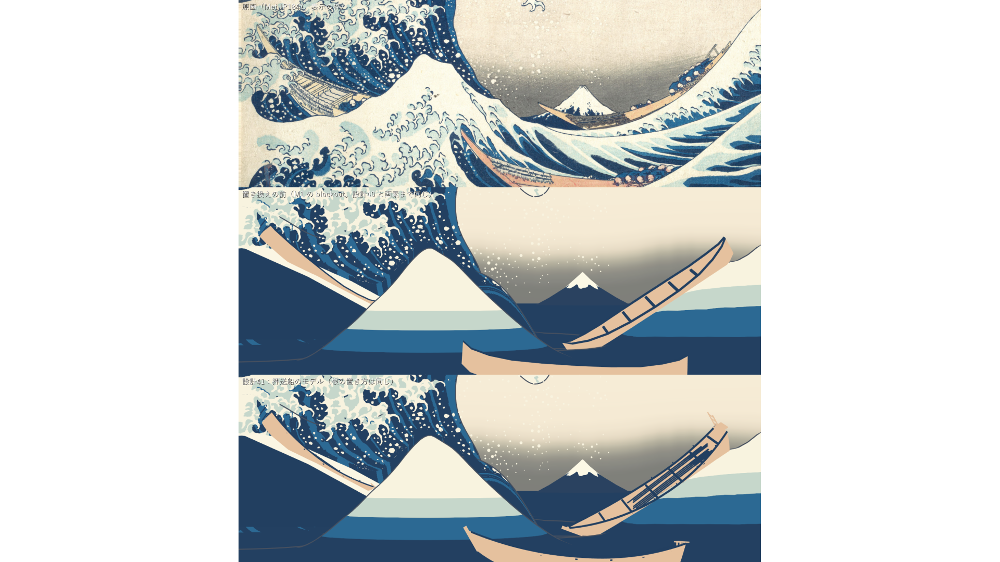
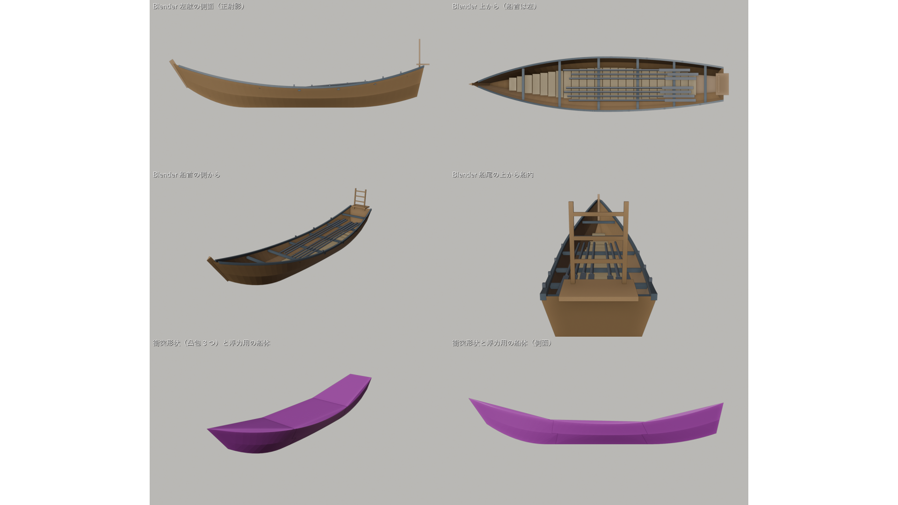

# 設計41：仮船を資料に基づく Blender モデルへ置き換える（船体・船縁・操作物、衝突形状、浮力用形状） ― 押送船の寸法を公開のウェブのページで確かめ（資料の値と絵からの推定を分ける）、Blender ヘッドレスで作った一つのモデルを、3 隻の根の置き方を変えずに差し替える。最小の受入 3 つは満たし、手前の船の 75 と線なしの読みの 76 は悪くなった（記録のみ）

日付：2026-09-30／状態：**閉じた（使える水準。最小の受入 3 つと計画 §2.0 の回帰なしを満たした。HMD の確かめは保留）**。修正は 0 回（Q26 の 1 回は使っていない）。証拠の種類は次のとおり。**HMD 実機の結果ではない。利用者は確かめていない。**

- 作る部・調べ：公開のウェブのページを読んだだけ（ファイルはダウンロードしていない。PDF 1 件は保留）。調べの表は `ds41_research_table.py` が書く JSON。
- 作る部・モデル：Blender 5.2.2 LTS のヘッドレス（`--background --factory-startup`）の制作と往復の検査、Unity 6000.4.3f1 の Editor の batchmode の取り込みの検査・場面の組み立て・PC オフスクリーン描画（camera.Render、RTX 3080、Direct3D11）、評価器23（`Tools/PaintingTruth/evaluate.py`）を 2 回、回帰の評価器（`ds30b_tstar_regress.py`、爪あり `t28_claws`・爪なし `t28_white`）、numpy/OpenCV の測り（`ds41_compare.py`）。
- 進行役の独立の検査（作る部の比べのコードを使わずに書いた Blender の読み込みと numpy/OpenCV。Assets の FBX を Blender で新しく読み込み、自前の射影で Unity の ID 画像と比べ、評価器23 を自分で回し直した。写しは Git 対象外の `Unity/Build/Design/41/indep_check/`）。判定は pass = true、必須の指摘 0、記録の指摘 10。
- 記録の道具 `ds41_record.py`：作る部の SHA-256 の照合（357 件）と守るファイル（17 件）の照合、作る部の比べのコードを使わない数え直し（評価器の出力、t\* の組の全ファイル、設計40 の画像との違い、ID 画像の船の画素）、図と JSON の写し、metrics.json・run.json。

番号の前提：

- 対象：[段階9までの実行計画](../Design/Stage9_Plan_2026-09-26_ja.md)（以下「計画」）§2.4 の設計41。使える水準の成果物は「設計書 §7.1 の候補の押送船を、所蔵館・公的機関の資料で寸法と構造を確かめ（資料の値と絵からの推定を分ける）、Blender ヘッドレスで船体・船縁・櫂を作る。衝突形状と浮力用の簡単な船体を別に作る。FBX は設計07 の検証済みの設定で出す。3 隻の blockout を置き換え、原画視点の位置は投影固定のまま保つ」。最小の受入は「Unity で尺度・軸・左右の反転なし（設計07 の検査）。原画視点の 74・75・157・159 を記録し、CP1 からの変化を示す（判定は仕上げ40・41）。座席 v1 の目の高さと船縁の関係を記録」。依存は 27修正01（座席 v1）、バックログは 75・217・219・222（記録）。危険 R11 の対策「投影固定の置き方を保ち、差を記録する。座席 v1 の定義（seat_v1.json）を変えない」も守る。
- 回帰の読み：[段階7確認](Stage7_SelfReview_ja.md) §9 のとおり、比べの基準は設計40 の値（74 5.76 px・75 141.36 px・157 77.55 px・159 160.86 px）で、原画視点の回帰の評価器を爪あり・爪なしの両方で回し、段階7 の値（段階7確認 §4）から後退させない。直前の番号（設計40）に対して判定し、CP1 に対する値は隠さずに書く（段階5確認 §6.3・段階6確認 §4.2 の読み）。
- 引き継ぎ：
  - 主役波の動き：設計28修正01 の `Unity/Build/Design/28R01F/F_final` と最後の一コマ `kstar_final`（K\*′ R4）。表示用サーフェスと色の焼き込みは[設計29修正01](Design_29_修正01_ja.md)。周りの海と一回の再生は[設計30](Design_30_ja.md)。段階6（[設計31](Design_31_ja.md)〜[設計35](Design_35_ja.md)）と段階7（[設計36](Design_36_ja.md)〜[設計40](Design_40_ja.md)）はコミット済み。
  - 船：美術優先27・27修正01 で置いた M1 の blockout 3 隻（`Unity/Assets/GreatWave/Art/M1/boat_blockout.fbx`、先端間 10）。根の置き方は `Tools/GWContext/context_layout.json`・`seat_v1.json`（座席 v1 は右船の唇の下、D7）。
  - 場面：段階7 の場面 `Unity/Assets/GreatWave/Design39/Scenes/DS39_Paper.unity`（`7480a99b…`）を開くだけで保存せず、別の場面 `DS41_Boats.unity` として保存した。
- 時間の上限：Q26 の日程で 5 時間（計画 §2.6 の 10/2 の行。計画の時間枠は ≤1 日）。範囲は最小の受入だけで、修正は 1 回まで。
  - 実績（ファイルの時刻。[metrics.json](../Evidence/Design/41/metrics.json) の `time`）：段階7確認のコミット 09:29:55 の後に着手。調べの表 09:41:27、Blender の最初の保存 09:44:35・最後の書き出し 09:51:36、Unity の取り込みの検査 09:52:00・場面の組み立て 09:52:10・描画 09:53:21（ログの終わり 09:53:22）、回帰の評価器 09:56:51、評価器23 09:57:09〜09:57:13、作る部の最後のファイル（`ds41_model_run.json`）09:58:16。進行役の独立の検査 10:03:49〜10:08:30（検査の写しのファイルの時刻）。記録 10:12 ごろ〜（終わりは `Unity/Build/Design/41/READY_TO_COMMIT.txt` の時刻）。着手から作る部の終わりまで約 28 分、独立の検査の終わりまで約 39 分で、5 時間の上限の内。
  - 作る部の報告の時間は、ファイルの時刻と合わない（第 10 節の 11・12）。ここではファイルの時刻を使った。
  - 1 回の計算：Unity の描画 11.2 s（`DS41_RENDER_DONE seconds=11.2 protectedUnchanged=True`）、回帰の評価器は描画の終わり（09:53:22）から出力（09:56:51）まで 3 分 29 秒以内、評価器23 は 1 回 約 4 s、記録の道具 約 10 s。どれも 30 分の上限より十分短い。
- 読むだけで変えていないもの：設計27〜40 の場面・スクリプト・シェーダー・材質とデータ（守るファイル 17 個。描画の前後と記録の時に SHA-256 が同じ、`changedFiles` は空）。`DS39_Paper.unity` の SHA-256 は組み立ての前・後・記録の時で同じ。ProjectSettings は Unity の 3 回の実行の前後でバイトが同じ（戻したファイル 0。`model/logs/ds41_settings_restore_*.json`）。座席 v1 の定義 `Tools/GWContext/seat_v1.json`（`4f7553fd…`）は変えていない。
- 座標と単位：m・s。t は体験の時刻、t\* は t = 12 s。船のモデルの単位は「置き方の枠」（船首の先端と船尾の先端の間を 10 とする。M1 の blockout と同じ枠）。実寸は船ごとの根の縮尺を掛けた値。Blender は右手系・上 +Z・船首 −Y、Blender → Unity は (x, y, z) → (−x, z, −y)（設計07 の実測）。画像の画素は 1920 × 1080 の表示の px（全体の合成の ID 画像だけ 3840 × 2160）。
- 使っていないもの：参照モデルの OBJ（船には使わない。D20）、利用者の解算、写真のフォルダー、Houdini、旧試作の場所。爪形分析のフォルダー（`G:\research\爪形分析`）は、調べ・作る部・検査・記録の道具のどれも開いていない。記録の時のコミットの一覧の点検でだけ、そのフォルダーのファイルの大きさを読み取りのみで調べ、大きさが同じファイルだけ SHA-256 を比べた（第 9 節）。原画は `Docs/References/Met_JP1847_DP130155.jpg`（調べの部が SHA-256 を取り、絵の推定を読んだ）。
- git：作る部は使っていない。記録の時に、読み取りのみの git（`status`・`log`・`ls-files`・`check-attr`・`check-ignore`・`config` の読み）で、変更のない tracked のファイル、依存の資産がコミット済みであること、無視と改行の扱いを確かめた。何も変えていない。

## 見るもの

| 置き換えの前後（上：原画、中：M1 の blockout（設計40 と画素まで同じ）、下：設計41） | Blender のモデル（左舷の側面・上から・船首の側から・船尾から船内・衝突形状と浮力用の船体） |
| --- | --- |
|  |  |

図は Unity の PC 描画と Blender の描画から作った（1920 × 1080。作る部の 1560 × 1680 と 1920 × 1620 の図を縮めて白の余白を足した。元の図は Git 対象外の `Unity/Build/Design/41/model/fig/`）。

作品の画像（紙・摺り・小飛沫は切。評価の状態。作る部の画像をバイトのまま写した）：

- [原画視点 t\*](../Evidence/Design/41/ds41_painting_t120_off.png)（`efcceae4…`。評価器23 の入力と同じファイル）

図：

- [船の近くの前後](../Evidence/Design/41/fig_ds41_close_before_after.png)：右船（座席の船）・手前の船・左奥の船を、それぞれ一時のカメラで置き換えの前（blockout を同じ根に一時に置いた描画）と後
- [評価器の重ねと原画 50% の重ね](../Evidence/Design/41/fig_ds41_eval_overlay_boats.png)：上＝評価器23（線なしの ID）の偏差図の船の所、下＝原画を 50% で重ねた船の所
- 評価器23 の偏差図の全体：[線なしの ID](../Evidence/Design/41/fig_ds41_contour_off_noline.png)（輪郭と船の項目）・[線ありの ID](../Evidence/Design/41/fig_ds41_contour_off_line.png)（空の項目）
- [視点の並べ](../Evidence/Design/41/fig_ds41_views.png)：座席 v1 の前後（同じ画像）、座席の低い視点、座席から波の方向、左の側面、背面
- [76 暗い空の範囲](../Evidence/Design/41/fig_ds41_76_sky_dark.png)：右船の船尾と右の斜面の間に見えるようになった暗い空（進行役の独立の検査の切り抜き。第 2.7 節）
- [座席から波の方向の前後](../Evidence/Design/41/fig_ds41_seat_toward_wave_40_41.png)：設計40 は背景の船・富士・仮置きを隠して描き、設計41 は隠していないので、比べられない（第 2.6 節）

動画はない。この番号は t\* の静止画の比べで、船は動かしていない（船の揺れは設計30 の `DS30BoatHeave` のまま）。

数値：

- [metrics.json](../Evidence/Design/41/metrics.json)：最小の受入 `acceptance`、調べの表 `research`、モデル `model`（部品・衝突形状・浮力用の船体・排水容積の表・浮力点・船ごとの実寸）、評価器の表 `evaluator_table`（設計41・設計40 × 線なし・線あり）、記録のみ `record_only`、回帰 `regression_plan_2_0`、記録の照合 `recorder_crosscheck`、修正 `fix_rounds`、バックログ `backlog`、時間 `time`
- 調べの表：[ds41\_oshiokuri\_dimensions.json](../Evidence/Design/41/ds41_oshiokuri_dimensions.json)（`47f3f700…`。資料の値 `source_values`・絵からの推定 `painting_estimates`・採用値 `adopted_for_model`・読めなかった資料 `held_sources`）
- 作る部の写し：[ds41\_model\_metrics.json](../Evidence/Design/41/ds41_model_metrics.json)、[ds41\_model\_run.json](../Evidence/Design/41/ds41_model_run.json)、[ds41\_blender\_report.json](../Evidence/Design/41/ds41_blender_report.json)（寸法・部品・断面の表・往復の検査・排水容積の表・浮力点）、[ds41\_import\_check.json](../Evidence/Design/41/ds41_import_check.json)（設計07 の検査）、[ds41\_build\_report.json](../Evidence/Design/41/ds41_build_report.json)、[ds41\_render\_report.json](../Evidence/Design/41/ds41_render_report.json)
- 評価器23 の全項目の出力：[線なしの ID](../Evidence/Design/41/ds41_eval_off_noline_metrics.json)・[線ありの ID](../Evidence/Design/41/ds41_eval_off_line_metrics.json)
- 進行役の独立の検査：[ds41\_indep\_check.json](../Evidence/Design/41/ds41_indep_check.json)、[ds41\_indep\_raster.json](../Evidence/Design/41/ds41_indep_raster.json)
- 回帰の評価器の出力は設計36・38・39・40 の出力と SHA-256 まで同じファイル（`4ca57d3a…`）なので写していない。
- 実行条件と SHA-256：[run.json](../Evidence/Design/41/run.json)

## 0. 結論

1. **押送船の寸法を資料で確かめ、資料の値・絵からの推定・採用値を分けた表を作った。** 採用した全長は 1813 年の史料の 38尺5寸 = 11.667 m、幅 8尺2寸 = 2.485 m、深さ 3尺 = 0.909 m、櫓 7 丁（1尺 = 10/33 m、曲尺と仮定）。出典はウィキペディア日本語版「押送船」で、同項は石井謙治『和船 II』（1995）pp.164–167 を典拠に挙げる（書籍は読んでいない）。所蔵館・公的機関の資料で確かめられたのは、用途（すみだ北斎美術館・東京富士美術館・文化遺産オンライン・国立国会図書館のレファレンス協同データベース）と、太田記念美術館の「全長は 10 メートルほど」だけ。構造（二階造り・尖鋭な船型・船首が高い）は辞典、構造の用語は船の科学館による。ほかの長さの資料（約 12 m、10 m ほど、12〜15 m）の範囲の内にある。
2. **Blender ヘッドレスで一つのモデルを作り、3 隻の blockout を置き換えた。** 船体（平らな航と根棚・上棚の二段、水押、戸立）、左右の船縁、敷板、船梁 6 本、艫の板、右船の船尾の梯子状の枠（絵の P8。右船だけ）、櫓 7 丁（左舷 4・右舷 3。櫓杭つき。船梁の上に収めた姿）、衝突形状（凸包 3 つ、描かない）、浮力用の閉じた船体（描かない）の 19 の部品。両端の先端は blockout の置き方の点と同じ頂点にあり、根の Transform は設計40 と差 0.0 なので、原画視点の両端の投影の差は 0.36 px 以下。
3. **最小の受入 1：設計07 の検査（尺度・軸・左右の反転なし）は合格。** FBX は M1 の書き出しの設定と同じで、Assets の FBX は Blender の出力とバイトまで同じ（`f4bc4087…`）。Unity の取り込みで先端間 10.0004、幅 2.1293、部品の範囲の差 最大 1.07 × 10⁻⁶、右舷の櫓 3 本が +X・左舷の 4 本が −X、三重積 +1.0000、船殻の三角形の外向き 444／444。独立の検査の自前の射影でも、正しい写し方なら Unity の船の画素のうち自前の描画の外に出るものは 0.0%（鏡像・前後の反転・5% の尺度の誤りでは 0.09〜8.96%）。
4. **最小の受入 2：74・75・157・159 を記録し、CP1 からの変化を示した（判定は仕上げ40・41）。** 74 は 5.7562 px（変化 0）、75 手前の船は 146.3537 px（CP1 から +4.9957 px、p95 +15.6683 px。**悪くなった**）、157 左奥の船は 78.7542 px（−47.8288 px）、159 右船は 155.2812 px（−62.9499 px）。
5. **最小の受入 3：座席 v1 の目と船縁の関係を記録した。** 座席 v1 の甲板の測り方を新しい船で測り直すと、当たる点は元の甲板の点から 6.7 mm で、目は新しい敷板の 1.205 m 上（世界の鉛直）。目の所の断面で、目は船縁の上端より 0.149 m 上（船の枠。blockout は 0.148 m）。t\* では船が縦に 33°・軸まわりに 25° 傾いているので、世界の鉛直では右舷（Unity +X）の船縁が目とほぼ同じ高さ（作る部の読みで目より 0.055 m 上、独立の検査の断面の読みで 0.027 m 上。水平 0.42〜0.49 m）で、左舷の船縁は目より 0.58〜0.59 m 下。
6. **計画 §2.0 の回帰なしは合格。** 回帰の評価器の出力は設計40 と SHA-256 まで同じ（`4ca57d3a…`、爪あり・爪なし）。78／130／131 3.0289／3.5131／3.0431 px、132 σ12 3.7552 px、72 σ24 p95 3.8423 px（爪あり。爪なし 4.0075 px）、色区の両側の読みの差 0.0、68・69・70・212・94 合格。原画視点の色画像の違い 42,728 画素と ID 画像の違い 73,356 画素は、どれも船の所（船の外は 0）。置き換えの前の対照の描画は設計40 と画素まで同じ。
7. **71・76・213 は記録のみ。** 設計40 と同じ読み（空は線ありの ID）では 76 暗い空の範囲 37.4511 px（変化 0、p95 19.2455 → 17.914）、下の色 ΔE00 0.2224 → 0.2872。**線なしの ID では 76 は 61.0855 → 188.7176 px に悪くなった**（右船の新しい細い船尾と右の斜面の間に暗い空のくさびが見える。作る部はこの値を報告していなかった）。
8. **HMD（PS VR2）の確かめは保留**（導入は利用者の手）。PC の描画だけで、Mock の両眼も描いていない。
9. **限界（第 5 節）**：75 の悪化、線なしの 76、手前の船と左奥の船が資料の全長より 27.6%・14.5% 短いこと、反りと両端の高さが原画の置き方の値であること、右舷の船縁が t\* で目の高さに来ること、寸法の出典が二次資料であること、舵・帆柱・荷・乗員がないこと、衝突形状が船内を埋めること、など。設計42〜45、仕上げ40・41 へ送った。

---

## 1. 目的

設計書 §7.1 は、船の型と構造を資料で確かめ、船長・幅・喫水を明記し、絵から推定した寸法と史料で分かった寸法を分けること、Blender で船体・船縁・床・操作物を役割に分け、表示用・衝突用・浮力計算用の形を分けること、`.blend` を制作元として検証済みの FBX の設定で Unity へ渡すことを求める。計画 §2.4 の設計41 は、これを使える水準で行い、段階7 までの作品の 3 隻の blockout を、原画視点の位置を変えずに置き換える番号である。

Q26 により、最小の受入だけを満たし、修正は 1 回までとした。

---

## 2. 表

### 2.1 資料の値・絵からの推定・採用値（調べの部）

調べの部は 11 の資料を読み、7 件は読めなかった（保留）。値は[調べの表](../Evidence/Design/41/ds41_oshiokuri_dimensions.json)にある（資料の値 15、絵からの推定 9、採用値 14（資料 5・推定 9））。

**資料の値**

| 項目 | 値 | 出典 |
| --- | --- | --- |
| 全長 | 38尺5寸 = 11.667 m（1813 年の史料） | S1 ウィキペディア日本語版「押送船」（典拠：石井謙治『和船 II』1995、pp.164–167） |
| 長さ（別の資料） | 約 12 m／10 m ほど／12〜15 m | S2 ブリタニカ国際大百科事典／S4 太田記念美術館／S8 Cartwright & Nakamura 2009（英語版ウィキペディア経由） |
| 幅 | 8尺2寸 = 2.485 m（S2 も 2.5 m） | S1・S2 |
| 深さ | 3尺 = 0.909 m | S1 |
| 櫓 | 7 丁 | S1・S2 |
| 帆柱・帆 | 着脱式 3 本、帆 6 反 | S1・S2 |
| 構造 | 尖鋭な船型の二階造り、船首が高く鋭い。二階造りは航（平らな船底材）に根棚と上棚を付け、船梁で補強する | S2（精選版 日本国語大辞典・ブリタニカ）、用語は S9 船の科学館 もの知りシート No.32 |
| 乗員 | 1 隻に漕ぎ手 8 人と前の 2 人（本作の読み）／見える人数 10・11・2 人 | S8／S4 |
| 用途 | 房総・伊豆などから江戸の市場へ鮮魚を急送する帆走・漕走併用の快速船 | S1・S2・S3 国立国会図書館 レファレンス協同データベース・S5 すみだ北斎美術館・S6 東京富士美術館・S7 文化遺産オンライン（東京国立博物館） |
| 隻数 | 1803 年に江戸の周辺で 64 隻 | S1 |
| 櫓の寸法（和船一般。押送船の値ではない） | 腕 1.5〜2.1 m、脚 4.2〜5.5 m、幅 0.13〜0.15 m | S10 改訂新版 世界大百科事典 |

- 幅と深さをどこで測ったかは、どの資料にも書かれていない。採用値では、幅を舷の上縁の最大幅、深さを船体中央の船底から舷の上縁までと読んだ（読み方は推定）。
- S11 文化遺産オンライン「押送舟図」（館山市立博物館）は作品の書誌だけで、寸法の記述はない。

**絵からの推定**（原画 DP130155 で読んだ見かけの値。実船の寸法ではない）

| # | 項目 | 値 |
| --- | --- | --- |
| P1 | 置いた船の長さ（先端間） | 手前 8.45 m・右 11.328 m・左奥 9.98 m（番号27 と 27修正01 の置き方の結果） |
| P2 | 三日月形の反り（両端の弦から舷の上縁の最も低い所まで ÷ 弦） | 手前 0.12（弦 1610 px、約 200 px 下）・右 0.18（弦 1389 px、約 244 px 下）。誤差 ±20% |
| P3 | 舷側の見える高さ ÷ 弦（手前、中央） | 上の帯 0.05、下の淡い帯を含めて 0.105（資料の深さ ÷ 全長は 0.078） |
| P4 | 人の頭から見た船の長さ | 頭の幅 約 42 px（弦の 0.026）。頭 0.16〜0.20 m とすると 6.2〜7.7 m。人物を約 1.5〜1.9 倍に描いていると読める |
| P5 | 船首寄りの簀の子状の枠と藁の房 | 船首から弦の 0.12〜0.40。生簀の蓋か苫かは確かめられない |
| P6 | 漕ぎ手 | 船尾側の 0.55〜1.0 に、かがみ込んで櫓にしがみつく |
| P7 | 帆柱 | 3 隻とも立っていない |
| P8 | 右船の船尾の梯子状の枠 | 上縁から約 150 px（弦の 0.11、約 1.2 m）。用途は資料で未確認 |
| P9 | 船首 | 鋭く尖り、高く反り上がる |

**採用値**（モデルに使う値。`kind` は source＝資料、estimate＝推定）

| 項目 | 値 | kind |
| --- | --- | --- |
| 全長・幅・深さ | 11.667 m・2.485 m・0.909 m | source |
| 構造 | 航＋根棚＋上棚（二階造り）、船梁で補強 | source |
| 櫓の数 | 7 | source |
| 櫓の長さ | 腕 1.5 m・脚 4.2 m・幅 0.13 m、全長 5.7 m（和船一般の範囲の下限） | estimate |
| 櫓の並び | 左舷 4・右舷 3 を船尾側の約 6 割に交互 | estimate |
| 帆柱 | 立てない | estimate |
| 船首・船尾の反り | +0.9 m・+0.5 m（控えめな値） | estimate（**モデルでは採らなかった**。第 3.4 節） |
| 床 | 船底から 0.2 m | estimate |
| 質量 | 2.0 t（1.6〜3.1 t） | estimate |
| 喫水 | 0.20 m（0.16〜0.30 m）。水線長 10.5 m・水線幅 2.1 m・方形係数 0.45・海水 1025 kg/m³ から。blockout の喫水は 0.38 m | estimate |
| 乾舷 | 0.709 m | estimate |

**読めなかった資料（保留）**：郵政博物館 研究紀要 第10号の論文（PDF の取得はダウンロードに当たるので利用者の許可が要る）、千葉市立郷土博物館の X の投稿（HTTP 402。検索の抜粋「船首の四角い枠は生簀」は値に使わない）、ボストン美術館の北斎『押送波濤通船』（403）、メトロポリタン美術館 45434（429）、大英博物館（403）、Royal Society の論文の頁（403）、横浜市歴史博物館の企画展の頁（接続拒否）。書籍（石井『和船 II』など）の本文は読んでいない。

### 2.2 モデルの形と部品

値は [ds41\_blender\_report.json](../Evidence/Design/41/ds41_blender_report.json) と [ds41\_model\_metrics.json](../Evidence/Design/41/ds41_model_metrics.json)、パラメータは `Tools/GWWaveGen/ds41/ds41_boat_params.json`（`6e582d35…`）。単位は置き方の枠（先端間 10）。

| 部品 | 役割 | 頂点／面 | Unity での扱い |
| --- | --- | --- | --- |
| Boat41\_Hull | 船体（航・根棚・上棚の断面を 41 の断面でつなぐ。開いた殻） | 283／241 | 表示（AF27\_Flat\_boat\_ochre） |
| Boat41\_Gunwale\_Port・\_Starboard | 船縁の縁材（幅 0.07・高さ 0.08、反りの線の 0.03 上） | 160／158 ずつ | 表示（AF27\_Flat\_ai\_dark） |
| Boat41\_Floor | 敷板（y −3.45〜3.9、板の間隔 0.3、隙間 0.02） | 192／144 | 表示（黄土） |
| Boat41\_Beams | 船梁 6 本（y −2.9・−1.5・0・1.5・2.9・4.1） | 48／36 | 表示（藍） |
| Boat41\_Stem | 水押（幅 0.09・奥行き 0.16） | 6／5 | 表示（黄土） |
| Boat41\_SternDeck | 艫の板（上面 1.685、y 4.5〜5.0） | 32／24 | 表示（黄土） |
| Boat41\_SternFrame | 右船の船尾の梯子状の枠（艫の板の 0.95 上、横木 3） | 40／30 | 表示（黄土）。**右船だけ**（手前・左奥は切） |
| Boat41\_Oar\_P1〜P4・S1〜S3 | 櫓 7 丁と櫓杭（内側 1.286・外側 3.6、羽根 1.2 × 0.111） | 32／22 ずつ | 表示（藍）。船梁の上に収めた姿 |
| Boat41\_Col\_Bow・Mid・Stern | 衝突形状（船殻を船縁まで 3 つの凸包に分けた。u 0〜0.34・0.3〜0.7・0.66〜1.0） | 三角形 152・200・164 | MeshCollider（convex）、描かない |
| Boat41\_Buoyancy | 浮力用の閉じた船体（船殻の外面を舷の上縁までふさいだ形） | 283／281 | MeshFilter だけ、描かない |

- 寸法：最大の半幅 1.065（幅 2.1293。幅 ÷ 先端間 0.21293、資料の 0.21298）、中央の深さ 0.779（独立の検査の測りで 0.7816、資料の比では 0.7792）。表示の範囲 x −1.0693〜1.0647・y ±5・z 0〜2.635（梯子の枠を含む）。
- 両端：船首の先端 (0, −5, 1.775)・船尾の先端 (0, 5, 1.685) は本当の頂点（最も近い頂点までの距離 2.4 × 10⁻⁸・5.7 × 10⁻⁸）。美術優先27 の `af27_place.py` の置き方の点と同じ。
- 反りと両端の高さは原画の置き方の値（船首の反りの上端 1.70・船尾 1.60、`kind` painting）。
- 床：船底の 0.23 上。座席の所（y = −3）の上面を blockout の甲板（0.378）とほぼ同じ 0.377 にした（座席 v1 の目を保つため。第 3.4 節）。
- 閉じた形の検査（Blender）：浮力用の船体と衝突形状 3 つは、非多様体の辺・境界の辺・つぶれた面が 0。船体は開いた殻（境界の辺 81）で、外向きの面 224／224。
- 浮力用の船体の体積：10.657 単位³（閉じた網の体積。柱の積分 10.6572 と 2 × 10⁻⁵ の比で合う）。FBX を読み込み直した網では 10.672 単位³（+0.14%。独立の検査）。
- 排水容積の表（船の局所の水平の水面、傾き 0）：

| 喫水（単位） | 容積（単位³） | 水線面積（単位²） |
| --- | --- | --- |
| 0.1 | 0.524 | 6.239 |
| 0.171（調べの喫水 0.20 m） | 1.00872 | 7.408 |
| 0.2 | 1.23012 | 7.839 |
| 0.3 | 2.09361 | 9.389 |
| 0.4 | 3.10658 | 10.779 |
| 0.5 | 4.23612 | 11.747 |

- 浮力点の案：船底に 10 点（y −3・−1.5・0・1.5・3 に左右 2 点ずつ。Unity の局所の値は `buoyancy_points`）。設計42 で使う。
- 船ごとの実寸（根の縮尺 × 置き方の枠）：

| 船 | 縮尺 | 先端間 | 幅 | 中央の深さ | 資料の全長 11.667 m との差 |
| --- | --- | --- | --- | --- | --- |
| 右船 boat\_mid（座席の船、159） | 1.132835 | 11.328 m | 2.413 m | 0.882 m | −2.9% |
| 左奥 boat\_left（157） | 0.9981 | 9.981 m | 2.126 m | 0.778 m | −14.45% |
| 手前 boat\_fg（75） | 0.844624 | 8.446 m | 1.799 m | 0.658 m | −27.61% |

- 右船を調べの喫水（0.194 m、右船の縮尺へ直した値）で浮かべると、排水容積 1.466 m³、海水で 1.503 t。静水の釣り合いは設計42。

### 2.3 設計07 の検査（Unity の取り込み）

値は [ds41\_import\_check.json](../Evidence/Design/41/ds41_import_check.json)（`DS41_IMPORT_CHECK pass=True scale=True axis=True mirror=True normals=True`）と独立の検査。

| 検査 | 値 | 判定 |
| --- | --- | --- |
| 書き出しの設定 | M1 の `generate_m1_assets.py` の EXPORT\_FLAGS と同じ（-Z forward・Y up・global\_scale 1・apply\_unit\_scale・FBX\_SCALE\_UNITS・use\_space\_transform・bake\_space\_transform なし。独立の検査がキーごとに照合） | 合格 |
| 取り込みの設定 | globalScale 1・useFileScale 1・bakeAxisConversion 0。`.meta` は M1 の `boat_blockout.fbx.meta` と GUID だけ違う | 合格 |
| Assets の FBX | Blender の出力とバイトまで同じ（`f4bc4087…`） | 合格 |
| 尺度 | 先端間 10.0004（両端の高さの差 0.09 を含む斜めの距離）、幅 2.1293（期待 2.13） | 合格 |
| 部品ごとの範囲 | Blender の範囲を (−x, z, −y) で写した値との差 最大 1.07 × 10⁻⁶ | 合格 |
| 軸 | 船首 +Z（内積 0.99996）、上 +Y | 合格 |
| 左右 | 右舷の櫓 3 本が +X、左舷の 4 本が −X、三重積 +1.0000 | 合格 |
| 法線 | 船殻の三角形の外向き 444／444 | 合格 |
| Blender の往復 | .blend を開き直して差 0、FBX を読み込み直して差 1 × 10⁻⁶ | 合格 |
| 独立の検査の射影（Unity の ID 画像の船の画素のうち、自前の描画で説明できない割合） | 正しい写し方 0.0%（3 隻とも）。鏡像 0.09〜0.25%、前後の反転 2.27〜8.96%、尺度 5% の誤り 0.55〜0.93% | 合格 |

- 子の localEuler の x が 270.02° と出るのは、四元数 (−0.7071, 0, 0, 0.7071) をオイラー角へ直すときの丸め（作る部の注）。範囲の差が 10⁻⁶ なので回転の誤りではない。

### 2.4 原画視点の 74・75・157・159（CP1 からの変化。判定は仕上げ40・41）

値は評価器23 の線なしの ID の出力（`model/eval/off_noline/metrics.json`）、CP1 は `Docs/Evidence/ArtFirst/CP1/metrics.json` の 45° の読み。記録の道具が読み直した。

| 項目 | CP1 最大（p95） | 設計40 最大（p95） | 設計41 最大（p95） | CP1 からの変化 最大（p95） | 設計40 からの変化 最大（p95） |
| --- | --- | --- | --- | --- | --- |
| 74 富士の稜線 | 5.7562（5.3092） | 5.7562（5.3092） | 5.7562（5.3092） | 0.0（0.0） | 0.0（0.0） |
| 75 手前の船 | 141.358（85.6184） | 141.358（85.6184） | **146.3537（101.2867）** | **+4.9957（+15.6683）** | +4.9957（+15.6683） |
| 157 左奥の船 | 126.583（98.3234） | 77.5517（63.5295） | 78.7542（63.2） | −47.8288（−35.1234） | +1.2025（−0.3295） |
| 159 右船 | 218.2311（171.4291） | 160.857（121.1844） | 155.2812（109.356） | −62.9499（−62.0731） | −5.5758（−11.8284） |

- 75 の最も悪い点は (1495.85, 940)：手前の船の船尾の艫の板と柱が、原画の手前の船の船尾（原画では漕ぎ手に隠れている）より外へ出ている。作る部は、資料の比（0.213）にした幅も原因の一つと読む（座席の所の船縁の半幅は blockout 0.7362 → 0.7954 単位。75 の所の幅は測っていない）。
- 線ありの ID で読んでも最大は同じ（157・159 の p95 は 63.2024・109.3474）。
- 船の塗りの IoU（記録のみ。原画の船のマスクと全体の ID 画像の船の色）：手前 0.3693（設計40 0.3443）、左奥 0.1258（0.1209）、右 0.0854（0.0958）。
- 全体の ID 画像（3840 × 2160）の船の画素：左奥 43,124（設計40 46,803）、右 146,247（142,064）、手前 141,618（164,818）。
- 両端の投影の差（blockout の先端の頂点 x 0.012 と新しい船の x 0 の差による）：左奥 0.1434・0.0363 px、右 0.3253・0.3556 px、手前 0.0444・0.1885 px。

### 2.5 座席 v1 の目と船縁（記録）

座席 v1（`seat_v1.json`）は変えていない。目の位置は世界 (3.9544, 1.8323, −15.0308)。

| 読み | 作る部 | 独立の検査 | blockout（比べ） |
| --- | --- | --- | --- |
| 座席の規則（船の根の局所 (0, 10, 3) から下向き）で当たる面 | Boat41\_Floor（局所 z 0.3774）、元の甲板の点から 6.7 mm | 同じ（6.68 mm） | 甲板 |
| 目と当たった面の高さ（世界の鉛直） | 1.205 m | 1.2051 m | 1.2 m（座席 v1 の定義） |
| 目の所の断面で、目と船縁の上端（船の枠） | 目が 0.149 m 上 | 目が 0.1491 m 上 | 目が 0.148 m 上 |
| 目の所の断面で、船縁と敷板・目と敷板（船の枠） | 船縁が敷板の 0.77 m 上（**敷板は座席の規則の所 y −3 で読んだ**） | 目の所（Blender の y −2.42）で船縁が敷板の 0.91 m 上、目が 1.06 m 上 | — |
| 右舷（Unity +X）の船縁と目（世界の鉛直、t\*） | 船縁が目の 0.055 m 上、水平 0.493 m（反りの線の補間） | 船縁が目の 0.0271 m 上、水平 0.4202 m（船縁の網の断面）。水平 1.5 m の内では船首側で目の 0.7078 m 上まで上がる | 船縁が目の 0.032 m 上 |
| 左舷（Unity −X）の船縁と目（世界の鉛直、t\*） | 目が船縁の 0.587 m 上、水平 1.202 m | 目が 0.5833 m 上、水平 1.1907 m | 目が 0.563 m 上 |

- t\* の右船は縦に 33°、軸まわりに 25° 傾いている（作る部の注）。世界の鉛直で読むと左右で大きく違う。船の枠の値は、船の床に対する座った目の高さの読み。
- 調べの部の推定（目は船縁の 0.49 m 上。右船の縮尺で 0.51 m）より、モデルの値（0.149 m）はずっと小さい。敷板を座席の目を保つ高さにしたこと（船首寄りでは船底から高い）と、反りを原画の置き方の値にしたこと（船縁が高い）による（第 3.4 節、限界 4）。

### 2.6 回帰と照合（計画 §2.0）

| 比べたもの | 設計41 | 前の番号 | 結果 |
| --- | --- | --- | --- |
| 回帰の評価器の出力 `ds30_tstar_regress.json`（爪あり・爪なし） | `model/unity/ds30_tstar_regress.json` | 設計40（設計36・38・39 とも同じ） | SHA-256 まで同じ（`4ca57d3a…`） |
| t\* の組（`t28_claws`・`t28_white`）の全ファイル | 各 56（PNG 33） | 設計40 の各 56 | PNG の違い 7：船を含む合成の `render/af28r01_painting.png`・`af28r01_seat_low.png` と、それから作る証拠の図 5（`28R01_compare_cp1`・`_leftedge`・`_overlay50`・`_painting`・`_seat`）。`render/af28r01_seat.png` は同じ。色区 ID・K\* の画像は同じ。JSON の 7 はパスと時刻の文字が違い、数の違いは合成の画像の画素の差の数と経過時間だけ |
| 原画視点の色画像（紙などは切） | `full/painting_t120_off.png`（`efcceae4…`） | 設計40 の同じ画像 | 違い 42,728 画素。船の ID の画素を 3 px 広げた所の外は 0 |
| 全体の ID 画像（線なし、3840 × 2160） | `full/ids_noline.png` | 設計40 | 違い 73,356 画素。どちらでも船でない画素は 0 |
| 置き換えの前の対照の描画（新しい船を一時に隠し、blockout を同じ根に置いた） | `views/painting_t120_off_blockout.png` | 設計40 の原画視点 | 画素まで同じ（違い 0） |
| 評価器23 の出し直し（独立の検査） | 線なし・線ありの ID の全項目 | 作る部の `eval/off_noline`・`eval/off_line` | 全部同じ |
| 座席 v1 t\* | `views/seat_t120_off.png` | 設計40・置き換えの前の描画 | どちらとも画素まで同じ（船は写らない） |
| 背面 t\* | `views/back_t120_off.png` | 設計40 | 画素まで同じ |
| 座席の低い視点 t\* | `views/seat_low_t120_off.png` | 設計40 | 185,336 画素違う（新しい船が写る。記録） |
| 左の側面 t\* | `views/side_left_t120_off.png` | 設計40 | 3,582 画素違う（設計40 は船・富士・仮置きを隠して描いた。記録） |
| 座席から波の方向 t\* | `views/seat_toward_wave_t120_off.png` | 設計40 | 849,925 画素違う（同じ理由。比べられない。記録） |

| 項目 | 設計41 | 設計40 | 判定 |
| --- | --- | --- | --- |
| 78／130／131（線なしの ID） | 3.0289／3.5131／3.0431 | 同じ | 合格 |
| 132 大きな輪郭 σ12 最大 | 3.7552 | 同じ | 合格 |
| 72 大きな輪郭 σ24 p95 | 3.8423（爪あり）・4.0075（爪なし、記録） | 同じ | 合格 |
| 色区（両側の読み、爪あり・爪なし） | 29修正01 との差 0.0 | 同じ | 合格 |
| 68 唇の先が内壁の下端より座席の船側 | 5.616 < 6.82 m | 同じ | 合格 |
| 69 右船と波の上下が画面内 | 右船 x 1114〜1616.5・y 551.5〜922.5（採点の列 157〜1762 の内）、頂 y 116.44・海 y 896.16 | 右船 x 1113.5〜1627.5・y 587〜927.5 | 合格 |
| 70 波の上下 > 右船の全長 | 779.72 > 582.42 px | 779.72 > 579.38 px | 合格 |
| 212 空の上の方（ΔE00） | 0.2714 | 0.2714 | 合格 |
| 94 原画視点のカメラ | 位置の差 0.0 m | 同じ | 合格 |

- 69 の右船の上端 y 551.5 は、梯子状の枠の頂（設計40 は 587）。記録の道具の数え（ID 画像の画素の端）で (1114.0, 551.5, 1617.0, 923.0)、独立の検査の射影で (1113.7, 551.3, 1616.8, 923.1)。
- 評価器23 の全体の合成は爪ありの ID だけで回した（設計40 は爪なしの ID でも回した）。爪なしは回帰の評価器（`t28_white`）で見た。
- CP1／26修正01 に対する後退（78／130／131 は CP1 2.772／1.968／1.814、132 は 1.326、72 は 1.558。細部込みの 132 5.2998・72 p95 7.8009、定義のままの読みの 134・267）は、段階5・6・7 の終わりと同じ値のまま（評価器23 の出力で 132 5.2998・72 p95 7.8009 を確かめた）。戻す先は仕上げ28。

### 2.7 記録のみの 71・76・213

| 項目 | 読み | 設計40 | 設計41 |
| --- | --- | --- | --- |
| 71 内側の空域 | 線なしの ID | 37.4944 px（p95 9.6781） | 37.4944 px（p95 9.6781） |
| 76 暗い空の範囲 | 線ありの ID（設計40 と同じ読み） | 37.4511 px（p95 19.2455） | 37.4511 px（p95 17.914） |
| 76 暗い空の範囲 | 線なしの ID | 61.0855 px（p95 22.3257） | **188.7176 px（p95 111.0935）**、最も悪い点 (1704.54, 615) |
| 76 空の下の色（ΔE00、閾値 5） | 両方 | 0.2224 | 0.2872（合格のまま） |
| 213 明暗の移行線 | 線ありの ID | 4.8815 px（p95 2.724） | 4.8815 px（p95 2.724） |
| 213 明暗の移行線 | 線なしの ID | 21.6359 px | 21.6359 px |

- 線なしの 76 の悪化：右船の新しい船尾は blockout より細く、船尾と右の斜面の間に暗い空のくさびが見えるようになった（[76 の図](../Evidence/Design/41/fig_ds41_76_sky_dark.png)）。blockout の広い船尾が覆っていた所。76 は Q7 の既定で記録のみで、もともと 4 px を超えていた（合格していた項目の後退ではない）。
- 線ありの ID の読みで最大が変わらない理由は、切り分けていない（線ありの ID では藍の線が別の色区 (255, 0, 255) になり、空の境の読まれ方が変わる）。

---

## 3. 作り方と、採ったもの

### 3.1 調べ

- `Tools/GWWaveGen/ds41/ds41_research_table.py`（`1d545b28…`）：調べの部がウェブのページで読んだ値を、資料の値・絵からの推定・採用値・今の blockout の置き方・座席の推定に分けて JSON に書く。原画は SHA-256 を取るだけ（`cbb9988f…`）。
- 所蔵館・公的機関のページ（S3〜S7・S9・S11）で、用途と構造の用語と太田記念美術館の長さを確かめた。寸法の値は S1（百科）と S2（辞典）。

### 3.2 Blender（`Tools/GWWaveGen/ds41/ds41_boat_blender.py`、`e08e07f0…`）

- 置き方の枠（先端間 10）で、41 の断面（船底の中心・航の端・根棚と上棚の折れ・舷の上縁）をつないで船体を作り、船縁・敷板・船梁・水押・艫の板・梯子の枠・櫓（櫓杭つき）を別の部品にする。衝突形状は船殻を 3 つの区間に分けた凸包、浮力用の船体は船殻の外面を舷の上縁でふさいだ閉じた形。
- 書き出しは M1 と同じ EXPORT\_FLAGS。`.blend` を開き直し、FBX を読み込み直して頂点を比べる（往復の検査）。排水容積の表は 0.025 単位の柱の積分で出し、閉じた網の体積と比べる。
- 出力（Git 対象外）：`Unity/Build/Design/41/model/blender/` の `ds41_oshiokuri.blend`・`.fbx`・`ds41_boat_geom.npz`・`ds41_blender_report.json`・確認の画像 7 枚。

### 3.3 Unity と道具

- `Tools/GWWaveGen/ds41/ds41_stage_unity.py`（`20809572…`）：FBX を `Unity/Assets/GreatWave/Design41/Models/` へ写し、`.meta` は M1 の `boat_blockout.fbx.meta` の取り込みの設定を写して GUID だけ新しくする。
- `Unity/Assets/GreatWave/Design41/Editor/DS41Boats.cs`（`3cee5fb9…`）：
  - `ImportCheck`：保存しない空の場面の原点に FBX を置き、部品ごとのワールドの頂点の範囲を Blender の値の写しと比べ、軸・左右・法線を測る。
  - `BuildScene`：プレハブ `DS41_Oshiokuri.prefab` を作り（表示の部品は美術優先27 の平塗りの材質、衝突形状は convex の MeshCollider で描かない、浮力用の船体は描かない）、`DS39_Paper.unity` を開いて（保存しない）3 隻の根「AF27 船 boat\_\*」の子の blockout をプレハブに替え、根の Transform は変えずに `DS41_Boats.unity` として別に保存する。梯子の枠は手前と左奥で切る。
  - `Render`：`DS41_Boats.unity` で t\* を描く（設計40 の `DS40Render` と同じ描き方）。t\* の組、原画視点の色画像と評価器23 の ID 画像（船 3 隻は別の色）、座席 v1 などの視点、船の近くの一時のカメラ。置き換えの前の比べとして、同じ場面で新しい船を一時に隠し、blockout を同じ根に一時に置いた描画も作る。守るファイル 17 個の SHA-256 を前後で比べる。
- `run_ds41_unity.ps1`（`fe4a3981…`）：Unity の 1 回の実行と `unity.lock`、ProjectSettings の控えと戻し（設計40 の道具を写してログの置き場所を変えた）。
- `ds41_compare.py`（`66703ad1…`）：評価器23 を 2 回、74・75・157・159 と CP1・設計40 の値、回帰の照合、68・69・70・212・94、座席と船縁、図と `ds41_model_metrics.json`・`ds41_model_run.json`。
- `ds41_record.py`：記録（第 8 節の 8）。

### 3.4 採ったもの（Q24。進行役の判断で、利用者の決定ではない）

- **一つのモデルを 3 隻に使い、根の Transform を変えない（投影固定）。** 理由：計画 R11 の対策と、座席 v1 の定義を変えないため。落とした：手前と左奥を資料の全長にする（深さ 40.7 m・58.8 m へ動かすと原画視点の重なりが変わる。仕上げ41）。
- **資料の全長 11.667 m を置き方の枠の 10 に当てる。** 右船は縮尺 1.1328 で 11.328 m（−2.9%、利用者の 5% の許容の内）。
- **幅・深さは資料の比（0.213・0.0779）、反りと両端の高さは原画の置き方の値。** 調べの部の控えめな推定（船首 +0.9 m・船尾 +0.5 m）は採らなかった。理由：両端の先端を置き方の点（高さ 1.775・1.685）に合わせると、原画視点の両端の投影が変わらない。
- **敷板の高さは、座席 v1 の目を保つ値。** 座席の所の上面を blockout の甲板とほぼ同じにした（調べの推定の船底から 0.2 m = 0.171 単位より 0.06 単位高い）。理由：seat\_v1.json を変えない（R11）。
- **櫓は船梁の上に収めた姿。** 理由：原画の漕ぎ手は立って漕がず、かがみ込んで櫓にしがみつく（P6）。漕ぐ姿では櫓が原画視点で船の外へ出る。漕ぐ姿の向き（`direction_out_aft_down`）はパラメータに残し、設計44 で使う。
- **梯子状の枠は右船だけ。** 原画では右船の船尾にだけある（P8）。
- **帆柱・舵・荷・苫・乗員は作らない。** 帆柱は原画に立っていない（P7）。乗員は仕上げ41 ②（G25）。舵は資料で形を確かめていない（限界 7）。
- **調べの部の表を直接使った。** 作る部が待っていた `dims.json` は出なかったので、`oshiokuri_dimensions.json` の `adopted_for_model` を使った（SHA-256 を記録）。

---

## 4. 関門

| 最小の受入・規則 | 基準 | 値 | 判定 |
| --- | --- | --- | --- |
| 設計07 の検査（尺度・軸・左右の反転なし） | Unity の取り込みで確かめる | 先端間 10.0004・幅 2.1293・範囲の差 1.07 × 10⁻⁶・三重積 +1.0000・右舷の櫓 +X・法線 444／444。独立の射影で説明できない画素 0.0% | 合格 |
| 74・75・157・159 を記録し、CP1 からの変化を示す | 記録（判定は仕上げ40・41） | 74 0.0、75 +4.9957、157 −47.8288、159 −62.9499 px | 記録した（75 は悪くなった） |
| 座席 v1 の目の高さと船縁の関係 | 記録 | 目は敷板の 1.205 m 上、船縁の上端の 0.149 m 上（船の枠）。t\* の右舷の船縁は目の 0.027〜0.055 m 上 | 記録した |
| 計画 §2.0 の回帰なし（直前の番号に対して） | 78・130・131・132 大きな輪郭・72 σ24 p95・69・70・212・色区が設計40 のまま | 回帰の評価器の出力が同じファイル、後退した項目 0、68・69・70・212・94 合格 | 合格 |
| 資料の値と絵からの推定を分ける | 成果物 | 資料の値 15・絵の推定 9・採用値 14（source／estimate を明記） | 作った |
| 船体・船縁・櫂、衝突形状と浮力用の船体を別に | 成果物 | 19 の部品（表示 15（うち櫓 7）・衝突 3・浮力 1） | 作った |
| 3 隻の blockout の置き換え、投影固定 | 成果物 | `DS41_Boats.unity` で blockout の参照 0、根の位置の差 0.0、両端の投影の差 ≤ 0.3556 px | 作った |
| 守るファイル・ProjectSettings | 変えない | 17 個が同じ、`changedFiles` 空、`DS39_Paper.unity` が同じ、戻し 0 | 合格 |
| HMD（PS VR2） | — | — | 保留（導入は利用者の手） |

---

## 5. 限界

1. **75 手前の船は悪くなった**（最大 +4.9957 px、p95 +15.6683 px）。最も悪い点は、船尾の艫の板と柱が原画の船尾の外へ出る所。作る部は、幅を資料の比にしたことも原因の一つと読む（測っていない）。記録のみで、仕上げ41 ①（3 隻の輪郭・船体・船縁を原画に合わせる）で直す。
2. **線なしの ID の 76 は 61.0855 → 188.7176 px に悪くなった**（右船の船尾と右の斜面の間の暗い空のくさび）。設計40 と同じ読み（線ありの ID）では 37.4511 px のまま。76 は記録のみ（Q7）で、仕上げ30 の後に仕上げ40 で判定する。船尾の形は仕上げ41。
3. **手前の船と左奥の船は資料の全長より短い**（8.446 m・−27.6%、9.981 m・−14.5%）。投影固定のためで、実寸にするには深さ 40.7 m・58.8 m へ動かす必要がある（重なりが変わる）。仕上げ41 で決める。
4. **反りと両端の高さは原画の置き方の値**（船首の反りの上端 1.70・船尾 1.60 単位）で、資料の値ではない。調べの推定（目は船縁の 0.49 m 上）とモデル（0.149 m）が大きく違うのはこのため。原画の三日月形の反り（P2 の 0.12・0.18）は見かけの値で、モデルには入れていない。仕上げ41。
5. **t\* では右舷の船縁が目とほぼ同じ高さ**（作る部 0.055 m 上・独立の検査 0.027 m 上、水平 0.42〜0.49 m。船首側の 1.5 m の内では 0.71 m 上まで上がる）。blockout でも 0.032 m 上だった。座った目から右舷の外は見えにくい。船の姿勢は設計42・43、乗客の揺れと快適さは設計45。作る部の「船縁は敷板の 0.77 m 上」は、船縁と敷板を別の所で読んだ値（同じ所では 0.91 m）。
6. **寸法の出典は二次資料。** 11.667 m・2.485 m・0.909 m はウィキペディア日本語版が石井『和船 II』を引く値で、書籍は読んでいない。所蔵館の寸法は太田記念美術館の約 10 m だけ。幅と深さの測り方は推定の読み。PDF 1 件（郵政博物館）は保留、ボストン美術館・メトロポリタン美術館・大英博物館・Royal Society・横浜市歴史博物館のページは読めなかった。一次資料の確かめは仕上げ41。
7. **作っていないもの**：舵（設計書 §7.1 の「櫂・舵などの操作物」の舵）、帆柱（資料は着脱式 3 本、原画は立っていない）、荷・苫・生簀（P5 の枠）、乗員（G25）、櫓の動き。櫓は 7 丁と櫓杭と漕ぐ向きまでで、動かしていない。舵と櫓の動きは設計44、乗員と P5 の枠は仕上げ41。
8. **衝突形状は船内を埋める凸包**で、手や座席が船体へめり込まないこと（段階8 の出口）には使えない。船殻の頂点の 2.1% は、どの衝突形状にも入らない（船尾の高い反り、y 4.3〜4.8・z 1.42〜1.6）。凸でない所（面の外側へ出る頂点）は最大 0.0023 単位。乗客に衝突形状を使うなら、設計45 で別の形を作る。
9. **水押の上の後ろの角（z 1.8635）は、船首の先端（1.775）より 0.088 単位高い。** 両端の投影には効かない（≤ 0.36 px）。仕上げ41。
10. **浮力用の船体の体積は、FBX を読み込み直すと 0.14% 大きい**（10.672 と 10.657 単位³、喫水 0.171 で 1.0103 と 1.0087）。質量（2.0 t）と喫水（0.20 m）は推定。設計42 で、読み込んだ網を積分し、浮力点から喫水を出し直す。
11. **視点の比べの一部は同じ条件でない。** 座席から波の方向と左の側面は、設計40 が背景の船・富士・仮置きを隠して描き（`HideFor`）、設計41 は隠していないので、849,925 画素と 3,582 画素の違いは比べにならない。設計41 の座席から波の方向には、自分の船の床・白い仮置きの四角・別の船が写る。座席の低い視点の 185,336 画素の違いは新しい船が写るため（測っていない）。
12. **評価器23 の全体の合成は爪ありの ID だけ**で回した（爪なしは回帰の評価器で見た）。
13. **HMD の確かめ**（座席 v1 から船縁越しの見え方、新しい船体の立体視）は保留。Mock の両眼も描いていない。設計45 と、PS VR2 の導入の後の設計08〜10。
14. **Git の改行の扱い**：`Unity/Assets/GreatWave/Design41/` は `.gitattributes` に文がない（設計34〜40 と同じ扱い）。テキストの資産は作業の木で CRLF なので、core.autocrlf = true の checkout で記録の SHA-256 に戻る。FBX は NUL を含むのでバイナリとして扱われる。道具（`/Tools/GWWaveGen/** -text`）と証拠（`/Docs/Evidence/Design/** -text`）は既存の文でバイトのまま。
15. **Unity のログ**：取り込みの検査のログに、設計30・34・39・40 のコードの古い形の API の警告 CS0618 が 18 行（設計41 のコードは 0）と、ネットワークの `Curl error 42: Callback aborted` が 1 行。コンパイルとシェーダーのエラーは 0。
16. **崩壊は作らない**（Q11）。

---

## 6. 修正の記録（Q26：修正は 1 回まで）

| 回 | 変えたこと | 結果 |
| --- | --- | --- |
| 作る部・調べ（〜09:41:27） | 公開のウェブのページを読み、調べの表を書いた | 資料の値 15・絵の推定 9・採用値 14、保留 7 |
| 作る部・モデル（09:44:35〜09:58:16） | Blender のモデル、Unity の取り込みの検査・場面・描画、回帰の評価器 1 回、評価器23 を 2 回、比べ | 最小の受入を満たした。修正の回は使わなかった |
| 進行役の独立の検査（10:03:49〜10:08:30） | 自前の Blender の読み込みと射影、評価器23 の出し直し、座席と船縁、画像の違い、資料のページの読み直し | pass = true、必須の指摘 0。記録の指摘 10（第 10 節） |
| 記録（10:12 ごろ〜） | `ds41_record.py` で照合と数え直し、証拠を作った | 作品には触れていない |

- 修正の回数は 0。

---

## 7. 引き継ぎ

**設計42**（静水の重量・排水・重心）：浮力用の船体（`Boat41_Buoyancy`、描かない MeshFilter）、排水容積の表（第 2.2 節）、浮力点の案 10 点（`buoyancy_points`、Unity の局所の値）。質量は推定 2.0 t（1.6〜3.1 t）、喫水は推定 0.20 m（0.16〜0.30 m）で、右船の縮尺では 0.194 m・1.466 m³・1.503 t。単位は置き方の枠なので、実寸は長さ × 縮尺・体積 × 縮尺³。体積は読み込んだ網で積分し直す（限界 10）。今の 3 隻の姿勢は原画に合わせた置き方で、静水の釣り合いとは別物。

**設計43**（船用水面）：船の根は t\* の原画視点の置き方のまま。表示面と船底の差を測るときは、浮力用の船体か船体の網を使う。

**設計44**（操船）：櫓 7 丁の漕ぐ向きのパラメータ（`ds41_boat_params.json` の `oars.direction_out_aft_down`）、今は収めた姿。舵はない（限界 7）。

**設計45**（乗客の揺れ）：座席 v1 と船縁の値（第 2.5 節）。t\* で右舷の船縁が目の高さに来ること（限界 5）。衝突形状は乗客には使えない（限界 8）。HMD の確かめ（限界 13）。

**仕上げ41**（船）：75（手前の船の船尾と幅）・157・159 を原画に合わせる、手前と左奥の実寸（限界 3）、反りと両端の高さ・三日月形（限界 4）、水押の頂（限界 9）、一次資料の確かめ（限界 6）、P5 の枠・帆柱・乗員（G25、仕上げ41 ②）。

**仕上げ40**：76（線なしの読み）と右船の船尾のくさび（限界 2）。

**段階8確認（自己評審）**：最初に[前後の図](../Evidence/Design/41/fig_ds41_painting_before_after.png)と第 2.4 節の表、第 2.5 節の船縁の値を見る。

---

## 8. 再現

リポジトリの根で行う。前提（どれも Git 対象外）：設計40 の出力（`Unity/Build/Design/40/compare/`）、設計39 の場面と出力、設計38・36・33・31・30 の出力、設計29修正01 の焼き込み、設計28修正01 の `kstar_final`、CP1 の画像。

道具は Blender 5.2.2（`G:/SteamLibrary/steamapps/common/Blender/blender.exe`）、Unity 6000.4.3f1（batchmode、`Unity/Build/unity.lock` で排他）、`py -3.10`（numpy 2.2.6、OpenCV 4.12.0、Pillow）。コマンドの全体と SHA-256 は [run.json](../Evidence/Design/41/run.json)。

1. 調べの表：`py -3.10 -B Tools/GWWaveGen/ds41/ds41_research_table.py`（値はスクリプトの中にある。ウェブは読みに行かない）
2. Blender：`"G:/SteamLibrary/steamapps/common/Blender/blender.exe" --background --factory-startup --python-exit-code 1 --python Tools/GWWaveGen/ds41/ds41_boat_blender.py`
3. `py -3.10 -B Tools/GWWaveGen/ds41/ds41_stage_unity.py`（FBX と `.meta` を Assets へ。`.meta` があれば GUID を保つ）
4. `powershell -NoProfile -ExecutionPolicy Bypass -File Tools/GWWaveGen/ds41/run_ds41_unity.ps1 -Method GreatWave.Design41.EditorTools.DS41Boats.ImportCheck -Log ImportCheck`
5. 同じく `-Method GreatWave.Design41.EditorTools.DS41Boats.BuildScene -Log BuildScene`、`-Method GreatWave.Design41.EditorTools.DS41Boats.Render -Log Render`（描画 11.2 s）
6. `py -3.10 -B Tools/GWWaveGen/ds30/ds30b_tstar_regress.py --out Unity/Build/Design/41/model/unity --sets t28_claws,t28_white`（約 3 分半。ほかの重い numpy の処理と同時に回さない）
7. `py -3.10 -B Tools/GWWaveGen/ds41/ds41_compare.py`（評価器23 を 2 回。`--skip-eval` で読み直しだけ）。評価器23 のコマンドは、たとえば `py -3.10 -B Tools/PaintingTruth/evaluate.py --render Unity/Build/Design/41/model/unity/full/painting_t120_off.png --ids Unity/Build/Design/41/model/unity/full/ids_noline.png --idmap Unity/Build/Design/41/model/eval/idmap.json --out-dir Unity/Build/Design/41/model/eval/off_noline --name off_noline`
8. 記録：`py -3.10 -B Tools/GWWaveGen/ds41/ds41_record.py`（約 10 s）。作る部の SHA-256 を `ds41_model_run.json` と照合し（違えば止まる）、守るファイルを照合し、数え直しをして、図・JSON を写し、metrics.json・run.json を書く。独立の検査の値は `Unity/Build/Design/41/indep_check/` から読む。
9. 調べの値を変えたら、2〜8 をこの順に回し直す（Blender と Unity で約 2 分、回帰の評価器 約 3 分半）。

---

## 9. 出典と、この番号で作ったもの

- 仕様：計画 §2.4 の設計41、§2.0（回帰の規則）、§2.6（Q26 の日程）、§5（仕上げ41）、§7.1 の R11。[制作設計書](../Design/GreatWave_VR_Production_Design_ja.md) §7.1〜7.3。[段階7確認](Stage7_SelfReview_ja.md) §4・§9。[制作手順](../Workflow/Production_Workflow_ja.md)の Q7・Q11・Q24・Q26。設計40 の記録の引き継ぎ。
- 資料（読んだページ。どれもダウンロードしていない）：
  - S1 ウィキペディア日本語版「押送船」 https://ja.wikipedia.org/wiki/%E6%8A%BC%E9%80%81%E8%88%B9 （典拠：石井謙治『和船 II』法政大学出版局 1995、pp.164–167）
  - S2 コトバンク「押送船」（ブリタニカ国際大百科事典、精選版 日本国語大辞典） https://kotobank.jp/word/%E6%8A%BC%E9%80%81%E8%88%B9-40241
  - S3 国立国会図書館 レファレンス協同データベース「押送船」（回答：鎌倉市中央図書館） https://crd.ndl.go.jp/reference/entry/index.php?page=ref_view&id=1000185601
  - S4 太田記念美術館 公式 note「北斎の波の細部に迫って鑑賞してみた」 https://otakinen-museum.note.jp/n/n04c44025350c
  - S5 すみだ北斎美術館 収蔵品「冨嶽三十六景 神奈川沖浪裏」 https://hokusai-museum.jp/modules/Collection/collections/view/47?lang=ja
  - S6 東京富士美術館 収蔵品「冨嶽三十六景 神奈川沖浪裏」 https://www.fujibi.or.jp/collection/artwork/03628/
  - S7 文化遺産オンライン「冨嶽三十六景・神奈川沖浪裏」（東京国立博物館） https://online.bunka.go.jp/heritages/detail/568372
  - S8 ウィキペディア英語版 The Great Wave off Kanagawa（Cartwright & Nakamura 2009, Notes Rec. R. Soc. 63 を引く） https://en.wikipedia.org/wiki/The_Great_Wave_off_Kanagawa
  - S9 船の科学館 もの知りシート No.32「弁才船の構造と各部名称」 https://nippon.zaidan.info/seikabutsu/2002/00033/contents/032.htm
  - S10 コトバンク「櫓」（改訂新版 世界大百科事典、日本大百科全書） https://kotobank.jp/word/%E6%AB%93-143570
  - S11 文化遺産オンライン「押送舟図」（館山市立博物館） https://online.bunka.go.jp/heritages/detail/437829
  - 保留・未読の 7 件は第 2.1 節と調べの表の `held_sources`（URL つき）。
- 読むだけ：番号の前提の「引き継ぎ」の出力と場面、CP1 の値、座席 v1、`context_layout.json`、M1 の `generate_m1_assets.py`（書き出しの設定）と `boat_blockout.fbx.meta`（取り込みの設定）、原画 `Docs/References/Met_JP1847_DP130155.jpg`。SHA-256 は run.json の `inputs_sha256`・`protected_files`。
- 参照モデル・利用者の解算・写真のフォルダーは使っていない（船に参照モデルは使わない。D20）。爪形分析のフォルダーの画像とマスクは、調べ・作る部・検査・記録のどれも開いておらず、どこにも複製していない。
- コミットの一覧の点検（記録の時）：リポジトリの外の一時の道具で、コミットする 44 ファイル（`Unity/Build/Design/41/commit_list.txt`）を読み取りのみで点検した（結果は Git 対象外の `Unity/Build/Design/41/record/ds41_commit_scan.json`）。
  - 文字のファイル 33 個と FBX から、禁止の場所の文字列（旧試作の各フォルダー、参照モデルのフォルダー、利用者の解算、写真のフォルダー、爪の分析のフォルダーとその README の場所、研究のドライブの場所）と、リポジトリの外の一時の場所の文字列を探した。見つかったのは、この文書の「開いていない」「使っていない」という記録の文字列の 4 か所（爪の分析のフォルダーの名前 3 か所と、そのフォルダーのパス 1 か所。どれも番号の前提と第 9 節）だけ。フォルダーの中のファイルの名前やパスの写しはない。
  - 爪の分析のフォルダーの 5,368 ファイル（画像・配列らしい拡張子 4,109）の大きさを読み取りのみで調べ、コミットするファイルと大きさが同じものだけ SHA-256 を比べた。SHA-256 が同じファイルは 0（最後の点検で大きさが同じだったのは 0 組。この文書の大きさは書き直すたびに変わり、途中の点検では偶然 1 組が同じ大きさだった）。
  - 5 MB を超えるファイルは 0（最大は評価器の重ねの図 1,453,573 バイト）。Unity の資産の .meta の欠けは 0。
  - 依存：場面 `DS41_Boats.unity` が参照する GUID 36 は、コミット済みの資産 33・Unity の組み込み 2・設計41 のプレハブ 1。プレハブの GUID 3 は、コミット済みの材質 2 と設計41 の FBX 1。`DS41Boats.cs` が使う設計30・31・34・36・37・38・39 の名前空間と、`ds41_compare.py` が読む `Tools/PaintingTruth/evaluate.py`・`truthlib.py`・`Tools/GWWaveGen/gw_wavegen.py`、回帰の `ds30b_tstar_regress.py` はコミット済み（読み取りのみの `git ls-files` で確かめた）。`.gitignore` の `/Unity/Build/` はこの 44 ファイルにかからない（`git check-ignore`）。新しい場面は `DS41_Boats.unity` の 1 つ。
- この番号で作ったもの（コミットするもの）：
  - 道具 `Tools/GWWaveGen/ds41/`：`ds41_research_table.py`、`ds41_boat_blender.py`、`ds41_boat_params.json`、`ds41_stage_unity.py`、`run_ds41_unity.ps1`、`ds41_compare.py`、`ds41_record.py`。
  - Unity の資産 `Unity/Assets/GreatWave/Design41/`（と `Design41.meta`、フォルダーの .meta 4 つ）：`Editor/DS41Boats.cs`、`Models/ds41_oshiokuri.fbx`（120,156 バイト）、`Prefabs/DS41_Oshiokuri.prefab`、場面 `Scenes/DS41_Boats.unity` と各 .meta。
  - 証拠 `Docs/Evidence/Design/41/`：1920 × 1080 の PNG 10 枚（図 9・作品の画像 1）、調べの表と作る部・独立の検査の写し 11、metrics.json、run.json。動画はない。
  - 記録：この文書と、進捗の表の設計41 の行。
- コミットしないもの（Git 対象外の `Unity/Build/Design/41/`）：調べの表と覚え書き `research/`、作る部の全出力 `model/`（.blend・FBX の制作元、Blender の確認の画像、Unity の描画、t\* の組、全体の合成の色と ID の画像、視点の画像、評価器の出力、図、ログ）、進行役の独立の検査の写し `indep_check/`、記録の点検 `record/`。

---

## 10. レビュー対応

作る部の後に進行役の独立の検査を通した。判定は pass = true、必須の指摘 0、記録の指摘 10。記録の時に、SHA-256（357 件と守るファイル 17 件）と記録の数え直しを行い、指摘を足した。

| # | 指摘（出どころ） | 対応 |
| --- | --- | --- |
| 1（独立の検査） | 作る部は 76 を「変わらない」と書いたが、線ありの ID の 37.45 px だけを引いている。75・157・159 と同じ線なしの ID では 61.09 → 188.72 px（p95 22.33 → 111.09）。下の色 ΔE00 も 0.2224 → 0.2872 | 第 0 節の 7、第 2.7 節に両方の読みを書き、限界 2 で仕上げ40・41 へ送った。合格していた項目の後退ではない（76 は記録のみ、Q7） |
| 2（独立の検査） | 座席の「船縁は敷板の 0.77 m 上」は、船縁を目の所、敷板を座席の規則の所で読んだ値。目の所では 0.91 m・目は 1.06 m | 第 2.5 節の表に両方を並べ、限界 5 に書いた |
| 3（独立の検査） | 世界の鉛直の船縁の値は測り方で変わる（反りの線の補間 0.055 m・0.49 m、網の断面 0.027 m・0.42 m）。水平 1.5 m の内で 0.71 m 上まで上がる | 第 2.5 節の表と限界 5。設計42・43・45 へ |
| 4（独立の検査） | 浮力用の船体の体積が、書き出した FBX で 0.14〜0.16% 大きい | 第 2.2 節と限界 10。設計42 で読み込んだ網を積分する |
| 5（独立の検査） | 水押の上の角が船首の先端より 0.088 単位高い | 限界 9（投影には効かない。仕上げ41） |
| 6（独立の検査） | 船殻の頂点の 2.1% が衝突形状の外。凸包が船内を埋めるので、手や座席のめり込みの確かめには使えない | 限界 8。設計45 |
| 7（独立の検査） | 全長は二次資料（ウィキペディアが石井『和船 II』を引く）。所蔵館の寸法は太田記念美術館の約 10 m だけ | 第 0 節の 1 と限界 6。一次資料は仕上げ41。独立の検査はウィキペディアのページを読み直し、値と典拠を確かめた |
| 8（独立の検査） | 座席から波の方向の画像は、設計40 が背景を隠して描いたので比べにならない（約 85 万画素の違い） | 第 2.6 節と限界 11。記録の道具の数えで 849,925 画素。左の側面も同じ理由で 3,582 画素 |
| 9（独立の検査） | 作る部は t\* の組の違う画像を 3 枚と書いたが、実際は 1 組に 7 枚（合成 2 と証拠の図 5）。`render/af28r01_seat.png` は同じ | 第 2.6 節。記録の道具の数えでも 7 枚、JSON の違いはパス・時刻と合成の画素の差の数だけ |
| 10（独立の検査・作る部） | HMD と Mock の両眼はない。コミットの前に `.gitattributes` へ `/Tools/GWWaveGen/ds41/** -text` を足すこと（作る部） | HMD は限界 13。`.gitattributes` は既存の `/Tools/GWWaveGen/** -text` が ds41 にかかる（`check-attr` で text: unset）ので足さない（限界 14） |
| 11（記録の時） | 作る部（モデル）は時間を「09:30〜10:45、約 1 時間 15 分」と書いたが、作る部の最後のファイルは 09:58:16 で、記録は 10:12 に始めた | ファイルの時刻を「番号の前提」と metrics.json の `time` に書いた |
| 12（記録の時） | 作る部（調べ）は約 60 分と書くが、調べの表は段階7確認のコミット（09:29:55）の約 12 分後（09:41:27）。調べがそれより前に並行して始まったかは、ファイルから確かめられない | 同じ。調べの報告の値は書かず、ファイルの時刻だけを使った |
| 13（記録の時） | 座席の低い視点が設計40 と 185,336 画素違う | 新しい船が写るため。記録のみ（限界 11） |
| 14（記録の時） | 評価器23 の全体の合成を爪なしの ID で回していない（設計40 は回した） | 限界 12。爪なしは回帰の評価器で見た（出力は設計40 と同じファイル） |
| 15（記録の時） | 取り込みの検査のログに `Curl error 42: Callback aborted` と、設計41 以外のコードの警告 CS0618 が 18 行 | 限界 15。コンパイルのエラーではない。設計41 のコードの警告は 0 |
| 16（記録の時） | 作る部の図が 1920 × 1080 でない（1560 × 1680、1920 × 1620、1560 × 560 × 2、独立の検査の 1740 × 700・1920 × 540） | 縮めて白の余白を足し、説明の行を付けた。run.json の `figures` |

- 独立の検査で合格したもの：Assets の FBX のバイトと書き出しの設定、`.meta` の差が GUID だけ、プレハブの子の局所の回転・位置・縮尺、Blender での新しい読み込み（19 の網、先端が頂点、幅と深さの比、櫓と船縁の左右、衝突形状の閉じと凸と三角形の数 ≤ 255、浮力用の船体の閉じ）、自前の射影と Unity の ID 画像の一致、根の行列の一致（1.7 × 10⁻⁶ 以内）と設計40 との差 0.0、評価器23 の出し直しの全項目の一致、回帰の評価器の出力の 74 の数の一致、ID と色画像の違いが船の所だけ、置き換えの前の対照の描画が設計40 と 0 画素違い、ウィキペディアの 1813 年の寸法の読み直し、ダウンロードなし、ds41 のコードが禁止の場所を読まないこと、`unity.lock` が残っていないこと、tracked のファイルの変更なし（検査の報告の結論）。
- 独立の検査の報告のうち、ファイルに残っていない値は、結論だけを書いた。
