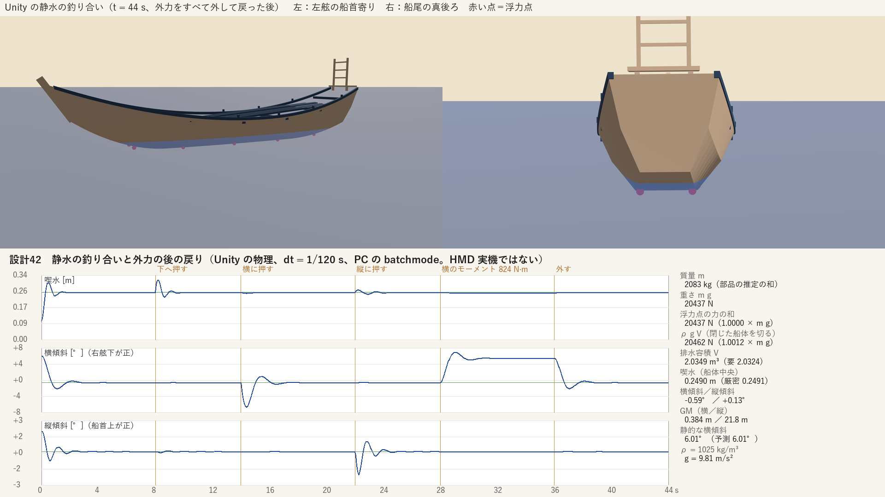

# 設計42：静水で重量・排水容積・重心を合わせる ― 座席の船を船底の浮力点 10 で静水に浮かべ、釣り合いの喫水と姿勢、外力の後の戻りを Unity の物理で出す。最小の受入 2 つは満たした

日付：2026-09-30／状態：**閉じた（使える水準。最小の受入 2 つを満たした。HMD の確かめは保留）**。修正は 0 回（Q26 の 1 回は使っていない）。証拠の種類は次のとおり。**HMD 実機の結果ではない。利用者は確かめていない。**

- 作る部：numpy の前計算（`ds42_hydro.py`。設計41 の浮力用の閉じた船体から、重量・重心・慣性、厳密な静水の釣り合い、浮力点の表を作る）、Unity 6000.4.3f1 の Editor の batchmode（`DS42BuoyancyTest.Run`。物理を手で進め、PC でオフスクリーン描画。RTX 3080、Direct3D11）、図と動画の道具（`ds42_report.py`、ffmpeg）。
- 進行役の独立の検査：作る部のコードを使わずに書いた numpy の道具（リポジトリの外で書き、写しは Git 対象外の `Unity/Build/Design/42/indep_check/`）。浮力用の閉じた船体を自前の三角形の切り方で Unity の釣り合いの姿勢に置いて容積を測り、自前の Newton 法で釣り合いを解き直し、±1° の傾けで GM を測り、時系列から戻りを数え直し、動画のコマを切り出して見た。判定は pass、必須の指摘 0。
- 記録の道具 `ds42_record.py`：作る部の SHA-256 の照合（31 件）、tracked のファイルの変更の確かめ（0）、作る部の図の道具を使わない時系列からの数え直し、証拠の写し、記録の metrics.json・run.json。

番号の前提：

- 対象：[段階9までの実行計画](../Design/Stage9_Plan_2026-09-26_ja.md)（以下「計画」）§2.4 の設計42。使える水準の成果物は「Unity の C# で船底に浮力点を置き、静水で釣り合う喫水と姿勢、外力の後の戻りを出す」。最小の受入は「浮力 ≈ 水密度 × 重力 × 排水容積 と重量の釣り合いを数値で記録。戻りの動画」。依存は設計41、バックログは 89（記録）。[制作設計書](../Design/GreatWave_VR_Production_Design_ja.md) §7.2 の「静水で `浮力 ≈ 水密度 × 重力 × 排水容積` と船の重さが釣り合うことを確認してから波へ進む」に当たる。
- 引き継ぎ：[設計41](Design_41_ja.md) の浮力用の閉じた船体 `Boat41_Buoyancy`（`Unity/Build/Design/41/model/blender/ds41_boat_geom.npz`、`c516589f…`）、浮力点の案 10 点（5 断面 × 左右）、プレハブ `DS41_Oshiokuri.prefab`、調べの表の推定（質量 2.0 t・1.6〜3.1 t、喫水 0.20 m・0.16〜0.30 m）。主役波・周りの海・段階6・7 の成果（[設計28修正01](Design_28_修正01_ja.md)〜[設計40](Design_40_ja.md)）は使っていない。
- 時間の上限：Q26 の日程で 2 時間（計画 §2.6 の［Q26］の表、10/3 の行。計画の時間枠は ≤0.5 日）。範囲は最小の受入だけで、修正は 1 回まで。
  - 実績（ファイルの時刻。[metrics.json](../Evidence/Design/42/metrics.json) の `time`）：着手の時刻はファイルに残らない（設計41 の独立の検査の終わり 10:08:30 より後）。最初のフォルダー（`Tools/GWWaveGen/ds42/`・`Unity/Build/Design/42/`）10:17:22、`ds42_params.json` 10:20:10、`ds42_hydrostatics.json` 10:20:57、Unity の実行 10:30:32〜10:30:57（ログの開始と設定の戻しの記録）、作る部の最後のファイル（metrics.json・run.json）10:31:20。進行役の独立の検査 10:34:48〜10:35:16（道具とコマの切り出しのファイルの時刻）。記録 10:39:05（最初の記録のファイル）〜（終わりは `Unity/Build/Design/42/READY_TO_COMMIT.txt` の時刻）。最初のフォルダーから作る部の最後の出力まで約 14 分で、2 時間の上限の内。
  - 作る部の報告は「2 時間の内の約 1.5 時間」で、ファイルの時刻と合わない（第 9 節の 7）。記録はファイルの時刻を使った。
  - 1 回の計算：Unity の実行の中の時間 18.4 s（`DS42_TEST_DONE frames=1321 protectedUnchanged=True stepUs=13.3 seconds=18.4`）、Unity のプロセスは約 25 s。前計算 0.5 s（`ds42_hydrostatics.json` の `seconds`）、図と動画 23.2 s（作る部の run.json の `seconds_report`）。どれも 30 分の上限より十分短い。
- 読むだけで変えていないもの：原画視点の場面 `DS41_Boats.unity` と `DS39_Paper.unity` は開いていない（Unity のログにこの 2 つの名前は 0 回）。設計41 のプレハブ・FBX、美術優先27 の材質 2 つ、設計30 の `DS30BoatHeave.cs` と `boat_support.json`、座席 v1 の `seat_v1.json` の 9 ファイルは、実行の前後で SHA-256 が同じ（`protectedUnchanged` true、`changedFiles` 空）。ProjectSettings は実行の前後でバイトが同じ（戻したファイル 0）。`Physics.simulationMode` は FixedUpdate に戻した。記録の時の `git status`（tracked のファイル）も変更 0。
- **原画視点に触れていないので、計画 §2.0 の回帰の規則（評価器を回して合格した項目を後退させない）は当てはまらない。** 評価器は回していない。
- 座標と単位：m・s・kg・N。物理の根（Rigidbody の GameObject）は縮尺 1、原点は船体中央の船底、+z 船首、+y 上、+x 右舷。表示のモデル（設計41 のプレハブ）は子に縮尺 s = 1.13284 m／単位（座席の船 boat\_mid の根の縮尺、先端間 11.328 m）で置く。喫水は船体中央の船底の水面からの深さ、横傾斜は右舷が下がる向き、縦傾斜は船首が上がる向きが正。
- 使っていないもの：AGENTS.md の禁止の場所と、読み取りのみの例外（参照モデル・利用者の解算・写真・爪の分析）は、作る部・検査・記録のどれも開いていない。ウェブも読んでいない。

## 見るもの

| 釣り合いと戻り（上：44 s の Unity の描画、左は左舷の船首寄り・右は船尾の真後ろ、赤い点が浮力点。下：喫水・横傾斜・縦傾斜の時間の変化と数値の欄） |
| --- |
|  |

- **戻りの動画**：[ds42\_recovery.mp4](../Evidence/Design/42/ds42_recovery.mp4)（1920 × 1080、30 fps、1321 コマ、44.03 s、H.264、3,328,291 バイト）。上は世界に固定した 2 つの視点（各 960 × 540）、下は喫水・横傾斜・縦傾斜のグラフと時刻の線、右は数値の欄。水は半透明で、船底の浮力点 10 が見える。PC の batchmode の描画で、HMD ではない。
  - 0 s：釣り合いより 0.15 m 上・横 6°・縦 2° で放す → 8 s：下向きの力積 → 14 s：横の角力積 → 22 s：縦の角力積 → 28〜36 s：一定の横のモーメント 824 N·m（70 kg の人が中心線から 1.2 m の船縁に寄った時の代わり）→ 36 s：外す → 44 s まで。
- 動画のコマ：[下向きの力積の後 t = 8.20 s](../Evidence/Design/42/fig_ds42_frame_heave_t08.20.png)・[横の角力積の後 t = 14.50 s](../Evidence/Design/42/fig_ds42_frame_roll_t14.50.png)（左舷が下がる）・[一定の横のモーメントの間 t = 35.50 s](../Evidence/Design/42/fig_ds42_frame_static_heel_t35.50.png)（右舷が下がる）。
- 静止画（1920 × 1080）：Python の厳密な釣り合いの姿勢に置いた実行の前の船（[左舷の船首寄り](../Evidence/Design/42/ds42_still_python_eq_port_bow.png)・[船尾の真後ろ](../Evidence/Design/42/ds42_still_python_eq_stern.png)）と、Unity の物理で 44 s 動かした後の船（[左舷の船首寄り](../Evidence/Design/42/ds42_still_unity_end_port_bow.png)・[船尾の真後ろ](../Evidence/Design/42/ds42_still_unity_end_stern.png)）。2 組の違う画素（RGB のどれかが 24/255 を超える）は 15,876・34,774 画素（1920 × 1080 の 0.8%・1.7%）で、船の輪郭に沿った細い縁だけ（首振りと横の位置のずれ。第 2.5 節）。水線の高さの違いは見えない。

数値：

- [metrics.json](../Evidence/Design/42/metrics.json)（記録）：最小の受入 `acceptance`、バックログ `backlog`、記録の照合 `record_crosscheck`、修正 `fix_rounds`、時間 `time`、引き継ぎ `handoffs_ja`
- 作る部の写し：[ds42\_buoyancy\_metrics.json](../Evidence/Design/42/ds42_buoyancy_metrics.json)（釣り合い・姿勢・戻り・静的な横傾斜・周期）、[ds42\_hydrostatics.json](../Evidence/Design/42/ds42_hydrostatics.json)（部品ごとの質量 29、慣性、柱の積分、厳密な釣り合い、浮力点、減衰、水平の水面の排水量の表 14 行）、[ds42\_unity\_report.json](../Evidence/Design/42/ds42_unity_report.json)（Unity の設定・出来事・浮力点の位置）、[ds42\_unity\_series.json](../Evidence/Design/42/ds42_unity_series.json)（30 Hz × 1321 の時系列）、[ds42\_buoyancy\_run.json](../Evidence/Design/42/ds42_buoyancy_run.json)
- 進行役の独立の検査：[ds42\_indep\_check.json](../Evidence/Design/42/ds42_indep_check.json)（記録の時に回し直した出力の行）
- 記録の道具の数え直し：[ds42\_record\_recount.json](../Evidence/Design/42/ds42_record_recount.json)
- 実行条件と SHA-256：[run.json](../Evidence/Design/42/run.json)

## 0. 結論

1. **最小の受入 1：浮力と重量の釣り合いを数値で記録した。** Unity の釣り合い（放してから 7〜8 s の平均）で、重さ m g = 2083.2 kg × 9.81 = 20,436.6 N に対し、浮力点の力の和 20,436.6 N（1.0000 × m g）、浮力用の閉じた船体を水面で切った容積 V = 2.03492 m³ からの ρ g V = 20,461.6 N（1.0012 × m g）。要る容積 m／ρ = 2.03243 m³（ρ = 1025 kg/m³、g = 9.81 m/s²）。容積は 3 つの別の計算で 0.18% の内で合う（Unity の網の切り方 2.03492、Python の柱の積分 2.0324、独立の検査の切り方 2.03136 m³）。浮心と重心の水平の距離は 1.6 mm（Unity）・0.17 mm（独立の検査）。
2. **最小の受入 2：戻りの動画を作った。** 放した後・下向きの力積・横の角力積・縦の角力積・一定の横のモーメントを外した後の 5 つの出来事で、船は元の釣り合いへ戻る（最後の 1 s のずれは喫水 1 × 10⁻⁶ m 以下、角 0.00103° 以下（最大は縦の角力積の後）。10% まで戻る時間 1.0〜1.9 s）。
3. **Unity の物理の釣り合いは、Python の厳密な釣り合いと合う。** 喫水 0.24904 m（厳密 0.2491 m、差 −0.06 mm）、横傾斜 −0.5889°（−0.5857°、差 −0.0032°）、縦傾斜 +0.1284°（+0.1288°、差 −0.0004°）。独立の検査の Newton 法（喫水 0.24914 m・横 −0.5870°・縦 +0.1287°）とも 0.1 mm・0.002° の内。乾舷は船体中央で 0.633 m。
4. **静的な横傾斜は GM の予測と合う。** 824 N·m で 6.011°（平衡からの増え、34〜36 s の平均）、厳密な GM_T 0.3844 m からの予測 6.009°（差 +0.03%）。独立の検査の GM_T は 0.3842 m。
5. **質量・重心はすべて推定**（資料の値はない）。部品ごとの和 2083.2 kg（木部 1098.1 kg・乗員 10 人 600 kg・帆柱と道具と荷 385 kg）、重心の高さ KG 0.602 m、船体中央より 0.40 m 船尾側。設計41 の推定 2.0 t を右船の縮尺へ直した 1830.8 kg より 13.8% 重いが、資料の範囲 1.6〜3.1 t の内。
6. **物理の釣り合いの喫水 0.249 m は、座席 v1 の置き方の喫水 0.3806 m より 132 mm 浅い。** 原画視点の船（投影固定）は動かしていない。表示の船と物理の船のそろえ方は設計43 で決める。
7. **原画視点と評価器には触れていない**（新しい検査の場面 `DS42_Buoyancy.unity` だけ）。HMD（PS VR2）の確かめは保留（導入は利用者の手。この番号の最小の受入に HMD の項目はない）。
8. **限界（第 4 節）**：付加質量なし（周期が短い）、減衰は調整値、約 7° を超える傾きは確かめていない、静水で 0.59° 左舷へ傾く（櫓の左右差）、PlayMode の道（Awake → FixedUpdate）は回していない、首振りと横の位置が少しずれる、など。設計43〜45、仕上げ41・43 へ送った。

---

## 1. 目的

設計書 §7.2 は、船底に複数の浮力点を置き、排水容積の近似・重心・抵抗を調整し、静水で `浮力 ≈ 水密度 × 重力 × 排水容積` と船の重さが釣り合うことを確かめてから波へ進むことを求める（初期の準静的な模型で、砕波の衝撃を再現するものではない）。計画 §2.4 の設計42 は、これを Unity の C# で使える水準で行い、静水の喫水・姿勢・外力の後の戻りを出す番号である。§7.3 の役割の分け方（物理の根の下に表示、乗客の側は兄弟の根）に合わせ、物理の根に Rigidbody と浮力の部品を付け、表示のモデルを子に置いた。乗客の側（RiderComfortRoot）と頭部の追跡には触れない（設計45）。

Q26 により、最小の受入だけを満たし、修正は 1 回までとした。

---

## 2. 表

### 2.1 重量と重心（すべて推定）

値は [ds42\_hydrostatics.json](../Evidence/Design/42/ds42_hydrostatics.json) の `mass`、パラメータは `Tools/GWWaveGen/ds42/ds42_params.json`（`bd7cbb59…`）。位置は物理の根の局所（m）。

| 部品 | 質量 | 決め方（推定） |
| --- | --- | --- |
| 航（船底板） | 250.4 kg | 設計41 の船殻の網の船底の面積 10.43 m² × 板厚 0.06 m × 杉 400 kg/m³ |
| 根棚・上棚・戸立（舷の板） | 349.5 kg | 面積 24.96 m² × 0.035 m × 400 kg/m³ |
| 床（敷板） | 199.9 kg | `Boat41_Floor` の閉じた網の体積 0.4999 m³ × 400 kg/m³ |
| 船梁 6 本・船縁 左右・水押 | 59.3・38.4・38.4・6.4 kg | 網の体積 × 500 kg/m³ |
| 船尾の床・船尾の梯子状の枠 | 12.8・4.4 kg | 網の体積 × 400 kg/m³ |
| 櫓 7 丁（左舷 4・右舷 3） | 19.8 kg × 7 | 網の体積 0.0248 m³ × 800 kg/m³（樫と見た） |
| 乗員 10 人 | 60 kg × 10 | 漕ぎ手 8＋船首側 2（設計41 の調べの S8）。かがんだ重心を床の 0.35 m 上、横は中心線の上。漕ぎ手は船尾側の約半分に等間隔 |
| 帆柱 3 本（寝かせて船梁の上） | 75 kg | 資料は着脱式 3 本（設計41 の S1）、原画では立っていない（P7）。1 本 25 kg |
| 帆・綱・道具 | 60 kg | 帆 6 反（S2）など |
| 荷（鮮魚・生簀の水など） | 250 kg | 設計41 の調べの荷 0〜1 t の低めの値。船首寄りの枠（P5）の下 |
| **合計** | **2083.2 kg** | 部品 29 の和（独立の検査の足し算 2083.1 kg） |

| 値 | Python（`ds42_hydro.py`） | 独立の検査 |
| --- | --- | --- |
| 重心（局所 x, y, z） | (−0.0042, 0.6023, −0.4013) m | 部品から (−0.0042, 0.6022, −0.4014) m |
| KG（重心の船底からの高さ） | 0.602 m | — |
| 縦の位置 | 船体中央より 0.401 m 船尾側 | — |
| 慣性半径（横揺れ・縦揺れ・首振り） | 0.600・2.670・2.684 m | — |
| 設計41 の推定との比べ | 2.0 t（1.6〜3.1 t）を右船の縮尺へ直すと 1830.8 kg。模型は +13.8% | — |

- 重心は中心線より 4.2 mm 左舷（−x）にある。櫓が左舷 4・右舷 3 だから。これが静水の横傾斜 −0.59° になる（第 4 節の 3）。
- 慣性は重心のまわりで、船殻は三角形ごとの点の質量、ほかの部品は点の質量と直方体の広がり、乗員はそれに自分の慣性半径 0.25 m を足して出した。Unity へは主軸の値 (744.49, 14854.31, 15013.05) kg·m² と主軸の回転（単位ではない四元数）で入れた。

### 2.2 厳密な静水の釣り合い（Python）

値は `ds42_hydrostatics.json` の `columns`・`exact_equilibrium`。

- 方法：浮力用の閉じた船体を鉛直の柱（0.02 単位おき、39,826 本）に分けて積分し、ρ V s³ = m と「浮心と重心が同じ鉛直線に並ぶ」を Newton 法で解く（喫水・縦傾斜・横傾斜）。柱の積分の全体の容積 10.6571 単位³ は閉じた網の体積 10.65703 単位³ と 2.3 × 10⁻⁶ の比で合い、釣り合いの容積は三角形を水面で切る方法と −2.0 × 10⁻⁶ の比で合う。

| 値 | 厳密な釣り合い |
| --- | --- |
| 喫水（船体中央） | 0.2491 m |
| 水線の船底からの高さ（船首側 y −4 単位・船尾側 y +4 単位） | 0.239・0.2593 m |
| 縦傾斜・横傾斜 | +0.1288°・−0.5857° |
| 排水容積・浮力 | 2.0324 m³・20,436.6 N（重さ 20,436.6 N） |
| 水線面積・1 cm 沈める重さ | 10.4831 m²・107.45 kg |
| KB・BM_T・BM_L | 0.1384・0.8414・22.109 m |
| GM_T（式 KB + BM − KG／1° の数値の微分） | 0.3775／0.3844 m |
| GM_L（同じ） | 21.6451／21.7642 m |
| 乾舷（船体中央） | 0.6333 m（設計41 の推定 0.709 m） |
| 座席 v1 の置き方の喫水（`seat_v1.json`。M1 の blockout の規則 0.35 × 0.96 m × 縮尺） | 0.3806 m |
| 設計41 の喫水の推定 | 0.20 m（0.16〜0.30 m） |

- GM_T の式の値と数値の値は 0.0069 m 違う。復原の硬さには数値の値（1° の傾けで測った）を使った。独立の検査の ±1° の傾けは 0.3842 m。
- 水平の水面での排水量の表（喫水 0.057〜0.793 m の 14 行）は `ds42_hydrostatics.json` の `curves_level_water`。

### 2.3 浮力点（Unity の C#）

値は `ds42_hydrostatics.json` の `points` と [ds42\_unity\_report.json](../Evidence/Design/42/ds42_unity_report.json) の `pointsLocal`。表の本体は `Unity/Assets/GreatWave/Design42/Data/ds42_buoyancy_points.json`（`599e6c67…`、158,835 バイト）。

- 置き方：設計41 の提案の 5 断面（Blender の y = −3・−1.5・0・1.5・3 単位）を区画の中心にし、区画の境は断面の中点、左右は中心線で分けた 10 の区画。各点は 1 区画を受け持つ。
- 各点の表：その点での水面の高さ（船の局所の上向きに沿って測る。0.01 単位おきに 170 段）ごとの、区画の排水容積 V・浮心 C・水線面積 A。
- 力：`DS42Buoyancy.Step` が、点ごとに ρ g V を鉛直の上向きに区画の浮心へ加える。抵抗（数値の条件）は、点ごとの鉛直の速度に比例する力（水線面積の比で配る）、重心での水平の抵抗、首振りの減衰。
- 点の横の位置は、平衡の水線の半区画の r²／x̄ にした（横揺れの硬さを厳密値に合わせる）。縦の位置は区画の水線面の中心 × y\_factor 1.0622（縦揺れの硬さを厳密値に合わせる倍率）。高さはその位置の船底。
- 浮力点の模型を Python で解いた釣り合い：喫水 0.249 m（厳密との差 −0.1 mm）、横 −0.5887°、縦 +0.1284°。その姿勢の厳密な浮力 ÷ 重さ 0.99948。横揺れの硬さ −0.71%、縦揺れの硬さ 2.6 × 10⁻⁷（厳密値との比）。

| 点（断面・舷） | 局所の位置 x, y, z（m） | 釣り合いの区画の容積 |
| --- | --- | --- |
| 0 左舷・右舷（船首側 y −3） | (−0.296, 0.077, 3.215)・(0.292, 0.077, 3.215) | 0.0656・0.0634 m³ |
| 1（y −1.5） | (−0.451, 0, 1.745)・(0.448, 0, 1.743) | 0.2428・0.2366 m³ |
| 2（y 0） | (−0.532, 0, −0.021)・(0.527, 0, −0.019) | 0.2869・0.2818 m³ |
| 3（y +1.5） | (−0.511, 0, −1.797)・(0.513, 0, −1.799) | 0.2768・0.2734 m³ |
| 4 船尾側（y +3） | (−0.397, 0.071, −3.577)・(0.400, 0.071, −3.575) | 0.1479・0.1457 m³ |

- 減衰（調整値、物理の実測ではない）：上下の減衰比 0.3 から点ごとの鉛直の減衰 8891.3 N·s/m（その結果の横揺れの減衰比の見積もり 0.40、縦揺れ 0.25）、水平の抵抗 速度 × 質量 × 0.5 /s、首振り 角速度 × 慣性 × 0.8 /s。
- 硬さと剛体の周期（付加質量なし）：上下 105,410.7 N/m・0.8833 s、横揺れ 7,856.8 N·m/rad・1.9422 s、縦揺れ 444,786 N·m/rad・1.1482 s。

### 2.4 釣り合い（Unity と Python）

値は [ds42\_buoyancy\_metrics.json](../Evidence/Design/42/ds42_buoyancy_metrics.json) の `balance`・`equilibrium_pose`（Unity は 7〜8 s の平均）、独立の検査は [ds42\_indep\_check.json](../Evidence/Design/42/ds42_indep_check.json)。記録の道具が時系列から数え直した値（[ds42\_record\_recount.json](../Evidence/Design/42/ds42_record_recount.json)）も同じ。

| 値 | Unity の物理 | Python の厳密 | 独立の検査 |
| --- | --- | --- | --- |
| 重さ m g | 20,436.6 N | 20,436.6 N | 20,436.6 N |
| 浮力点の力の和 | 20,436.6 N（0.99999975 × m g） | — | 同じ（0.9999998） |
| 閉じた船体を水面で切った容積 V | 2.03492 m³（Unity の網） | 2.0324 m³（柱の積分） | 2.03136 m³（npz の三角形を自前で切る） |
| ρ g V ÷ m g | 1.0012 | 1.0000 | 0.9995 |
| 浮心と重心の水平の距離 | 1.6 mm | — | 0.17 mm |
| 静止した時の減衰の力 | 0.004 N | — | — |
| 喫水 | 0.24904 m | 0.2491 m | 0.24914 m |
| 横傾斜 | −0.5889° | −0.5857° | −0.5870° |
| 縦傾斜 | +0.1284° | +0.1288° | +0.1287° |

- Unity の網の切り方の +0.12% は、FBX で四角形を三角形へ分ける分け方の違いによる（全体の容積 Unity 15.5127 m³、Python の柱と独立の検査の npz 15.493 m³）。独立の検査の −0.05% との幅 0.18% も同じ理由と読む。
- 浮力点の力の和が m g にちょうど合うのは、静止した時は力の釣り合いで決まるから（作り方による一致）。閉じた船体を切った ρ g V は、浮力点の表と別の計算なので、こちらが「浮力 ≈ 水密度 × 重力 × 排水容積」の確かめになる。
- 符号の確かめ（独立の検査）：heel = asin(−right.y)、trim = asin(forward.y)、オイラー角 (−trim, 0, −heel) で元に戻る。

### 2.5 外力の後の戻り（Unity）

値は `ds42_buoyancy_metrics.json` の `recovery`・`static_heel`・`periods`、出来事は `ds42_unity_report.json` の `events`。物理は `Physics.simulationMode = Script` で dt = 1/120 s に手で進めた。

| 出来事 | 与えたもの | 最大のずれ | 10% まで戻る時間 | 最後の 1 s のずれ |
| --- | --- | --- | --- | --- |
| 0 s 放す | 釣り合いより 0.15 m 上・横 6°・縦 2° | 喫水 0.1499 m・横 6.585°・縦 1.872° | 1.033・1.5・1.4 s | 1 × 10⁻⁶ m・0.0001°・0.00007° |
| 8 s 下向きの力積 | 1,481.9 N·s（目標の沈み 0.1 m、減衰なしの見積もり） | 喫水 0.06555 m | 1.2 s | 1 × 10⁻⁶ m |
| 14 s 横の角力積 | 423.9 N·m·s（目標 10°） | 横 6.0655° | 1.867 s | 0.0004° |
| 22 s 縦の角力積 | 4,256.0 N·m·s（目標 3°） | 縦 2.160° | 1.633 s | 0.00103° |
| 36 s 横のモーメントを外す | 28〜36 s に 824 N·m、36 s に外す | 横 5.985° | 1.467 s | 0.00008° |

- 許すずれ（最後の 1 s の平均：喫水 1 mm・角 0.05°）は作る部が決めた閾値で、計画の最小の受入にはない。5 つとも満たした。独立の検査が時系列から数え直した最大のずれと最後の 1 s のずれも同じ（喫水 ≤ 1.2 × 10⁻⁵ m、角 約 0.001° 以下）。43〜44 s の平均は釣り合いの値に戻る（喫水 0.24904 m・横 −0.58892°・縦 0.1284°）。
- 静的な横傾斜：824 N·m で 6.0111°（34〜36 s の平均 5.4221° − 釣り合い −0.5889°）。予測は ρ g V GM_T（1° の数値の微分、0.3844 m）から 6.009°（差 +0.03%）。測った横傾斜から逆に出した GM_T は 0.3843 m。独立の検査の GM_T 0.3842 m と atan の式での予測は 5.9905°。
- 見かけの周期（Unity、減衰のある振動のゼロ交差の間隔 × 2）：上下 0.912 s、横揺れ 2.109 s、縦揺れ 1.178 s。付加質量なしの剛体の値（0.8833・1.9422・1.1482 s）より少し長いのは減衰による。
- 浮かんでいる点の数：t = 0 の記録は 0（最初の Step の前に記録した値）、0.033 s で 8、0.067〜0.1 s で 9（放した直後、傾いて 1〜2 点が水の上へ出た）、その後はすべて 10。
- 首振りと横の位置：釣り合いの窓（7〜8 s）で首振り 0.415°・横の位置 x 0.072 m、最大 0.741°（28.87 s、一定の横のモーメントをかけ始めた所）、終わり 0.567°・x 0.073 m。首振りの戻す力はなく、首振りの減衰だけ（第 4 節の 7）。
- 動きの重さ：浮力の Step は 1 回平均 13.3 µs（10 点）。

### 2.6 作り方と採ったもの（Q24。進行役の判断で、利用者の決定ではない）

- **座席の船（右船 boat\_mid）の縮尺 1.13284 m／単位で浮かべる。** 理由：座席 v1 の船で、設計43〜45 がこの船を使う。落とした：資料の全長 11.667 m の縮尺（右船は資料より 2.9% 短い。設計41）。
- **乗員は中心線の上に置く。** 理由：原画の漕ぎ手の左右の並びは読めない。左右に分けるのは仕上げ41 ②（乗員 G25）で扱う。結果として櫓の左右差で 0.59° 左舷へ傾く（第 4 節の 3）。
- **浮力点は設計41 の提案の 5 断面 × 左右の 10 点で、各点に区画の表を持たせ、横と縦の位置で復原の硬さを厳密値に合わせる。** 理由：点の数を増やさずに、Python の厳密な釣り合いと静的な横傾斜を合わせられる。落とした：点ごとに固定の容積の球などを置く簡単な近似（硬さが合わない）。
- **減衰は調整値**（上下の減衰比 0.3、水平 0.5 /s、首振り 0.8 /s）。理由：静水の戻りを数秒で見せるため。物理の実測ではない。
- **物理の根の下に表示のモデル**（設計書 §7.3 の BoatSimulationRoot と BoatVisualRoot の形）。乗客の側（RiderComfortRoot）は作らない（設計45）。
- **水面は差し替えられる型 `DS42Water`（`HeightAt(世界の点)`）にし、設計42 は静水 `DS42StillWater` だけを使う。** 理由：設計43 で、設計30 のうねりと主役波のシートの下側を同じ入口から読むため。
- **検査は新しい場面 `DS42_Buoyancy.unity` で行い、原画視点の場面は開かない。** 理由：評価器の回帰の規則の対象にしないで最小の受入を示せる。

---

## 3. 関門

| 最小の受入・規則 | 基準 | 値 | 判定 |
| --- | --- | --- | --- |
| 浮力 ≈ 水密度 × 重力 × 排水容積 と重量の釣り合いを数値で記録 | 記録 | m g 20,436.6 N、浮力点の和 20,436.6 N、閉じた船体の ρ g V 20,461.6 N（1.0012）、独立の検査 20,425.8 N（0.9995） | 合格（記録した） |
| 戻りの動画 | 動画がある | `ds42_recovery.mp4`（1920 × 1080、30 fps、44.03 s）。5 つの出来事で釣り合いへ戻る | 合格 |
| Unity と Python の厳密な釣り合いの差（作る部の閾値：喫水 ±5 mm・角 ±0.2°） | 記録（計画の外） | −0.06 mm・−0.0032°・−0.0004° | 満たした |
| 戻りの最後の 1 s のずれ（作る部の閾値：1 mm・0.05°） | 記録（計画の外） | ≤ 1 × 10⁻⁶ m・≤ 0.00103° | 満たした |
| 静的な横傾斜と GM の予測 | 記録 | 6.011°／6.009° | 記録した |
| 計画 §2.0 の回帰なし | 原画視点に触れた時だけ | 原画視点の場面・評価器の入力は開いていない。tracked の変更 0 | 対象外 |
| 守るファイル・ProjectSettings | 変えない | 9 ファイルが同じ、`changedFiles` 空、設定の戻し 0、`simulationMode` は FixedUpdate に戻した | 合格 |
| バックログ 89 | 記録 | 静水の喫水 0.249 m・横 −0.59°・縦 +0.13°、ρ g V／m g 1.0012 | 記録のみ（判定は設計43・仕上げ43） |
| HMD（PS VR2） | — | — | 保留（導入は利用者の手。船の揺れの HMD の確かめは設計45） |

---

## 4. 限界

1. **物理の釣り合いの喫水 0.249 m は、座席 v1 の置き方の喫水 0.3806 m より 132 mm 浅い。** 原画視点の船は設計41 の投影固定のまま（設計42 では動かしていない）。t\* の姿勢を投影固定のまま保つか、表示の船を物理の喫水へ置き直すかは設計43 で決める。
2. **付加質量を入れていない。** 周期は剛体の値（横揺れ 1.94 s、Unity の見かけ 2.11 s）で、実際の船より短いと読む。横揺れの慣性半径 0.60 m は右船の幅（設計41 の 2.413 m）の約 0.25 倍で、乗員を中心線の上に置いたので小さいと読む（独立の検査の読み）。設計45（快適さ）と仕上げ43。
3. **静水で 0.59° 左舷へ傾く**（櫓が左舷 4・右舷 3 で、重心が中心線より 4.2 mm 左舷）。乗員の配置で打ち消すかは仕上げ41 ②。
4. **質量・重心・板厚・密度・乗員・荷は推定**（資料の値はない）。杉 400 kg/m³・舷の板 3.5 cm・航 6 cm・櫓 800 kg/m³・乗員 60 kg × 10（重心は床の 0.35 m 上）・荷 250 kg。KG 0.602 m で GM_T 0.384 m になり、70 kg の人が船縁へ寄ると 6° 傾く。合計 2083 kg は設計41 の推定 2.0 t を縮尺へ直した 1830.8 kg より 13.8% 重い（資料の範囲 1.6〜3.1 t の内）。仕上げ43。
5. **減衰は調整値**（上下の減衰比 0.3、その結果の横揺れ約 0.40・縦揺れ約 0.25、水平 0.5 /s、首振り 0.8 /s）で、物理の実測ではない。
6. **浮力点の模型は約 7° の横傾斜と 2° の縦傾斜までしか確かめていない。** 区画ごとに水面を船の局所で水平と見なす近似。船縁が水に入る大きな傾き（乾舷 0.633 m）は確かめていない。
7. **首振りと横の位置が少しずれる**（44 s で 0.567°・x 0.073 m。ほとんどは 0〜8 s の放した後と 28 s の横のモーメントの始まり）。首振りに戻す力はなく、慣性の主軸が根の軸と一致しない（主軸の回転が単位でない）ので、横と縦の動きが首振りへ少し移ると読む（切り分けていない）。静水では問題にならないが、設計44（前進・旋回）の前に知っておく。
8. **PlayMode の道は回していない。** `DS42_Buoyancy.unity` を PlayMode で動かす道（Awake → Init、FixedUpdate → Step）は確かめておらず、batchmode の Editor で Step と `Physics.Simulate` を手で呼ぶ道だけを確かめた。
9. **水面は静水だけ。** `DS42Water` は設計43 の入口で、設計30 の周りの海の式と主役波のシートの下側はまだつないでいない。
10. **HMD の確かめは保留**（PS VR2 の導入は利用者の手）。Mock の両眼も描いていない（原画視点・座席の場面に触れない番号のため）。
11. **t = 0 の時系列の記録は浮かぶ点 0・力の和 0 N**（最初の Step の前の値）。見た目だけの問題。
12. 崩壊は作らない（Q11）。

---

## 5. 修正の記録（Q26：修正は 1 回まで）

| 回 | 変えたこと | 結果 |
| --- | --- | --- |
| 作る部（10:17:22〜10:31:20） | 前計算、浮力の部品と検査の場面、Unity の実行、図と動画 | 最小の受入を満たした。修正の回は使わなかった |
| 作る部の中の直し（提出の前） | 右舷の浮力点の x の符号が逆で、点の模型が横揺れで不安定だった。Python の点の模型の確かめで見つけて直した（Unity の実行の前）。カメラと水面の枠を 1 回直した（作る部の報告） | Unity の実行は少なくとも 2 回と読む：材質と場面の .meta が 10:25:36〜10:25:56 にでき、`DS42BuoyancyTest.cs` は 10:27:03、`ds42_report.py` は 10:30:23 に書き換わり、残るログは同じ名前で上書きされた 10:30:32 の 1 つ。作る部の run.json の手順は最後の 1 回だけ |
| 進行役の独立の検査（10:34:48〜10:35:16） | 自前の容積の切り方、Newton 法、GM、時系列、動画のコマ | pass、必須の指摘 0。記録の指摘 6（第 9 節） |
| 記録（10:39:05〜） | `ds42_record.py` で照合と数え直し、証拠を作った | 作品には触れていない |

- 修正の回数は 0。

---

## 6. 引き継ぎ

**設計43**（船用水面データで小波へ反応）：`DS42Water` の子として、設計30 のうねり（`Unity/Build/Design/30/sea/sea_function.json`）と主役波のシートの下側の一価の面を同じ時計で読む。物理の喫水 0.249 m と座席 v1 の置き方の喫水 0.3806 m の差 132 mm（限界 1）。今の表示の船の上下は設計30 の `DS30BoatHeave`（`boat_support.json`、上下の加速度 最大 5.97 m/s²、設計30 の記録）のままで、設計42 の物理とはまだつながっていない。

**設計44**（前進・減速・旋回・停止）：首振りと横の位置のずれ（限界 7）。前進・旋回の抵抗は今は水平 0.5 /s・首振り 0.8 /s の調整値だけ。

**設計45**（乗客の揺れ）：GM_T 0.384 m、70 kg の人が船縁で 6.0°、横揺れの周期 1.94 s（剛体）・2.11 s（Unity の見かけ）、慣性半径 0.60 m（限界 2・4）。減衰は調整値。HMD の確かめは保留。

**仕上げ43**（計画 §5 の「海面が変わる間の船の浸かり方」、バックログ 89・90・203）：重量・重心の推定、付加質量、減衰、大きな傾きの浮力点の模型（限界 2・4〜6）。作る部の JSON と文にある「仕上げ42」は計画 §5 にない群なので、89 を持つ仕上げ43 へ入れる（進行役の判断）。

**仕上げ41 ②**（乗員 G25）：乗員の左右の配置と静水の横傾斜 −0.59°（限界 3）。

**段階8確認（自己評審）**：最初に[釣り合いの図](../Evidence/Design/42/fig_ds42_equilibrium.png)と[戻りの動画](../Evidence/Design/42/ds42_recovery.mp4)、第 2.4 節の表を見る。

---

## 7. 再現

リポジトリの根で行う。前提（どれも Git 対象外）：設計41 の出力 `Unity/Build/Design/41/model/blender/ds41_boat_geom.npz`・`ds41_blender_report.json`、`Unity/Build/Design/41/model/unity/ds41_build_report.json`、`Unity/Build/Design/41/research/oshiokuri_dimensions.json`（SHA-256 は [run.json](../Evidence/Design/42/run.json) の `inputs_sha256`）。

道具は `py -3.10`（Python 3.10.6、numpy 2.2.6、Pillow 12.0.0）、Unity 6000.4.3f1（batchmode、`Unity/Build/unity.lock` で排他）、ffmpeg（`G:/ffmpeg-2024-12-19-git-494c961379-full_build/bin/ffmpeg.exe`）。

1. 前計算：`py -3.10 -B Tools/GWWaveGen/ds42/ds42_hydro.py`（0.5 s。`Unity/Build/Design/42/buoyancy/ds42_hydrostatics.json` と、Unity の表 `Unity/Assets/GreatWave/Design42/Data/ds42_buoyancy_points.json` を書く）
2. Unity：`powershell -NoProfile -ExecutionPolicy Bypass -File Tools/GWWaveGen/ds42/run_ds42_unity.ps1 -Method GreatWave.Design42.EditorTools.DS42BuoyancyTest.Run -Log run`（約 25 s。検査の場面 `DS42_Buoyancy.unity` を作って保存し、44 s を dt = 1/120 s で進め、30 fps ごとに 2 つの視点の JPG と時系列を書く。ProjectSettings は控えと比べて戻す）
3. 図と動画：`py -3.10 -B Tools/GWWaveGen/ds42/ds42_report.py`（23.2 s。動画・図・metrics.json・run.json を書き、中間の JPG 2,642 枚を消す）
4. 独立の検査：`py -3.10 -B Unity/Build/Design/42/indep_check/chk42.py`（Git 対象外の写し。出力は同じフォルダーの `chk42_output.txt`）
5. 記録：`py -3.10 -B Tools/GWWaveGen/ds42/ds42_record.py`（1 s 未満。作る部の SHA-256 を照合し（違えば止まる）、時系列から数え直し、証拠を写し、記録の metrics.json・run.json を書く）

---

## 8. 出典と、この番号で作ったもの

- 仕様：計画 §2.4 の設計42、§2.0（回帰の規則）、§2.6（Q26 の日程）、§5（仕上げ41・43）。[制作設計書](../Design/GreatWave_VR_Production_Design_ja.md) §7.2・§7.3。[制作手順](../Workflow/Production_Workflow_ja.md)の Q11・Q24・Q26。
- 資料の値：乗員の人数（漕ぎ手 8＋前の 2）、帆柱 3 本、帆 6 反、荷の範囲、質量・喫水の推定は、設計41 の調べの表（`Unity/Build/Design/41/research/oshiokuri_dimensions.json`、`47f3f700…`。証拠は `Docs/Evidence/Design/41/ds41_oshiokuri_dimensions.json`）から。設計42 でウェブは読んでいない。
- 読むだけ：設計41 の浮力用の閉じた船体とプレハブ、座席 v1 の `seat_v1.json`（喫水 0.3806 m）、設計30 の記録（`DS30BoatHeave`）。
- この番号で作ったもの（コミットするもの）：
  - 道具 `Tools/GWWaveGen/ds42/`：`ds42_hydro.py`（前計算）、`ds42_params.json`（推定と数値の条件。kind を estimate・condition で分けた）、`run_ds42_unity.ps1`（Unity の 1 回の実行、`unity.lock`、設定の戻し）、`ds42_report.py`（図と動画）、`ds42_record.py`（記録）。
  - Unity の資産 `Unity/Assets/GreatWave/Design42/`（と `Design42.meta`、フォルダーの .meta 5 つ）：`Scripts/DS42Buoyancy.cs`（浮力点の部品）・`DS42Water.cs`（水面の入口の型）・`DS42StillWater.cs`（静水）、`Editor/DS42BuoyancyTest.cs`（検査）、`Data/ds42_buoyancy_points.json`（浮力点の表）、`Materials/DS42_Test_Wood.mat`・`DS42_Test_Dark.mat`・`DS42_Test_Water.mat`・`DS42_Test_Point.mat`（検査の場面の材質）、場面 `Scenes/DS42_Buoyancy.unity` と各 .meta。
  - 証拠 `Docs/Evidence/Design/42/`：1920 × 1080 の PNG 8 枚（図 1・動画のコマ 3・静止画 4）、MP4 1 本（3.3 MB）、作る部の JSON の写し 5、独立の検査と記録の数え直しの JSON 2、metrics.json、run.json。
  - 記録：この文書と、進捗の表の設計42 の行。
- コミットしないもの（Git 対象外の `Unity/Build/Design/42/`）：作る部の全出力 `buoyancy/`（動画・図・JSON の元、ログ）、独立の検査の写し `indep_check/`、コミットの一覧の点検 `record/`。
- コミットの一覧の点検（記録の時。リポジトリの外の一時の道具で、読み取りのみ）：結果は `Unity/Build/Design/42/record/ds42_commit_scan.json`。禁止の場所と読み取りのみの例外の場所の文字列、リポジトリの外の一時の場所の文字列、5 MB を超えるファイル、.meta の欠け、場面の依存（GUID）を調べ、爪の分析のフォルダーのファイルと大きさ・SHA-256 を比べた（第 9 節の 8）。
- git：作る部は使っていない。記録の時に、読み取りのみの git（`status`・`ls-files`・`check-attr`・`check-ignore`・`config` の読み）で、tracked のファイルの変更 0、依存の資産がコミット済みであること、無視と改行の扱いを確かめた。何も変えていない。
- 改行：`Unity/Assets/GreatWave/Design42/` は `.gitattributes` に文がない（設計32〜41 と同じ扱い。`git check-attr` で属性なし）。テキストの資産は作業の木で LF（CR 0。記録の時に数えた）で、run.json の SHA-256 はこの LF のバイトの値。core.autocrlf = true なので、新しい checkout では CRLF になり、記録の SHA-256 と合わなくなる見込み（設計41 の `DS41Boats.cs`・`DS41_Boats.unity` も `git ls-files --eol` で i/lf・w/lf、属性なし）。道具（`/Tools/GWWaveGen/** -text`）と証拠（`/Docs/Evidence/Design/** -text`）は既存の文でバイトのまま。`.gitattributes` に設計32 以後の Unity の資産の文を足すかは、コミットの時に進行役が決める（この記録では `.gitattributes` を変えていない）。

---

## 9. レビュー対応

作る部の後に進行役の独立の検査を通した。判定は pass、必須の指摘 0、記録の指摘 6。記録の時に、SHA-256（31 件）の照合と時系列からの数え直しを行い、指摘を足した。

| # | 指摘（出どころ） | 対応 |
| --- | --- | --- |
| 1（独立の検査） | 自前の切り方の容積は要る容積の −0.05%、Unity の網は +0.12%。幅 0.18% は FBX の三角形の分け方による | 第 0 節の 1、第 2.4 節に 3 つの計算を並べた |
| 2（独立の検査） | 44 s で首振り 0.57°・横 7 cm ずれる。力積を根の軸のまわりに与え、慣性の主軸が根の軸と一致しないため | 第 2.5 節と限界 7。記録の数え直しでは、ずれのほとんどは 0〜8 s の放した後（0.415°・x 0.072 m）と 28 s の横のモーメントの始まりで、力積の後だけではないので、原因は「切り分けていない」とした。設計44 へ |
| 3（独立の検査） | 横揺れの慣性半径 0.60 m は幅の約 0.25 倍で、ふつうの 0.35〜0.40 倍より小さい。付加質量なしと合わせて横揺れの周期は短め | 限界 2。設計45・仕上げ43 |
| 4（独立の検査） | 合計 2083 kg は設計41 の 2.0 t を縮尺へ直した 1831 kg より 13.8% 重い（1.6〜3.1 t の内） | 第 0 節の 5、第 2.1 節、限界 4 |
| 5（独立の検査） | t = 0 の記録は浮かぶ点 0・力の和 0 N（最初の Step の前）。その後はすべて 10 点 | **違った所**：記録の数え直しでは 0.033 s で 8 点、0.067〜0.1 s で 9 点（放した直後に点が水の上へ出た）で、その後が 10 点。第 2.5 節と限界 11 |
| 6（独立の検査） | 喫水の差 132 mm、PlayMode の道を回していない、約 7° を超える傾きを確かめていない | 限界 1・6・8。設計43 |
| 7（記録の時） | 作る部の報告の時間「約 1.5 時間」は、ファイルの時刻（最初のフォルダー 10:17:22〜最後の出力 10:31:20）と合わない | 番号の前提と metrics.json の `time` にファイルの時刻を書いた |
| 8（記録の時） | コミットの一覧の点検（50 ファイル、文字のファイル 41） | 見つかったもの：禁止の場所の文字列 0、一時の場所の文字列 0、5 MB を超えるファイル 0（最大は MP4 3,328,291 バイト）、.meta の欠け 0、Git に無視されるファイル 0。爪の分析のフォルダーの 5,368 ファイルの大きさを読み取りのみで調べ、大きさが同じ 3 組だけ SHA-256 を比べて、同じファイル 0。場面の GUID は設計42 の資産 7、コミット済みの設計41 のプレハブ 1、Unity の組み込み 2 だけで、材質 4 つは組み込みのシェーダーだけを参照する（`record/ds42_commit_scan.json`） |
| 9（記録の時） | 作る部の文と JSON の「仕上げ42」は計画 §5 にない | 第 6 節で仕上げ43（89 を持つ群）と仕上げ41 ②（乗員）へ振り分けた。作る部のファイルは変えていない |
| 10（記録の時） | 静止画の Python の姿勢と Unity の 44 s の姿勢の違い | 違う画素は 15,876・34,774（輪郭に沿った細い縁、首振りと横の位置のずれ）。水線の違いは見えない（見るもの） |

- 独立の検査で合格したもの：部品 29 の質量の和と重心、乗員 10 人 600 kg、浮力用の閉じた船体を Unity の釣り合いの姿勢に置いた自前の容積（2.03136 m³、要る容積の 0.99947）、自前の Newton 法の釣り合い（Unity との差 −0.099 mm・−0.0019°・−0.0003°）、±1° の傾けの GM_T（0.3842 m）、5 つの出来事の最大のずれと最後の 1 s のずれ、44 s の終わりの釣り合いへの戻り、run.json の SHA-256 と実物の一致、tracked のファイルの変更なし、新しいファイルが `Tools/GWWaveGen/ds42/` と `Unity/Assets/GreatWave/Design42/` だけで資産に .meta があること、動画のコマ（t = 0・14.4・22.3・32.0 s）で船の動きの向きがグラフの符号と合うこと、見える傷なし。
- 独立の検査の報告のうち、ファイルに残っていない値（動画のコマで見た向き）は、結論だけを書いた。
