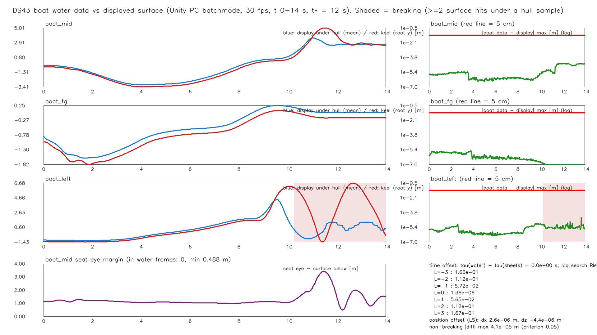
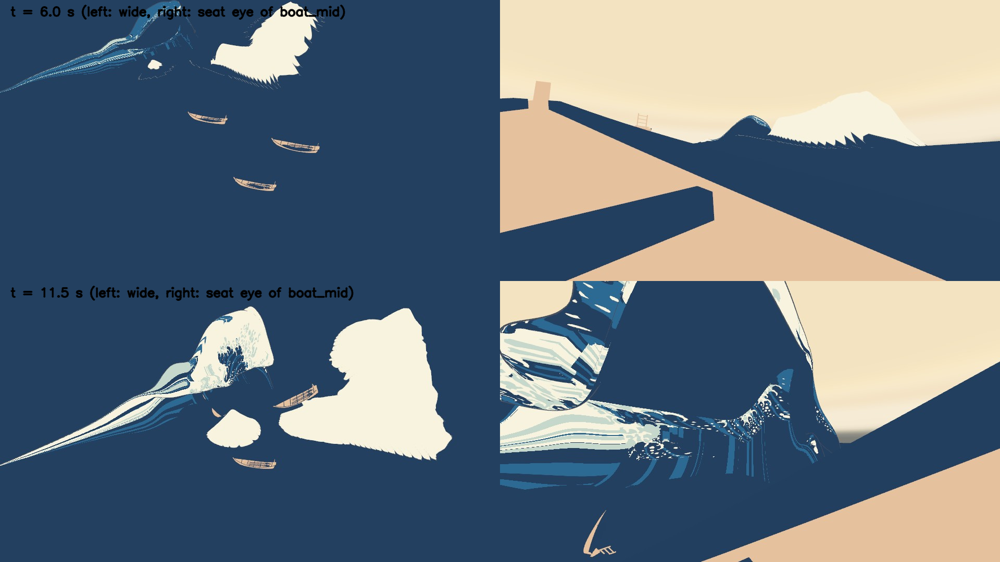
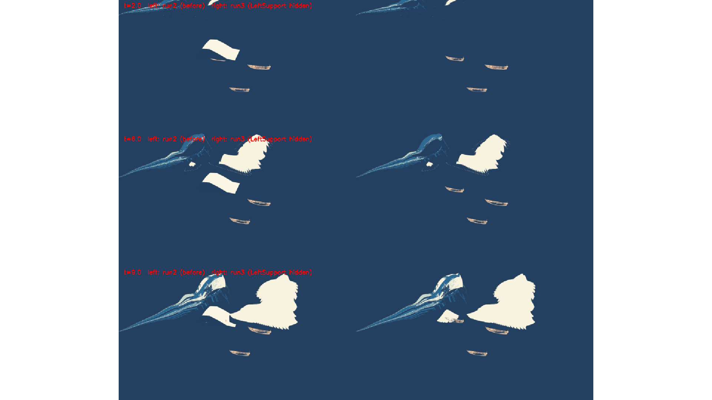

# 設計43：船用水面データで小波へ反応させる ― 3 隻の船が、表示と同じ時計・同じ標本の水面（主役波のシートの下側と、設計30 の near・far のシート）を読んで浮く。最小の受入 2 つは満たした

日付：2026-09-30／状態：**閉じた（使える水準。最小の受入 2 つを満たした。HMD の確かめは保留）**。修正は 1 回（Q26 の 1 回を使った。独立の検査の必須の指摘 1 件）。証拠の種類は次のとおり。**HMD 実機の結果ではない。利用者は確かめていない。**

- 作る部：numpy の前の確かめ（`ds43_precheck.py`。設計30 の海の式と表示面の差）、3 隻の浮力点の表と置き方（`ds43_boats.py`）、Unity 6000.4.3f1 の Editor の batchmode（`DS43BoatWaterTest.Run`。物理を手で進め、3 枚のシートの頂点を GPU から読み戻し、PC でオフスクリーン描画。RTX 3080、Direct3D11）、numpy の測定（`ds43_measure.py`。Unity の読み手のコードを使わずに表示面の高さを求める）、海の式の書き足し（`ds43_sea_function.py`）、動画（ffmpeg）、図（`ds43_report.py`）。
- 進行役の独立の検査：作る部のコードを使わずに書いた numpy の道具（リポジトリの外で書き、写しは Git 対象外の `Unity/Build/Design/43/indep_check/`）。GPU の読み戻しの頂点と、実際に描く三角形（主役波は `kstar_a45.gwb` の添字、near・far は再生器の格子）で、自前の鉛直の線の交わりを求め直し、時刻のずらしの探索、座席の目、竜骨の浸かり方、動画のコマ、Blender ヘッドレスで読んだ仮置きの網との重なりを見た。判定は pass、**必須の指摘 1**（boat\_left が静的な仮置きの下に隠れる。第 5 節）。
- 記録の道具 `ds43_record.py`：作る部の SHA-256 の照合（37 件）、作る部の図の道具を使わない時系列からの数え直し（[ds43\_record\_recount.json](../Evidence/Design/43/ds43_record_recount.json)。作る部の値との差はすべて 0）、証拠の写し、記録の metrics.json・run.json。

番号の前提：

- 対象：[段階9までの実行計画](../Design/Stage9_Plan_2026-09-26_ja.md)（以下「計画」）§2.4 の設計43。使える水準の成果物は「設計30 のうねりと、主役波のシートの下側の一価の面を、同じ時計で船が読む。表示面と船底の差、位置と時刻のずれを測る」。最小の受入は「非砕波域で船底と表示面の差 ≤5 cm（設計書 §11 の出発点）。時刻のずれ 0 フレーム」。依存は設計30・42、バックログは 89・90（記録）、203。[制作設計書](../Design/GreatWave_VR_Production_Design_ja.md) §5.4（船用データ：有効領域・原点と間隔・時刻・高さ・流速）、§7.2（巻き込みのない一価の水面で表せる範囲に限る。高さデータ・表示面・白波は同じ座標と時刻）、§11（浮力と表示面：非砕波域の船底サンプルの高さの差、仮に最大 5 cm）に当たる。
- 引き継ぎ：主役波の動きは設計28修正01 の `Unity/Build/Design/28R01F/F_final`（`art_on`）、周りの海は[設計30](Design_30_ja.md)の near・far のシートと海の式 `Unity/Build/Design/30/sea/sea_function.json`（`f5b92c3b…`）、単発再生の場面 `DS30_SinglePlayback.unity`、浮力は[設計42](Design_42_ja.md) の `DS42Buoyancy`・`DS42Water`・`ds42_buoyancy_points.json`（`599e6c67…`）、船は[設計41](Design_41_ja.md) のプレハブ `DS41_Oshiokuri.prefab`。設計30 の限界 7（far の半径 380〜600 m の弱めが海の式の記録にない）はこの番号で書く約束だった。
- 時間の上限：Q26 の日程で 3 時間（計画 §2.6 の［Q26］の表、10/3 の行。計画の時間枠は ≤0.75 日）。範囲は最小の受入だけで、修正は 1 回まで。
  - 実績（ファイルの時刻。[metrics.json](../Evidence/Design/43/metrics.json) の `time.file_times`）：最初のフォルダー（`Tools/GWWaveGen/ds43/`・`Unity/Build/Design/43/`）10:43:33、前の確かめの出力 10:44:55、`ds43_boats.py` 10:47:22、C# 10:48:43〜10:49:02、Unity の run1 10:51:09〜10:52:16、`ds43_measure.py` 10:53:30、海の式の書き足し 10:55:09〜10:55:24、run2 10:57:36〜10:58:42、`ds43_report.py` 10:59:16（作る部の最後の出力は修正の時に上書きされたので、終わりの時刻は残らない）。進行役の独立の検査 11:03:54〜11:09:09（道具の時刻）。修正 11:13:45（`DS43BoatWaterTest.cs`）〜11:17:47（metrics.json）。記録 11:23:27（独立の検査の写し）〜（終わりは `Unity/Build/Design/43/READY_TO_COMMIT.txt` の時刻）。最初のフォルダーから修正の最後の出力まで約 34 分で、3 時間の上限の内。
  - 作る部の報告は「3 時間の内の約 2 時間 40 分」、修正の報告は「約 25 分」で、どちらもファイルの時刻と合わない（第 9 節の 5）。記録はファイルの時刻を使った。
  - 1 回の計算：Unity の実行の中の時間 58.9 s（`DS43_DONE seconds=58.9`。物理のループ 54.2 s）、前の確かめ 11.3 s、測定 21.8 s、独立の検査 85.5 s、記録の道具 0.9 s。どれも 30 分の上限より十分短い。
- 読むだけで変えていないもの：`DS30_SinglePlayback.unity` は開いただけで保存せず、写しを新しい場面 `DS43_BoatWater.unity` に保存した。原画視点の場面 `DS41_Boats.unity` と `DS39_Paper.unity` は開いていない（Unity のログ 3 本にこの 2 つの名前は 0 回）。守るファイル 17（設計30 の場面・再生器・`DS30BoatHeave.cs`・`boat_support.json`・海の式と near・far・F\_final のパッケージの json、設計41 の場面・プレハブ・FBX、設計42 の浮力の部品・水面の型・表・場面、`seat_v1.json`）は実行の前後で SHA-256 が同じ（`protectedUnchanged` true、`changedFiles` 空）。ProjectSettings は 3 回の実行とも戻したファイル 0・新しいファイル 0（`ds43_settings_restore_run3.json` ほか）。`Physics.simulationMode` は FixedUpdate に戻した。
- **原画視点に触れていないので、計画 §2.0 の回帰の規則（評価器を回して合格した項目を後退させない）は当てはまらない。** 評価器は回していない。原画の場面の船は、設計30 の鉛直の支え（`DS30BoatHeave`）のまま変わっていない（DS43 は検査の場面だけにある）。
- 座標と単位：Unity の世界（m・s・kg、+y 上）。τ は物理の時刻（t\* = 0）、t は体験の時刻（t\* = 12 s、τ(t) は `timewarp_F_final.json`）。「船底のサンプル」は 1 隻につき 37 点（設計42 の浮力点 10 と、船底の平面の 9 × 3 の格子。縦 ±0.42 L、横 ±0.3 B）。「交わり」は点の鉛直の線と表示面の三角形の交わりで、1 つなら一価（非砕波域）、2 つ以上なら唇・巻き込みの下（砕波域）。
- 使っていないもの：AGENTS.md の禁止の場所と、読み取りのみの例外（参照モデル・利用者の解算・写真・爪の分析）は、作る部・検査・記録のどれも開いていない。ウェブも読んでいない。

## 見るもの

| 船用水面データと表示面（左：3 隻の船底の下の表示面の平均（青）と根の高さ（赤）、薄赤は砕波域。右：船用水面データ − 表示面の最大（対数、赤線 5 cm）。下：座席の目の余裕と時刻のずれの探索） |
| --- |
|  |

| t = 6.0 s と 11.5 s（左：全体、右：boat\_mid の座席の目） | 修正 1 の前後（t = 2・6・9 s。左：run2、右：run3。仮置きを隠した） |
| --- | --- |
|  |  |

- **動画**：[ds43\_boatwater\_wide\_seat\_30fps.mp4](../Evidence/Design/43/ds43_boatwater_wide_seat_30fps.mp4)（1920 × 540、30 fps、421 コマ、14.03 s、H.264、2,272,090 バイト）。左は世界に固定した全体の視点（(12, 45, −80) から (−3, 0, −18) へ、縦の画角 45°）、右は座席の船 boat\_mid の物理の姿勢に付けた座席の目。PC の batchmode の描画で、HMD ではない。
  - 流れ：t = 0 の水で 4 s ならした後、t 0 → 12 s が形成（τ −7.889 → 0 s）、12〜14 s は t\* で止めた水（60 コマ）。3 隻とも自由に浮かせ、原画の t\* の姿勢へ導いていない（D43-3）。
  - 見どころ：t 0〜9 s は 3 隻とも小波に合わせて上下・傾く（boat\_mid の傾き 9.23° 以下）。boat\_left は t ≈ 10 s に主役波の本体へ入り、唇の下で打ち上げられて転覆する（最大 157.2°）。boat\_mid は t 11.17〜11.93 s に浮力点がすべて水の外へ出る（打ち上げ。最大 54.7°）。座席の目の視点はほとんど自分の船体が写る（見え方だけの問題）。
- 静止画（1920 × 1080）：[t 6.0 s と 11.5 s](../Evidence/Design/43/stills_ds43_t06_t11.5.png)（作る部の Unity の JPG 4 枚を 2 × 2 に並べたもの）。
- 修正 1 の前後：[fig\_ds43\_fix01\_leftsupport\_before\_after.png](../Evidence/Design/43/fig_ds43_fix01_leftsupport_before_after.png)。作る部の 960 × 810 の図を 4/3 倍（最近傍）にして 1920 × 1080 の白地の中央に置いた（記録の道具。`ds43_record_recount.json` の `fix01_letterbox`）。左の run2 では、白い板（静的な仮置き `M1_Revision_LeftSupport`）が boat\_left を覆う。

数値：

- [metrics.json](../Evidence/Design/43/metrics.json)（記録）：最小の受入 `acceptance`、バックログ `backlog`、採ったもの `decisions_q24`、修正 `fix_rounds`、時間 `time`、引き継ぎ `handoffs_ja`
- 作る部の写し：[ds43\_boatwater\_metrics.json](../Evidence/Design/43/ds43_boatwater_metrics.json)（最小の受入・船ごと・動き・海の式・前の確かめ・作り・記録のみの項目 11）、[ds43\_measure.json](../Evidence/Design/43/ds43_measure.json)（numpy の測定）、[ds43\_unity\_report.json](../Evidence/Design/43/ds43_unity_report.json)（Unity の設定・回数・隠したもの・守るファイル）、[ds43\_precheck\_analytic\_vs\_display.json](../Evidence/Design/43/ds43_precheck_analytic_vs_display.json)（式と表示面の差）、[sea\_function\_ds43.json](../Evidence/Design/43/sea_function_ds43.json)（far の弱めを書き足した海の式）、[ds43\_boatwater\_run.json](../Evidence/Design/43/ds43_boatwater_run.json)
- 進行役の独立の検査：[ds43\_indep\_check.json](../Evidence/Design/43/ds43_indep_check.json)
- 記録の道具の数え直し：[ds43\_record\_recount.json](../Evidence/Design/43/ds43_record_recount.json)
- 実行条件と SHA-256：[run.json](../Evidence/Design/43/run.json)

## 0. 結論

1. **最小の受入 1：非砕波域で船底と表示面の差 ≤5 cm を満たした。** 3 隻 × 37 点 × 421 コマのうち交わりが 1 つの 42,968 サンプルで、船用水面データの高さと表示面（同じコマに GPU で描いた頂点の読み戻しの鉛直の交わり）の差は最大 4.07 × 10⁻⁵ m（0.04 mm）、99 パーセンタイル 8.3 × 10⁻⁶ m。交わりの数は Unity と numpy で全サンプル一致（食い違い 0）、表示面のないサンプル 0、範囲の外の予備（y = 0）の使用 0 回。独立の検査（実際に描く三角形で自前に交わりを求めた）と記録の数え直しも同じ値。
2. **最小の受入 2：時刻のずれ 0 フレームを満たした（試験の手順の中で）。** 再生器の τ・3 枚のシートが描いた τ・船用水面データが使った τ は 421 コマすべてで差 0 s。表示面を L コマずらして比べる探索は L = 0 で最小（作る部：動いている 103 コマで二乗平均 1.4 × 10⁻⁶ m、L = ±1 で 0.057 m。独立の検査：179 コマ・約 19,000 サンプルで 1.9 × 10⁻⁶ m、L = ±1 で 0.057 m・最大 0.53 m）。**ただしこれは、各物理の段の前に再生器へ同じ時刻を渡す試験の手順でだけ示した。** Play の実行の順序では 1 コマ遅れ、保存した場面では浮力が働かない（限界 1）。
3. **位置のずれはない。** 高さの差を表示面の傾きで水平のずれとして最小二乗で説明すると δ = (2.6 × 10⁻⁶, −4.4 × 10⁻⁶) m（傾きの 95 パーセンタイル 0.77）。
4. **座席の目は全コマで水の上。** boat\_mid の物理の姿勢の目は 421 コマ中 0 コマで水の中、目より上に表示面が来るコマ 0、余裕の最小 0.488 m（t 12.23 s）。
5. **設計30 の海の式に far の半径方向の弱めを書いた**（[sea\_function\_ds43.json](../Evidence/Design/43/sea_function_ds43.json)。設計30 の限界 7 を閉じる）。w\_far = 1 − smoothstep((r − 380)/(600 − 380))、r は波の枠とともに動く競技場の中心 (a, c) = (−2.5, −2.5) m から。搬送波とうねりだけに掛け、地形の誘導 g·F には掛けない。弱めを入れると far の頂点（行 1〜16、節点 26）と 1.7 × 10⁻⁵ m で合い、入れないと 3.27 m 違う。
6. **船は式ではなく、表示と同じ標本を読む（D43-1。計画の文と設計30 の引き継ぎの「船は式を読む」から離れた読み）。** 前の確かめで、式と表示面の差は far の粗い網の上で最大 16.9 cm（boat\_fg）・9.4 cm（boat\_mid）あり、式を読むと ≤5 cm を満たせない。シートの頂点は式の値なので、うねりの定義は同じ。
7. **砕波域では自由に浮く船は打ち上げられ、転覆する（記録のみ。受入の外）。** boat\_mid は t 11.17〜11.93 s に浮力点がすべて水の外、傾き最大 54.7°、根の高さの 30 Hz の二階差分 最大 15.2 m/s²。boat\_left は t 9.97 s から水の外のコマが出始め、10.27 s から砕波域で、傾き最大 157.2°（転覆）、65.1 m/s²。boat\_mid の打ち上げの元は表示の水そのもので、浮力点の下の表示面が t 10.77 s に 4.61 m/s で上がり、10.97 s に −38.5 m/s²（約 −3.9 g）で減速する（near のシートのつなぎの帯）。どの船も原画の t\* の姿勢へは戻らない → 設計44 の固定の軌道への引き継ぎ（D26）、設計47 の背景の船の演出。
8. **修正 1：検査の場面で静的な仮置き `M1_Revision_LeftSupport` を隠した。** 作る部が「小波の陰」と書いた boat\_left の見えない理由は誤りで、設計30 の場面で有効のまま残る仮置き（y 0.64〜6.53 m）の下に boat\_left が入っていた。直した後は、全体の視点で t 2〜10 s の 241 コマすべてに boat\_left の船の色の画素がある（中央値 83 px）。船はこの網を読まないので、数値は変わらない（`ds43_frames.jsonl` は run2 とバイトまで同じ、と作る部の記録）。
9. **原画視点と評価器には触れていない**（新しい検査の場面 `DS43_BoatWater.unity` だけ）。HMD（PS VR2）の確かめは保留。
10. **限界（第 4 節）**：Play の実行の順序、砕波域の打ち上げ、表示の水の急な減速、式を読む道がないこと、far の網の折れ目による上下の加速度（boat\_fg 6.19 m/s²）、流速なし、関心の範囲の固定、相似の表の質量、τ が変わるたびの CPU の作り直し 20.3 ms、原画の場面の船がまだ設計30 の支えのままであること。設計44〜47、仕上げ30・43 へ送った。

---

## 1. 目的

設計書 §7.2 は、船を巻き込みのない一価の水面で表せる範囲に浮かべ、高さデータ・表示面・白波が同じ座標と時刻を使うことを求める。§11 は、非砕波域の船底サンプルの高さの差を仮に最大 5 cm とする。計画 §2.4 の設計43 は、設計42 で静水に浮かべた浮力の部品に、設計30 のうねりと主役波のシートの下側の一価の面を、表示と同じ時計で読ませ、表示面と船底の差、位置と時刻のずれを測る番号である。

Q26 により、最小の受入だけを満たし、修正は 1 回までとした。設計30 の限界 7（far の弱めの記録）もここで閉じた。

---

## 2. 表

### 2.1 船用水面データの作り（Unity の C#）

値はコード（`Unity/Assets/GreatWave/Design43/`）と [ds43\_unity\_report.json](../Evidence/Design/43/ds43_unity_report.json)。

| 部分 | 中身 |
| --- | --- |
| `DS43BoatWater`（`DS42Water` の子、`HeightAt`） | 自分では時刻を持たず、問い合わせのたびに `DS30SinglePlayback.Tau`（シートへ渡したのと同じ値）を見て、変わっていれば 3 枚のシートを作り直す。点の鉛直の線と描いているシートの交わりのうち最も低いもの（下側の一価の面）を返す。交わりが 1 mm 以内のものは 1 つに数える。交わりがなければ予備として y = 0 を返し、回数を数える |
| `DS43SheetReader` | DS27 形式のパッケージを CPU で復号する（GPU と同じ式：16 bit ＋ 精度の層、不等間隔の節点の 3 次 Hermite の 4 層、枠の原点 O(τ) の線形補間）。描く四角だけを使う：主役波は本体の列 18〜394、near は全部、far はすその四角を除く。層は要る時だけ読み、復号した層を 10 まで手元に置く |
| 空間の索引 | 関心の範囲の三角形だけの 1 m の一様格子。範囲は 3 隻の置き方の位置 ± 16 m を囲む x −31.29〜23.03 m、z −48.25〜3.47 m（固定） |
| シート | 主役波 `Build/Design/28R01F/F_final/art_on`（頂点 96,000）、near `Build/Design/30/sea/near`（54,164）、far `Build/Design/30/sea/far`（4,693）。最後のコマの索引の三角形 121,960・12,672・0（最後のコマでは far の三角形が範囲に入っていない）。層の読み 226・226・226 |
| 回数と重さ | 作り直し 1,441 回・平均 20.34 ms、問い合わせ 64,803 回、予備の使用 0 回 |
| 試験 `DS43BoatWaterTest` | `DS30_SinglePlayback.unity` を開き（保存しない）、`DS30BoatHeave` を外し、仮の船 `boat_blockout` 3 つと仮置き `M1_Revision_LeftSupport` を隠し（修正 1）、設計41 のプレハブを子に持つ物理の根（Rigidbody ＋ `DS42Buoyancy`）を 3 隻置いて `DS43_BoatWater.unity` に保存する。物理は `Physics.simulationMode = Script`、dt = 1/120 s、1 コマ 4 段。各段の前に再生器へ同じ時刻を渡す。t = 0 の水で 4 s ならし、t 0〜14 s を 30 fps で記録。コマごとに τ（再生器・3 枚のシート・船用水面データ）、船の姿勢、37 点の船用水面データの高さと交わりの数、座席の目、3 枚のシートの GPU の読み戻し（`DS27KeyposeCapture`）、2 つの視点の JPG |
| 測定 `ds43_measure.py` | GPU の読み戻しの頂点と、描く四角の三角形で、点の鉛直の線の交わりを numpy で求める（Unity の読み手のコードは使わない） |

### 2.2 3 隻の船

値は `Unity/Assets/GreatWave/Design43/Data/ds43_boats.json`（`d40f1531…`）と `ds43_unity_report.json` の `boats`。

| 船 | 縮尺（m／単位） | 相似の比 k | 質量 | 長さ・幅 | 釣り合いの喫水（船体中央） | 浮力点の表 |
| --- | --- | --- | --- | --- | --- | --- |
| boat\_mid（座席の船、右） | 1.132835 | 1.0 | 2083.2 kg | 11.328・2.413 m | 0.2491 m | 設計42 の表そのまま（`ds43_buoyancy_points_boat_mid.json`） |
| boat\_fg（手前） | 0.844624 | 0.7456 | 863.4 kg | 8.446・1.799 m | 0.1858 m | 相似に縮めた表（`…_boat_fg.json`） |
| boat\_left（左奥） | 0.9981 | 0.8811 | 1424.8 kg | 9.981・2.126 m | 0.2195 m | 相似に縮めた表（`…_boat_left.json`） |

- 相似（Froude）：長さ k、容積・質量 k³、慣性 k⁵、水線面積 k²、上下の減衰 k^2.5、水平・首振りの抵抗の率はそのまま（`ds43_boats.py` の説明）。乗員 10 人などの推定を k³ で縮めるのは数値の条件で、資料の値ではない（限界 8）。
- 置き方：原画の置き方の根の水平の位置と首の向き（`seat_v1.json` と設計41 の `real_dimensions_per_boat`）で、縦・横の傾き 0 から始めた。根の高さは t = 0 の水でならした所。
- 独立の検査が測った竜骨の浸かり方（表示面から竜骨まで、t 0〜4 s の中央値）：0.201・0.192・0.213 m（boat\_mid・fg・left）。釣り合いの喫水 0.249・0.186・0.220 m と同じ大きさで、船が表示面の上に浮いていることを示す。

### 2.3 最小の受入 1：船底と表示面の差（非砕波域）

値は [ds43\_measure.json](../Evidence/Design/43/ds43_measure.json)（作る部）、[ds43\_indep\_check.json](../Evidence/Design/43/ds43_indep_check.json)（独立の検査）、[ds43\_record\_recount.json](../Evidence/Design/43/ds43_record_recount.json)（記録の数え直し）。

| 船 | 一価のサンプル | 差の最大（作る部＝独立の検査＝数え直し） | 99 パーセンタイル | 交わりの数の食い違い・表示面なし | 最も低い交わりのシート（独立の検査） |
| --- | --- | --- | --- | --- | --- |
| boat\_mid | 15,577 | 4.07 × 10⁻⁵ m | 2.3 × 10⁻⁵ m | 0・0 | near 11,853・far 3,724 |
| boat\_fg | 15,577 | 3.4 × 10⁻⁶ m | 2.1 × 10⁻⁶ m | 0・0 | near 11,437・far 4,140 |
| boat\_left | 11,814 | 1.15 × 10⁻⁵ m | 7.9 × 10⁻⁶ m | 0・0 | 主役波 4,040・near 8,810・far 2,727 |
| **3 隻の合計** | **42,968** | **4.07 × 10⁻⁵ m**（基準 0.05 m） | 8.3 × 10⁻⁶ m | 0・0 | — |

- 砕波域（交わり 2 つ以上）は boat\_left だけで、t 10.27 s（コマ 308）から最後のコマ 420 まで 3,763 サンプル。下の面との差の最大 5.2 × 10⁻⁵ m（記録のみ）。
- 独立の検査の表示面：GPU の読み戻しは描画の頂点関数と同じ `DS27WorldPosition` を通る。主役波の三角形は `kstar_a45.gwb` の添字（190,722）を再生器の列の規則（18〜394）で絞った 179,728 で、読み手の格子の仮定と同じ組（違い 0）。far はすその行も描くとおりに含めた。
- GPU の読み戻しと、numpy が同じパッケージを自分で復号した値の差は最大 1.7 × 10⁻⁴ m（0.17 mm。作る部）。

### 2.4 最小の受入 2：時刻のずれ

値は `ds43_measure.json` の `acceptance_time_offset`、`ds43_indep_check.json` の `time`・`lag`。

| 確かめ | 値 |
| --- | --- |
| 船用水面データの τ − 再生器の τ（421 コマの最大） | 0 s |
| 3 枚のシートが描いた τ − 再生器の τ | 0 s |
| 再生器の τ − `timewarp_F_final.json` の自前の補間（独立の検査） | 0 s |
| t 12〜14 s の止めたコマ | 60（τ = 0 のまま） |

| ずらし L（コマ） | 作る部（動く 103 コマ、3 コマおき）の二乗平均 | 独立の検査（動く 179 コマ）の二乗平均・最大 |
| --- | --- | --- |
| −3 | 0.166 m | — |
| −2 | 0.112 m | 0.114 m・1.06 m |
| −1 | 0.0572 m | 0.0571 m・0.530 m |
| **0** | **1.4 × 10⁻⁶ m** | **1.9 × 10⁻⁶ m・4.1 × 10⁻⁵ m** |
| +1 | 0.0565 m | 0.0574 m・0.534 m |
| +2 | 0.112 m | 0.113 m・1.06 m |
| +3 | 0.167 m | — |

- 最小は L = 0。1 コマのずれは二乗平均で約 5.7 cm、最大 0.53 m になるので、1 コマでも ≤5 cm を超える所がある（Play の順序の問題の大きさ。限界 1）。

### 2.5 座席の目と位置のずれ

- 座席の目（boat\_mid の物理の姿勢。`ds43_boats.json` の `eyeLocal` (0.428, 1.346, 2.747) m）：421 コマ中 水の中 0、目より上の表示面 0、余裕の最小 0.488 m（t 12.23 s）。Unity と numpy の目の交わりの数は全コマで一致。
- 位置のずれ（最小二乗）：δxz = (2.63 × 10⁻⁶, −4.44 × 10⁻⁶) m、42,968 サンプル、表示面の傾きの 95 パーセンタイル 0.769。

### 2.6 海の式の書き足しと、式と表示面の差（前の確かめ）

値は [sea\_function\_ds43.json](../Evidence/Design/43/sea_function_ds43.json)（`54d4d3c1…`。元は設計30 の `sea_function.json`、`f5b92c3b…`）と [ds43\_precheck\_analytic\_vs\_display.json](../Evidence/Design/43/ds43_precheck_analytic_vs_display.json)。

- 式：η(x, z, τ) = w\_far(r)·[κ\_c·A\_c·Σ搬送波 + κ\_s·Σうねり] + g(τ)·F(a, c)。w\_far(r) = 1 − smoothstep((r − 380)/(600 − 380))、smoothstep(x) = x²(3 − 2x)（0〜1 に切る）、r = √((a − a\_c0)² + (c − c\_c0)²)、(a\_c0, c\_c0) = (−2.5, −2.5) m は競技場（near の外周：前 a +105、後 a −110、右 c +125、左 c −130 m）の中心で、波の枠とともに動く。far のシートでは行 1〜16 がこの式、行 0 は near の外周の写し、行 17（半径 650 m）は y = 0、行 18 は −8 m のすそ。出典は `Tools/GWWaveGen/ds30/ds30_generate.py` と `ds30_params.json`（`far_taper_start_m`・`far_taper_end_m`）。記録の時に `ds30_generate.py` の 306〜311 行（`taper = 1 − smoothstep(...)`、`y = taper * Ts + Fv`。Ts は海の式、Fv は地形の誘導）を読み、書き足した式と同じであることを確かめた（独立の検査の報告も同じ）。
- 照合（節点の層の頂点と式の差。節点 26）：far の行 1〜16 は弱めありで 1.68 × 10⁻⁵ m、弱めなしで 3.27 m（設計30 の独立の検査の「約 400 m より外で最大 3.4 m」と同じ大きさ）。near の接続帯の外（行 0 から 10 m 以上）は 2.54 × 10⁻⁵ m。

前の確かめ（式 − 表示面の最も低い交わり。船の足跡は置き方の位置・向きで水平、9 × 3 点、30 fps、t 0〜12 s。記録のみ）：

| 船・シート | サンプル（一価） | 差の最大 | 95 パーセンタイル | t の範囲 |
| --- | --- | --- | --- | --- |
| boat\_mid・far | 2,718（2,718） | 0.0944 m | 0.0720 m | 0〜3.53 s |
| boat\_mid・near | 5,901（5,901） | 0.0399 m | 0.0091 m | 3.17〜10.9 s |
| boat\_mid・near の帯 | 1,128（1,128） | 2.03 m | 0.192 m | 10.43〜12.0 s |
| boat\_fg・far | 3,022（3,022） | 0.169 m | 0.145 m | 0〜3.83 s |
| boat\_fg・near | 6,725（6,725） | 0.0047 m | 0.0018 m | 3.6〜12.0 s |
| boat\_left・far | 1,989（1,989） | 0.0256 m | 0.0104 m | 0〜2.57 s |
| boat\_left・near | 5,561（5,561） | 0.135 m | 0.0087 m | 2.3〜9.57 s |
| boat\_left・near の帯 | 851（851） | 0.792 m | 0.640 m | 9.0〜10.63 s |
| boat\_left・主役波 | 1,346（113） | 10.3 m | 10.2 m | 10.03〜12.0 s |

- far の粗い網の上では、頂点の間で式と表示面が最大 17 cm 違う。帯と主役波の中は、式がそもそも表示の面ではない（設計30 の作り）。これが D43-1 の理由（第 2.8 節）。

### 2.7 船の動き（記録のみ）

値は `ds43_record_recount.json` の `per_boat`（記録の数え直し。傾きは船の局所の上と鉛直の角、上下の加速度は根の高さの 30 Hz の二階差分）。上下の加速度と水の外のコマは作る部の `motion_record` と同じ値。

| 船 | 傾きの最大（t ≤ 9 s） | 上下の加速度の最大（t ≤ 9 s） | 根の高さの範囲 | 浮力点がすべて水の外 | 砕波域の始まり |
| --- | --- | --- | --- | --- | --- |
| boat\_mid | 54.7°（t 12.13 s）（9.23°） | 15.2 m/s²（t 12.63 s）（3.16 m/s²） | −3.41〜5.01 m | 24 コマ、t 11.17〜11.93 s | なし |
| boat\_fg | 7.83°（t 2.07 s） | 6.19 m/s²（t 1.1 s、far の上）（同じ） | −1.82〜0.07 m | 0 | なし |
| boat\_left | 157.2°（t 12.6 s）（20.98°） | 65.1 m/s²（t 11.3 s）（19.2 m/s²） | −1.43〜6.68 m | 100 コマ、t 9.97〜13.83 s | t 10.27 s |

- boat\_mid の浮力点 10 の下の表示面の平均の高さ（数え直しの `display_under_boat_mid_points`）：上がる速さの最大 4.61 m/s（t 10.77 s）、加速度の最小 −38.5 m/s²（t 10.97 s）。独立の検査が見つけた、boat\_mid を投げる表示の水の動き（near のシートのつなぎの帯）と同じ値。
- 原画の t\* の boat\_mid の姿勢は船首上げ 33°（作る部の記録）で、自由に浮く boat\_mid とは一致しない。

### 2.8 作り方と採ったもの（Q24。進行役の判断で、利用者の決定ではない）

- **D43-1：船は設計30 の式そのものではなく、表示と同じ標本（near・far のシート。式の値を頂点に持つ）と主役波の本体の下側の一価の面を読む。** 理由：前の確かめで式と表示の網の差が far で最大 16.9 cm（boat\_fg）・9.4 cm（boat\_mid）あり、式を読むと ≤5 cm を満たせない。シートの頂点は式と 0.017 mm で合うので、うねりの定義は同じ。落とした：式を読む（far の網の間で 17 cm）、far の表示を細かくする（原画視点に触れる。仕上げ30 の候補）。計画の文「設計30 のうねり…を船が読む」を、「設計30 のうねりを表示と同じ標本で読む」と読んだ（進行役の解釈）。設計30 の引き継ぎの「船は式を読み、帯と主役波の中はシートを読む」とは違う読み。設計書 §7.2 の「表示メッシュを毎フレーム巨大な MeshCollider にする方法を基本にしない。軽量な水面・流速データを船用に参照する」については、MeshCollider は使わないが、表示のパッケージそのものを CPU で読むので、軽量なデータ（§5.1 の 60\_queries）はまだない（限界 11）。
- **D43-2：非砕波域 = 船底サンプルの鉛直の線と表示面の交わりが 1 つ。** 2 つ以上は唇・巻き込みの下で、下の面を読み、差は記録のみ。理由：設計書 §7.2 の「巻き込みのない一価の水面で表せる範囲」をそのまま数える読み。
- **D43-3：3 隻を自由に浮かべ、形成の区間（砕波域）でもそのまま物理で動かした。** 固定の軌道への引き継ぎは設計44 の D26。理由：設計43 の受入は非砕波域だけで、砕波域の振る舞い（打ち上げ・転覆）は設計44・47 への申し送りとして記録する。
- **boat\_fg・boat\_left の表は boat\_mid の表を相似に縮めた。** 理由：設計41 は一つのモデルを 3 隻に縮尺を変えて置いたので、浮力点の表も同じ形で縮められる。
- **検査は写しの場面 `DS43_BoatWater.unity` で行い、原画視点の場面は開かない。** 理由：評価器の回帰の規則の対象にしないで最小の受入を示せる。原画の場面の船は設計30 の鉛直の支えのまま（限界 9）。
- **修正 1 の仮置きは試験の道具（`HideNames`）で隠す。** 設計30 の場面（原画の場面の元）は変えず、写しの `DS43_BoatWater.unity` にだけ隠した状態で保存される。理由：原画の場面を変えない。
- 記録の判断：作る部の文にある「仕上げ42」は計画 §5 にない群なので、船用水面の群 仕上げ43（89・90・203）へ入れた（設計42 の記録と同じ扱い）。修正 1 の前後図（960 × 810）は、中身を変えずに 1920 × 1080 の白地へ置いた。

---

## 3. 関門

| 最小の受入・規則 | 基準 | 値 | 判定 |
| --- | --- | --- | --- |
| 非砕波域で船底と表示面の差 | ≤ 0.05 m | 最大 4.07 × 10⁻⁵ m（42,968 サンプル。独立の検査・数え直しも同じ）、交わりの数の食い違い 0、表示面なし 0 | 合格 |
| 時刻のずれ | 0 フレーム | τ の差 0 s（421 コマ）、ずらしの探索の最小 L = 0（作る部・独立の検査） | 合格（試験の手順の中。Play の順序は限界 1） |
| 位置のずれ（成果物の中身） | 測る | δxz = (2.6 × 10⁻⁶, −4.4 × 10⁻⁶) m | 記録した |
| 座席の目が全コマで水の上（作業の指示。設計30 の検査） | 0 コマ | 0 コマ、余裕の最小 0.488 m | 合格 |
| 設計30 の限界 7（far の弱めの記録） | 書く | `sea_function_ds43.json`。頂点と 1.7 × 10⁻⁵ m で合う | 閉じた |
| 計画 §2.0 の回帰なし | 原画視点に触れた時だけ | 原画視点の場面・評価器の入力は開いていない。守るファイル 17 の SHA-256 は同じ | 対象外 |
| 守るファイル・ProjectSettings | 変えない | `protectedUnchanged` true、設定の戻し 0（3 回とも）、`simulationMode` は FixedUpdate に戻した | 合格 |
| バックログ 89・90・203 | 記録 | 89：非砕波域の差 4.07 × 10⁻⁵ m。90：同じ時計（τ の差 0）。203：有効領域（x −31.29〜23.03・z −48.25〜3.47 m）・原点 O(τ)・時刻 τ・高さ（流速なし） | 記録のみ（判定は仕上げ43） |
| HMD（PS VR2） | — | — | 保留（導入は利用者の手。船の揺れの HMD の確かめは設計45） |

---

## 4. 限界

1. **時刻のずれ 0 フレームは、試験の手順（各物理の段の前に再生器へ Seek）でだけ示した。** Play では FixedUpdate が `DS30SinglePlayback.Update`（τ を決める）より先に走るので、船は 1 コマ前の水を読む見込み（1 コマのずれは二乗平均 5.7 cm、最大 0.53 m。第 2.4 節）。保存した `DS43_BoatWater.unity` の 3 隻の `DS42Buoyancy` は `stepInFixedUpdate` 0（試験が手で Step するため）なので、Play では浮力が働かず沈む。Play の道は回していない。設計44・46 で、実行の順序（物理の前に時計を進める、または時計から浮力を進める）と Play でのずれの測定が要る。
2. **砕波域では自由に浮く船は打ち上げられ、転覆する。** boat\_mid は t 11.17〜11.93 s に浮力点がすべて水の外、傾き 54.7°、15.2 m/s²。boat\_left は 157.2°、65.1 m/s²。どの船も原画の t\* の姿勢（boat\_mid は船首上げ 33°）へ戻らない。設計書 §7.2 のとおり、砕ける波の内側は高さデータでは足りず、第一完成版では操船域をその外に置く。設計44 の固定の軌道への引き継ぎ（D26）と設計47 の背景の船の演出。
3. **boat\_mid を投げるのは表示の水そのもの。** 浮力点の下の表示面が t 10.77 s に 4.61 m/s で上がり、10.97 s に −38.5 m/s²（約 −3.9 g）で減速する（near のシートのつなぎの帯）。船用水面データは表示と合っており、自由表面らしくない表示の動きが船を投げる。設計44 の引き継ぎは t ≈ 10.5 s より前、設計45 の快適さ、仕上げ30・43。
4. **式を読む道はない（D43-1）。** far の粗い網の上では、式と表示面が頂点の間で最大 16.9 cm 違う。式を読むなら far の網を細かくするか、far の頂点の関数で式を評価する（どちらも原画視点に触れる）。仕上げ30・43。海の式は C# へ移していない。
5. **far の網の折れ目で水面の加速度が跳ぶ。** boat\_fg の上下の加速度の最大 6.19 m/s²（t 1.1 s、far の上）。設計30 の座席の船の上下 5.97 m/s² と同じ大きさで、快適さは試していない。設計45、仕上げ30。
6. **水の流速（設計書 §5.4 の船用データの流速）は読んでいない。** 水平の抵抗は設計42 のまま絶対速度に対して働く。仕上げ43。
7. **関心の範囲は 3 隻の置き方の位置 ± 16 m に固定**（x −31.29〜23.03 m、z −48.25〜3.47 m）。外は予備の y = 0。試験では予備の使用 0 回だが、設計44 の操船域では範囲を船に合わせて動かす必要がある。
8. **boat\_fg・boat\_left の表は相似に縮めた数値の条件**（質量 863.4・1424.8 kg。乗員 10 人も k³ で縮む）。資料の値ではない。3 隻とも原画の位置・向きで水平に始めた。仕上げ43（作る部の文の「仕上げ42」）・仕上げ41 ②（乗員）。
9. **原画の場面の船はまだ設計30 の鉛直の支えのまま。** DS43 は検査の場面だけにある。原画の場面では t\* の boat\_left（根 y 4.82）が静的な仮置き `M1_Revision_LeftSupport` の上に乗っており、t\* より前に自由に浮く・演出で動かす boat\_left は、仕上げ30 でこの仮置きを置き換えるまで、この面と食い違う。設計42 の喫水の差（物理 0.249 m と座席 v1 の置き方 0.3806 m、132 mm）もまだそろえていない。設計44・47、仕上げ30。
10. **設計42 の限界はそのまま**：付加質量なし、減衰は調整値、約 7° を超える傾きの浮力点の模型を確かめていない（砕波域では 157° まで傾くが受入の外）、首振りのずれ。
11. **τ が変わるたびに、3 枚のシートを CPU で作り直す（平均 20.34 ms、1,441 回）。** PC の batchmode の Editor の値で、実行時のコマの時間では測っていない。τ はほぼ毎コマ変わるので、90 Hz の VR のコマ（約 11 ms）には収まらない見込み。設計書 §5.1 の軽量なデータ（60\_queries）か、GPU で読む形が要る。設計46・仕上げ43、段階10。
12. **動画の座席の目の視点は、ほとんど自分の船体が写る**（見え方だけの問題。数値には関係しない）。
13. **HMD の確かめは保留**（PS VR2 の導入は利用者の手）。Mock の両眼も描いていない（原画視点・座席の場面に触れない番号のため）。
14. **改行**：`Unity/Assets/GreatWave/Design43/` は `.gitattributes` に文がない（設計32〜42 と同じ）。テキストの資産のうち `ds43_boats.json` は CRLF（101 行）、ほかは LF（CR 0。記録の時に数えた）。道具（`Tools/GWWaveGen/**`）と証拠（`Docs/Evidence/Design/**`）は既存の文でバイトのまま。設計42 の記録のとおり core.autocrlf = true なら、新しい checkout で LF の資産が CRLF になり、run.json の SHA-256 と合わなくなる見込み。`.gitattributes` に設計43 の文（`/Unity/Assets/GreatWave/Design43/** -text` と `/Unity/Assets/GreatWave/Design43.meta -text`）を足すかは、コミットの時に進行役が決める（この記録では `.gitattributes` を変えていない）。
15. 崩壊は作らない（Q11）。

---

## 5. 修正の記録（Q26：修正は 1 回まで）

| 回 | 変えたこと | 結果 |
| --- | --- | --- |
| 作る部（10:43:33〜10:59 ごろ） | 前の確かめ、3 隻の表、読み手と試験、Unity の run1、測定、海の式の書き足し、run2（全体の視点のカメラだけを動かした。数値は run1 と同じ、と作る部の run.json）、動画と図 | 最小の受入を満たした |
| 進行役の独立の検査（11:03:54〜11:09:09） | 自前の交わり・時刻・目・竜骨・動画のコマ・仮置きの網との重なり | pass。**必須の指摘 1**：boat\_left が全体の動画で t ≈ 2〜10 s に見えないのは、作る部が書いた「小波や白い面の陰」ではなく、`DS30_SinglePlayback.unity` で有効のまま残る美術優先の静的な仮置き `M1_Revision_LeftSupport`（`revision_slopes.fbx`、y 0.64〜6.53 m、x −25〜−5、z −15〜−4）の下に、自由に浮く boat\_left が入っていたため。その上面は 421 コマ中 322 コマで船底の 37 サンプルすべての上、全コマで 1 サンプル以上の上、竜骨からの高さの中央値 5.8 m。3 枚の海のシートは全体のカメラから boat\_left を隠していない |
| **修正 1**（11:13:45〜11:17:47） | `DS43BoatWaterTest.cs` の `HideNames` に `M1_Revision_LeftSupport` を足し（見つからなければ止まる）、run3、測定、動画、図を作り直した。metrics.json の記録のみの項目（今は 11）に、本当の理由と、独立の検査の記録の指摘 2 つ（表示の水の減速、Play の順序）を足した | 数値は変わらない（`ds43_frames.jsonl` は run2 とバイトまで同じ、と作る部の metrics.json の記録。記録の数え直しも作る部の値と差 0）。保存した場面で `M1_Revision_LeftSupport` は `m_IsActive: 0`（数え直し）。全体の視点で t 2〜10 s の 241 コマすべてに boat\_left の船の色の画素がある（中央値 83 px、最小 23 px は t 9.13 s、t 2・6・9 s で 91・60・39 px。数え直し。直す前の run2 のコマは上書きされて残っていないので、前の数は数えていない。前後は図で見る） |
| 記録（11:23:27〜） | `ds43_record.py` で照合と数え直し、証拠を作った | 作品には触れていない |

- 修正の回数は 1（Q26 の上限）。修正の後に残った問題は、第 4 節の限界として後の番号と仕上げへ送った。
- 作る部の中の直し（提出の前）：run2 は全体の視点のカメラだけを変えた取り直し（作る部の run.json の手順の注）。

---

## 6. 引き継ぎ

**設計44**（前進・減速・旋回・停止）：座席の船を固定の軌道へ引き継ぐのは t ≈ 10.5 s より前（限界 2・3）。Play の実行の順序と、Play での時刻のずれの測定（限界 1）。関心の範囲を船に合わせて動かす（限界 7）。表示の船（原画の場面は設計30 の支え）と物理の船のそろえ方、喫水の差 132 mm（限界 9）。首振りのずれ（設計42 の限界 7）。

**設計45**（乗客の揺れ）：上下の加速度 boat\_fg 6.19 m/s²（far の網の折れ目）、boat\_mid 3.16 m/s²（t ≤ 9 s）・15.2 m/s²（打ち上げの後）。表示の水の −38.5 m/s²（限界 3・5）。HMD の確かめは保留。

**設計46**（共通時計）：船用水面データは今、`DS30SinglePlayback.Tau` を読むだけ。共通時計から水面と船用水面データを同じ段で進める。τ ごとの CPU の作り直し 20.34 ms（限界 11）。

**設計47**（導入→余韻）：背景の船（boat\_fg・boat\_left）の演出と t\* の姿勢。boat\_left は t\* に `M1_Revision_LeftSupport` の上に乗る（限界 9）。

**仕上げ30**（周りの海）：far の網を細かくする、または far の頂点の関数で式を評価する（限界 4・5）。`M1_Revision_LeftSupport` の置き換え（限界 9）。near のつなぎの帯の表示の水の急な減速（限界 3）。

**仕上げ43**（船用水面、バックログ 89・90・203）：水の流速、式を読む道、軽量なデータ、相似の表の質量、砕波域の浸かり方（限界 4・6・8・11）。

**仕上げ41 ②**（乗員 G25）：相似で縮めた乗員の質量（限界 8）。

**段階8確認（自己評審）**：最初に[船用水面データと表示面の図](../Evidence/Design/43/fig_ds43_boatwater.png)と[動画](../Evidence/Design/43/ds43_boatwater_wide_seat_30fps.mp4)、第 2.3・2.4 節の表を見る。

---

## 7. 再現

リポジトリの根で行う。前提（どれも Git 対象外）：設計28修正01 の `Unity/Build/Design/28R01F/F_final/`（`art_on/ds27_keypose.json`・`timewarp_F_final.json`）、設計30 の `Unity/Build/Design/30/sea/`（`sea_function.json`・`near/`・`far/`）、独立の検査だけ設計29修正01 の `Unity/Build/Design/29R01/bake_kp/kstar/kstar_a45.gwb`（SHA-256 は [run.json](../Evidence/Design/43/run.json) の `inputs_sha256`）。

道具は `py -3.10`（Python 3.10.6、numpy 2.2.6、OpenCV）、Unity 6000.4.3f1（batchmode、`Unity/Build/unity.lock` で排他）、ffmpeg（`G:/ffmpeg-2024-12-19-git-494c961379-full_build/bin/ffmpeg.exe`）。

1. 前の確かめ：`py -3.10 -B Tools/GWWaveGen/ds43/ds43_precheck.py`（11.3 s。`Unity/Build/Design/43/boatwater/precheck/` に書く）
2. 3 隻の表：`py -3.10 -B Tools/GWWaveGen/ds43/ds43_boats.py`（`Unity/Assets/GreatWave/Design43/Data/` の 4 つの JSON を書く）
3. Unity：`powershell -NoProfile -ExecutionPolicy Bypass -File Tools/GWWaveGen/ds43/run_ds43_unity.ps1 -Method GreatWave.Design43.EditorTools.DS43BoatWaterTest.Run -Log run3`（Unity の中 58.9 s。`DS43_BoatWater.unity` を保存し、`Unity/Build/Design/43/boatwater/unity/` に時系列・GPU の読み戻し（約 780 MB）・JPG 842 枚・報告を書く。ProjectSettings は控えと比べて戻す）
4. 測定：`py -3.10 -B Tools/GWWaveGen/ds43/ds43_measure.py`（21.8 s）
5. 海の式：`py -3.10 -B Tools/GWWaveGen/ds43/ds43_sea_function.py`
6. 動画（`Unity/Build/Design/43/boatwater` で）：`ffmpeg -framerate 30 -i unity/frames/wide_%04d.jpg -framerate 30 -i unity/frames/seat_%04d.jpg -filter_complex "[0][1]hstack,format=yuv420p" -c:v libx264 -crf 23 ds43_boatwater_wide_seat_30fps.mp4`
7. 図と metrics：`py -3.10 -B Tools/GWWaveGen/ds43/ds43_report.py`
8. 独立の検査：`py -3.10 -B Unity/Build/Design/43/indep_check/chk43.py`（85.5 s。Git 対象外の写しで、出力の場所はリポジトリの外を指す。仮置きの網は `dump_fbx.py` を Blender 5.2.2 ヘッドレスで回して読む）
9. 記録：`py -3.10 -B Tools/GWWaveGen/ds43/ds43_record.py`（0.9 s。作る部の SHA-256 を照合し（違えば止まる）、時系列から数え直し、証拠を写し、記録の metrics.json・run.json を書く）

---

## 8. 出典と、この番号で作ったもの

- 仕様：計画 §2.4 の設計43、§2.0（回帰の規則）、§2.6（Q26 の日程）、§5（仕上げ30・41・43）。[制作設計書](../Design/GreatWave_VR_Production_Design_ja.md) §5.1・§5.4・§7.2・§11。[制作手順](../Workflow/Production_Workflow_ja.md)の Q11・Q24・Q26。[設計30 の記録](Design_30_ja.md)の限界 7 と引き継ぎ、[設計42 の記録](Design_42_ja.md)の引き継ぎ。
- 読むだけ：設計28修正01 の動きのパッケージ、設計30 の海の式・near・far・場面・再生器、設計41 のプレハブと寸法（`Docs/Evidence/Design/41/metrics.json`）、設計42 の浮力の部品と表、`Tools/GWContext/seat_v1.json`・`context_layout.json`、美術優先の仮置き `Unity/Assets/GreatWave/Art/M1_Revision01/revision_slopes.fbx`（独立の検査が Blender で読んだだけ）。
- この番号で作ったもの（コミットするもの）：
  - 道具 `Tools/GWWaveGen/ds43/`：`ds43_common.py`（復号・時間曲線・交わり・海の式）、`ds43_precheck.py`（前の確かめ）、`ds43_boats.py`（3 隻の表と置き方）、`ds43_measure.py`（測定）、`ds43_sea_function.py`（海の式の書き足し）、`ds43_report.py`（図と metrics）、`run_ds43_unity.ps1`（Unity の 1 回の実行、`unity.lock`、設定の戻し）、`ds43_record.py`（記録）。
  - Unity の資産 `Unity/Assets/GreatWave/Design43/`（と `Design43.meta`、フォルダーの .meta 4 つ）：`Scripts/DS43SheetReader.cs`・`DS43BoatWater.cs`、`Editor/DS43BoatWaterTest.cs`、`Data/ds43_boats.json`・`ds43_buoyancy_points_boat_mid.json`・`…_boat_fg.json`・`…_boat_left.json`、場面 `Scenes/DS43_BoatWater.unity`（206,705 バイト、`13e097bc…`）と各 .meta。
  - 証拠 `Docs/Evidence/Design/43/`：1920 × 1080 の PNG 3 枚（図・静止画・修正の前後）、MP4 1 本（2.27 MB）、作る部の JSON の写し 6、独立の検査と記録の数え直しの JSON 2、metrics.json、run.json。
  - 記録：この文書と、進捗の表の設計43 の行。
- コミットしないもの（Git 対象外の `Unity/Build/Design/43/`）：作る部の全出力 `boatwater/`（GPU の読み戻し 約 780 MB、JPG 842 枚、ログ 3 本、設定の戻しの記録、測定の時系列）、独立の検査の写し `indep_check/`、コミットの一覧の点検 `record/`。
- コミットの一覧の点検（記録の時。リポジトリの外の一時の道具で、読み取りのみ）：結果は `Unity/Build/Design/43/record/ds43_commit_scan.json`（第 9 節の 9）。
- git：作る部と修正は git を使っていない（各報告）。独立の検査は読み取りのみの git で tracked のファイルの変更がないことを見た（報告の文）。記録は、指示に従い git を使わない予定だったが、始めに読み取りのみの `git status --short`・`git log --oneline -5`・`git ls-files`（設計30 の再生器・設計41 のプレハブ・設計42 の資産がコミット済みかの確かめ）を 1 回ずつ使った。何も変えていない。その後は git を使っていない。場面の依存は、DS30 の場面の GUID と比べて確かめた（第 9 節の 9）。

---

## 9. レビュー対応

作る部の後に進行役の独立の検査を通した。判定は pass、必須の指摘 1、記録の指摘 3。修正 1 の後、記録の時に SHA-256（37 件）の照合と時系列からの数え直しを行い、指摘を足した。

| # | 指摘（出どころ） | 対応 |
| --- | --- | --- |
| 1（独立の検査・必須） | boat\_left が全体の動画で t ≈ 2〜10 s に見えない。作る部の「小波の陰」は誤りで、静的な仮置き `M1_Revision_LeftSupport` の下に入っていた | 修正 1（第 5 節）。検査の場面だけで隠し、run3 を取り直した。数値は変わらない。直した後は 241 コマすべてで見える |
| 2（独立の検査・記録） | boat\_mid の打ち上げの元は表示の水の急な減速（−38.5 m/s²、t 10.97 s） | 限界 3。記録の数え直しでも 4.61 m/s・−38.5 m/s² を得た（第 2.7 節） |
| 3（独立の検査・記録） | 0 フレームは試験の手順でだけ成り立つ。Play の順序と `stepInFixedUpdate` 0 | 限界 1。記録の数え直しで、保存した場面の 3 隻とも `stepInFixedUpdate: 0` を確かめた |
| 4（独立の検査・記録） | 原画の場面では t\* の boat\_left が `M1_Revision_LeftSupport` の上に乗る | 限界 9。設計47・仕上げ30 へ |
| 5（記録の時） | 作る部の報告の時間「約 2 時間 40 分」と修正の「約 25 分」は、ファイルの時刻（最初のフォルダー 10:43:33〜作る部の図の道具 10:59:16、修正 11:13:45〜11:17:47）と合わない | 番号の前提と metrics.json の `time` にファイルの時刻を書いた |
| 6（記録の時） | 作る部の文・JSON の「仕上げ42」は計画 §5 にない | 第 6 節で仕上げ43（89・90・203 を持つ群）と仕上げ41 ②へ振り分けた。作る部のファイルは変えていない |
| 7（記録の時） | 修正の前後図が 960 × 810 で、証拠の約束（1920 × 1080）に合わない | 中身を変えずに 4/3 倍にして 1920 × 1080 の白地へ置いた（`fig_ds43_fix01_leftsupport_before_after.png`） |
| 8（記録の時） | τ ごとの CPU の作り直し 20.34 ms は、実行時の 90 Hz のコマに収まらない見込み | 限界 11。設計46・仕上げ43・段階10 へ |
| 9（記録の時） | コミットの一覧の点検（44 ファイル、文字のファイル 40） | 結果は `record/ds43_commit_scan.json`。見つからないファイル 0、禁止の場所と読み取りのみの例外の場所の文字列 0、一時の場所の文字列 0、5 MB を超えるファイル 0（最大は MP4 2,272,090 バイト）、.meta の欠け 0・余り 0、`.gitignore` の規則に当たるファイル 0。爪の分析のフォルダーの 5,368 ファイルの大きさを読み取りのみで調べ、大きさが同じ 1 組だけ SHA-256 を比べて、同じファイル 0。場面の依存：`DS43_BoatWater.unity` の GUID 27 のうち、`DS30_SinglePlayback.unity`（21）にないのは 6 で、設計41 のプレハブ・設計42 の `DS42Buoyancy.cs`（どちらもコミット済み）と、この番号の `DS43BoatWater.cs` と表 3 つ |
| 10（記録の時） | 作る部の未解決の項目「`DS43_BoatWater.unity` の大きさ」 | 206,705 バイト（5 MB の目安の内） |
| 11（記録の時） | 作る部の「t ≤ 9 s の boat\_mid の傾き 9° 以下」 | **違った所**：数え直しでは 9.23°（t ≤ 9 s）。第 2.7 節の値を使った |
| 12（記録の時） | 改行と `.gitattributes` | 限界 14。`ds43_boats.json`（`ds43_boats.py` が Windows の既定の改行で書く）・`run_ds43_unity.ps1`・`ds43_sea_function.py` は CRLF、ほかは LF |

- 独立の検査で合格したもの：非砕波域の差（4.07 × 10⁻⁵ m、作る部と同じ）、交わりの数の一致、主役波の三角形の組の一致（179,728、違い 0）、τ の差 0 と時間曲線の自前の補間との差 0、ずらしの探索の最小 L = 0、竜骨の浸かり方（0.201・0.192・0.213 m）、座席の目、`sea_function_ds43.json` の弱めが `ds30_generate.py` と同じこと。git で tracked のファイルの変更がないこと、動画のコマで boat\_mid・boat\_fg の船体の下が水に隠れることは、独立の検査の報告の文にあり、ファイルには残っていない。
- 独立の検査の報告のうち、ファイルに残っていない値（動画のコマで見た見え方、仮置きの重なりの数え）は、作る部が修正 1 で metrics.json の記録のみの項目へ写した値を使った。
