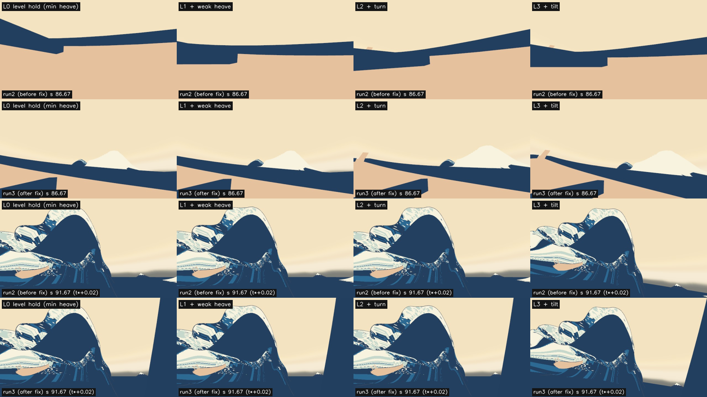
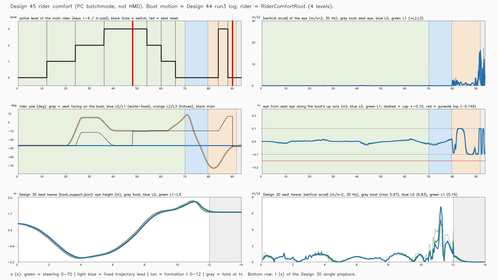
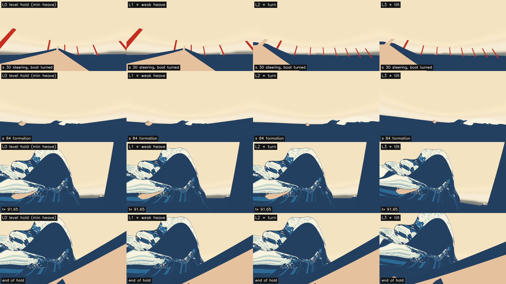
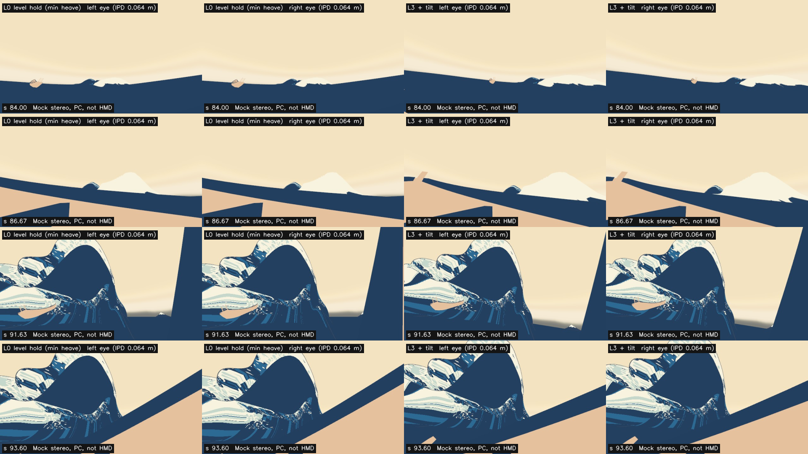

# 設計45：乗客の揺れを一種類ずつ調整する ― 物理の船と兄弟の RiderComfortRoot に、水平維持 → 弱い上下動 → 旋回 → 傾斜の 4 段を置き、HMD Camera の局所の姿勢には触れずに切り替えられるようにした。乗客は座席の枠の中に保つ。最小の受入 3 つは満たした（H5・H7 と試遊は保留の記録）

日付：2026-09-30／状態：**閉じた（使える水準。最小の受入 3 つを満たした。H5・H7 と PS VR2 の約 1 時間の試遊は保留の記録）**。修正は、作る部の中の 1 回（run2。記録のみの上下の倍率を自分で詰めた直し）と、進行役の独立の検査の後の 1 回（run3。必須の指摘の「座席に座っていない」）。直した問題は別で、Q26 の「同じ問題の修正は 1 回まで」の内と読んだ（第 5 節）。証拠の種類は次のとおり。**HMD 実機の結果ではない。利用者は確かめていない。船は設計44 の記録を入れただけで、物理は解き直していない。入力は Input System の仮想の機器で、手で押した確かめではない。**

- 作る部：Unity 6000.4.3f1 の Editor の batchmode（`DS45ComfortTest.Run`。Play モードではなく、乗客の部品の `Step`・`Apply`・`ResetSeat` を外から呼ぶ。設計44 の run3 の剛体の記録 `ds44_steps.csv`（120 Hz）を座席の船へ入れ、PC でオフスクリーン描画。RTX 3080、Direct3D11）、静的なコードの検査（`ds45_codecheck.py`）、numpy の測定・図・動画（`ds45_report.py`、ffmpeg）。
- 進行役の独立の検査：作る部の道具を使わない numpy の道具（リポジトリの外で書き、写しは Git 対象外の `Unity/Build/Design/45/indep_check/`。場面の YAML の読み取り `scene_check.py`、乗客の記録の数え直し `rider_check.py`）。判定は pass、**必須の指摘 1**（形成の間、どの段でも乗客が座席に座っていない）。
- 修正の回（run3）：作る部の上下の追従の numpy の写し（Git 対象外の写し `Unity/Build/Design/45/fix_model/model.py`。修正の報告では Unity の run2 と 5.9 × 10⁻⁵ m で合う）で案を比べ、頭打ちを船の枠へ移した（D45-10）。
- 記録の道具 `ds45_record.py`：作る部の SHA-256 の照合（26 件、すべて同じ）、作る部の測定の道具を使わない乗客の記録からの数え直し（[ds45\_record\_recount.json](../Evidence/Design/45/ds45_record_recount.json)。作る部の値との差は最大 0.0001）、証拠の写し、記録の metrics.json・run.json。

番号の前提：

- 対象：[段階9までの実行計画](../Design/Stage9_Plan_2026-09-26_ja.md)（以下「計画」）§2.4 の設計45。使える水準の成果物は「RiderComfortRoot に4段（水平維持 → 弱い上下動 → 旋回 → 傾斜）の設定。頭部の追跡は上書きしない（設計書 §7.3 の構造）。利用者の試遊記録（PS VR2、約1時間）」。最小の受入は「4段を切り替えられる。HMD Camera のローカル姿勢に手を入れていない（コードの検査）。H5・H7 の記録」。依存は設計44、バックログは 85（上下動の倍率、記録）。[制作設計書](../Design/GreatWave_VR_Production_Design_ja.md) §7.3（物理船と乗客側は兄弟のルートにし、船の回転が二重に乗客へ適用されないようにする。HMD Camera のローカル姿勢は頭部追跡へ任せ、平滑化・逆回転・演出用の揺れを上書きしない。最初の乗客設定は「着座、水平維持、上下動最小」、次に弱い上下動・旋回・傾斜を一種類ずつ足す。座席・手の到達位置・船体へのめり込みも評価する）と §9 の 45（水平維持→弱い上下動→旋回→傾斜の試遊記録）に当たる。H5 は「唇が頭上を越えるときの快適性」、H7 は「再センタリング・停止・復帰」のうちアプリ側の座席リセット（計画の H1〜H7 の割り当て）。バックログ 85 の中身は計画 §2.4 と §5 の文から読んだ。バックログの表のファイルは開いていない。
- 引き継ぎ：[設計44](Design_44_ja.md) の操船の場面 `DS44_Steer.unity`（`9ba4eaab…`）と run3 の剛体の記録（`ds44_steps.csv` `643b376f…`、`ds44_frames.jsonl` `e424d5e2…`）、[設計43](Design_43_ja.md) の 3 隻の表 `ds43_boats.json`（座席の目の点 `eyeLocal`、原画の向き −88.214°）、[設計41](Design_41_ja.md) の座席の目と船縁の関係（目は船縁の上端より 0.149 m 上、船の枠）、[設計30](Design_30_ja.md) の座席の上下 `boat_support.json`（`082906b7…`、30 Hz × 421 コマ、最大 5.97 m/s²）、座席 v1 の `Tools/GWContext/seat_v1.json`（`4f7553fd…`）。設計41〜44 の引き継ぎへの対応は第 6 節の初めに書いた。設計30 の far の半径 380〜600 m の弱めは、[設計43](Design_43_ja.md) の第 0 節の 5 に式が書かれている（設計30 の限界 7 は設計43 で閉じた）ことを確かめた。
- 時間の上限：Q26 の日程で 2 時間（計画 §2.6 の［Q26］の表、10/3 の行。計画の時間枠は ≤0.5日＋利用者の試遊）。範囲は最小の受入だけで、同じ問題の修正は 1 回まで。
  - 実績（ファイルの時刻。[metrics.json](../Evidence/Design/45/metrics.json) の `time.file_times`）：最初のフォルダー（`Unity/Build/Design/45`・`Unity/Assets/GreatWave/Design45`・`Tools/GWWaveGen/ds45`）12:20:10、`DS45ComfortConfig.cs` 12:20:26、`DS45ComfortSolver.cs` 12:20:56、`DS45ComfortInput.cs` 12:21:28、`DS45RiderComfort.cs` 12:21:37、表 `ds45_comfort.json` 12:21:50、`DS45ComfortTest.cs` 12:24:13、`run_ds45_unity.ps1` 12:24:40、Unity の run1 〜12:26:34、run1 の控え 12:32:46、`ds45_report.py` 12:33:12、run2 〜12:34:25、作る部の終わり 12:38 ごろ（報告）。進行役の独立の検査 12:39〜12:44（リポジトリの外の道具の時刻）。修正の回：numpy の写し 12:47〜12:51、run2 の控え 12:53:38、`DS45ComfortSolver.cs` 12:54:03、表 12:56:26、run3 12:56:46〜12:57:54（場面の保存 12:56:50）、図 12:59:29、動画と run.json 13:00:40。記録 13:02〜（終わりは `Unity/Build/Design/45/READY_TO_COMMIT.txt` の時刻）。最初のフォルダーから修正の最後の出力まで約 41 分、作る部の報告の始まり（12:11、読む時間を含む）からでも約 50 分で、2 時間の上限の内。
  - 1 回の計算：Unity の実行の中の時間 57.6 s・59.3 s・68.9 s（run1〜3。ログの `DS45_DONE seconds=`。run3 のループ 63.6 s）、報告の道具 71.2 s（run3）、記録の道具 8 s 前後。どれも 30 分の上限より十分短い。
- 読むだけで変えていないもの：`DS44_Steer.unity` は開いただけで保存せず、乗客を足した写しを新しい場面 `DS45_Comfort.unity` に保存した。原画視点の場面 `DS39_Paper.unity` は開いていない。守るファイル 19（設計44 の場面・部品 4・表・試験、設計30 の場面・再生器・`DS30BoatHeave.cs`・`boat_support.json`、設計42 の浮力の部品、設計43 の船用水面データと表、設計41 のプレハブ、設計44 の記録 2 つ、`seat_v1.json`、`DS39_Paper.unity`。`DS45ComfortTest.cs` の `Protected`）は 3 回の実行とも前後で SHA-256 が同じ（報告の `protectedUnchanged` true、`changedFiles` 空）。ProjectSettings は 3 回とも戻したファイル 0・新しいファイル 0（`ds45_settings_restore_run1〜3.json`）。
- **原画視点に触れていないので、計画 §2.0 の回帰の規則（評価器を回して合格した項目を後退させない）は当てはまらない。** 評価器は回していない。
- 座標と単位：Unity の世界（m・s、+y 上）。s は体験の秒（設計44 の筋書きの時刻）、t は単発再生の時刻（t\* = 12 s）。区間は、操船 s 0〜70、固定の軌道の形成の前 70〜79.6497、形成 79.6497〜91.6497（t 0〜12）、保持 91.6497〜93.667。「船の枠」は船の根の回転で見た座標（上向き・水平）。「座席の目」は船の根に固定した目の点（`ds43_boats.json` の boat\_mid の `eyeLocal`）。「1 段」は 1/120 s。加速度は 30 Hz（各コマの終わりの段）の位置の 2 階差分（設計30・44 の作る部と同じ測り方）。
- 使っていないもの：AGENTS.md の禁止の場所と、読み取りのみの例外（参照モデル・利用者の解算・写真・爪の分析）は、作る部・検査・修正・記録のどれも開いていない（記録のコミットの一覧の点検で、爪の分析のフォルダーのファイルの大きさだけを読み取りのみで調べた。第 9 節の 13）。ウェブも読んでいない（押送船の資料は要らなかった）。

## 見るもの

| 修正の前後（上 2 段：形成の t = 7.0 s（s 86.67）、下 2 段：t\* の 0.02 s 後（s 91.67）。各段の 1 段目が run2（修正の前）、2 段目が run3（修正の後）。左から L0〜L3。どれも頭を 30° 上げた試験だけのカメラ） |
| --- |
|  |

| 乗客の揺れの記録（左上：主の乗客の段と切り替え（黒）・座席リセット（赤）、右上：目の上下の加速度、左中：乗客の向き、右中：船の枠で座席の目から測った目の上向きの成分と頭打ち ±0.10 m・船縁の上端 −0.149 m、下：設計30 の座席の上下の高さと加速度） |
| --- |
|  |

| 4 段の 4 つの時刻（s 30 の操船・s 84 の形成・t\* 91.65・保持の終わり） | Mock の両目（L0 と L3、左右の目 ±0.032 m、s 84・86.67・91.63・93.60） |
| --- | --- |
|  |  |

- **動画 1（切り替え）**：[ds45\_main\_switching\_30fps.mp4](../Evidence/Design/45/ds45_main_switching_30fps.mp4)（1280 × 720、30 fps、2,811 コマ、93.7 s、H.264、4,828,891 バイト、SHA-256 `b3301965…`。作る部の出力のまま）。主の乗客の視点（頭を 30° 上げた試験だけのカメラ）に、今の段と、切り替え・座席リセットの文字（押した機器）を重ねた。PC の batchmode の描画で、HMD ではない。
  - 流れ：s 0〜70 は設計44 の操船（t = 0 の水）、s 70 で固定の軌道、s 79.65 から形成、s 91.65 の t\* の後 2 s 保つ。段は s 12 に L1（キー 2）、24 に L2（キー 3）、36 に L3（キー 4）、48 に座席リセット（R）、54・60・66 に十字キーの下で L2・L1・L0、84 に L3（キー 4）、88 に L0（キー 1）、90 に座席リセット（Select）。
  - 見どころ：s 20〜26 で船が右へ 45° 回る時、L0・L1 の間は視界が世界に止まったまま、L2 の間（s 24〜36）は船首とともに回る。s 48 と s 90 の座席リセットで向きが一度に座席の正面へ戻る（25.7°・52.7°）。形成の終わりは船が大きく傾くので、t\* と保持では右と下に自分の船の船縁と船体が入る（第 4 節の 1）。
- **動画 2（4 段の並べ）**：[ds45\_levels\_grid\_30fps.mp4](../Evidence/Design/45/ds45_levels_grid_30fps.mp4)（1280 × 720、30 fps、93.7 s、2,868,588 バイト、SHA-256 `2659c441…`）。段を固定した 4 つの乗客（L0〜L3。試験だけ）を 2 × 2 に並べた。作る部の出力（1920 × 1080、11,815,482 バイト、`0ad033f7…`）は 5 MB の目安を超えるので、記録の道具が ffmpeg（crf 26）で 1280 × 720 に縮めて写した。元の各区画は 640 × 360 の描画を拡大したものなので、縮めても細部は落ちない（記録の時にコマを取り出して見た）。
- 静止画（どれも 1920 × 1080、作る部の出力のまま）：[修正の前後](../Evidence/Design/45/fix_ds45_seated_before_after.png)、[乗客の揺れの記録](../Evidence/Design/45/fig_ds45_comfort.png)、[4 段の静止画](../Evidence/Design/45/stills_ds45_levels.png)、[Mock の両目](../Evidence/Design/45/stereo_ds45_mock.png)（描いた 32 枚（4 段 × 左右 × 4 時刻）のうち L0 と L3 の 16 枚）。

数値：

- [metrics.json](../Evidence/Design/45/metrics.json)（記録）：最小の受入 `acceptance`・`acceptance_record`、着座 `seated_fix_gate`、バックログ 85 `backlog85`、t\* `at_tstar`、修正 `fix_rounds`、数え直しの差 `record_recount`、時間 `time`
- 作る部の写し：[ds45\_comfort\_metrics.json](../Evidence/Design/45/ds45_comfort_metrics.json)（関門 `gates`・バックログ 85・設計44 の記録を入れた時の区間ごとの値 `run44Replay`）、[ds45\_unity\_report.json](../Evidence/Design/45/ds45_unity_report.json)（Unity の設定・構造の検査・HMD Camera の局所の姿勢・切り替えの記録・座席リセットの計算）、[ds45\_codecheck.json](../Evidence/Design/45/ds45_codecheck.json)（静的なコードの検査）、[ds45\_comfort\_run.json](../Evidence/Design/45/ds45_comfort_run.json)
- 記録の道具の数え直し：[ds45\_record\_recount.json](../Evidence/Design/45/ds45_record_recount.json)
- 実行条件と SHA-256：[run.json](../Evidence/Design/45/run.json)

## 0. 結論

1. **最小の受入 1：4 段を切り替えられる。** Input System の仮想のキーボードとゲームパッドの状態（`InputState.Change`）を、実際の機器と同じ読み方（`DS45ComfortInput.Read`）で読んだ。段は筋書きどおり L0 → L1 → L2 → L3 → L2 → L1 → L0 → L3 → L0 と 8 回変わり（4 段すべて）、座席リセットは 2 回。切り替えの 1 s の移しの後、主の乗客は同じ段に固定した乗客と位置の差 0 m・傾きの差 0°（9 区間）。切り替えの窓の 1 段の回転は最大 0.087°（段を固定した乗客は 0.061°）で、跳びの閾値（0.5°。D45-7）の下。押したままのキーは 1 回だけ効く（入力の確かめ）。
2. **最小の受入 2：HMD Camera の局所の姿勢に手を入れていない。** 静的なコードの検査で、実行時の部品が書くのは `transform.SetPositionAndRotation`（RiderComfortRoot 自身。`DS45RiderComfort.cs` 66 行）と、座席リセットの時の `xrOrigin.SetLocalPositionAndRotation`（90 行）の 2 つだけ。HMD Camera に触れる 3 行は読むだけ。Unity の中で 5 つの乗客 × 11,241 回（56,205 回）確かめ、HMD Camera の局所の位置の変化 0、回転の変化 0°。場面は設計書 §7.3 の構造（RiderComfortRoot と物理の船の根はどちらも場面の根で、互いの親ではない。RiderComfortRoot → XR Origin → Camera Offset → HMD Camera（TrackedPoseDriver））。
3. **最小の受入 3：H5・H7 の記録。** PS VR2 は未導入なので、H5・H7・約 1 時間の試遊は**保留**として記録した。PC の代わりに、H5 は 4 段の並べの動画と Mock の両目の静止画、H7 は座席リセットの計算の確かめ（仮の頭の姿勢 4 つで、頭が座席の目に来る誤差 0 m、向きの誤差 6.7 × 10⁻⁶°）を残した。
4. **修正（run3）で、どの段でも乗客を座席に保った。** run2 は形成の間、目が船の枠で座席の目から −0.576〜+0.557 m（L0）動き、形成の 53.75 % で船縁の上端より下へ沈んで、船内が視野を埋めた。頭打ちを船の枠の上下 ±0.10 m・水平 0.25 m へ移し、上下の追従を omegaV 4.0 にした（D45-10）。run3 は全区間・全段で −0.0999〜+0.0999 m、船縁の上端より下 0 %。
5. **バックログ 85（上下動の倍率、記録）。** 設計30 の座席の上下（船の最大 5.97 m/s²、95 % 3.00）で、L0 は最大 6.83 m/s²（船の 1.14 倍）・95 % 1.82、L1〜L3 は 5.19 m/s²（0.87 倍）・95 % 2.25。座らせたままにしたので、run2 の最大の 60 % 減（2.36 m/s²）は失った（限界 2）。設計44 の記録では、形成の上下の最大は船 16.54、L0 16.14、L1〜L3 15.27 m/s²（95 % は 8.71・5.86・6.86）。
6. **原画視点と評価器には触れていない**（新しい検査の場面 `DS45_Comfort.unity` だけ）。HMD（PS VR2）、Sense、手で押す確かめ、Play モードの頭部追跡は保留。
7. **限界（第 4 節）**：船そのものが形成と保持で最大 67° 傾き、保持で約 150°/s 回り、上下 17.8 m/s² になるので、どの段でも乗客を守りきれず、t\* と保持では自分の船の船縁・船体が視野の右と下に入る。L0 の保持の水平の加速度の最大が 22.87 m/s²（船 14.80 の 1.54 倍。記録の時に見つけた）。手と体の船体へのめり込みの確かめ（段階8 の出口）はしていない。Play モードの道、座席リセットの暗転なし、数値はすべて調整値。段階8確認、仕上げ41・43・44・47、設計46・47・50 へ送った。

---

## 1. 目的

設計書 §7.3 は、物理船（`BoatSimulationRoot`）と乗客側（`RiderComfortRoot`）を兄弟のルートにし、船の回転が二重に乗客へ掛からないようにする、HMD Camera の局所の姿勢は頭部追跡に任せて上書きしない、最初の乗客設定は「着座、水平維持、上下動最小」で、弱い上下動・旋回・傾斜を一種類ずつ足す、とする。計画 §2.4 の設計45 は、設計44 で操船できるようになった座席の船に、この乗客側の 4 段を足し、切り替えられることと HMD Camera に手を入れていないことを示し、H5・H7 を記録する番号である。

Q26 により、最小の受入だけを満たし、同じ問題の修正は 1 回までとした。

---

## 2. 表

### 2.1 乗客の部品（Unity の C#）

値はコード（`Unity/Assets/GreatWave/Design45/`）と表 `Data/ds45_comfort.json`（`170a2d83…`）。表の数値はすべて調整値で、資料の値ではない（D45-5）。

| 部分 | 中身 |
| --- | --- |
| `DS45RiderComfort`（RiderComfortRoot に付ける。実行の順 90） | 物理の船の根（`boatRoot`。読むだけ）の座席の目の点と回転から、乗客の姿勢を計算して RiderComfortRoot の Transform に書く（位置 = 乗客の目の点、回転 = 乗客の向き）。初期化の時、船の根と RiderComfortRoot の一方が他方の子なら止める（船の回転が二重に掛からないため）。`stepInLateUpdate` が真なら `LateUpdate` で今の機器を読んで進む。座席リセット（`ResetSeat`）は、乗客の向きを座席の正面へ戻し、HMD Camera と Camera Offset の局所の姿勢を読んで、今の頭が座席の目と正面に来るよう **XR Origin の局所の姿勢だけ**を書く |
| `DS45ComfortSolver`（MonoBehaviour を持たない計算。場面の部品と試験が同じものを使う） | 位置：船の座席の目の点を 2 次の追従（臨界減衰）で追い、差（速い成分）を打ち消す。水平は ω 4.0 rad/s で速度も追う（等速では遅れない）。上下は ω 4.0 rad/s、速度の先回りの重み betaV 0.5。速い上下は (1 − kV) の割合で、水平の細かい揺れは全段で打ち消す。打ち消す量は船の枠へ直して柔らかく頭打ち（tanh）：船の上向き +0.10 m・下向き −0.10 m、船の水平 0.25 m（修正の回。D45-10）。向き：`yawFollow` の段は船の首振りに付いて回り（座席の正面 = 船首 + 47.807°）、そうでない段は世界に固定。段を切り替えた時は今の向きから続ける。傾き：船の上向きの傾き（軸つき）を ω 3.0 で平滑化し、kTilt 倍して tiltMax で柔らかく頭打ち。段の値（kV・kTilt・tiltMax）は切り替えの時に 1 s で移す（smoothstep） |
| `DS45ComfortInput` | Unity の Input System。押した瞬間（前の状態からの変化）だけを返す。キーボード：1〜4 で L0〜L3、R で座席リセット。ゲームパッド（DualSense を含む）：十字キーの上・下で一つ上・下の段、Select（DualSense のクリエイト）で座席リセット。設計44 の操船（W/A/S/D・矢印・Space、左スティック・R2・L2・×）とは重ならない。PS VR2 の Sense は保留 |
| `DS45ComfortConfig` | 表を読む。4 段でない、正の値が要る項目が 0 以下、下向きの頭打ちが座席の目の船縁の上端からの高さ（0.149 m）以上、のどれかなら止める |
| 試験 `DS45ComfortTest` | `DS44_Steer.unity` を開き（保存しない）、座席の船（`DS44BoatSteer` の付いた根）の兄弟として RiderComfortRoot → XR Origin（XROrigin、Device、CameraYOffset 1.2）→ Camera Offset → HMD Camera（TrackedPoseDriver、RotationAndPosition）を作り、写しを `DS45_Comfort.unity` に保存する。比べるため、段を固定した 4 つの乗客（L0〜L3。試験だけ、保存しない）を足し、5 つの乗客の HMD Camera の子に、頭を 30° 上げた試験だけのカメラ（縦の画角 90°、640 × 360）を付ける。船は設計44 の run3 の `ds44_steps.csv`（11,240 段）をそのまま入れ、ほかの 2 隻と単発再生の時刻は `ds44_frames.jsonl`（2,811 コマ）から。主の乗客の段は筋書き（第 2.3 節）の仮想の機器で切り替える。各段の記録（CSV、11,240 行）、各コマの JPG（5 × 2,811 枚）、Mock の両目（試験だけのカメラを右向きに ±0.032 m ずらす。32 枚）。設計30 の座席の上下（原画の姿勢のまま鉛直に動かす、421 コマ）を 4 段へ入れる（描画なし）。HMD Camera の局所の姿勢を毎段調べ、構造・参照・座席リセットの計算を記録する |
| 検査・測定 `ds45_codecheck.py`・`ds45_report.py` | コードの検査は、受け手の式を正規表現で拾って、実行時の部品の書き込みを一覧にする。測定は、記録した乗客の根と船の根の位置・四元数から数える（部品の内部の値は使わない） |

### 2.2 4 段（D45-2）

値は `ds45_comfort.json`。

| 段 | 名前 | 速い上下を渡す割合 kV | 向き | 傾き |
| --- | --- | --- | --- | --- |
| **L0（既定）** | 水平維持（上下動最小） | 0 | 世界に固定 | 直立 |
| L1 | 弱い上下動 | 0.35 | 世界に固定 | 直立 |
| L2 | 旋回 | 0.35 | 船の首振りに付く | 直立 |
| L3 | 傾斜 | 0.35 | 船の首振りに付く | 船の傾きの 0.35 倍、柔らかい頭打ち 8° |

- 全段に共通：遅い上下（大波に持ち上げられるなど）は渡る（乗客が船から離れないため）。水平の細かい揺れは除く。目は船の枠で座席の目から上下 ±0.10 m・水平 0.25 m の中に保つ（D45-3、D45-10）。切り替えは 1 s で移し、向きは跳ばさない（D45-4）。
- 座席の正面は船首 + 47.807°（`seat_v1.json` の `view.recenter_yaw_deg` −40.407°（唇の方位）− 船の原画の向き −88.214°。D45-6）。
- 目の高さ 1.2 m（XR Origin を RiderComfortRoot の −1.2 m、Camera Offset を +1.2 m に置く。頭部追跡の値が 0 の時、HMD Camera の世界の位置は RiderComfortRoot と同じ。記録の数え直しで 5 つの乗客とも差 0 m）。

### 2.3 最小の受入 1：4 段を切り替えられる

値は [ds45\_unity\_report.json](../Evidence/Design/45/ds45_unity_report.json) の `switchLog`・`levelTimelineS`・`inputCheckJa`、[ds45\_comfort\_metrics.json](../Evidence/Design/45/ds45_comfort_metrics.json) の `run44Replay.switches`（作る部）と [ds45\_record\_recount.json](../Evidence/Design/45/ds45_record_recount.json) の `level_changes`・`resets`・`main_equals_fixed_level_after_blend`・`rotation_per_step`（記録）。

| s | 機器・入力 | 段 | 記録の数え直し |
| --- | --- | --- | --- |
| 12 | キーボード 2 | L0 → L1 | 同じ |
| 24 | キーボード 3 | L1 → L2 | 同じ |
| 36 | キーボード 4 | L2 → L3 | 同じ |
| 48 | キーボード R | 座席リセット（L3 のまま） | リセット 1 回目 |
| 54・60・66 | ゲームパッド 十字キーの下 × 3 | L3 → L2 → L1 → L0 | 同じ |
| 84 | キーボード 4 | L0 → L3 | 同じ |
| 88 | キーボード 1 | L3 → L0 | 同じ |
| 90 | ゲームパッド Select | 座席リセット（L0 のまま） | リセット 2 回目 |

- 入力の確かめ（試験の始め）：キー 3 → 段 2（keyboard）、押したまま → 何もしない、十字キーの上＋Select → 一つ上・座席リセット（gamepad）、離す → 何もしない。押したままのキーは 1 回だけ効く。予備の読み方は使っていない（`inputPath` は `InputState.Change`）。
- 各段が自分の設定を使っていること：切り替えから 1 s の後、次の切り替えまでの 9 区間で、主の乗客と同じ段に固定した乗客の差は位置 0 m・傾き 0°（段の数 359〜2,039。記録の数え直し）。操船の間（船は 51.2° 回る）、L0・L1 の向きの幅 0°、L2・L3 と座席の正面の差 ≤ 1 × 10⁻⁵°、傾きは L3 だけ（操船の間 最大 2.00°）。
- 跳び（D45-7。作る部の閾値：切り替えの窓で、1 段の回転 ≤ max(0.5°, 段を固定した 2 つの乗客の最大 + 0.05°)、船の目に対する目の動き ≤ max(1 cm, 同 + 2 mm)。座席リセットの段は除く）：

| 確かめ | 作る部（2·acos の角） | 記録の数え直し（atan2 の角） |
| --- | --- | --- |
| 切り替えの窓の 1 段の回転の最大（主） | 0.096°（s 24。固定の乗客 0.095°） | 0.087°（s 84、L0 → L3 の傾きの移し。固定の乗客 0.061°） |
| 船の目に対する目の動きの最大（主） | 0.0127 m（s 90 の窓。固定の乗客も 0.0127 m で、形成の動きそのもの） | — |
| 座席リセットの段の回転 | 25.675°・52.672° | 25.675°・52.672° |
| 座席リセットの段を除いた全区間の 1 段の回転の最大（主） | — | 0.0867° |
| L0・L1（回らない乗客）の 1 段の回転 | 0.03724°（床） | **0°** |

- 読み：切り替えで乗客は回されない（跳びは閾値の 1/5 の下）。向きが一度に変わるのは、利用者が押した座席リセットだけ（D45-4）。作る部の 2·acos(|a·b|) の角は、float32 の四元数の長さの誤差で、回らない乗客にも 1 段 0.037°（1 s 当たり 1.117°）の床が出る。作る部の metrics の L0・L1 の `angSpeed_degps` 1.1171 はこの床で、実際は 0（第 9 節の 8）。

### 2.4 最小の受入 2：HMD Camera の局所の姿勢に手を入れていない

値は [ds45\_codecheck.json](../Evidence/Design/45/ds45_codecheck.json)、`ds45_unity_report.json`、`ds45_record_recount.json` の `scene`・`hmd_world_minus_root_max_m`。

| 確かめ | 値 | 出どころ |
| --- | --- | --- |
| 実行時の部品（`Design45/Scripts`）の書き込み | 2 つだけ：`transform.SetPositionAndRotation(p.pos, p.rot)`（`DS45RiderComfort.cs` 66 行、RiderComfortRoot 自身）、`xrOrigin.SetLocalPositionAndRotation(o.pos, o.rot)`（90 行、`ResetSeat` の中だけ） | 静的な検査（作る部）。進行役の独立の検査の grep も同じ |
| HMD Camera・Camera Offset への書き込み | 0。HMD Camera に触れる 3 行（27・87・89 行）は宣言と読むだけ。`Camera.main` は使わない | 同上 |
| 試験（Editor）の書き込み | 乗客の組み立てと、HMD Camera の子の試験だけのカメラ（見上げ・Mock の両目のずらし）。HMD Camera の姿勢は書かない | 同上 |
| Unity の中の HMD Camera の局所の姿勢 | 56,205 回（5 × 11,241）で位置の変化 0、回転の変化 0° | 報告 `hmdLocalPosMaxAbsChange`・`hmdLocalRotMaxAngleDeg` |
| HMD Camera の世界の位置 − RiderComfortRoot | 5 つの乗客とも 0 m | 記録の数え直し |
| 構造 | RiderComfortRoot と「DS44 船 boat\_mid（物理の根）」はどちらも場面の根で、互いの祖先でない。RiderComfortRoot/XR Origin/Camera Offset/HMD Camera の鎖。HMD Camera に TrackedPoseDriver（XR の HMD の centerEye、RotationAndPosition） | 報告（作る部）、進行役の独立の検査の YAML の読み取り |
| HMD Camera を参照する部品 | `DS45RiderComfort.hmdCamera` と `XROrigin.m_Camera` の 2 つだけ。XROrigin は Device、CameraYOffset 1.2 | 同上 |
| 場面 `DS45_Comfort.unity` | 282,789 バイト、SHA-256 `13f7755a…`。GUID 34 のうち 30 は `DS44_Steer.unity` にあり、新しいのは `ds45_comfort.json`・`DS45RiderComfort.cs`・XROrigin（com.unity.xr.core-utils 2.5.3）・TrackedPoseDriver（com.unity.inputsystem 1.19.0）。2 つの包みは `Unity/Packages/manifest.json` にある | 記録の数え直し |

- 座席リセットは XR Origin の局所の姿勢だけを動かす（Unity の XR Origin の考え方。設計書 §7.3 の引用）。今の頭の位置と水平の向きを読んで、頭が座席の目と座席の正面に来るようにする。試験の終わりの XR Origin の局所の姿勢は (0, −1.2, 0)・回転なし（頭部追跡の値が 0 のため）。

### 2.5 最小の受入 3：H5・H7 の記録

| 項目 | 状態 | PC の代わりに残したもの |
| --- | --- | --- |
| H5（唇が頭上を越えるときの快適性、PS VR2） | **保留**（PS VR2 は未導入。導入は利用者の手） | 4 段の並べの動画（頭を 30° 上げた試験だけのカメラ）、主の乗客の切り替えの動画、Mock の両目の静止画（±0.032 m、s 84・86.67・91.63・93.60。32 枚描き、L0 と L3 の 16 枚を並べた） |
| H7（再センタリング・停止・復帰のうちアプリ側の座席リセット、PS VR2） | **保留**（計算の検査は済み。実機は未検証） | 仮の頭の姿勢 4 つで、XR Origin の局所の姿勢だけを書いた後の頭の位置の誤差 0 m、向きの誤差 6.7 × 10⁻⁶°。筋書きの中の座席リセット 2 回（キーボード R、ゲームパッド Select） |
| 利用者の試遊（PS VR2、約 1 時間） | **保留** | 上の動画だけ |

- 停止（計画の H7 の「停止」）はこの番号では作っていない。runtime 側の再センタリングと停止は設計10修正02、通しは設計50（計画の H1〜H7 の割り当て）。

### 2.6 着座（修正の回の確認。計画の最小の受入の外）

値は `ds45_record_recount.json` の `seated_boat_frame`（run3）と `run2_before_fix_seated_formation`（run2 の控え `ds45_rider_run2.csv`、`7c7a5570…`）。目は船の枠で座席の目から測った上向きの成分。船縁の上端は座席の目の 0.149 m 下（設計41 の最小の受入 3）。

| 回・区間 | L0（と主） | L1〜L3 | 船縁の上端より下にいた割合 |
| --- | --- | --- | --- |
| run2（修正の前）・形成 | −0.576〜+0.557 m | −0.517〜+0.500 m | L0 53.75 %、L1〜L3 46.74 %（0.3 m より上 26.0 %・22.2 %） |
| **run3（修正の後）・全区間** | −0.0999〜+0.0999 m | −0.0983〜+0.0995 m | **全段 0 %** |
| run3・形成 | −0.0999〜+0.0999 m | −0.0983〜+0.0995 m | 0 % |
| run3・操船 | −0.0272〜+0.0198 m | −0.0180〜+0.0131 m | 0 % |
| run3・設計30 の座席の上下 | −0.0983〜+0.0965 m | −0.0913〜+0.0864 m | 0 % |

- 船の枠の水平の成分の最大：run3 で L0 0.249 m・L1〜L3 0.238 m（頭打ち 0.25 m）。
- [修正の前後の図](../Evidence/Design/45/fix_ds45_seated_before_after.png)：s 86.67（形成の t = 7.0 s、船の傾き 12.5°）で、run2 は目が船の枠で L0 0.426 m・L1〜L3 0.314 m 沈んで 4 段とも船内だけが見えたが、run3（0.098 m・0.091 m）は 4 段とも船縁の上から空と富士が見える。s 91.67（t\* の 0.02 s 後、船の傾き 66.9°）では、run3（L0 は上 0.100 m・後ろ 0.246 m）は視野の右に自分の船の船縁・船体が入る。run2 は目が上 0.276 m・後ろ 0.502 m へずれていて一部隠れていた（第 4 節の 1）。値は `ds45_record_recount.json` の `before_after_frames_boat_frame`。

### 2.7 記録のみ（受入の外）：バックログ 85 と乗客の動き

値は `ds45_record_recount.json` の `heave30`・`acc_vert_30hz_mps2`・`acc_horiz_30hz_mps2`・`at_tstar`、`ds45_comfort_metrics.json` の `backlog85_heaveScale`・`run44Replay`（作る部。記録の数え直しとの差は最大 0.0001）。

**設計30 の座席の上下**（`boat_support.json`。船は原画の姿勢のまま鉛直だけ動く。30 Hz × 421 コマ、高さの幅 4.60 m）

| | 上下の加速度の最大 | 95 % | 船に対する最大の比 | run2 の最大 | run1 の最大 |
| --- | --- | --- | --- | --- | --- |
| 船（座席の目） | 5.969 m/s² | 2.996 | — | — | — |
| L0 | **6.830 m/s²** | 1.821 | **1.144** | 2.365 | 5.661 |
| L1〜L3 | 5.186 m/s² | 2.246 | 0.869 | 2.80 | 5.384 |

**設計44 の記録を入れた時**（上下の加速度の最大 / 95 %、m/s²）

| 区間 | 船（座席の目） | L0（既定） | L1〜L3 |
| --- | --- | --- | --- |
| 操船 s 0〜70 | 0.219 / 0.070 | 0.135 / 0.046 | 0.146 / 0.049 |
| 固定の軌道 s 70〜79.65 | 0.159 / 0.081 | 0.098 / 0.057 | 0.112 / 0.060 |
| 形成 | 16.54 / 8.71 | 16.14 / 5.86 | 15.27 / 6.86 |
| 保持 | 17.78 / 16.72 | 16.15 / 13.92 | 15.19 / 12.95 |

**水平の加速度**（最大 / 95 %、m/s²）

| 区間 | 船 | L0 | L1〜L3 |
| --- | --- | --- | --- |
| 操船 | 1.99 / 0.49 | 1.51 / 0.51 | 1.51 / 0.51 |
| 形成 | 12.29 / 4.86 | 10.23 / 5.81 | 8.87 / 5.26 |
| 保持 | 14.80 / 11.57 | **22.87** / 14.12 | 15.32 / 12.63 |

| 量 | 値 |
| --- | --- |
| 形成の上下の最大（修正の前後） | L0：run1 12.74、run2 26.28、run3 16.14 m/s²。L1〜L3：11.54・12.57・15.27 m/s²（船 16.54） |
| 保持の水平の最大（修正の前後） | L0：run1・run2 15.28、run3 22.87 m/s²（船 14.80） |
| 首振りの速さの最大 | 船 操船 10.02°/s・固定の軌道 14.01°/s・形成 7.07°/s・保持 3.35°/s。L0・L1 は 0、L2・L3 は船と同じ |
| 傾きの最大 | 船 66.97°。L3 7.884°（保持）・7.837°（形成）・2.00°（操船）。主 5.53°。L0〜L2 は 0 |
| 手の点（乗客の枠の ±0.25、−0.45、+0.35 m）の、船に固定した座席の枠からのずれ | 操船：L0・L1 0.427 m、L2 0.082 m、L3 0.077 m。形成：L0 0.719、L1 0.675、L2 0.675、L3 0.615 m。保持：0.629〜0.693 m |
| t\*（30 Hz のコマ s 91.633）の目の座席の目からのずれ | L0 0.268 m（船の枠：横 0.050、上 0.100、後ろ 0.244）、L1〜L3 0.258 m（0.042、0.099、0.235）。向きと座席の正面の差 L0・L1 0.38°、L2・L3 0° |
| 保持の終わりの目のずれ | L0 0.203 m、L1〜L3 0.173 m |

- 設計30 の上下では、L3 の傾き 7.55° は動きではなく、船の原画の姿勢の傾き 40.5° の 0.35 倍を 8° で頭打ちにした一定の値（8·tanh(14.18/8) = 7.55）。

### 2.8 作り方と採ったもの（Q24。進行役の判断で、利用者の決定ではない）

- **D45-1：乗客の回転の中心は座席の目。** RiderComfortRoot の位置を座席の目に置き、XR Origin を −1.2 m に下げる。理由：向きや傾きを変えても頭の位置が動かない。
- **D45-2：4 段の定義（第 2.2 節）と既定の L0。** 理由：設計書 §7.3 の最初の設定「着座、水平維持、上下動最小」と、「弱い上下動、旋回、傾斜を一種類ずつ追加」の順。
- **D45-3：遅い上下は全段で渡し、速い上下だけを段で変える。打ち消す量は頭打ちにする。** 理由：乗客が座席から離れないため（着座が先）。頭打ちの測り方は修正の回で D45-10 に改めた（run1・run2 は世界の上下で 0.45・0.6 m）。
- **D45-4：段を切り替えても乗客を回さない。向きを座席の正面へ戻すのは利用者の座席リセットだけ（瞬時）。** 理由：設計書 §7.3（HMD の頭を勝手に回さない）。
- **D45-5：段の値（kV 0.35、kTilt 0.35、tiltMax 8°、移し 1 s、ω など）はすべて調整値で、資料の値ではない。** 快適性の資料（設計書が挙げる Meta の locomotion comfort など）は読んでいない（ウェブを読まなかった）。
- **D45-6：座席の正面は座席 v1 の再センタリングの向きから。** 船首 + 47.807°。
- **D45-7：跳びの閾値**（第 2.3 節）は作る部が決めた。計画の「切り替えられる」を「跳ばずに、段ごとの設定へ移る」と読んだ（進行役の解釈）。
- **D45-8：H5 の PC の代わりは、HMD Camera の子に付けた、頭を 30° 上げた試験だけのカメラ**（場面には保存しない）。
- **D45-9：キーとボタン**（キー 1〜4・R、十字キーの上下・Select）。操船と重ならないものを選んだ。Sense は保留。
- **D45-10（修正の回）：頭打ちを船の枠で測る。上 0.10 m・下 0.10 m・水平 0.25 m、omegaV 4.0、betaV 0.5。** 理由：座席の目は船縁の上端より 0.149 m 上なので、下 0.10 m なら目は船縁の上に残る。この予算で、形成の上下の最大が船より大きくならない所として omegaV を選んだ（上下の追従の numpy の写しで、omegaV 1〜8、betaV 0・0.25・0.5・1、積分の飽和を抑える案、柔らかい壁のばねを比べた）。落とした：壁のばね（保持の最大が船の 1.3〜3.9 倍）、飽和を抑える案（良くならない）、betaV 1（L0 の保持が船の 1.5〜1.6 倍）。これは修正の報告の値で、比べた表のファイルは残っていない（第 9 節の 7）。**既定値・利用者未回答**。
- **検査は写しの場面 `DS45_Comfort.unity` で行い、原画視点の場面は開かない。** 船は設計44 の記録を入れ、物理は解き直さない。理由：評価器の回帰の規則の対象にせず、同じ船の動きで 4 段を比べられる。
- 記録の判断：作る部の run2 は記録のみの上下の倍率を自分で詰めた直しで、Q26 の 1 回は検査の必須の指摘を直した run3 に当てた読み（第 5 節）。バックログ 85 の中身は計画の文から読み、表のファイルは開いていない。

---

## 3. 関門

| 最小の受入・規則 | 基準 | 値 | 判定 |
| --- | --- | --- | --- |
| 4 段を切り替えられる | 筋書きの 4 段と座席リセットが効く。各段が自分の設定に移る。切り替えで跳ばない（D45-7） | 段の変化 8 回（4 段すべて）、リセット 2 回。移しの後の固定の乗客との差 0 m・0°。切り替えの窓の 1 段の回転 ≤ 0.087°（閾値 0.5°） | 合格 |
| HMD Camera の局所の姿勢に手を入れていない（コードの検査） | 実行時の部品が HMD Camera・Camera Offset を書かない | 書き込みは RiderComfortRoot 自身と、座席リセットの XR Origin の 2 つだけ。Unity の中で 56,205 回、変化 0 | 合格 |
| H5・H7 の記録 | 記録がある | H5・H7・試遊は保留（PS VR2 は未導入）。PC の代わりの動画・Mock の両目・座席リセットの計算の確かめ | 合格（保留の記録として） |
| 着座（修正の回の確認） | どの段でも目が船縁の上端より上、船の枠で ±0.10 m の中 | 全段・全区間で −0.0999〜+0.0999 m、船縁の上端より下 0 % | 合格（受入の外） |
| バックログ 85（上下動の倍率） | 記録 | 設計30 の上下で L0 1.144 倍・L1〜L3 0.869 倍（最大）、95 % は 0.61・0.75 倍 | 記録のみ（仕上げ47） |
| 計画 §2.0 の回帰なし | 原画視点に触れた時だけ | 原画視点の場面・評価器の入力は開いていない | 対象外 |
| 守るファイル・ProjectSettings | 変えない | `protectedUnchanged` true（3 回）、設定の戻し 0（3 回） | 合格 |
| HMD（PS VR2）・Sense・手で押す機器 | — | — | 保留（利用者の手） |

---

## 4. 限界

1. **船そのものの動き（設計44 から。段階8確認、仕上げ43・仕上げ44）。** 設計44 の物理の座席の船は、形成で最大 66.97° 傾き、保持で約 150°/s（最大 151°/s）回り、座席の目の上下の加速度は保持で 17.78 m/s²。どの段も乗客を座らせたままでは守りきれない（L3 の傾きは 7.88° まで、L0〜L2 は直立のまま）。乗客を座席に保った run3 では、t\* の後と保持の終わりに、自分の船の持ち上がった船縁・船体が見上げの視野の右の約 1/5 と右下に入る（[4 段の静止画](../Evidence/Design/45/stills_ds45_levels.png)の下の 2 段、[Mock の両目](../Evidence/Design/45/stereo_ds45_mock.png)）。段階8 の出口「船の浮き方が表示面と整合」で判定する。
2. **上下の倍率（仕上げ47。バックログ 85）。** 座らせたまま（±0.10 m）にしたので、run2 の設計30 の上下の最大の 60 % 減は失った。L0 の最大は 6.83 m/s² で船の 5.97 より 14 % 大きい（頭打ちに何度も当たるため）。95 % は 1.82 で船の 3.00 より 39 % 小さい。L1〜L3 は最大 5.19（13 % 小さい）。形成の動きもほとんど減らない（L0 16.14 対 船 16.54 m/s²、95 % 5.86 対 8.71）。0.10 m の予算で除けるのは速い成分だけで、上下を下げるには元（海と船の動き）を変えるか、再生の時間表を先読みする賢い追従が要る。計画 §5 に仕上げ45 の群はなく、バックログ 85 は仕上げ47（84〜87、接近の上下動の成長）の群に入るので、そこへ送る。
3. **L0 の保持の水平の加速度（仕上げ47。記録の時に見つけた）。** 船の枠の頭打ちでは、船が約 150°/s で回る保持の間、打ち消す量が船とともに回るので、L0 の水平の加速度の最大が 22.87 m/s²（船 14.80 の 1.54 倍。run1・run2 は 15.28）、95 % 14.12（船 11.57）になる。L1〜L3 は 15.32（1.03 倍）。形成でも L0 の 95 % 5.81 は船の 4.86 より大きい。保持は t\* の後で、設計47 の余韻でこの状態が続くなら、限界 1 と合わせて直す。
4. **手と体の船体へのめり込みを確かめていない（段階8確認、仕上げ41）。** 設計書 §7.3 と段階8 の出口「手元や座席が船体へめり込まない」の確かめはしていない。乗員の姿（アバター）はなく、手の点と船に固定した座席の枠のずれ（形成で最大 0.72 m、L0）だけを測った。L0〜L2 は船とともに傾かないので、船が傾くと手の点が船縁の側へずれる。設計41 の衝突形状は船内を埋める凸包で、乗客の確かめには使えない（設計41 の限界 8）。
5. **目は船の枠で水平に 0.25 m まで動く。** 座った体の傾きとして許したが、t\* で座席の目から後ろへ 0.244 m・上へ 0.100 m ずれている。
6. **Play モードの道を回していない（設計46・設計47）。** 試験は Play モードではないので、TrackedPoseDriver、`LateUpdate` での進み、船の Rigidbody の補間との順序（乗客の揺れの細かいがたつき）、XR Origin の Device の実行時の高さの扱いは動いていない。HMD Camera は Untagged で、`Camera.main` では見つからない。保存した `DS45_Comfort.unity` は、乗客の部品が `stepInLateUpdate: 1`・`readInput: 1` だが、船の 4 つの部品は設計44 と同じく `stepInFixedUpdate: 0` なので、そのまま Play すると船は動かず、乗客は止まった船に付く（設計44 の限界 5）。
7. **入力は仮想の機器だけ。** 手で押すキーボード・ゲームパッド、DualSense の Select（クリエイト）の割り当て、PS VR2 の Sense は確かめていない（保留）。
8. **座席リセットは暗転なしで瞬時に回す**（試験で 25.7°・52.7°）。利用者の操作なので D45-4 の内だが、VR の快適さは確かめていない（設計50 の H7、仕上げ）。
9. **数値はすべて調整値**（D45-5、D45-7、D45-10）。快適性の資料と比べていない。
10. **Mock の両目は試験だけのカメラを ±0.032 m ずらした PC の描画**で、HMD の両目ではない。図には L0 と L3 だけを並べた（L1・L2 の 16 枚は Git 対象外のコマ）。
11. **設計30 の座席の上下の確かめは、船を原画の姿勢（傾き 40.5°）のまま鉛直に動かしたもの**（設計30 の `DS30BoatHeave` と同じ）。L3 の 7.55° はこの姿勢の一定の傾き（第 2.7 節）。
12. **L2・L3 は船の首振りに付くので、設計44 の固定の軌道の首振り 14.0°/s（上限 10°/s。設計44 の限界 1）がそのまま乗客に来る**（仕上げ44）。
13. **Unity の警告**：`DS45ComfortTest.cs` に、使うのをやめるよう勧められた API（`FindFirstObjectByType`・`FindObjectsSortMode`）の警告 CS0618 が 3 行（ログでは 2 回ずつ）。誤り 0、例外 0、終わりの戻り値 0。設計43・44 の試験と同じ書き方。
14. **改行**：`Unity/Assets/GreatWave/Design45/` は `.gitattributes` に文がない（設計32〜44 と同じ）。テキストの資産のうち `ds45_comfort.json` は CRLF、ほかは LF。道具（`Tools/GWWaveGen/**`）と証拠（`Docs/Evidence/Design/**`）は既存の文でバイトのまま（`run_ds45_unity.ps1` は CRLF、ほかの道具は LF）。`.gitattributes` に設計45 の文を足すかは、コミットの時に進行役が決める（この記録では `.gitattributes` を変えていない）。
15. 崩壊は作らない（Q11）。

---

## 5. 修正の記録（Q26：同じ問題の修正は 1 回まで）

| 回 | 変えたこと | 結果 |
| --- | --- | --- |
| 作る部 run1（〜12:26:34。Unity の中 57.6 s） | 表・入力・計算・部品・試験を作り、最初の実行（上下の追従 ω 2.5、速度の先回り 1、世界の上下で頭打ち 0.45 m） | 最小の受入 2 つは満たした。設計30 の上下で L0 の最大 5.66 m/s²（船 5.97 の 5 % 減だけ）。控えは `Unity/Build/Design/45/comfort/run1/` |
| 作る部 run2（〜12:34:25。59.3 s） | `betaV` を足し、ω 1.0・betaV 0.5・頭打ち 0.6 m | 設計30 の上下で L0 2.36 m/s²（60 % 減）。作る部はこれを「修正の回」と書いた |
| 進行役の独立の検査（12:39〜12:44） | 自前の段の変化・固定の乗客との一致・跳び・HMD の参照・場面の YAML・船の枠の目の位置・動画のコマ | pass。**必須の指摘 1**：形成の間、どの段でも乗客が座席に座っていない（船の枠で L0 −0.58〜+0.56 m、船縁の上端より下 54 %。s 86.67 で 4 段とも船内が視野を埋める）。原因は run2 の上下の追従。記録の指摘は第 9 節 |
| **修正の回 run3**（12:47〜13:00:40。Unity の中 68.9 s） | 頭打ちを船の枠の上 0.10・下 0.10・水平 0.25 m へ移し、omegaV 4.0（D45-10）。表の検査に「下向きの頭打ち < 0.149 m」を足した。Mock の両目、着座の関門、図の船の枠の区画、修正の前後の図を足し、座席リセットの印を赤く太くした。run2 の出力・コマ（2520・2600・2750）・報告の道具は `Unity/Build/Design/45/comfort/run2/` に控えた | 全段・全区間で目は ±0.10 m、船縁の上端より下 0 %。設計30 の上下の最大の減りは失った（限界 2）。受入 1・2 の値は変わらない（HMD の変化 0、書き込み 2 つ） |
| 記録（13:02〜） | `ds45_record.py` で照合と数え直し、証拠の写しと 4 段の並べの動画の縮めた写し | 作品には触れていない |

- 修正は 2 回あるが、直した問題は別：run2 は、作る部が自分で詰めた記録のみの上下の倍率（バックログ 85）、run3 は、検査の必須の指摘の着座。どちらも上下の追従の同じ所を変えたので、run3 は run2 の直しが生んだ欠陥を直したことになる。Q26 の「同じ問題の修正は 1 回まで」（AGENTS.md の「同じ問題の修正は 2 回まで」を 1 回と読む）の内と読み、Q26 の 1 回は run3 に当てた（設計44 の記録と同じ整理）。
- 修正の後に残った問題は、第 4 節の限界として後の番号と仕上げへ送った。

---

## 6. 引き継ぎ

設計41〜44 の引き継ぎへの対応：座席 v1 と船縁の値（設計41、目は船縁の上端より 0.149 m 上）は、着座の頭打ちの予算に使った（D45-10）。t\* で右舷の船縁が目の高さに来ること（設計41 の限界 5）は、t\* の見上げの視野の右に船縁が入ることで確かめた（限界 1）。衝突形状は乗客には使えない（設計41 の限界 8）ので、めり込みは確かめていない（限界 4）。設計42 の横揺れ（GM\_T 0.384 m、周期 1.94 s）と設計43 の上下の加速度（boat\_mid の打ち上げ 15.2 m/s²）は、設計44 の記録を通して入った（形成の船の上下 16.54 m/s²）。設計44 の形成の傾き 67°・上下の加速度・操船の間の上下 ≤ 0.14 m/s²（4 段の移動平均。この記録の 30 Hz の 2 階差分では 0.22 m/s²）は第 2.7 節に記録した。引き継ぎの横の加速度の段（設計44 の限界 2）は、どの段でも水平の細かい揺れを除くので乗客には小さくなる（固定の軌道の区間の水平の最大 船 3.92、L0 0.91 m/s²）。HMD の確かめは保留のまま。

**設計46**（共通時計）：乗客の部品は `LateUpdate` で `Time.deltaTime` だけ進む。共通時計・船の物理・乗客を同じ段で進める順序（船の後に乗客）と、Rigidbody の補間との関係（限界 6）。

**設計47**（導入→余韻）：Play モードの道（船の部品の `stepInFixedUpdate`、乗客の `LateUpdate`、限界 6）。t\* の後の余韻で船が大きく傾き回ったままなら、限界 1・3 がそのまま体験に出る。原画の場面の船を物理の船に置き換える時、RiderComfortRoot も同じ場面に置く。

**設計50**（通しの試遊）：揺れ軽減の切替（計画の設計50 の「停止と揺れ軽減の切替」）は、この番号の 4 段と座席リセット（キー 1〜4・R、十字キー・Select）を使える。入口画面の操作説明に載せる。H7 の通し。

**仕上げ47**（84〜87）：バックログ 85 の上下の倍率（限界 2）と L0 の保持の水平の加速度（限界 3）。

**仕上げ41**（乗員）：手と体のめり込みの確かめ（限界 4）。

**仕上げ43・仕上げ44**：船の傾きと回り（限界 1）、固定の軌道の首振り 14°/s が L2・L3 に来ること（限界 12）。

**保留（利用者の手）**：H5・H7・約 1 時間の試遊（PS VR2）、Sense、手で押す機器。D45-10 は既定値・利用者未回答。

**段階8確認（自己評審）**：最初に[修正の前後の図](../Evidence/Design/45/fix_ds45_seated_before_after.png)と[切り替えの動画](../Evidence/Design/45/ds45_main_switching_30fps.mp4)を見て、第 2.3〜2.6 節の表と第 3 節の関門を見る。段階8 の出口のうち「頭部追跡を上書きしない」はこの番号で PC の確かめをした。「手元や座席が船体へめり込まない」は確かめていない（限界 4）。「船の浮き方が表示面と整合」は限界 1 を見る。

---

## 7. 再現

リポジトリの根で行う。前提（どれも Git 対象外）：設計44 の run3 の記録 `Unity/Build/Design/44/steer/unity/ds44_steps.csv`（`643b376f…`）・`ds44_frames.jsonl`（`e424d5e2…`）・`ds44_unity_report.json`、設計30 の `Unity/Build/Design/30/sea/boat_support.json`（`082906b7…`）、設計28修正01・設計30 の再生の出力（`DS44_Steer.unity` が読む）。設計41〜44 の資産はコミット済み。

道具は `py -3.10`（Python 3.10.6、numpy 2.2.6、OpenCV 4.12.0）、Unity 6000.4.3f1（batchmode、`Unity/Build/unity.lock` で排他）、ffmpeg（`G:/ffmpeg-2024-12-19-git-494c961379-full_build/bin/ffmpeg.exe`）。

1. Unity：`powershell -NoProfile -ExecutionPolicy Bypass -File Tools/GWWaveGen/ds45/run_ds45_unity.ps1 -Method GreatWave.Design45.EditorTools.DS45ComfortTest.Run -Log run3`（Unity の中 68.9 s。`DS45_Comfort.unity` を保存し、`Unity/Build/Design/45/comfort/unity/` に乗客の CSV・設計30 の上下の CSV・JPG（5 × 2,811 枚と Mock の両目 32 枚）・報告を書く。ProjectSettings は控えと比べて戻す）
2. コードの検査：`py -3.10 -B Tools/GWWaveGen/ds45/ds45_codecheck.py`
3. 測定・図・動画・metrics：`py -3.10 -B Tools/GWWaveGen/ds45/ds45_report.py`（71.2 s。設計44 の `ds44_report.py` の描画の部品を使う。cp932 の端末では `PYTHONIOENCODING=utf-8` を付ける）
4. 記録：`py -3.10 -B Tools/GWWaveGen/ds45/ds45_record.py`（作る部の SHA-256 を照合し（違えば止まる）、乗客の記録から数え直し、証拠を写し、4 段の並べの動画を縮め、記録の metrics.json・run.json を書く。8 s 前後）

---

## 8. 出典と、この番号で作ったもの

- 仕様：計画 §2.4 の設計45、§2.0（回帰の規則）、§2.6（Q26 の日程）、§3 の段階8確認と H1〜H7 の割り当て、§5（仕上げ41・43・44・47）。[制作設計書](../Design/GreatWave_VR_Production_Design_ja.md) §7.3・§9 の 45。[制作手順](../Workflow/Production_Workflow_ja.md)の Q11・Q24・Q26。[設計41](Design_41_ja.md)〜[設計44](Design_44_ja.md)の記録の限界と引き継ぎ、[設計30](Design_30_ja.md)の座席の上下。
- 読むだけ：設計44 の場面・部品・記録、設計43 の表、設計30 の `boat_support.json`、`seat_v1.json`、`Unity/Packages/manifest.json`（Input System 1.19.0、XR Core Utils 2.5.3）。
- この番号で作ったもの（コミットするもの）：
  - 道具 `Tools/GWWaveGen/ds45/`：`run_ds45_unity.ps1`（Unity の 1 回の実行、`unity.lock`、設定の戻し）、`ds45_codecheck.py`（コードの検査）、`ds45_report.py`（測定・図・動画・metrics）、`ds45_record.py`（記録）。
  - Unity の資産 `Unity/Assets/GreatWave/Design45/`（と `Design45.meta`、フォルダーの .meta 4 つ）：`Scripts/DS45RiderComfort.cs`・`DS45ComfortSolver.cs`・`DS45ComfortInput.cs`・`DS45ComfortConfig.cs`、`Editor/DS45ComfortTest.cs`、`Data/ds45_comfort.json`、場面 `Scenes/DS45_Comfort.unity`（282,789 バイト、`13f7755a…`）と各 .meta。
  - 証拠 `Docs/Evidence/Design/45/`：1920 × 1080 の PNG 4 枚（修正の前後・乗客の揺れの記録・4 段の静止画・Mock の両目）、MP4 2 本（切り替え 4.83 MB、4 段の並べ 2.87 MB）、作る部の JSON の写し 4、記録の数え直しの JSON 1、metrics.json、run.json。
  - 記録：この文書と、進捗の表の設計45 の行。
- コミットしないもの（Git 対象外の `Unity/Build/Design/45/`）：作る部の全出力 `comfort/`（乗客の CSV、設計30 の上下の CSV、JPG 14,087 枚（約 236 MB）、ログ 3 本、設定の戻しの記録、run1・run2 の控え、4 段の並べの動画の元の 1920 × 1080 版）、進行役の独立の検査の写し `indep_check/`、修正の回の上下の追従の numpy の写し `fix_model/`、コミットの一覧の点検 `record/`。
- git：作る部・検査・修正・記録は git を使っていない（各報告。記録はコミットの一覧の点検で `.gitignore` をファイルとして読んで照らした）。

---

## 9. レビュー対応

作る部の後に進行役の独立の検査を通した。判定は pass、必須の指摘 1、記録の指摘 6（ほかに、記録と README とコミットは進行役に残す、という 1 件）。修正の回の後、記録の時に SHA-256（26 件）の照合と乗客の記録からの数え直しを行い、指摘を足した。

| # | 指摘（出どころ） | 対応 |
| --- | --- | --- |
| 1（独立の検査・必須） | 形成の間、どの段でも乗客が座席に座っていない。目が船の枠で L0 −0.576〜+0.557 m、L1〜L3 −0.517〜+0.500 m、船縁の上端より下 L0 53.8 %・L1〜L3 46.7 %。s 86.67 で 4 段とも船内が視野を埋める。作る部の記録は、船内が見えるのを保持の終わりの船の傾きのせいとだけ書いていた | 修正の回 run3（D45-10、第 5 節）。記録の数え直しで run2 の控えから同じ値（53.75 %・46.74 %）、run3 で全段 0 % を確かめた。修正の前後の図 |
| 2（独立の検査） | Mock の両目がない（設計34・40 は Mock の両目を描いた） | 修正の回で、試験だけのカメラを ±0.032 m ずらした Mock の両目を足した（32 枚、図は L0 と L3）。限界 10 |
| 3（独立の検査） | run2 で L0 の形成の上下の最大 27.0 m/s² が船の 17.0 より大きい（頭打ちに当たるため） | run3 で L0 16.14・船 16.54 m/s²（記録の数え直しと同じ）。代わりに設計30 の上下の最大の減りを失った（限界 2） |
| 4（独立の検査） | 手の到達位置と船体へのめり込みの確かめがない | 限界 4（段階8確認、仕上げ41） |
| 5（独立の検査） | 設計44 から、t\* で座席の船が 67.0° 傾いている | 限界 1（段階8確認、仕上げ43・44） |
| 6（独立の検査） | Play モードの TrackedPoseDriver・`LateUpdate`・Rigidbody の補間（がたつき）、XR Origin の Device の実行時の扱い、実際のキーボード・ゲームパッド・Sense を確かめていない。座席リセットは暗転なしで瞬時。数値と閾値は調整値 | 限界 6〜9（設計46・47・50、保留） |
| 7（独立の検査・修正の回） | 図の s 48 の座席リセットの印が黒い（凡例は赤） | 修正の回で赤く太くした。記録の時に図を開いて、s 48 と s 90 の印が赤いことを見た。修正の回が比べた案の表（壁のばね・飽和を抑える案・betaV 1 の倍率）は修正の報告の文にだけあり、ファイルには残っていない（D45-10 の「落とした」の値） |
| 8（記録の時） | 作る部の L0・L1 の角速度 1.1171°/s（1 段 0.03724°）は、回らない乗客の値としておかしい | 作る部の 2·acos(|a·b|) の角の、float32 の四元数の長さの誤差による床。記録の数え直し（atan2）で L0・L1 は 0°、L2・L3 の最大 0.117°。切り替えの判定は床の上でも閾値の下なので、判定は変わらない（第 2.3 節） |
| 9（記録の時） | run3 で L0 の保持の水平の加速度の最大 22.87 m/s²（船の 1.54 倍）。作る部の metrics にはあるが、報告・修正の報告・検査は触れていない | 記録の数え直しで同じ値。限界 3（仕上げ47） |
| 10（記録の時） | 作る部の報告の時間「約 27 分（12:11〜12:38）」 | ファイルの最初は 12:20:10。記録はファイルの時刻を使い、報告の始まり（読む時間を含む）も書いた（番号の前提） |
| 11（記録の時） | 作る部は run2 を「修正の回」と書き、修正の回は run3 を「Q26 の 1 回」と書く | 別の問題への 1 回ずつと読み、第 5 節に整理した。作る部のファイルは変えていない |
| 12（記録の時） | 設計44 の記録の形成の上下 ≤ 11.50 m/s² と、この番号の船の 16.54 m/s² が違う | 測り方の違い（設計44 は 4 段の移動平均、この番号は 30 Hz の各コマの終わりの 2 階差分）。同じ `ds44_steps.csv` から数えた |
| 13（記録の時） | コミットの一覧の点検 | 結果は `Unity/Build/Design/45/record/ds45_commit_scan.json`（Git 対象外。点検の道具 `ds45_commit_scan.py` も、禁止の場所の文字列を持つので Git 対象外）。37 ファイル（合計 約 11.9 MB）で、見つからないファイル 0、禁止の場所と読み取りのみの例外の場所の文字列 0、一時の場所・個人の場所の文字列 0、5 MB を超えるファイル 0（最大は MP4 4,828,891 バイト）、.meta の欠け 0・余り 0、`.gitignore` の規則に当たるファイル 0。爪の分析のフォルダーの 5,368 ファイルの大きさを読み取りのみで調べ、大きさが同じ組 0（同じファイル 0） |
| 14（記録の時） | 場面の依存 | `DS45_Comfort.unity` の GUID 34 のうち、`DS44_Steer.unity` にないのは 4：この番号の `ds45_comfort.json`・`DS45RiderComfort.cs`、包みの XROrigin（com.unity.xr.core-utils）と TrackedPoseDriver（com.unity.inputsystem）。どちらの包みも `manifest.json` にある。`ds45_report.py` は設計44 の `ds44_report.py`（コミット済み）を読む |
| 15（記録の時） | 4 段の並べの動画 11.8 MB は 5 MB の目安を超える | 記録の道具が 1280 × 720・crf 26 で 2.87 MB に縮めて証拠へ写した。元は Git 対象外 |
| 16（記録の時） | 改行と `.gitattributes` | 限界 14 |

- 独立の検査で合格したもの（検査の時の run2 の記録。検査の道具の Git 対象外の写しを記録の時に回し直した出力が `Unity/Build/Design/45/indep_check/ck45_rider_run2_stdout.txt`・`ck45_scene_stdout.txt`）：段の変化の時刻と向き先、4 段すべてを通ること、座席リセット 2 回、移しの後の固定の乗客との一致（位置 0 m、傾き 7.6 × 10⁻⁷° 以下）、操船の間の L0・L1 の向きの幅 0°・L2 と座席の正面の差 0°・L3 だけの傾き 7.88°、切り替えの窓（−0.1〜+2 s）の 1 段の回転 0.037〜0.096°・船の目に対する目の動き ≤ 0.0043 m（固定の乗客 ≤ 0.0066 m）、HMD Camera の世界の位置と RiderComfortRoot の差 0、場面の鎖（XR Origin −1.2 m、Camera Offset +1.2 m、HMD Camera 0）と HMD Camera を参照する 2 つの部品、実行時の書き込み 2 つ。同じ道具を run3 の記録に回し直すと、段・一致・回転は同じで、目の動きは ≤ 0.0046 m（固定の乗客 ≤ 0.0046 m）（`ck45_rider_run3_stdout.txt`）。検査の報告の文には、ほかに、バックログ 85 の値（作る部との差は測り方で約 4 % 以内）、Git の tracked のファイルの変更なし、`unity.lock` の解放（記録の時もなかった）、s 86.67 の 4 段の見え方（Git 対象外の写し `indep_check/grid_s86p67.png`）がある。
- 記録の数え直し（[ds45\_record\_recount.json](../Evidence/Design/45/ds45_record_recount.json)）と作る部の値の差：区間ごとの上下・水平の加速度の最大 0、船の枠の目の最小・最大 0、設計30 の上下の最大 ≤ 0.0001 m/s²（船）、t\* の目のずれ 0。
