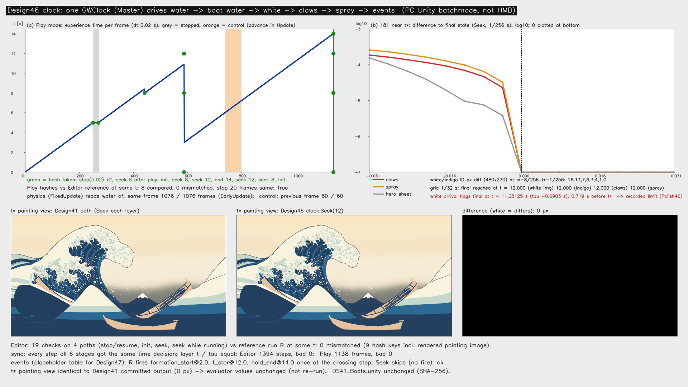
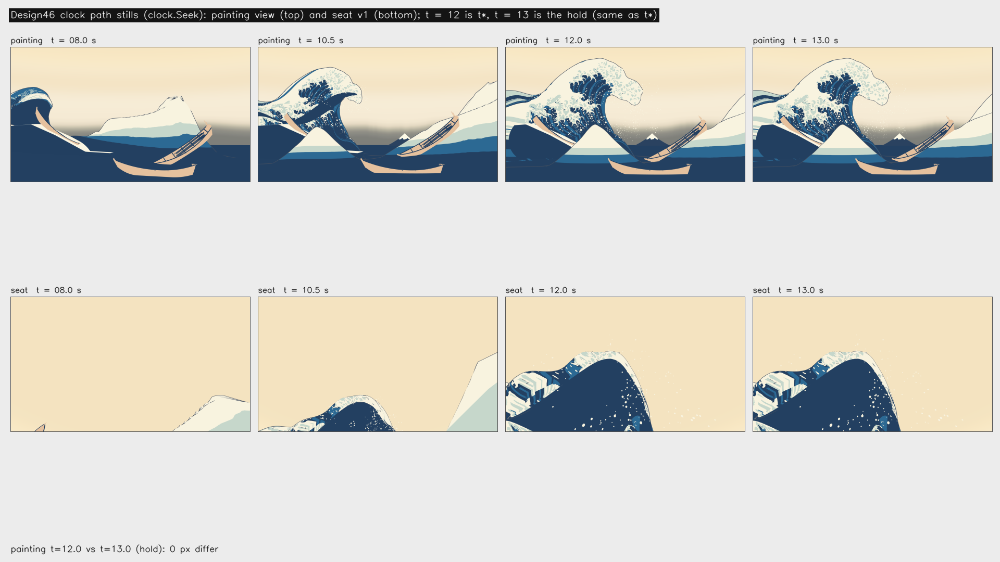

# 設計46：共通時計で水面・白波・船用データを同期する ― GWClock を Master に広げて体験の時刻の唯一の持ち主にし、水面 → 船用水面データ → 白・藍 → 爪 → 飛沫 → 出来事を同じ時刻で順に進める。最小の受入 2 つは満たした（段階8確認 F8-3 のうち、閉じたのは時計の側だけ）

日付：2026-09-30／状態：**閉じた（使える水準。最小の受入 2 つを満たした。修正 0 回）**。証拠の種類は次のとおり。**HMD 実機の結果ではない。Release のプレイヤーでもない。利用者は確かめていない。物理の船（浮力・操船・乗客）はこの番号の場面に入っていない。段階8確認の F8-3 で閉じたのは時計の側（物理が同じコマの水を読むこと）だけで、残りは設計47 で行う（第 2.7 節）。**

- 作る部：Unity 6000.4.3f1 の Editor の batchmode。`DS46ClockTest.Run` は時計を外から 1/32 s ずつ進め、PC でオフスクリーン描画した（RTX 3080、Direct3D11）。`DS46PlayModeCheck.Run` は Editor の Play モードで回した。batchmode ではプレイヤーのループが自分で回らないので、`EditorApplication.update` ごとに `QueuePlayerLoopUpdate` で 1 フレームずつ回す（dt 0.02 s。設計34 と同じ回し方）。数え直しと図は numpy（`ds46_clock_report.py`）。
- 進行役の独立の検査：作る部の道具を使わずに書いた numpy の数え直し（`chk46_recount.py`）と、自前の Unity の batch の検査（`Indep46Check`。Editor に一時に置いて 2 回回し、終わりに消した）。写しは Git 対象外の `Unity/Build/Design/46/indep_check/` にある。判定は pass、必須の指摘 0、記録の訂正 1（181 の厳しい読みの文。第 9 節の 1）。
- 記録の道具 `ds46_record.py`：作る部の SHA-256 を照合し（作る部 27 件・守るファイル 14 件、すべて同じ）、作る部の測定の道具を使わずに生の記録から数え直した（[ds46\_record\_recount.json](../Evidence/Design/46/ds46_record_recount.json)。作る部の値との差 0）。場面の依存を調べ、証拠を写し、記録の metrics.json・run.json を書いた。

番号の前提：

- 対象：[段階9までの実行計画](../Design/Stage9_Plan_2026-09-26_ja.md)（以下「計画」）§2.5 の設計46。
  - 使える水準の成果物：「秒の時計1つ（GWClock。美術優先30 の最小版を広げる）で、水面・白・爪・飛沫・船用データ・演出を進める。停止・再開・初期化・途中からの再生」。
  - 最小の受入：「停止・再開・初期化・途中再生の後、同じ時刻で同じ形（頂点のハッシュが一致）。181（白・藍・爪・飛沫が同じ t\* で終態）」。
  - 依存は設計34・43、バックログは 181・199。181 の中身は計画 §2.5 と §5 の仕上げ46「白・藍の模様・爪・飛沫が同じ t\* で終態」の文から読んだ。199 は計画 §5 の仕上げ35（数量と負荷）の項目として読んだ。バックログの表のファイルは開いていない。
- 段階8確認の条件（[段階8確認](Stage8_SelfReview_ja.md) §9）：「設計46（共通時計）：共通時計から、再生の τ・船用水面データ・浮力・操船・乗客を同じ段で、この順に進める（F8-3）。Play モードで、船が読む水と表示の水の時刻のずれを測り直す（設計43 の受入を Play で）。固定の時間刻み 0.02 s での引き継ぎの跳び。船用水面データの作り直し 20〜22 ms を VR のコマの中に収める道（設計43 の限界 11）」。この番号で済んだものと設計47 へ送ったものは第 2.7 節の表に書いた。
- 引き継ぎ（どれも SHA-256 を照合した。[run.json](../Evidence/Design/46/run.json)）：
  - [設計41](Design_41_ja.md) の原画の場面 `DS41_Boats.unity`（`e171a4a9…`）。3 隻・再生器・爪・飛沫・密な飛沫・紙を持つ。
  - [設計43](Design_43_ja.md) の船用水面データ `DS43BoatWater.cs`（`2e154ac5…`）。
  - [設計30](Design_30_ja.md) の再生器 `DS30SinglePlayback.cs`（`c6cb14d0…`）と、28修正01 の τ(t) `timewarp_F_final.json`（`627815c7…`）。
  - 設計33 の爪のコマ `ds33_claw_frames_f32.bin`（`6e762988…`）。
  - 美術優先30 の `GWClock.cs` と、設計31 の `DS31InstancedParticles.cs`。
- 時間の上限：Q26 の日程で 2 時間（計画 §2.6 の［Q26］の表、10/3 の行。計画の時間枠は ≤0.5日）。範囲は最小の受入だけで、同じ問題の修正は 1 回まで。
  - 実績（ファイルの時刻。[metrics.json](../Evidence/Design/46/metrics.json) の `time.file_times`）：
    - 段階8確認のコミット（13:41:59）の後、13:42 ごろ着手（`_started.txt` の文）。
    - 作る部のファイル：最初は `GWClock.cs` の作り直し 13:49:55。続いて `DS31InstancedParticles.cs` 13:50:14、表 `ds46_events.json` 13:51:38、`DS46EventTrack.cs` 13:51:55、`DS46ClockBus.cs` 13:52:13、`GWClock.cs` の最後の変更 13:53:14、`DS46FixedProbe.cs` 13:53:24、`DS46Probe.cs` 13:53:51、`DS46ClockTest.cs` 13:56:13、`DS46PlayModeCheck.cs` 13:57:07、`run_ds46_unity.ps1` 13:57:55。
    - Unity の run1 は 13:58:04〜13:59:37（場面の保存 13:58:14）、Play モードは 14:00:15〜14:00:58、報告・図は 14:03:48。
    - 進行役の独立の検査：14:09:36〜14:20:15。
    - 記録：14:21〜。終わりは `Unity/Build/Design/46/READY_TO_COMMIT.txt` の時刻。
    - 着手から作る部の最後の出力まで約 22 分、独立の検査の終わりまで約 38 分で、2 時間の上限の内。
  - 1 回の計算：どれも 30 分の上限より十分短い。
    - Unity の run1：93 s（ログの `DS46_CLOCK_DONE seconds=83.4`）。Play モード：43 s。
    - 独立の検査の Unity：run1 約 74 s、run2 約 73 s（`SUMMARY … seconds=65.2`）。
    - 記録の道具：1 s 未満。
- 読むだけで変えていないもの：`DS41_Boats.unity` は開いただけで保存せず、写しを新しい場面 `DS46_Clock.unity` に保存した。
  - 守るファイル 14 は、2 回の実行の前後と記録の時で SHA-256 が同じ（報告の `protectedUnchanged` true、記録の照合）。内訳：設計41・39・30・34・43・44・45 の場面、再生器・シート・爪・船用水面データの部品、`seat_v1.json`、τ(t)、爪のコマ。
  - ProjectSettings は 2 回とも、戻したファイル 0・新しいファイル 0（`ds46_settings_restore_run1.json`・`…_playmode.json`）。
  - 前の番号のコードで書き換えたのは 2 つだけ。どちらも既定のままなら前の番号と同じ動きになる。
    - `GWClock.cs`（美術優先30）：Master の動きを足した。既定の Legacy は前のまま。
    - `DS31InstancedParticles.cs`（設計31）：`followClockInPlayMode` を足した。既定の true で前のまま。
- **原画視点の回帰（計画 §2.0）**：この番号は原画視点の場面（`DS39_Paper.unity`）を開いていない。`DS41_Boats.unity` も変えていない。ただし、場面が使う `GWClock.cs` を書き換え、原画視点のカメラを持つ場面の写しを作ったので、画素で確かめた。
  - 時計の道で描いた t\* の原画視点（1920 × 1080、MSAA 8、紙なし、白・爪・飛沫 v0 あり）は、次の 2 つと SHA-256 まで同じ（0 画素の差）：同じ実行で設計41 の道で描いたもの、設計41 が保存した `painting_t120_off.png`（`efcceae4…`）。後者は、設計41 の記録で評価器23 の入力と同じファイルとされている。
  - 評価器は画素の関数なので、合格した項目（78・130・131・132 の大きな形・72 σ24 の大きな形の p95・69・70・212、設計29修正01 で戻した色の項目）の値は変わらない。評価器は回し直していない。
- 座標と単位：
  - s は体験の時刻（`GWClock.ExperienceSeconds`、double）。
  - t は大波の時刻（`WaveSeconds` = clamp(s − `waveStartSeconds`, 0, t\*)、t\* = 12 s）。
  - τ(t) は 28修正01 の F\_final の世界の時間曲線で、t\* で 0。
  - この番号では `waveStartSeconds` 0 なので、s ≤ 12 では s = t。終わりの `endSeconds` は 14 s（t\* の後 2 s の保持）。
  - 「段」は、時計が時刻を 1 回決めること（初期化・進める・Seek）。Editor の検査は 1/32 s ずつ進めた。
- 使っていないもの：作る部と検査の報告と出力に、AGENTS.md の禁止の場所と読み取りのみの例外（参照モデル・利用者の解算・写真・爪の分析）を使った跡はない（コミットの一覧の点検で文字列 0）。記録は、コミットの一覧の点検で、爪の分析のフォルダーのファイルの大きさだけを読み取りのみで調べた（第 9 節の 9）。ウェブは読んでいない。

## 見るもの

| 共通時計の記録（上左：Play モードの体験の時刻（灰＝止めた 20 フレーム、橙＝時計を Update で進めた対照の 60 フレーム、緑＝ハッシュを取った所）。上右：t\* のまわり 1/256 s の、終態との差（爪・飛沫・主役波。log10）。下：t\* の原画視点を設計41 の道と時計の道で描いたものと、その差（0 画素）） |
| --- |
|  |

| 時計の道の静止画（`clock.Seek`。上：原画視点、下：座席 v1。t = 8・10.5・12（t\*）・13（保持）s） |
| --- |
|  |

- 図はどちらも作る部の出力のまま（1920 × 1080）。図の文字は英語（作る部の図の部品。設計44 の `ds44_report.py` を使う）。
- 右上の図の白・藍の画素の数は、色区 ID の画像（480 × 270）で数えたもの。
- 静止画の t = 12 と 13 は、原画視点・座席とも 0 画素の差（記録の数え直し）。船が傾いて見えるのは原画の姿勢（設計30 の鉛直の支えは原画の姿勢のまま動かす）で、座席の見上げの構図とともに設計41 と同じ。この番号の新しい欠陥ではない（進行役の独立の検査も同じ読み）。
- **動画はない。** この番号は、形と時刻のデータを 1 つの時計で進めるようにしただけで、見た目の動きは設計41 の道と同じ（t\* は 0 画素の差、途中の時刻もハッシュが同じ）。Play モードの検査は描画を記録していない。通しの動画は設計47 で作る。

数値：

- [metrics.json](../Evidence/Design/46/metrics.json)（記録）：最小の受入 `acceptance`、181 の厳しい読み・同期・物理が読む水・出来事 `acceptance_record`、数え直しの差 `record_recount`、修正 `fix_rounds`、時間 `time`
- 記録の数え直し：[ds46\_record\_recount.json](../Evidence/Design/46/ds46_record_recount.json)
- 作る部の写し：
  - [ds46\_clock\_metrics.json](../Evidence/Design/46/ds46_clock_metrics.json)（作る部の metrics。181 の厳しい読みの文は第 9 節の 1 で訂正した）
  - [ds46\_clock\_report.json](../Evidence/Design/46/ds46_clock_report.json)（Unity の報告：t\* の A/B、段、同期、4 つの道の比べ、181、出来事、ハッシュ一式 27 組、守るファイル）
  - [ds46\_steps.csv](../Evidence/Design/46/ds46_steps.csv)（Editor の 1,394 段）
  - [ds46\_playmode.json](../Evidence/Design/46/ds46_playmode.json)・[ds46\_playmode.csv](../Evidence/Design/46/ds46_playmode.csv)（Play モードの 1,138 フレーム）
  - [ds46\_clock\_run.json](../Evidence/Design/46/ds46_clock_run.json)
- 進行役の独立の検査の写し：[ds46\_indep\_recount.json](../Evidence/Design/46/ds46_indep_recount.json)（numpy の数え直し）、[ds46\_indep\_unity.txt](../Evidence/Design/46/ds46_indep_unity.txt)（自前の Unity の検査の出力）
- 実行条件と SHA-256：[run.json](../Evidence/Design/46/run.json)

## 0. 結論

1. **最小の受入 1：停止・再開・初期化・途中再生の後、同じ時刻で同じ形。**
   - Editor：基準の通し R（初期化して 1/32 s ずつ 0〜14 s）と 4 つの道を、同じ体験の時刻で 19 回比べた。ハッシュ 9 つとも 0 件の不一致。4 つの道は、止めて再開、終わりからの初期化、止めたままの Seek（後ろ・前・後ろ）、再生中の Seek。
     - ハッシュ 9 つ：主役波・near・far のシートの GPU の読み戻し、白の頂点の旗、爪、飛沫、船用水面データの格子、通過した出来事、原画視点の描画。
     - ハッシュは形とともに変わる：R の t\* までの 6 組は、主役波のハッシュがすべて違う。
   - Play モード：Editor の基準と 8 回比べ、0 件の不一致。止めた 20 フレームは時刻・段の番号・ハッシュが同じ。
   - 進行役の独立の検査：自前の 13 のハッシュで 18 回比べ、0 件の不一致（第 2.3 節）。不規則なコマの長さ、10 本の乱の操作の列を含む。
2. **最小の受入 2：181（白・藍・爪・飛沫が同じ t\* で終態）。見える状態の読みで合格。**
   - 1/32 s の格子で、4 つとも最初に終態になるのは t = 12.000 s ちょうど。最後の変化は 11.96875 s、t\* の後の変化は 0。4 つとは、描いた白（白ありの色区 ID）、藍の色面の模様（白なしの色区 ID）、爪、飛沫。
   - t\* の前 1/256 s ごとでは、爪 1.9 × 10⁻⁴〜2.3 × 10⁻⁵ m・飛沫 2.6 × 10⁻⁴〜3.2 × 10⁻⁵ がまだ動く。白・藍の画素の差は 16・13・7・6・3・4・1・0。
   - t\* 以後はすべて 0。
   - 厳しい読み（白の到着の場そのもの）では、白の頂点の旗が t = 11.28125 s（τ −0.0903 s）で終わり、t\* より 0.719 s 早い。これは限界として仕上げ46 へ送った（第 4 節の 2）。
3. **同期**：どの段でも、登録した 6 つの段が同じ時刻の決定を受け、層の t・τ が一致した（Editor 1,394 段、Play 1,138 フレームで、ずれ 0）。6 つの段は、水面・船用水面データ・白・爪・飛沫・出来事。
4. **物理は同じコマの水を読む（段階8確認 F8-3 の時計の側）。**
   - 時計を EarlyUpdate（FixedUpdate より前）で進めると、物理の段が読む水の τ はそのコマに描く水の τ と同じだった。作る部の列で 1,076 フレーム、記録の数え直しでは水が動いたフレームだけで 956 フレーム。遅れ 1 は 0。
   - 対照（Update で進めた 60 フレーム）は 60 とも 1 コマ遅れた。
5. **出来事**は、時刻をまたいだ段で 1 回だけ起こる（遅れ 0）。Seek・初期化では起こさず、通過として数えるだけ。表は仮の 3 つで、設計47 が置き換える。
6. **原画視点の回帰なし**：t\* の原画視点は設計41 の出力と SHA-256 まで同じ。`DS41_Boats.unity` と守るファイルは変わっていない。
7. **段階8確認 F8-3 は時計の側だけ閉じた。** 浮力・操船・乗客（`DS42Buoyancy`・`DS44BoatSteer`・`DS45RiderComfort`）は `DS46_Clock.unity` に入っておらず、座席の船はまだ設計30 の鉛直の支え。Play モードでも回していない。設計47 は `DS46_Clock.unity` を土台に、これを必ず行う（第 2.7 節、第 6 節）。
8. **限界（第 4 節）**：
   - 181 の厳しい読み。
   - 船用水面データを毎コマ CPU で作り直すこと。1 回 20〜22 ms で、実行時の費用は測っていない。
   - Play の確かめは Editor の batch の dt 0.02 s だけ。
   - GWClock の EarlyUpdate の差し込みが `OnEnable` の時だけであること。
   - 場面の絶対のパス 3 つ（設計41 から）。
   - 199 は測っていない。
   - PS VR2 は保留。

---

## 1. 目的

設計書の段階9 は「一度も開発者操作を挟まず体験できる」ことを出口にする。そのためには、大波・周りの海・白・爪・飛沫・船が読む水・演出の出来事が、1 つの時刻で同じ姿を示し、止めても途中から始めても姿が崩れないことが要る。

段階6〜8 では、層ごとに時計の読み方が違った。再生器が時計へ書き、爪と飛沫は GWClock を自分で読み、船用水面データは再生器の τ を問い合わせる。Play モードでは、物理（FixedUpdate）が 1 コマ前の水を読む見込みだった（段階8確認 F8-3）。

計画 §2.5 の設計46 は、美術優先30 の最小の GWClock を広げて、この時刻を 1 つにまとめる番号である。

Q26 により、最小の受入だけを満たし、同じ問題の修正は 1 回までとした。

---

## 2. 表

### 2.1 時計の部品（Unity の C#）

値はコード（`Unity/Assets/GreatWave/ArtFirst/Scripts/GWClock.cs`、`Unity/Assets/GreatWave/Design46/`）から。

| 部分 | 中身 |
| --- | --- |
| `GWClock`（美術優先30 を広げた。実行の順 −100） | **mode = Legacy（既定）**：美術優先30 の動きのまま（`seconds` を `Time.deltaTime × speed` で進め、17 s で折り返す）。 **mode = Master（設計46）**： ・体験の時刻を double で持つ唯一の持ち主になり、停止 `Stop`・再開 `Resume`・初期化 `Initialise`・途中からの再生 `Seek` を持つ。 ・時刻が決まるたびに、登録された段（`Register`）を order の小さい順（同じなら登録順）に、同じ時刻の決定（`Step`：種類・番号・体験の時刻・前の時刻・大波の時刻・dt）で呼ぶ。止めている間は段を呼ばない。 ・大波の時刻 = clamp(体験の時刻 − `waveStartSeconds`, 0, `tStarSeconds`)。古い読み手の float `seconds` には大波の時刻を写す。 ・Play モードでは、プレイヤーのループの EarlyUpdate に 1 つの系（`GWClockEarlyAdvance`）を差し込み、FixedUpdate より前に 1 回進める（`advanceBeforePhysics`）。 ・1 コマの進みは `maxStepSeconds` 1/15 s で頭打ち（設計30 と同じ）。`endSeconds` で止まり、終わりでは `Resume` しても動かない。`Seek` は `startSeconds`〜`endSeconds` に収める |
| `DS46ClockBus`（実行の順 −90） | 場面の時刻で動くものを段として登録する。どの段も時刻の純粋な関数で形を決める。 ・10 water：`DS30SinglePlayback.Seek(大波の時刻)`。τ(t) で主役波・周りの海・継ぎ目の幕・座席の船の支え・仮置きを同じ τ にする。 ・20 boat\_water：`DS43BoatWater.Sync()`。同じ τ でシートの索引を作り直す。 ・30 white：`DS34LayerSet.ApplyToggles`。τ を白の帯と藍の色面の材質へ渡す。 ・40 claws：`DS34ClawPlayer.ApplyT`、爪の縁の線 `DS38ClawOutline.Sync`。 ・50 spray：飛沫 v0 と設計39 の密な飛沫の `DS31InstancedParticles.ApplyT`。 ・90 events：`DS46EventTrack`。 `Prepare` で、再生器を時計へ書かないもの（`clock = null`、自分では始めない）にし、爪と飛沫を自分で時計を読まないもの（`followClockInPlayMode = false`）にする。Play モードでは `Start` で読み込み、`clock.Initialise(autoPlay)` |
| `DS46EventTrack` | 演出の出来事の表（`GreatWave.DS46.events/1`）を時計で進める。 ・時計を進めた段で、前の時刻 < 出来事の時刻 ≤ 今の時刻 のものを 1 回だけ起こす（`Fired`）。 ・Seek・初期化で前へ跳んだときは起こさず、通過として数える（`Skipped`）。後ろへ跳べば、また起こせる状態に戻る。 ・通過の集合は時刻だけで決まる |
| 表 `Data/ds46_events.json` | 仮の 3 つ（体験の時刻）：`formation_start` 2.0 s、`t_star` 12.0 s、`hold_end` 14.0 s。中身は設計47 の絵コンテで置き換える |
| `DS46FixedProbe`（検査だけ。場面には保存しない） | Play モードの `FixedUpdate` で、浮力と同じ読み方（`DS43BoatWater.HeightAt`）で水を読み、使った τ・時計の時刻・コマの番号を残す |
| `DS31InstancedParticles`（設計31 に足した） | `followClockInPlayMode`（既定 true）。false なら Play モードで自分では時計を読まず、時計の段が `ApplyT` を呼ぶ |
| 試験 `DS46ClockTest`・`DS46PlayModeCheck`・`DS46Probe`（Editor） | 場面の組み立てと保存、t\* の A/B の描画、基準の通しと 4 つの道、181、出来事、静止画（Editor）。 保存した場面の Play モードの台本（Play）。 形のハッシュ（`DS46Probe`）： ・`sheet_*`：各シートの頂点を、頂点シェーダーと同じ関数（`DS27KeyposeCapture`）で GPU から読み戻す。 ・`white`：主役波の白の頂点の旗（T\_white ≤ 材質へ渡した τ）。 ・`claws`：爪の結合メッシュの頂点。 ・`spray`：飛沫 v0 と密な飛沫の (x, y, z, 半径)。 ・`boat`：船用水面データの 2 m おき 28 × 26 点の格子の交わりの数と高さ。 ・`events`：通過した出来事。 ・`image_painting`：原画視点の描画（960 × 540、MSAA なし）。Editor だけ |

### 2.2 場面 `DS46_Clock.unity`

- 174,837 バイト、SHA-256 `af3fbaa1…`。`DS41_Boats.unity` の写しで、次の点を変えた。
  - GWClock を Master にした（0〜14 s、t\* 12 s、EarlyUpdate で進める）。
  - 再生器 `DS30SinglePlayback` を `enabled = 0`・`clock = null` にした（時計を持たず、書かない）。
  - 爪と 2 つの飛沫を `followClockInPlayMode = 0` にした。
  - `DS46ClockBus`・`DS46EventTrack`・`DS43BoatWater`（設計43 と同じ範囲）を足した。
- GUID は 39 で、`DS41_Boats.unity` の 36 にないのは 3 つ（記録の数え直し）：`DS46ClockBus.cs`・`DS46EventTrack.cs`（この番号）と、`DS43BoatWater.cs`（設計43 でコミット済み）。出来事の表は GUID ではなく `tablePath` で読む（コミットの一覧に入れた）。
- 場面には、設計41 から写った絶対のパスが 3 つある：密な飛沫の `dataPath`、near・far の `uv3File`。どれもこのリポジトリの `Unity/Build` の下（第 4 節の 6）。
- 物理の船（`DS42Buoyancy`・`DS44BoatSteer`）と乗客（`DS45RiderComfort`）はない。座席の船は設計30 の鉛直の支え `DS30BoatHeave` のまま（第 2.7 節）。

### 2.3 最小の受入 1：同じ時刻で同じ形

値は [ds46\_clock\_report.json](../Evidence/Design/46/ds46_clock_report.json) の `compare`・`snaps`（作る部）と、[ds46\_record\_recount.json](../Evidence/Design/46/ds46_record_recount.json) の `editor_same_shape`・`playmode`（記録。報告のハッシュ一式から数え直した）。

**Editor（1/32 s。基準の通し R と、同じ体験の時刻で比べる）**

| 道 | 操作 | 比べた時刻（s） | 不一致 |
| --- | --- | --- | --- |
| S1 停止と再開 | 5.0 で止め、止めたまま `Advance` を 32 回（1 s 分）→ 再開 | 5（止めた時）・5（32 回の後）・8・10.5・12・14 | 0 / 6 |
| S2 初期化 | 終わり（14）から初期化 → 再生 | 0・3・5 | 0 / 3 |
| S3 途中からの再生 | 止めたまま 10.5 → 3 → 13 → 8 へ Seek、8 から再生 | 10.5・3・13・8・12・14 | 0 / 6 |
| S4 再生中の Seek | 初期化して 2 まで進め、再生のまま 12 → 0 → 10.5 へ Seek、13 まで再生 | 12・0・10.5・13 | 0 / 4 |
| **合計** | ハッシュ 9 つ（第 2.1 節） | 19 回 | **0** |

- 19 回とも τ・大波の時刻・通過した出来事も同じ（記録の数え直し）。
- S1 の止めた 32 回で、段の番号（629）とハッシュ一式は変わらない。
- R の t\* までの 6 組（0・3・5・8・10.5・12）は、主役波のハッシュが 6 つとも違う（ハッシュは形とともに変わる）。
- R の t = 13・14（保持）は、t = 12 と出来事のほかは同じ。

**Play モード**（`ds46_playmode.json`・`.csv`。1,138 フレーム、dt 0.02 s）

- 台本：5 s で停止 → 20 フレーム止めたまま → 再開 → 8.4 s で 8.0 へ Seek → 10.9 s で初期化 → 8.0・12.0 へ Seek → 3.0 へ Seek して再開 → 途中の 60 フレームだけ Update で進める対照 → 終わり 14 s → 12.0・8.0 へ Seek、初期化。
- 止めた 20 フレーム（体験の時刻 5.0199966 s）：時刻・段の番号（252）・ハッシュが同じ。
- Editor の基準と同じ時刻の 8 回：seek8\_after\_play・init\_a・seek8\_after\_init・seek12\_a・end14・seek12\_b・seek8\_after\_end・init\_b。ハッシュ 8 つ（画像を除く）で、不一致 0。
- 進めたフレームは、どれも体験の時刻が dt だけ増えた。Seek・初期化の直後のフレームは、跳んだ先から dt 進む（記録の数え直し。進みが dt と違うフレーム 0）。

**進行役の独立の検査**（自前の Unity の batch。保存した `DS46_Clock.unity` を開き、保存しない。[ds46\_indep\_unity.txt](../Evidence/Design/46/ds46_indep_unity.txt)）

- ハッシュ 13：
  - 主役波・near・far のシートの GPU の読み戻し（位置と法線）。
  - 爪、飛沫 v0、密な飛沫。
  - 自前の船用水面データの格子（1.3 × 1.7 m おき。交わりと `HeightAt`）。
  - すべての物の世界の Transform（船の上下・カメラを含む）。
  - 実行時のメッシュの頂点。
  - 描画部品の有効と `_DS27Tau` の値。
  - 通過した出来事。
  - 原画視点と座席の描画（2 つの飛沫と紙・むらあり）。
- 道：
  - 0.003〜0.09 s の不規則な dt で進めた（一部は `maxStepSeconds` 1/15 を超える）→ 止めて 40 回進める → 9.842 まで再開。
  - 途中からの初期化。
  - 再生中の Seek から保持の中の 12.629 まで。
  - 終わり 14。
  - 0 より前と終わりより後への Seek。
  - 10 本の乱の操作の列（進める・止める・再開・Seek・初期化。後の 6 本は描画を除く 11 のハッシュ）。
- どれも「初期化して同じ時刻へ Seek」と比べた。run2 で 18 回、不一致 0。
- 止めている間、時刻と段の番号は動かない。
- 終わりでは止まり、`Resume` は何もしない。`Seek(99)` は 14 に、`Seek(−5)` は初期化と同じになる。
- run1 の不一致 2（描画部品の有効）は検査の道具の側の原因（紙を描画の中でだけ切り替えていた）。run2 で紙の状態を先に決めて、消えた。

### 2.4 最小の受入 2：181（白・藍・爪・飛沫が同じ t\* で終態）

値は `ds46_clock_report.json` の `b181`、`ds46_steps.csv`（R の 449 段）、記録の数え直しの `b181_grid`・`b181_fine_1_256`、独立の検査の `ds46_indep_unity.txt` の T7。

**1/32 s の格子（R）**

| 層（ハッシュの元） | 最初に終態になる t | 最後に変わる t | 違う状態の数 | t\* の後の変化 | t\* で終態 |
| --- | --- | --- | --- | --- | --- |
| 白（描いた白。白ありの色区 ID、480 × 270） | **12.000** | 11.96875 | 385 | 0 | はい |
| 藍（色面の模様。白なしの色区 ID、480 × 270） | **12.000** | 11.96875 | 385 | 0 | はい |
| 爪（結合メッシュの頂点） | **12.000** | 11.96875 | 385 | 0 | はい |
| 飛沫（v0 と密） | **12.000** | 11.96875 | 108 | 0 | はい |
| 主役波の形（参考） | 12.000 | 11.96875 | 385 | 0 | はい |
| 白の到着の場（頂点の旗 T\_white ≤ τ。厳しい読み） | 11.28125（τ −0.0903 s、白の頂点 94,800） | 11.25 | 177 | 0 | **いいえ（0.719 s 早い）** |

- 飛沫は 8.6875 s から動き始める（独立の検査の数え直し）。

**t\* のまわり（Seek、1/256 s）**

| t（s） | 白・藍の画素の差（480 × 270） | 爪の最大の差（m） | 飛沫の最大の差 |
| --- | --- | --- | --- |
| 11.96875 | 16・16 | 1.85 × 10⁻⁴ | 2.59 × 10⁻⁴ |
| 11.97266 | 13・13 | 1.62 × 10⁻⁴ | 2.27 × 10⁻⁴ |
| 11.97656 | 7・7 | 1.39 × 10⁻⁴ | 1.95 × 10⁻⁴ |
| 11.98047 | 6・6 | 1.15 × 10⁻⁴ | 1.62 × 10⁻⁴ |
| 11.98438 | 3・3 | 9.25 × 10⁻⁵ | 1.30 × 10⁻⁴ |
| 11.98828 | 4・4 | 6.96 × 10⁻⁵ | 9.73 × 10⁻⁵ |
| 11.99219 | 1・1 | 4.67 × 10⁻⁵ | 6.48 × 10⁻⁵ |
| 11.99609 | 0・0 | 2.29 × 10⁻⁵ | 3.24 × 10⁻⁵ |
| 12.000〜12.031（9 点） | 0・0 | 0 | 0 |

- 独立の検査（格子でない時刻）：t\* − 1/90 s（11.98889）で、爪 6.6 × 10⁻⁵ m・飛沫 9.2 × 10⁻⁵・密な飛沫 9.2 × 10⁻⁵。原画視点の画素の差 559、色区 ID 92（960 × 540）。t\* − 0.001 s で 5.7 × 10⁻⁶ m・17 画素・5 画素。12.0・12.011・12.5・13.0・13.99 s はすべて 0。
- 独立の検査の白だけの切り分け（形を t\* に止め、白の τ だけを τ(t) にする。960 × 540）：

| t（s） | 色区 ID の画素の差 | 色の画像の画素の差 |
| --- | --- | --- |
| 10.5 | 2,178 | 2,422 |
| 11.0 | 271 | 456 |
| 11.2 | 58 | 267 |
| 11.25 | 0 | 219 |
| 11.28125 以後（11.4〜12.0 の 9 点） | 0 | 0 |

- 読み：
  - 見える状態（描いた白・藍の色面・爪・飛沫）は、4 つとも t\* ちょうどで終態に達し、その前には達しない。t\* の後は変わらない。これを採った（D46-4）。
  - 白の到着の場そのものの変化は 11.28 s で終わる。その後の白は、下の面が動くことで運ばれるだけ（作る部の記録の「三角形の中の縁で t\* まで動く」は誤り。第 9 節の 1）。

### 2.5 同期・物理が読む水・出来事

**同期**（毎段、全部の段が今の時刻の決定を受けたか、層が同じ時刻・同じ τ か）

| 確かめ | Editor（1,394 段） | Play（1,138 フレーム） |
| --- | --- | --- |
| 段の番号が今の決定と違う段・層の t と τ のずれ（作る部の `sync_bad` の和） | 0 | 0 |
| 大波の時刻 = clamp(体験の時刻, 0, 12)（記録の数え直し） | 違う段 0 | — |
| 船用水面データの τ = 再生器の τ（記録の数え直し） | 違う段 0 | 違うフレーム 0 |

- 作る部の `sync_bad` が見るもの：
  - Editor（`DS46ClockTest`）：段の番号、再生器の t = 大波の時刻、τ = τ(t)、3 枚のシートの τ、爪・爪の縁の線・2 つの飛沫の t、船用水面データの τ、白の材質の τ。
  - Play（`DS46PlayModeCheck`）：段の番号、再生器の t、爪と 2 つの飛沫の t、船用水面データの τ、シートの τ。白の材質の τ と爪の縁の線は見ていない（記録の数え直しでも、Play の船用水面データの τ と再生器の τ の違うフレームは 0）。

**物理が読む水（段階8確認 F8-3 の時計の側）**（`ds46_playmode.csv`。1 フレームに FixedUpdate 1 回（1,136 フレーム。最初の 2 フレームは 0 回）、fixedDeltaTime 0.02）

| 時計を進める所 | フレーム | 物理の段が読んだ τ = そのフレームに描く τ（遅れ 0） | 1 フレーム前の τ（遅れ 1） |
| --- | --- | --- | --- |
| EarlyUpdate（`advanceBeforePhysics`。採った） | 作る部の列 1,076、記録の数え直し（水が動いたフレームだけ）956 | 1,076 / 956 | 0 |
| Update（対照、60 フレーム） | 60 | 0 | **60** |

**出来事**（`ds46_clock_report.json` の `events`）

| 道 | 記録 |
| --- | --- |
| R | `formation_start` 2.0・`t_star` 12.0・`hold_end` 14.0 を、またいだ段で 1 回ずつ起こした（時計の時刻 = 出来事の時刻、遅れ 0） |
| S3 | 13 への Seek で `t_star` を通過（起こさない）→ 8 へ戻して再生 → `t_star` 12・`hold_end` 14 を 1 回ずつ起こした |
| S4 | 0→2 の再生で `formation_start` を起こした → 再生中の Seek の 12・10.5 で通過だけ → 13 までの再生で `t_star` を 1 回 |
| 独立の検査（dt 約 0.012 s） | `formation_start` 2.00995・`t_star` 12.0111・`hold_end` 14 で 1 回ずつ（またいだ段）。Seek だけの道は通過だけで起こさない |

### 2.6 原画視点の回帰（計画 §2.0）

| 確かめ | 値 | 出どころ |
| --- | --- | --- |
| t\* の原画視点：設計41 の道 と 時計の道（同じ実行、1920 × 1080、MSAA 8） | 0 画素、SHA-256 はどちらも `efcceae4…` | 作る部、記録の数え直し |
| 時計の道 と 設計41 の保存した `painting_t120_off.png`（評価器23 の入力と同じファイル） | 0 画素（同じ SHA-256） | 作る部、記録の数え直し |
| 独立の検査の自前の描画（`clock.Seek(12)`、MSAA 8）と設計41 の保存したもの | 0 画素（同じ SHA-256） | 独立の検査、記録の数え直し |
| 座席の静止画 t\* と設計41 の `seat_t120_off.png` | 0 画素 | 独立の検査の報告の文 |
| 原画視点・座席の t = 12 と 13（保持） | 0 画素・0 画素 | 記録の数え直し |
| `DS41_Boats.unity`・`DS39_Paper.unity` | SHA-256 のまま | 報告・記録の照合 |
| 評価器 | 回していない（入力の画素が同じなので、合格した項目の値は同じ） | — |
| 古い既定の道（Legacy） | `DS41_Boats.unity` の GWClock は Legacy、`DS31InstancedParticles` の `followClockInPlayMode` は true（2 つとも）。設計41 の道の描画は Legacy の時計で、上の 0 画素 | 独立の検査 |

### 2.7 段階8確認の条件（F8-3）への対応

| 段階8確認 §9 の設計46 の条件 | この番号 | 行き先 |
| --- | --- | --- |
| 共通時計から、再生の τ・船用水面データを同じ段で進める | **済み**：water（10）→ boat\_water（20）の順。同期のずれ 0 | — |
| 同じく、浮力・操船・乗客を同じ段で、この順に進める | **していない**：`DS42Buoyancy`・`DS44BoatSteer`・`DS45RiderComfort` は `DS46_Clock.unity` にない | **設計47（必ず）**：`DS46_Clock.unity` を土台に、物理の船・操船・乗客を入れる。`stepInFixedUpdate`・`stepInLateUpdate` を体験の値にし、Play モードで回す |
| Play モードで、船が読む水と表示の水の時刻のずれを測り直す | **時刻は済み**：物理の段（`DS46FixedProbe`、浮力と同じ `HeightAt`）が読む τ はそのコマに描く τ と同じ（遅れ 0。対照は 1）。浮く船と表示面の高さの差は Play で測っていない（浮く船がない） | 設計47（物理の船を入れた後に、設計43 の受入を Play で） |
| 固定の時間刻み 0.02 s での引き継ぎの跳び（設計44 の閾値は 1/120 s） | していない | 設計47 |
| 船用水面データの作り直し 20〜22 ms を VR のコマの中に収める道（設計43 の限界 11） | していない。boat\_water の段が毎コマ作り直すようになった | 仕上げ43・段階10。設計50 の H2 の p95・p99 で見る |

### 2.8 作り方と採ったもの（Q24。進行役の判断で、利用者の決定ではない）

- **D46-1：時計が時刻の唯一の持ち主になり、どの層も時刻の純粋な関数で形を決める。** 再生器は時計へ書かず、爪・飛沫は自分で時計を読まない。理由：同じ時刻なら、どの道（停止・再開・初期化・Seek、コマの長さ）を通っても同じ形になる。落とした：層ごとに自分の時計や積分の状態を持たせたまま合わせる案（途中からの再生で形が道に依存する）。
- **D46-2：Play モードでは EarlyUpdate（FixedUpdate より前）で時計を進める。** 理由：そのコマの物理と描画が同じ時刻の水を読む（段階8確認 F8-3 の「1 コマ前の水」をなくす）。落とした：Update で進める案（対照で 60/60 が 1 コマ遅れた）。
- **D46-3：Seek・初期化では出来事を起こさず、通過として数えるだけ。** 理由：途中から始めても、一度きりの音や演出が 2 回鳴らない。後ろへ戻れば、また起こせる。
- **D46-4：181 は見える状態で判定する。** 厳しい読み（白の到着の場が t\* で終わる）は限界として仕上げ46 へ送った。落とした：T\_white の時刻を今ずらす案。t\* の白の縁が変わり、原画視点の回帰の対象になる。Q26 の範囲を超える。
- **D46-5：GWClock は複製せずに広げる。** mode の既定は Legacy。`DS31InstancedParticles` の新しい旗の既定は true。理由：計画の成果物が「美術優先30 の最小版を広げる」で、前の番号の場面の動きを変えない（Legacy の道の描画が設計41 と 0 画素）。
- **D46-6：新しい場面 `DS46_Clock.unity` を `DS41_Boats.unity` の写しとして作る。** 理由：原画視点の場面と設計41 の場面を変えずに確かめられ、設計47 の体験の場面の土台になる。
- **D46-7：`endSeconds` 14 s（t\* の後 2 s の保持）、`waveStartSeconds` 0、出来事は仮の 3 つ。** 導入・接近・余韻の長さは設計47 が決める（`waveStartSeconds` と `endSeconds` を変える）。**既定値・利用者未回答**。
- **D46-8：1 コマの進みの上限 1/15 s**（設計30 と同じ）。読み込みの引っかかりで時刻が飛ばない。Editor の検査の 1/32 s と Play の 0.02 s はこの下。
- 記録の判断：記録の数え直しの遅れ 0 のフレームは、水が動いたフレームだけを数えた（956）。止めたフレームや t\* の後は、遅れ 0 と 1 を区別できない。作る部の 1,076 はその列の値で、どちらも遅れ 1 は 0。

---

## 3. 関門

| 最小の受入・規則 | 基準 | 値 | 判定 |
| --- | --- | --- | --- |
| 停止・再開・初期化・途中再生の後、同じ時刻で同じ形 | 形のハッシュ一式が、同じ時刻の基準と一致 | Editor 19 回・Play 8 回・独立の検査 18 回で不一致 0。止めた 32 回・20 フレームで同じ | 合格 |
| 181（白・藍・爪・飛沫が同じ t\* で終態） | 4 つが t\* で終態に達し、前には達しない（見える状態の読み、D46-4） | 4 つとも 12.000 s（最後の変化 11.96875 s、t\* の後 0）。t\* − 1/256 s まで全部がまだ動く | 合格 |
| 181 の厳しい読み（白の到着の場） | 記録 | 11.28125 s（0.719 s 早い） | 記録のみ（限界 2、仕上げ46） |
| 同期（段の順と同じ時刻） | 記録（作る部の確かめ） | Editor 1,394 段・Play 1,138 フレームでずれ 0 | 合格（受入の外） |
| 物理が同じコマの水を読む（F8-3 の時計の側） | 記録 | EarlyUpdate で遅れ 0（1,076 / 956）、対照は遅れ 1（60/60） | 合格（受入の外） |
| 出来事 | 記録 | またいだ段で 1 回、Seek・初期化では起こさない | 合格（受入の外。表は仮） |
| 計画 §2.0 の回帰なし | 合格した項目を後退させない | t\* の原画視点が設計41 の出力（評価器23 の入力）と同じ SHA-256 | 合格（評価器は回していない） |
| 199（負荷） | — | 測っていない | 記録なし（設計50 の H2、仕上げ35） |
| 守るファイル・ProjectSettings | 変えない | 守るファイル 14 の SHA-256 は同じ。設定の戻し 0（2 回） | 合格 |
| F8-3 の残り（浮力・操船・乗客を体験の場面で Play） | — | していない | 設計47（第 2.7 節） |
| HMD（PS VR2） | — | — | 保留（利用者の手）。この番号は両眼の描画を変えていない |

---

## 4. 限界

1. **段階8確認 F8-3 は時計の側だけ閉じた（設計47）。**
   - 浮力・操船・乗客は `DS46_Clock.unity` にない。座席の船は設計30 の鉛直の支えのまま（原画の姿勢のまま鉛直に動く）。
   - 他の 2 隻も物理を持たない。
   - 設計47 で `DS46_Clock.unity` を土台にして入れる。`DS41_Boats.unity` を土台にしない。
   - 物理の船を入れると、段階8 で見た姿（座席の船が t\* に 67° 傾く、砕波域では自由に浮く船が打ち上げられ・転覆する）が体験に出る。座席の船の形成と保持の姿勢（決めた軌道・決めた姿勢）と、他の 2 隻の道（決めた道か隠すか）も設計47 で決める（段階8確認）。
2. **181 の厳しい読み（仕上げ46）。**
   - 白の到着の場（T\_white の頂点の旗）は t = 11.28125 s（τ −0.0903 s、白の頂点 94,800）で完成し、t\* より 0.719 s 早い。その後の白は、下の面の動きで運ばれるだけ。
   - 直すには T\_white の時刻をずらす。そうすると t\* の白の縁が変わるので、計画 §2.0 の原画視点の回帰の規則が当てはまる。
3. **船用水面データを毎コマ CPU で作り直す（仕上げ43・段階10）。**
   - boat\_water の段が、τ が変わるたびに 3 枚のシートの索引を作り直す。設計43 の Editor の値で平均 20.34 ms、設計44 で 21.57 ms。
   - Release や 90 Hz の VR の実行時の費用は測っていない（設計43 の限界 11）。設計50 の H2 の p95・p99 で見る。
4. **Play の確かめは Editor の batch の dt 0.02 s だけ。**
   - Release のプレイヤー、変わるコマの長さの実際の Play、PS VR2 は確かめていない。
   - 不規則な dt と乱の操作の列は、独立の検査が Editor で `Advance` を呼んで確かめた。
5. **GWClock の EarlyUpdate の差し込みは `OnEnable` の時だけ（設計47）。**
   - 差し込むのは、その時に mode が Master で `advanceBeforePhysics` が真のときだけ。
   - `DS46ClockBus.Prepare` は実行時に mode を Master へ変える。そのため、Legacy のまま保存した場面や、有効にした後で `advanceBeforePhysics` を入れた場面では、Play で時計が進まない。
   - `DS46_Clock.unity` は Master で保存したので起きない。設計47 の体験の場面も Master で保存するか、mode を変えた時に差し込むように直す。
6. **場面の絶対のパス 3 つ（設計50）。**
   - `DS46_Clock.unity` には、設計41 から写った絶対のパスがある：密な飛沫の `dataPath`（`…/Unity/Build/Design/39/…`）、near・far の `uv3File`（`…\Unity\Build\Design\36\…`）。
   - どれもリポジトリの Git 対象外の出力を指す。Release のビルドでは読めない（設計39 の引き継ぎ「密な飛沫のデータの絶対のパスを相対へ」、段階9）。
7. **出来事の表は仮の 3 つ**（`formation_start` 2.0 s は計画 §2.5 の設計47 の区間の読みの仮置き）。設計47 が絵コンテで置き換え、`waveStartSeconds`（導入・接近）と `endSeconds`（余韻）を決める。設計49 の音は `DS46EventTrack.Fired` を受ける。
8. **作る部のハッシュの描画（`image_painting`）は、飛沫を描いていない。** 飛沫は command buffer で描くので、960 × 540・MSAA なしの描画に入らない。座席の視点も含まない。独立の検査は、2 つの飛沫と紙・むらを入れた原画視点と座席の描画で確かめ、不一致 0。
9. **199（負荷）は測っていない**（設計50 の H2、仕上げ35）。
10. **Unity の警告**：`DS46PlayModeCheck.cs` の 86 行に、使うのをやめるよう勧められた API（`FindFirstObjectByType`）の警告 CS0618（ログでは 2 回）。誤りは 0、run1 の終わりの戻り値は 0。Play モードのログにある `UnityEditor.Search.SearchDatabase` の `ArgumentOutOfRangeException` は Editor の起動時の検索の索引の作りによるもので、この番号のコードではない（設計34 の Play モードのログにも同じものがある。作る部の報告）。
11. **改行**：`Unity/Assets/GreatWave/Design46/` は `.gitattributes` に文がない（設計32〜45 と同じ）。
    - テキストの資産は LF（`.cs`・`.json`・場面・.meta）。
    - 書き換えた `GWClock.cs`（`/Unity/Assets/GreatWave/ArtFirst/** -text`）と `DS31InstancedParticles.cs`（`/Unity/Assets/GreatWave/Design31/** -text`）は既存の文でバイトのまま。
    - 道具（`Tools/GWWaveGen/**`）と証拠（`Docs/Evidence/Design/**`）も既存の文でバイトのまま（`run_ds46_unity.ps1` は CRLF、ほかの道具は LF）。
    - `.gitattributes` に設計46 の文を足すかは、コミットの時に進行役が決める（この記録では `.gitattributes` を変えていない）。
12. 崩壊は作らない（Q11）。t\* の後は t\* の姿のまま。

---

## 5. 修正の記録（Q26：同じ問題の修正は 1 回まで）

| 回 | 変えたこと | 結果 |
| --- | --- | --- |
| 作る部 run1（13:58:04〜13:59:37。Unity の中 83.4 s） | 時計の部品・段・出来事の表・場面・試験を作り、最初の実行 | 最小の受入 2 つを満たした。t\* の原画視点は設計41 と 0 画素 |
| 作る部 Play モード（14:00:15〜14:00:58） | 保存した場面を Play で回した | Editor の基準と 8 回一致、物理は遅れ 0 |
| 進行役の独立の検査（14:09〜14:20） | 自前の numpy の数え直しと Unity の batch の検査 2 回 | pass、必須の指摘 0。記録の訂正 1（181 の厳しい読みの文）と潜んだ問題 1（EarlyUpdate の差し込み） |
| 記録（14:21〜） | `ds46_record.py` で照合と数え直し、証拠の写し | 作品には触れていない |

- 修正の回は使っていない（0 回）。検査の記録の訂正は文だけで、作る部のファイルは変えていない（第 9 節の 1）。

---

## 6. 引き継ぎ

前の番号の引き継ぎへの対応：

- 設計43（共通時計から水面と船用水面データを同じ段で進める）：済み（第 2.5 節）。作り直しの費用（設計43 の限界 11）は限界 3。
- 設計44（形成の始まりを試験が決めて単発再生の t を進める、D44-2）：時計の `waveStartSeconds` で決められるようにした。設定は設計47。
- 設計45（共通時計・船の物理・乗客の順序、Rigidbody の補間）：していない（設計47）。
- 設計39（密な飛沫のデータの絶対のパス）：していない（限界 6、設計50）。

**設計47**（導入→接近→形成→保持→余韻）：

- **段階8確認 F8-3 の残りを必ず行う。** `DS46_Clock.unity` を土台に、座席の船を物理の船（`DS42Buoyancy`・`DS44BoatSteer`）に置き換え、`RiderComfortRoot`（`DS45RiderComfort`、既定の L0）を同じ場面に置く。
  - `stepInFixedUpdate`・`stepInLateUpdate` を体験の値にする。
  - 時計の段の後（船用水面データの後）に浮力・操船・乗客が進む順序を、Play モードで確かめる（`DS46FixedProbe` の読み方を使える）。
  - 固定の時間刻み 0.02 s での引き継ぎの跳びを確かめる。
- 座席の船の形成と保持の姿勢（決めた軌道・決めた姿勢）、他の 2 隻の道（決めた道か隠すか）を決める（段階8確認）。
- 出来事の表を絵コンテで置き換え、`waveStartSeconds`・`endSeconds` を決める。
- 体験の場面は GWClock を Master で保存する（限界 5）。

**設計49**（音）：音は `DS46EventTrack.Fired` を受けて鳴らす。Seek・初期化では起こさないので、途中から始めても 2 回鳴らない。音と見た目のずれ ≤1 フレームは、時計を EarlyUpdate で進める同じコマで確かめられる。

**設計50**（通しの試遊）：

- Release のビルドでの時計の Play（限界 4）。
- 場面の絶対のパス（限界 6）。
- 船用水面データの作り直しの費用と 199 を、H2 の p95・p99 で見る（限界 3・9）。
- 停止の切替は `GWClock.Stop`・`Resume` を使える。

**仕上げ46**（181）：白の到着の場の終わりを t\* へ合わせる（限界 2）。原画視点の回帰とともに行う。

**仕上げ43・段階10**：船用水面データの軽量なデータか GPU で読む形（限界 3）。

**段階8確認の F8-1（船内に表示の水が出る）・F8-2（右手の点が右舷の板の外）**：この番号では扱っていない（船の見え方と座席を変えていない）。行き先は段階8確認のとおり仕上げ43・仕上げ41。

**保留（利用者の手）**：PS VR2 での時計の Play。D46-7 は既定値・利用者未回答。

**段階9確認（自己評審）**：最初に[共通時計の記録](../Evidence/Design/46/fig_ds46_clock.png)を見て、第 2.3〜2.7 節の表と第 3 節の関門を見る。F8-3 は、この番号と設計47 の両方の記録で判定する。

---

## 7. 再現

リポジトリの根で行う。前提（どれも Git 対象外）：28修正01 の `Unity/Build/Design/28R01F/F_final/timewarp_F_final.json`（`627815c7…`）、設計33 の `Unity/Build/Design/33/claws/ds33_claw_frames_f32.bin`（`6e762988…`）、設計41 の `Unity/Build/Design/41/model/unity/full/painting_t120_off.png`（`efcceae4…`）、設計29修正01・設計30・設計36・設計39 の再生と描画の出力（`DS41_Boats.unity` が読む）。設計30〜45 の資産はコミット済み。

道具は `py -3.10`（Python 3.10.6、numpy 2.2.6、OpenCV 4.12.0）、Unity 6000.4.3f1（batchmode、`Unity/Build/unity.lock` で排他）。

1. Unity（Editor）：`powershell -NoProfile -ExecutionPolicy Bypass -File Tools/GWWaveGen/ds46/run_ds46_unity.ps1 -Method GreatWave.Design46.EditorTools.DS46ClockTest.Run -Log run1`
   - 93 s。`DS46_Clock.unity` を保存する。`Unity/Build/Design/46/clock/unity/` に次を書く：報告、段の CSV、t\* の A/B、静止画 8 枚。
   - ProjectSettings は控えと比べて戻す。
2. Unity（Play モード）：`powershell -NoProfile -ExecutionPolicy Bypass -File Tools/GWWaveGen/ds46/run_ds46_unity.ps1 -NoQuit -Method GreatWave.Design46.EditorTools.DS46PlayModeCheck.Run -Log playmode`（43 s。`clock/playmode/` に JSON・CSV）
3. 数え直し・図・metrics：`py -3.10 -B Tools/GWWaveGen/ds46/ds46_clock_report.py`（設計44 の `ds44_report.py` の描画の部品を使う。cp932 の端末では `PYTHONIOENCODING=utf-8` を付ける）
4. 記録：`py -3.10 -B Tools/GWWaveGen/ds46/ds46_record.py`
   - 作る部の SHA-256 を照合し、違えば止まる。
   - 生の記録から数え直す。作る部の値と違えば止まる。
   - 証拠を写し、記録の metrics.json・run.json を書く。1 s 未満。

---

## 8. 出典と、この番号で作ったもの

- 仕様：
  - 計画 §2.5 の設計46、§2.0（回帰の規則）、§2.6（Q26 の日程）、§5（仕上げ46・仕上げ35・仕上げ43）。
  - [段階8確認](Stage8_SelfReview_ja.md)の F8-3 と §9 の段階9 へ進む条件。
  - [制作手順](../Workflow/Production_Workflow_ja.md)の Q11・Q24・Q26。
  - [設計30](Design_30_ja.md)・[設計39](Design_39_ja.md)・[設計41](Design_41_ja.md)〜[設計45](Design_45_ja.md)の記録の限界と引き継ぎ。
- 読むだけ：設計41 の場面、設計30 の再生器・シート、設計34 の爪と層、設計38 の爪の縁の線、設計43 の船用水面データ、28修正01 の τ(t)、設計33 の爪のコマ、`seat_v1.json`。
- この番号で作ったもの（コミットするもの）：
  - 道具 `Tools/GWWaveGen/ds46/`：
    - `run_ds46_unity.ps1`（Unity の 1 回の実行、`unity.lock`、設定の戻し、`-NoQuit`）
    - `ds46_clock_report.py`（数え直し・図・metrics）
    - `ds46_record.py`（記録）
  - Unity の資産 `Unity/Assets/GreatWave/Design46/`（と `Design46.meta`、フォルダーの .meta 4 つ）：
    - `Scripts/DS46ClockBus.cs`・`DS46EventTrack.cs`・`DS46FixedProbe.cs`
    - `Editor/DS46ClockTest.cs`・`DS46PlayModeCheck.cs`・`DS46Probe.cs`
    - `Data/ds46_events.json`
    - 場面 `Scenes/DS46_Clock.unity`（174,837 バイト、`af3fbaa1…`）と各 .meta
  - 書き換えた前の番号のコード：
    - `Unity/Assets/GreatWave/ArtFirst/Scripts/GWClock.cs`（`e2d9c83f…`。Master を足した。既定の Legacy は前のまま）
    - `Unity/Assets/GreatWave/Design31/Scripts/DS31InstancedParticles.cs`（`f6bf5a52…`。`followClockInPlayMode` を足した。既定 true）
  - 証拠 `Docs/Evidence/Design/46/`：
    - 1920 × 1080 の PNG 2 枚（共通時計の記録・時計の道の静止画）
    - 作る部の JSON の写し 4、CSV 2
    - 独立の検査の写し 2
    - 記録の数え直しの JSON 1
    - metrics.json、run.json
  - 記録：この文書と、進捗の表の設計46 の行。
- コミットしないもの（Git 対象外の `Unity/Build/Design/46/`）：
  - 作る部の全出力 `clock/`（t\* の A/B の PNG 2 枚、静止画 8 枚、ログ 2 本、設定の戻しの記録）。
  - 進行役の独立の検査の写し `indep_check/`（numpy の道具、Unity の検査の C# の写し `Indep46Check.cs.txt`、ログ、自前の t\* の描画）。
  - コミットの一覧の点検 `record/`。
- git：作る部・検査・記録は git の書き込み（add・commit）をしていない。検査と記録は、読むだけの `git status`・`git diff` を使った（記録は着手の時の変更の確かめだけ）。コミットの一覧の点検は `.gitignore` をファイルとして読んで照らした。

---

## 9. レビュー対応

作る部の後に進行役の独立の検査を通した。判定は pass、必須の指摘 0。記録の訂正 1、潜んだ問題 1、ほかの記録の指摘 4。記録の時に SHA-256（作る部 27 件・守るファイル 14 件）の照合と、生の記録からの数え直しを行い、指摘を足した。

| # | 指摘（出どころ） | 対応 |
| --- | --- | --- |
| 1（独立の検査・記録の訂正） | 作る部の記録（metrics の `b181_white_arrival_ja`）の「その後の白は面の動きと三角形の中の縁で t\* まで動く」は誤り。形を t\* に止めて白の τ だけを動かすと、白そのものの寄与は t = 11.28125 s から 0 画素（色区 ID では 11.25 s から）。11.28 s の後の白は、下の面が動くことで運ばれるだけ | この記録（第 2.4 節、限界 2）と記録の metrics.json（`acceptance_record.b181_strict_white_arrival`）で訂正した。作る部の写し `ds46_clock_metrics.json` は出力のまま（ファイルは変えていない）。仕上げ46 の限界（0.719 s 早い）は変わらない |
| 2（独立の検査・潜んだ問題） | GWClock の EarlyUpdate の差し込みは `OnEnable` の時だけで、`DS46ClockBus.Prepare` が実行時に Master へ変える。Legacy のまま保存した場面では Play で進まない | 限界 5。`DS46_Clock.unity` は Master で保存したので起きない。設計47 へ（第 6 節） |
| 3（独立の検査） | 段階8確認 F8-3（必ずすること）は時計の側だけ閉じ、浮力・操船・乗客は場面になく Play で回していない | 第 2.7 節・限界 1。設計47 で必ず行う |
| 4（独立の検査） | 不規則な dt と乱の列は Editor の `Advance` での確かめ。作る部の Play は dt 0.02 s 固定。Release・実際の Play の変わるコマの長さ・PS VR2 は確かめていない | 限界 4（設計50、保留） |
| 5（独立の検査） | 作る部の `image_painting` のハッシュは飛沫を描かず、座席の視点を含まない | 限界 8。独立の検査は両方を含めて不一致 0 |
| 6（独立の検査） | 作る部の未決の項目（船用水面データの毎コマの作り直し、199、出来事の表は仮、証拠の写しと記録、`.gitattributes`） | 限界 3・9・7・11。証拠と記録はこの記録で行った |
| 7（記録の時） | 作る部の報告の「白の旗は 96,000 頂点のうち 94,800」の 96,000 は、開いたファイルに見当たらない | 記録には 94,800（`ds46_steps.csv` の `white_count`）だけを書いた |
| 8（記録の時） | 作る部の物理の遅れ 0 の 1,076 フレームには、水が動かないフレーム（止めた間・t\* の後）も入る | 記録の数え直しでは、水が動いたフレームだけを数えて 956（遅れ 1 は 0、ほかは 0）。どちらも受入の読みは同じ（第 2.8 節） |
| 9（記録の時） | コミットの一覧の点検 | 結果は `Unity/Build/Design/46/record/ds46_commit_scan.json`（Git 対象外。点検の道具 `ds46_commit_scan.py` も、禁止の場所の文字列を持つので Git 対象外）。 ・40 ファイル（合計 約 1.9 MB）：見つからないファイル 0、禁止の場所と読み取りのみの例外の場所の文字列 0、一時の場所・個人の場所の文字列 0、5 MB を超えるファイル 0（最大は `fig_ds46_clock.png` 574,924 バイト）。 ・.meta の欠け 0・余り 0、`.gitignore` の規則に当たるファイル 0、新しいフォルダーにあって一覧にないファイル 0。 ・爪の分析のフォルダーの 5,368 ファイルの大きさを読み取りのみで調べ、大きさが同じ組 0（同じファイル 0） |
| 10（記録の時） | 場面の依存 | `DS46_Clock.unity` の GUID 39 のうち `DS41_Boats.unity` にないのは 3（`DS46ClockBus.cs`・`DS46EventTrack.cs`・コミット済みの `DS43BoatWater.cs`）。出来事の表はパスで読むので一覧に入れた。`ds46_clock_report.py` は設計44 の `ds44_report.py`（コミット済み）を読む |
| 11（記録の時） | 動画がない | この番号は見た目の動きを変えていない（t\* は 0 画素、途中もハッシュが同じ）。通しの動画は設計47（「見るもの」） |

- 独立の検査で合格したもの（[ds46\_indep\_recount.json](../Evidence/Design/46/ds46_indep_recount.json)・[ds46\_indep\_unity.txt](../Evidence/Design/46/ds46_indep_unity.txt)）：
  - 作る部の生の記録からの数え直し：Editor の 19 回・不一致 0、Play の 8 回・不一致 0、同期のずれ 0、181 の格子、物理の遅れ（1,076・60）。
  - 自前の Unity の検査：13 のハッシュで 18 回・不一致 0。
  - 原画視点と座席の t\* の 0 画素。
  - Legacy の既定（`DS41_Boats.unity` の GWClock は Legacy、`followClockInPlayMode` true）。
  - 守るファイル 14 の SHA-256 と、検査の後の場面・コードの SHA-256 が run.json と同じ。設定の戻し 0、`unity.lock` の残り 0。
  - 検査の報告の文には、ほかに次もある：`_Time` を使う shader はなく、場面でほかに時刻を読むのは `DS37HeadSway`（`swayInPlayMode` 0）だけ。図 2 枚と t = 10.5 の座席の静止画を見て、この番号の新しい見た目の欠陥はない。
- 記録の数え直し（[ds46\_record\_recount.json](../Evidence/Design/46/ds46_record_recount.json)）と作る部の値の差：Editor の比べの回数・不一致 0、Play の比べの回数・不一致 0、段・フレームの数 0、181 の終態の時刻（白・藍・爪・飛沫・白の旗）0。
