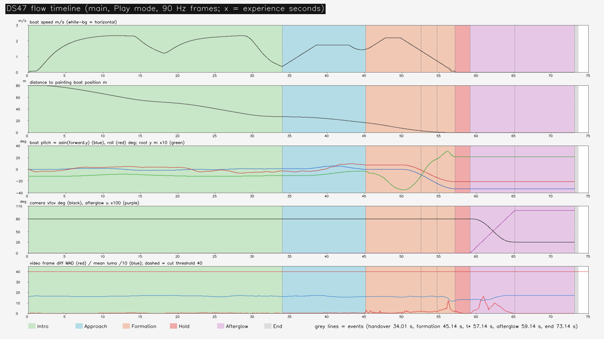
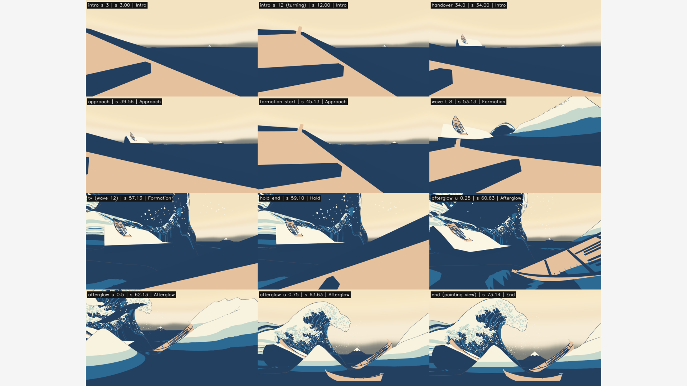
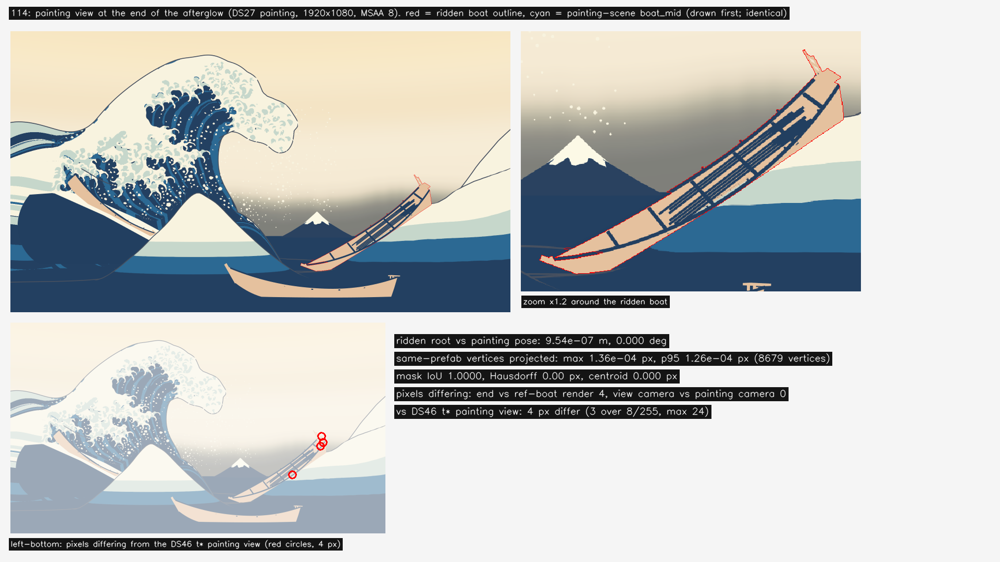
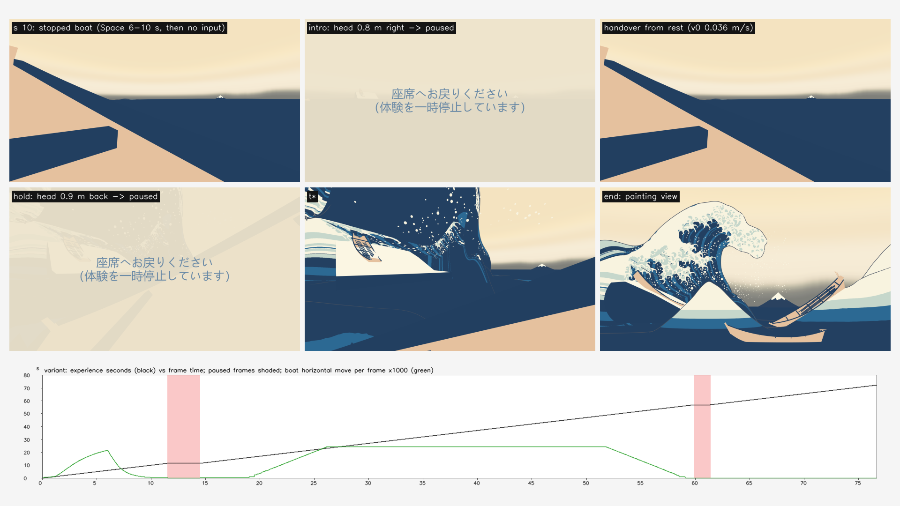

# 設計47：導入→接近→砕波→余韻をつなぐ ― 共通時計（設計46）に絵コンテの表と進行役 DS47Flow を載せ、物理の船・操船・乗客・船用水面データを一つの体験の場面で Play モードに回す。t\* で 2 s 止めた後、視点を座席から原画の視点へ移し、乗っていた船を原画の船の位置に見せる。最小の受入 2 つは満たした（段階8確認 F8-3 は Editor の Play モードで閉じた）

日付：2026-09-30／状態：**閉じた（使える水準。最小の受入 2 つを満たした。修正 0 回）**。証拠の種類は次のとおり。**HMD 実機の結果ではない。Release のプレイヤーでもなく、実時間の Play でもない。利用者は確かめていない。Mock の両目の描画もこの番号では描いていない（第 4 節の 12）。**

- 作る部：Unity 6000.4.3f1 の Editor の Play モード（batchmode、RTX 3080、Direct3D 11）。
  - `DS47FlowPlay.Run` は、止めた状態から `EditorApplication.Step` で 1 フレームずつ進める。1 フレームは 1/90 s で、物理の固定の時間刻みと同じ。
  - 30 fps の動画のコマは、体験の時刻の 1/30 s ごとに HMD Camera をオフスクリーンで描いた（1920 × 1080、MSAA 4、JPG）。
  - 操船の入力は Input System の仮想のキーボードで、実際の機器と同じ `DS44Input.Read` で読んだ。頭の動きは、試験が HMD Camera の局所の位置をずらして作った。
  - 数え直しと図は numpy・OpenCV・ffmpeg（`ds47_report.py`）。
- 進行役の独立の検査：作る部の出力（動画・CSV・PNG・JSON）を、作る部の道具を使わずに numpy・OpenCV で調べた。自前の Unity の実行はしていない。写しは Git 対象外の `Unity/Build/Design/47/indep_check/` にある。判定は pass、必須の指摘 0、記録の指摘 2（第 9 節の 1・2）。
- 記録の道具 `ds47_record.py`：
  - 作る部の SHA-256 を照合した。作る部 24 件・守るファイル 28 件で、すべて同じ。
  - 作る部の測定の道具を使わずに、生の記録（90 Hz の CSV・JSON、動画、終わりの原画視点の PNG）から数え直した（[ds47\_record\_recount.json](../Evidence/Design/47/ds47_record_recount.json)）。作る部の値との差は、船の覆いの画素の数だけ（数え方の違い。第 9 節の 4）。
  - 場面の依存を調べ、証拠を写し、記録の metrics.json・run.json を書いた。

番号の前提：

- 対象：[段階9までの実行計画](../Design/Stage9_Plan_2026-09-26_ja.md)（以下「計画」）§2.5 の設計47。
  - 使える水準の成果物：「絵コンテと演出イベントの表（JSON）。導入（静かな海で操船）→ 接近（うねりが 1.5 倍へ育つ、固定軌道へ引き継ぎ）→ 形成 → 余韻（同じ時刻の原画視点を見せ、自分の船を原画の中で見つける最小の V1）。全体 60〜90 秒」。
  - ［Q10・Q11］の注記により、形成は Q10 の時間の骨格（28修正01 の F\_final の τ(t)）、崩壊は作らない。流れは「導入 → 接近 → 形成 → t\* で 2 s 保持 → 余韻への受け渡し」で、保持の後に何を見せ、どう余韻へ移るかはこの番号で決める。
  - 最小の受入：「通し動画で黒画面・カットの途切れ 0（86 を使える水準で）。原画視点で乗っている船が原画の位置にある（114 を記録）」。
  - 依存は設計27・44・46。バックログは 84〜86・109・110・113・114。各項の中身は、計画 §2.5 と §5 の仕上げ47 の文から読んだ。バックログの表のファイルは開いていない。
- 段階8確認の条件（[段階8確認](Stage8_SelfReview_ja.md) §9 の「段階9 へ進む条件（設計46・47 で必ずすること）」）：
  - 「設計47（導入→余韻）：原画の場面の座席の船を物理の船に置き換え、RiderComfortRoot を同じ場面に置く（`stepInFixedUpdate`・`stepInLateUpdate` を体験の値に）。喫水の差 132 mm、t\* の姿勢（F8-4）、背景の 2 隻の演出と `M1_Revision_LeftSupport`（設計43 の限界 9）、範囲の見せ方（F8-5）、引き継ぎの出来事の時刻（設計44 の D44-2）」。
  - 設計46 から送られた残り：浮力・操船・乗客を体験の場面で Play すること（F8-3 の残り）、固定の時間刻みでの引き継ぎの跳び、出来事の表の置き換え、`waveStartSeconds`・`endSeconds`、GWClock を Master で保存すること（設計46 の限界 5）。
  - どれに答えたかは第 2.10 節の表に書いた。
- 引き継ぎ（どれも SHA-256 を照合した。[run.json](../Evidence/Design/47/run.json) の `protected_sha256`）：
  - [設計46](Design_46_ja.md) の場面 `DS46_Clock.unity`（`af3fbaa1…`）。設計41 の原画の場面に、共通時計（Master）・段の部品・出来事の表・船用水面データを載せたもの。
  - 設計46 の `GWClock.cs`（`e2d9c83f…`）、`DS46ClockBus.cs`（`1d1fef18…`）、`DS46EventTrack.cs`（`3dc58b00…`）。
  - [設計42](Design_42_ja.md) の浮力 `DS42Buoyancy.cs`（`93edf99c…`）と浮力点 `ds43_buoyancy_points_boat_mid.json`（`a731b46c…`）。
  - [設計43](Design_43_ja.md) の船用水面データ `DS43BoatWater.cs`（`2e154ac5…`）と船の表 `ds43_boats.json`（`d40f1531…`）。
  - [設計44](Design_44_ja.md) の操船 `DS44BoatSteer.cs`（`b43f0779…`）・軌道 `DS44Trajectory.cs`（`fca22b2a…`）・入力 `DS44Input.cs`（`739ed9f6…`）・表 `ds44_steer.json`（`5a30f71c…`）。
  - [設計45](Design_45_ja.md) の乗客 `DS45RiderComfort.cs`（`87cbe066…`）と表 `ds45_comfort.json`（`170a2d83…`）。
  - [設計30](Design_30_ja.md) の再生器と座席の船の支え `DS30BoatHeave.cs`（`5cc17a44…`）・`boat_support.json`（`082906b7…`）、28修正01 の τ(t) `timewarp_F_final.json`（`627815c7…`）、`seat_v1.json`（`4f7553fd…`）。
- 時間の上限：Q26 の日程で 4 時間（計画 §2.6 の［Q26］の表、10/3 の行の設計47。計画の時間枠は ≤1日）。範囲は最小の受入だけで、同じ問題の修正は 1 回まで。
  - 実績（ファイルの時刻。[metrics.json](../Evidence/Design/47/metrics.json) の `time.file_times`）：
    - 着手 14:21:28（`_started.txt`）。設計46 の記録（〜14:37）と重ねた（計画の［Q26］の「N の記録・コミットと N+1 の作業を重ねてよい」）。
    - 作る部：表 `ds47_flow.json` 14:33、`DS47Flow.cs` 14:36、`DS47FlowBuild.cs` 14:38、`run_ds47_unity.ps1` 14:41。Unity の最初の実行 build1 は 14:41。最後の実行は build5（15:22:51〜15:23:04）、main5（15:24:27〜15:26:33）、variant8（15:30:23〜15:31:46）。動画と図は 15:32、`_finished.txt` は 15:32:58。
    - 進行役の独立の検査：15:36〜15:44（検査の道具と出力の時刻）。
    - 記録：15:46〜。終わりは `Unity/Build/Design/47/READY_TO_COMMIT.txt` の時刻。
    - 着手から作る部の最後の出力まで約 72 分、独立の検査の終わりまで約 83 分で、4 時間の上限の内。
  - 1 回の計算：どれも 30 分の上限より十分短い。build5 は 13 s、main5 は約 2 分（6,591 フレームと 2,197 枚の描画）、variant8 は約 1.4 分、記録の道具は約 33 s。
- 読むだけで変えていないもの：
  - `DS46_Clock.unity` は開いただけで保存せず、写しを新しい場面 `DS47_Flow.unity` に保存した。
  - 守るファイル 28 は、作る部の最後の場面の作り直し（build5）の前後と記録の時で SHA-256 が同じ。内訳は、設計46・41・39・30・43・44・45 の場面、設計41 の船のプレハブと FBX、設計42〜46 と美術優先30 の部品、設計30 の再生器と支え、設計43〜45 の表、`boat_support.json`、τ(t)、`seat_v1.json`。
  - 前の番号のコードは書き換えていない。
  - ProjectSettings：設定の戻しの記録 19 本（build1〜5・dbg1〜2・main1〜3・main5・variant1〜8）は、どれも戻したファイル 0・新しいファイル 0。打ち切った main4 には戻しの記録がない。記録の着手の時に読むだけの `git status` を 1 回見て、追跡しているファイルの変更は 0 だった（新しいフォルダーだけ）。
- **原画視点の回帰（計画 §2.0）**：
  - 原画視点の場面（`DS39_Paper.unity`）と、設計41・46 の場面は SHA-256 のまま。この番号は新しい場面 `DS47_Flow.unity` だけを作った。
  - 体験の終わりの原画視点（DS27 painting のカメラ、1920 × 1080、MSAA 8、紙なし）は、設計41 の保存した `painting_t120_off.png`（`efcceae4…`。設計41 の記録で評価器23 の入力と同じファイル）と 4 画素だけ違う。4 画素はどれも乗っていた船の縁で、最大の差は 24/255。
  - 同じ場面で、乗っていた船を隠して原画の場面の boat\_mid を見せて描くと、設計41 の保存したものと 0 画素の差（SHA-256 も同じ）。波の画素は同じなので、評価器は回し直していない。合格した項目（78・130・131・132 の大きな形・72 σ24 の大きな形の p95・69・70・212、設計29修正01 で戻した色の項目）の値は変わらない。
- 座標と単位：
  - s は体験の時刻（`GWClock.ExperienceSeconds`、double）。
  - t は大波の時刻（clamp(s − `waveStartSeconds`, 0, t\*)、t\* = 12 s）。τ(t) は 28修正01 の F\_final の世界の時間曲線で、t\* で 0。
  - この番号では `waveStartSeconds` を引き継ぎの時に決める（s = 引き継ぎ + 軌道の所要 T − 12）。それまでは t = 0（待機のコマ）。
  - 「段」は時計が時刻を 1 回決めること。Play では 1 フレームに 1 回（1/90 s）。
  - 船の出発点は原画の座標（原点 = 原画の座席の船の根の水平の位置、u = 原画の船首の向き、v = 右舷）で u −80 m・v −8 m。
- 使っていないもの：作る部と検査の出力に、AGENTS.md の禁止の場所と読み取りのみの例外（参照モデル・利用者の解算・写真・爪の分析）を使った跡はない（コミットの一覧の点検で文字列 0）。記録は、コミットの一覧の点検で、爪の分析のフォルダーのファイルの大きさだけを読み取りのみで調べた（第 9 節の 9）。ウェブは読んでいない。音はこの番号では作っていない（設計49）。

## 見るもの

**通しの動画**：[ds47\_flow\_720p\_30fps.mp4](../Evidence/Design/47/ds47_flow_720p_30fps.mp4)（主の実行 main5 の座席の視点 → 余韻 → 原画の視点。73.2 s、2,197 コマ）

- 1280 × 720 に縮めた写し（2,557,533 バイト、crf 26）。元の 1920 × 1080（12,420,431 バイト、`94d3f99b…`）は 5 MB の目安を超えるので、Git 対象外の `Unity/Build/Design/47/flow/` に置いた。
- 縮めた写しでも、黒のコマ 0・カット 0（記録の数え直し。`ds47_record_recount.json` の `video_720p_copy`）。

| 流れの記録（主の実行。上から：船の水平の速さ、原画の船の位置までの距離、船の縦の傾き・横の傾き・根の高さ、画角と余韻の進み、動画のコマの差と明るさ。色の帯は相、灰の縦線は出来事） |
| --- |
|  |

| 通しの静止画（主の実行。座席の視点：導入 s 3・s 12、引き継ぎ s 34、接近 s 39.6、形成の始まり s 45.1、大波の時刻 8 s、t\*、保持の終わり。余韻 u 0.25・0.5・0.75、終わりの原画視点） |
| --- |
|  |

| 114：余韻の終わりの原画視点（左上）、乗っていた船のまわりの拡大（右上。赤 = 乗っていた船の輪郭、水色 = 原画の場面の boat\_mid）、設計46 の t\* の原画視点と違う画素（左下。赤い丸の 4 画素） |
| --- |
|  |

| 途中で止まった船と、観賞の位置から外れた時（変種の実行 variant8。上：s 10 で止まった船、導入で頭を右へ 0.8 m → 一時停止の覆い、止まった船からの引き継ぎ。中：保持で頭を後ろへ 0.9 m → 一時停止、t\*、終わりの原画視点。下：体験の時刻（黒）と一時停止のフレーム（桃）、船の水平の動き（緑）） |
| --- |
|  |

- 図は作る部の出力のまま（1920 × 1080）。通しの静止画だけ、作る部の 1920 × 1440 を 0.75 倍にして 1920 × 1080 の中央に置いた（左右は灰の余白）。図の文字は英語（作る部の図の部品。設計44 の `ds44_report.py` を使う）。
- 動画と静止画は、紙の層（設計39）を切って描いた（作る部の台本の `paper=off`）。
- 座席の視点は L0 の乗客の目。L0 では頭の向き（ヨー）が世界に固定され（設計45 の定義）、PC の動画では −40.4° のまま動かない。そのあいだに船の向きは −142.8° から −38.1° まで回る（記録の数え直し）。そのため導入では船体が画面の多くを占め、接近では船体越しに横を見る。形成と t\* では大波の唇の上側が画面の外にある。これは設計どおりで途切れではない。ただし、PC の動画を座席の見え方の見本として使える範囲は限られる（第 4 節の 9）。
- 形成・t\*・保持の座席の視点には、原画の場面に残る仮置き `M1_Revision_LeftSupport`（設計30）が、boat\_left を載せた大きな平たいクリーム色の板として見える（大波の時刻 8 s・t\*・保持の終わり・余韻 u 0.25 の静止画）。独立の検査では、s 52 から保持の終わりまで、画面の幅の約 40%（動画のコマ 1560〜1774）。第 4 節の 5。

数値：

- [metrics.json](../Evidence/Design/47/metrics.json)（記録）：最小の受入 `acceptance`、流れ・出来事・つなぎ目・船の姿勢・視点・一時停止 `acceptance_record`、数え直しの差 `record_recount`、修正 `fix_rounds`、時間 `time`
- 記録の数え直し：[ds47\_record\_recount.json](../Evidence/Design/47/ds47_record_recount.json)
- 作る部の写し：
  - [ds47\_flow\_metrics.json](../Evidence/Design/47/ds47_flow_metrics.json)（作る部の metrics。記録で訂正した文は第 9 節）
  - [ds47\_flow\_run.json](../Evidence/Design/47/ds47_flow_run.json)（作る部の実行の命令・SHA-256・作り直しの経過 `iterationsJa`）
  - [ds47\_build.json](../Evidence/Design/47/ds47_build.json)（場面の作り：原画の船の置き方、船用水面データの範囲、座席の船、出発点の水面、守るファイル）
  - [ds47\_play\_main.json](../Evidence/Design/47/ds47_play_main.json)・[ds47\_play\_variant.json](../Evidence/Design/47/ds47_play_variant.json)（Play の報告：引き継ぎ、出来事、一時停止、114 の確かめ、流れの記録）
- 進行役の独立の検査の写し：[ds47\_indep\_video\_summary.json](../Evidence/Design/47/ds47_indep_video_summary.json)（動画の検査の要約）
- 実行条件と SHA-256：[run.json](../Evidence/Design/47/run.json)

## 0. 結論

1. **最小の受入 1：86（通し動画で黒画面・カットの途切れ 0）。合格。**
   - 動画 `ds47_flow_30fps.mp4`：H.264、1920 × 1080、30 fps、2,197 コマ、73.2 s。
   - 黒のコマ：作る部 0、独立の検査 0、記録の数え直し 0。いちばん暗いコマでも平均の明るさ 115.5（コマ 1702）。
   - カット：作る部 0（ffmpeg の blackdetect 0・scdet 0 も）、独立の検査 0（SSIM・縁の変わり方・前後との比の組み合わせ）、記録の数え直し 0。
   - 前のコマとの差が最も大きいのは余韻の視点の移動の中（s 60.9、480 × 270 の平均の差 16.4/255）で、なめらかな続きの一部。
   - 記録したコマは、体験の時刻でちょうど 1/30 s おき（終わりの止まった 3 コマを除く）。落ちたコマも重なったコマもない。
2. **最小の受入 2：114（原画視点で乗っている船が原画の位置にある）。記録として合格。**
   - 体験の終わりに、乗っていた船の根は原画の置き方（`ds43_boats.json` の boat\_mid）と 9.5 × 10⁻⁷ m・6 × 10⁻⁶° の差。
   - 同じプレハブの 8,679 頂点を原画視点（1920 × 1080）へ写した位置の差：最大 1.4 × 10⁻⁴ 画素。
   - 描いた船の覆い（船あり − 船なし）：乗っていた船と原画の場面の boat\_mid で IoU 1.000、重心のずれ 0 画素。
   - 視点の最後のコマ（HMD Camera）は原画のカメラの描画と 0 画素の差。位置・向き・画角（26°）も同じ。
3. **段階8確認 F8-3 は、Editor の Play モードで閉じた。**
   - 物理の座席の船（浮力 `DS42Buoyancy`・操船 `DS44BoatSteer`）、乗客（`DS45RiderComfort`、L0）、船用水面データ（`DS43BoatWater`）を一つの場面 `DS47_Flow.unity` に入れ、保存した場面を Play モードで回した。
   - 導入と接近の 4,061 フレームで、船は物理で動き（浮力点 10 が水の中）、操船は 3,058 フレーム（前進の入力あり 2,609）。
   - 場面は GWClock を Master・EarlyUpdate で進める形で保存し、浮力は FixedUpdate で進む値で保存した（設計46 の限界 5 は起きない）。
   - Release のビルドでの確かめは設計50。
4. **絵コンテ（主の実行）**：導入（静かな海で操船）0〜34.0 s → 固定の軌道への引き継ぎ 34.0 s → 接近 11.1 s → 形成 45.1〜57.1 s → t\* で 2 s 保持 → 余韻 59.1〜73.1 s（6 s で視点を原画の視点へ移し、8 s 留まる）。全長 73.1 s で 60〜90 s の内。9 つの出来事はどれも 1 回だけ起きた。
5. **途中で止まった船と、観賞の位置から外れた時（変種の実行）も流れは続く。**
   - 船を 6〜10 s に止め、その後は入力なし。16.0 s に 0.037 m/s から引き継ぎ、全長 72.1 s。t\* には原画の位置に着いた。
   - 導入で頭を右へ 0.8 m、保持で後ろへ 0.9 m ずらすと、0.5 s 後に一時停止した（紙の色の覆い、黒にしない）。止めている間、体験の時刻と船は動かず、戻して 0.5 s 後に再開した。
6. **原画視点の回帰なし**：原画視点の場面は変えていない。体験の終わりの原画視点は、設計41・46 の t\* の原画視点と 4 画素（乗っていた船の縁）だけ違い、波の画素は同じ。
7. **限界（第 4 節）**：
   - 接近でうねりを 1.5 倍へ育てる演出（84）はない。
   - 余韻の視点の移動（6 s で約 47 m、最大 14.7 m/s）の快適さは HMD で確かめていない。
   - 形成の間の座席の船は時計で決めた姿勢で、水との接し方を測っていない。
   - 仮置き `M1_Revision_LeftSupport` が座席から大きく見える。範囲の縁の見せ方（F8-5）はない。
   - 船用水面データの作り直しが 90 Hz の 1 コマより長い（1 回 約 21.8 ms）。
   - Release・実時間・PS VR2・Mock の両目は確かめていない。

---

## 1. 目的

設計書の段階9 の出口は「一度も開発者操作を挟まず体験できる」ことである。設計46 までで、大波・周りの海・白・爪・飛沫・船が読む水は一つの時計で進むようになった。ただし、物理の船・操船・乗客は検査の場面にしかなく、体験の始まりから終わりまでの流れ（何秒操船し、いつ大波が現れ、t\* の後に何を見せて終わるか）はまだなかった。

計画 §2.5 の設計47 は、この流れを絵コンテの表として決め、一つの場面で通して回す番号である。Q11 で崩壊は作らないので、保持の後の受け渡し（余韻）もここで決める。段階8確認は、物理の船・操船・乗客をこの番号で必ず体験の場面に入れて Play で回すこと（F8-3）を条件にした。

Q26 により、最小の受入だけを満たし、同じ問題の修正は 1 回までとした。

---

## 2. 表

### 2.1 絵コンテと出来事の表（`Data/ds47_flow.json`、`GreatWave.DS47.flow/1`）

値は表と、Play の報告（`ds47_play_main.json`・`ds47_play_variant.json`）と記録の数え直しから。時刻は体験の秒 s。

| 相 | 中身（表の文の要約） | 主の実行（main5） | 変種（variant8） |
| --- | --- | --- | --- |
| 導入 | 静かな海（単発再生の待機、t = 0 のコマ）の上で、座席の船を操船する（設計44 の前進・減速・旋回・停止）。乗客は設計45 の L0 | 0〜34.009 s（3,058 フレーム） | 0〜16.009 s（1,708 フレーム。一時停止 270 を含む） |
| 接近 | 固定の軌道（設計44、D26）へ引き継ぎ、原画の位置へ導かれる。入力は読まない。うねりの成長は入れていない（第 4 節の 1） | 34.009〜45.143 s（軌道の所要 T 23.134 s − 12 s = 11.134 s） | 16.009〜44.105 s（T 40.096 s − 12 = 28.096 s） |
| 形成 | 単発再生（F\_final の τ(t)、12 s）。座席の船は時計で決める姿勢へ移り、t\* でちょうど原画の置き方になる（D47-2） | 45.143〜57.143 s（1,080 フレーム） | 44.105〜56.105 s |
| t\* の保持 | 2 s（Q11・D31）。白・藍・爪・飛沫は t\* の終態 | 57.143〜59.143 s（180 フレーム） | 56.105〜58.105 s（315 フレーム。一時停止 135 を含む） |
| 余韻 | 時刻は t\* のまま。視点が座席の目から持ち上がり、自分の船を見下ろしてから原画の視点へ移る（6 s）。着いた後は原画の構図で 8 s（D47-3） | 59.143〜73.143 s（1,260 フレーム） | 58.105〜72.105 s |
| 終わり | 時計が止まる（終了画面は設計50） | 73.143 s（10 フレーム記録） | 72.105 s |
| **全長** | 60〜90 s（計画） | **73.143 s** | **72.105 s** |

- 相のフレームの数は記録の数え直し（90 Hz の CSV）。相の始まりは、その相に入った最初のフレームの時刻。

**出来事**（`DS46EventTrack` の表を、この番号の表で置き換えた。引き継ぎ・大波・余韻に結び付いたものは、引き継ぎの時に体験の秒で入れる）

| 出来事 | 結び付き | 主の実行の時刻（s） | 時計の時刻 − 出来事の時刻（主・変種） |
| --- | --- | --- | --- |
| `intro_start` | 体験 0 | 0.000001 | 0.020 s・0.020 s（最初の段。最初の段の長さが 0.02 s） |
| `handover` | 引き継ぎ | 34.009 | 0・0（決めたその段で起こす） |
| `formation_start` | 大波の時刻 0 | 45.143 | 10.2 ms・4.2 ms |
| `a_to_d_start` | 大波の時刻 7.45 s（Q10 の a→d の始まりの目安） | 52.593 | 4.7 ms・9.8 ms |
| `jet_start` | 大波の時刻 9.6 s（噴流の始まりの目安） | 54.743 | 10.2 ms・4.2 ms |
| `t_star` | 大波の時刻 12 s | 57.143 | 10.2 ms・4.2 ms |
| `afterglow_start` | 保持の終わり | 59.143 | 10.2 ms・4.2 ms |
| `afterglow_settled` | 余韻 + 6 s | 65.143 | 10.2 ms・4.2 ms |
| `end` | 余韻 + 14 s | 73.143 | 0・0 |

- どちらの実行も 9 つが 1 回ずつ起き、通過として数えただけのもの（Seek・初期化）は 0（CSV の終わりの `events_fired` 9・`events_skipped` 0）。
- 表の時刻と、表 `ds47_flow.json` の結び付きから計算した時刻の差は最大 3.8 × 10⁻⁷ s。
- `intro_start` のほかの遅れは、どれも 1/90 s（11.1 ms）より短い。

### 2.2 部品（Unity の C# と道具）

値はコード（`Unity/Assets/GreatWave/Design47/`、`Tools/GWWaveGen/ds47/`）から。

| 部分 | 中身 |
| --- | --- |
| `DS47Flow`（実行の順 95） | 進行役。共通時計（`GWClock` の Master、設計46）の段として動き、時計は複製しない。 ・段 `flow`（order 5、水面より前）：引き継ぎの時刻を決める（D47-1）。決めたら `DS44BoatSteer.Handover()` を呼び、`waveStartSeconds`（引き継ぎ + T − 12）と `endSeconds` を時計へ入れ、出来事の表を作り直す。 ・段 `seat_boat`（order 15、水面の後）：形成と保持の間、座席の船を時計の関数の姿勢で置く（D47-2）。物理は止める（Rigidbody を kinematic、浮力を止める）。 ・`FixedUpdate`：導入と接近の間だけ、設計44 の操船を 1 段進める（入力と一時停止をここで持つ）。浮力は自分の `FixedUpdate` で進む。 ・`LateUpdate`（乗客 `DS45RiderComfort` の 90 の後）：観賞の位置から外れた時の一時停止と再開（D47-4）、余韻の視点の移動（D47-3）。 ・Play の始めに `Time.fixedDeltaTime` を 1/90 s にする（D47-5）。`Pause()`・`Resume()` は公開で、設計50 の停止の切替から呼べる |
| `DS47Recorder`（試験だけ。場面には保存しない） | Play の記録：毎フレームの CSV（時刻・相・船・乗客・カメラ・入力・出来事・船用水面データ）、体験の時刻 1/30 s ごとの JPG（1920 × 1080、MSAA 4、品質 92）、印を付けた時刻の PNG（MSAA 8） |
| `DS47FlowBuild`（Editor） | 場面を作る：`DS46_Clock.unity` を開いて保存せず、原画の座席の船 `AF27 船 boat_mid` を隠す。物理の座席の船（Rigidbody ＋ 浮力 ＋ 操船、設計41 のプレハブを縮尺 1.1328 で子に）と、乗客の枠（`RiderComfortRoot` → XR Origin → Camera Offset → HMD Camera、TrackedPoseDriver、L0）、進行役、一時停止の覆いを置く。船用水面データの範囲を操船の範囲・原画の位置・ほかの船まで広げる。HMD Camera の描き方（HDR・MSAA）を原画のカメラにそろえる。τ(0) の出発点の水面を Editor で読んで `startWaterY` に入れる。守るファイル 28 の SHA-256 を前後で比べる |
| `DS47FlowPlay`（Editor） | 保存した場面を Play モードで回す台本（主 main・変種 variant）。仮想のキーボードの入力、頭をずらす試験、終わりの 114 の確かめ（根の比べ、頂点の写し、船あり・船なし・原画の船の描画） |
| 覆いの材質 `Materials/DS47_LeaveOverlay.mat` | 組み込みの shader。一時停止の時に HMD Camera の前に出す紙の色の板（表の `leave.overlayColor` は 0.93・0.89・0.80、不透明度 0.9）。文字は TextMesh（組み込みのフォント）で「座席へお戻りください（体験を一時停止しています）」 |
| 道具 `run_ds47_unity.ps1`・`ds47_report.py`・`ds47_record.py` | Unity の 1 回の実行（`unity.lock`、設定のバイトの戻し）、作る部の数え直し・図・動画、記録 |

### 2.3 場面 `DS47_Flow.unity`

値は記録の数え直し（`ds47_record_recount.json` の `scene`）と `ds47_build.json`。

- 197,738 バイト、SHA-256 `b1500d24…`。`DS46_Clock.unity` の写しで、第 2.2 節の `DS47FlowBuild` の変更を入れた。
- 保存した値：
  - GWClock：`mode` 1（Master）、`advanceBeforePhysics` 1。`endSeconds`・`waveStartSeconds` は 10⁶（仮。Play で進行役が決める）。
  - 浮力 `stepInFixedUpdate` 1、操船 `stepInFixedUpdate` 0（進行役が進める）。
  - 乗客 `startLevel` 0（L0）・`stepInLateUpdate` 1・`readInput` 1。
  - 進行役 `startWaterY` −0.9357658 m（τ = −7.889 の待機のコマの出発点の水面）、静水の喫水 0.249 m。
- 座席の船：質量 2,083.2 kg、縮尺 1.1328、出発点 u −80 m・v −8 m。
- 船用水面データの範囲：x −31.29〜108.76 m、z −58.58〜25.27 m。
- 原画の置き方の確かめ：原画の場面の boat\_mid の根と `ds43_boats.json` の差 0 m・0°。
- 他の 2 隻（boat\_fg・boat\_left）は原画の場面のまま（原画の置き方で止めた根。D47-6）。仮置き `M1_Revision_LeftSupport` も場面に残る。
- GUID は 50 で、`DS46_Clock.unity` の 39 にないのは 11（記録の数え直し）：
  - この番号の 3 つ：`DS47Flow.cs`・`ds47_flow.json`・`DS47_LeaveOverlay.mat`。
  - コミット済みの 6 つ：`DS42Buoyancy.cs`・`ds43_buoyancy_points_boat_mid.json`・`DS44BoatSteer.cs`・`ds44_steer.json`・`DS45RiderComfort.cs`・`ds45_comfort.json`。
  - パッケージの 2 つ：TrackedPoseDriver（`com.unity.inputsystem`）と XROrigin（`com.unity.xr.core-utils`）。設計45 の `DS45_Comfort.unity` と同じもの。
  - `DS46_Clock.unity` から落ちた GUID は 0。
- 場面には、設計41 から写った絶対のパスが 3 つある（設計46 と同じ）：密な飛沫の `dataPath`、near・far の `uv3File`。どれもこのリポジトリの `Unity/Build` の下（第 4 節の 11）。

### 2.4 最小の受入 1：86（通し動画で黒画面・カットの途切れ 0）

値は作る部の `ds47_flow_metrics.json`、独立の検査の `ds47_indep_video_summary.json`、記録の数え直しの `video_86`・`captured`。

| 確かめ | 作る部 | 独立の検査 | 記録の数え直し |
| --- | --- | --- | --- |
| コマ・長さ | 2,197 コマ、73.23 s | 2,197（JPG も 2,197） | 2,197 コマ、30 fps、1920 × 1080、73.23 s |
| 黒のコマ | 0（平均の明るさの最小 116.4） | 0（平均 < 20 か、20 未満の画素 > 90%。最小 115.5、20 未満の割合の最大 4.8 × 10⁻⁷） | 0（同じ基準。最小 115.5 はコマ 1702） |
| カット | 0（前のコマとの差の最大 16.3/255 は s 60.9、ヒストグラムの相関の最小 0.997） | 0（SSIM < 0.5 か縁の変わり方 > 0.7、かつ前後 ±6 コマの中央値との比 > 3。SSIM の最小 0.690 はコマ 1826、縁の変わり方の最大 0.26 はコマ 1355、比の最大 4.45 はコマ 1411） | 0（前のコマとの差 > 20 かつ比 > 3。差の最大 16.4 はコマ 1827（s 60.9）、比の最大 4.35 はコマ 1411、差 > 40 のコマ 0） |
| ffmpeg | blackdetect の区間 0、scdet の場面の変わり目 0 | — | — |
| コマの順 | — | 14 の見本で、動画のコマはいつも同じ番号の JPG に最も近い（平均の差 0.70〜0.97。隣は 0.8〜16） | — |
| 体験の時刻の間隔 | — | 2,197 行が続き番号で、ちょうど 1/30 s おき（終わりの止まったコマを除く） | CSV の記録したコマ 2,196 行（動画は 2,197。CSV は frame 2 から）で、間隔は 1/30 s。違うのは終わり 73.143 s の 3 つだけ |

- 前のコマとの差が大きい所（独立の検査が差の画像を見た）：
  - 余韻の視点の移動（s 60.9 のまわりの連続）。
  - コマ 1411（s 47.0）：船体の輪郭が数画素ずれた。新しい画ではない。座席の船が谷へ下り始める所で、乗客の船に対する位置の変わりが 1/90 s あたり約 0.2 mm から約 3.6 mm になった（設計45 の L0 の濾波）。
  - コマ 1355（形成の始まり）。
- ほとんど止まったコマ（差 < 0.02）は記録で 260。s 7.4〜9.0（船がまっすぐ進み、L0 で頭の向きが固定、海は静止）、保持の終わり、余韻の後の 8 s。どれも予定どおりで、途切れではない。
- 一時停止の覆いのコマ（変種の静止画 2 枚）は紙の色で、黒ではない（独立の検査：平均の明るさ 221〜222、20 未満の画素 0）。

### 2.5 最小の受入 2：114（原画視点で乗っている船が原画の位置にある）

値は Play の報告の `poseVsPaintingJson`・`vertexPx`・`viewCamVsPainting`（Unity）と、記録の数え直しの `painting_114`・`approach_to_painting_pose`。

| 確かめ | 値 | 出どころ |
| --- | --- | --- |
| 乗っていた船の根 と `ds43_boats.json` の boat\_mid の置き方（主・変種） | 9.5 × 10⁻⁷ m、6.2 × 10⁻⁶°（Unity の報告では 0°） | 記録の数え直し（CSV の最後の行）、Unity |
| 保持から終わりまでの根の最大の差 | 9.5 × 10⁻⁷ m、6.2 × 10⁻⁶° | 記録の数え直し |
| 同じプレハブの頂点を原画視点（1920 × 1080）へ写した位置の差 | 45 のメッシュ、8,679 頂点。最大 1.36 × 10⁻⁴ 画素、p95 1.26 × 10⁻⁴ 画素 | Unity |
| 船の覆い（船あり − 船なし、どれかの色の差 > 24） | 乗っていた船 31,322 画素・原画の場面の boat\_mid 31,322・設計41 の保存したもの 31,322。IoU 1.000、重心のずれ 0 画素、外接の箱 [1114, 551, 1616, 922] | 記録の数え直し（作る部の数え方では 32,827、第 9 節の 4） |
| 視点の最後のコマ（HMD Camera）と原画のカメラの描画 | 0 画素。位置・向きの差 0、画角 26° と 26° | 記録の数え直し、Unity |
| 体験の終わりの原画視点 と 設計41 の保存した `painting_t120_off.png`・設計46 の t\* の原画視点 | 4 画素（8/255 を超えるのは 3）、最大 24/255、外接の箱 [1444, 583, 1601, 781]（乗っていた船の縁） | 記録の数え直し |
| 乗っていた船を隠し原画の boat\_mid を見せた描画 と 設計41 の保存したもの | 0 画素（SHA-256 も同じ `efcceae4…`） | 記録の数え直し |
| 変種の終わりの原画視点 と 主の終わり | 0 画素（設計41 とは同じ 4 画素） | 記録の数え直し |
| 動画の最後のコマ（JPG、MSAA 4）と終わりの原画視点（PNG、MSAA 8） | 平均の差 1.53/255。差 > 40 の画素 3,839 は線の縁（アンチエイリアスと圧縮）で、形の違いはない | 記録の数え直し、独立の検査の差の画像 |

- t\* の前の最後の段（主の実行）：原画の置き方までの距離は、大波の時刻 11.955 s で 7.6 mm、11.966 s で 5.4 mm、11.977 s で 3.7 mm、11.988 s で 1.9 mm、11.999 s で 0.14 mm、12.000 s で 9.5 × 10⁻⁷ m。向きの差も 0.025° から 0 へ。跳ばずに着く。
- コードでは、形成の始まりから 3 s たって差の補正が 0 になり、かつ大波の時刻が 12 s 以上のとき、根を原画の置き方そのものにする（`DS47Flow.OnSeatBoatInner`）。場面に保存した置き方は JSON と同じ（`ds47_build.json` の `posDiffM` 0・`rotDiffDeg` 0）。

### 2.6 引き継ぎと形成の始まりのつなぎ目

値は記録の数え直し（`seam_handover`・`seam_formation_start`。前後 4 フレームの 1 フレームあたりの船の根の動きと向きの変わり）。

| つなぎ目 | 主の実行 | 変種 |
| --- | --- | --- |
| 引き継ぎ（操船 → 固定の軌道、1/90 s の固定の時間刻み） | 位置 4.13〜4.40 mm/フレーム（前の 90 フレームの中央値 5.22 mm）、向き ≤ 0.0078°/フレーム。跳びなし。速さは 0.374 → 0.395 m/s | 位置 0.40 → 1.22 mm/フレーム、向き ≤ 0.0003°。速さが 0.037 → 0.110 m/s へ 1 フレームで変わる（止まった船から。第 4 節の 7） |
| 形成の始まり（物理 → 時計の姿勢） | 位置 16.30〜17.22 mm/フレームで続く（止まるフレームなし）。向きの変わりは 0.114°/フレームから、つなぎ目の 1 フレームだけ 0、その後 0.111° | 位置 24.45〜24.58 mm/フレーム。向きは 0.018° → 0（1 フレーム）→ 0.0086° |
| 形成の始まりに持ち越した差（物理の姿勢 − 時計の姿勢） | (−0.0150, −0.0153, 0.0067) m（2.2 cm）。3 s で 0 へ | (−0.0243, −0.0019, 0.0035) m（2.5 cm） |

- 段階8確認と設計46 の「固定の時間刻み 0.02 s での引き継ぎの跳び」は、体験の間の固定の時間刻みを 1/90 s にしたうえで、主の実行では跳びがない。変種の止まった船からの引き継ぎでは、速さが 1 フレームで 0.07 m/s 増える（位置の跳びはない）。
- 形成の始まりの向きの 1 フレームの止まりは、記録の数え直しで見つけた（作る部の報告にはない）。量は 0.11° で、動画では見分けられない（第 4 節の 7）。

### 2.7 座席の船（形成と保持。D47-2）

値は記録の数え直し（`formation_hold_boat`。主の実行）。

| 確かめ | 値 |
| --- | --- |
| 導入と接近（物理）での傾き（鉛直からの角）の最大 | 10.3°（変種 4.7°） |
| 形成と保持の、局所 +z の縦の傾きの最大 | 32.9°（t\* 以後は原画の置き方の値そのもの） |
| t\* 以後の鉛直からの傾き | 40.5°（原画の置き方） |
| 根の高さ（形成と保持） | −3.48〜3.07 m。谷へ約 3.5 m 下ってから上がる |
| 根の上下の速さの最大・1 フレームの上下の最大 | 1.98 m/s・2.2 cm |
| 根 − その場の水に浮く高さ（船用水面データの下側の面 − 静水の喫水）（形成） | −0.41 m（大波の時刻 11.03 s）〜 +1.54 m（9.90 s） |
| 形成と保持の物理 | 2,530 フレームとも kinematic（物理は止めた） |

- 段階8 で見た姿（自由な物理では座席の船が t\* に 67° 傾き、砕波域で打ち上げられる）は、この体験には出ない。
- ただし、形成の間の姿勢は時計で決めた作りの姿勢で、衝突を見ず、船体と水の接し方は測っていない（第 4 節の 4）。大波の時刻 8〜10.5 s では、根がその場の水に浮く高さより最大 1.54 m 上にある。余韻では時刻が t\* で止まるので、外から見る視点ではこの区間は見えない。
- 原画の置き方の局所 +z は、世界で下向き（前向きの y 成分 −0.543、−32.9°）。設計42 の船首が +z なら、原画の t\* の boat\_mid は船首下げになり、設計43 の記録の「船首上げ 33°」と食い違う（第 4 節の 13）。

### 2.8 視点（座席と余韻。D47-3）

値は記録の数え直し（`camera`・`camera_extra`。主の実行。四元数は正規化して角を取った）。

| 相 | フレーム | 位置の動きの最大（1 フレーム・速さ） | 向きの変わりの最大（1 フレーム） | 画角の変わりの最大 |
| --- | --- | --- | --- | --- |
| 導入 | 3,058 | 26.4 mm・2.37 m/s（船に乗って動く） | 0° | 0° |
| 接近 | 1,003 | 20.0 mm・1.80 m/s | 0° | 0° |
| 形成 | 1,080 | 28.5 mm・2.57 m/s | 0° | 0° |
| 保持 | 180 | 4.2 mm・0.38 m/s | 0° | 0° |
| 余韻 | 1,260 | 163.7 mm・14.73 m/s | 0.578° | 0.1875° |
| 終わり | 10 | 0 | 1.7 × 10⁻⁶° | 0° |

- 余韻の視点の動き：座席の目から原画の視点まで直線で 47.1 m、道のりは 47.6 m。画角は 80° → 26°（PC）。道は smootherstep で進み、途中を 3 m 持ち上げ、前半（道の 35% まで）は自分の船の根の 0.8 m 上を見て、後半で原画の視点の向きへ回る。カットも暗転もしない。
- HMD（XR が有効）では、向きと画角は動かさず（頭の向きは本人のまま）、位置だけを動かす（`rotateRigInXr` false）。実機の快適さは保留（第 4 節の 2）。
- 作る部の報告の「導入〜保持の向きの変わり 0.019°」は float32 の丸めで、正規化した四元数では 0°。
- 導入〜保持の頭の向き（ヨー）は −40.4° のまま（L0）。船の向きは −142.8° から −38.1° まで回る。
- 主の実行の頭の追跡のずれ（HMD Camera の局所の位置）は 0（どのフレームも）。

### 2.9 途中で止まった船と観賞の位置から外れた時（変種 variant8）

値は `ds47_play_variant.json` の `leaves`・`handover` と、記録の数え直し（`pause_runs`・`boat_speed_at_handover_mps`）。

| 確かめ | 値 |
| --- | --- |
| 操船の台本 | 1〜6 s 前進、6〜10 s 停止（Space、360 フレーム）、その後は入力なし |
| 引き継ぎ | s 16.009（導入の最短 15 s の後、0.5 s ごとの見込みの 3 回目。報告の `predictions` 4 は引き継ぎの時の 1 回を含む）、速さ 0.037 m/s。軌道の所要 T 40.096 s・道のり 72.34 m、全長 72.105 s |
| t\* の置き方 | 根の差 9.5 × 10⁻⁷ m、頂点の写しの最大 1.4 × 10⁻⁴ 画素、終わりの原画視点は主と 0 画素 |
| 導入で頭を右へ 0.8 m（HMD Camera の局所の位置、s 11.009） | 45 フレーム（0.5 s）後に一時停止。270 フレーム（3.0 s）止まり、体験の時刻の幅 0、船の動き 0 m、時計は Stopped。戻して 45 フレーム（0.5 s）後に再開 |
| 保持で頭を後ろへ 0.9 m（s 56.409） | 0.5 s 後に一時停止。135 フレーム（1.5 s）、時刻の幅 0、船の動き 0 m。戻して 0.5 s 後に再開 |
| 一時停止の回数 | 2 回、再開 2 回。出来事は 9 つが 1 回ずつ |
| 入力 | 1,438 フレーム、仮想のキーボードが読めなかったフレーム 0 |

### 2.10 段階8確認・設計46 の条件への対応

| 条件 | この番号 | 行き先 |
| --- | --- | --- |
| 原画の場面の座席の船を物理の船に置き換え、RiderComfortRoot を同じ場面に置く（`stepInFixedUpdate`・`stepInLateUpdate` を体験の値に）（F8-3） | **済み**（Editor の Play）：`DS47_Flow.unity` に物理の座席の船と乗客を置き、保存した値で Play した（第 2.3 節）。導入と接近で浮力と操船が働き（4,061 フレーム）、形成から時計の姿勢 | Release のビルドは設計50 |
| 時計の段の後に浮力・操船・乗客が進む順 | **コードの順**：時計は EarlyUpdate（設計46）、浮力と操船は FixedUpdate、乗客は LateUpdate 90、進行役は 95。物理が読む水の遅れは、この番号では測り直していない（導入と接近の水は待機のコマで動かず、形成では船は時計の姿勢なので、遅れが姿に出ない） | — |
| 固定の時間刻み 0.02 s での引き継ぎの跳び | **済み**：体験の間は 1/90 s にし（D47-5）、主の実行で跳びなし（第 2.6 節） | 止まった船からの速さの変わり（0.07 m/s）は仕上げ44 |
| 喫水の差 132 mm（物理 0.249 m・原画の置き方 0.3806 m） | **済み**：形成の大波の時刻 5〜12 s に、高さをその場の水に浮く高さから原画の置き方へ移す（D47-2）。t\* 以後は原画の置き方そのもの | — |
| t\* の座席の船の姿勢（F8-4） | **済み**：t\* でちょうど原画の置き方（第 2.5 節） | 形成の間の水との接し方は仕上げ43・44 |
| 背景の 2 隻の演出 | **決めた**：原画の置き方のまま止める（D47-6） | — |
| `M1_Revision_LeftSupport`（設計43 の限界 9） | **していない**：場面に残り、形成・t\*・保持の座席の視点で大きく見える（第 4 節の 5） | 仕上げ30（原画視点の回帰とともに置き換える） |
| 範囲の見せ方（F8-5） | **していない**：範囲の縁で船が止まる理由は画面に出ない（表の文は「範囲の縁は柔らかく押し戻す」だけ） | 設計50（入口の操作説明に範囲を書く）、仕上げ44（範囲を見せる物） |
| 引き継ぎの出来事の時刻（設計44 の D44-2） | **済み**：D47-1 の規則で決め、`handover` の出来事を決めたその段で起こす | — |
| 出来事の表の置き換え、`waveStartSeconds`・`endSeconds`（設計46） | **済み**：表の 9 つ、引き継ぎで決める | 設計49 の音は `DS46EventTrack.Fired` を受ける |
| GWClock を Master で保存（設計46 の限界 5） | **済み**：`mode` 1・`advanceBeforePhysics` 1 で保存 | — |
| 船用水面データの作り直しを VR のコマに収める（設計43 の限界 11） | **していない**：形成の 1,080 フレームで毎フレーム作り直し、1 回 平均 21.8 ms（変種 22.1 ms） | 設計50 の H2、仕上げ43 |

### 2.11 作り方と採ったもの（Q24。進行役の判断で、利用者の決定ではない）

- **D47-1：引き継ぎの時刻は、全長の見込みで決める。** 導入の 15 s を過ぎてから 0.5 s ごとに、今の船の状態から軌道を仮に作る（本番と同じ `DS44Trajectory`）。見込みの全長 s + (T − 12) + 12 + 2 + 6 + 8 が 72 s 以上になった所、遅くとも 45 s で引き継ぐ。船が止まっていても範囲の縁にいても同じ規則で、軌道は止まった状態からでも作れる。理由：設計44 の格子（軌道の所要 T の p50 39.7 s・p95 58.3 s・最大 70.7 s）では、決まった時刻で引き継ぐと全長が約 60〜107 s に散る（作る部の見積もり）。落とした：決まった時刻の引き継ぎ。
- **D47-2：形成と保持の座席の船は物理を止め、時計の関数の姿勢で置く。** 水平の位置と向きは軌道に従い、着く所のずれを大波の時刻とともに補正する。高さと傾きは、大波の時刻 5〜12 s に「その場の水に浮く高さ・物理の傾き」から「原画の置き方 ＋ 設計30 の支えの Δ(t)」へ smoothstep で移す。t\* でちょうど原画の置き方になる。形成の始まりの差は 3 s で 0 へ。落とした：自由な物理（t\* に 67° 傾き、打ち上げられる）、設計30 の鉛直の支えだけ（静かな海で 33° 傾いたまま）。
- **D47-3：余韻は、時刻を t\* で止めたまま、視点を座席から原画の視点へなめらかに移す。** カットも暗転もしない。HMD では位置だけを動かし、頭の向きは本人のまま。HMD Camera は原画のカメラと同じ描き方（HDR なし・MSAA）にし、最後のコマが原画のカメラの描画と 0 画素で同じになる。落とした：カット・暗転（86 を壊す）、額縁の板に原画視点を映す案。
- **D47-4：観賞の位置から外れたら一時停止する。** 頭が座席の目から水平 0.6 m・上下 0.5 m を超えて 0.5 s 続いたら、時計を止め、座席の船の物理を止め、紙の色の覆いと日本語の案内を出す（黒にしない）。戻って 0.5 s で再開する。導入から保持まで働き、余韻では働かない。
- **D47-5：物理の固定の時間刻みは 1/90 s。** Play の始めに `Time.fixedDeltaTime` へ入れ、ProjectSettings の 0.02 s は変えない。PS VR2 の 90 Hz の 1 コマに 1 段。
- **D47-6：他の 2 隻（boat\_fg・boat\_left）は原画の置き方のまま。** 自由な物理にしない（段階8 で転覆した）。
- 乗客の揺れは設計45 の L0 を既定にした（85 は記録のみ）。
- 記録の判断：
  - 86 の「カット」は、画が別の画に替わること（前のコマとの差が大きく、かつ前後より突き出ている）と読んだ。余韻の視点の移動のような大きいが続いた変化は途切れではない。
  - 114 は、終わりの根の置き方・頂点の写し・描いた船の覆いの 3 つで読んだ。
  - 仮置き `M1_Revision_LeftSupport` と範囲の見せ方（F8-5）はこの番号では直さず、仕上げへ送る。原画視点の場面を触ることになり、Q26 の範囲（最小の受入だけ）を超えるため。

---

## 3. 関門

| 最小の受入・規則 | 基準 | 値 | 判定 |
| --- | --- | --- | --- |
| 86：通し動画で黒画面・カットの途切れ 0 | 黒 0・カット 0 | 2,197 コマで、作る部・独立の検査・記録の数え直しとも黒 0・カット 0。ffmpeg も 0。コマの間隔は 1/30 s | 合格 |
| 114：原画視点で乗っている船が原画の位置にある | 記録（原画視点の ≤4 px に照らす） | 根の差 9.5 × 10⁻⁷ m、頂点の写し 1.4 × 10⁻⁴ 画素、覆いの IoU 1.000、視点の最後のコマ = 原画のカメラの描画（0 画素） | 合格（記録） |
| 全体 60〜90 秒（計画の成果物） | 60〜90 s | 主 73.143 s、変種 72.105 s | 合格 |
| 出来事 | 記録 | 9 つが 1 回ずつ（主・変種）。`intro_start` のほかは 1/90 s より短い遅れ | 合格（受入の外） |
| 段階8確認 F8-3（物理の船・操船・乗客を体験の場面で Play） | 必ず行う | Editor の Play モードで済み（第 2.10 節） | 合格（Release は設計50） |
| 途中で止まった船、観賞の位置から外れた時 | 記録 | 止まった船から引き継いで t\* に原画の位置。一時停止 2 回、止めている間の時刻と船の動き 0 | 合格（受入の外） |
| 計画 §2.0 の回帰なし | 合格した項目を後退させない | 原画視点の場面は SHA-256 のまま。終わりの原画視点は設計41 と 4 画素（船の縁）、原画の船を見せると 0 画素 | 合格（評価器は回していない） |
| 84（接近でうねりを 1.5 倍へ） | — | 入れていない | 記録のみ（仕上げ47） |
| 85（乗客の上下動の倍率） | — | L0 を既定 | 記録のみ |
| 109・110・113（座席からの見上げ） | — | PC の座席の視点の静止画だけ。頭を上げた見え方は HMD の保留 | 記録のみ |
| 守るファイル・ProjectSettings | 変えない | 守るファイル 28 の SHA-256 は同じ。設定の戻し 0（19 本） | 合格 |
| HMD（PS VR2） | — | — | 保留（利用者の手）。余韻の快適さ・頭の追跡での一時停止・見上げ・Sense の入力 |

---

## 4. 限界

1. **接近でうねりを 1.5 倍へ育てる演出（84）はない（仕上げ47）。**
   - 導入と接近の水は、焼いたシートの待機のコマ（τ(0)）で止まっている（設計44 の限界 6）。表の `swell.implementedV1` は false。
   - 仕上げ47 で、形成の始まりで 1.0 になり原画視点を変えない作り方に限って入れる。
2. **余韻の視点の移動の快適さは、HMD で確かめていない（保留、仕上げ47）。**
   - HMD では位置だけが動く。6 s で約 47 m、最大 14.7 m/s。
   - 実機で酔いやすければ、もっと遅い道か、紙の色を通るフェードを仕上げ47 で考える（フェードは 86 の読みと合わせて決める）。
3. **船用水面データの作り直しが 90 Hz の 1 コマより長い（設計50 の H2、仕上げ43）。**
   - 形成の 1,080 フレームで毎フレーム作り直し、1 回 平均 21.8 ms（変種 22.1 ms）。Editor の batch の値で、Release の実時間では測っていない。
   - 時計の姿勢の座席の船は、船用水面データを高さの読みにしか使わない。
4. **形成の間の座席の船は時計で決めた姿勢で、水との接し方を測っていない（仕上げ43・44）。**
   - 衝突を見ない。谷へ約 3.5 m 下ってから上がり、上下は最大 1.98 m/s。
   - 大波の時刻 8〜10.5 s で、根がその場の水に浮く高さより最大 1.54 m 上（9.9 s）、11.0 s で 0.41 m 下。
   - 余韻では時刻が t\* で止まるので、外から見る視点ではこの区間は見えない。
5. **仮置き `M1_Revision_LeftSupport`（設計30）が座席から大きく見える（仕上げ30）。**
   - 作る部の文は「導入で見える」だったが、独立の検査で、s 52 から保持の終わりまで（形成・t\*・保持）、boat\_left を載せた平たいクリーム色の板として画面の幅の約 40% を占めると分かった（`main_tstar.png`、動画のコマ 1560〜1774）。導入と接近では遠くに小さく見える。
   - この番号が作ったものではない（設計30 から原画の場面にある）。置き換えると原画視点が変わるので、仕上げ30 で原画視点の回帰とともに行う。
6. **範囲の縁で船が止まる理由が画面に出ない（段階8確認 F8-5）。** この番号の出力にはどこにも扱いがない（独立の検査の指摘）。設計50 の入口の操作説明に範囲の縁で止まることを書き、範囲を見せる物（浮き・霧など）は仕上げ44 で作る。
7. **つなぎ目の小さな段差（仕上げ44）。**
   - 止まった船からの引き継ぎで、速さが 1 フレームで 0.037 → 0.110 m/s に変わる（変種。位置の跳びはない）。
   - 形成の始まりのつなぎ目で、船の向きの変わりが 1 フレームだけ 0 になる（主 0.114°、変種 0.018° の毎フレームの変わりが 1 回抜ける）。動画では見分けられない。
8. **全長は船の状態で変わる。** 規則では約 72〜73 s になる。ただし、s 15 の時の船の位置からの軌道の所要 T が 59 s を超えると（設計44 の格子の p95 は 58.3 s、最大 70.7 s。`ds44_trajectory_grid.json`）、s 15 で引き継いでも全長 T + 31 s が 90 s を超え、最大で約 102 s になる。
9. **座席の視点は L0 の頭の向きの固定のまま（109・110・113 は記録のみ、HMD の保留）。**
   - PC の動画の座席の視点は頭を上げておらず、t\* の頭上の唇は一部しか見えない。
   - 導入の多くで船体が画面の約 2/3 を占め、接近では船体越しに横を見る（「見るもの」）。
10. **出発点の水面の高さを場面に書き込んだ（設計50 で確かめる）。**
    - Play の Start の時点では、ほかの部品の初期化で再生器が一時 τ = 0（t\*）にあり、その時の水面（0.000）を読んでしまう（作る部の `debug_start_height.txt`、Play の記録の `place h=-0.9358 hAtStart=0.0000 tau=0.0000`）。どの部品かは特定していない。
    - そこで、場面を作る時に Editor で τ(0) の水面 −0.936 m を読み、`startWaterY` に入れた。出発点や海を変えたら `DS47FlowBuild.BuildScene` を回し直す。Release のビルド（設計50）で同じことが起きるか確かめる。
11. **場面の絶対のパス 3 つ（設計50）。** `DS47_Flow.unity` にも、設計41 から写った密な飛沫の `dataPath` と near・far の `uv3File` がある（設計46 の限界 6 と同じ）。Release のビルドでは読めない。
12. **Play の確かめは Editor の batch だけ（設計50、保留）。**
    - 1 フレームずつ `EditorApplication.Step` で進めた（1/90 s）。実時間の Release のプレイヤーではない。
    - 入力は仮想のキーボード。ゲームパッド・PS VR2 Sense・頭の追跡は保留。
    - Mock の両目（設計45 の道）はこの番号では描いていない。PC の単眼の座席の視点だけ。通しの両目と H7 は設計50。
    - 一時停止の案内の文字は TextMesh と組み込みのフォントで、Editor では和文が描けた（変種の静止画）。Release で同じに描けるかは確かめていない。
13. **記録の食い違い（直していない）。** `ds43_boats.json` の boat\_mid の置き方の局所 +z（設計42 の船首）は世界で 32.9° 下を向く。設計43 の記録は「船首上げ 33°」。どちらの読みが正しいかは、この番号では確かめていない（仕上げ41 の船の向きの確かめへ）。
14. **余韻の最小の V1。** 乗っていた船に印はなく、座席から原画の視点へ続けて動くことだけで自分の船だと分からせる。参照モデルの配置を参考にした最後の構図（D24）は仕上げ47。
15. **段階8確認 F8-1（船内に表示の水が出る）・F8-2（右手の点が右舷の板の外）** はこの番号では変えていない（仕上げ43・仕上げ41）。
16. **Unity の警告**：`DS47FlowPlay.cs` の 83 行に、使うのをやめるよう勧められた API（`FindFirstObjectByType`）の警告 CS0618（前の番号の Editor の道具にも同じ警告がある）。Play のログの `UnityEditor.Search.SearchDatabase` の `ArgumentOutOfRangeException` は Editor の起動時の検索の索引の作りによるもので、この番号のコードではない（設計46 のログにも同じもの）。
17. **改行**：`Unity/Assets/GreatWave/Design47/` は `.gitattributes` に文がない（設計32〜46 と同じ）。テキストの資産（`.cs`・`.json`・場面・材質・.meta）と道具は LF（記録の数え直しの `line_endings`）。道具（`Tools/GWWaveGen/**`）と証拠（`Docs/Evidence/Design/**`）は既存の `-text` の文でバイトのまま。`.gitattributes` に設計47 の文を足すかは、コミットの時に進行役が決める。
18. 崩壊は作らない（Q11）。余韻の間、時刻は t\* のまま。

---

## 5. 修正の記録（Q26：同じ問題の修正は 1 回まで）

作る部の中の作り直しは、受入の判定の前の作る途中の変更である。値は作る部の `ds47_flow_run.json` の `iterationsJa` とログの時刻。

| 回 | 変えたこと | 結果 |
| --- | --- | --- |
| build1・build2（14:41） | C# の書き間違い（名前の衝突・置換の誤り） | compile できず、直した |
| build3・main1（14:42〜14:54） | 最初の通し | Play の batchmode で 1 フレームが 1/90 s になり、体験の 37 s までしか進まず引き継ぎに届かない。打ち切り、フレームの時間の和で 1/30 s ごとに描く形に替えた |
| variant1〜2（14:55〜15:04） | 変種の台本 | 状態の記録の文字列の誤りで compile できず／進め方が遅いので打ち切り。止めた状態で毎回 Step する形に替えた |
| variant3・main2・variant4（15:05〜15:12） | 通った | 形成の始まりで物理の船と時計の姿勢の高さの差 2.13 m を見つけ、高さもその場の水から原画の置き方へ移す形に替えた。出発点で船が 1.2 m 落ちるのを見つけた |
| dbg1〜2・build4（15:14〜15:17） | 出発点の水面を調べた | Editor では −0.936 m。Play の Start では再生器が一時 t\* にあり 0 を読む → 場面を作る時に τ(0) の水面を入れる形に替えた |
| main3・variant5・build5（15:17〜15:23） | 通った | 余韻の終わりの HMD Camera の画が原画のカメラの描画と 100,944 画素違う（線の縁）。HDR の違いと分かり、HMD Camera の描き方を原画のカメラにそろえた |
| main4（15:23〜15:24） | 形成の始まりで 1 フレーム水平に止まるのを直した | 実行中にコードを変えたので打ち切り |
| main5・variant7（15:24〜15:28） | 最終のコード | 通った。ただし打ち切った main4 の外側の命令が残り、variant6 が variant7 の後に同じ出力の場所へ重ねて走った（同じコード） |
| variant8（15:30〜15:32） | 変種だけを一つで走らせ直した | 受入の数値は main5 と variant8 から |
| 進行役の独立の検査（15:36〜15:44） | numpy・OpenCV で動画・CSV・PNG を調べた | pass、必須の指摘 0。記録の指摘 2（仮置きの見え方、F8-5） |
| 記録（15:46〜） | `ds47_record.py` で照合と数え直し、証拠の写し | 作品には触れていない。記録の訂正 3（第 9 節の 3〜5） |

- 修正の回は使っていない（0 回）。受入を判定した後に作品を変えたことはない。

---

## 6. 引き継ぎ

前の番号の引き継ぎへの対応は第 2.10 節の表。

**設計48**（船首泡・航跡）：

- 操船の速さと向きは `DS44BoatSteer` の記録から読め、体験の場面 `DS47_Flow.unity` で導入と接近の間は物理の船が動く。形成と保持では船は時計の姿勢（`DS47Flow.ScriptPose`）。
- 航跡を主役波の上に出さない確かめは、`DS47_Flow.unity` の流れで行える。

**設計49**（音）：

- 出来事の表（第 2.1 節）の 9 つを `DS46EventTrack.Fired` で受けて鳴らす。`formation_start` は地鳴りの始まり、`t_star` は保持の始まり。
- 一時停止（`DS47Flow.Pause`）の間は時計が止まるので、音も止めるか決める。

**設計50**（通しの試遊）：

- Release のビルドで `DS47_Flow.unity` を実時間で回す（限界 12）。出発点の水面（限界 10）、場面の絶対のパス（限界 11）、一時停止の案内の文字の描け方（限界 12）。
- 停止の切替は `DS47Flow.Pause`・`Resume` を使える。入口の操作説明に範囲の縁で止まることを書く（限界 6）。終了画面は体験の `end` の出来事の後。
- 船用水面データの作り直しの費用を H2 の p95・p99 で見る（限界 3）。
- 両目の描画と H7 の通し（限界 12）。

**仕上げ47**：接近のうねりの成長（84）、余韻の視点の移動の速さ（限界 2）、V1 の印と最後の構図（限界 14）、座席の見上げ（109・110・113）。

**仕上げ44**：止まった船からの引き継ぎの速さの変わり、形成の始まりの向きの止まり（限界 7）、範囲を見せる物（限界 6）。

**仕上げ43**：形成の間の座席の船と水の接し方（限界 4）、船用水面データの軽いデータ（限界 3）、F8-1。

**仕上げ30**：`M1_Revision_LeftSupport` の置き換え（限界 5）。

**仕上げ41**：F8-2、原画の置き方の船首の向きの確かめ（限界 13）。

**保留（利用者の手）**：PS VR2 での通しの Play、余韻の快適さ、頭の追跡での一時停止、座席の見上げ、Sense の入力。D47-1〜6 は既定値・利用者未回答。

**段階9確認（自己評審）**：最初に通しの動画と[通しの静止画](../Evidence/Design/47/stills_ds47_flow.png)を見て、第 2.4〜2.10 節の表と第 3 節の関門を見る。F8-3 は設計46 とこの番号の両方の記録で判定する。

---

## 7. 再現

リポジトリの根で行う。前提（どれも Git 対象外）：28修正01 の `Unity/Build/Design/28R01F/F_final/timewarp_F_final.json`（`627815c7…`）、設計30 の `Unity/Build/Design/30/sea/boat_support.json`（`082906b7…`）、設計33 の爪のコマ、設計41 の `painting_t120_off.png`（`efcceae4…`）、設計46 の `painting_t120_off_ds46clock.png`（`efcceae4…`）、設計29修正01・設計30・設計36・設計39 の再生と描画の出力（`DS46_Clock.unity` が読む）。設計30〜46 の資産はコミット済み。

道具は `py -3.10`（Python 3.10.6、numpy 2.2.6、OpenCV 4.12.0）、ffmpeg 2024-12-19、Unity 6000.4.3f1（batchmode、`Unity/Build/unity.lock` で排他）。

1. 場面を作る：`powershell -NoProfile -ExecutionPolicy Bypass -File Tools/GWWaveGen/ds47/run_ds47_unity.ps1 -Method GreatWave.Design47.EditorTools.DS47FlowPlay.BuildScene -Log build`
   - 約 13 s。`DS47_Flow.unity` を保存し、`Unity/Build/Design/47/flow/unity/ds47_build.json` を書く。守るファイルの SHA-256 を前後で比べる。ProjectSettings は控えと比べて戻す。
2. 主の通し：`powershell -NoProfile -ExecutionPolicy Bypass -File Tools/GWWaveGen/ds47/run_ds47_unity.ps1 -NoQuit -Method GreatWave.Design47.EditorTools.DS47FlowPlay.Run -Log main -Extra "-ds47Script main"`（約 2 分。`flow/unity/main/` に CSV・JSON・2,197 枚の JPG・静止画・終わりの原画視点）
3. 変種：同じ命令で `-Log variant -Extra "-ds47Script variant"`（約 1.4 分。`flow/unity/variant/`）
4. 数え直し・図・動画：`py -3.10 Tools/GWWaveGen/ds47/ds47_report.py`（設計44 の `ds44_report.py` の描画の部品を使う。cp932 の端末では `PYTHONIOENCODING=utf-8` を付ける）
5. 記録：`py -3.10 -B Tools/GWWaveGen/ds47/ds47_record.py`
   - 作る部の SHA-256 を照合し、違えば止まる。
   - 生の記録から数え直す。114 の値が作る部と合わなければ止まる。
   - 証拠を写し（静止画の一覧は 1920 × 1080 へ、動画は 1280 × 720・5 MB 以下へ）、記録の metrics.json・run.json を書く。約 33 s。
- 1 回に 1 つだけ Unity を回す（打ち切った実行の外側の命令が残ると、次の実行と重なる。第 5 節の main5・variant7）。

---

## 8. 出典と、この番号で作ったもの

- 仕様：
  - 計画 §2.5 の設計47、§2.0（回帰の規則）、§2.6（Q26 の日程）、§5（仕上げ47・仕上げ44・仕上げ43・仕上げ30・仕上げ41）。
  - [段階8確認](Stage8_SelfReview_ja.md)の F8-1〜F8-5 と §9 の段階9 へ進む条件。
  - [制作手順](../Workflow/Production_Workflow_ja.md)の Q10・Q11・Q24・Q26。
  - [設計30](Design_30_ja.md)・[設計41](Design_41_ja.md)〜[設計46](Design_46_ja.md)の記録の限界と引き継ぎ。
- 読むだけ：設計46 の場面と時計の部品、設計41 の船のプレハブ、設計42〜45 の浮力・船用水面データ・操船・乗客の部品と表、設計30 の再生器と支え、28修正01 の τ(t)、`seat_v1.json`。
- この番号で作ったもの（コミットするもの）：
  - 道具 `Tools/GWWaveGen/ds47/`：
    - `run_ds47_unity.ps1`（Unity の 1 回の実行、`unity.lock`、設定の戻し、`-NoQuit`・`-Extra`）
    - `ds47_report.py`（数え直し・図・動画）
    - `ds47_record.py`（記録）
  - Unity の資産 `Unity/Assets/GreatWave/Design47/`（と `Design47.meta`、フォルダーの .meta 5 つ）：
    - `Scripts/DS47Flow.cs`・`DS47Recorder.cs`
    - `Editor/DS47FlowBuild.cs`・`DS47FlowPlay.cs`
    - `Data/ds47_flow.json`
    - `Materials/DS47_LeaveOverlay.mat`
    - 場面 `Scenes/DS47_Flow.unity`（197,738 バイト、`b1500d24…`）と各 .meta
  - 証拠 `Docs/Evidence/Design/47/`：
    - 1920 × 1080 の PNG 4 枚（流れの記録・通しの静止画・114・変種）
    - 通しの動画の 1280 × 720 の写し 1 本（2,557,533 バイト）
    - 作る部の JSON の写し 5（metrics・run・場面の作り・Play の報告 2）
    - 独立の検査の要約 1、記録の数え直しの JSON 1
    - metrics.json、run.json
  - 記録：この文書と、進捗の表の設計47 の行。
- コミットしないもの（Git 対象外の `Unity/Build/Design/47/`）：
  - 作る部の全出力 `flow/`（元の 1080p の動画 12.4 MB、2,197 枚の JPG、静止画 18 枚、終わりの原画視点の PNG 5 枚、90 Hz の CSV 2 本、Unity のログ 20 本、設定の戻しの記録 19 本）。
  - 進行役の独立の検査の写し `indep_check/`（numpy・OpenCV の道具 4 つ、動画の検査の全体の JSON、見るための画像）。
  - コミットの一覧の点検 `record/`。
- git：作る部・検査・記録は git の書き込み（add・commit）をしていない。記録は、着手の時に読むだけの `git status`・`git log` を 1 回使った。コミットの一覧の点検は `.gitignore` をファイルとして読んで照らした。

---

## 9. レビュー対応

作る部の後に進行役の独立の検査を通した。判定は pass、必須の指摘 0。記録の時に SHA-256（作る部 24 件・守るファイル 28 件）の照合と生の記録からの数え直しを行い、指摘を足した。

| # | 指摘（出どころ） | 対応 |
| --- | --- | --- |
| 1（独立の検査・記録の訂正） | 仮置き `M1_Revision_LeftSupport` は、作る部の文の「導入で見える」だけではない。s 52 から保持の終わりまで（形成・t\*・保持）、boat\_left を載せた平たいクリーム色の板が画面の幅の約 40% を占め、座席の視点で最も目立つ問題。段階8確認 §9 は 2 隻とこの仮置きを設計47 か仕上げ30 へ渡していた | 「見るもの」と限界 5 で訂正した。必須にはしない（この番号が作ったものではなく、最小の受入の項目でもなく、置き換えると原画視点が変わる）。仕上げ30 へ |
| 2（独立の検査） | 段階8確認 §8・§9 が設計47 に渡した範囲の縁の見せ方（F8-5）が、この番号の出力のどこにもない | 第 2.10 節と限界 6。設計50（入口の操作説明）と仕上げ44（範囲を見せる物）へ |
| 3（記録の時・記録の訂正） | 作る部の報告の「9 つの出来事はどれも 1/90 s より短い遅れで起きた」は、`intro_start` では違う（0.020 s。最初の段の長さが 0.02 s） | 第 2.1 節に `intro_start` の遅れを書いた。ほかの 8 つは 1/90 s より短い（最大 10.24 ms）。作る部のファイルは変えていない |
| 4（記録の時） | 作る部の船の覆いの画素の数 32,827 と、独立の検査・記録の数え直しの 31,322 が違う | 覆いの数え方の違い（記録はどれかの色の差 > 24）。どちらの数え方でも IoU 1.000・重心のずれ 0 で、判定は同じ。記録は 31,322 を書いた |
| 5（記録の時） | 作る部の報告にないつなぎ目の段差：止まった船からの引き継ぎで速さが 1 フレームで 0.037 → 0.110 m/s、形成の始まりで向きの変わりが 1 フレームだけ 0 | 第 2.6 節と限界 7。仕上げ44 へ |
| 6（独立の検査） | L0 では頭の向きが世界に固定され、PC の動画は −40.4° のまま。接近では船体越しに横を見て、導入の多くで船体が画面の約 2/3。t\* の頭上の唇も見えない | 設計どおりで途切れではない。「見るもの」と限界 9（109・110・113 は記録のみ、HMD の保留） |
| 7（独立の検査） | 大波の時刻 8〜10.5 s で、時計の姿勢の座席の船の根がその場の水に浮く高さより最大 1.54 m 上（9.9 s）、11.0 s で 0.41 m 下。船体と水の接し方は測っていない | 第 2.7 節と限界 4（記録の数え直しでも同じ値）。仕上げ43・44 へ |
| 8（独立の検査） | 自前の Unity の Play はしていない。114 がほかの入力（範囲の縁の船など）でも成り立つのは、コード（大波の時刻 12 s 以上で根を原画の置き方にする）と 2 つの実行による | 第 2.5 節の最後の項。受入の読みは変わらない |
| 9（記録の時） | コミットの一覧の点検 | 結果は `Unity/Build/Design/47/record/ds47_commit_scan.json`（Git 対象外。点検の道具 `ds47_commit_scan.py` も、禁止の場所の文字列を持つので Git 対象外）。 ・38 ファイル（合計 約 4.9 MB）：見つからないファイル 0、禁止の場所と読み取りのみの例外の場所の文字列 0、一時の場所・個人の場所の文字列 0、5 MB を超えるファイル 0（最大は `ds47_flow_720p_30fps.mp4` 2,557,533 バイト）。 ・.meta の欠け 0・余り 0、`.gitignore` の規則に当たるファイル 0、新しいフォルダーにあって一覧にないファイル 0。 ・爪の分析のフォルダーの 5,368 ファイルの大きさを読み取りのみで調べ、大きさが同じ組 0（同じファイル 0） |
| 10（記録の時） | 場面の依存 | `DS47_Flow.unity` の GUID 50 のうち `DS46_Clock.unity` にないのは 11（この番号 3・コミット済み 6・パッケージ 2）。`ds47_report.py` は設計44 の `ds44_report.py`（コミット済み）を読む。`DS47Recorder.cs` は場面にはなく、Editor の台本が Play の時に付ける |
| 11（記録の時） | 作る部の「導入〜保持の視点の向きの変わり 0.019°」 | float32 の丸め。正規化した四元数では 0°（第 2.8 節） |
| 12（記録の時） | 作る部の動画は 12.4 MB で 5 MB の目安を超える | 1280 × 720・crf 26 の写し（2.56 MB）を証拠にし、写しでも黒 0・カット 0 を確かめた。元の動画は Git 対象外 |

- 独立の検査で合格したもの（[ds47\_indep\_video\_summary.json](../Evidence/Design/47/ds47_indep_video_summary.json)、検査の文）：
  - 動画の全 2,197 コマで黒 0・カット 0、動画のコマの順が JPG と同じ。
  - CSV の数え直し：記録したコマの間隔、形成の始まりのつなぎ目、正規化した四元数での視点の向き、ほとんど止まったコマの理由。
  - 114：終わりの原画視点と設計41・46 の 4 画素、覆いの IoU 1.000・Hausdorff 0 画素、t\* の前の最後の段が 3.6・1.9・0.14 mm と着き、t\* 以後の向きの段 ≤ 4 × 10⁻⁴°。
  - F8-3：浮力（浮力点 10、導入と接近で物理）、操船（3,058 フレーム、前進の入力 2,609）、乗客（L0）、船用水面データ（形成の作り直し 1,081 回）が同じ実行で働く。
  - 変種：引き継ぎ s 16.01（0.036 m/s）、一時停止 270・135 フレームで時刻と船の動き 0。
  - `git status` で、追跡しているファイルの変更は 0（新しい Design47/・ds47/ だけ）。
- 記録の数え直し（[ds47\_record\_recount.json](../Evidence/Design/47/ds47_record_recount.json)）と作る部の値の差：動画のコマ・黒・カット 0、全長（主・変種）0、引き継ぎの時刻 0、終わりの根の差 0、覆いの IoU 0、設計46 との画素の差 0、一時停止の回数とフレーム 0、船用水面データの作り直しの回数 0、余韻の最大の速さ 0。違うのは覆いの画素の数（−1,505。上の 4）だけ。
