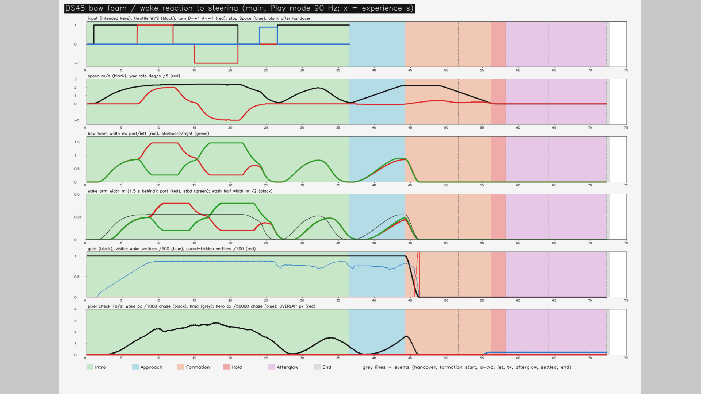
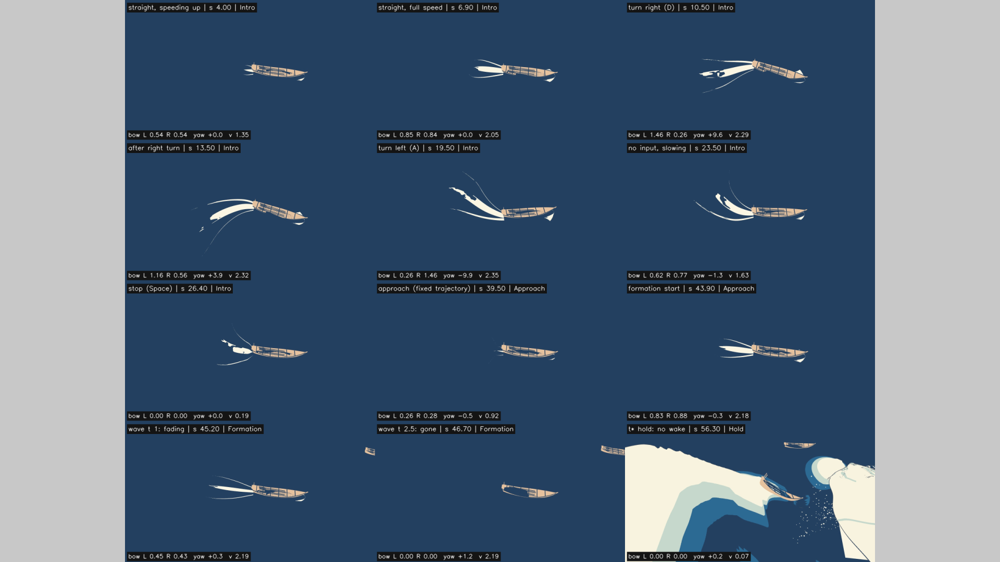
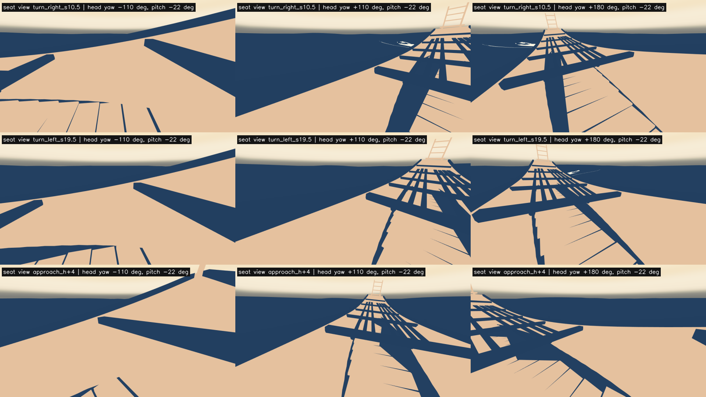

# 設計48：船首泡・航跡 ― 座席の船の船首の泡と航跡を、調色板の白の平たいメッシュ 1 つ（DS48Wake）で描く。速さと旋回に反応し、大波の時刻 2 s までに消えて主役波の上には出ない。最小の受入 2 つは満たした（座席の視点からはほとんど見えない限界を仕上げ48 へ送る）

日付：2026-09-30／状態：**閉じた（使える水準。最小の受入 2 つを満たした。修正 0 回）**。証拠の種類は次のとおり。**HMD 実機の結果ではない。Release のプレイヤーでもなく、実時間の Play でもない。利用者は確かめていない。Mock の両目の描画もこの番号では描いていない。**

- 作る部：Unity 6000.4.3f1 の Editor の Play モード（batchmode、RTX 3080）。
  - `DS48WakePlay.Run` は、設計47 の `DS47FlowPlay` と同じ道で、止めた状態から `EditorApplication.Step` で 1 フレームずつ進める。1 フレームは 1/90 s で、物理の固定の時間刻みと同じ。
  - 操船の入力は Input System の仮想のキーボードで、実際の機器と同じ `DS44Input.Read` で読んだ。
  - 記録の部品 `DS48Recorder`（試験だけ。場面には保存しない）が、毎フレームの泡と航跡の量を CSV に書き、体験の時刻 1/30 s ごとに追いかけのカメラ（試験だけのカメラ）と座席の視点（HMD Camera）のコマを描き、10 コマ/s で主役波との重なりを画素で調べた。
  - 数え直し・図・動画は numpy・OpenCV・ffmpeg（`ds48_report.py`）。
- 進行役の独立の検査：作る部の出力（動画・CSV・PNG・JSON）を、作る部の道具を使わずに numpy・OpenCV で調べた。自前の Unity の実行はしていない。判定は pass、必須の指摘 0、記録の指摘 3（第 9 節の 1〜3）。
- 記録の道具 `ds48_record.py`：
  - 作る部の SHA-256 を照合した。作る部の run.json の 19 件と、`ds48_build.json` の守るファイル 35 件で、すべて同じ。
  - 作る部の数え直しの道具を使わずに、生の記録（90 Hz の `ds48_frames.csv`、10 コマ/s の `ds48_masks.csv`、`ds48_play.json`、座席から見回した PNG、終わりの原画視点の PNG、動画）から数え直した（[ds48\_record\_recount.json](../Evidence/Design/48/ds48_record_recount.json)）。作る部の metrics.json の 16 の値との差は、どれも 0。
  - 場面の依存を調べ、証拠を写し、記録の metrics.json・run.json を書いた。

番号の前提：

- 対象：[段階9までの実行計画](../Design/Stage9_Plan_2026-09-26_ja.md)（以下「計画」）§2.5 の設計48。
  - 使える水準の成果物：「調色板の白の平たいメッシュで、船首の泡と航跡。速度と旋回に反応する」。
  - 最小の受入：「操作の方向に反応する動画。主役波の上に航跡が出ない」。
  - 依存は設計44。計画の表にバックログの項目番号はない。
- 引き継ぎ（どれも SHA-256 を照合した。[ds48\_build.json](../Evidence/Design/48/ds48_build.json) の `protected` の 35 件）：
  - [設計47](Design_47_ja.md) の体験の場面 `DS47_Flow.unity`（`b1500d24…`）と、進行役 `DS47Flow.cs`（`911945a6…`）・表 `ds47_flow.json`（`de6df628…`）など設計47 の 7 ファイル。
  - [設計43](Design_43_ja.md) の船用水面データ `DS43BoatWater.cs`（`2e154ac5…`）と船の表 `ds43_boats.json`（`d40f1531…`）。
  - [設計44](Design_44_ja.md) の操船 `DS44BoatSteer.cs`（`b43f0779…`）・入力 `DS44Input.cs`（`739ed9f6…`）・表 `ds44_steer.json`（`5a30f71c…`）。
  - 設計46 の場面と時計の部品、設計41・39・30・43・44・45 の場面、設計41 の船のプレハブと FBX、設計42・45 の部品と表、設計30 の支え、28修正01 の τ(t)、`seat_v1.json`。
  - 泡の色の出どころ：`Tools/PaintingTruth/targets/palette.json`（`2e550bf3…`）の白・生成り sRGB (251, 246, 227)。
- 時間の上限：Q26 の日程で 2 時間（計画 §2.6 の［Q26］の表、10/4 の行の設計48。計画の時間枠は ≤0.5日）。範囲は最小の受入だけで、同じ問題の修正は 1 回まで。
  - 実績（ファイルの時刻。+08:00）：
    - 着手：作る部の報告では 15:45。ファイルで確かめられる最初の時刻は `ds48_wake.json` の 15:51:07。設計47 の記録・コミット（`fcf9009`、16:04:24）と重ねた（計画の［Q26］の「N の記録・コミットと N+1 の作業を重ねてよい」）。
    - 作る部：表と shader 15:51、`DS48WakeBuild.cs` 15:54、`run_ds48_unity.ps1` 15:55。Unity の最初の実行 build1 は 15:55:59 に終わった。main1 15:58、main2 16:02、main3 16:05 と続け、最終の build2 は 16:07:29、main4 は 16:09:46 に終わった（設定の戻しの記録の時刻）。動画・図・metrics.json は 16:10。
    - 進行役の独立の検査：16:12〜16:17（検査の出力の時刻）。
    - 記録：16:19〜。終わりは `Unity/Build/Design/48/READY_TO_COMMIT.txt` の時刻。
    - 着手（作る部の報告の 15:45）から作る部の最後の出力（16:10）まで約 25 分、独立の検査の終わり（16:17）まで約 32 分で、2 時間の上限の内。
  - 1 回の計算：どれも 30 分の上限より十分短い。main4 は 6,507 フレームと 2,169 組のコマの描画で、build2 の終わり（16:07:29）から main4 の終わり（16:09:46）までの約 2.3 分の内（描画の合計 59.4 s。`ds48_play.json` の `renderMsTotal`）。作る部の数え直しは 16.4 s、記録の道具は 6.8 s。
- 読むだけで変えていないもの：
  - `DS47_Flow.unity` は開いただけで保存せず、写しに泡と航跡の物を 1 つ足して新しい場面 `DS48_Wake.unity` に保存した。
  - 守るファイル 35 は、最後の場面の作り直し（build2）の前後と記録の時で SHA-256 が同じ。コミット済みの設計47（`fcf9009`）の場面・部品・表・材質の 7 ファイルを含む。
  - 前の番号のコードは書き換えていない。
  - ProjectSettings：設定の戻しの記録 6 本（build1・build2・main1〜4）は、どれも戻したファイル 0・新しいファイル 0。
- **原画視点の回帰（計画 §2.0）**：
  - 原画視点の場面（`DS39_Paper.unity`）と、設計41・46・47 の場面は SHA-256 のまま。この番号は新しい場面 `DS48_Wake.unity` だけを作った。
  - 体験の終わりの原画視点（DS27 painting のカメラ、1920 × 1080、MSAA 8）`painting_end.png` は、設計47 の同じ画と SHA-256 が同じ（`faa78462…`）で、違う画素は 0。泡と航跡は形成の大波の時刻 2 s で消え、余韻では描かれない（第 2.5 節）。
  - 画素が同じなので、評価器は回し直していない。合格した項目（78・130・131・132 の大きな形・72 σ24 の大きな形の p95・69・70・212、設計29修正01 で戻した色の項目）の値は変わらない。
- 座標と単位：
  - s は体験の時刻（`GWClock.ExperienceSeconds`）。大波の時刻は s − `waveStartSeconds`（形成の始まりで 0、t\* で 12 s）。
  - 船首の泡の幅は、船体の水線から外へ向かう幅（m）。左舷（port）・右舷（starboard）は船の向きで読む。
  - 旋回の角速度は、上から見て右回りが正（右旋回 = 正）。
- 使っていないもの：作る部・検査・記録の出力に、AGENTS.md の禁止の場所と読み取りのみの例外（参照モデル・利用者の解算・写真・爪の分析）を使った跡はない（コミットの一覧の点検で文字列 0）。記録は、コミットの一覧の点検で、爪の分析のフォルダーのファイルの大きさだけを読み取りのみで調べた（第 9 節の 9）。ウェブは読んでいない。音はこの番号では作っていない（設計49）。

## 見るもの

**反応の動画**：[ds48\_wake\_1280x480\_30fps.mp4](../Evidence/Design/48/ds48_wake_1280x480_30fps.mp4)（主の実行 main4 の全体。72.3 s、2,169 コマ）

- 左が追いかけのカメラ（右舷の斜め上から船と航跡を見下ろす試験だけのカメラ。体験の場面には入らない）、右上が座席の視点（HMD Camera、PC）、右下が押しているキー・速さ・旋回の角速度・泡の幅の棒・門（大波の前に消す値）。
- 1280 × 480 に縮めた写し（1,545,975 バイト、crf 26）。元の 1920 × 720（7,594,378 バイト、`09807015…`）は 5 MB の目安を超えるので、Git 対象外の `Unity/Build/Design/48/wake/` に置いた。
- 見どころ：s 7〜12 の右旋回（D）で左舷（外側）の泡が広がり、s 15〜21 の左旋回（A）で右舷（外側）が広がる。航跡は曲がった道に沿って曲がる。s 24 の停止（Space）の後、船首の泡は消える。形成に入ると 2 s で全部が消える。

| 反応の記録（主の実行。上から：押したキー、速さと旋回の角速度、船首の泡の左右の幅、航跡の腕の左右の幅と中央の帯、門・見える頂点・高さの守りで隠した頂点、10 コマ/s の画素の検査（航跡の画素・主役波の画素・重なり）。色の帯は相、灰の縦線は出来事） |
| --- |
|  |

| 静止画（追いかけのカメラ。直進の加速 s 4.0・全速 s 6.9、右旋回 s 10.5、旋回の後 s 13.5、左旋回 s 19.5、入力なし s 23.5、停止 s 26.4、接近 s 39.5、形成の始まりの手前 s 43.9、大波の時刻 1 s（消えていく）、2.5 s（消えた）、t\* の保持（航跡なし）。下の文字は船首の泡の左 L・右 R の幅（m）、旋回の角速度（°/s）、速さ（m/s）） |
| --- |
|  |

| 座席から見回した画（試験だけ。旋回の間 s 10.5・s 19.5 と接近 s 40.5 に、頭を左舷 −110°・右舷 +110°・後ろ 180° へ向け、22° 下を見た。泡と航跡は、遠くの細い線にしか見えない） |
| --- |
|  |

- 図は作る部の出力。反応の記録（1920 × 1300）は 0.831 倍、静止画（1920 × 1440）は 0.75 倍にして、1920 × 1080 の中央に置いた（左右は灰の余白）。座席から見回した画は作る部の 1920 × 1080 のまま。図の文字は英語（作る部の図の部品。設計44 の `ds44_report.py` を使う）。
- 動画と静止画は、紙の層（設計39）を切って描いた（設計47 の記録と同じ `paper=off`）。
- **座席の視点（体験で本当に見える画）では、前を向いたままだと泡も航跡も見えない**（第 4 節の 1）。反応は追いかけのカメラで示している。

数値：

- [metrics.json](../Evidence/Design/48/metrics.json)（記録）：最小の受入 `acceptance`、原画視点 `regression_painting_view`、実行の道 `play_path`、記録のみ `record_only`（座席の視点・形成の間の速さ・色）、修正 `fix_rounds`、時間 `time`
- 記録の数え直し：[ds48\_record\_recount.json](../Evidence/Design/48/ds48_record_recount.json)（作る部との差、場面の依存、改行、証拠の写し方）
- 作る部の写し：
  - [ds48\_wake\_metrics.json](../Evidence/Design/48/ds48_wake_metrics.json)（作る部の metrics。記録で補った文は第 9 節）
  - [ds48\_wake\_run.json](../Evidence/Design/48/ds48_wake_run.json)（作る部の実行の命令と SHA-256）
  - [ds48\_build.json](../Evidence/Design/48/ds48_build.json)（場面の作り：色、他の 2 隻、守るファイル）
  - [ds48\_play.json](../Evidence/Design/48/ds48_play.json)（Play の報告：引き継ぎ、出来事、泡と航跡の数、見回した画）
- 実行条件と SHA-256：[run.json](../Evidence/Design/48/run.json)

## 0. 結論

1. **最小の受入 1：操作の方向に反応する動画。合格。**
   - 動画：H.264、1920 × 720、30 fps、2,169 コマ、72.3 s（証拠は 1280 × 480 の写し）。
   - 右旋回（入力が右、角速度 > 3°/s、372 フレーム）：外側の左舷の船首の泡が右舷より広いフレーム 100%（幅の比の中央値 5.67）。航跡の腕も左舷が広い 100%。
   - 左旋回（459 フレーム）：外側の右舷の泡が広いフレーム 100%（比の中央値 5.67）。航跡の腕は 80.6%（腕は、置かれた時の旋回の状態を保つので遅れる）。
   - 入力を見ず角速度だけで区切っても、右 529 フレーム・左 616 フレームとも、外側の泡が広いのは 100%。
   - 直進（|角速度| < 1°/s、1,898 フレーム）：船首の泡の幅と速さの相関 0.989。
   - 停止の後（速さ < 0.2 m/s、90 フレーム）：船首の泡の幅は最大 0.0015 m。
   - 航跡は旋回した道に沿って曲がる（静止画 s 10.5・13.5・19.5・23.5）。
2. **最小の受入 2：主役波の上に航跡が出ない。合格。**
   - 10 コマ/s の画素の検査 1,446 回（追いかけのカメラと座席の視点、各 723 回、640 × 360）で、航跡と主役波の重なりは 0 画素。
   - 大波の時刻 2 s 以後の 90 Hz の 2,350 フレームで、泡と航跡の描く器は 0 フレームで on、見える頂点 0。同じ区間の画素の検査 522 回で航跡の画素 0、そのうち 435 回は主役波が画面に見えている。
   - 門（泡と航跡の全部の幅に掛ける値）は大波の時刻 2.006 s で初めて 0 になった。形成で描く器が on だったのは大波の時刻 0〜2 s の 180 フレームだけで、保持・余韻・終わりは 0。
   - ただし、大波の時刻 0〜2 s は、追いかけのカメラに主役波が映らず、座席の視点に航跡が映らないので、この区間の重なりの検査は力がない。受入は、時刻の門（CSV で確かめた）と、体験の唯一のカメラである座席の視点に航跡が一度も映らないことで読む（第 9 節の 3）。
3. **原画視点の回帰なし**：体験の終わりの原画視点は設計47 と 0 画素の差（SHA-256 も同じ）。
4. **実行の道**：保存した場面 `DS48_Wake.unity` を Editor の Play モードで通した。6,507 フレーム、出来事 9 つが 1 回ずつ、進行役・泡と航跡の誤り 0、船用水面データの代わりの値 0（42,292 回の読み）、仮想のキーボードが読めなかったフレーム 0。
5. **限界（第 4 節）**：
   - 座席の視点では、前を向くと泡も航跡も 1 画素も見えない（723 回）。頭を横・後ろへ向けても遠くの細い線だけ（見回した画 9 枚で、調色板の白の画素は 518,400 のうち 0〜533）。この番号の見た目は、いまは乗っている人にほとんど届かない。
   - 形成の大波の時刻 2〜5 s に、船は 2.16〜2.20 m/s で進むのに泡がない。
   - 泡は平たく、うねりに合わせて傾かず、流れない。途切れの模様は動かない。
   - Release・実時間・PS VR2・Mock の両目は確かめていない。

---

## 1. 目的

設計書の段階9 は、体験を一本につなぐ段階である。設計47 までで、物理の船・操船・乗客・船用水面データは一つの体験の場面で動くようになった。ただし、船が水の上を進んでいることを示す白（船首で割れる泡と、後ろに残る航跡）はまだなかった。

計画 §2.5 の設計48 は、この白を調色板の白の平たいメッシュで作り、速さと旋回に反応させる番号である。主役波は原画の白と藍で読ませる所なので、航跡がその上に乗って形を崩さないことを受入にしている。

Q26 により、最小の受入だけを満たし、同じ問題の修正は 1 回までとした。

---

## 2. 表

### 2.1 泡と航跡の表（`Data/ds48_wake.json`、`GreatWave.DS48.wake/1`）

値は表から。どれも進行役が決めた既定値（Q24・Q26。利用者未回答）。

| 部分 | 値 | 中身（表の文の要約） |
| --- | --- | --- |
| 色 | sRGB (251, 246, 227) | 調色板の白・生成り（`palette.json` の `palette.white.srgb8`、`2e550bf3…`）。記録で表と調色板の値・SHA-256 が同じことを確かめた |
| 動きの読み | 平滑 0.25 s、速さの重みは 0.15〜2.2 m/s で 0→1、旋回の重みは 8.0°/s で 1、置き直しの判定 3.0 m | 船の根の姿勢の差を共通時計の体験の秒で割り、前向きの速さと旋回の角速度を出す。物理・固定の軌道・時計の姿勢のどの段でも同じ読み方。一時停止の間は時計が止まるので、泡も航跡も止まる |
| 船首の泡 | 12 点、長さ 1.2 m + 1.6 m × 速さの重み、幅 0.9 m、左右の差 0.7、持ち上げ 0.05 m | 左右の舷に沿った平たい帯。幅 = 0.9 × 速さの重み × 側の重み × 形。側の重み = 1 + 0.7 × 旋回の重み × 側の符号（右旋回では外側の左舷が広く、内側の右舷が狭い） |
| 航跡 | 0.08 s ごと、7.0 s 残る。中央の帯の半幅 0.55 m（年齢で 0.18 m/s 広がる）、腕の幅 0.32 m、腕の角 19.47°、腕の左右の差 0.6、持ち上げ 0.04 m | 船尾の点の履歴。中央の泡の帯と、ケルビンの波の角の両側の細い腕。旋回すると履歴の道が曲がるので、帯と腕も曲がる |
| 門（D48-2） | 大波の時刻 0 s から新しい泡を出さず、2.0 s までに幅を 0 へ。高さの守り 0.4 m | 時刻：2.0 s の後はメッシュを空にして描かない。場所：水面（船用水面データの下側の一価の面）が 0.4 m より高い所、鉛直の線がシートと 2 回以上交わる所（巻き込み・唇の下）、データの範囲の外の頂点は描かない |
| shader | 途切れの細かさ 0.55 /m・横 2.5、切れ目なしの年齢の割合 0.25 | 平塗りの不透明の白（切り抜き）。年齢の割合 0.25 までは切れ目なし、その後は道の長さ方向の雑音で白がちぎれて減る |
| 試験の筋書き（場面には入れない） | s 1〜7 前進（W）、7〜12 右旋回（W+D）、12〜15 前進、15〜21 左旋回（W+A）、21〜24 入力なし、24〜26.5 停止（Space）、26.5〜60 前進 | 引き継ぎの後は入力を読まない（設計47） |

### 2.2 部品（Unity の C# と道具）

値はコード（`Unity/Assets/GreatWave/Design48/`、`Tools/GWWaveGen/ds48/`）から。

| 部分 | 中身 |
| --- | --- |
| `DS48Wake`（実行の順 96） | 泡と航跡。毎フレームの LateUpdate（進行役 `DS47Flow` の 95 の後、カメラの描画の前）に、速さと旋回の角速度を出し、船首の泡と航跡の網を作り直す。高さは船用水面データ（設計43）の水面 + 持ち上げ。物理・操船・乗客・時計には触れない（読むだけ）。Tick の時間を Stopwatch で数える（PC の記録用） |
| shader `Shaders/DS48_Foam.shader` | Built-in、光を使わない（NPR）。不透明の切り抜き、深度の検査は普通（LEqual）で、主役波・船体の後ろでは隠れる。水面の網との z の競り合いを避けるため少しだけ手前へずらす（Offset −1, −1） |
| 材質 `Materials/DS48_Foam.mat` | 上の shader、色は表の白 |
| `DS48WakeBuild`（Editor） | 場面を作る：`DS47_Flow.unity` を開いて保存せず、「DS48 船首の泡・航跡」（`DS48Wake` ＋ 世界の原点の MeshFilter・MeshRenderer）を足し、座席の船の根・船用水面データ・進行役へ結ぶ。`DS48_Wake.unity` として別に保存する。守るファイルを前後で比べる |
| `DS48WakePlay`（Editor） | 保存した場面を Play モードで通す台本。仮想のキーボードの入力、試験だけの追いかけのカメラ（保存しない）、座席から見回した画、終わりの原画視点の画 |
| `DS48Recorder`（試験だけ。場面には保存しない） | 毎フレームの CSV、1/30 s ごとの追いかけのカメラ（1280 × 720）と座席の視点（640 × 360）の JPG、10 コマ/s の重なりの検査（「全部」「航跡なし」「航跡なし・主役波なし」の 3 つを 640 × 360・MSAA なしで描き、航跡の画素と主役波の画素の重なりを数える） |
| 道具 `run_ds48_unity.ps1`・`ds48_report.py`・`ds48_record.py` | Unity の 1 回の実行（`unity.lock`、設定のバイトの戻し）、作る部の数え直し・図・動画、記録 |

### 2.3 場面 `DS48_Wake.unity`

値は記録の数え直し（`ds48_record_recount.json` の `scene`）と `ds48_build.json`。

- 201,048 バイト、SHA-256 `738a2381…`。`DS47_Flow.unity` の写しに、泡と航跡の物を 1 つ足した。
- 場面の中の項目は 296 → 301（+5：物・Transform・MeshFilter・MeshRenderer・`DS48Wake`）。カメラは 7 と 7 で同じ（試験の追いかけのカメラは保存していない）。
- GUID は 50 → 53。`DS47_Flow.unity` にないのは 3 つで、どれもこの番号のもの：`DS48Wake.cs`・`ds48_wake.json`・`DS48_Foam.mat`（shader は材質から読む）。落ちた GUID は 0。
- 他の 2 隻（boat\_fg・boat\_left）は設計47 の D47-6 のまま原画の置き方で止まっているので、泡と航跡は付けない（`ds48_build.json` の `otherBoatsJa`）。
- 場面には、設計41 から写った絶対のパスが 3 つある（設計46・47 と同じ）：密な飛沫の `dataPath`、near・far の `uv3File`。どれもこのリポジトリの `Unity/Build` の下（第 4 節の 8）。

### 2.4 最小の受入 1：操作の方向に反応する動画

値は記録の数え直し（`acceptance1`）。作る部の metrics.json と同じ値。区切りは引き継ぎの前（操船の間）だけ。

| 区切り | フレーム | 値 |
| --- | --- | --- |
| 右旋回（入力 turn +1、角速度 > 3°/s。s 7.89〜12.01） | 372 | 左舷の泡 > 右舷：100%、比の中央値 5.67。航跡の腕 左舷 > 右舷：100% |
| 左旋回（入力 turn −1、角速度 < −3°/s。s 15.92〜21.01） | 459 | 右舷の泡 > 左舷：100%、比の中央値 5.67。航跡の腕 右舷 > 左舷：80.6% |
| 角速度だけの右（> 3°/s） | 529 | 左舷の泡 > 右舷：100% |
| 角速度だけの左（< −3°/s） | 616 | 右舷の泡 > 左舷：100% |
| 直進（|角速度| < 1°/s、門 = 1） | 1,898 | 速さと船首の泡の幅（左右の大きい方）の相関 0.989 |
| 停止の後（速さ < 0.2 m/s、s > 20。s 26.34〜36.50） | 90 | 船首の泡の幅の最大 0.0015 m |

- 船首の泡の最大 1.46 m。初めてこの幅になったフレームで、速さ 2.25 m/s・旋回の角速度 8.0°/s（旋回の重みが 1 になる所）。実行の中の最大の速さは 2.39 m/s、最大の角速度は 9.98°/s。
- 操船の入力のあるフレーム 2,924（引き継ぎの前）。入力の読みは 3,282 フレームで、読めなかったフレーム 0。
- 画で見る反応（静止画）：s 10.5 の右旋回で左 1.46 m・右 0.26 m、s 19.5 の左旋回で左 0.26 m・右 1.46 m、s 26.4 の停止で左右 0。航跡の中央の帯と腕は、曲がった道に沿って曲がる。
- 独立の検査は、追いかけのカメラの 2,169 コマで、船体の色から船首を見つけ、船体の上側（左舷）と下側（右舷）の調色板の白の画素を数えた。右旋回（角速度 > 3°/s、176 コマ）で左舷の画素が多いのは 87%（中央値 358 と 106。残りは旋回の始めと終わりで、船体が向こう側を隠す）、左旋回（205 コマ）で右舷が多いのは 100%（中央値 673 と 0）、直進で泡の画素と速さの相関 0.95。
- 停止の後の 90 フレームのうち、s 36.4〜36.5 の数フレームは、W を押したまま引き継ぎの前に船が遅くなった所（下の注と第 4 節の 7）。

注：引き継ぎの前、W を押したままなのに、船は s 32.5 の 1.90 m/s から、引き継ぎ s 36.51 の 0.14 m/s まで遅くなった。泡はそれに合わせて消えた（泡の誤りではない）。原因は設計44・47 の操船の側（独立の検査は範囲の縁の押し戻しと推測）で、この番号では特定していない。

### 2.5 最小の受入 2：主役波の上に航跡が出ない

値は記録の数え直し（`acceptance2`）。作る部の metrics.json と同じ値。

| 確かめ | 値 |
| --- | --- |
| 画素の検査（10 コマ/s、追いかけのカメラ 723・座席の視点 723、640 × 360） | 1,446 回、重なり 0 画素（重なりのあった回 0） |
| 大波の時刻 2 s 以後の画素の検査 | 522 回、航跡の画素 0。そのうち主役波が見えている 435 回（重なりの検査が働いている） |
| 大波の時刻 2 s 以後の 90 Hz のフレーム | 2,350 フレーム、描く器 on 0、見える頂点 0、航跡の履歴の点 0 |
| 門が初めて 0 になった大波の時刻 | 2.006 s |
| 相ごとの描く器 on のフレーム | 導入 3,283/3,283、接近 694/694、形成 180/1,080（大波の時刻 0〜2 s の 180 フレーム全部）、保持 0/180、余韻 0/1,260、終わり 0/10 |
| 場所の守りで隠した頂点（延べ） | 9,684。どれも高さの守り（水面 > 0.4 m）で、大波の時刻 1.33〜2.00 s、その時の門は ≤ 0.262。巻き込みの守りと範囲の外で隠した頂点は 0 |
| 見える頂点の最高 | 0.45 m（守り 0.4 m ＋ 持ち上げ 0.05 m） |
| 主役波のシートの最高点（画素の検査の時） | 大波の時刻 0.02 s で 4.19 m、2.02 s で 6.65 m、12.02 s（t\*）で 20.27 m |
| 終わりの泡と航跡 | 描く器 off、頂点 0（`ds48_play.json` の `final`） |

相とカメラごとの画素の検査（記録の数え直しの `per_phase_cam`）：

| 相 | 追いかけ：回・航跡が見える・主役波が見える | 座席：回・航跡が見える・主役波が見える | 重なり |
| --- | --- | --- | --- |
| 導入 | 365・348・0 | 365・0・256 | 0 |
| 接近 | 77・77・0 | 77・0・77 | 0 |
| 形成 | 120・20・13 | 120・0・107 | 0 |
| 保持 | 20・0・20 | 20・0・20 | 0 |
| 余韻 | 140・0・140 | 140・0・140 | 0 |
| 終わり | 1・0・1 | 1・0・1 | 0 |

- 形成の大波の時刻 0〜2 s の検査は、追いかけ 20 回（航跡が見える 20・主役波が見える 0）と座席 20 回（航跡 0・主役波 7）。この区間は、二つが同じ画に映ることがないので、重なりの検査は証明にならない（第 9 節の 3）。
- 導入と接近の座席の視点で「主役波が見える」のは、待機のコマ（τ(0)）の主役波の小さな画素（最大 72・76 画素。作る部の metrics.json の `perPhase`）。

### 2.6 実行の道（設計47 の流れの上で）

値は `ds48_play.json` と記録の数え直し（`play`）。

| 確かめ | 値 |
| --- | --- |
| フレーム・コマ | 6,507 フレーム（CSV も 6,507 行）、1/90 s。コマ 2,169 組（追いかけと座席） |
| 引き継ぎ | s 36.509（全長の見込みが目標に達した、`reason` target）。大波の始まり 44.214、余韻 58.214、終わり 72.214 |
| 相の始まり（最初のフレームの時刻） | 接近 36.509、形成 44.220、保持 56.220、余韻 58.220、終わり 72.214 |
| 出来事 | 9 つが 1 回ずつ。時計の時刻 − 出来事の時刻：`intro_start` 0.020 s（最初の段の長さ）、`handover`・`end` 0、ほかは 0.9〜6.4 ms |
| 誤り | 進行役 0、泡と航跡 0、置き直し 0 |
| 船用水面データ | 読み 42,292 回、代わりの値 0 |
| 網の作り直し | 4,159 回 |
| `DS48Wake` の 1 フレームの時間（PC の Editor） | 平均 0.132 ms、最大 3.153 ms |
| 船体の寸法（泡を置く所） | 船首 z 5.664 m、船尾 z −5.664 m、半幅 1.211 m |
| 守るファイル・ProjectSettings | 35 の SHA-256 は同じ。設定の戻し 0（6 本） |

- 全長 72.214 s は設計47 の主の実行（73.143 s）と違う。操船の筋書きが違い、引き継ぎの時刻が変わったため（D47-1 の規則どおり）。
- 段階8確認 F8-3 の Play の道（物理の船・操船・乗客・船用水面データを一つの場面で Play）は、この場面でも同じに働く。

### 2.7 作り方と採ったもの（Q24。進行役の判断で、利用者の決定ではない）

作る部の報告と、表・コードの文から。

- **D48-1：速さと旋回は、船の根の動きから読む。** 根の姿勢の差を共通時計の体験の秒で割り、0.25 s で平滑する。理由：同じコードが操船・固定の軌道・時計の姿勢のどの段でも働き、一時停止の間は時計とともに止まる。
- **D48-2：主役波の上に出さない守りを、時刻と場所の二つにする。**
  - 時刻：大波の時刻 0 s から新しい泡を出さず、2 s までに全部の幅を 0 へ縮め、その後はメッシュを空にして描く器を切る（形成・保持・余韻・終わり）。
  - 場所：水面が 0.4 m より高い所、シートが折り返す所（鉛直の線が 2 回以上交わる所）、データの範囲の外の頂点は描かない。
  - 落とした：立ち上がる水の上にも航跡を残す案（波を登ってしまう）、深度の検査だけに頼る案、形成の 12 s をかけて消す案。
- **D48-3：見え方は、平塗りの不透明の白が年齢とともに途切れていく形。** 透明で薄くしない（調色板にない混ざった色が出ない）。
- **D48-4：他の 2 隻には泡を付けない。** 原画の置き方で止まっている（D47-6）。
- **D48-5：追いかけのカメラは試験だけ。** 場面に保存しない（カメラは 7 のまま、第 2.3 節）。
- 記録の判断：
  - 「操作の方向に反応する」は、旋回の外側の船首の泡が内側より広いこと、直進で泡の幅が速さに従うこと、停止で消えることの 3 つで読んだ。
  - 「主役波の上に出ない」は、画素の重なりと、時刻の門（大波の時刻 2 s の後に描かない）の両方で読んだ。

---

## 3. 関門

| 最小の受入・規則 | 基準 | 値 | 判定 |
| --- | --- | --- | --- |
| 操作の方向に反応する動画 | 旋回の外側の泡が広い、直進で速さに従う、停止で消える | 右 372・左 459 フレームで外側が広い 100%、直進の相関 0.989、停止の後の最大 0.0015 m。動画 2,169 コマ | 合格 |
| 主役波の上に航跡が出ない | 重なり 0、大波が立ち上がった後に描かない | 画素の検査 1,446 回で重なり 0。大波の時刻 2 s 以後の 2,350 フレームで描く器 on 0、検査 522 回で航跡 0（主役波が見える 435） | 合格 |
| 調色板の白の平たいメッシュ（計画の成果物） | 調色板の白 | 表・材質とも sRGB (251, 246, 227)、`palette.json` と同じ | 合格 |
| 計画 §2.0 の回帰なし | 合格した項目を後退させない | 終わりの原画視点は設計47 と 0 画素（SHA-256 も同じ）。原画視点の場面は SHA-256 のまま | 合格（評価器は回していない） |
| 実行の道 | 誤りなく通る | 6,507 フレーム、出来事 9 つ、誤り 0、船用水面データの代わりの値 0 | 合格（受入の外） |
| 座席の視点で見える | — | 前向き 723 回で 0 画素。見回した画で白 0〜533 画素 | 記録のみ（限界 1、仕上げ48） |
| 守るファイル・ProjectSettings | 変えない | 守るファイル 35 の SHA-256 は同じ。設定の戻し 0（6 本） | 合格 |
| HMD（PS VR2） | — | — | 保留（利用者の手）。座席からの見え方・頭を回した見え方・費用（H2） |

---

## 4. 限界

1. **座席の視点では泡と航跡がほとんど見えない（仕上げ48）。**
   - 前を向いた座席の視点（PC、画角 80°）では、画素の検査 723 回のすべてで 0 画素。船縁が近くの水を隠し、遠くの航跡はかすめる角度で見えるため。
   - 頭を左舷・右舷・後ろへ向けて 22° 下を見た画 9 枚（960 × 540）でも、調色板の白の画素は 0〜533（右旋回の右舷 455・後ろ 533、左旋回の後ろ 203、ほかは 0）。遠くの細い線にしか見えない。
   - 受入の反応は、追いかけのカメラ（体験には入らない）で示している。この番号の見た目は、いまは乗っている人にほとんど届かない。
   - 仕上げの案：船縁の上に見える高さの船首の波の縁や舷の水しぶき、振り返った時に見える航跡。
2. **形成の間、泡のない船が動く（仕上げ48）。** 泡は大波の時刻 2 s で全部消えるが、船は大波の時刻 2〜5 s に 2.16〜2.20 m/s で進み、その後遅くなって 11.5 s まで 0.2 m/s を超える。外から見ると泡のない船が動いて見える（座席からはもともと見えない。余韻では時刻が t\* で止まるので、外から見る視点ではこの区間は見えない）。仕上げの案：船に付いた小さな船首の泡で、立ち上がる主役波の面には乗らないもの。
3. **見え方と動き（仕上げ48）。** 泡は船用水面データの下側の面の上に平たく乗り、流れず、うねりや船の縦揺れで傾かない。年齢の割合 0.25 より古い泡の途切れは、動かない雑音で決まる。
4. **高さの守りは頂点ごと（仕上げ48）。** 隠した頂点の年齢の割合を 2 にし、面の中では年齢の割合が補間されるので、1 頂点だけ隠れた三角形は、その頂点へ向かって途中まで描かれる。見える頂点の最高 0.45 m は頂点の値で、描いた画素の高さの上限ではない。この実行で働いたのは大波の時刻 1.33〜2.00 s（門 ≤ 0.262）だけで、影響は小さい。仕上げでは三角形ごとに隠す。
5. **費用（設計50 の H2、仕上げ48）。** 網の作り直しで、毎フレーム int の配列を 6 つ作る（ごみ集めの元）。PC の Editor では平均 0.132 ms、最大 3.153 ms。PS VR2 の 1 コマの時間（H2）は設計50 で測る。
6. **大波の時刻 0〜2 s の重なりの検査は力がない（記録のみ）。** この区間は追いかけのカメラに主役波が映らず（20 回で 0）、座席の視点に航跡が映らない（20 回で 0）。受入は、CSV で確かめた時刻の門と、座席の視点に航跡が映らないことで読んだ。独立の検査の大波の時刻 0〜2 s の画では、平らな海の上に細くなっていく泡の線だけが見える。
7. **引き継ぎの前に船が遅くなる（設計44・47 の側、仕上げ44）。** W を押したまま、s 32.5 の 1.90 m/s から引き継ぎ s 36.51 の 0.14 m/s まで遅くなった。泡は正しく消えた。原因は特定していない（範囲の縁の押し戻しの推測。段階8確認 F8-5 の範囲の見せ方とともに）。
8. **場面の絶対のパス 3 つ（設計50）。** `DS48_Wake.unity` にも、設計41 から写った密な飛沫の `dataPath` と near・far の `uv3File` がある（設計46・47 と同じ）。Release のビルドでは読めない。
9. **Play の確かめは Editor の batch だけ（設計50、保留）。**
   - 1 フレームずつ `EditorApplication.Step` で進めた（1/90 s）。実時間の Release のプレイヤーではない。
   - 入力は仮想のキーボード。ゲームパッド・PS VR2 Sense・頭の追跡は保留。
   - Mock の両目はこの番号では描いていない。
10. **Unity の警告**：`DS48WakePlay.cs`（107・143・166・167 行）と `DS48WakeBuild.cs`（58 行）に、使うのをやめるよう勧められた API（`FindFirstObjectByType`・`FindObjectsSortMode`）の警告 CS0618（前の番号の Editor の道具にも同じ警告がある）。Play のログの `UnityEditor.Search.SearchDatabase` の `ArgumentOutOfRangeException` は Editor の起動時の検索の索引の作りによるもので、この番号のコードではない（設計46・47 のログにも同じもの）。
11. **改行**：`Unity/Assets/GreatWave/Design48/` は `.gitattributes` に文がない（設計32〜47 と同じ）。テキストの資産（`.cs`・`.json`・`.shader`・場面・材質・.meta）は LF。道具（`Tools/GWWaveGen/**`）と証拠（`Docs/Evidence/Design/**`）は既存の `-text` の文でバイトのまま（`run_ds48_unity.ps1` は CRLF、ほかは LF）。`.gitattributes` に設計48 の文を足すかは、コミットの時に進行役が決める。
12. **計画 §5 の表に仕上げ48 の群がない。** 限界 1〜5 は、設計の番号ごとの群の規則（AGENTS.md の導師の指示の 7）で仕上げ48 に集めた。群を表に加え、時間枠を決めるのは段階9確認（進行役）。
13. 段階8確認 F8-1（船内に表示の水が出る）・F8-2（右手の点が右舷の板の外）は、この番号では変えていない（仕上げ43・仕上げ41）。

---

## 5. 修正の記録（Q26：同じ問題の修正は 1 回まで）

作る部の中の実行は、受入の判定の前の作る途中のものである。値は設定の戻しの記録とログ、ファイルの時刻。

| 回 | したこと | 結果 |
| --- | --- | --- |
| build1（〜15:55:59） | 最初の場面の作り | 通った（`DS48_BUILD_DONE protectedUnchanged=True`） |
| main1（〜15:58:26） | 最初の通し | 通った（`DS48_PLAY_DONE`、6,507 フレーム） |
| main2（〜16:02:06）・main3（〜16:05:38） | 証拠を足した（作る部の報告：画素の検査で主役波の画素を毎回数える形、座席から見回した画）。`DS48Recorder.cs` の最後の変更は 15:59 | 通った（どちらも 6,507 フレーム） |
| build2（〜16:07:29）・main4（〜16:09:46） | 証拠を足した（作る部の報告：`DS48Wake` の Tick の時間の数え）。`DS48Wake.cs`・`DS48WakePlay.cs` の最後の変更は 16:07:10、場面の保存は 16:07:28。最終の通し | 通った。受入の数値は main4 から（main1〜3 の出力は同じ場所に上書きされ、ログだけ残る） |
| 作る部の数え直し（16:10） | `ds48_report.py` | pass |
| 進行役の独立の検査（16:12〜16:17） | numpy・OpenCV で動画・CSV・PNG を調べた | pass、必須の指摘 0。記録の指摘 3（第 9 節の 1〜3） |
| 記録（16:19〜） | `ds48_record.py` で照合と数え直し、証拠の写し | 作品には触れていない。記録で補った文 4（第 9 節の 5〜8） |

- 修正の回は使っていない（0 回）。受入を判定した後に作品を変えたことはない。
- 最終の場面は build2 で保存した。その SHA-256 は `ds48_build.json`・作る部の run.json・記録で同じ（`738a2381…`）。

---

## 6. 引き継ぎ

**設計49**（音）：

- 体験の場面は `DS48_Wake.unity`（`DS47_Flow.unity` ＋ 泡と航跡）を土台にする。別の場面から作るときは、`DS48WakeBuild.BuildScene` と同じ形で「DS48 船首の泡・航跡」を足す。
- 船のきしみや水の音を速さに合わせるなら、`DS48Wake.SpeedMs`・`YawRateDegS`・`Sv`・`Sr`（公開の読み取り）を使える。
- 泡と航跡は大波の時刻 2 s で消える（`DS48Wake.Gate`）。形成の地鳴りの始まりとは別の値。

**設計50**（通しの試遊）：

- Release のビルドで `DS48_Wake.unity` を実時間で回す（限界 9）。場面の絶対のパス（限界 8）。
- `DS48Wake` の費用を H2 の p95・p99 で見る（限界 5）。
- 入口の操作説明に範囲の縁で止まることを書く（設計47 の限界 6。限界 7 の遅くなる船とかかわる）。

**仕上げ48**（計画 §5 に加える群。限界 12）：座席から見える泡（限界 1）、形成の間の船の泡（限界 2）、流れ・傾き・動く途切れ（限界 3）、三角形ごとの高さの守り（限界 4）、毎フレームの配列を作らない形（限界 5）。

**仕上げ44**：引き継ぎの前に船が遅くなる理由（限界 7）。

**保留（利用者の手）**：PS VR2 での座席からの見え方と、頭を回した見え方、費用。D48-1〜5 は既定値・利用者未回答。

**段階9確認（自己評審）**：最初に反応の動画と[反応の記録](../Evidence/Design/48/fig_ds48_reaction.png)を見て、第 2.4・2.5 節の表と第 3 節の関門を見る。座席の視点で見えない限界（限界 1）は、[座席から見回した画](../Evidence/Design/48/stills_ds48_seat_look.png)で見る。

---

## 7. 再現

リポジトリの根で行う。前提（どれも Git 対象外）：設計47 の `Unity/Build/Design/47/flow/unity/main/painting/painting_end.png`（`faa78462…`）、28修正01 の `Unity/Build/Design/28R01F/F_final/timewarp_F_final.json`（`627815c7…`）、設計30 の `Unity/Build/Design/30/sea/boat_support.json`（`082906b7…`）、設計29修正01・設計30・設計33・設計36・設計39 の再生と描画の出力（`DS47_Flow.unity` が読む）。設計30〜47 の資産はコミット済み。

道具は `py -3.10`（Python 3.10.6、numpy 2.2.6、OpenCV 4.12.0）、ffmpeg 2024-12-19、Unity 6000.4.3f1（batchmode、`Unity/Build/unity.lock` で排他）。

1. 場面を作る：`powershell -NoProfile -ExecutionPolicy Bypass -File Tools/GWWaveGen/ds48/run_ds48_unity.ps1 -Method GreatWave.Design48.EditorTools.DS48WakePlay.BuildScene -Log build`
   - `DS48_Wake.unity` を保存し、`Unity/Build/Design/48/wake/unity/ds48_build.json` を書く。守るファイルの SHA-256 を前後で比べる。ProjectSettings は控えと比べて戻す。
2. 通し：`powershell -NoProfile -ExecutionPolicy Bypass -File Tools/GWWaveGen/ds48/run_ds48_unity.ps1 -NoQuit -Method GreatWave.Design48.EditorTools.DS48WakePlay.Run -Log main`
   - `wake/unity/main/` に CSV 2 本・JSON・2,169 組の JPG・見回した画 9 枚・終わりの原画視点。
3. 数え直し・図・動画：`py -3.10 Tools/GWWaveGen/ds48/ds48_report.py`（設計44 の `ds44_report.py` の描画の部品を使う。cp932 の端末では `PYTHONIOENCODING=utf-8` を付ける）。約 16 s。
4. 記録：`py -3.10 -B Tools/GWWaveGen/ds48/ds48_record.py`
   - 作る部の SHA-256 を照合し、違えば止まる。
   - 生の記録から数え直し、作る部の値と比べる。
   - 証拠を写し（図は 1920 × 1080 へ、動画は 1280 × 480・5 MB 以下へ）、記録の metrics.json・run.json を書く。約 7 s。
- 1 回に 1 つだけ Unity を回す。

---

## 8. 出典と、この番号で作ったもの

- 仕様：
  - 計画 §2.5 の設計48、§2.0（回帰の規則）、§2.6（Q26 の日程）、§5（仕上げの群）。
  - [段階8確認](Stage8_SelfReview_ja.md)の F8-1〜F8-5 と §9。
  - [制作手順](../Workflow/Production_Workflow_ja.md)の Q24・Q26。
  - [設計43](Design_43_ja.md)・[設計44](Design_44_ja.md)・[設計47](Design_47_ja.md)の記録の限界と引き継ぎ。
- 読むだけ：設計47 の場面と進行役、設計43 の船用水面データ、設計44 の操船と入力、`palette.json`。
- この番号で作ったもの（コミットするもの）：
  - 道具 `Tools/GWWaveGen/ds48/`：
    - `run_ds48_unity.ps1`（Unity の 1 回の実行、`unity.lock`、設定の戻し、`-NoQuit`）
    - `ds48_report.py`（数え直し・図・動画）
    - `ds48_record.py`（記録）
  - Unity の資産 `Unity/Assets/GreatWave/Design48/`（と `Design48.meta`、フォルダーの .meta 6 つ）：
    - `Scripts/DS48Wake.cs`・`DS48Recorder.cs`
    - `Editor/DS48WakeBuild.cs`・`DS48WakePlay.cs`
    - `Shaders/DS48_Foam.shader`
    - `Materials/DS48_Foam.mat`
    - `Data/ds48_wake.json`
    - 場面 `Scenes/DS48_Wake.unity`（201,048 バイト、`738a2381…`）と各 .meta
  - 証拠 `Docs/Evidence/Design/48/`：
    - 1920 × 1080 の PNG 3 枚（反応の記録・静止画・座席から見回した画）
    - 反応の動画の 1280 × 480 の写し 1 本（1,545,975 バイト）
    - 作る部の JSON の写し 4（metrics・run・場面の作り・Play の報告）
    - 記録の数え直しの JSON 1、metrics.json、run.json
  - 記録：この文書と、進捗の表の設計48 の行。
- コミットしないもの（Git 対象外の `Unity/Build/Design/48/`）：
  - 作る部の全出力 `wake/`（元の動画 7.6 MB、追いかけと座席の JPG 各 2,169 枚、90 Hz の CSV、画素の検査の CSV、見回した画 9 枚、終わりの原画視点の PNG 2 枚、Unity のログ 6 本、設定の戻しの記録 6 本）。
  - コミットの一覧の点検 `record/`。
  - 進行役の独立の検査の道具と画は、会話の作業フォルダー（リポジトリの外）にある。
- git：作る部・検査・記録は git の書き込み（add・commit）をしていない。記録は、着手の時に読むだけの `git status` を 1 回と `git log` を 2 回使った（設計47 のコミットの時刻を見るため）。コミットの一覧の点検は `.gitignore` をファイルとして読んで照らした。

---

## 9. レビュー対応

作る部の後に進行役の独立の検査を通した。判定は pass、必須の指摘 0。記録の時に SHA-256（作る部 19 件・守るファイル 35 件）の照合と、生の記録からの数え直しを行い、指摘を足した。

| # | 指摘（出どころ） | 対応 |
| --- | --- | --- |
| 1（独立の検査） | 座席の視点から、泡と航跡は実際にはほとんど見えない（前向き 723 回で 0 画素、見回した画で白 0〜533 画素 / 518,400）。この番号の見た目は乗っている人にほとんど届かず、反応は試験の追いかけのカメラだけに出る | 限界 1 に記録した。必須にはしない（計画の最小の受入は「操作の方向に反応する動画」で、動画の視点は決められていない）。仕上げ48 へ |
| 2（独立の検査） | 高さの守りは頂点ごとで、1 頂点だけ隠れた三角形は途中まで描かれる。0.45 m は頂点の上限で、画素の上限ではない | 限界 4。この実行で働いたのは大波の時刻 1.33〜2.00 s、門 ≤ 0.262 だけ（記録の数え直し。独立の検査の値は 1.41〜2.0 s・≤ 0.21 で、区切り方の違い）。仕上げ48 で三角形ごとに隠す |
| 3（独立の検査） | 大波の時刻 0〜2 s は、追いかけのカメラに主役波が映らず（20 回で 0）、座席の視点に航跡が映らない（20 回で 0）ので、重なりの検査はこの区間で力がない | 第 0 節の 2・第 2.5 節・限界 6。受入は、時刻の門（CSV で確かめた）、体験の唯一のカメラである座席の視点に航跡が一度も映らないこと、独立の検査の大波の時刻 0〜2 s の画（平らな海の上の細くなる泡の線だけ）で読む |
| 4（独立の検査・作る部） | 作る部の仕上げ48 の項目：大波の時刻 2〜5 s に泡のない船が動く、泡が平たく流れない、途切れの雑音が動かない、毎フレーム int の配列を 6 つ作る | 限界 2・3・5。仕上げ48 へ |
| 5（独立の検査・記録の時） | 引き継ぎの前、W を押したまま船が遅くなる（設計44・47 の側） | 第 2.4 節の注と限界 7。記録の数え直しで s 32.5 の 1.90 m/s → 引き継ぎ s 36.51 の 0.14 m/s（独立の検査の文の「2 m/s → 0.1 m/s」を CSV の値にした）。仕上げ44 へ |
| 6（記録の時） | 作る部の報告の「船首の泡の最大 1.46 m は 2.39 m/s・9.98°/s」は、実行の中の最大の速さと最大の角速度で、最大の泡のフレームの値ではない | 第 2.4 節に、初めて 1.46 m になったフレームの値（2.25 m/s・8.0°/s）を書いた。作る部のファイルは変えていない |
| 7（記録の時） | 作る部の「9 つの出来事が起きた」に遅れの値がない | 第 2.6 節に書いた：`intro_start` 0.020 s（最初の段の長さ。設計47 と同じ）、ほかは 1/90 s より短い（最大 6.4 ms） |
| 8（記録の時） | 場所の守りの内訳 | 隠した 9,684 頂点はどれも高さの守り。巻き込みの守り・範囲の外は 0（第 2.5 節） |
| 9（記録の時） | コミットの一覧の点検 | 結果は `Unity/Build/Design/48/record/ds48_commit_scan.json`（Git 対象外。点検の道具 `ds48_commit_scan.py` も、禁止の場所の文字列を持つので Git 対象外。git は使わない）。 ・38 ファイル（合計 約 3.1 MB）：見つからないファイル 0、禁止の場所と読み取りのみの例外の場所の文字列 0、一時の場所・個人の場所の文字列 0、5 MB を超えるファイル 0（最大は `ds48_wake_1280x480_30fps.mp4` 1,545,975 バイト）。 ・.meta の欠け 0・余り 0、`.gitignore` の規則に当たるファイル 0、新しいフォルダーにあって一覧にないファイル 0、1920 × 1080 でない PNG 0、材質が shader の GUID を指す。 ・爪の分析のフォルダーの 5,368 ファイルの大きさを読み取りのみで調べ、大きさが同じ組 0（同じファイル 0） |
| 10（記録の時） | 場面の依存 | `DS48_Wake.unity` の GUID 53 のうち `DS47_Flow.unity` にないのは 3（この番号の `DS48Wake.cs`・`ds48_wake.json`・`DS48_Foam.mat`）。材質は shader `DS48_Foam.shader` を読む。`ds48_report.py` は設計44 の `ds44_report.py`（コミット済み）を読む。`DS48Recorder.cs` は場面にはなく、Editor の台本が Play の時に付ける |
| 11（記録の時） | 作る部の動画は 7.6 MB で 5 MB の目安を超える | 1280 × 480・crf 26 の写し（1.55 MB、2,169 コマ、72.3 s）を証拠にした。元の動画は Git 対象外 |

- 独立の検査で合格したもの（検査の文）：
  - 動画のコマから、右旋回で左舷（向こう側）の泡が大きく、左旋回で右舷（手前）が大きく左舷の泡が消え、航跡が曲がった道に沿い、停止の後に船首の泡が消えることを見た。
  - 追いかけのカメラの 2,169 コマの画素で、右旋回 87%・左旋回 100% で外側の泡が多く、直進で泡の画素と速さの相関 0.95（第 2.4 節）。
  - `DS48Wake` の読む速さは、船の位置から計算した速さと合う。
  - 泡の色は、可逆の PNG で sRGB (251, 246, 227) そのもの、JPG の中央値も同じ。
  - CSV の数え直し：大波の時刻 2 s 以後の描く器 on 0・見える頂点 0・履歴の点 0、門が 0 になるのは 2.006 s。
  - 原画視点の `painting_end.png` の SHA-256 が設計47 と同じ。
  - 場面は `DS47_Flow.unity` に物 1 つ（場面の項目 5）を足しただけで、カメラは 7 のまま。
  - 追跡しているファイルの変更は 0（新しい Design48/・ds48/ だけ）。ProjectSettings は戻っている。
- 記録の数え直し（[ds48\_record\_recount.json](../Evidence/Design/48/ds48_record_recount.json)）と作る部の値の差：右・左旋回のフレームと割合、左旋回の腕の割合、直進の相関、停止の後の最大の幅、重なりの画素、大波の時刻 2 s 以後の航跡の画素・フレーム・描く器、門が 0 になる時刻、隠した頂点、見える頂点の最高、原画視点の画素の差、座席の視点の航跡の画素の 16 の値で、差はどれも 0。
