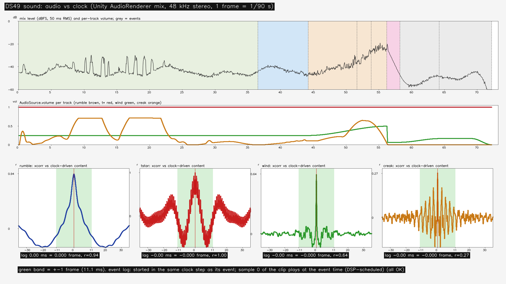
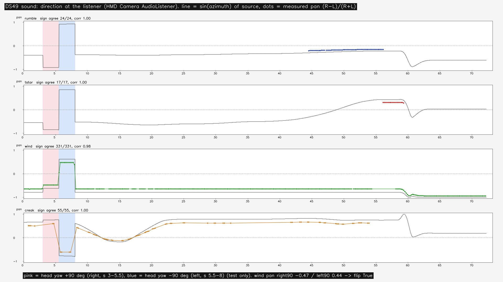
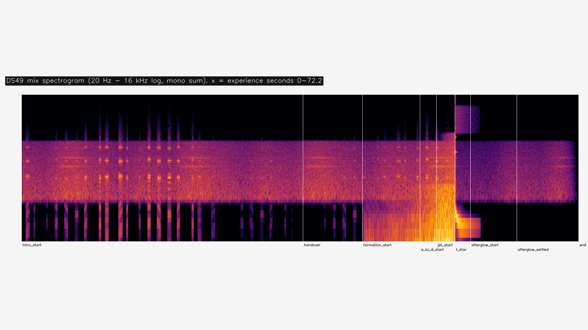

# 設計49：波・木船・風の音 ― numpy で合成した 4 つの音（波の地鳴り・t\* のツケ打ち・風・船のきしみ）を、共通時計の段から出来事に合わせて 3D の AudioSource で鳴らす。音と画のずれ ≤1 フレームと、聞き手での左右の向きを PC で満たした（崩壊の音は作らない、Q11）

日付：2026-09-30／状態：**閉じた（使える水準。最小の受入 2 つを満たした。受入の判定の後の修正 0 回）**。証拠の種類は次のとおり。**HMD 実機の結果ではない。Release のプレイヤーでも、実時間の音の出力でもない（Unity の音の混ぜをオフラインで取り出したもの）。人の耳では聞いていない。Mock の両目の描画もこの番号では描いていない。**

- 作る部：Unity 6000.4.3f1 の Editor の Play モード（batchmode、RTX 3080）。
  - `DS49SoundPlay.Run` は保存した場面 `DS49_Sound.unity` を開き、部品の準備ができるまで（フレーム 1、体験の時刻 0.020 s）は止めた状態から `EditorApplication.Step` で進め、その後は一時停止を解いて `Time.captureDeltaTime` = 1/90 s で 1 フレーム = 1/90 s に固定して進めた（`ds49_play.json` の `notes`）。設計47・48 の道（最後まで `Step`）と違うのは、Editor が止まっている間は Unity の音が鳴らず、音を取り出せないため（第 5 節の main1・main2）。
  - 音は `AudioRenderer`（Unity の音の混ぜを、フレームの時刻に合わせてオフラインで作る仕組み）で、聞き手（設計47 の HMD Camera の AudioListener）の 48 kHz・ステレオの音を毎フレーム取り出し、float32 の列 `ds49_mix.f32` に書いた。
  - 記録の部品 `DS49Recorder`（試験だけ。場面には保存しない）が、90 Hz の CSV（体験の時刻・相・聞き手の位置と向き・4 つの音の再生の位置と音量と聞き手から見た位置）と、1/30 s ごとの聞き手のカメラの画（960 × 540 の JPG、2,167 枚）を書いた。
  - 数え直し・図・動画は numpy・OpenCV・ffmpeg（`ds49_report.py`）。
- 進行役の独立の検査：作る部の出力（混ぜた音・CSV・動画・JSON・WAV）を、作る部の道具を使わずに numpy・OpenCV の自前の道具で調べた。判定は pass、必須の指摘 0、新しい記録の指摘 2（第 9 節の 1・2）。
- 記録の道具 `ds49_record.py`：
  - 作る部の SHA-256 を照合した。作る部の run.json の 13 件（入力 5・出力 7・数え直しの道具 1）と守るファイル 43 件、場面・4 つの WAV・表・生成器（`ds49_build.json`・`ds49_play.json`・`ds49_audio_manifest.json` の値）で、すべて同じ。
  - 作る部の数え直しの道具を使わずに、生の記録（`ds49_play.json`、90 Hz の `ds49_frames.csv`・`ds49_audio_frames.csv`、`ds49_mix.f32`、4 つの WAV、終わりの原画視点の PNG）から数え直した（[ds49\_record\_recount.json](../Evidence/Design/49/ds49_record_recount.json)）。作る部の metrics.json の 8 つの値（音の流れの定数と残り・標本の数・混ぜた音の最大・2 つの音の最初のフレームまでの差・原画視点の画素）との差はどれも 0。4 つの音の遅れは測り方が違うので 0.33 標本以下の差（第 2.5 節）。
  - 証拠を写し（証拠の動画は音と画を合わせ直して作った。第 9 節の 1）、場面の依存を調べ、記録の metrics.json・run.json を書いた。Unity は回していない。

番号の前提：

- 対象：[段階9までの実行計画](../Design/Stage9_Plan_2026-09-26_ja.md)（以下「計画」）§2.5 の設計49。
  - 使える水準の成果物：「波の地鳴り（形成で強まる）、崩壊の音、風、船のきしみ。numpy で合成して WAV にする（D27。ダウンロードはしない）。位置と出来事に合わせた 3D の AudioSource」。
  - 最小の受入：「音と見た目の時刻のずれ ≤1 フレーム（時計から駆動）。方向が合う（PC の画面で確認）」。
  - 依存は設計46・47。計画の表にバックログの項目番号はない。
  - **崩壊の音は作らない**：Q11 で t\* の後の崩壊を作らないことになった（計画の［Q11］の注記は「崩壊の音（設計49）… はその番号に着手する時に扱いを決める」）。代わりに、t\* の瞬間に歌舞伎の見得のツケ打ち（「バッタリ」）の打音を置き、時間が止まる 2 s の保持を支える（D49-1。進行役の選択、Q24。利用者未回答）。
  - D27（音の素材）は既定値・利用者未回答の「numpy で合成」のまま。ダウンロードも録音も外の素材も使っていない。
- 引き継ぎ（どれも SHA-256 を照合した。[ds49\_build.json](../Evidence/Design/49/ds49_build.json) の `protected` の 43 件）：
  - [設計48](Design_48_ja.md) の体験の場面 `DS48_Wake.unity`（`738a2381…`）と、設計48 の 7 ファイル。
  - [設計47](Design_47_ja.md) の進行役 `DS47Flow.cs`（`911945a6…`）・出来事の表を持つ `ds47_flow.json`（`de6df628…`）など 7 ファイル。聞き手（AudioListener）は設計47 が HMD Camera に置いたもの。
  - [設計46](Design_46_ja.md) の共通時計 `GWClock.cs`（`e2d9c83f…`）・`DS46ClockBus.cs`（`1d1fef18…`）・出来事の道 `DS46EventTrack.cs`（`3dc58b00…`）。
  - 設計41〜45 の場面・部品・表、設計30 の支え、28修正01 の τ(t)（`627815c7…`）、`seat_v1.json`。
- 時間の上限：Q26 の日程で 2 時間（計画 §2.6 の［Q26］の表、10/4 の行の設計49。計画の時間枠は ≤0.75日）。範囲は最小の受入だけで、同じ問題の修正は 1 回まで。
  - 実績（ファイルの時刻。+08:00）：
    - 着手：作る部の報告では 16:19。作る部の作業の場所の `_started.txt` は 16:25:04、最初のファイル `ds49_sound.json` は 16:25:47。設計48 の記録（16:19〜）と重ねた（計画の［Q26］の「N の記録・コミットと N+1 の作業を重ねてよい」）。
    - 作る部：生成器 16:26、場面の作り build1 〜16:30:21、通し main1〜main10（〜17:12:41）、場面の作り直し build2 〜16:55:04、数え直し・図・動画 17:13、WAV の作り直し（決定性の確かめ）17:14:24、`_finished.txt` 17:14:25。
    - 進行役の独立の検査：17:18:51〜17:23:03（検査の道具のファイルの時刻）。
    - 記録：17:25〜。終わりは `Unity/Build/Design/49/READY_TO_COMMIT.txt` の時刻。
    - 着手（作る部の報告の 16:19）から作る部の最後の出力（17:14）まで約 55 分、独立の検査の終わり（17:23）まで約 64 分で、2 時間の上限の内。
  - 1 回の計算：どれも 30 分の上限より十分短い。最終の通し main10 は 17:11:23（ログの `Date`）から 17:12:41（設定の戻しの記録）までの約 1.3 分（6,507 フレーム、コマの描画の合計 19.2 s。`ds49_play.json` の `renderMsTotal`）。作る部の数え直しは 7.7 s（作る部の run.json の `seconds`）、記録の道具は約 4.7 s。
- 読むだけで変えていないもの：
  - `DS48_Wake.unity` は開いただけで保存せず、写しに音の物を足して新しい場面 `DS49_Sound.unity` に保存した。
  - 守るファイル 43 は、場面の作り（build1・build2）の前後と数え直しと記録の時で SHA-256 が同じ。
  - 前の番号のコードは書き換えていない。
  - ProjectSettings：設定の戻しの記録 12 本（build1・build2・main1〜10）は、どれも戻したファイル 0。ただし GUI の Editor を開いた main2 で `Unity/ProjectSettings/PackageManagerSettings.asset` が新しくでき、残っている（記録だけで消していない。コミットしない。第 4 節の 11）。
- **原画視点の回帰（計画 §2.0）**：
  - 原画視点の場面（`DS39_Paper.unity`）と設計41・46・47・48 の場面は SHA-256 のまま。この番号は新しい場面 `DS49_Sound.unity` だけを作った。
  - 体験の終わりの原画視点（DS27 painting のカメラ、1920 × 1080）`painting_end.png` は、設計48 の同じ画と SHA-256 が同じ（`faa78462…`。設計47 とも同じ）で、違う画素は 0。音は画に何も描かない。
  - 画素が同じなので、評価器は回し直していない。合格した項目（78・130・131・132 の大きな形・72 σ24 の大きな形の p95・69・70・212、設計29修正01 で戻した色の項目）の値は変わらない。
- 座標と単位：
  - s は体験の時刻（`GWClock.ExperienceSeconds`）。大波の時刻は s − 大波の始まり（44.213 s）で、形成の始まりで 0、t\* で 12 s。
  - 1 フレーム = 1/90 s = 11.1 ms = 48 kHz の 533.3 標本。
  - 左右の釣り合い（pan）は (R − L)/(R + L)。聞き手から見た位置の x は右が正、z は前が正。方位角は聞き手の前から右回り。
- 使っていないもの：作る部・検査・記録の出力に、AGENTS.md の禁止の場所と読み取りのみの例外（参照モデル・利用者の解算・写真・爪の分析）を使った跡はない（コミットの一覧の点検で文字列 0）。記録は、コミットの一覧の点検で、爪の分析のフォルダーのファイルの大きさだけを読み取りのみで調べた（第 9 節の 10）。ウェブは読んでいない。

## 見るもの

**音つきの動画**：[ds49\_sound\_960x540\_30fps.mp4](../Evidence/Design/49/ds49_sound_960x540_30fps.mp4)（主の実行 main10 の全体。聞き手の HMD Camera の画と、Unity が混ぜたステレオの音。72.2 s、2,166 コマ、2,762,058 バイト）

- 左右を聞き分けるには、ヘッドホンで聞く。
- 記録で作り直した写し（第 9 節の 1）。作る部の動画は音が画より 22 ms 早いので、コマ 1 以後の画と、コマ 1 の時計の時刻（0.0422 s）からの音で作り直した。t\* の打音の立ち上がりは、画の時刻の見込みより 3.2 ms 早い（AAC にした音で測った値。元の混ぜた音では 0.28 ms 早い）。
- 見どころ：
  - s 0〜36：導入。風（左、大波の側から）と船のきしみ。s 3〜5.5 に頭を右へ 90°、s 5.5〜8 に左へ 90° 向ける試験（聞き手の向きで風の左右が入れ替わる）。きしみは旋回の間に大きくなる。
  - s 44.2：形成の始まりで波の地鳴りが始まり、t\* へ向けて強まる。s 51.7 の a→d で盛り上がり、s 53.8 の噴流の始まりから水の裂ける中域の音が加わる。
  - s 56.2：t\*。地鳴りがちょうど切れ、ツケ打ちの 2 打（85 ms の間）と低い胴の響き。風は 0.12 s で下がる。2 s の保持の間に、止まった飛沫のかすかな高い響きが消える。
  - s 58.2〜72.2：余韻。風がゆっくり戻り、終わりの 3 s で消える。

| 音と時計（上から：混ぜた音の大きさ（dBFS、50 ms）と相の色・灰の縦線は出来事、4 つの音の音量、4 つの音の中身と混ぜた音の相互相関。緑の帯は ±1 フレーム） |
| --- |
|  |

| 聞き手での向き（4 つの音。線は聞き手から見た音の位置の sin(方位角)、点は測った左右の釣り合い。桃色は頭を右へ 90°、青は左へ 90° の試験の区間） |
| --- |
|  |

| 混ぜた音のスペクトログラム（20 Hz〜16 kHz の対数、左右の和。横は体験の時刻 0〜72.2 s、白の縦線は出来事） |
| --- |
|  |

- 図は作る部の出力。音と時計・聞き手での向きは作る部の 1920 × 1080 のまま、スペクトログラム（1920 × 620）は 1920 × 1080 の中央に置いた（上下は図の地の灰）。図の文字は英語（作る部の図の部品）。
- 動画は紙の層（設計39）を切って描いた（設計47・48 の記録と同じ `paper=off`）。

数値：

- [metrics.json](../Evidence/Design/49/metrics.json)（記録）：最小の受入 `acceptance`、原画視点 `regression_painting_view`、実行の道 `play_path`、WAV `wav`、証拠の動画 `evidenceVideo`、修正の前の main8 `main8BeforeFix`、記録のみ `record_only`、修正 `fix_rounds`、時間 `time`、作る部との差 `diffVsBuilder`
- 記録の数え直し：[ds49\_record\_recount.json](../Evidence/Design/49/ds49_record_recount.json)（照合、フレームと出来事、音の流れ、始まり、遅れ、打音、WAV、コマの時刻、main8、原画視点、場面の依存、証拠の写し方）
- 作る部の写し：
  - [ds49\_sound\_metrics.json](../Evidence/Design/49/ds49_sound_metrics.json)（作る部の metrics。記録で補った文は第 9 節）
  - [ds49\_sound\_run.json](../Evidence/Design/49/ds49_sound_run.json)（作る部の入出力と守るファイルの SHA-256）
  - [ds49\_build.json](../Evidence/Design/49/ds49_build.json)（場面の作り：聞き手、音のクリップ、守るファイル）
  - [ds49\_play.json](../Evidence/Design/49/ds49_play.json)（Play の報告：出来事、音の始まり、音の道ごとの数、音の流れ）
- 実行条件と SHA-256：[run.json](../Evidence/Design/49/run.json)

## 0. 結論

1. **最小の受入 1：音と見た目の時刻のずれ ≤1 フレーム（時計から駆動）。合格。**
   - 時計から駆動：`DS49Sound` は共通時計の段「sound」（順 95、出来事の段 90 の後）で動く。4 つの音はどれも、出来事と同じ時計の段で始まった（地鳴り＝形成の始まり 段 3980、t\* の音＝t\* 段 5060、風ときしみ＝導入の始まり 段 2）。
   - クリップの標本 0 は、音の処理の時計の上で出来事の時刻ちょうどに予約された（`PlayScheduled`。予約の時刻をその時の対応で体験の時刻へ直すと、出来事との差は 4 つとも 1 ns より小さい）。風ときしみは、最初の記録の行（0.031 s）で 1 回合わせ直した（第 2.5 節）。
   - 音の流れ：1 フレームごとに 0 か 1,024 標本の塊が出て、「音の処理の時計 − 標本の数/48000」は 10.901333 s で一定。標本 0 の体験の時刻は `AudioRenderer` を始めた時刻 0.020 s で、`DS49Sound` の持つ時計との対応とのずれは 0.0 ms。
   - 混ぜた音の中身：4 つの音の中身を「体験の時刻 − 出来事の時刻」の位置に並べ、Unity の混ぜた音と相互相関を取ると、山の遅れは地鳴り −0.31、t\* の音 −0.27、風 −0.11、きしみ −0.04 標本（どれも 1 標本より小さい。1 フレームは 533 標本）。
   - 画との差：形成の始まり（44.21317 s）と t\*（56.21317 s）は、それを見せる最初のフレーム（44.22000 s・56.22000 s）より 6.8 ms 前にある。音はその 0.61 フレーム前から鳴る（出来事がフレームの間にあるため）。t\* の打音の立ち上がりは出来事の 0.28 ms 前（混ぜた音の 3 kHz より上）。
2. **最小の受入 2：方向が合う（PC の画面で確認）。合格。**
   - 0.2 s の窓ごとに、左右の音を 4 つの音に分けて左右の釣り合いを測った（作る部）。音が左右のどちらかにはっきりある窓（|sin 方位角| > 0.25、その音の割合 > 5%）で、左右の符号が音の位置と合ったのは、地鳴り 24/24、t\* の音 17/17、風 331/331、きしみ 55/55。釣り合いと sin(方位角) の相関は 0.9999・0.998・0.979・0.9986。
   - 頭の向きの試験（聞き手は HMD Camera）：風の釣り合いは、正面 −0.64（sin(方位角) −0.79）、右へ 90° −0.47（−0.62）、左へ 90° +0.44（+0.62）。左へ向けた時だけ入れ替わり、正しい（風は左前から来るので、右を向いても左のまま）。
   - t\* の打音：3 kHz より上の最初の 60 ms で右が大きく、釣り合い +0.30。音源は聞き手から見て右へ 6.7 m、前へ 14.0 m（右前、約 15.7 m）。
   - PC の画面：独立の検査が、記録された音源の位置を聞き手のカメラの画（960 × 540）へ 8 つの時刻で投影し、地鳴りが大波の本体に、t\* の音が t\* の波の面の右下の縁に、風が左（大波の側）にあることを見た。
   - **左右だけ**。Unity の標準のパンには HRTF がないので、前後と高さは分けられない（第 4 節の 3）。
3. **原画視点の回帰なし**：体験の終わりの原画視点は設計48 と 0 画素の差（SHA-256 も同じ）。
4. **実行の道**：保存した場面 `DS49_Sound.unity` を Editor の Play モードで通した。6,507 フレーム（CSV は準備のフレーム 1 を除く 6,506 行）、全長 72.213 s、出来事 9 つが 1 回ずつ、音と進行役の誤り 0、船用水面データの代わりの値 0（42,302 回の読み）、音の標本 3,469,312（72.28 s）。
5. **限界（第 4 節）**：
   - 実時間の出力の遅れ（音の処理の塊 1,024 標本 × 4、ドライバー、HMD の表示）は測っていない。合わせ直しの許容 0.05 s は 1 フレームより緩い。
   - 方向は左右だけ。地鳴りと t\* の音の位置は粗い。
   - 人は聞いていない。音色・音量の釣り合い・ツケ打ちが保持に合うかは決めていない。
   - 一時停止・再開・途中からの再生・初期化の音の道は、Play では試していない。
   - Release・実時間・PS VR2・Mock の両目は確かめていない。

---

## 1. 目的

設計書の段階9 は、体験を一本につなぐ段階である。設計48 までで、物理の船・操船・乗客・船用水面データ・泡と航跡は一つの体験の場面で動くようになった。ただし体験には音がなかった。

計画 §2.5 の設計49 は、波・木船・風の音を numpy で合成し（D27）、出来事と位置に合わせた 3D の音として鳴らす番号である。音が画より遅れたり早すぎたりすると、形成の盛り上がりと t\* の止まる瞬間が崩れるので、時計から駆動して 1 フレームの内に合わせることと、聞き手で方向が合うことを受入にしている。

Q11 で崩壊を作らないことになったので、計画の「崩壊の音」は作らず、t\* の瞬間の打音で置き換えた（D49-1）。Q26 により、最小の受入だけを満たし、同じ問題の修正は 1 回までとした。

---

## 2. 表

### 2.1 音の表（`Data/ds49_sound.json`、`GreatWave.DS49.sound/1`）

値は表から。どれも進行役が決めた既定値（Q24・Q26。利用者未回答）。乱数の種 4901、48 kHz。

| 音 | 中身（`synth`） | 始まる出来事 | 位置（`place`） | 音量 | 3D（最小・最大の距離、広がり） |
| --- | --- | --- | --- | --- | --- |
| 波の地鳴り（rumble） | 12 s。大波の時刻 0〜12 s。−28 dB から 0 dB へ強まる（指数 1.3）。低い帯 18〜70 Hz・うなり 70〜260 Hz、a→d（7.45 s）で盛り上がり（0.32 Hz のうねり）、噴流の始まり（9.6 s）から水の裂ける中域 350〜2,600 Hz。始まり 0.25 s・終わり 0.02 s でなめらかにし、t\* でちょうど切れる。最大 −2 dBFS | 形成の始まり `formation_start` | 主役波のシート（hero）の描画の範囲の中心（毎段） | 1.0（強弱は中身に焼いてある） | 60・1,500 m、40° |
| t\* の瞬間（tstar） | 3.4 s。ツケ打ちの 2 打（0 s と 0.085 s、強さ 0.75・1.0。1,180・2,350・3,480・5,150 Hz の減衰する響き）＋低い胴の響き（90 → 48 Hz、0.7 s で減衰）＋止まった飛沫のかすかな高い響き（3〜9 kHz、1.1 s で減衰）。最初の打音の立ち上がりが標本 0。最大 −3 dBFS | t\* `t_star` | t\* の爪（DS34 の爪の描画の範囲の中心） | 1.0 | 60・1,500 m、30° |
| 風（wind） | 16 s の輪（終わりの 1 s を始めへ等しい力で重ねる）。広い帯 150〜1,800 Hz の風と、突風（0.07・0.13・0.21 Hz）に合わせて強まる 2 本の笛の音（620・910 Hz、幅 22 Hz）。最大 −6 dBFS | 導入の始まり `intro_start` | 聞き手 ＋ 風の来る向き × 15 m。向きは世界に固定した、原画のカメラの左（大波の側）。場面では (−0.999, 0, −0.038)（`ds49_play.json` の `windFromDir`） | 0.55 × 風の音量（時計の関数、下の行） | 8・500 m、30° |
| 木船のきしみ（creak） | 12 s の輪。板の擦れ（1 つ 0.25〜0.65 s、28〜75 Hz のパルス列）を木の響き（380・820・1,450 Hz）に通したもの 9 つ。輪の継ぎ目をまたがない。最大 −4 dBFS | 導入の始まり `intro_start` | 座席の船の根の局所の点 (0, 0.35, −0.6) m | 0.8 × きしみの音量（船の動き、下の行） | 1.5・80 m、0° |
| 風の音量（`windGain`） | 導入・接近 0.45 → 形成で smoothstep により 0.9 → t\* で 0.12 s のうちに 0.12 → 余韻の視点の移動の間に 0.3 → 終わりの 3 s で 0 | — | — | — | — |
| きしみの音量（`creakGain`） | 傾きの角速度 0.6〜8.0°/s と水平の速さ 0.3〜4.0 m/s を 0〜1 にし、重み 0.75・0.25 で足す。体験の時刻で微分し 0.25 s でならす。t\* の保持で船が止まれば鳴らない | — | — | — | — |
| 時計との合わせ（`sync`） | 時計の段の順 95。毎段、再生の位置と「体験の時刻 − 出来事の時刻」の差が 0.05 s を超えたら合わせ直す。ドップラー 0 | — | — | — | — |
| 試験の筋書き（場面には入れない） | 操船は設計47 の筋書き（設計48 と同じ）。頭の向き：s 3.0〜5.5 右へ 90°、s 5.5〜8.0 左へ 90° | — | — | — | — |

### 2.2 WAV（`Audio/`、`ds49_synth.py` が作る）

値は記録の数え直し（`wav`）と `ds49_audio_manifest.json`。どれも 48 kHz・モノラル・16 bit。

| 音 | 標本 | 長さ | バイト | 最大 | RMS（manifest） | 最初の 0 でない標本 | 輪の継ぎ目の跳び（隣の標本の差の 99.9 パーセンタイル） | SHA-256 |
| --- | --- | --- | --- | --- | --- | --- | --- | --- |
| rumble | 576,000 | 12.0 s | 1,152,044 | −2.00 dBFS | −19.85 dBFS | 422 | —（輪でない） | `2ccbae66…` |
| tstar | 163,200 | 3.4 s | 326,444 | −3.00 dBFS | −28.65 dBFS | 0 | — | `7551155e…` |
| wind | 768,000 | 16.0 s | 1,536,044 | −6.00 dBFS | −23.29 dBFS | 0 | 197（979） | `0f588d56…` |
| creak | 576,000 | 12.0 s | 1,152,044 | −4.00 dBFS | −25.07 dBFS | 29,569 | 0（1,499） | `68552cb4…` |

- 合計 4,166,576 バイト。いちばん大きい風で 1,536,044 バイト（5 MB の目安の内）。
- 同じ表と種で同じバイトになる：作る部は 2 回目の生成で同じバイトを得た（WAV の時刻 17:14:24 はその 2 回目）。独立の検査は生成器を作業の場所で回し、4 つとも同じ SHA-256 を得た。
- 地鳴りの最初の 0 でない標本 422 は、始まりの 0.25 s のなめらかさで 16 bit に丸めると 0 になる所。中身の標本 0 は出来事の時刻にある。
- きしみの最初の 0 でない標本 29,569（0.62 s）は、最初のきしみの置き場所。

### 2.3 部品（Unity の C# と道具）

値はコード（`Unity/Assets/GreatWave/Design49/`、`Tools/GWWaveGen/ds49/`）から。

| 部分 | 中身 |
| --- | --- |
| `DS49Sound`（時計の段 95、LateUpdate の順 100） | 4 つの音。共通時計の段で、出来事の表（`DS46EventTrack`。設計47 が入れた時刻）を見て、出来事が起きた段（前の時刻 < 出来事 ≤ 今の時刻）でその音を始め、再生の位置を「体験の時刻 − 出来事の時刻」にする（未来なら `PlayScheduled` で標本の精度で予約）。音の処理の時計（`AudioSettings.dspTime`）との対応は、前の段の「体験の時刻 − dspTime」の最小（D49-2）。止めている間（時計の停止・進行役の一時停止）は音も止め、再開・途中からの再生・初期化で対応を取り直す。LateUpdate（乗客 90・進行役 95・航跡 96 の後）で音源の位置と、風・きしみの音量を決める。きしみの角速度は差の四元数のベクトル部から半角を取る（`Quaternion.Angle` は 1 段 0.1° ほどの回転で 0 を返すため。main9 で見つけた） |
| `DS49CaptureDriver`（試験だけ） | `AudioRenderer.Start`、`Time.captureDeltaTime` = 1/90 s、毎フレーム `AudioRenderer.Render` で標本を取り出して float32 で書き、フレームごとの体験の時刻と標本の数を CSV に残す |
| `DS49Recorder`（試験だけ。場面には保存しない） | 90 Hz の CSV（体験の時刻・相・聞き手・4 つの音の再生の位置・目標・差・音量・聞き手から見た位置・合わせ直しの数）と、1/30 s ごとの聞き手のカメラの画（960 × 540） |
| `DS49SoundBuild`・`DS49SoundPlay`（Editor） | 場面を作る：`DS48_Wake.unity` を開いて保存せず、「DS49 音」の根（`DS49Sound`）と 4 つの AudioSource の物（2D/3D の割合 1 = 全部 3D、ドップラー 0、対数の減衰）を足し、時計・進行役・出来事の道・聞き手・主役波と爪の描画へ結んで `DS49_Sound.unity` として別に保存する。守るファイルを前後で比べる。通し：準備の後に一時停止を解き、`EditorApplication.QueuePlayerLoopUpdate` でフレームを進め、音・CSV・画・終わりの原画視点を書く |
| 道具 `ds49_synth.py`・`run_ds49_unity.ps1`・`ds49_report.py`・`ds49_record.py` | 音の合成（numpy だけ）、Unity の 1 回の実行（`unity.lock`、設定のバイトの戻し、`-NoQuit`、`-Gui`）、作る部の数え直し・図・動画、記録 |

### 2.4 場面 `DS49_Sound.unity`

値は記録の数え直し（`scene`）と `ds49_build.json`。

- 215,109 バイト、SHA-256 `90894c9a…`。`DS48_Wake.unity` の写しに、音の根と 4 つの音の物を足した。
- 場面の中の項目は 301 → 316（+15：根の物・Transform・`DS49Sound` と、4 つの音の物・Transform・AudioSource）。カメラは 7 と 7、AudioListener は 1 と 1 で同じ（聞き手は HMD Camera。`ds49_build.json` の `listener`）。
- GUID は 53 → 59。`DS48_Wake.unity` にないのは 6 つで、どれもこの番号のもの：`DS49Sound.cs`・`ds49_sound.json`・4 つの WAV。落ちた GUID は 0。
- 音のクリップはどれも読み込みの時に展開する形（DecompressOnLoad）、48,000 Hz・1 チャンネル（`ds49_build.json` の `clips`）。
- 他の 2 隻（boat\_fg・boat\_left）は設計47 の D47-6 のまま止まっているので、きしみは付けない。
- 場面には、設計41 から写った絶対のパスが 3 つある（設計46〜48 と同じ。第 4 節の 9）。

### 2.5 最小の受入 1：音と見た目の時刻のずれ ≤1 フレーム（時計から駆動）

値は記録の数え直し（`starts`・`events`・`stream`・`sync`・`drift`・`tstarClack`）。作る部の metrics.json と同じ値（遅れは測り方が違い、差は 0.33 標本以下）。

| 音 | 出来事（時刻） | 始めた段と出来事の段 | 標本 0 の時刻 − 出来事 | 出来事を見せる最初のフレーム | 音が最初のフレームより前 | 混ぜた音の遅れ（記録／作る部） | 相関の山（記録）、±1 フレームでの相関 | 合わせ直し |
| --- | --- | --- | --- | --- | --- | --- | --- | --- |
| rumble | formation\_start（44.21317 s） | 3980 と 3980 | 0.0 ms | 44.22000 s | 0.61 フレーム | −0.31／+0.02 標本 | 0.937、−0.12 | 0 |
| tstar | t\_star（56.21317 s） | 5060 と 5060 | 0.0 ms | 56.22000 s | 0.61 フレーム | −0.27／−0.003 標本 | 0.995、+0.07 | 0 |
| wind | intro\_start（0.000001 s） | 2 と 2 | 0.0 ms | 0.0311 s | —（最初の段は 0.020 s の長さ） | −0.11／−0.06 標本 | 0.635、+0.03 | 1（最初の行） |
| creak | intro\_start（0.000001 s） | 2 と 2 | 0.0 ms | 0.0311 s | — | −0.04／−0.004 標本 | 0.303、+0.02 | 1（最初の行） |

- 遅れの向き：負は、混ぜた音が中身より早いこと。どれも 1 標本（0.02 ms）より小さく、1 フレーム（533 標本）よりずっと小さい。相関の山は遅れ 0 にあり、±1 フレームずらすと相関は 0.08 未満へ落ちる。記録は左右の和で、作る部は別の書き方で測った。風ときしみの相関が低いのは、区間の中で音量と左右が変わり（頭の向きの試験・船の動き）、ほかの音が重なるため。
- 出来事を見せる最初のフレーム：t\* の前のフレーム（56.20889 s）は大波の時刻 11.9957 s、次のフレーム（56.22000 s）で 12.0。形成の前のフレームは大波の時刻 0、次のフレーム（44.22000 s）で 0.0068 s。
- 音の流れ（`ds49_audio_frames.csv`、6,506 行）：1 フレームの標本は 0 か 1,024、合計 3,469,312。「音の処理の時計 − 標本の数/48000」は 10.901333 s で一定。「(体験の時刻 − 0.020) × 48000 − 標本の数」は、走っている間 0.0006〜1,002.75 標本で、塊の粒（1,024）の内。体験の終わりの後の 9 行は、時計が止まったまま音が出た分で、終わりに −4,039.67 標本。
- 再生の位置と時計の差（CSV の `*_drift`、`DS49Sound` の持つ値）：鳴っている間の最大は、地鳴り・t\* の音 0.007 ms、風・きしみ 0.001 ms（最初の行を除く）。風ときしみは最初の行（0.031 s）で 0.257 s ずれていて、1 回合わせ直した（音をオフラインへ切り替えた時の対応の取り直しによる。`soundStarts` の対応は −10.6027 s、その後は −10.8813 s）。
- 対応の取り直しは 0 回（`mapResets`）。
- t\* の打音の立ち上がり（混ぜた音の 3 kHz より上、包絡が最大の 10% を超えた所）は出来事の 0.28 ms 前。

### 2.6 最小の受入 2：方向が合う（PC の画面で確認）

値は作る部の metrics.json（`direction`・`headTurn`）と記録の数え直し（`tstarClack`）。独立の検査の値は第 9 節の後の注。

| 音 | 窓（0.2 s） | 左右がはっきりした窓 | 符号が合った窓 | 釣り合いと sin(方位角) の相関 |
| --- | --- | --- | --- | --- |
| rumble | 58 | 24 | 24（100%） | 0.99994 |
| tstar | 17 | 17 | 17（100%） | 0.998 |
| wind | 331 | 331 | 331（100%） | 0.979 |
| creak | 73 | 55 | 55（100%） | 0.9986 |

| 頭の向き（風） | 窓 | 測った釣り合い | sin(方位角) |
| --- | --- | --- | --- |
| 正面 | 25 | −0.64 | −0.79 |
| 右へ 90°（s 3.0〜5.5） | 12 | −0.47 | −0.62 |
| 左へ 90°（s 5.5〜8.0） | 13 | +0.44 | +0.62 |

- 作る部の読み方：窓ごとに、左右のそれぞれを 4 つの音の中身の和として最小二乗で分け、音ごとの左右の釣り合いを出す。左右がはっきりした窓は |sin 方位角| > 0.25 かつその音の割合 > 5%。
- 頭の向き：風は左前から来る（正面で −0.79）ので、右へ向いても左のまま（−0.62）で、左へ向いた時だけ右へ入れ替わる（+0.62）。測った釣り合いの向きはこの 3 つとも合う。
- t\* の打音：3 kHz より上の最初の 60 ms の釣り合い +0.30（右が大きい）。音源は聞き手から見て右へ 6.72 m、下へ 1.94 m、前へ 14.00 m。
- 測った釣り合いの大きさは sin(方位角) より小さい（頭の向きの試験の 3 つで 0.70〜0.82 倍）。Unity の標準のパンの形と広がり（`spread`）による。この番号の受入は向き（符号）だけ。

### 2.7 実行の道（設計48 の流れの上で）

値は `ds49_play.json` と記録の数え直し（`frames`・`events`・`errors`）。

| 確かめ | 値 |
| --- | --- |
| フレーム・コマ | 6,507 フレーム（ログ `DS49_PLAY_DONE frames=6507`。CSV は準備のフレーム 1 を除く 2〜6,507 の 6,506 行）、1/90 s。聞き手のカメラのコマ 2,167 |
| 引き継ぎ | s 36.509（`reason` target）。大波の始まり 44.213、余韻 58.213、終わり 72.213。設計48 の主の実行と同じ（同じ操船の筋書き） |
| 相の行（最初の時刻） | 導入 3,283（0.031）、接近 694（36.509）、形成 1,080（44.220）、保持 180（56.220）、余韻 1,260（58.220）、終わり 9（72.213） |
| 出来事 | 9 つが 1 回ずつ。時計の時刻 − 出来事の時刻：`intro_start` 20.0 ms（最初の段の長さ）、`handover`・`end` 0、`a_to_d_start` 1.3 ms、ほかの 5 つは 6.8 ms |
| 音の道 | 始まり 各 1、止め：地鳴り 1・t\* の音 1、声を失った 0（`lostVoice`） |
| 誤り | 音 0、進行役 0 |
| 船用水面データ | 読み 42,302 回、代わりの値 0 |
| 入力 | 読み 3,283 フレーム、読めなかったフレーム 0 |
| 混ぜた音 | 3,469,312 標本（72.28 s）、最大 0.617（−4.19 dBFS）で割れない |
| 守るファイル・ProjectSettings | 43 の SHA-256 は同じ。設定の戻し 0（12 本）。main2 で `PackageManagerSettings.asset` が新しくできた（第 4 節の 11） |
| Unity のログ | main10・build2 にこの番号のファイルの警告の行はなく、コンパイルの誤り 0。build1 のログには `DS49SoundBuild.cs`（66・68 行）と `DS49SoundPlay.cs`（その時の 161・186・187 行）に、使うのをやめるよう勧められた API（`FindFirstObjectByType`・`FindObjectsSortMode`）の警告 CS0618（前の番号の Editor の道具と同じ。今のコードにも同じ呼び出しがある）。main10 に `UnityEditor.Search.SearchDatabase` の `ArgumentOutOfRangeException` が 1 つ（Editor の起動時の検索の索引。設計48 の記録の限界 10 と同じもの） |

- 段階8確認 F8-3 の Play の道（物理の船・操船・乗客・船用水面データを一つの場面で Play）は、この場面でも同じに働く。ただしこの番号の試験の道は、準備の後に一時停止を解いて進める（第 4 節の 7）。

### 2.8 作り方と採ったもの（Q24。進行役の判断で、利用者の決定ではない）

表・コードの文と作る部の報告から。番号は記録で付けた（作る部の報告の D49-2 と同じ中身）。

- **D49-1：崩壊の音の代わりに、t\* の瞬間のツケ打ち。** Q11 で崩壊を作らないので、t\* で時間が止まる 2 s の保持を支える打音にした。地鳴りは t\* でちょうど切れる。落とした：崩壊の音をそのまま作る案（Q11 の範囲の外）、t\* で何も鳴らさない案（止まる瞬間が音で分からない）。
- **D49-2：時計から駆動し、音の処理の時計へ標本の精度で写す。** 出来事の段で始め、再生の位置 = 体験の時刻 − 出来事の時刻。Unity は 1,024 標本（約 21 ms、1.9 フレーム）の塊で音を混ぜるので、その段で `Play()` すると最大 1 塊ずれる。そこで「前の段の体験の時刻 − dspTime」の最小を対応として持ち、`PlayScheduled` でクリップの標本 0 を出来事の時刻に置く（main8 は今の段の値を使って 1 フレームずれた。第 5 節）。
- **D49-3：音源の位置。** 地鳴り＝主役波のシートの描画の範囲の中心、t\* の音＝t\* の爪の範囲の中心（t\* に固定）、風＝聞き手から 15 m の世界に固定した向き（原画のカメラの左＝大波の側）、きしみ＝座席の船体の上の点。どれも 3D（2D/3D の割合 1）。
- **D49-4：音量の決め方。** 地鳴りと t\* の音は強弱を中身に焼き、風は時計の関数（形成で強まり、t\* で下がり、余韻で戻り、終わりで消える）、きしみは船の角速度と速さ。
- **D49-5：ドップラー 0、合わせ直しの許容 0.05 s。** 音の中身の時刻を時計に合わせたまま保つため、ドップラーは切った。許容は塊の粒（約 21 ms）より大きいずれだけを直す値（第 4 節の 2）。
- **D49-6：測り方。** Unity の音の混ぜを `AudioRenderer` でオフラインに取り出し、フレームを `Time.captureDeltaTime` = 1/90 s に固定した。Editor が止まっている間は音が鳴らないので、準備の後は一時停止を解いて進める。
- **D49-7（記録の選択）：4 つの WAV をコミットする。** 場面が WAV の GUID を指すので、場面を開ける形でコミットするには WAV と .meta が要る。どれも 5 MB の目安の内（合計 4.17 MB）で、生成器・表・SHA-256 も一緒に入れる。落とした：WAV を Git 対象外にして生成器で作り直す案（場面を開くたびに生成が要り、.meta の GUID も作り直しになる）。進行役がコミットの時に変えてよい。

---

## 3. 関門

| 最小の受入・規則 | 基準 | 値 | 判定 |
| --- | --- | --- | --- |
| 音と見た目の時刻のずれ（時計から駆動） | ≤1 フレーム（11.1 ms） | 4 つとも出来事の段で始まり、標本 0 は出来事の時刻に予約（差 < 1 ns）。混ぜた音の遅れは 4 つとも 1 標本未満。音は出来事を見せる最初のフレームの 0.61 フレーム前 | 合格 |
| 方向が合う（PC の画面で確認） | 聞き手で左右の向きが音の位置と合う | 左右がはっきりした窓で 4 つとも 100%（24・17・331・55）。頭を左へ 90° 向けた時だけ風が入れ替わる。独立の検査が画へ投影して位置を見た | 合格（左右だけ） |
| numpy で合成した WAV（計画の成果物、D27） | ダウンロード・録音なし | 4 つの WAV は `ds49_synth.py`（numpy だけ）が表と種から作り、同じバイトになる | 合格 |
| 位置と出来事に合わせた 3D の AudioSource（計画の成果物） | — | 4 つとも 3D、出来事の表の出来事で始まり、位置は主役波・爪・聞き手の周り・船 | 合格 |
| 崩壊の音（計画の成果物） | — | 作らない（Q11）。t\* のツケ打ちで代えた（D49-1） | 範囲の外（Q11） |
| 計画 §2.0 の回帰なし | 合格した項目を後退させない | 終わりの原画視点は設計48 と 0 画素（SHA-256 も同じ）。原画視点の場面は SHA-256 のまま | 合格（評価器は回していない） |
| 実行の道 | 誤りなく通る | 6,507 フレーム、出来事 9 つ、誤り 0、船用水面データの代わりの値 0 | 合格（受入の外） |
| 守るファイル・ProjectSettings | 変えない | 守るファイル 43 の SHA-256 は同じ。設定の戻し 0（12 本）。新しいファイル 1（コミットしない） | 合格（新しいファイルは記録） |
| 実時間の出力の遅れ | — | 測っていない | 記録のみ（設計50・仕上げ49） |
| HMD（PS VR2） | — | — | 保留（利用者の手）。音と画の遅れ、方向、音量（H2 とともに） |

---

## 4. 限界

1. **実時間の出力の遅れは測っていない（設計50・仕上げ49、PS VR2 は保留）。** 受入の値は、Unity の音の混ぜをフレームに合わせてオフラインで取り出した道のもの。実時間では、音の処理の塊（1,024 標本 × 4、`ds49_play.json` の `dspBuffer=1024x4`、48 kHz で最大約 85 ms）、ドライバー、HMD の表示の遅れが加わる。塊を小さくすることと、機器の出力を折り返して測ることは、設計50 の Release か仕上げ49 で。
2. **合わせ直しの許容 0.05 s は 1 フレームより緩い（仕上げ49）。** 0.05 s は約 4.5 フレーム。実時間で音の時計と体験の時計が 50 ms まで離れても直さない。オフラインの取り出しでは音の時計がフレームに縛られるので、ずれは出なかった（再生の位置と時計の差の最大 0.007 ms）。72 s の間の二つの時計のずれは小さい見込み（数十 ppm で数 ms）だが、測っていない。
3. **方向は左右だけ。** Unity の標準のパンには HRTF（頭の形による前後・高さの手がかり）も空間化の追加もないので、前後と高さは分けられない。受入は左右の符号で読んだ。
4. **音源の位置は粗い（仕上げ49）。** 地鳴りは主役波のシートの描画の範囲の中心で、聞き手から約 140〜200 m（作る部の報告）。t\* の音は爪の範囲の中心で、聞き手から約 15.7 m の右前。画では t\* の波の面の右下の縁にあり、見える爪の上ではない（独立の検査）。左右の向きは合う。
5. **人は聞いていない。** 音色、音量の釣り合い、ツケ打ちが t\* の保持に合うかは決めていない。音量は既定値で合わせていない（Q24、利用者未回答）。
6. **一時停止・再開・途中からの再生・初期化の音の道は、Play では試していない。** コードにはある（止めて再開した時の対応の取り直しを含む）。主の実行には、離れた時の一時停止も途中からの再生もなかった。
7. **試験の道が設計47・48 と違う。** 設計47・48 の道（`EditorApplication.Step`、Editor は止まったまま）では音が鳴らないので、準備の後に一時停止を解き、batchmode で `QueuePlayerLoopUpdate` と `Time.captureDeltaTime` = 1/90 s でフレームを進めた。フレームの数（6,507）と終わりの原画視点は設計48 と同じ。
8. **他の 2 隻のきしみ、海の地の音・船べりの水の音はない。** 他の 2 隻は止まっている（D47-6）。崩壊の音は作らない（Q11）。
9. **場面の絶対のパス 3 つ（設計50）。** `DS49_Sound.unity` にも、設計41 から写った密な飛沫の `dataPath` と near・far の `uv3File` がある（設計46〜48 と同じ）。Release のビルドでは読めない。
10. **Play の確かめは Editor の batch だけ（設計50、保留）。** Release の実時間のプレイヤーではない。入力は仮想のキーボードで、ゲームパッド・PS VR2 Sense・頭の追跡は保留（頭の向きの試験は HMD Camera の局所の向きを台本で回した）。Mock の両目はこの番号では描いていない。
11. **作業の副作用。** 作る部の報告と記録から：
    - GUI の Editor を開いた main2 で `Unity/ProjectSettings/PackageManagerSettings.asset`（Package Manager の画面の既定の設定）が新しくできた（`ds49_settings_restore_main2.json` の `addedFiles`）。作る部が消そうとした時は許可の仕組みで止められ、今も残る。Git の追跡の外のファイルで、コミットの一覧には入れない。消すか残すかは進行役が決める。
    - GUI の main4・main5 は机の上に Unity の Editor の窓を開いた。main4 は、前に止めた main3 の後の「場面の控えの戻し」の問いで止まった。作る部はこれらを止め、build2（batch）で一時のフォルダーを片づけた。
    - batch の main6 は、`AudioRenderer` がまだ働かず、体験の音の約 70 s を PC の音の装置へ実時間で鳴らした（ログ `audioSamples=0`）。main7 以後はオフラインで作る。
12. **証拠の動画（作る部の出力）は音が 22 ms 早い（記録で直した）。** 作る部の動画は、コマ 0（時計 0.0311 s）から音を始めたが、コマ 0 と 1 の間だけ 1 段（1/90 s）で、ほかは 3 段（1/30 s）なので、コマ 1 以後は音が 2/90 s 早い（記録の数え直し：t\* の打音で −22.5 ms）。Unity の結果の値ではない（混ぜた音の遅れは 0 標本）。証拠の写しは記録で作り直した（第 9 節の 1）。
13. **計画 §5 の表に仕上げ49 の群がない。** 限界 1・2・4・5 は、設計の番号ごとの群の規則（AGENTS.md の導師の指示の 7）で仕上げ49 に集める。群を表に加え、時間枠を決めるのは段階9確認（進行役）。
14. 段階8確認 F8-1（船内に表示の水が出る）・F8-2（右手の点が右舷の板の外）と、座席の船の姿勢は、この番号では変えていない（仕上げ43・仕上げ41）。

---

## 5. 修正の記録（Q26：同じ問題の修正は 1 回まで）

作る部の中の実行は、受入の判定の前の作る途中のものである。値は設定の戻しの記録とログ（`Date`、`DS49_PLAY_DONE`、`BatchMode`）、ファイルの時刻、作る部の報告。

| 回 | したこと | 結果 |
| --- | --- | --- |
| build1（16:30:12〜16:30:21） | 最初の場面の作り | 通った（`DS49_BUILD_DONE protectedUnchanged=True`） |
| main1（16:30:32〜16:32:09） | 最初の通し（設計47・48 と同じ `Step` の道） | 6,507 フレーム、音の標本 0。Editor が止まっている間は AudioSource が鳴らない |
| main2（16:33:33〜16:35:07、GUI） | Editor の窓を開いて試す（`-Gui`） | ログに通しの終わりの行なし。止めた Editor では GUI でも音が鳴らない（作る部の報告）。`PackageManagerSettings.asset` が新しくできた（限界 11） |
| main3（16:38:01〜16:48:22、batch） | — | 作る部が止めた（ログに終わりの行なし） |
| main4（16:48:56〜16:54:46、GUI） | Editor の窓を開いて試す | 「場面の控えの戻し」の問いで止まった。作る部が止めた |
| build2（16:54:58〜16:55:04） | 場面の作り直し（最終の場面） | 通った。一時のフォルダーも片づけた |
| main5（16:55:17〜17:00:20、GUI） | Editor の窓を開いて試す | ログに通しの終わりの行なし。作る部が止めた |
| main6（17:00:36〜17:01:55） | 一時停止を解いて進める道 | 6,507 フレーム、音の標本 0。`AudioRenderer.Render` を毎フレーム呼ぶまでは標本を返さない。音が PC の装置へ実時間で鳴った（限界 11） |
| main7（17:02:24〜17:03:42） | `AudioRenderer.Render` を毎フレーム呼ぶ | 標本 3,469,312。次に混ぜる塊の頭が体験の時刻より最大 1 塊前にあることを確かめた（コードの注） |
| main8（17:06:05〜17:07:26） | `PlayScheduled` と、今の段の「体験の時刻 − dspTime」の対応 | 1 フレームずれた。記録の数え直し（`main8`）：対応が音の流れより 11.11 ms（1.00 フレーム）ずれ、混ぜた音で地鳴りは 533 標本（1.00 フレーム）早く、t\* の音は 56 標本早かった。出力は `unity/main8_prefix/` に残した（Git 対象外） |
| main9（17:08:09〜17:09:26） | **D49-2 の直し**：対応を前の段の最小にした（作る部の報告） | 通った（6,507 フレーム、標本 3,469,312）。きしみの角速度が常に 0（`Quaternion.Angle` の丸め）と分かった（コードの注）。出力は main10 に上書きされ、ログだけ残る |
| main10（17:11:23〜17:12:41） | きしみの角速度を差の四元数から取る。最終の通し（`DS49Sound.cs` の最後の変更は 17:11:22、main10 の始めにコンパイルし直した） | 受入の数値はここから |
| 作る部の数え直し（17:13） | `ds49_report.py` | pass |
| 進行役の独立の検査（17:18〜17:23） | 自前の numpy・OpenCV の道具 | pass、必須の指摘 0。記録の指摘 2（第 9 節の 1・2） |
| 記録（17:25〜） | `ds49_record.py` で照合と数え直し、証拠の写し | 作品には触れていない。証拠の動画を合わせ直した。記録で補った文 5（第 9 節の 7〜11） |

- 作る途中の直しは D49-2 の 1 つ（同じ問題＝音の流れへの写し方。main8 → main9）。きしみの角速度は別の不具合で、main9 で見つけて main10 で直した。どちらも受入の判定の前。
- 受入を判定した後の修正の回は使っていない（0 回）。
- 最終の場面は build2 で保存した。その SHA-256 は `ds49_build.json`・`ds49_play.json`・記録で同じ（`90894c9a…`）。main10 の後に変えた作品のファイルは、WAV の作り直し（同じバイト）だけ。

---

## 6. 引き継ぎ

**設計50**（初めての人の通し試遊）：

- 体験の場面は `DS49_Sound.unity`（`DS48_Wake.unity` ＋ 音）を土台にする。別の場面から作るときは、`DS49SoundBuild` と同じ形で「DS49 音」の根と 4 つの AudioSource を足し、時計・進行役・出来事の道・聞き手へ結ぶ。
- Release のビルドで、実時間の音と画の遅れを測る（限界 1）。音の処理の塊の大きさ（今は 1,024 × 4）を決める。場面の絶対のパス（限界 9）。
- 停止（離れた時の一時停止）と再開で、音が止まり、合わせ直して戻ることを通しで確かめる（限界 6）。
- 終了画面の音（今は終わりの 3 s で風が消えるだけ）。

**仕上げ49**（計画 §5 に加える群。限界 13）：実時間の遅れと合わせ直しの許容（限界 1・2）、音源の位置（t\* の音を見える爪へ、地鳴りを波の面へ。限界 4）、音色・音量の釣り合いと、人が聞いた判定（限界 5）、海の地の音・船べりの水の音（限界 8）。

**保留（利用者の手）**：PS VR2 での音と画の遅れ、方向（頭を回した時）、音量。D49-1〜6 は既定値・利用者未回答、D27 も既定値のまま。

**段階9確認（自己評審）**：最初に[音つきの動画](../Evidence/Design/49/ds49_sound_960x540_30fps.mp4)をヘッドホンで見て、[音と時計](../Evidence/Design/49/fig_ds49_sync.png)と[聞き手での向き](../Evidence/Design/49/fig_ds49_direction.png)の図、第 2.5・2.6 節の表、第 3 節の関門を見る。

---

## 7. 再現

リポジトリの根で行う。前提（どれも Git 対象外）：設計48 の `Unity/Build/Design/48/wake/unity/main/painting/painting_end.png`（`faa78462…`）、28修正01 の `Unity/Build/Design/28R01F/F_final/timewarp_F_final.json`（`627815c7…`）、設計30 の `Unity/Build/Design/30/sea/boat_support.json`（`082906b7…`）、設計29修正01・設計30・設計33・設計36・設計39 の再生と描画の出力（`DS48_Wake.unity` が読む）。設計30〜48 の資産はコミット済み（設計48 はこの番号の前のコミット）。

道具は `py -3.10`（Python 3.10.6、numpy 2.2.6、OpenCV 4.12.0）、ffmpeg 2024-12-19、Unity 6000.4.3f1（batchmode、`Unity/Build/unity.lock` で排他）。

1. 音を作る：`py -3.10 Tools/GWWaveGen/ds49/ds49_synth.py`
   - `Unity/Assets/GreatWave/Design49/Audio/` の 4 つの WAV と `ds49_audio_manifest.json`。同じ表と種で同じバイト（SHA-256 は第 2.2 節）。
2. 場面を作る：`powershell -NoProfile -ExecutionPolicy Bypass -File Tools/GWWaveGen/ds49/run_ds49_unity.ps1 -Method GreatWave.Design49.EditorTools.DS49SoundPlay.BuildScene -Log build`
   - `DS49_Sound.unity` を保存し、`Unity/Build/Design/49/sound/unity/ds49_build.json` を書く。守るファイルの SHA-256 を前後で比べる。ProjectSettings は控えと比べて戻す。
3. 通し：`powershell -NoProfile -ExecutionPolicy Bypass -File Tools/GWWaveGen/ds49/run_ds49_unity.ps1 -NoQuit -Method GreatWave.Design49.EditorTools.DS49SoundPlay.Run -Log main`
   - batchmode のまま（`-Gui` は付けない）。`sound/unity/main/` に混ぜた音 `ds49_mix.f32`、CSV 2 本、JSON、2,167 枚の JPG、終わりの原画視点。約 1.3 分。
   - `AudioRenderer` がオフラインで混ぜるので、PC の音の装置からは鳴らない（main7 以後）。
4. 数え直し・図・動画：`py -3.10 Tools/GWWaveGen/ds49/ds49_report.py`（cp932 の端末では `PYTHONIOENCODING=utf-8` を付ける）。約 8 s。
5. 記録：`py -3.10 -B Tools/GWWaveGen/ds49/ds49_record.py`
   - 作る部の SHA-256 を照合し、違えば止まる。
   - 生の記録から数え直し、作る部の値と比べる。修正の前の main8 の出力（`sound/unity/main8_prefix/`）も読む。
   - 証拠を写し（図は 1920 × 1080 へ、動画はコマ 1 以後の画と、コマ 1 の時刻からの音で作り直す）、記録の metrics.json・run.json を書く。約 5 s。
- 1 回に 1 つだけ Unity を回す。

---

## 8. 出典と、この番号で作ったもの

- 仕様：
  - 計画 §2.5 の設計49、§2.0（回帰の規則）、§2.6（Q26 の日程）、§5（仕上げの群）、§7.2 の D27、冒頭の［Q11］の注記。
  - [段階8確認](Stage8_SelfReview_ja.md)の F8-1〜F8-3。
  - [制作手順](../Workflow/Production_Workflow_ja.md)の Q11・Q24・Q26。
  - [設計46](Design_46_ja.md)・[設計47](Design_47_ja.md)・[設計48](Design_48_ja.md)の記録の限界と引き継ぎ。
- 読むだけ：設計48 の場面、設計47 の進行役と出来事の表、設計46 の時計と出来事の道。
- 音の素材：すべて numpy で合成（`ds49_synth.py`）。ダウンロード・録音・外の素材は使っていない。ツケ打ち（歌舞伎の見得の打音）は形の名前を借りただけで、音は合成したもの。
- この番号で作ったもの（コミットするもの）：
  - 道具 `Tools/GWWaveGen/ds49/`：
    - `ds49_synth.py`（音の合成）
    - `run_ds49_unity.ps1`（Unity の 1 回の実行、`unity.lock`、設定の戻し、`-NoQuit`・`-Gui`）
    - `ds49_report.py`（数え直し・図・動画）
    - `ds49_record.py`（記録）
  - Unity の資産 `Unity/Assets/GreatWave/Design49/`（と `Design49.meta`、フォルダーの .meta 5 つ）：
    - `Scripts/DS49Sound.cs`・`DS49Recorder.cs`・`DS49CaptureDriver.cs`
    - `Editor/DS49SoundBuild.cs`・`DS49SoundPlay.cs`
    - `Data/ds49_sound.json`
    - `Audio/ds49_rumble.wav`・`ds49_tstar.wav`・`ds49_wind.wav`・`ds49_creak.wav`・`ds49_audio_manifest.json`
    - 場面 `Scenes/DS49_Sound.unity`（215,109 バイト、`90894c9a…`）と各 .meta
  - 証拠 `Docs/Evidence/Design/49/`：
    - 1920 × 1080 の PNG 3 枚（音と時計・聞き手での向き・スペクトログラム）
    - 音つきの動画 1 本（960 × 540、2,762,058 バイト。記録で音と画を合わせ直した）
    - 作る部の JSON の写し 4（metrics・run・場面の作り・Play の報告）
    - 記録の数え直しの JSON 1、metrics.json、run.json
  - 記録：この文書と、進捗の表の設計49 の行。
- コミットしないもの（Git 対象外の `Unity/Build/Design/49/`）：
  - 作る部の全出力 `sound/`（元の動画 8,680,237 バイトと小さい写し 2,700,264 バイト、混ぜた音の WAV 2 本と float32、2,167 枚の JPG、90 Hz の CSV 2 本、終わりの原画視点の PNG、修正の前の main8 の出力、Unity のログ 12 本、設定の戻しの記録 12 本）。
  - 記録の途中のファイル `record/`（証拠の動画の音の WAV、コミットの一覧の点検）。
  - 進行役の独立の検査の道具と画は、会話の作業フォルダー（リポジトリの外）にある。
  - `Unity/ProjectSettings/PackageManagerSettings.asset`（限界 11）。
- git：作る部・検査・記録は git の書き込み（add・commit）をしていない。記録は git の命令を使っていない（コミットの一覧の点検は `.gitignore` をファイルとして読んで照らした）。

---

## 9. レビュー対応

作る部の後に進行役の独立の検査を通した。判定は pass、必須の指摘 0。記録の時に SHA-256（作る部 13 件・守るファイル 43 件・場面・WAV・表・生成器）の照合と、生の記録からの数え直しを行い、指摘を足した。

| # | 指摘（出どころ） | 対応 |
| --- | --- | --- |
| 1（独立の検査） | 証拠の動画 `ds49_sound_30fps.mp4` は音が約 22 ms 早い。最初の 2 つのコマは 1 段しか離れておらず（時計 0.0311 と 0.0422 s）、以後は 3 段ずつなので、コマ 1 以後の画は音の時刻より 22.2 ms 前の中身を見せる（t\* の打音 56.182 s に対し、最初の保持のコマ 56.233 s）。Unity の結果の外。直すならコマ 0 を落とす | 記録で証拠の写しを作り直した：コマ 1〜2,166 の画（30 fps）と、混ぜた音をコマ 1 の時計の時刻（0.042222 s、標本 1,067。丸めの差 0.007 ms）から。t\* の打音の立ち上がりは、画の時刻の見込み（56.1710 s）より 3.2 ms 早い 56.1678 s（AAC にした音で測った値。元の混ぜた音では 0.28 ms 早い）。作る部の動画は同じ測り方で 22.5 ms 早い。作る部の動画は Git 対象外のまま変えていない。限界 12 |
| 2（独立の検査） | 合わせ直しの許容 0.05 s（約 4.5 フレーム）は 1 フレームの基準より緩い。実時間では 50 ms までのずれを直さない | 限界 2。仕上げ49 と設計50 の Release で、許容と実時間の遅れを測る |
| 3（独立の検査・作る部） | ≤1 フレームの結果は、`AudioRenderer` と `captureDeltaTime` = 1/90 s のオフラインの道のもの。実時間の道（dspTime の揺れの下での対応、一時停止・再開・Seek）は回していない | 限界 1・6・7。PS VR2 は保留 |
| 4（独立の検査・作る部） | 方向は左右だけ（HRTF なし）。t\* の音の位置は爪の範囲の中心で、画では波の面の右下の縁にあり、見える爪の上ではない | 限界 3・4。仕上げ49 |
| 5（独立の検査・作る部） | 追跡の外の `Unity/ProjectSettings/PackageManagerSettings.asset` が残る | コミットの一覧に入れない（限界 11）。消すか残すかは進行役 |
| 6（独立の検査・作る部） | 人は聞いていない。ツケ打ちが崩壊の音（Q11）の代わりで、音量・音色・釣り合いは既定値 | 限界 5。D49-1 に理由と落とした案を書いた |
| 7（記録の時） | 作る部の報告の「main8 は 1 フレーム遅れた」の向き | 記録の数え直し（`main8`）では、main8 の対応は音の流れより 11.11 ms（1.00 フレーム）ずれ、混ぜた音では地鳴りが中身より 533 標本（1.00 フレーム）**早く**、t\* の音は 56 標本早かった。「1 フレームずれた（音が早い向き）」と書いた。t\* の音が 1 フレームにならない理由は調べていない（直す前の実行なので記録のみ）。作る部のファイルは変えていない |
| 8（記録の時） | フレームの数：作る部の報告は 6,507 フレーム、`ds49_play.json` と作る部の metrics.json は 6,506 | どちらも正しい：ログ `DS49_PLAY_DONE frames=6507` はフレーム 1（準備）を含み、CSV と JSON は記録したフレーム 2〜6,507 の 6,506 行。第 2.7 節 |
| 9（記録の時） | WAV をコミットするか（作る部は進行役に任せた） | D49-7：コミットする（場面の依存、合計 4,166,576 バイト、いちばん大きい 1,536,044 バイト）。進行役がコミットの時に変えてよい |
| 10（記録の時） | コミットの一覧の点検 | 結果は `Unity/Build/Design/49/record/ds49_commit_scan.json`（Git 対象外。点検の道具 `ds49_commit_scan.py` も、禁止の場所の文字列を持つので Git 対象外。git は使わない）。 ・46 ファイル（合計 9,319,505 バイト、約 9.3 MB）：見つからないファイル 0、禁止の場所と読み取りのみの例外の場所の文字列 0、一時の場所・個人の場所の文字列 0、5 MB を超えるファイル 0（最大は `ds49_sound_960x540_30fps.mp4` 2,762,058 バイト）。 ・.meta の欠け 0・余り 0、`.gitignore` の規則に当たるファイル 0、新しいフォルダーにあって一覧にないファイル 0、1920 × 1080 でない PNG 0。 ・場面の新しい GUID 6 つは、どれも一覧の .meta にある（依存が閉じている）。 ・爪の分析のフォルダーの 5,368 ファイルの大きさを読み取りのみで調べ、大きさが同じ組 0（同じファイル 0） |
| 11（記録の時） | 場面の依存 | `DS49_Sound.unity` の GUID 59 のうち `DS48_Wake.unity` にないのは 6（この番号の `DS49Sound.cs`・`ds49_sound.json`・4 つの WAV）。`DS49Recorder.cs`・`DS49CaptureDriver.cs` は場面になく、Editor の台本が Play の時に付ける。`ds49_report.py`・`ds49_synth.py` はほかの番号の道具を読まない |

- 独立の検査で合格したもの（検査の文）：
  - 音の流れと画：`ds49_audio_frames.csv` で、走っている間の各フレームの取り出した標本は時計より 0〜1,003 標本遅れ（塊を混ぜ終わった後に出るため）、標本 n の体験の時刻は 0.02 + n/48000 に決まる。「dspTime − 標本/48000」は 10.901333 s で一定。
  - 中身の合い方：各 WAV を「時計 − 出来事」の位置に並べ、Unity の左右に最小二乗で合わせた決定係数は、遅れ 0 で地鳴り 0.99999・t\* の音 0.9988・風 0.9996・きしみ 0.9994。±5 標本で 0.992・0.749・0.964・0.867、±48 標本で 0.750・0.545・0.843・0.604、±533 標本（1 フレーム）で 0.18・0.30・0.84・0.56 へ落ちる。t\* の打音の高い帯の型合わせも遅れ 0 標本（相関 0.999）。
  - 方向（0.25 s の窓）：符号が合ったのは地鳴り 21/21、t\* の音 14/14、風 279/279、きしみ 57/57。相関 1.000・0.998・0.984・0.999。風の聞き手から見た位置を聞き手の右の向きと風の向きから計算し直し、記録の値との差は最大 0.000 m。t\* の打音の最初の 60 ms の 3 kHz より上で (R−L)/(R+L) = +0.31、音源は聞き手から見て x +6.7 m・z +14 m（右前）。頭の向き：正面 −0.64（−0.79）、右へ 90° −0.47（−0.62）、左へ 90° +0.47（+0.62）。
  - PC の画面：音源の位置を 960 × 540 の聞き手の画（縦の画角 80°）へ、2・44.5・50・54.7・56.24・57.3・61.7・70 s で投影し、地鳴りは大波の本体に、t\* の音は t\* の波の面の右下の縁に、風は余韻で左（大波の側）にあった。
  - WAV：生成器を作業の場所で回して 4 つとも同じバイト（numpy だけ、D27）。地鳴りは形成の間に 1 s ごとの RMS で −40 から −13 dB へ強まり、t\* で 0 になる。t\* のクリップは標本 0 から始まる。輪の継ぎ目は風 197（隣の標本の差の 99.9 パーセンタイル 979）、きしみ 0。混ぜた音の最大 0.617 で割れない。
  - 原画視点の `painting_end.png` の SHA-256 は設計48 と同じ。追跡しているファイルの変更は 0（新しいファイルだけ。副作用の `PackageManagerSettings.asset` を含む）。6,507 フレーム、出来事 9 つ。
- 記録の数え直し（[ds49\_record\_recount.json](../Evidence/Design/49/ds49_record_recount.json) の `diffVsBuilder`）と作る部の値の差：「dspTime − 標本/48000」の最小、走っている間の残りの最大、標本 0 の時刻、標本の合計、混ぜた音の最大、地鳴りと t\* の音の最初のフレームまでの差、原画視点の画素の 8 つの値で差 0。合わせ直しの数 4 つで差 0。4 つの音の遅れは −0.33〜−0.04 標本の差（記録は左右の和で線形の補間、作る部は別の書き方。どちらも 1 標本未満）。
