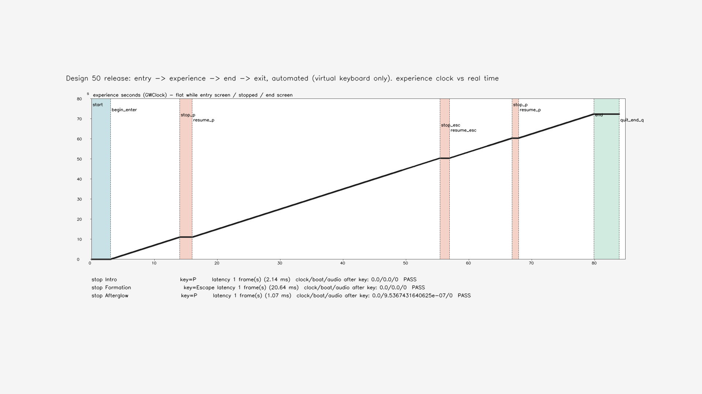
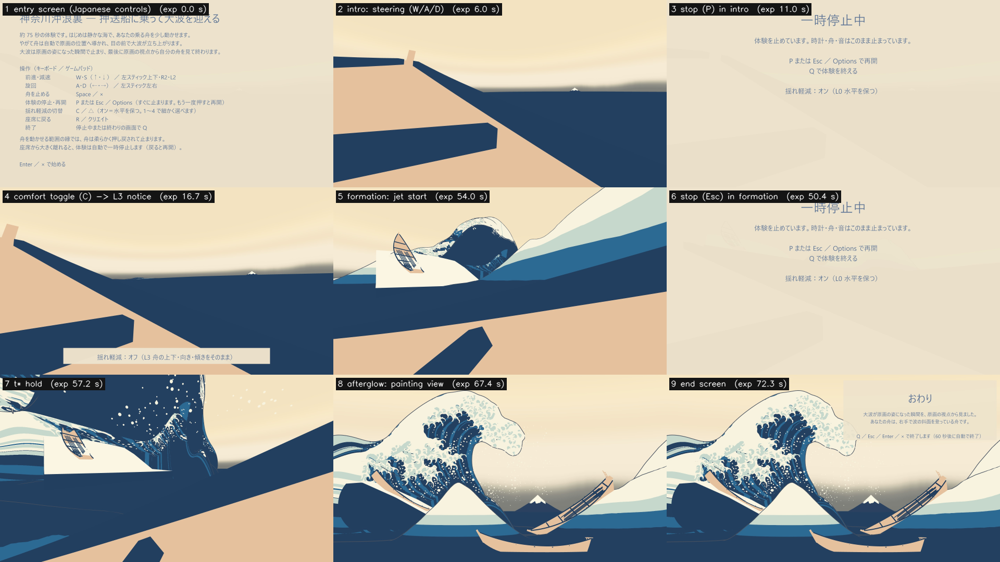
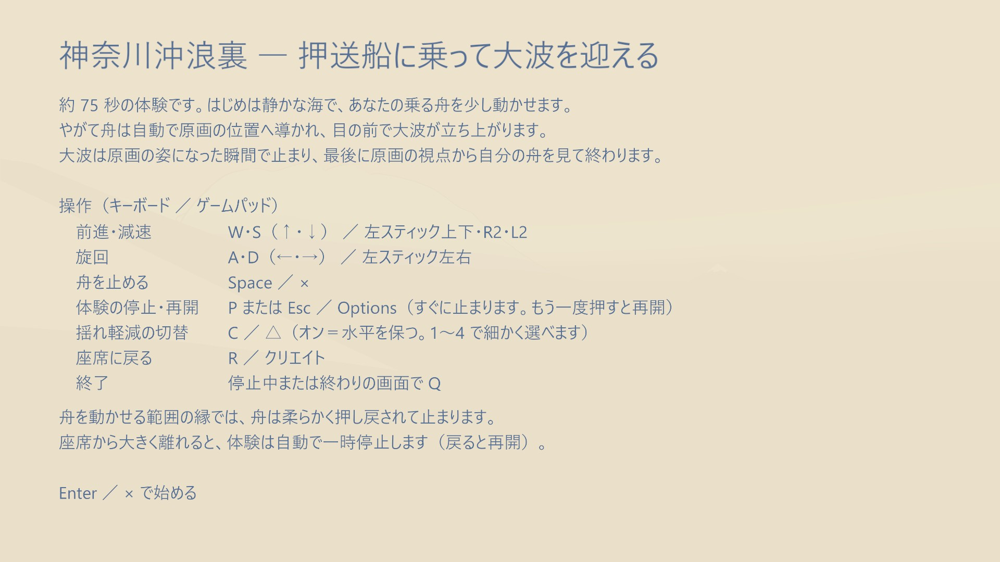
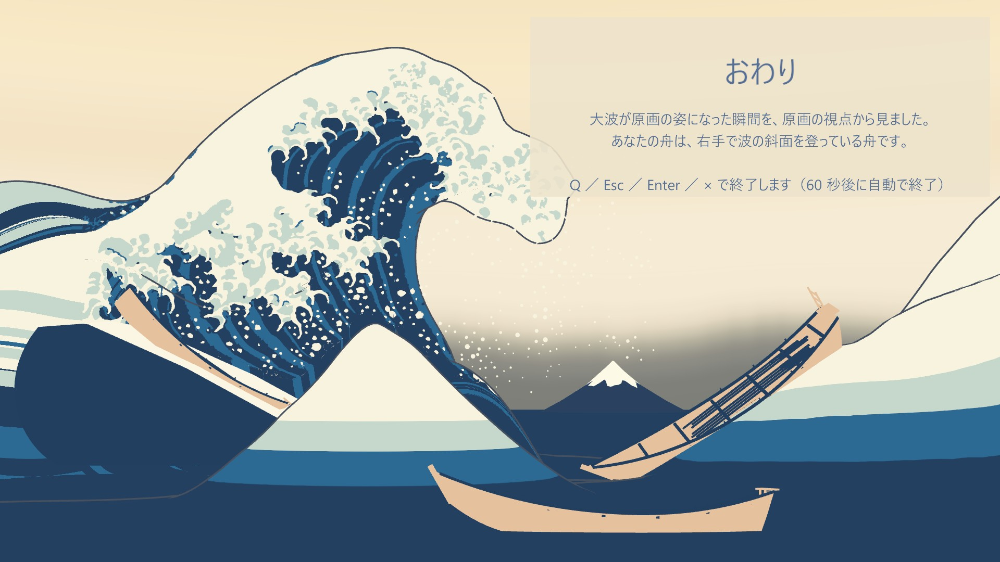
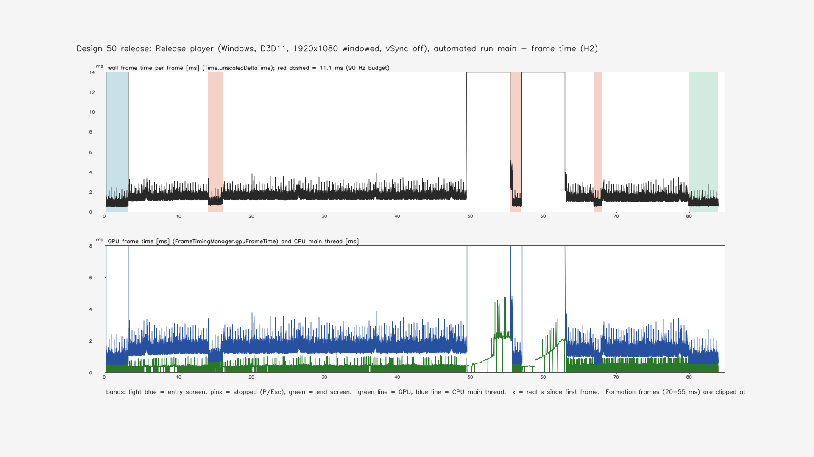
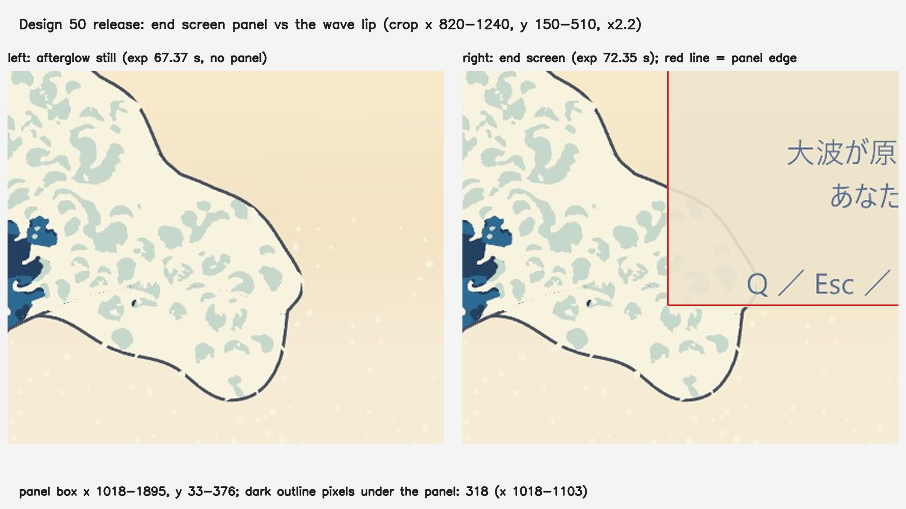
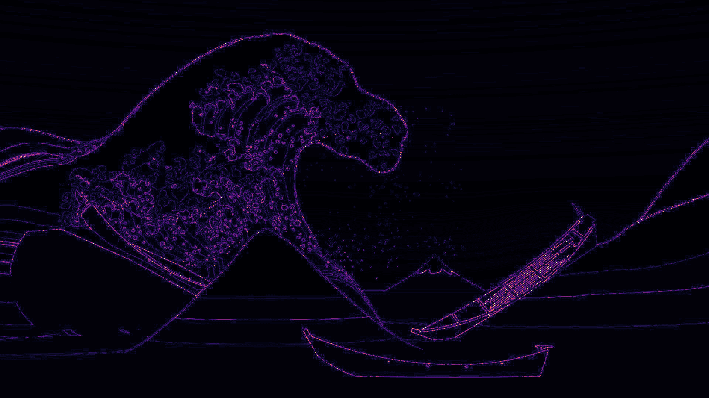

# 設計50：初めての人が入口から出口まで試す ― Windows の Release のプレイヤー 1 つ（PC と `--vr` で同じ exe）に、日本語の入口の画面・停止と揺れ軽減の切替・終わりの画面を載せ、開発者の操作を挟まずに入口から出口まで通した。停止はキーを読んだフレームで効き、終わりの画面は終わりの出来事と同じフレームに出る。H2 は記録、H7 と初めての人の試遊は保留

日付：2026-09-30／状態：**閉じた（使える水準。最小の受入 3 つを、この PC の Release のプレイヤーで満たした。H2 は記録。H7 と初めての人の試遊（D29）は保留。受入の判定の後の修正 0 回）**。証拠の種類は次のとおり。**HMD 実機の結果ではない。人の試遊ではない（操作は Input System の仮想のキーボードによる自動の試し）。ゲームパッドと PS VR2 Sense の入力は試していない。証拠の動画は音がない（実時間でない記録の走り）。Mock の両目の描画もこの番号では描いていない。**

- 作る部：Unity 6000.4.3f1 の batchmode と、Windows の Release のプレイヤー（RTX 3080・i7-12700K・Direct3D11・Windows 11）。
  - `DS50ReleaseBuild.BuildAll`（`run_ds50_unity.ps1` で 1 回）が、設計49 の場面 `DS49_Sound.unity` を読むだけにして写し `DS50_Release.unity` を作り、`BuildOptions.None`（Development でない）の `GreatWave50.exe` を作り、場面が読むデータ 38 ファイルを exe の横の `GreatWave50_Data/StreamingAssets/gwdata` へ写した（最終は build5。`ds50_build.json`）。
  - `run_ds50_player.ps1` がプレイヤーを起動して終わりを待つだけで、途中の操作はプレイヤーの中の自動の試し `DS50AutoTest`（引数 `--ds50auto` の時だけ働く）が、仮想のキーボードで利用者と同じキーを押す。最終の走りは 3 本：実時間の主の走り main5、動画の記録の走り capture5（`Time.captureDeltaTime` = 1/30 s、毎フレームの画を JPG）、`--vr` の vr4。
  - 数え直し・図・動画は `ds50_report.py`（numpy・OpenCV・ffmpeg。設計44 の図の部品 `ds44_report` を読む）。
- 進行役の独立の検査：作る部の道具を使わずに自前の numpy・OpenCV の道具で、ビルドの中身、コード、main5・vr4・capture5 の毎フレームの CSV、動画と静止画を調べ、Release の exe を自分でもう一度動かした（review\_main1。リポジトリの外のフォルダーから起動）。引数なしでも 18 s 起動した（review\_noarg1）。判定は pass、必須の指摘 0、記録の指摘 8（第 9 節の 1〜8）。
- 記録の道具 `ds50_record.py`：
  - SHA-256 を 67 件照合した（作る部の run.json の入力 4・出力 7・`ds50_build.json`、exe・`Assembly-CSharp.dll`・`level0`、場面 2、静止画 9、3 本の走りの exe、束ねたデータ 38）。どれも同じ。束ねたデータ 38 は、リポジトリの中の元のファイルとも SHA-256 が同じ（違い 0、元がない 0、一覧にないファイル 0）。
  - 守るファイル 43（[設計49 の場面の作り](../Evidence/Design/49/ds49_build.json)の SHA-256）と、設計49 の 12 ファイル（[設計49 の記録の run.json](../Evidence/Design/49/run.json)）は、どれも SHA-256 が同じ。
  - 作る部の数え直しの道具を使わずに、生の記録（プレイヤーの毎フレームの CSV・報告の JSON・プレイヤーのログ・静止画・動画）から数え直した（[ds50\_record\_recount.json](../Evidence/Design/50/ds50_record_recount.json)）。作る部の metrics.json との差は、フレームの数・出来事・キー・引き継ぎの時刻・停止のキーを読んだフレーム・H2 の p95/p99 と数・原画視点の差でどれも 0（第 9 節の後の注）。
  - 証拠を写し、終わりの画面と大波の唇の重なりの図を作り、記録の metrics.json・run.json を書いた。Unity とプレイヤーは回していない。

番号の前提：

- 対象：[段階9までの実行計画](../Design/Stage9_Plan_2026-09-26_ja.md)（以下「計画」）§2.5 の設計50（初めての人の通し試遊）。
  - 使える水準の成果物：「Windows の Release ビルド（PC 版と `--vr`、同じ exe）。日本語の入口画面（操作説明）、停止と揺れ軽減の切替、終了画面。初めての人1〜2名の試遊（D29）」。
  - 最小の受入：「開発者の操作を一度も挟まずに入口から出口まで通る。停止が即座に効く。体験の終わりが分かる（試遊記録）。H2 の p95/p99、H7」。
  - 時間枠は ≤0.75日＋試遊、依存は設計45〜49、バックログは 271（通し、記録）。
  - D29（初めての人をだれにするか）は既定値・利用者未回答の「利用者本人と、都合がつけば研究室の1名」のまま。試遊は利用者の手が要るので保留（Q24）。
  - H 項目（計画 §3.2 の「H1〜H7 の割り当て」）：H2（フレーム時間）は設計50 で p95/p99 の通し、H7（再センタリング・停止・復帰）は設計50 で通し。どちらも HMD 実機の項目で、PS VR2 は未導入なので、PC の値を記録し、実機は保留とする（Q24）。
- 段階8確認の条件：F8-3（物理の船・操船・乗客・船用水面データを一つの場面で Play し、Release のビルドでも回す）は、この番号で Release のプレイヤーまで通った（第 2.4 節）。F8-1（船内に表示の水）・F8-2（右手が右舷の板の外）は変えていない。
- 引き継ぎ（どれも SHA-256 を照合した）：
  - [設計49](Design_49_ja.md) の体験の場面 `DS49_Sound.unity`（`90894c9a…`。ビルドの前後で同じ）と音の 4 つ。
  - [設計47](Design_47_ja.md) の進行役 `DS47Flow`（止める `Pause`・再開）と出来事の表、[設計45](Design_45_ja.md) の乗客の揺れの 4 段（キー 1〜4）、[設計44](Design_44_ja.md) の操船（W・A・S・D、Space で船を止める）、[設計46](Design_46_ja.md) の共通時計。
- 時間の上限：Q26 の日程で 3 時間（計画 §2.6 の［Q26］の表、10/4 の行の「2 h・2 h・3 h・1 h」の設計50）。範囲は最小の受入だけで、同じ問題の修正は 1 回まで。
  - 実績（ファイルの時刻。+08:00）：
    - 着手：`_started.txt` の 17:23:51（設計49 の記録と重ねた。計画の［Q26］の「N の記録・コミットと N+1 の作業を重ねてよい」）。
    - 作る部：場面とビルド build1 〜17:38:29、build2 〜17:46:15、build3 〜17:53:37、build4 〜18:00:55、build5 〜18:06:45（設定の戻しの記録の時刻）。プレイヤーの走り capture1〜5・main1〜5・vr1〜4（最終の capture5 は 18:06:46〜、main5 は 18:08:19〜、vr4 は 18:09:54〜、各 77.6・93.7・93.7 s。`launch.json`）。数え直し・図・動画 18:11:42。`_finished.txt` 18:11:54。
    - 進行役の独立の検査：18:16:09〜18:21:16（検査の道具と走りのファイルの時刻）。
    - 記録：18:25〜。終わりは `Unity/Build/Design/50/READY_TO_COMMIT.txt` の時刻。
    - 着手から作る部の最後の出力（18:11:54）まで約 48 分、独立の検査の終わり（18:21）まで約 58 分で、3 時間の上限の内。
  - 1 回の計算：どれも 30 分の上限より十分短い。ビルド 1 回は Unity の起動を含めて約 1 分（build5 の中のビルドの部分は 9.2 s。`ds50_build.json` の `utcStart`〜`utcEnd`）、プレイヤーの走り 1 本は 77.6〜93.7 s、作る部の数え直しは 14.24 s（作る部の run.json）、記録の道具は 7.8 s。
- 読むだけで変えていないもの：
  - `DS49_Sound.unity` は開いて写しただけ（`ds50_build.json` の `scene49Sha256Before`＝`scene49Sha256After`）。
  - 守るファイル 43 と設計49 の 12 ファイルは SHA-256 のまま（記録の照合）。前の番号のコードは書き換えていない。
  - ProjectSettings：ビルドの間だけ製品名・全画面の既定・`runInBackground`・`enableFrameTimingStats` を変え、`finally` で戻した（`ds50_build.json` の `frameTimingStatsRestored`・`runInBackgroundRestored` が true）。設定の戻しの記録 5 本（build1〜5）は、どれも戻したファイル 0・新しいファイル 0。
- **原画視点の回帰（計画 §2.0）**：
  - 原画視点の場面（`DS39_Paper.unity`、守るファイルの一つ）と設計41〜49 の場面は SHA-256 のまま。この番号は新しい場面 `DS50_Release.unity` だけを作った。
  - Release のプレイヤーの余韻の終わりの画（capture5 のコマ 2401、体験の時刻 72.2667 s、JPG）を、設計47 の `painting_end.png`（`faa78462…`）と比べると、平均の差 1.2026/255、差 > 24 の画素 0.6857%、差 > 64 の画素 0.0094%（JPG の圧縮の差を含む）。Release でもデータが正しく読めて、同じ画になっている。
  - 原画視点の場面とデータが同じなので、評価器は回していない。合格した項目（78・130・131・132 の大きな形・72 σ24 の大きな形の p95・69・70・212、設計29修正01 で戻した色の項目）の値は変わらない。
  - 終わりの画面の板は、終わりの出来事の後に原画視点の上に重なる（第 4 節の 5）。原画視点の画そのものは変えていない。
- 座標と単位：
  - s は体験の時刻（`GWClock.ExperienceSeconds`）。大波の時刻は s − 大波の始まり（main5 では 44.3714 s）で、形成の始まりで 0、t\* で 12 s。
  - フレームはプレイヤーのフレーム（vSync 0・フレームの上限なしなので長さは一定でない）。ms はフレームの実時間（`Time.unscaledDeltaTime`）。
  - 行は毎フレームの CSV の行。行の「状態」（入口 Entry・走り Running・停止 Stopped・終わり End）は、枠の部品がそのフレームで状態を変える前に書かれる（第 9 節の 9）。
- 使っていないもの：作る部・検査・記録の出力に、AGENTS.md の禁止の場所と読み取りのみの例外（参照モデル・利用者の解算・写真・爪の分析）を使った跡はない（コミットの一覧の点検で文字列 0）。記録は、コミットの一覧の点検で、爪の分析のフォルダーのファイルの大きさだけを読み取りのみで調べた（第 9 節の 13）。ウェブは読んでいない。

## 見るもの

**通しの動画**：[ds50\_release\_960x540\_30fps.mp4](../Evidence/Design/50/ds50_release_960x540_30fps.mp4)（capture5 の全体。Release のプレイヤーの PC の画面。2,525 コマ、84.17 s、1,720,108 バイト、**音なし**）

- 記録の走りは 1 コマ = 体験の 1/30 s に固定したので、動画の時間は実時間ではない（停止の長さも実時間と違う）。
- 見どころ（動画の時刻）：
  - 0〜3.0 s：入口の画面（日本語の操作説明）。体験の時計は 0 のまま。
  - 3.1 s：Enter で始まる。導入で W・A・D の操船。
  - 14.1〜16.2 s：導入で P を押して停止（「一時停止中」の画面）、もう一度 P で再開。
  - 21.2 s：C で揺れ軽減をオフ（L3）にした知らせ。25.2 s に C でオン（L0）へ戻す。
  - 36.1 s：接近（引き継ぎは体験の時刻 31.0 s）。49.5 s：形成の始まり。
  - 55.5〜57.1 s：形成の途中（大波の時刻 6.05 s）で Esc を押して停止、Esc で再開。
  - 63.0 s：t\* で 2 s の保持。65.0 s：余韻（原画の視点へ移る）。
  - 67.1〜68.2 s：余韻で P を押して停止・再開。
  - 80.1 s：終わりの画面（「おわり」）。84.1 s：Q で出口。

| 流れ（main5。体験の時刻と実時間。水色＝入口、桃色＝停止、緑＝終わりの画面。下の 3 行は停止の試し） |
| --- |
|  |

| 9 つの場面（capture5）：1 入口、2 導入の操船、3 導入の停止、4 揺れ軽減の切替（L3 の知らせ）、5 形成（噴流の始まり）、6 形成の停止、7 t\* の保持、8 余韻（原画の視点）、9 終わりの画面 |
| --- |
|  |

| 入口の画面（1920 × 1080） | 終わりの画面（1920 × 1080） |
| --- | --- |
|  |  |

| フレーム時間（main5。上：フレームの実時間と 90 Hz の 11.1 ms の線、下：GPU（緑）と CPU の主スレッド（青）。形成（20〜55 ms）は図の上で切れている） |
| --- |
|  |

| 終わりの画面の板と大波の唇（記録で作った。左：余韻、右：終わりの画面。赤い線は板の縁） |
| --- |
|  |

| 原画視点の回帰（記録のみ。余韻の終わりの画と設計47 の `painting_end.png` の差。輪郭の線だけに JPG の差が出る） |
| --- |
|  |

- 図は作る部の出力。流れ（1600 × 700）とフレーム時間（1600 × 900）は 1920 × 1080 の中央に置いた（地は図の地の灰）。ほかは作る部の 1920 × 1080 のまま。図の文字は英語（作る部の図の部品）。フレーム時間の図の下の説明の文は右の端で切れている（第 9 節の 7）。
- 動画と静止画は紙の層（設計39）を入れた Release のプレイヤーの画（設計47〜49 の記録の `paper=off` とは違う）。

数値：

- [metrics.json](../Evidence/Design/50/metrics.json)（記録）：最小の受入 `acceptance`（入口から出口 `entryToExit`・停止 `stopImmediate`・終わり `endClear`・`H2`・`H7`・`D29`）、原画視点 `regression_painting_view`、終わりの画面の板 `endPanel`、動画 `video`、ビルド `build`、修正 `fix_rounds`、時間 `time`、作る部との差 `diffVsBuilder`、証拠 `evidence`
- 記録の数え直し：[ds50\_record\_recount.json](../Evidence/Design/50/ds50_record_recount.json)（照合、走りごとの状態の区間・停止・揺れ軽減・音・終わり・H2・プレイヤーのログ、動画、終わりの画面の板、原画視点、作る部との差）
- 作る部の写し：
  - [ds50\_release\_metrics.json](../Evidence/Design/50/ds50_release_metrics.json)（作る部の metrics）
  - [ds50\_release\_run.json](../Evidence/Design/50/ds50_release_run.json)（作る部の入出力の SHA-256）
  - [ds50\_build.json](../Evidence/Design/50/ds50_build.json)（ビルド：場面、絶対のパスの書き換え、束ねたデータ 38 の SHA-256、守るファイル）
- 実行条件と SHA-256：[run.json](../Evidence/Design/50/run.json)

## 0. 結論

1. **最小の受入 1：開発者の操作を一度も挟まずに入口から出口まで通る（271、記録）。合格。**
   - Release のプレイヤー（`BuildOptions.None`）を起動したら、後は利用者と同じキー（A・C・D・Enter・Escape・P・Q・W の 8 つ）だけで、入口 → 走り → 停止 → 走り（3 回）→ 終わりの画面 → Q で出口、と通った。main5・vr4・capture5 と独立の検査の review\_main1 の 4 本すべてで同じ。
   - 4 本とも：終わりの理由 `end_q`、出来事 9 つ、Unity の誤り 0・例外 0・警告 0、入口の画面の間の体験の時計は 0、データは `gwdata` から読んだ。launch.json の終了コード 0・時間切れなし（main5・vr4・capture5。review\_main1 は独立の検査の報告で 0）。
   - main5：入口 3.00 s → 体験 72.37 s（引き継ぎ 31.03 s、大波の始まり 44.37 s）→ 終わりの画面 4.00 s → Q。実時間 90.0 s、58,844 フレーム。
   - 独立の検査はリポジトリの外のフォルダーから起動して同じに通った（review\_main1：60,336 フレーム、体験 72.35 s）。引数なしの起動でも入口の画面が出て、自動の試しは始まらず、18 s の間に例外 0、窓を閉じて終了コード 0。
   - `--vr`（vr4）：この PC には OpenXR の runtime がないので、入口の画面に「VR を開始できませんでした。PC の画面で続けます。」が出て、PC の画面で同じに通った。
2. **最小の受入 2：停止が即座に効く。合格（導入・形成・余韻の 3 回、4 本すべて）。**
   - 押したキーは次のフレームで読まれ（Input System が読める最も早いフレーム）、そのフレームの中で止める（時計はそのフレームの分だけ進み、次のフレームからは進まない）。そのフレームの後、再開まで：体験の時計の進み 0 s、座席の船の動き 0 m（余韻の 1 回だけ 9.5 × 10⁻⁷ m。float の丸め 1 つ）、時計の走る行 0、鳴っている音 0、停止の理由 `user`。再開はどれも走りへ戻った。
   - main5 のキーを押してから読むまで（行の実時間）：導入（P）2.14 ms、形成（Esc）20.64 ms（形成の 1 フレーム）、余韻（P）1.07 ms。
   - 揺れ軽減の切替（C）は L0 → L3 → L0 で、どれもキーを押した行の 2 行後に段が変わった。
3. **最小の受入 3：体験の終わりが分かる。PC で合格。試遊の記録（D29）は保留。**
   - 終わりの画面は終わりの出来事と同じフレームに出た（main5 はフレーム 53,082、報告の `endEventFrame`＝`endShownFrame`。vr4・review\_main1 も同じ）。終わりの画面の間の体験の時計は動かない。
   - 日本語の板に「おわり」、見たもの、自分の舟（「右手で波の斜面を登っている舟」）、終わりの操作（Q・Esc・Enter・×）と自動の終了の秒読み（60 s）。独立の検査は、その舟が設計47 の 114 の枠 [1114, 551, 1616, 922] の舟と合うことを見た。
4. **H2（記録）**：この PC（RTX 3080・i7-12700K、D3D11、1920 × 1080 の窓、vSync 0、PC の単眼）で、走っているフレームの全体 p95 1.94 ms・p99 19.94 ms。**形成だけ p95 34.38 ms・p99 49.20 ms（平均 25.63 ms、約 39 fps）で、CPU の主スレッドが律速（GPU の p99 4.34 ms）**。形成の 468 フレームのうち 466 が 90 Hz の 11.1 ms を超える。vr4・review\_main1 でも同じ（第 2.7 節）。
5. **H7・D29：保留（利用者の手）**。PC では停止と再開だけを確かめた。再センタリング（R）は押していない。
6. **原画視点の回帰なし（記録）**：原画視点の場面は SHA-256 のまま。Release の余韻の終わりの画と設計47 の画の差は JPG の差の範囲（平均 1.20/255）。
7. **限界（第 4 節）**：形成のフレーム時間（仕上げ43、HMD の試遊の前に）、HMD・`--vr` の実際の起動・ゲームパッドは未確認、終わりの画面の板が大波の唇の先を覆う、窓の既定が全画面にならないことがある、背景でも動き続ける、PC では見回せない、動画に音がない、ほか。

---

## 1. 目的

設計書の段階9 は、体験を一本につなぐ段階である。設計49 までで、一つの場面に、大波・海・物理の船・操船・乗客・船用水面データ・泡と航跡・音が入り、Editor の Play モードで入口から終わりまで流れるようになった。ただし、Editor の中でしか動かず、始め方・止め方・終わり方の案内もなかった。

計画 §2.5 の設計50 は、この体験を Windows の Release のビルドにし、初めての人が開発者の手を借りずに入口から出口まで試せるようにする番号である。止めたい時にすぐ止まること、体験が終わったと分かることを受入にし、H2（フレーム時間）と H7（停止・復帰）をここで測る。

Q26 により、最小の受入だけを満たし、同じ問題の修正は 1 回までとした。初めての人の試遊（D29）・H7・HMD の項目は利用者の手が要るので保留し、PC と自動の試しで代える（Q24）。

---

## 2. 表

### 2.1 作ったもの（Unity の C# と道具）

値はコード（`Unity/Assets/GreatWave/Design50/`、`Tools/GWWaveGen/ds50/`）から。

| 部分 | 中身 |
| --- | --- |
| `DS50Shell`（体験の枠、実行の順 100） | 状態は入口 → 走り ⇄ 停止 → 終わり → 出口。 ・入口：日本語の操作説明の板。Enter ／ ×（ゲームパッドの South）／ Options で始める。始めるまで `DS47Flow.Pause("entry")` で体験の時計は 0。 ・停止の切替：P ／ Esc ／ Options で `DS47Flow.Pause("user")`（時計・座席の船の物理・音が止まる）。さらに鳴っている AudioSource をすべて止め、再開で戻す。もう一度押すと再開。停止中は Q で体験を終える。離れた時の一時停止（設計47、VR だけ）の間は停止のキーを受けない。 ・揺れ軽減の切替：C ／ △ で L0（オン、水平を保つ）⇄ L3（オフ、傾斜まで）。知らせの板を出す。1〜4 の直接の選択（設計45）もそのまま。 ・終わり：終わりの出来事と同じフレームに終わりの板。Q ／ Esc ／ Enter ／ × で出口（`Application.Quit`）。60 s で自動で終える。 ・`--vr`：OpenXR を手で起こし、起きなければ「VR を開始できませんでした。PC の画面で続けます。」を出して PC の画面で続ける。 ・データ：Release では場面を読む前に作業ディレクトリを `StreamingAssets/gwdata` へ移す（Editor では何もしない）。 ・板は HMD Camera の子の世界の板で、PC では 0.3 m、VR では 1.2 m 先に置く。いつも最後に上へ描く shader（`DS50_Overlay`）。字は OS の Yu Gothic UI |
| `DS50AutoTest`（自動の試し、実行の順 −300） | 引数 `--ds50auto <main>` の時だけ働く（場面には置くが、既定では何もしない）。Input System に仮想のキーボードを足し、利用者と同じキーを押すだけ（部品の関数を直接呼ばない）。入口 3 s → Enter → 導入で W・A・D → 停止の試し 3 回（導入 P・形成 Esc・余韻 P。止めている間の時計・船・音を測り、もう一度押して再開）→ C を 2 回 → 終わりの画面 4 s → Q。毎フレームの CSV（フレーム時間、`FrameTimingManager` の CPU・GPU の時間、状態）と報告の JSON を書く。`--ds50capture` で 1 コマ = 1/30 s にして毎フレームの画を JPG で書く（動画用。フレーム時間は測らない）。試験の時だけ vSync 0・フレームの上限なし・Input System の背景の動作 `IgnoreFocus` |
| `DS50ReleaseBuild`（Editor） | 場面を作る：`DS49_Sound.unity` を写して `DS50_Release.unity` とし、① 設計41 から写った絶対のパス 3 つを相対のパスへ直し、② 開発者の切替（`DS34LayerSet` の数字キーで層を消す）を切り、③ `DS50Shell` と `DS50AutoTest` を置き、④ 実行時に探す shader 4 つを参照用の材質（`DS50_Keep_*.mat`）でビルドへ入れる。ビルド：Windows のプレイヤー 1 つ（`BuildOptions.None`）。製品名「神奈川沖浪裏 VR（設計50）」・全画面の既定・`runInBackground`・`enableFrameTimingStats` はビルドの間だけ変えて戻す。データ 38 ファイルを `gwdata` へ同じ相対の形で写す。守るファイルを前後で比べ、変わっていればビルドしない |
| `DS50_Overlay.shader` と材質 2 つ（`DS50_OverlayPanel`・`DS50_OverlayText`） | 深さを見ずに最後に描く板と字 |
| 道具 `run_ds50_unity.ps1`・`run_ds50_player.ps1`・`ds50_report.py`・`ds50_record.py` | Unity の 1 回の実行（設計49 の写し。`unity.lock`、設定のバイトの戻し）、プレイヤーの 1 回の起動（Unity の Editor が動いていないことを確かめ、終わりを待つ。時間切れ 900 s）、作る部の数え直し・図・動画、記録 |

### 2.2 Release のビルド（build5）

値は `ds50_build.json` と作る部の metrics.json、記録の照合。

| 項目 | 値 |
| --- | --- |
| 結果 | `Succeeded`、`BuildOptions.None`、ビルドの誤り 0 |
| 製品名・窓 | 「神奈川沖浪裏 VR（設計50）」、`FullScreenWindow`（ビルドの間だけ。ProjectSettings は戻した） |
| プレイヤー | `GreatWave50.exe`（667,648 バイト、`5be81b3f…`。Unity の共通の起動の exe で、ビルドごとに同じ）、`Assembly-CSharp.dll`（`584ba1d7…`）、`level0`（`2088e9c5…`）。この 2 つがこのビルドを決める。プレイヤーの大きさ 105,439,845 バイト |
| 束ねたデータ | 38 ファイル、701,651,973 バイト（`gwdata` の下）。元は 28修正01 の τ(t)、29修正01 のベイク、設計30 の海と支え、設計31 の主役波と飛沫、設計33 の爪、設計36 の色、設計38 の線、設計39 の密な飛沫、設計46 の出来事の表。記録の照合で、写しと元の SHA-256 はどれも同じ |
| プレイヤーのフォルダー | 771 MB（データを含む） |
| 場面の絶対のパス | 3 → 0（書き換え 3：near・far の `uv3File` をパッケージからの相対へ、密な飛沫の `dataPath` をプロジェクトからの相対へ） |
| 開発者の切替 | `DS34LayerSet` の数字キーを切った（1 つ） |
| 守るファイル | 変わったもの 0（`changedProtected` は空。記録の照合でも 43＋設計49 の 12 が同じ） |
| Unity のログ | build5 に `Design50` のファイルの警告の行 0（build1・build2 は `DS50ReleaseBuild.cs` の使うのをやめるよう勧められた API の警告 CS0618 が 4 つずつ）。OpenXR の「interaction profile を少なくとも 1 つ加える」の警告 1 行（第 4 節の 3） |

### 2.3 場面 `DS50_Release.unity`

値は記録の数え直し（`verify.scene`）。

- 217,944 バイト、SHA-256 `51a24616…`。`DS49_Sound.unity` の写しに、枠と自動の試しの物を足し、パス 3 つと開発者の切替 1 つを直した。
- 場面の中の項目は 316 → 320（+4）。カメラは 7 と 7、AudioListener は 1 と 1 で同じ。
- GUID は 59 → 67。`DS49_Sound.unity` にないのは 8 つで、どれもこの番号のもの：`DS50Shell.cs`・`DS50AutoTest.cs` と材質 6 つ（`DS50_OverlayPanel`・`DS50_OverlayText`・`DS50_Keep_Spray`・`DS50_Keep_Claw`・`DS50_Keep_ClawPalette`・`DS50_Keep_ClawTDepth`）。落ちた GUID は 0。`DS50_Overlay.shader` は材質から指される。
- 絶対のパスの文字列（`X:\`・`X:/` の形）0（`DS49_Sound.unity` は 3）。

### 2.4 最小の受入 1：開発者の操作を挟まずに入口から出口まで

値は記録の数え直し（`runs`）。review\_main1 は独立の検査の走り（同じ exe、リポジトリの外から起動）。

| 走り | 行（フレーム） | 実時間 | 入口 | 体験（引き継ぎ・大波の始まり） | 終わりの画面 | 出来事 | 誤り・例外・警告 | 終わり | キー |
| --- | --- | --- | --- | --- | --- | --- | --- | --- | --- |
| main5 | 58,844 | 90.0 s | 3.00 s、時計 0 | 72.37 s（31.03・44.37 s） | 4.00 s | 9 | 0・0・0 | `end_q`、終了コード 0 | A C D Enter Escape P Q W |
| vr4（`--vr`） | 58,990 | 90.03 s | 3.00 s、時計 0 | 72.37 s（31.02・44.37 s） | 4.00 s | 9 | 0・0・0 | `end_q`、終了コード 0 | 同じ |
| capture5（1/30 s） | 2,526 | 73.90 s | 92 行、時計 0 | 72.35 s（31.00・44.35 s） | 122 行 | 9 | 0・0・0 | `end_q`、終了コード 0 | 同じ |
| review\_main1 | 60,336 | 89.98 s | 3.00 s、時計 0 | 72.35 s（31.02・44.35 s） | 4.00 s | 9 | 0・0・0 | `end_q`、終了コード 0（検査の報告） | 同じ |

- 状態の並び：4 本とも 入口 → 走り → 停止 → 走り → 停止 → 走り → 停止 → 走り → 終わり。
- 音（鳴っている AudioSource の数の最大）：入口 0・停止 0・終わり 0。走りの間は導入 2・接近 2・形成 3・保持 3〜4・余韻 2〜3（main5・vr4・review\_main1。capture5 の保持は 3）。音の出力そのものは録っていない（第 4 節の 6）。
- データ：4 本とも `DS50_DATA_ROOT … used=True`（プレイヤーのログ）。作る部の 3 本の起動の場所はリポジトリの中の `runs/<走り>`、review\_main1 はリポジトリの外（第 9 節の 4）。
- プレイヤーのログの `XR_ERROR_RUNTIME_UNAVAILABLE` の行：PC の走り 5、`--vr` の走り 12（OpenXR の runtime がないため）。例外の行 0（記録）、ほかの誤りの行 0（独立の検査）。
- 引数なしの起動（独立の検査、review\_noarg1）：入口の画面、自動の試しは動かない、18 s で例外 0、窓を閉じて終了コード 0。

### 2.5 最小の受入 2：停止が即座に効く

値は記録の数え直し（`runs.*.stops`）。「キーを読んだフレーム」は、押した行の次の行（枠の報告の状態の変わり目 `stateChanges` と同じフレーム）。

| 走り・停止 | キー | 大波の時刻 | 押した行 → 読んだ行 | 押してから読むまで | 読んだ後の時計の進み | 船の動き | 時計の走る行 | 鳴る音 | 停止の行（実時間） | 再開 |
| --- | --- | --- | --- | --- | --- | --- | --- | --- | --- | --- |
| main5 導入 | P | 0 | 12,145 → 12,146 | 2.14 ms | 0 s | 0 m | 0 | 0 | 2,307（2.00 s） | 走りへ |
| main5 形成 | Esc | 6.05 s | 37,072 → 37,073 | 20.64 ms | 0 s | 0 m | 0 | 0 | 1,871（1.50 s） | 走りへ |
| main5 余韻 | P | 12 s | 42,247 → 42,248 | 1.07 ms | 0 s | 9.5 × 10⁻⁷ m | 0 | 0 | 1,434（1.00 s） | 走りへ |
| vr4 導入・形成・余韻 | P・Esc・P | 0・6.04・12 s | 1 行後 | 1.96・20.53・1.27 ms | 0 s | 0・0・9.5 × 10⁻⁷ m | 0 | 0 | 2,315・1,940・1,404 | 走りへ |
| review\_main1 同上 | P・Esc・P | 0・6.05・12 s | 1 行後 | 1.95・21.17・1.17 ms | 0 s | 0・0・9.5 × 10⁻⁷ m | 0 | 0 | 2,335・2,060・1,506 | 走りへ |
| capture5 同上（1/30 s） | P・Esc・P | 0・6.05・12 s | 1 行後 | —（実時間でない） | 0 s | 0 m | 0 | 0 | 62・47・32 | 走りへ |

- 読んだフレームの中では時計はまだそのフレームの分だけ進む（main5 の導入 0.0016 s・形成 0.0293 s・余韻 0.0011 s）。止まるのはそのフレームの終わりからで、Input System が押したキーを読める最も早い所。
- 停止の理由はどれも `user`（離れた時の `leave` ではない）。
- 停止の画面は停止の行のすべてに出た（作る部の `shellStoppedFrames`＝2,306・1,870・1,433。記録の行の数が 1 多いのは、再開のキーを読んだ行も状態の列が停止のまま書かれるため。第 9 節の 9）。
- 揺れ軽減（C）：L0 → L3 → L0。main5 は押した行 17,849・20,573 の 2 行後（17,851・20,575）に段が変わった。vr4・capture5・review\_main1 も 2 行後。

### 2.6 最小の受入 3：体験の終わりが分かる

値は記録の数え直し（`runs.*.end`）と静止画。

| 走り | 終わりの出来事のフレーム（報告） | 終わりの画面を出したフレーム（報告） | CSV の相が終わりになった行・状態が終わりになった行 | 終わりの画面の間の体験の時刻 | 終わりの画面の長さ |
| --- | --- | --- | --- | --- | --- |
| main5 | 53,082 | 53,082 | 53,082・53,083 | 72.3714 s のまま | 4.00 s → Q |
| vr4 | 53,208 | 53,208 | 53,208・53,209 | 72.3651 s のまま | 4.00 s → Q |
| review\_main1 | 54,234 | 54,234 | 54,234・54,235 | 72.3535 s のまま | 4.00 s → Q |
| capture5 | 2,404 | 2,404 | 2,404・2,405 | 72.3457 s のまま | 122 行 → Q |

- 板の文（`DS50Shell.cs` と静止画）：「おわり」／「大波が原画の姿になった瞬間を、原画の視点から見ました。」／「あなたの舟は、右手で波の斜面を登っている舟です。」／「Q ／ Esc ／ Enter ／ × で終了します（60 秒後に自動で終了）」。
- 板の位置：原画の視点の右上の空。記録の数え直しで、板の範囲は x 1018〜1895、y 33〜376（1920 × 1080。余韻の画との差から）。板の下に大波の輪郭の暗い線が 318 画素あり、x 1018〜1103、y 262〜376 にある（唇の先。第 4 節の 5）。

### 2.7 H2：このPCのフレーム時間（記録）

値は記録の数え直し（`runs.*.H2`）で、作る部の metrics.json と差 0。条件：Release、Direct3D11、1920 × 1080 の窓、vSync 0、フレームの上限なし、PC の単眼（XR なし）、NVIDIA GeForce RTX 3080、12th Gen Intel Core i7-12700K。走っている行だけ（入口・停止・終わりの画面を除く）。

| main5 の相 | フレーム | 平均（ms） | p50 | p95 | p99 | 最大 | 11.1 ms を超えた | CPU 主スレッド p95・p99 | GPU p95・p99 |
| --- | --- | --- | --- | --- | --- | --- | --- | --- | --- |
| 走りの全体 | 43,146 | 1.68 | 1.37 | 1.94 | 19.94 | 55.97 | 469 | 1.94・19.91 | 0.51・0.94 |
| 導入 | 21,327 | 1.45 | 1.40 | 1.91 | 2.24 | 27.25 | 1 | 1.91・2.24 | 0.45・0.50 |
| 接近 | 8,864 | 1.51 | 1.44 | 1.96 | 2.30 | 3.89 | 0 | 1.96・2.30 | 0.47・0.51 |
| **形成** | **468** | **25.63** | **24.24** | **34.38** | **49.20** | **55.97** | **466** | **34.37・49.19** | 2.47・4.34 |
| 保持 | 1,497 | 1.34 | 1.20 | 2.14 | 3.39 | 24.93 | 2 | 2.15・3.66 | 2.03・2.14 |
| 余韻 | 10,989 | 1.27 | 1.22 | 1.74 | 2.06 | 3.44 | 0 | 1.74・2.06 | 0.54・0.90 |

| 走り | 全体 p95・p99（ms） | 形成 p95・p99（ms） | 形成の平均 | 形成の CPU 主スレッドで 11.1 ms を超えた | 形成の GPU p99 |
| --- | --- | --- | --- | --- | --- |
| main5 | 1.94・19.94 | 34.38・49.20 | 25.63 | 460 / 468 | 4.34 |
| vr4 | 1.94・20.03 | 34.42・47.97 | 25.89 | 455 / 463 | 4.12 |
| review\_main1 | 1.92・19.91 | 34.13・46.89 | 25.81 | 456 / 464 | 4.71 |

- 形成は CPU の主スレッドが律速で、約 39 fps。GPU は形成でも p99 4.1〜4.7 ms。原因の見込みは、設計47 の限界の船用水面データの毎フレームの作り直し（Editor で 1 回 平均 21.8 ms）だが、プレイヤーでは分析していない（第 4 節の 1）。
- 形成の外は p99 3.4 ms 以下で、90 Hz の 11.1 ms の内。
- PS VR2 の 90 Hz（両目）での判定は HMD 実機が要る（保留）。

### 2.8 `--vr`（同じ exe）

- vr4：`vrRequested` true・`vrActive` false。入口の画面に「VR を開始できませんでした。PC の画面で続けます。」。受入 1〜3 の値は PC の走りと同じ（第 2.4〜2.6 節）。
- この PC には OpenXR の ActiveRuntime がない。実際に HMD で起動する道は試していない（保留）。

### 2.9 作り方と採ったもの（Q24。進行役の判断で、利用者の決定ではない）

作る部の報告とコードの文から。番号は作る部の報告のまま。

- **D50-1：データを束ね、作業ディレクトリをそこへ移す。** 場面は Git 対象外の `Build/Design/...` を相対のパスで読むので、Release では同じ相対の形で `StreamingAssets/gwdata` へ写し、場面を読む前に作業ディレクトリを移す。落とした：リポジトリの Build のフォルダーを直接読む案（exe をほかの場所へ移すと読めない）。
- **D50-2：揺れ軽減の切替は L0 ⇄ L3。** 1〜4 の直接の選択はそのまま残す。
- **D50-3：停止は P・Esc・Options。停止は音もすべて止める。** Space は設計44 の船を止めるキーのまま。
- **D50-4：画面は頭に付いた板（PC 0.3 m、VR 1.2 m）で、いつも最後に上へ描く。** PC と VR で同じ物を使う。
- **D50-5：終わりの画面は自動で終わり、やり直しはない。**
- **D50-6：`--vr` で XR が起きなければ PC の画面へ戻る。**
- **D50-7：Release の場面では `DS34LayerSet` の開発者の切替を切る。** 数字キー 1〜3 が層を消し、設計45 の揺れの段のキー 1〜4 と重なるため。
- **D50-8：H2 は Release のプレイヤーでフレームの上限なしで測る**（1920 × 1080 の窓、vSync 0、PC の単眼）。
- **D50-9：試験の時だけ vSync 0 と Input System の背景の動作 `IgnoreFocus`。**
- **D50-10：ビルドの間だけ製品名「神奈川沖浪裏 VR（設計50）」と全画面の既定。** ProjectSettings は戻した（変わったバイト 0）。

---

## 3. 関門

| 最小の受入・規則 | 基準 | 値 | 判定 |
| --- | --- | --- | --- |
| 開発者の操作を挟まずに入口から出口まで（271、記録） | Release の exe、利用者と同じキーだけで入口 → 体験 → 終わり → 出口 | 4 本とも `end_q`・出来事 9・誤りと例外 0、キーは 8 つだけ、入口の間の時計 0。`--vr` も PC へ戻って同じ | 合格（PC の自動の試し） |
| 停止が即座に効く | 押したキーを読んだフレームで止まり、再開まで時計・船・音が進まない | 3 回 × 4 本で、読んだのは押した次のフレーム、その後の時計の進み 0 s・船 ≤ 9.5 × 10⁻⁷ m・音 0・時計の走る行 0。再開はすべて戻った | 合格 |
| 体験の終わりが分かる（試遊記録） | 終わりの後に終わりの画面、出口の操作が分かる | 終わりの出来事と同じフレームに日本語の終わりの画面、Q で出口 | PC で合格。試遊記録（D29）は保留 |
| H2 の p95/p99 | 記録（判定は HMD 実機） | 全体 p95 1.94・p99 19.94 ms、形成 p95 34.38・p99 49.20 ms（CPU 律速） | 記録（形成は 11.1 ms を大きく超える。仕上げ43） |
| H7 | PS VR2 の実機で再センタリング・停止・復帰 | PC で停止・再開だけ。再センタリングは押していない | 保留（利用者の手） |
| Release ビルド（PC 版と `--vr`、同じ exe） | — | `BuildOptions.None` の 1 つの exe。`--vr` は XR がなければ PC へ戻る | 合格（HMD での起動は保留） |
| 日本語の入口画面・停止と揺れ軽減の切替・終了画面 | — | 3 つの板と知らせの板。静止画と動画 | 合格 |
| 計画 §2.0 の回帰なし | 合格した項目を後退させない | 原画視点の場面と守るファイルは SHA-256 のまま。Release の余韻の終わりの画は設計47 と JPG の差の範囲 | 合格（評価器は回していない） |
| 守るファイル・ProjectSettings | 変えない | 守るファイル 43＋設計49 の 12 の SHA-256 は同じ。設定の戻し 0（5 本） | 合格 |
| HMD（PS VR2）・初めての人 | — | — | 保留（利用者の手）。H2 の実機、H7、D29、入口・停止・終わりの板の VR での見え方 |

---

## 4. 限界

1. **形成のフレーム時間が 90 Hz の 11.1 ms を大きく超える（仕上げ43、HMD の試遊の前に）。** 形成の 12 s は平均 25.6 ms・p95 34.4 ms・p99 49.2 ms（約 39 fps）で、この PC でも 30 fps の 33.3 ms を p95 で超える。CPU の主スレッドが律速（GPU の p99 4.3 ms）。プレイヤーの中で分析していない。見込みは船用水面データの毎フレームの作り直し（設計47 の限界、Editor で 21.8 ms）。PS VR2 の試遊の前に直す。
2. **H7 と初めての人の試遊（D29）は保留。** PC の代わりは停止と再開だけで、再センタリング（R ／ クリエイト）は Release で押していない。入口・停止・終わりの板の VR での見え方（頭に付いた 1.2 m の板、single-pass instanced）は実機で見ていない。Mock の両目の描画もこの番号では描いていない。
3. **`--vr` は戻る道だけを確かめた。** この PC には OpenXR の ActiveRuntime がない。ビルドのログに「interaction profile を少なくとも 1 つ加える」の警告があり、プレイヤーのログには起動の時の `XR_ERROR_RUNTIME_UNAVAILABLE` の行（PC 5、`--vr` 12）がある。HMD で実際に起動する道は試していない。
4. **キーボードだけを試した。** ゲームパッド（DualSense：×・Options・△・スティック・トリガー）と PS VR2 Sense の入力は、Release で試していない。
5. **終わりの画面の板が大波の唇の先を覆う（仕上げ50）。** 板の範囲 x 1018〜1895・y 33〜376 の左下の角に、唇の輪郭の線と爪が入る（暗い線 318 画素、x 1018〜1103・y 262〜376。[図](../Evidence/Design/50/fig_ds50_end_panel.png)）。板は半透明なので線は薄く見えるが、「波と舟を隠さない」は少し言い過ぎ。板を右か上へ寄せるか小さくする。
6. **動画に音がない。** 記録の走りは実時間でない（1 コマ = 1/30 s）ので音を録っていない。Release での音は、鳴っている AudioSource の数（入口・停止・終わり 0、導入 2・形成 3・保持 3〜4）でだけ示した。実時間の音と画の遅れ（設計49 の限界 1）は Release でも測っていない（仕上げ49）。
7. **窓の既定。** 自動の試しは 1920 × 1080 の窓で起動したので、Unity が製品ごとの保存の設定に窓の形を残した。独立の検査の引数なしの起動は 2560 × 1440 の画面で 1920 × 1080 の窓になった。初めての人がダブルクリックすると窓で開くことがある（Alt+Enter で全画面になる見込みだが試していない）。
8. **背景でも動き続ける。** `runInBackground` はビルドの間 true にしたので、プレイヤーは true のまま焼かれた（D50 の決めごとにも試験の設定にも挙げていない）。PC で別の窓へ切り替えても体験は進む（大波が見えないうちに育つ）。
9. **やり直しがなく、PC では見回せない。** 終わりの画面は出口だけ（D50-5）。PC ではマウスで見回せないので、座席の視点は向きが決まったままで、唇を見上げられない（109・110・113、仕上げ47）。
10. **入口の画面で Esc が効かない。** 入口の画面から出るには窓を閉じる（Alt+F4）しかない。離れた時の一時停止（VR だけ）の間は停止のキーを受けない。
11. **データの束は 702 MB。** プレイヤーのフォルダー 771 MB のうち、Git 対象外の 28修正01〜39 の出力の写しが 701,651,973 バイト（38 ファイル、元と SHA-256 は `ds50_build.json`）。作り直すには、それらの出力が揃っている必要がある。
12. **作る途中の走りが残る。** main1〜4・capture1〜4・vr1〜3（合計 約 1.2 GB、ほとんどが capture の JPG。作る部の報告の「約 1.5 GB」は記録の du の合計と違う）は `runs/` に残した。最終の証拠は main5・capture5・vr4 だけで、ほかは消してよい（消していない）。
13. **前から持ち越した限界（この番号では変えていない）。** 仮置き M1\_Revision\_LeftSupport の板が形成の間の座席の視点に見える（仕上げ30）、F8-1 船内の水（仕上げ43）、F8-2 右手が板の外（仕上げ41）、接近のうねりの成長がない（84）と余韻の快適さ（仕上げ47）。座席の視点の形成と保持で、左の船の横の平らな白い形と船内の水も見える（独立の検査）。
14. **計画 §5 の表の仕上げ50 の群は「船と全部の水面が同じ画面で航行の終わりまで見える」（271、0.5日）だけ。** 限界 5・7・8・9（やり直し）・10 は、設計の番号ごとの群の規則（AGENTS.md の導師の指示の 7）で仕上げ50 に集める。表に加えるのは段階9確認（進行役）。

---

## 5. 修正の記録（Q26：同じ問題の修正は 1 回まで）

作る部の中の実行は、受入の判定の前の作る途中のものである。値は設定の戻しの記録とログ（`Date`、`DS50_BUILD_DONE`）、走りの報告と launch.json、コマの画、ファイルの時刻、作る部の報告。

| 回 | したこと | 結果 |
| --- | --- | --- |
| build1（〜17:38:29） | 最初の場面とビルド | 通った。`DS50ReleaseBuild.cs` の CS0618 の警告 4 つ |
| main1・capture1（17:41〜17:42） | 最初の走り | main1 は pass。**capture1 は余韻の停止で音が 1 つ鳴り続け、fail**（`DS49Sound` が終わったと数えた一度だけの音がまだ鳴っていた）。capture1 の終わりの画面は画面の下の真ん中にあり、文は「原画の真ん中の舟」（誤り）。入口の文は小さく 1 列 |
| build2（〜17:46:15） | **直し 1**：停止の時に鳴っている AudioSource をすべて止め、再開で戻す（設計49 は変えない）。**直し 2**：入口の文を大きくし、操作を 2 列に | capture2・main2・vr1 は pass。終わりの文はまだ「真ん中の舟」 |
| build3（〜17:53:37） | **直し 3**：終わりの文の舟を、右手で斜面を登る舟へ（設計47 の船の覆いで確かめた）。**直し 4 の一部**：使うのをやめるよう勧められた API の警告を消した（Design50 の警告の行 8 → 0） | capture3・main3・vr2 は pass |
| build4（〜18:00:55） | 作る部の報告に個別の記述はない（入口と終わりの画面のコマに見える差はない）。数え直しの道具 `ds50_report.py` は 17:58 に変わった | capture4・main4・vr3 は pass |
| build5（〜18:06:45） | **直し 5**：終わりの板を原画の視点の右上の空へ移した（指す舟を隠さない）。直し 4 の製品名と全画面の既定は最終のビルドの報告で確かめた（どのビルドで入れたかはログから読めない） | 最終。capture5・main5・vr4 は pass |
| 作る部の数え直し（18:11:42） | `ds50_report.py --main main5 --capture capture5 --vr vr4`。数え直しの道具だけの直し：船の位置の許容 1 × 10⁻⁵ m、原画視点の比べのコマを終わりの画面の 3 コマ前に | pass |
| 進行役の独立の検査（18:16〜18:21） | 自前の numpy・OpenCV の道具、review\_main1・review\_noarg1 | pass、必須の指摘 0。記録の指摘 8（第 9 節の 1〜8） |
| 記録（18:25〜） | `ds50_record.py` で照合と数え直し、証拠の写し、終わりの画面の板の図 | 作品には触れていない |

- 作る途中の直しは 5 つで、どれも別の問題（停止の音・入口の文・終わりの文・ビルドの設定と警告・終わりの板の位置）に 1 回ずつ。どれも受入の判定の前。
- 受入を判定した後の修正の回は使っていない（0 回）。
- 最終の場面は build5 で保存した。その SHA-256 は `ds50_build.json`・作る部の metrics.json・記録で同じ（`51a24616…`）。build5 の後に変えた作品のファイルはない（`DS50Shell.cs` の最後の変更は 18:06:28、場面と材質は 18:06:36）。

---

## 6. 引き継ぎ

**段階9確認（自己評審）**：

- 最初に[通しの動画](../Evidence/Design/50/ds50_release_960x540_30fps.mp4)を見て、[流れ](../Evidence/Design/50/fig_ds50_timeline.png)・[9 つの場面](../Evidence/Design/50/stills_ds50_release.png)・[フレーム時間](../Evidence/Design/50/fig_ds50_frametime.png)の図、第 2.4〜2.7 節の表、第 3 節の関門を見る。
- 計画の段階9確認の見るもの（通しの動画、Windows ビルド、初めての人の試遊記録、H2 の p95/p99、H7）のうち、試遊記録と H7 と HMD の H2 は保留。「観賞位置から外れた場合の扱い」は設計47 の離れた時の一時停止（VR だけ）と、入口の画面の文。
- 計画 §5 の表に仕上げ49・仕上げ50 の限界を加える（限界 14）。

**仕上げ43**（HMD の試遊の前）：形成のフレーム時間（限界 1）。プレイヤーで分析し、船用水面データの作り直しを 11.1 ms の内へ。

**仕上げ50**：終わりの板の位置（限界 5）、窓の既定（限界 7）、`runInBackground`（限界 8。背景で止めるかを決める）、やり直し（限界 9）、入口の画面の Esc（限界 10）、フレーム時間の図の説明の文の切れ（第 9 節の 7）。

**仕上げ47・仕上げ49**：PC の見回し（限界 9）、Release の実時間の音と画の遅れ（限界 6）。

**保留（利用者の手）**：PS VR2 の導入の後に、`--vr` の実際の起動、H2（90 Hz の両目）、H7（再センタリング・停止・復帰）、入口・停止・終わりの板の見え方、ゲームパッドと Sense の入力（限界 2〜4）、初めての人 1〜2 名の試遊（D29、既定値・利用者未回答）。D50-1〜10 は既定値・利用者未回答。

---

## 7. 再現

リポジトリの根で行う。前提（どれも Git 対象外）：`ds50_build.json` の `dataSources` の出力（28修正01 の `timewarp_F_final.json`（`627815c7…`）、29修正01 のベイク、設計30・31・33・36・38・39 の出力。38 ファイルの SHA-256 は `ds50_build.json` の `data`）、設計47 の `Unity/Build/Design/47/flow/unity/main/painting/painting_end.png`（`faa78462…`）。設計30〜49 の資産はコミット済み（設計49 はこの番号の前のコミット）。

道具は `py -3.10`（Python 3.10.6、numpy 2.2.6、OpenCV 4.12.0）、ffmpeg・ffprobe 2024-12-19、Unity 6000.4.3f1（batchmode、`Unity/Build/unity.lock` で排他）。

1. 場面とビルド：`powershell -NoProfile -ExecutionPolicy Bypass -File Tools/GWWaveGen/ds50/run_ds50_unity.ps1 -Method GreatWave.Design50.EditorTools.DS50ReleaseBuild.BuildAll -Log build`
   - `DS50_Release.unity` を保存し、`Unity/Build/Design/50/release/player/GreatWave50.exe` とデータの束を作り、`release/unity/ds50_build.json` を書く。守るファイルの SHA-256 を前後で比べる。ProjectSettings は控えと比べて戻す。約 1 分。
2. プレイヤーの走り（Unity の Editor を閉じてから。1 本ずつ）：
   - `powershell -NoProfile -ExecutionPolicy Bypass -File Tools/GWWaveGen/ds50/run_ds50_player.ps1 -Tag capture5 -Capture`（動画用、約 78 s）
   - `powershell -NoProfile -ExecutionPolicy Bypass -File Tools/GWWaveGen/ds50/run_ds50_player.ps1 -Tag main5`（実時間、約 94 s）
   - `powershell -NoProfile -ExecutionPolicy Bypass -File Tools/GWWaveGen/ds50/run_ds50_player.ps1 -Tag vr4 -Vr`（約 94 s）
   - 途中の操作はしない。窓が前に出ていなくても自動の試しは進む（`IgnoreFocus`）。
3. 数え直し・図・動画：`py -3.10 Tools/GWWaveGen/ds50/ds50_report.py --main main5 --capture capture5 --vr vr4`（cp932 の端末では `PYTHONIOENCODING=utf-8` を付ける）。約 14 s。
4. 記録：`py -3.10 -B Tools/GWWaveGen/ds50/ds50_record.py`
   - 作る部の SHA-256 を照合し、違えば止まる。束ねたデータを元と比べ、守るファイルと設計49 のファイルを設計49 の証拠と比べる。
   - 生の記録から数え直し、作る部の値と比べる。独立の検査の走り review\_main1 があれば同じに数える（無ければ飛ばす）。
   - 証拠を写し（図は 1920 × 1080 へ）、終わりの画面の板の図を作り、記録の metrics.json・run.json を書く。約 8 s。
- 手で試す時は `GreatWave50.exe` をダブルクリックする（引数なしなら自動の試しは動かない）。`--vr` を付けると OpenXR を起こす。

---

## 8. 出典と、この番号で作ったもの

- 仕様：
  - 計画 §2.5 の設計50、§2.0（回帰の規則）、§2.6（Q26 の日程）、§5（仕上げの群）、§3.2（PS VR2 と H1〜H7 の割り当て）、§7.2 の D29。
  - [段階8確認](Stage8_SelfReview_ja.md)の F8-1〜F8-3。
  - [制作手順](../Workflow/Production_Workflow_ja.md)の Q24・Q26。
  - [設計45](Design_45_ja.md)〜[設計49](Design_49_ja.md)の記録の限界と引き継ぎ。
- 読むだけ：設計49 の場面、設計47 の進行役と `painting_end.png`、設計45 の乗客、設計44 の操船、設計44 の図の部品 `ds44_report.py`（作る部の数え直しの道具が読む）。
- 字：OS の Yu Gothic UI（Windows に入っているもの。プレイヤーには入れていない）。
- この番号で作ったもの（コミットするもの）：
  - 道具 `Tools/GWWaveGen/ds50/`：
    - `run_ds50_unity.ps1`（Unity の 1 回の実行）
    - `run_ds50_player.ps1`（プレイヤーの 1 回の起動）
    - `ds50_report.py`（数え直し・図・動画）
    - `ds50_record.py`（記録）
  - Unity の資産 `Unity/Assets/GreatWave/Design50/`（と `Design50.meta`、フォルダーの .meta 5 つ）：
    - `Scripts/DS50Shell.cs`・`DS50AutoTest.cs`
    - `Editor/DS50ReleaseBuild.cs`
    - `Shaders/DS50_Overlay.shader`
    - `Materials/DS50_OverlayPanel.mat`・`DS50_OverlayText.mat`・`DS50_Keep_Spray.mat`・`DS50_Keep_Claw.mat`・`DS50_Keep_ClawPalette.mat`・`DS50_Keep_ClawTDepth.mat`
    - 場面 `Scenes/DS50_Release.unity`（217,944 バイト、`51a24616…`）と各 .meta
  - 証拠 `Docs/Evidence/Design/50/`：
    - 1920 × 1080 の PNG 7 枚（9 つの場面・入口・終わり・流れ・フレーム時間・原画視点の差・終わりの画面の板）
    - 通しの動画 1 本（960 × 540、1,720,108 バイト、音なし）
    - 作る部の JSON の写し 3（metrics・run・ビルド）
    - 記録の数え直しの JSON 1、metrics.json、run.json
  - 記録：この文書と、進捗の表の設計50 の行。
- コミットしないもの（Git 対象外の `Unity/Build/Design/50/`）：
  - 作る部の全出力 `release/`：プレイヤー（771 MB）、走り 14 本（capture1〜5・main1〜5・vr1〜4）と検査の走り 2 本の `runs/`（CSV・報告・ログ・capture の JPG）、元の動画 13,721,950 バイト、図と静止画、Unity のログ 5 本、設定の戻しの記録 5 本。
  - 記録の途中のファイル `record/`（コミットの一覧の点検と、その道具）。
  - 進行役の独立の検査の道具と画は、会話の作業フォルダー（リポジトリの外）にある。
- git：作る部・検査・記録は git の書き込み（add・commit）をしていない。記録は、読み取りだけの `git status --short` と `git log --oneline -5` を 1 回ずつ使った（第 9 節の 12）。コミットの一覧の点検は `.gitignore` をファイルとして読んで照らした。

---

## 9. レビュー対応

作る部の後に進行役の独立の検査を通した。判定は pass、必須の指摘 0。記録の時に SHA-256 の照合（67 件と守るファイル 43・設計49 の 12）と、生の記録からの数え直しを行い、指摘を足した。

| # | 指摘（出どころ） | 対応 |
| --- | --- | --- |
| 1（独立の検査） | 終わりの画面の板が大波の唇の先を覆う。板は x≈1018〜1900・y≈33〜378 で、唇の輪郭と爪（x≈1018〜1100・y≈280〜378）が板の下で薄くなる。見た目だけ | 記録の数え直しで板 x 1018〜1895・y 33〜376、板の下の暗い線 318 画素（x 1018〜1103・y 262〜376）。[図](../Evidence/Design/50/fig_ds50_end_panel.png)。限界 5、仕上げ50 |
| 2（独立の検査） | 引数なしの起動は 2560 × 1440 の画面で 1920 × 1080 の窓になる（試験の走りが窓の形を保存したため） | 限界 7、仕上げ50 |
| 3（独立の検査） | `runInBackground` がビルドの間 true にされ、プレイヤーに true で焼かれた。D50 の決めごとにも試験の設定にもない | 限界 8、仕上げ50（背景で止めるかを決める） |
| 4（独立の検査） | 作る部の走りの起動の場所はリポジトリの外ではなく `runs/<走り>`（リポジトリの中）。ただし検査がリポジトリの外から起動しても同じに通り、ビルドの中の絶対のパス（設計45 の表の Editor の試験だけが読む `test` の欄、PDB のパス）は実行時に読まれない | 記録のプレイヤーのログの読みでも、起動の場所は作る部の 3 本がリポジトリの中、review\_main1 が外。第 2.4 節に書いた。作る部の「外から起動」の文は、この記録では使わない |
| 5（独立の検査） | H7 の PC の代わりは停止と再開だけ。再センタリングを Release で押していない。入口・停止・終わりの板の Mock の両目がない | 限界 2。保留 |
| 6（独立の検査） | 形成のフレーム時間は再現する（p95 34.1〜34.4 ms、p99 46.9〜49.2 ms、CPU 律速） | 第 2.7 節の 3 本の表。限界 1、仕上げ43 |
| 7（独立の検査） | 入口の画面で Esc が効かない。離れた時の一時停止の間は停止のキーを受けない。フレーム時間の図の説明の文が右の端で切れる | 限界 10、仕上げ50。図は作る部の出力のまま写した |
| 8（独立の検査） | 座席の視点の形成と保持で、左の船の横の平らな白い形と船内の水が見える（持ち越し） | 限界 13。仕上げ30・仕上げ43 |
| 9（記録の時） | 停止の行の数：作る部は 2,306・1,870・1,433、記録の CSV の数えは 2,307・1,871・1,434 | どちらも正しい。作る部はキーを読んだ次の行から再開のキーを読んだ行の前まで。CSV の状態の列は枠が状態を変える前に書かれるので、再開のキーを読んだ行も停止のまま（その行でも時計は進まない）。記録は停止と書かれた行を数えた |
| 10（記録の時） | 停止までの時間：作る部は 2.14・20.64・1.07 ms、独立の検査は 4.98・49.7・2.25 ms（main5） | 測り方の違い。作る部と記録は、押した行から読んだ行までの行の実時間（`real` の列）。独立の検査は、押した行のフレームの始まりから停止と書かれた最初の行のフレームの始まりまで（`st` の列、2 フレーム分）。どちらでも、押した次のフレームで読み、その後は進まない。形成では 1 フレームが約 20〜30 ms なので、1〜2 フレームで 20〜50 ms |
| 11（記録の時） | 原画視点の比べのコマ | 余韻の最後のコマ 2,403 と作る部のコマ 2,401 は、どちらも平均の差 1.2026・差 > 24 が 0.6857%・差 > 64 が 0.0094%（作る部と差 0）。終わりの出来事のコマ 2,404 は終わりの板が描かれるので 2.563・1.6572%・0.6073%。回帰の比べは板の前のコマで読む |
| 12（記録の時） | 記録が git の命令を使った | 読み取りだけの `git status --short`（新しいファイルの一覧を見るため）と `git log --oneline -5`（設計49 のコミットを確かめるため）を 1 回ずつ。書き込み（add・commit・push）はしていない。732e198 より前の履歴は開いていない |
| 13（記録の時） | コミットの一覧の点検 | 結果は `Unity/Build/Design/50/record/ds50_commit_scan.json`（Git 対象外。点検の道具 `ds50_commit_scan.py` も、禁止の場所の文字列を持つので Git 対象外。git は使わない）。 ・47 ファイル（合計 約 8.0 MB。正確なバイトは点検の JSON）：見つからないファイル 0、禁止の場所と読み取りのみの例外の場所の文字列 0、一時の場所・個人の場所の文字列 0、5 MB を超えるファイル 0（最大は `ds50_release_960x540_30fps.mp4` 1,720,108 バイト）。 ・.meta の欠け 0・余り 0、`.gitignore` の規則に当たるファイル 0、新しいフォルダーにあって一覧にないファイル 0、1920 × 1080 でない PNG 0。 ・場面の新しい GUID 8 つは、どれも一覧の .meta にある。`DS50_Overlay.shader` を指す材質 2 つも一覧にある（依存が閉じている）。 ・爪の分析のフォルダーの 5,368 ファイルの大きさを読み取りのみで調べ、大きさが同じ組 0（同じファイル 0）。 ・`.gitattributes` に Design50 の文はない（設計32〜49 と同じ。足すかはコミットの時に進行役） |

- 独立の検査で合格したもの（検査の文）：
  - ビルドの中身：ビルドのデータと束ねた 38 ファイルの中の絶対のパスは 2 種だけ（設計45 の `ds45_comfort.json` の Editor の試験だけが読む `test` の欄と、`Assembly-CSharp.dll` の中の PDB のパス）で、プレイヤーは実行時にどちらも読まない。
  - コード：`DS50AutoTest` は仮想のキーボードでキーを押すだけで、部品の関数を呼ばない。利用者の停止は、設計47 の座席へ戻った時の自動の再開では解けない。
  - 毎フレームの CSV：main5・vr4・capture5 で状態の並びは 入口 → 走り → 停止 → 走り（3 回）→ 終わり、キーは 8 つだけ、入口の間の時計 0、出来事 9、誤りと例外 0（誤りの行は OpenXR の runtime がない時の `XR_ERROR_RUNTIME_UNAVAILABLE` だけ）、終わりの理由 `end_q`・終了コード 0。
  - 自分の走り review\_main1：pass、終了コード 0、壁の時計で 94 s、60,336 フレーム、誤り・例外・警告 0、出来事 9、データは `gwdata`、体験 72.35 s、引き継ぎ 31.02 s。
  - 停止：main5・vr4・capture5・review\_main1 の 3 回ずつで、停止の画面は押した後の最初に読めるフレームに出て、時計の進み 0・時計の走る行 0・停止の理由 `user`・鳴る音 0・船の動き 0 m（余韻の 1 回だけ 9.5 × 10⁻⁷ m）。揺れ軽減は押した 2 フレーム後に変わる。
  - 終わり：終わりの画面は終わりの出来事と同じフレーム（main5 は 53,082）。文は読めて、4 s 後に 57 s の秒読み。自分の舟は 1120〜1610 × 560〜920 画素にあり、設計47 の 114 の座席の船の枠 [1114, 551, 1616, 922] と合う。
  - 動画：25 コマを抜き出して見て、全コマの黒のコマ 0（コマの平均の明るさの最小 115.8/255）、大きな跳び 7 つはどれも入口・停止の画面の出入り、その次は余韻の視点の移動。
  - 原画視点：余韻の最後の記録のコマと設計47 の `painting_end.png` の差は平均 1.203/255・差 > 24 が 0.686%・差 > 64 が 0.0094% で、作る部と同じ。
  - 追跡しているファイルの変更は 0、設計49 の場面の SHA-256 は同じ、コミットはしていない。
- 記録の数え直し（[ds50\_record\_recount.json](../Evidence/Design/50/ds50_record_recount.json) の `diffVsBuilder`）と作る部の値の差：3 本の走りのフレームの数・出来事・キー・引き継ぎの時刻で差 0。main5 の停止 3 回の押した行・読んだ行で差 0、押してから読むまでの時間の差 ≤ 0.0004 ms、船の動きの差 0。H2 の main5 の全体と 5 つの相のフレームの数・p95・p99 で差 0。原画視点の差で 0。停止の行の数は測り方で 1 行ずつ多い（#9）。
- 記録の動画の読み：`ds50_release_960x540_30fps.mp4` は h264・960 × 540・30 fps・2,525 コマ（ffprobe と復号で同じ）・84.17 s・音の流れ 0。コマの平均の明るさの最小 114.1/255（コマ 1,879、形成の終わり近く、t\* の少し前）、16 未満の黒のコマ 0。
