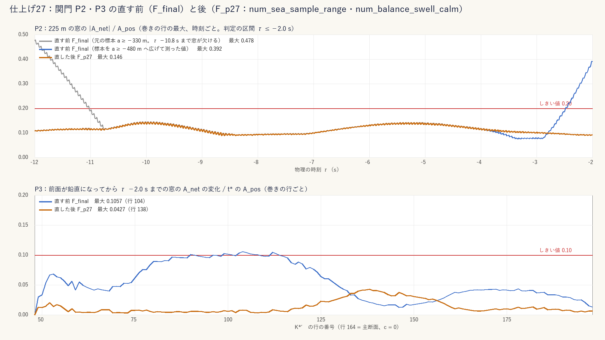
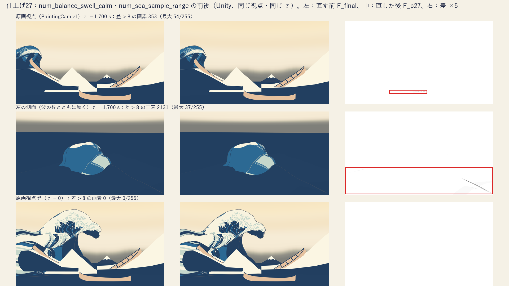
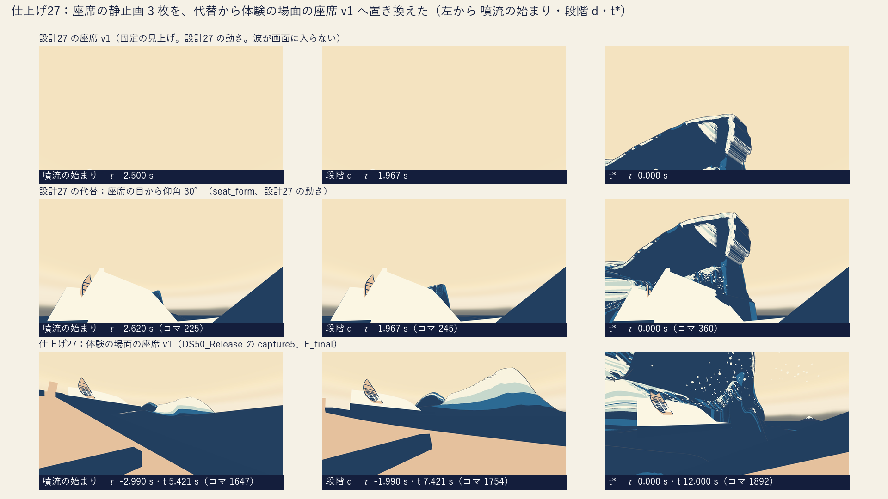

# 仕上げ27：設計27 単発砕波（設計26 を含む）― 関門 P2・P3 を名前の付いた数値の条件 2 つで直し（t\* と本体は変えない）、P13 は不合格の場所を調べて仕上げ28 へ送り、ds26_conditions.json の写しを作り、座席の静止画を体験の場面の座席 v1 に置き換え、80・106〜108・111 を採用の動きで測った

日付：2026-09-30〜10-01／状態：**閉じる案（進行役の自己評審の前。Q24）**。修正 1 回（P2・P3 の直し。［利用者の言葉］の 2 回目は使っていない）。**HMD 実機の結果ではない。利用者は確かめていない。**

- 対象：[計画](../Design/Stage9_Plan_2026-09-26_ja.md) §5.3 の仕上げ27（設計27 単発砕波。設計26 を含む）。群の中の順は、進行役の指示のとおり (1) ［利用者の言葉］Q10 の P2・P3・P13 → (2) Q11 を反映した `Tools/GWWaveGen/ds26_conditions.json` → (3) 座席の静止画 3 枚 → (4) 80・106〜108・111。
- 時間枠（上限）：**0.5 日**（計画 §5.2 の 1 行目。§2.6 の表では 10/1 の午前）。対応するバックログの項目：**80、106、107、108、111**（計画 §5.2）。［利用者の言葉］の項目（Q10）は §5.1 のとおり、実際の累計が表の内なら 2 回目の修正を余裕から使ってよい（使わなかった）。
- 実績（`date` とファイルの時刻、+08:00）：着手 2026-09-30 19:45。F\_final の調べ（`pl27_diag.py`）19:50〜19:53、`ds26_conditions.json` の写し 19:55、直しの実装と確かめ 20:00〜20:04、生成と検査の一式（`ds28r01f_pipeline.py`、タグ F\_p27）20:04〜20:26、座席の静止画 20:05、80〜111 の測定 20:09（読みの追加で 20:22 に測り直し）、Unity の描画 20:15、F\_p27 の調べと図 20:27、評価器の回し直し 20:27〜20:31、再現の抜き取り 20:31〜20:32、記録 20:33〜20:41。**上限の 12 時間（0.5 日）に対して約 1 時間**（計画 §2.6 の表の累計 0.5 日の内。余った分は次の群へ回す）。
- 1 回の計算：生成 667 s、検査の一式 652 s（生成を含む全体 1,322 s）、Unity 21 s、評価器 195 s、調べ 140 s・26 s。どれも 30 分の内。重い numpy の処理は同時に 1 つだけにした（生成と検査の一式の間は、軽い 1 プロセスの測定と Unity だけ）。
- 証拠の種類：numpy の生成器（設計28修正01 の試行F の `ds28r01f`）と関門の検査器（設計27 の `ds27_gates.py`、設計28 の P17〜P19、試行D の包みで K\*′ を渡す）、仕上げ27 の調べの道具（`Tools/GWWaveGen/pl27/`）、Unity 6000.4.3f1 Editor の batchmode の PC オフスクリーン描画（設計27 の `DS27Formation.RenderOnly`、RTX 3080、Direct3D11）、設計50 の Release のプレイヤーの記録の走り capture5 のコマ（PC の画面）、原画視点の回帰の評価器（`ds30b_tstar_regress.py`、爪あり・爪なし）。
- 禁止の場所・参照モデル・利用者の解算・写真のフォルダーは使っていない（参照モデルの OBJ は開いていない。一時のキャッシュも作っていない）。git の書き込みはしていない。

## 見るもの

| P2・P3 の直す前と後（同じ時刻・同じ行） | Unity の直す前と後（同じ視点・同じ τ） |
| --- | --- |
|  |  |
| **座席の静止画 3 枚：設計27 の座席 v1・設計27 の代替・仕上げ27（体験の場面の座席 v1）** | |
|  | |

- 座席の静止画（1920×1080 の PNG）：[噴流の始まり](../Evidence/Polish/27/seat_v1_exp_onset.png)・[段階 d](../Evidence/Polish/27/seat_v1_exp_d.png)・[t\*](../Evidence/Polish/27/seat_v1_exp_tstar.png)（出どころの表 [seat_stills.json](../Evidence/Polish/27/seat_stills.json)）。
- 数値：[metrics.json](../Evidence/Polish/27/metrics.json)（項目 → 値 → 判定）、実行条件と SHA-256：[run.json](../Evidence/Polish/27/run.json)。関門の出力・調べの出力・描画は Git 対象外の `Unity/Build/Polish/27/`。

---

## 0. 結論

1. **(1) Q10 の P2・P3 は合格になった。P13 は不合格のまま（4/12）で、場所を調べて仕上げ28 へ送る。** 採用の動き F\_final を同じ検査器で測ると P2 0.478・P3 0.1057・P13 12 項目中 4 項目が不合格（28修正01 の 9/29 の値と同じ。調べの道具でも 0.4784・0.1057 を再現）。原因は設計27 §3.4 が名指した 2 つだった：(a) 周りの海の標本の範囲（地面の a ≥ −330 m）が τ −10.8 s まで 225 m の窓を覆わない、(b) 搬送波の振幅の窓の釣り合いが、うねりを静める係数 κ\_s を入れずに解かれている（手前の端の行 48〜57 で τ −2.0 s に 0.39、P3 は行 90〜113 の 0.1057）。ds28r01f の生成器に**名前の付いた数値の条件 2 つ**（`num_sea_sample_range`：標本を a −480〜130 m に、`num_balance_swell_calm`：釣り合いのうねりの項に κ\_s(τ) を掛ける）を足し、既定で入れた（`ds28r01f_params.json`）。新しい包み F\_p27（Git 対象外）で、同じ検査器（既定・代案・精度の層・止め 1.3 s・Q13 の表の 5 組とも）が **P2 0.146・P3 0.043（合格）**。P11 も合格に変わった（最小の波高 3.745 → 4.394 m。広げた標本で外の海を長く測った分で、τ ≤ −4 s の海は同じ）。P13 の 4 項目（(2) 地面の二階差分 0.0669 m、(5b) 行の方向の辺 2.4 mm、(5c) 行の方向の伸び 0.011、(5g) 面の反転 130）は値も場所も変わらない。
2. **t\* の見え方も本体も変えていない。** F\_p27 と F\_final の包みは、節点・外接箱・白・τ(t) が同じで、**t\* の層はバイトの差 0**、τ ≤ −4 s の層も差 0。変わるのは τ −4〜0 s の、波峰線の両端の行（5〜18・236〜239）とシートの外端の帯の海だけで、最大 0.240 m（τ −1.6 s、行 11、c −47.5 m）。本体の列（行 40〜230 の j\_B〜j\_E）の差は 0.8 mm 以下。Unity の同じ視点・同じ τ の描画で、原画視点の差は τ −1.7 s の 353 画素（シートの手前の端の細い帯）だけ、t\* と τ ≤ −3.2 s は 0 画素、座席は全部 0 画素。Q13 の独立の検査器の出力（19,621 の値）は 1 つも変わらず、Q13・Q15 の決定を開き直していない。1 つずつの値を切れば F\_final へ戻る（`--off balance_swell_calm,sea_sample_range` で 5 層の抜き取りがバイトまで同じ）。
3. **(2) `Tools/GWWaveGen/ds26_conditions.json` を作った。** Q11（崩壊と再開なし、D30・D31 の決定、D37 の①）を入れ、数値は変えていない（第 2 節）。
4. **(3) 座席の静止画 3 枚を、体験の場面（設計50 の DS50_Release）の座席 v1 の画に置き換えた。** 噴流の始まり（τ −2.99 s）・段階 d（τ −1.99 s）・t\* の 3 枚で、どれも主役波が画面に入る（設計27 の座席 v1 は波が入らず、代替だった）。Release のプレイヤーの記録の走り capture5 のコマで、新しく描いてはいない（第 3 節）。
5. **(4) 80・106〜108・111 を F\_final で測った。** 108 は仰角の読み・真上の読みの**どちらでも合格**（唇が座席の水平 3.6 m・仰角 70.8° まで来る。美術優先30 からの保留は、どちらの読みでも満たすので閉じてよい）。80・106・107・111 は、見え方の値（中央の仰角 0.8° → 70.8° を 1 コマも下がらずに、など）は項目の言葉を満たすが、美術優先30 の式が含む連続性の検査一式（P13）が不合格なので**不合格**とした（第 4 節）。
6. **原画視点の評価器（爪あり・爪なし）は段階9確認と同じ値**（出力の SHA-256 が設計40・41・段階8確認と同じ `4ca57d3a…`）。体験の場面と t\* の組はこの群で変えていない。CP1／26修正01 からの後退は段階5確認 §6.3 のまま残る（仕上げ28）（第 5 節）。
7. **この群で体験の場面（29修正01 の焼き込み・設計30・設計47〜50）は作り直していない。** 生成器の既定は F\_p27 の形になるが、体験は F\_final のまま。t\* が同じで本体も変わらないので、焼き直しは計画 §5.1 のとおり仕上げ28 の中の 1 回にまとめる（第 6 節の D-P27-4）。
8. 独立の検査（実装と別の担当）はこの記録ではしていない。進行役の自己評審で行う。

---

## 1. (1) ［利用者の言葉］Q10：P2・P3・P13 を採用の動き F\_final で測り、安く直せる所を直す

### 1.1 F\_final で測った（直す前）

- 検査器：設計27 の `ds27_gates.py`（P1〜P16 と原画の前提）と設計28 の P17〜P19 を、試行D の包み `ds28r01d_gates.py` で K\*′ R4 を渡して回す（28修正01 の pipeline と同じ 5 組：既定・代案・精度の層・精度の層＋止め 1.3 s・Q13 の表）。F\_final の出力は 28修正01 の `Unity/Build/Design/28R01F/F_final/gates/`（9/29）。
- 値（既定）：**P2 0.478**（行 198、c +6.8 m、τ −11.983 s）、**P3 0.1057**（行 104、c −12.0 m）、**P13 12 項目中 4 項目が不合格**。ほかに P4・P7・P11・P14〜P19 が不合格（記録。仕上げ28 の Q10 の行）。計画 §5.3 の「P13 は 12 項目中 5 項目」は設計27 の版の値で、F\_final では 4 項目。
- 調べ（`Tools/GWWaveGen/pl27/pl27_diag.py`。検査器の関数をそのまま使い、「最悪の 1 か所」を行・列・時刻の分布として数え直す。値は検査器と一致：P2 0.4784、P3 0.1057、P13 の 4 項目の値）：
  - **P2 の原因 (a)**：主断面の頂は τ −12 s で地面の a −235.7 m にあり、窓（頂 ±112.5 m）の後ろが標本の端 a −330 m の外へ出る。窓が欠けるコマは τ −10.78 s まで。欠けたコマの比は最大 0.478。生成器の式で標本を a −480 m まで広げる（重なる範囲の元の標本との差 4.8×10⁻⁷ m、float32 の丸め）と、全部の行・時刻で窓が収まり、比は τ −11 s で 0.11 まで下がる。
  - **P2 の原因 (b)**：窓が収まるコマでも、手前の端の巻きの行 48〜57（c −24.7〜−22.2 m、H 7〜9 m）が τ −2.47〜−2.0 s に 0.2 を超える（最大 0.3915、行 48、τ −2.017 s）。主断面は最大 0.054。生成器の窓の釣り合いのうねりの項 (Sw − srepl) を行ごとに計算すると 42〜48 m²で、出力の海ではこれに κ\_s（τ −2 s で 0.5）が掛かるので、窓の水が (κ\_s − 1)(Sw − srepl) ≈ −22 m² だけ釣り合わない。これを差し引いた見積もりの比は 0.01〜0.10。
  - **P3**：12 行（90〜113、c −14.8〜−10.2 m）が 0.100〜0.1057 で、どれも τ −2.0 s（判定の区間の終わり）で最大。行 104 の窓の A\_net は始まり −8.6 m² → τ −2.0 s −19.9 m²で、差 −11.3 m² のうち κ\_s の分が約 −10.8 m²（始まりの τ −2.82 s の約 −7.4 m² から τ −2 s の −18.2 m²。(κ\_s − 1)(Sw − srepl) の見積もり）。原因 (b) と同じ。
  - **P13**：第 1.4 節。

### 1.2 直したこと（名前の付いた数値の条件 2 つ。修正 1 回）

`Tools/GWWaveGen/ds28r01f/ds28r01f_params.json` に 2 つの値を足し、`ds28r01f_model.py`・`ds28r01f_generate.py` がそれを読む（どちらも `on: true`、名前で切れる。`--off` と `F_NAMES` に入れた。params に値が無ければ切った扱いで、F\_final と同じ）。

| 名前 | 区分 | 中身 | 効く関門 | 変わるもの |
| --- | --- | --- | --- | --- |
| `num_sea_sample_range` | 数値の条件 | 周りの海の標本 `ds27_sea.npz` を、地面の a −480〜130 m（1 m）で書く（F\_final は設計27 の `export_sea` の −330〜130 m）。式と値は同じ | P2（窓の欠け） | `ds27_sea.npz` の範囲だけ。包み（位置・白・keypose）は変えない。設計30 は `Ac_knots` だけを読むので影響しない |
| `num_balance_swell_calm` | 数値の条件 | 搬送波の振幅 A\_c,r(τ) を解く窓の釣り合いを areaB ＋ **κ\_s(τ)**·(Sw − srepl) ＋ A\_c·(Cw − repl) = 0 にする（設計27 の式は κ\_s = 1 で解き、出力だけ κ\_s を掛けていた）。κ\_c（ds\_sea\_calm\_painting、τ −2 s から）は入れない | P2（原因 (b)）・P3 | τ −4〜0 s の A\_c と、シートの外端の帯・波峰線の両端の行の海。本体の列（重み wv = 1）と t\*（κ\_c = κ\_s = 0）は変わらない |

- 実装：`ds28r01f_model.Generator.sea` を足した（切りなら設計27 の `ds27_model.Generator.sea` をそのまま呼ぶ。入りなら同じ式の写しで、釣り合いの 1 行だけが違う）。κ\_s = 1 の τ ≤ −4 s で、写しの出力が元の式とバイトまで同じことを確かめた（τ −6・−4 s で差 0）。E の `__init__` の中からも海が呼ばれるので、値は生成器を作る前に決める。周りの海の標本は `ds28r01f_generate.export_sea_range`（設計27 の `export_sea` と同じ中身で範囲だけを変える）。P20 は生成の中で「κ\_s だけを切った形との頂点の差の最大」を測る。
- 落とした案：κ\_c も釣り合いに入れる（τ > −2 s で A\_c が上限 9 m まで膨らみ、原画視点で平らにしたい海に谷を掘る。τ > −2 s は P2・P3 の判定の外）。静める場所を見える足跡と余白に限る（設計26 §4.2・D35。t\* の原画視点の海が変わり、設計30 の海の作り直しが要るので安くない）。検査器の読みを変える（窓の欠けたコマを除く。読みの変更は直しではない）。

### 1.3 直した後（F\_p27）

- 生成と検査：`py -3.10 -B Tools/GWWaveGen/ds28r01f/ds28r01f_pipeline.py --kstar Unity/Build/Design/28R01F/kstar_final --tag F_p27 --root Unity/Build/Polish/27 --skip-p20-e`（生成 667 s、検査 652 s）。包みは `Unity/Build/Polish/27/F_p27/art_on/`（位置の SHA-256 `a92f3446…`、242 層）。

| 関門（しきい値） | F\_final（直す前） | F\_p27（直した後） | 判定 |
| --- | --- | --- | --- |
| P2 谷と釣り合う（窓の \|A\_net\|/A\_pos ≤ 0.2、谷 ≤ −2.02 m） | 0.478（行 198、τ −11.98 s。窓の欠け。主断面 0.277）。谷 −3.55 m | **0.146**（行 65、τ −9.92 s。主断面 0.057）。谷 −3.50 m。0.2 を超える行・コマ 0 | **合格** |
| P3 巻いても水が消えない（≤ 0.10） | 0.1057（行 104） | **0.043**（行 141。調べの道具では 0.0427・行 138） | **合格** |
| P11 海が波を運ぶ（RMS ≥ 1.01 m、波高 ≥ 4.03 m） | 否（RMS 1.102 m、最小の波高 3.745 m） | 合格（RMS 1.082 m、最小の波高 4.394 m） | 合格（記録：τ ≤ −4 s の海は同じで、広げた標本で外の海を長く測った分） |
| P13 連続性の一式 | 12 項目中 4 項目が不合格 | 12 項目中 4 項目が不合格（値も同じ） | 不合格（第 1.4 節、仕上げ28） |
| そのほか（P1・P5・P6・P8〜P10・P12・原画の前提は合格、P4・P7・P14〜P19 は不合格） | 同じ | 同じ（値も同じ。P17 0.8575／0.9577／1.1275、P18 9.33 m） | 変わらない |

- 5 組（既定・代案・精度の層・止め 1.3 s・Q13 の表）のどれでも、不合格は 12 → 9（Q13 の表は 14 → 11）で、減ったのは P2・P3・P11 だけ。精度の層の P3 は 0.0425。
- Q13 の独立の検査器（`ds28r01_overlap.py`）の出力の 19,621 の数値は F\_final と 1 つも違わない。M1（60 Hz、481 こまの断面の自己交差と動きが作った局所の自己交差）は 0 のまま。M3（唇ができる前の頂の角）は同じ。目標の検査器（`review_F_p27.json`）の 558 の数値のうち 526 は同じで、違う 32 はシート全体の統計（谷の深さの系列・行の法線の角の p95・ジグザグの割合・節点の法線の段。谷の深さの比の τ −1〜−2 s の小さな値が 0.22 → 0.21・0.009 → 0.004 などと動き、ほかは ±5% 以内。Q13・Q15・Q17 の値（唇の見え始め・小山から C 字の時間・巻き下がりの割合）は同じ）。M2 のシートの上の水の量は τ −2 s で 7,117 → 7,034 m³（海の縁の分）、最後の 1 s の行き過ぎ p99 0.0097 → 0.0086 m。
- 包みの差（`pl27_record.py` が直接数え直した）：節点・外接箱・白・τ(t) の表は同じ。**t\* の層の差 0 m、τ ≤ −4 s の層の差 0 m**。τ −3.0／−2.0／−1.5／−1.0／−0.5 s で最大 0.075／0.207／0.239／0.183／0.068 m。1 cm を超えて動いた頂点 7,274（波峰線の両端の行と、シートの外端の列）。本体の列（行 40〜230 の j\_B〜j\_E）は 0.8 mm 以下。P20（生成の中の測定）：`num_balance_swell_calm` 0.240 m（τ −1.55 s、行 11、c −47.5 m）。
- Unity（`DS27Formation.RenderOnly`、28修正01 の F\_final の描画と同じ場面（SHA-256 `988f1cf5…`）・同じ再生器・同じ τ(t)・同じ 7 つの τ・原画視点／座席／左の側面。`fig_pl27_unity_before_after.png`）：
  - 原画視点：τ −1.700 s で差 > 8 の画素 353（最大 54/255。y 918〜925・x 599〜1048 の、シートの手前の端と仮置きの平らな海の段の細い帯）、τ −0.950 s で 2、τ −4.889・−3.202・−2.450・−0.203 s と t\* で 0。
  - 左の側面（波の枠とともに動く）：τ −3.202〜−0.203 s に差 > 8 の画素 499〜2,150（最大 37/255。シートの外端の海）、τ −4.889 s と t\* で 0。
  - 座席：全部の τ で 0。
- 再現（`pl27_repro_check.py`、1 つのプロセスで節点の層を作り直す）：F\_p27 の 5 層（τ −12・−4・−2・−1.5・0）が 16 bit・精度の層ともバイトまで同じ。`--off balance_swell_calm,sea_sample_range` で F\_final の同じ 5 層もバイトまで同じ（**抜き取りで、全層の一致は確かめていない**）。

### 1.4 P13（直していない。仕上げ28 へ）

F\_p27 でも値・場所は F\_final と同じ（調べの道具の数も同じ）。

| 項目（しきい値） | 値 | 場所（調べの道具） | 見立て（確かめていない） |
| --- | --- | --- | --- |
| (2) 地面の二階差分（30 Hz、≤ 0.0218 m = 2 g） | 0.0669 m（行 187・列 394、τ −5.667 s） | 越えた頂点×こま 77,422、361 こまのうち 82 こま（τ −6.53〜−0.53 s）、行 48〜198。多いのは列 15〜26（背の足 j\_B 18 の付近）。τ −1.13 s の行 74〜75 の列 18〜19 で 0.040 m、τ −2.27〜−2.53 s の行 170〜179 の列 254〜326（管の内側、噴流の始まりの頃）で 0.032 m、最大は前の足 j\_E 394 | 包み（Hermite）でなく生成器の動きそのもの（生成器の解析の値と包みの差 ≤ 1.1 mm、越える頂点の数もほぼ同じ）。背の足の横の動き（背の幅の表・D の背の保持が σ −1.0 で止まる所）、内壁の錨の当て直しの始まり、前の足の余白の帯、のどれか（1 つとは限らない） |
| (5b) 行の方向の辺の最小（≥ 5 mm） | 2.4 mm（行 100・列 208、τ −1.2 s。K\*′ は 7.5 cm） | 163 辺、9 こま（τ −1.40〜−1.13 s）、行 93〜186、列 207〜211（rim 202〜204 のすぐ後、管の天井の始まり） | 管の天井の始まりが τ −1.2 s ごろに縮む（管の天井の相似変換と ψ\_t の混ぜ方） |
| (5c) 行の方向の伸びの比（0.05〜4） | 0.011（行 108・列 193、τ −2.83 s。辺 9 mm、K\*′ 0.83 m） | 49,848 辺、290 こま（τ −12〜−2.37 s）、すべて縮む側、行 76〜137（c −17〜−5.6 m）、列 190〜194（唇先の 1〜8 列後ろ、唇の下面の始まり）。K\*′ の辺の中央値 0.57 m、放出の前の帯の辺 2 cm | 放出の前の唇の帯（2 cm おき。設計27 で古い K\* の唇の辺 約 0.25 m に合わせた値）と、K\*′ の長い唇の下面の比。帯の間隔を広げると錨の始まりの位置 q\_on（帯の一番前から決まる）も動き、形成の形が変わるので安くない |
| (5g) 面の反転（30 Hz、0） | 130 | 48 こま（τ −6.1〜−2.23 s）、行 227〜234（奥の端の尾、c +12.8〜+14、H 2〜8 m）、列 91〜187（頂から唇先の間の前面） | 奥の端の細い行の前面の早い折れ（K\*′ R4 の尾の形に依る）。座席の近くの行（107 の範囲）の反転は 0 |

- 直さなかった理由（進行役の判断、Q24）：4 つとも、原因が生成器の動きのいくつかの部分（背と足・管の天井・放出の前の帯・奥の尾の行）にあり、1 か所の値では直らない。しかも仕上げ28 で K\*′（ドーム・b区域・横の厚み）を作り直すと、唇の長さ・尾の行・管の深さが変わり、今 R4 に合わせて直しても持ち越せない（特に (5c) と (5g)）。仕上げ28 で動きを当て直す時に、この表の場所から直し、同じ検査器で測り直す（計画 §5.3 の仕上げ28 の Q10 の行「仕上げ27 で直した P2・P3・P13 は、この群の形と動きで測り直す」）。

## 2. (2) Q11 を反映した `Tools/GWWaveGen/ds26_conditions.json`

- 設計26 の値の JSON は `Docs/Evidence/Design/26/ds26_conditions.json`（SHA-256 `ec8ae040…c072`。初回提出の時点の値で、設計26 の run.json に記録したので書き換えない）。設計26 の記録（25 行目）は、Q11 の決定を「設計27 で `Tools/GWWaveGen/ds26_conditions.json` へ写すときに入れる」と書いたが、設計27 では作っていなかった（段階5確認 §4・§7）。
- 作った：[Tools/GWWaveGen/ds26_conditions.json](../../Tools/GWWaveGen/ds26_conditions.json)（SHA-256 `9e65abe9…6642`。道具 `Tools/GWWaveGen/pl27/pl27_ds26_conditions.py` が元の SHA-256 を照合して決定的に書く。`--check` でバイトの一致を確かめられる）。入れたことは次の 4 つで、**数値は 1 つも変えていない**（元の数値の葉 58 のうち 55 は同じ値で残り、外した 3 つは `q11_applied.changes` に元の値のまま残した）。
  1. `status_ja`：「利用者未回答」→ Q11 の回答（D30 は既定の 60°、D31 は既定の時間曲線、D37 は①だけ）と、残りの既定値の状態（D32・D33・D35・D37 の②は既定値・利用者未回答、D36 は既定値・利用者未確認、錐状の副峰は Q12 で確認済み）。`scope_ja`（形成から t\* まで、崩壊と再開は作らない）を足した。
  2. `time_warp` の既定と代案の `restart_ramp_s`（2.0 s）を外した（t\* の後の再開は作らない。保持の後は設計47）。既定に `decided_ja`（D31）を足した。
  3. `numerical.keypose_hz.breaking_and_collapse`（30）を `jet_to_tstar`（30）へ改名した（崩壊は作らない）。
  4. `physical_input.crossing_angle_deg` に `decided_ja`（D30）を足した。`q11_applied`（元のパスと SHA-256・決定・変更の一覧・`numbers_changed: false`）を足した。スキーマは `/2`。
- 読むもの：今は記録だけ。設計27〜28修正01 の生成器と関門の検査器は、再現の SHA-256 を変えないために、今も元の Evidence の JSON を照合して読む（写しの `status_ja` にも書いた）。読む先を替えるかは、仕上げ28 で生成器を作り直す時に決める（限界 L5）。

## 3. (3) 座席の静止画 3 枚を、体験の場面の座席 v1 の画に置き換えた

- 設計27 の最小の受入の「座席の静止画 3 枚（噴流の始まり・段階 d・t\*）」は、座席 v1（固定の見上げ）では段階 a〜d に波が入らないので、座席の目から仰角 30° の seat_form のコマで代えていた（代替、記録のみ。設計27 §2.5）。
- 置き換え：体験の場面（設計50 の `DS50_Release`）の座席 v1 の画。座席 v1 の目（`seat_v1.json`、右船の唇の下）は体験では座席の船（設計41〜45）に乗り、正面は座席 v1 の再センタリングの向き（設計45 D45-6）なので、形成の間も波が画面に入る。
  - 画の出どころ：設計50 の最終の記録の走り capture5（Release のプレイヤー `GreatWave50.exe`、`Time.captureDeltaTime` = 1/30 s、毎フレームの JPG、1920×1080）。**新しく描いてはいない。** 目標の時刻に一番近い、走っている（止めていない）コマを選び、JPG を PNG に写した（拡大・縮小なし。JPG の圧縮はそのまま）。
  - 時刻（採用の動き F\_final で、設計27 と同じ出来事）：噴流の始まり＝峰で最も高い巻きの行（K\*′ の行 160）の前面が鉛直になる τ −2.983 s（関門の検査器の `onset_tau_by_row`）、段階 d＝同じ行の P15 の d の τ −1.983 s、t\*＝τ 0。τ → t は 28修正01 の τ(t)（`timewarp_F_final.json`。体験の場面の GWClock が読む表と同じことを、設計47 の走り main の記録 `ds47_frames.csv` の τ で確かめた。差の最大 3×10⁻²⁴ s）。
  - 選んだコマ：噴流の始まり コマ 1647（t 5.421 s、τ −2.990 s。目標 t 5.434 s）、段階 d コマ 1754（t 7.421 s、τ −1.990 s。目標 t 7.434 s）、t\* コマ 1892（t 12.000 s、τ 0）。1/30 s の格子なので、目標との差は 0.013 s。
  - 静止画：[seat_v1_exp_onset.png](../Evidence/Polish/27/seat_v1_exp_onset.png)（267,569 B）・[seat_v1_exp_d.png](../Evidence/Polish/27/seat_v1_exp_d.png)（328,584 B）・[seat_v1_exp_tstar.png](../Evidence/Polish/27/seat_v1_exp_tstar.png)（647,393 B）。元の JPG と PNG の SHA-256 は [seat_stills.json](../Evidence/Polish/27/seat_stills.json)。並べ図 [fig_pl27_seat_stills.png](../Evidence/Polish/27/fig_pl27_seat_stills.png)（1 段目 設計27 の座席 v1、2 段目 設計27 の代替、3 段目 この群）。
- 見て分かること（記録）：噴流の始まりと段階 d では、主役波は座席の左前の水平線の近くに暗い巻きとして見え、唇が伸び出すのが読める。ただし画面の右半分は右の高い波の平らなクリーム色の「雪山」（段階5確認 S5-2）が占め、主役波より目立つ（仕上げ30 の③）。t\* では唇が座席の上の左にかぶさり、飛沫の点が見える。
- 設計27 の 2 つの段は設計27 の動き（採用の経路にない）の画。1 段目の噴流の始まりの列は、設計27 の座席 v1 に τ −2.62 s の静止画がないので、段階 c（τ −2.5 s）の静止画（段階 a〜d の 4 枚は同じ画像）を並べた。

## 4. (4) 80・106〜108・111 を採用の動き F\_final で測った

道具 `Tools/GWWaveGen/pl27/pl27_seat_items.py`。美術優先30 の記録（`Tools/GWWaveGen/af30_evidence.py` の座席の項目）と同じ定義を、ds27 の包み（関門の検査器の `Package`・`KStar` で読む 16 bit の Hermite）と K\*′ R4 の目印の列（`j_top` 90・`j_tip` 200・`j_corner` 314・`j_facebot` 379）に当てた。目は座席 v1 の固定の目（世界 (3.9544, 1.8323, −15.0308)、c\_seat −1.43 m）。体験の時刻 t 0〜14 s を 30 Hz（τ(t) は `timewarp_F_final.json`）。行の組は 中央 ±5 m（行 132〜181）・近く ±3 m（142〜171）・左 −25〜−5 m（44〜131）・右 +5〜+15 m（182〜231）。**幾何の測定で、描画ではない。** 体験の場面では座席の船が動くので、設計47 の走り main の HMD Camera の位置（`ds47_frames.csv`）でも 80・108 を測った（記録のみ）。値は Git 対象外の `Unity/Build/Polish/27/seat_items/seat_items_F_final.json`、要点は metrics.json の `backlog_items`。

判定は 2 つ書く。(a) 美術優先30 の式：連続性の検査一式（P13 の 12 項目）がすべて合格であることを含む。(b) 項目の言葉の読み：その項目が名指す傷（形の切替・欠落・裂け・位置跳び・面の反転）と見え方だけ。**この群の判定は (a) とする**（進行役の判断、Q24。P13 は 4 項目が不合格のまま仕上げ28 へ送るので、(a) では 80・106・107・111 は不合格。(b) は記録）。

| 項目 | 値（F\_final、座席 v1 の固定の目） | (a) 美術優先30 の式 | (b) 項目の言葉 |
| --- | --- | --- | --- |
| 80 正面中央で上昇前から後まで続けて見られる | 中央の帯の水面（y > 0.3 m）の最大仰角：t 0 0.79°・2 2.11°・4 5.90°・6 12.61°・8 20.08°・9 25.53°・10 34.57°・11 55.77°・t\* 70.83°。1 コマの下がり 0.0°。形の切替（添字は同じ）・欠落（(5a)・(6) 合格）・位置跳び（(1) 0.34 m）0。動く目（設計47 の main）：t 1 1.55° → t 12 70.65°、下がり 0.0° | **不合格**（P13 の (2)(5b)(5c)(5g)） | 合格 |
| 106 中央から左右まで一面として上へ移る | t\* の最大仰角 左 57.81°・中央 70.83°・右 44.97°、下がり 左 0.0°・右 0.0°。裂け：行の間の伸び (5d) 0.194〜2.102（合格）、自己交差 (5f) 0、位置跳び 0 | **不合格**（同上） | 合格 |
| 107 船側の水面が上向きから船向きへ連続して変わる | 座席の近くの行の内壁（列 j\_corner〜j\_facebot）の平均の法線の上からの角：t 0 4.65°・t 8 34.60°・t\* 41.81°。t\* の座席の向きとの内積 0.553。1 コマの回り 0.276° 以下。この範囲の面の反転 0（全体の (5g) 130 は奥の端の行 227〜234 で範囲の外） | **不合格**（同上、かつ t 0 が 4.65° で美術優先30 の < 1° を満たさない） | 不合格（< 1° の読み）。t 0 の 4.65° は海のうねり（Hs 5 m）と搬送波で水面が傾く分で、< 1° は平らな海の rig（美術優先30）を前提にした読み（記録） |
| 108 前方の水面が船側へ延びて座席の上に入る過程 | 唇（巻きの行の j\_top〜j\_corner、y > 0.3 m）の最大仰角：t 2 2.11°・6 12.61°・8 20.08°・10 34.57°・t\* 70.83°（最大は t\*）、1 コマの下がり 0.0°。近くの行の唇先の仰角 t\* 67.72°。t\* の唇の水平の最小距離 3.621 m。座席から水平 5 m 以内の唇の点 最大 520、仰角 70° 以上の水面の点 最大 49。動く目：t 2 2.55° → t 12 70.65°、下がり 0.0° | 仰角の読み **合格**・真上の読み **合格** | （同じ） |
| 111 座席の上へ延びた水面の先が下向きに曲がる過程 | 近くの行の唇先の向き（j\_tip−8〜j\_tip の弦の水平からの角の中央値。負が下向き）：t 6 −88.46°・8 −112.40°・9 −116.10°・10 −119.03°・11 −120.35°・t\* −122.15°。1 コマの向きの変化 1.614° 以下。唇先の 1 コマの移動：地面 0.671 m（波の約 20 m/s の進み＝1/30 s で約 0.67 m を含む）、波の枠 0.095 m。t\* = K\*′（原画の前提 合格）。P4 −1.684 m/s²・P16 2.11（不合格、記録） | **不合格**（P13 と、地面の移動 0.671 m が美術優先30 の 0.6 m を超える） | 地面の移動の読みでは不合格、波の枠の移動の読みでは合格（0.6 m の目安はその場で育つ美術優先30 の rig の値。記録） |

- 108 は、美術優先30 から「読みの選択待ち」の保留だった（仰角の読みと真上の読み）。F\_final（K\*′ R4）では**どちらの読みでも満たす**ので、この群では選ばない（どちらでも合格。進行役の判断、Q24）。美術優先30（仰角 64°、真上は満たさない）より唇が座席の上へ出た（K\*′ の唇が座席の水平 3.6 m まで来る）。
- 80・106・107・111 は、P13 の 4 項目（第 1.4 節）を仕上げ28 で直してから測り直す。項目の言葉の読みで残る傷は、107 の t 0 の読み（平らな海の前提）と 111 の地面の移動の読み（波の進みを含む）で、どちらも読みの前提の違い（記録。読みを変えるかは仕上げ28 の受入で決める）。

## 5. 原画視点の評価器（爪あり・爪なし）と後退の表

- この群は、体験の場面の原画視点の画（29修正01 の焼き込み・設計30〜50 の場面）を変えていない。生成器の直しの包み F\_p27 も、t\* の層は F\_final とバイトの差 0（第 1.3 節）。そのうえで、計画 §5.1 のとおり評価器を爪あり・爪なしの両方で回し直した。
- 回し直し：`py -3.10 -B Tools/GWWaveGen/ds30/ds30b_tstar_regress.py --out Unity/Build/Polish/27/regress --sets t28_claws,t28_white`（195 s）。入力は設計41 の t\* の組（`Unity/Build/Design/41/model/unity/t28_claws`・`t28_white` の `t28` の写し。段階8確認・段階9確認と同じ入力）。**出力の SHA-256 は `4ca57d3a…`（設計40・設計41・段階8確認の出力と同じファイル）**。

| 項目（読み） | CP1 | 26修正01 | 段階9確認（直前） | 仕上げ27 | 直前との差 |
| --- | --- | --- | --- | --- | --- |
| 78／130／131（t\* の主役波の ID の最大） | 2.772／1.968／1.814 px | 1.641／1.953／1.798 px | 3.0289／3.5131／3.0431 px | 3.0289／3.5131／3.0431 px（爪あり・爪なし同じ） | 0 |
| 132（大きな輪郭 σ12 の最大） | 1.326 px | 1.574 px | 3.7552 px | 3.7552 px | 0 |
| 72（大きな輪郭 σ24 の p95） | 1.558 px | 1.723 px | 3.8423 px（爪あり）・4.0075 px（爪なし） | 3.8423 px（爪あり）・4.0075 px（爪なし） | 0 |
| 評価器の定義のままの読みで 28修正01 から判定が変わる項目 | — | — | 爪あり 267、爪なし 134・267 | 爪あり 267、爪なし 134・267 | 同じ |
| 両側の読みの 29修正01 との最悪の差 | — | — | 0.0 px | 0.0 px（266・267 の帯 0） | 0 |

- 後退：CP1／26修正01 からの後退（78・130・131 が約 2 倍、132・72 が 4 px 付近、134・267 の定義のままの読みの不合格）は、段階5確認 §6.3 から変わらず残る。戻すのは仕上げ28（計画 §5.3 の仕上げ28 の閉じる目安）。この群は後退を増やしも減らしもしていない。

## 6. 決めたこと（Q24。推奨の案を選び、理由と落とした案を残す）

| # | 決めたこと | 理由 | 落とした案 |
| --- | --- | --- | --- |
| D-P27-1 | P2 の窓の欠けは、周りの海の標本を広げて直す（`num_sea_sample_range`、a −480 m） | 包みを変えずに関門の定義（設計26 §4.1 の 225 m の窓）どおりに測れる。調べで −480 m なら全部の行・時刻で窓が収まることを確かめた | 検査器の読みで窓の欠けたコマを除く（読みの変更で、直しではない） |
| D-P27-2 | P2 の残りと P3 は、釣り合いに κ\_s を入れて直す（`num_balance_swell_calm`） | 設計27 §3.4 が名指した原因そのもので、1 行の数値の条件。本体と t\* は変わらず、Q13・Q15 の決定にも触れない（独立の検査器の出力が同じ） | κ\_c も入れる（t\* の前に A\_c が上限まで膨らみ、平らにしたい海に谷を掘る）。静める場所を足跡と余白に限る（t\* の原画視点の海と設計30 が変わる。安くない） |
| D-P27-3 | P13 の 4 項目は直さず、場所と見立てを書いて仕上げ28 へ送る | 原因が動きのいくつかの部分にあり 1 か所の値では直らない。仕上げ28 で K\*′ を作り直すと唇の長さ・尾の行・管の深さが変わり、R4 に合わせた直しは持ち越せない | 帯の間隔を広げる（錨の始まりの位置が動き形成の形が変わる）。(5c) の読みで放出の前の帯を除く（読みの変更。仕上げ28 の受入で決める） |
| D-P27-4 | 2 つの値は生成器の既定で入れる。体験の場面の焼き直し（29修正01 の焼き込み・設計30 の接続帯・設計47〜50 の場面）はこの群ではしない | t\* が同じで本体も変わらず、違いは τ −4〜0 s の海の縁の 0.24 m 以下。計画 §5.1 は、仕上げ28 で形が変わったら仕上げ28 の中で焼き直しを 1 回回すと決めているので、そこで一緒に入る。今焼き直すと、仕上げ28 でもう一度同じ作業が要る | 今すぐ体験を F\_p27 に作り直す（数時間。仕上げ28 の焼き直しと重なる）。値を既定で切っておく（仕上げ28 で入れ忘れる恐れ） |
| D-P27-5 | 座席の静止画は、設計50 の Release のプレイヤーの記録の走り capture5 のコマを使う | 最新の体験の場面（設計48 の泡・設計49・設計50 の枠を含む）の本物の画で、新しい実行が要らない。1/30 s の格子で目標から 0.013 s 以内 | 設計47 の `DS47FlowPlay` に目標の時刻の印を足して Editor の Play で PNG を描く（設計47 のコードを書き換える。DS47\_Flow は設計48〜50 の中身を含まない） |
| D-P27-6 | 108 は読みを選ばない（どちらの読みでも合格） | F\_final では仰角の読み・真上の読みの両方を満たす | どちらかを選ぶ（選んでも判定は同じ） |
| D-P27-7 | 80・106・107・111 の判定は美術優先30 の式（連続性の検査一式を含む）で書き、項目の言葉の読みは記録にする | 未検証を合格と書かない（AGENTS.md）。P13 が不合格のうちは、項目の言葉だけで合格とは書かない | 項目の言葉の読みで合格と書く |
| D-P27-8 | 仕上げ27 の道具の接頭辞は `pl27`（`Tools/GWWaveGen/pl27/`） | 計画 §4.2 は設計の番号の接頭辞 `DS` を決めたが、仕上げの接頭辞は決めていない。`DS` や `AF` と紛れない | `ds27p` など（設計27 の道具と紛れる） |

## 7. 限界と引き継ぎ

限界：

- L1. **P13 は不合格のまま**（第 1.4 節の 4 項目）。80・106・107・111 も、そのために美術優先30 の式では不合格。
- L2. **生成器の既定（F\_p27 の形）と体験の場面（F\_final）が違う**（D-P27-4）。違いは τ −4〜0 s の海の縁だけで t\* と本体は同じだが、体験の場面の関門の値（P2・P3）は F\_final のまま。仕上げ28 の焼き直しで揃う。それまで `ds28r01f_pipeline.py` で F\_final を作り直すときは `--off balance_swell_calm,sea_sample_range` を付ける（5 層の抜き取りでバイトまで同じ。全層は確かめていない）。
- L3. P11 の合格は、広げた標本で外の海を長く測った分による（τ ≤ −4 s の海は変えていない）。海そのものを直したのではない。
- L4. 座席の静止画は Release のプレイヤーの JPG（1/30 s の記録の走り）を PNG に写したもので、圧縮の跡が残る。目標の時刻から 0.013 s ずれる。座席の視点は PC の単眼の画面で、HMD の中の見え方ではない。
- L5. `Tools/GWWaveGen/ds26_conditions.json` は今は記録で、生成器と検査器は元の Evidence の JSON を読む。
- L6. 80〜111 は包みの幾何の測定で、描画ではない。座席は固定の座席 v1 の目（動く目は 80・108 だけ記録）。107 の t 0 の読み（< 1°）と 111 の地面の移動の読み（0.6 m）は、美術優先30 の平らな海・その場で育つ rig を前提にした読み。
- L7. 独立の検査（実装と別の担当）はこの記録ではしていない。検査器・調べの道具・再現の抜き取り・Unity の画素の差は、作る部が回したもの。
- L8. Unity の前後は設計27 の `DS27Formation`（16 bit だけを読む再生器、古い焼き込みの色、仮置きの平らな海）の描画で、体験の場面の描画ではない。
- L9. HMD 実機・利用者の確認なし。

仕上げ28 へ渡すもの（計画 §5.3 の仕上げ28 の Q10 の行に足す）：

1. P13 の 4 項目（第 1.4 節の表の場所と見立て）。K\*′ を作り直した後の動きで直し、同じ検査器で測り直す。
2. P2・P3（この群で合格）を、仕上げ28 の形と動きで測り直す。2 つの値は生成器の既定で入っている。
3. 焼き直しの時に、設計30 の海が新しい `Ac_knots`（τ −4〜0 s の A\_c が最大 2.1 m 違う。原画視点の t\* は κ\_c = 0 で変わらない）を読むこと。
4. 80・106・107・111 を P13 を直した後に測り直し、107 の t 0 と 111 の地面の移動の読みを受入で決める。108 はどちらの読みでも満たすことを保つ。
5. `ds26_conditions.json` の写しを生成器・検査器が読むかを決める。

## 8. 再現

リポジトリの根で。F\_final（`Unity/Build/Design/28R01F/F_final/`）・K\*′ R4（`Unity/Build/Design/28R01F/kstar_final/`）・設計50 の capture5・設計47 の main・設計41 の t\* の組が本機にあることが前提（どれも Git 対象外）。Python は `py -3.10`（numpy 2.2.6、Pillow）。

1. 調べ（直す前）：`py -3.10 -B Tools/GWWaveGen/pl27/pl27_diag.py --package Unity/Build/Design/28R01F/F_final/art_on --kstar Unity/Build/Design/28R01F/kstar_F_final --gates-json Unity/Build/Design/28R01F/F_final/gates/default_ds27.json --out Unity/Build/Polish/27/diag/diag_F_final.json --ext-a-min -480`（140 s）
2. `ds26_conditions.json`：`py -3.10 -B Tools/GWWaveGen/pl27/pl27_ds26_conditions.py`（`--check` でバイトの一致だけ）
3. 生成と検査：`py -3.10 -B Tools/GWWaveGen/ds28r01f/ds28r01f_pipeline.py --kstar Unity/Build/Design/28R01F/kstar_final --tag F_p27 --root Unity/Build/Polish/27 --skip-p20-e`（約 22 分。ほかの重い処理と同時に回さない）
4. Unity：`powershell -NoProfile -ExecutionPolicy Bypass -File Tools/GWWaveGen/ds28r01f/run_ds28r01f_unity.ps1 -Method GreatWave.Design27.EditorTools.DS27Formation.RenderOnly -Log p27_F_p27 -Version art_on -Warp default -Package Build/Polish/27/F_p27/art_on -WarpFile Build/Design/28R01F/F_final/timewarp_F_final.json -OutDir Build/Polish/27/unity/F_p27 -Stills "t03=-4.889,t05=-3.202,t065=-2.450,t08=-1.700,t095=-0.950,t11=-0.203,tstar=0" -Views "painting,seat,side_left" -Skip "video,frames"`、図：`py -3.10 -B Tools/GWWaveGen/pl27/pl27_fig_unity.py`
5. 調べ（直した後）と図：`py -3.10 -B Tools/GWWaveGen/pl27/pl27_diag.py --package Unity/Build/Polish/27/F_p27/art_on --kstar Unity/Build/Polish/27/kstar_F_p27 --gates-json Unity/Build/Polish/27/F_p27/gates/default_ds27.json --out Unity/Build/Polish/27/diag/diag_F_p27.json`、`py -3.10 -B Tools/GWWaveGen/pl27/pl27_fig_gates.py --before Unity/Build/Polish/27/diag/diag_F_final.json --after Unity/Build/Polish/27/diag/diag_F_p27.json --out Docs/Evidence/Polish/27/fig_pl27_p2_p3_before_after.png`
6. 再現の抜き取り：`py -3.10 -B Tools/GWWaveGen/pl27/pl27_repro_check.py --package Unity/Build/Polish/27/F_p27/art_on --out Unity/Build/Polish/27/repro/repro_F_p27.json`、`… --package Unity/Build/Design/28R01F/F_final/art_on --off balance_swell_calm,sea_sample_range --out Unity/Build/Polish/27/repro/repro_F_final_off.json`
7. 座席の静止画：`py -3.10 -B Tools/GWWaveGen/pl27/pl27_seat_stills.py`
8. 80〜111：`py -3.10 -B Tools/GWWaveGen/pl27/pl27_seat_items.py --package Unity/Build/Design/28R01F/F_final/art_on --kstar Unity/Build/Design/28R01F/kstar_F_final --timewarp Unity/Build/Design/28R01F/F_final/timewarp_F_final.json --gates-json Unity/Build/Design/28R01F/F_final/gates/default_ds27.json --out Unity/Build/Polish/27/seat_items/seat_items_F_final.json`
9. 評価器：`py -3.10 -B Tools/GWWaveGen/ds30/ds30b_tstar_regress.py --out Unity/Build/Polish/27/regress --sets t28_claws,t28_white`（入力の t28 は設計41 の組の写し）
10. 記録：`py -3.10 -B Tools/GWWaveGen/pl27/pl27_record.py`（metrics.json・run.json）

## 9. 出典と、この群で作ったもの

- 仕様：計画 §5.1〜§5.3・§2.6、[段階5確認](Stage5_SelfReview_ja.md) §4・§6.4・§7、[設計27](Design_27_ja.md) §2〜§6（P2 の原因 (1)(2)、座席の静止画の代替）、[設計26](Design_26_ja.md) §4.1・第10節、[設計28修正01](Design_28_修正01_ja.md) §2.4〜§2.6、美術優先30 の記録（80〜111 の定義。`Docs/Evidence/ArtFirst/30/metrics.json`）、[設計40](Design_40_ja.md)（CP1／26修正01 の値）。
- 使ったもの（読むだけ）：F\_final の包みと関門の出力、K\*′ R4、`timewarp_F_final.json`、`Tools/GWContext/seat_v1.json`、設計50 の capture5 のコマと CSV、設計47 の main の CSV、設計41 の t\* の組、設計27 の座席 v1 と seat\_form の静止画。SHA-256 は run.json の `inputs`。
- 変えたもの：`Tools/GWWaveGen/ds28r01f/ds28r01f_params.json`（2 つの値を足した）、`ds28r01f_model.py`（`F_NAMES`・`F_OPT_IN`・`_bal_ks_on`・`sea`）、`ds28r01f_generate.py`（`export_sea_range`、P20 の測り方）、`ds28r01f_pipeline.py`（`--off` を生成へ渡す）。ほかの番号のファイル（ds27・ds28・ds28r01e など）は変えていない（試行F の `base` の SHA-256 の照合も通る）。
- 作ったもの：`Tools/GWWaveGen/pl27/`（`pl27_diag.py`・`pl27_ds26_conditions.py`・`pl27_seat_stills.py`・`pl27_seat_items.py`・`pl27_fig_gates.py`・`pl27_fig_unity.py`・`pl27_repro_check.py`・`pl27_record.py`）、`Tools/GWWaveGen/ds26_conditions.json`、`Docs/Evidence/Polish/27/`（1920×1080 の PNG 6 枚、`seat_stills.json`・`metrics.json`・`run.json`）、この記録。
- コミットしないもの（Git 対象外の `Unity/Build/Polish/27/`）：F\_p27 の包みと検査の出力（約 490 MB）、調べの出力、Unity の描画、評価器の入力の写しと出力（約 530 MB）、再現の抜き取り、ログ。
