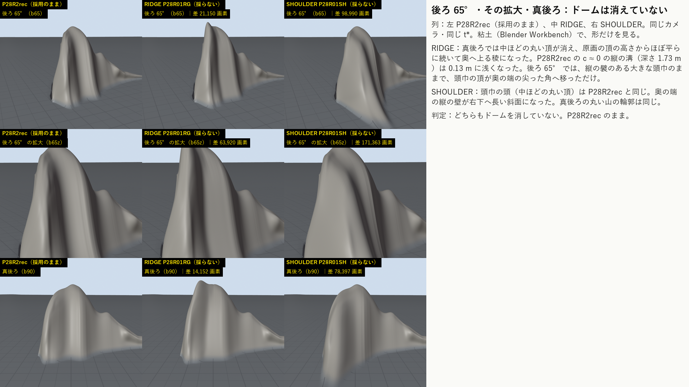
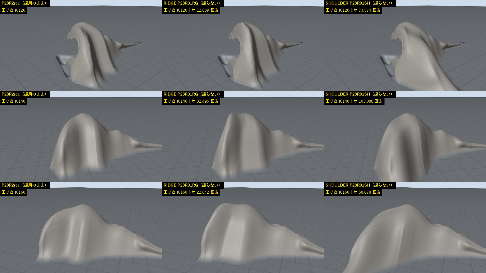
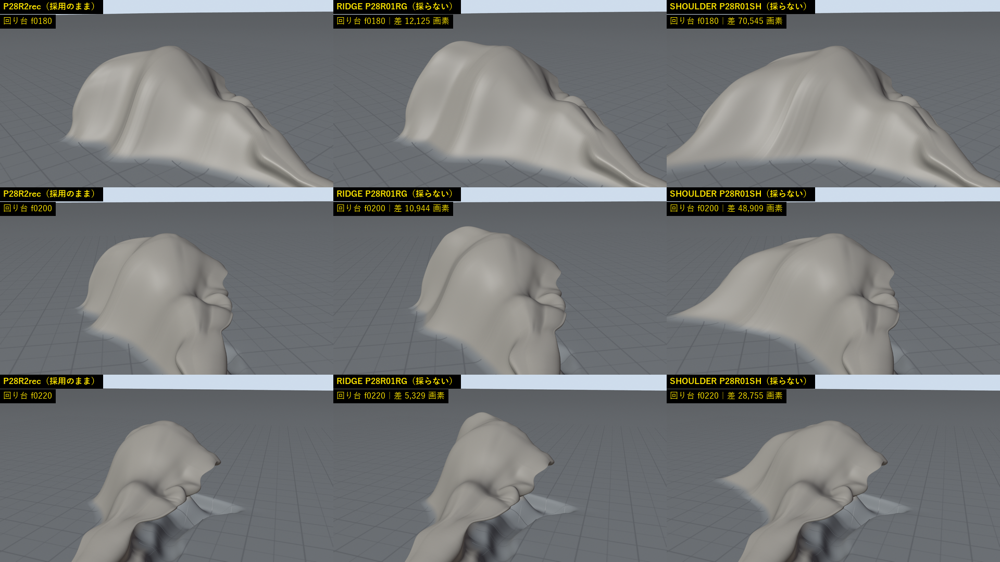
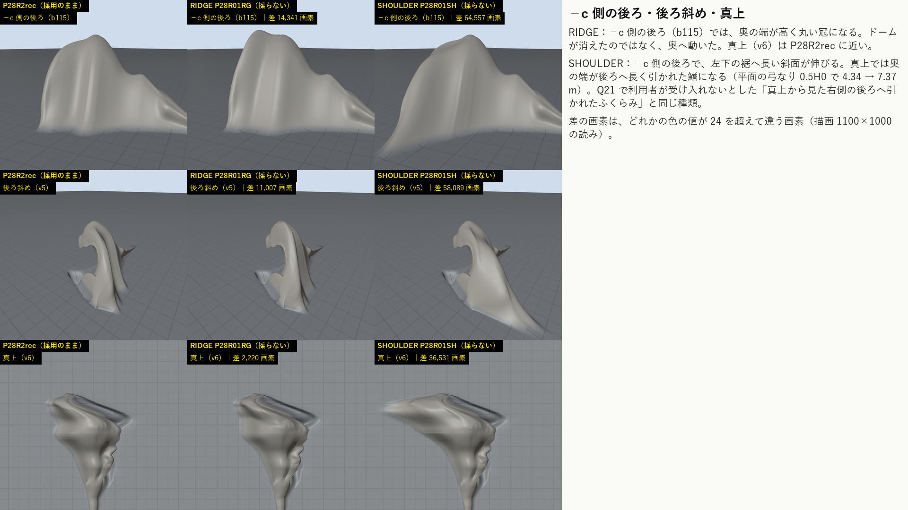
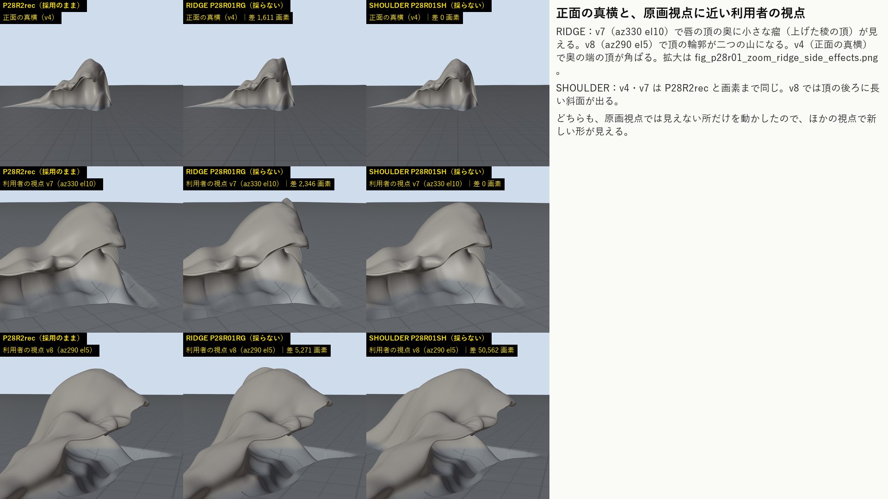
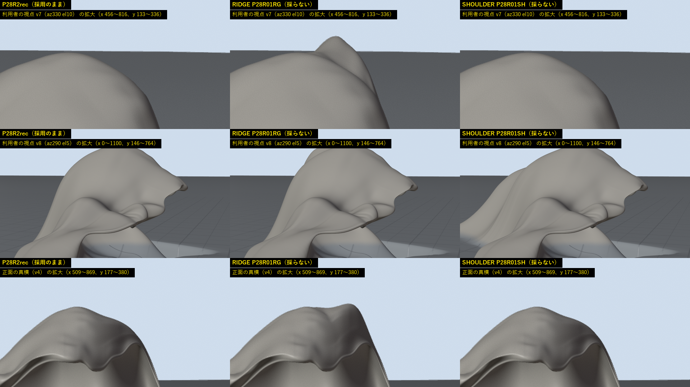
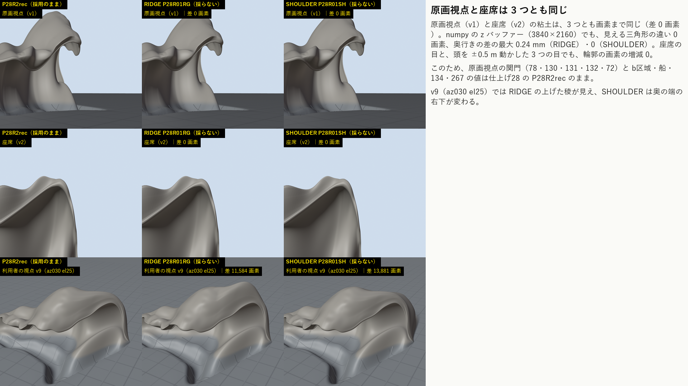
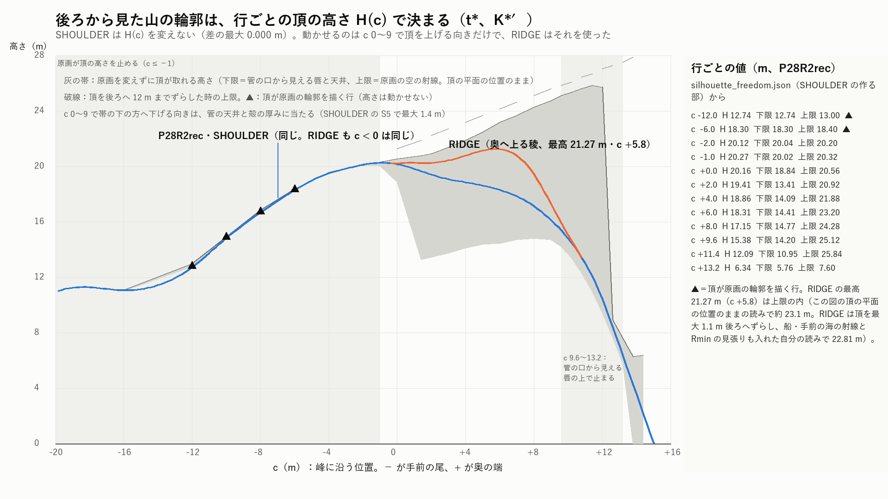

# 仕上げ28修正01：後ろから見たドームのもう一度の試み ― 2 つの案（RIDGE・SHOULDER）のどちらでも、ドームは目で見て消えなかった。どちらも採らず、K\*′ P28R2rec と動き G\_p28rec のままにする

日付：2026-10-01／状態：**達成していない（ドームは消えていない）**。採用の形と動きは変えない。時間枠 1 日（進行役の決定、Q24）に対して約 2 時間。**HMD 実機の結果ではない。利用者は見ていない。** この記録は作る部と評審の記録で、進行役の自己評審（Q24）の前。

**最初に：利用者が「这是无法接受的」（Q21）と書いた、後ろから見た中ほどのふくらみ（ドーム・頭巾）は、まだ消えていない。** 2 つの案を作り、粘土（Blender）の後ろ 65°・その拡大・真後ろ・−c 側の後ろ・後ろ斜め・真上・回り台の 12 コマを、P28R2rec と同じカメラ・同じ t\* で並べて目で見た。

- **RIDGE（K\*′ P28R01RG）**：真後ろでは、中ほどの丸い頂が消え、原画の頂の高さからほぼ平らに続いて奥へ上る稜になった。P28R2rec の c ≈ 0 の縦の溝（深さ 1.73 m）も 0.13 m に浅くなった。しかし計画が閉じる目安に挙げた後ろ 65° では、縦の襞のある大きな頭巾のままで、頭巾の頂が奥の端の尖った角へ移っただけ。回り台の f180・f200 では奥の端が丸い冠になり、f220 では瘤が出る。**ドームは消えたのではなく、奥へ動いた。**
- **SHOULDER（K\*′ P28R01SH）**：頭巾の頭（中ほどの丸い頂）と真後ろの丸い山の輪郭は P28R2rec と同じ。奥の端の縦の壁が長い斜面に変わり、真上からは奥の端が後ろへ長く引かれた鰭になった（Q21 で利用者が受け入れないとした「真上から見た右側の後ろへ引かれたふくらみ」と同じ種類）。

どちらの案も原画視点と座席から見える面を画素まで変えていないので、原画視点の関門の値は仕上げ28 と同じ。評審 2 人（作り手と別）とも、一番良い形を P28R2rec とし、ドームは目で見て消えていないとした。どちらも採らず、仕上げ29 から後の群は作り直しなしで進められる。

| 前後の図：後ろ 65°・その拡大・真後ろ（左 P28R2rec｜中 RIDGE｜右 SHOULDER、同じカメラ・同じ t\*） |
| --- |
|  |

| 回り台の後ろ側 f120〜f160（同じ並び） | 回り台の後ろ側 f180〜f220（同じ並び） |
| --- | --- |
|  |  |

---

## 利用者の言葉（［利用者の言葉］の項目）と、今の判定

採用の状態（K\*′ P28R2rec ＋ G\_p28rec）は仕上げ28 から変わらない。下の表の「RIDGE」「SHOULDER」は、採らなかった 2 つの案の値。

| 利用者の言葉（原文の一部） | 項目 | P28R2rec（採用のまま） | RIDGE | SHOULDER | 判定 |
| --- | --- | --- | --- | --- | --- |
| Q21「这是无法接受的」（中ほどのふくらみ） | 後ろ 65° と回り台でドームが見えない | 頭巾に見える | 真後ろでは稜。後ろ 65° と回り台では頭巾の頂が奥の端へ動いた | 頭巾の頭は同じ。奥の端が斜面と鰭になった | **満たさない** |
| Q21「b区域的大致轮廓位置也应该和原画视角匹配」 | b区域が 3 つの房に読める | 房 1 つ（x 425、際立ち 35.9 px） | 同じ | 同じ | **満たさない（3 つのうち 1 つ）** |
| Q16「横向体积…太厚了」 | F04 ≤ 18.5 m | 27.64 m（0.9H0 で 12.83 m） | 27.78 m（0.9H0 で 18.01 m） | 34.85 m（0.9H0 で 12.83 m） | **満たさない**（SHOULDER は大きく悪化、RIDGE は上の段で太る） |
| Q21「又太单薄了」 | 本体が薄く見えない | 量感の比 1.35 | 1.51 | 2.20 | 満たす |
| Q21「在固定角度应该是海浪的两侧边缘去匹配」 | 78・130・131 と、爪なしの 132・72（σ12）が ≤ 4 px | 2.741／3.582／3.442、132 3.558、72 3.851 px（Unity、仕上げ28） | 同じ（原画視点の面が画素まで同じ） | 同じ | 関門は**満たす**。CP1 への戻しは**満たさない**（130・131 は CP1 より約 1.6 px 悪い） |
| Q17「最上端是一个直角」 | t\* の頂と手前の尾の行が弧 | 手前の尾 123.3°、本体 113.3° | 123.3°、113.4°（本体の Rmin 2.42 → 1.61 m） | 123.3°、114.0° | **満たす** |
| Q20「首先要确保我们的作品美术表现足够惊艳」 | 最後の一コマを「惊艳」まで | ドームが残る | 同じ。新しい瘤と角が増える | 同じ。鰭が増える | **満たさない** |

---

## 0. 結論

1. **ドームは消えなかった（Q21、限界 1 のまま）。** 2 つの案のどちらでも、後ろ 65° と回り台の後ろ側で頭巾の形が残る。評審 2 人の判定も同じ（第 2.3 節）。
2. **RIDGE は採らない。** 真後ろ・−c 側の後ろ・回り台 f160 で中ほどの丸い頂を消した唯一の案だが、頂が奥の端へ動いただけで、後ろ 65° では頭巾の頂が尖った角になる。さらに、原画視点に近い利用者の視点で新しい形が見える（v7 で唇の頂の奥に瘤、v8 で頂の輪郭が二つの山、v4 で奥の端の頂が角ばる）。R6 p99 0.69 → 0.90 m、F04 の 0.9H0 12.83 → 18.01 m、評価基準の必須の否 27 → 28（F04 の最高点の 2 項目が増え、F05 の 1 項目が減る）。採れば動きの当て直しと焼き直しが要るのに、閉じる目安は 1 つも閉じない。
3. **SHOULDER は採らない。** 原画視点から見えない背の殻だけを動かしたので、後ろから見た山の輪郭（頂の高さ H(c)）は 1 mm も変わらず、頭巾の頭も変わらない。真上からは奥の端が後ろへ長い鰭になり（平面の弓なり 0.5H0 で 4.34 → 7.37 m）、横の厚みが Q16 に逆らって増える（F04 27.64 → 34.85 m、|c| ≤ 6 の行の幅 10.35 → 19.76 m、奥 c > 0 の体積 1,888 → 3,575 m³）。必須の否 27 → 30（F03 の 3 項目。AGENTS.md が Q21 で戻さないとした「奥の厚い壁」にあたる）。
4. **ドームが残る理由（SHOULDER の作る部が測った `silhouette_freedom.json`）**：後ろから見た山の輪郭は、行ごとの頂の高さ H(c) で決まる。c ≤ −1 の行は、頂が原画の輪郭を描くか、見える点が頂の 0.25 m 以内にあり、原画の空の射線の天井も頂の 0.1〜0.5 m 上しかない。c 9.6〜13.2 の行は、管の口から唇が見えるので、H はその唇の約 1 m 上で止まる。動かせるのは c 0〜9 で頂を上げる向き（天井 20.6〜24.8 m）だけで、それを使ったのが RIDGE。RIDGE で分かったのは、その向きに上げると頂が奥へ動くだけで、後ろ 65° の頭巾は残ること（第 6 節）。
5. **原画視点と座席は 3 つとも同じ。** numpy の z バッファー（3840×2160）で、見える三角形の違い 0 画素、奥行きの差の最大 0.24 mm（RIDGE）・0（SHOULDER）。座席の目と、頭を ±0.5 m 動かした 3 つの目でも、輪郭の画素の増減 0。粘土の原画視点と座席の画も画素まで同じ。このため関門・b区域・船・134・267 の値は仕上げ28 の P28R2rec のまま。閉じる目安は 7 つのうち 3 つのまま。
6. **採用の状態は変わらない。** 後の群（仕上げ29・30・31・32・33・36・38）の作り直しは、仕上げ28 §10 の一覧のまま。この修正で増えた作り直しはない。

## 1. 範囲・時間枠・実績

- 対象：[計画](../Design/Stage9_Plan_2026-09-26_ja.md) §5.3 の仕上げ28 の［利用者の言葉］Q21 のドームの行（群のバックログの項目は **68〜73、77〜79、130〜134**）。[仕上げ28](Polish_28_ja.md) は §5.1 のとおりドームの修正を 2 回で止め、限界 1 として記録した。その後、進行役が Q24 で、ドームをもう一度だけ試すと決めた（2026-10-01。時間枠 1 日。仕上げ29 の前に行い、後の群が作り直しをしなくて済むようにする）。計画 §5.1 の 3 回目の条件（R6 p99 が −30%）による回ではなく、進行役の決定による追加の回。
- 出発点：仕上げ28 の RAYS の調べ（原画の輪郭 130 の縁のどの点でも、射線の錐の法線が横の斜面の傾き 36〜54° を決め、奥行きをどう選んでも変わらない）と、後ろから見た形を変えた唯一の案 RAYS A5（頂を原画の頂の奥で上げ続け、c ≈ +5.4 まで。原画に見え出すまで 0.7〜4.8 m の余裕）。A5 はドームを上る稜に変えたが、c ≈ −0.5 の縦の溝、c 5.4 の F04 の最高点、F10 の段 0.43 を足した。
- 2 つの案を、別の作り手が 10:09 から並行して作った：SHOULDER 10:09〜10:51、RIDGE 10:09〜11:36。評審 2 人 〜11:42。記録 11:45〜12:10。**時間枠 24 時間に対して約 2 時間。**
- 1 回の計算：形の生成・評価器 kh\_eval（F13 あり）・Blender の粘土の描画は、どれも 1 回数分で、30 分の内（10:09 から 11:36 までの間に、RIDGE は評価器を 4 回、SHOULDER は 2 回回した）。
- 証拠の種類：numpy の形の生成器（`Tools/GWWaveGen/kstar_p28/r01_*`）と評価器（`kstar_h/kh_eval.py`、評価基準 `rubric`）、Blender 5.2.2 の粘土（Workbench。形だけ。作品の色・線・白ではない）、numpy の z バッファー（原画視点・座席）。Houdini Indie 22.0.429 の hython は、候補を読んで見せるシーンを作っただけ（形は作らない。コミットしない）。**Unity の描画・動きの当て直し・焼き込みはしていない**（どちらの案も採らないので）。
- 参照モデル（`G:\research\model\wave_repair_zbrush2.obj`。他者の展示作品のスキャン、作者・所蔵は未確認）は、評価器 `kh_eval.py` が F13 と量感の比べの数値のためだけに、SHA-256 を照合した一時キャッシュで読み、終わりに消した（RIDGE 4 回、SHOULDER 2 回。第 10 節）。生成器は読まない（F13-1）。この記録の道具と評審の数値の道具も読まない。参照モデルを描いた画像はない。
- 計画 §5.1 の［Q28］の審査（座席・左右の側面・背面・上からの視点と回り台を同じ時刻で並べて目で見る）は、形の群なので粘土で行った（座席 v2、正面の真横 v4、峰に沿う横 v3、後ろの 4 視点、真上 v6、回り台）。色は変えていない。
- git の書き込みはしていない。README.md と Docs/Progress/README.md は変えていない。

## 2. 2 つの案と評審

### 2.1 RIDGE（K\*′ P28R01RG）：原画の頂の奥で頂を上げ、上る稜にする

RAYS A5 の考えを、採用の P28R2rec の上で作り直した案（`r01_ridge_build.py`、numpy。参照モデルは読まない）。

- **行ごとの上限**：各行がどこまで上がれるかを二分探索で決めた。条件は、2 つの禁止域（原画の空の射線、3 px。段階9 の船・手前の海の射線。どちらも仕上げ28 の回復の版から）に新しく入らないこと、自己交差しないこと、Rmin が 1.55 m を割らず折れが 11° を超えないこと（c −2.4〜3.2）、奥の行の ±2 m の弦が min(土台, 118°) を割らないこと。上限は c 0.4 で 0.47 m、c 7.0 で 5.8 m。
- **頂の線（背骨）を 3 次元で解く**：箱で縛った最小二乗。平面の線は c −1.2〜9 で最大 1.1 m 後ろへなめらかにずらして余裕を作り、高さは曲率と変化の変化を抑えた単調な回廊の中の上る稜にした。原画の頂で止められた行から稜へ、数 m かけてつなぐ。
- P28R2rec の c ≈ 0 の背の凹み（縦の溝）を後ろから埋めた。行どうしの背のがたつきをならし（列 70 まで。それより上の列は原画視点に見える画素を動かしたので止めた）、奥の背は足を止めてならした。
- 格子 400×240・目印・UV・行の c は同じ。`OPENBLAS_NUM_THREADS=1` で 2 度作り、rows・gwb がバイトまで同じ。
- 試した設計は v2〜v20（`ridge/designs` に 25 個）。高い稜（v10・v17、最高 21.7 m）は稜がはっきりする代わりに角と瘤が大きく、低く丸い v20 を候補にした（作り手の判定）。もう一つ低い版 RGlow（最高 21.24 m、c +6.0、R6 p99 0.907、必須の否 28）も同じ視点で描いた。記録の作り手が並べて見ると、後ろ 65° の尖った角と v7 の瘤は RIDGE と同じに見える。

| 値 | P28R2rec | RIDGE | RAYS A5（仕上げ28 第1回） |
| --- | --- | --- | --- |
| 頂の最高（m、c） | 20.27（c −0.8） | 21.27（c +5.8） | 20.68（c +5.4） |
| 原画の頂の奥の頂の下がり（m） | 1.193 | 0.056 | 0.273 |
| 後ろから見た縦の溝の深さの最大（m） | 1.73 | 0.13 | 0.47 |
| 背骨の曲率の最大（1/m） | 0.40 | 0.35 | 1.03 |
| F10 の高さの段（m） | 0.047 | 0.047 | 0.433 |
| F04 の最高点（H0 の倍、必須 ≤ 1.045 は c −1〜+3） | 1.005（c −0.8） | 1.051（c +5.8）**否** | 1.014（c +5.4） |
| F04 0.9H0（m、上限 9.5） | 12.83 | 18.01 | — |
| F02 Rmin c −5〜+3（m、目標 2.4） | 2.418 | 1.606 | 1.596 |
| 稜の行の頂の弦の最小 c −2〜9 | 137.5° | 120.3° | 116.3° |
| R6 p99（記録のみ） | 0.690 | 0.900（最大 1.493、c +7.0・列 87） | 0.704 |
| 背の楕円の面の割合 | 0.359 | 0.372 | 0.432 |
| 唇の縁の波打ち bump4 p99 | 1.628 | 1.829 | — |
| 平均曲率の極値 | 29 | 31 | 26 |
| 評価基準の必須の否 | 27 | 28 | 31 |

作り手の判定（目で見る）：真後ろ（b90）・−c 側の後ろ（b115）・回り台 f160 では中ほどの丸い頂が消えた。後ろ 65°（b65・b65z）と回り台 f140・f180・f200 では、急な背に縦の襞が残る大きな頭巾で、頭巾の頂が奥の端へ移っただけ。v7 で唇の頂の奥に小さな瘤、v4 で奥の端の頂が角ばる。**ドームは消えていない。**

### 2.2 SHOULDER（K\*′ P28R01SH）：見えない背の殻を後ろへ伸ばし、奥の端の壁を肩にする

P28R2rec から、原画視点から見えない背の殻（列 18〜85）だけを動かした案（`r01_shoulder_build.py`）。錨の列のまわりで水平に (1 + k(c)) 倍に伸ばす。k は c −8 → +12 m で 0 → 2.0 と少しずつ増え、奥の端の 3 m で 0 に戻る。最大の動きは奥の端の足で 22.1 m。

- 原画視点は土台と画素まで同じ（z バッファーは ss1・ss2 とも、波が覆う画素・見える三角形・奥行きの差が 0。設計38 の外殻線も同じで、新しい線は 0 画素）。格子 400×240 の並び・UV・三角形・境の輪はバイトまで同じ。H(c) の差 0。
- 試した案は 13（S1〜S13。`shoulder/final/trials_table.json`）。後ろ 65°・真後ろ・−c 側の後ろ・回り台・9 視点を目で見た：
  - 外へ持ち上げる案（S2）：頭巾が平らな頂の大きな塊になった。
  - 内へ下げる案（S5）：管の天井に当たり、頂が最大 1.4 m しか下がらない。
  - 縦の襞をならす案（S3）：行をまたぐ折れが増え、本体の頂の弦が 104° になって Q17 を割る。
  - 後ろへ強く伸ばす案（S8〜S12）：後ろ 65° と −c 側の後ろで、奥の端の縦の壁が長い斜面（肩）に変わる。
  - それでも中ほどの丸い頂（頭巾の頭）は、どの案でも土台と同じに見える。真後ろの丸い山の輪郭も同じで、S12（＝候補）では左下の裾に暗い凹みが増えた。
- 良くなった所（作り手の読み）：背の傾き 0.9H で 39° → 28°、背の曲率のざらつき 1.35 → 0.79、行をまたぐ折れ > 30°（F11）12 → 4、縦の襞が減って布をかぶせたような見え方が弱まった。
- 悪くなった所：真上からの鰭（平面の弓なり 0.5H0 4.34 → 7.37 m、0.7H0 1.26 → 2.83 m）、F04 27.64 → 34.85 m、|c| ≤ 6 の行の幅 10.35 → 19.76 m、奥 c > 0 の体積 1,888 → 3,575 m³、量感の比 1.35 → 2.20、必須の否 27 → 30（F03：殻の厚み [0.25, 0.69]、背の S 字 2、壁 0.5H/H 0.90）。

作り手の判定：**ドームは消えていない。採用は勧めない。**

### 2.3 評審（2 人。どちらも作り手と別）

| 評審 | 一番良い形 | ドームは目で見て消えたか | 関門 | 主な理由 |
| --- | --- | --- | --- | --- |
| 1（目で見る） | P28R2rec | 消えていない（3 つとも） | P28R2rec の関門は満たす | RIDGE はドームを奥へ動かしただけ（b65 で角、f180・f200 で丸い冠、f220 で瘤）で、v7・v8 に二つ目の山を足す。SHOULDER は頭巾の頭が同じで、真上から鰭（Q21）と F04 34.85 m（Q16）。どちらも「はっきり良い」ではない |
| 2（数値） | P28R2rec | 消えていない | 同じ | 原画視点・座席の不変を確かめ（上の第 0 節の 5）、関門・b区域・F04・F10・Q17・R6 を gwb から読み直した。RIDGE は F04 の最高点の必須を 2 つ割り、Rmin の余裕を減らす。SHOULDER は F04 を +26% にする |

評審 1 の点（0〜10、目で見る。10 ＝ 目安を全部満たす）：

| 形 | 後ろ 65° | 真後ろ・−c 側 | 回り台の後ろ | 原画視点の不変 | 利用者の視点のきれいさ | 横の厚み Q16 | 全体 |
| --- | --- | --- | --- | --- | --- | --- | --- |
| P28R2rec | 2 | 2 | 2 | 10 | 7 | 3 | 4 |
| RIDGE | 3 | 5 | 3 | 10 | 4 | 2 | 4 |
| SHOULDER | 2 | 2 | 1 | 10 | 4 | 0 | 2 |

評審 1 の必ず直すことの一覧（この記録で行った）：① 達成していないことを最初に書く（HMD の結果ではない、利用者は見ていない）。② RIDGE を採らず、10/29 以降の限界に「見つけた唯一の手がかり」として代価とともに書く（第 7 節）。③ SHOULDER を採らず、`silhouette_freedom.json` の結論を書く（第 6 節）。④ ドームを限界 1 のままにし、目で見た証拠を付ける（R6 は目で見るドームを測っていない）。⑤ 候補のフォルダーは Git 対象外のまま残し、生成器は採らなかった試しとして記録した上でコミットする（第 9 節）。

## 3. 見るもの（前後の図）

図は 1920×1080、動画は 5 MB 以下。粘土は Blender の Workbench で形だけ（作品の色・線・白ではない）。3 列は左から P28R2rec（採用のまま）・RIDGE・SHOULDER で、同じカメラ・同じ t\*。「差」はどれかの色の値が 24 を超えて違う画素の数（P28R2rec に対して）。

| 後ろ 65°・その拡大・真後ろ | −c 側の後ろ・後ろ斜め・真上 |
| --- | --- |
|  |  |
| **正面の真横と、原画視点に近い利用者の視点** | **RIDGE が足した形の拡大（v7・v8・v4）** |
|  |  |
| **原画視点と座席は 3 つとも同じ（v9 は違う）** | **頂の高さ H(c) と、原画が許す幅** |
|  |  |

- 回り台の動画（2×2、同じコマ）：[clay\_turntable\_P28R2rec\_RIDGE\_SHOULDER.mp4](../Evidence/Polish/28R01/clay_turntable_P28R2rec_RIDGE_SHOULDER.mp4)。回り台のコマ：[f120〜f160](../Evidence/Polish/28R01/fig_p28r01_ba_turntable_f120_f160.png)・[f180〜f220](../Evidence/Polish/28R01/fig_p28r01_ba_turntable_f180_f220.png)。
- 差の画素（描画 1100×1000）：後ろ 65° RIDGE 21,150・SHOULDER 98,990、真後ろ 14,152・78,397、真上 2,220・36,531、v7 2,346・0、v8 5,271・50,562、v4 1,611・0、v9 11,584・13,881、原画視点 0・0、座席 0・0。回り台（1280×720）は RIDGE 5,329〜32,495、SHOULDER 28,755〜103,088（f120〜f220）。
- 数値：[metrics.json](../Evidence/Polish/28R01/metrics.json)（項目 → 値 → 判定）。実行条件と SHA-256：[run.json](../Evidence/Polish/28R01/run.json)。
- 評審の作業用の並べ図（Git 対象外の `Unity/Build/Polish/28r01/_judge/`）と作り手の並べ図の多くは、1100×1000 の描画を 16:9 に縮めたので横に約 1.6 倍伸びている。証拠の図は縦横比を保って作り直した。記録の作り手が縦横比を保った図で見直しても、判定（3 つとも頭巾のドームが残る、RIDGE は頂が奥の端の角になる、SHOULDER は奥の端が斜面と鰭になる）は同じ。

## 4. 原画視点の関門（t\*、定義どおりの読み）

どちらの案も原画視点で見える面を変えていない（第 0 節の 5）。**Unity の評価器（爪あり・爪なし）は回していない**：見える三角形が画素まで同じで、どちらの案も採らないので、採用の状態の値も変わらない。下の値は仕上げ28 の Unity の読み（P28R2rec）のまま。幾何の読み（gwb を `preview_metrics` と LFGate で読んだ値）は 3 つとも同じ（78／130／131 2.439／3.230／3.355 px、132 σ12 最大 3.790 px、72 σ12 p95 3.682 px）。

| 項目（px） | 基準 | 爪なし／爪あり（P28R2rec ＝ RIDGE ＝ SHOULDER） | 直前の群（仕上げ28 の P28R2rec） | CP1 | 26修正01 | 判定 |
| --- | --- | --- | --- | --- | --- | --- |
| 78 最大 | ≤ 4 | 2.741／2.741 | 同じ | 2.772 | 1.641 | 合格 |
| 130 最大 | ≤ 4 | 3.582／3.582 | 同じ | 1.968 | 1.953 | 合格（CP1 より +1.61） |
| 131 最大 | ≤ 4 | 3.442／3.442 | 同じ | 1.814 | 1.798 | 合格（CP1 より +1.63） |
| 132 大きな輪郭 σ12 最大 | ≤ 4（σ24 の緩めなし） | 3.558／3.558 | 同じ | 1.326 | 1.574 | 合格 |
| 72 大きな輪郭 σ12 p95 | ≤ 4（σ24 の緩めなし） | 3.851／3.570 | 同じ | 1.558 | 1.723 | 合格（余裕 0.149） |
| 73・118・263 | ±0.5 | 2.484 | 同じ | 0.68・0.68・0.40 | 0.655・0.655・0.559 | 合格（28修正01 より +1.83〜+1.93） |
| 77 | 同 | 0.855 | 同じ | 1.21 | 1.17 | 合格 |
| 79 | 同 | 1.017 | 同じ | 0.35 | 0.34 | 合格 |
| 133 | 同 | 0.743 | 同じ | — | — | 合格 |
| 134 | 同 | 7.264（爪あり 2.047） | 同じ | 0.68 | 0.977 | **不合格**（爪なし） |
| 267 白の帯（20 px 以上） | 0 | 6（爪あり 4） | 同じ | 0 | 0 | **不合格** |
| 157 boat\_left（爪なし）p95 | 記録 | 64.90 | 同じ | — | — | 記録（numpy の読みで、船の前へ 1 m 以上出た画素 88、新しく覆う画素 0 は 3 つとも同じ） |

## 5. 閉じる目安（計画 §5.3）

| 目安 | P28R2rec（採用のまま） | RIDGE | SHOULDER | 判定 |
| --- | --- | --- | --- | --- |
| 後ろ 65° と回り台でドームが見えない | 頭巾 | 頭巾の頂が奥の端へ動く（角・冠・瘤） | 頭巾の頭は同じ | **満たさない** |
| b区域が 3 つの房に読める | 房 1 つ（x 425、35.9 px）。帯の上の縁と原画の差 中央値 10.4・p90 22.3・最大 39.4 px | 同じ | 同じ | **満たさない** |
| F04 ≤ 18.5 m で本体が薄く見えない | 27.64 m、量感の比 1.35 | 27.78 m、1.51 | 34.85 m、2.20 | F04 は**満たさない**、薄く見えないは満たす |
| 78・130・131 ≤ 4 px（定義どおり） | 2.741／3.582／3.442 | 同じ | 同じ | 満たす |
| 132・72（爪なし、σ12）≤ 4 px | 3.558／3.851 | 同じ | 同じ | 満たす |
| 134・267 が合格 | 7.264 px、帯 6 | 同じ | 同じ | **満たさない** |
| t\* の頂と手前の尾が弧 | 123.3°・113.3° | 123.3°・113.4° | 123.3°・114.0° | 満たす |

**閉じる目安は 7 つのうち 3 つ（仕上げ28 と同じ）。**

## 6. ドームが残る理由：後ろから見た輪郭は頂の高さ H(c) で決まり、原画がそれを止める


SHOULDER の作る部が、行ごとに「原画視点を変えずに頂がどこまで動けるか」を測った（`r01_shoulder_freedom.py` → `silhouette_freedom.json`。図の灰の帯）。

- **c ≤ −1 の行**：頂が原画の輪郭を描く（c −12〜−6、図の ▲）か、見える点が頂の 0.25 m 以内にある。原画の空の射線の天井も頂の 0.1〜0.5 m 上しかない（例：c −2 で H 20.12 m、天井 20.20 m）。H は動かせない。
- **c 9.6〜13.2 の行**：管の口から唇が見えるので、H はその唇の約 1 m 上（例：c 11.4 で H 12.09 m、見える唇 10.95 m）より下げられない。
- **c 0〜9 の行**：原画が許す下限は 13.2〜18.8 m だが、下げる向きは管の天井と殻の厚みに当たる（SHOULDER の S5 で最大 1.4 m しか下がらない）。上げる余地はある（天井 20.6〜24.8 m）。後ろから見た丸い山を変えられるのは、この行で頂を上げる向きだけ。
- 背の殻だけを変える案（SHOULDER）では H(c) は変わらない（差 0.000 m）。後ろから見た山の輪郭はそのままで、奥の端の壁の形だけが変わる。
- c 0〜9 で頂を上げたのが RIDGE（最高 21.27 m、c +5.8）。後ろ 65° では、上げた稜の頂が奥の端の角になり、奥の端が回り込んで頭巾の印象は残る。高い稜（21.7 m）ほど角と瘤が大きい。

つまり、今の最後の一コマの読み（原画の頂の行と管の口が H を止める）のままでは、後ろから見たドームを消す手が見つからない。仕上げ28 §9 の限界 1 の「消すには、最後の一コマか原画のカメラの読みを変える必要があり、値の詰めでは消えない」は、この修正でも変わらない。この修正で加わったのは、「背の殻だけでは後ろの輪郭は変わらない」と「頂を原画の頂の奥で上げると、ドームは消えずに奥へ動く」の 2 つ。

## 7. 限界（10/29 以降の一覧へ。仕上げ28 §9 を改める所だけ）

1. **後ろから見たドーム（Q21「这是无法接受的」）は限界 1 のまま。** 証拠は目で見た前後の図（第 3 節）。ドームの測りは R6 だけにしない（R6 は目で見るドームを測っていない。P28R2rec・SHOULDER の R6 の最大は b区域のこぶ c −15・列 174、RIDGE は新しい奥の頂 c +7.0・列 87）。
   - **見つけた唯一の手がかり**：原画の頂の奥（c 0〜9）で頂の高さ H(c) を上げる（原画に見え出すまでの余裕 0.7〜4.8 m）。RIDGE で試し、真後ろでは中ほどの丸い頂を消せたが、代価は：後ろ 65° で頂が奥の端の角になる、回り台で奥の端の丸い冠と瘤、利用者の視点 v7・v8・v9 で新しい瘤と二つの山、v4 で角ばる奥の端、F04 0.9H0 12.83 → 18.01 m、F04 の最高点の必須の否 2 つ、Rmin 2.42 → 1.61 m、R6 p99 0.69 → 0.90 m、唇の縁の波打ち 1.63 → 1.83。
   - **背の殻だけでは変わらない**：後ろから見た輪郭は H(c) で決まり、原画が c ≤ −1 と c 9.6〜13.2 で止める（`silhouette_freedom.json`）。背を後ろへ伸ばすと、真上からの鰭（Q21）と横の厚み（Q16）が増える。
   - 次に試すなら：最後の一コマか原画のカメラの読みを変える案（仕上げ28 §9 の限界 1 と同じ）。仕上げ28 と この修正で、値の詰め・形の読みを変える 3 案・見えない所の断面の読み直し・背の殻・頂を原画の頂の奥で上げる向きを試し、どれでも消えなかった。
2. ほかの限界（F04、b区域の 3 つの房、134・267、CP1 への戻し、必須の否 27、M10、F08、bump4、30 Hz の二階差分、物理の関門、唇先の厚さ、縦の襞）は、仕上げ28 §9 の 2〜13 のまま（どちらの案も採らないので値は変わらない）。

## 8. 後の群への影響

採用の形と動きが変わらないので、仕上げ28 §10 の「後の群の最初に作り直すもの」の一覧のまま。この修正で増えたものはない。次の仕上げ29 は、Q28 の指示（原画カメラからの投影の焼き込みをやめ、大波の色と描き方を視点によらない立体の材質に作り直す）を最初の［利用者の言葉］の項目として始める（[制作手順の Q28](../Workflow/Production_Workflow_ja.md#q28大波の色と描き方を原画の投影ではなく立体として作る指示2026-10-01)）。

## 9. 再現とコミット

リポジトリの根で（py -3.10。重い処理は 1 つずつ。全部の命令と SHA-256 は `run.json` と、Git 対象外の `Unity/Build/Polish/28r01/ridge/run.json`・`shoulder/final/run.json`）。

```
# RIDGE
OPENBLAS_NUM_THREADS=1 py -3.10 -B Tools/GWWaveGen/kstar_p28/r01_ridge_build.py build Unity/Build/Polish/28r01/ridge/cand/kstarP28R01RG_a45 Unity/Build/Polish/28r01/ridge/cand/ridge_design.json
py -3.10 -B Tools/GWWaveGen/kstar_p28/r01_ridge_eval.py --out Unity/Build/Polish/28r01/ridge/eval RG=… RGlow=… P28R2rec=… A5=… R4=… Kstar_26R01=…   # kh_eval（F13 あり）
py -3.10 -B Tools/GWWaveGen/kstar_p28/r2_metrics.py <ridge>/final/metrics_dome.json RG=… RGlow=… P28R2rec=… A5=… R4=…
py -3.10 -B Tools/GWWaveGen/kstar_p28/r01_ridge_metrics.py <ridge>/final/metrics_ridge.json （同じ）
py -3.10 -B Tools/GWWaveGen/kstar_p28/rec_band.py <ridge>/final/band.json RG=… P28R2rec=…
py -3.10 -B Tools/GWWaveGen/kstar_p28/rec_score.py <ridge>/final/score.json P28R2rec=… RG=…
blender --background --factory-startup --python-exit-code 1 --python Tools/GWWaveGen/kstar_p28/rays_bl.py -- views <ridge>/renders RG=<gwb>,P28R2rec=<gwb>,A5=<gwb>,RGlow=<gwb> views=all
blender … --python Tools/GWWaveGen/kstar_p28/rays_bl.py -- turntable <gwb> <ridge>/renders/turntable_<label>.mp4 <ridge>/renders/turntable_<label>
py -3.10 -B Tools/GWWaveGen/kstar_p28/r01_ridge_fig.py <ridge>
# SHOULDER
py -3.10 -B Tools/GWWaveGen/kstar_p28/r01_shoulder_build.py <sd>/cand/kstarP28R01SH_a45 <sd>/cand/shoulder_design.json
py -3.10 -B Tools/GWWaveGen/kstar_p28/r01_shoulder_check.py <sd>/final/check_painting_unchanged.json <sd>/cand/kstarP28R01SH_a45_rows.npz
py -3.10 -B Tools/GWWaveGen/kstar_p28/r01_shoulder_freedom.py <sd>/final/silhouette_freedom.json <sd>/cand/kstarP28R01SH_a45_rows.npz
py -3.10 -B Tools/GWWaveGen/kstar_p28/r01_shoulder_eval.py --out <sd>/final/eval P28R01SH=… P28R2rec=… R4=… Kstar_26R01=…
blender … --python Tools/GWWaveGen/kstar_p28/rays_bl.py -- views <sd>/final/renders P28R2rec=…,P28R01SH=… views=all
py -3.10 -B Tools/GWWaveGen/kstar_p28/r01_shoulder_fig.py <sd>
# この記録の証拠（前後の図・H(c) の図・回り台の動画・metrics.json・run.json）
py -3.10 -B Tools/GWWaveGen/pl28/pl28r01_record.py all --start 2026-10-01T10:09 --end <時刻>
```

- 生成は決定的：RIDGE は `OPENBLAS_NUM_THREADS=1` で 2 度作り rows・gwb がバイトまで同じ（並びの BLAS では 17 個の値が 1e-14 m 違い、gwb は同じ）。SHOULDER は同じ設計で 2 度回し rows がバイトまで同じ。記録の道具 `pl28r01_record.py` も 2 度回し、PNG 8 枚と MP4 がバイトまで同じ。
- **コミットの一覧**（git には書いていない）：`Unity/Build/Polish/28r01/commit_list.txt`。この記録、証拠（`Docs/Evidence/Polish/28R01/`）、2 つの案の道具（採らなかった試しとして。`Tools/GWWaveGen/kstar_p28/r01_ridge_*.py`・`r01_shoulder_*.py`）、記録の道具 `Tools/GWWaveGen/pl28/pl28r01_record.py`。32 ファイル、約 6.8 MB、1 ファイル 5 MB を超えるもの 0。依存は `pl28_commit_deps.py` で閉じた（Git が追っていない依存は 0。報告は `Unity/Build/Polish/28r01/commit/commit_deps_report.json`）。禁止の場所の文字列は、Houdini のシーンへの参照モデルの漏れを調べる `r01_ridge_houdini.py`・`r01_shoulder_houdini.py` の中の型だけ（仕上げ28 の `*_houdini.py` と同じ）。
- **コミットしないもの**：候補の形（Git 対象外の `Unity/Build/Polish/28r01/ridge/`・`shoulder/` のまま、手を付けない）、Houdini のシーン `Houdini/Polish28/r01_ridge.hiplc`・`r01_shoulder.hiplc`（採らなかった案。仕上げ28 の採らなかった回のシーンと同じ扱い）、評審の作業用の並べ図と数値の道具（`_judge/`。値は metrics.json に写した）。

## 10. 出典と SHA-256

| もの | 場所 | SHA-256 |
| --- | --- | --- |
| 採用のまま：K\*′ P28R2rec（.gwb） | `Unity/Build/Polish/28/kstar_p28rec/kstarP28R2rec_a45.gwb`（Git 対象外） | `a3bb1c81a79a15b7903729bd845a2d4b2660d3a06a417a218ae66f58eeb01e94` |
| 同（行の npz） | 同じフォルダー | `c55e048d388e41e30289d075089066c481bf2f3b99d84727c655eea9e1a437a3` |
| RIDGE の候補 P28R01RG（.gwb・行の npz） | `Unity/Build/Polish/28r01/ridge/cand/`（Git 対象外） | `5dd82b432086d33d4fc06fd070855f7082dacd8ab4ffdbc55ddb687171af5570`・`6aad476e60ec7555acc5911e8cb6ad7699d88c221d5e9dce12d4b917a47385fc` |
| RIDGE の設計 | `ridge/cand/ridge_design.json` | `a3a69952f04fbdb0c8e25902efd88ddf8a7415efbb9f8c294845ddb4ee598b50` |
| SHOULDER の候補 P28R01SH（.gwb・行の npz） | `Unity/Build/Polish/28r01/shoulder/cand/`（Git 対象外） | `4a37435e1db1a5c668475bcec96c7a07593222be917bdde34b236ba1922123b9`・`25d63411c256f571ad1b8537dc1f3666e6bfe22f17873b452a3301c22628df82` |
| SHOULDER の設計 | `shoulder/cand/shoulder_design.json` | `d06e9e59c31d1b8a822746682ca49c88ee7a4970dcdfb7833017d3af6d67398a` |
| Houdini のシーン（コミットしない） | `Houdini/Polish28/r01_ridge.hiplc`・`r01_shoulder.hiplc` | `2fd31bb9a3432073b3f3ffdababc5b48b4e2798590e263d98d4435c8eaf4386f`・`c2981d2ec41cf1f287486f25d94350bb38b69577545dc3da74c3c0998c337c04` |
| 船・手前の海の禁止域の元（段階9 の t\* の ID 画像） | `Unity/Build/Polish/28/unity/scene_stage9/full/ids_noline_noclaws.png` | `48116bce25c20ceaf2000cb678373136ddc8449760f4a6f64afe2b78787e9921` |
| 原画の空の被覆（空の禁止域） | `Tools/PaintingTruth/targets/masks/sky_envelope_cov.png` | `780626cec4c1be0846c0f6b52b8dc8ce300ae241b1316783c99a6e1806473d41` |
| 設計38 の主役波の線の印（読むだけ） | `Unity/Build/Design/38/outlines/unity/prep/ds38_hero_linemask_f32.bin` | `338032451dcfa0f72f93f7a7e9250f2475148c5fd1d9dfbdaf44f37d0a6574d3` |
| 参照モデル（他者の展示作品のスキャン。作者・所蔵は未確認。評価器の F13 と量感の数値だけ） | `G:\research\model\wave_repair_zbrush2.obj`（読み取りのみ、複製しない） | `AB4124F9720D6E27D80E2AE063916292898C87606A64441043F6A64DE3D53D40` |
| 参照モデルの一時キャッシュ（消した。RIDGE 10:54・11:02・11:14・11:30、SHOULDER 10:45・10:50） | `ridge/_tmp/deleted_caches_sha256.txt`・`shoulder/_tmp/deleted_caches_sha256.txt`（キャッシュのフォルダーは空） | キャッシュ `71b1a952a099f4ac185a769f7c96d38b019eb2390db9349e779537c2133d9ba6` |

- 道具・入力・出力の SHA-256 の全部は [run.json](../Evidence/Polish/28R01/run.json)。

## 11. 出来事

1. 2 つの案は、別の作り手が同じ時刻（10:09）から並行して作った。それぞれの記録では重い numpy は 1 つずつで、MemoryError は出ていない。2 つの案の間で重い処理が同時に走ったかどうかは、記録からは確かめられない（評価器の一時キャッシュを消した時刻は重ならない）。
2. 禁止の場所には触れていない（旧試作・`G:\research` の禁止の場所を読まず、一覧も取っていない。`find /` のような全体をたどる命令は使っていない）。

## 12. 決定の記録（Q24：推奨の案を選び、理由と落とした案を残す）

| 番号 | 決めたこと | 理由 | 落とした案 |
| --- | --- | --- | --- |
| D-P28R01-1 | どちらの案も採らず、K\*′ P28R2rec と G\_p28rec のままにする | 3 つとも目で見てドームが残り、P28R2rec よりはっきり良い案がない（評審 2 人）。RIDGE は奥へ動かしただけで新しい瘤・角と数値の悪化を足し、SHOULDER は後ろの輪郭を変えずに鰭と厚みを足す。採れば動き・焼き込み・後の群の作り直しが要るのに、閉じる目安は 1 つも閉じない | RIDGE を採る、SHOULDER を採る、RGlow を採る |
| D-P28R01-2 | 残りの時間枠（約 22 時間）を使って RIDGE をさらに詰めない | 高い稜（v10・v17。作り手の判定で角と瘤が大きい）も低い稜（RGlow。後ろ 65° の角と v7 の瘤が同じ）も、頂が奥へ動く見え方は同じだった。原因は H(c) の止まり方（第 6 節）で、値の詰めでは変わらない。仕上げ29 の Q28 の作り直しに時間を回す | RIDGE の 2 回目の詰め |
| D-P28R01-3 | Unity の評価器（爪あり・爪なし）を回さず、仕上げ28 の値を書く | 原画視点で見える三角形が画素まで同じ（z バッファーの差 0 画素、奥行きの差の最大 0.24 mm）で、どちらの案も採らない | 採らない案を Unity で描いて測る |
| D-P28R01-4 | 証拠の前後の図を、縦横比を保って作り直した | 評審の作業用の図は横に約 1.6 倍伸びていて、形の証拠に向かない | 評審の図をそのまま写す |
| D-P28R01-5 | 2 つの案の道具は、採らなかった試しとしてコミットする。候補の形・Houdini のシーンはコミットしない | 調べた結論（第 6・7 節）を後で再現できるようにする。シーンは採らなかった案なので仕上げ28 と同じ扱い | 道具もコミットしない |
