# 仕上げ29：設計29 表示用サーフェス ― 主役波の色を、原画カメラからの投影の焼き込みから、視点によらない立体の浮世絵の材質に置き換えた（Q28）。爪は側面・後ろ・真上・回り台で読めず、仕上げ32・33 の限界として送る

日付：2026-10-01／状態：**閉じる目安 8 つのうち 6 つを満たす（一部 1・満たさない 1）。進行役の自己評審の前**。作る部と修正の回（Q28 は［利用者の言葉］なので 2 回目の修正の枠まで使える。計画 §5.1）で修正の枠を使い切り、満たさない所は限界として 10/29 以降へ送る。時間枠 2.5 日（Q28 で 0.5 日から改めた）に対して約 4 時間（第 9 節）。**HMD 実機の結果ではない。利用者は見ていない。** 証拠は Unity 6000.4.3f1 の PC オフスクリーン描画と、Release のプレイヤーを PC で 1 回動かした画。

**最初に（結論）**

1. **原因。** 主役波の色は、原画の色区を原画カメラから面へ投影して焼き込んだものだった。原画視点の外では、見える主役波の画素のうち原画から色を取るのは 9.5% だけで、残りは焼き込みが色を伸ばした外挿の帯（61.1%）と一色の平らな塗り（29.4%）だった。視点を変えると、引き伸ばし・継ぎ目・横の帯・平らな藍の壁が見え、立体の爪は焼いた白い泡に溶けた（第 1 節）。
2. **変えたこと。** 投影の焼き込みをやめ、面の座標（t\* の面の弧長と行）・高さ・面の向き・白の時刻 T\_white だけで色を決める材質（PL29 Ukiyoe Keypose）にした。参照の彫刻の作り（深い藍の胴に流れに沿う溝と明るい藍の線、白い頂と背、立体の白い爪）を手本にし、原画視点でも原画に近づくよう数値を合わせた。爪には視点によらない陰の段と縁の線を付けた。体験の Release は新しい場面 PL29\_Release から作り、PC で 1 回動かした（第 2 節）。コードの点検で、主役波・爪・海の材質の道と Release の exe に原画カメラの投影がないことを確かめた（第 8 節）。
3. **視点ごとの前と後。** 7 視点＋回り台・4 時刻で、引き伸ばし・継ぎ目・外挿の帯・平らな藍の壁は見えない。平らな芯（色の境から遠い一色の所）は、原画視点の外で主役波の 20.2% → 1.0%（第 3 節）。
4. **満たしていないこと。** **爪は原画視点と座席では読めるが、側面・後ろ・真上・回り台では読めない**（爪の造形が小さい。仕上げ32・33 の限界）。原画視点で原画に似るのは一部（白と藍の一致 0.812。投影は 1.000）。F7-1（Q16）の 30 fps の数えは増えた（52,069 → 80,988 px）。t 6 s のうねりは藍の海と分かれにくい（第 10 節）。
5. **後退しないこと。** 原画視点の形の関門（78・130・131・132・72）は仕上げ28 の P28R2rec と同じ値（第 4 節）。色区の項目 73〜270 は投影をやめたので動き、新しい読みで記録した（第 5 節）。バックログ 83・115〜117（座席の射線・継ぎ目）は、採用の形と動きで群の終わりに測り直して 0（第 7.2 節）。

| 前後の図：t 12 s（t\*）、作品のまま（上 2 段：前＝投影の焼き込み、下 2 段：後＝修正の回 p29g） |
| --- |
| 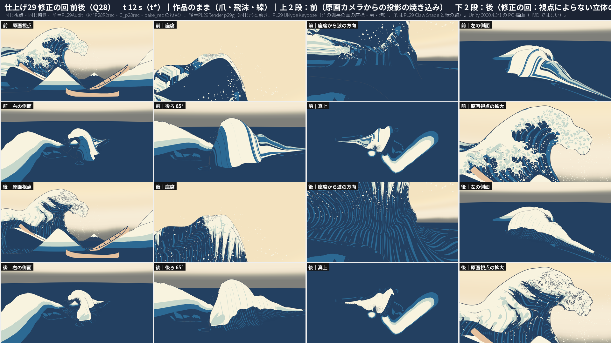 |

| 原画視点 t\*：原画の色区｜投影｜作る部｜修正の回 | 立体の爪（上：作る部、下：修正の回） |
| --- | --- |
| 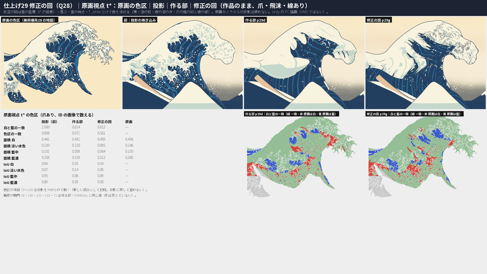 | 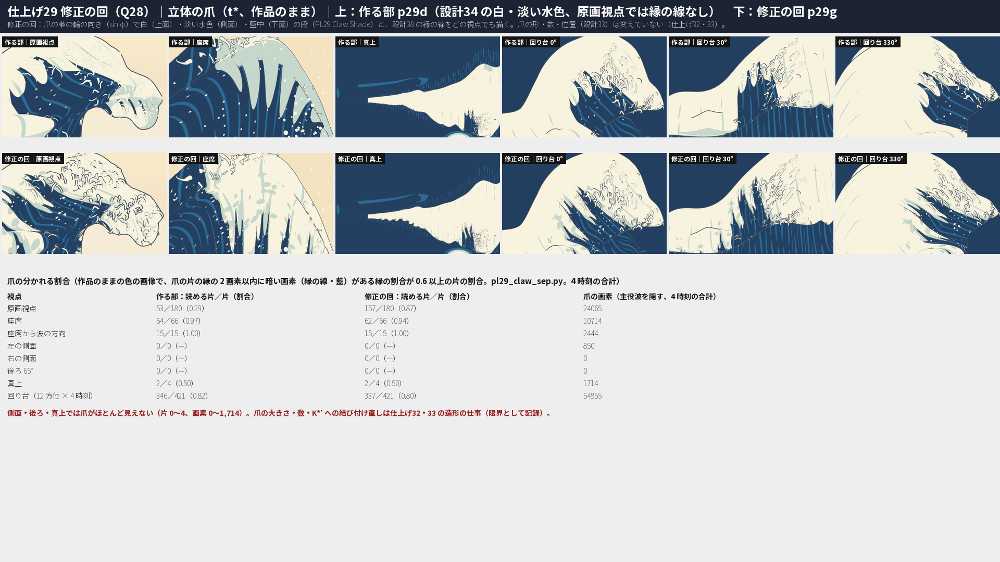 |

---

## 利用者の言葉（［利用者の言葉］の項目）と、今の判定

| 利用者の言葉（原文の一部） | 項目 | 今（修正の回 p29g） | 判定 |
| --- | --- | --- | --- |
| Q28「你现在只是把原画直接贴在你生成的大浪模型上…切换几个视角一看立刻就露陷了」 | 投影の焼き込みをやめ、視点によらない立体の材質にする | 主役波の色・溝・白・房・泡・境の線は、面の座標（t\* の面の弧長）・高さ・面の向き・T\_white だけで決まる。コードの点検は、主役波・海・爪の材質の道と Release の exe の中に原画カメラの投影がないことを確かめた（allPass）。7 視点＋回り台・4 時刻で、投影の破れ（引き伸ばし・継ぎ目・外挿の帯・平らな藍の壁）は見えない | **満たす**（爪の読みは下の行） |
| Q28「这个大浪的3D贴图以及shader效果应该是跟参考模型接近的」 | 参照の彫刻の作り方（深い藍の胴に流れに沿う溝、白い頂・背・唇、立体の白い爪） | 胴は藍濃に流れに沿う藍中の溝（3 次元の間隔 0.95 m、kc で本数を 2 倍ずつ変えて間隔を揃えた）、頂と背と唇は白、前の白の縁は房と泡の舌、爪は白・淡い水色・藍中の段と縁の線 | 満たす（爪の造形は限界） |
| Q28（同じ）「单一方向原画视点看着没问题」の側：原画視点でも原画に似る | 数値を合わせて原画視点で原画に似せる | 白い頂に縁の線の付いた立体の爪、窓の上の縁と b区域の白に房、泡の粒と縁の外の白い点。白と藍の一致 0.812（作る部 0.814、投影 1.000）、色区の一致 0.561（0.571） | **一部**（目で見て作る部より原画の配置と爪の並びに近いが、原画の細かい爪と泡の模様はない。数は作る部とほぼ同じ） |
| Q28（同じ）「切换几个视角」：どの視点でも爪が溶けない | 爪が読める | 原画視点 0.87・座席 0.94・座席から波の方向 1.00（縁の分かれる割合 ≥ 0.6 の片の割合）。側面・後ろ 片 0、真上 2／4、回り台 0.80（作る部 0.82）で、目で見て細い巻き毛 | **満たさない**（側面・後ろ・真上・回り台。仕上げ32・33 の造形の限界） |
| Q16「锯齿感特别严重」の描画の側（F7-1） | t 9〜11.5 s の波頭の模様の 1 コマの揺れ | 焼き込みの座標の原因はない。30 fps の数えは窓 270〜345 で 80,988 px（作る部 55,492、投影 52,069）、90 Hz で 11,849 px／224 コマ（5,411、1,192）。増えた分は細い模様（溝約 3.7 万、点・泡の点・白の中の線 約 3.4 万）の 30 fps の通り過ぎ | **満たさない**（限界。下の第 7.3 節） |

---

## 1. Q28 の原因：主役波の色は、原画カメラからの投影の焼き込みだった

- **作り。** 美術優先28 から 29修正01 まで、主役波の色は、原画の色区（`Tools/PaintingTruth/colour/masks/mw_colour_labels.png`）を原画カメラから K\* の面へ投影し、面の上のテクスチャ（色区の SDF `af28r01_uvsdf_a45.bin`・`af28r01_uvwarp_a45.json`・UV3 の表 `ds29_uv3_f32.bin`）に焼き込んで塗っていた。原画視点では原画と同じ色になる。しかし原画カメラから見えない面や斜めの面には原画の色がないので、焼き込みは同じ行・列の色を伸ばした帯（外挿の帯）と一色の塗り（平らな塗り）で埋めていた。利用者の「把原画直接贴在你生成的大浪模型上」は、この作りを指している。
- **数え方（前の点検、12:05〜12:31。`PL29Audit`）。** 仕上げ28 の採用の形 K\*′ P28R2rec・動き G\_p28rec と、その形へ焼き直した 29修正01 の焼き込み（bake\_rec）を Unity で描いた。新しい診断のシェーダーが、主役波の画素ごとに、焼き込みのどのテクセル（原画からの投影・外挿の帯・平らな塗り）を見ているかを書き出す。描画の原画カメラは焼き込みのカメラと同じで、t\* の原画視点では、投影した位置と画面の位置の差が中央値 0.005 px（p99 0.04 px）。
- **結果（原画視点の外の 71 枚、主役波 3,132 万画素）。** 原画から色を取る画素 **9.5%**、外挿の帯 **61.1%**、平らな塗り **29.4%**。原画から取る所でも、斜めに読んで引き伸ばされた所が主役波の 3.9%。平らな芯（色の境から 48 px より遠い一色の所）20.2%、平らな面 134 個、長い継ぎ目 95 本。立体の爪は、縁の 80% 以上が後ろと同じ色区の片（溶けた爪）が原画視点の外で 509 片のうち 180、原画視点で 174 片のうち 128。段階9 の状態（DS50\_Release が流していた K\*′ R4・F\_final・bake\_kp）でも同じ（9.4%・60.5%・30.2%）。

| 視点（4 時刻） | 原画から色を取る | 外挿の帯 | 平らな塗り | 平らな芯 | 目で見て（前） |
| --- | --- | --- | --- | --- | --- |
| 原画視点 | 70.2% | 14.0% | 15.8% | 1.4% | t\* は原画に似る。原画の枠の外の左端が横縞の帯。白い立体の爪は焼いた白い泡に重なって見えない。t 6・9 s は焼いた模様が形とずれる |
| 座席 | 28.4% | 8.4% | 63.2% | 45.5% | t 10.5・12 s は内壁の大半が平らな藍濃の一色の壁。唇は白と藍の四角が段になる梯子 |
| 座席から波の方向 | 16.2% | 23.7% | 60.1% | 41.4% | 下半分が平らな藍濃の壁。波頭の下に縦の縞、左に横の縞 |
| 左の側面 | 5.5% | 86.2% | 8.3% | 7.6% | ほぼ全部が外挿の帯：波の長さに沿う平行な縞と、白い頂の平らな塊 |
| 右の側面 | 0.8% | 73.3% | 25.8% | 0.7% | 帯と平らな塗りだけ。巻きの内側が一色 |
| 後ろ 65° | 0.02% | 92.9% | 7.1% | 16.6% | 原画の模様が一つもない。白の広い面と縦の縞の帯 |
| 真上 | 11.5% | 60.3% | 28.2% | 2.1% | 帯と平らな塗りが大半。唇の先だけ原画の模様が引き伸ばされる |
| 回り台（12 方位） | 9.3% | 62.6% | 28.1% | 19.2% | 原画視点の近く（0〜30°）でも原画から取るのは 22〜26%。150〜270° は 0〜7% で、白の面と縞の帯だけ |

- 図：`fig_pl29a_before_t060〜t120.png`（7 視点の前と診断）、`fig_pl29a_turntable_t060〜t120.png`、`fig_pl29a_counts.png`（数）、`fig_pl29a_crops_stretch／seam／band／flat／claw.png`（破れの種類ごとの切り抜き）。数は `metrics_audit.json`・`catalogue_audit.json`。

---

## 2. Q28 で変えたこと

1. **投影の焼き込みをやめた（Q28、作る部）。** 主役波は PL29 Ukiyoe Keypose（`Unity/Assets/GreatWave/Polish29/Shaders/PL29_Ukiyoe_Hero.shader`）で描く。色は頂点ごとの面の座標（`Tools/GWWaveGen/pl29/pl29_hero_attr.py` が K\*′ P28R2rec の t\* の格子から作る）・t\* の法線・keypose の位置と法線・T\_white だけで決まり、原画カメラの行列も色区のテクスチャも読まない。形（K\*′ P28R2rec）と動き（G\_p28rec）は仕上げ28 の採用のまま。
2. **修正の回 1 回目（14:22〜15:45）で、作る部の評審の 6 つの指摘に手を入れた**（Q28 は［利用者の言葉］の項目なので、計画 §5.1 の 2 回目の修正の枠を使った）。
   - 爪：視点によらない陰の段（PL29 Claw Shade）と、原画視点でも描く縁の線（PL29ClawShade）。原画視点・座席では読める。側面・後ろ・真上・回り台は造形の限界（仕上げ32・33）。
   - 原画視点の合わせ：前の白の縁を爪の指の房と縁の泡の舌に割り、前の白の大きな淡い水色の板（法線の段）をやめて、房の陰と泡の粒に替え、縁の外に泡の白い点を足した。どれも面の座標の上の形。
   - 唇の先の梯子：t 12 s で 21 片 → 1 片。t 10.5 s は 12 片で変わらない（管の内壁の折り返しに沿う所。淡い点が残る）。
   - Release の道：体験の Release を PL29_Release.unity からビルドする `PL29ReleaseBuild` を作り、`StreamingAssets/gwdata` に採用のデータがあり焼き込みのファイルがないことを確かめ、PC で 1 回動かした（pass、誤り 0）。コードの点検を Release の場面・ビルド・player.log まで広げた。
   - 面の座標の伸び縮み：作る部の記録の「引き伸ばし・継ぎ目・帯は作りから 0」は投影についてだけ言えることだったので直した。面の座標を t\* の面の本当の弧長に作り直し（生成器の中だけの変更）、溝は 3 次元の間隔がいつも約 λ になるようにした（実効の間隔の倍率 p5 0.94・p50 0.97・p95 1.00。作る部 p50 1.11・p95 2.23）。点・粒は管の中で楕円に伸びる所が残る。
   - GPU の時間とメモリを記録した（第 2.7 節）。修正の回の材質は、主役波の面が 2 眼 2064×2208・MSAA 4 で約 0.95 ms（投影 0.49、作る部 0.64。壁時計の見当、RTX 3080、HMD ではない）。

### 2.1 作る部（BUILD）のあらまし

作る部の数と図は `Docs/Evidence/Polish/29/metrics_build.json`・`run_build.json`・`fig_pl29a_*`（前の点検）・`fig_pl29b_*`（作る部の前後）にある。

1. 参照の彫刻（`G:\research\reality scan\北斋参考` の写真。他者の展示作品で、作者と所蔵は未確認。読み取りのみ、数値だけ）と摺りの工程の展示から、材質の数を読んだ：色は白・ごく暗い藍の胴・明るい藍の線の 3 つ。白か藍かは面の向きと高さで決まる（背の境 0.41 H、唇の側 0.24 H）。溝は流れに沿い、間隔 0.050 H、幅／間隔 約 0.25。爪は殻と同じ白一色で輪郭線もなく、読みやすさは光の陰影と後ろの暗い藍との差から来る。原画の色区からは、溝の間隔 0.041〜0.051 H、白の範囲の 33% が淡い水色、胴の白い点 224 個（直径 0.007 H）。
2. 材質 PL29 Ukiyoe Keypose：藍濃の胴に流れに沿う藍中の溝（うねり・切れ・モアレよけ）、背は相対の高さ hrel が境 b(c) より上で白、頂から唇の先の側は流れの座標 F が F\_end(c) まで白、白の中に法線の段の淡い水色と流れの線、白と藍の境に藍の線、胴に紙の白い点。白の時刻 T\_white が来るまでは胴のまま。
3. 爪の色は、設計36 の DS36ClawPalette（原画カメラの投影の表で塗る）を切り、設計34 の白・淡い水色へ戻した。
4. 場面：DS50\_Release.unity・DS30\_SinglePlayback.unity を Polish29 へ写して PL29\_Release.unity・PL29\_SinglePlayback.unity を作り、主役波を K\*′ P28R2rec・G\_p28rec・PL29 の材質にした。
5. 作る部の評審が、上の 6 つを指摘した（爪が読めない、原画視点が原画に似ない、唇の先の梯子の残り、体験の exe が投影のまま、引き伸ばしの記録の誤り、GPU の記録の欠け）。

### 2.2 爪：視点によらない陰の段と、原画視点でも描く縁の線

- **何が原因だったか。** 爪は設計34 の白（上面）・淡い水色（側面と下面）の 2 色の平塗りで、主役波の白い頂の上では白に白が重なる。そのうえ、設計38 の爪の縁の線は「原画視点では焼き込みの色面が線を担う」として、原画のカメラの位置から 5〜10 m 以内では消える作り（`_DS38PaintFade`）だった。仕上げ29 で焼き込みをやめたので、原画視点では爪の縁を描くものがなくなっていた。
- **したこと。**
  - `Unity/Assets/GreatWave/Polish29/Shaders/PL29_Claw_Shade.shader`（新規）：爪の帯の輪の向き sin φ（φ 90° が上＝シートの法線の向き、270° が下面）で、白（sin φ > 0.30）・淡い水色（−0.45〜0.30）・藍中（< −0.45）の段を付ける。段は帯の頂点の値だけで決まり、視点では決まらない（彫刻の白い上面と暗い下面の陰影を平塗りの段に置き換えた）。
  - `Unity/Assets/GreatWave/Polish29/Scripts/PL29ClawShade.cs`（新規）：設計33 の頂点の並び（爪ごとに 根元 1・輪 stations × 8・先 1・根元の白の円 9）から UV2 に sin φ を入れ、爪の材質を PL29\_Claw\_Shade.mat にし、爪の縁の線のレンダラーの MaterialPropertyBlock で `_DS38PaintFade` を 0 にする（原画のカメラからの離れの重みを 1 に。どの視点でも同じ線）。爪の形・軌跡・数（設計33）は変えない。148 本・25,052 頂点のうち、白 10,264・淡い水色 6,004・藍中 8,784 頂点。
- **数（作品のままの色の画像、4 時刻の合計。`pl29_claw_sep.py`）**：爪の片の縁の 2 画素以内に暗い画素（縁の線・藍）がある縁の割合が 0.6 以上の片を「読める」とした（進行役の目安。記録のみ）。

  | 視点 | 作る部 p29d | 修正の回 p29g | 爪の画素（主役波を隠す、4 時刻の合計） |
  | --- | --- | --- | --- |
  | 原画視点 | 53／180（0.29） | **157／180（0.87）** | 24,065 |
  | 座席 | 64／66（0.97） | 62／66（0.94） | 10,714 |
  | 座席から波の方向 | 15／15（1.00） | 15／15（1.00） | 2,444 |
  | 左の側面・右の側面・後ろ 65° | 片 0 | 片 0 | 850・0・0 |
  | 真上 | 2／4（0.50） | 2／4（0.50） | 1,714 |
  | 回り台（12 方位 × 4 時刻） | 346／421（0.82） | 337／421（0.80） | 54,855 |

- **目で見て。** 原画視点では、白い頂の前の爪が縁の線の付いた白い巻きとして並び、爪のリズムが読める（作る部では淡い水色の走り書き）。座席では爪の片が藍の胴の前で白く読める。回り台の 0〜60°・300〜330° では白い頂の上の細い巻き毛（縁の線つき）で、爪の形としては小さい。側面・後ろでは爪は唇の前の下側にあり、頂に隠れてほとんど見えない。真上では小さな点の群れ。
- **判定。** 原画視点・座席・座席から波の方向では読める。**側面・後ろ・真上・回り台では読めない。原因は造形（設計33 の爪は段階9 の K\*′ R4 に結び付けた細い帯で、仕上げ28 の P28R2rec への結び付け直しも、大きさ・数の見直しもまだ）なので、仕上げ32（爪の一覧と K\*′ への結び付け）・仕上げ33（爪の造形：幅・厚み・こぶ）の限界として送る**（第 10 節の限界 1）。
- **記録のみ**：`pl29_after_measure.py` の「溶けた爪」は線なしの ID の画像で数えるので縁の線を数えない。修正の回は前の白の淡い水色の板をやめた（爪の後ろが白）ので、この読みでは溶けた片が 6 → 182／509 に増えた。作品のままの色の画像（線あり）の上の数を正とする。

### 2.3 原画視点の合わせ：房・泡の舌・泡の粒・縁の外の白い点（面の座標だけ）

- **したこと**（`PL29_Ukiyoe_Hero.shader`。数値は `Tools/GWWaveGen/pl29/pl29_material_params.txt`）：
  1. 前の白の終わり F\_end(c) を、原画視点で原画の色区を (c, F) の升ごとに数えた白の割合が半分を切る F に合わせ直した（数値の合わせ。投影ではない。面の座標は弧長の版に替えたので F が動いた）。c −10.5〜−8 の窓 1.38、c −14 2.15、c −12.5 1.75、c −6.8 1.95、c −5〜5 は唇の先を越えて管の天井へ 2.5〜2.55（第 2.4 節）、c ≥ 7 1.95。
  2. 前の白の縁を 2 段の舌に割った：**爪の指の房**（ca に周期 2.8 m、長さ 0.30 F、切れ込み 0.15 F、伸びるほど横へ 4 m／F² 曲がる。幅・中心・長さに不揃い）と、**縁の泡の小さな舌**（周期 0.7 m、長さ 0.06 F）。
  3. **前の白の淡い水色の板をやめた**：法線の段（\_ShadeK −0.35）は背の白（F < 1）だけに使い、前の白の淡い水色は、房の陰（縁から 0.16 F の帯の、房の陰の側 45%）と、**泡の粒**（(s, ca) の上の不規則な粒、格子 1.2 m、縁で 90%、縁から 0.65 F まで）にした。
  4. **縁の外の泡の白い点**（格子 0.55 m、半径 0.11 m、縁で 55%、縁から外へ 0.35 F まで）。
  5. 原画視点の唇の先の白（第 2.4 節）。
- **試しの経過**（`Unity/Build/Polish/29/fix01/w1〜w6`、原画視点の色区の一致の自前の見当）：w1 白と藍の一致 0.800 → w2 0.754（窓が大きすぎ）→ w3 0.770 → w4 0.810（F\_end を升の数で合わせ直し）→ w5 0.810 → w6 0.813（唇の先）。
- **数（原画視点 t\*、爪あり、ID の画像）**：

  | | 投影（前） | 作る部 | 修正の回 | 原画 |
  | --- | --- | --- | --- | --- |
  | 白と藍の一致 | 1.000 | 0.814 | 0.812 | — |
  | 色区の一致 | 0.998 | 0.571 | 0.561 | — |
  | 面積 白／淡い水色／藍中／藍濃 | 0.441／0.130／0.101／0.258 | 0.431／0.120／0.059／0.319 | 0.459／0.095／0.064／0.312 | 0.458／0.148／0.105／0.288 |
  | IoU 白／淡い水色／藍中／藍濃 | 0.96／0.87／0.95／0.89 | 0.55／0.14／0.08／0.39 | 0.54／0.09／0.09／0.38 | — |

- **目で見て。** 作る部の「なめらかな白い鼻先と大きな淡い水色の板と素の藍の窓」は、白い頂に縁の線の付いた爪、窓の上の縁から垂れる房、b区域の白の房と泡の粒、縁の外の白い点になり、原画の配置（白い頂・藍の窓・左下の白い房の塊）と爪の並びに近づいた。しかし原画の細かい爪（巻いた指先）と泡の模様は、房と粒では写らず、b区域の房は縞のように揃って見える所がある。数は作る部とほぼ同じ（淡い水色の面積は板をやめたので 0.120 → 0.095 に減った）。
- **判定。** 一部（目で見て作る部より原画に近い。数は同じ）。

### 2.4 唇の先の梯子

- **原因。** 唇の先のまわりで、前の白の房の切れ込み（藍）が唇の下側へ折り返す所で 1〜2 画素の細い帯になり、その両側に 1.5 画素の境の線が切れ切れに引かれていた。
- **したこと。** ① c −5〜5 の前の白の終わりを管の天井へ（2.25 → 2.5〜2.55）：原画視点からは折り返しの細い帯が白になる。② 房と縁の泡の舌は、切れ込みの幅・深さ・舌の長さが画面で 1〜2.5 画素を切る所では消す（`_FeaturePx`）。③ 白と藍の境の線を、面が視線にほぼ平行な所（|n·v| 0.06〜0.2）で薄める（`_EdgeGrazing`。線は画面の上の太さなので、ここだけ視点の量を使う。色の範囲は視点によらない）。
- **数（原画視点・爪なし、唇の先のまわりの同じ枠の中の、2〜40 画素の離れた暗い成分。`pl29_lip_dashes.py`）**：t 12 s　投影 1 片・15 px／作る部 21 片・91 px／**修正の回 1 片・4 px**。t 10.5 s　5 片・54 px／12 片・62 px／**12 片・58 px**。
- **判定。** t 12 s は消えた。t 10.5 s は数が変わらない（管の内壁の折り返しに沿う短い線の切れと、白の中の淡い灰色の点の列。図 `fig_pl29c_lip.png`）。限界として記録する（第 10 節の限界 4）。

### 2.5 Release の道：体験の exe を PL29\_Release から作る

- **何が問題だったか。** 作る部は Polish29 の場面を作ったが、体験の Release（設計50 の `DS50ReleaseBuild`）は DS49\_Sound.unity を DS50\_Release.unity へ写してビルドするので、出荷の exe の主役波は投影の焼き込み（`Build/Design/31/white/hero_pkg`・`Build/Design/29R01/bake_kp` の uvsdf・uvwarp・ds29\_uv3、DS27\_NPR\_White）のままだった。
- **したこと。**
  - `Unity/Assets/GreatWave/Polish29/Editor/PL29ReleaseBuild.cs`（新規）：PL29\_Release.unity だけをビルドする（設定とデータの写し方は DS50ReleaseBuild と同じ。設計50 のファイルは変えない）。出力 `Unity/Build/Polish/29/release/player/GreatWave50.exe`（Git 対象外）。読み取り専用のデータ（凍結した K\*′）を写した後で消せない件を直した。
  - `PL29Setup.BuildScenes`：爪に PL29ClawShade を付け、主役波の AF26KStarMesh.dataPath に残っていた前の K\* のパス（`Build/Design/29R01/bake_kp/kstar/kstar_a45.gwb`。実行時は meshGwb で上書きされるが、ビルドが焼き込みのフォルダーから写していた）も替えた。
  - `PL29UkiyoeHero`・`PL29ClawShade` が player.log に `PL29_HERO_APPLIED`・`PL29_CLAW_SHADE_APPLIED` を書く。
  - `Tools/GWWaveGen/pl29/run_pl29_player.ps1`（新規。設計50 の run\_ds50\_player.ps1 を写し、exe と出力の場所だけを替えた）。
- **確かめたこと**（`Docs/Evidence/Polish/29/release_build_fix01.json`・`code_check_fix01.json` の release）：
  - ビルドした場面は `Assets/GreatWave/Polish29/Scenes/PL29_Release.unity` だけ。Succeeded、誤り 0。
  - `GreatWave50_Data/StreamingAssets/gwdata` に、`Build/Polish/28/G_p28rec/art_on`（12 ファイル）、`Build/Polish/28/kstar_p28rec/kstarP28R2rec_a45.gwb`、`Build/Polish/28/G_p28rec/timewarp_G_p28rec.json`、`Build/Polish/29/fix01/attr/pl29_hero_attr_f32.bin` がある（作る部の評審が名指しした `Build/Polish/29/after/attr/…` は作る部の面の座標で、修正の回は弧長の版 `fix01/attr` に替えた）。焼き込みのファイル（uvsdf・uvwarp・ds29\_uv3、bake\_kp、31/white/hero\_pkg）は 0（ディスクの上のフォルダーを数えた）。45 ファイル、720,781,821 bytes。
  - PC で 1 回動かした（自動の試し main、`Unity/Build/Polish/29/release/runs/main1`）：pass、誤り 0・例外 0・警告 0、61,686 フレーム・89.75 s、終わりの理由 end\_q、データは gwdata から。player.log に `PL29_HERO_APPLIED … shader=GreatWave/Polish29/PL29 Ukiyoe Keypose sdfPath='' warpPath='' uv3File=''` と `PL29_CLAW_SHADE_APPLIED vertices=25052 … linesEverywhere=True`。capture の走り（capture1、2,525 コマ）の画は `fig_pl29c_release_exe.png`。
  - exe（起動の小さなファイル）の SHA-256 は設計50 と同じ `5be81b3f…`（Unity の起動のファイルは場面によらない）。場面のデータ `GreatWave50_Data/level0` は `dcc86e93…`（設計50 は `2088e9c5…`）。
- **残すもの。** 設計50 の DS50\_Release.unity と `Build/Design/50/release` の exe は、仕上げ29 の前の投影の焼き込みのまま（設計50 の記録のため変えない。コードの点検の recordOnly に名前を出した）。**体験の Release は今後 PL29ReleaseBuild（PL29\_Release）で作る。**

| Release のプレイヤーを PC で動かした画（船の HMD カメラ＝PC の画面） |
| --- |
| 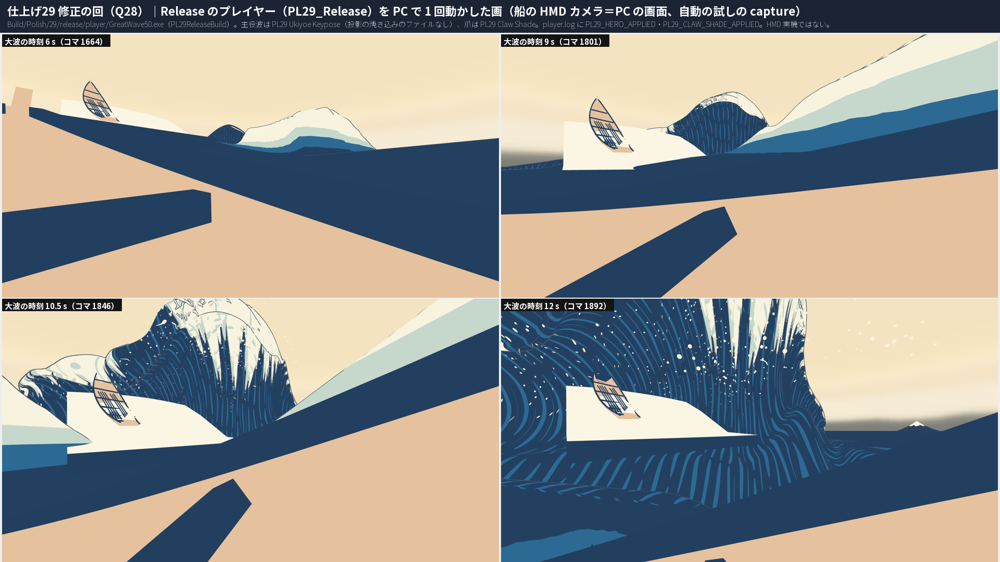 |

### 2.6 面の座標の伸び縮み（記録の直しと、生成器の直し）

- **記録の直し。** 作る部は「引き伸ばし・継ぎ目・外挿の帯は投影の分類による数なので、後の材質では 0」と書いた（`pl29_after_measure.py` の説明、`metrics_build.json` の目の判定）。これは投影の引き伸ばしについてだけ正しい。作る部の材質も、溝・点・舌を UV2 の s（前の K\* の σ）と行の c の上に置いたので、面の座標が 3 次元で伸び縮みする分だけ引き伸ばされていた。作る部の評審の読み：溝の 3 次元の間隔は 0.95 m × 1.21（p50）・× 2.73（p95）、c 5〜15 m の中央値 2.39 倍・2 倍を超える面積 68%、異方性 p95 6.7。進行役の数え（`pl29_stretch.py`、列 j\_B〜j\_E、三角形の面積の重み）：p50 1.11・p95 2.23、c 5〜15 m の p50 1.63・2 倍を超える 33.7%、異方性 p95 9.2（数える範囲と重みが違う）。`pl29_after_measure.py` の説明を直した。
- **生成器の直し**（`pl29_hero_attr.py --param arc`、既定。生成器の中だけの変更。原画カメラは使わない）：
  - s を、行ごとに列に沿って測った t\* の面の本当の弧長 sa にした（頂の列で前の s と同じ値）。流れの座標 F は sa の上で目印の列の間を線形に分ける（余白の外への延ばしは前の傾きのまま）。
  - ca（列ごとに行を渡って測った t\* の面の弧長。主の行 164 で ca = c）を C.w に、kc（行の c の 1 m が t\* の面の上で何 m か＝1/|∇c|）を A.z に入れた（前の A.z の yabs は材質が読んでいなかった）。`--param uv2` は前の版のファイルを同じ SHA-256（`4e2d124b…`）で作り直す。
  - 溝を ca に置くと、列ごとに積んだ ca の向きが行とずれる（ずれ p95 49°、溝の間隔が 0.35 倍まで詰まる）ので、溝は行の c の上に置いたまま、kc で本数を 2 倍ずつ変える（`FlowLines`。kc が 2 倍に近づくと間に新しい溝が細く生まれて太る＝彫刻の Y 字の枝分かれ）。房・点・泡の粒は (sa, ca) の上に置く。
- **数（`Docs/Evidence/Polish/29/stretch_fix01.json`、図 `fig_pl29c_stretch.png`）**：
  - 溝：基の間隔の倍率 p5 1.00・p50 1.10・p95 1.68、間の溝を足した実効の倍率 **p5 0.94・p50 0.97・p95 1.00**（c 5〜15 m の実効 p50 0.96）。作る部は p50 1.11・p95 2.23。
  - 点・房・泡の粒の座標の面積の倍率（3 次元の面積／座標の面積）：作る部 (s, c) p5 0.24・p50 1.28・p95 4.04 → 修正の回 (sa, ca) **p5 0.51・p50 0.96・p95 1.60**。
  - 残る所：(sa, ca) の異方性は p95 9.2 → 17.6（5 倍を超える面積 13.5% → 25.0%、多くは管の中 F ≈ 2.5）。点・粒は管の中で楕円に伸びる（座席から見て小さな楕円の点）。限界として記録する（第 10 節の限界 5）。

### 2.7 GPU の時間とメモリ

方法はどれも作る部の評審（judge\_gpu）と同じ：Editor batchmode、主役波の面だけを残し、t 6〜12 s を等分した 120 コマを RT へ描いて毎コマ 1 画素を読み戻す壁時計の平均を 3 回、主役波あり・なしの中央値の差。**GPU のタイマーではない（壁時計の見当）。RTX 3080。HMD ではない。** 修正の回の数は `PL29Render` の gpu の段（`-pl29Gpu 1`、新規）で測った。

| | 投影（前） | 作る部 p29d | 修正の回 p29g |
| --- | --- | --- | --- |
| 主役波の面、2 眼 2064×2208・MSAA 4 | 0.49 ms | 0.64 ms（+0.15） | **0.95 ms**（+0.46。4 回 0.89・0.95・0.95・1.07） |
| 主役波の面、原画視点 1920×1080・MSAA 8 | 0.28 ms | 0.35 ms | 0.57 ms（4 回 0.26〜0.57） |
| 色区の SDF テクスチャ | 4096×4096 RGBA8（実行時 134 MB） | なし（−134 MB／GPU で約 −64 MiB） | なし |
| 主役波の頂点バッファ | 4.6 MB（stride 48） | 9.2 MB（stride 96、面の座標の UV3〜5） | 9.2 MB（同じ） |
| keypose のバッファ（heroGpuBytes） | 241,344,004 bytes | 同じ | 同じ |
| 爪 | — | — | UV2 の sin φ（25,052 × 8 bytes ≈ 0.2 MB） |

- 修正の回の材質は房・泡の粒（3×3 の格子の近さ）・溝の 2 段を足したので重くなった。最初の版は 2 眼 1.58 ms で、白と藍の画素で計算を分ける枝（微分は枝の外で取る）と、溝の切れ・点の計算を近い方だけにする直しで 0.95 ms にした（画は 6 画素しか変わらない）。
- 判定：記録（PS VR2 の 90 Hz の 1 コマ 11.1 ms のうち、主役波の面の見当は約 1 ms。実機では未検証）。

---

## 3. Q28 の視点ごとの前と後（同じ視点・同じ時刻 t 6・9・10.5・12 s）

前＝前の点検（投影の焼き込み）、後＝修正の回 p29g。どれも Unity の PC オフスクリーン描画（1920×1080）で、作品のまま（爪・飛沫・線）。数は第 1 節と同じ数え方（平らな芯は `pl29_after_measure.py`、爪は `pl29_claw_sep.py`）。視点ごとの図は、上の段が前・次の段が後の 4 時刻で、下に t 12 s を大きく並べた。

| 視点 | 前（投影の焼き込み） | 後（視点によらない立体の材質） | 図 |
| --- | --- | --- | --- |
| 原画視点 | 原画に似る。左端の横縞、溶けた爪 128／174 片 | 白い頂に縁の線の付いた立体の爪、藍の窓の上から垂れる房、b区域の白は房と泡の粒、窓には流れに沿う溝と白い点。横縞・足の縦の筋はない。原画に似るのは**一部**（白と藍の一致 0.812）。爪の縁が分かれる片 0.87 | `fig_pl29_ba_view_painting.png` |
| 座席 | 平らな藍濃の内壁（平らな芯 45.5%）、唇の梯子 | 内側の面いっぱいに流れに沿う溝と白い点、管の天井から白い房が垂れる。平らな芯 0.01%。爪 0.94。t 6・9 s は大波がまだ画面の下の端だけ（前と同じ） | `fig_pl29_ba_view_seat.png` |
| 座席から波の方向 | 平らな藍濃の壁（41.4%）、縦と横の縞、t 10.5 s の引き伸ばしの段 | 溝が流れに沿って走り、足の側でも間隔が揃う。継ぎ目はない。平らな芯 0.01%。周りの海（右の高い波の平らな面、藍中の三角）は変わらない（仕上げ30）。設計38 の外殻線が溝の足の縁に残る（仕上げ38） | `fig_pl29_ba_view_seat_toward_wave.png` |
| 左の側面 | 外挿の帯 86.2%：平行な縞と白い頂の平らな塊 | 白い殻と溝の入った藍の胴、波打つ白の境。外挿の帯はない。爪はほとんど見えない（片 0） | `fig_pl29_ba_view_side_left.png` |
| 右の側面 | 帯と平らな塗りだけ（原画から 0.8%） | 管の端の白い塊と、その下の溝の胴。帯はない。爪は見えない。t 6 s のうねりは溝の入った藍濃で、藍濃の海と分かれにくい（限界 8） | `fig_pl29_ba_view_side_right.png` |
| 後ろ 65° | 原画の模様なし（帯 92.9%）。白の広い面と縦の縞の帯 | 背の白い殻（淡い水色の流れの線と、背の下の法線の段）と溝の入った藍の胴。彫刻の背の白と同じ作り。中ほどのドームは形の限界（仕上げ28）。t 6 s のうねりは藍の海との差が小さい（限界 8） | `fig_pl29_ba_view_back65.png` |
| 真上 | 帯と平らな塗りが大半 | 白い頂の帯と溝の細い縁。**t 10.5 s は白い頂を長く横切る藍の細い筋**（前の白の終わり F\_end(c) の窓の縁が上から見える。限界 9）。爪は小さな点の群れ（片 4・0.50） | `fig_pl29_ba_view_top.png` |
| 回り台（12 方位） | 0〜30° でも原画から 22〜26%、150〜270° は 0〜7% | どの方位も同じ材質で、継ぎ目・帯はない。後ろ側（180〜270°）は白い殻が大きい。t 10.5 s の 270〜330° で背の白を斜めに横切る藍の帯（白の出現の分布。仕上げ31）。爪は白い頂の上の細い巻き毛（0.80） | `fig_pl29c_ba_turntable_t060〜t120.png` |

| 原画視点 | 座席 |
| --- | --- |
| 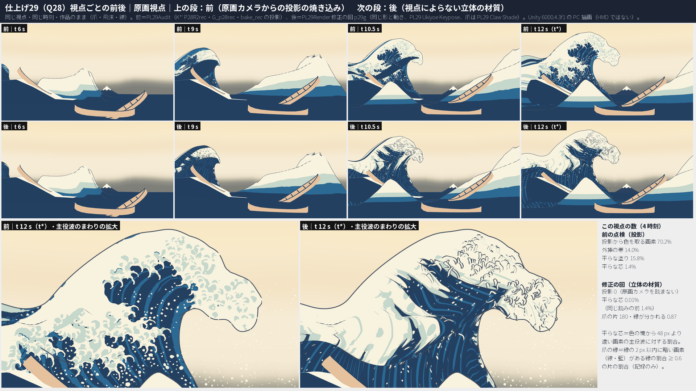 | 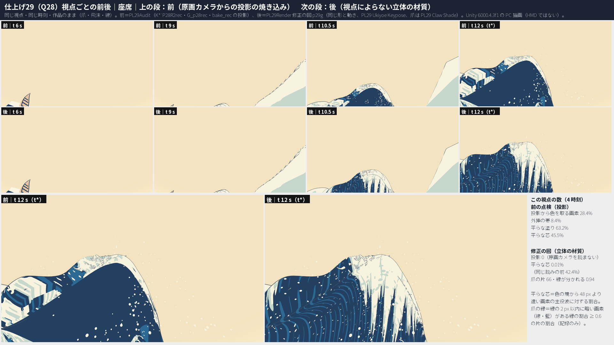 |

| 座席から波の方向 | 左の側面 |
| --- | --- |
| 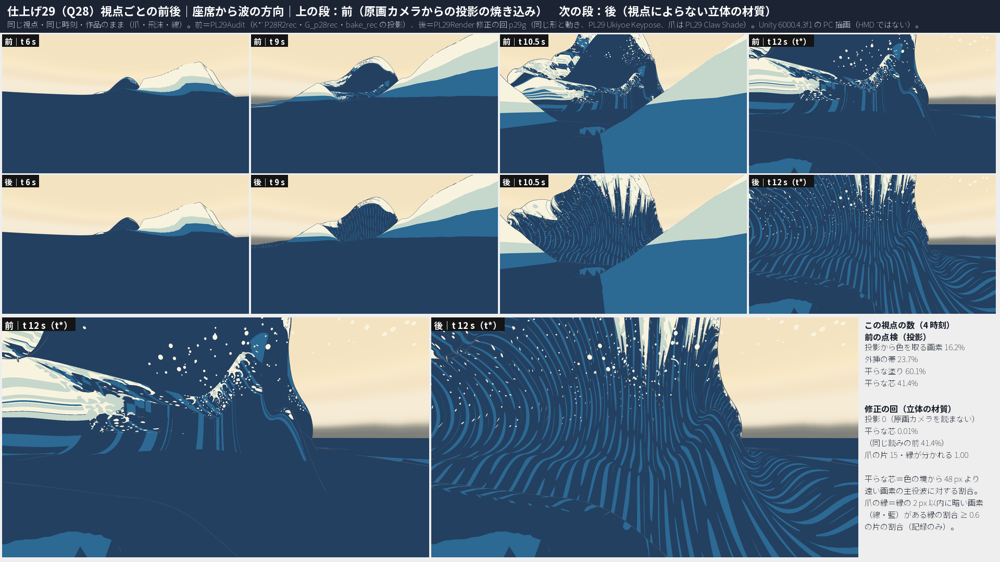 | 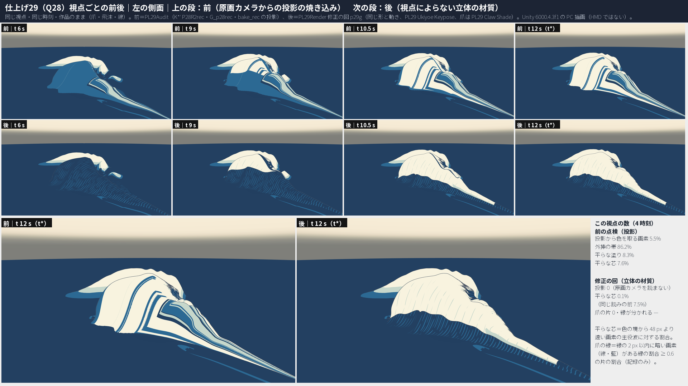 |

| 右の側面 | 後ろ 65° |
| --- | --- |
| 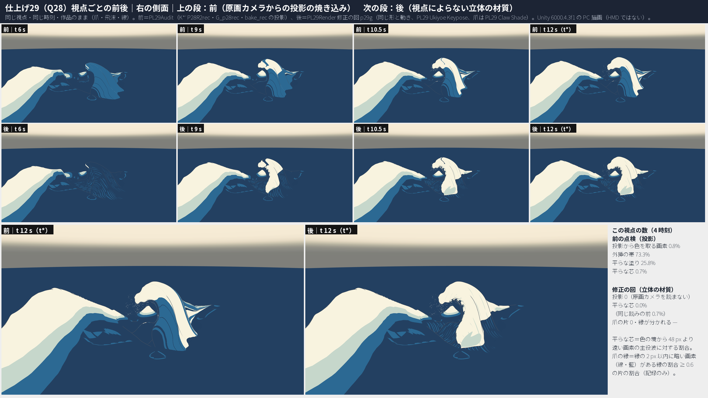 | 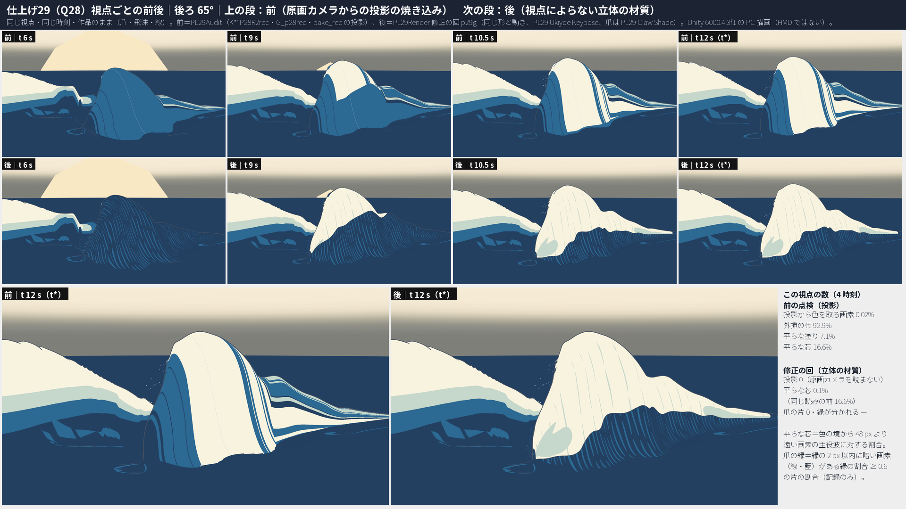 |

| 真上 |
| --- |
| 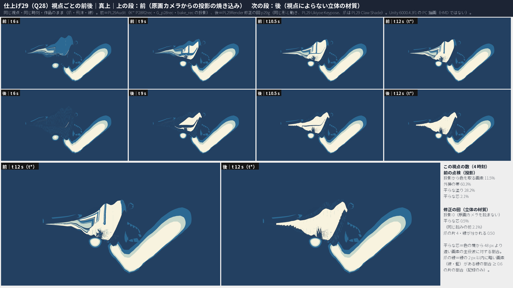 |

### 3.1 時刻ごとの前後の図・回り台・動画

どれも Unity の PC オフスクリーン描画（`Unity/Build/Polish/29/fix01/p29g`、1920×1080）。前＝投影の焼き込み（前の点検 PL29Audit）、後＝修正の回 p29g。同じ視点・同じ時刻（t 6・9・10.5・12 s）。作る部の前後の図は `fig_pl29b_*`。

| t 6 s | t 9 s |
| --- | --- |
| 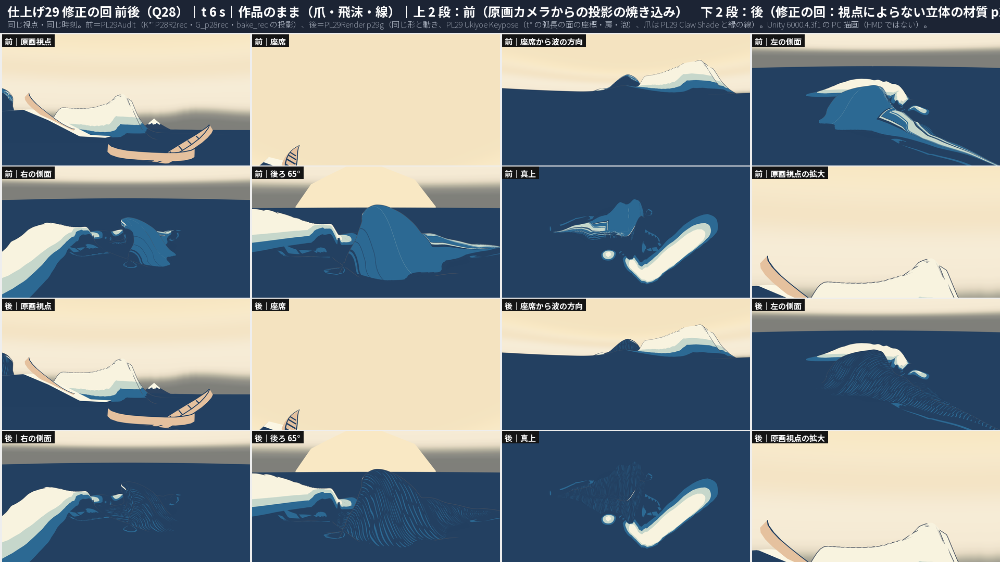 | 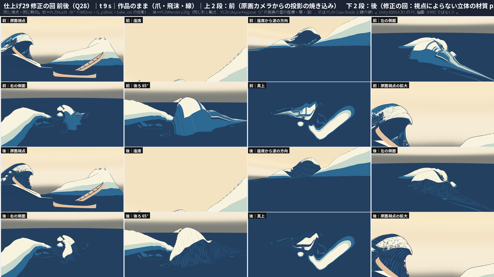 |

| t 10.5 s | t 12 s（爪なし） |
| --- | --- |
| 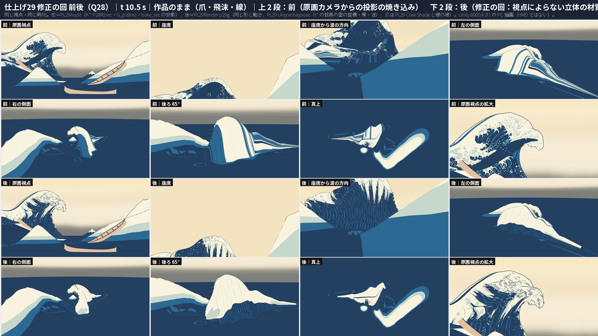 | 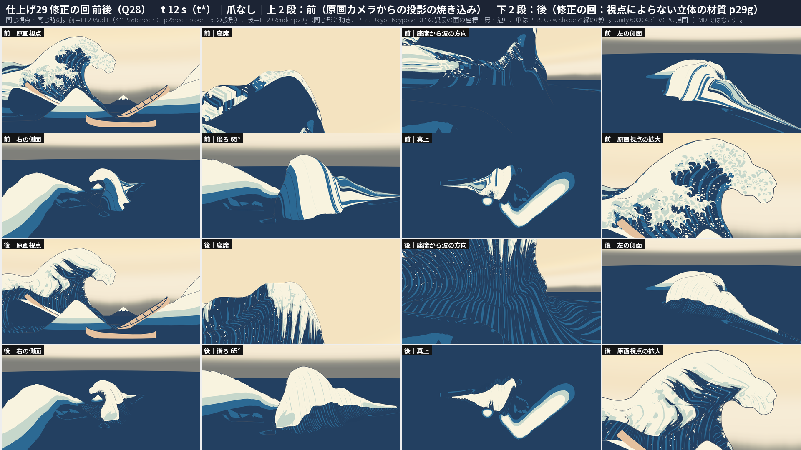 |

| 回り台 t 10.5 s | 回り台 t 12 s |
| --- | --- |
| 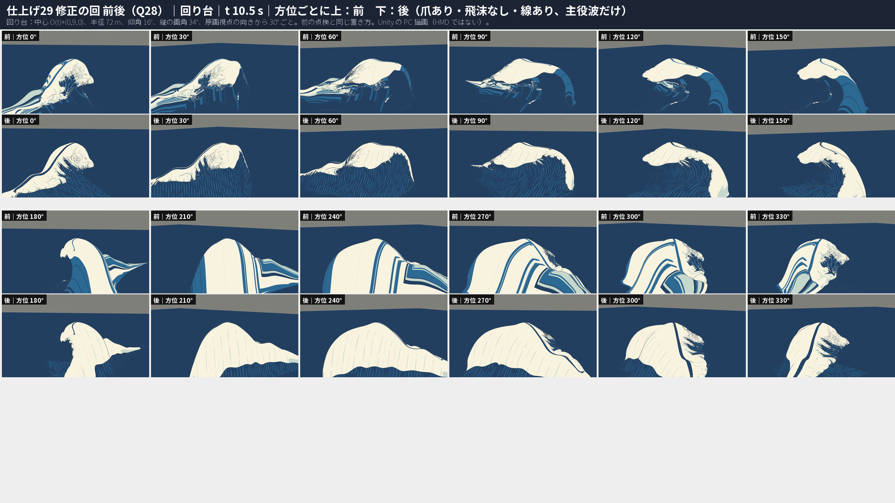 | 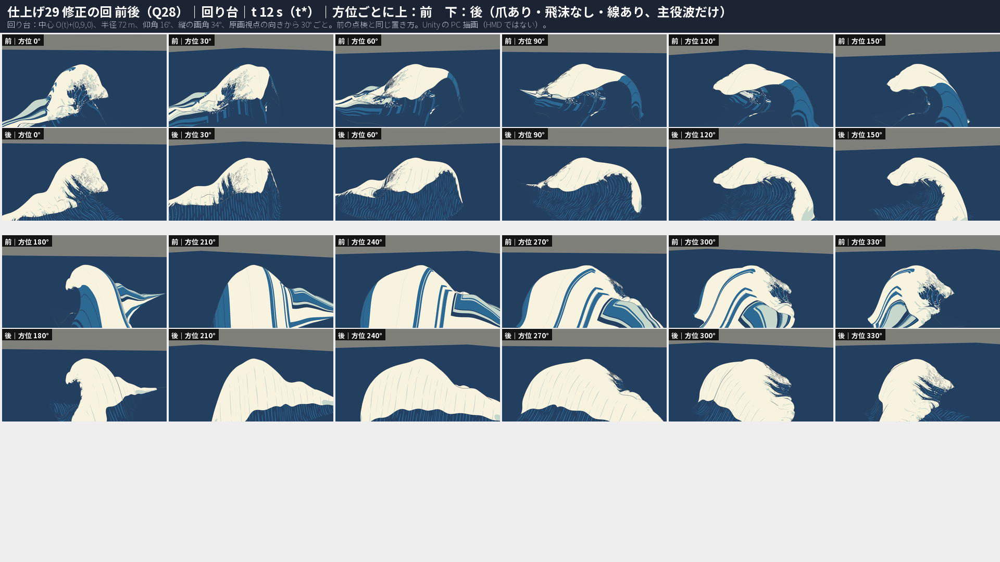 |

| 前の点検の破れの場所の切り抜き（前｜後） | 唇の先（投影｜作る部｜修正の回） | 面の座標の伸び縮み（作る部｜修正の回） |
| --- | --- | --- |
| 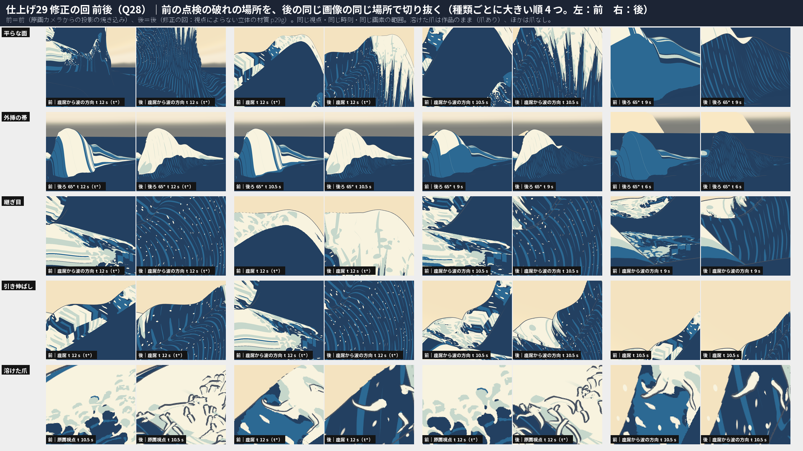 | 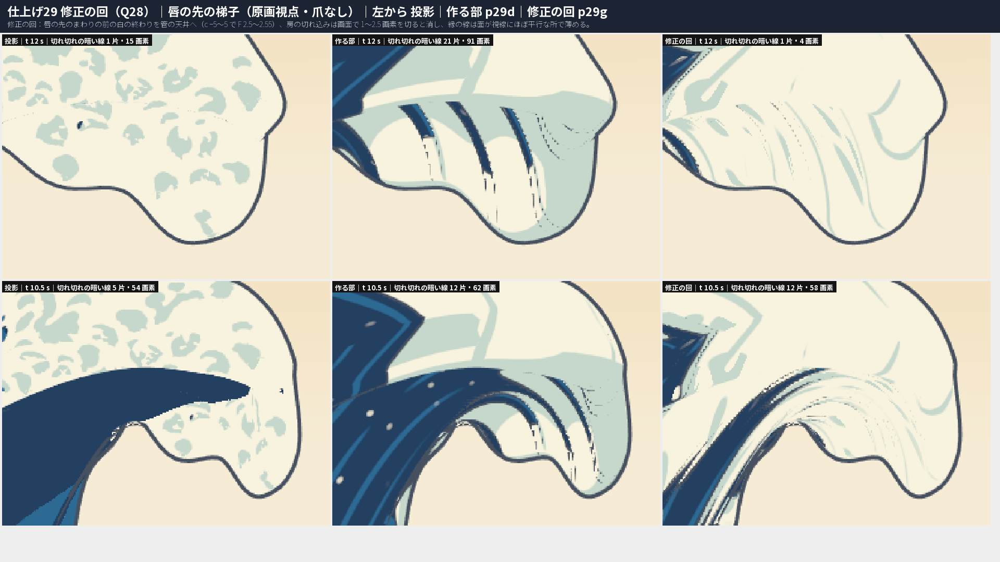 | 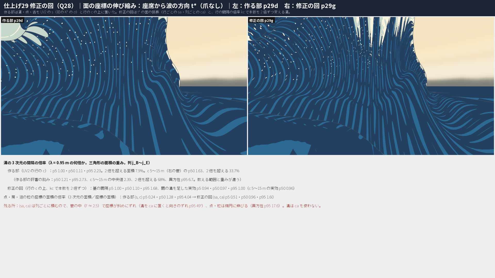 |

- 爪なしの t 6・9・10.5 s と回り台 t 6・9 s：`fig_pl29c_ba_t0x0_clawfree.png`・`fig_pl29c_ba_turntable_t060.png`・`_t090.png`。
- 動画（形成 t 0〜14 s と回り台、投影｜作る部｜修正の回、30 fps）：`pl29c_ba_painting_30fps.mp4`（0.67 MB）・`pl29c_ba_seat_30fps.mp4`（0.30 MB）・`pl29c_ba_tt_30fps.mp4`（0.49 MB）。

**目で見て（7 視点＋回り台、4 時刻）**：

- 原画視点：t\* は白い頂に縁の線の付いた立体の爪、藍の窓の上から房が垂れ、b区域の白は房と泡の粒、窓には流れに沿う溝と紙の白い点、縁の外に泡の白い点。t 6 s は溝の入った藍のふくらみ、t 9〜10.5 s は頂から白が広がる。引き伸ばし・継ぎ目・横縞・足の縦の筋はない。
- 座席：t 10.5・12 s は内側の面いっぱいに流れに沿う溝と白い点、管の天井から白い房が長く垂れる（彫刻の垂れる爪の指に近い）。平らな藍の壁はない。t 6・9 s は大波がまだ画面の下の端だけ。
- 座席から波の方向：溝が流れに沿って走り、足の側でも間隔が揃う（作る部の足の太い帯はなくなった）。継ぎ目はない。右の高い波（周りの海）は平らな 4 段のまま（仕上げ30）。
- 左右の側面：白い殻と、溝の入った藍の胴。外挿の帯はない。爪はほとんど見えない。
- 後ろ 65°：背の白い殻（淡い水色の流れの線と、背の下の方の法線の段）と、溝の入った藍の胴。殻は大きく平らに近い白で、彫刻の背の白と同じ作り（中ほどのドームは仕上げ28 の形の限界）。t 6 s のうねりは溝の入った藍で、藍の海との差が小さい（限界 8）。
- 真上：白い頂と淡い水色の陰、唇の窓の藍に溝、爪は小さな点の群れ。t 10.5 s は白い頂を長く横切る藍の細い筋が見える（限界 9）。
- 回り台：12 方位どれでも同じ材質。継ぎ目・外挿の帯はない。後ろ側（180〜270°）は白の殻が大きい。**t 10.5 s の 270〜330° で、背の白の殻を斜めに横切る藍の帯が見える**（溝つき。作る部も同じ）。白の時刻 T\_white（設計31）がまだ届いていない行の帯で、材質ではなく白の出現の分布によるもの。t 12 s では消える。仕上げ31（白の出現の作り直し）へ送る（第 11 節）。

---

## 4. 原画視点の関門（形）と評価器（爪あり・爪なし、前の群と CP1／26修正01 に対して）

輪郭の関門は形の値で、材質を替えても変わらない（`pl28u_regress.py --kstar rec`、Unity の t\* の画像、定義どおりの読み）。

| 項目 | 修正の回（爪なし／爪あり） | 前の群（仕上げ28 P28R2rec） | 作る部 | CP1 | 26修正01 | 関門 | 判定 |
| --- | --- | --- | --- | --- | --- | --- | --- |
| 78 | 2.741／2.741 | 2.741 | 2.741 | 2.772 | 1.641 | ≤ 4 | 合格（後退なし） |
| 130 | 3.5815／3.5815 | 3.5815 | 3.5815 | 1.968 | 1.953 | ≤ 4 | 合格（後退なし。CP1 より 1.6 px 悪いのは仕上げ28 のまま） |
| 131 | 3.4419／3.4419 | 3.4419 | 3.4419 | 1.814 | 1.798 | ≤ 4 | 合格（同上） |
| 132（σ12 最大） | 3.5576／3.5576 | 3.5576 | 3.5576 | 1.326 | 1.574 | ≤ 4 | 合格（後退なし） |
| 72（σ12 p95） | 3.8507／3.5698 | 3.8507／3.5698 | 同じ | 1.558 | 1.723 | ≤ 4 | 合格（後退なし） |

- 評価器 23（`Tools/PaintingTruth/evaluate.py`、4 組）：線なし（爪あり・爪なし）合格 4・不合格 5、線あり（爪あり・爪なし）合格 1・不合格 8。仕上げ28 rec・作る部と同じ（合否の変わった項目なし）。
- 爪ありの 132・72（細部込み）は 45.0・38.8 px で記録のみ（仕上げ33 で閉じる。仕上げ28 と同じ）。

---

## 5. 色区の項目（新しい読み。投影に戻して追わない）

原画の色区の境と描画の色区の境の距離（t28\_white、px）。投影をやめたので値が大きく動き、ほとんど不合格になる（Q28 の読み）。

| 項目 | 仕上げ28 rec（投影） | 作る部 | 修正の回 |
| --- | --- | --- | --- |
| 73・118・120 | 2.484・2.484・0.288 | 184.85 | **62.73** |
| 77 | 0.855 | 49.76 | 45.14 |
| 79 | 1.017 | 63.13 | 64.91 |
| 133 | 0.743 | 49.54 | 43.21 |
| 134 | 7.264 | 55.91 | 41.10 |
| 175 | 18.401 | 231.35 | 240.59 |
| 263 | 2.484 | 31.04 | 27.52 |
| 270 | 0.951 | 55.15 | 46.56 |
| 265（ΔE00） | 0.545 | 14.22 | 13.97 |
| 267 の帯（原画視点・座席・低い座席） | 6・0・0 | 79・0・0 | 101・6・2 |

---

## 6. 閉じる目安（計画 §5.3 仕上げ29 ＋ §5.1 の Q28 の規則）

| 閉じる目安 | 今 | 判定 |
| --- | --- | --- |
| 原画視点・座席・座席から波の方向・左右の側面・後ろ・真上・回り台、t 6・9・10.5・12 s で、色面の引き伸ばしがない（目で見て） | 投影の引き伸ばしはない。溝の間隔は揃った（実効 0.94〜1.00 倍）。管の中の点・粒が小さな楕円に伸びる | 満たす（楕円の点は限界 5 として記録） |
| 同じく、継ぎ目がない | 見えない（切り抜きの図でも） | 満たす |
| 同じく、平らな特徴のない壁がない | 平らな面（芯 > 48 px、≥ 2,000 px）は原画視点の外で 28 個・主役波の画素の 1.0%（作る部 41 個・2.2%、投影 134 個・20.2%）。残るのは背の大きな白い殻（細い流れの線つき） | 満たす（背の白い殻は彫刻と同じ作り） |
| 同じく、爪が読める | 原画視点・座席では読める。側面・後ろ・真上・回り台では読めない | **満たさない**（限界 1、仕上げ32・33） |
| 原画視点の形の関門（78・130・131 の定義、132・72 σ12）が後退しない | 第 4 節のとおり同じ値 | 満たす |
| 色区の項目 73〜270 を新しい読みで測り直して記録する | 第 5 節 | 満たす |
| コードの点検で、主役波・海の材質の道に原画カメラの投影がないことを示す | `code_check_fix01.json` allPass（主役波・爪・海・場面 2 つ・Play モード 2 つ・Release のビルドと exe） | 満たす |
| 原画視点でも原画に似る（Q28「把材质的数值调到原画视角仍像原画」） | 目で見て作る部より近い。数はほぼ同じ | **一部** |

**8 つのうち 6 つを満たす。一部 1（原画視点で原画に似ること）、満たさない 1（爪の読み：側面・後ろ・真上・回り台）。** ほかに、［利用者の言葉］Q16 の F7-1（第 7.3 節）は満たさない。

---

## 7. 仕上げ29 のほかの項目（計画 §5.3 の各行・バックログ 83・115〜117・F7-1）

### 7.1 計画 §5.3 の各行

| 行 | 今 | 判定 |
| --- | --- | --- |
| ［利用者の言葉］Q28 | 第 1〜6 節 | 一部（上の表） |
| ［利用者の言葉］Q16 F7-1 の描画の側 | 焼き込みの座標の原因はない。30 fps・90 Hz の数えは細い模様の動きで増えた（第 7.3 節） | 満たさない（限界 2） |
| 色の焼き込みの傷：唇の端の梯子・モアレ | 梯子は t 12 s で消え、t 10.5 s は管の内壁の折り返しに少し残る。モアレは溝の周期が 3〜6 画素で消える | 一部（限界 4） |
| 縦の継ぎ目、前面の足の縦の筋、原画視点の左端の横縞 | 投影と外挿の帯から来ていたので消えた | 消えた |
| 座席から波の方向のコマ 330〜420 の継ぎ目に沿う線 | 線は設計38 の外殻線で、材質では消えない。足に溝が入り、暗い海を横切る線には見えにくい | 一部（線は仕上げ38） |
| 座席の見えない内壁の平らな藍濃と、左の横の外挿の帯 | 溝と白い点の入った藍になり、外挿の帯はない | 消えた |
| 行 234〜239 の張り直し（HMD で見えた時だけ） | HMD はまだない | 保留（HMD） |
| 軽量版を作り直す | 新しい材質は UV3 の表を使わないので UV3 の作り直しは要らない。軽量版の格子に面の座標を付ける作業はしていない | 未（限界 6） |
| 仕上げ28 で形が変わっていれば最初に焼き直す | 焼き込みをやめたので、面の座標を K\*′ P28R2rec の t\* から作り直した（`fix01/attr`） | 済 |
| 周りの海のシートを主役波と揃える | near・far は設計36 の t\* の高さの 4 段（投影なし）のまま、調色板は主役波の材質から写す。溝・白い殻を足すのは仕上げ30 の作業（順番を守る） | 一部（仕上げ30） |

### 7.2 バックログ 83・115〜117：座席の射線と継ぎ目（群の終わりに、採用の形と動きで測り直した）

- 仕上げ28 の記録（`Polish_28_ja.md` の「後の群へ」の仕上げ29 の行）は、`ds29r01_measure` の座席の射線を G\_p28rec で回し直すことを仕上げ29 へ送っていた。作る部と修正の回は回していなかったので、記録の部で回した。材質の置き換えは網を変えないので、形と動き（K\*′ P28R2rec・G\_p28rec、精度の層つき）の検査になる。
- `py -3.10 -B Tools/GWWaveGen/ds29r01/ds29r01_measure.py qa --kstar Unity/Build/Polish/28/kstar_p28rec --package G_p28rec=Unity/Build/Polish/28/G_p28rec/art_on --out <repo>/Unity/Build/Polish/29/record/qa_G_p28rec`（Blender 5.2.2 の射線 5 万本 × 36 コマ、78 s。出力は Git 対象外。数は `metrics.json` の `seat_ray_qa_G_p28rec`）。

| 項目 | しきい値 | 値 | 判定 |
| --- | --- | --- | --- |
| 座席 v1 の射線：穴（83・115・116） | 0 | 0 | 合格（事前検査。判定は番号41） |
| 座席 v1 の射線：開いた背面 | 0 | 0 | 合格（同上） |
| 座席 v1 の射線：t\* の切断端・縁の下のすき間 | 0 | 0 | 合格（同上） |
| 座席 v1 の射線：継ぎ目の切断（117） | 0 | 0 | 合格（原版） |
| 縁の輪（継ぎ目・穴）・非多様体の辺・3 次元の自己交差 | 0 | 0・0・0 | 合格 |
| t\* より前の外周の切断端／縁の下（記録） | 記録 | 28,183／1,375 | 記録（周りの海とのつなぎ。設計30） |

- 117 の軽量版（間引きの格子）は作り直していない（限界 6）。
- 同じ検査の形の項目は、この群の項目ではなく、仕上げ28 の記録と同じ値（隣と逆向きの面 77、唇先の厚さの最小 0.041 m、30 Hz の地面の二階差分 0.0720 m、行の方向の辺の最短 0.0029 m、行の方向の伸び 0.011／2.348 は不合格のまま。仕上げ28 の限界）。

### 7.3 F7-1（t 9〜11.5 s の波頭の模様の 1 コマの揺れ）

数え方は段階7確認・仕上げ28・作る部と同じ（`pl28_f71_count.py --kind pngseq`、爪なし・飛沫なし・線あり、無圧縮の PNG）。

| | 30 fps 窓 270〜345 の M1b の和（1 コマの最大） | 30 fps の 20 画素以上の塊 | 90 Hz の M1b の和／224 コマ（1 コマの最大） |
| --- | --- | --- | --- |
| 投影（前） | 52,069（1,643） | 306 | 1,192（25） |
| 作る部 p29d | 55,492（1,289） | 600 | 5,411（61） |
| **修正の回 p29g** | **80,988（1,815）** | 798 | **11,849（141）** |

切り分け（修正の回の数値から 1 つずつ切った試し、30 fps 窓 270〜345）：縁の泡の舌なし 85,705、縁の外の白い点なし 85,783、泡の粒なし 82,049、房なし 91,424、**溝なし 44,083**、溝・点・白の中の線なし 10,184。増えた分の多くは、溝（約 3.7 万）と、点・縁の外の点・白の中の線（約 3.4 万）の、30 fps での細い模様の通り過ぎで、模様の座標の跳びではない（材質は面に付いて動く）。90 Hz では 1 コマあたり 53 画素。

判定：満たさない（限界 2）。細い模様を減らせば数は減るが、Q28 の溝・点（彫刻と原画の作り）を消すことになるので、この回では採らない。PS VR2 の 90／120 Hz で目で見て決める（HMD の保留）。

---

## 8. コードの点検（`Docs/Evidence/Polish/29/code_check_fix01.json`、allPass）

`Tools/GWWaveGen/pl29/pl29_code_check.py` を修正の回で広げた。

1. 主役波のシェーダー：テクスチャ・原画カメラの行列・焼き込みの UV3（TEXCOORD2）を読まない。クリップ座標は表示中のカメラの UnityWorldToClipPos だけ。`_WorldSpaceCameraPos` は境の線を面が視線にほぼ平行な所で薄める 1 行だけ（新しい確かめ）。
2. PL29UkiyoeHero.cs：焼き込みのパスを書かない・読み込まない（player.log へ値を出す読みだけ）。
3. 面の座標の生成器：入力は K\*′ の .gwb と meta だけ。
4. 場面 2 つ：主役波の sdfPath・warpPath・uv3File が空、材質が PL29、PL29UkiyoeHero が付く、DS36ClawPalette が切ってある。**爪に PL29ClawShade（材質 PL29\_Claw\_Shade、縁の線をどの視点でも）が付く。焼き込みのファイルの名前が場面にない**（新しい確かめ。PL29\_SinglePlayback の周りの海の 2 枚は、色の表が空の平塗りで、uv3File の `ds29_uv3_f32.bin` は使われない残りとして別に記録）。
5. 材質：シェーダーが PL29、テクスチャの欄が空。
6. 周りの海：設計36 の色の表は t\* の高さだけから作り、原画の色区もカメラも読まない。
7. 実行の記録：PL29Render の報告と Play モード 2 つ（修正の回の場面で撮り直した。PL29\_SinglePlayback 815 行・PL29\_Release 6,732 行、全コマ PL29 のシェーダー・焼き込みのパスが空）。
8. **爪の材質**（新規）：PL29\_Claw\_Shade.shader はテクスチャ・原画カメラ・カメラの位置を読まず、クリップ座標は UnityObjectToClipPos だけ。PL29ClawShade.cs はカメラを読まず、`_DS38PaintFade` を 0 にするだけ。
9. **Release のビルドと exe**（新規）：第 2.5 節の確かめ。
10. 記録のみ：設計38 の主役波の線の印（原画視点で原画にない線を描かない頂点の印 `ds38_hero_linemask_f32.bin` と押し下げの重み）は、線の見える・見えないの決まりで、材質ではない（仕上げ38）。設計36 の爪の投影の表は Polish29 の場面では切った（ファイルは Release のデータに写るが、使われない）。設計50 の DS50\_Release.unity は投影のまま（第 2.5 節）。

記録の部で同じ引数で回し直し（`Unity/Build/Polish/29/record/codecheck/code_check.json`）、allPass で、`code_check_fix01.json` と鍵ごとに同じだった。

- 記録のみ：`Unity/Assets/GreatWave/Polish29/Shaders/PL29_HeroDiag.shader`（`Hidden/…`）は、前の点検（`PL29Audit`）が焼き込みのテクセルと原画カメラの投影の位置を書き出すための診断のシェーダーで、投影を読むのが目的。Editor の道具だけが一時的に使い、場面・材質・Release のビルドからは参照されない（場面と材質に GUID なし）。材質の道の外。

---

## 9. 範囲・時間枠・実績

- 群：仕上げ29（設計29 表示用サーフェス）。バックログ項目 83、115〜117。時間枠 2.5 日（計画 §5.2。Q28 で 0.5 日から改めた）。
- 最初の項目：Q28（利用者の言葉。[制作手順のQ28](../Workflow/Production_Workflow_ja.md#q28大波の色と描き方を原画の投影ではなく立体として作る指示2026-10-01)）。
- 実績（2026-10-01）：
  - 調べ（参照の彫刻と摺りの工程の数値）12:05〜12:25、前の点検（投影の破れの数え）〜12:31、作る部 12:33〜14:02。
  - 修正の回 1 回目 14:22〜15:45（数値の合わせの試し w1〜w6、全部の描画 p29f・p29g、GPU の時間 4 回、F7-1 の切り分け 6 回、Release のビルドと PC での実行、測り・図・記録）。
  - 記録の部 15:46〜（視点ごとの前後の図、座席の射線の測り直し、コードの点検の回し直し、群の metrics.json・run.json、この記録、コミットの一覧）。
  - 合わせて約 4 時間。Unity の 1 回の計算はどれも 30 分以内（いちばん長い全部の描画で 62 s）。
- 修正の回数：作る部（1 回目）の後に修正の回 1 回（Q28 は［利用者の言葉］なので、計画 §5.1 の 2 回目の修正の枠を使った）。修正の枠はこれで使い切り、残りは限界とする。

---

## 10. 限界（10/29 以降の一覧へ）

1. **爪が側面・後ろ・真上・回り台で読めない（Q28）。** 原画視点・座席では読める。原因は爪の造形（設計33 の細い帯、段階9 の K\*′ R4 への結び付けのまま、数 148 本）。仕上げ32（爪の一覧と K\*′ P28R2rec への結び付け直し）・仕上げ33（幅・厚み・こぶ・唇の前の数）で扱う。材質の側（陰の段・縁の線）はこの群で済ませた。
2. **F7-1（Q16）：30 fps の数えが増えた**（第 7.3 節）。細い模様（溝・点）の 30 fps の通り過ぎ。HMD の 90／120 Hz で目で見て決める。
3. **原画視点で原画に似ることは一部**（第 2.3 節）。原画の細かい爪の指と泡の模様は、面の座標の上の房と粒では写らない。数（白と藍の一致 0.812、色区の一致 0.561）は作る部と同じ程度。立体の爪の造形（限界 1）が進めば、原画視点の爪の並びも近づく。
4. **唇の先の梯子は t 10.5 s の管の内壁の折り返しに少し残る**（12 片・58 画素。淡い灰色の点の列も）。
5. **点・泡の粒・房の座標 (sa, ca) は管の中で斜めにずれ、点が楕円に伸びる**（異方性 p95 17.6）。直すなら t\* の位置の 3 次元の格子の雑音（面の上で歪まない）に替える案がある（重さの確かめが要る）。
6. 軽量版（設計29 の間引きの格子）に面の座標を付けていない。
7. GPU：主役波の面は 2 眼で約 0.95 ms（投影 +0.46 ms、作る部 +0.31 ms）。壁時計の見当で、HMD 実機では未検証。
8. **t 6 s のうねりは、藍濃の胴に藍中の溝で、藍濃の海の上では地と分かれにくい**（後ろ 65°・右の側面・真上・回り台。前は焼き込みの藍中の面で分かれていた）。輪郭は溝と外殻線で読める。海の色の段（仕上げ30・36）か、うねりの段の白・淡い水色の出し方で直す。
9. **真上 t 10.5 s で、白い頂を長く横切る藍の細い筋が見える**（前の白の終わり F\_end(c) の窓の縁。原画視点に合わせた材質の数の選びで、投影ではない。t 12 s では目立たない。作る部の評審の指摘のまま）。

---

## 11. 後の群へ（計画 §5.1：後の群の最初に作り直すもの）

- 仕上げ30（周りの海）：右の高い波・手前の小波に、主役波と同じ作り（溝・白い殻・房）を付けるかを決める。材質は PL29 Ukiyoe Keypose を使える（面の座標の生成器は格子の .gwb と目印の列があれば作れる）。t 6 s のうねりが藍濃の海と分かれにくい（限界 8）ので、海の色の段と合わせて見る。座席から波の方向の海の平らな藍中の面・縦の色の段・藍中の三角（作る部の評審が記録した所）も、この群。
- 仕上げ31（白の出現）：**t 10.5 s の回り台 270〜330° で、背の白の殻を斜めに横切る藍の帯**（T\_white がまだ届かない行の帯。作る部も同じ）。仕上げ28 の形での白の出現の作り直しの時に見る。
- 仕上げ32・33（爪）：限界 1。爪の材質は PL29 Claw Shade（帯の輪の sin φ を UV2 に入れる約束）を使う。帯の頂点の並び（根元 1・輪 stations × 8・先 1・根元の白の円 9）を変えるなら PL29ClawShade も直す。
- 仕上げ36（限定色）：前の白の淡い水色の面積が 0.095（原画 0.148）。房の陰・泡の粒の割合で合わせられる。
- 仕上げ38（線）：主役波の線の印（原画視点の決まり）は残っている。爪の縁の線は原画視点でも描くようにした。白と藍の境の線（材質の中、1.5 画素）と外殻線（設計38）の太さを揃える。
- 体験の Release：今後の群は PL29\_Release を土台にし、`PL29ReleaseBuild`（または同じ作りの後の群の Release）でビルドする。
- 仕上げ41（座席の射線の判定）：83・115・116 は、採用の形と動き（K\*′ P28R2rec・G\_p28rec）で事前検査 0（第 7.2 節）。判定は番号41 の座席で行う。

---

## 12. 再現

```
# 面の座標（t* の弧長の版。--param uv2 で作る部の版を同じ SHA-256 で作り直せる）
py -3.10 -B Tools/GWWaveGen/pl29/pl29_hero_attr.py --gwb <repo>/Unity/Build/Polish/28/kstar_p28rec/kstarP28R2rec_a45.gwb --meta <repo>/Unity/Build/Polish/28/kstar_p28rec/kstarP28R2rec_a45_meta.json --out <repo>/Unity/Build/Polish/29/fix01/attr
py -3.10 -B Tools/GWWaveGen/pl29/pl29_stretch.py --gwb <同じ> --meta <同じ> --before <repo>/Unity/Build/Polish/29/after/attr/pl29_hero_attr_f32.bin --after <repo>/Unity/Build/Polish/29/fix01/attr/pl29_hero_attr_f32.bin --out <repo>/Unity/Build/Polish/29/fix01/stretch/pl29_stretch.json
# 材質・場面・描画（Unity は 1 つずつ。run_pl29_unity.ps1 が unity.lock を取る）
run_pl29_unity.ps1 -Method GreatWave.Polish29.EditorTools.PL29Setup.BuildScenes -Log fix01_setup_scenes3 -Extra "-pl29ParamFile <repo>/Tools/GWWaveGen/pl29/pl29_material_params.txt -pl29ClawParamFile <repo>/Tools/GWWaveGen/pl29/pl29_claw_params.txt -pl29Attr Build/Polish/29/fix01/attr/pl29_hero_attr_f32.bin -pl29Out <fix01>/setup"
run_pl29_unity.ps1 -Method GreatWave.Polish29.EditorTools.PL29Render.Render -Log fix01_full_g -Extra "-pl29Out <fix01>/p29g -pl29Attr Build/Polish/29/fix01/attr/pl29_hero_attr_f32.bin -pl29ClawShade 1 -pl29ParamFile <params> -pl29ClawParamFile <claw params> -pl29F71 264,351 -pl29Gpu 1"
run_pl29_unity.ps1 -Method GreatWave.Polish29.EditorTools.PL29Render.Render -Log fix01_f71_90 -Extra "-pl29Out <fix01>/f71_90 -pl29Only f71 -pl29F71 810,1035 -pl29F71Hz 90 …同じ値…"
run_pl29_unity.ps1 -NoQuit -Method GreatWave.Polish29.EditorTools.PL29PlayModeCheck.Run -Log fix01_playmode_single|release -Extra "-pl29Scene <PL29 の場面> -pl29Out <fix01>/playmode_<single|release> -pl29Limit 120|400"
# Release のビルドと PC での実行
run_pl29_unity.ps1 -Method GreatWave.Polish29.EditorTools.PL29ReleaseBuild.BuildAll -Log fix01_release_build3
powershell -File Tools/GWWaveGen/pl29/run_pl29_player.ps1 -Tag main1 ； … -Tag capture1 -Capture
# 測り・図・記録
py -3.10 -B Tools/GWWaveGen/pl28/pl28u_regress.py --scene Unity/Build/Polish/29/fix01/p29g --kstar rec
py -3.10 Tools/PaintingTruth/evaluate.py --render <p29g>/full/painting_t120_off.png --ids <p29g>/full/<組>.png --idmap Unity/Build/Design/40/compare/eval/idmap.json --out-dir <p29g>/eval23/p29g_<組> --name p29g_<組>
py -3.10 -B Tools/GWWaveGen/pl28/pl28_f71_count.py --kind pngseq --src <p29g>/f71 --glob "painting_f*.png" --first 264 --name p29g_png --win 270,345 --out <p29g>/f71_count_pngseq.json
py -3.10 -B Tools/GWWaveGen/pl29/pl29_after_measure.py --after Unity/Build/Polish/29/fix01/p29g --audit Docs/Evidence/Polish/29/metrics_audit.json --rec Unity/Build/Polish/28/unity/scene_rec --out Unity/Build/Polish/29/fix01/p29g/measure
py -3.10 -B Tools/GWWaveGen/pl29/pl29_claw_sep.py --render <p29d|p29g> --name <p29d|p29g> --out <fix01>/clawsep
py -3.10 -B Tools/GWWaveGen/pl29/pl29_lip_dashes.py --render p28=<before/p28> p29d=<after/p29d> p29g=<fix01/p29g> --out <fix01>/lip
py -3.10 -B Tools/GWWaveGen/pl29/pl29_build_sheets.py --before Unity/Build/Polish/29/before/p28 --after Unity/Build/Polish/29/fix01/p29g --out <fix01>/sheets --prefix fig_pl29c --catalogue Docs/Evidence/Polish/29/catalogue_audit.json --title … --alabel … --note …
py -3.10 -B Tools/GWWaveGen/pl29/pl29_fix01_figs.py --p28 … --p29d … --p29g … --clawsep … --lip … --stretch … --measure … --build-metrics Docs/Evidence/Polish/29/metrics_build.json --out <fix01>/sheets
py -3.10 -B Tools/GWWaveGen/pl29/pl29_code_check.py --render <fix01>/p29g --playmode <fix01>/playmode_single <fix01>/playmode_release --release-build Unity/Build/Polish/29/release/unity/pl29_build.json --player-run Unity/Build/Polish/29/release/runs/main1 --out <fix01>/codecheck
py -3.10 -B Tools/GWWaveGen/pl29/pl29_fix01_record.py --start 2026-10-01T14:22 --end <時刻>
# 記録の部（群の終わり）
py -3.10 -B Tools/GWWaveGen/pl29/pl29_view_sheets.py --before Unity/Build/Polish/29/before/p28 --after Unity/Build/Polish/29/fix01/p29g --audit Docs/Evidence/Polish/29/metrics_audit.json --fix Docs/Evidence/Polish/29/metrics_fix01.json --out Docs/Evidence/Polish/29
py -3.10 -B Tools/GWWaveGen/ds29r01/ds29r01_measure.py qa --kstar Unity/Build/Polish/28/kstar_p28rec --package G_p28rec=Unity/Build/Polish/28/G_p28rec/art_on --out <repo>/Unity/Build/Polish/29/record/qa_G_p28rec
py -3.10 -B Tools/GWWaveGen/pl29/pl29_code_check.py …修正の回と同じ引数… --out <repo>/Unity/Build/Polish/29/record/codecheck
py -3.10 -B Tools/GWWaveGen/pl29/pl29_final_record.py --qa <record>/qa_G_p28rec/ds29r01_qa_G_p28rec_fine.json --qa-verdict … --qa-pass pass --codecheck <record>/codecheck/code_check.json --moved <record>/study_view_moved_sha256.txt
py -3.10 -B Tools/GWWaveGen/pl28/pl28_commit_deps.py Unity/Build/Polish/29/commit/seed.txt Unity/Build/Polish/29/commit_list.txt Unity/Build/Polish/29/commit/commit_deps_report.json
```

コマンドの全文と各ファイルの SHA-256 は `Docs/Evidence/Polish/29/run.json`（記録の部と証拠の全部）・`run_fix01.json`（修正の回）・`run_build.json`（作る部）・`run_audit.json`（前の点検）。

---

## 13. 出典と SHA-256（主なもの。全部は run\_fix01.json）

- 形：`Unity/Build/Polish/28/kstar_p28rec/kstarP28R2rec_a45.gwb`（Git 対象外）`a3bb1c81a79a15b7903729bd845a2d4b2660d3a06a417a218ae66f58eeb01e94`、meta `90f8dbe1d04be6b9d25f7321645f9d472747cfc01737bd69f8ea4a8418c42a84`。動き：`Build/Polish/28/G_p28rec/art_on`・`timewarp_G_p28rec.json`（仕上げ28）。
- 面の座標：修正の回 `Unity/Build/Polish/29/fix01/attr/pl29_hero_attr_f32.bin`（Git 対象外）`2d8b394e7cd9428f688478056e9b9f689e177c077970ba2feaa9eaa15839e0e8`、作る部 `Unity/Build/Polish/29/after/attr/pl29_hero_attr_f32.bin` `4e2d124ba71343f0ad78eefae4893882e3fbfb0bb05d575048678c110dbc5d91`。
- 数値：`Tools/GWWaveGen/pl29/pl29_material_params.txt`（修正の回）、`pl29_material_params_p29d.txt`（作る部の写し）、`pl29_claw_params.txt`。
- 参照の彫刻の写真（`G:\research\reality scan\北斋参考`、読み取りのみ、数値だけ。写真と写真から作った画像はリポジトリに入れていない。Exif は写していない）。数は `Docs/Evidence/Polish/29/ref_material_numbers.json`（数値・比率と、出典のフォルダーとファイルの名前だけ。SHA-256 `4dfb2291…2631`。調べの作業フォルダー `Unity/Build/Polish/29/study/` の同じファイルの写し）。他者の展示作品で、作者と所蔵は未確認（Q19）。修正の回では、調べが作った縮小の一覧（`study/view/cs_closeup3x.jpg`）を見て、爪が頂の前に多く垂れることを確かめただけで、新しい数は取っていない。
- 原画の色区：`Tools/PaintingTruth/colour/masks/mw_colour_labels.png`（美術優先28）。F\_end(c) の数値の合わせに、原画視点の面の座標の画像（`_PL29Diag` 3・4・6）と並べて升ごとの白の割合を数えた（数だけ。投影の表は作っていない）。
- 参照モデル（`G:\research\model\wave_repair_zbrush2.obj`）は、仕上げ29 のどの部でも開いていない（各部の報告）。生成器は読まない（F13-1）。`G:\research\Wave Simulation`（Q27）も使っていない。

---

## 14. 出来事

1. 修正の回の最初の `run_pl29_player.ps1` は、exe と出力のパスの置き換えに失敗した版のまま走り、**設計50 の exe を動かして `Unity/Build/Design/50/release/runs/main1`（設計50 の途中の走りの 1 つ。Git 対象外）を新しい走りで上書きした**（15:06 頃、UTC 07:06）。設計50 の記録（`Design_50_ja.md`）が証拠にしたのは最終の main5・vr4・capture5 と独立の検査の review\_main1 で、main1 は途中の走り。上書きされた main1 は同じ exe の同じ引数の新しい走り（pass）。スクリプトは直し、設計50 の記録のフォルダーへ書かない確かめを足した。
2. 作る部の調べで、許されたフォルダーの親 `G:\research\reality scan` の直下の名前の一覧を取ってしまった（作る部の調べの覚え書きの第 6 節。ファイルは開いておらず、作ったものはない）。修正の回では、許されたフォルダー `北斋参考` の中の名前の一覧だけを取った。
3. 調べが写真から作った作業用の縮小・切り抜き 45 枚（jpg）が、Git 対象外とはいえリポジトリの中の `Unity/Build/Polish/29/study/view/` に残っていた。AGENTS.md の Q16（写真の測定の一時データはリポジトリの外に置く）と、調べの記録の「仕上げ29 の終わりに消す」に合わせ、記録の部で、リポジトリの外のこの会話の一時フォルダー（C: ドライブ）へ動かした（中身は開いていない。消してはいない）。動かす前と後の SHA-256 は同じで、一覧は `run.json` の `photo_derived_temp_images_moved_out`。証拠とコミットの一覧に、写真と写真から作った画像はない。
4. 作る部と修正の回は、仕上げ28 が送った座席の射線の測り直し（83・115・116）を回していなかった。記録の部で回した（第 7.2 節。0 で合格）。

---

## 15. 決定の記録（Q24：推奨の案を選び、理由と落とした案を残す）

1. **Release の道は「Release のビルドを PL29\_Release へ向ける」を採った**（作る部の評審の 2 案のうち）。理由：設計50 の DS50\_Release.unity と exe は設計50 の記録として残せ、仕上げ29 の差は Polish29 の中に閉じる。落とした案：DS50\_Release を仕上げ29 の状態へ書き換える（設計50 の記録が仕上げ29 の結果で置き換わり、設計50 の再現ができなくなる）。
2. **面の座標は「生成器で t\* の弧長にする」を採った**（記録だけで済ませる案ではなく）。溝は ca ではなく行の c と kc の 2 倍ずつの本数で並べた。理由：列ごとに積んだ ca に溝を置くと向きが行とずれ（p95 49°）、間隔が詰まる所が出た（0.35 倍）。落とした案：溝を ca に置く（ずれ）、作る部の UV2 のまま記録だけにする（間隔 p95 2.2 倍が残る）。
3. **爪は材質（陰の段と縁の線）までにし、造形は仕上げ32・33 の限界とした。** 理由：計画の群の順（仕上げ32・33 は後の群）と、爪の結び付け直しが K\*′ の動きとの合わせ直しを要すること。落とした案：仕上げ29 の中で爪を大きくする・数を増やす（後の群の仕事の差し込みになる）。
4. **前の白の淡い水色は法線の段から、房の陰と泡の粒へ替えた。** 理由：法線の段は前の白で大きな平らな板になった。落とした案：法線の段の閾値だけを下げる（板が小さくなるだけで、原画の泡の粒にならない）。
5. **F7-1 は細い模様を残して限界とした。** 理由：数を減らすには溝・点を消すしかなく、Q28 の作り（彫刻と原画の溝・点）を損なう。HMD の 90／120 Hz では小さい。落とした案：溝の幅を太く・点を消す（原画の溝と白い点がなくなる）。
6. **GPU の重さ（+0.31 ms）は、枝分けで 1.58 → 0.95 ms に下げたところで止めた。** 理由：画を変えずに下げられる分は下げた。さらに下げるには泡の粒・房を簡単にする必要があり、原画視点の合わせを崩す。HMD 実機で見て決める。

---

## 16. 証拠と記録の一覧

- 群の記録：`Docs/Evidence/Polish/29/metrics.json`（バックログ項目 → 値 → 判定、閉じる目安、視点ごとの前後、限界）と `run.json`（記録の部のコマンド、道具、参照の使い方、証拠の SHA-256、写真から作った作業用の画像を動かした記録）。部ごとの記録は `metrics_audit.json`・`run_audit.json`（前の点検）、`metrics_build.json`・`run_build.json`（作る部）、`metrics_fix01.json`・`run_fix01.json`（修正の回）。
- 視点ごとの前後の図（記録の部で、既にある描画を並べた。`Tools/GWWaveGen/pl29/pl29_view_sheets.py`）：`fig_pl29_ba_view_{painting,seat,seat_toward_wave,side_left,side_right,back65,top}.png`。
- 時刻ごとの前後の図：修正の回 `fig_pl29c_ba_t{060,090,105,120}_{asis,clawfree}.png`・`fig_pl29c_ba_turntable_t{060,090,105,120}.png`・`fig_pl29c_ba_crops.png`、作る部 `fig_pl29b_*`、前の点検 `fig_pl29a_*`。
- 修正の回の図：`fig_pl29c_painting_compare.png`・`fig_pl29c_claws.png`・`fig_pl29c_lip.png`・`fig_pl29c_stretch.png`・`fig_pl29c_release_exe.png`。
- 動画（30 fps、形成 t 0〜14 s と回り台、投影｜作る部｜修正の回）：`pl29c_ba_painting_30fps.mp4`（0.67 MB）・`pl29c_ba_seat_30fps.mp4`（0.30 MB）・`pl29c_ba_tt_30fps.mp4`（回り台、0.49 MB）。作る部の `pl29b_ba_*_30fps.mp4`。
- 数の JSON：`code_check_build.json`・`code_check_fix01.json`、`stretch_fix01.json`、`claw_sep_build.json`・`claw_sep_fix01.json`、`lip_dashes_fix01.json`、`gpu_fix01.json`、`release_build_fix01.json`、`catalogue_audit.json`、`ref_material_numbers.json`（調べの数値・比率だけ。写真と写真から作った画像は入れていない）。
- 写真・写真から作った画像・参照モデルの形は、証拠にもリポジトリにも入れていない。
- コミットの一覧：`Unity/Build/Polish/29/commit_list.txt`（依存で閉じた一覧。Git 対象外）。コミットの題と本文の案：`Unity/Build/Polish/29/READY_TO_COMMIT.txt`。
