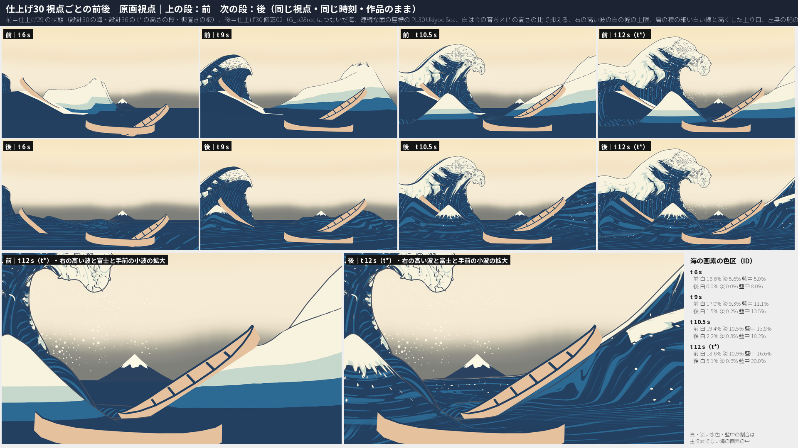
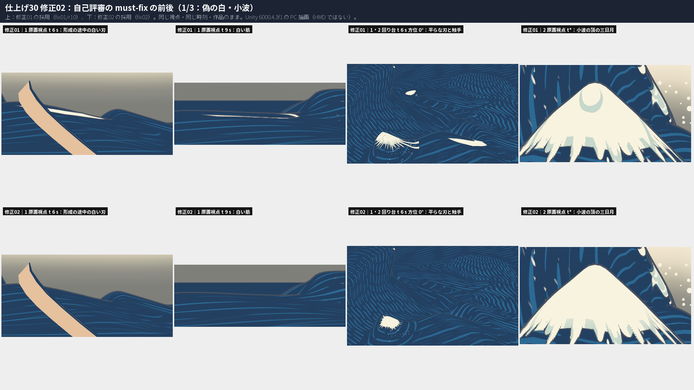
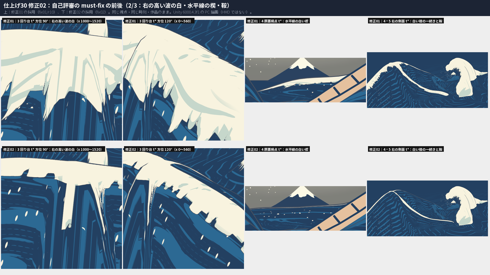
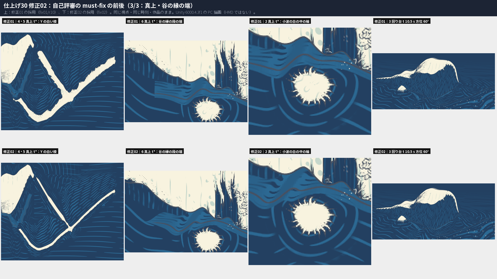
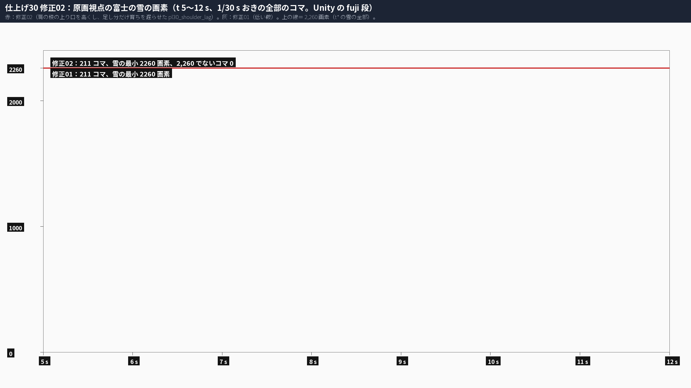
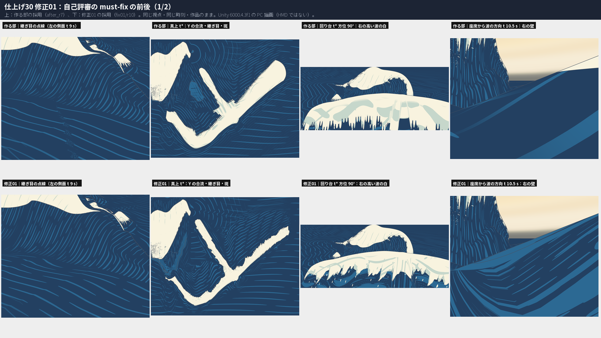
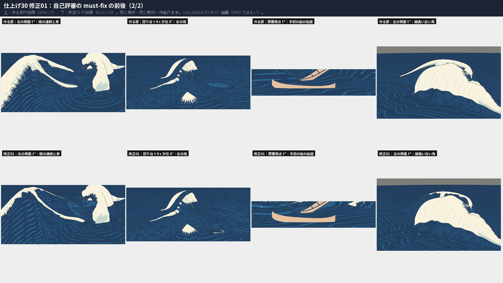
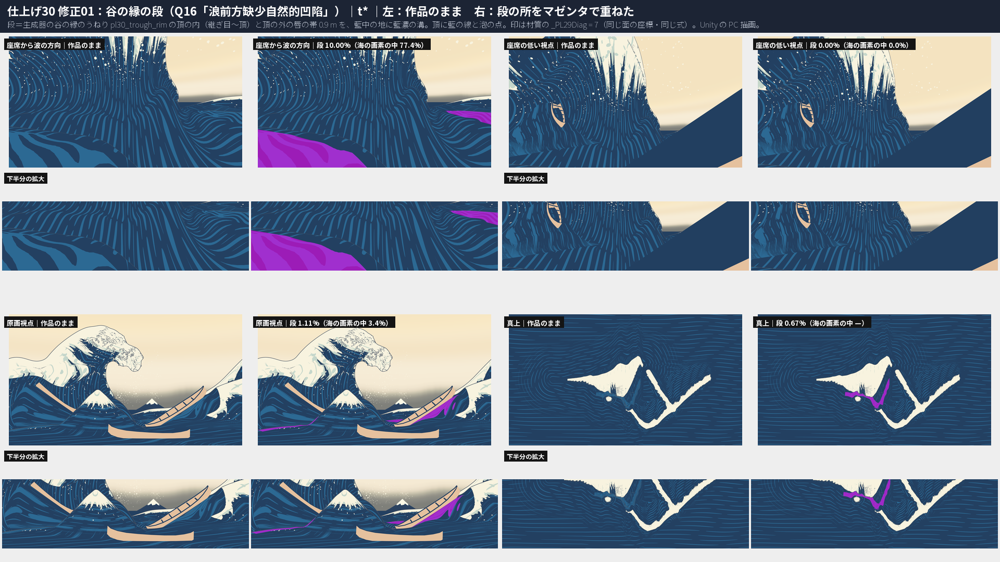
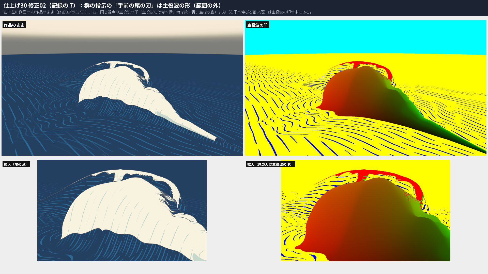
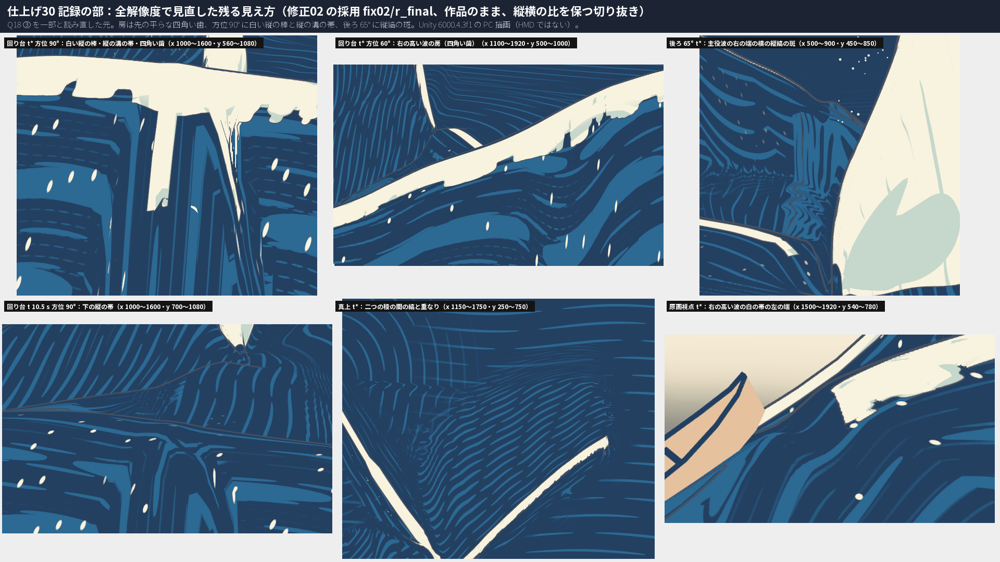

# 仕上げ30：設計30 周りの海 ― 海と右の高い波・手前の小波を主役波と同じ視点によらない立体の材質にし、右の高い波の育ちを遅らせて富士を隠さなくし、海を G_p28rec の主役波へつなぎ直した。自己評審の修正の回 1・2 で、面の座標の継ぎ目・手前の船の船底・谷の縁・右の高い波の白・形成の途中の偽の白・水平線の白い楔・小波の頂を直し、肩の稜の上り口を高くした。谷の縁（座席の低い視点）・右の高い波の房と縦の帯・船の支え・帯の傾きは一部

日付：2026-10-01／状態：**閉じる目安 6 つのうち 4 つを満たす（一部 2）。［利用者の言葉］4 つのうち満たす 2・一部 2。自己評審の修正の回 2（must-fix 7 件）の後。進行役の再評審の前**。記録の部（22:13〜）で must-fix の前後の図を縦横の比を保って作り直し、全解像度の画像で見直して、［利用者の言葉］Q18 ③（右の高い波）を「満たす」から「一部」に読み直した（下の表、第 17 節）。作る部 1 回、修正の回 1 回（全部の項目）、［利用者の言葉］の項目だけの 2 回目（作る部の中）、自己評審の修正の回 1（第 15 節）・修正の回 2（第 16 節。［利用者の言葉］の項目の 2 回目を含む）。時間枠 2.75 日に対して約 5.6 時間（第 9 節）。**HMD 実機の結果ではない。利用者は見ていない。** 証拠は Unity 6000.4.3f1 の PC オフスクリーン描画、Editor の Play モード 2 つ、Release のプレイヤーを PC で 1 回動かした結果と、numpy の検査。

## 利用者の言葉（［利用者の言葉］の項目）と、今の判定

計画 §5.3 の仕上げ30 の最初の 3 行（出典：段階9確認 #5・#6、段階5確認 §6.1・§6.2・§7、段階7確認 F7-4、設計30 §7、元の行［Q18］）。

| 利用者の言葉（原文の一部） | 項目 | 今（修正02 の後・記録の部の読み） | 判定 |
| --- | --- | --- | --- |
| Q16「浪前方缺少自然的凹陷」 | ① 谷の縁の段と海の色の連続 | 谷の縁のうねり `pl30_trough_rim` と、頂の内・唇の帯の段（藍中の地に藍濃の溝、頂の線と泡の点）。座席から波の方向の t\* で段の画素は画面の 10.0%。修正02 で真上の帯の端を細らせた。座席の低い視点の t\* は、近い海が座席の船の船体の陰で見えない（0%） | **一部** |
| Q18「大浪前面的小山丘似的小浪和右边高的浪…二次设计」 | ② 手前の小波 | 富士形の小波に白い頂・24 本の爪の房・泡の舌・泡の点、胴に頂を囲む溝。修正02 で頂の三日月を消し、形成の途中の房を今の白い頂の高さに比例させた | **満たす** |
| 同 | ③ 右の高い波 | 修正02 で白い頂を稜に沿う帯（背 0.5 m・前 0.8 m の外で閾値の坂）にし、房は前の側から。形成の途中の偽の白・ドーム・面の座標の継ぎ目の点線はない。**記録の部の読み**：回り台 t\* の方位 60〜120° で房は先の平らな四角い歯（城壁のような凹凸）に見え、爪の指として読めない。方位 90° に、肩の稜が右の高い波の手前の面を下りる所の白い縦の棒と、溝の向きが縦に変わる帯（縁が真っ直ぐ）がある（第 17 節） | **一部**（修正02 の作る側の判定は「満たす」。記録の部で改めた） |
| Q16「把右侧的浪和大浪连在一起」 | ③ 波頭の稜の連続・S5-2・S5-3 | 修正02 で上り口を 2.2・2.8 m に高くした（足し分の育ちの遅れ）。白い稜は細い線で一続き（右の側面・真上、Y の合流も）。富士の雪は t 5〜12 s の全部のコマで 2,260 画素。コマ 280 の稜線の階段なし（測る所が空になった読みと、目で見た稜線） | **満たす** |

- 計画 §5.1 の修正の回（［利用者の言葉］の項目は 2 回まで）は使い切った。一部の 2 つ（Q16 の谷、Q18 ③）は 10/29 以降の限界（第 7 節）へ送る。

**最初に（結論）**

1. **海を主役波につなぎ直した（作る部）。** G_p28rec（251 節点）の境の輪から近い海・遠い海を作り直し、境の輪の隔たり 3.03 m → 7.6 µm。遠い海の行 0 に近い海の外周の全部の列（1,231）を持たせ、T 字（0.046 mm）と幕をなくした。
2. **海・右の高い波・手前の小波・谷を、主役波と同じ作りの立体の材質（PL30 Ukiyoe Sea Keypose）にした（Q28 を海へ）。** 色は面の座標と今の高さ（と谷の縁の段だけ τ、修正02 から白の門に系の今の育ち g(τ)）で決まり、原画カメラの投影も設計36 の t\* の高さの段も使わない。
3. **修正01：面の座標の継ぎ目をなくした（自己評審の 1・9）。** 「近い方の稜」を頂点ごとに選ぶのをやめ、二つの稜の連続な場を混ぜた。値の勾配の最大は q 158 → 11 m/m、u 4,246 → 9.6、頂の高さ 52.7 → 7.9。
4. **修正01：手前の船（boat\_fg）の船底を海が隠していた原因を直した（自己評審の 11）。** 評価器 213 boat\_ochre 16.99 → 0.133（仕上げ29 と同じ）を 4 組とも。
5. **修正02：形成の途中の偽の白（平らな白い刃と筋）を消した（修正の回 2 の 1）。** 今の高さの比 y/hR だけで白を決めていたので、主役波の形成で帯が持ち上がった t\* で頂でない頂点も白になった。今の高さの比を「その系の今の育ち g(τ) × t\* の高さの比 hf ＋ 0.1」で上から抑える（t\* では hf の門）。原画視点 t 6 s の白い刃 928 → 0 画素、t 9 s の白い筋 104 → 0 画素。回り台 t 6 s の平らな刃もない。
6. **修正02：手前の小波の頂の三日月と触手を直した（2）。** 楕円の座標の極から 1.2〜2.0 m の内は白の中の淡い水色を描かず、房の長さを今の小波の白い頂の高さに比例させた（t 6 s で 0.42 倍）。
7. **修正02：右の高い波の白を細くした（Q18 ③［利用者の言葉］、3）。** 稜からの距離 q で白の幅に上限（背 0.5 m・前 0.8 m の外で閾値の坂）を付け、房は前の側からだけ垂らす。回り台 t\* の下半分の白は方位 60° で 21.2 万 → 約 8.6 万画素、90° で 36.1 万 → 約 13 万画素。ドームはなくなったが、房は先の平らな四角い歯に見え、方位 90° に白い縦の棒と縦の溝の帯が残る（記録の部の読み。Q18 ③ は一部）。
8. **修正02：t\* の水平線の白い楔を切った（4）。** 肩の稜の白と頂の泡の線を細い線にし、低い鞍が遠く見える所（線が画面で 1.2 画素より細い所）では切る。楔の所の白 3,798 → 46 画素。右の側面・真上の白い稜は一続き（真上の Y の合流もつながる）。
9. **修正02：肩の稜の上り口を高くした（Q16［利用者の言葉］、5）。** 0・1.6 → 2.2・2.8 m の足し分だけを育ちの遅れ `pl30_shoulder_lag`（`pl30_right_lag` と同じ形）で足し、原画視点 t 5〜12 s の 1/30 s おきの 211 コマの全部で富士の雪が 2,260 画素なので採った。
10. **修正02：真上の谷の縁の段の帯の端を細らせた（6）。** 記録を直した（7：手前の尾の刃は主役波の形で範囲の外、S5-3 の稜線の段 0 の読み、継ぎ目の法線の全 251 節点の値）。
11. **右の高い波が富士を隠さない（S5-2）、稜線の段なし（S5-3）、コマ 185 の跳びなし（S5-1）** は修正02 の後も満たす。
12. **船の支え（修正01 の 5）と帯の傾き（6）は改善したが満たさない**（修正02 で変わらず）。谷の縁の段は座席の低い視点では見えない（近い海が座席の船の船体の陰。仕上げ36 の限界）。
13. **原画視点の形の関門は後退しない。** 78・130・131・132・72 は仕上げ29・作る部・修正01 と同じ値。評価器 23 の合否も同じ。
14. **記録の部：must-fix の前後の図が横に縮んでいた。** 修正01・修正02 の must-fix の図（`fig_pl30_fix01_a/b/trough`・`fig_pl30_fix02_a/b/c/tail`）は切り抜きを枠の比へ引き伸ばしていて、回り台の右の高い波の房が横に最大 3.7 倍縮んで「短く丸い指」に見えていた。縦横の比を保って作り直し（`pl30_sheets.tile_fit`。数の JSON は同じ）、全解像度の画像で 7 視点＋回り台を見直した。Q18 ③ を一部と読み直し、方位 90° の縦の帯と白い縦の棒、後ろ 65° の縦縞の斑を限界に足した（第 7 節の 14・15、第 17 節）。

| 前後の図：原画視点（上の 2 段：前＝仕上げ29、次の 2 段：後＝仕上げ30 修正02、下：t\* の右側の拡大） |
| --- |
|  |

| 修正02：自己評審の must-fix の前後（1/3：偽の白・小波。上：修正01、下：修正02。記録の部で縦横の比を保って作り直した） | 修正02（2/3：右の高い波の白・水平線の楔・鞍。回り台の 2 枚は房の所の切り抜き） |
| --- | --- |
|  |  |

| 修正02（3/3：真上・谷の縁の端） | 修正02：富士の雪（t 5〜12 s の全部のコマ） |
| --- | --- |
|  |  |

| 修正01：自己評審の must-fix の前後（1/2。上：作る部、下：修正01。記録の部で縦横の比を保って作り直した） | 修正01：（2/2） |
| --- | --- |
|  |  |

| 修正01：谷の縁の段（t\*、段の所をマゼンタで重ねた） | 修正02（記録の 7）：手前の尾の刃は主役波の形 |
| --- | --- |
|  |  |

| 記録の部：全解像度で見直した残る見え方（修正02 の採用、縦横の比を保つ切り抜き。Q18 ③ を一部とした元。第 17 節） |
| --- |
|  |

---

## 1. 作ったもの

### 1.1 海のパッケージ（numpy、`Tools/GWWaveGen/pl30/`）

- `pl30_sea.py`・`pl30_sea_generate.py`・`pl30_params.json`：設計30 の生成器を写して直したもの。主役波を仕上げ28 の採用（`Build/Polish/28/G_p28rec/art_on`）へ替え、近い海の行 0 をその本体の境の輪の頂点そのものにした。地形の誘導は t\* の形を (a, c) の 0.25 m の格子に一度作る。
  - **右の高い波**：設計30 の稜の表を PCHIP で滑らかに。**肩の稜 `pl30_shoulder_ridge`**：大波の右の端から 60° の交差の稜で右の高い波の頂へ（富士の列 a −5〜1 は 3.3 m 以下）。**育ちの遅れ `pl30_right_lag`**：g\_r(τ) = g(τ)·L(τ)。
  - **修正01**：
    - 右の高い波と肩の稜の滑らかな max の足し分 (k − |x − y|)²/4k を、両方が k より低い所では 0 へ落とす（`smooth_max_floor`。作る部は格子の全部で海を 0.25 m 上げ、手前の船の船底を隠し、格子の端に 0.25 m の段を作った）。
    - 面の座標の連続な場を格子に作る（右の高い波：a − a\_crest(c) を √(1 + a\_crest′²) で割った距離と c だけの関数の弧長。肩の稜：両端を 200 m 直線で延ばした稜への符号付きの距離と弧長）。
    - 帯の σ を ±1.0（45°）で切り（作る部 ±1.5）、扇（錐の点から放射に出る列）の中は継ぎ目から 2.5 m の輪の弧長の上でガウス 1.0 m にならして 0.6 倍し、扇の端から 12 列で元の値へ戻す（扇の隣の列の σ の差が横の傾きになり、形成の途中に 85° の三角形が出た）。σ > 0 の下り坂の長さ 2.0 → 2.5 m。
    - **谷の縁のうねり `pl30_trough_rim`**（新しい名前の付いた美術の誘導）：前の列で主役波の t\* の谷の深さ D（境から 25 列の内の最も低い y の負）を smoothstep((D − 0.5)/1.5) の重み W にし、帯に g(τ)^1.5 · W · 0.75 m · x²·e^{1−x²}（x = 継ぎ目に垂直な距離 ÷ 2.6 m。継ぎ目で 0・傾き 0）を足す。地形の誘導の t\* の高さ 1 m までと、座席の船の竜骨の線から 2〜5 m で滑らかに 0 へ（右の高い波の稜に足すと原画視点で富士の雪を隠し、当て布の中で切り替えると形成の途中に頂点が跳んだ）。
    - 近い海 60 → 64 行。稜の山の所のほかに、地形の誘導の t\* の高さが 0.5〜3.5 m を超える所の全部に行の密度を 2.0 足す（線分が稜の系を 2 度横切る所で 2 度目の稜の行が粗く、細くした白の頂が行の間で切れた）。
  - **修正02**：
    - **肩の稜の上り口を高くした（`pl30_shoulder_ridge.raise`）**：path\_h の初めの 2 点 0・1.6 → 2.2・2.8 m の差（足し分、上り口の近くだけ）を、別の育ちの遅れ **`pl30_shoulder_lag`**（名前の付いた美術の誘導。L\_sh：τ −0.75 s まで 0、−0.5 s で 0.35、−0.25 s で 0.8、t\* で 1 の PCHIP、g\_sh = g·L\_sh）で足す。F(a, c, τ) = g\_r·(F\_right − F\_raise) + g\_sh·F\_raise + g·(F\_small + F\_trough)。
    - `pl30_growth_table.py`（新しく）：生成器の growth\_right\_knots・growth\_knots を、材質の表 `_GrowR0〜6`・`_GrowS0〜6`（s = √(−τ/12) の 28 点）として `pl30_sea_params.txt` に書く（表を線形に読んだ時の節点の値からのずれの最大 0.013）。
- `pl30_sea_attr.py`（修正01 で 12 → 20 個）：UV3 稜の系（q・u・頂の高さ・重み）、UV4 小波の系（楕円の座標 2 つ・高さの比・重み）、UV5 t\* の法線と a\*、UV6 海（s・along・谷の縁からの垂直の距離・谷の縁の重み）、UV7（稜の系の高さの比・前と背の閾値の混ぜ・船の支えの重み・肩の稜の重み）。稜の系の頂の高さは谷の続き（`ds30_trough_continue`、負）を含めた高さ（含めないと肩の稜の上り口で今の高さの比が 0.82〜0.92 に止まり、白が切れた）。前と背の閾値の混ぜは、二つの稜のそれぞれの前の側の量の、その稜がある所での大きい方（q を混ぜると合流で肩の稜の頂が背の閾値になり白が切れた）。原画カメラと原画の色区は読まない。
- `pl30_left_swell.py`：左奥の船のうねり（第 1.4 節）。修正01 で面の座標を 20 個の並びに（稜の系の溝、白にはしない）。
- `pl30_checks.py`：継ぎ目・T 字・法線・船の支え・帯の折れ・富士の見え・座席の船の上下。修正01 で 20 個の面の座標も読み、船の支えの稜から谷の縁の頂（自然の頂）を除く。
- `pl30_fix01_checks.py`（修正01 で新しく）：面の座標の跳び、帯の三角形と四角の傾き、竜骨の断面、手前の船の所の海の高さ、右の高い波の立ち上がりの速さ。
- `pl30_fix02_checks.py`（修正02 で新しく）：継ぎ目の法線を全 251 節点で（頂点の読みと面の読み）、形成の途中の偽の白の頂点の数（作る部・修正01 の読みと修正02 の読み）。`pl30_checks.py` の富士の見当は `--fuji-t1 12 --fuji-dt 0.125` で t 5〜12 s も読める。
- `pl30_fix02_sheets.py`・`pl30_gpu_runs.py`（修正02 で新しく）：must-fix ごとの前後の図・白の画素・富士の雪の全部のコマの図、海の面の GPU の前後 3 回ずつの中央値。

### 1.2 材質 PL30 Ukiyoe Sea Keypose（`Unity/Assets/GreatWave/Polish30/Shaders/PL30_Ukiyoe_Sea.shader`）

主役波の PL29 Ukiyoe Keypose と同じ版の重ねを、海の面の座標で描く。数値は `Tools/GWWaveGen/pl30/pl30_sea_params.txt`。修正01 で書き直した。

1. **二つの波の系**：稜の系（右の高い波と肩の稜）と小波の系を同じ関数で別々に計算し、白は大きい方、溝は重みで混ぜる（作る部は頂点ごとにどちらか一方を選び、境で跳んだ）。
2. 藍濃の胴に藍中の溝。波は稜に平行（周期 1.15 m、頂で 0.14・足で 0.32、急な面は 0.14 太る）、平らな海は主役波の足に平行（周期 2.6 m）から遠くで波峰線に平行。溝の周期が画面で大きい所に細い溝の段を 2 つ足す（波 1/3・1/9、海 1/4・1/16。目の近くの平らな面を割る）。海の溝のうねり 28 m・切れ 14 m は along を割り切る（輪の継ぎ目なし）。
3. 白の頂：今の高さ ÷ 頂の t\* の高さが閾値（稜の系 前 0.80・背 0.94 を面の座標の混ぜで、小波 0.62）より上。縁は低い揺れ（±0.035）、2 層の爪の房（周期 3.1 m・4.9 m、置く割合 80%・55%、長さの揺れ・波長 23 m のまとまり・長い房 18% を 1.6 倍、先の尖った錐で伸びるほど 3.0 m 横へ曲がり、先を 2〜4 本の小さな爪に割る）、縁の小さな舌（周期 0.93 m、60%）。頂が閾値を越えたばかりの所では房を短く。
4. 白の中：房の陰（淡い水色）、泡の粒、淡い水色の流れの線、急な面の細い陰の帯。縁の外に泡の白い点。胴に白い点（主役波の _Dots と同じ）。
5. **稜の頂の泡の線**（`_CrestFoam`）：肩の稜の頂の t\* の高さ 1.2〜4.5 m の所で、今の高さの比 0.86 より上を白（低い鞍でも白い稜を続ける）。
6. **谷の縁の段**：谷の縁の重み > 0.5 で、頂の内（谷の側）と頂の外の唇の帯 0.9 m を藍中の地に藍濃の溝（縁に平行、谷の底へ太る）。頂（揺れ 0.35 m）に藍の線、唇の外に泡の白い点。段は τ −0.8 → −0.05 s に頂から谷の底へ広がる。
7. 白と藍の境に藍の線。ID 表示は主役波と同じ約束。点検用の _PL29Diag 7〜11（谷の縁の段の印、系の重み、今の高さの比、溝、修正02 の白の条件）。
8. **修正02：白の門**（`_CapGate`・`_GrowR`・`_GrowS`）：今の高さの比を「系の今の育ち g(τ) × t\* の高さの比 hf ＋ 0.1」で上から抑える（形成の途中に帯が持ち上がった所と、t\* で頂より高く持ち上がった所の偽の白をなくす）。小波は楕円の座標の極から 1.2〜2.0 m の内で白の中の淡い水色を描かず、房の長さを今の白い頂の高さ (g − 0.62)/(1 − 0.62) に比例させる。
9. **修正02：右の高い波の白の幅**（`_CapQ`・`_CapQ2`）：稜からの距離 q が背 0.5 m・前 0.8 m の外では閾値を 1 m あたり 0.6 上げ、前の側の外では房をその分伸ばす（届く長さ ≈ 房 ÷ 0.12）。房は前の側からだけ（`_Claw3.w` 0.22 → 0、前と背の切り替えは mixF 0.3〜0.7 で滑らか）。
10. **修正02：肩の稜の白は細い線**（`_CrestFoamQ`・`_CapQ2.y/z`）：肩の稜の重みのある所（wsh 0.05〜0.3 で入る）は q の坂を掛けず、閾値を前の閾値 0.80 に寄せ、|q| < 0.35 m か頂のすぐ近く（今の高さの比 > 0.985（低い鞍）〜0.95（頂の高い合流の近く））だけを白にする。低い鞍（頂 < 4.5 m）で線の幅が画面で 1.2〜2.4 画素より細い所は切る（原画視点 t\* の水平線の楔）。頂の泡の線も同じ細い線。
11. **修正02：谷の縁の段の端**（`_TroughTaper`）：帯の幅を重み tw 0.15〜0.85 で 0 から全部へ細らせる。

`PL30UkiyoeSea.cs` が面の座標（20 個。作る部の 12 個も読める）を near・far のメッシュの UV3〜UV7 に入れる。

### 1.3 右の高い波の『雪山』と富士（S5-2）

- 原因と直し（作る部）：右の高い波は t 6〜10 s に原画視点の富士の前を横切る。育ちの遅れ `pl30_right_lag` と、白を今の高さで決める材質で、t 7〜9 s の右の高い波は 3 m 前後の藍のうねり。

| t（s） | 5.0 | 6.0 | 7.0 | 8.0 | 9.0 | 9.5 | 10.0 | 10.5 | 12（t\*） |
| --- | --- | --- | --- | --- | --- | --- | --- | --- | --- |
| 富士の雪の画素 前（仕上げ29） | 2,260 | 2,260 | 0 | 0 | 0 | 0 | 0 | 2,237 | 2,260 |
| 富士の雪の画素 後（修正01） | 2,260 | 2,260 | 2,260 | 2,260 | 2,260 | 2,260 | 2,260 | 2,260 | 2,260 |
| 富士の山腹の画素 前 | 6,492 | 6,169 | 0 | 0 | 0 | 0 | 0 | 5,340 | 10,396 |
| 富士の山腹の画素 後（修正01） | 6,420 | 7,445 | 7,987 | 9,192 | 3,319 | 3,268 | 7,127 | 8,726 | 7,882 |
| 富士の雪の画素 後（修正02、上り口を高くした鞍） | 2,260 | 2,260 | 2,260 | 2,260 | 2,260 | 2,260 | 2,260 | 2,260 | 2,260 |

- 数え方：PL30Render の fuji 段（富士の 2 つの材質だけ ID の色で描いた原画視点、0.25 s おき）。numpy の見当（`pl30_checks.py` の fuji）でも雪の見える割合の最小は 1.0。修正01 の途中で、肩の稜の上り口を高くする案（0・1.6 → 2.2・2.8 m）と、右の高い波の稜の上に谷の縁のうねりが乗る案は、t 9.5〜9.75 s に雪の 13% を隠したので切った（第 10 節）。**修正02** で上り口を高くする案を、足し分だけ育ちを遅らせて（`pl30_shoulder_lag`）もう一度試し、t 5〜12 s の 1/30 s おきの 211 コマ（`-pl30FujiT1 12 -pl30FujiDt 1/30`）の全部で雪 2,260 画素なので採った（`fig_pl30_fix02_fuji.png`・`pl30_fix02_fuji.json`）。

### 1.4 仮置き M1\_Revision\_LeftSupport の置き換え（`pl30_left_swell`）

- 板を隠し、左奥の船の船底の線＋喫水 0.55 m の細長い水のうねり（t\* の最高 7.7 m、足跡 140 m²、藍の海の材質）を置き、τ −2.6 → 0 s で盛り上げて船も持ち上げる（名前の付いた美術の誘導）。修正01 で面の座標を 20 個の並びにした（作る部の 12 個のままでは、修正01 の材質で白い板に見えた）。

### 1.5 場面・Release

- `PL30Setup.BuildScenes` で仕上げ29 の場面を `Polish30/Scenes/PL30_Release.unity`・`PL30_SinglePlayback.unity` へ写し直した（修正01 の面の座標の SHA-256 を持つ）。変えたものの一覧は `Docs/Evidence/Polish/30/pl30_setup.json`。
- Play モード（`PL29PlayModeCheck`）：PL30\_SinglePlayback 814 行、PL30\_Release 6,734 行。どちらも `PL30_SEA_APPLIED`（near `a3718ffb…`・far `b995b488…`）。例外は Unity の Editor の検索の索引の 1 つ（この群のコードではない）。
- Release：`PL30ReleaseBuild` で Succeeded、誤り 0、データ 50 ファイル 869 MB、焼き込み 0、絶対のパス 0。exe を PC で 1 回動かした（自動の試し main、`release/runs/fix01_main`）：pass、52,354 フレーム（作る部の exe は 55,168。同じ時間で少ないのは材質が重くなったため）、player.log に `PL30_SEA_APPLIED`。
- **修正02**：場面を作り直し（変えたものの一覧 `Docs/Evidence/Polish/30/pl30_setup.json` を修正02 の時のものに替えた）、Play モード 2 つ（821 行・6,735 行）で `PL30_SEA_APPLIED`（near `790686bd…`・far `1c7f4a77…`）。Release を作り直して 1 回動かした（`release/runs/fix02_main`）：pass、51,594 フレーム。

---

## 2. 視点ごとの前と後（同じ視点・同じ時刻 t 6・9・10.5・12 s、作品のまま）

前＝仕上げ29 の状態（PL30Render `-pl30Old 1`）、後＝修正02（`Unity/Build/Polish/30/fix02/r_final`）。修正01（`fix01/r10`）との比べは `fig_pl30_fix02_a/b/c.png`、作る部（`after_r7`）と修正01 の比べは `fig_pl30_fix01_a/b.png`。どれも Unity の PC オフスクリーン描画（1920×1080）。

| 視点 | 後（修正02、目で見て） | 図 |
| --- | --- | --- |
| 原画視点 | 富士はどの時刻も見える。t 6 s の白い刃・t 9 s の白い筋はない。手前の船の船底は仕上げ29 と同じに見える。手前の小波は白い頂と爪の房の富士形で、頂の三日月はない。t\* の水平線の白い楔はない。右の高い波は t\* で藍の胴に稜に沿う白い帯（帯の左の端は真っ直ぐに切れて見え、その左に肩の稜の細い白い線が船の上の縁に沿って上る） | `fig_pl30_ba_view_painting.png` |
| 座席 | 板と雪山は見えない。主役波は仕上げ29 のまま | `fig_pl30_ba_view_seat.png` |
| 座席から波の方向 | t 9 s の斑はない。t 10.5 s の右の壁（座席の船の支えの当て布）は右の高い波の溝と細い溝の段。t\* の手前に谷の縁の段（藍中の地に藍濃の溝） | `fig_pl30_ba_view_seat_toward_wave.png` |
| 左の側面 | 継ぎ目の点線はない。右下へ伸びる白い尾の刃は主役波の形（`fig_pl30_fix02_tail.png`） | `fig_pl30_ba_view_side_left.png` |
| 右の側面 | 右の高い波と肩の稜の白い稜が細い線で大波の右の端の近くまで一続き。上り口は高くした鞍 | `fig_pl30_ba_view_side_right.png` |
| 後ろ 65° | 右の高い波の白い頂と溝の胴、肩の稜の細い白い線。**記録の部の読み**：t 10.5・12 s に、主役波の右の端の横の海（x 640〜720・y 560〜760）に縦の細かい縞の四角い斑 | `fig_pl30_ba_view_back65.png` |
| 真上 | Y 字の白い稜が細い線で一続き（合流もつながる）。面の座標の継ぎ目の点線・斑はない。大波の前の足に谷の縁の段（左の端は細って終わる）、小波の白の中に輪はない。**記録の部の読み**：二つの稜の間（V の内）に細かい縞と、二つの溝の系が薄く重なって交わる所 | `fig_pl30_ba_view_top.png` |
| 回り台（12 方位） | t 6 s に平らな白い刃・触手はない。t 9 s の斑はない。t\* の 90° の面の座標の段の帯・藍の四角はない。近い方位（60〜120°）の右の高い波の白は稜に沿う帯で、房は前の側から垂れる。**記録の部の読み（全解像度）**：房は先の平らな四角い歯（城壁のような凹凸）で、爪の指として読めない。t\* の方位 90° に、肩の稜が右の高い波の手前の面を下りる所の白い縦の棒（x 1260〜1320・y 700〜910）と先の尖った白い筋、溝の向きが縦に変わる帯（x 1190〜1490、縁が真っ直ぐ）。方位 120° の左の端と t 10.5 s の方位 90° の下にも同じ縦の帯。方位 150〜240° では肩の稜の白は海の上の細長い白い帯 | `fig_pl30_ba_turntable_t060〜t120.png` |

- 動画（前｜後、t 0〜14 s、30 fps）：`pl30_ba_painting_30fps.mp4`（0.80 MB）・`pl30_ba_seat_30fps.mp4`（0.24 MB）・`pl30_ba_seat_toward_wave_30fps.mp4`（1.00 MB）・`pl30_ba_side_left_30fps.mp4`（0.41 MB）・`pl30_ba_tt_30fps.mp4`（0.66 MB）。

**目で見て（7 視点＋回り台、4 時刻、修正02 の後）**：海・右の高い波・小波に、面の座標の継ぎ目の点線・段の帯・藍の四角・平らなクリーム色の板・斑・形成の途中の偽の白・水平線の白い楔・小波の頂の三日月は見えない。残る見え方（記録の部で全解像度の画像を見直した読みを含む）：右の高い波の房は先の平らな四角い歯（回り台 60〜120° の t\*）、回り台 t\* の方位 90° の白い縦の棒と縦の溝の帯（継ぎ目に近い見え方。方位 120° の左の端・t 10.5 s の方位 90° にも）、後ろ 65° の t 10.5・12 s の縦縞の四角い斑、原画視点 t\* の右の高い波の白の帯の左の端が真っ直ぐに切れる。主役波の爪の読み（仕上げ32・33）はこの群では変えていない。

---

## 3. 計画 §5.3 の各行

| 行 | 出典（計画 §5.3） | 今（修正02 の後・記録の部の読み） | 判定 |
| --- | --- | --- | --- |
| ［利用者の言葉］Q16 谷（①） | 段階9確認 #6、段階5確認 §6.1、段階7確認 F7-4 | 冒頭の表 | 一部 |
| ［利用者の言葉］Q18 二次設計（②③） | 元の行［Q18］、設計30 §7 | 同 | ② 満たす、③ 一部（修正02 の作る側は満たす。記録の部で改めた） |
| ［利用者の言葉］Q16 右の波の接続（③） | 段階9確認 #5、段階5確認 §6.1・§6.2 | 同 | 満たす（修正02） |
| ① S5-1 コマ 184→185 | 段階5確認 §6.2、段階6確認 §8、段階7確認 F7-5 | 白を今の高さで決める。コマ 185 の跳びの比 原画視点 1.01・座席から波の方向 1.08・左の側面 1.45（前 0.99・1.00・1.30。左の側面の最大はコマ 250 で 2.35、前 2.20） | 満たす |
| ① 前の継ぎ目の船の支え（法線 ≥ 0.9、竜骨の外の稜・溝 ≤ 0.1 m） | 設計30 §7 | 稜 0.11 m・溝 −0.33 m（作る部 0.17・−0.54）。継ぎ目の法線の最小 t\* 0.88、全 251 節点の頂点の読み 0.865（τ −1.875。修正01 の海は 0.856・τ −4.25、修正01 の記録の 0.86 は 5 節点おき）、0.9 未満 3 頂点（作る部 18）。竜骨の 11 点の水面 − 竜骨 0.30〜0.44 m（喫水 0.38 m）。修正02 で変わらず | 満たさない（改善） |
| ① near の帯の溝と動きの折れ（≤ 0.05 m／コマ²、45° 以下） | 設計30 §7 | 二階差分の最大 0.038（前 0.199、0.05 超のコマ 0）。傾き：第 15 節の 6 | 一部 |
| ① near と far の T 字 | 設計30 §7 | far 1,231 列、隔たり 0.046 mm、幕なし | 満たす |
| ① 海の段を今の高さで | 設計36 §7 の限界 2・5、設計37 §7、段階7確認 §6 の 1 | 白・泡の点は今の高さ。谷の縁の段は t\* の形の面の座標と τ | 満たす |
| ① 主役波と海の藍濃の 1 段 | 段階7確認 §6 の 4、設計38 §7 | 海の限定色を主役波の材質から写す | 満たす |
| ① far の線 | 設計38 §7 の限界 11 | 遠い海に外殻線と波峰線に平行な溝 | 満たす |
| ① far の網の加速度（設計43 の限界 4・5） | 設計43 §6 の限界 4・5 | far 1,231 列。船で測り直していない | 一部（仕上げ43） |
| ① near のつなぎの帯の水の急な減速（設計43 の限界 3） | 設計43 §6 の限界 3 | 竜骨の下の水の 30 Hz の二階差分の最大 167.5 → 81.9 m/s²（t 11.07 s） | 一部（仕上げ43） |
| ① 仮置き M1\_Revision\_LeftSupport | 設計47 限界 5、段階9確認 §6 の 5、設計43 §6 の限界 9 | 第 1.4 節 | 満たす |
| ② 小波（泡・足の鋸歯） | 段階5確認 §7、設計36 §7 の限界 3・11、設計40 限界 6、段階7確認 §6 の 3 | 第 1.2 節 | 満たす |
| ② 写真の錐状の副峰（Q12、優先度は低い） | 元の行［Q12］ | 作業しない | 記録のみ |
| ③ near の格子と稜線の段（F7-2 の根） | 段階7確認 F7-2・§9、設計38 §7 の限界 1 | 座席 v1 コマ 270〜300 の 1 コマだけの線の消え 18 → 5（作る部 4）、コマ 280 の稜線の階段 19 → 0（測る所の空でない画素が 0 の読み。右の高い波がその所に入らなくなった。稜線は原画視点・右の側面で目で確かめた。第 16 節） | 満たす |
| ③ 右の高い波の尖りの扇 | 設計38 §7、設計40 限界 6 | 原画視点の扇は消え、左の側面の細い白い角も消えた。修正02 で近い視点の白い頂を稜に沿う帯にした（房は前の側から）。記録の部の読み：回り台 t\* の方位 60〜120° の房は先の平らな四角い歯で爪として読めない。方位 90° に白い縦の棒と縦の溝の帯（第 17 節） | 一部 |
| ③ 座席から波の方向の平らな面と縦の段（F7-4） | 段階7確認 F7-4、設計40 限界 6 | 平らな板・硬い段・斑はない（第 15 節の 3） | 満たす |
| ③ 右の高い波の輪の間隔 | 設計30 §7 | 近い海 64 行、稜の山と地形の誘導の全部に行を集める | 満たす |
| 終わったら 71・76・213 を仕上げ40 で判定 | 設計40 限界 4、元の行 | 71・76 は不合格のまま値も同じ。213 boat\_ochre は仕上げ29 の値に戻った | 仕上げ40 へ |

バックログ 88：境の輪 7.6 µm、T 字 0.046 mm、目で見て穴・継ぎ目なし（7 視点＋回り台）。93：far 半径 650 m・全部の列・外殻線。どちらも記録（交接の前・中・後は段階9）。153〜264 の各項目は文言がリポジトリの外にあり、上の各行で数えた。

---

## 4. 原画視点の関門（形）と評価器（爪あり・爪なし、前の群と CP1／26修正01 に対して）

周りの海は主役波の輪郭の関門の ID に入らないので、形の値は仕上げ29・作る部と同じ。`pl28u_regress.py --kstar rec`（修正02 は `fix02/r_final`、修正01 は `fix01/r10` の t\* の画像。`pl28u_regress_after.json` は修正02）。

| 項目 | 後 修正02（爪なし／爪あり） | 修正01 | 作る部 | 前の群（仕上げ29 p29g） | CP1 | 26修正01 | 関門 | 判定 |
| --- | --- | --- | --- | --- | --- | --- | --- | --- |
| 78 | 2.741／2.741 | 2.741 | 2.741 | 2.741 | 2.772 | 1.641 | ≤ 4 | 合格（後退なし） |
| 130 | 3.5815／3.5815 | 3.5815 | 3.5815 | 3.5815 | 1.968 | 1.953 | ≤ 4 | 合格（後退なし） |
| 131 | 3.4419／3.4419 | 3.4419 | 3.4419 | 3.4419 | 1.814 | 1.798 | ≤ 4 | 合格（後退なし） |
| 132（σ12 最大） | 3.5576／3.5576 | 3.5576 | 3.5576 | 3.5576 | 1.326 | 1.574 | ≤ 4 | 合格（後退なし） |
| 72（σ12 p95） | 3.8507／3.5698 | 同 | 同 | 3.8507／3.5698 | 1.558 | 1.723 | ≤ 4 | 合格（後退なし） |

- 評価器 23（4 組）：線なし（爪あり・爪なし）合格 4・不合格 5、線あり 合格 1・不合格 8。仕上げ29・作る部・修正01 と同じ（修正02：`fix02/r_final/eval23/f2_off_*`）。記録のみの項目（修正02。括弧は修正01・仕上げ29・作る部）：**213 boat\_ochre 0.133（修正01 0.133、仕上げ29 0.133、作る部 16.99）**、75 boat\_fg p95 85.62（85.62・85.62・77.0）、157 boat\_left p95 62.6（62.6・64.9・61.2）、159 boat\_mid p95 121.1（線なし。線あり 121.3）、74・161 富士の稜 5.309（同じ）、76 sky\_dark（線あり）p95 18.60（修正01 18.63、仕上げ29 19.25。線なし 22.36）。修正02 で変わったのは 76 の線ありの p95 だけ（−0.03 px）。
- 色区の項目 73〜270（新しい読み）：主役波の読みなので値は同じ。267 の 20 画素以上の帯（記録のみ）は座席の低い視点で 2（仕上げ29）→ 3（作る部）→ 4（修正01）→ 2（修正02）。原画視点 101（爪なし）・114（爪あり）、座席 6 はどの回も同じ。

---

## 5. 閉じる目安（計画 §5.3 仕上げ30）

| 閉じる目安 | 今（修正02 の後） | 判定 |
| --- | --- | --- |
| ①の数値の目標（設計30 §7） | T 字・継ぎ目・二階差分は満たす。船の支えの稜・溝・法線と帯の傾きは改善したが満たさない | **一部** |
| 原画視点 t ≈ 5〜10 s で右の波が富士を隠さない | 富士の雪 2,260／2,260 画素をどのコマでも | 満たす |
| コマ 184→185 の跳びがない | 跳びなし | 満たす |
| 座席から波の方向と座席の低い視点の t\* で谷の縁の段が見える（near の藍中が 1.9% より増える） | 座席から波の方向：段の画素が画面の 10.0%（海の画素の 77%）。座席の低い視点：近い海が座席の船の船体の陰で見えない（見える海は左奥の船のうねりだけ。材質の印で 0 画素）。修正02 で真上の帯の端を細らせた | **一部** |
| ② 手前の小波に白の縁の模様があり、足が鋸歯でない | 白い頂・爪の房・泡、足は溝 | 満たす |
| ③ 波頭の稜が大波の肩から続き、座席 v1 のコマ 280 の稜線の階段がない | 階段なし（測る所の空でない画素 0 の読みと、目で見た稜線）。白い稜は細い線で大波の右の端の近くから一続き。修正02 で上り口を 2.2・2.8 m に高くした鞍（足し分の育ちの遅れで富士の雪を隠さない）。大波の右の端の錐の点そのものは主役波の形 | **満たす**（修正02） |

**6 つのうち 4 つを満たす（一部 2）。** Q28 の審査の規則（7 視点＋回り台）では、海の側に面の座標の継ぎ目の点線・段の帯・藍の四角・平らなクリーム色の板・斑・引き伸ばし・形成の途中の偽の白・水平線の楔はない（修正02 の後）。ただし記録の部の読みで、回り台 t\* の方位 90° の縦の溝の帯と白い縦の棒、後ろ 65° の縦縞の四角い斑（継ぎ目に近い見え方）と、右の高い波の房の四角い歯（爪として読めない）が残る（第 17 節）。Q28 の規則では、この群は閉じない（進行役の再評審で決める）。

---

## 6. 数（numpy・Unity）

| 項目 | 前（仕上げ29 の海） | 作る部 | 修正01 | 修正02 |
| --- | --- | --- | --- | --- |
| 主役波の境の輪と near の行 0 の隔たり | 3.03 m | 7.6 µm | 7.6 µm | 7.6 µm |
| near と far の隔たり（T 字） | 0.094 mm（幕あり） | 0.046 mm | 0.046 mm | 0.046 mm |
| 継ぎ目の法線の内積の最小（錐の点を除く、t\*／5 節点おき） | 0.309（設計30） | 0.82／0.82 | 0.88／0.86 | 0.88／0.86 |
| 継ぎ目の法線の内積の最小（全 251 節点、頂点の読み／この群の面の読み） | — | — | 0.856（τ −4.25）／0.846（τ −10.0。自己評審の面の読みでは 0.769・τ −11.25） | 0.865（τ −1.875）／0.855（τ −10.0） |
| 面の座標の値の勾配の最大（近い海：q・u・頂の高さ、m/m） | — | 158・4,246・52.7 | 11・9.6・7.9 | （修正01 と同じ作り） |
| 帯の二階差分の最大（m／コマ²） | 0.199 | 0.037 | 0.038 | 0.038 |
| 帯の式だけの所の t\* の三角形の傾きの最大（45° 超の数） | — | 52.7°（7） | 40.2°（0） | 40.2°（0） |
| 帯の式だけの所の四角の傾き：t\* の 45° 超の数／形成の途中の最大 | — | 456／86.7° | 75／73.9° | 34／73.3°（修正02 の海で t\* の数が減った。どこが変わったかは調べていない） |
| 船の支えの稜・溝（作る部の読み） | 0.80 m・−1.0 m | 0.17 m・−0.54 m | 0.11 m・−0.33 m | 0.11 m・−0.33 m |
| 手前の船の所の t\* の海の高さ | 0.00 m | 0.25 m | 0.00 m | 0.00 m |
| 座席の船の上下・加速度 | −3.69〜+0.91 m、5.97 m/s² | −3.42〜+0.90 m、5.90 m/s² | −3.44〜+0.90 m、6.06 m/s²、目は水に入らない（余裕の最小 1.25 m） | 同じ（−3.44〜+0.90 m、6.06 m/s²、余裕 1.25 m） |
| 竜骨の下の水の加速度の最大 | 167.5 m/s² | 89.7 m/s² | 81.9 m/s² | 81.9 m/s²（t 11.07 s） |
| 右の高い波の立ち上がり（t 10〜11.5 s の平均／最大） | — | 6.1／8.8 m/s | 6.1／8.8 m/s（t 10.33 s） | 6.1／8.8 m/s（t 10.33 s） |
| keypose の GPU のメモリ | 主役波 241.3＋near 131.3＋far 11.4 MB | 241.3＋185.7＋58.8 MB | 241.3＋198.1＋58.8 MB＝475 MiB（≤ 512） | 同じ 475 MiB |
| 海の面の GPU の時間（壁時計の見当、RTX 3080、3 回の中央値） | 原画視点 0.40、座席から波の方向 0.37、2 眼 0.64 ms（修正01 の回の前の読み） | （1 回の値のみ。第 15 節の 12） | 0.58・0.55・1.27 ms | 0.69・0.53・1.35 ms（同じ回の前 0.42・0.24・0.59 ms） |

---

## 7. 限界（10/29 以降の一覧へ）

1. **谷の縁の段は座席の低い視点の t\* では見せられない（Q16）。** 近い海が座席の船の船体の陰で見えない（見える海は左奥の船のうねりだけ）。谷そのもの（底 −2〜−5.4 m）は主役波のシートの中で、谷の底の段と線は仕上げ36（主役波の材質）。
2. **稜の形（Q16）**：修正02 で上り口を 2.2・2.8 m に高くした（足し分の育ちの遅れ `pl30_shoulder_lag` は名前の付いた美術の誘導）。稜は大波の右の端の錐の点（海面の高さ）のすぐ外から始まる。主役波の右の端の形は仕上げ28 の採用のまま。
3. **右の高い波の白（Q18 ③、一部）**：修正02 で稜に沿う帯にした（ドームはなくなった）。房は前の側から垂れるが、回り台 t\* の方位 60〜120° で先の平らな四角い歯（城壁のような凹凸）に見え、爪の指として読めない（記録の部の読み。修正02 の記録の「短く丸い指」は横に縮んだ図での読み）。原画視点 t\* の右の高い波の白の帯の左の端が真っ直ぐに切れて見える（肩の稜の重みのある所で細い線へ替わり、原画視点では線が画面で細い）。
4. **船の支え**：竜骨の外の稜 0.11 m・溝 −0.33 m、継ぎ目の法線の最小 t\* 0.88（0.9 未満 3 頂点）、全 251 節点の頂点の読み 0.865（τ −1.875。修正01 の海は 0.856・τ −4.25）・この群の面の読み 0.855（τ −10.0。自己評審の面の読みでは修正01 の海で 0.769・τ −11.25）、竜骨の断面の船首の外の 1 m の落差 1.7 m。竜骨は大波の前の足（y 0）から 1〜3.5 m、船尾 −1.4 m〜船首 5.2 m。平面図の重みの外の端を広げる案・継ぎ目の立ち上げを延ばす案は、法線か竜骨の喫水を悪くした（第 10 節）。仕上げ41（船の置き方）・43（船用水面）。
5. **帯の傾き**：帯の式だけの所の t\* は 40° 以下だが、錐の点の扇の行 0〜5 の四角 75 個（修正02 の海で 34 個）、形成の途中の右の錐の点の隣（τ −11 s で 74°、作る部も同じ所）、地形の誘導の面（右の高い波・小波・船の支え）は 45° を超える。
6. **右の高い波の育ちの遅れ `pl30_right_lag`・肩の稜の上り口の育ちの遅れ `pl30_shoulder_lag`（修正02）・谷の縁のうねり `pl30_trough_rim`・左奥の船のうねり `pl30_left_swell`** は名前の付いた美術の誘導（物理の根拠ではない）。右の高い波は t 10〜11.5 s に平均 6.1 m/s、最大 8.8 m/s で立ち上がる。上り口の足し分は t ≈ 9.9 s から t\* までに 0 → 2.2・2.8 m に育つ。
7. 面の座標は連続だが、右の高い波と肩の稜の合流の所で q の勾配が最大 11 m/m（溝が詰まる。画面で細かくなる所は消える）。
8. **竜骨の下の水の加速度 81.9 m/s²** は大きい。far の網の加速度は船で測り直していない。仕上げ43。
9. **海の面の GPU の時間**（壁時計の見当、3 回の中央値）：修正01 の後 原画視点 0.58 ms・2 眼 1.27 ms、修正02 の後 0.69 ms・1.35 ms（同じ回の前＝仕上げ29 の海 0.42・0.59 ms）。修正01 の材質は二つの波の系と細い溝の段を毎画素で計算し、修正02 は育ちの表の読み・q の坂・細い線を足した。HMD 実機は未検証。仕上げ35。
10. Release のデータに、使わない設計36 の海の色の表が写る（DS36SeaPalette の欄が残る）。
11. 写真の錐状の副峰（Q12）は作業していない（記録のみ）。
12. **白の門は材質の育ちの表（28 点）で g(τ) を読む**。表と生成器の節点の値のずれは最大 0.013。海のパッケージを作り直したら `pl30_growth_table.py` で表を書き直す（表がずれると白の出る時刻がずれる）。
13. **手前の小波の房の長さは今の白い頂の高さに比例**（t 6 s で 0.42 倍）。「今の小波の高さに比例」の読み方は進行役の解釈（第 10 節の 18）。
14. **肩の稜が右の高い波の手前の面を下りる所の縦の帯と白い縦の棒（記録の部で見つけた。Q28）**：回り台 t\* の方位 90° に白い縦の棒（x 1260〜1320・y 700〜910、幅約 60 画素）と先の尖った白い筋、溝の向きが縦に変わる帯（x 1190〜1490、縁が真っ直ぐ）。方位 120° の左の端（x 0〜150）と t 10.5 s の方位 90° の下（x 1230〜1460・y 900〜1080）にも同じ縦の帯。後ろ 65° の t 10.5・12 s には主役波の右の端の横の海（x 640〜720・y 560〜760）に縦の細かい縞の四角い斑。継ぎ目に近い見え方で、原因（肩の稜の重みが入る所の面の座標・q の勾配の最大 11 m/m の所・錐の点の扇のどれか）は調べていない（限界 7 と関わる見込み）。
15. **真上の t\* の二つの稜の間（V の内）**：細かい縞と、二つの溝の系が薄く重なって交わる所（記録の部の読み）。

---

## 8. 後の群へ

- 仕上げ31（白の出現）：海の白は今の高さで決めるので、海の側の T\_white は使わない。主役波の T\_white の作り直しは仕上げ31 のまま。
- 仕上げ35（負荷）：海の材質の GPU（2 眼 +0.7 ms の見当、修正02 の後）。波の系の計算を重みの小さい所で飛ばすなど。
- 仕上げ32・33（爪）の後で：右の高い波の房（今は先の平らな四角い歯。限界 3）を、主役波の爪の読みと揃えて爪として読める形にする。
- 縦の帯と白い縦の棒（限界 14）：海の材質の溝の向きと白の門を扱う群（仕上げ37 の流れに沿う線、または 10/29 以降）で原因を切り分ける。送り先は進行役が決める（記録の部の提案）。
- 仕上げ36（限定色）：谷の底の段と線（主役波の材質。限界 1）。海の限定色は主役波の材質から写す。
- 仕上げ38（線）：遠い海の外殻線と海の材質の境の線・谷の縁の線の太さを揃える。
- 仕上げ40：71・76・213 の判定（213 boat\_ochre は仕上げ29 の値に戻った）。
- 仕上げ41・43：船の支え（限界 4）、竜骨の下の水の加速度と far の網（限界 8）、船が読む式（`pl30_sea_function.json`。谷の縁のうねりは帯の中だけで、式には入れていない）。座席の低い視点から谷の縁が見えない（限界 1）のは座席の船の置き方とも関わる。
- 仕上げ47：左奥の船のうねりと背景の船の演出、右の高い波の立ち上がり（t 10〜11.5 s）の見え方。
- 体験の Release：今後は PL30\_Release（`PL30ReleaseBuild`）を土台にする。

---

## 9. 範囲・時間枠・実績

- 群：仕上げ30（設計30 周りの海）。バックログ項目 88、93、153〜156、158、160、167〜171、182〜190、202、228、231、233、235、236、239、242、245、248、251〜255、257〜260、264。時間枠 2.75 日（計画 §5.2）。
- 実績（2026-10-01）：
  - 作る部・修正の回・［利用者の言葉］の 2 回目・記録の部：16:06〜18:08 ごろ（約 1.9 時間。描画 after\_r1〜r8）。
  - 自己評審の修正の回 1：18:18〜20:35 ごろ（約 2.3 時間）。生成器・面の座標・材質の書き直し 18:18〜19:20（numpy の検査をはさむ）、描画と点検 fix01/r1〜r10 19:20〜20:00、GPU・場面・Play モード・Release 20:10〜20:17、前後の図と記録 20:17〜。
  - 自己評審の修正の回 2：20:52〜22:12 ごろ（約 1.3 時間）。上り口の案の試し（生成・富士の全部のコマ）20:52〜21:05、材質の書き直しと点検の描画 t1〜t13 21:05〜21:52（偽の白・小波・右の高い波の白・楔・Y の合流の切れ）、最後の描画・数え・図・場面・Release 21:52〜22:04、記録 22:04〜。
  - 作る部〜修正の回 2 で約 5.6 時間（記録の部を足すと約 6.0 時間）。Unity の 1 回の計算はどれも 30 分以内（いちばん長い描画で 58 s、Release の作りで 16 s、プレイヤーの 1 回で 95 s）。
  - 記録の部：22:13〜22:35 ごろ（約 0.4 時間。Unity と重い numpy は回していない。must-fix の図の作り直し・全解像度の画像の見直し・記録・コミットの一覧）。
- 修正の回数：計画 §5.1 の 1 回（全部の項目）＋［利用者の言葉］の 2 回目は作る部の中で使った。自己評審の修正の回 1 は第 15 節、修正の回 2（［利用者の言葉］の項目の 2 回目を含む）は第 16 節。これで計画 §5.1 の修正の回は使い切った。残りは 10/29 以降の限界（第 7 節）。

---

## 10. 決定の記録（Q24：推奨の案を選び、理由と落とした案を残す）

作る部：

1. 富士を隠さないために、右の高い波の育ちを遅らせた（`pl30_right_lag`）。落とした案：右の高い波を世界に固定する、右の高い波を低くする。
2. 稜の連続は、大波の右の端から 60° の交差の稜（肩の稜）で右の高い波の頂へ上る形にした。落とした案：右の高い波の左の端を曲げる、主役波の右の端を高くする。
3. 白は今の高さで決めた（t\* の高さの段は形成の間も頂点について動き、S5-1・S5-2 の元になった）。
4. 仮置きの板は、左奥の船の下の水のうねりに置き換えた。

修正01（自己評審の修正の回 1）：

5. **面の座標は「近い稜を選ぶ」をやめ、連続な場を混ぜる形にした。** 理由：選ぶ形はどう直しても選びが替わる所で跳ぶ。落とした案：肩の稜の弧長の足し分（+1000 m）を小さくするだけ（q の跳びと小波の角度の切れ目が残る）、稜の系を一本の曲線にまとめる（Y 字の合流は一本の曲線にならない）。
6. **小波と稜の系は材質で別々に計算して合わせた。** 理由：どちらかを頂点ごとに選ぶと、境で座標が跳ぶ。代わりに材質の計算が約 2 倍になり、GPU の時間が増えた（限界 9）。
7. **谷の縁は、海の側に低いうねり（`pl30_trough_rim`）を足して頂を作り、頂の内と頂の外の唇の帯を段にした。** 理由：t\* の海は平らで、谷の縁は継ぎ目の折れにしかならない。座席のように谷の外から見ると谷の側の面は向こうを向いて見えないので、頂の外の唇の帯と頂の線で縁を読ませた。段の育ちは τ（谷が深くなる最後の 0.75 s）で決め、今の深さ（t 9 s の斑の元）をやめた。落とした案：今の深さの段を残して閾値を変える（うねりの谷が斑になるのは変わらない）、主役波の材質に谷の段を足す（仕上げ29 の材質の変更になり、仕上げ36 の範囲）。
8. **谷の縁のうねりは、地形の誘導の上と座席の船の竜骨の線の近くで滑らかに 0 にした。** 理由：右の高い波の稜の上に足すと原画視点 t 9.5〜9.75 s に富士の雪の 13% を隠し、当て布の重みで急に切ると形成の途中に頂点が 0.36 m 跳んだ（帯の二階差分 0.18 m／コマ²）。
9. **肩の稜の上り口は高くしなかった。** 理由：0・1.6 → 2.2・2.8 m にすると原画視点 t 9.75 s に富士の雪の 13% を隠した。代わりに頂の白い泡の線で低い鞍の白を続けた。
10. **船の支えの平面図の重みの外の端（4 m）と継ぎ目の立ち上げ（1.5 m）は作る部のまま。** 試した案：6 m・1.5 m（法線の最小 0.78、船の上下の加速度 7.9 m/s² に悪くなった）、6 m・1.8 m（法線 0.87 だが竜骨の中ほどの水面が竜骨 + 0.0 m で船が浮く）。
11. **帯の σ は ±1.0 で切り、扇の中だけを弧長でならした。** 試した案：扇の外も弧長でならす（錐の点の隣の列の法線が 0.79 に下がった）、扇から戻す列を 12 → 24 にする（形成の途中の右の錐の点の隣の 75° は変わらない）。
12. **近い海は 64 行にし、地形の誘導の全部に行を集めた。** 理由：線分が稜の系を 2 度横切る所の白い頂が行の間で切れた。GPU のメモリは 475 MiB（≤ 512）。

修正02（自己評審の修正の回 2）：

13. **偽の白は「今の育ち g(τ) × t\* の高さの比 hf ＋ 0.1」で今の高さの比を上から抑えて消した。** 理由：自己評審の例の「hf ≥ 0.7」の門だけでは、t 6 s に hf ≥ 0.7 の頂点の白が原画視点の刃の所に残る（numpy で 400 頂点）。稜の系はその時 g\_r = 0.12 しか育っていない。t\* では g = 1 なので「hf の門」と同じになる。落とした案：hf ≥ 0.7 の門だけ、|q| の帯だけ（t 6 s の刃は q が −3〜3.5 m の頂の近く）。
14. **右の高い波の白の幅は、硬い q の切りではなく閾値の坂（背 0.5 m・前 0.8 m の外で 1 m あたり 0.6）にした。** 理由：硬い切り（背 1.0 m・前 1.4〜2.2 m）は、q の 0 が本当の頂とずれる所（帯や合流で今の高さが頂の高さを越える所）で房の先だけが離れて白い三角に残った（原画視点 t\* の右下）。坂の 0.15 では近い回り台の白がほとんど細くならなかった。
15. **肩の稜の所は q の坂を掛けず、閾値を 0.80 に寄せて細い線にした。** 理由：q は二つの稜の座標を混ぜた値で、合流の近くでは頂でも q が 0 にならず、真上の Y の合流で白い線が切れた。線は |q| < 0.35 m か、頂のすぐ近く（今の高さの比 > 0.985〜0.95）。
16. **水平線の楔は、低い鞍の細い線を、画面で 1.2 画素より細い所で切って消した。** 理由：自己評審の「原画視点で遠く見える所では細くするか切る」を、原画カメラの投影を使わずに行うため、溝を画面の画素で消すのと同じ考え（どの視点でも同じ式）にした。高い頂（合流の近く）は切らない（右の高い波の白の帯が線へ細って続くように）。
17. **肩の稜の上り口を高くする案は、足し分だけを別の育ちの遅れで足して採った。** 理由：修正01 の試しは g\_r で育ち、t 9.5〜9.75 s に雪の 13% を隠した。足し分を τ −0.75 s（t ≈ 9.9 s）まで 0 にすると、上り口が原画視点で富士の前を通る時刻には育たない。判定の規則（t 5〜12 s のどのコマでも雪 2,260 画素）を 211 コマで満たした。
18. **小波の房の長さは、今の小波の白い頂の高さ (g − 0.62)/(1 − 0.62) に比例させた。** 理由：自己評審の「今の小波の高さに比例」を文字どおり g（t 6 s で 0.78）に比例させると、房は白い頂の約 1.6 倍の長さに残り触手に見える。白い頂の高さに比例させると t\* と同じ割合（房 ÷ 白い頂 ≈ 0.84）のまま小さくなる。読み方は進行役の解釈。
19. **継ぎ目の法線の面の読みは、自己評審の 0.769（τ −11.25）を再現できなかったので、自己評審の値とこの群の読みの値を両方書いた。** この群の読み（継ぎ目の辺の両側の三角形、主役波は内へ 1 つ・near は行 1）は 0.846（τ −10.0）、内へ 2 つ・行 2 では 0.772（τ 0.0）。

記録の部（修正02 の後）：

20. **must-fix の前後の図を、縦横の比を保って作り直した。** 理由：切り抜きを枠（474×498 など）の比へ引き伸ばしていて、回り台 t\* の方位 90° の切り抜き（1920×540）は横に 3.7 倍縮み、右の高い波の四角い房が「短く丸い指」、白い縦の棒が「細い白い筋」に見えていた。視点ごとの前後の図・回り台の図・動画・fig\_pl30\_items は元から比を保っていたので変えていない。修正02 の図の回り台 t\* の 2 枚は、比を保つと細い帯になるので、房の所（方位 90° は x 1000〜1520、120° は x 0〜560）を枠に近い比で切り抜き直した（前と後で同じ切り抜き）。落とした案：記録の文だけ直して図はそのまま（図が見え方を偽るので採らない）。
21. **［利用者の言葉］Q18 ③ を「一部」に読み直した。** 理由：Q28 の規則（どれかの視点で継ぎ目・溶けた爪が見えれば閉じない）で、全解像度の画像に縦の帯と白い縦の棒（継ぎ目に近い見え方）と、爪として読めない四角い歯が見える。記録の部では描画も材質も変えていない（修正の回は使い切った。計画 §5.1）。閉じる目安の 6 つの判定は変わらない（③ の目安は稜の連続と稜線の段で、満たす）。落とした案：修正02 の作る側の判定（満たす）のまま記録する（見えるものと合わない）。

---

## 11. 再現

```
# 海（numpy。重い処理は 1 つずつ）
py -3.10 -B Tools/GWWaveGen/pl30/pl30_sea_generate.py --out Unity/Build/Polish/30/sea
py -3.10 -B Tools/GWWaveGen/pl30/pl30_sea_attr.py --sea Unity/Build/Polish/30/sea
py -3.10 -B Tools/GWWaveGen/pl30/pl30_checks.py --sea Unity/Build/Polish/30/sea --out Unity/Build/Polish/30/fix01/checks_final   # boat_support.json も書く
py -3.10 -B Tools/GWWaveGen/pl30/pl30_fix01_checks.py --sea Unity/Build/Polish/30/sea --out Unity/Build/Polish/30/fix01/checks_final
py -3.10 -B Tools/GWWaveGen/pl30/pl30_left_swell.py
# 材質・描画（Unity は 1 つずつ。run_pl30_unity.ps1 が unity.lock を取る）
run_pl30_unity.ps1 -Method GreatWave.Polish30.EditorTools.PL30Setup.EnsureMaterial -Log ensure -Extra "-pl30SeaParamFile <repo>/Tools/GWWaveGen/pl30/pl30_sea_params.txt"
run_pl30_unity.ps1 -Method GreatWave.Polish30.EditorTools.PL30Render.Render -Log f1_r10 -Extra "-pl29Out <B>/fix01/r10 -pl30Sea <B>/sea -pl30SeaParamFile <params> -pl30LeftSwell <B>/left_swell/pl30_left_swell.json <主役波> -pl29Only views,ids,tt,t28,full,fuji,s5,video -pl29VideoViews painting,seat,seat_toward_wave,side_left -pl29Views painting,seat,seat_toward_wave,side_left,side_right,back65,top,seat_low"
#   谷の縁の段の印：同じ引数に -pl29Out <B>/fix01/r10_diag7 -pl29Only views -pl29Debug 7
#   <主役波> = -pl29Attr Build/Polish/29/fix01/attr/pl29_hero_attr_f32.bin -pl29ClawShade 1 -pl29ParamFile Tools/GWWaveGen/pl29/pl29_material_params.txt -pl29ClawParamFile Tools/GWWaveGen/pl29/pl29_claw_params.txt
#   海の GPU の時間：-pl29Only gpu -pl29Gpu 1 -pl30GpuTarget sea（後は -pl30Sea <B>/sea、前は -pl30Old 1。3 回ずつ交互）
# 評価器・数え・図
py -3.10 -B Tools/GWWaveGen/pl28/pl28u_regress.py --scene Unity/Build/Polish/30/fix01/r10 --kstar rec
py -3.10 Tools/PaintingTruth/evaluate.py --render <r10>/full/painting_t120_off.png --ids <r10>/full/ids_<組>.png --idmap Unity/Build/Design/40/compare/eval/idmap.json --out-dir <r10>/eval23/f1_off_<組> --name f1_off_<組>
py -3.10 -B Tools/GWWaveGen/pl30/pl30_measure.py --before Unity/Build/Polish/30/before --after Unity/Build/Polish/30/fix01/r10 --out Unity/Build/Polish/30/fix01/measure_r10
py -3.10 -B Tools/GWWaveGen/pl30/pl30_sheets.py --before Unity/Build/Polish/30/before --after Unity/Build/Polish/30/fix01/r10 --measure Unity/Build/Polish/30/fix01/measure_r10/pl30_measure.json --out Docs/Evidence/Polish/30
py -3.10 -B Tools/GWWaveGen/pl30/pl30_fix01_sheets.py --r7 Unity/Build/Polish/30/after_r7 --f1 Unity/Build/Polish/30/fix01/r10 --mask Unity/Build/Polish/30/fix01/r10_diag7 --measure Unity/Build/Polish/30/fix01/measure_r10/pl30_measure.json --out Docs/Evidence/Polish/30
# 場面・Play モード・Release
run_pl30_unity.ps1 -Method GreatWave.Polish30.EditorTools.PL30Setup.BuildScenes -Log f1_build_scenes -Extra "-pl30Sea Build/Polish/30/sea -pl30SeaParamFile <params> -pl30Out <B>/fix01/setup"
run_pl30_unity.ps1 -NoQuit -Method GreatWave.Polish29.EditorTools.PL29PlayModeCheck.Run -Log f1_playmode_<single|release> -Extra "-pl29Scene Assets/GreatWave/Polish30/Scenes/PL30_<…>.unity -pl29Out <B>/fix01/playmode_<…> -pl29Limit 120|400"
run_pl30_unity.ps1 -Method GreatWave.Polish30.EditorTools.PL30ReleaseBuild.BuildAll -Log f1_release_build
powershell -File Tools/GWWaveGen/pl30/run_pl30_player.ps1 -Tag fix01_main
# 記録
py -3.10 -B Tools/GWWaveGen/pl30/pl30_record.py ; py -3.10 -B Tools/GWWaveGen/pl30/pl30_metrics.py
# ── 修正02（上の手順に足す・替えるもの。<B> は同じ）
py -3.10 -B Tools/GWWaveGen/pl30/pl30_sea_generate.py --out Unity/Build/Polish/30/sea      # 上り口の足し分 raise と pl30_shoulder_lag（pl30_params.json）
py -3.10 -B Tools/GWWaveGen/pl30/pl30_sea_attr.py --sea Unity/Build/Polish/30/sea
py -3.10 -B Tools/GWWaveGen/pl30/pl30_growth_table.py --sea Unity/Build/Polish/30/sea     # 材質の育ちの表を pl30_sea_params.txt へ
py -3.10 -B Tools/GWWaveGen/pl30/pl30_checks.py --sea Unity/Build/Polish/30/sea --out Unity/Build/Polish/30/fix02/checks_final --fuji-t1 12 --fuji-dt 0.125
py -3.10 -B Tools/GWWaveGen/pl30/pl30_fix01_checks.py --sea Unity/Build/Polish/30/sea --out Unity/Build/Polish/30/fix02/checks_final
py -3.10 -B Tools/GWWaveGen/pl30/pl30_fix02_checks.py --sea Unity/Build/Polish/30/sea --out Unity/Build/Polish/30/fix02/checks_final   # （--sea Unity/Build/Polish/30/sea_f1 --out .../fix02/checks_f1 で修正01 の海）
bash Unity/Build/Polish/30/fix02/run_final_chain.sh   # 材質・描画（r_final・r_final_diag7）・GPU 3 回ずつ・場面・Play モード・Release・プレイヤー・評価器・数え・図（Git 対象外の手順の写し。中のコマンドは上の修正01 の行と同じ形）
#   富士の全部のコマ：run_pl30_unity.ps1 ... PL30Render.Render -Extra "-pl29Out <B>/fix02/fuji_final -pl30Sea <B>/sea ... -pl29Only fuji -pl30FujiT1 12 -pl30FujiDt 0.0333333333333 -pl29Times 12"（修正01 の海は -pl30Sea <B>/sea_f1 → fuji_f1）
#   点検の印：-pl29Debug 9（今の高さの比・q・肩の稜の重み）・11（修正02 の白の条件）、回り台は -pl29DebugTt
py -3.10 -B Tools/GWWaveGen/pl30/pl30_gpu_runs.py ; py -3.10 -B Tools/GWWaveGen/pl30/pl30_record.py ; py -3.10 -B Tools/GWWaveGen/pl30/pl30_metrics.py
# ── 記録の部（新しい描画・計算はしない。must-fix の図を縦横の比を保って作り直し、記録を書き直す）
py -3.10 -B Tools/GWWaveGen/pl30/pl30_fix01_sheets.py --r7 Unity/Build/Polish/30/after_r7 --f1 Unity/Build/Polish/30/fix01/r10 --mask Unity/Build/Polish/30/fix01/r10_diag7 --measure Unity/Build/Polish/30/fix01/measure_r10/pl30_measure.json --out Docs/Evidence/Polish/30
py -3.10 -B Tools/GWWaveGen/pl30/pl30_fix02_sheets.py --f1 Unity/Build/Polish/30/fix01/r10 --f2 Unity/Build/Polish/30/fix02/r_final --fuji Unity/Build/Polish/30/fix02/fuji_final --fuji-f1 Unity/Build/Polish/30/fix02/fuji_f1 --mask Unity/Build/Polish/30/fix02/r_final_diag7 --out Docs/Evidence/Polish/30
py -3.10 -B Tools/GWWaveGen/pl30/pl30_record.py ; py -3.10 -B Tools/GWWaveGen/pl30/pl30_metrics.py ; py -3.10 -B Tools/GWWaveGen/pl30/pl30_record.py   # 最後の record で metrics.json の SHA-256 が run.json に入る
```

コマンドの全文と各ファイルの SHA-256 は `Docs/Evidence/Polish/30/run.json`（修正02 の `run_final_chain.sh` は Git 対象外の作業用の写しで、その中のコマンドは run.json の commands の「修正の回 2」の行と同じ）。`<B>` は `G:/Unity/GreatWave_2026_Fresh/Unity/Build/Polish/30`（絶対のパス）。作る部の採用の海は `Unity/Build/Polish/30/sea_r7`、描画は `after_r7`、修正01 の採用の海は `sea_f1`、描画は `fix01/r10`（Git 対象外。前後の比べのため残した）。修正02 の前の生成器・材質・記録の写しは `fix02/pl30_src_before_fix02/`・`fix02/Polish_30_ja_before_fix02.md`、途中の描画は `fix02/t1〜t13`（と点検の印 `t3_diag9`・`t3_diag11`・`t7_diag9`・`t10_diag9/11`・`t11_diag8/11`）、上り口の案の試しは `fix02/try5`。

---

## 12. 出典と SHA-256（主なもの。全部は run.json）

- 主役波：`Build/Polish/28/G_p28rec/art_on`（仕上げ28 の採用）、`kstarP28R2rec_a45_meta.json`、時間曲線 `timewarp_G_p28rec.json`。主役波の材質・爪・飛沫・線は仕上げ29 のまま。
- 海のパッケージ（修正01）：`Unity/Build/Polish/30/sea_f1`（修正02 で名前を替えた。Git 対象外）。near の位置 `d7753067…`・far の位置 `a452895e…`、値 `pl30_params.json` `440bb673…`。面の座標 near `a3718ffb…`・far `b995b488…`。左奥の船のうねり `pl30_left_swell.json` `177b011d…`。
- 海のパッケージ（修正02）：`Unity/Build/Polish/30/sea`（Git 対象外）。面の座標 near `790686bd…`・far `1c7f4a77…`。位置・値の SHA-256 は `metrics_measured.json` の adopted と `run.json`。
- 場面の書き出し（`PL30Dump`、数値だけ）：`Unity/Build/Polish/30/dump/pl30_scene_dump.json`（Git 対象外）。
- 右の高い波・手前の小波・谷の配置の数値は設計30 の二次設計のまま（設計30 の配置は、他者の展示作品（北斎『神奈川沖浪裏』の立体作品）のスキャンから測った数値の一次設計を元にしたもの。作者・所蔵は未確認）。谷の縁のうねりの値は主役波の t\* の形（仕上げ28 の採用）から測った。**この群（修正01・修正02・記録の部を含む）では参照モデル（`G:\research\model\wave_repair_zbrush2.obj`）・参照の彫刻の写真（`G:\research\reality scan\北斋参考`）・`G:\research\Wave Simulation` のどれも開いていない。** 生成器は OBJ を読まない（F13-1）。

---

## 13. 証拠と記録の一覧

- 群の記録：`Docs/Evidence/Polish/30/metrics.json`（自己評審の must-fix 12 件・7 件、計画 §5.3 の各行・閉じる目安・［利用者の言葉］（`user_words`）・バックログ・限界・記録の部の見直し（`record_stage_review`））、`metrics_measured.json`（数の全部）、`run.json`（コマンド・道具・SHA-256）。
- 数の JSON：`checks_after.json`・`checks_before.json`（numpy の検査。after は修正02 の海）、`checks_fix01.json`（作る部の版と修正01 の版の、面の座標の跳び・傾き・竜骨の断面・手前の船の所の海・立ち上がりの速さ）、`checks_fix02.json`（修正01 の海と修正02 の海の、全 251 節点の継ぎ目の法線・偽の白の頂点の数）、`measure_before_after.json`（Unity の画像の数え。後は修正02）、`pl30_fix01_trough_share.json`（谷の縁の段の画素）、`pl28u_regress_after.json`（修正02）、`render_report_after.json`（修正02）・`render_report_before.json`、`gpu_sea_after.json`・`gpu_sea_before.json`（1 回目）・`gpu_sea_fix01_runs.json`・`gpu_sea_fix02_runs.json`（3 回ずつ）、`pl30_generate_log.json`・`pl30_sea_function.json`（修正02 の海）、`pl30_setup.json`（修正02）、`release_build.json`（修正02）・`release_run_fix01_main.json`・`release_run_fix02_main.json`。
- 図：視点ごと `fig_pl30_ba_view_{painting,seat,seat_toward_wave,side_left,side_right,back65,top}.png`、回り台 `fig_pl30_ba_turntable_t{060,090,105,120}.png`、`fig_pl30_fuji.png`、`fig_pl30_items.png`（この 13 枚と動画は修正02 の後＝ `fix02/r_final` で作り直した）、修正01 の `fig_pl30_fix01_a.png`・`fig_pl30_fix01_b.png`・`fig_pl30_fix01_trough.png`、修正02 の `fig_pl30_fix02_{a,b,c}.png`・`fig_pl30_fix02_fuji.png`・`fig_pl30_fix02_tail.png`（この 7 枚のうち fuji を除く 6 枚は、記録の部で縦横の比を保って作り直した。第 10 節の 20）、記録の部の `fig_pl30_record_review.png`（修正02 の採用を全解像度で切り抜いた残る見え方。第 17 節）、作る部の `fig_pl30_trough_round2_rejected.png`。
- 修正02 の数の JSON：`pl30_fix02_white_px.json`（項目の場所の白の画素）、`pl30_fix02_fuji.json`（t 5〜12 s の全部のコマの富士の雪）、`pl30_fix02_trough_share.json`、`gpu_sea_fix02_runs.json`、`metrics.json` の `fix02_must_fix`、`metrics_measured.json` の `fix02`（全 251 節点の継ぎ目の法線・偽の白の頂点の数）。
- 動画：`pl30_ba_{painting,seat,seat_toward_wave,side_left,tt}_30fps.mp4`（どれも 1 MB 以下）。
- 写真・写真から作った画像・参照モデルの形は、証拠にもリポジトリにも入れていない。

## 14. 出来事

1. 描画の報告（`pl30_render_report.json`）は同じフォルダーへの後の描画で上書きされる。富士の数は富士の ID の画像から数え直す形にした（`pl30_measure.py`）。
2. 場面の DS36SeaPalette は、切っても Awake が設計36 の段の表を海のシートへ戻すので、再生器への参照も外した（`PL30Setup`）。
3. 材質のファイルは作った時の値を持ち続けるので、値は `pl30_sea_params.txt` に置き、EnsureMaterial と描画の両方で書く。修正01 で、名前が `_White` で始まるベクトルは色として書かれる（線形の色空間で変換される）ので、白の閾値などは `_Cap…` の名前にした。
4. 修正01 の途中、左奥の船のうねりが作る部の 12 個の面の座標のまま新しい材質で描かれ、原画視点と座席の低い視点に白い板として出た。うねりの面の座標を 20 個の並びにして直した（`pl30_left_swell.py`・`PL30LeftSwell.cs`）。
5. 修正01 の途中の描画（fix01/r1〜r9）と点検の印の描画（r2\_diag8・r6\_diag8／9・r8\_diag8／10／11・r10\_diag7／8）は `Unity/Build/Polish/30/fix01/` に残した（Git 対象外）。修正の前の生成器・材質の写しは `fix01/pl30_src_before_fix01/`。
6. 修正02 の上り口の案の試しの描画は、試しの海のフォルダーに boat\_support.json がなく一度止まった（例外）。修正01 の海の boat\_support.json を写して富士の数えだけを描いた（富士の数えは船の上下に関わらない）。採った後の海では `pl30_checks.py` が boat\_support.json を作り直した。
7. 修正02 の最初の最後の描画（r_final）の後に、真上の Y の合流の切れと原画視点の白の帯の端を直すため材質を何度か書き直したので、最後の描画・評価器・数え・図・GPU・場面・Play モード・Release・プレイヤーの 1 回を最後の材質でもう一度回した（`fix02/run_final_chain.sh`。記録の値はどれも最後の回のもの）。
8. 修正02 で `PL30Render` に `-pl30FujiT1`・`-pl30FujiDt`（富士の全部のコマ）と `-pl29DebugTt`（回り台の点検の印）を足した。既定の値は修正01 と同じ動き。
9. 記録の部で、must-fix の前後の図（修正01・修正02）が切り抜きを枠の比へ引き伸ばしていたこと（横に 1.2〜3.7 倍縮む）に気づいた。`pl30_sheets.py` に縦横の比を保つ `fit`・`tile_fit` を足し、`pl30_fix01_sheets.py`・`pl30_fix02_sheets.py` をそれに替えて作り直した（数の JSON 4 つは作り直しても中身が同じ）。進行役の自己評審と修正02 の判定は、縮んだ前の図も見て行われた。

---

## 15. 自己評審の修正の回 1（must-fix 12 件、2026-10-01）

計画 §5.1 の修正の回（［利用者の言葉］の項目は 2 回まで）として、進行役の自己評審が挙げた 12 件を直した。前＝作る部の採用（`after_r7`・`sea_r7`）、後＝修正01 の採用（`fix01/r10`・`sea`）。図は `fig_pl30_fix01_a.png`・`fig_pl30_fix01_b.png`・`fig_pl30_fix01_trough.png`。

| # | 自己評審の指摘 | したこと | 前 → 後 | 判定 |
| --- | --- | --- | --- | --- |
| 1 | 面の座標の継ぎ目（u の +1000 m、q の最大 285 m の跳び。点線・段の帯・藍の四角・白の縦の切れ） | 連続な場を混ぜる面の座標（第 1.1 節）、二つの波の系を材質で別々に計算、海の溝は along | |Δu| > 100 m の列の組 200 → 0、q の跳びの最大（見える所）154 → 7.6 m（列の間隔の分）、勾配の最大 q 158 → 11、u 4,246 → 9.6 m/m。点線・段の帯・藍の四角・縦の切れは見えない | **満たす** |
| 2 | Q16 谷（［利用者の言葉］）：座席から波の方向・座席の低い視点の t\* で谷の縁、t 9 s の淡い水色の斑 | 谷の縁のうねり `pl30_trough_rim` と、頂の内・唇の帯の段、頂の線と泡の点。今の深さの段をやめた | 座席から波の方向 t\* の段 0 → 画面の 10.0%（海の画素の 77%）。t 9 s の斑なし（回り台・座席から波の方向）。座席の低い視点 0%（近い海が座席の船の船体の陰で見えない） | **一部** |
| 3 | 座席から波の方向 t 10.5 s：平らな藍の壁と空に近いクリーム色の三角 | 壁は座席の船の支えの当て布（33° の面）。当て布の中も右の高い波の溝、細い溝の段 2 つ（波 1/3・1/9、海 1/4・1/16）。背の白の閾値 0.94 | 平らな壁 → 溝の筋のある面、三角なし | **満たす** |
| 4 | 右の高い波・肩の稜の白（Q18 ③［利用者の言葉］）：櫛・ジッパーの歯、雪山と氷柱 | 閾値 前 0.70 → 0.80・背 0.80 → 0.94、2 層の不揃いな房、尖って曲がる指と先の小さな爪、疎らな縁の舌、縁の低い揺れ | 櫛の歯の揃い・段の帯・藍の四角は消えた。近い回り台の視点では白い頂がまだ大きい | **一部** |
| 5 | 船の支え（≤ 0.1 m、法線 ≥ 0.9）：稜 0.17・溝 −0.54・法線 0.82〜0.83（t\*）・0.68（形成の途中）、竜骨の断面の落差 1.9 m・船首の溝 1.3 m | 谷の縁のうねりを竜骨から 2〜5 m で 0 に、σ の切り・扇のならし、行を 64 に。外の端・立ち上げを広げる案は試して切った | 稜 0.17 → 0.11 m、溝 −0.54 → −0.33 m、法線の最小 t\* 0.82 → 0.88・全節点（5 節点おき）0.82 → 0.86、0.9 未満 18 → 3 頂点。節点 115 は 0.876 → 0.878（自己評審の 0.68 は、この群の 2 つの読み＝頂点の法線と片側の面の法線ではどちらも出ない。読み方の違いと見て、再評審で確かめる）。**［修正02 で直した］ここの「全節点（5 節点おき）0.86」は 5 節点おき＋t\* の値（0.858）。全 251 節点では頂点の読み 0.856（τ −4.25）、面の読み 0.769（自己評審の読み、τ −11.25）／0.846（この群の読み、τ −10.0）。第 16 節の 7。**竜骨の断面（竜骨に垂直、±4 m）の 1 m の落差の最大 1.68 → 1.70 m（船首の外の側）、溝 0.00 | **満たさない**（改善） |
| 6 | 帯の傾き ≤ 45°：70.2°（列の読み）、81.9°・t\* 74.3°（四角の読み）、毎コマ 45° 超、錐の点の扇 | σ を ±1.0 で切り、扇の中を弧長でならして 0.6 倍、谷の縁のうねりの頂は継ぎ目に垂直な距離で | 帯の式だけの所：t\* の三角形の最大 52.7° → 40.2°（45° 超 7 → 0）。四角：t\* の 45° 超 456 → 75（全部 錐の点の扇の行 0〜5）、全節点の最大 86.7° → 73.9°、5 節点おきの全部で 45° 超は変わらない。列の読みの最大 76.5°（t\* の船の支えの当て布） | **一部** |
| 7 | Q16 谷の縁（［利用者の言葉］）：藍中 1.9% は溝の色で満たしていた | 段の画素を材質の印（_PL29Diag = 7）で数え、溝の色と分けた | 2 と同じ | **一部** |
| 8 | Q16 稜の連続（［利用者の言葉］）：大波の右の端と肩の稜の間が空き、低い鞍だけ | 肩の稜の頂の白い泡の線、頂の高さに谷の続きを含める、前と背の閾値の混ぜ、行の密度 | 右の側面・真上で白い稜が大波の右の端の近くから一続き。形は鞍のまま（上り口を高くする案は富士の雪を隠すので切った） | **一部** |
| 9 | 回り台 90° の t\* の段の帯と藍の四角（作る部が報告しなかった） | 1 と同じ | 消えた | **満たす** |
| 10 | 作る部が限界とした傷：座席から波の方向 t 10.5 s の三角と暗い面、t 9 s の斑、左の側面の細い白い角 | 3・2・4 と同じ | どれも見えない | **満たす** |
| 11 | 原画視点 t\* で海が手前の船の船底を隠す（213 boat\_ochre 0.13 → 16.99） | 滑らかな max の足し分を、両方が低い所で 0 へ（格子の全部で海を 0.25 m 上げていた） | 手前の船の所の海 0.25 → 0.00 m、213 boat\_ochre 16.99 → 0.133、75 boat\_fg p95 77.0 → 85.62（どちらも仕上げ29 と同じ）を 4 組とも | **満たす** |
| 12 | 記録の数：右の高い波の立ち上がり（約 5 m/s と書いた）、+0.5 ms の GPU が出ない | 立ち上がりを 30 Hz で測り直し、GPU を前後 3 回ずつ交互に測った | 立ち上がり t 10〜11.5 s の平均 6.1 m/s・最大 8.8 m/s（t 10.33 s）。GPU（中央値）原画視点 0.40 → 0.58 ms、座席から波の方向 0.37 → 0.55 ms、2 眼 0.64 → 1.27 ms。作る部の「+0.5 ms」は 1 回の値で、1 回ごとの揺れ（±0.1〜0.2 ms）の内 | **直した** |

- 12 件のうち、満たす 5（1・3・9・10・11）・直した 1（12）、一部 5（2・4・6・7・8。7 は 2 と同じ中身）、満たさない 1（5）。［利用者の言葉］の項目（2・4・7・8）は計画 §5.1 で 2 回目の修正ができる。
- 形の関門（78・130・131・132・72）、評価器 23 の合否、富士の雪、コマ 185、稜線の段、帯の二階差分は、修正01 で後退していない（第 4・6 節）。

---

## 16. 自己評審の修正の回 2（must-fix 7 件、2026-10-01）

計画 §5.1 の修正の回 2（［利用者の言葉］の項目の 2 回目と、自己評審が挙げた残り）として 7 件を直した。前＝修正01 の採用（`fix01/r10`・`sea_f1`。修正02 で `sea` → `sea_f1` に名前を替えた）、後＝修正02 の採用（`fix02/r_final`・`sea`）。図は `fig_pl30_fix02_a.png`・`fig_pl30_fix02_b.png`・`fig_pl30_fix02_c.png`・`fig_pl30_fix02_fuji.png`・`fig_pl30_fix02_tail.png`、数は `pl30_fix02_white_px.json`・`pl30_fix02_fuji.json`・`pl30_fix02_trough_share.json`・`gpu_sea_fix02_runs.json`・`metrics.json` の `fix02_must_fix`。

| # | 自己評審の指摘 | したこと | 前 → 後 | 判定 |
| --- | --- | --- | --- | --- |
| 1 | ［Q18 ③・Q28］形成の途中の偽の白：原画視点 t 6 s（x 250〜420・y 735〜775）・t 9 s（x 700〜940・y 815〜835）、回り台 t 6 s の方位 0〜90° の平らなクリーム色の刃。白の判定 hrel = y/max(hR, 0.5) が t\* で頂でない頂点でも発火 | 今の高さの比を「その系の今の育ち g(τ) × t\* の高さの比 hf ＋ 0.1」で上から抑えた（材質の表 `_GrowR`・`_GrowS` に生成器の growth_right_knots・growth_knots を入れる。`pl30_growth_table.py`）。t\* では「hf ≥ 閾値 − 房 − 0.1」＝ t\* の頂の門。頂の泡の線も同じ比 | 原画視点 t 6 s の刃の所の白 928 → 0 画素、t 9 s の筋 104 → 0 画素。回り台 t 6 s の下半分の白 方位 0° 18,562 → 7,521（残りは手前の小波の頂）・30° 21,838 → 6,780・60° 21,004 → 4,115・90° 14,666 → 2,021（残りは主役波の頂）。numpy の写しで稜の系の白の頂点 t 6 s 980 → 0・t 9 s 99 → 0、t 10 s 以後は同じ | **満たす** |
| 2 | ［Q18 ②］手前の小波の頂の三日月（原画視点 t\* x 700〜760・y 625〜690、真上の白の中の輪）と、回り台 t 6 s の長い触手 | 楕円の座標の極から 1.2〜2.0 m の内は白の中の淡い水色を描かない。房の長さを今の小波の白い頂の高さ（(g − 0.62)/(1 − 0.62)）に比例させた（t 6 s は g = 0.78 で 0.42 倍、t\* で 1 倍） | 三日月・輪は見えない。t 6 s の小波は小さな白い頂と短い房 | **満たす** |
| 3 | ［Q18 ③］近い視点の右の高い波の白（回り台の方位 60〜120° の t\* と t 10.5 s、氷柱の垂れた大きなクリーム色のドーム） | 背の側の白の幅を高さの比 0.94 だけで決めず、稜からの距離 q で上限：背 0.5 m・前 0.8 m の外で閾値を 1 m あたり 0.6 上げる（`_CapQ`）。前の側の外では房をその分伸ばし（`_CapQ2.x`）、房は前の側からだけ（背の房 0.22 → 0 倍、前と背の切り替えを滑らかに）。肩の稜の重みのある所は坂を掛けず細い線（4 と同じ） | 回り台 t\* の下半分の白：方位 60° 212,265 → 86,381、90° 360,805 → 132,906、120° 278,079 → 148,812 画素。白い頂は稜に沿う帯、爪は前の側から垂れる。原画視点の富士の雪は全部のコマで 2,260 画素、右の高い波の形は同じ（材質だけ） | **満たす**（指摘のドームはなくなった。修正02 の作る側の読みは「爪は短く丸い指、方位 90° に細い白い筋」。記録の部の読みでは、房は先の平らな四角い歯で、方位 90° に白い縦の棒と縦の溝の帯（第 17 節）。Q18 ③ は一部） |
| 4 | ［Q28・原画視点］t\* の水平線の白い楔（x 1005〜1350・y 765〜830）。修正01 の肩の稜の頂の泡の線と普通の白が太く長くなった | 肩の稜の白と頂の泡の線を \|q\| < 0.35 m（と頂のすぐ近く：今の高さの比 > 0.985（低い鞍）〜0.95（頂の高い合流の近く））の細い線にし、低い鞍（頂 < 4.5 m）の線の幅が画面で 1.2 画素より細い所（遠く見える所）は切る（`_CrestFoamQ`。画面の画素で細い溝を消すのと同じ考えで、原画カメラの投影は使わない） | 楔の所の白 3,798 → 46 画素（残りは泡の点）。右の側面・真上で白い稜は大波の右の端の近くから右の高い波の頂まで一続き。真上の Y の合流もつながる（作った途中で一度切れたので、肩の稜の所の閾値を前の閾値 0.80 に寄せた） | **満たす** |
| 5 | ［Q16 稜の連続］低い鞍を高くする案（上り口 0・1.6 → 2.2・2.8 m）に `pl30_right_lag` と同じ形の育ちの遅れを付けて、もう一度だけ試す。t 5〜12 s のどのコマでも雪が 2,260 px なら採る | 足し分（高くした上り口と元の肩の稜の差、上り口の近くだけ）を別の育ちの遅れ `pl30_shoulder_lag`（L_sh：τ −0.75 s まで 0、−0.5 s で 0.35、−0.25 s で 0.8、t\* で 1 の PCHIP × g(τ)）で足す（`pl30_sea.py`・`pl30_params.json`） | 原画視点 t 5〜12 s の 1/30 s おきの 211 コマの全部で雪 2,260 画素（修正01 の低い鞍も 211 コマで 2,260）。numpy の見当（0.125 s おき）でも雪の見える割合はどのコマも 1.0。船の支え・継ぎ目・帯の二階差分・座席の船の上下は修正01 と同じ値 | **採った** |
| 6 | ［Q16 谷の縁］真上で谷の縁の段の帯の左の端が真っ直ぐに切れる（x ≈ 718、y 620〜665） | 材質が重み tw を 0.5 で切っていたのを、帯の幅（頂の内と唇の帯）を tw 0.15〜0.85 で 0 から全部へ細らせる形にした（`_TroughTaper`） | 帯の左の端は細って終わる。座席から波の方向の t\* の段は画面の 10.0% のまま。座席の低い視点は 0%（仕上げ36 の限界のまま） | **満たす** |
| 7 | 記録：「手前の尾の刃」が記録にない／S5-3 の稜線の段 0 の読み／継ぎ目の法線を全 251 節点の値に | 尾の刃：左の側面 t\* の主役波の印の画像で、刃（右下へ伸びる細い尾）は主役波の中にある。主役波の形（仕上げ28 の採用）なので範囲の外（`fig_pl30_fix02_tail.png`）。S5-3：下の注。継ぎ目の法線：`pl30_fix02_checks.py` で全 251 節点を測った | 頂点の読み：修正01 の海 0.856（τ −4.25。記録の 0.858 は 5 節点おき＋t\* の値）、修正02 の海 0.865（τ −1.875）、t\* 0.878。面の読み：自己評審の読みで修正01 の海 0.769（τ −11.25）。この群の面の読み（継ぎ目の辺の両側の三角形。主役波は内へ 1 つ、near は行 1）では修正01 の海 0.846（τ −10.0）・修正02 の海 0.855（τ −10.0）で、自己評審の三角形の取り方は再現できなかった（両方を書く） | **直した** |

- 7 件のうち、満たす 5（1・2・3・4・6）、採った 1（5）、直した 1（7）。
- **S5-3 の稜線の段 0 の読み**：`pl30_measure.py` の stair は、座席 v1 のコマ 280 の測る所（x 1787〜1912・y 435〜604）の空でない画素を数える。前（仕上げ29）は 10,004 画素・段 19、作る部・修正01・修正02 は空でない画素が 0 で段も 0。つまり 0 は「右の高い波が育ちの遅れで、座席の視点のその所に入らなくなった」読みで、稜線の形そのものを測った値ではない。稜線は原画視点と右の側面（t 6・9・10.5・12 s）で目で見て、階段がないことを確かめた。
- **形の関門と評価器**：78・130・131・132・72 は仕上げ29・作る部・修正01 と同じ値（第 4 節）。評価器 23 の合否も同じ（線なし 合格 4・不合格 5、線あり 合格 1・不合格 8）。213 boat\_ochre 0.133、75 boat\_fg p95 85.62 も同じ。
- **ほかの値**：コマ 185 の跳びの比 原画視点 1.011・座席から波の方向 1.082・左の側面 1.448（修正01 1.015・1.081・1.451）。座席 v1 のコマ 270〜300 の 1 コマだけの線の消え 5（同じ）。動画の 1 コマの跳びの最大で、座席から波の方向がコマ 364（t 12.13 s、t\* の後の静止）で 2.26 になったが、隣のコマの差の平均が 0.03〜0.16（255 の中）の所の比で、差が 40 を超える画素はない（動画の圧縮の揺れ）。
- **GPU**（壁時計の見当、前後 3 回ずつの中央値。`gpu_sea_fix02_runs.json`）：原画視点 0.42 → 0.69 ms（修正01 の後 0.58）、座席から波の方向 0.24 → 0.53 ms（0.55）、2 眼 0.59 → 1.35 ms（1.27）。修正02 の材質は育ちの表の読み・q の坂・細い線を足したので、原画視点・2 眼で修正01 より 0.1 ms 前後重い見当（1 回ごとの揺れ ±0.1〜0.2 ms の内外）。
- **場面・Release**：`PL30Setup.BuildScenes` で PL30\_Release・PL30\_SinglePlayback を作り直し、Play モード 2 つ（PL30_SinglePlayback 821 行、PL30_Release 6,735 行。例外は修正01 と同じ Unity の Editor の検索の索引の 1 つ）で `PL30_SEA_APPLIED`（near `790686bd…`・far `1c7f4a77…`）。Release を作り直し（Succeeded、誤り 0、データ 50 ファイル 869 MB、焼き込み 0、絶対のパス 0）、exe を PC で 1 回動かした（`release/runs/fix02_main`）：pass、51,594 フレーム、player.log に `PL30_SEA_APPLIED`。
- 残る見え方（第 7 節。記録の部の読みで改めた）：右の高い波の房は先の平らな四角い歯（回り台 60〜120° の t\*）。原画視点 t\* の右の高い波の白の帯の左の端が真っ直ぐに切れる（肩の稜の重みのある所で細い線へ替わり、原画視点では線が細い）。回り台 t\* の方位 90° の白い縦の棒と縦の溝の帯、後ろ 65° の縦縞の四角い斑（第 17 節）。

---

## 17. 記録の部の見直し（2026-10-01 22:13〜、修正02 の後・進行役の再評審の前）

記録の部では描画・材質・生成器を変えていない（Unity と重い numpy は回していない）。修正02 の採用（`fix02/r_final`）の全解像度の画像（7 視点＋座席の低い視点、回り台 48 枚）を見直し、must-fix の前後の図を縦横の比を保って作り直した。

| 見直し | 中身 | 証拠 |
| --- | --- | --- |
| must-fix の前後の図の引き伸ばし | 修正01・修正02 の must-fix の図は、切り抜きを枠の比へ引き伸ばしていた（横に 1.2〜3.7 倍縮む）。`pl30_sheets.py` の `fit`・`tile_fit` で比を保って作り直した。修正02 の図の回り台 t\* の 2 枚は房の所を枠に近い比で切り抜き直した。数の JSON（`pl30_fix01_trough_share.json`・`pl30_fix02_fuji.json`・`pl30_fix02_trough_share.json`・`pl30_fix02_white_px.json`）は作り直しても中身が同じ | `fig_pl30_fix01_a/b/trough.png`・`fig_pl30_fix02_a/b/c/tail.png` |
| 右の高い波の房（Q18 ③） | 回り台 t\* の方位 60〜120° で、白い帯の下の房は先の平らな四角い歯（城壁のような凹凸）に見え、爪の指としては読めない。修正02 の記録の「短く丸い指」は、横に 3.7 倍縮んだ前の図での読みだった | `fig_pl30_record_review.png`（上の 1・2 枚）、`fig_pl30_fix02_b.png` |
| 肩の稜が右の高い波の手前の面を下りる所 | 回り台 t\* の方位 90° に白い縦の棒（x 1260〜1320・y 700〜910）と先の尖った白い筋、溝の向きが縦に変わる帯（x 1190〜1490、縁が真っ直ぐ）。方位 120° の左の端と t 10.5 s の方位 90° の下にも同じ縦の帯。修正02 の記録の「細い白い筋が 1 本」は前の図での読み。継ぎ目に近い見え方（Q28） | `fig_pl30_record_review.png`（1・4 枚目） |
| 後ろ 65° | t 10.5・12 s に、主役波の右の端の横の海（x 640〜720・y 560〜760）に縦の細かい縞の四角い斑 | `fig_pl30_record_review.png`（3 枚目）、`fig_pl30_ba_view_back65.png` |
| 真上 | t\* の二つの稜の間（V の内）に細かい縞と、二つの溝の系が薄く重なって交わる所 | `fig_pl30_record_review.png`（5 枚目） |
| 原画視点 | t\* の右の高い波の白の帯の左の端が真っ直ぐに切れる（修正02 の記録のとおり）。水平線の白い楔はない（楔の所の白 46 画素。水平線の明るい線は白の色ではない） | `fig_pl30_record_review.png`（6 枚目） |
| 左の側面・右の側面・座席・座席から波の方向 | 修正02 の記録のとおり（面の座標の継ぎ目の点線・板・斑・平らな壁は見えない）。右の側面・真上の白い稜は細い線で一続き | `fig_pl30_ba_view_*.png` |
| 記録の数の食い違い | 評価器 76 sky\_dark（線あり）p95 は修正02 で 18.60、修正01 で 18.63（前の記録は同じ値と書いた）。267 の座席の低い視点の帯は修正02 で 2（前の記録は修正01 の 4 まで）。形の関門の出典を `fix02/r_final` に直した | `metrics_measured.json`、`fix02/r_final/eval23/f2_off_*`（Git 対象外） |

- **判定の変更**：［利用者の言葉］Q18 ③ を「満たす」→「一部」。計画 §5.3 の行「③ 右の高い波の尖りの扇」と、metrics.json の Q28 の行も「一部」。閉じる目安の 6 つ（4 つ満たす・一部 2）は変わらない。数は変えていない（`metrics.json` の `record_stage_review`・`user_words`）。
- **Q28 の規則**：縦の帯と白い縦の棒・後ろ 65° の斑（継ぎ目に近い見え方）と、爪として読めない四角い歯が残るので、この群は Q28 の規則では閉じない読みになる。計画 §5.1 の修正の回は使い切っているので、記録の部では直さず、限界（第 7 節の 3・14・15）として 10/29 以降の一覧へ送る。閉じるか・送り先をどこにするかは進行役の再評審で決める。
- この見直しは記録の部の目の読みで、実装と別の独立の検査ではない。
