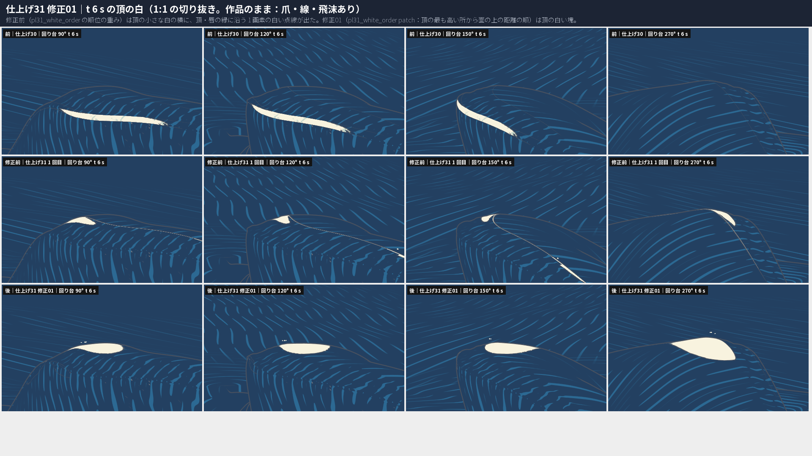
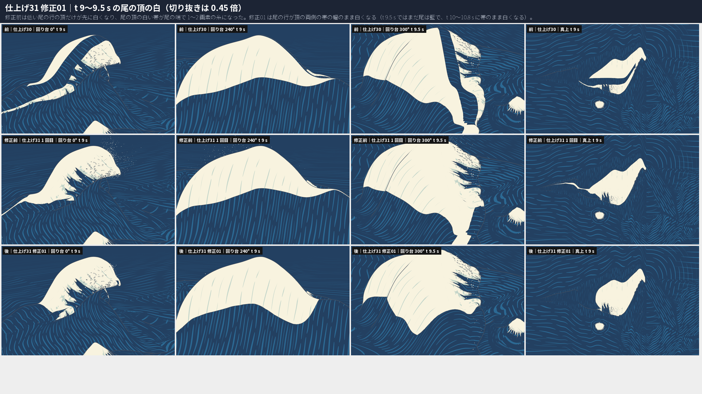
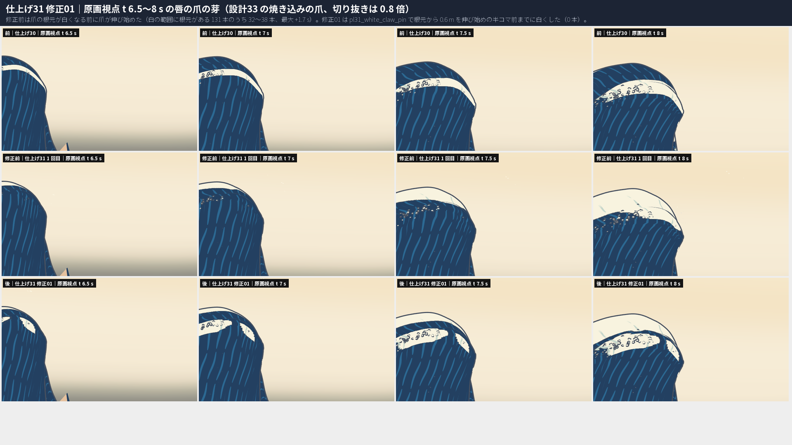
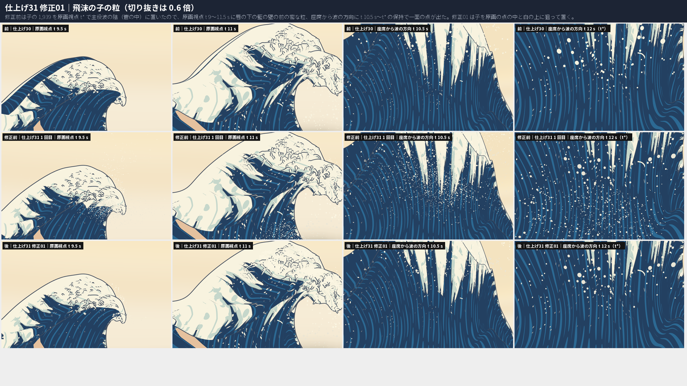
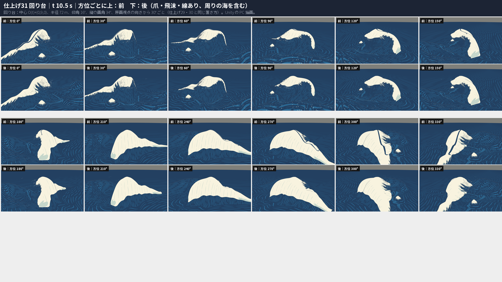
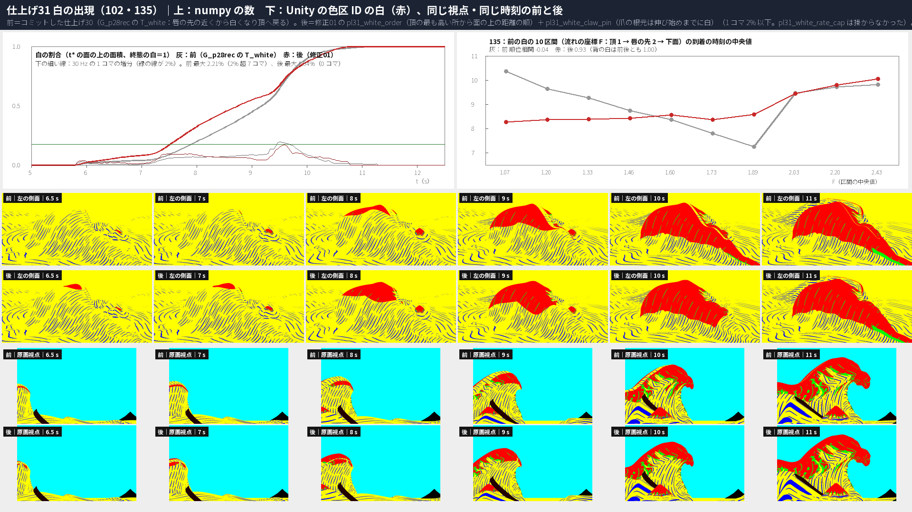
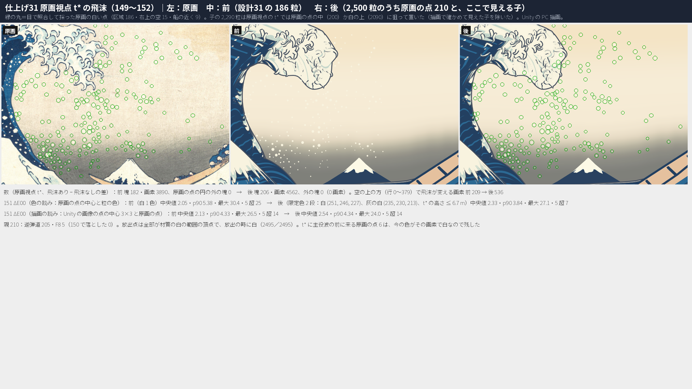
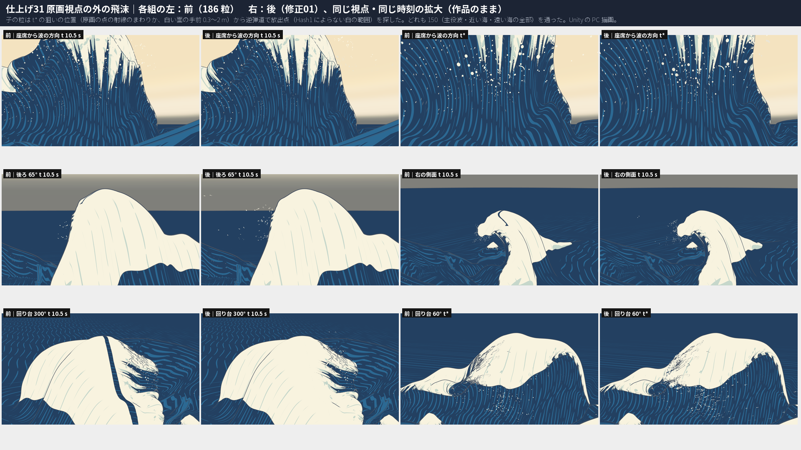

# 仕上げ31：設計31 白波の発生と飛沫 ― 白の出現を K\*′ P28R2rec・G\_p28rec・PL29 の材質の白で作り直し、頂の最も高い所から面の上の距離の順に塊として広げ（135）、爪の根元は伸び始めまでに白くした（136）。飛沫は原画の点 210 と子 2,290 の 2,500 粒で、子は原画の点の中と白の上に狙って置き、放出点は全部が Hash1 によらない白の範囲の頂点

日付：2026-10-01〜02／状態：**計画 §5.3 仕上げ31 の 9 行のうち 7 行を満たし、2 行は改善・測っただけ（151 の ΔE00、V3 の寿命）。作る部と、自己評審（評審 2 件の must-fix 合わせて 9 件）への修正の回 1 回（修正01。この群に［利用者の言葉］の項目はないので 1 回まで）の後、記録の部（2026-10-02）で証拠と提出の一覧を整えた。進行役の再評審の前。** 時間枠 1 日に対して約 3.7 時間（記録の部を入れて約 3.9 時間。第 9 節）。**HMD 実機の結果ではない。利用者は見ていない。** 証拠は Unity 6000.4.3f1 の PC オフスクリーン描画、Editor の Play モード 2 つ、Release のプレイヤーを PC で 1 回動かした結果と、numpy の検査。

**［利用者の言葉］の項目：0 件（満たしていない項目はない）。** 計画 §5.3 の仕上げ31 は「この群に、利用者の言葉でまだ満たしていないものはない」と書く。2 回目の修正の回もない。利用者の指示 Q28（色に原画カメラの投影を使わない）は、この群の範囲で守った。白は材質 PL29 の「白の範囲 ∧ T\_white ≤ τ」で、T\_white の時刻だけを替えた。飛沫の色は限定色 2 段で、粒の t\* の世界の高さで決める（粒ごとに原画の色を取る案は落とした。第 10 節の 9）。飛沫の位置を原画の点の射線に合わせるのは設計31 の置き方で、色の投影ではない。

- **前＝コミットした仕上げ30（b9140db、2026-10-01 22:31:47 +0800、修正02 を含む）。** 前の描画 `r_before2`（22:57）は、このコミットの後に `-pl31Old 1` で作った。修正前の記録は「仕上げ30 はコミットされていない」と書いたが誤りだった（修正01 で直した。第 10 節の 1）。後＝仕上げ31 修正01。図の多くには、修正前（仕上げ31 の 1 回目）も 3 段目に並べた。

**最初に（結論）**

1. **白の出現を作り直した（計画の 1・9 行）。** 仕上げ29 で主役波の色が立体の材質（PL29：白＝面の座標の白の範囲 ∧ T\_white ≤ τ）に替わり、仕上げ28 で形と動きが G\_p28rec に替わったので、終態の白を材質の白の範囲で定め直し、102 を測り直した。102：30 Hz の 1 コマの増分の最大 1.94%（表面）・1.90%（世界の面積）、2% 超 0 コマ（前 2.21%・2.15%、7・5 コマ）。
2. **白の広がる順を、頂の最も高い所からの面の上の距離の順にした（名前の付いた美術の誘導 `pl31_white_order`、修正01 の形 patch）。** 白は頂の最も高い所（行 160）の塊から始まり、頂に沿って横へ・前の面を唇の先と下面へ・背を下へ、同じ速さの比で広がる。修正前の形（F・頂の高さ・元の T の順位の重み）は、t 6 s に頂の小さな白の横の 1 画素の点線、t 8.5〜9.5 s に尾の頂の 1〜2 画素の糸を作った。修正01 ではどちらも出ない（`fig_pl31_fx_white_t6.png`・`fig_pl31_fx_white_tail.png`）。前（仕上げ30）の、白い頂を割る藍の筋（t 9〜10.5 s）も出ない。135（前の白の 10 区間の順位相関）：前 −0.04 → 0.93（修正前 0.96）。背は 1.00。
3. **爪が藍の面から伸び出さない（136、名前の付いた美術の誘導 `pl31_white_claw_pin`）。** 場面で再生する設計33 の爪（焼き込み）は、古い白の順（唇の先が先）で伸び始める。白の範囲に根元がある 131 本ごとに、根元から 0.6 m を伸び始めの半コマ前までに白くし、外 0.6 m を 1.5 m/s の円錐で早めた（3,504 頂点）。根元の白が伸び始めより遅い爪：前 8 本、修正前 38 本（自己評審の読みでは 32 本）→ 0 本（`fig_pl31_fx_claws.png`）。
4. **飛沫を 2,500 粒にした（計画の 4 行）。** 原画の点に合う親 210（唇の前の区域 186 ＋ 目で照合して足した右上の空 15・船の近く 9）と子 2,290。修正01 で子の置き方を作り直した：t\* の狙いの位置を先に決め（原画の点の射線のまわりで点の円の中 200、原画視点で白い面の手前 0.3〜2 m に 2,090）、逆弾道で白の放出点を探す。修正前は子の 1,939 を原画視点で主役波の陰（管の中）に置いたので、原画視点 t 9〜11.5 s の唇の下の藍の壁の前の密な粒と、座席から波の方向の t 10.5 s〜t\* の保持の一面の点になっていた。修正01 ではどちらも出ない（`fig_pl31_fx_spray.png`）。子の半径は原画の点に合わせた親の分布 ×0.85〜1.15（中央値 0.048 m、親 0.051 m。修正前 0.027 m）。**原画視点 t\* で原画の点の円の外に見える飛沫の塊 0。**
5. **放出点は 2,495／2,495 が、房の不揃い（Hash1）のどの値でも白の範囲に入る頂点で、放出の時にもう白い**（計画の 2 行。F8 の 5 粒は放出点なし。設計31 は 63／186 が白でない頂点。修正前は 2,462／2,495 だけが Hash1 によらない）。
6. **150 は主役波・近い海の全部の行・遠い海の全部の行で確かめた。** 修正前の検査は近い海の行 0〜30 だけを見て、水の中の偶奇も頂点から 1 m 以内だけだったので、子 11 粒（自己評審の読みでは 9 粒）が水へ入り、11 粒とも t\* の保持で水の中にあった。修正01 は全部の行と全部の点の偶奇（生成器 30 Hz、表から読み直す 2 回目の検査 60 Hz と τ = 0）で、水の中 0・引き戻し 0・離れない 0。149（放出の 0.2 s 後の水面からの距離）：親 最小 0.133 m、子 最小 0.112 m（0.1 m 未満 0。修正前の子は最小 0.071 m、0.1 m 未満 1）。
7. **151 ΔE00 は改善したが ≤5 を全部では満たさない（記録のみ）。** 粒の色は限定色 2 段（白・生成りと灰の白）で、どちらかを粒の t\* の世界の高さで決める。色の読み p90 5.38 → 3.84、最大 30.4 → 27.1、5 超 25 → 7。描画の読み p90 4.33 → 4.34、最大 26.5 → 24.0、5 超 14 → 14。
8. **原画視点の形の関門は後退しない。** t\* の ID の画像が仕上げ30 と SHA-256 まで同じで、78・130・131・132・72 は仕上げ30 と同じ値。評価器 23 は修正前と同じ（線あり 2 組で 213 が不合格 → 合格 4.88 → 3.81 px。飛沫の点が空の読みを動かしただけで、数えない）。
9. **残る見え方**（第 7 節）：135 は爪の根元の白で唇の F 1.6〜2.0 の区間が早まる（0.93）。早く伸びる唇の爪の根元の白は、頂の白が届くまで最長約 3 s、唇の上の小さな白い塊として先に見える。原画視点 t 6.5〜7 s に、頂の白の塊が輪郭に沿う 2〜4 画素の帯に見える（塊の縁を斜めから見た所。0.5 s で広がる）。白の上の子 2,090 は、原画視点の外（回り台 0〜180°）では唇のまわりの飛沫の群れで、0〜60° では一部が唇の下の藍の前に重なる（密度は前の親の点と同じくらい）。

| t 6 s の頂の白（前｜修正前｜修正01） | t 9〜9.5 s の尾の頂の白 |
| --- | --- |
|  |  |

| 原画視点 t 6.5〜8 s の唇の爪の芽 | 飛沫の子の粒（原画視点 t 9.5・11 s、座席から波の方向 t 10.5・12 s） |
| --- | --- |
|  |  |

| 回り台 t 10.5 s（上：前、下：後） | 白の出現（102・135） |
| --- | --- |
|  |  |

| 原画視点 t\* の飛沫（原画｜前｜後） | 原画視点の外の飛沫（前｜後） |
| --- | --- |
|  |  |

---

## 1. 作ったもの

### 1.1 白の部（`Tools/GWWaveGen/pl31/pl31_white.py`・`pl31_zone.py`）

- **終態の白の定義**：材質 PL29 の frag の「白の範囲」（背の境 b(c)、前の白の終わり F\_end(c)、爪の指の房、縁の泡の小さな舌、唇の先、背の足、低い行）を numpy で同じ式にした（`pl31_zone.zone`）。値は `Tools/GWWaveGen/pl29/pl29_material_params.txt`、面の座標は `Build/Polish/29/fix01/attr/pl29_hero_attr_f32.bin`。画面の画素で舌を消す所（\_FeaturePx）は入れない。房の不揃いの Hash1 は float32 で計算するが GPU の sin とは同じ値にならない（割合の時間の変化を数えるのに使う）。修正01 で、Hash1 のどの値でも白の範囲に入るかの下限 `pl31_zone.zone_robust` を足した（房の舌は −\_Finger.z 以上、縁の泡の長さは 0.6·\_Fringe.y 以上）。原画カメラの投影は使わない（Q28）。
- **102 の読み**：本体の列 18〜394 の三角形ごとに重心座標の標本（3 分割、161.8 万標本、白の範囲 71.6 万）を置き、面の座標と T\_white をシェーダーと同じ線形の補い（3 頂点とも届けば白、3 頂点とも届かなければ白でない）で読む。t\* の面の上の面積と、今の形の世界の面積の 2 つで、30 Hz の 1 コマの増分を数える。
- **`pl31_white_order`（修正01 の形 patch。135）**：本体の列の有限の T\_white の値の集まり（89,349 頂点）はそのままに、距離 d = √(Δc² + Δs²) の順に早い時刻から割り当て直す。Δc は頂に沿う c の、頂の最も高い行（行 160、c −0.80 m）からの差、Δs は頂（F = 1）からの弧長（t\* の面の上の m。前は唇の先・下面へ、背は背の下へ）。前と背の速さの比 1・1、頂の帯の幅 0（`--patch-ks 1 --patch-kb 1 --patch-wf 0 --patch-wb 0`）。|Δτ| の中央値 0.211 s、最大 2.67 s。距離の順なので、白の縁はどこでも塊の縁で、頂の線だけが先に白くなることがない。尾の行（幅 1.6〜6 m）は、頂の両側が同じ時に白くなる。
- **`pl31_white_claw_pin`（修正01。136）**：設計33 の爪（場面で再生する焼き込み。`Build/Design/33/claws`）の根元は sheet\_rc（行, 列）、伸び始めは最初に見えるコマ（`ds33_claw_skel_f32.bin` の見える）。白の範囲に根元がある 131 本ごとに、根元から 0.6 m 以内（面の座標 (c, s) の距離）の T\_white を伸び始めの半コマ前までに、外 0.6 m を根元から 1.5 m/s で広がる円錐の時刻までに早める（早める向きだけ。3,504 頂点）。
- **`pl31_white_rate_cap`**（設計31 の `ds31_white_rate_cap` と同じ形）：1 コマの増分が 2% を越える時だけ 1.8% に付け替える。修正01 では順と爪の根元の後に最大 1.94%・1.90% で越えないので、掛からなかった。
- **出力**：`Build/Polish/31/white/pl31_twhite_r32f.bin`（`76e00d0b…`）と `hero_pkg/`（位置・精度の層は G\_p28rec の art\_on へのハードリンク、T\_white と keypose の JSON だけ差し替え）。発生の表 `pl31_white_onset.json`＋`_f32.bin`（39,809 記録、設計31 と同じ 15 値。背 10,143・唇の上面 23,428・唇の下面と管の天井 6,238）。修正前の出力は `Build/Polish/31/white_r0/` に名前を替えて残した。

### 1.2 飛沫の部（`Tools/GWWaveGen/pl31/pl31_spray.py`）

設計31 の `ds31_spray.py` の取り出し・層への置き方・F8・パッケージの関数を借り、主役波を `hero_pkg`（G\_p28rec・新しい T\_white）、海を仕上げ30 の `Build/Polish/30/sea`、K\*′ を P28R2rec にした。

1. **取り出しと目の照合**（`pl31_dots_eye.json`）：空の全体の候補 260 を取り出し、区域の外の 74 を 128×128 参照画素の切り抜きで、区域の中を 1:1 の 6 枚の切り抜きで目で見た。区域の中の 186 は誤りなし（暗い帯の唇の前に取りこぼしが 2〜3 個。同定が不確かなので足さない）。区域の外は 24 を採った（右上の空 15・船の近く 9）。採らなかった 50：紙の地・雲の地 34、画面の端 8、題箋・落款の文字の縁 4、判断のつかないもの 4。左の波の上の空に白い点はなかった。
2. **置き方**：設計31 と同じ規則（唇の先 列 200 の前方 0.5〜3 m の層、PaintingCam v1 の射線の上）。210 とも t\* の場面より手前で見える。t\* に主役波の前に来る点 6 は、今の主役波の色がその画素で白（Unity の色区 ID）なので残した。
3. **逆弾道（親）**：放出点の候補は、修正01 で **Hash1 によらない白の範囲**（`zone_robust` > 0.01）の頂点（F 1〜2.8、行 11〜236・列 90〜292 を 2 行・3 列おき。白の範囲 4,953 のうち 4,203）× τ\_e（−2.8〜−0.08 s、0.04 s おき）。条件は設計31 と同じ（v0 と水面の速度の角度 ≤ 45°、速さの比 0.5〜2、離れる向き）に τ\_e ≥ その頂点の T\_white を足す。親 210：逆弾道 205・F8 5。
4. **150 の検査（修正01 の `check_paths_full`）**：主役波の本体の列 18〜394・近い海 64 行・遠い海 19 行の全部。240 Hz の各コマで最も近い頂点までの距離（引き戻し）、真上への半直線の交差の偶奇（水の中）は頂点から 1 m 以内の点と、30 Hz ごとに全部の点。放出から 0.3 s のうちに半径 ＋ 0.10 m 離れない粒も落とす。子は 149 の 0.2 s 後の距離 ≥ 0.10 m も条件にした。
5. **子の粒（修正01 の targeted）**：
   - **原画の点の中（inside\_dot）**：親の点ごとに、点の射線のまわり（点の円の中、親の奥行き ±0.35 m）に狙いを置き、子の画面の上の大きさは点の半径の 0.8 倍まで、色の段は点と同じ。点ごとに 2 個まで（4 個まで・±0.6 m にした版は、回り台 30〜60° で射線に並んだ子が 4〜5 点の短い点線に見えたので減らした。第 10 節の 6）。
   - **白の上（over\_white）**：原画視点 t\* で、色区 ID の白で描画でも白（3×3 で縮めた白）の主役波の画素（唇・頂の箱 x 700〜1300・y 150〜620）の、白い面の手前 0.3〜2 m。子の外周 ＋2.5 画素まで白であること、白・生成りの段の高さであること。
   - 狙いごとに親と同じ逆弾道で放出点を探し、得点の上位 8 から 1 つを選ぶ（放出点を散らす）。狙い：点の中 1,025（試し 1,332）、白の上 3,467（試し 10,500）→ 候補 4,492 → 150・149 を通った 2,927（引き戻し 218・水の中 1,097・離れない 1,538・0.2 s 後 0.1 m 未満 845、重なりあり）。
   - **描画で確かめた除き**：Unity の原画視点 t\* の描画（飛沫あり − 飛沫なし）で原画の点の円の外に見えた塊を、4 回の描画（`fix01/r_s4` 17 塊・`r_fx01` の 1 回目 1・`fix01/r_s5` 8・`fix01/r_s6` 1）から合わせ（27 塊、`pl31_measure_fx01_drop.json`）、それに重なる子 111 を除いて選び直した。採った子 2,290：点の中 200、白の上 2,090。
   - 大きさ：子の半径は親（原画の点の大きさから決めた半径）の分布から取り ×0.85〜1.15。p10・中央値・p90：親 0.036・0.051・0.082 m、子 0.032・0.048・0.075 m（点の中 0.029・0.039・0.053、白の上 0.033・0.049・0.076）。修正前の子 0.020・0.027・0.047 m。
6. **色（151）**：限定色 2 段。白・生成り (251, 246, 227)（調色板の white）と灰の白 (235, 230, 213)（原画の暗い帯の点 L\* < 92 の平均と白・生成りの Lab の中点）。粒の t\* の世界の高さ y ≤ 6.7 m の粒を灰の白にする（3 次元の量）。白・生成り 2,372 粒、灰の白 128 粒（白の上の子は白・生成りだけなので、修正前の 902・1,598 から替わった。親の灰の白は 82 のまま）。
7. **パッケージ**（`Build/Polish/31/spray/`）：色の段ごとに 30 Hz × 421 コマの表（`GreatWave.DS31.particles/1`、色は JSON）と解析式の表。F8 の版（親 210 を全部 F8）も別に書いた。修正前の出力は `Build/Polish/31/spray_r0/` に残した。
8. **表から読み直す 2 回目の検査**（`pl31_fx01_check150.py`）：書き出した `pl31_spray_table.json` を読み直し、同じ網で偶奇を 60 Hz ごとに全部の点と、τ = 0（t\* の保持の位置）で調べる。

### 1.3 Unity（`Unity/Assets/GreatWave/Polish31/`）

- `Editor/PL31Render.cs`：仕上げ30 の PL30Render を写し、`-pl31Old 1`（前）／既定（後：`-pl29HeroPkg`・`-pl31Spray`、2 つ目の DS31InstancedParticles で灰の白）を足した。回り台と動画は既定で作品のまま（爪・飛沫あり）。段 `white`（色区 ID を白の時刻あり・なしで同じ形に描く）と、full の飛沫なしの画像を足した。
- `Scripts/PL31SprayFollow.cs`：2 つ目の飛沫の Play モードの入切を 1 つ目に合わせる。
- `Editor/PL31Setup.cs`：PL30\_Release・PL30\_SinglePlayback を `Polish31/Scenes/PL31_Release.unity`・`PL31_SinglePlayback.unity` へ写し、主役波の packageDir を `Build/Polish/31/white/hero_pkg`、飛沫を 2 段に。PL30 の場面は変えていない（SHA-256 が前後で同じ）。修正01 は同じ場所のデータを差し替えたので、場面を作り直して記録した（PL31\_Release は新しい物の fileID が毎回替わるので SHA-256 が替わる。`fae6da09…`）。
- `Editor/PL31ReleaseBuild.cs`：PL30ReleaseBuild を写し、場面を PL31\_Release、必ず要るデータを hero\_pkg と飛沫の 2 段に。修正01 のデータで作り直した。
- 道具の実行：`Tools/GWWaveGen/pl31/run_pl31_unity.ps1`・`run_pl31_player.ps1`。

---

## 2. 視点ごとの前と後（同じ視点・同じ時刻 t 6・9・10.5・12 s、作品のまま：爪・飛沫・線あり）

前＝`Unity/Build/Polish/31/r_before2`（コミットした仕上げ30、`-pl31Old 1`）、後＝`r_fx01`。どれも Unity の PC オフスクリーン描画（1920×1080）。図は `fig_pl31_ba_view_<視点>.png`（上の段：前、次の段：後、下：t 10.5 s と t\* の拡大、図の下の欄に前・後の中身。記録の部で見出しの切れを直した。第 14 節の 6）と `fig_pl31_ba_turntable_t<時刻>.png`。追加の時刻（t 6.5〜11.5 s）の 3 段の比べ（前｜修正前｜修正01）は `fig_pl31_fx_*.png`（描画 `fix01/r_bx`・`fix01/r_r0x`・`r_fx01x`）。

| 視点 | 後（目で見て） | 図 |
| --- | --- | --- |
| 原画視点 | t 6.5〜7 s：頂の白の塊（斜めから見て輪郭に沿う 2〜4 画素の帯、0.5 s で広がる）と、唇の白い帯の上の爪の芽（前と同じ形。修正前は藍の面の上の爪の芽）。t 9 s の白の形は前とほぼ同じ。t 9〜11.5 s に唇の下の藍の壁の前の粒はない（修正前は密）。t\* の飛沫の点は原画の点の位置に並び、原画にない白い点は見えない（数でも 0 塊）。画面の白の割合 t 7 s：前 10.6%・後 15.7%、t 9 s：51.5%・77.1%、t 10 s：87.8%・93.3%、t 11 s：99.4%・100% | `fig_pl31_ba_view_painting.png`・`fig_pl31_fx_claws.png`・`fig_pl31_fx_spray.png` |
| 座席 | 空を向く視点。t 10.5 s・t\* に空の中の淡い飛沫の点。t\* では頂の輪郭のすぐ上の空に、白の上の子の小さな群れが見える（座席は原画視点より低いので、原画視点で頂の白の手前にある子が輪郭の上に出る。頂から吹き上がる飛沫の読み）。傷はない | `fig_pl31_ba_view_seat.png` |
| 座席から波の方向 | t 10.5 s・t\* の藍の壁の前の飛沫の点は、前（親の 186）と同じくらいの数と大きさ（修正前の一面の小さな点はない）。白の帯・溝・爪は前と同じ | `fig_pl31_ba_view_seat_toward_wave.png` |
| 左の側面 | t 6 s：頂の白の塊。t 9 s：前の「白の中の藍の筋」がなく、一つの白い頂（尾はまだ藍）。t 10.5 s：尾の頂が帯の幅のまま白くなる（細い線・糸はない）。t\*：前と同じ白 | `fig_pl31_ba_view_side_left.png` |
| 右の側面 | t 9 s：前の唇の白と頂の白の間の藍の筋がない。t 10.5 s・t\*：唇の前に飛沫の群れ | `fig_pl31_ba_view_side_right.png` |
| 後ろ 65° | t 6 s：頂の三日月形の白（両端は細る。修正前は輪郭に沿う 1 画素の線）。t 9 s：前の頂の縁の欠けがなく白い頂がそろう。t 10.5 s・t\*：頂の左に飛沫の霧 | `fig_pl31_ba_view_back65.png` |
| 真上 | t 6 s：頂の丸い白。t 9 s：前は背の白と唇の白の間に藍の帯が横切る。後は一つの白い塊。t 10.5 s：尾へ帯の幅で伸びる。t\* は前と同じ形 | `fig_pl31_ba_view_top.png` |
| 回り台（12 方位） | t 6 s：どの方位でも頂の白い塊（前は唇の帯、修正前は小さな白と 1 画素の点線）。t 9 s：一つの白い頂で、尾はまだ藍（前は片と藍の筋、修正前は尾の頂の糸）。t 10.5 s：前の藍の筋（0・270・300・330°）がない。尾は帯で白くなる途中。t\*：前と同じ白に、唇のまわりの飛沫の群れ（0〜180°）。0〜60° では群れの一部が唇の下の藍の前に重なり、点の中の子の 2〜3 点の小さなまとまりが見える | `fig_pl31_ba_turntable_t060〜t120.png` |

- 動画（前｜後、t 0〜14 s、30 fps、作品のまま）：`pl31_ba_painting_30fps.mp4`（1.29 MB）・`pl31_ba_seat_30fps.mp4`（0.33 MB）・`pl31_ba_seat_toward_wave_30fps.mp4`（1.69 MB）・`pl31_ba_side_left_30fps.mp4`（0.61 MB）・`pl31_ba_tt_30fps.mp4`（1.31 MB、t\* の回り台）。
- **目で見て（Q28 の審査、7 視点＋回り台、4 時刻と追加の時刻）**：この群の範囲（白の出現・飛沫）に、色面の引き伸ばし・継ぎ目・平らな面・1〜2 画素の線は見えない。前の白の中の藍の筋はない。修正前の頂の点線・尾の頂の糸・藍の面から伸びる爪の芽・管の中の密な子の粒はない。残る見え方は第 7 節の 1〜5。爪の形（側面・後ろ・真上で読めない）は仕上げ32・33 の範囲で、この群では変えていない。

---

## 3. 計画 §5.3 の各行

| 行 | 今 | 判定 |
| --- | --- | --- |
| 1 仕上げ28 で形が変わったので、白の出現・発生の表・放出点を作り直す | G\_p28rec と PL29 の白の範囲で作り直した（第 1.1 節）。発生の表 39,809 記録 | 満たす |
| 2 放出点を、終態が白の頂点・テクセルに限る（設計31：63／186 が白でない） | 2,495／2,495 が Hash1 によらない白の範囲の頂点で、放出の時に白（F8 の 5 粒は放出点なし） | 満たす |
| 3 原画の白い点の取り出しを手の注記と照合。区域の外の点、t\* で主役波の前に来る 6 点 | 目で照合（第 1.2 節の 1）。区域の外は右上の空 15・船の近く 9 を足し、左の波はなし。主役波の前の 6 点は今の白の上なので残した | 満たす（照合は 1 人の目で 1 回） |
| 4 飛沫の数（186、計画は 2〜3 千）・大小・分布。設計39 の ③ の子（503）の大小と分布を原画の点に合わせる | 数 2,500（親 210・子 2,290）。大小：子の半径は原画の点に合わせた親の分布 ×0.85〜1.15（中央値 0.048 m、親 0.051 m）、点の中の子は点の円に収まる。分布：原画視点では原画の点の中 200・白の上 2,090 で、t\* に原画の点の円の外の塊 0（設計39 の ③ は ΔE00 > 2 の画素 1,621）。原画視点の外では唇のまわりの飛沫の群れ（目で確かめた。原画に手本はない） | 満たす（原画視点の外の分布は手本がないので目の確かめだけ。第 7 節の 4・5） |
| 5 151 の ΔE00（最大 30.4） | 色の読み p90 5.38 → 3.84、最大 30.4 → 27.1、5 超 25 → 7（限定色 2 段）。描画の読み p90 4.33 → 4.34、最大 26.5 → 24.0 | 改善（≤ 5 は全部では満たさない。記録のみ） |
| 6 135・177 を今の動きで測る。F8 の見え方 | 135：前 −0.04 → 0.93（`pl31_white_order` patch。爪の根元の白で唇の F 1.6〜2.0 が早まる）。177：25 本とも上がる。F8：第 5 節 | 測った（135・177 合格の読み） |
| 7 V3 の飛沫の寿命が 150 のために延びない粒（105／186） | 今の親 205 のうち、τ\_e を 1.6 倍早めて 150 を通る候補があるのは 71、ないのは 134 | 測った（限界 6） |
| 8 評価器に飛沫と爪の層を分けるマスクを作るか | 作らない（決めた）。評価器の ID に飛沫を入れない今の読みを続け、飛沫は「飛沫あり − 飛沫なし」の差の画像で別に数える（`pl31_measure.py`）。爪は `t28_claws`／`t28_white` の 2 組で分けて読めている | 決めた |
| 9 白の出現の精度（美術優先31 の残り） | 102：表面 1.94%・世界 1.90%、2% 超 0 コマ（前 2.21%・2.15%、7・5 コマ）。Unity の色区 ID で、終態の白の範囲の外の白 最大 4 画素（前も 4。境の 1 画素のぶれ）、白でない色区の塗り替え 0 | 満たす |

バックログ 102・135・136（爪の根元、この群の白の順で崩れたので直した）・176・177・149〜152 の値は第 6 節。172〜174・201・220・223・226・230 は文言がリポジトリの外にあり（仕上げ30 と同じ）、上の各行で数えた。

---

## 4. 原画視点の関門（形）と評価器（爪あり・爪なし、前の群と CP1／26修正01 に対して）

t\* の `t28_white`・`t28_claws` の画像が仕上げ30 と SHA-256 まで同じ（T\_white は t\* までに全部白、飛沫は ID に入れない）なので、形の値は仕上げ30 と同じ。`pl28u_regress.py --kstar rec`（`r_fx01`）。

| 項目 | 後（爪なし／爪あり） | 前の群（仕上げ30 修正02） | CP1 | 26修正01 | 関門 | 判定 |
| --- | --- | --- | --- | --- | --- | --- |
| 78 | 2.741／2.741 | 2.741 | 2.772 | 1.641 | ≤ 4 | 合格（後退なし） |
| 130 | 3.5815／3.5815 | 3.5815 | 1.968 | 1.953 | ≤ 4 | 合格（後退なし） |
| 131 | 3.4419／3.4419 | 3.4419 | 1.814 | 1.798 | ≤ 4 | 合格（後退なし） |
| 132（σ12 最大） | 3.5576／3.5576 | 3.5576 | 1.326 | 1.574 | ≤ 4 | 合格（後退なし） |
| 72（σ12 p95） | 3.8507／3.5698 | 3.8507／3.5698 | 1.558 | 1.723 | ≤ 4 | 合格（後退なし） |

- CP1／26修正01 に対しては、段階5確認 §6.3 以来の後退のまま（この群で増えも減りもしない）。
- 評価器 23（4 組、`r_fx01/eval23/off_*`）：線なし（爪あり・爪なし）合格 4・不合格 5（仕上げ30 と同じ）。線あり（爪あり・爪なし）合格 2・不合格 7（仕上げ30 は 1・8）。変わったのは 213（空の移り）で 4.88 → 3.81 px（不合格 → 合格）。線なしの 213 は 19.14 → 21.64 px（不合格のまま）、76 sky\_dark（線あり）p95 18.60 → 18.63 px。どれも評価に使う飛沫ありの画像の暗い帯の点の違いが空の帯の読みを動かしたもので、波の形の改善ではない。213 の合格は数えない（記録のみ）。値は修正前と同じ（修正01 の子は原画視点 t\* で点の中か白の上なので、評価器の画像は変わらない）。
- 色区の項目 73〜270（新しい読み）は t\* の画像が同じなので値も同じ。

---

## 5. F8（固定配置と短い落下）の見え方（計画の 6 行）

`fig_pl31_f8.png`（上：原画の点 210 を全部 F8 にした版、下：採った版、t 11・11.6・12 s。描画 `r_fx01_f8`・`r_fx01_f8t`）。F8 の点は t\* の 0.4 s（τ）前に t\* の位置の近くに現れ、唇の水平の速さで流れながら落ちて着く。原画視点 t 11 s では F8 の版には点がほとんどなく、t 11.6 s に点の並びがまとまって現れて止まって見える（唇から出る動きがない）。採った版は t 11 s から唇の前に点が広がる。F8 は逆弾道で解けない点の予備として残し、使ったのは 5 粒（設計31 は 0）。F8 の版も 210 とも 150 を通る。

---

## 6. 数

| 項目 | 前（仕上げ30） | 修正前（仕上げ31 の 1 回目） | 後（修正01） |
| --- | --- | --- | --- |
| 白の 1 コマの増分の最大（t\* の面の上の面積／今の世界の面積） | 2.21%／2.15%（2% 超 7・5 コマ） | 1.83%／1.96%（0・0） | 1.94%／1.90%（0・0。rate\_cap は掛からない） |
| 最初の白／全部そろう | t 5.80 s／11.27 s | 5.81 s／10.37 s | 5.80 s／10.77 s |
| 135 前の白の 10 区間の順位相関（背の白） | −0.04（1.00） | 0.96（1.00） | 0.93（1.00）。区間の中央値 t 8.27 → 10.05 s（F 1.07 → 2.43。F 1.73 の区間だけ 8.37 s で逆。爪の根元の白） |
| 136 白くなる前に伸び始める爪（白の範囲に根元 131 本。根元の T\_white を双線形に補って 1 コマ超遅い） | 8 本（最大 +1.06 s） | 38 本（最大 +1.92 s。自己評審の読み 32 本・+1.68 s） | 0 本（4 頂点がそろう読みでも 0。爪の根元の白の前は 43 本・最大 +3.23 s） |
| 177 藍の胴の溝 25 本の平均の高さ | t 2 s → t\* で 25 本とも上がる（0.30〜5.20 m） | 同じ | 同じ（1/30 s の下がりの最大 0.017 m） |
| 176 白でない色区が塗り替わる画素（Unity、原画視点・座席・左の側面・真上 × 14 時刻） | 0 | 0 | 0 |
| 102 終態の白の範囲の外の白（同じ） | 最大 4 画素 | 最大 4 画素 | 最大 4 画素 |
| 飛沫の数 | 186（逆弾道 186） | 2,500（親 210、子 2,290：管の中など隠れる 1,939・画面の外 231・白の上 70・点の中 50） | 2,500（親 210、子 2,290：点の中 200・白の上 2,090） |
| 放出点が白の範囲で放出の時に白／Hash1 によらない | （設計31：63／186 が白でない） | 2,495／2,495／2,462 | 2,495／2,495／2,495 |
| 半径 p10・中央値・p90（親／子、m） | 0.030・0.052・0.111（最小・中央値・最大） | 0.036・0.051・0.082／0.020・0.027・0.047 | 0.036・0.051・0.082／0.032・0.048・0.075 |
| 見えている時間の中央値（t の秒、親／子） | 設計31：2.50 | 2.84／2.92 | 2.68／1.40 |
| 最初に見える飛沫（生成の記録の first\_show\_t。最初の白の後） | — | t 5.88 s | t 5.88 s（頂の白の塊から。回り台・後ろ 65°・原画視点の t 6〜7 s に、頂の白の上の空に 1〜3 画素の点が数個。記録の部で全解像度の描画を見て確かめた。線や面の傷ではない） |
| 149 放出の 0.2 s 後の水面からの距離 | 親 最小 0.131 m | 親 0.133 m、子 0.071 m（0.1 m 未満 1） | 親 0.133 m・中央値 0.423 m、子 0.112 m・0.370 m（0.1 m 未満 0） |
| 150 水面へ引き戻される・水の中（主役波・近い海・遠い海の全部、表から読み直す 60 Hz） | 0 | 引き戻し 0・水の中 11（11 粒とも t\* の保持で水の中。自己評審の読み 9・8） | 0・0（t\* の保持 0、離れない 0） |
| 152 原画視点 t\* の飛沫の暗い縁の画素・64 画素以上の塊の外接の四角の比の最大 | 0・0.84 | 0・0.84 | 0・0.84（描き方は設計31 と同じ無照明・不透明の球） |
| 原画視点 t\* の飛沫の塊・画素・原画の点の円の外の塊 | 182・3,890・0 | 206・4,571・0 | 206・4,562・0 |
| 空の上の方（行 0〜379）で飛沫が変える画素 | 209 | 537 | 536 |
| 151 色の読み（中央値・p90・最大・5 超） | 白 1 色：2.05・5.38・30.4・25（同じ 210 点） | 2.33・3.84・27.1・7 | 同じ |
| 151 描画の読み（同じ） | 2.13・4.33・26.5・14（186 点） | 2.54・4.34・24.0・14 | 同じ |
| Play モード（PL31\_SinglePlayback／PL31\_Release） | — | 818 行／6,739 行 | 817 行／6,732 行、PL29 の材質、焼き込みのパス 0。例外は Unity の Editor の検索の索引の 1 つ（前と同じ、この群のコードではない） |
| Release | — | Succeeded、プレイヤー pass | Succeeded、データ 44 ファイル 813 MB、必ず要るデータあり、焼き込み 0、絶対のパス 0。exe を PC で 1 回：pass、50,968 フレーム、エラー 0・例外 0 |

---

## 7. 限界（10/29 以降の一覧へ）

1. **爪の根元の白が頂の白より先に見える**：設計33 の爪（焼き込み）は古い白の順（唇の先が先）で伸び始めるので、`pl31_white_claw_pin` で唇の早い爪（t 6.1〜6.9 s に伸び始める 28 本、船側と途中の列）の根元のまわりを先に白くした。頂の白が届くまで最長約 3 s、唇の上の小さな白い塊が爪の芽と一緒に見え、t 7 s ごろに唇の白い帯にまとまる（前の唇の帯と同じ読み）。135 は 0.96 → 0.93。爪の成長の時刻を今の白の順へ合わせ直すのは仕上げ32・33（第 8 節）。
2. **頂の白の塊の斜めの見え**：原画視点 t 6.5〜7 s に、頂の白い塊が輪郭に沿う 2〜4 画素の帯に見える（塊の縁を斜めから見た所で、0.5 s で広がる）。後ろ 65° の t 6 s は三日月形で両端が細る。1 画素の線ではない。
3. **尾の端の幅**：尾の行は t 10〜10.8 s に帯の幅のまま白くなるが、尾の端（行 12 の白の範囲の幅 2.6 m）は t\* でも細い。終態の白の範囲（材質 PL29）の形で、この群では変えていない。
4. **白の上の子 2,090**：原画視点 t\* では白の上で見えない。原画視点の外では唇・頂のまわりの飛沫の群れで、回り台 0〜60° では一部が唇の下の藍の前に重なり（密度は前の親の点と同じくらい）、座席の視点では頂の輪郭のすぐ上の空に小さな群れとして出る。原画にこの見え方の手本はない。子の見えている時間の中央値は 1.40 s（白い面の近くの短い弧）。
5. **点の中の子 200**：原画の点の射線のまわりに並ぶので、射線に直角な向き（回り台 30〜90°）からは 2〜3 点の小さなまとまりに見える（点ごと 4 個・±0.6 m の版は 4〜5 点の短い点線に見えたので減らした）。
6. **V3 の寿命**：親 205 のうち 134 は、放出を 1.6 倍早めると 150 を通る候補がない（設計35 は 105／186）。V3 は比べの版で場面に入らないので、作り直していない。
7. **151**：限定色 2 段で改善したが、暗い帯の小さな点（原画の点の L\* 55〜85）は ΔE00 が 5 を超える（色の読み 7 点、描画の読み 14 点）。原画の暗い帯の点は墨のぼかしが点の上にもかかった色で、粒の色を背景によらず決める規則（Q28）では合わせきれない。
8. **評価器の空の帯**：飛沫ありの画像は評価器の 76・212・213 の空の読みを動かす（第 4 節）。評価は形の関門と ID の読みで行い、空の項目の変化は数えない。
9. **白の範囲の numpy の写し**：房の Hash1 は GPU と同じ値にならない。放出点は Hash1 によらない下限（`zone_robust`）で選び、102 の割合の数えには Hash1 の float32 の値を使い、終態の白の画素の判定は Unity の色区 ID で行った。下限は房の舌を −\_Finger.z とみなす安全側の読みで、白の範囲の放出点の候補 4,953 のうち 750 を落とす。
10. **目の照合**：1 人の目で 1 回。暗い帯の取りこぼし 2〜3 個は足していない。
11. **飛沫の GPU の時間は測っていない**（2,500 粒 × 80 三角形の instancing。設計35 の計測器で仕上げ35）。
12. **場面の設計39 の密な飛沫**（既定は切）は、設計31 の古い飛沫の子のまま残る。この群の子が置き換えるので、入れないこと（仕上げ39 で整理）。
13. PL31\_Release の飛沫の 2 段目は、Play モードの入切を `PL31SprayFollow` が 1 つ目に合わせる（DS34LayerSet は 1 つ目しか知らない）。1 コマの遅れがありうる。

---

## 8. 後の群へ

- 仕上げ32（白波群と ID）・仕上げ33（爪）：白の出現の順は頂の最も高い所からの距離の順（`pl31_white_order` patch）。爪の成長の時刻（設計33 の 136「根元が白くなると伸び始める」）を、この順へ合わせ直す。合わせ直したら `pl31_white_claw_pin`（根元を先に白くする誘導）は外せる（`--claw-pin 0`）。発生の表 `pl31_white_onset.json`（39,809 記録、白の範囲の頂点）は爪の根元の候補に使える。t\* に主役波の前に来る原画の点 6 は、今は白の上で見えない。爪の形が変われば確かめ直す。
- 仕上げ35（数量と負荷）：飛沫 2,500 粒の GPU、子の大きさと HMD でのちらつき（限界 4・5・11）。
- 仕上げ39：設計39 の密な飛沫（503）の扱い（限界 12）。
- 体験の Release：今後は PL31\_Release（`PL31ReleaseBuild`）を土台にする。

---

## 9. 範囲・時間枠・実績

- 群：仕上げ31（設計31 白波の発生と飛沫）。バックログ項目 102、135、149〜152、172〜174、176、201、220、223、226、230（136 は白の順で崩れたので直した）。時間枠 1 日（計画 §5.2）。
- 実績（`date` の時刻）：作る部 2026-10-01 22:13〜23:34（約 1.4 時間）。修正の回（修正01）23:54〜10-02 02:10（約 2.3 時間）：白の順の作り直しと Unity での確かめ 23:54〜00:20、飛沫の子の作り直し・150 の検査の広げ 00:20〜01:05、描画・測り・図 01:05〜01:30、子の点の中のまとまりを減らした作り直しと描画の確かめ 01:30〜01:52、場面・Play モード・Release・プレイヤー・記録 01:52〜02:10。合わせて約 3.7 時間。Unity の 1 回の計算はどれも 30 分以内（描画で最長 43 s、Play モードで 92 s、プレイヤーで 95 s）。numpy の 1 回で長いのは飛沫の部の 380 s。
- 修正の回：計画 §5.1 の 1 回を使った（作る部の中の試し直しは修正の回に数えていない。第 10 節）。
- 記録の部（`date` の時刻）：2026-10-02 02:11〜02:21（約 10 分）。証拠の確かめ・図の見出しの直し・記録・提出の一覧（第 13 節）。新しい描画・numpy の計算はしていない。
- 日程（計画 §2.6 の表）：仕上げ31 の目標は 10/8（木）、累計 8 日。実際は 10/1〜10/2 で、目標より 6 日早い（仕上げ28〜30 が時間枠より早く終わったため）。

---

## 10. 決定の記録（Q24：推奨の案を選び、理由と落とした案を残す）

1. **前はコミットした仕上げ30（b9140db）。** 作る部の記録は「仕上げ30 はコミットされていない」と書いたが、b9140db（修正02 を含む）は 2026-10-01 22:31:47 +0800、この群の作る部の途中で、記録より前にコミットされていた。前の描画 `r_before2`（22:57）はこのコミットの後に作ったので、前の画像と数はコミットした仕上げ30 のもの。記録・metrics.json・図の見出しを直した。
2. **白の順は、頂の最も高い所からの面の上の距離の順（patch）。** 落とした案：(a) 修正前の順位の重み（F 0.6・頂の高さ 0.3・元の T 0.1。135 は 0.96 だが、t 6 s の頂の 1 画素の点線と t 8.5〜9.5 s の尾の頂の糸）。(b) 前の面の広がりを頂に沿う向きの 2〜3 倍にする（135 が −0.03〜−0.58 に下がる。唇の先が尾の頂より先に白くなる）。(c) 頂の両側に幅 1〜2 m の帯をそろって白くする（135 が 0.75〜0.95、帯の分だけ頂の線に近い見えになる）。距離の順で、頂の線だけが先に白くなる形はどこにも出ない。
3. **爪は「根元を伸び始めまでに白くする」誘導で守り、爪の時刻は変えない。** 落とした案：(a) 爪の根元から 3 m/s・6 m の円錐（47,301 頂点が動き、135 が −0.09。唇の白が頂より先になる）。(b) 爪の根元のまわりで古い T\_white を残す（古い順が唇の帯で戻り、前の藍の筋の元になる）。(c) 爪の成長の時刻を作り直す（設計33 の焼き込みの作り直しで、仕上げ32・33 の範囲。番号の順を崩す）。根元 0.6 m・円錐 0.6 m・1.5 m/s で、動く頂点は 3,504、135 は 0.93。
4. **子は t\* の狙いの位置を先に決めて逆弾道で出す。** 落とした案：(a) 修正前の「散らして規則に合うものだけ採る」（管の中に 1,939 が詰まった）。(b) 子を減らして計画の 4 行を一部にする（計画の数 2〜3 千を満たさない）。(c) 子を途中で消す（寿命で半径 0 にする。空中で消える飛沫は 150 の読みの外で、説明が要る）。白の上の子は原画視点 t\* で白の上にあり、原画にない点を足さない。
5. **子は描画で確かめ、見えた子を除いて選び直した。** numpy の z バッファと色区 ID の「白」だけでは、爪と唇の線の上・頂の輪郭の近くで見える子が残った（4 回の描画で合わせて 27 塊）。
6. **点の中の子は点ごと 2 個・奥行き ±0.35 m。** 落とした案：4 個・±0.6 m（381 個。回り台 30〜60° で射線に並んだ 4〜5 点の短い点線に見えた）。減らした分は白の上の子で埋めた（試し 9,000 → 10,500）。
7. **放出点は Hash1 によらない白の範囲に限る。** 落とした案：「2,453 は Hash1 によらない ＋ 42 は未確かめ」と記録するだけ。白の範囲の候補 4,953 のうち 4,203 が残り、親・子とも足りた。
8. **150 は全部の網で、偶奇は全部の点で調べる。** 近い海の行 0〜30 と頂点から 1 m の門は、深い水の中の点（頂点から遠い）と右の高い波を見落とした。2 回目の検査（表から読み直す、60 Hz と τ = 0）を足した。
9. **粒の色は限定色 2 段で、t\* の世界の高さで決める。** 粒ごとに原画の点の色を取る案は、原画からの色を粒に写す形になり（Q28 の趣旨に反する）落とした。
10. **t\* に主役波の前に来る原画の点は残した。** 今の色がその画素で白なので見えない。
11. **評価器のマスクは作らない**（第 3 節の 8 行）。
12. **白の範囲の外の白 4 画素は、境の 1 画素のぶれとして記録だけにした。** 前（仕上げ30）も同じ 4 画素。

### 修正01 の指摘と対応（自己評審の 9 件）

| 指摘 | 対応 | 結果 |
| --- | --- | --- |
| t 6 s の頂の白の横の 1 画素の白い点線（回り台 90・120・150・180・270°、左右の側面） | `pl31_white_order` を距離の順（patch）に作り直した | 頂の白い塊。点線なし（`fig_pl31_fx_white_t6.png`、後ろ 65° も三日月形） |
| t 8.5〜9.5 s の尾の頂の白い帯が 1〜2 画素の糸に細る（回り台 0・30・210〜330°、真上、左の側面） | 同じ（尾の行は頂の両側が同時に白くなる） | t 9.5 s まで尾は藍、t 10〜10.8 s に帯の幅で白くなる（`fig_pl31_fx_white_tail.png`） |
| 計画の 4 行は一部：子の大きさが合わない、管の中の子が原画視点 t 9〜11.5 s の粒と座席から波の方向の一面の点になる | 子を狙いの位置から逆弾道で出す（点の中・白の上）。半径は親の分布 ×0.85〜1.15 | 粒・一面の点なし（`fig_pl31_fx_spray.png`）。子の半径の中央値 0.048 m。4 行は根拠を書いて満たす |
| 前の記述の訂正（仕上げ30 はコミット済み） | 記録・metrics.json・図の見出しを直した | 第 10 節の 1 |
| 爪が藍の面から伸び出す（32／131、最大 +1.68 s） | `pl31_white_claw_pin`。102・135・図を測り直した（rate\_cap は掛からない） | 0／131（`fig_pl31_fx_claws.png`） |
| 「150 は全部の粒が通る」は誤り（9 粒が水へ、8 粒が保持で水の中） | 検査を全部の網・全部の点の偶奇にし、2 回目の検査を足した。水の中の子は作り直しで出ない | 修正前の読み直し：11 粒・11 粒（読みの違いで 2 粒多い）。修正01：0・0 |
| 記録の誤り（コミット） | 1 と同じ | 同じ |
| 放出点の主張が言い過ぎ（Hash1 によらないのは 2,453） | 放出点の候補を Hash1 によらない白の範囲に限った | 2,495／2,495（下限との余裕 0.01） |
| 4 行と 149 の記録の誤り | 4 行は上のとおり。149 に子を足した | 子 最小 0.112 m、0.1 m 未満 0（修正前 0.071 m・1） |

---

## 11. 再現

```
# 白の部（numpy）。既定 --order-mode patch --patch-ks 1 --patch-kb 1 --claw-pin 0.6 --claw-pin-v 1.5 --claw-pin-cone 0.6 --rate-cap 0.018
py -3.10 -B Tools/GWWaveGen/pl31/pl31_white.py                     # 出力 Unity/Build/Polish/31/white（hero_pkg を含む）
py -3.10 -B Tools/GWWaveGen/pl31/pl31_white.py --order 0 --rate-cap 0 --out G:/Unity/GreatWave_2026_Fresh/Unity/Build/Polish/31/white_before   # 前の測り
# 飛沫の部（numpy。白の部の後）。既定 --child-mode targeted --check full。除きの塊の一覧は描画で確かめたもの
py -3.10 -B Tools/GWWaveGen/pl31/pl31_spray.py --drop-visible G:/Unity/GreatWave_2026_Fresh/Unity/Build/Polish/31/fix01/measure_drop_merged3.json
py -3.10 -B Tools/GWWaveGen/pl31/pl31_fx01_check150.py --spray G:/Unity/GreatWave_2026_Fresh/Unity/Build/Polish/31/spray --out G:/Unity/GreatWave_2026_Fresh/Unity/Build/Polish/31/fix01/check150_spray.json
# 描画（Unity は 1 つずつ。run_pl31_unity.ps1 が unity.lock を取る）。<共通> は第 12 節
run_pl31_unity.ps1 -Method GreatWave.Polish31.EditorTools.PL31Render.Render -Log r_fx01 -Extra "-pl29Out <B>/r_fx01 <共通> -pl29HeroPkg Build/Polish/31/white/hero_pkg -pl31Spray <B>/spray -pl29Only views,tt,t28,full,video,white"
run_pl31_unity.ps1 -Method ...PL31Render.Render -Log r_before2 -Extra "-pl29Out <B>/r_before2 <共通> -pl31Old 1 -pl29Only views,tt,video,white,full"
run_pl31_unity.ps1 -Method ...PL31Render.Render -Log r_fx01x -Extra "-pl29Out <B>/r_fx01x <共通> -pl29HeroPkg ... -pl31Spray <B>/spray -pl29Only views,tt -pl29Times 6.5,7,7.5,8,8.5,9.5,10,11,11.5"（前は fix01/r_bx に -pl31Old 1、修正前は fix01/r_r0x に -pl29HeroPkg Build/Polish/31/white_r0/hero_pkg -pl31Spray <B>/spray_r0）
run_pl31_unity.ps1 -Method ...PL31Render.Render -Log r_fx01_f8 -Extra "... -pl31SprayStem pl31_spray_f8 -pl29Only views -pl29Times 11,11.6,12"（採った版は r_fx01_f8t）
# 数え・評価器・図
py -3.10 -B Tools/GWWaveGen/pl31/pl31_measure.py --before Unity/Build/Polish/31/r_before2 --after Unity/Build/Polish/31/r_fx01 --out Unity/Build/Polish/31/measure_fx01
# 形の関門と評価器 23 の 4 組（Git 対象外の run_eval.sh の中身。R = <B>/r_fx01。idmap は設計40 の Build/Design/40/compare/eval/idmap.json）
py -3.10 -B Tools/GWWaveGen/pl28/pl28u_regress.py --scene $R --kstar rec
for c in line line_noclaws noline noline_noclaws; do py -3.10 -B Tools/PaintingTruth/evaluate.py --render $R/full/painting_t120_off.png --ids $R/full/ids_$c.png --idmap Unity/Build/Design/40/compare/eval/idmap.json --out-dir $R/eval23/off_$c --name off_$c; done
py -3.10 -B Tools/GWWaveGen/pl31/pl31_sheets.py --before <B>/r_before2 --after <B>/r_fx01 --out Docs/Evidence/Polish/31   # 記録の部は --skip-video（動画は修正01 のまま）
py -3.10 -B Tools/GWWaveGen/pl31/pl31_figs.py --before Unity/Build/Polish/31/r_before2 --after Unity/Build/Polish/31/r_fx01 --f8 Unity/Build/Polish/31/r_fx01_f8 --after-f8times Unity/Build/Polish/31/r_fx01_f8t --out Docs/Evidence/Polish/31
py -3.10 -B Tools/GWWaveGen/pl31/pl31_fx01_figs.py --before <B>/fix01/r_bx --before-main <B>/r_before2 --r0 <B>/fix01/r_r0x --r0-main <B>/r_final2 --after <B>/r_fx01x --after-main <B>/r_fx01 --out Docs/Evidence/Polish/31
# 場面・Play モード・Release
run_pl31_unity.ps1 -Method GreatWave.Polish31.EditorTools.PL31Setup.BuildScenes -Log fx_build_scenes
run_pl31_unity.ps1 -NoQuit -Method GreatWave.Polish29.EditorTools.PL29PlayModeCheck.Run -Log fx_playmode_<single|release> -Extra "-pl29Scene Assets/GreatWave/Polish31/Scenes/PL31_<SinglePlayback|Release>.unity -pl29Out <B>/fx_playmode_<…> -pl29Limit 120|400"
run_pl31_unity.ps1 -Method GreatWave.Polish31.EditorTools.PL31ReleaseBuild.BuildAll -Log fx_release_build
powershell -File Tools/GWWaveGen/pl31/run_pl31_player.ps1 -Tag fx01
# 記録
py -3.10 -B Tools/GWWaveGen/pl31/pl31_record.py
```

`<B>` は `G:/Unity/GreatWave_2026_Fresh/Unity/Build/Polish/31`（絶対のパス）。コマンドの全文と各ファイルの SHA-256 は `Docs/Evidence/Polish/31/run.json`。手順の写し `run_render.sh`・`run_eval.sh` は Git 対象外の `Unity/Build/Polish/31/`。修正前の出力（`white_r0`・`spray_r0`・`r_final2`・`measure_final2`）も同じ所に残した。

---

## 12. 出典と SHA-256（主なもの。全部は run.json）

- `<共通>`＝`-pl30Sea <B30>/sea -pl30SeaParamFile Tools/GWWaveGen/pl30/pl30_sea_params.txt -pl30LeftSwell <B30>/left_swell/pl30_left_swell.json -pl29Attr Build/Polish/29/fix01/attr/pl29_hero_attr_f32.bin -pl29ClawShade 1 -pl29ParamFile Tools/GWWaveGen/pl29/pl29_material_params.txt -pl29ClawParamFile Tools/GWWaveGen/pl29/pl29_claw_params.txt -pl29Views painting,seat,seat_toward_wave,side_left,side_right,back65,top -pl29VideoViews painting,seat,seat_toward_wave,side_left`（`<B30>` は `Build/Polish/30`）。
- 主役波：`Build/Polish/28/G_p28rec/art_on`（位置 `pos_sha256` は keypose の JSON のまま）、時間曲線 `timewarp_G_p28rec.json`、K\*′ `kstarP28R2rec_a45_meta.json`。この群の T\_white `pl31_twhite_r32f.bin` `76e00d0b…`（修正前 `d87f0928…`）。
- 爪：設計33 の `Build/Design/33/claws/ds33_claw_rig.json`・`ds33_claw_skel_f32.bin`（読むだけ。根元と伸び始めの時刻）。
- 飛沫：`Build/Polish/31/spray/pl31_spray_tone0_frames.bin`（白・生成り 2,372 粒）・`pl31_spray_tone1_frames.bin`（灰の白 128 粒）。SHA-256 は `pl31_spray_tone0/1_frames.json`。
- 原画：リポジトリの `Docs/References/Met_JP1847_DP130155.jpg`（`cbb9988f…`）と空のマスク `Tools/PaintingTruth/targets/masks/sky_claws_cov.png`。点の目の照合は `Tools/GWWaveGen/pl31/pl31_dots_eye.json`。
- **この群（修正01 を含む）では参照モデル（`G:\research\model\wave_repair_zbrush2.obj`）・参照の彫刻の写真（`G:\research\reality scan\北斋参考`）・`G:\research\Wave Simulation`・爪形分析のどれも開いていない。** 生成器は OBJ を読まない（F13-1）。

---

## 13. 証拠と記録の一覧（`Docs/Evidence/Polish/31/`）

- 記録：`metrics.json`（計画 §5.3 の 9 行・修正01・関門・評価器・Unity）、`run.json`（コマンド・SHA-256）。
- 数の JSON：`pl31_white_numpy.json`（後）・`pl31_white_numpy_before.json`（前）・`pl31_white_numpy_r0.json`（修正前）・`pl31_white_onset.json`、`pl31_spray_generate_log.json`・`pl31_spray_generate_log_r0.json`、`pl31_measure.json`（後＝`r_fx01`）・`pl31_measure_r0.json`（修正前）・`pl31_measure_fx01_drop.json`（描画で見えた子の塊の一覧）、`pl31_check150.json`・`pl31_check150_r0.json`（表から読み直す 150）、`pl31_claws_r0.json`（修正前の 136）、`pl31_emitters_robust.json`、`pl31_spray_sizes.json`、`pl28u_regress_after.json`、`render_report_after.json`・`render_report_before.json`、`pl31_setup.json`、`playmode_single.json`・`playmode_release.json`、`release_build.json`・`release_run.json`、飛沫の表の JSON 4 つ（中身のバイナリは Git 対象外）。
- 図：視点ごと `fig_pl31_ba_view_{painting,seat,seat_toward_wave,side_left,side_right,back65,top}.png`、回り台 `fig_pl31_ba_turntable_t{060,090,105,120}.png`、修正01 の 3 段の比べ `fig_pl31_fx_{white_t6,white_tail,claws,spray}.png`、`fig_pl31_white_onset.png`、`fig_pl31_spray_tstar.png`、`fig_pl31_spray_3d.png`、`fig_pl31_f8.png`、`fig_pl31_dots_eye.png`（原画はリポジトリにある Met の画像の縮小で、参照の写真ではない）。
- 動画：`pl31_ba_{painting,seat,seat_toward_wave,side_left,tt}_30fps.mp4`（どれも 2 MB 以下）。
- 提出の一覧（Git 対象外）：`Unity/Build/Polish/31/commit_list.txt`（コード・場面と .meta・記録・証拠。Build の出力は入れない）と `READY_TO_COMMIT.txt`（1 行目 ROW、2 行目 題名、3 行目から本文）。

### 13.1 記録の部の確かめ（2026-10-02）

- 証拠の PNG 20 枚がどれも 1920×1080、MP4 5 本がどれも 5 MB 以下（最大 1.69 MB、`pl31_ba_seat_toward_wave_30fps.mp4`）。証拠の全部で 53 ファイル・約 29.8 MB。参照の写真やそれから作った画像はない（原画の切り抜きはリポジトリの Met の画像から）。
- `run.json` の `code_sha256`（18 ファイル）が今のファイルと同じ（記録の部で直した `pl31_sheets.py`・`pl31_record.py` は `pl31_record.py` の再実行で更新）。`data_sha256`（21）は再実行の前後で同じ。
- 場面と exe：PL31\_Release `fae6da09…`・PL31\_SinglePlayback `468512a0…`、T\_white `76e00d0b…`、exe `5be81b3f…` が `metrics.json` と同じ。
- 提出の一覧が閉じていること：PL31 の場面 2 つが指す guid 78 個のうち、追跡済みの .meta 73、この群の `PL31SprayFollow.cs.meta` 1（一覧に入れた）、パッケージ 2（XR Origin・TrackedPoseDriver）、組み込み 2。`Tools/GWWaveGen/pl31/` の import 先（`ds31_spray.py`・`ds31_white.py`・`pl30_sheets.py`）と読む値の表（`pl29_material_params.txt`・`pl29_claw_params.txt`・`pl30_sea_params.txt`）、原画とマスク、`pl28u_regress.py`・`evaluate.py` は追跡済み。C# が使う型（DS27〜DS50・PL29・PL30）はどれもコミット済みの番号のもの。
- 追跡済みのファイルの変更 0（`git status`）。README.md・Docs/Progress/README.md は変えていない。

## 14. 出来事

1. 白の段の 1 回目は、大域の `_DS27WhiteEnabled` を切っても DS30SheetPlayer の MaterialPropertyBlock が上書きし、白の時刻あり・なしが同じ画像になった。主役波の `whiteEnabled` を替えて当て直す形に直した（`PL31Render`）。
2. 作る部の飛沫の 1 回目（子 2,290）は、原画視点 t\* で原画の点の外に 92 塊・423 画素が見えた。修正前の版は規則と描画の除きで 0 塊にしたが、子の 1,939 を管の中に置く形だった（修正01 で作り直した）。
3. 灰の白の段を暗い帯の点の平均そのもの (220, 215, 199) にした版は、描画の読みの p90 5.06・5 超 23 で前より悪かったので、白との中点 (235, 230, 213) にした。
4. 修正01 の白の順の試し（`fix01/white_try*`・`white_sweep`）、飛沫の試し（`fix01/spray_try4` と途中の描画 `fix01/r_wB`・`r_s2`・`r_s4`〜`r_s6`）、試しの図（`_fix01_explore/`）は Git 対象外の `Unity/Build/Polish/31/` に残した。
5. 修正01 の最後の白の部の実行は、hero\_pkg の keypose の JSON の説明（掛けた誘導の名前）だけを直すためにもう一度回した。T\_white は SHA-256 まで同じ（`76e00d0b…`）。
6. 記録の部：視点ごとの前後の図 7 枚の見出しの 2 行目が 1 行に収まらず、右端で「…原画の点 210」の後が切れていた。`pl31_sheets.py` で見出しを短くし、前・後の中身を図の下の欄に折り返して書いた。拡大の段は、切り抜きの縦横の比の高さで上に詰めた（見出しの札と画像の間の空きをなくした）。描画は同じ `r_before2`・`r_fx01` で、回り台の 4 枚は作り直してもバイト単位で同じ。動画は作り直していない（`--skip-video`）。
7. 記録の部：状態の書き方「進行役の自己評審の前」は、自己評審（評審 2 件）の後の修正の回の後なので「進行役の再評審の前」に直した（記録と `metrics.json` の `state_ja`）。`metrics.json` に `user_words_ja`（［利用者の言葉］0 件と Q28）と `record_phase`（第 13.1 節）を足した。再現の手順の `run_eval.sh`（Git 対象外）は中身のコマンドに書き換えた（第 11 節）。
