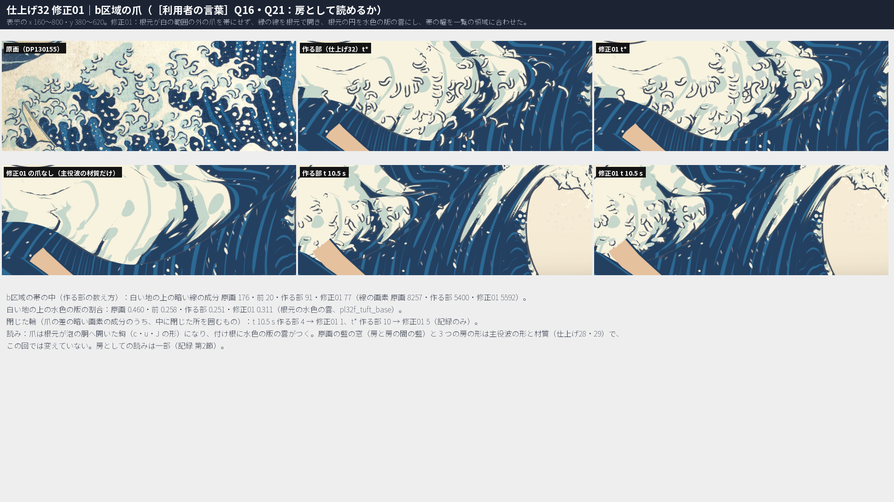
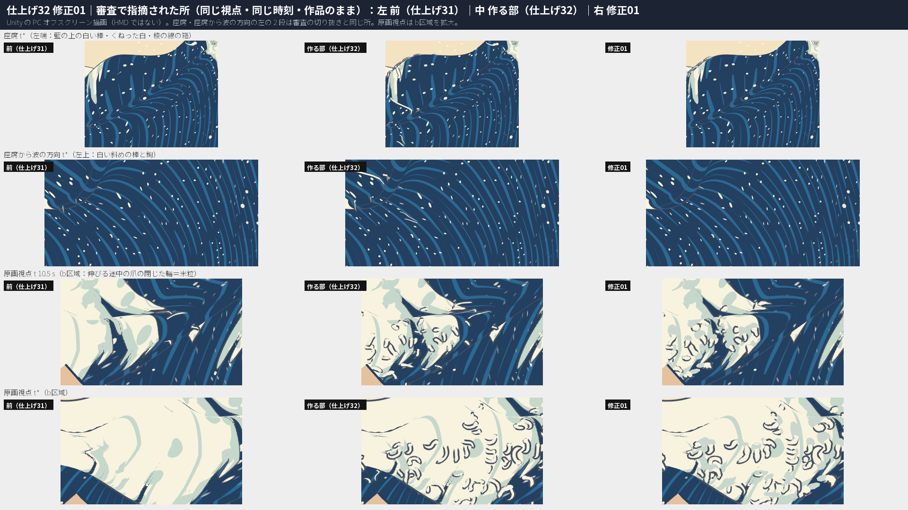
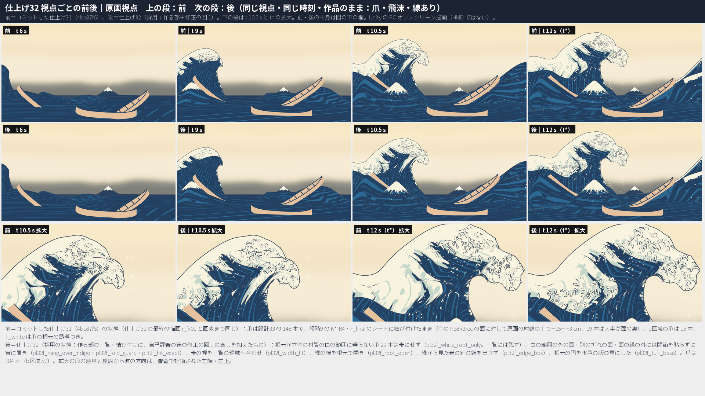
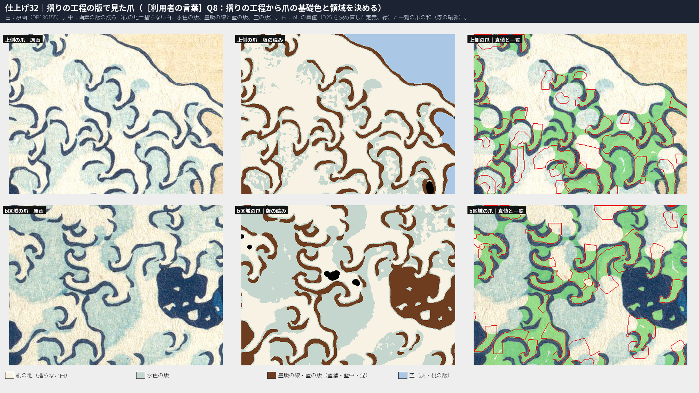
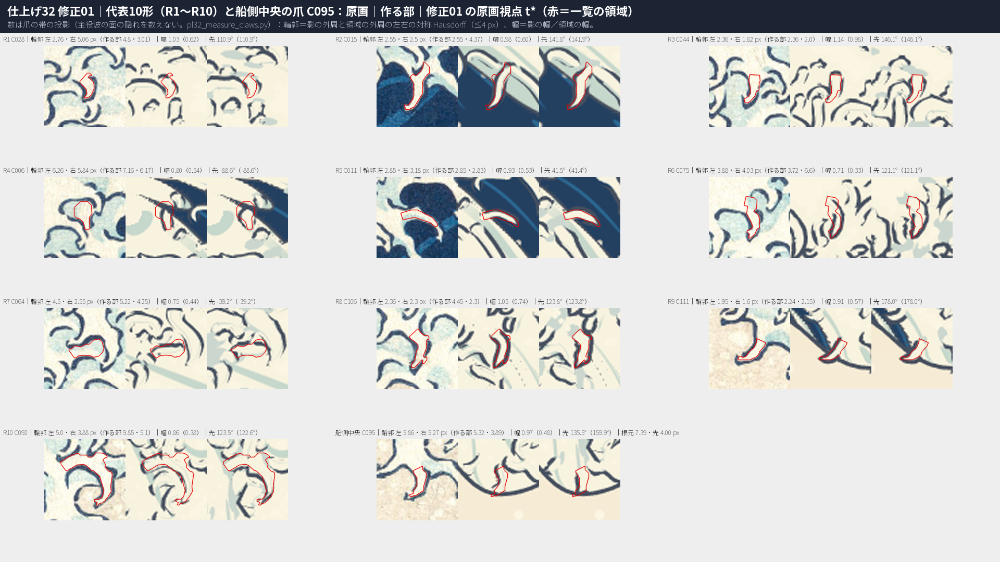
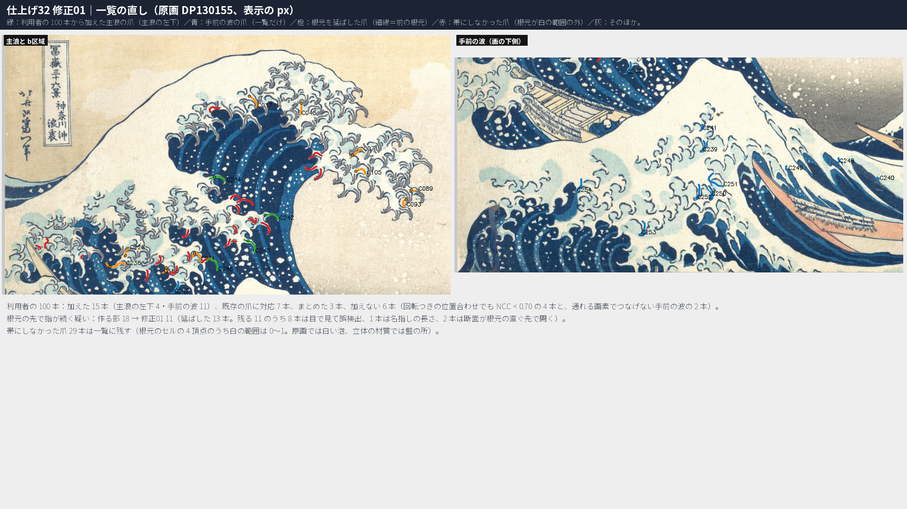

# 仕上げ32：設計32 白波群と ID（爪の一覧）― 摺りの工程を調べて爪の基礎色と領域（D25）を決め直し、b区域の爪を原画から数え直して加え、爪ごとの領域を墨版の線へ合わせ、爪を K\*′ P28R2rec のシートへ結び付け直した

日付：2026-10-02（着手 02:11、記録の部 06:21〜）／状態：**計画 §5.3 仕上げ32 の 8 行のうち 6 行を満たし、2 行（利用者の 100 本の扱い、支の規則と代表・船側中央の爪）は決めて記録した。［利用者の言葉］の 2 項目のうち、Q8（摺りの工程と爪の基礎色）は満たし、Q16・Q21（b区域の房）は一部。作る部、自己評審（評審 2 件）の 12 の指摘への修正の回 1、再評審の 1 つの指摘（記録の文と数の食い違い）への修正の回 2（作り直しなし）の後、記録の部で記録を 1 つにまとめ、証拠と提出の一覧を整えた。進行役の再評審の前。** 時間枠 1.5 日に対して約 3.9 時間（自己評審の時間を除く。第 12 節）。**HMD 実機の結果ではない。利用者は見ていない。** 証拠は Unity 6000.4.3f1 の PC オフスクリーン描画、Editor の Play モード 2 つ、Release のプレイヤーを PC で動かした結果と、numpy・OpenCV の計算。

## ［利用者の言葉］の項目と今の判定

計画 §5.3 の仕上げ32 の最初の 2 行。

| # | 利用者の言葉（計画 §5.3 の出典） | やったこと | 判定 |
| --- | --- | --- | --- |
| 1 | Q8「建议去调查北斋的这幅画的印刷流程以及历史，根据印刷流程去确定爪的基础色」→ ① 摺りの工程と歴史の調査 ② 爪の基礎色と IoU の定義（D25）の決め直し（第0.3節、元の行、設計32 §7） | 大英博物館の論文などで摺りの工程を調べた（第 1.1 節）。爪の基礎色を紙の地の白、陰を水色の版の色にし、D25 を「墨版の線で区切った紙の地と水色の版の画素」、IoU の真値を「墨版の線から 14 px 以内の紙・水色」に決めた（第 1.2 節）。IoU 0.434（設計32 の領域を同じ真値で 0.329） | **満たす**（読み方と決定は進行役。利用者は未確認） |
| 2 | Q16・Q21 の b区域の浪尖の爪（15 本）が、原画視点で房として読めない（段階9確認 #2・#8、段階6確認 F6-3） | b区域の爪を原画から数え直して 63 本を加えた（一覧 77 本、帯は根元が白い 57 本）。修正の回 1 で、縁の線を根元で開き、付け根に水色の版の雲を付け、帯の幅を領域へ合わせた（第 2 節） | **一部**。爪は泡の胴から出る鉤として読める。しかし原画の房（藍の窓で区切られ、5〜10 本の指が同じ向きに巻く）としては読めない。藍の窓と 3 つの房の形は主役波の形と材質（仕上げ28・29）で、この群では変えていない。作る部の判定「満たす」は修正の回 1 で取り下げた。2 回目の作り直しはしていない。爪の帯の読みやすさは仕上げ33、藍の窓と房の形は 10/29 の後の一覧へ渡す |

- **前＝コミットした仕上げ31（4be87f6、2026-10-02 02:21:33 +0800、修正01 を含む）。** この群の着手（02:11）の時、仕上げ31 はまだ未コミットの作業の木だった。その後に同じ場面とデータでコミットされた。前の描画 `r_before` は、PL32Render に爪の並びを渡さず（設計33 の爪）、主役波を仕上げ31 の hero\_pkg にしたもの。仕上げ31 の最終の描画 `r_fx01` と画素まで同じ（原画視点 t\*・座席 t 10.5 s・左の側面 t 9 s・真上 t\* の 4 枚で差 0 画素）。
- **後＝採用の状態。** 作る部の一覧・ID・白（`Unity/Build/Polish/32/white/hero_pkg`、T\_white `9f7ab0b6…`）に、修正の回 1 の一覧の直し（`fix01/list`）・帯（`fix01/claws`、帯 184 本）・Unity の部品（PL32ClawLook・PL32ClawDriver・PL32 Claw Outline）を加えたもの。描画は `Unity/Build/Polish/32/fix01/r_fix01`。場面は `PL32_Release.unity`（`3ff1e6f9…`）と `PL32_SinglePlayback.unity`（`106ae881…`）。
- **修正の回**：1 回目は審査の 12 の指摘（第 9 節）。2 回目は再評審の 1 つの指摘（`metrics_fix01.json` の判定の文が同じ項目の数と食い違っていた）で、記録だけを直した（作り直しなし）。b区域の房（［利用者の言葉］）の 2 回目の作り直しはしていない。
- **バックログ項目**：95〜98、122〜128、144、145、261（計画 §5.2）。文言はリポジトリの外（バックログ\_価値優先版.xlsx）なので、[美術優先の作業計画](../Design/ArtFirst_Plan_2026-09-25_ja.md)の番号33 の受入の書き方で数えた（第 6 節）。
- **記録**：この群の記録はこのファイル 1 つにまとめた。作る部の記録（03:55）と、修正の回 1・2 の記録（`Polish_32_修正01_ja.md`）は、この記録へ中身を移した。元の 2 つの版は Git 対象外の `Unity/Build/Polish/32/record/archive/` に残した（第 13 節の R1。`修正01` の名前は、計画 §4.2 では後の別のコミット「仕上げ32修正01：」の記録の名前になるため）。

**最初に（結論）**

1. **摺りの工程を調べた（Q8 の ①）。** 大英博物館の Korenberg の論文（111 枚の刷りの比較）によると、初期の刷りは少なくとも 7 面の版で摺られた。藍の濃い版（輪郭・題箋・落款・富士・海）、水色の版（海と、白い泡の中の水色の模様）、藍の中の版、灰・黄・桃の版があり、白の版はない。輪郭の墨版は藍を多く含むインクで、Heritage Science の Vermeulen ほか（2020、141 枚）は、このシリーズの墨版の輪郭がプルシアンブルーと藍の混ぜ物だと測った。読み方：爪の白は摺らない紙の地、陰は水色の版、形は墨版の線が決める（第 1.1 節）。
2. **爪の基礎色・領域（D25）・IoU を決め直した（Q8 の ②）。** 原画 DP130155 の爪の領域の画素は、紙の地 73.8%・水色の版 24.5%・墨版の線の縁 1.7%・藍中 0.0%・藍濃 0.0%。基礎色を紙の地の白、陰を水色の版の色 (203, 215, 206) にし、仕上げ29 の立体の爪の下面の段（藍中）をやめた（新しい材質 `PL32_Claw_Shade.mat`。仕上げ29 の材質は変えていない）。**IoU 0.4336**（作る部 0.4259、設計32 の領域を同じ真値で 0.3285）。合否は出さない（設計32 と同じく記録のみ）。
3. **b区域の爪を数え直した（Q16・Q21）。** 設計32 の b区域の爪は 15 本で、8 本は段階9 の面に結び付けたまま今の面の裏にあり、原画視点で見えていなかった。美術優先29 の骨格化を b区域の帯に当てて候補 88 を取り出し、進行役の目視 1 回と自動の重複の検査で 63 本を加えた（一覧の b区域 77 本）。原画視点 t\* の b区域の帯の中の、白い地の上の暗い線の成分は前 20 → 後 77（作る部 91、原画 176）、白い地の上の水色の版の割合は 0.258 → 0.311（原画 0.460）。**房としての読みは一部**（上の表）。
4. **爪ごとに領域を墨版の線へ、中心線を領域の真ん中へ合わせた。** 全部の爪の中心線を種にした測地の競り合いで、爪どうしは画素を分け合わない。**領域の重なりの組（5 px 超）40 → 0、他の爪の領域の中の根元 15 → 0**（独立の検査では 1：C235 の根元が、修正の回 1 で加えた利用者の爪 C245（帯にしない）の領域の中）。中心線は 209 本とも領域の真ん中の最短路に結び直した。上側の列 47 本に口の規則を当てた。
5. **爪を K\*′ P28R2rec・G\_p28rec のシートへ結び付け直した。** ID の検査（223 本）で**瞬間移動 0・点滅 0・129 の群の置き換え 0**。105（根元と水面）最大 1.3 µm、137（滑り）2.0 µm、139（欠落）0。根元に対する帯の頂点のコマの間の動きの最大は前 0.200 m → **0.167 m**、成長の跳び 0、帯の瞬間移動の検査 0 本。今の面に対する爪の深さは中央値 9.9 cm 手前で、大半が面の裏の爪は 0 本（前 19 本）。
6. **作る部で出た藍の上の白い棒・閉じた輪は、修正の回 1 で直した。** 根元が立体の材質（PL29）の白の範囲に乗らない爪 29 本（原画では白い泡、材質では藍の所）が、原画の射線で藍の面に貼られ、座席と座席から波の方向で藍の上の白い棒・くねった白になっていた。これらは帯にせず（一覧には残す）、関節は白の範囲の外の面・別の折れの面・面の縁の外に貼らずに宙に置いた。座席の左端の藍の上の爪の画素 作る部 6,300 → **2,029**（前 3,372）。座席から波の方向の左上 3,346 → **630**（前 974）。原画視点 t 10.5 s の b区域の閉じた輪（米粒）4 → **1**。
7. **船側中央の爪 C095（D8）は 95・97・98 を満たす。** 作る部で後退した立体の帯（根元が先より細い、先端の向き 159.9°）を、面の縁の外の点を採らない決まりと幅の合わせで直した。根元 7.39 px ＞ 先 4.00 px、先端の向き 135.5°、弦 94.3°。
8. **爪は根元の 4 つの角がそろって白くなってから伸びる（136：0 本）。** 仕上げ31 の「根元を先に白くする誘導」を外したので、唇の上の早い白い塊は出ない。135：0.93 → 0.99、102：1.81%（表面）・1.79%（世界）。飛沫の放出点は 2,495／2,495 が放出の時に白い（18 頂点だけを早めた）。
9. **原画視点の形の関門は後退しない。** 78 2.741・130 3.5815・131 3.4419・132 σ12 3.5576（爪あり・なし）は仕上げ31 と同じ。72 σ12 p95 は爪なし 3.8507（同じ）・爪あり 3.5757（仕上げ31 3.5698 より +0.006 px、関門 ≤ 4 px の内）。評価器 23 の合否の数は 4 組とも仕上げ31 と同じ。
10. **Unity**：Play モードは 2 つの場面とも通り、Release のビルドは成功した。プレイヤーは仕上げ31 と交互の 2 組で、描いたフレームが 50,115・51,343 → **92,092・91,691**（爪の層の頂点の差し替えを、爪の時刻のコマが変わった時だけにした）。
11. **残る見え方と限界**（第 10 節）：b区域は房に読めない。帯にしない 29 本の所は原画視点で爪が減る。座席から b区域の稜を後ろから見ると、稜を越える帯の細い線が残る。代表10形の輪郭 ≤4 px は 5／10、爪ごとは 96／184。側面・後ろ・真上・回り台 90〜330° では爪がほとんど見えない（前と同じ。造形は仕上げ33）。

| b区域の爪（原画｜作る部｜採用、下：採用の爪なし｜作る部 t 10.5 s｜採用 t 10.5 s） | 審査で指摘された所（前｜作る部｜採用） |
| --- | --- |
|  |  |

| 原画視点の前後（前 仕上げ31｜後 採用） | 摺りの版で見た爪と IoU の真値 |
| --- | --- |
|  |  |

| 代表10形と船側中央の爪 C095 | 一覧の直し（利用者の 100 本・根元の延長・帯にしなかった爪） |
| --- | --- |
|  |  |

---

## 1. ［利用者の言葉］Q8：摺りの工程と、爪の基礎色・領域（D25）・IoU

### 1.1 摺りの工程と歴史の調べ（Q8 の ①）

読んだもの（2026-10-02、ウェブの検索と取得。どれも読み取りだけで、ファイルや画像はリポジトリに入れていない）：

- **C. Korenberg「The making and evolution of Hokusai's Great Wave」**（大英博物館。論集の原稿の公開版の PDF、SHA-256 `34651484…`）。世界の 111 枚の刷りの写真を比べ、版の傷と彫り直しから刷りの順を決めた研究。この群で使った点（要約）：
  - 初期の刷りは少なくとも 7 面の版（両面を彫った 4 枚の板とみられる）。版と色：藍の濃い版（輪郭・題箋・落款・富士の体・海。おそらく 2 面）、水色の版（海。後の刷りで彫り直し）、藍の中の版（海・富士・着物）、灰の版（空・奥の船。2 度使う）、薄い灰の版（手前の 2 艘）、黄・生成りの版（船）、桃・生成りの版（雲）。**白の版は挙がっていない。**
  - 海の青は 4 段に見える。3 段は別のインクで、いちばん濃い段は藍の濃い版と藍の中の版の重ね摺り。
  - 赤外の偽色の画像では、輪郭・題箋・落款・海の濃い所が同じインク（藍を多く含む）で摺られている。
  - 遅い刷りは「白い泡の中の水色の模様」の版を彫り直している（111 枚のうち 16 枚）。さらに遅い刷りには、輪郭が墨（黒）のものがある。
  - 現代の復刻の工房（アダチ版画研究所）の手順は 7 面の版で 8 回摺り。墨版（輪郭だけ）と濃い藍の面を別の版にする工房もある。
- **M. Vermeulen ほか「Beyond the connoisseurship approach: creating a chronology in Hokusai prints using non-invasive techniques and multivariate data analysis」**（Heritage Science 8, 62、2020。著者に Met の M. Leona・V&A の L. Burgio。書誌は Crossref で確かめた。本文の取得は出版社の認証で止まり、要旨と検索の要約だけを読んだ）：『富嶽三十六景』の 141 枚の墨版の輪郭を反射の分光で測り、輪郭がプルシアンブルーと藍の混ぜ物だと示し、混ぜ方の違いで 9 つの群に分けた。
- **百科事典の二次の出典**（Wikipedia の「The Great Wave off Kanagawa」「Thirty-six Views of Mount Fuji」。G. C. Calza『Hokusai』p. 470、Bayou 2008 p. 130 の引用）：シリーズのはじめの刷りは輪郭の墨版まで青で摺り、後から加えた 10 図は墨の輪郭。プルシアンブルーは 1829 年ごろから大量に入り、このシリーズの初めの 10 図が早い使い方の例。
- The Met の解説ページ（「The Great Wave: Anatomy of an Icon」、作品のページ）は取得を拒まれた（HTTP 429）。読んでいない。

読み方（進行役の判断、Q24。利用者は未確認）：

- **爪の白は摺らない紙の地。** 版の一覧に白がなく、泡の白は紙の地として残る（遅い刷りで彫り直された「白い泡の中の水色の模様」の書き方もこれと合う）。
- **爪の陰（淡い水色）は水色の版。** 泡の中の水色の模様は 1 つの版で、爪の指の付け根や間に広い雲として摺られる。
- **爪の形は墨版の線が決める。** 墨版は藍を多く含む青のインク（プルシアンブルーと藍の混ぜ物）。色の版は墨版の校合摺りに合わせて彫るので、紙の地と水色の境は墨版の線の内側に収まる（一般の浮世絵の手順の説明で、この作品で確かめたものではない）。
- **藍の中・藍の濃い版は爪に摺られない。** 原画の爪の領域の画素で確かめた（第 1.2 節の表）。

### 1.2 爪の基礎色・領域（D25）・IoU の決め直し（Q8 の ②）

原画 DP130155 の、仕上げ32 の一覧の爪の領域（主浪と b区域、209 本の和）の画素を、番号23 の 5 色の Lloyd 中心で分けた：

| 版 | 割合 | Lab の中央値 | sRGB の中央値 |
| --- | --- | --- | --- |
| 紙の地（white） | 73.8% | (95.4, −2.2, 8.9) | (245, 243, 225) |
| 水色の版（mizuiro） | 24.5% | (85.0, −5.6, 2.4) | (203, 215, 206) |
| 墨版の線の縁（mix） | 1.7% | (55.7, −2.2, −3.2) | — |
| 藍中・藍濃 | 0.0% | — | — |

決めたこと：

1. **爪の基礎色は紙の地の白**（立体の爪の上面。主役波の白と同じ (248, 243, 223) で、変えない）。**陰は水色の版の色 (203, 215, 206)**。仕上げ29 の下面の段（藍中 (44, 105, 147)）は、原画の爪に摺られていない色なのでやめ、水色の版にした（`Tools/GWWaveGen/pl32/pl32_claw_params.txt`、場面の材質 `Unity/Assets/GreatWave/Polish32/Materials/PL32_Claw_Shade.mat`）。修正の回 1 で、根元の円（付け根の雲）も水色の版の段にした。輪郭は設計38 の縁の線（墨版）のまま（線の色と太さは仕上げ38）。
2. **D25（爪の領域）**：墨版の線（mix・藍中・藍濃に分けられる画素）と空・船の黄土で区切られた、紙の地と水色の版の画素。線そのものは入れない（境）。爪どうしの間の水色の雲は、近い指の中心線から指の白の半幅の 2.2 倍（6〜30 px）までだけ、その指に入れる（第 4.2 節）。設計32 の仮の定義（藍の輪郭線の内側）を版の読みで言い直したもので、名指しの 83・84・85 の影は今も内側（領域の水色の割合 p10 0.21・中央値 0.31・p90 0.47）。
3. **IoU の真値**：爪の範囲（美術優先29 の主浪の範囲と b区域の帯）の中で、墨版の線・藍の版から 14 px 以内の紙の地と水色の版の画素。半径 16 px の円が入る厚い白・水色の塊（波頭の平らな白、水色の大きな雲の芯）は除く。指の幅は 30 px 未満なので、指は残り、胴と雲の芯が落ちる。一覧の爪の多角形の和と比べる（右側・手前の波の爪は入れない）。

| IoU（D25 を決め直した定義） | IoU | 真値を覆う割合 | 一覧の当たり |
| --- | --- | --- | --- |
| 採用の一覧（主浪と b区域の 213 本） | **0.4336** | 0.5066 | 0.7507 |
| 作る部の一覧（主浪と b区域の 209 本） | 0.4259 | 0.4966 | 0.7496 |
| 設計32 の一覧（148 本）を同じ真値で | 0.3285 | 0.3861 | 0.6878 |

- 真値の約半分は一覧の爪に入っていない（右上の空へ出る細い指、b区域の帯の下の主浪の左下の窓の間の爪など、一覧にない指）。合否は出さない。図は `fig_pl32_print_layers.png`。

---

## 2. ［利用者の言葉］Q16・Q21：b区域の爪

**作る部。** b区域の帯（Q16 の調べの帯 `Tools/GWWaveGen/kstar3/candA4_band_targets.json` を上へ 25 px・下へ 40 px 広げ、表示の x 165〜780 へ延ばし、主浪の範囲を除いたもの）に、美術優先29 の `af29_claw_inventory.process_zone`（白の Zhang–Suen の骨格 → とげの除去 → 端点を持つストローク）を当て、候補 88（除いた 36）を取り出した。進行役が候補ごとに原画の 1:2 の切り抜きを 1 回ずつ見て、除く 11（胴を横切る長い道 5、何もない所 4、短すぎる 2）、先の鉤だけ採る 3、既存の爪に重なる 7 とした。自動の重複の検査（中心線の 40% 以上が既存の爪から 6 px 以内）は 14 を重複とし、目視の 7 を全部含んだ。**加えた 63 本（C176〜C238）。** b区域は 77 本（C172 を入れて 78 本）。

**審査（作る部の後）。** 原画視点 t\* で b区域の爪は「平らな白い背に散らばる孤立した鉤・虫」で、房に読めない。t 10.5 s では伸びる途中の爪が閉じた輪（米粒）になる。根元が藍の所の爪は、座席から藍の上の白い棒に見える。

**修正の回 1。**

- (a) 根元が立体の材質の白の範囲に乗らない爪（b区域と主浪の間・b区域の下の 20 本。原画では白い泡、材質では藍）を帯にしない（`pl32f_white_root_only`）。これらは原画視点でも藍の上の白い虫に見えていた。
- (b) 縁の線を根元で開く（`pl32f_root_open`）。指が泡の胴から出る鉤（c・u・J）に見え、1 本ずつ縁取られた虫の見え方が減った。
- (c) 根元の円を、根元の後ろ（泡の胴の側）へ伸ばした楕円にし、根元の輪の幅の倍率 × 1.3（1〜3 倍）で広げ、色を水色の版にした（`pl32f_tuft_base`）。隣どうしの円が重なって房の付け根の水色の雲になる。
- (d) 帯の幅を領域へ合わせた（`pl32f_width_fit`。b区域の幅の比 0.999）。

| b区域の帯の中（原画視点 t\*） | 原画 | 前（仕上げ31） | 作る部 | 採用 |
| --- | --- | --- | --- | --- |
| 白い地の上の暗い線の成分（画素） | 176（8,257） | 20（1,793） | 91（5,400） | 77（5,592） |
| 白い地の上の水色の版の割合 | 0.460 | 0.258 | 0.251 | **0.311** |
| 閉じた輪 t 10.5 s／t\* | — | 2／2 | 4／10 | **1／5** |
| b区域の爪（一覧／帯） | — | 15／15 | 77／77 | 77／57 |

- 暗い線の成分が 91 → 77 に減ったのは、短い成分がつながったため（線の画素は 5,400 → 5,592）。
- **判定は一部。** 原画の b区域は、藍の窓で区切られた房（5〜10 本の指が同じ向きに巻く）が並ぶ。採用の状態は、平らな白い背に、付け根が水色の鉤が散らばる。藍の窓と 3 つの房の形は主役波の形（仕上げ28 の限界：b区域は 3 つの房のうち 1 つ）と材質（仕上げ29）で、この群（爪の一覧と ID）では変えない。爪の帯の読みやすさ（大きさ・厚み・断面）は仕上げ33 の同じ［利用者の言葉］の行で、藍の窓は 10/29 の後の一覧（仕上げ28・29 の限界）で扱う。
- 2 回目の作り直しをしなかった理由（Q24）：審査が示した 2 つの道（2 回目で房に読めるようにする、または判定を下げて仕上げ33 へ渡す）のうち、藍の窓と房の形は主役波の形と材質の仕事で、この群の範囲（一覧・ID・結び付け）で詰められる所（根元の開き・水色の雲・幅・藍の上の爪の除き）は修正の回 1 で行ったので、判定を下げる方を選んだ。

---

## 3. 計画 §5.3 の行ごとの結果

| # | 計画 §5.3 仕上げ32 の行（出典） | 結果（作る部 → 採用） | 判定 |
| --- | --- | --- | --- |
| 1 | ［利用者の言葉］Q8 ① 摺りの工程と歴史の調査 → ② 爪の基礎色と IoU の定義（D25）を決め直す（第0.3節、元の行、設計32 §7） | 第 1 節。基礎色は紙の地、陰は水色の版。IoU 0.4259 → 0.4336（設計32 0.3285） | **満たす**（読み方と決定は進行役、利用者は未確認） |
| 2 | ［利用者の言葉］Q16・Q21 の b区域の浪尖の爪（15 本）が原画視点で房として読めない。③ の最初に扱う（段階9確認 #2・#8、段階6確認 F6-3） | 第 2 節。一覧 15 → 77 本、線の成分 20 → 91 → 77、水色 0.258 → 0.251 → 0.311 | **一部**（作る部の「満たす」は取り下げ） |
| 3 | 仕上げ28 の形で、シートへの結び付けと履歴を作り直す（`ds32_ids.py` → `ds33_claw_rig.py` → `ds33_claw_anim.py` → 設計34 の描画）（段階6確認 §8 の仕上げ28、設計32 §7） | 209 → 223 本の ID で瞬間移動・点滅・129 が 0。105 1.3 µm・137 2.0 µm・139 0。帯の動きの最大 0.394 → 0.167 m（前 0.200）、成長の跳び 1 → 0。座席・座席から波の方向の藍の上の白い棒を修正の回 1 で消した | **満たす** |
| 4 | ③ 爪ごとに、領域の多角形と中心線を原画の輪郭線へ合わせる。帯の幅（F6-2）は仕上げ33（段階6確認 F6-2・§8、設計33 §7） | 測地の競り合いの領域と、領域の真ん中の中心線（209 本）。爪ごとの輪郭 ≤4 px 51／148 → 93／209 → 96／184。帯の投影の幅は審査の指摘に要るので、領域の 0.54〜0.69 → 0.91〜1.00 倍に合わせた（断面・折れ・こぶは仕上げ33） | **満たす**（使える水準） |
| 5 | 領域の重なり 40 組・とげ・他の爪の領域の中の根元 15（設計32 §7、段階6確認 §8） | 重なりの組（5 px 超）40 → 0（独立の検査も 0）。とげ 1,334 画素（199 本）を落とした。根元 15 → 作り手の検査 0・独立の検査 1（C235 の根元が帯にしない C245 の領域の中） | **満たす**（独立の検査の 1 は限界 6 に記録） |
| 6 | C066（元の長さの 0.49 倍）・C112・C113・C109（0.59 倍）、根元の先で指が続く疑い 8 本、上側の列の 60 本の根元（口の規則）（段階6確認 §8） | C066 111 px・C113 52 px・C109 78 px は長さを保つ。C112 は消す（9 px の巻いた線の先の白）。上側 47 本に口の規則（C042 は当てない、目で見たのは 15 本）。根元の先の疑い 8 → 18 → 11（13 本を溝に沿って延ばし、残る 11 本は目で見て判定） | **満たす・決めた** |
| 7 | 利用者の 100 本の位置合わせの不確かさ、対応なし 29 本（範囲の外の 9 本と手前の波の 11 本を加えるか）、C174 と C002（段階6確認 §8、設計32 §7） | 不確か 7 → 4。加えた 15（主浪の左下 4 は根元が材質の藍の所なので帯にしない、手前の波 11 は一覧だけ）・まとめた 3・既存の爪に対応 7・加えない 6。C174 は C002 に統合 | **決めた** |
| 8 | 支の判定の規則（T3 が 0 本）、代表の形（R6 C075、R8 C106、R10 C092）、船側中央の爪と代表10形（D8。第一候補 C095）（設計33 §7、段階6確認 §8、第7.2節 D8） | 支の規則を利用者の爪形分析の README §4.2 に合わせ、T3 0 → 1 本（C092 に C093・C089）。代表10形は R1〜R10 のまま。D8 は C095 のまま（95・97・98 を満たす） | **決めた** |

---

## 4. 作ったもの（名前の付いた決まり）

### 4.1 白の部（`Tools/GWWaveGen/pl32/pl32_white.py`）

- 仕上げ31 の `pl31_white.py` の main をそのまま使い、爪の根元の誘導 `pl31_white_claw_pin` を外して、名前の付いた美術の誘導 **`pl32_white_spray_pin`** に差し替えた：仕上げ31 の飛沫の放出点の頂点（476）のうち、T\_white が最も早い粒の放出の半コマ前より遅い 18 頂点だけを、その時刻まで早める（最大 0.36 s。早める向きだけ）。白の順（`pl31_white_order` patch）と `pl31_white_rate_cap` は仕上げ31 と同じ。
- 出力 `Unity/Build/Polish/32/white/hero_pkg`（位置・精度の層は G\_p28rec の art\_on へのハードリンク、T\_white `9f7ab0b6…`）。修正の回 1 では T\_white を変えていない（同じ SHA-256）。
- 誘導を外しただけの版（`white_nopin`）では、設計33 の爪をこの順で伸ばすと、根元が白くなる前に伸び始める爪が 45 本（最大 3.25 s）だった。

### 4.2 一覧（`pl32_bregion.py`・`pl32_claw_list.py`・`pl32f_list_steps.py`、目視の判定 `pl32_claw_eye.json`）

1. **b区域の候補**：第 2 節。
2. **上側の列の口の規則**：設計32 の `revise` を、美術優先29 の根元のままだった上側の列に当てた。47 本の根元が指の首（口）へ動いた（例：C017 147 → 75 px、C014 138 → 71 px）。C042 は、口の規則が根元を右の線の外へ動かして中心線が線を横切ったので当てない（目視）。
3. **名指しの短い爪**：C066（111 px）・C113（52 px）・C109（78 px、利用者の名指しの直しの結果）は長さを保つ。**C112 は消した**（9 px の、墨版の巻いた線の先の白の塊で、指ではない）。**C174 を C002 に統合した**（C174 は C002 の指が藍の胴へ垂れ下がる先の続き。C002 は 99 px）。
4. **領域（D25）**：主浪と b区域の中心線を種にした測地の競り合い。通れる画素は紙の地と水色の版（空・黄土でない）。各爪は指の白の半幅の中央値の 2.2 倍（6〜30 px）まで、4 近傍と 8 近傍を交互に 1 画素ずつ広がり（八角形の距離）、先に届いた爪が画素を取る。根元の接線の後ろ側（口の弦の外）は落とし、3×3 の開きで細いとげ（合わせて 1,334 画素、199 本）を落とし、中心線を含む成分だけを残す。
5. **中心線**：根元 → 先端を、領域の中で、領域の距離変換に反比例する費用の最短路（真ん中を通る）で結び直し、5 点でならした（209 本、ずれの中央値 1.6 px・最大 7.4 px）。
6. **根元の延長（修正の回 1、`pl32f_root_extend`）**：根元から根元の側へ 2 px ずつ、断面の両側が墨版の線に閉じ、幅が根元の近くの幅の 1.5 倍 + 6 px 以下で、1 歩の幅の変化 ≤ max(6 px, 35%)・中心のずれ ≤ 4 px（同じ 2 本の線が続く）間だけ、断面の真ん中へ寄せながら進む（最大 80 px、ほかの爪の中心線から 3.5 px で止める）。目視で「続く」とした 4 本（C045・C163・C210・C233）は、続きの検査を外して真っ直ぐ延ばす（最大 40 px）。延ばした 13 本：C017・C045・C071・C089・C093・C105・C163・C228・C231・C236・C242・C243・C244。残る 11 本の目視（`pl32_claw_eye.json` の `pl32f_cont`）：誤検出 8（C021・C026・C029・C079・C097・C222・C242・C235）、名指しの長さ 1（C066）、目では続くが断面が根元の直ぐ先で開く 2（C210・C233）。
7. **利用者の 100 本（修正の回 1）**：範囲を原画の全部（3859×2594）にした。ECC の後の NCC < 0.70 の 9 本を、設計32 の位置の ±260 px の中で、回転 −14〜+14°（2° おき）× 倍率 40 段 → ±20 px・回転 ±2°・倍率 ±8% → ECC（アフィン）で当て直した。0.70 以上になったのは claw074（0.89）・claw096（0.84）・claw098（0.86）。効いたのは探す範囲を絞ったことで、回転は 0〜0.5°。対応なしの爪の扱い：加える 15（主浪の左下 C242〜C245、手前の波 C239〜C241・C247〜C254）、既存の爪に対応 7（claw051・068・091 は C172、claw098 は b区域の爪、claw071 は C163、claw035・043 は位置合わせだけし直した）、まとめる 3（claw069・076 は claw053 と同じ指、claw099 は claw098 と同じ所）、加えない 6（NCC < 0.70 の 4 本、通れる画素でつなげない手前の波の claw073・074）。加えた爪の中心線は、利用者の根元と先端の 2 点をこちらの通れる画素の最短路で結んだもの（利用者の線やマスクは写していない）。
8. **数**：一覧 234 本（主浪と b区域 209・右側 25）→ 採用 249 本（主浪と b区域 213・手前の波 11・右側 25）。列：上側 63・途中 25・船側 44・b区域 77・主浪の左下 4。消した爪：C107・C169（設計32）、C112・C174（この群）。

### 4.3 ID とシートへの結び付け（`pl32_ids.py`）

- 設計32 の `ds32_ids.py` を、主役波（仕上げ32 の hero\_pkg、最後の層 τ = 0 が K\*′ P28R2rec）・時間曲線（G\_p28rec）・一覧・白の帯の群の「t\* で白」（29修正01 の投影の色区ではなく、材質 PL29 の白の範囲。Q28）・飛沫（仕上げ31 の 2,500 粒を設計31 の書式へ写した `spray_adapt`）に差し替えて回した。
- 名前の付いた決まり **`pl32_birth_all_corners`**：爪の誕生 τ\_b を、根元の格子の 2×2 の T\_white の最小（最初の角が白くなる時）から最大（4 つの角がそろって白くなる時）にした。誕生 t 6.51〜10.65 s（中央値 9.34 s。設計32 は 6.05〜10.02 s）。最小のままだと 136 の数え方で 69 本が根元の白より先に伸びる。
- 群：爪の房 43（目立つ 11）、白の帯 191、飛沫 135。

### 4.4 型・骨格（`pl32f_claw_rig.py`＝設計33 の `ds33_claw_rig.py` の写し。作る部の `pl32_claws.py` の決まりを含む）

- **`pl32_joint_front_window`**（作る部）：設計33 は「前にある面はいつも採る」。b区域の C233 は、根元の面より 12.9 m 手前の別の面（隠れの境の向こう）に関節が載り、帯が 13 m に伸びてコマの間で跳んだ。前の面も直前の関節の深さから 3 m 以内だけ採る。
- **`pl32f_white_root_only`**：根元のセルの 4 頂点のうち 2 つ以上が白の範囲の爪だけを帯にする（184 本。帯にしない 29 本：b区域 20・主浪の左下 4・船側 3・上側 2）。4 角がそろって白い爪だけにする案は、C002・C014 など頂の縁の爪も消えた（43 本）ので採らなかった。
- **`pl32f_hang_over_indigo`**：関節の射線が当たる面が白の範囲の外なら、貼らずに宙へ置く（44 関節）。**`pl32f_fold_guard`**：直前の関節から面の上の道のりが弦 × 1.6 ＋ 0.15 m より長い面は、別の折れとして採らない。**`pl32f_hit_exact`**：射線から 0.75 px より外れた面の点（三角形への寄せ）は採らない（6 関節。C095 の先端がこれで直った）。**`pl32f_free_front`**：採らなかった面が直前の関節より手前なら、宙の関節をその面の 0.10 m 手前に置く（面の裏に隠れる爪 0 本）。宙の関節は合わせて 33 本の爪（白の範囲の外 44・面の縁の外 6・奥すぎる 8・当たらない 9 関節）。原画視点では射線の上なので、画面の形は変わらない。
- **`pl32f_tip_dir_guard`**：3 段の当てはめの最後の節の向きが、一覧の中心線の最後の 20% の向きから 10° より外れたら、4 段で当て直す（14 本）。
- **`pl32f_branch_rule`**（支）：利用者の爪形分析の README §4.2（支は主爪の第 2 の折れ点から出る）に合わせ、支の根元が主爪の中心線の 35〜97% の所で、主爪の幅 × 0.6 ＋ 10 px 以内、主爪の 0.9 倍より短い。型 T1 160・T4 17・T2 2・T3 1（C092 に C093・C089）・支 4（作る部：T1 173・T4 16・T2 10・T3 0）。
- **`pl32f_tuft_base`**（根元の円）：根元の後ろへ 0.40、楕円 0.85／0.80（根元の幅の倍）、半径の上限 0.45 m、面から 1 cm。

### 4.5 帯（`pl32f_claw_anim.py`＝作る部の `pl32_claw_anim.py` の写し）

- **`pl32_band_lift`**（作る部）：輪と先端を、根元から原画のカメラ（PaintingCam v1 の位置）への向きへ λ(s) ×（0.085 m ＋ 厚みの 0.25）だけずらす。0.085 m は、原画視点の爪の根元の深さの最大 64.8 m での設計38 の線幅（64.8 × 0.0012866 rad）。λ(s) は伸びる段（s 0.20〜0.75）で 0 → 1。結び付け直すと帯が面に沿い、縁の線（反転シェル）の下の側が主役波の面に隠れて、原画視点の爪の線が細く薄くなった（`test1`）ので足した。原画視点では射線の上を動くので画面の形は変わらない。
- **`pl32f_width_fit`**：t\* の帯を投影し、輪ごとに中心線に直交する向きの幅を、一覧の領域の断面の幅（左右の境までの距離の和）× 設計33 の先の閉じに合わせる倍率（0.35〜3、3 点でならす、2 回）を全部のコマに掛ける。ワールドの幅 ≤ 1 m。厚みも同じ倍率。根元の円も根元の倍率 × 1.3 で広げる。
- **`pl32f_frame_stable`**：輪の接線は面へ載せ直す前のなめらかな曲線から取って輪の法線の面へ射影し、3 点でならす。法線と B はコマの間で向きをそろえ、B が決まらない所は直前のコマの B を使う（幅を広げた伸び始めの短い帯で、輪が半回転して C104 が 0.45 m 跳んだため）。
- **`pl32f_bud_width`**：芽の幅 × clip(g / 0.45, 0.25, 1)。
- 出力 `Unity/Build/Polish/32/fix01/claws/`（帯 184 本、31,336 頂点、60,096 三角形。`ds33_claw_layout.json` は DS34ClawPlayer がそのまま読む）。

### 4.6 Unity（`Unity/Assets/GreatWave/Polish32/`）

- `Shaders/PL32_Claw_Outline.shader`：設計38 の DS38 Outline Mesh の写しに、押し出し幅 × smoothstep(\_PL32RootFade.x, .y, 頂点の UV3.x)（**`pl32f_root_open`**：根元 0 → 先 1 の位置 0〜0.3 で線の幅 0 → 1、根元の円には線を描かない）と、UV3.y が同じ上面（1）か下面（2）の三角形は押し出さない（**`pl32f_edge_box`**）を足した。値は帯の頂点に付いた値だけで決まり、視点・原画カメラでは決まらない（Q28）。
- `Scripts/PL32ClawLook.cs`：爪の縁の線のメッシュに UV3（根元 0 → 先 1・輪の向き）を入れて材質を PL32 Claw Outline にし（元の材質の値を写す）、根元の円の UV2.x を水色の版の段（0.0）にする。Play モードでは PL29ClawShade と DS38ClawOutline の後の LateUpdate で 1 回。
- `Scripts/PL32ClawDriver.cs`：DS34ClawPlayer の Update と DS38ClawOutline の LateUpdate の自動の差し替えを止め、爪の時刻のコマの位置が前と同じ時、または前と今のコマで全部の爪が見えない時は何もしない。設計46 の時計（DS46ClockBus）があれば "claws" の段を同じ名前で登録し直す。**設計34 の DS34ClawPlayer・設計38 の DS38ClawOutline・設計46 の DS46ClockBus と、それより前の番号の場面は変えていない。**
- `Materials/PL32_Claw_Shade.mat`：PL29\_Claw\_Shade.mat を写して `pl32_claw_params.txt` を書いたもの（\_Steps 0.30／−0.45、\_Mizuiro と \_AiMid を水色の版 (0.796, 0.843, 0.808)）。PL29 の材質は変えていない。
- `Editor/PL32Render.cs`（PL31Render の写しに `-pl32Claws`・`-pl32Look 1`）、`Editor/PL32Setup.cs`（PL31 の場面 2 つを `Scenes/PL32_Release.unity`・`PL32_SinglePlayback.unity` へ写し、主役波の packageDir を仕上げ32 の hero\_pkg、爪の layoutPath を `Build/Polish/32/fix01/claws`、爪の材質を PL32\_Claw\_Shade、爪の物に PL32ClawLook と PL32ClawDriver。PL32\_SinglePlayback には爪の層がない）、`Editor/PL32ReleaseBuild.cs`（場面を PL32\_Release、必ず要るデータに仕上げ32 の hero\_pkg と爪の並び）。PL31 の場面と PL29 の材質は変えていない（SHA-256 が前後で同じ。`pl32f_setup.json`）。
- 道具の実行：`Tools/GWWaveGen/pl32/run_pl32_unity.ps1`（unity.lock を取る）・`run_pl32_player.ps1`。

---

## 5. 視点ごとの前と後（Q28 の審査。同じ視点・同じ時刻 t 6・9・10.5・12 s、作品のまま：爪・飛沫・線あり）

前＝`Unity/Build/Polish/32/r_before`（仕上げ31）、後＝`fix01/r_fix01`（採用）。どれも Unity の PC オフスクリーン描画（1920×1080）。図は `fig_pl32_ba_view_<視点>.png`（下の段は t 10.5 s と t\* の拡大。座席と座席から波の方向の拡大は審査で指摘された左端・左上）と `fig_pl32_ba_turntable_t<時刻>.png`。動画は `pl32_ba_<視点>_30fps.mp4`（前｜後、どれも 1.7 MB 以下）。記録の部で、図の見出しを「仕上げ32修正01」から「仕上げ32」（後＝採用）に描き直した（絵の所は修正の回 1 の図と画素まで同じ）。

| 視点 | 後（目で見て） | 作る部で出て、修正の回 1 で直したもの |
| --- | --- | --- |
| 原画視点 | t 6 s は前と同じ。t 9 s：頂の白の上の爪の芽は小さな c の弧で、白がまだ届かない唇の下には芽がない（前は唇の早い爪の根元を先に白くしたので、唇の上に小さな白い塊と芽が先に出ていた）。t 10.5 s：伸びる途中の爪は c・u の弧。t\*：頂・唇・b区域の爪は根元が開いた鉤で、付け根に水色の版の雲。b区域の白い背に爪が並ぶ（前はほとんど線がない）が、房には読めない。爪の陰は水色だけで、藍中の小さな塗りはない。引き伸ばし・継ぎ目はない | t 10.5 s の b区域の閉じた輪（米粒）4 → 1。b区域と主浪の間の藍の上の白い虫はない（帯にしない） |
| 座席 | t 6・9・10.5 s は前とほぼ同じ。t\*：頂の縁の爪の線は前と同じに並ぶ。下面の藍中がなくなり、爪は白と水色と縁の線。b区域の稜に、帯が稜を越える細い線が残る（限界 3） | t\* の左端の藍の上の白い棒・くねった白・稜の線の箱（作る部）はない |
| 座席から波の方向 | t 9 s：頂の白が小さい（唇の先の白い塊が出ない）。t 10.5 s：b区域の白の上に小さな爪の印。t\*：管の内側からは爪がほとんど見えない（前と同じ） | t\* の左上の白い斜めの棒と鉤（作る部）はない |
| 左の側面 | 唇の縁の爪の画素が少し変わるだけ。浮いた爪・跳ぶ爪はない | — |
| 右の側面 | ほとんど変わらない。浮いた爪・跳ぶ爪はない | — |
| 後ろ 65° | ほとんど変わらない（爪は波の手前の面にあり見えない） | — |
| 真上 | 唇の縁の小さな変化だけ。傷はない | — |
| 回り台（12 方位） | 0〜60°：頂と b区域の爪の付け根に水色の雲、b区域に爪の帯（前は頂だけで、飛沫と混ざってぼやける）。90〜330°：爪はほとんど見えない（前と同じ） | — |

- **目で見て（7 視点＋回り台、4 時刻）**：この群の範囲（爪の一覧・結び付け・成長の始まり・爪の色と縁の線）に、色面の引き伸ばし・継ぎ目・平らな面・溶けた爪は見えない（記録の部で 11 枚の図を見直した）。残るのは、座席の b区域の稜の細い線（限界 3）、b区域が房に読めないこと（限界 1）、側面・後ろ・真上から爪が読めないこと（仕上げ29 の限界 1。造形は仕上げ33）。
- 前後の動画は原画視点・座席・座席から波の方向・左の側面・回り台の 5 本。右の側面・後ろ 65°・真上は静止画だけ（描画の段 `-pl29VideoViews` に入っていない。この 3 視点は前とほとんど変わらない）。

---

## 6. バックログ項目（t\* の原画視点。爪の帯の投影、主役波の面の隠れは数えない）

| 項目 | 読み | 採用 | 作る部 | 前（仕上げ31） | 判定 |
| --- | --- | --- | --- | --- | --- |
| 95・97・98 船側中央の爪 C095（立体の帯） | 95 根元が先より広い、97 先が下へ（30〜150°）、98 根元から下側へ（弦 30〜150°） | 根元 7.39・先 4.00 px、先 135.5°、弦 94.3°、根元 0.0・先端 0.03 px、輪郭 左 5.86・右 5.27 px | 2.95・4.00、159.9°、94.3°（95・97 ✗） | 6.49・3.20、141.7°、94.0° | **満たす**（輪郭 ≤4 px は満たさない） |
| 同（一覧の原画の爪） | 同じ | 根元 17.2・先 14.0 原画 px、先 141.8°、弦 94.3° | 同じ | 同じ | 満たす。96 は文言が手元にないので数えない |
| 122・127・128 各列の根元と先端 ≤4 px | 帯の根元・先端の点の投影と一覧の root・tip の差 | 上側 61・途中 25・船側 41・b区域 57 とも ≤4 px（根元 最大 0.05、先端 最大 0.54 px） | 209 本とも ≤4 px（根元 0.05、先端 2.10） | 148 本とも ≤4 px（根元 0.15、先端 1.98） | **満たす**（列と項目番号の対応は文言が手元にないので、全部の列で数えた） |
| 123〜126 代表10形 | 長短の順序（一覧の長さの順との Spearman）、幅、先端の向き、左右の輪郭 ≤4 px | 順序 1.00、先端の向きの差 最大 3.5°、幅は領域の 0.71〜1.14 倍、輪郭 ≤4 px **5／10**（R1・R4・R6・R7・R10） | 1.00、3.5°、0.33〜0.98 倍、3／10 | 1.00、10.9°、0.16〜1.02 倍、2／10 | 順序・向き・幅は満たす。輪郭は**一部**（帯の断面と曲がりは仕上げ33） |
| 144・145・261 ほかの爪ごとの ≤4 px（記録のみ） | 爪の影の外周と一覧の領域の外周の左右の対称 Hausdorff | **96／184 本**（中央値 3.80・p90 6.26 px） | 93／209（4.12・6.90） | 51／148（5.00・9.61） | 記録のみ |

- 代表10形は美術優先29 の k-medoids の選び（R1 C028 … R10 C092）のまま（第 13 節の 13）。
- 列ごとの輪郭 ≤4 px と幅の比（中央値）：上側 41／61・0.91、途中 14／25・0.92、船側 20／41・0.95、b区域 21／57・1.00（作る部 36／63・11／25・17／44・29／77、幅 0.54〜0.69）。b区域の ≤4 px が 29 → 21 本に減ったのは、帯にしない 20 本が抜けたため（割合は 0.38 → 0.37）。

---

## 7. 原画視点の関門（形）と評価器（爪あり・爪なし、前の群と CP1／26修正01 に対して）

`pl28u_regress.py --kstar rec`（`fix01/r_fix01`）。78・130・131 は爪なしの定義の読み、132・72 の関門は σ12 の大きな形。

| 項目 | 採用（爪なし／爪あり） | 作る部 | 前の群（仕上げ31） | CP1 | 26修正01 | 関門 | 判定 |
| --- | --- | --- | --- | --- | --- | --- | --- |
| 78 | 2.741／2.741 | 2.741 | 2.741 | 2.772 | 1.641 | ≤ 4 | 合格（後退なし） |
| 130 | 3.5815／3.5815 | 3.5815 | 3.5815 | 1.968 | 1.953 | ≤ 4 | 合格（後退なし） |
| 131 | 3.4419／3.4419 | 3.4419 | 3.4419 | 1.814 | 1.798 | ≤ 4 | 合格（後退なし） |
| 132（σ12 最大） | 3.5576／3.5576 | 3.5576／3.5576 | 3.5576／3.5576 | 1.326 | 1.574 | ≤ 4 | 合格（後退なし） |
| 72（σ12 p95） | 3.8507／3.5757 | 3.8507／3.5864 | 3.8507／3.5698 | 1.558 | 1.723 | ≤ 4 | 合格（爪ありは前より +0.006 px） |

- CP1／26修正01 に対しては、段階5確認 §6.3 以来の後退のまま（この群で増えも減りもしない）。
- 記録のみ：定義の読みの 132（爪あり）は前 5.2998 → 作る部 5.6299 → **5.3771 px**（前より +0.077 px）、72 p95（爪あり）は 5.164 → 5.168 → 5.148 px（爪のこぶ。仕上げ33）。t\* の爪なしの ID の画像（`t28_white`）は仕上げ31 と SHA-256 まで同じ（`b6a7b26e…`）。
- 評価器 23（4 組、`fix01/r_fix01/eval23/off_*`）：線なし（爪あり・爪なし）合格 4・不合格 5、線あり（爪あり・爪なし）合格 2・不合格 7。作る部・仕上げ31 と同じ。値が動いたのは爪ありの 132・72 と、記録のみの 132\_claws（45.04 → 45.07 → 45.22）・72\_claws だけ。
- 色区の項目 73〜270（新しい読み。仕上げ29 で色が立体の材質になったので、28修正01 の投影の値と比べると全部が不合格。記録のみ）：爪なしは全部の値が仕上げ31 と同じ。爪ありで動いたのは 134（41.48 → 作る部 41.46 → 24.54 px）と、267 の 20 px 以上の帯（原画視点 114 → 作る部 107 → 141。爪の帯が色の帯として数えられる）だけ。265 の ΔE00 は 13.974 で同じ。

---

## 8. 数

| 項目 | 前（仕上げ31） | 作る部 | 採用 |
| --- | --- | --- | --- |
| 一覧（主浪＋b区域／手前の波／右側） | 148／0／25（設計32 の一覧 173 本） | 209／0／25（234 本） | 213／11／25（249 本） |
| 帯にした爪（上側・途中・船側・b区域）／帯にしない | 148（64・25・45・14）／0 | 209（63・25・44・77）／0 | **184（61・25・41・57）／29** |
| 領域の重なりの組（5 px 超）／他の爪の領域の中の根元 | 40／15 | 0／0（独立の検査も 0・0） | 0／0（独立の検査 0・1：C235 と C245） |
| IoU（D25 を決め直した定義） | 0.3285（設計32 の領域） | 0.4259 | 0.4336 |
| 根元の先で指が続く疑い | 8（設計32） | 18 | 11（延ばした 13、残りは目視の判定つき） |
| 利用者の 100 本の不確かな位置合わせ（NCC < 0.70） | 7 | 7 | 4 |
| 型 T1・T4・T2・T3・支 | — | 173・16・10・0・10 | 160・17・2・1・4 |
| ID の検査（瞬間移動・点滅・129） | 0・0・0（設計32） | 0・0・0（209 本） | 0・0・0（223 本） |
| 105・137・139・1 本の頂点の最大 | 3.8 µm・7.3 µm・0・171（設計33） | 1.3 µm・2.0 µm・0・171 | 1.3 µm・2.0 µm・0・171（支つき 449） |
| 帯の頂点の瞬間移動の検査 | 0 本 | 1 本（C161） | 0 本 |
| 根元に対する帯の頂点の動きの最大・成長の跳び（同じ関数） | 0.200 m・0 | 0.394 m・1 | **0.167 m・0** |
| 今の面に対する爪の深さ（原画の射線の上、p10・中央値・p90）／大半が面の裏 | −0.15・−0.09・+0.03 m／19 本 | −0.105・−0.092・−0.088 m／1 本 | −0.140・−0.099・−0.091 m／0 本 |
| 136 根元の 4 角がそろう前に伸び始める爪 | 0（誘導 pl31\_white\_claw\_pin つき） | 0（178 本） | 0（根元が白の範囲の 177 本） |
| 135 前の白の順位相関（背）／102 1 コマの白の増分の最大（表面／世界） | 0.93（1.00）／1.94%／1.90% | 0.99（1.00）／1.81%／1.79% | 同じ（T\_white は同じ SHA-256） |
| 飛沫の放出点が放出の時に白 | 2,495／2,495 | 2,495／2,495 | 2,495／2,495 |
| 爪の色（立体の爪の 3 段） | 白・淡い水色・藍中 | 白・水色の版・水色の版 | 同じ＋根元の円も水色の版 |
| 頂点・三角形 | 25,052 頂点 | 35,419・67,912 | 31,336・60,096 |
| Play モード（PL32\_SinglePlayback／PL32\_Release） | 817 行／6,732 行（仕上げ31） | 816／6,732 行 | 819／6,734 行、PL29 の材質、焼き込みのパス 0 |
| Release・プレイヤー（PC） | Succeeded・pass 50,968（仕上げ31 の記録）、交互の組で 50,115・51,343 | Succeeded・pass 42,010（審査の組 41,721） | Succeeded（データ 44 ファイル 847 MB、必ず要るデータあり）・pass **92,092・91,691**（エラー 0・例外 0） |
| CPU 主スレッドの中央値（導入・接近・形成・保持・余韻、ms） | 1.51・1.77・0.78・1.26・1.27 | 1.89・2.15・0.84・1.65・1.62 | 0.66・0.81・0.64・0.70・0.97 |

- 例外は、Play モードの起動で出る Unity の Editor の検索の索引の 1 つ（`ArgumentOutOfRangeException`、`SearchDatabase`）だけ。仕上げ30・31 と同じで、この群のコードではない。

---

## 9. 自己評審の指摘と修正の回

自己評審（評審 2 件：目で見る評審と、数を測り直す評審）は「閉じない」とし、12 の指摘を出した。修正の回 1（04:20〜06:05）で全部を扱った。

| # | 指摘（要約） | やったこと | 前（仕上げ31） | 作る部 | 採用 | 判定 |
| --- | --- | --- | --- | --- | --- | --- |
| 1 | 座席 t\* の左端：白い棒・くねった白・稜の線の箱 | 根元が白の範囲に乗らない爪を帯にしない、藍の面・別の折れ・面の縁の外に貼らない、縁から見た上面・下面の線を出さない | 藍の上の爪 3,372 px（最大の塊 840） | 6,300（1,008） | **2,029（248）** | 直した（稜の細い線は残る） |
| 2 | 座席から波の方向 t\* の左上：白い斜めの棒と鉤 | 同じ | 974（216） | 3,346（1,211） | **630（214）** | 直した |
| 3 | 原画視点 t 10.5 s の b区域の閉じた輪（米粒） | 縁の線を根元で開く、芽の幅を長さに合わせる | 2 | 4 | **1** | 直した |
| 4 | ［利用者の言葉］b区域の爪が房として読めない | 上と、根元の水色の版の雲、幅を領域へ | 線の成分 20・水色 0.258 | 91・0.251 | 77・**0.311**（原画 176・0.460） | **一部**（第 2 節） |
| 5・6 | C095 の 95・97 の後退 | 面の縁の外の点を採らない、幅を領域へ | 根元 6.49＞先 3.20・141.7° | 2.95＜4.00・159.9° | **7.39＞4.00・135.5°** | 直した |
| 7 | 代表10形の輪郭 ≤4 px 3／10 | 幅を領域へ | 2／10 | 3／10 | **5／10** | 一部（断面は仕上げ33） |
| 8 | 根元の先で指が続く疑い 8 → 18 | 溝に沿って根元を延ばす（13 本）、残りを目視 | 8 | 18 | **11** | 直した |
| 9 | 利用者の 100 本と支の規則 | 位置合わせのし直し、加える、まとめる、支の規則 | — | 不確か 7・加えた 0・T3 0 | 不確か **4**・加えた **15**・T3 **1** | 満たす |
| 10 | 爪の帯の動き（瞬間移動 1、成長の跳び 3） | 輪の向きを安定にする、芽の幅、宙の関節の深さ | 0.200 m・跳び 0 | 0.394 m・1・瞬間移動 1 | **0.167 m・0・0** | 直した |
| 11 | プレイヤーのフレーム −17.6%、見えない時も CPU +0.3 ms | 時刻のコマが変わる時だけ差し替え | 50,115・51,343 | 41,721 | **92,092・91,691** | 直した |
| 12 | 72 σ12 p95 の爪あり 3.5698 → 3.5864、132 定義の爪あり 5.30 → 5.63 | 幅を領域へ（爪のこぶ） | 3.5698・5.2998 | 3.5864・5.6299 | **3.5757・5.3771** | 一部（72 σ12 は関門の内で前より +0.006 px。132 定義の読みは記録のみで前より +0.077 px） |
| 13 | 144・145・261（記録のみ） | 幅を領域へ | 51／148 | 93／209 | **96／184** | 記録のみ |

- 審査の 10 の跳びの数え方：審査は作る部の跳びを 3（C173 のコマ 299・300、C230 のコマ 317）と数えた。C173・C230 は修正の回 1 で帯にしない 29 本に入る。上の表の数は `pl32f_record.py` の `judge_motion`（3 つの爪の並びを同じ関数で数えた）。
- 審査のほかの開いた点：座席の図の「t 10.5 s 拡大」が空だけを切り抜いていた → 修正の回 1 で拡大の所を波へ直した。記録の文（座席「傷はない」、頂と唇の爪の太さ）の言い過ぎ → この記録で直した（第 5 節・第 6 節）。
- **修正の回 2（06:18〜06:21、記録だけ）**：再評審の指摘は 1 つで、`metrics_fix01.json` の `must_fix["12_72_132"].verdict` が「132 定義の読みは仕上げ31 と同じ 5.2998 に戻った」と書いていた。同じ項目の数は 5.3771 px（仕上げ31 より +0.077 px）。`pl32f_record.py` に `verdict_12` を足して判定の文を同じ項目の数から書くようにし、`corrections_ja` に直しを書いた。走らせ直す前の証拠の JSON 40 ファイルは `Unity/Build/Polish/32/fix02/evidence_before/` に写して比べ、変わったのは `metrics_fix01.json`（その文と `corrections_ja`）と `run_fix01.json`（`pl32f_record.py` の SHA-256）だけだった。描画・測り・Unity は走らせていない。

---

## 10. 限界（10/29 以降の一覧へ）

1. **b区域の房は一部。** 爪は泡の胴から出る鉤と水色の雲で読めるが、原画の房には読めない。藍の窓と 3 つの房の形は主役波の形（仕上げ28 の限界、1／3）と材質（仕上げ29）。爪の帯の読みやすさは仕上げ33 の同じ［利用者の言葉］の行、藍の窓は 10/29 の後。
2. **帯にしない 29 本**（根元が立体の材質の白の範囲の外。原画では白い泡、材質では藍の所）は、原画視点で爪が減った所になる（b区域と主浪の間、b区域の下、主浪の左下の利用者の 4 本）。主役波の白の範囲（仕上げ29・31）を広げれば帯にできる。
3. **座席から b区域の稜を後ろから見ると、稜を越える帯が細い線として残る**（`fig_pl32f_spots.png` の 1 段目）。帯の持ち上げ（原画視点で縁の線が面に隠れないため）と厚みの分。持ち上げを面の向きで減らす案は原画視点の爪の線が細くなったので採らなかった（第 13 節の F1）。
4. **代表10形の輪郭 ≤4 px は 5／10、爪ごとは 96／184。** 帯の断面（8 頂点の扁平な楕円）と曲がりで、領域の形を追い切れない（仕上げ33）。C095 の輪郭は 5.86・5.27 px。
5. **72 σ12 p95 の爪ありは仕上げ31 より 0.006 px 大きい**（3.5757、関門の内）。定義の読みの 132（爪あり）も 0.077 px 大きい（記録のみ）。爪のこぶは仕上げ33。
6. **他の爪の領域の中の根元が独立の検査で 1**（C235 の根元が、帯にしない利用者の爪 C245 の領域の中）。作り手の検査は 0。帯どうしの重なりではない。
7. **根元の先で指が続く疑い 11 本**（目視の判定つき）。C210・C233 は目では続くが延ばしていない。
8. **位置合わせが不確かな利用者の爪 4 本**（claw031・047・049・089、NCC 0.63〜0.69）と claw035・043（対応ありのまま NCC 0.70 未満）。手前の波の claw073・074 は通れる画素でつなげず加えていない。手前の波の 11 本は一覧だけ（近い海に爪の層がない）。
9. **b区域の候補の選びは目視 1 回。** 骨格の候補が取らない指があり、真値を覆う割合は 0.51。b区域の多角形のいくつかは、指ではなく水色の雲の上の角ばった形になっている（審査の指摘）。
10. **爪の縁の線を根元で開いたので、爪の付け根に線がない。** 原画の指の線は房の胴の線へつながる所もある。開く区間（0〜0.3）は進行役の既定。根元の水色の雲は円の重ねで、形（後ろへ 0.40、0.85／0.80）も進行役の既定。爪の数が少ない所では点に見える。
11. **側面・後ろ・真上・回り台 90〜330° では爪がほとんど見えない**（前と同じ）。爪の大きさ・厚み・唇の前の数は仕上げ33。
12. **PL32ClawDriver は時刻が変わらない時だけ差し替えを止める。** 大波の形成の間（t 6.5〜12 s）は毎コマ差し替える（DS38ClawOutline.Sync の頂点の写しの割り当ても毎コマ）。90 Hz の予算の判定は仕上げ35。
13. **HMD は未検証**（帯の持ち上げの浮き、縁の線の開き、水色の雲の立体視）。
14. **調べの限界**：Vermeulen ほかの本文は開けず、要旨と検索の要約だけ。The Met の解説は取得を拒まれた。「色の版は墨版の線の内側に収まる」は一般の浮世絵の手順の説明で、この作品の版木で確かめたものではない（版木は残っていない）。
15. **122・127・128 と列の対応、95〜98 の 96 の文言**はリポジトリの外のバックログにあり、確かめていない（全部の列で数えた）。
16. **前後の動画に右の側面・後ろ 65°・真上がない**（静止画だけ）。

---

## 11. 後の群へ

- **仕上げ33（爪の造形）**：b区域の爪の帯の読みやすさ（［利用者の言葉］Q16・Q21 の同じ行）、帯の断面・折れ・こぶ（代表10形の輪郭 5／10、C095 の輪郭、72・132 の爪ありの値）、側面・後ろ・真上から読める大きさと厚み。成長の時刻は根元の 4 角の白（`pl32_birth_all_corners`）で決まる。帯の頂点の並び（根元 1・輪 stations × 8・先 1・根元の白の円 9）を変えるなら、PL29ClawShade・PL32ClawLook（UV2・UV3）と `pl32f_claw_anim.py` の `pl32_band_lift`・`pl32f_width_fit` も直す。土台の爪は `Unity/Build/Polish/32/fix01/claws`（帯 184 本）と一覧 `fix01/list`。
- **仕上げ35（数量と負荷）**：PL32ClawDriver でも形成の間は毎コマ差し替える（限界 12）。
- **仕上げ36・38**：爪の色は紙の地と水色の版（PL32\_Claw\_Shade.mat）、輪郭は墨版の線。線の色（藍を多く含む青）と太さ、根元で開いた線（PL32 Claw Outline）は仕上げ38。
- **仕上げ39（紙・摺り）**：この群の調べの結果：泡と爪は紙の地（摺らない白）、水色は 1 つの版で泡の中の模様、空は灰の版（ぼかし）と桃の版、墨版は藍を多く含む青。重ね摺りの濃い藍。紙の地のむらは白の面（泡・爪）に重なるのが摺りの理屈に合う。
- **体験の Release**：今後は PL32\_Release（`PL32ReleaseBuild`）を土台にする。
- **10/29 の後の一覧**：b区域の藍の窓と 3 つの房の形（仕上げ28・29 の限界）、帯にしない 29 本の所の白の範囲。

---

## 12. 範囲・時間枠・実績

- 群：仕上げ32（設計32 白波群と ID・爪の一覧）。バックログ項目 95〜98、122〜128、144、145、261。時間枠 1.5 日（計画 §5.2：摺りの工程の調査 0.5 日、結び付けの作り直し 0.25 日、爪ごとの合わせと一覧の直し 0.75 日）。
- 実績（`date` の時刻）：
  - 作る部 02:11〜03:55（約 1.7 時間）：摺りの工程の調べ 02:16〜02:30、白の部 02:23〜02:28、b区域の候補と目視 02:28〜02:45、一覧 02:35〜02:45、結び付け・帯 02:45〜02:52、Unity の試しの描画と帯の持ち上げの試し 02:49〜03:13、評価器・測り・図 03:13〜03:28、爪の色・場面・Play モード・Release 03:28〜03:40、記録 03:40〜03:55。
  - 修正の回 1 04:20〜06:05（約 1.8 時間）：原因の切り分け 04:20〜04:40、一覧の直し 04:38〜04:50、rig・帯 04:47〜05:00、Unity の部品と試しの描画 05:04〜05:16、全部の描画・評価器・場面・Play モード・Release・プレイヤー 05:17〜05:28、C095・宙の関節の直し 05:30〜05:46、測り直し・図・記録 05:46〜06:05。
  - 修正の回 2 06:18〜06:21（記録だけ）。
  - 記録の部 06:21〜06:45（記録を 1 つにまとめる、前後の図の見出し、metrics.json・run.json・提出の一覧、記録の部の確かめ）。
  - 合わせて約 3.9 時間（自己評審の時間を除く。作る部 1.7・修正の回 1 1.8・修正の回 2 0.05・記録の部 0.4 時間）。Unity の 1 回の計算はどれも 30 分以内（描画で最長 36 s、Play モードで 95 s、プレイヤーで 95 s）。numpy の 1 回で長いのは評価器の 4 組の 3.5 分。
- 修正の回：2 回（1 回目は 12 の指摘、2 回目は記録の文 1 つ）。計画 §5.1 の「修正は群ごとに 1 回まで、［利用者の言葉］の項目は 2 回目を行ってよい」と、AGENTS.md の「同じ問題の修正は 2 回まで」の内。

## 13. 決定の記録（Q24：推奨の案を選び、理由と落とした案を残す）

作る部：

1. **前はコミットした仕上げ31（4be87f6）。** 着手の時は未コミットだったが、同じ場面とデータが 02:21 にコミットされた。落とした案：コミットした仕上げ30（白と飛沫の変化が混ざる）。
2. **爪の根元の誘導 pl31\_white\_claw\_pin を外し、飛沫の放出点の 18 頂点だけを早める（pl32\_white\_spray\_pin）。** 仕上げ31 §8 の引き継ぎどおり。落とした案：誘導を残す（唇の先の白い塊が頂の白より約 3 s 先に出る仕上げ31 の限界が残る）、飛沫を作り直す（仕上げ31 の範囲で、描画で確かめた除きもやり直しになる）。
3. **爪の誕生は根元の 4 角の T\_white の最大（pl32\_birth\_all\_corners）。** 最小のままだと 136 の数え方で 69 本が根元の白より先に伸びる。
4. **b区域は骨格の候補＋目視 1 回＋自動の重複の検査。** 落とした案：候補 88 を全部加える（胴を横切る長い道と何もない所の 11 本が入る）、指を 1 本ずつ目視の種で作る（時間に対して数が多い）。
5. **領域は測地の競り合い。** 落とした案：設計32 の断面のたどり（重なり 40 組・他の爪の中の根元 15）、通れる画素の塗りつぶし（水色の雲を伝って隣の爪や胴へ漏れる）。
6. **上側の列に口の規則を当てる（47 本）。C042 は当てない。** 目で見た 15 本で、根元が指の首へ動くのを確かめた。
7. **C066・C113・C109 は長さを保ち、C112 を消し、C174 を C002 に統合。** 目で見た（`fig_pl32_list_named.png`）。
8. **関節の前の面は 3 m まで（pl32\_joint\_front\_window）。** C233 が 13 m に伸びた。
9. **帯は原画のカメラの向きへずらす（pl32\_band\_lift）。** 落とした案：ずらさない（縁の線が面に隠れ、原画視点の爪が細く薄い。`test1`）、面の法線の向き（唇の先の C085 が輪郭の外へ出て 132 σ12 の爪ありが 4.46 px。関門を割る）、輪ごとの法線の向き・カメラからの距離に比例する量（コマの間の動きが 1〜13 mm 増え、瞬間移動の検査を 3 本が越えた）、芽から持ち上げる（t 9 s の頂に閉じた黒い輪が並ぶ）。
10. **爪の色は摺りの版（紙の地と水色の版）。** 原画の爪の領域に藍中・藍濃は 0.0%。落とした案：仕上げ29 の藍中の下面を残す（原画の爪に摺られていない色）。
11. **IoU の真値は版の読み（墨版の線から 14 px 以内の紙・水色、厚い塊を除く）。** 落とした案：一覧の領域そのもの（自分自身と比べるので 1 になる）、白だけ（利用者が名指しした影を外す）。
12. **D8 の船側中央の爪は C095 のまま。** 落とした案：同じ規則の次の候補 C092・C109 へ替える（帯の形の問題を候補の入れ替えで隠すことになる）。修正の回 1 で帯を直した。
13. **代表10形は R1〜R10 のまま。** 美術優先29 の選びの母集団（長さ・形・先細り）はこの群の変更でほとんど変わらない。選び直すと前後の比べができなくなる。

修正の回 1：

14. **12 の指摘を全部この回で扱い、b区域の房は「一部」と判定して仕上げ33 へ渡す**（第 2 節）。
15. **帯の幅（F6-2）は計画では仕上げ33 の行だが、投影の幅だけをこの回で領域へ合わせた。** 審査の 123〜126・144・145・261 と C095 の 95 の指摘を直すのに要る（断面・折れ・こぶは仕上げ33）。
16. **爪の層の差し替えの止め方は、設計34・38・46 のファイルを変えず、PL32 の部品（PL32ClawDriver）で時計の段を登録し直す。** 落とした案：DS34ClawPlayer に「同じコマなら差し替えない」を足す（設計34 の場面にも効くが、設計の番号のファイルを変える）。
17. **仕上げ31 のプレイヤーとの比べは、仕上げ31 のプレイヤー（`Build/Polish/31/release/player`）と交互に 2 組動かした**（出力は Git 対象外の `Build/Polish/31/release/runs/pl32fix01_pair1〜4`）。
18. **利用者の爪形分析のフォルダー（Q8 の例外）は、位置合わせのし直しで 9 本の切り抜き・マスクと構造点の表を読んだ**（読み取りのみ、メモリの中だけ。SHA-256 は `run_fix01.json`）。画像・マスクはリポジトリと成果物に入れていない。

修正の回 1 で試して採らなかった案：

- F1. **持ち上げを根元の面の向きで減らす（`pl32f_lift_facing`）**：λ = clip((0.85 − n·v)/0.5, 下限, 1)。下限 0（test1）と 0.5（test3・6）を試した。正面の面（b区域の背）でも帯の下の側の縁の線が面に隠れて、原画視点の爪の線の画素が 12,151 → 7,897・10,159 に減り、座席の稜のはみ出しは消えなかった。持ち上げは作る部のまま（λ = 1）にし、稜の箱の線は縁の線の材質（`pl32f_edge_box`）で減らした。
- F2. **根元が白くならない爪を、根元を白の所まで中心線に沿って動かす**：29 本は指の全体が藍の所にあり、動かす先がない。帯にしない。
- F3. **体の 50% より多くが白の範囲の外の爪も帯にしない**：唇・頂の爪が藍の内側へ垂れ下がるのは原画どおり（C013・C015 など）。落とさず、その関節を宙に置く（`pl32f_hang_over_indigo`）。
- F4. **輪の B の向きを輪の間でそろえる・弦の向きでそろえる**：巻いた帯で向きが逆になり、跳びが 0.86 m に増えた。時間の向きでそろえる（`pl32f_frame_stable`）。
- F5. **根元の 4 角がそろって白い爪だけを帯にする**：43 本を落とし、C002・C014 など頂の縁の爪も消えた。2 角以上にした（29 本）。
- F6. **IoU の真値・D25 の定義**：変えていない（作る部のまま）。

記録の部：

- R1. **記録を `Polish_32_ja.md` の 1 つにまとめた。** 作る部の記録と修正の回 1・2 の記録（`Polish_32_修正01_ja.md`）の中身をこの記録へ移し、元の版は Git 対象外の `Unity/Build/Polish/32/record/archive/`（`Polish_32_ja_build_0355.md` `174a1929…`、`Polish_32_修正01_ja.md` `5fb3c29b…`）に残した。理由：計画 §4.2 の決まりでは群の記録は `Polish_NN_ja.md` で、`Polish_NN_修正01_ja.md` は後の別のコミット「仕上げNN修正01：」の記録の名前（仕上げ28修正01 がその例）。同じ群のコミットに `修正01` の記録を入れると名前が紛れる。仕上げ31 も修正の回を 1 つの記録にまとめた。落とした案：2 つの記録を両方コミットする。
- R2. **証拠の `metrics.json`・`run.json` を群の最終の値にした。** 作る部の 2 つは `metrics_build.json`・`run_build.json` に名前を替えて残し（中身はバイトまで同じ）、`pl32_record.py` の出力の名前も替えた（走らせ直して最終の値を上書きしないため）。修正の回の `metrics_fix01.json`・`run_fix01.json` はそのまま。最終の 2 つは新しい道具 `pl32r_record.py` が書く（新しい計算・描画はしない）。
- R3. **前後の図と動画の見出しを「仕上げ32修正01」から「仕上げ32」（後＝採用）に描き直した**（`pl32_sheets.py --final`）。R1 と同じ理由。絵の所（y 62〜880）は修正の回 1 の図と画素まで同じ（11 枚で差 0 画素）。
- R4. **数の写し誤りを 2 つ直した。** 修正の回 1 の記録の表は、採用の 122・127・128 の先端の最大を 2.10 px と書いていた（作る部の値の写し）。正しくは 0.54 px（`pl32f_measure_claws.json` の after の行の `tip_max` の最大）。作る部の記録は、爪ありの 267 の 20 px 以上の帯を「114 → 121」と書いていたが、`pl28u_regress_after.json` の値は 107。この記録は JSON の値にした。

---

## 14. 再現

```
# set PYTHONIOENCODING=utf-8 PYTHONUTF8=1。<B> = G:/Unity/GreatWave_2026_Fresh/Unity/Build/Polish/32、<F> = <B>/fix01
# 作る部
py -3.10 -B Tools/GWWaveGen/pl31/pl31_white.py --claw-pin 0 --out <B>/white_nopin          # 誘導を外した白の順の測り
py -3.10 -B Tools/GWWaveGen/pl32/pl32_white.py --claws G:/Unity/GreatWave_2026_Fresh/Unity/Build/Design/33/claws
py -3.10 -B Tools/GWWaveGen/pl32/pl32_bregion.py
py -3.10 -B Tools/GWWaveGen/pl32/pl32_claw_list.py          # 目視の判定：pl32_claw_list.py の EYE と pl32_claw_eye.json
py -3.10 -B Tools/GWWaveGen/pl32/pl32_ids.py
py -3.10 -B Tools/GWWaveGen/pl32/pl32_claws.py all
bash <B>/run_render.sh before r_before views,tt,t28,full,video    # 前（仕上げ31 の状態）
py -3.10 -B Tools/GWWaveGen/pl32/pl32_record.py              # metrics_build.json・run_build.json
# 修正の回 1
py -3.10 -B Tools/GWWaveGen/pl32/pl32_claw_list.py --fix01 --out <F>/list
py -3.10 -B Tools/GWWaveGen/pl32/pl32_ids.py --list <F>/list
py -3.10 -B Tools/GWWaveGen/pl32/pl32f_claws.py all
py -3.10 -B Tools/GWWaveGen/pl32/pl32_white.py --claws <F>/claws --out <F>/white
bash <F>/run_render.sh r_fix01 views,tt,t28,full,video         # Unity は 1 つずつ（run_pl32_unity.ps1 が unity.lock を取る）
bash <B>/run_eval.sh <F>/r_fix01
py -3.10 -B Tools/GWWaveGen/pl32/pl32_measure_claws.py --after-claws <F>/claws --after-inv <F>/list/ds32_claw_inventory.json --out <F>/measure/pl32_measure_claws.json
py -3.10 -B Tools/GWWaveGen/pl32/pl32f_measure.py
PL32F_CLAWS=<F>/claws PL32F_OUT=<F>/measure/pl32_claw_depth.json py -3.10 -B Tools/GWWaveGen/pl32/pl32_claw_depth.py
PL32_BASE=<F> py -3.10 -B Tools/GWWaveGen/pl32/pl32_indep_check.py
run_pl32_unity.ps1 -Method GreatWave.Polish32.EditorTools.PL32Setup.BuildScenes -Log fix01_build_scenes -Extra "-pl32Out <F>/setup"
run_pl32_unity.ps1 -NoQuit -Method GreatWave.Polish29.EditorTools.PL29PlayModeCheck.Run -Log fix01_playmode_<single|release> -Extra "-pl29Scene Assets/GreatWave/Polish32/Scenes/PL32_<SinglePlayback|Release>.unity -pl29Out <F>/playmode_<…> -pl29Limit 120|400"
run_pl32_unity.ps1 -Method GreatWave.Polish32.EditorTools.PL32ReleaseBuild.BuildAll -Log fix01_release_build
run_pl31_player.ps1 -Tag pl32fix01_pair<3|4> ; run_pl32_player.ps1 -Tag fix01_pair<3|4> ; py -3.10 <F>/perf.py …
py -3.10 -B Tools/GWWaveGen/pl32/pl32f_figs.py ; py -3.10 -B Tools/GWWaveGen/pl32/pl32f_record.py   # metrics_fix01.json・run_fix01.json
# 記録の部
py -3.10 -B Tools/GWWaveGen/pl32/pl32_sheets.py --before <B>/r_before --after <F>/r_fix01 --out Docs/Evidence/Polish/32 --final
py -3.10 -B Tools/GWWaveGen/pl32/pl32r_record.py             # metrics.json・run.json・<B>/commit_list.txt と記録の部の確かめ
```

コマンドの全文と SHA-256 は `Docs/Evidence/Polish/32/run.json`（`commands_build`・`commands_fix01`・`commands_record_ja`）。作る部の試しの描画（`test1`〜`test3`・`test_col`・`white_nopin`）と修正の回 1 の試しの描画（`fix01/test1〜7`）は Git 対象外の `Unity/Build/Polish/32/` に残した。

## 15. 出典と SHA-256（主なもの。全部は run.json）

- 主役波：`Build/Polish/28/G_p28rec/art_on` の位置、時間曲線 `timewarp_G_p28rec.json`、K\*′ P28R2rec。この群の T\_white `9f7ab0b6…`（仕上げ31 `76e00d0b…`）。
- 爪（採用）：一覧 `Build/Polish/32/fix01/list/ds32_claw_inventory.json`（`9c5887d9…`。作る部 `7a4e68f3…`、設計32 `9b73086b…`、美術優先29 `1a0af1fd…`）、ID `fix01/list/ds32_ids.json`（`d99cec39…`）、帯 `fix01/claws/ds33_claw_frames_f32.bin`（`e5360314…`）、並び `ds33_claw_layout.json`（`9f8798d4…`）。
- 場面と材質：`PL32_Release.unity` `3ff1e6f9…`、`PL32_SinglePlayback.unity` `106ae881…`、`PL32_Claw_Shade.mat` `ea73dc13…`。Release の exe `5be81b3f…`（`Build/Polish/32/release/player`）。
- 原画：リポジトリの `Docs/References/Met_JP1847_DP130155.jpg`（`cbb9988f…`）。
- 摺りの工程の文献：第 1.1 節（Korenberg の PDF `34651484…` はリポジトリに入れない）。
- 利用者の爪形分析（Q8 の例外、読み取りのみ）：修正の回 1 で 9 本の切り抜き・マスク（`final_100_claws_centerlines_from_fill_masks_v3/claw0NN/original.png`・`fill_mask.png`）と構造点の表（`final_100_claw_structural_points_v2/final_points_long.csv`）を読んだ。SHA-256 は `run_fix01.json` の `read_only_user_files_sha256`。画像・マスクは写していない。リポジトリに入れたのは、こちらの爪 ID との対応・位置合わせの残差（`pl32f_user100_correspondence.json`）と、こちらの道具で引き直した中心線を描いた図だけ。
- **この群では参照モデル（`G:\research\model\wave_repair_zbrush2.obj`）・参照の彫刻の写真（`G:\research\reality scan\北斋参考`）・`G:\research\Wave Simulation` を開いていない。** `ds33_claw_rig.py`・`pl32f_claw_rig.py` は、設計33 と同じく Q8 の例外の README 1 ファイル（`G:\Unity\Ukeyoe_Claw\Docs\Research\Claw_Analysis\README.md`）から 96 本の中央値を読む（読み取りのみ）。支の規則は同じ README の §4.2 に合わせた。生成器は OBJ を読まない（F13-1）。

## 16. 証拠と記録の一覧（`Docs/Evidence/Polish/32/`）

- 記録：`metrics.json`（群の最終：［利用者の言葉］2 項目、計画 §5.3 の 8 行、バックログの値、関門・評価器・色区、Q28 の視点ごとの目視、Unity、限界、記録の部の確かめ）、`run.json`（作る部・修正の回・記録の部のコマンド、提出の一覧の全部のファイルと採用のデータの SHA-256、文献、読んだ利用者のファイル）。作る部の `metrics_build.json`・`run_build.json`、修正の回 1・2 の `metrics_fix01.json`・`run_fix01.json`。
- 作る部の数の JSON：`pl32_claw_list_checks.json`、`pl32_claw_table.json`、`pl32_id_checks.json`、`pl32_claw_checks.json`、`pl32_white_numpy.json`、`pl32_measure_claws.json`、`pl32_claw_depth.json`、`pl32_bregion_lines.json`、`pl32_indep_check.json`、`pl32_eval23.json`、`pl28u_regress_after.json`、`render_report_after.json`・`render_report_before.json`、`pl32_setup.json`、`playmode_single.json`・`playmode_release.json`、`release_build.json`・`release_run.json`。
- 修正の回 1 の数の JSON：`pl32f_list_checks.json`、`pl32f_user100_correspondence.json`、`pl32f_id_checks.json`、`pl32f_claw_rig_summary.json`、`pl32f_claw_checks.json`、`pl32f_white_numpy.json`、`pl32f_measure_claws.json`、`pl32f_measure.json`、`pl32f_claw_depth.json`、`pl32f_indep_check.json`、`pl28u_regress_fix01.json`、`pl32f_eval23.json`、`pl32f_perf.json`、`playmode_single_fix01.json`・`playmode_release_fix01.json`、`release_build_fix01.json`、`pl32f_setup.json`、`render_report_fix01.json`。
- 図（21 枚、どれも 1920×1080）：視点ごとの前後 `fig_pl32_ba_view_{painting,seat,seat_toward_wave,side_left,side_right,back65,top}.png`、回り台 `fig_pl32_ba_turntable_t{060,090,105,120}.png`（前 仕上げ31｜後 採用）。修正の回 1 の `fig_pl32f_spots.png`・`fig_pl32f_bregion.png`・`fig_pl32f_reps.png`・`fig_pl32f_list.png`（前｜作る部｜修正01）。作る部の `fig_pl32_bregion.png`・`fig_pl32_print_layers.png`・`fig_pl32_list_rows.png`・`fig_pl32_list_named.png`・`fig_pl32_reps_tstar.png`・`fig_pl32_growth.png`（作る部の状態）。原画の図はリポジトリの DP130155 の切り抜き。参照の彫刻の写真・参照モデル・利用者の爪形分析の画像から作った図はない。
- 動画（5 本、どれも 1.7 MB 以下）：`pl32_ba_{painting,seat,seat_toward_wave,side_left,tt}_30fps.mp4`（前 仕上げ31｜後 採用）。
- 記録の部の確かめ（`metrics.json` の `record_phase`）：PNG 21 枚がどれも 1920×1080、MP4 5 本がどれも 5 MB 以下（最大 1.69 MB）。見出しを描き直した前後の図 11 枚は、絵の所が修正の回 1 の図と画素まで同じ。PL32 の場面 2 つと材質の guid 82 個の行き先：追跡済みの .meta 74、この群の .meta 4（PL32ClawDriver.cs・PL32ClawLook.cs・PL32\_Claw\_Shade.mat・PL32\_Claw\_Outline.shader）、パッケージ 2（XR Origin・TrackedPoseDriver）、組み込み 2、行き先のないもの 0。提出の一覧の全部のファイルがあり、Unity/Build を含まず、Unity のファイルとフォルダーには .meta がある。禁止の場所と個人のパスの文字列は、提出の一覧の文字のファイルに 0（検査の式を持つ `pl32r_record.py` を除く）。採用のデータ 13 ファイルの SHA-256 は `run_fix01.json` と同じ。
- 生成した大きなファイル（一覧・ID・帯の表、hero\_pkg、描画、Release の exe）は Git 対象外の `Unity/Build/Polish/32/` にあり、SHA-256 を run.json に記録した。`Unity/ProjectSettings/PackageManagerSettings.asset`（2026-09-30 に Unity が作った未追跡のファイル）はこの群のものではないので、提出の一覧に入れない。

## 17. 出来事

1. 結び付け直した最初の描画（`test1`）で、原画視点の爪の縁の線が細く薄くなった。前の爪は段階9 の面に結び付けたままで今の面から浮いていた（19 本は逆に面の裏）ので、反転シェルの線が全周で見えていた。帯を持ち上げて戻した（第 13 節の 9）。
2. 法線の向きに持ち上げた版で、132 σ12 の爪ありが 4.46 px になった（唇の先の C085）。原画のカメラの向きへ替えて 3.5576 px に戻った。
3. b区域の C233 が 13 m の帯になり、コマの間で跳んだ（関節が隠れの境の向こうの面に載った）。関節の前の面を 3 m までにした。
4. 白の道具は Windows の既定の文字コード（cp932）で出力の途中に止まった（`²` の文字）。`PYTHONIOENCODING=utf-8` で回し直した（1 回目の出力は使っていない）。
5. 審査の座席の切り抜きの爪を、numpy で座席のカメラから爪の番号を描いて突き止めた（C230・C231・C163・C218・C225・C207・C186・C188・C167・C173 など）。b区域の爪の 23 本は根元が立体の材質の藍の所で、原画視点でも藍の上の白い虫だった。
6. 幅を領域へ合わせると、伸び始めの短く広い帯で輪が半回転して頂点が跳んだ（C104 0.45 m、C021 0.26 m）。輪の向きの決まりを 4 回直した（第 13 節の F4）。
7. 宙の関節を直前の深さに置くと、手前の藍の面の裏に隠れる爪が 5 本出た（C002・C012・C013・C015・C179）。採らなかった面の 0.10 m 手前に置いた（`pl32f_free_front`）。
8. **C: ドライブの空きがほとんどない**（修正の回 1 の 05:50 ごろに 0 になり、記録の部の 06:27 に 8.3 MB）。この群の出力は全部 G: にあり、壊れていない。記録の部は Python の一時のフォルダーも G: にした。**利用者が C: の空きを作る必要がある**（Unity の batchmode・一時ファイル・シェーダーのキャッシュが失敗しうる）。
9. Unity の Editor の検索の索引の例外（`ArgumentOutOfRangeException`、`SearchDatabase`）が Play モードの起動で 1 つずつ出る（仕上げ30・31 と同じ、この群のコードではない）。
