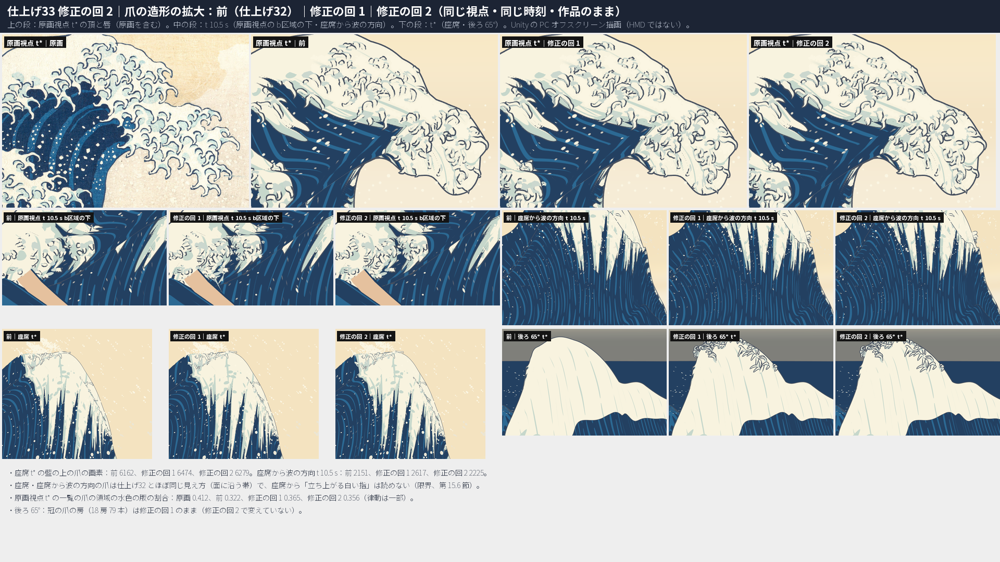
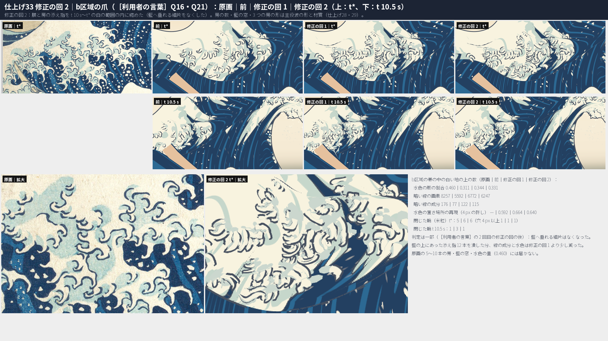
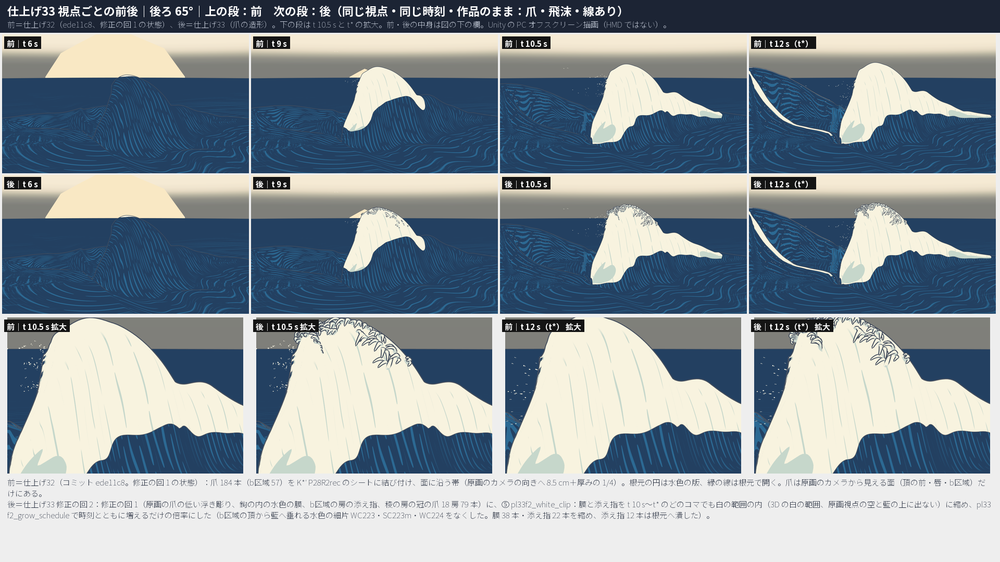
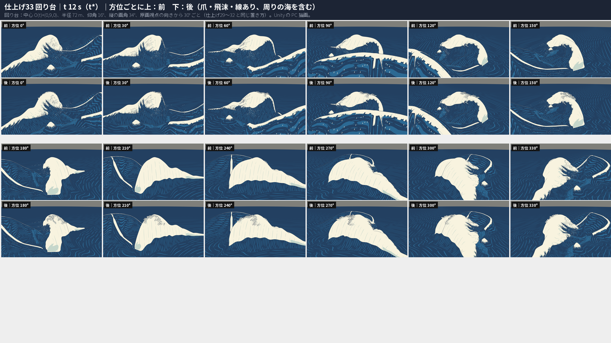
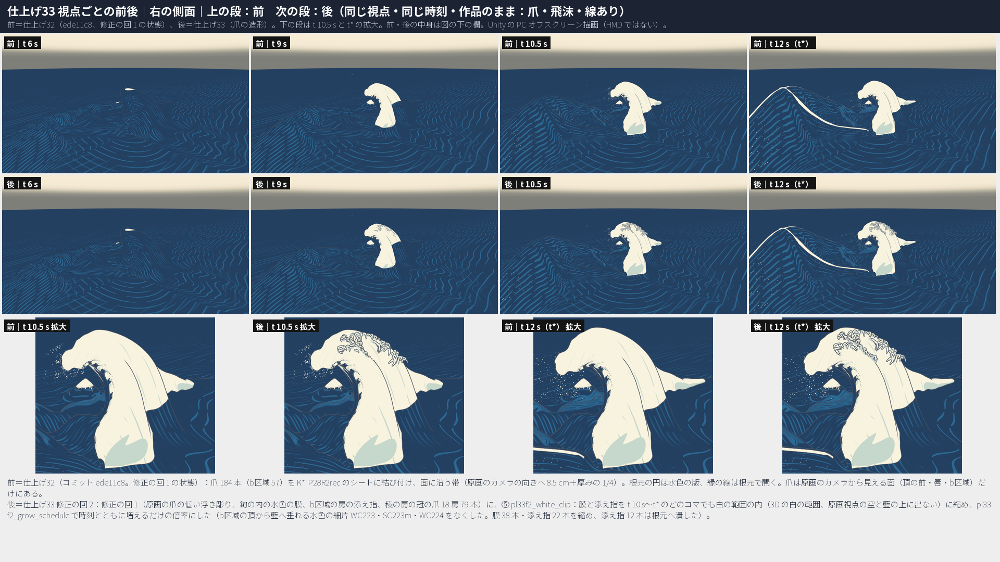
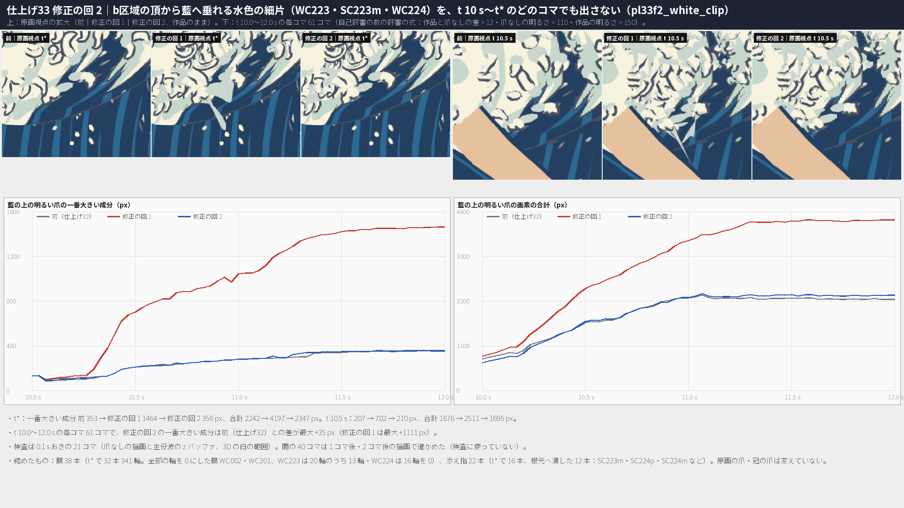

# 仕上げ33：設計33 爪の造形 ― 原画の爪を低い浮き彫りにして鉤の内に水色の版の膜を置き、b区域に房の添え指を、頂の裏の稜に冠の爪の房を加えて、側面・後ろ・真上・回り台から頂の爪を読めるようにした

日付：2026-10-02（着手 06:21、作る部 06:21〜07:45、修正の回 1 07:57〜09:40、修正の回 2 09:56〜11:15、記録の部 11:16〜11:35）／状態：**計画 §5.3 仕上げ33 の 12 行のうち、3 行を直し、6 行は一部、1 行は満たさない（限界）、1 行は限界として記録、1 行は該当なし。［利用者の言葉］の 1 項目（Q16・Q21 の b区域）は、2 回の修正の回を使っても一部。作る部、自己評審（評審 2 件）の 15 の指摘への修正の回 1、再評審の 4 の指摘への修正の回 2 の後、記録の部で記録を 1 つにまとめ、証拠と提出の一覧を整えた。進行役の再評審の前。** 時間枠 1.5 日に対して約 4.7 時間（自己評審の時間を除く。第 12 節）。**HMD 実機の結果ではない。利用者は見ていない。** 証拠は Unity 6000.4.3f1 の PC オフスクリーン描画、Editor の Play モード 2 つ、Release のプレイヤーを PC で動かした結果と、numpy・OpenCV・scipy の計算。

## ［利用者の言葉］の項目と今の判定

| # | 利用者の言葉（出典） | やったこと | 判定 |
| --- | --- | --- | --- |
| 1 | Q16・Q21 の b区域（大波の背の左肩の第二の波頭）の爪が、原画視点で房として読めない。帯の見かけの幅は領域の 0.72〜0.81 倍（計画 §5.3 仕上げ33 の最初の行。段階9確認 #2・#8、段階6確認 F6-1・F6-2・F6-3、設計33 限界4、設計36 限界8） | 作る部：鉤の内の水色の膜を b区域だけ帯の幅 × 1.8。修正の回 1（［利用者の言葉］の修正の回の 1 回目）：b区域の帯 57 本の両側に房の添え指 114 本、膜を × 3.0。修正の回 2（2 回目）：添え指と膜を、t 10〜12 s のどのコマでも 3D の白の範囲の内に収まるよう縮めた（b区域の頂から藍へ垂れていた水色の細片を消した）。帯の幅は仕上げ32 で領域の 0.91〜1.00 倍に合わせ済み（第 1 節） | **一部**。2〜3 本の指が同じ向きに巻く束として読め、束の間に水色が入る。暗い線の成分 77 → **115**（原画 176）、白い地の上の水色の版の割合 0.311 → **0.331**（原画 0.460）。原画の房（5〜10 本の指の束）と、房の間の藍の窓には届かない。藍の窓は主役波の材質の白の範囲（仕上げ29・31）、3 つの房の形は主役波の形（仕上げ28）で、爪の造形では作れない。2 回の修正の回を使ったので、10/29 以降の一覧へ送る |
| 2 | Q28：大波の色と描き方を原画の投影ではなく立体として作る。計画 §5.1 の審査の決まり（7 視点と回り台を同じ時刻で見て、引き伸ばし・継ぎ目・平らな面・溶けた爪が見えれば閉じない）と、この群の要点「原画の投影から来ていた爪の律動を、どの視点からも読める立体の爪で戻す」（[制作手順の Q28](../Workflow/Production_Workflow_ja.md#q28大波の色と描き方を原画の投影ではなく立体として作る指示2026-10-01)） | 原画カメラからの投影の色はどこにも使っていない。爪の色は帯の頂点の段（白・水色の版・線）だけで決まる。原画のカメラは、形を決める所だけに使った：浮き彫りの向き（原画視点の投影を変えないため）、形が原画視点の主役波の外へ出ないこと・冠の爪が原画視点で隠れることの検査。冠の爪の房（18 房 79 本）を頂の裏の稜に足した | **一部**。右の側面・後ろ 65°・真上・回り台では、前はほとんど見えなかった爪が、頂の房の列として読める（t\* の爪の画素：後ろ 65° 725 → 16,938、右の側面 1,045 → 7,717）。ただし稜は房ごとにしか縁取られず（後ろ 65° の上の縁の割合 0.38、真上 0.09）、左の側面はドームの左上の 1 か所だけ。座席・座席から波の方向からは 3D の白い指として読めず、仕上げ32 とほぼ同じ見え方（限界）。原画視点の律動は一部（水色 0.322 → 0.356、原画 0.412）。この群の範囲に、引き伸ばし・継ぎ目・溶けた爪・浮いた板は見えない（第 4 節） |

- **前＝仕上げ32（コミット ede11c8、修正の回 1 の状態）。** 描画は `Unity/Build/Polish/32/fix01/r_fix01`（PL32Render）。この群の着手（06:21）の時は未コミットの作業の木だったが、作業中に同じ場面とデータで ede11c8 としてコミットされた。PL33Render は `-pl33Look 0` のとき PL32Render と同じ描画になる。
- **後＝採用の状態＝修正の回 2。** 爪の並びは `Unity/Build/Polish/33/fix02/claws`（原画の爪 184・膜 184・冠の爪 79・添え指 114 の 561 項目、頂点 95,547・三角形 183,240）。描画は `Unity/Build/Polish/33/fix02/r_fix02`。場面は `PL33_Release.unity`（`8feca7ee…`）と `PL33_SinglePlayback.unity`（`106ae881…`。爪の層がないので PL32 の場面と同じバイト）。前・後とも同じ視点・同じ時刻（t 6・9・10.5・12 s）、作品のまま（爪・飛沫・線あり）で描いた。
- **作る部と修正の回 1 の版**：作る部の描画は `Unity/Build/Polish/33/r_after`、修正の回 1 は `Unity/Build/Polish/33/fix01/r_fix01`。どちらも採用ではない（第 9 節）。作る部の大きい立ち上げ（最大 0.8 m）・冠の爪 168 本・膜の × 1.8 は、修正の回 1 で作り直した。
- **修正の回**：1 回目は自己評審の 15 の指摘、2 回目は再評審の 4 の指摘（第 9 節）。［利用者の言葉］Q16・Q21 には 2 回目まで使った（計画 §5.1）。作る部は修正の回ではない。
- **バックログ項目**：99〜101、103〜105、129、136〜141、180、200、204〜208、238、262（計画 §5.2）。文言はリポジトリの外のバックログ（バックログ\_価値優先版.xlsx）を読んだ。
- **記録**：この群の記録はこのファイル 1 つにまとめた。作る部・修正の回 1・修正の回 2 の節に分かれていた前の版は、Git 対象外の `Unity/Build/Polish/33/record/archive_fix02/Polish_33_ja_fix02.md`（`e0104d16…`）に残した（第 13 節の R1）。

**最初に（結論）**

1. **側面・後ろ・真上・回り台から、頂の爪が房の列として読めるようになった（Q28 の要点、一部）。** 原画の爪は原画のカメラから見える面にしかないので、ほかの視点のための爪は、原画視点で隠れる頂の裏に冠の爪の房として足した（18 房 79 本。房ごとに 4〜6 本の指が稜の向きに並ぶ鉤）。t\* の爪の画素（前 → 後）：後ろ 65° **725 → 16,938**、右の側面 1,045 → 7,717、左の側面 2,361 → 10,111、真上 3,749 → 10,044。上の縁のうち 15 px 以内に爪がある列の割合（描画から）：右の側面 0.17 → **0.81**、後ろ 65° 0.04 → 0.38、左の側面 0.07 → 0.26、真上 0.00 → 0.09。右の側面は頂が爪で縁取られる。後ろ 65° と回り台 180〜270° は房の間の稜が滑らかで、右の肩（原画の輪郭そのもの）は縁取られない。
2. **座席・座席から波の方向からは、3D の白い指は読めない（限界。先に報告する）。** 作る部は爪を原画のカメラへの射線の向きに最大 0.8 m 立ち上げたが、座席から唇の角の四角い線の箱と、藍の壁の上に浮いた白い三日月に見えた。修正の回 1 で低い浮き彫り（最大 0.22 m）に戻したので、座席の爪は仕上げ32 とほぼ同じ見え方（面に沿う帯）になった。座席 t\* の爪の画素は 前 36,466 → 後 **38,508**（作る部 89,449）、藍の上の爪の画素 6,162 → 6,279。
3. **原画視点の律動は一部。** 爪の縁の線、鉤の内の水色の膜、白い指が交互に並ぶ。一覧の爪の領域の白い地の上の水色の版の割合 **0.322 → 0.356**（原画 0.412）、暗い線の画素 11,333 → 11,156（原画 14,858）。頂の輪郭そのものは滑らかな塊のままで、原画のように指で縁取られてはいない。
4. **［利用者の言葉］Q16・Q21 の b区域は、2 回の修正の回の後も一部**（上の表）。
5. **b区域の頂から藍へ垂れる水色の細片は、修正の回 2 で消した。** 原画視点の藍の上の明るい爪の一番大きい成分は、t\* で 前 353 → 修正の回 1 1,464 → 後 **356** px。t 10.0〜12.0 s の毎コマ 61 コマで、前との差は最大 **+35 px**（修正の回 1 は +1,111 px）。
6. **帯の断面の向きを直した（計画の行 5・204）。** コマの間の上面の向きの裏返り 28 → **0**、隣の輪の間の 60° を超えるねじれ 288 → **0**。縁の折れ返り 46 → 18 本。原画視点の画面の外で伸び始める爪 45 本を、根元が画面に入るまで遅らせた（行 8）。
7. **132・72 の細部込み（定義のままの読み）は 4 px に届かない（限界）。** 132 最大 5.3771 px、72 p95 5.1476 px（前と同じ）。4 px を超える所は、爪なしでも同じ所にある主役波の面の輪郭のこぶと、爪の先と先の間で包絡の真値に届かないへこみ。へこみを埋める白い帯を試したが、132 5.2998・72 p95 4.831 までしか下がらず、ほかの視点で白い棒になったので採らない（第 7 節）。
8. **原画視点の形の関門は後退しない。** 78 2.741、130 3.5815、131 3.4419、132 σ12 3.5576、72 σ12 p95 3.5757（爪あり）／3.8507（爪なし）は仕上げ32 と同じ値。評価器 23 の合否の数も 4 組とも同じ。原画の爪の t\* の輪の中心と先の投影も同じ（差 0.0 px）。CP1／26修正01 に対しては、段階5確認以来の後退のまま（第 6 節）。
9. **動きは壊れていない。** 瞬間移動・跳び・点滅・NaN は、原画の爪・膜・冠の爪・添え指とも 0。冠の爪の根元とシートの頂点の差は最大 8.1 µm。冠の爪が原画のカメラから見える頂点は、生まれてから t\* まで 0。
10. **Unity**：場面 2 つの Play モードは通った（例外は前と同じ Editor の検索の索引の 1 つずつ）。Release のビルドは成功（44 ファイル 1.20 GB、前 0.85 GB）。プレイヤーは 2 回とも pass、エラー 0、92,391・89,699 フレーム（仕上げ32 を同じ日に動かした 93,374・92,301 より約 1〜3% 少ない）。

| 爪の造形の拡大（原画｜前｜修正の回 1｜修正の回 2＝後） | b区域（［利用者の言葉］Q16・Q21。原画｜前｜修正の回 1｜後） |
| --- | --- |
|  |  |

| 後ろ 65° の前後（前｜後） | 回り台 t\* の前後（前｜後） |
| --- | --- |
|  |  |

| 右の側面の前後（前｜後） | 藍へ垂れる細片（前｜修正の回 1｜後、t 10〜12 s の毎コマ） |
| --- | --- |
|  |  |

---

## 1. ［利用者の言葉］Q16・Q21：b区域の爪

計画 §5.3 仕上げ33 の最初の行。仕上げ32 で b区域の爪を 77 本に数え直し（帯は根元が白い 57 本）、帯の幅を領域へ合わせたが、原画視点で房として読めなかった（仕上げ32 の限界 1）。この群では爪の読みやすさを直す。藍の窓と 3 つの房の形は主役波の形と材質なので、この群の範囲の外。

| 原画視点 t\* の b区域の帯の中 | 原画 | 前（仕上げ32） | 作る部 | 修正の回 1 | 後（修正の回 2） |
| --- | --- | --- | --- | --- | --- |
| 白い地の上の水色の版の割合 | 0.460 | 0.311 | 0.367 | 0.344 | **0.331** |
| 暗い線の画素 | 8,257 | 5,592 | 5,364 | 6,772 | **6,247** |
| 暗い線の成分 | 176 | 77 | 81 | 122 | **115** |
| 水色の置き場所の再現・精度（4 px の許し） | — | 0.592・0.893 | 0.627・0.907 | 0.664・0.903 | **0.640・0.900** |
| 閉じた輪（米粒）t\*・t 10.5 s | — | 5・1 | 8・3 | 6・3 | **6・1** |

- 作る部の値は `pl33f_measure.json` の build の欄、ほかは `pl33f2_measure.json`（どちらも `pl33f_measure.py` の同じ式。自己評審の数の評審の閾値・連結・穴の数え方に合わせた）。
- **作る部**（`pl33_tuft_web`）：鉤の内の水色の膜を、b区域の爪だけ帯の幅 × 1.8 にした。付け根の水色が塊に寄ったが、線の成分は 81 で、自己評審は「前とほとんど同じ。平らな白の上に離れた鉤」と読んだ。
- **修正の回 1**（［利用者の言葉］の修正の回の 1 回目。`pl33f_tuft.py`）：b区域の帯 57 本ごとに、親の中心線を弧長の 0.72・0.60 までなぞる添え指を両側に 1 本ずつ（親の幅の最大 × 1.25 ずらす、断面は親の 0.65 倍）置き、親の成長にそのまま付けた（`pl33f_tuft_fingers`・`pl33f_tuft_floor`）。白の範囲の外へ出る添え指は弧長を縮めた（`pl33f_tuft_zone`、15 本）。添え指の縁の線は親に向く半分を描かない（`pl33f_tuft_halfline`。親と交わって閉じた輪になるのを防ぐ）。膜は b区域で × 3.0。外側だけに置く・大きくずらす案は、閉じた輪が t\* 15〜23 に増えた（穴 222 px）ので採らなかった。
- **修正の回 2**（2 回目。`pl33f2_clip.py`）：修正の回 1 の添え指と × 3.0 の膜が、b区域の頂から輪郭を越えて藍の中へ垂れる淡い水色の細片（WC223・SC223m・WC224）を作っていた。膜と添え指を、t 10.0〜12.0 s の 0.1 s おきの 21 コマで検査し、3D の白の範囲の内（0.3 m の許し）・原画視点の空の上に出ない・爪なしの描画の藍の上に載らない、を満たすまで縮めた（`pl33f2_white_clip`）。倍率は時刻とともに増えるだけにし、1 コマに 0.05 より速く増やさない（`pl33f2_grow_schedule`）。添え指 22 本を縮め、12 本（SC223m・SC224p・SC224m など。どれも t 10〜12 s のどこかで藍の上に出ていた）は根元へ潰した。膜は 38 本を縮めた。
- 目で見て：2〜3 本の指が同じ向きに巻く束として読め、束の間に水色の版が入る。藍へ垂れる細片はない。藍の上に出ていた添え指を潰した分、線と水色は修正の回 1 より少し下がった。
- 試して採らなかった案：b区域の膜を横へ最大 1.9 倍に広げる（`--web-b-max 1.9`）は、水色が 0.354 に上がったが、暗い線の成分が 113 に減り、閉じた輪が 7 に増えた（第 13 節）。
- **判定：一部。** 5〜10 本の房、房の間の藍の窓、水色の版の量（0.460）には届かない。［利用者の言葉］に許される 2 回の修正の回を使ったので、10/29 以降の一覧へ送る（第 10 節の限界 2）。

## 2. 計画 §5.3 の行ごとの結果

| # | 行（要約）と出典 | やったこと | 前 | 後 | 判定 |
| --- | --- | --- | --- | --- | --- |
| 1 | ［利用者の言葉］Q16・Q21 の b区域の爪、帯の幅（段階9確認 #2・#8、段階6確認 F6-1・F6-2・F6-3、設計33 限界4、設計36 限界8） | 第 1 節 | 線の成分 77・水色 0.311 | 115・0.331（原画 176・0.460） | **一部** |
| 2 | 原画視点で 3D の爪がほとんど読めない。座席では線で形が見えるが、細かく乱れて房として読みにくい（段階6確認 F6-1、段階7確認 §6 の9・§9） | 原画の爪の低い浮き彫りで縁の線を面から出し、鉤の内に水色の膜。冠の爪の房 | 爪の領域の水色 0.322、座席 t\* の爪の画素 36,466 | 0.356（原画 0.412）、38,508 | **一部**（座席から 3D の白い指は読めない＝限界。作る部の「直した（0.419／90,219）」は取り消した） |
| 3 | 焼き込みの爪の模様と 3D の爪の二重、頂の模様が埋まる（設計36 §7 の限界4、設計38 §7、段階7確認 §9） | 仕上げ29 で焼き込みをやめたので二重はない。頂の模様は 3D の爪と膜だけ | — | — | 該当なし |
| 4 | 132・72 の細部込みの爪のこぶを 4 px へ（段階6確認 §4.1・§8、設計33 限界5・§7） | 4 px を超える所を塊に分けて原因を調べ、へこみを埋める帯を試した（採らない） | 132 5.3771・72 p95 5.1476 | 同じ | **満たさない**（限界、第 7 節） |
| 5 | 帯の断面の向きを輪の間とコマの間で続ける（C072 のコマ 203・218、C083・C114 の段）（段階6確認 §8、設計33 §7、設計34 §7） | `pl33f_section_turn`・`pl33f_section_clamp`・`pl33f_shape_blend` | 裏返り 28 コマ、60° を超えるねじれ 288 | **0・0** | **直した** |
| 6 | 中心線の急な折れの所の幅（45° を超える折れ 29 本、内側の縁が折れ返る爪 48 本）（段階6確認 §8） | `pl33f_bend_width`（45 本の輪の幅を最小 0.45 倍まで） | 縁の折れ返り 46 本、45° を超える折れ 88 本 | 18 本、78 本 | **一部**（45° を超える折れは仕上げ32 の一覧の中心線の形で、幅では変わらない） |
| 7 | シートに一部が隠れる爪（見える割合 0.8 未満の 4 本、C073）、根元の白の円の角ばり、根元が藍濃の 2 本（C163・C165）、200 の根元の白（段階6確認 §8、設計36 §7） | 見える割合を数えた。C163・C165 は仕上げ32 から帯にしていない（根元が白の範囲の外の 29 本） | 見える割合 0.8 未満 0 本 | 0 本 | **一部**（根元の円の角ばりは変えていない。根元の円は仕上げ32 の決まりで水色の版） |
| 8 | 成長の時刻、V3 の爪が画面の外で伸び始める（3.6〜6.4 s）（段階6確認 §8、設計35 §7） | `pl33f_onscreen_birth`（原画視点の画面の外で伸び始める 45 本を、根元が画面に入るコマまで遅らせた） | 画面の外で伸び始める爪あり（最初 6.53 s の C030 など） | 0 本（原画視点、作りの上で） | **直した**（原画視点。V3 の比べの版は既定でないので作り直していない） |
| 9 | 先端がシートから浮く（設計32 §7） | 原画のカメラへの射線の向きの低い浮き彫り（t\* で 0.02〜0.22 m、中央値 0.08 m）。根元は仕上げ32 とバイトまで同じ | — | 座席の藍の上の爪の画素 6,162 → 6,279、座席から見える先 45 → 47 本（画面の中 145 本） | **一部**（先が面から浮くのは意図した浮き彫り。作る部で座席から見えた浮いた三日月は消えた） |
| 10 | 空へ出る爪が唇の輪郭に作る白い欠け（設計38 §7、段階7確認 §6 の10） | 輪郭の暗い線のうち作品で明るくなった画素を数え、塊を目で見た | 127 px・9 塊 | 100 px・10 塊 | **限界として記録**（大きい 8 塊は、爪の先が輪郭の外へ出て爪の縁の線が輪郭を続けている。小さな切れ目の 2 か所は爪の縁の線が根元で開く所で、線の群（仕上げ38）） |
| 11 | 爪が重なる所の線の精度（設計38 §7） | 添え指は親に向く側の縁の線を描かない（`pl33f_tuft_halfline`）。膜には線を出さない | 原画視点の閉じた輪 t\* 13・t 10.5 s 16 | 20・17 | **一部**（作る部 21・18 より減ったが、前より多い。重なる原画の爪どうしの線は変えていない） |
| 12 | 動画の描画を短くする（設計33 §7） | Unity の描画（PL33Render）で静止画と 5 本の動画を作る | 設計33 は numpy で約 40 分 | 36 s | **直した** |

- 数は `metrics_fix02.json`・`pl33f2_measure.json`（前・修正の回 1・後を同じ式で数えた）。行 8 は `metrics_fix01.json`、行 7 の見える割合は `pl33_checks.json`（作る部の帯で数えた。修正の回で原画の爪の根元は変えていない）、行 9 の座席から見える先は `pl33f_tips_seat.json`（修正の回 1。修正の回 2 は原画の爪を変えていない）。

## 3. 作ったもの（名前の付いた美術の誘導。採用の状態）

どれも帯の頂点の並び（根元 1・輪 stations × 8・先 1・根元の白の円 9）の形だけを決め、色は作らない。原画カメラからの投影の色は使わない（Q28）。原画のカメラは、浮き彫りの向きと、形が原画視点の主役波の外へ出ないこと・冠の爪が隠れることの検査に使う（`pl33_common.TStarDepth`。形を決めるだけで、色は作らない）。

### 3.1 原画の爪（184 本。`Tools/GWWaveGen/pl33/pl33f_relief.py`、出力 `Build/Polish/33/fix01/relief`）

- **pl33f\_low\_relief（低い浮き彫り）**：仕上げ32 修正の回 1 の帯（`Build/Polish/32/fix01/claws`）の輪の中心と先を、t\*（コマ 360）でその点から原画のカメラ（PaintingCam v1）へ向かう射線の向きへ h だけ動かす。h = 0.12 × 帯の弧長 × prof（立ち上がり 0〜0.45、先の戻り 0.75）、上限 0.22 m。輪の頂点は奥行きの比で縮めるので、t\* の原画視点の投影は変わらない（輪の中心と先の差 0.0 px）。t\* の立ち上がり 0.02〜0.22 m（中央値 0.08 m）。射線の向きは t\* の根元の白の円の座標系で持ち、ほかのコマはそのコマの根元の円の座標系で作り直す（作る部の `pl33_root_frame`）。根元の点と根元の円は動かさない（`pl33_root_fixed`）。
- **pl33f\_relief\_ramp**：ρ(τ) = smoothstep((τ + 0.6)/0.6)。t 10.3 s から t\* へ浮く（t 10.5 s で 0.16、t 11 s で 0.74）。射線の向きの動きは t\* でだけ原画視点の投影を保つので、t\* の前は小さく保つ。
- **pl33f\_section\_turn・pl33f\_section\_clamp・pl33f\_shape\_blend**：t\* の真ん中の輪から根元・先へ、t\* からコマの前後へ、上面の向き（頂点 2 − 6）が隣と逆の輪を 180° 回す（楕円の断面なので形は同じ。回した輪×コマ 5,794）。上面の軸の 1 コマの回りを 25° 以下にする（20）。根元の座標系で見た帯の形の 1 コマの跳びを前後 5 コマの移り変わりに替える。
- **pl33f\_onscreen\_birth**：原画視点の画面の外（内側 20 px）で伸び始める爪は、根元が画面に入るコマまで伸び始めを遅らせ、t\* までの伸びを縮めて移す（45 本）。
- **pl33f\_bend\_width**：t\* で縁（頂点 0・4）の 1 歩が中心線の 1 歩と逆を向く輪の組の幅を、0.85 倍ずつ最小 0.45 まで縮める（45 本。時刻によらない倍率）。
- **鉤の内の水色の膜**（作る部の `pl33_hook_web` の式。184 本、id は W＋爪の id）：爪の巻きの内側（t\* の原画視点の中心線の曲がる側）の帯の縁から内へ、帯の幅 × 1.0（b区域 × 3.0。根元と先で細る）の薄い膜を、面の側へ 5〜12 cm 下げて置く。t\* で膜の縁が原画視点の主役波の外へ出る輪は縮め、帯の縁そのものが外の輪は潰す。**pl33f\_web\_floor**：膜の外の縁と中心が面より 2 cm 以上下の輪の幅を 0.7 倍ずつ縮める。

### 3.2 b区域の房の添え指（114 本。`pl33f_tuft.py`、出力 `Build/Polish/33/fix01/relief_t`）

第 1 節の修正の回 1 のとおり（`pl33f_tuft_fingers`・`pl33f_tuft_floor`・`pl33f_tuft_zone`・`pl33f_tuft_halfline`）。id は S＋親の id＋p／m。

### 3.3 冠の爪の房（18 房 79 本。`pl33f_crown.py`、出力 `Build/Polish/33/fix01/claws`）

- **pl33f\_crown\_ridge**：t\* の主役波を後ろ 65° と回り台 150〜300° から描いたときの上の縁に当たるシートの頂点を「稜」とする（置き場所を決めるためだけ。色は作らない）。**pl33f\_crown\_behind\_outline**：稜のうち原画のカメラから見える所の裏 3.0 m 以内の隠れた面も候補にする。高さ 11 m 以上（ドームの中ほどに置かない）。
- **pl33f\_crown\_tuft**：房の中心を間隔 2.0 m で稜に近い順に置き、房ごとに 4〜6 本の指を稜の向きに 0.55 m（±20%）おきに並べる。指は原画のカメラから離れる向きへ面から 55° で立ち上がり −45° まで巻く鉤で、扇に 14° ずつ開く。長さ 1.4〜3.7 m（中央値 2.2 m）、幅は長さ × 0.24（0.30〜0.60 m）、先は 0.10 まで細る。側面の厚みは幅の 0.40（99 の 15〜25% は原画の船側の列の中央の爪の項目で、原画にない冠の爪には当てず、横から見ても指の量感が読める厚みにした。進行役の既定）。上面（白）は巻きの外側、下面（水色の版）は内側。
- **pl33f\_crown\_hidden\_t**：生まれてから t\* まで 9 コマおきの主役波の z バッファで、そのコマの成長の形が原画のカメラから隠れることを確かめ、見えれば生まれる時刻を遅らせる（60 本）。伸びる時間が 0.45 s に満たない指は作らない（127 本）。**pl33f\_crown\_seat**：座席の目から主役波の面の上（藍の壁・白い面の前）に見える形も同じに扱う（空を背にした頂の縁取りと画面の外は許す）。**pl33f\_crown\_tuft\_min**：生き残りが 3 本に満たない房は作らない。
- 根元は主役波のシートの頂点そのもの（差 最大 8.1 µm＝float32 の丸め）。根元の T\_white で生まれ、長さ 0.03 → 1・幅 0.25 → 1・巻き 0 → 1（巻きは成長の半ばで終わる）。生まれる前は根元の点に潰す。T\_white より前に生まれる冠の爪は 0 本。

### 3.4 白の範囲の内に収める（`pl33f2_clip.py`、入力 `fix01/claws`、出力 `Build/Polish/33/fix02/claws`）

- **pl33f2\_white\_clip**：t 10.0〜12.0 s の 0.1 s おき（コマ 300〜360 の 3 コマおき、21 コマ）で、膜の輪の外の縁と中ほど、添え指の輪の 8 頂点と先が、次の 3 つを満たすよう縮める。(1) 3D の白の範囲：そのコマのシートで一番近い頂点が白の範囲（`pl31_zone_vertex`）で T\_white を過ぎている、またはそういう頂点まで 0.3 m の内。(2) 原画のカメラから見える点は主役波の中（空の上に出ない）。(3) 見える点は、爪なしの原画視点の描画（PL33Render、同じコマ）の暗い所（明るさ < 110 を 5×5 で 1 回削った所）に載らない。膜は輪ごとの幅の倍率（1・0.7・0.49 … 0）、添え指は弧長の倍率（1・0.85 … 0.23・0）。(2)(3) は形の範囲を決める検査で、色は作らない。検査の 21 枚の描画の SHA-256 は `run_fix02.json` の `check_masks_sha256`。
- **pl33f2\_grow\_schedule**：コマ f の倍率は「f より後の検査のコマの許しの最小」（時刻とともに増えるだけ）を検査のコマの間で線で結び、1 コマに 0.05 より速く増やさない。添え指の倍率 0 は輪と先を根元へ潰し、根元の円は倍率 0.3 までに 0 から開く。
- 結果：膜 38 本（t\* で 32 本・341 輪。全部の輪を 0 にした膜 WC002・WC201）、添え指 22 本（根元へ潰した 12 本、t 10 s の頃は潰れていて白の範囲に入ってから伸びる 6 本、短くした 4 本）。原画の爪と冠の爪は変えていない。

### 3.5 Unity（`Unity/Assets/GreatWave/Polish33/`）

- `Scripts/PL33ClawLook.cs`：膜（id W…）の全部の頂点の UV2.x を水色の版の段（0.0）にし、縁の線のメッシュの UV3.x を −1 にする。添え指は親に向く半分の縁の線を描かない（`pl33f_tuft_halfline`）。縁の線の材質を PL33 Claw Outline にする。PL32ClawLook の後（順 135）。
- `Shaders/PL33_Claw_Outline.shader`：PL32 Claw Outline の写しに、UV3.x が −1 の頂点を含む三角形を押し出さない決まり（`pl33_web_noline`）を足した。
- `Editor/PL33Render.cs`：PL32Render の写しに `-pl33Look` を足した。`Editor/PL33Setup.cs`：PL32 の場面 2 つを写し、爪の並びを `Build/Polish/33/fix02/claws` にし、爪の物に PL33ClawLook を足す。`Editor/PL33ReleaseBuild.cs`：必ず要るデータの爪の並びを仕上げ33 にする。
- 変えていないもの：主役波の形・動き・材質（K\*′ P28R2rec・G\_p28rec・PL29 Ukiyoe Keypose）、海・白・飛沫、爪の一覧と結び付け（仕上げ32）、DS34ClawPlayer・DS38ClawOutline・PL29ClawShade・PL32ClawLook・PL32ClawDriver、PL32 までの場面と材質。

## 4. 視点ごとの前と後（Q28 の審査。同じ視点・同じ時刻 t 6・9・10.5・12 s、作品のまま）

図は `fig_pl33_ba_view_{painting,seat,seat_toward_wave,side_left,side_right,back65,top}.png` と `fig_pl33_ba_turntable_t{060,090,105,120}.png`（上の段が前、次の段が後、下の段が t 10.5 s と t\* の拡大）。動画は `pl33_ba_{painting,seat,seat_toward_wave,side_left,tt}_30fps.mp4`（前｜後、どれも 1.6 MB 以下）。爪の画素は作品のままと爪なしの差（`pl33f2_measure.json`）、上の縁の割合は爪なしの描画の白い塊の上の縁の列のうち 15 px 以内に爪の画素がある割合（`pl33f2_ridge_img.json`）。

| 視点 | t\* の爪の画素（前 → 後） | 上の縁の割合（前 → 後） | 後（目で見て） |
| --- | --- | --- | --- |
| 原画視点 | 43,381 → 53,102 | — | t 6 s：前と同じ。t 9 s：前とほぼ同じで、頂の上に冠の爪の芽は出ない。t 10.5 s：唇の下の牙の束、空へ出る長い鉤、b区域の下の水色の細片はない。t\*：頂と唇の爪が、白い指・墨版の線・水色の膜で縁取られる（前より線と水色が多い）。頂の輪郭そのものは滑らかな塊のままで、原画のように指で縁取られてはいない。b区域は 2〜3 本の束 |
| 座席 | 36,466 → 38,508 | — | t 6・9 s：波はまだ画面の下の端。t 10.5 s・t\*：前とほぼ同じ。唇の前の爪は面に沿う低い帯で、角の四角い板・藍の上の白い三日月はない。3D の白い指としては読めない（限界） |
| 座席から波の方向 | 9,880 → 9,918 | — | t 10.5 s：白いつららの縁に爪の線が付く。水色の小石・破片はない。t\*：前とほぼ同じ（管の内側からは爪は見えない） |
| 左の側面 | 2,361 → 10,111 | 0.07 → 0.26 | t 9 s から、ドームの左上の 1 か所に冠の爪の房があり、t 10.5 s・t\* で房の列が面を下る形で見える。ドームの上の縁の大半は爪のない滑らかな縁。ドームの中ほどの平らな白は主役波の材質（仕上げ29・31） |
| 右の側面 | 1,045 → 7,717 | 0.17 → 0.81 | t 9 s から頂が爪で縁取られ、t 10.5 s・t\* で頭の上と背に鉤の房が並び、縁がぎざぎざに読める。はっきりよくなった |
| 後ろ 65° | 725 → 16,938 | 0.04 → 0.38 | t 9 s に稜の上に芽の列。t 10.5 s・t\* で、稜の左の頂（b区域の裏）と右の肩に房。房の間の稜は滑らか。ドームの面の中ほどに離れた鉤・米粒はない |
| 真上 | 3,749 → 10,044 | 0.00 → 0.09 | 頂の付近に房の指の塊がある（稜の全長ではない） |
| 回り台（12 方位） | 図の下の表 | 図の下の表 | t 9 s：150〜300° で頂に小さな縁取り。t 10.5 s・t\*：0〜150° と 300〜330° は原画の爪と冠の爪で頂が縁取られる。180〜270° は稜の頂の付近にだけ房があり、右の肩は縁取られない。動画で飛び出し・点滅は見えない |

回り台 t\* の稜の縁取りの割合（上の縁の画素のうち、見える爪の頂点が 15 px 以内にある割合。`pl33f2_measure.json` の `ridge_ringed_fraction_tstar`。前 → 後）：

| 方位 | 0° | 30° | 60° | 90° | 120° | 150° | 180° | 210° | 240° | 270° | 300° | 330° | 後ろ 65° |
| --- | --- | --- | --- | --- | --- | --- | --- | --- | --- | --- | --- | --- | --- |
| 前 | 0.03 | 0.00 | 0.06 | 0.27 | 0.18 | 0.09 | 0.02 | 0.00 | 0.08 | 0.20 | 0.27 | 0.15 | 0.00 |
| 後 | 0.26 | 0.21 | 0.27 | 0.54 | 0.43 | 0.26 | 0.27 | 0.15 | 0.31 | 0.42 | 0.53 | 0.38 | 0.32 |

- 7 視点＋回り台、4 時刻を目で見た：この群の範囲（原画の爪の浮き彫り・膜・添え指・冠の爪）に、色面の引き伸ばし・継ぎ目・溶けた爪・浮いた板・藍へ垂れる細片は見えない。平らな面は、左の側面と後ろ 65° のドームの中ほどに残る（主役波の材質と白の範囲＝仕上げ29・31 の範囲）。
- 修正の回 1 との差は、原画視点 t 10.5 s・t\* の b区域の下（細片が消えた。差の画素 1,730・2,998）、座席・座席から波の方向 t 10.5 s の頂の縁の淡い破片（427・902）、座席 t\* の頂の上の小さな白い欠片（396）、左の側面・真上 t\* の数十画素、回り台 30 枚の計 7,616 画素だけ。右の側面と後ろ 65° は修正の回 1 と画素まで同じ。爪なしの描画は、どの視点・時刻も修正の回 1 と同じ。
- HMD の枠（Release の場面の Play モード）の t 10.5 s・t\* は修正の回 1 と同じ見え方で、作る部で見えた藍の上の白い三日月はない（PC の Play モードの画像で、HMD 実機ではない）。

## 5. バックログ項目（番号の順）

| 項目 | 読み | 値 | 判定 |
| --- | --- | --- | --- |
| 99 | 船側の列の中央の爪の側面の厚み＝正面の幅の 15〜25%、根元から先へ続く | C095 の側面の厚み／正面の幅 0.20（全部の輪）。原画の爪の中央値 0.20（p5〜p95 0.20〜0.25）。断面は 180° 回しても形は同じ | 満たす |
| 100 | 船上から下面が根元から先まで続く、穴と切断面 0、原画構図の輪郭 ≤4 px | 帯は根元の扇・輪・先端で閉じた筒（穴なし）。輪郭の細部込みは 132 5.3771・72 p95 5.1476 px | 一部（輪郭は第 7 節） |
| 101 | 伸びる前の短い白い爪が見える | 原画の爪の芽は面に付いた短い帯。冠の爪も芽から伸びる（後ろ 65°・回り台の t 9 s） | 記録 |
| 103・104 | 終点の先端の位置・輪郭 ≤4 px | 原画の爪の t\* の輪の中心と先の投影は仕上げ32 と同じ（差 0.0 px）。仕上げ32 の先端の最大 0.54 px のまま | 満たす |
| 105 | 根元が水面に接し、隙間 0 | 原画の爪の根元・根元の円は仕上げ32 とバイトまで同じ。冠の爪の根元とシートの頂点の差 最大 8.1 µm | 満たす |
| 129 | 群の瞬時の置き換え 0 | 瞬間移動（根元に対して 0.5 m を超えるコマの間の動き）原画の爪・膜・冠の爪・添え指とも 0 | 満たす |
| 136 | 根元が白くなってから伸び、t\* で終わる | 原画の爪は仕上げ32 のまま（0 本）。冠の爪が根元の T\_white より前に生まれる本数 0 | 満たす |
| 137 | 根元の滑りと遅れ 0 | 冠の爪の根元はシートの頂点そのもの（8.1 µm＝float32 の丸め） | 満たす |
| 138 | 面が下へ曲がると根元が角度を保って回る | 立ち上がりの向き・冠の爪の向きは根元の座標系で持ち、そのコマの面で作り直す | 満たす（作りの上で） |
| 139 | 約 150 本が連続して伸び、欠落 0 | 原画の爪 184・冠の爪 79・添え指 114。NaN 0、跳び（根元に対して 0.15 m を超え前後の 4 倍）0、根元に対するコマの間の動きの最大 0.166 m（原画の爪）・0.164 m（冠の爪）・0.160 m（膜）・0.136 m（添え指） | 満たす |
| 140・141 | 船上から手前の爪が奥の爪を一部隠す、爪の間に空 | 座席 t\* の爪の画素 36,466 → 38,508、明るい地に触れない浮いた成分 31 → 31 | 記録（前と同じ水準。唇の指の間に藍・空が見える） |
| 180 | 船上から先が見える | 座席の目から、t\* の原画の爪の先が座席の画面の中にあり主役波の面より手前（5 cm の許し）にある本数 45 → 47（画面の中 145 本） | 記録（先の 1/3 が見える。残りは面の裏・巻きの内側） |
| 200・207・208 | 根元・側面・下面の白と波の白の色差 ΔE00 ≤5 | 爪の上面の白は PL29 Claw Shade の \_White (248, 243, 223) で主役波の白と同じ値（ΔE00 0）。根元の円・側面・下面は仕上げ32 の決まり（水色の版）で白ではない | 上面は満たす。根元の円・側面・下面は記録 |
| 204 | 伸びる間、白い面が続き、破口と反転 0、幅が範囲の内 | コマの間の上面の向きの裏返り 28 → 0、60° を超えるねじれ 288 → 0、幅が最初と最後の範囲の外のコマ 0 | 満たす |
| 205・206 | 根元から面へ白い面が続き、穴・切断面・支える板 0 | 帯は閉じた筒（穴 0）。膜は線のない水色の版の薄い膜で、座席からは爪の陰として読む。面の下に入る膜の輪が t\* で 10 残る | 一部（面の下の 10 輪は 206 の違反として記録） |
| 238 | 線のない根元に分ける線を足さない | 根元の線は仕上げ32 のとおり開き、膜には線を出さない | 満たす |
| 262 | 貫通の欠落 0 | 帯の輪の中心が面より 5 cm 以上下（最近の頂点の法線）、t 9・10.5・12 s：原画の爪 5・2・9（前 5・4・15。最深 0.21 m）、膜 6・3・10（最深 0.22 m）、冠の爪・添え指 0 | 満たさない（一部。前より少ない。第 10 節の限界 6） |

## 6. 原画視点の関門（形）と評価器（爪あり・爪なし、前の群と CP1／26修正01 に対して）

| 項目 | 後（爪なし／爪あり） | 前（仕上げ32） | 作る部 | 修正の回 1 | CP1 | 26修正01 | 関門 | 判定 |
| --- | --- | --- | --- | --- | --- | --- | --- | --- |
| 78 | 2.741／2.741 | 2.741 | 2.741 | 2.741 | 2.772 | 1.641 | ≤ 4 | 合格（後退なし） |
| 130 | 3.5815／3.5815 | 3.5815 | 3.5815 | 3.5815 | 1.968 | 1.953 | ≤ 4 | 合格（後退なし） |
| 131 | 3.4419／3.4419 | 3.4419 | 3.4419 | 3.4419 | 1.814 | 1.798 | ≤ 4 | 合格（後退なし） |
| 132（σ12 最大） | 3.5576／3.5576 | 3.5576 | 3.5576 | 3.5576 | 1.326 | 1.574 | ≤ 4 | 合格（後退なし） |
| 72（σ12 p95） | 3.8507／3.5757 | 3.8507／3.5757 | 3.8507／3.5757 | 3.8507／3.5757 | 1.558 | 1.723 | ≤ 4 | 合格（後退なし） |

- 記録のみ：定義の読みの 132（爪あり）5.3771、72（爪あり）p95 5.1476・最大 7.9299（前 7.9301）、72 σ24 p95（爪あり）3.2041（前 3.1984）。評価器 23 の 4 組：線あり・線ありの爪なし 合格 2・不合格 7、線なし・線なしの爪なし 合格 4・不合格 5（前と同じ）。色の項目（73〜270）は新しい読み（Q28）で記録のみ（`pl28u_regress_fix02.json`）。
- CP1／26修正01 に対しては、段階5確認 §6.3 以来の後退のまま（この群で増えも減りもしない）。
- 原画視点の主役波の外の爪の画素 t 9・10.5・12 s：前 75・1,372・3,875 → 後 75・1,370・3,847（作る部 2,140・2,753・—）。
- 作る部の試しの途中で、膜が唇の上の縁から空へはみ出して 132 σ12（爪あり）が 3.5576 → 3.9123 px になった版があった。帯の縁が主役波の外の輪は膜を潰す決まりで元の値に戻した。

## 7. 132・72 の細部込み（定義のままの読み）のこぶ

`pl33_bumps.py`（評価器 23 の真値・点の割り当てと同じ）。後の値は `pl33_bumps_fix02.json`、爪なしは `pl33_bumps_after_noclaws.json`。図 `fig_pl33_bumps.png` は作る部の t\* の ID 画像で描いた（原画の爪の t\* の投影は作る部・修正の回とも前と同じで、132 の値は同じ。72 の最大だけ 7.9301 → 7.9299）。

| | 最大 | p95 | 4 px を超える描画の点 |
| --- | --- | --- | --- |
| 132 爪あり（後＝前） | 5.3771 | 4.4882 | 92／1,209 |
| 132 爪なし | 5.9472 | 5.0703 | 177／1,198 |
| 72 爪あり（後） | 7.9299 | 5.1476 | 393／2,079 |
| 72 爪なし | 7.983 | 5.6807 | 407／1,982 |

- 4 px を超える塊（爪あり）：こぶ（描画が包絡の外）は (979, 245)・(922, 728)・(972, 425)・(983, 431)・(908, 717)・(1087, 394) で、**どれも爪なしの描画にも同じ所にある**（主役波の面の輪郭）。へこみ（描画が包絡に届かない）は (947, 189)・(931, 171)・(1084, 426)・(905, 412)・(1053, 464)・(1102, 360)・(872, 696)。唇の下では爪の先と先の間の空（爪の真値では空の所を、包絡の真値が橋渡しする所）。132 の (947, 189)・(931, 171) は、原画では爪の指先が作る輪郭の膨らみで、描画は主役波の面の縁。近くの一覧の爪は C061 だけで、爪を動かしても埋まらない。
- 爪は爪なしの値を下げている（132 5.95 → 5.38、72 p95 5.68 → 5.15）。
- **試して採らなかった案（`pl33f_rim_fill`、`pl33f_rim.py`）**：真値に 4 px より届かない境界の点の塊ごとに、境界と真値の間を埋める白い帯（10 本）を主役波のシートに結び付けた。132 5.3771 → 5.2998、72 p95 5.1476 → 4.831（78・130・131 は同じ）。4 px に届かず、座席から波の方向・真上で藍と空の上の細い白い棒になった（`fig_pl33f_rim_try.png`）。Q28 の「どの視点からも読める爪」と逆なので採らない。帯を原画視点だけに見せるのは視点に依る形なので採らない。
- 残りは、主役波の面の輪郭を削る（仕上げ28 の範囲）か、原画の爪の一覧にない輪郭の指を足す（仕上げ32 の一覧）しかない。**満たさない。10/29 以降の一覧へ送る。**

## 8. 数

| 項目 | 前（仕上げ32） | 作る部 | 修正の回 1 | 後（修正の回 2） |
| --- | --- | --- | --- | --- |
| 爪の層の項目（原画の爪／膜／冠の爪／添え指） | 184／0／0／0 | 184／184／168／0 | 184／184／79／114 | 184／184／79／114 |
| 頂点・三角形 | 31,336・60,096 | 91,400・175,296 | 95,547・183,240 | 95,547・183,240 |
| 瞬間移動・跳び・点滅・NaN | 0 | 跳び：原画の爪 1・膜 3・冠の爪 153 | 0 | 0 |
| 原画の爪の t\* の投影の差 | — | 最大 0.00005 px | 0.0 px | 0.0 px |
| 冠の爪が原画のカメラから見える頂点 | — | t\* 0（t 9 s 1,475・t 10.5 s 2,975） | 0（t 7.5〜12 s の 3 コマおき 46 コマ） | 0（冠の爪は変えていない） |
| 爪の領域の水色の割合（原画 0.412） | 0.322 | 0.419 | 0.365 | 0.356 |
| 爪の領域の暗い線の画素（原画 14,858） | 11,333 | 12,083 | 11,592 | 11,156 |
| 原画視点の閉じた輪 t 9・10.5・12 s | 1・16・13 | 3・23・22 | 2・18・21 | 2・17・20 |
| 原画視点 藍の上の明るい爪の一番大きい成分 t 10.5 s・t\* | 207・353 | — | 702・1,464 | 210・356 |
| 座席 t\* の爪の画素・藍の上の爪の画素 | 36,466・6,162 | 89,449・22,363 | 38,870・6,474 | 38,508・6,279 |
| 座席から波の方向 t 10.5 s の藍の上の爪の画素 | 2,151 | 7,982 | 2,617 | 2,225 |
| 縁の折れ返り・45° を超える折れ | 46・88 | 32・51 | 18・78 | 18・78 |
| 唇の輪郭の白い欠け | 127 px・9 塊 | 127・9 | 100・10 | 100・10 |
| Release のデータ | 0.85 GB | 1.17 GB | 1.20 GB | 1.20 GB（1,196,466,028 バイト） |
| プレイヤー（91.5 s の体験、2 回） | 93,374・92,301 | 90,088・91,599 | 91,664・90,673 | 92,391・89,699 |

- 作る部の数のうち、座席の画素と閉じた輪は `pl33f_measure.json` の build の欄（自己評審の式）。作る部の記録が `pl33_measure.py` の式で書いた値（座席 36,693 → 90,219、原画視点 44,723 → 56,052 など）とは式が違う。
- プレイヤーの「前」は、仕上げ32 のプレイヤーをこの群の作る部と交互に動かした値（`pl33_perf.json`）。作る部の形成の CPU 主スレッドの中央値は 0.61・0.64 → 0.66・0.65 ms、GPU 0.56・0.58 → 0.61・0.59 ms。修正の回 2 のフレームの時間は測っていない（90 Hz の予算の判定は仕上げ35）。

## 9. 自己評審の指摘と修正の回

### 9.1 自己評審（作る部 → 修正の回 1、07:57〜09:40）

自己評審（目で見る評審と、数を測り直す評審）は「閉じない」とし、15 の指摘を出した（評審の図は Git 対象外の `Unity/Build/Polish/33/judge_eye/`、数は `judge_numbers/`）。

| # | 指摘（要約） | やったこと | 前 → 作る部 → 修正の回 1 | 判定 |
| --- | --- | --- | --- | --- |
| 1 | 座席・座席から波の方向・HMD の枠の t\*：立ち上げた爪が唇で角の四角い線の箱、藍の壁の上で浮いた白い三日月。記録の「浮いた棒・線の箱は見えない」と食い違う | 低い浮き彫り（`pl33f_low_relief`・`pl33f_relief_ramp`）。記録の文は取り消した | 座席 t\* の藍の上の爪の画素 6,162 → 22,363 → 6,474、座席から波の方向 t\* 6,026 → 15,276 → 6,035 | 直した |
| 2 | 座席から波の方向 t 10.5 s：水色の縁取りの小石・破片、角の四角い白い板 | 同上。膜の下げを 2〜40 cm → 5〜12 cm | 藍の上の爪の画素 2,151 → 7,982 → 2,617 | 直した |
| 3・10 | 原画視点 t 10.5 s：唇の下の淡い牙の束、輪郭を越えて空へ出る長い鉤。t 9 s：冠の爪の芽が頂の上に硬い棘の列（隠れは t\* でしか確かめていなかった） | 立ち上げを t\* の付近だけに。冠の爪の隠れを生まれてから t\* まで確かめる（`pl33f_crown_hidden_t`） | 主役波の外の爪の画素 t 9 s 75 → 2,140 → 75、t 10.5 s 1,372 → 2,753 → 1,370。冠の爪の見える頂点 0 | 直した |
| 4 | 側面・後ろ・回り台：冠の爪がドームの面に離れた小さな閉じた輪・歯（米粒）。稜の右半分が縁取られない（「12 方位すべて」は言い過ぎ） | 冠の爪を稜に沿う房にした（`pl33f_crown_ridge`・`pl33f_crown_tuft`・`pl33f_crown_tuft_min`）。記録の文は取り消した | 米粒：なし。稜の縁取りの割合 後ろ 65° 0.00 → 0.44 → 0.32、回り台 210° 0.00 → 0.36 → 0.15 | 一部（房の間が空く。右の肩は原画の輪郭そのもので、隠れる冠の爪を置けない） |
| 5・8 | ［利用者の言葉］b区域：前と後がほとんど同じ | 添え指と × 3.0 の膜（第 1 節） | 線の成分 77 → 81 → 122、水色 0.311 → 0.367 → 0.344 | 一部 |
| 6・9 | 132・72 の細部込みのこぶ。修正の回を使わずに限界へ送った | へこみを埋める帯を試した（採らない。第 7 節） | 132 5.3771 → 5.3771 → 5.3771（試し 5.2998） | 満たさない |
| 7・12 | 計画の行 5：断面の向きの裏返り、ねじれ、膜の跳び | `pl33f_section_turn`・`pl33f_section_clamp`・`pl33f_shape_blend` | 裏返り 28 → 28 → 0、ねじれ 288 → 288 → 0、跳び 0 → 原画の爪 1・膜 3 → 0 | 直した |
| 7・13 | 行 6：急な折れの所の幅 | `pl33f_bend_width` | 縁の折れ返り 46 → 32 → 18 本 | 一部 |
| 7・14 | 行 8・10・11：成長の時刻、唇の白い欠け、重なる所の線 | `pl33f_onscreen_birth`、欠けを数える、`pl33f_tuft_halfline` | 第 2 節の表 | 直した・記録・一部 |
| 11 | 閉じた輪（米粒）が増えた（t 10.5 s 16 → 23、穴 4 px 以上 1 → 4） | 低い浮き彫り、添え指の半分の線 | t 10.5 s 16 → 23 → 18（穴 4 px 以上 1 → 4 → 3） | 一部 |
| 15 | 140・141・180・262・200・207・208・205・206 に数の判定がない。膜の輪 47 本が t\* で面より 5 cm 以上下 | `pl33f_web_floor`。第 5 節の表に数の判定を付けた | 膜の輪 t 9・10.5・12 s：— → 16・39・47 → 5・3・10 | 第 5 節 |

### 9.2 再評審（修正の回 1 → 修正の回 2、09:56〜11:15）

再評審は「閉じない」とし、4 の指摘を出した（評審の図は Git 対象外の `Unity/Build/Polish/33/rejudge01/`）。

| # | 指摘（要約） | やったこと | 前 → 修正の回 1 → 修正の回 2 | 判定 |
| --- | --- | --- | --- | --- |
| 1 | 原画視点 t\* と t 10.5 s：b区域の頂から輪郭を越えて藍の中へ垂れる淡い水色の細片（WC223・SC223m・WC224）。t 10 s〜t\* のどのコマでも出さない | `pl33f2_white_clip`・`pl33f2_grow_schedule`（第 3.4 節）。検査に使っていない 40 コマ（1 コマ後・2 コマ後）も描いて確かめた | 藍の上の明るい爪の一番大きい成分 t\* 353 → 1,464 → 356、t 10.5 s 207 → 702 → 210。61 コマの前との差の最大 +1,111 → +35 px | 直した |
| 2 | 記録：計画の行 2 の作る部の「直した（0.419／90,219）」が古いまま。座席から 3D の白い指は読めない | 行 2 を「一部」にし、限界に足して先に報告した。`metrics_fix01.json` に `record_corrections_fix02`、`metrics_build.json` の行 2 に `superseded_ja` を足した | 水色 0.322 → 0.365 → 0.356、座席 t\* の爪の画素 36,466 → 38,870 → 38,508 | 記録を直した（判定は一部・限界） |
| 3 | 記録：計画 §5.1 の読みが違う。作る部は修正の回ではなく、［利用者の言葉］Q16・Q21 には 2 回目の修正の回が残っている | 2 回目の修正の回を使った（細片の除去と、白の範囲の内に収めた添え指の伸び方）。b区域を広げる試しは採らない | b区域の線の成分 77 → 122 → 115、水色 0.311 → 0.344 → 0.331 | 一部（2 回目の後。10/29 以降の一覧へ） |
| 4 | 記録：左の側面「稜がぎざぎざの指の列として読める」は言い過ぎ | 書き直した。左右の側面・真上・後ろ 65° の上の縁の割合を描画から数えた | 左の側面 0.07 → 0.26 → 0.26、右の側面 0.17 → 0.81 → 0.81、後ろ 65° 0.04 → 0.38 → 0.38、真上 0.00 → 0.09 → 0.09 | 記録を直した |

## 10. 限界（10/29 以降の一覧へ）

1. **座席・座席から波の方向から 3D の白い指は読めない**（座席 t\* の爪の画素 38,508、前 36,466）。立ち上げを大きくすると座席から板・三日月に見え、低くすると面に沿う帯に戻る。座席から読める指には、座席の目から見て藍の壁の前に出ない形（唇から下がる指を面に沿わせて太くする、など）を別に設計する必要がある。原画視点の律動も一部（爪の領域の水色 0.356、原画 0.412）。計画の行 2 は一部。
2. **［利用者の言葉］Q16・Q21 の b区域の房は一部**（2 回の修正の回の後。線の成分 115、水色 0.331）。5〜10 本の房と藍の窓は、主役波の形（仕上げ28）と材質の白の範囲（仕上げ29・31）。
3. **132・72 の細部込みは 4 px に届かない**（132 5.3771、72 p95 5.1476。第 7 節）。
4. **稜の縁取りは房ごと**：後ろ 65° 0.32（回り台 210° 0.15）。左の側面はドームの左上の 1 か所の房の列だけで、上の縁の大半は滑らか。原画のカメラから見える稜（回り台 210〜270° の右の肩）には、原画視点を変えずに冠の爪を置けない。
5. **45° を超える中心線の折れ 78 本、縁の折れ返り 18 本**（仕上げ32 の一覧の中心線）。
6. **面に入る輪**：t\* で原画の爪 9・膜 10 輪（最深 0.22 m）。t 9 s の膜は 6 輪（修正の回 1 は 5。WC111 の輪 7、−7.9 cm。面の下なので見えない）。
7. **閉じた輪**：原画視点 t\* 20・t 10.5 s 17（前 13・16）。重なる原画の爪どうしの線（設計38 の線の群）と、添え指・膜の分。
8. **唇の輪郭の小さな切れ目 2 か所**（爪の縁の線が根元で開く所。線の群）。
9. **冠の爪は原画にない立体の爪**（参照の彫刻の頂の指の見え方を参考にした進行役の解釈。写真 3 枚を画面で見ただけで、形・寸法・画像は入れていない）。左の側面・後ろのドームの中ほどの平らな白は、主役波の材質と白の範囲（仕上げ29・31）のまま。
10. **`pl33f2_white_clip` の検査の暗い所は、爪なしの原画視点の描画から作る**：主役波の材質・海・飛沫を変えたら、描き直した検査の画像で `pl33f2_clip.py` をやり直す。
11. **鉤の内の膜は板に見えうる**（206 の「支える板」）。座席からは爪の下の陰として見えると判断した。
12. **根元の円の角ばり、200・207・208 の根元・側面・下面の白**は、仕上げ32 の決まり（水色の版）のまま。V3 の比べの版の成長の時刻は作り直していない。
13. **重さ**：データ +0.35 GB（1.20 GB）、プレイヤーのフレームは仕上げ32 より約 1〜3% 少ない。90 Hz の予算の判定は仕上げ35。
14. **HMD は未検証**（浮き彫りの指・膜・冠の爪・添え指の立体視）。

## 11. 後の群へ

- **仕上げ35（数量と負荷）**：爪の層は 561 項目・95,547 頂点（仕上げ32 の 3 倍）。データ 1.20 GB。PL32ClawDriver は形成の間は毎コマ差し替える。
- **仕上げ36・38**：膜は水色の版の段（UV2.x = 0）、縁の線は膜に出さない（UV3.x = −1、`pl33_web_noline`）、添え指は親に向く半分の縁の線を描かない。唇の輪郭の小さな切れ目 2 か所と、重なる爪どうしの閉じた輪は線の群（仕上げ38）。
- **主役波の材質・海・飛沫を変える群**：`pl33f2_clip.py` の検査の画像（爪なしの原画視点の描画、t 10〜12 s の 21 枚）を描き直してから回し直す（限界 10）。
- **体験の Release**：今後は PL33\_Release（`PL33ReleaseBuild`）を土台にする。爪の並びは `Build/Polish/33/fix02/claws`。
- **右側の爪（末尾）**：冠の爪と添え指の作り方（根元の座標系、隠れの検査、白の範囲の検査）をそのまま使える。
- **10/29 以降の一覧**：座席から読める白い指（限界 1）、b区域の房と藍の窓（限界 2）、132・72 の細部込み（限界 3）、稜の右の肩の縁取り（限界 4）。

## 12. 範囲・時間枠・実績

- 群：仕上げ33（設計33 爪の造形）。バックログ項目 99〜101、103〜105、129、136〜141、180、200、204〜208、238、262。時間枠 1.5 日（計画 §5.2：帯の断面と折れ 0.5 日、原画視点の読みやすさ・幅・二重の模様 0.5 日、こぶ・根元・成長 0.5 日）。群の予定は 10/10〜10/11（計画 §2.6）で、10/2 に行った。
- 実績（`date` の時刻）：
  - 作る部 06:21〜07:45（約 1.4 時間）：読み・前の状態の確かめ 06:21〜06:30、立ち上げの試し 06:31〜06:33、冠の爪 06:38〜06:41、膜・Unity の部品 06:45〜06:47、試しの描画と直し 06:47〜07:06、最終の描画・評価器・場面・Play モード・Release 07:05〜07:27、プレイヤー 07:27〜07:34、図・記録 07:34〜07:45。
  - 修正の回 1 07:57〜09:40（約 1.7 時間）：C: の空きの対処 07:57〜08:05、原因の切り分けと低い浮き彫り 08:05〜08:16、冠の爪 08:13〜08:30、断面・成長・b区域 08:30〜09:07、全部の描画・評価器・こぶの試し 09:07〜09:20、場面・Play モード・Release・プレイヤー 09:24〜09:33、図・記録 09:20〜09:40。
  - 修正の回 2 09:56〜11:15（約 1.3 時間）：指摘の数の出し直し 09:56〜10:01、毎コマの描画 10:01〜10:03、検査と倍率の決め方の試し 10:04〜10:20、全部の描画・評価器・測り 10:20〜10:58、場面・Play モード・Release・プレイヤー 10:59〜11:06、図・動画・記録 11:06〜11:15。
  - 記録の部 11:16〜11:35（約 0.3 時間。記録を 1 つにまとめる、metrics.json・run.json・提出の一覧、記録の部の確かめ。新しい描画・計算はしない）。
  - 合わせて約 4.7 時間（自己評審の時間を除く。作る部 1.4・修正の回 1 1.7・修正の回 2 1.3・記録の部 0.3 時間）。Unity の 1 回の計算はどれも 30 分以内（描画で最長 45 s、Play モード 98 s、プレイヤー 98 s）。
- 修正の回：2 回。計画 §5.1 の「修正は群ごとに 1 回まで、［利用者の言葉］の項目は 2 回目を行ってよい」と、AGENTS.md の「同じ問題の修正は 2 回まで」の内。2 回目は［利用者の言葉］Q16・Q21 の b区域の傷（細片）と、記録の 3 つの直しに使った。

## 13. 決定の記録（Q24：推奨の案を選び、理由と落とした案を残す）

作る部：

1. **「どの視点からも読める」の手段は、原画の爪の立ち上げ（原画視点を変えない）と、原画視点で隠れる頂の裏の冠の爪の 2 つにした。** 原画の爪は原画のカメラから見える面にしかないので、ほかの視点のための爪は隠れた面に足すしかない。落とした案：射線の向きの立ち上げだけ（試し `try/relief35`。側面・後ろ・真上からは面の裏で見えず、ほとんど変わらなかった）、面の法線の向きの立ち上げ（原画視点の投影が動く。仕上げ32 で唇の先の C085 が輪郭の外へ出て 132 σ12 が 4.46 px になった案）。
2. **原画視点の律動は、色の投影を使わずに、爪ごとの水色の膜（帯の頂点だけで決まる）で戻す（Q28）。** 落とした案：原画視点で爪の間の空をくり抜く（原画カメラから投影した印が要る）。
3. **132・72 の細部込みは、原因を主役波の面の輪郭（仕上げ28 の範囲）と包絡の読みの性質に分けた。**
4. **参照の写真**：利用者の指示 Q16 の例外の写真のフォルダー `G:\research\reality scan\北斋参考` の 3 枚（`正面图.jpg`・`左45.jpg`・`背图.jpg`）を画面で見た（頂の指が全周に突き出し、後ろからは稜の指の列として読めることの確かめ）。画像・寸法・形はリポジトリと成果物に入れていない。Exif は写していない。参照モデルの OBJ と Q27 のフォルダーは使っていない。

修正の回 1：

5. **立ち上げを低い浮き彫り（最大 0.22 m、t\* の付近だけ）に戻した。** 座席から板・三日月に見えたため。落とした案：立ち上げの向きを t\* の射線で運ぶまま低くする（ρ なし。t 10.5 s の座席から波の方向に水色の小石が残った）、作る部の 0.35・0.8 m のまま（座席の傷が残る）。座席から指として読めなくなることは、修正の回 2 の再評審で限界として先に報告した。
6. **冠の爪を稜に沿う房（3 本以上の指）にした。** 落とした案：稜から 1.4 m だけ・高さ 6 m 以上（ドームの左の縁の低い所に房が出て、面の中ほどの鉤に見えた）、座席の目の隠れを確かめない（座席から波の方向に藍の上の白い扇 1,556 px）。
7. **断面の向きは 180° の回し＋25° の抑え＋形の移り変わりで直した。** 落とした案：コマの方向にガウスで均す（楕円の輪を作り直すと 1 コマの跳びが 25 本に増えた）。
8. **b区域の添え指は両側 × 1.25・半分の線。** 落とした案：外側だけ・大きくずらす・線を全周（閉じた輪 15〜23、穴 117〜349 px）。
9. **132・72 のへこみを埋める帯は採らない**（第 7 節）。

修正の回 2：

10. **［利用者の言葉］Q16・Q21 の 2 回目の修正の回を使った。** 群の予定は 10/10〜10/11 で今日は 10/2、時間枠に余裕があり、細片は b区域の項目そのものの傷なので、同じ回で直すのが一番近い。
11. **倍率は時刻とともに増えるだけ（`pl33f2_grow_schedule`）。** 落とした案：全コマ同じ倍率（`--mode const`。t 10 s の頃だけ藍の上に出る添え指まで全部の時刻で潰れ、b区域の線の成分 112）。
12. **3D の白の範囲の検査を足した（0.3 m の許し）。** 視点によらない検査を残すため。落とした案：原画視点の検査だけ（`--no-3d`）。
13. **b区域の膜を横へ広げない。** 落とした案：最大 1.9 倍（`--web-b-max 1.9`。水色 0.354 に上がったが、線の成分 113・閉じた輪 7）。膜の輪の中ほどが面の下に入らない検査（`--web-floor`。面の下の輪の数は変わらず、縮める膜が 3 本増えただけ）。

記録の部：

- R1. **記録を `Polish_33_ja.md` の 1 つにまとめた。** 作る部・修正の回 1・修正の回 2 の節に分かれていた前の版は、Git 対象外の `Unity/Build/Polish/33/record/archive_fix02/`（`Polish_33_ja_fix02.md` `e0104d16…`、`archive_index.json` に SHA-256）に残した。作る部の版は `record/archive_build/`、修正の回 1 の版は `record/archive_fix01/` にある。理由：採用の状態を最初に読めるようにするため（仕上げ32 の R1 と同じ）。
- R2. **証拠の `metrics.json`・`run.json` を群の最終の値にした。** 作る部の 2 つは `metrics_build.json`・`run_build.json` に名前を替えて残し（中身はバイトまで同じ）、`pl33_record.py` の出力の名前と、`pl33f2_record.py` が読み替えを書き足す先も替えた（走らせ直して最終の値を上書きしないため。替える前の 2 つの写しは `archive_fix02/` にある）。最終の 2 つは新しい道具 `pl33r_record.py` が書く（新しい計算・描画はしない）。
- R3. **数の写し誤りを直した。** 作る部の記録は 103・104 の先端を「仕上げ32 の ≤ 2.10 px のまま」と書いていた（仕上げ32 の作る部の値の写し）。仕上げ32 の採用の値は 0.54 px（`Docs/Evidence/Polish/32/pl32f_measure_claws.json`）。修正の回 2 の記録は終わりの時刻を 11:20 と書いていたが、記録のファイルの最後の書き込みは 11:15 だった。
- R4. **前後の図と動画は描き直さなかった。** 見出しは「仕上げ33 視点ごとの前後」、下の欄は「後＝仕上げ33 修正の回 2」で、採用の状態を指している。

## 14. 再現

```
# <B> = G:/Unity/GreatWave_2026_Fresh/Unity/Build/Polish/33。PYTHONIOENCODING=utf-8。Unity は 1 つずつ（run_pl33_unity.ps1 が Unity/Build/unity.lock を取る）
# 描画（Git 対象外の <B>/fix02/run_render_g.sh の中身）：
#   powershell -NoProfile -ExecutionPolicy Bypass -File Tools/GWWaveGen/pl33/run_pl33_unity.ps1 -Method GreatWave.Polish33.EditorTools.PL33Render.Render -Log <名前> -Extra "
#     -pl29Out <出力> -pl30Sea Build/Polish/30/sea -pl30SeaParamFile Tools/GWWaveGen/pl30/pl30_sea_params.txt -pl30LeftSwell Build/Polish/30/left_swell/pl30_left_swell.json
#     -pl29Attr Build/Polish/29/fix01/attr/pl29_hero_attr_f32.bin -pl29ClawShade 1 -pl29ParamFile Tools/GWWaveGen/pl29/pl29_material_params.txt
#     -pl29ClawParamFile Tools/GWWaveGen/pl32/pl32_claw_params.txt -pl29HeroPkg Build/Polish/32/white/hero_pkg -pl31Spray Build/Polish/31/spray
#     -pl32Claws <爪の並び> -pl32Look 1 -pl33Look <0|1> -pl29Views painting,seat,seat_toward_wave,side_left,side_right,back65,top
#     -pl29VideoViews painting,seat,seat_toward_wave,side_left -pl29Only <views,tt,t28,full,video>"
#   （パラメータのファイルは絶対パスで渡した。前の描画は Build/Polish/32/fix01/r_fix01 を PL32Render で描いたもの）
# 評価器（Git 対象外の Build/Polish/32/run_eval.sh の中身）：
#   py -3.10 -B Tools/GWWaveGen/pl28/pl28u_regress.py --scene <描画> --kstar rec
#   py -3.10 -B Tools/PaintingTruth/evaluate.py --render <描画>/full/painting_t120_off.png --ids <描画>/full/ids_<line|line_noclaws|noline|noline_noclaws>.png --idmap Unity/Build/Design/40/compare/eval/idmap.json --out-dir <描画>/eval23/off_<…> --name off_<…>
# 修正の回 1（原画の爪・添え指・冠の爪）
py -3.10 -B Tools/GWWaveGen/pl33/pl33f_relief.py                  # 入力 Build/Polish/32/fix01/claws → <B>/fix01/relief
py -3.10 -B Tools/GWWaveGen/pl33/pl33f_tuft.py                    # → <B>/fix01/relief_t
py -3.10 -B Tools/GWWaveGen/pl33/pl33f_crown.py --relief Unity/Build/Polish/33/fix01/relief_t   # → <B>/fix01/claws
# 修正の回 2（採用）
（描画）seq_fix01：爪の並び fix01/claws、-pl33Look 1、-pl29Views painting -pl29Times 10.0,10.1,…,12.0（爪なしの描画＝検査の暗い所）
py -3.10 -B Tools/GWWaveGen/pl33/pl33f2_clip.py                   # → <B>/fix02/claws（採用の爪の並び）
（描画）r_fix02：爪の並び fix02/claws、views,tt,t28,full,video
（評価器）<B>/fix02/r_fix02
py -3.10 -B Tools/GWWaveGen/pl33/pl33_bumps.py Unity/Build/Polish/33/fix02/r_fix02/t28_claws Unity/Build/Polish/33/fix02/measure/pl33_bumps_fix02.json
py -3.10 -B Tools/GWWaveGen/pl33/pl33f_measure.py --fix-run Unity/Build/Polish/33/fix02/r_fix02 --fix-claws Unity/Build/Polish/33/fix02/claws --build-run Unity/Build/Polish/33/fix01/r_fix01 --build-claws Unity/Build/Polish/33/fix01/claws --out Unity/Build/Polish/33/fix02/measure/pl33f2_measure.json
powershell … run_pl33_unity.ps1 -Method GreatWave.Polish33.EditorTools.PL33Setup.BuildScenes -Log f02_build_scenes -Extra "-pl33Out <B>/fix02/setup"
powershell … run_pl33_unity.ps1 -NoQuit -Method GreatWave.Polish29.EditorTools.PL29PlayModeCheck.Run -Log f02_playmode_<Release|SinglePlayback> -Extra "-pl29Scene Assets/GreatWave/Polish33/Scenes/PL33_<Release|SinglePlayback>.unity -pl29Out <B>/fix02/playmode_<…> -pl29Limit <400|120>"
powershell … run_pl33_unity.ps1 -Method GreatWave.Polish33.EditorTools.PL33ReleaseBuild.BuildAll -Log f02_release_build
powershell … run_pl33_player.ps1 -Tag f02pair1 ; powershell … run_pl33_player.ps1 -Tag f02pair2
py -3.10 -B Tools/GWWaveGen/pl33/pl33f2_sheets.py ; py -3.10 -B Tools/GWWaveGen/pl33/pl33f2_figs.py ; py -3.10 -B Tools/GWWaveGen/pl33/pl33f2_record.py
# 記録の部
py -3.10 -B Tools/GWWaveGen/pl33/pl33r_record.py                  # metrics.json・run.json・<B>/commit_list.txt と記録の部の確かめ
```

- 作る部（採用ではない）のコマンドは `run_build.json`、修正の回 1 は `run_fix01.json`、修正の回 2 は `run_fix02.json` に全文がある。毎コマの確かめ（`seq_pre`・`seq_f2`・`hold1_*`・`hold2_*`）と上の縁の割合は、Git 対象外の作業用の道具（`<B>/fix02/work/seqm.py`・`ridge_img.py`）で数えた。式は `pl33f2_seq_overindigo.json` の `rule_ja` と `pl33f2_ridge_img.json`。
- 試しの描画（作る部の `try`・`relief`、修正の回 1 の `fix01/try*`・`r_rim1`、修正の回 2 の `claws_const`・`claws_wide`・`claws_floortry`・`r_floortry`）は Git 対象外の `Unity/Build/Polish/33/` に残した。

## 15. 出典と SHA-256（主なもの。全部は run.json）

- 計画：[段階9までの実行計画](../Design/Stage9_Plan_2026-09-26_ja.md) §5.1（進め方・Q28 の審査）、§5.2（時間枠）、§5.3 仕上げ33（12 行と出典）、§2.6（日程）。行の出典の記録：[段階6確認](Stage6_SelfReview_ja.md)（F6-1・F6-2・F6-3、§4.1・§8）、[段階7確認](Stage7_SelfReview_ja.md)（§6 の 9・10、§9）、[段階9確認](Stage9_SelfReview_ja.md)（#2・#8）、[設計32](Design_32_ja.md) §7、[設計33](Design_33_ja.md)（限界4・5、§7）、[設計34](Design_34_ja.md) §7、[設計35](Design_35_ja.md) §7、[設計36](Design_36_ja.md)（§7 の限界4、限界8）、[設計38](Design_38_ja.md) §7。前の群：[仕上げ32](Polish_32_ja.md)。
- 利用者の言葉：[制作手順](../Workflow/Production_Workflow_ja.md) の Q16（浪尖の爪）・Q21（b区域）・Q28（投影でなく立体）。
- 主役波：`Build/Polish/28/G_p28rec`（時間曲線 `timewarp_G_p28rec.json` `836224b5…`）、K\*′ P28R2rec、白と hero\_pkg は仕上げ32（`Build/Polish/32/white/hero_pkg`、T\_white `9f7ab0b6…`、白の範囲 `pl31_zone_vertex.npy` `6d664a05…`）。
- 爪の入力：仕上げ32 修正の回 1 の帯 `Build/Polish/32/fix01/claws/ds33_claw_frames_f32.bin`（`e5360314…`）、一覧 `Build/Polish/32/fix01/list/ds32_claw_inventory.json`（`9c5887d9…`）。
- 爪（採用）：`Build/Polish/33/fix02/claws/ds33_claw_layout.json`（`1402d17f…`）、`ds33_claw_frames_f32.bin`（`9b7fd2e6…`）、`ds33_claw_tris_i32.bin`（`f4973d6e…`）、`ds33_claw_tri_attr_u16.bin`（`59a2b814…`）、倍率 `pl33f2_web_scale.npy`（`d43c8a0e…`）・`pl33f2_tuft_scale.npy`（`450a67c6…`）。修正の回 1 の土台 `fix01/claws/ds33_claw_layout.json`（`bc9ea364…`）。
- 場面：`PL33_Release.unity` `8feca7ee…`、`PL33_SinglePlayback.unity` `106ae881…`。Release の exe `5be81b3f…`（`Build/Polish/33/release/player`。Unity のプレイヤーの本体で、仕上げ32 と同じバイト。違いはデータのフォルダー）。
- 原画：リポジトリの `Docs/References/Met_JP1847_DP130155.jpg`（図の原画の切り抜きはこれだけ）。
- 参照の写真（利用者の指示 Q16 の例外。読み取りのみ）：作る部で `G:\research\reality scan\北斋参考` の 3 枚を画面で見ただけ（第 13 節の 4）。画像・寸法・形・Exif はリポジトリと成果物に入れていない。修正の回 1・2 と記録の部では開いていない。
- **この群では参照モデル（`G:\research\model\wave_repair_zbrush2.obj`）、利用者の爪形分析（`G:\research\爪形分析`）、`G:\research\Wave Simulation` を開いていない。** 生成器は OBJ を読まない（F13-1）。

## 16. 証拠と記録の一覧（`Docs/Evidence/Polish/33/`）

- 記録：`metrics.json`（群の最終：［利用者の言葉］、計画 §5.3 の 12 行、バックログの値と判定、関門・評価器、Q28 の視点ごとの数と目視、Unity、限界、記録の部の確かめ）、`run.json`（作る部・修正の回・記録の部のコマンド、提出の一覧の全部のファイルと採用のデータの SHA-256、道具の版、参照の読み）。作る部の `metrics_build.json`・`run_build.json`、修正の回 1 の `metrics_fix01.json`・`run_fix01.json`、修正の回 2 の `metrics_fix02.json`・`run_fix02.json`。
- 修正の回 2（採用）の数の JSON：`pl33f2_measure.json`（前・修正の回 1・後を同じ式で）、`pl33f2_seq_overindigo.json`（t 10〜12 s の毎コマ）、`pl33f2_clip_report.json`、`pl33f2_ridge_img.json`、`pl33_gates_fix02.json`、`pl28u_regress_fix02.json`、`pl33_bumps_fix02.json`、`pl33_setup_fix02.json`、`playmode_release_fix02.json`・`playmode_single_fix02.json`、`release_build_fix02.json`、`pl33_players_fix02.json`、`render_report_fix02.json`。
- 修正の回 1 の数の JSON：`pl33f_measure.json`、`pl33f_relief_report.json`、`pl33f_crown.json`、`pl33f_crown_painting_vis_all.json`、`pl33f_tips_seat.json`、`pl33_gates_fix01.json`、`pl28u_regress_fix01.json`、`pl33_bumps_fix.json`、`pl33_setup_fix01.json`、`playmode_release_fix01.json`・`playmode_single_fix01.json`、`release_build_fix01.json`、`pl33_players_fix01.json`。
- 作る部の数の JSON：`pl33_measure.json`、`pl33_checks.json`、`pl33_gates.json`、`pl28u_regress_after.json`、`pl33_bumps_{after,after_noclaws,before}.json`、`pl33_relief_report.json`、`pl33_crown.json`、`pl33_setup.json`、`playmode_release.json`・`playmode_single.json`、`release_build.json`、`render_report_after.json`、`pl33_perf.json`。
- 図（16 枚、どれも 1920×1080）：視点ごとの前後 `fig_pl33_ba_view_{painting,seat,seat_toward_wave,side_left,side_right,back65,top}.png`、回り台 `fig_pl33_ba_turntable_t{060,090,105,120}.png`（前 仕上げ32｜後 採用）。`fig_pl33_claws_views.png`・`fig_pl33_bregion.png`（原画｜前｜修正の回 1｜後）、`fig_pl33f2_sliver.png`（前｜修正の回 1｜後と 61 コマの折れ線）、`fig_pl33_bumps.png`（作る部の t\* の ID 画像。値は後と同じ）、`fig_pl33f_rim_try.png`（修正の回 1 の採らなかった試し）。原画の図はリポジトリの DP130155 の切り抜き。参照の彫刻の写真・参照モデル・利用者の爪形分析の画像から作った図はない。
- 動画（5 本、どれも 1.6 MB 以下）：`pl33_ba_{painting,seat,seat_toward_wave,side_left,tt}_30fps.mp4`（前 仕上げ32｜後 採用）。
- 記録の部の確かめは `metrics.json` の `record_phase`（PNG と MP4 の大きさ、場面の guid の行き先、Python の読み込みの行き先、提出の一覧の全部のファイルと .meta、禁止の場所と個人のパスの文字列）。
- 生成した大きなファイル（爪の並び・帯の表、描画、Release）は Git 対象外の `Unity/Build/Polish/33/` にあり、SHA-256 を run.json に記録した。

## 17. 出来事

1. **C: ドライブの空きが 0 だった**（作る部の着手の時 8.7 MB、その後 0）。bash の出力が書けずに失敗することがあったので、出力は G: のファイルへ書いて読んだ。Unity の TEMP・TMP は `Build/Polish/33/tmp_env` にした（`run_pl33_unity.ps1`）。Unity の解析の SQLite（CoreBusinessMetrics）が「disk I/O error」「database or disk is full」を出したが、描画・場面・Play モード・ビルドは成功した。修正の回 1 で、会話の作業フォルダーのうち 9/29 より前の古いフォルダー 119 個（約 1.54 GB、前の群の作業の写し）を G: の `Unity/Build/_scratch_moved_20261002/`（Git 対象外）へ**移した（消していない）**。進行役の `q26gov` と `objref` は動かしていない。記録の部の時点で C: の空きは約 1.5 GB。**利用者が C: の空きを作る必要がある。**
2. 着手の時に未コミットだった仕上げ32 は、作業中に ede11c8 としてコミットされた。
3. 修正の回 2 の最初の版で、潰れていた添え指が伸び始める時に根元の円が一度に開く跳びが 2 回出た。根元の円を倍率 0.3 までに 0 から開く決まりで 0 にし、描き直した。
4. Unity の Editor の検索の索引の例外（`SearchDatabase`）が Play モードの起動で 1 つずつ出る（仕上げ30〜32 と同じ。この群のコードではない）。
5. `Unity/ProjectSettings/PackageManagerSettings.asset` は Git 対象外のまま残っている（9/30 の作成で、この群の作業ではない）。ほかの群の未追跡のファイル（`Houdini/Polish28/*.hiplc`、`Tools/GWWaveGen/ds28r01`・`kstar3`・`kstar_h` の一部、`Docs/Evidence/Design/28R01`）も、この群の提出の一覧に入れていない。
