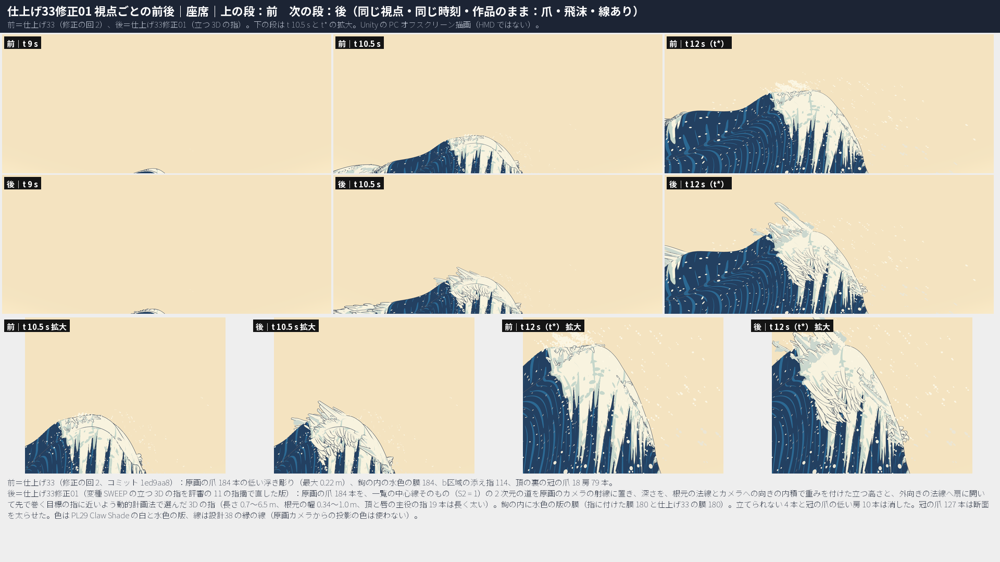
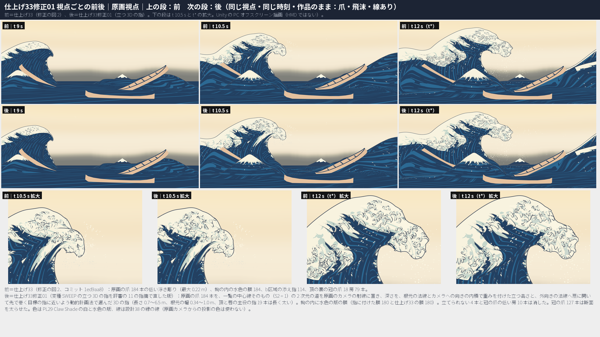
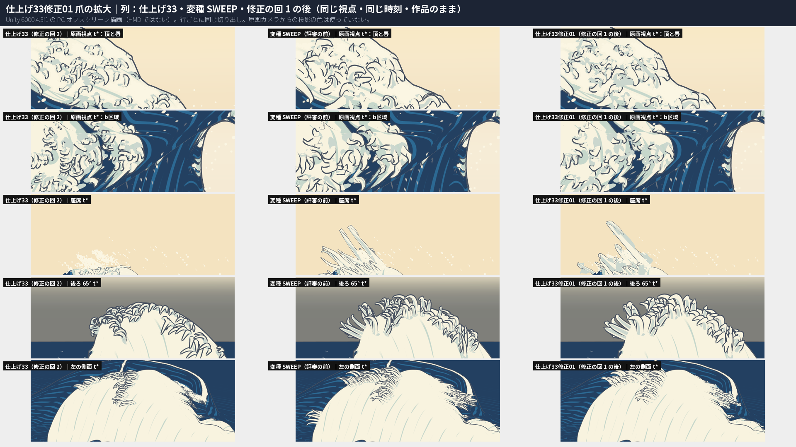
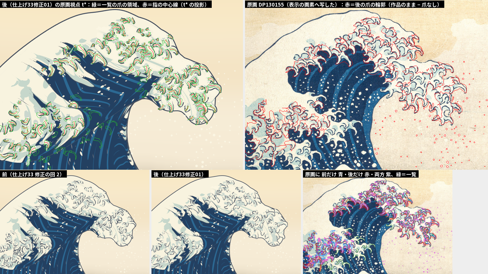
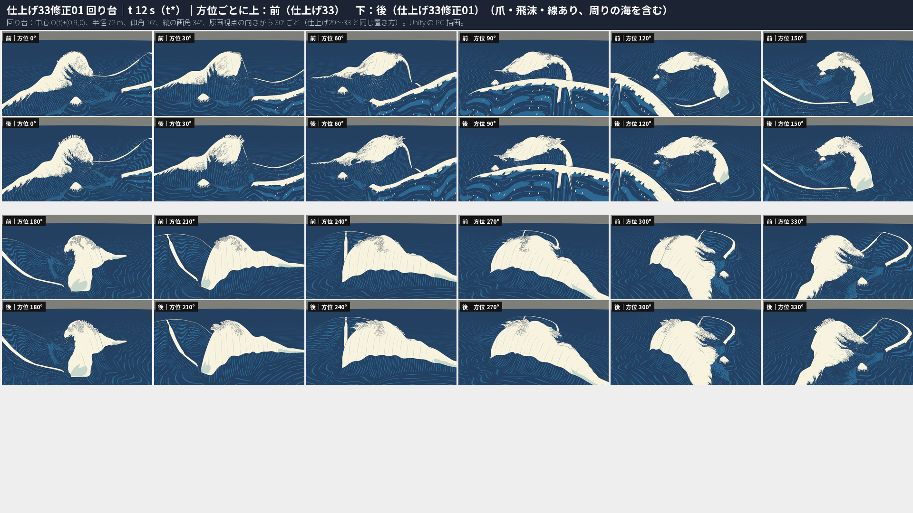
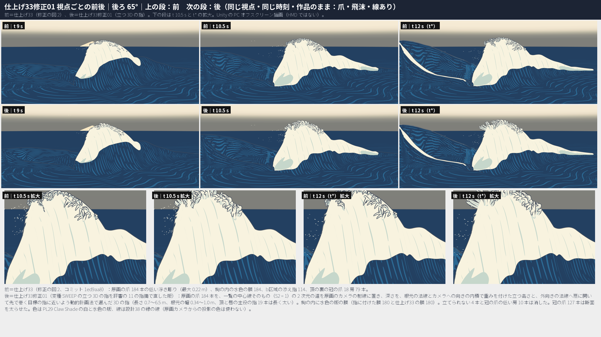

# 仕上げ33修正01：設計33 爪の造形 ― 低い浮き彫りの爪を、頂・唇・b区域から立つ 3D の白い指に置き換えた（2 つの変種から SWEEP を採り、評審の直すべき 11 の指摘に修正の回を 1 回かけた）

日付：2026-10-02（変種 11:36〜13:57、評審 〜14:05、修正の回と統合 14:05〜16:15、記録 16:15〜16:45）／状態：**進行役の再評審の前。HMD 実機の結果ではない。利用者は見ていない。** 時間枠 1 日（進行役の決定、Q24。計画の日程より約 5 日早い）に対して、壁時計で約 5.2 時間（2 つの変種は並べて作った）。証拠は Unity 6000.4.3f1 の PC オフスクリーン描画、Editor の Play モード 2 つ、Release のプレイヤーを PC（RTX 3080、1920×1080 の窓）で動かした結果と、numpy・OpenCV・scipy の計算。

## 最初に：Q28 の問いへの答え

**問い 1：爪は、どの視点からも、波から立つ 3D の白い指として読めるか。** → **いいえ（一部）。** 座席・右の側面・後ろ 65° の稜では、面に描いた帯ではなく、波から立って先で巻く白い指として読めるようになった。座席から波の方向は t 10.5 s だけ、左の側面・真上・回り台は、72 m 先では細い毛のような縁取りで、太い白い指の量感には届かない。座席の指はみな原画のカメラの方へ傾き、平行な箒に近い（限界 1）。

**問い 2：原画視点で、藍の舌を縁取る爪の輪の頂（北斎の大きな白い爪の輪）が読めるか。** → **いいえ（一部）。** 水色の版は仕上げ33 を越えて原画に近づき（爪の領域 0.356 → **0.399**、原画 0.412）、一覧の爪への重なりも良くなった（精度 0.806 → **0.851**）。けれども見え方は仕上げ33 と同じ「小さな巻きの群れ」の手ざわりで、大きな白い爪の輪は読めない。暗い線の成分は 266（原画 398）、暗い線の画素は 10,642（原画 14,858、仕上げ33 11,156）で、線は前より少し減った。

視点ごとの前と後（同じ視点・同じ時刻 t 9・10.5・12 s、作品のまま。数は t\* の爪の画素＝作品のまま − 爪なし、括弧の中は白い爪の画素。前＝仕上げ33 修正の回 2、変種＝評審の前の SWEEP、後＝採る状態）：

| 視点 | 前 → 変種 → 後 | 目で見て（後） | 立つ 3D の白い指として読めるか |
| --- | --- | --- | --- |
| 座席 | 38,508（31,388）→ 100,018（73,464）→ **107,898（88,596）** | 前は面に沿う帯で、頂の上は飛沫だけだった。後は t 10.5 s・t\* で頂から白い指の束が空へ立ち、先が巻き、下面に水色の版、縁に藍の線が付く。ただし指はみな画面の左上（原画のカメラの方）へ傾いた櫛か箒で、唇の先の C085 は 1 本の長い棒として残る | **はい**（硬く平行。扇に開かない＝限界 1） |
| 座席から波の方向 | t 10.5 s 14,385 → 36,510 → **38,317**。t\* 9,918 → 10,717 → 11,125 | t 10.5 s は b区域の縁に先の尖った指の扇が立ち、輪郭から突き出す。t\* は管の内側にいて爪は画面にほとんど入らない（前と同じ） | **t 10.5 s ははい、t\* は変わらない** |
| 右の側面 | 7,717（2,164）→ 10,753（4,258）→ 9,423（4,193） | 頂の上に、立って先で巻く指が密に並ぶ。前は面の上に寝た鉤の浮き彫り。72 m 先なので 1 本は小さい | **はい**（小さな房） |
| 左の側面 | 10,111（3,901）→ 17,116（6,628）→ 14,096（6,793） | 頂の稜と唇の側に、外へ突き出す指の縁取り。この距離では毛のような細い房で、太い指としては読みにくい | **一部** |
| 後ろ 65° | 16,938（5,178）→ 25,354（10,347）→ **23,838（12,043）** | 稜の上に、水色の側面と縁の線を持つ太い白い指が空へ立つ。この群でいちばんはっきりした変化。変種でドームの中ほどに寝ていた鉤の群れ（冠の爪の低い房）は消えた | **はい**（稜） |
| 真上 | 10,044（2,999）→ 16,174（4,316）→ 14,052（4,644） | 唇の先と b区域の縁から外へ放射する指の縁取り。頂の指は真上からは面の上の鉤に近い | **一部** |
| 回り台 12 方位（t\*） | 稜の縁取りの割合：13 の読みのうち 10 で前より上（例 方位 240° 0.31 → 0.41、270° 0.42 → 0.49）、後ろ 65°・0°・300° は同じか少し下 | ほとんどの方位で頂の輪郭に指の縁取りが出る。72 m 先では細い毛の縁取りで、太い爪の輪ではない | **一部** |
| 原画視点 | 53,102（28,441）→ 57,376（29,499）→ 56,438（35,947） | 一覧の爪の鉤の形のまま、白い指と鉤の内の水色の膜が戻った。変種の「大きく粗い鉤」は一覧の大きさへ戻った。北斎の、藍の舌を縁取る大きな白い爪の輪には見えない。唇の輪郭の白い欠け 100 → 246 px（後退） | **爪の輪の頂は読めない**（水色と重なりは仕上げ33 を越えた） |

- 原画カメラからの投影の色は、どこにも使っていない（Q28）。原画のカメラは、指の形を決める射線、主役波に隠れないこと・一覧の領域に収まること・冠の爪が隠れることの検査にだけ使った。
- 主役波の形の関門は通る（≤ 4 px）。ただし 72 σ12 p95（爪あり）は 3.5757 → **3.9059**（余裕 0.09 px）で、この群でいちばん危うい値（第 7 節）。
- 爪の層は 95,547 → **104,707 頂点**（+9.6%、変種 54,763）。PC のプレイヤーの GPU の時間は仕上げ33 と同じ（差 +0.01 ms 以内）。PSVR2 の GPU の時間は未検証。

| 座席（前｜後） | 原画視点（前｜後） |
| --- | --- |
|  |  |

| 爪の拡大（仕上げ33｜変種 SWEEP｜後） | 一覧の爪の領域と原画への重ね（後） |
| --- | --- |
|  |  |

| 回り台 t\*（前｜後） | 後ろ 65°（前｜後） |
| --- | --- |
|  |  |

ほかの視点の前後の図：[座席から波の方向](../Evidence/Polish/33R01/fig_pl33r01_ba_view_seat_toward_wave.png)・[左の側面](../Evidence/Polish/33R01/fig_pl33r01_ba_view_side_left.png)・[右の側面](../Evidence/Polish/33R01/fig_pl33r01_ba_view_side_right.png)・[真上](../Evidence/Polish/33R01/fig_pl33r01_ba_view_top.png)・[回り台 t 9 s](../Evidence/Polish/33R01/fig_pl33r01_ba_turntable_t090.png)・[回り台 t 10.5 s](../Evidence/Polish/33R01/fig_pl33r01_ba_turntable_t105.png)。前後の動画：`pl33r01_ba_*_30fps.mp4`（原画視点・座席・座席から波の方向・左の側面・回り台）。

## ［利用者の言葉］と今の判定

| 利用者の言葉（出典） | やったこと | 判定 |
| --- | --- | --- |
| Q28：大波の色と描き方を原画の投影ではなく立体として作る。参照の彫刻のように、どの視点からも浮世絵の特徴が立体として読めること（[制作手順の Q28](../Workflow/Production_Workflow_ja.md#q28大波の色と描き方を原画の投影ではなく立体として作る指示2026-10-01)） | 低い浮き彫り（最大 0.22 m）の爪を、立つ 3D の白い指（掃引の管、長さ 0.72〜6.5 m・中央値 1.74 m、根元の幅 0.34〜1.0 m、白と水色の版の 2 段、設計38 の縁の線）にした。鉤の内に水色の版の膜を立てた。冠の爪を太らせ、ドームの上に寝て見えた低い房を消した | **一部**（上の表）。座席・右の側面・後ろ 65° の稜では立つ白い指として読める。左の側面・真上・回り台は細い縁取り、原画視点の爪の輪の頂は読めない |
| Q16・Q21 の b区域（仕上げ33 の［利用者の言葉］1。2 回の修正の回を使い切り、10/29 以降の一覧） | b区域の原画の爪（仕上げ33 の帯 57 本）も立つ指にした。仕上げ33 の添え指 114 本は変種 SWEEP で外した。膜（b区域は管の幅 × 6.0）で水色を戻した | 原画視点の水色 0.331 → **0.349**（原画 0.460）。暗い線の成分 115 → 96、暗い線の画素 6,247 → 4,833（原画 176・8,257）で線は減った。座席から波の方向 t 10.5 s では b区域の指が立って見える。原画の房（5〜10 本の束）と藍の窓には届かない（限界のまま） |

---

## 0. 結論

1. **2 つの変種から SWEEP を採った。** 進行役の評審 2 件が、同じ視点・同じ時刻で仕上げ33・SWEEP・Houdini を並べ、2 件とも SWEEP を採った（第 1 節）。SWEEP だけが原画視点の外の見え方を変え、仕上げ33 より軽かった。Houdini は座席の頂の束だけで、側面・後ろ・回り台はほとんど変わらず、重かった。
2. **評審の直すべき 11 の指摘に修正の回を 1 回かけた。** 7 つを直し（うち 2 つは一部が残る）、3 つは一部、1 つは記録した（第 2 節）。
3. **原画視点の水色の版と、一覧への重なりは、仕上げ33 を越えた。** 爪の領域の水色 0.356 → **0.399**（変種 0.255、原画 0.412）、b区域 0.331 → **0.349**（変種 0.275）。一覧の領域の再現 0.630 → **0.636**（変種 0.567）、精度（4 px）0.806 → **0.851**（変種 0.753）、中心線の先の伸び 中央値 +9.2 px（変種）→ **−0.1 px**。暗い線の成分 257 → **266**（変種 209、原画 398）。
4. **座席・右の側面・後ろ 65° の稜で、頂の爪が立つ白い指として読める。** 白い爪の画素 t\*（前 → 変種 → 後）：座席 31,388 → 73,464 → **88,596**、後ろ 65° 5,178 → 10,347 → **12,043**、左の側面 3,901 → 6,628 → **6,793**、真上 2,999 → 4,316 → **4,644**。冠の爪は原画のカメラから t 9・10.5・12 s とも見えない（0 頂点）。
5. **座席から見た「扇」は一部（限界 1）。** 稜の指は外向きの法線へ開いて先で巻くようになり、射線の向きに 5 m 伸びて平行な棒に見えた指（C080 など）は 3.5 m までにした。ただし面が原画のカメラを向く所の指は、原画視点の 2 次元の道を守る限り射線の向き（カメラの側）にしか立てられないので、座席からは同じ向きに傾く。唇の先の C083・C085 を短くした試しで 132 σ12 が 4.99 px になったので、稜の指と輪郭にかかる指は短くしない（C085 は 6.5 m のまま、座席の上に 1 本の棒が残る）。
6. **ドームの白の上に寝て見えた鉤の群れは消した。** 評審の読み（立てられなかった 10 本の指）と違い、正体は変種の冠の爪の低い房（K027〜K029・K037〜K040。同じ決まりで K109〜K111 も）だった。根元の高さが 12 m より低い房を消した。立てられない指は 10 本から 4 本（C062・C086・C087・C089）に減り、帯に戻さず消した（原画視点の一覧の 4 本が欠ける）。
7. **断面の向き：コマの間の裏返り 22 → 0。** 白の向きを背骨に沿って平行に運ぶ枠にした。「ねじれ（> 60°）」の数え（輪の中心＝頂点 2 と 6 の中点）は 1,088 回だが、その 99%（1,080 回）は一覧の中心線が 1 駅で 60° を超えて折れる所（隣の輪の接線が違う）で、接線のまわりのねじれではない。
8. **跳び（根元に対する加速度 > 0.15 m/コマ²）：変種 28 回（15 項目）→ 9 回（7 項目）。** 冠の爪 9 → **0**。指 19 → 6（4 本、最大 0.189）、膜 3（3 本）。仕上げ33 の 0 には届かない（限界 3）。瞬間移動・NaN・点滅は 0。
9. **頂点の高さで数えた貫通（5 cm より下、u > 0.3）：指は変種 28／18／11 項目 → 6／5／4 項目（t 9・10.5・12 s）。** 仕上げ33 は 2／7／5 項目。最も深い所は −0.26 m（t 10.5 s の C104 など。仕上げ33 は −0.24 m）。膜は 5／4／4 項目（仕上げ33 は 2／2／3）。
10. **原画視点の形の関門は通る。** 78 2.741・130 3.5815・131 3.4419 は前と同じ。132 σ12 3.5789（爪なし 3.5576、+0.02 px）、72 σ12 p95 **3.9059**（爪なし 3.8507。仕上げ33 の爪あり 3.5757 より +0.33 px、変種 3.6353 より +0.27 px。≤ 4 は通る。余裕 0.09 px）。細部込み（爪がこの細部を描いてよい）：132 最大 5.3771 → **5.2998**、72 p95 5.1476 → **4.9217**、72 最大 7.9299 → **6.9831**（どれも 4 px には届かない）。評価器 23 の合否の数は 4 組（線あり・線ありの爪なし・線なし・線なしの爪なし）とも前と同じ。
11. **Unity**：場面 2 つの Play モードは通った（例外は前と同じ Editor の検索の索引の 1 つずつ）。Release のビルドは成功（44 ファイル 1.25 GB、仕上げ33 1.20 GB）。プレイヤーは仕上げ33 の exe と交互に 2 回ずつ、4 回とも pass・エラー 0。GPU の時間（中央値、形成／静止）：仕上げ33 0.600・0.609／0.682・0.687 ms、後 0.612・0.597／0.690・0.691 ms（90 Hz の予算 11.1 ms）。

---

## 1. 2 つの変種と評審（進行役の決定、2026-10-02、Q24）

進行役は、Q28 の要点（参照の彫刻のように、頂と唇が塊から突き出す白い 3D の指の房として、どの視点からも読めること）を、2 つの作り方で同じ時間枠の中で並べて試した。前はどちらも仕上げ33（修正の回 2）。

| | 変種 SWEEP（採った） | 変種 Houdini |
| --- | --- | --- |
| 作り方 | 原画の爪 184 本を掃引の管にした。原画視点の道は一覧の中心線を根元のまわりに 1.5 倍（172 本。12 本は原画視点の輪郭を守るため 1.25〜1 倍）。点を原画のカメラの射線の上に置き、深さを動的計画法で選んでシートから立てた。冠の爪を同じ断面の長い指 137 本（長さ 1.6〜4.4 m）に作り直した。膜と b区域の添え指は作らない | 一覧の爪の中心線（原画の爪 184、b区域の添え指のうち t\* で潰れない 101）を、Houdini の CTRL のランプで巻きと細りを付けて射線の上で立ち上げ、断面を射線の向きへ 3 倍にし、頂の薄い帯と VDB の滑らかな和で根元を盛り上げた。仕上げ33 の膜 184・冠の爪 79 はそのまま |
| 道具 | `Tools/GWWaveGen/pl33r01/sweep_*.py`（numpy）、`Unity/Assets/GreatWave/Polish33R01/sweep/` | `Tools/GWWaveGen/pl33r01/houdini_*.py`、`Unity/Assets/GreatWave/Polish33R01/houdini/`。Steam の Houdini Indie の hython（版の表示は 22.0.459 で、指示の 22.0.429 と違う。Program Files の 21.0.729 は使っていない）。シーン `pl33r01h_fingers*.hiplc` は Git 対象外の `Unity/Build/Polish/33r01/houdini` |
| 時間 | 11:36〜13:26（約 1.9 時間、作る部と修正の回 1 つ） | 11:36〜13:57（約 2.4 時間、試し try1〜v7） |
| 頂点・三角形 | 54,763・105,032 | 112,397・219,972 |
| 座席 t\* の爪の画素 | 100,018 | 72,791 |
| 原画視点の水色（爪の領域・b区域） | 0.255・0.275 | 0.285・0.250 |
| 暗い線の成分 | 209 | 194 |
| 72 σ12 p95（爪あり） | 3.6353 | 3.4745 |
| 動き | 跳び 28 回（15 項目）、裏返り 22 | 0.25 m を超える跳び 32、最大 0.454 m |
| 評審の目 | 座席：立つ白い指（硬い箒）。右の側面・後ろ 65° の稜：はい。左の側面・真上・回り台：毛の縁取り。原画視点：太いが粗い鉤、水色が落ちた。ドームの中ほどに寝た鉤の群れ | 座席：丸い先の「豆」の束。側面・後ろ・回り台：ほとんど変わらない。原画視点：一覧の形のまま、塊のような鉤 |

- 評審（2 件。道具と並べ図は Git 対象外の `Unity/Build/Polish/33r01/_judge`、数は `judge_*.json` に写した）は、2 件とも SWEEP を採った。2 件とも、どの視点からも指として読める（reads_as_fingers_all_views）は「いいえ」、原画視点の爪の輪（painting_claw_ring）は「いいえ」、形の関門は「通る」。直すべき指摘は合わせて 11（第 2 節）。
- 採った理由：SWEEP だけが原画視点の外（座席・右の側面・後ろ 65° の稜・回り台の縁）の見え方を変え、仕上げ33 より軽い。Houdini は根元の盛り上がりと一覧への重なりは良いが、72 m 先の側面・回り台で指が 2〜4 px にしかならず、重く、跳びが多い。
- 落とした案：Houdini（理由は上）。Houdini で作った冠の管は後ろ 65° と回り台で数珠に見えたので、Houdini の変種の中でも採らなかった。
- 変種の図：[SWEEP の座席](../Evidence/Polish/33R01/fig_pl33r01s_ba_view_seat.png)・[SWEEP の後ろ 65°（ドームの中ほどの寝た鉤の群れ）](../Evidence/Polish/33R01/fig_pl33r01s_ba_view_back65.png)・[Houdini の座席](../Evidence/Polish/33R01/fig_pl33r01h_ba_view_seat.png)・[Houdini の原画視点](../Evidence/Polish/33R01/fig_pl33r01h_ba_view_painting.png)・[Houdini の回り台 t\*](../Evidence/Polish/33R01/fig_pl33r01h_ba_turntable_t120.png)。変種ごとの数と手順は `variant_sweep_metrics.json`・`variant_sweep_run.json`・`variant_sweep_eye.json`・`variant_houdini_metrics.json`・`variant_houdini_run.json`。

## 2. 評審の直すべき 11 の指摘と結果（修正の回 1）

前＝仕上げ33（修正の回 2）、変種＝SWEEP（評審の前）、後＝修正の回 1 の後。値は同じ式で数え直した（第 8 節の道具）。

| # | 指摘（要約） | やったこと（名前の付いた美術の誘導） | 前 | 変種 | 後 | 判定 |
| --- | --- | --- | --- | --- | --- | --- |
| 1 | 原画視点の水色が下がった（爪の領域 0.356 → 0.255、b区域 0.331 → 0.275）。膜か鉤の内の陰を戻す | `pl33r01f_web`：指ごとに鉤の内の側の管の面から水色の版の膜（WF…、2 面の薄い帯）を立てる。`pl33r01f_web33`：仕上げ33 の膜（WC…）も指の根元の陰として戻す | 0.356・0.331 | 0.255・0.275 | **0.399・0.349** | **直した** |
| 2 | 座席から、指がみな原画のカメラへ傾き、平行で硬い（箒）。稜の外向きの法線へ扇に開き、先で巻く | `pl33r01f_fan_curl`：深さを「ρ で重みを付けた立つ高さ」と「外向きの法線から出て巻く目標の指」の両方に近く選ぶ。`pl33r01f_bold` の面の指の長さの上限 3.5 m | 座席の白い爪 31,388 px | 73,464 | **88,596** | **一部**（限界 1） |
| 3 | ドームの上に寝た鉤の群れ（後ろ 65°、回り台 180・210・240°） | 群れは冠の爪の低い房だった。`pl33r01f_crown_low`（根元 < 12 m の房 3 つ・10 本を消す）。立てられない指は `pl33r01f_cull`（帯に戻さず消す） | 鉤の群れなし | あり | **なし** | **直した** |
| 4 | 原画視点の爪の輪が締まらず、成分 209（原画 398）。1.5 倍の道が一覧を越える | `pl33r01f_list_path`：2 次元の道を一覧の中心線そのもの（S2 = 1）にし、3D の長さは奥行きで保つ | 成分 257、暗い線 11,156 px | 209・14,199 | **266・10,642** | **一部**（輪の律動。成分は原画 398 に届かず、暗い線は前より少ない） |
| 5 | 72 m（側面・真上・回り台）で指が細い毛に見える。根元を太く、頂と唇の主役の指を長く | `pl33r01f_bold`：根元の幅 0.34〜0.8 m（主役 × 1.25）、先の幅 0.22 倍、稜の主役の指は長さ × 1.4（最大 6.5 m）。`pl33r01f_crown_bold`：冠の爪の断面 × 1.4（先へ × 2.2） | 白い爪 左 3,901・右 2,164・真上 2,999・後ろ 5,178 | 6,628・4,258・4,316・10,347 | **6,793・4,193・4,644・12,043** | **一部**（回り台では房の列。72 m で太い爪とまでは読めない） |
| 6 | 断面の向きを正しい輪の中心で測り直す（裏返り 22・ねじれ 377）。C 8・K 6 の跳びが VR で見えるか | `pl33r01f_section`：白の向きを背骨に沿って平行に運ぶ。深さの道を σ 3 駅で均す（1 駅の折り返しが 140° の折れを作った）。`r01_measure.py` で測り直し | 裏返り 0 | 22 | **0** | **直した**（裏返り）。ねじれの数え 1,088 は中心線の折れ（第 5 節）。HMD は未検証 |
| 7 | 一覧への重なりの後退（再現 0.630 → 0.567、再現 0.3 未満の爪 4 → 37、精度 0.806 → 0.753、先の伸び +9.2 px） | 4 と同じ（S2 = 1。奥行きだけを動かす） | 0.630・0.806・+0.03 px | 0.567・0.753・+9.2 px | **0.636・0.851・−0.10 px** | **直した** |
| 8 | 指の中ほどがシートの下へ（5 cm より下の頂点を持つ指 28／17／10、先が潜る 4 本）。管の頂点で数える | `pl33r01f_tube_clear`：動的計画法の可否を管の頂点の高さ（半径＋0.04 m）にし、コマごとに足りない輪を射線に沿ってカメラの側へ寄せる（原画視点の投影は変わらない） | 指 2／7／5 項目 | 28／18／11 | **6／5／4** | **直した**（一部残る。最深 −0.26 m） |
| 9 | 水色の喪失（1 と同じ根） | 1 と同じ | 0.356 | 0.255 | **0.399** | **直した** |
| 10 | 成長の跳び（加速度 > 0.15 m/コマ² が 15 項目 28 回、0.33 m の段差） | `pl33r01f_smooth`：成長の割合 g を単調にして σ 5 コマで均し、根元に対する背骨を σ 3 コマで均す（t\* へ向けて重み 0）。冠の爪も同じ式。寄せの向きを射線に固定し、大きさを前後 9 コマの最大を σ 3 コマで均す | 0 | 28 回（15 項目） | **9 回（7 項目）** | **直した**（一部残る。限界 3） |
| 11 | 72 σ12 p95 の爪ありと、132・72 の細部込みを記録する | 第 7 節 | 3.5757 | 3.6353 | **3.9059** | **記録した**（≤ 4 は通る。余裕 0.09 px） |

- 指摘 8 の「変種自身の数（輪の中心で 0／1／3）は少なく数える」は確かめた。変種の `sweep_measure.py` は輪の中心（頂点 2 と 6 の中点）だけを数え、`pl33f_measure.py` は 8 頂点の平均を中心に使っていた（変種の不揃いな輪では中心でない）。この記録の数は評審の `judge_geo.py` と同じ頂点の式（`r01_quick.py`）。
- 指摘 3 の群れの正体は、後ろ 65° と回り台 180・210・240° の画素へ t\* の頂点を写して確かめた（調べの道具は作業用で、記録の外）。
- 修正の回は 1 回（計画 §5.1）。回の中の試し try1〜try20 は第 10 節。採る状態は既定の引数の `r01_build.py` の出力で、try20 とバイトまで同じ（コマの表 `8bb2ebbc…`、三角形 `cebb784c…` を記録の部で照合した）。

## 3. 作ったもの（名前の付いた美術の誘導。採る状態）

`Tools/GWWaveGen/pl33r01/r01_build.py`（numpy、約 104 s）。入力は変種 SWEEP の `sweep_build.py` の関数と `sweep_crown.py` の冠の爪の出力（`Unity/Build/Polish/33r01/sweep/crown`）、仕上げ33 の爪の並び（膜 WC… の元）、仕上げ32 の爪の一覧と結び付け。どれも爪の並びの頂点だけで決まり、視点で変わらない。爪の並び `Unity/Build/Polish/33r01/fix01/claws`：681 項目（指 C 184（うち消した 4 本）・指に付けた膜 WF 180・仕上げ33 の膜 WC 180・冠の爪 K 137（うち消した 10 本、立つのは 127 本））、頂点 104,707・三角形 199,880、コマの表 529 MB。

- **pl33r01f_list_path**：原画視点の 2 次元の道を、一覧（仕上げ32）の中心線＝仕上げ33 の帯の中心線の t\* の投影そのもの（S2 = 1）にした。指の 3D の長さ L3 = 4.0 × 2 次元の長さ（1.2〜5.0 m）は奥行きで出す。
- **pl33r01f_fan_curl**：射線の上の深さを、−|シートからの高さ − ht| − 0.35 × |深さ − 目標の指の深さ| が大きくなるよう動的計画法で選ぶ。ht = 0.75 × L3 × ρ（ρ＝根元の法線と原画のカメラへの向きの内積の平方根）で、0.6 まで立ち上がり、先で 0.35 だけ面の側へ巻き戻る。稜（ρ が小さい）では高さを追わず、目標の指（根元の法線に道の出だしを 0.35 混ぜた向きから出て、道の弦の側へ 130° 巻く）へ扇に開く。
- **pl33r01f_tube_clear**：高さは評審と同じ式（主役波の全部の列の頂点と np.gradient の法線）。動的計画法の可否に管の頂点の高さを入れ、コマごとに足りない輪を射線に沿ってカメラの側へ寄せる。寄せは根元から先へ累積の最大を取り（駅ごとにばらばらに寄せると、射線の向きに走る背骨の駅が重なって管が潰れた）、コマの間は前後 9 コマの最大を σ 3 コマで均し、生まれたばかりは弱める。
- **pl33r01f_web**：鉤の内の側の膜（WF…）。幅＝管の幅 × 3.5（b区域 × 6.0）× 鐘 × 巻き、真っ直ぐな指は細く。内の向きは t\* の形で決めて根元の座標系で運ぶ（コマごとに測り直すと向きが跳んだ）。t\* の原画視点で一覧の領域（9 px の窓で広げた所）を出ない幅までに縮め、外の縁をシートより 0.03 m 上に保つ縮めを時間で均して使う。色は PL33ClawLook が W… を水色の版・線なしにする（Unity のコードの変更なし）。
- **pl33r01f_web33**：仕上げ33 の鉤の内の膜（WC…、面に沿う低い浮き彫り）を、指の根元の陰として戻した（消した指の 4 本分を除く 180）。
- **pl33r01f_bold**：根元の幅 0.20 × L3（0.34〜0.80 m）、先 0.22 倍。主役の指 19 本（一覧で輪郭の上の長い爪）は幅 × 1.25。そのうち稜の指（ρ ≤ 0.8、または原画視点の道が主役波の輪郭の外へ 5% を超えて出る指）は長さ × 1.4（最大 6.5 m）。面がカメラを向き輪郭にかからない指（ρ > 0.8）は 3.5 m まで。指の長さは 0.72〜6.5 m（中央値 1.74 m）、シートからの最大の高さの中央値 0.63 m（1 m 以上 45 本、変種 83 本）。
- **pl33r01f_crown_bold・pl33r01f_crown_low**：冠の爪（変種の `sweep_crown.py` の出力。仕上げ33 の `pl33f_crown` の決まりで頂の裏の稜に置き、原画のカメラから隠れる）の断面を × 1.4（先へ × 2.2）にし、根元の平均の高さ 12 m 未満の房（K027〜K029・K037〜K040・K109〜K111）を根元の点に潰した。冠の爪は原画のカメラから隠れたまま（t 9・10.5・12 s で見える頂点 0）。高さの中央値 1.67 m（126 本が 1 m 以上）。
- **pl33r01f_cull**：立てられない指（C062・C086・C087・C089。C089 は C092 の枝）は根元の点に潰した。
- **pl33r01f_smooth・pl33r01f_section**：第 2 節の 10・6。
- 成長は仕上げ33 の帯の長さの割合のまま（根元が白くなり、伸び、巻く）。一覧の枝（C093・C210・C222）は親の指から σ で伸びる。

## 4. 統合（Unity）

- `Unity/Assets/GreatWave/Polish33R01/Editor/PL33R01Setup.cs`：仕上げ33 の場面 `PL33_Release.unity`・`PL33_SinglePlayback.unity` を `Polish33R01/Scenes/PL33R01_*.unity` へ写し、爪の層の並びを `Build/Polish/33r01/fix01/claws/ds33_claw_layout.json` にする（変種の `PL33R01SweepSetup` を写した）。仕上げ33 までの場面と、変種の場面（`Polish33R01/sweep`・`houdini`）は変えない。
- `Unity/Assets/GreatWave/Polish33R01/Editor/PL33R01ReleaseBuild.cs`：`PL33R01_Release.unity` から Release の Windows プレイヤーを作る（出力 `Unity/Build/Polish/33r01/release`。変種の `PL33R01SweepReleaseBuild` を写した）。
- 場面：`PL33R01_Release.unity`（`aec0dced…`）、`PL33R01_SinglePlayback.unity`（`106ae881…`。爪の層がないので仕上げ33 の場面と同じバイト）。
- Play モード：Release は体験の終わりの画面まで 6,735 行、SinglePlayback は静止まで 814 行。PL33ClawLook は膜 360（頂点 49,944）と冠の爪 137 項目を付けた。
- Release：成功、データ 44 ファイル 1,250,313,915 B、必ず要るデータあり、焼き込みのファイルなし、絶対パスなし。exe `5be81b3f…`。
- プレイヤー（仕上げ33 の exe と交互に 2 回ずつ）：4 回とも pass、エラー・例外 0、88,253〜91,543 フレーム。GPU の時間は第 0 節の 11。CPU の主スレッドも差は 0.02 ms 以内。

## 5. 断面の向きと跳びの測り直し（指摘 6・10）

`Tools/GWWaveGen/pl33r01/r01_measure.py`（輪の中心＝頂点 2 と 6 の中点、白の向き＝頂点 2 − 中心。背骨の長さ 0.2 m 未満のコマは数えない）：

| | 仕上げ33 | 変種 | 後 |
| --- | --- | --- | --- |
| コマの間の裏返り（指） | 0 | 22（4 本） | **0** |
| 隣の輪の間の > 60°（指） | 3,336 | 371（5 本） | 1,088（15 本） |
| うち中心線が 1 駅で 60° を超えて折れる所 | — | 368 | 1,080 |
| 跳び > 0.15 m/コマ²（指・冠の爪・膜） | 0・0・0 | 19・9・0 | **6・0・3** |
| 瞬間移動（> 0.5 m/コマ）・NaN | 0・0 | 0・0 | 0・0 |

- 仕上げ33 の 3,336 は同じ式で数えた帯の値（帯は一覧の中心線の急な折れをそのままなぞる。仕上げ33 の記録の 0 は接線の成分を除かない式）。後は平行に運ぶ枠なので、接線のまわりのねじれは作りの上で 0。残る数は 45° を超えて折れる指 98 本（仕上げ33 78 本）の折れの所。縁の折れ返りは 18 → 3 本。
- 残る跳びは C192（0.189、コマ 307〜308）・C092・C094・C080 と、その膜。根元に対するコマの間の動きの最大は 0.193 m（指）・0.230 m（膜）・0.206 m（冠の爪）（仕上げ33 0.166・0.160・0.164 m）。HMD での見え方は未検証（PSVR2 未導入）。PC の動画（座席）のコマ 300〜315 を並べて目で見たが、動画の大きさ（960×540）では 0.2 m 前後の跳びは見分けられなかった（跳びがないとは言えない）。

## 6. 視点ごとの読み（t\* の爪の画素、作品のまま − 爪なし）

| 視点 | 爪の画素（前｜変種｜後） | 空の上（前｜変種｜後） | 白い爪（前｜変種｜後） |
| --- | --- | --- | --- |
| 原画視点 | 53,102｜57,376｜56,438 | 2,400｜2,758｜2,703 | 28,441｜29,499｜35,947 |
| 座席 | 38,508｜100,018｜107,898 | 22,435｜50,207｜52,899 | 31,388｜73,464｜88,596 |
| 座席から波の方向 | 9,918｜10,717｜11,125 | 2,602｜3,061｜3,272 | 8,256｜8,857｜9,347 |
| 左の側面 | 10,111｜17,116｜14,096 | 394｜507｜475 | 3,901｜6,628｜6,793 |
| 右の側面 | 7,717｜10,753｜9,423 | 110｜123｜92 | 2,164｜4,258｜4,193 |
| 後ろ 65° | 16,938｜25,354｜23,838 | 3,355｜10,151｜12,254 | 5,178｜10,347｜12,043 |
| 真上 | 10,044｜16,174｜14,052 | 206｜298｜290 | 2,999｜4,316｜4,644 |

- 指の t\* の高さ（シートからの最大、中央値）：前 0.17 m、変種 0.89 m、後 0.65 m（1 m 以上 45 本、変種 83 本）。原画視点の道を一覧へ戻し、稜の指を射線の向きへ伸ばさなくしたので、立ち上がりの平均は変種より低い。
- 回り台の上の縁の爪の縁取り（t\*、上の縁の画素のうち 15 px 以内に爪がある割合、前 → 後）：後ろ 65° 0.32 → 0.30、方位 0° 0.26 → 0.24、30° 0.21 → 0.23、60° 0.27 → 0.35、90° 0.54 → 0.55、120° 0.43 → 0.44、150° 0.26 → 0.30、180° 0.27 → 0.27、210° 0.15 → 0.21、240° 0.31 → 0.41、270° 0.42 → 0.49、300° 0.53 → 0.52、330° 0.38 → 0.40。
- Q28 の審査（計画 §5.1）：この群の範囲に、色面の引き伸ばし・継ぎ目・溶けた爪は見えない。平らな白は左の側面・後ろ 65° のドームの中ほどで、主役波の材質と白の範囲（この群の外）。変種の「面に描いた鉤の群れ」は消えた。唇の先の C085 は座席から 1 本の棒に見える（限界 1）。

## 7. 原画視点の形の関門（爪あり・爪なし、前の群・変種・CP1・26修正01 に対して）

| 読み | 後 爪あり | 後 爪なし | 前（仕上げ33）爪あり | 変種 爪あり | CP1 | 26修正01 | 関門 |
| --- | --- | --- | --- | --- | --- | --- | --- |
| 78 | 2.741 | 2.741 | 2.741 | 2.741 | 2.772 | 1.641 | ≤ 4 通る |
| 130 | 3.5815 | 3.5815 | 3.5815 | 3.5815 | 1.968 | 1.953 | ≤ 4 通る |
| 131 | 3.4419 | 3.4419 | 3.4419 | 3.4419 | 1.814 | 1.798 | ≤ 4 通る |
| 132 σ12 | 3.5789 | 3.5576 | 3.5576 | 3.5576 | 1.326 | 1.574 | ≤ 4 通る |
| 72 σ12 p95 | **3.9059** | 3.8507 | 3.5757 | 3.6353 | 1.558 | 1.723 | ≤ 4 通る（余裕 0.09） |
| 132 細部込み 最大 | 5.2998 | 5.9472 | 5.3771 | 5.3095 | — | — | 記録 |
| 72 細部込み p95 | 4.9217 | 5.6807 | 5.1476 | 5.1682 | — | — | 記録 |
| 72 細部込み 最大 | 6.9831 | 7.9830 | 7.9299 | 7.9229 | — | — | 記録 |

- 評価器 23（爪あり・なし、線あり・なし）：4 組とも合格 2・不合格 7・その他 14（線あり）、合格 4・不合格 5・その他 14（線なし）で、前と同じ。
- CP1／26修正01 に対しては、段階5確認以来の後退（130・131 は約 1.6 px 悪い）のまま。この群は主役波の形を変えていない。
- 72 σ12 p95 の +0.33 px（前の爪あり比）の最も悪い所は唇の先（x 1108、y 365）で、唇の先の爪と膜が唇の輪郭の線を白く欠く所（輪郭の白い欠け 100 → 246 px）と重なる（原因の切り分けはしていない）。132 σ12 は試しの中で 4.99 px になった（唇の先の C083・C085 を短くした try18・try19。第 10 節）ので、稜の指（ρ ≤ 0.8）と輪郭にかかる指は短くしない決まりにした。
- 原画視点で主役波の外へ出る爪の画素 3,847 → 4,003 px。閉じた輪（米粒）t\* 20 → 13・t 10.5 s 17 → 6（減った）。

## 8. 道具と出力

- 生成：`Tools/GWWaveGen/pl33r01/r01_build.py`（出力 `Unity/Build/Polish/33r01/fix01/claws`、`r01_report.json` に指ごとの値）。
- 描画：`Tools/GWWaveGen/pl33r01/r01_run_render.sh`（PL33Render。`r01_run_unity.ps1` で unity.lock を守る）。
- 評価と数：`r01_run_eval.sh`（pl28u_regress、評価器 23 の 4 組、`sweep_gates.py`・`sweep_measure.py`・`sweep_overlay.py`、`pl33f_measure.py`、`r01_quick.py`、`r01_measure.py`）、`r01_overlay.py`（重ねの図）。
- Unity の段：`r01_run_unity_steps.sh`（setup・playmode・release・players。プレイヤーは `r01_run_player.ps1`、負荷は `sweep_perf.py`）。
- 図と記録：`r01_sheets.py`（前後の図・回り台・動画）、`r01_figs.py`（爪の拡大の並べ図）、`r01_record.py`（`Docs/Evidence/Polish/33R01` の写しと metrics.json・run.json）。
- 3 つの `r01_run_*.sh` は、修正の回で使った Git 対象外の `Unity/Build/Polish/33r01/fix01/run_*.sh` を記録の部で Tools へ写したもの（2 行目の説明のほかは同じ）。変種の描画と Unity の段の手順は Git 対象外の各変種のフォルダーに残した（手順は `variant_*_run.json`）。

## 9. 計画の行（仕上げ33 の 12 行）とバックログ項目の変化

計画 §5.3 仕上げ33 の行（判定は仕上げ33 → 仕上げ33修正01）：

| 行 | 中身（要約） | 仕上げ33 | 仕上げ33修正01 | 判定 |
| --- | --- | --- | --- | --- |
| 1 | ［利用者の言葉］b区域の爪 | 一部（成分 115・水色 0.331） | 成分 96・水色 0.349（原画 176・0.460） | **一部**（限界のまま。線は減った） |
| 2 | 3D の爪が読めない、座席では房として読みにくい | 一部（座席から白い指は読めない＝限界） | 座席・右の側面・後ろ 65° の稜で立つ白い指。原画視点の水色 0.399 | **一部**（扇に開かない、72 m で細い、原画視点の輪の頂は読めない） |
| 3 | 焼き込みとの二重 | 該当なし | 該当なし | 該当なし |
| 4 | 132・72 の細部込みを 4 px へ | 満たさない（5.3771・5.1476） | 5.2998・4.9217 | **満たさない**（限界。前より小さい） |
| 5 | 断面の向き | 直した | 裏返り 0（平行に運ぶ枠） | **直した** |
| 6 | 急な折れの所の幅 | 一部（折れ返り 18、45° 超 78） | 折れ返り 3、45° 超 98 | **一部**（45° 超は一覧の中心線の形） |
| 7 | 隠れる爪・根元の円 | 一部 | 根元の円は変えていない。指 4 本を消した | **一部** |
| 8 | 画面の外の伸び始め | 直した | 成長の割合は仕上げ33 の帯のまま | **直した**（変えていない） |
| 9 | 先端がシートから浮く | 一部（意図した浮き彫り） | 指は意図して立つ。貫通は第 0 節の 9 | **一部** |
| 10 | 唇の輪郭の白い欠け | 限界として記録（100 px） | 246 px | **後退**（限界として記録。72 σ12 p95 の悪い所と重なる） |
| 11 | 重なる所の線の精度 | 一部（閉じた輪 t\* 20） | 閉じた輪 t\* 13・t 10.5 s 6 | **一部**（前より良い） |
| 12 | 動画の描画を短くする | 直した | Unity の描画のまま | **直した** |

バックログ項目のうち、値が変わったもの（ほかは仕上げ33 の判定のまま。測り直していないものは書かない）：

| 番号 | 中身 | 値（仕上げ33修正01） | 判定 |
| --- | --- | --- | --- |
| 100 | 下面が根元から先まで続き、輪郭 ≤4 px | 指は閉じた管（根元の扇・輪・先）。細部込み 132 5.2998・72 p95 4.9217 px | 一部（輪郭は第 7 節） |
| 129 | 群の瞬時の置き換え 0 | 瞬間移動（根元に対して 0.5 m を超えるコマの間の動き）指・膜・冠の爪とも 0 | 満たす |
| 139 | 約 150 本が連続して伸び、欠落 0 | 指 184（消した 4）・冠の爪 137（消した 10）。NaN 0、跳び（> 0.15 m/コマ²）9 回 | 一部（仕上げ33 は満たす。限界 3） |
| 180 | 船上から先が見える | 座席 t\* で頂の指の先が空を背に見える（空の上の爪の画素 22,435 → 52,899） | 記録（読める） |
| 204 | 伸びる間、白い面が続き、破口と反転 0 | コマの間の裏返り 0 | 満たす |
| 262 | 貫通の欠落 0 | 頂点の式で指 6／5／4 項目（t 9・10.5・12 s、最深 −0.26 m）、膜 5／4／4 | 満たさない（一部。限界 3） |

## 10. 修正の回の中の試し（try1〜try20、`Unity/Build/Polish/33r01/fix01/try*`）

| 試し | 変えたこと | 分かったこと |
| --- | --- | --- |
| try1 | 目標の指だけで深さを選ぶ・管の半径の可否 | 立てられない指 49 本、高さの中央値 0.33 m（低すぎる） |
| try2 | 高さと目標の指の両方（ρ の重み）・許しの段 | 消える指 2 本。膜が小さく水色 0.274 |
| try3〜try7 | コマごとの寄せ（法線 → 射線）、寄せと膜の時間の均し、膜の向きを t\* で決めて運ぶ | 法線の向きの寄せはコマの間で向きが跳び、加速度 1〜4 m/コマ²。膜の向きの測り直しも跳んだ |
| try8〜try12 | 平行に運ぶ枠、寄せの累積の最大、深さの道の均し σ 3 | 裏返り 0。駅ごとの寄せは管を潰して背骨を折った。1 駅の深さの折り返しが 140° の折れを作った |
| try13〜try17 | 膜の幅（× 2.0 → × 3.5、b区域 × 6.0）、仕上げ33 の膜を戻す、領域の窓 9 px、冠の爪を太らせる | 水色 0.324 → 0.398、再現 0.635 |
| try18・try19 | 面の指の長さの上限 3.5／5.0 m、主役の長さの決まり | 132 σ12 が 4.99 px（唇の先の C083 の膜と C085 が唇の輪郭の線を白く欠いた） |
| try20（採用） | 稜の指（ρ ≤ 0.8、輪郭にかかる指）は長くし、ほかの面の指だけ 3.5 m まで | 132 σ12 3.5789、72 σ12 p95 3.9059 に戻り、座席の棒は 2 本から 1 本 |

- 同じ問題への修正は 1 回の修正の回の中で、関門（132）を戻すための引数の変更は 2 回（try18・try19 → try20）。

## 11. 限界（10/29 以降の一覧へ）

1. **座席から見た「扇」**：面が原画のカメラを向く所の指は、原画視点の 2 次元の道（一覧）を守る限り、射線の向き（カメラの側）にしか立てられない。座席は原画のカメラと同じ側の近くにあるので、これらの指は同じ向きに傾いて見える。唇の先の C085 は 132 の関門を守るため 6.5 m のまま座席の上に棒として残る。原画視点の道から外れてよい部分（原画のカメラから隠れる部分）を作る別の造形（例：指の奥の半分を射線から外す）が要る。
2. **72 m での太さ**：回り台・側面・真上では頂の房の縁取りとして読めるが、参照の彫刻の「数 m の太い指」の量感には届かない。冠の爪は太らせたが、原画の爪（C）の太さは原画視点の一覧の幅で決まる。
3. **跳び 9 回・貫通 6／5／4 項目**：変種から大きく減ったが、仕上げ33（0 回・2／7／5 項目）と同じ水準ではない。最も深い −0.26 m（t 10.5 s）が残る。HMD での見え方は未検証。
4. **原画視点の爪の輪の頂**：暗い線の成分 266（原画 398）、暗い線の画素 10,642（原画 14,858、前 11,156）。縁の線は管の輪郭にしか出ないので、帯（仕上げ33）より線が少ない。北斎の大きな白い爪の輪には見えない。
5. **唇の輪郭の白い欠け 100 → 246 px と、72 σ12 p95 の余裕 0.09 px**：唇の先の指と膜が輪郭の線を欠く。次に唇の先の爪へ触れる群は、まずここを測る。
6. **頂点の数**：104,707（前 95,547、変種 54,763）、Release のデータ 1.25 GB（前 1.20 GB）。PC の GPU の差は +0.01 ms 以内だが、PSVR2 は未検証（90 Hz の判定は仕上げ35）。
7. **b区域**（仕上げ33 の限界のまま。線は減った）。
8. **132・72 の細部込み**（5.2998・4.9217 px。4 px に届かない）。

## 12. 後の群へ

- 仕上げ35（数量と負荷）：爪の層 104,707 頂点・199,880 三角形、コマの表 529 MB、Release のデータ 1.25 GB を、PC と（導入後の）PSVR2 で測る。
- 仕上げ36・38（色と線）：爪の縁の線が管の輪郭にしか出ないこと（暗い線の成分 266）、唇の輪郭の白い欠け 246 px。
- 右側の爪（末尾）：同じ作り方（`r01_build.py`）を使える。

## 13. 範囲・時間枠・実績・参照

- 範囲：設計33 の爪の造形だけ。主役波の形・材質、白の出現、飛沫、海、色と線の版のコードは変えていない。仕上げ33 までの場面・材質・道具は変えていない（変種と採る状態は `Polish33R01` の下に新しく置いた）。
- 時間枠 1 日（Q24 の進行役の決定）。変種 2 つ（並べて約 2.4 時間）、評審、修正の回 1 回（約 2.2 時間）、記録（約 0.5 時間）で、壁時計で約 5.2 時間。修正の回は 1 回（計画 §5.1）。Q28 は［利用者の言葉］の項目なので、計画 §5.1 により、累計の余裕の内で 2 回目の修正の回を行ってよい。行うかどうかは進行役の再評審で決める（この記録では決めていない）。
- 参照：変種 SWEEP の作る部で、利用者の指示 Q16 の例外の写真のフォルダー（`G:\research\reality scan\北斋参考`）の一覧を取り、5 枚の縮小の写しをリポジトリの外の会話の一時の場所に作って 3 枚（左45.jpg・右图.jpg・正面图.jpg）を画面で見た（写しは同じ日に消した）。変種 Houdini は 2 枚（左45.jpg・正面图.jpg）を画面で見た。見たのは作り方（指が塊から立ち、先で巻き、分かれること）だけで、画像・寸法・形・Exif はリポジトリと成果物に入れていない。参照の彫刻は他者の展示作品で、形は写していない。修正の回と記録の部では写真を見ていない。参照モデル（`G:\research\model\wave_repair_zbrush2.obj`）・利用者の爪形分析・`G:\research\Wave Simulation` は、この群では開いていない。生成器は OBJ を読まない（F13-1）。
- 記録の部でしたこと：修正の回の記録を、変種と評審・Q28 の答え・計画の行の表を加えて書き直した。冠の爪の数を「137 項目（立つのは 127 本）」にそろえた。`r01_record.py` に変種の候補の証拠と評審の数の写し（`variant_*`・`judge_*`、変種の図 5 枚）と metrics.json の `variants`・`time` を足して回し直した。修正の回の 3 つの手順の .sh を Tools へ写した。採る状態の爪の並びが try20 とバイトまで同じことを照合した。提出の一覧の確かめ：PNG 17 枚がどれも 1920×1080、MP4 5 本がどれも 1.5 MB 以下、提出のファイルはどれも 5 MB 以下、Python の読み込みはどれも追跡済みか提出の一覧の中、.sh・.ps1 が呼ぶ Unity の関数はどれも追跡済みか提出の一覧の中、場面の guid の行き先は追跡済みの .meta かパッケージ（XROrigin・TrackedPoseDriver。仕上げ33 の場面と同じ）、Unity のファイルとフォルダーの .meta の欠け 0、禁止の場所・個人のパスの文字列 0。
- HMD 実機の結果ではない。利用者は確かめていない。

## 14. 提出の一覧（コミットは進行役）

- 一覧：`Unity/Build/Polish/33r01/commit_list.txt`（120 項目）。
- 道具：`Tools/GWWaveGen/pl33r01/`（採る状態の `r01_*` 10、変種 SWEEP の `sweep_*` 10、変種 Houdini の `houdini_*` 8）。`r01_build.py`・`r01_quick.py` は `sweep_build.py`・`sweep_overlay.py` を読み込むので、変種 SWEEP の道具も要る。変種 Houdini の道具と場面は、評審の比べを作り直せるように入れた（仕上げ28修正01 の 2 案と同じ扱い）。
- Unity：`Unity/Assets/GreatWave/Polish33R01/`（採る状態の Editor・Scenes、変種の `sweep`・`houdini`。.meta を含む）。Release のビルドと Play モードは、この 3 つが入った状態で通した。
- 記録と証拠：この記録、`Docs/Evidence/Polish/33R01/`（PNG 17、MP4 5、metrics.json、run.json、元の数の JSON、変種と評審の数の JSON）。
- Git 対象外：`Unity/Build/Polish/33r01/fix01`（爪の並び 529 MB・描画・試し）、`sweep`・`houdini`（変種の出力と候補の証拠）、`_judge`（評審）、`release`（プレイヤー 1.25 GB）、`setup`。大きな出力の SHA-256 は run.json と `variant_*_run.json` にある。
