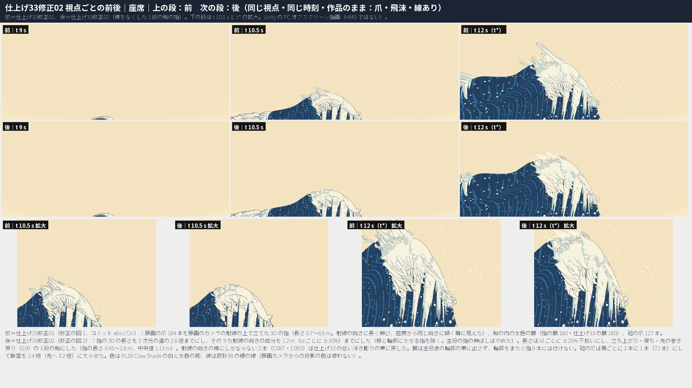
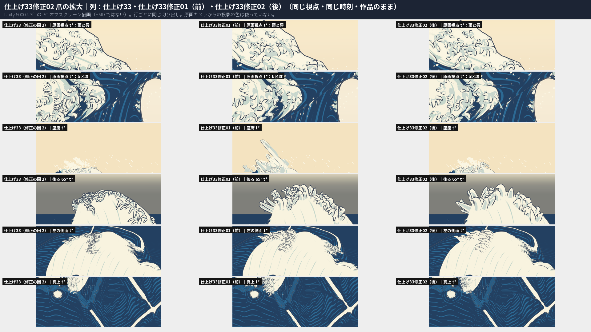
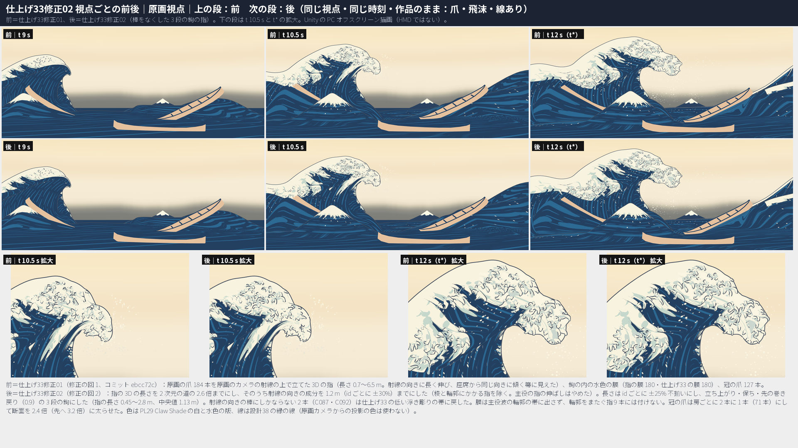
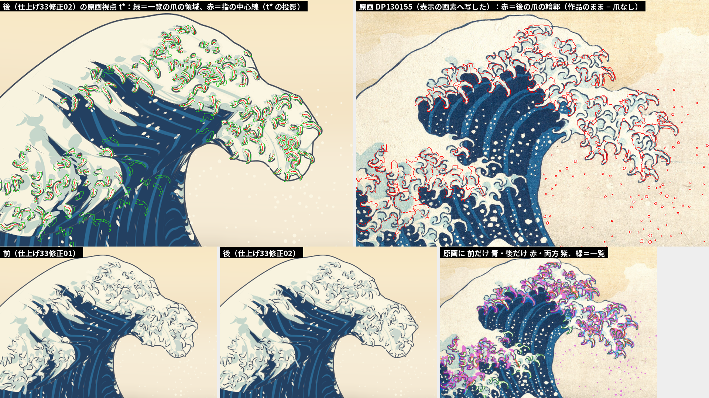
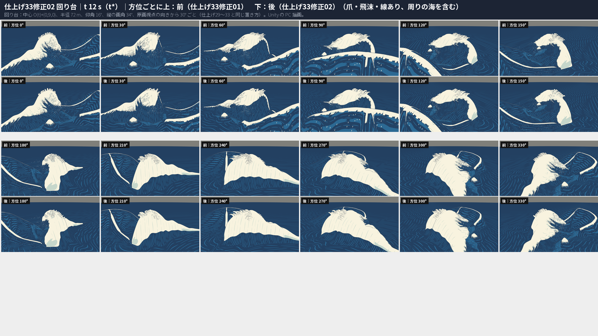
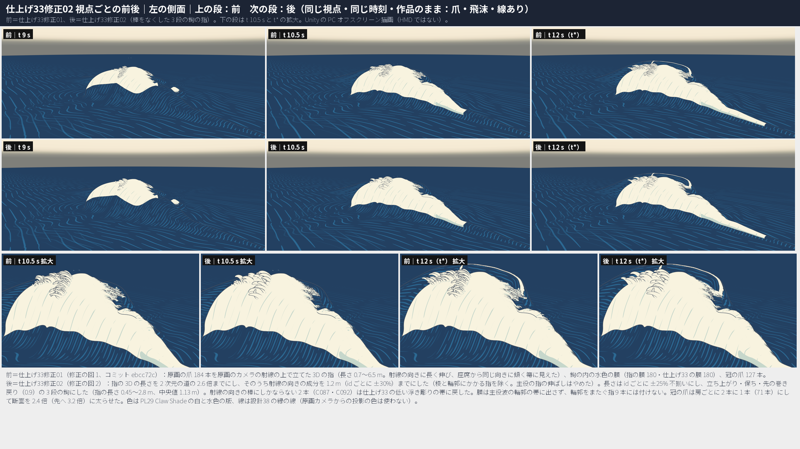

# 仕上げ33修正02：設計33 爪の造形 ― Q28 の爪の修正の回 2。座席の箒はなくなったが指は立たなくなり、原画視点の爪の輪の頂は戻らなかった。採らず、仕上げ33修正01 のまま

日付：2026-10-02（作る部 16:37〜17:59、進行役の評審 2 件 17:59〜18:05 の間、採否の記録 18:05〜18:20）／状態：**採らない（進行役の決定、Q24）。採用の状態は仕上げ33修正01（コミット ebcc72c）のまま。HMD 実機の結果ではない。利用者は見ていない。** 時間枠 6 時間（進行役の決定、2026-10-02。計画 §5.1 の［利用者の言葉］の 2 回目の修正の回）に対して、作る部が約 1.4 時間、評審と採否の記録を入れて約 1.7 時間。証拠は Unity 6000.4.3f1 の PC オフスクリーン描画、Editor の Play モード 2 つ、Release のプレイヤーを PC（RTX 3080、1920×1080 の窓）で動かした結果と、numpy・OpenCV・scipy の計算。

前＝仕上げ33修正01（採用の状態。爪の並び `Unity/Build/Polish/33r01/fix01/claws`、描画 `…/33r01/fix01/r_fix01`）。後＝この修正の回の最終の候補（既定の引数の `Tools/GWWaveGen/pl33r02/r02_build.py` の出力で、試し try12 とバイトまで同じ。爪の並び `Unity/Build/Polish/33r02/claws`、描画 `…/33r02/r_final`）。生成器は仕上げ33修正01 の SWEEP の作り方（`r01_build.py`）を写した新しい層。前後の図は、どれも同じ視点・同じ時刻（t 9・10.5・12 s）で並べた。

## 最初に：Q28 の爪の判定（視点ごと、前と後）

**問い 1：爪は、どの視点からも、波から立って先で巻く 3D の白い指として読めるか。** → 採用の状態（前）は **一部** のまま。座席・右の側面・後ろ 65° の稜では立つ白い指として読めるが、座席の指は原画のカメラの方へ傾く箒に見える。後は、座席の箒をなくした代わりに、指が頂からほとんど立たなくなった（座席では **いいえ** に戻った）。72 m 先の冠の爪は、後ろ 65°・回り台 180〜330°・真上で数えられる太い鉤になったが、唇の側は毛か点々のまま。

**問い 2：原画視点で、藍の舌を縁取る爪の輪の頂（北斎の大きな白い爪の輪）が読めるか。** → 前も後も **いいえ**。後は、前とほとんど同じに見える（評審 2 件とも）。

| 視点 | 前（仕上げ33修正01、採用のまま） | 後（修正02 の候補、採らない） | 評審（目で見て） |
| --- | --- | --- | --- |
| 座席 t\*（t 12 s） | 頂から白い指の束が空へ立ち、先で巻く。けれども指はみな画面の左上（原画のカメラの方）へ傾く平行な箒で、長い棒（C085・C092・C066、最長 205 px）が立つ。向きの揃い R 0.818、1 m 以上立つ指 45、空の上の爪の画素 52,899 | 箒と長い棒は消え、頂の縁は低く密な小さい巻いた鉤と飛沫になった。指は頂からほとんど立たず、仕上げ33 の見え方へ戻った。唇の下に垂れる冠の爪の扇は、ほぼ平行に右下を向く羽の束（翼に見える）。R 0.516、最長 102 px、1 m 以上立つ指 **0**、空の上の爪の画素 31,933 | 箒は消えたか：**PASS**（2 件）。扇に開いて立ち、巻き、密か：**PARTIAL**（巻き・密さ・長さの違いはあるが、彫刻の写真のように頂から高く突き出す指がない） |
| 座席 t 10.5 s・座席から波の方向 t 10.5 s | 頂に左へ傾く尖った指の房。b区域の縁に先の尖った指の扇 | 頂は小さな巻いた鉤の冠。b区域の指は短く柔らかい巻き | **BETTER**（変化は小さく、悪くはない） |
| 座席から波の方向 t\* | 管の内側。爪はほとんど画面に入らない | 同じ（爪の画素 11,125 → 10,708） | — |
| 原画視点 t 9・10.5・12 s | 白い頂の上に小さな暗い巻きの群れ。藍の舌を縁取る太い白い鉤はない。唇の輪郭の白い欠け 246 px | ほとんど同じ。右上の唇の線が少し続き、t 10.5 s の上の藍の舌の所が少し開いた。白い欠け 165 px、暗い線の成分 266 → 256（原画 398）、水色 0.399 → 0.432（原画 0.412） | 爪の輪の頂：**FAIL**（2 件）。小さな巻きの減り：**NO VISIBLE CHANGE**。唇の白い欠け：**SLIGHTLY BETTER** |
| 左の側面 t\*（72 m） | 頂の稜の冠は細い毛の房。唇の側は細い毛の縁取り | 冠の爪は少なく太いが、立って巻く指ではなく、重なる鱗か瓦のように寝る。唇の側は細い毛の筋のまま（少し疎） | **PARTIAL / SLIGHTLY BETTER** |
| 右の側面 t\*（72 m） | 頂の上に立って巻く指の小さな房 | 同じくらい。冠の爪が太くなり、1 本ずつ見分けやすい | **ABOUT THE SAME / SLIGHTLY BETTER** |
| 後ろ 65° t\*（72 m） | 稜の上に、多くて細い白い指の冠 | 少なく太い、数えられる指の冠。いくつかは角ばった柱か面の立った結晶の歯に見え、先が平らか尖る | **BETTER, WITH A NEW FLAW** |
| 真上 t\*（72 m） | 唇の先と b区域の縁から外へ放射する、毛の筋の縁取り | 冠の爪は分かれた曲がる鉤になった。唇の側は粒か屑の点々（毛ではないが指にも見えない） | **MIXED** |
| 回り台 t\* 12 方位（72 m） | 頂の輪郭に細い毛の縁取り | 180〜330° は少なく太い巻いた鉤で、はっきり良い（240°・300°）。60° は唇の側の筋が点々になった。0° は右の唇の長い垂れる指が短く崩れた（小さな後退）。90〜150° は同じ | **MIXED** |
| 72 m の線の幅 | 設計38 の決まりのまま（72 m で約 0.093 m、世界寸法の上限 0.3 m 未満） | 同じ | **UNCHANGED** |

| 座席（前｜後） | 爪の拡大（仕上げ33｜前｜後） |
| --- | --- |
|  |  |

| 原画視点（前｜後） | 一覧の爪の領域と原画への重ね（後） |
| --- | --- |
|  |  |

| 回り台 t\*（前｜後） | 左の側面（前｜後） |
| --- | --- |
|  |  |

ほかの前後の図：[座席から波の方向](../Evidence/Polish/33R02/fig_pl33r02_ba_view_seat_toward_wave.png)・[右の側面](../Evidence/Polish/33R02/fig_pl33r02_ba_view_side_right.png)・[後ろ 65°](../Evidence/Polish/33R02/fig_pl33r02_ba_view_back65.png)・[真上](../Evidence/Polish/33R02/fig_pl33r02_ba_view_top.png)・[回り台 t 9 s](../Evidence/Polish/33R02/fig_pl33r02_ba_turntable_t090.png)・[回り台 t 10.5 s](../Evidence/Polish/33R02/fig_pl33r02_ba_turntable_t105.png)。前後の動画：`pl33r02_ba_*_30fps.mp4`（原画視点・座席・座席から波の方向・左の側面・回り台）。

## 採否：採らない（仕上げ33修正01 のまま）

進行役の決定（2026-10-02、Q24）：この修正の回の候補は採らない。採用の状態は仕上げ33修正01（爪の並び `Unity/Build/Polish/33r01/fix01/claws`、場面 `Unity/Assets/GreatWave/Polish33R01/Scenes/PL33R01_*.unity`、Release `Unity/Build/Polish/33r01/release`）のまま変えない。

| 評審（作る部と別） | 仕上げ33修正01 より良いか | 箒は消えたか | 原画視点の爪の輪 | ひと言 |
| --- | --- | --- | --- | --- |
| 評審 1（目で見る。前後を切り出して拡大し、参照の彫刻の写真と比べた） | **いいえ**（差し引きでは良くなったが、全部の視点で良いのではない） | はい | ない | 座席の指はもう立たない。72 m の唇の側は毛か点々。回り台 0° は小さな後退、後ろ 65° の一部は角ばった柱 |
| 評審 2（数を回し直し、目で見る） | はい | はい | ない | 座席は仕上げ33 の見え方へ戻った。原画視点はほとんど同じ。暗い線の成分は原画から少し離れ、水色は原画を越えた |

採らない理由（評審 2 件の結果から）：

1. **座席：箒はなくなったが、指が立たなくなった。** 1 m 以上立つ指 45 → 0、シートからの最大の高さの中央値 0.645 → 0.290 m、座席 t\* の空の上の爪の画素 52,899 → 31,933。座席の頂は仕上げ33 の見え方へ戻り、参照の彫刻のように頂から高く突き出して外へ扇に開く指はない。唇の下の冠の爪の扇は、ほぼ平行に右下を向く羽の束のまま。
2. **原画視点：爪の輪の頂は戻らない。** 前と後は t 9・10.5・12 s でほとんど同じで、小さな巻きの減り（暗い線の成分 266 → 256）は目で見えず、原画の 398 からはむしろ離れた。唇の輪郭の白い欠けは 246 → 165 px で少し良い。
3. **72 m：良い所と悪い所が混ざる。** 冠の爪は回り台 180〜330°・後ろ 65°・真上で数えられる太い鉤になった。けれども、左の側面の唇の側は毛のまま、真上と回り台 60° の唇の側は粒や屑の点々、回り台 0° の唇の長い垂れる指は短く崩れ、後ろ 65° の太い指の一部は角ばった柱や結晶の歯に見える。
4. **数：細部込みの 72 は悪くなった**（p95 4.9217 → 5.1120 px、最大 6.9831 → 7.8947 px）。水色の版は原画を越えた（0.399 → 0.432、原画 0.412。差は +4.8% で 5% の内）。
5. **修正の回は使い切った。** 計画 §5.1 の［利用者の言葉］の修正の回は、この回で 2 回目。残りは第 9 節の限界として 10/29 以降の一覧へ送る。

採らないので、後の群の作り直しは増えない。Unity の統合（`Unity/Assets/GreatWave/Polish33R02/` の Editor のコードと場面、それを回す `r02_run_unity_steps.sh`）は測るために通しただけで、コミットしない（作業ツリーに未追跡で残す。SHA-256 は run.json の `not_committed_sha256`）。この修正の回で分かったことのうち、後で使える手がかり（冠の爪を減らして太らせる、膜を輪郭の帯に出さない、座席の箒の根）は第 9 節に書いた。

## ［利用者の言葉］と今の判定

| 利用者の言葉（出典） | この修正の回でやったこと | 判定（採用の状態） |
| --- | --- | --- |
| Q28：大波の色と描き方を原画の投影ではなく立体として作る。参照の彫刻のように、どの視点からも浮世絵の特徴が立体として読めること（[制作手順の Q28](../Workflow/Production_Workflow_ja.md#q28大波の色と描き方を原画の投影ではなく立体として作る指示2026-10-01)） | 座席から箒に見えた射線の向きの長い棒をなくし、指を不揃いな長さの 3 段の鉤にし、冠の爪を減らして太らせ、膜を輪郭に出さないようにした（第 1 節）。座席の指は立たなくなり、原画視点は変わらなかったので採らない | **一部**（仕上げ33修正01 のまま）。修正の回は 2 回を使い切った（計画 §5.1、AGENTS.md の「時間枠と損切り」の 2）。残りは第 9 節の限界 |
| Q16・Q21 の b区域（仕上げ33 の［利用者の言葉］1。10/29 以降の一覧） | 変えていない（b区域の指も同じ決まりで作り直した） | **一部**（限界のまま）。候補は成分 96 → 99・水色 0.349 → 0.363（原画 176・0.460）だが採らない |

## 直すべき 3 点への答え（候補。採らない）

| # | 直すべき点（進行役の評審、要約） | 判定 | 数と目 |
| --- | --- | --- | --- |
| 1 | 座席から、指が同じ向き（原画のカメラの方）へ傾く長く真っ直ぐな棒の箒に見える。参照の彫刻の頂の指のように、頂と唇の法線から外へいろいろな向きに扇に開き、先で巻き（3 段の鉤）、長さが不揃いで、頂と唇に密に。孤立した長い棒はなし | **一部** | 箒と孤立した長い棒はなくなった（向きの揃い R 0.818 → 0.516、長い指の上位 2 割 0.969 → 0.766、座席の画面の最長 205 → 102 px、指の 3D の長さの最大 6.5 → 2.8 m、弦と弧の比 0.81 → 0.58）。けれども指は立たず（1 m 以上立つ指 45 → 0）、外へ扇に開く立つ指はない（評審 2 件とも PARTIAL）。原画視点の道を守る限り、座席で立って見える向きと箒の向きは同じ（第 1.1 節） |
| 2 | 原画視点：北斎の爪の輪の頂（藍の舌を縁取る、内に水色の巻きを持つ太い白い鉤）を戻す。小さな落書きの巻きを減らす（暗い線の成分 266 を原画の律動へ）。唇の輪郭に白い欠けを作らない（246 px） | **満たさない** | 目で見て前とほとんど同じ（評審 2 件とも）。数：唇の輪郭の白い欠け 246 → 165 px、閉じた輪 t\* 13 → 8（ただし穴が 4 px 以上の輪は 2 → 3）、一覧への重なりの精度 0.851 → 0.868（再現 0.636 → 0.633）。暗い線の成分 266 → 256（原画 398。差 132 → 142 で離れた）、暗い線の画素 10,642 → 10,554（14,858）。水色 0.399 → 0.432（原画 0.412 を越えた）。根：一覧の爪の所の主役波の地が白で、原画では爪の間が藍。爪の層だけでは直せない（第 9 節の 2） |
| 3 | 左の側面・真上・回り台：縁取りを毛でなく指に（72 m で、より少なく、太く、巻く指。線の幅は設計38 の世界寸法の上限のとおり） | **一部** | 冠の爪 127 → 71 本、断面 1.4 → 2.4 倍（先へ 2.2 → 3.2 倍。根元の幅 1.0〜1.9 m）。回り台 180〜330°・後ろ 65°・真上・右の側面で数えられる太い鉤（後ろ 65° の一部は角ばった柱）。左の側面の唇の側は毛、真上と回り台 60° の唇の側は点々、回り台 0° は小さな後退。線は設計38 の決まりのまま（72 m で約 0.093 m） |

## 守るもの（候補で確かめた。採用の状態の値は仕上げ33修正01 のまま）

| 守るもの | 候補（修正02、採らない） | 採用の状態（仕上げ33修正01） | 判定 |
| --- | --- | --- | --- |
| 原画カメラからの投影の色を使わない（Q28） | 使っていない。原画のカメラは、形を決める射線と、隠れること・一覧に収まることの検査にだけ使った | 使っていない | 守る |
| 主役波の形の関門（爪あり・爪なし、≤ 4 px） | 全部通る。72 σ12 p95 の爪あり 3.5694（第 6 節） | 全部通る。72 σ12 p95 の爪あり 3.9059（余裕 0.09 px） | 守る（CP1・26修正01 に対しては段階5確認以来の後退のまま） |
| 冠の爪が原画のカメラから見えない | t 9・10.5・12 s とも 0 頂点 | 0 頂点 | 守る |
| id と成長の続き | コマの間の裏返り 0、瞬間移動・NaN 0。跳び（評審の式、> 0.15 m/コマ²）指 2 回 1 項目・膜 9 回 1 項目 | 裏返り 0、瞬間移動・NaN 0。跳び 指 6 回 4 項目・膜 3 回 3 項目 | 守る（跳びは記録） |
| VR の負荷 | 爪の層 102,558 頂点・195,792 三角形、Release のデータ 1,238,485,084 B。GPU の時間（中央値、形成／静止）0.612・0.593／0.690・0.690 ms | 104,707 頂点・199,880 三角形、1,250,313,915 B。同じ日に交互に回して 0.605・0.593／0.685・0.692 ms | 記録（PC の窓、90 Hz の予算 11.1 ms。PSVR2 は未検証） |

---

## 0. 結論

1. **座席の箒はなくなったが、指は立たなくなった。** 箒の正体は、原画のカメラの射線の向きに長く伸びた指だった。指の 3D の長さを 2 次元の道の 2.6 倍まで（前 4.0 倍、主役の指は 1.4 倍の上乗せ）にし、そのうち射線の向きの成分を 1.2 m 前後までにした。原画のカメラは座席の約 47 m 後ろにあるので、座席で「立って見える」向きは射線の向きと同じで、箒をなくすと立ちも消える（第 1.1 節）。
2. **原画視点は目で見て変わらない。** 唇の白い欠け・閉じた輪・精度の数は少し良いが、爪の輪の頂は戻らず、暗い線の成分は原画からかえって離れた。
3. **72 m では、冠の爪を減らして太らせたのが一部の視点で効いた。** 唇の側の指は毛か点々のまま。
4. **関門・投影の色なし・続き・負荷は守った。** 細部込みの 72 は悪くなった。
5. **採らない。** 採用の状態は仕上げ33修正01 のまま。修正の回は 2 回を使い切り、残りは限界として 10/29 以降の一覧へ。

## 1. やったこと（名前の付いた美術の誘導。候補）

`Tools/GWWaveGen/pl33r02/r02_build.py`（`r01_build.py` を写し、以下を変えた。どれも爪の並びの頂点だけで決まり、色は PL29 Claw Shade の段と設計38 の縁の線。原画のカメラは、形を決める射線と、主役波に隠れないこと・一覧の領域に収まることの検査にだけ使う）。

| 誘導 | 中身 | 直すべき点 |
| --- | --- | --- |
| pl33r02_no_spike | 3D の長さ L3 = K3 × 2 次元の長さ（K3 4.0 → **2.6**、L3 0.5〜2.4 m）。主役の指の伸ばし（× 1.4、最大 6.5 m）をやめる。射線の向きの成分（L3 のうち 2 次元の道に直交する分）を ALONG_MAX **1.2 m**（id ごとに ±30%）までにする（ρ ≤ 0.5 の稜の指と、原画視点の道が輪郭をまたぐ指は除く） | 1 |
| pl33r02_vary | 指ごとに id の決まった乱数（crc32）で 3D の長さを ±25% 変える | 1 |
| pl33r02_hook3 | 深さの目標の高さを、根元から s 0.35 まで立ち、0.5 まで保ち、先で 0.9 だけ面の側へ巻き戻る 3 段にし、目標の指の巻きを 130° → 200° にする | 1 |
| 立て直しの順 | 立てられない時は、管の下の頂点の許しを 0.3 倍 → 0 倍（コマごとの寄せに任せる）→ 長さ 1.6 倍で許し 0。長さを先に伸ばすと射線の向きの真っ直ぐな棒に戻った（try2・try3） | 1 |
| pl33r02_band_fallback | それでも立てられない 2 本（C087・C092。前は C092 が座席の画面で 193 px の棒）は消さずに、仕上げ33 修正の回 2 の低い浮き彫りの帯（とその膜 WC…）に戻す（原画視点の一覧の爪を欠かない） | 1・2 |
| pl33r02_web_edge | 膜（WF…）の幅の上限を、一覧の領域に加えて、原画視点 t\* の主役波の z バッファの所を 7 px 縮めた所の内にする。仕上げ33 の膜（WC…）は、t\* の投影が輪郭の帯に入る 12 本を戻さない。原画視点の道が輪郭をまたぐ指 9 本（C061・C079・C085・C090・C094・C095・C096・C109・C111）には膜を付けない | 2 |
| pl33r02_web_lift | 膜の向きを根元のシートの法線の側へ 0.4 だけ起こす（指を短くすると膜の外の縁がシートの下へ入って縮み、水色が 0.399 → 0.36 に落ちた） | 2 |
| pl33r02_crown_few | 冠の爪（K…）は房ごとに長い順に並べ 2 本に 1 本だけ残し（127 → 71 本。ほかは根元の点に潰す）、断面を 2.4 倍（先へ 3.2 倍）に太らせる | 3 |

- 指の幅（W_REL 0.20、根元 0.34〜0.80 m、主役 × 1.25）と断面の向き・成長・寄せ・時間の均しは仕上げ33修正01 のまま。幅を太くした試し（try2〜try4：0.45〜1.0 m）、面がカメラを向く指の断面を厚くした試し（try5〜try8：FLAT_FACE 1.35）、断面を巻きの外へ傾けた 2 色の試し（try6）は、原画視点で隣の爪と線がつながって成分が減り、水色の版が隠れたので使わなかった（第 7 節）。
- 生成の結果（`r02_report.json`）：指 184（帯に戻した 2）、指の膜 WF 173、仕上げ33 の膜 WC 172、冠の爪 137 項目（立つのは 71）。666 項目・102,558 頂点・195,792 三角形、コマの表 518 MB。3D の長さ 0.45〜2.80 m（中央値 1.13 m）。シートからの最大の高さ 0.02〜0.82 m（中央値 0.23 m）。

### 1.1 座席から「立って扇に開く」指が作れない理由（限界 1 の根）

- 原画視点の形を守るため、指の各段は一覧の中心線の点を通る原画のカメラの射線の上にしか置けない（動かせるのは奥行きだけ）。
- 原画のカメラ（0, 3, −62）は座席（3.95, 1.83, −15.03）の約 47 m 後ろにある。射線の向きの線分は、座席の画面では、どれも座席から原画のカメラと反対の向き（前下）の消える点から放射する線に見える。座席は頂を見上げるので、この点は画面の下の外にあり、射線の向きに伸ばした指はどれも「上へ立つ」同じ向きの棒になる（採用の状態の箒）。
- つまり、座席の画面で立って見える向きと箒の向きは同じである。立つ高さを増すと箒に戻り（try10〜try12 で ALONG_MAX・CURL_DROP を振った）、箒をなくすと立ちが低くなる。この修正の回は「孤立した長い棒なし」を優先して立ちを低くし、評審で「立たない」と判定された。
- 座席から外へ扇に開いて立つ指には、原画視点の 2 次元の道から外れる造形（原画視点で一覧の爪が崩れるのを受け入れるか、原画のカメラから隠れる場所に指を置く）が要る。座席の頂の稜は原画のカメラからも見える面にあり、隠れる場所は唇の下と頂の裏（冠の爪の置き場所）だけだった。

### 1.2 数（前 → 後）

| 読み | 前（仕上げ33修正01、採用） | 後（候補） | 道具 |
| --- | --- | --- | --- |
| 座席の画面の指の向きの揃い R（見える指 84 → 74 本） | 0.818 | 0.516 | r02_seatfan.py |
| 同、長さで重み | 0.921 | 0.650 | 〃 |
| 同、画面の長さの上位 2 割だけ | 0.969 | 0.766 | 〃 |
| 向きの円の標準偏差 | 36.3° | 65.9° | 〃 |
| 座席の画面の長さ 中央値／p90／最大 | 47.0／115.6／205.3 px | 21.6／61.9／102.4 px | 〃 |
| 弦と弧の比（中央値。1＝真っ直ぐ） | 0.813 | 0.579 | 〃 |
| 背骨の弦と射線のなす角（中央値） | 16.6° | 53.5° | 〃 |
| 指のシートからの最大の高さ 中央値／p90／最大 | 0.645／1.278／3.933 m | 0.290／0.503／0.810 m | sweep_measure.py |
| 1 m 以上立つ指 | 45 | **0** | 〃 |
| 座席 t\* の爪の画素（空の上） | 107,898（52,899） | 82,143（31,933） | 〃 |
| 唇の輪郭の白い欠け t\* | 246 px（成分 11） | 165 px（成分 10） | r02_quick.py（pl33f_measure.py と同じ式） |
| 水色の版（爪の領域・b区域、原画 0.412・0.460） | 0.399・0.349 | 0.432・0.363 | pl33f_measure.py |
| 暗い線の成分（爪の領域・b区域、原画 398・176） | 266・96 | 256・99 | 〃 |
| 暗い線の画素（爪の領域・b区域、原画 14,858・8,257） | 10,642・4,833 | 10,554・4,746 | 〃 |
| 一覧への重なり 再現・精度（4 px）・精度（12 px） | 0.636・0.851・0.938 | 0.633・0.868・0.936 | sweep_overlay.measure |
| 閉じた輪（全体）t 9・10.5・12 s（t\* の穴 4 px 以上） | 4・6・13（2） | 1・4・8（3） | pl33f_measure.py |
| 冠の爪（立つ本数・断面の倍率） | 127・1.4〜2.2 | 71・2.4〜3.2 | r02_build.py |

## 2. 評審（2 件。作る部と別。全文は `r02_review.json`）

前（`r_fix01`）と後（`r_final`）の Unity の描画を、同じ視点・同じ時刻で切り出し、拡大した対で目で見た。評審 1 は参照の彫刻の写真とも比べた（第 11 節）。評審 2 は `r02_quick.py` を `r_final` で回し直し、記録と同じ数を得た。

評審 1（目で見る）：

| 項目 | 判定 | 要点 |
| --- | --- | --- |
| 座席 t\*：箒は消えたか | PASS | 左上へ傾く長く真っ直ぐな平行の棒 3〜4 本（最長 約 200 px）と、唇の右の射線の向きの斜めの棒が消えた。右端に短い鉤が 1 本残るが、棒ではない |
| 座席：扇・巻き・不揃い・密に立つか | PARTIAL | 巻き・密さ・長さの違いは見えるが、頂の輪郭からほとんど立たない。垂れる冠の爪の扇は翼に見える |
| 座席から波の方向・座席 t 10.5 s | BETTER | 尖った指の房が小さな巻いた鉤に。変化は小さい |
| 原画視点 t\*：爪の輪の頂 | FAIL | t 9・10.5・12 s とも前後はほとんど同じ。唇の輪郭は 1 本のなめらかな線で、巻きはその内に描かれる |
| 原画視点：小さな巻きを減らす | NO VISIBLE CHANGE | 1.0 倍と 1.7 倍の切り出しで密さは同じ |
| 原画視点：唇の白い欠け | SLIGHTLY BETTER | 右上の唇の線が続く。下の唇に、指が輪郭をまたぐ所の切れが少し残る |
| 左の側面 t\* | PARTIAL / SLIGHTLY BETTER | 冠は鱗か瓦のように寝る。唇の側は毛の筋 |
| 右の側面 t\* | ABOUT THE SAME / SLIGHTLY BETTER | 冠の爪が見分けやすい |
| 後ろ 65° t\* | BETTER, WITH A NEW FLAW | 数えられる太い指。一部は角ばった柱か結晶の歯 |
| 真上 t\* | MIXED | 冠は曲がる鉤。唇の側は粒か屑の点々 |
| 回り台 t 12 s | MIXED | 180〜330° は良い。60° は点々、0° は唇の長い垂れる指が短く崩れた。90〜150° は同じ |
| 72 m の線の幅 | UNCHANGED | 冠の爪が広くなったので、その縁の線ははっきり読める |

評審 2（数の回し直しと目で見る）：

| 項目 | 判定 | 要点 |
| --- | --- | --- |
| 直すべき点 1：座席の箒 | 一部 | 数は記録と同じ。長い左上の棒（C085・C092・C066）は消えた。代価は 1 m 以上立つ指 45 → 0、高さの中央値 0.65 → 0.29 m、空の上の爪の画素 52,899 → 31,933。座席の頂は仕上げ33 の見え方へ戻った |
| 直すべき点 2：原画視点の爪の輪 | 達しない | 前後はほとんど同じ。作り手の根の説明（原画で爪の間が藍の所が主役波では白）は正しく、直すには主役波の色か白の範囲の変更が要る |
| 暗い線の成分 | 原画へ近づかず少し離れた | 266 → 256（原画 398、差 132 → 142）、暗い線の画素 10,642 → 10,554（14,858）。b区域は 96 → 99（176、近づいた） |
| 唇の白い欠け | 良くなったが満たさない | 246 → 165 px（目標 0、仕上げ33 は 100 px）。残りは輪郭をまたぐ指 9 本の白い胴 |
| 水色の版 | 原画の値を越えた（5% の内） | 0.399 → 0.432（原画 0.412、+4.8%）。b区域 0.349 → 0.363（0.460、近づいた） |
| 一覧への重ね | 横ばい〜少し良い | 再現 0.6355 → 0.6331、精度 4 px 0.851 → 0.868、12 px 0.938 → 0.936 |
| 主役波の形の関門 | 全部通る | 前の群より後退なし。CP1・26修正01 に対しては、この群の前からの後退のまま（130・131 は約 1.6 px 悪い） |

## 3. 統合（Unity。測るためだけに通した。コミットしない）

- `Unity/Assets/GreatWave/Polish33R02/Editor/PL33R02Setup.cs`：仕上げ33 の場面 `PL33_Release.unity`・`PL33_SinglePlayback.unity` を `Polish33R02/Scenes/PL33R02_*.unity` へ写し、爪の層の並びを `Build/Polish/33r02/claws/ds33_claw_layout.json` にする（`PL33R01Setup.cs` を写した）。`PL33R02ReleaseBuild.cs`：`PL33R02_Release.unity` から Release の Windows プレイヤーを作る（出力 `Unity/Build/Polish/33r02/release`）。既存の場面・材質・コードは変えていない（git で追跡しているファイルの変更は 0）。
- 場面：`PL33R02_Release.unity`（`057edfed…`）、`PL33R02_SinglePlayback.unity`（`106ae881…`。爪の層がないので仕上げ33 の場面と同じバイト）。
- Play モード：Release は体験の終わりの画面まで 6,733 行、SinglePlayback は静止まで 814 行。例外は前と同じ Editor の検索の索引（`UnityEditor.Search.SearchDatabase`）の 1 つずつ。
- Release：Succeeded、データ 44 ファイル 1,238,485,084 B（採用の状態 1,250,313,915 B）、必ず要るデータあり、焼き込みのファイルなし。exe は前と同じバイト（`5be81b3f…`）。
- プレイヤー（仕上げ33修正01 の exe と交互に 2 回ずつ）：4 回とも pass、エラー・例外 0、88,240〜90,954 フレーム。GPU の時間（中央値、形成／静止）：前 0.605・0.593／0.685・0.692 ms、候補 0.612・0.593／0.690・0.690 ms。CPU の主スレッドも差 0.02 ms 以内（90 Hz の予算 11.1 ms）。PSVR2 の GPU の時間は未検証。
- 採らないので、`Polish33R02` の Editor のコードと場面、`r02_run_unity_steps.sh` はコミットせず、作業ツリーに未追跡で残す（SHA-256 は run.json の `not_committed_sha256`）。Release の出力は Git 対象外の `Unity/Build/Polish/33r02/release` にある。

## 4. 視点ごとの数（爪の画素＝作品のまま − 爪なし。括弧の中は白い爪の画素。前 → 候補）

| 視点 | t 9 s | t 10.5 s | t 12 s（t\*） |
| --- | --- | --- | --- |
| 原画視点 | 3,390 → 2,785 | 30,359 → 27,984 | 56,438（35,947）→ 54,183（34,434） |
| 座席 | 1,177 → 908 | 44,948（30,304）→ 30,968（20,380） | 107,898（88,596）→ 82,143（67,953） |
| 座席から波の方向 | 1,426 → 1,085 | 38,317（24,752）→ 29,886（19,970） | 11,125 → 10,708 |
| 左の側面 | 4,388 → 3,228 | 11,663 → 8,817 | 14,096（6,793）→ 11,298（6,405） |
| 右の側面 | 3,215 → 2,533 | 8,160 → 7,077 | 9,423（4,193）→ 8,299（4,401） |
| 後ろ 65° | 8,832 → 6,599 | 19,906（9,274）→ 18,080（10,647） | 23,838（12,043）→ 21,366（13,062） |
| 真上 | 4,023 → 2,674 | 11,197 → 7,786 | 14,052（4,644）→ 10,195（3,810） |

- 爪の画素はどの視点でも減った（棒・毛・冠の爪の本数が減った）。白い爪の画素は、後ろ 65°・右の側面で増え（太い冠の爪）、座席・左の側面・真上で減った。
- 回り台の上の縁の爪の縁取りの割合（t\*、前 → 候補）：後ろ 65° 0.300 → 0.302、0° 0.243 → 0.252、30° 0.234 → 0.240、60° 0.346 → 0.301、90° 0.553 → 0.547、120° 0.436 → 0.445、150° 0.297 → 0.294、180° 0.274 → 0.274、210° 0.207 → 0.224、240° 0.407 → 0.386、270° 0.490 → 0.483、300° 0.524 → 0.526、330° 0.397 → 0.378。縁取りの量はほぼ同じで、1 本ずつが太く少なくなった。数では読みの良し悪しは分からないので、判定は評審の目による。

## 5. 続きと貫通（id・成長）

| 読み | 前（採用） | 候補 | 道具 |
| --- | --- | --- | --- |
| コマの間の裏返り（指・冠の爪・膜） | 0・0・0 | 0・0・0 | r01_measure.py |
| 隣の輪の間の > 60°（指。ほとんどが一覧の中心線の 1 駅の折れ） | 1,088 | 273 | 〃 |
| 跳び > 0.15 m/コマ²（評審の式。回・項目） | 指 6・4、膜 3・3 | 指 2・1（C192 0.189）、膜 9・1（WFC021 0.197）、冠の爪 0 | r01_quick.py |
| 瞬間移動（> 0.5 m/コマ）・NaN・点滅 | 0 | 0 | r01_measure.py・pl33f_measure.py |
| 頂点の高さで数えた貫通（5 cm より下、u > 0.3）指 t 9・10.5・12 s | 6・5・4 項目（最深 −0.258 m） | 2・3・1 項目（最深 −0.155 m） | r01_quick.py |
| 同、膜 | 5・4・4 項目 | 0・0・4 項目（WC108・WC110・WFC108・WFC216、最深 −0.218 m） | 〃 |

- id の並びと成長の割合（仕上げ33 の帯の長さの割合を単調にして均したもの）は前のまま。帯に戻した 2 本は仕上げ33 の帯の頂点そのもの。HMD での跳びの見え方は未検証（PSVR2 未導入）。

## 6. 原画視点の形の関門（爪あり・爪なし。前の群・CP1・26修正01 に対して）

| 読み | 候補 爪あり | 候補 爪なし | 採用（仕上げ33修正01）爪あり | 採用 爪なし | CP1 | 26修正01 | 関門 |
| --- | --- | --- | --- | --- | --- | --- | --- |
| 78 | 2.741 | 2.741 | 2.741 | 2.741 | 2.772 | 1.641 | ≤ 4 通る |
| 130 | 3.5815 | 3.5815 | 3.5815 | 3.5815 | 1.968 | 1.953 | ≤ 4 通る |
| 131 | 3.4419 | 3.4419 | 3.4419 | 3.4419 | 1.814 | 1.798 | ≤ 4 通る |
| 132 σ12 | 3.5576 | 3.5576 | 3.5789 | 3.5576 | 1.326 | 1.574 | ≤ 4 通る |
| 72 σ12 p95 | 3.5694 | 3.8507 | 3.9059 | 3.8507 | 1.558 | 1.723 | ≤ 4 通る |
| 132 細部込み 最大 | 5.2998 | 5.9472 | 5.2998 | — | — | — | 記録 |
| 72 細部込み p95 | 5.1120 | 5.6807 | 4.9217 | — | — | — | 記録（候補は +0.19 悪い） |
| 72 細部込み 最大 | 7.8947 | 7.9830 | 6.9831 | — | — | — | 記録（候補は +0.91 悪い） |

- 評価器 23（線あり・線ありの爪なし・線なし・線なしの爪なし）：4 組とも合格 2・不合格 7・その他 14（線あり）、合格 4・不合格 5・その他 14（線なし）で、前と同じ。
- CP1・26修正01 に対しては、段階5確認以来の後退（130・131 は約 1.6 px 悪い）のまま。この群は主役波の形を変えていない。
- 冠の爪は原画のカメラから t 9・10.5・12 s とも見えない（見える頂点 0、pl33f_measure.py）。原画視点で主役波の外へ出る爪の画素（t\*）4,003 → 3,915 px。
- 採らないので、採用の状態の値は「採用」の列のまま。

## 7. 修正の回の中の試し（try1〜try12、`Unity/Build/Polish/33r02/try*`・`r_try*`。数は `r02_tries.json`）

| 試し | 変えたこと | 分かったこと |
| --- | --- | --- |
| try1 | K3 1.7、長さ 0.8〜2.4 m、主役の伸ばしをやめる、3 段の鉤、幅 0.45〜1.0 m、膜の輪郭の帯、冠の爪を減らす | 立てられない指 54 本（太い管の下の頂点の許しを満たせない）。描画しない |
| try2・try3 | 立て直しの段を足す・順を替える | 立てられない指 7 本。座席の R 0.70。長さを伸ばした立て直しの指が射線の向きの棒として残る |
| try4 | 射線の向きの成分を 0.9 m まで | R 0.66。原画視点で太い管が隣とつながり、成分 206・水色 0.33・再現 0.53 |
| try5〜try8 | 幅を戻す、断面を厚く（FLAT_FACE 1.35）、2 色の断面（try6）、膜を起こす（try7）、帯に戻す（try8） | 唇の欠け 160〜200 px。水色 0.35〜0.40。2 色と厚みは水色を隠した |
| try9 | 断面の厚みをやめる | 水色 0.426・再現 0.629・精度 0.868。座席の頂の立ちが低すぎた |
| try10〜try12 | K3・ALONG_MAX・巻き戻り CURL_DROP・保つ HOLD_S を振る | 巻き戻りを強くする（0.9）ほど揃いが下がる（R 0.48〜0.58）。K3 2.6 で立てられない指 2 本。立ちを上げる向きは箒に戻る |
| try12（最終の候補。採らない） | K3 2.6・ALONG_MAX 1.2・CURL_DROP 0.9・HOLD_S 0.5 | R 0.516・水色 0.432・再現 0.633・精度 0.868・成分 256・欠け 165 px |

- 最終の候補は既定の引数の `r02_build.py` の出力で、try12 とコマの表がバイトまで同じ（`cmp` で照合）。
- 修正の回は 1 回（計画 §5.1 の［利用者の言葉］の 2 回目）。回の中の試しは 12。

## 8. 計画の行（仕上げ33 の 12 行）とバックログ項目（採用の状態は変わらない）

| 行 | 中身（要約） | 採用の状態（仕上げ33修正01。変わらない） | 候補（修正02、採らない） | 判定（採用の状態で） |
| --- | --- | --- | --- | --- |
| 1 | ［利用者の言葉］b区域の爪 | 成分 96・水色 0.349 | 成分 99・水色 0.363（原画 176・0.460） | **一部**（限界のまま） |
| 2 | 3D の爪が読めない、座席では房として読みにくい | 座席・右の側面・後ろ 65° の稜で立つ白い指（座席は箒） | 箒なし。座席では立たない。冠の爪は 72 m で太い鉤 | **一部**（限界 1・2・3） |
| 3 | 焼き込みとの二重 | 該当なし | 該当なし | 該当なし |
| 4 | 132・72 の細部込みを 4 px へ | 5.2998・4.9217 | 5.2998・5.1120 | **満たさない**（限界 8） |
| 5 | 断面の向き | 裏返り 0 | 裏返り 0 | **直した** |
| 6 | 急な折れの所の幅 | 一部 | 輪の間の > 60° 1,088 → 273 | **一部** |
| 7 | 隠れる爪・根元の円 | 一部（指 4 本を消した） | 2 本を帯に戻した（消した指 0） | **一部** |
| 8 | 画面の外の伸び始め | 直した | 変えていない | **直した** |
| 9 | 先端がシートから浮く | 一部（指は意図して立つ） | 指は低くなり、先はシートの側へ巻き戻る | **一部** |
| 10 | 唇の輪郭の白い欠け | 246 px（仕上げ33 の 100 px から後退） | 165 px | **後退のまま**（限界 4） |
| 11 | 重なる所の線の精度 | 閉じた輪 t\* 13 | 閉じた輪 t\* 8 | **一部** |
| 12 | 動画の描画を短くする | 直した | Unity の描画のまま | **直した** |

| 番号 | 中身 | 採用の状態の値（仕上げ33修正01） | 判定 |
| --- | --- | --- | --- |
| 100 | 下面が根元から先まで続き、輪郭 ≤4 px | 指は閉じた管。細部込み 132 5.2998・72 p95 4.9217 px | 一部 |
| 129 | 群の瞬時の置き換え 0 | 瞬間移動 0（指・膜・冠の爪） | 満たす |
| 139 | 約 150 本が連続して伸び、欠落 0 | 指 184（消した 4）・冠の爪 137（消した 10）。跳び 9 回（7 項目） | 一部 |
| 180 | 船上から先が見える | 座席 t\* で頂の指の先が空を背に見える（空の上の爪の画素 52,899。候補は 31,933 で弱い） | 記録（読める） |
| 204 | 伸びる間、白い面が続き、破口と反転 0 | 裏返り 0 | 満たす |
| 262 | 貫通の欠落 0 | 指 6／5／4 項目（最深 −0.26 m）、膜 5／4／4 | 満たさない（一部） |

## 9. 限界（10/29 以降の一覧へ。Q28 の爪の修正の回は 2 回を使い切った）

採用の状態（仕上げ33修正01）の限界に、この修正の回で分かったことを足した。

1. **座席から見た指**：採用の状態の指は立つが、原画のカメラの方へ傾く箒に見え、唇の先の C085 は長い棒として残る。この修正の回で、箒をなくすと立ちも消えることが分かった（第 1.1 節。原画のカメラは座席の約 47 m 後ろにあり、射線の向きが座席では「立つ」向きになる）。立って外へ扇に開く指には、原画のカメラから隠れる所（唇の下・頂の裏）に置く指か、原画視点の一覧の爪の崩れを受け入れる造形が要る。どちらを採るかは、原画視点の形を守る決まり（Q28・≤ 4 px・一覧）に触れるので、進行役の判断が要る。
2. **原画視点の爪の輪の頂**：一覧の爪の所の主役波の地が白（原画は爪の間が藍）なので、白い指は線だけの小さな巻きに見える。爪の層だけでは直せないことを、修正の回 2 の候補（目で見て変わらない）でも確かめた。原画カメラからの投影の色を使わずに藍の舌を頂の中へ入れるのは、主役波の色・白の範囲（設計31 の白の範囲・設計36 の色）の仕事。暗い線の成分 266（原画 398）、暗い線の画素 10,642（14,858）。
3. **72 m の指**：採用の状態は、側面・真上・回り台で細い毛の縁取り。冠の爪を減らして太らせる（`pl33r02_crown_few`）は、回り台 180〜330°・後ろ 65°・真上で毛の冠を数えられる太い鉤にした、目で見てはっきり良い唯一の変更だった。冠の爪は原画のカメラから見えないので、原画視点の値に触れずに単独で取り出せる。ただし後ろ 65° で角ばった柱や結晶の歯に見える所（断面の角と先の丸め）を直してから使う。唇の側の指（原画の爪 C）は原画視点の一覧の幅で太さが決まり、太くすると原画視点で隣の爪と線がつながった（try2〜try8）。
4. **唇の輪郭の白い欠け 246 px**（採用の状態。仕上げ33 は 100 px）。膜を輪郭の帯に出さない `pl33r02_web_edge` で 165 px まで減った（手がかり）。残りは輪郭をまたぐ指の白い胴。
5. **跳び・貫通**（採用の状態）：跳び 9 回（7 項目、最大 0.189 m/コマ²）、貫通は指 6／5／4 項目（最深 −0.26 m）、膜 5／4／4 項目。HMD での見え方は未検証。
6. **頂点の数と負荷**（採用の状態）：104,707 頂点、Release のデータ 1.25 GB。PC の GPU は仕上げ33 と同じ（差 +0.01 ms 以内）だが、PSVR2 は未検証（90 Hz の判定は仕上げ35）。
7. **b区域**（仕上げ33 の限界のまま）。
8. **132・72 の細部込み**（採用の状態 5.2998・4.9217 px。4 px に届かない）。

## 10. 後の群へ

- 採用の状態が変わらないので、後の群の作り直しは増えない。計画 §5.2 の順では、次の群は仕上げ35（数量と負荷）。爪の層は仕上げ33修正01 のまま（104,707 頂点・199,880 三角形、Release のデータ 1.25 GB）。
- 仕上げ36・38（色と線）：原画視点の爪の輪の根（主役波の地が白）、爪の縁の線が管の輪郭にしか出ないこと（暗い線の成分 266）、唇の輪郭の白い欠け 246 px を、それぞれの群の範囲で測る手がかりとして渡す（群の順と範囲は変えない）。
- 右側の爪（末尾）：作り方は仕上げ33修正01 の `r01_build.py` のまま。`r02_build.py` の誘導（`pl33r02_no_spike`・`pl33r02_crown_few`・`pl33r02_web_edge`）は試した結果つきの手がかり。

## 11. 範囲・時間枠・実績・参照

- 範囲：設計33 の爪の造形だけ。主役波の形・材質、白の出現、飛沫、海、色と線の版のコードは変えていない。仕上げ33・仕上げ33修正01 までの場面・材質・道具は変えていない（候補は `Tools/GWWaveGen/pl33r02/` と `Unity/Assets/GreatWave/Polish33R02/` に新しく置いた）。
- 時間枠 6 時間。実績（`date`）：指示 16:37、読む 〜16:44、試し 16:44〜17:37、最終の候補の生成・描画・評価 17:37〜17:44、Unity の段 17:44〜17:54、作る部の記録 17:54〜17:59、進行役の評審 2 件（17:59〜18:05 の間）、採否の記録 18:05〜18:20。1 回の計算は、生成 約 100 s、Unity の描画 25〜43 s、評価と数 5 分、Play モード 94 s・19 s、Release のビルド 17 s、プレイヤー 98 s ずつ（どれも 30 分の上限より短い）。
- 参照：作る部は、利用者の指示 Q16 の例外の写真のフォルダー（`G:\research\reality scan\北斋参考`）の一覧を取り、2 枚（左45.jpg・正面图.jpg）を読み取りのみで画面で見た（写しは作っていない）。評審 1 は、同じフォルダーの写真（正面・左 45°・後ろ）を読み取りのみで、リポジトリの外のスクラッチパッドに作った一時の並べ図で見て、終わりに消した。見たのは指の作り方（塊から外へ放射し、太く、先が巻いて丸く、頂に密）だけで、画像・寸法・形・Exif はリポジトリと成果物に入れていない。参照の彫刻は他者の展示作品で、形は写していない。参照モデル（`G:\research\model\wave_repair_zbrush2.obj`）・利用者の爪形分析・`G:\research\Wave Simulation` は、この修正の回では開いていない。生成器は OBJ を読まない（F13-1）。
- 座席のカメラの値（位置・回転・視野）は場面 `Design39/Scenes/DS39_Paper.unity` の「DS27 seat」の Transform と Camera から写した（`r02_seatfan.py`）。
- 採否の記録の部でしたこと：作る部の記録（採る前提の下書き）を、進行役の評審 2 件と採らない決定に合わせて書き直した。評審と決定を `Unity/Build/Polish/33r02/measure/r02_review.json` に書き、`r02_record.py` を直して、metrics.json に `adoption`（決定・理由・評審の要約・後で使える手がかり）、証拠に `r02_review.json`、run.json に `adopted: false` と `not_committed_sha256`（Polish33R02 の Editor のコード・場面と `r02_run_unity_steps.sh`）を入れた。`r02_tries.json` の「採用」「採る状態」の語を「最終の候補」に直した。`r02_record.py` を 2 回回して、metrics.json・run.json がバイトまで同じことを確かめた。提出の一覧の確かめ：PNG 12 枚がどれも 1920×1080、MP4 5 本がどれも 1.5 MB 以下、提出のファイルはどれも 5 MB 以下、Python の読み込みはどれも追跡済みか提出の一覧の中、.sh・.ps1 が呼ぶ Unity の関数（PL33Render）は追跡済み、禁止の場所・個人のパスの文字列 0（参照してよい 3 か所の名前だけ）。
- git の書き込みはしていない。README.md と Docs/Progress/README.md は変えていない。
- HMD 実機の結果ではない。利用者は確かめていない。

## 12. 提出の一覧（コミットは進行役）

- 一覧：`Unity/Build/Polish/33r02/commit_list.txt`。採らないので、記録・証拠・生成器だけ。
- 記録と証拠：この記録、`Docs/Evidence/Polish/33R02/`（PNG 12、MP4 5、metrics.json、run.json、評審 `r02_review.json`、元の数の JSON、試しの数 `r02_tries.json`）。
- 道具：`Tools/GWWaveGen/pl33r02/` のうち 11（生成 `r02_build.py`、数 `r02_seatfan.py`・`r02_quick.py`・`r02_overlay.py`、図 `r02_sheets.py`・`r02_figs.py`、記録 `r02_record.py`、手順 `r02_run_render.sh`・`r02_run_eval.sh`・`r02_run_unity.ps1`・`r02_run_player.ps1`）。読み込む `pl33r01`・`pl33`・`ds33`・`pl28`・`PaintingTruth` の道具は追跡済み。
- コミットしない：`Unity/Assets/GreatWave/Polish33R02/`（Editor のコード 2 と場面 2、.meta）と `Tools/GWWaveGen/pl33r02/r02_run_unity_steps.sh`（この Editor のコードを呼ぶ）。採らない状態の統合で、作業ツリーに未追跡で残す（仕上げ28修正01 の Houdini の場面と同じ扱い）。SHA-256 は run.json。
- Git 対象外：`Unity/Build/Polish/33r02/`（爪の並び 518 MB、描画、試し try1〜try12・r_try2〜r_try12、release 1.24 GB、setup、measure、logs）。大きな出力の SHA-256 は run.json にある。
