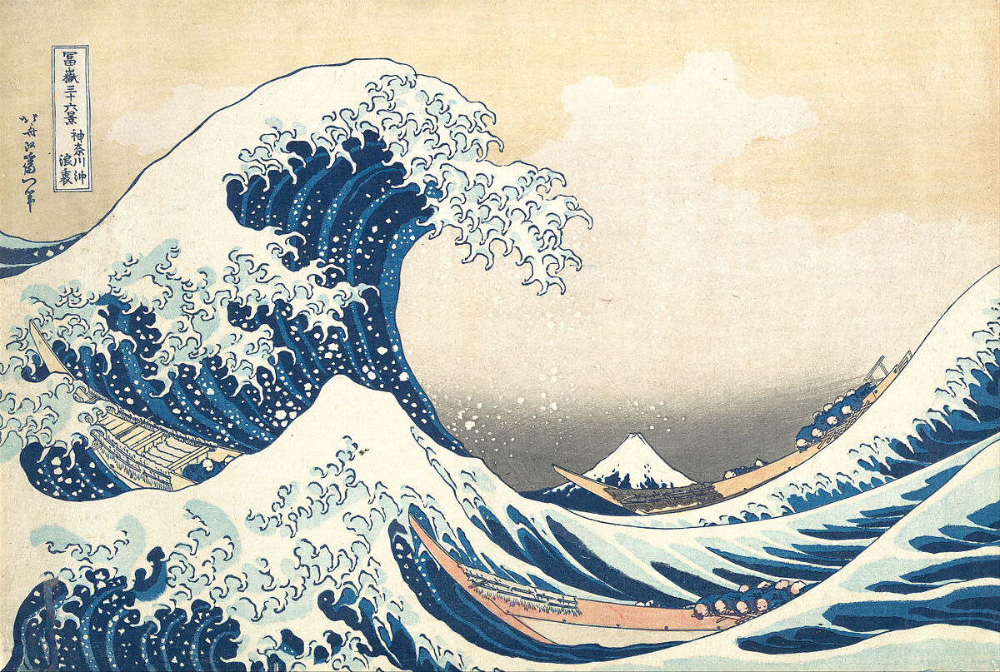

# 04：原画資料と六つの観察

日付：2026-09-24／結果：基準の所蔵品を一枚に固定し、画像を新たに観察した。3D構図制作には未着手。

## 出典

葛飾北斎『富嶽三十六景 神奈川沖浪裏』。The Metropolitan Museum of Art、所蔵番号 **JP1847**、object ID **45434**。館の記載年代は約1830–32年、紙に木版・墨と色、25.7 × 37.9 cm。館のページでPublic Domain表示を確認した。

- [所蔵館の作品ページ](https://www.metmuseum.org/art/collection/search/45434)
- [館が提供する画像](https://collectionapi.metmuseum.org/api/collection/v1/iiif/45434/134438/main-image)
- 保存画像：[Met_JP1847.jpg](../References/Met_JP1847.jpg)（1200 × 807、338,789 bytes）
- 取得日：2026-09-24。SHA-256：`a7e06182eba5205c26b4a71a06eebaead8ef2541f348a15b90174a75fc62cab0`

館の解説にある遠近表現と藍・プルシアンブルーの記載を補助資料にした。以下の領域と制作判断は、保存画像を実際に見た今回の観察であり、館の解説の引用や物理計測ではない。

## 観察注記

位置は画像左上を(0%, 0%)、右下を(100%, 100%)とした概略。将来の固定視点比較に用い、世界座標や波高には換算しない。

| 番号 | 観察する領域 | 画像から読める特徴 | 後続で確かめること |
| --- | --- | --- | --- |
| A | 左上〜中央、x 7–60%・y 8–65% | 大波が右へ巻き込み、内側に広い空の余白を囲む | 弧の輪郭と空白を大きな塊で保つ |
| B | 波頭、x 22–60%・y 12–46% | 白波が大小の枝へ分かれ、先端が曲がる。均等な反復ではない | 別計算モデルで房の大小・向き・寿命を分ける |
| C | 前景x 18–47%・y 55–93%、富士x 58–70%・y 63–74% | 前景の白い尖りと小さい富士の三角形が呼応する | 形の類似を固定視点で比較する |
| D | 船の列、左中部・右中部・下部 | 細長い船が波の斜線へ沿い、人は低く小さい | 船一隻に座った視点との構図の違いを明示する |
| E | 全体 | 濃い青の面・淡い青・生成りの空・白い波頭が分かれ、船に暖色が入る | この一枚の色関係を継続比較する。表示画像のRGBを顔料の実測値と呼ばない |
| F | 波面と船 | 細い輪郭と流れに沿う帯が面を整理し、白い点は密度が変わる | 立体化しても輪郭が点滅せず、模様が流れに追従するか確認する |

実物の色測定、船の史的寸法、波高・周期の復元は行っていない。M0では原画の選定までとし、11以降の構図や波の実装には進まない。
