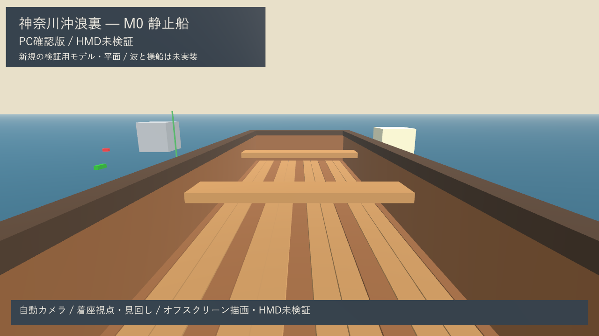

# 10：PCビルドと中間レビュー資料

日付：2026-09-24／結果：PCビルド、実行、入力イベント検査、実描画の静止画・動画保存を確認。**M0はHMD未所持のため未完了。利用者の確認待ちで停止し、11以降へ進まない。**

## 今回見るもの

- [着座視点の実描画](../Evidence/M0/M0_Seated.png)
- [静止船全体の実描画](../Evidence/M0/M0_Boat_Exterior.png)
- [Blender校正モデルの実描画](../Evidence/M0/M0_Calibration.png)
- [20秒のPC確認動画](../Evidence/M0/M0_Desktop_Walkthrough.mp4)

UnityのWindows実行ビルドで、着座の見回し→外観→校正モデル→着座復帰を記録した。これは記録用自動カメラによる**オフスクリーン描画**。同じシーンをUnityのCamera.RenderからRenderTextureへ描画し、Unity内の別カメラで日本語の注記を表示してReadPixelsで保存した。画面に提示されたウィンドウの録画、手動操作の録画、HMD映像ではない。モデルを合成画像で置き換えていない。

解像度1280×720、480枚、動画20秒、再生24fps。固定した記録時間から作る24fpsは、PCやHMDの実時間性能を表さない。静止画は連番0・192・312で、それぞれ0秒・8秒・13秒に対応する。

## 確認結果

| 試験 | 実結果 | 限界 |
| --- | --- | --- |
| Windows x64ビルド | Mono・Direct3D 11・Development、成功・エラー0 | 性能評価用の最適化ビルドではない |
| Buildの警告 | 3件。08のprofile未選択と任意の入力Control更新案内 | 機種を決めた後にprofileを選ぶ |
| 実行・終了 | 実際のPC実行ファイルを起動し、画像記録後に終了コード0 | Qキーによる人の終了操作は未確認 |
| 入力経路 | Input System仮想キーボードの矢印・Space・Rを通常のUpdate処理へ流し、見回し・停止・復帰が合格 | 物理キーボード・マウスの手動試験ではない |
| 描画 | 480枚を保存。全フレームの抽出画素で非黒率1.0、最少445色。3枚を目視確認 | 数値検査だけでは見た目を合格にせず、実画像をレビュー |
| 校正モデル | 箱の外面、上方向の青い目印、非対称な赤・緑・橙・紫の位置が表示 | 厳密な寸法・軸は07の数値記録と併用 |
| 日本語 | 実描画の題名・状態・説明を目視で確認し、欠字なし | 対話用OnGUI画面と物理操作は利用者による確認待ち |
| HMD | 機器なし・未実施 | 両眼、追跡、実寸、快適性、実機性能すべて保留 |

仮想キー検査だけは非表示ウィンドウのフォーカスに左右されないよう入力をテスト用デバイスへ固定し、IgnoreFocusを一時使用してから元へ戻す。通常起動は通常のKeyboard.current/Mouse.currentを使用する。

通常のPC起動でもOpenXRネイティブプラグインの起動前探査がログにあり、runtimeがないため `XR_ERROR_RUNTIME_UNAVAILABLE` を記録した。アプリ側の自動XR表示開始はオフで、PCの描画・入力・終了は続行できた。これを「実行ログに全種類のエラーがない」とは記さない。将来のVR起動ではruntimeのsession準備の待ち時間も実機で検証する。

初期の非表示ウィンドウからの画面取得は黒画像だったため証拠として不採用にした。実描画へ切替後、注記材質のビルド保持と入力検査のフォーカス・実時間条件を修正し、再ビルド・再記録した。公開した画像・動画は最終成功分のみ。

## 起動と再現

ローカル実行ファイル：`G:\Unity\GreatWave_2026_Fresh\Unity\Builds\M0\GreatWaveM0.exe`。ダブルクリックでPC確認版を起動する。移す場合はexeだけでなく `M0/` の実行用一式を移す。ビルド一式と元の連番画像は通常のGit対象外。

操作：右ドラッグ・矢印で見回す、Rで座席へ戻る、Spaceで停止・再開、Escで停止、Qで終了。船そのものは動かない。

1. Unity 6000.4.3f1を使用し、このリポジトリの `Unity/` を開く。
2. [Build_M0.ps1](../../Tools/Build_M0.ps1) を実行する。既定のEditorパスは本機のもの。必要なら引数 `-UnityEditor` で指定する。
3. [Capture_M0.ps1](../../Tools/Capture_M0.ps1) を実行する。ffmpegの位置は引数 `-Ffmpeg` で変更できる。記録は最大180秒で打ち切り、そのスクリプトが起動したプロセスだけを停止する。
4. 出力JSON、3枚のPNG、MP4を確認する。新たな記録は同名のレビュー資料と出典・ハッシュJSONを同時に更新する。ソースがビルド時の記録と異なる場合は再ビルドを要求する。

通常のシーンは保存済み。最初から再生成する場合だけ、06→07→08→Editor再起動で08再検証→09→10のメニュー/メソッドを順番に実行する。06は後続のシーン内容を初期化するため、通常の閲覧・ビルドには不要。

## 証拠の対応

- [ビルド結果](../Evidence/M0/10_build.json)
- [実行・入力・画像記録の結果](../Evidence/M0/10_capture_report.json)
- [出典・条件・動画/画像/実行一式のSHA-256](../Evidence/M0/10_provenance.json)
- [ビルド直前のソース](../Evidence/M0/10_prebuild_sources.json)／[ビルド後のソース](../Evidence/M0/10_build_sources.json)

最終記録は09の保存点 `1bb7a57` に未コミットの10実装を加えてビルドした。対応するソースと証拠は10のコミットへ一緒に保存する。SHA-256は当該ローカルファイルのバイト列を識別するもので、行末変換後のファイルを同一バイト列と仮定しない。最終ビルドの前後変更は0、終了後に全ソースのハッシュ一致を確認した。

元ログは `Unity/Logs/10-build.log` と `Unity/Builds/M0/Capture_20260924_211455/player.log`。公開JSONには認証情報を含めていない。

再取得時は `Capture_M0.ps1` が [Write_M0_Provenance.ps1](../../Tools/Write_M0_Provenance.ps1) を呼び、画像・動画・入力結果・ビルド一式のハッシュと取得先を更新する。取得時と出典記録時のGit状態を区別し、現在のHEADを元のビルド時点へ置き換えない。元のビルド時Git情報は、ソースと実行一式が同一の場合だけ保持する。2026-09-24の修正確認では既存の成功連番を指定して出典記録だけ再生成し、レビュー済みの画像・動画を変更していない。

## 次へ進む前の確認

利用者には、静止船からの見え方、校正用目印、操作案内の読みやすさをこの中間成果で確認してもらう。手元でPC版を操作し、物理マウス・キー操作と通常画面表示を追加確認する。その後もHMD実機試験が残るため、M0の正式完了にはしない。HMD入手後の必須試験は [05の一覧](Step_05_ja.md) に従う。
