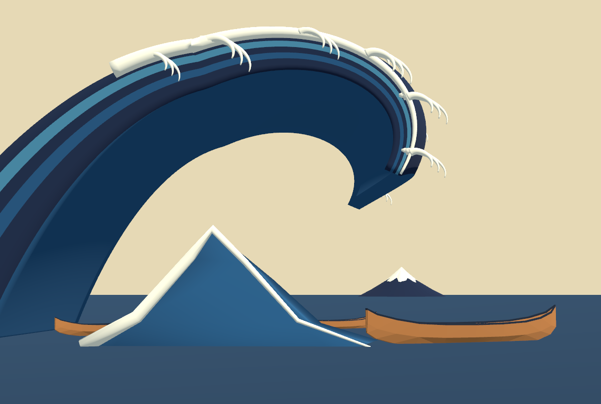
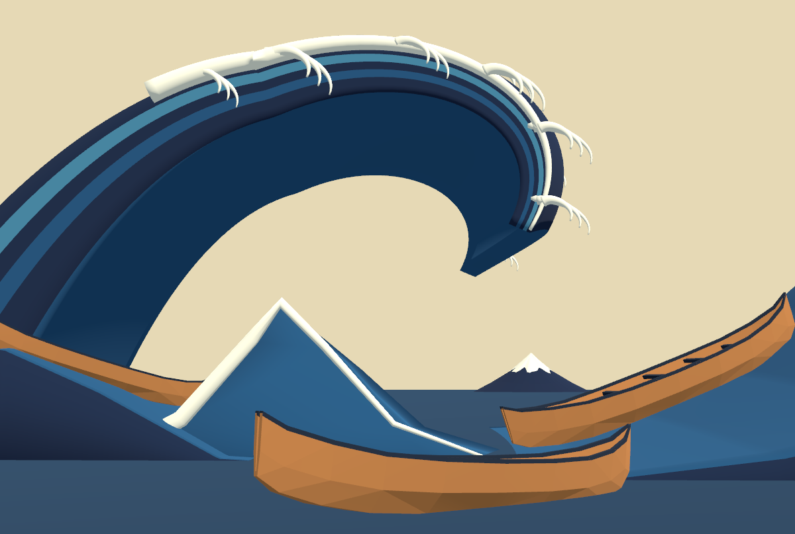

# 15修正01：右の斜面と3隻の構図

日付：2026-09-25。利用者の指示に従い、右側の高い上り斜面と3隻の位置・向きを修正した。**この構図で静止画・20秒動画を保存し、利用者の確認を待つ。** 流体、操船、HMDの検証ではなく、17以降は実行していない。

## 修正前後を見る

| 修正前（同じ縦横比） | 修正後（同じ縦横比） |
| --- | --- |
|  |  |

上の2枚はUnity Editorの実描画1200×807。カメラ位置・向き・垂直画角26°を固定し、縦横比だけ所蔵館画像に合わせた。原画から3D形状を復元したとの主張ではない。通常の確認映像は16:9なので、画面上の角度や正規化座標を原画と厳密に一致させたとは扱わない。

- [正式20秒動画](../Evidence/M1/Revision01/M1_Revision01_Walkthrough.mp4)
- [比較視点](../Evidence/M1/Revision01/M1_Comparison.png)／[船上](../Evidence/M1/Revision01/M1_Boat.png)／[側面](../Evidence/M1/Revision01/M1_Side.png)／[背面](../Evidence/M1/Revision01/M1_Rear.png)／[範囲図](../Evidence/M1/Revision01/M1_Region.png)
- [前の15の正式画像・動画](Step_15_ja.md) は変更せず保存した。

## 変更したもの

参照は所蔵館の [Met JP1847](https://www.metmuseum.org/art/collection/search/45434)。右の水面輪郭が右上へ上ること、左の船は右下へ、右の船は斜面に沿って右上へ、前景の船は低い位置に見えることを観察した。

右の斜面と左船の支持形状をBlenderで新規作成し、元の巻き波と爪状の白波は保持した。新しい2メッシュは閉形状・非多様体辺0・正の体積を確認。富士の配置と比較カメラも保持した。3隻は同じ新規制作済み船モデルを使い、次の仮配置へ変更した。寸法・船体傾斜は構図検討用で、史実・浮力・転覆限界の検証ではない。

| 船 | Unity位置(m) | 回転X/Y(度) | 配置倍率 |
| --- | --- | --- | --- |
| 左 | (-15.5, 3.1, -12) | 17 / 62 | 1.1 |
| 右の上り斜面 | (11.6, 2, -2) | -19 / 67 | 1.8 |
| 前景・乗船視点 | (0.7, -0.2, -32) | 3 / 45 | 1.35（全長13.5m） |

前景船は水面下へ下げる代わりに、カメラに近い位置へ移し、向きと船首の傾きを調整した。注記は右上の空へ移し、低い船を隠さないようにした。試行画像はローカルに残し、Gitには正式5枚と動画、同縦横比の比較2枚を掲載する。

## 数値・実行確認

[配置と測定](../Evidence/M1/Revision01/15_revision_layout.json) に3隻すべての投影範囲・配置・可視標本を記録した。実シーンの船数は3。比較カメラから頂点標本へ飛ばしたレイの可視判定は、左84/119、右113/119、前景110/119。これは選んだ標本の遮蔽確認で、船全体が遮蔽されないことの証明ではない。正式画像でも3隻の船体を確認した。

乗船位置は移動・傾斜後の実甲板メッシュへレイを当てて再計測した。甲板Y=0.3143409m、眼Y=1.5143409m、差1.2000000m。HMDの実寸感・快適性は未確認。

新しい波が以前の候補範囲へ重なるため、範囲図も再計算した。候補の船中心はX=42〜56m、Z=-22〜-3m。現在の船はこの候補範囲外。波投影からの最小距離9.5mに対し、実船頂点の水平半径6.8664m＋仮の余白1mを確保した。これは静止した水平包絡だけの判定で、衝突、海面変動、操船、快適性を確認していない。

Windows x64 Monoビルド成功（エラー0、警告3）。実行版で視点切替・見回し・停止・復帰・範囲図の6項目をInput Systemの仮想キーボードイベントで確認した。物理キー・マウスの手動操作は利用者確認待ち。

正式画像は実行版のCamera.Render→RenderTexture→ReadPixelsによる実シーン描画で、表示窓の録画ではない。動画はH.264、1280×720、480フレーム、24fps、20.000秒。全デコードを確認した。24fpsは記録用の値で、実時間性能・HMD性能の測定ではない。起動時のOpenXRネイティブ探査はruntime未導入の警告を残すため、実行ログ全体が無エラーとは扱わない。

## 起動・再現・出典

本機：`G:\Unity\GreatWave_2026_Fresh\Unity\Builds\M1_Revision01\GreatWaveM1Revision01.exe`。移す場合はM1_Revision01フォルダー全体が必要。

1〜5で視点切替、右ドラッグ・矢印で見回し、Rで戻る、Spaceで停止、Qで終了。

1. [Blender生成元](../../Blender/M1_Revision01/generate_right_swell.py) をBlender5.2.2で実行し、出力FBXをUnity/Assets/GreatWave/Art/M1_Revision01/へコピーする。
2. Unity6000.4.3f1で `GreatWave.Editor.M1RevisionBuilder.Create` を実行する。元15シーンから別名の修正シーンを作る。比較2枚は同クラスの `ReferenceAspect` で保存する。
3. [ビルド](../../Tools/Build_M1_Revision01.ps1)、[正式画像・動画の再取得](../../Tools/Capture_M1_Revision01.ps1) を実行する。

[出典とSHA-256](../Evidence/M1/Revision01/15_provenance.json) にBlender生成スクリプト・.blend・FBX・形状検査、Unityの完全ソース一覧、ビルド一式、正式画像・動画を記録した。BlenderのFBXとUnityが使ったFBXも一致する。Git開始点だけで版を示さず、未コミット変更を含む実際のハッシュを残した。

[保存確認](../Evidence/M1/Revision01/15_preservation.json) では、元15と16の正式証拠、16専用Unityソース、元15シーンの41ファイルを既存ハッシュと照合した。今回の追加後のプロジェクト全体が、過去の完全ソース一覧と一致するという意味ではない。

## 残る限界

右斜面と左の支持波は、側面・背面から厚い板のような切断面が見える静止構図用の仮形状である。船との水面接触・浮力は物理計算ではなく、船体寸法も仮値。滑らかな水の連続性、砕波、白波計算、浮世絵の最終材質、操船、HMDはこの修正で完成していない。
