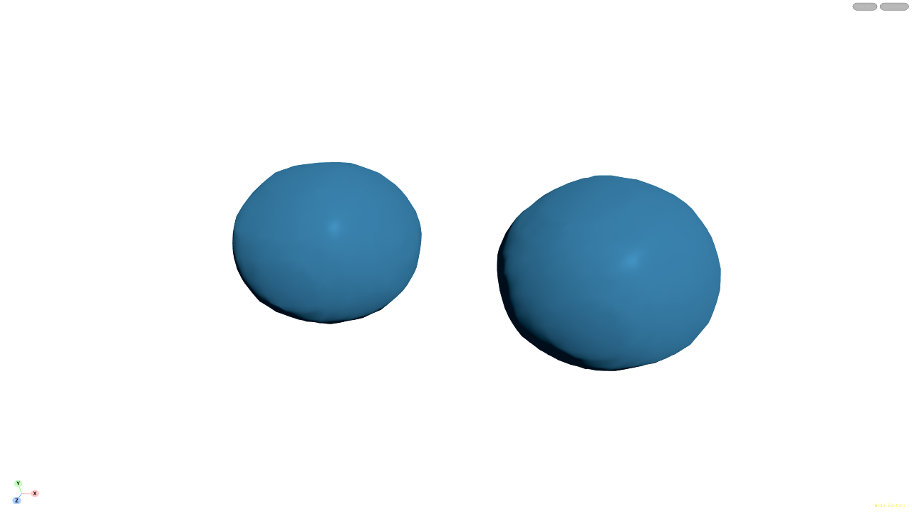
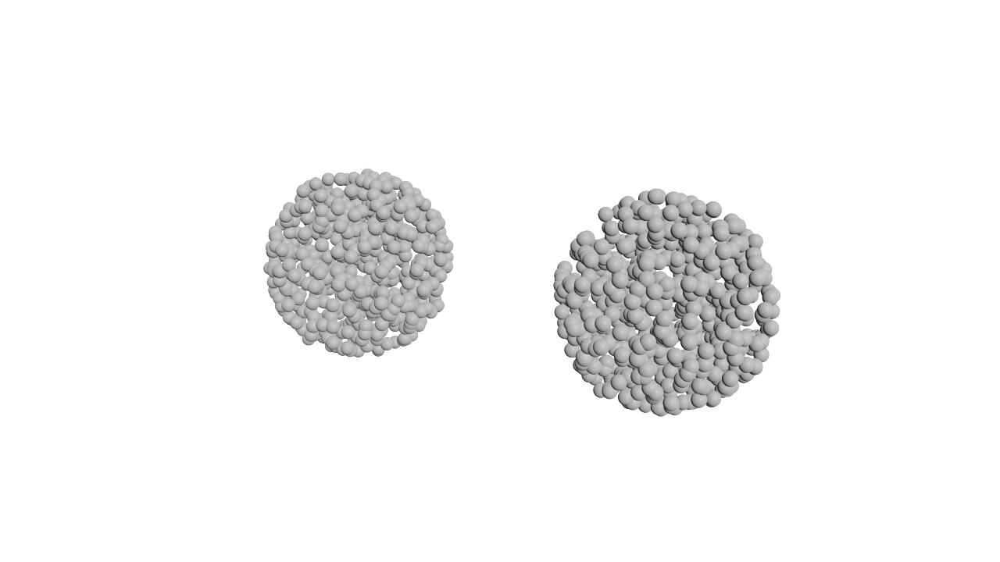
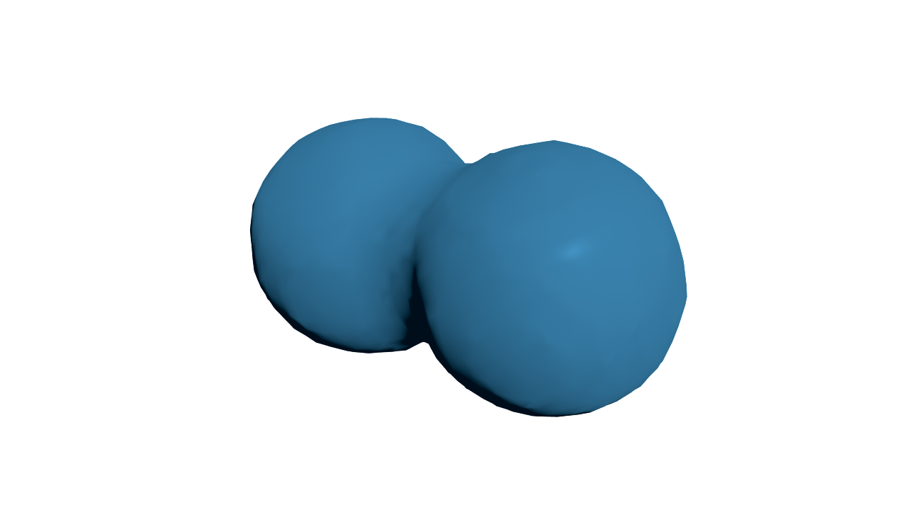
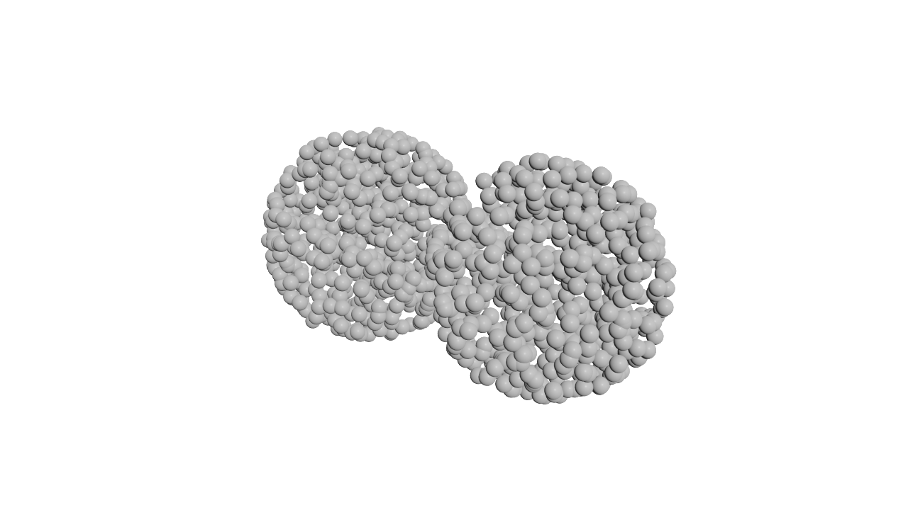
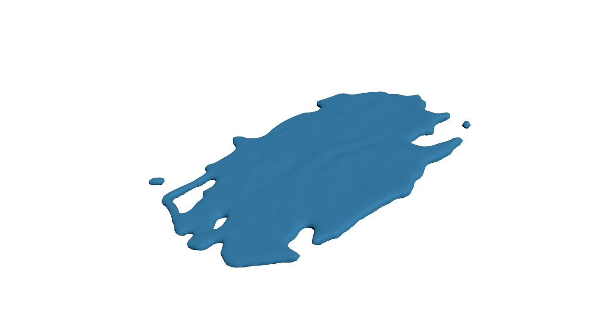
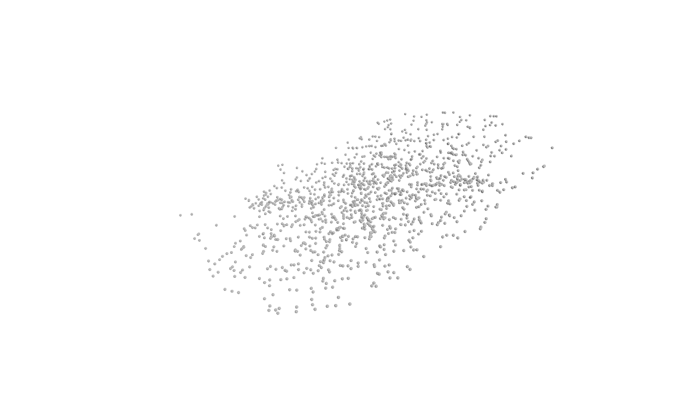
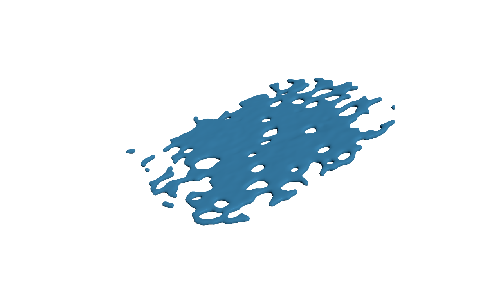
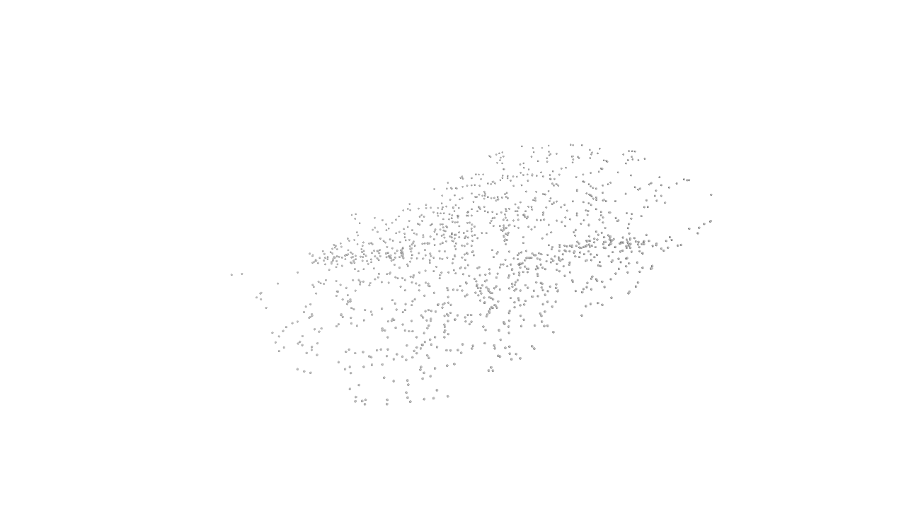

# 17：分裂・結合する小さなFLIP試料

日付：2026-09-25。利用者の続行指示により、新規の小規模FLIPを計算した。**粒子の結合・分離、毎フレーム変わる表面、保存と再読込を確認した技術試料としてレビューを待つ。18以降には進まない。** 北斎の砕波、海洋物理精度、質量保存、Unityへの方式比較、HMDの合格ではない。

## 実際の結果

- [Houdini実ビューポートの2秒動画](../../Houdini/VariableTopology17/Evidence/17_FLIP_Surface_2s.mp4)
- [条件・判定・限界の数値](../../Houdini/VariableTopology17/Evidence/17_summary.json)／[全49時刻の測定](../../Houdini/VariableTopology17/Evidence/17_validation.json)

下の各ペアは保存済みの実キャッシュをHoudiniで再読込し、同じ時刻・同じ取景範囲で描画したもの。白い球は**実粒子位置を示す半径0.025mの記号**で、水滴の実半径ではない。色分けは表示されていない。静止画は時刻ごとに近づいて撮り、動画は全時刻を含む固定範囲で終盤の流出も示す。

| 時刻 | 再メッシュした実表面 | 実粒子位置の表示 |
| --- | --- | --- |
| 0秒：2球 |  |  |
| 0.125秒：結合 |  |  |
| 0.75秒：粒子群の分離 |  |  |
| 1秒：表面にも分離した成分 |  |  |

[0.7917秒の面](../../Houdini/VariableTopology17/Evidence/17_Surface_019.png)／[粒子](../../Houdini/VariableTopology17/Evidence/17_Particles_019.png)、[2秒の面](../../Houdini/VariableTopology17/Evidence/17_Surface_048.png)／[粒子](../../Houdini/VariableTopology17/Evidence/17_Particles_048.png)も保存した。

## 計算条件

実行中のSteam Houdini22.0.429へMCP SDKで接続し、開始前にPID53912・UI有・Indie分類・24fpsを再確認した。16の解析式格子や旧試作は使わず、一意な所有コンテナー内へ公式SOPのFLIP Container → 2個のFLIP Boundary → FLIP Solver → Particle Fluid Surfaceを作成した。

初期半径0.45mの2球をX=±0.67m、Y=1.15m、Z=±0.12mへ配置し、互いへ向かうX速度±2.2m/sを与えた。sourceは最初のフレームだけ。重力9.80665m/s²、密度1000kg/m³、地面Y=0、FLIP速度移送、Time Scale=1、Global Substeps=2、適応substepsの設定は1〜4。粒子間隔0.08m、reseeding有、seed17、narrow band・waterline・表面張力は無。

採用試料の領域は12×4×12m、中心(0,1.5,0)。表面化はAverage Position、voxel scale0.75（0.06m）、adaptivity0、dilate/erode/smooth無。通常の表面化を使い、AIモデルは導入していない。[実条件](../../Houdini/VariableTopology17/Evidence/17_solver_conditions.json)を保存した。公式の[FLIP構成](https://www.sidefx.com/docs/houdini/fluid/sopminimalsetup.html)と[表面化の設定](https://www.sidefx.com/docs/houdini/nodes/sop/particlefluidsurface.html)を参照した。

## 検証できたこと

元の24fpsを変えず、Houdini frame1〜49＝相対時刻0〜2秒を採取。98個のBGEO（各時刻の粒子＋場、表面）を保存し、全部を再読込してP・存在するN/v・接続を元の実計算と照合した。Houdiniの右手Y-up、単位m。Unity座標への変換や再生は今回行っていない。

- 表面の点数は1338〜42752、ポリゴン1336〜42770、三角形換算2672〜85540。49時刻すべての接続ハッシュが異なる。
- 全時刻でP/N/vの有限値、点法線の単位長、閉じた多様体、正の成分体積を確認した。点番号を固定して変形した試料ではない。
- 粒子は距離0.16m以内をつなぐグラフで成分を求め、12粒子以上を有意成分とした。表面は接続成分の体積0.005m³以上を別に数えた。粒子IDの継承は共有8個以上を条件にした。
- 0.0833→0.125秒で2群から1群への粒子結合を確認し、元の2群から640個・655個のIDが同じ後継群へ入った。
- 0.7083→0.75秒で1群から3群への粒子分離を確認し、1039個・19個・28個のIDが別の後継群へ移った。両イベント時の粒子は水平領域端から0.16mより離れている。

| 時刻 | 実粒子数 | 有意粒子成分 | 有意表面成分 |
| --- | ---: | ---: | ---: |
| 0 | 1306 | 2 | 2 |
| 0.125 | 1302 | 1 | 1 |
| 0.75 | 1275 | 3 | 1 |
| 0.7917 | 1275 | 4 | 2 |
| 1 | 1275 | 15 | 4 |
| 2 | 543 | 0 | 53 |

粒子の距離グラフと面化後の接続は同じ判定ではない。面化が離れた粒子群をまだつなぐ時刻があり、同時に切れたとは主張しない。また「有意粒子成分0」は粒子が存在しない意味ではなく、各群が12粒子未満という意味である。

表面の有意分離を示す1秒時点では、実粒子の水平領域端までの最小余裕は0.5745m。粒子数の一致だけで流出不在を推定せず、この実位置の余裕も判定へ含めた。

FLIP出力には5個のVolume保持点が含まれていた。初期の検査でこれらを粒子に数えたためID重複に見えたが、Volume所属点を除くと全時刻で実粒子IDは一意だった。実行時の `17_cache_index.json` の `particle_count` はその5点を含む生点数を保持し、正しい実粒子数は `17_validation.json` に分けて記録している。

## 合格にしていないこと

初回の6×4×5m領域では後半に粒子が大きく流出したため不採用。条件を一度だけ修正し、他条件を固定して領域だけ12×4×12mへ拡げた。[不採用の実測](../../Houdini/VariableTopology17/Evidence/17_rejected_initial.json)も残した。

修正版でも、約1.33秒までは1273粒子を保つが、2秒では543へ減る。領域端へ到達した後の減少は結合の証拠にしない。領域外粒子が削除される[公式の境界条件](https://www.sidefx.com/docs/houdini/nodes/sop/flipcontainer.html)と、実位置・小領域との比較から、開放境界への流出と解釈した。reseedingも有効なので、粒子数をそのまま質量には換算しない。

**表面体積は0.4794m³から最大6.8933m³へ増え、終端2.7462m³となる。** 面化した体積が保存される試料ではない。粗い粒子・薄いシート・面化の接続と厚みには大きな誤差があり、海洋物理精度、2秒間の質量保存、長時間安定性、自然な砕波の美術品質を合格扱いにしない。次の比較へ使う場合も、この既知の限界を入力条件として扱う。

## 保存・再現・元シーン

全98キャッシュは50,899,634bytesで、ローカル `G:\Unity\GreatWave_2026_Fresh\Houdini\VariableTopology17\Cache` に保持する。Gitには[選択12キャッシュ](../../Houdini/VariableTopology17/Evidence/SelectedCache/)（約4.2MB）、全時刻のSHA索引、所有ノードのCPIO、生成・計測・撮影コードを保存した。[出典](../../Houdini/VariableTopology17/Evidence/17_provenance.json)と[Houdini再現手順](../../Houdini/VariableTopology17/README_ja.md)を参照。

動画は実Houdiniビューポートの48枚をH.264・1280×720・24fps・2.000秒へ符号化し、全デコードを確認。終端2秒の49番目は静止画とキャッシュに含めた。24fpsは採録・再生設定で、リアルタイム性能ではない。

既存HIPの保存・読込・クリア、既存形状の参照、全シーン走査、グローバルFPS変更、ライセンス変更はしていない。最終撮影後、所有ノード不在とUI18項目＋格子2項目・背景1項目の復元が合格。dirtyはtrueのまま、Undoは消去せず最終160件を保持した。.hiplc再起動読込、CPIOからの同一再計算、18の方式比較、HMDは未実施。15・16のソースと媒体は変更していない。
