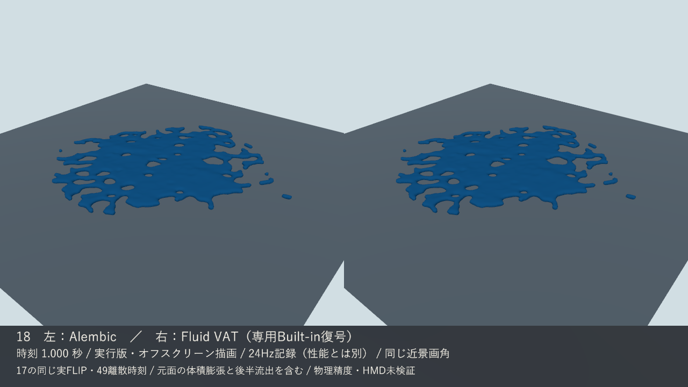

# 18：実FLIPのAlembic・Fluid VAT比較

利用者の続行指示を受け、17の同じ49時刻を実際に2形式へ出力し、Unity EditorとWindows実行版で比較した。**この小試料・PC条件での受け渡し検査に合格し、利用者の確認を待つ。** 19の密度/HMD、20の採用決定、主役の砕波制作には進まない。

## 実際の結果を見る

- [左右比較の2秒動画](../Evidence/M1/Playback18/18_Comparison_2s.mp4)（左Alembic、右Fluid VAT）
- [0秒・初期2球](../Evidence/M1/Playback18/18_Comparison_000.png)／[0.125秒・結合](../Evidence/M1/Playback18/18_Comparison_003.png)
- [0.75秒](../Evidence/M1/Playback18/18_Comparison_018.png)／[0.792秒](../Evidence/M1/Playback18/18_Comparison_019.png)／[1秒・表面分離](../Evidence/M1/Playback18/18_Comparison_024.png)／[2秒・末端](../Evidence/M1/Playback18/18_Comparison_048.png)



実Windowsビルドが両形式を同じカメラ・照明・色・片面shaderで順にオフスクリーン描画した。OS画面録画ではない。動画は固定画角、静止画は各時刻へ寄った同じ左右画角。49枚を採録し、0〜47の48枚を24fps・2秒に符号化した。末端48は2秒の静止画へ保存。記録fpsは実時間性能を意味しない。

## 元データと設定

入力は `GreatWave17_FLIP_02`、24Hz、49時刻、0〜2秒。採用された17の49surface BGEOをSHA照合し、再シミュレーションせず同じfan三角化SOPから出力した。元quadに非平面性があるため、誤差の基準は**共通三角化後**。点P/Nは保持し、Fuse・面削減なし。[元面の調査](../../Houdini/PlaybackComparison18/Evidence/18_triangulation_audit.json)。

Houdini22.0.429、Unity6000.4.3f1 Built-in、Alembic2.4.4、Windows x64 Mono。Fluid VATは公式SideFX Labs3.1の2pass出力を、公式URP graphのHDR経路から新規実装した専用Built-inデコーダーで再生した。URPは導入していない。詳細な設定・固定公式SHA・ソース・UI復元・再書出しは [Houdini側README](../../Houdini/PlaybackComparison18/README_ja.md) に記載。

Alembic実archiveの時刻は1/24〜49/24秒。Unityでは開始offsetを考慮した相対0〜2秒を指定する。49個のnative sampling時刻を読んで確認し、変動トポロジーの補間はOFF。VATも49枚を離散指定し、2秒で停止する。1unit=1m、HoudiniからUnityへX反転、Scale1。

## 数値検査

Editorと実行版で別々に、各時刻の実imported mesh、または実FBX UVと実EXRを描画共通のGPUデコーダーでreadbackして照合した。GPU検査時間は性能測定に含めない。位置許容0.0001m、法線角0.5°を実行前に設定した。

| 検査 | Alembic | Fluid VAT |
| --- | --- | --- |
| 実49時刻 | Editor・実行版49/49合格 | Editor・実行版49/49合格 |
| 最大頂点位置差 | 0m（今回のfloat32値） | 0m（今回のfloat32値） |
| 最大法線角差 | 0° | 約0.02798° |
| 全元点・有向三角形接続 | 全49時刻一致 | 全49時刻一致 |
| 有限値・法線長・index | 合格 | 合格 |
| 描画のbounds | 実頂点から更新し包含確認 | 全clip boundsを明示設定、全復号頂点の包含確認 |

VATのFBXは256,626頂点・85,542三角形。各時刻で不要な面は同一点へ潰される。厳密に3頂点が同位置のpaddingだけを除外し、実面は極細面も保持して照合した。CPU/GPU layout使用率X/Y=1を測定した。元metadataは変更せず、整数近傍の数値境界補正はraw/used値と9事例検査で記録している。

詳細：[Editor ABC](../Evidence/M1/Playback18/18_alembic_editor_validation.json)／[Editor VAT](../Evidence/M1/Playback18/18_vat_editor_validation.json)／[実行版ABC](../Evidence/M1/Playback18/18_runtime_alembic_validation.json)／[実行版VAT](../Evidence/M1/Playback18/18_runtime_vat_validation.json)／[native時刻](../Evidence/M1/Playback18/18_archive_sampling.json)。

## 同じPC条件での負荷と容量

RTX3080、Core i7-12700K、Direct3D11、開発用Monoビルド。1280×720の同じカメラ/RenderTexture、vSync0、targetFrameRate無制限、各方式49時刻のwarm-up後に49×3=147回を計時した。形状検査・PNG保存・readback・動画符号化は区間外。両方式のassetは同時常駐する。[実測全件の要約](../Evidence/M1/Playback18/18_runtime_performance.json)。

性能JSONは撮影前に保存したスナップショットなので、そこにある `frames=0 / passed=false` は撮影の未実施状態。全工程の最終合否は [capture_report](../Evidence/M1/Playback18/18_runtime_capture_report.json) の `passed=true / frames=49` に記録する。

| 指標 | Alembic | Fluid VAT |
| --- | --- | --- |
| CPU更新 中央値 / p95 | 4.0993 / 6.5811ms | 0.0018 / 0.0025ms |
| Camera.RenderのCPU呼出し 中央値 / p95 | 0.2876 / 0.4197ms | 0.0991 / 0.1489ms |
| 観測したループ間隔 中央値 / p95 | 5.1396 / 8.3414ms | 0.2213 / 0.3405ms |
| 実出力ファイル容量 | 61,097,540bytes | FBX+3EXR：72,389,894bytes（mat別4,059bytes） |
| 書出し処理時間 | 64.89秒 | pass1 144.51秒＋pass2 130.34秒 |

CPU更新はABCの実メッシュ読込/AABB更新と、VATのframe uniform設定を比べる。VATのGPU仕事をこのCPU値で代替していない。GPU専用時間はAPIから有効値が得られず**未測定**。`processPrivateBytes=0` も未取得値で、メモリ使用0を意味しない。ループ間隔をディスプレイfpsやHMD性能へ換算しない。1回の小試料・固定順序・offscreen測定であり、機種横断の優劣や採用決定ではない。

VAT実行版はlookup2048×6174、position/rotation各1024×1066、すべてRGBAFloat・mip1を確認。3画像の非圧縮texel容量は237,240,320bytes（約226.25MiB）。Unityが報告した3Textureのruntime size合計は237,241,640bytes。mesh・CPUコピー・driver・他assetの量は別で、これは合計GPU使用量ではない。画像のlinear/Point/Repeat/no mip/no圧縮とStandalone最大8192を固定した。独立した形式別cold-load時間と総メモリ比較は未測定。参照gzipの読込811.6msは検査用処理であり、ABC/VATのロード速度と混同しない。

## 起動と再現

本機の実行一式：`G:\Unity\GreatWave_2026_Fresh\Unity\Builds\Playback18\`。`GreatWave18.exe`だけでなくフォルダー全体が必要。1でAlembic、2でVAT、Spaceで停止・再開、Rで先頭、Qで終了。起動時はAlembic、2秒で停止。通常ウィンドウの物理キー操作は利用者確認待ち。

配布した実入力から再作成する場合：

```powershell
& 'E:\6000.4.3f1\Editor\Unity.exe' -batchmode -projectPath 'G:\Unity\GreatWave_2026_Fresh\Unity' -executeMethod GreatWave.Editor.Playback18Builder.CreateAndValidate -quit -logFile 'G:\Unity\GreatWave_2026_Fresh\Unity\Logs\18-editor.log'
./Tools/Build_Playback18.ps1
./Tools/Capture_Playback18.ps1
```

ビルド結果はerrors0/warnings3、制作物のbuild前後差0。M0由来のOpenXRネイティブ起動前探査によるruntime未導入メッセージは残るため、全ログ無警告とは記さない。今回のPC検査は両眼やHMD起動を実行していない。

[出典記録](../Evidence/M1/Playback18/18_provenance.json) は実行開始時Git状態、ビルド前後の全ソース一覧、実行一式、Houdini入力、元49PNG、ログ、6静止画・動画をSHAで結ぶ。未コミット変更がある状態で作ったため、開始HEADだけをビルド版とは扱わない。再記録時はこの索引も再生成する。実行一式・生フレーム・重複原本はGit対象外、共有用の実ABC/VATと選択証拠はGitに含む。

## 制限と次の確認点

17由来の面化体積は約0.4794→最大6.8933m³へ膨張し、後半は領域外流出がある。その入力を両方式へ忠実に渡したのであり、海洋物理・原画砕波・質量保存の合格ではない。HMD、30/60/90Hzの新規試料、描画密度、両眼/影/深度、最終方式の採用は未実施。静止構図15修正01、固定格子16、実FLIP17の既存成果は変更していない。ここで18の確認を待つ。
