# 23：原画基準と評価器v0、較正門、M1基線差

日付：2026-09-25（修正1回目・修正2回目：2026-09-26）／修正2回目の結果：利用者が承認した高解像度原画（Met_JP1847_DP130155.jpg、3859×2594）へ真値を移し、真値v0.2で第1部・第2部・基線をすべて回し直した。旧原画1200×807は新原画を画素中心の約束で縮小したもので（裁ち落としの差なし、ECCの残差は最大0.047旧参照px）、表示写像の差は横方向だけで最大0.364表示px。**較正門の7項目は、しきい値を変えずにv0.2でもすべて合格した**（Canny支持率の距離のしきい値は凍結時の1旧参照pxの大きさのまま。下の「修正2回目」）。波頭上部の爪の空の入り込みは閉じた。線幅は測れるようになり、区間の中央値での±20%判定は可能、爪を含む132・72の点ごとの判定は不可と確かめた（記録のみ）。番号24の保存済みt\*をv0.2で評価し直すと、78・130・131・132は1.05 px以下、72は9.54 pxだった（記録のみ）。以下の「修正1回目」以降の節の数値は、断りがなければ真値v0.1（旧原画）の時点の記録である。

修正1回目までの結果：第1部では、原画・画面写像・PaintingCam v1・t\*・判定規則をJSONに固定し、原画から目標の折れ線、色区、調色板を半自動で取り出して評価器v0を作った。第2部では、Unity上に世界標識5点と平塗り色区を描き、numpyの投影と調色板に照らし合わせた。コミット前のレビューで、真値v0が唇の右端の爪群を空として抜いていたことがわかった。修正1回目で、藍線の途切れを手動の障壁3本で閉じた真値v0.1を作り、第1部・第2部・基線差をすべて回し直した。**較正門の7項目（第1部5項目、第2部のUnity 2項目）は、v0.1でもすべて合格した。** 補助のカメラ照合も合格している。ただし較正門が確かめるのは評価器の測り方と真値の精度で、真値の完全性（水の面を漏れなく含むか）は判定しない（下の「較正門が確かめないこと」）。番号26を始める前提は満たしたが、手動の障壁の置き方は利用者の抜き取り確認を待つ。あわせて、M1 Revision01の旧い仮置きをPaintingCam v1から描いて評価器にかけ、基線差を記録した。主浪の輪郭の差は最大41〜405表示pxで、判定対象の輪郭はどれも4 pxを大きく超えている。これは出発点の記録で、番号23の合否ではない。

この「23」は2026-09-25の新作業計画（CP0で利用者が確認した）での番号で、旧設計書の23（理論比較）とは別である。

- 時間の上限：23全体で1.5日（第1部の枠は0.75日）。第2部（Unity）は約1時間で終えた。Unityの1回の実行は約13秒（起動を含む第2部全体で約40秒）。修正1回目（真値の修正、回し直し、文書の更新）は約40分（2026-09-25 23:35〜09-26 00:15頃）。修正2回目は枠0.5日に対し約1時間（2026-09-26 01:58〜03:00頃、同じ時計）。Unityの実行は2回で、どちらも起動を含む第2部全体で2分以内（最後の回は約111秒）。同じ問題（真値の修正）の修正は修正2回目で上限の2回に達した。23の修正3回目は開かず、真値の残りの欠陥は後続の番号（29など）で扱う。
- 対応するバックログ：定義シート第11行（共通の受入基準。原画ファイル・裁切・採用フレーム・原画機位が未特定のままでは合格にしない）。目標を定義した項目は、判定対象が71・72・78・130・131・132・76・212・213、報告項目または対応未確定が74・75・157・159・161・162・265。
- 証拠の種類：第1部は文書準備とnumpy/OpenCVの計算。第2部はUnity Editor（batchmode）のPCオフスクリーン描画と、そのPNGをnumpy/OpenCVで測った結果。PCビルドとHMD実機の結果は含まない。どのバックログ項目も、この番号では合格にしていない。

## 修正2回目（2026-09-26）：高解像度原画への移行と真値v0.2

**理由**：利用者はD3で高解像度原画のダウンロードを承認した（「允许下载」）。進行役が Met object 45434 の主画像 DP130155（https://images.metmuseum.org/CRDImages/as/original/DP130155.jpg、3859×2594、2,342,637 bytes、SHA-256 `cbb9988f…fac36303`、2026-09-26取得）を [Docs/References/Met_JP1847_DP130155.jpg](../References/Met_JP1847_DP130155.jpg) に置いた。1200×807 では線幅の±20%（約±0.3参照px）が測れず、藍線の淡い途切れも解像しなかった。そこで真値を高解像度原画から取り直し、修正1回目の保留（波頭上部の爪の空の入り込み、水色の爪体を数えない完全性の記録、線幅、「編号」の表記）もまとめて直した。旧原画 `Met_JP1847.jpg` は履歴として残し、位置合わせとv0.1との比較にだけ読む。

### 位置合わせと表示写像（[register.py](../../Tools/PaintingTruth/register.py)、[23_registration.json](../Evidence/ArtFirst/23/23_registration.json)）

旧原画は新原画を画素中心の約束（x_旧 + 0.5 = (x_新 + 0.5)·1200/3859、yは807/2594）で縮小した画像で、裁ち落としや余白の差はなかった。縦横の倍率は 3.21583・3.21437 で、0.045% 違う。

| 確かめたこと | 結果 |
| --- | --- |
| ECC（新原画を INTER_AREA で1200×807に縮小し、旧原画に合わせる）の平行移動 | (−0.0008, 0.0037) 旧参照px |
| 同じくアフィン | 四隅の最大移動 0.047旧参照px（0.063表示px）、相関 0.9986 |
| SIFT＋RANSACの相似変換（独立の確認） | 回転 0.0008°、inlier 2,290/2,374点、残差 RMS 0.239・p95 0.481旧参照px（縮尺の違う画像間の特徴点の位置の偏りを含む） |
| 画素値の差 | 平均 6.7、p99 45（8bit）。縮小フィルターとJPEGの違いとみられる。幾何には影響しない |

新しい表示写像は、新原画の縦2594pxを表示の縦1080pxに合わせ、縦横同じ倍率にした。scale = 1080/2594 = 0.416345、offset_x = (1920 − 3859·1080/2594)/2 = 156.662、offset_y = 0。原画の幅は1606.68px（v0.1は1606.0px）。採点する列157〜1762と左右の黒帯、PaintingCam v1（縦1080px＝縦画角26°）は変えていない。

v0.1の写像との差（同じ原画の内容の点の表示位置、v0.2 − v0.1）は、縦は0、横は表示xに比例する。左端（x=157）−0.364px、x=700で−0.118px、中央0、唇先端（x=1108）で+0.067px、右端（x=1762）+0.364px。旧原画の縦横比の0.045%の歪みを除いた分である。主浪の範囲（x 157〜1110）では−0.364〜+0.068px。

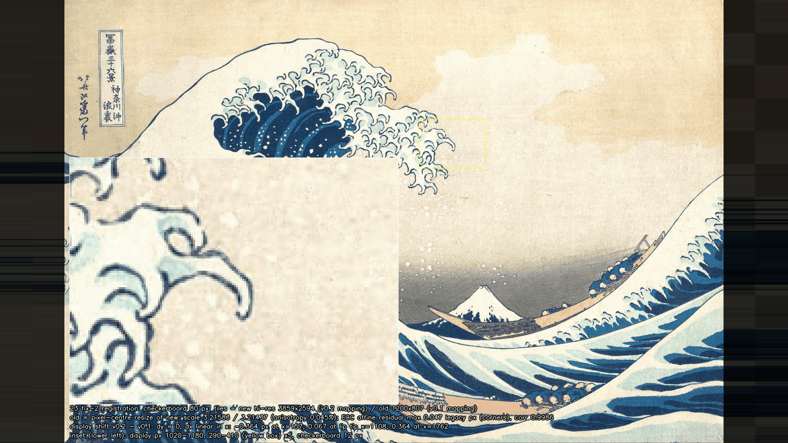

### 真値v0.2の取り出し（[extract.py](../../Tools/PaintingTruth/extract.py)、[painting_truth.json](../../Tools/PaintingTruth/painting_truth.json) v0.2、[manual_annotations.json](../../Tools/PaintingTruth/manual_annotations.json) v0.2）

- **規則の換算**：v0.1の長さ（旧参照px）は3.2151倍（縦横の倍率の相乗平均）、面積は3.2151²倍、勾配（L\*/px）は1/3.2151倍して高解像度pxに直した（例：平滑σ 0.8→2.572、境界の詰め 2回→6回、包絡の閉じ・開き・σ 20・10・4→64・32・12.86）。色のしきい値は変えていない。v0.1の値は `extraction.legacy_v0_1` に残した。船のマスクの固定値（閉じ2・穴2000・最小30）も換算して `extraction.boat` に出した。
- **途切れの閉じ（新規）**：高解像度では線の端どうしの狭い途切れが解像する。換算しただけの規則では、空が主浪の水の面へ流れ込んだ（唇の下の爪の鉤など）。そこで塗りつぶしの前に障壁全体を半径3pxの円で膨らませ、幅6px（約1.9旧参照px）未満の途切れを閉じた。境界の詰めは膨らませる前の色の障壁で止まるので、境界は線の外縁へ戻る（詰めを6回＋3回＝9回にした）。手動の障壁4本のもとで半径を変えた記録は、半径0で水の面の内側107万pxが空になり、半径1で流れ込みは止まるが爪の間へ1,791px多く空が入り、半径2では642pxだった（[23_extract_record.json](../Evidence/ArtFirst/23/23_extract_record.json) の `gap_closing_radius`）。
- **手動の注記**：点・多角形・障壁は、旧座標から x_新 = (x_旧 + 0.5)·3859/1200 − 0.5（yは2594/807）で写した。旧座標は各項目の `legacy_ref_*` に残した。障壁の太さは3高解像度px（v0.1の2旧参照px ≈ 6.4高解像度px より細い）。v0.1の3本は、高解像度の拡大（2.2〜5倍）で線の上にあることを確かめた（下の唇の拡大図のマゼンタ）。
- **波頭上部の爪の障壁（新規）**：`crest_hook_bottom_gap`（参照px (1871, 489)→(1873, 508)、旧参照px 約 (581.4, 151.6)→(582.0, 157.6)）。鉤の柄の先と下の外周線の間に約10pxの開きがあり、v0.1ではここから空が淡い水色の爪体と柄の下の白い通り道へ入っていた。高解像度では途切れの閉じだけでも爪体への入り込みは止まり、この障壁を外しても変わるのは開きの中の34pxだけだった。障壁は、途切れの閉じの半径に結果が左右されないように置いた。
- **障壁を1本ずつ外した場合**（記録のみ）：`lip_cluster_top_gap` 72px、`lip_cluster_pocket_inner` 24px、`lip_cluster_curl_right` 72px、`crest_hook_bottom_gap` 34px だけ空が増え、水の面の20px内側まで空になる所はどれも0。高解像度と途切れの閉じのもとでは、4本とも線の途切れの中の数十pxを決めるだけである。

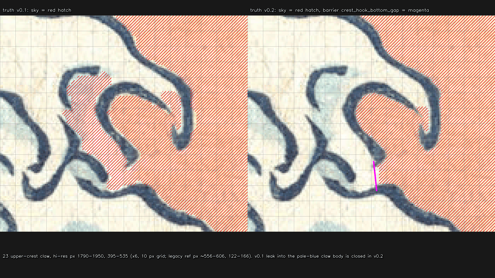

**v0.1との差**：空と水の入れ替わりは、空→水 5,758px（557旧参照px²）、水→空 5,945px（高解像度px）。ほとんどは境界の1〜2pxの揺れで、開き（半径1）の後に60px以上残る塊は次のとおり（[23_extract_record.json](../Evidence/ArtFirst/23/23_extract_record.json) の `v0_1_to_v0_2`）。

| 場所（旧参照px、表示px） | 高解像度px（旧参照px²） | 内容 |
| --- | --- | --- |
| (575.6, 145.0)、(927, 194) | 1,421（137.5） | 波頭上部の爪の入り込み（v0.1の記録では約145旧参照px²）。空→水 |
| (1044.1, 448.3)、(1555, 600) | 578（55.9） | 中船の舷の2本の線の間の細い帯。v0.1では空が入っていた。空→水 |
| 唇の右端の爪群（659.8, 241.0）など6か所 | 93〜135 | 爪の先や途切れの中の小さな所。空→水 |
| (537.6, 512.8)、(876, 687) | 161 | 内壁の下端付近の小さな所。水→空 |

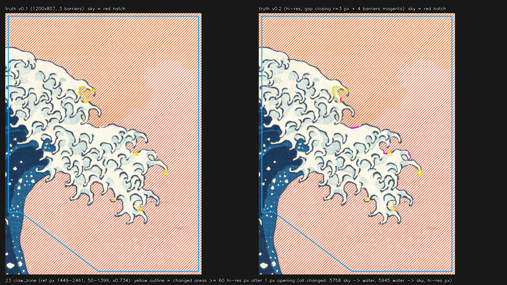

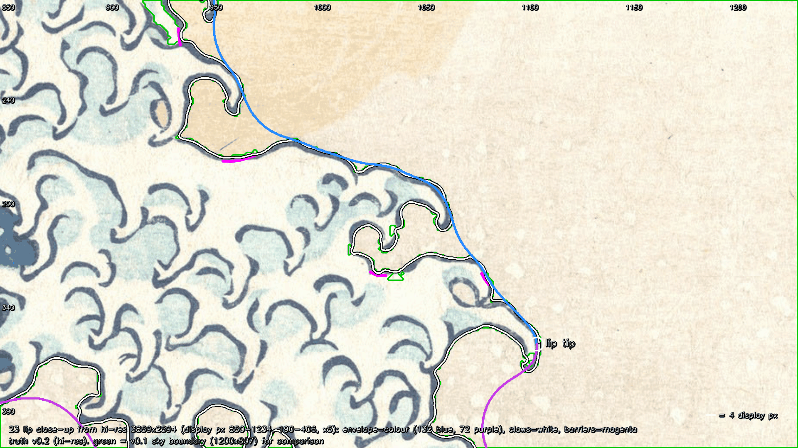

**目標の折れ線の変化**（v0.1とv0.2の折れ線どうしの距離、表示px、最大／p95）：

| 区間 | 包絡版 | 爪入り版 | 包絡版の長さ v0.1→v0.2 |
| --- | --- | --- | --- |
| 78 | 0.78／0.54 | 0.78／0.54 | 235.1→234.95 |
| 130 | 0.57／0.37 | 0.57／0.37 | 179.4→178.77 |
| 131 | 0.75／0.40 | 0.75／0.40 | 307.8→307.36 |
| 132 | 2.50／0.57 | 12.31／2.68 | 469.0→470.84（爪入り 903.6→797.28） |
| 72 | 2.50／1.17 | 7.88／0.77 | 858.7→852.49（爪入り 1386.9→1371.27） |

- 包絡版の132・72の最大2.50pxは、唇先端の点が (1107.9, 352.9) から (1107.9, 355.4) へ2.5px下がったためである。唇先端は「包絡線のclaw_zone内でxが最大の点」で、包絡線がほぼ鉛直な所なので、境界がわずかに動くと縦に動きやすい。132と72の和集合（外周の形）はほとんど変わっていない。
- 爪入り版の132の12.3pxは波頭上部の爪の入り込みを閉じた所。
- 手動の障壁に沿う点は、包絡版の132で824点のうち4点（v0.1は816点のうち19点）、爪入り版の132で1,423点のうち51点。72は0点。
- 130/131の境界点は輪郭から6.6px離れていたため、v0.1と同じく最も近い輪郭点へ寄せた。
- extract.py を2回続けて実行し、真値の出力（targets/ の全ファイル）と重ね図・記録のSHA-256がすべて一致した。

**調色板**（表示フレームの原画は、v0.2から3×3超標本化の双線形＋平均で縮小した画像。3px収縮の内側の中央値）：

| 色 | L\* | a\* | b\* | 8bit sRGB（v0.1との違い） | 画素数 | v0.1とのΔE00 |
| --- | --- | --- | --- | --- | --- | --- |
| 白・生成り | 96.73 | −1.69 | 9.83 | 251, 246, 227 | 96,285 | 0.09 |
| 水色 | 82.96 | −8.68 | 3.91 | 192, 211, 199（193, 212, 199） | 7,573 | 0.11 |
| 藍中 | 42.17 | −5.52 | −29.28 | 41, 105, 148 | 4,749 | 0.06 |
| 藍濃 | 25.78 | 0.58 | −22.97 | 34, 63, 96（33, 62, 95） | 32,181 | 0.08 |
| 空上 | 92.37 | 0.11 | 19.55 | 249, 232, 196（248, 231, 195） | 180,325 | 0.05 |
| 空下（水平線際） | 53.92 | −1.37 | 3.09 | 129, 130, 124 | 18,813 | 0.02 |
| 船の黄土 | 80.36 | 7.82 | 22.67 | 229, 193, 158 | 18,331 | 0.24 |
| 富士の雪 | 97.65 | −2.20 | 9.57 | 252, 249, 230（251, 248, 229） | 4,450 | 0.09 |
| 富士の山肌 | 27.58 | 0.52 | −20.66 | 42, 66, 96 | 315 | 0.20 |

明暗の境 L_mid は73.144（v0.1 73.12）。`unity_gate.json` の平塗り色区の色は、extract.py が調色板に合わせて書き換えるようにした（`sync_unity_gate_colors`。今回は水色・藍濃・空上・富士の雪が8bitで1段変わった）。調色板のLabは小数6桁で保存するようにした（下の自己テストの注）。

### 線幅プロファイル（記録のみ。[23_line_width.json](../Evidence/ArtFirst/23/23_line_width.json)、[line_width_profile.json](../../Tools/PaintingTruth/targets/line_width_profile.json)）

爪入り版の5区間に沿って、1旧参照px（1.338表示px）ごとに、空境界（線の外縁）から水側への法線上のL\*を高解像度で0.25px刻みに取り、半深さ全幅を測った（空側の中央値と線の芯の最小の中間を下回ってから上回るまで。深さ20未満は「線なし」、6旧参照px以内に戻らない点は「線が暗い面に続く」として除く）。同じ点・同じ測り方を、表示フレームの原画（1920×1080への縮小）にもかけて比べた。評価器の描画側の線幅も同じ測り方にした。

| 区間 | 測れた点 | 線幅の中央値（高解像度px） | 表示px（p10〜p90） | ±20%の幅 | 表示解像度で測った中央値の差 | 点ごとの差の p95 | 半間隔ずらした再測定の差 |
| --- | --- | --- | --- | --- | --- | --- | --- |
| 78 | 148/176 | 6.68 | 2.78（2.20〜3.84） | ±0.56 | +1.8% | 10.3% | −1.2% |
| 130 | 134/134 | 8.03 | 3.34（2.92〜4.58） | ±0.67 | −0.4% | 4.5% | −0.3% |
| 131 | 230/230 | 6.89 | 2.87（2.29〜3.83） | ±0.57 | +2.3% | 8.0% | +0.7% |
| 132 | 536/596 | 5.50 | 2.29（1.52〜3.36） | ±0.46 | +4.3% | 33.2% | +0.9% |
| 72 | 713/1,025 | 6.32 | 2.63（1.68〜5.59） | ±0.53 | +0.3% | 38.5% | +1.6% |

**±20%の判定ができるか**：真値の側は、線幅が5.5〜8.0高解像度pxあり、半間隔ずらした再測定の区間中央値の差は最大1.6%なので、±20%（±1.1〜1.6高解像度px）を十分に分けられる。1920×1080の描画の側は、同じ測り方で表示解像度の原画を測ると、区間中央値の差は最大4.3%（132）で、±20%の1/4（5%）以内だった。**区間の中央値での±20%の判定はできる。** 点ごとの差のp95は、外周の78・130・131では4.5〜10.3%で、判定にほぼ使える。爪の中を通る132・72では33〜39%になり、点ごとの判定はできない（線が曲がり、隣の線や暗い面と重なる）。72は1,025点のうち307点で線が内壁の暗い藍の面に続き、幅を測れない。backlog 195の「線の太細が変わる位置の誤差4px以内」は点ごとのプロファイルを要するので、132・72では3840×2160で描いて測るなどの工夫が要る。判定を始めるかは番号36で決めることにし、`painting_truth.json` は `judged: false` のままにした。

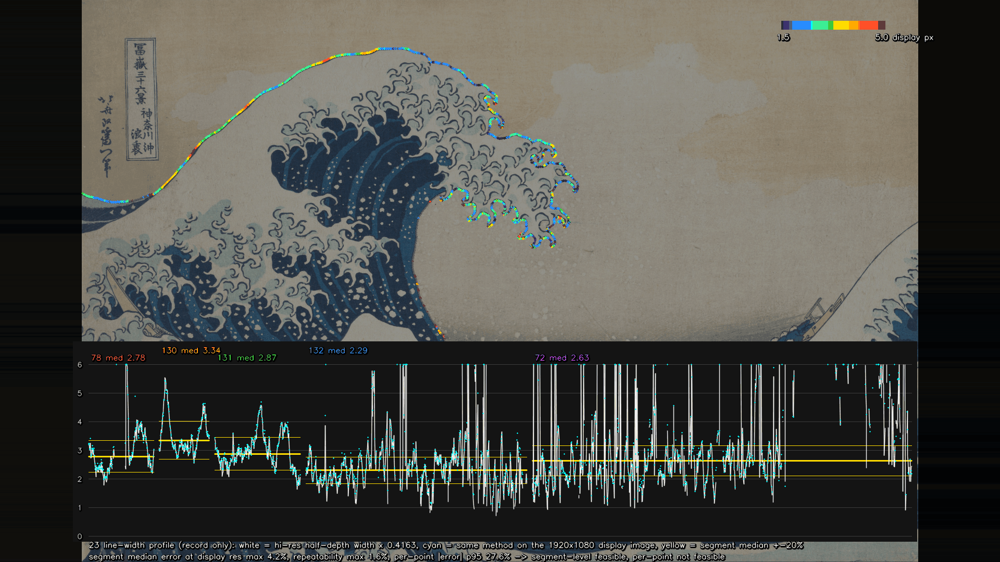

### 「編号」→「番号」

`Tools/PaintingTruth` のコードとJSON（truthlib.py、extract.py、evaluate.py、gate_part2.py、run_af23_part2.ps1、painting_truth.json、manual_annotations.json、unity_gate.json、生成される targets/ のJSON）と、Unityの `AF23CalibrationGate.cs`・`AF23GateFlat.shader` の文字列とコメントを「番号」にした。回し直した後、これらのファイルに「編号」が残っていないことを検索で確かめた。Unityの描画で書き出すIDマップの説明文も「番号」になったことを確かめた。

### 較正門の回し直し（[23_gate.json](../Evidence/ArtFirst/23/23_gate.json)、しきい値は変えていない）

| 項目 | 基準 | v0.2 | （v0.1） | 判定 |
| --- | --- | --- | --- | --- |
| Sharma 2005 のCIEDE2000 34組 | 誤差 < 1×10⁻⁴ | 4.95×10⁻⁵ | 4.95×10⁻⁵ | 合格 |
| 原画と自身 | 0 px | 0（26測定） | 0 | 合格 |
| 3.0 px 平行移動 | 3.0 ± 0.1 px | 3.000〜3.029 | 3.000〜3.029 | 合格 |
| 平塗り色区の読み戻し：numpy | ΔE00 < 0.5 | 0.306（空下） | 0.288 | 合格 |
| 目標からCannyエッジまで ≤1旧参照px | ≥ 95% | 99.14% | 98.68% | 合格 |
| Unity 5点標識と numpy 投影 | ≤ 0.5 px | 最大 0.023 px | 0.023 | 合格 |
| 平塗り色区の読み戻し：Unity | ΔE00 < 0.5 | 最大 0.306（12色とも8bit値が入力と一致） | 0.288 | 合格 |
| 既存のUnity記録とのカメラ照合（補助） | — | Euler差 1.3×10⁻⁵° | 同じ | 合格 |

- **Canny支持率の単位**：参照画像が高解像度になったので、「1参照px」を凍結時の大きさ（1旧参照px = 3.2151高解像度px = 1.338表示px）のまま使い、Cannyの平滑σ（0.8→2.572）と閾値（40/120→12.44/37.32）も同じ物理的な大きさに換算した。読み替えて「1高解像度px以内」とすると割合は90.84%で、95%に届かない（記録のみ。区間別には132が87.4%、72が88.6%、78が97.6%、130・131が100%）。どちらの読み方を採るかは、利用者の確認事項として報告する。
- **原画と自身の0 px**：最初の実行では、空上の色のΔE00が0.0001残って不合格になった。調色板のLabを小数4桁に丸めて保存していたためで、測り方の問題ではない。小数6桁で保存するように直して回し直し、0になった。しきい値は変えていない。
- 門を回した時の真値：`truth_manifest.json` 8c99033e…、`painting_truth.json` 392860eb…。評価器はこの2つが今と同じときだけ `provisional: false` を出す。
- 記録のみ：原画をID画像（3840×2160）にして読み戻した主浪5区間の誤差は0.16〜0.34 px（v0.1は0.24〜0.44）。原画マスクの斜め3 px移動は区間ごとに2.41〜3.02 px（132が2.41）。色モードで原画そのものを評価すると、再標本化と手動の障壁がないことで境界のずれる所が変わった。v0.1で大きかった132・72・富士の稜線・暗い空（81.7〜95.6 px）は2.7〜44.4 pxに下がったが、78が145.5 px、130が246.2 pxになった（色モードでは輪郭の合否を出さない）。

**真値の完全性（記録のみ、水色を追加）**：claw_zoneの中で、色だけで「白い水」（平滑L\*≥95、a\*≤−0.5、b\*≤9）と「水色」（70≤L\*<95、a\*≤−4.5、b\*≤8。修正2回目で追加）とみなす画素を数えた（高解像度で白84,334px、水色67,605px。水色の規則に当たる画素のうち真値の空の中は試算で12px）。

| 空 | 白が水側にある割合（空側の塊） | 水色が水側にある割合（空側の塊） |
| --- | --- | --- |
| 真値v0.2 | 89.5%（4塊、5,531px） | 99.98%（0塊） |
| 対照：手動の障壁4本を外す | 89.5%（4塊） | 99.98%（0塊） |
| 対照：途切れの閉じも外す | 0.01%（37塊） | 0.45%（59塊） |
| 参考：真値v0.1を同じ規則で数える | 89.2% | 99.35%（1塊、389px、旧参照px (572, 139)＝波頭上部の爪の入り込み） |

白の空側の4塊は、右上の淡い空2つ（旧参照px 約 722, 107 と 715, 96、藍線のない空）、爪の鉤の中の小さな白1つ（約 556, 302、v0.1と同じ所）、唇の下の空域の淡く白い所1つ（約 661, 390、20.2旧参照px²で塊の下限20をわずかに超えた）で、どれも空か、色だけでは空と区別しにくい所である。v0.1の波頭上部の爪の入り込みは白の規則では見えず、水色の規則で1塊として出る。v0.2では0になった。

### M1 Revision01 の基線（真値v0.2で回し直し、記録のみ）

| 項目 | v0.2 最大／p95（表示px） | v0.1 |
| --- | --- | --- |
| 78 | 404.65／382.99 | 404.7／383.1 |
| 130 | 48.70／45.12 | 50.2／46.0 |
| 131 | 39.94／34.17 | 41.0／34.4 |
| 132 | 248.88／239.50 | 248.5／239.2 |
| 72 | 404.46／293.25 | 404.6／292.9 |
| 71 | 404.46／299.60（IoU 0.690） | 404.6／299.3（0.689） |
| 76 空下の色 ΔE00 | 27.64 | 27.64 |
| 212 空上の色 ΔE00 | 3.74 | 3.71 |
| 74・161 富士の稜線 | 156.07／50.88 | 155.9／50.7 |
| 157 左奥船 | 157.73／122.78 | 169.4／143.1 |

評価器の判定（78・130・131・132・72・71・76・213が不合格、212が合格）はv0.1と同じ。M1 Revision01は判定の対象ではなく、出発点の記録である。値は [23_baseline_M1R01_metrics.json](../Evidence/ArtFirst/23/23_baseline_M1R01_metrics.json)。

### 番号24のt\*を真値v0.2で評価し直した値（記録のみ）

番号24（修正1回目）が保存したt\*の描画（`Unity/Build/ArtFirst/24/24_painting_tstar_direct.png`、0faf8e5e…、24の証拠 `24_painting_tstar.png` と同じバイト列）とID画像（`24_painting_tstar_ids.png`、ab91aa4f…）を、評価器のIDモード（包絡版）で測り直した。24のファイルは変えていない。値は [23_recheck24_metrics.json](../Evidence/ArtFirst/23/23_recheck24_metrics.json)、偏差図は [23_recheck24_overlay.png](../Evidence/ArtFirst/23/23_recheck24_overlay.png)。

| 項目 | 真値v0.2 最大／p95（表示px） | 最大の位置 | 24の記録（真値v0.1） |
| --- | --- | --- | --- |
| 78 | 0.76／0.64 | (318, 352) | 0.82／0.52 |
| 130 | 0.51／0.38 | (358, 308) | 0.72／0.48 |
| 131 | 0.67／0.53 | (724, 94) | 0.71／0.55 |
| 132 | 1.05／0.62 | (951, 185) | 0.86／0.54 |
| 72 | 9.54／3.42 | (1107, 376) | 10.54／4.31 |
| 71（参考） | 43.47／16.03（IoU 0.975） | (1045, 744) | 42.99／16.37（IoU 0.976） |
| 132 爪入り版（記録） | 43.77／32.73 | — | 43.92 |
| 72 爪入り版（記録） | 36.63／24.76 | — | 36.94 |

- 差は物差し（真値）の違いで、24の形が良くなったのでも悪くなったのでもない。72の最大は位置が (1080, 395) から唇先端のすぐ下 (1107, 376) へ移った。唇先端の点が2.5px下がって132と72の境が動いたことと、唇の下側の境界がサブピクセルで動いたことによる。72はまだ4pxを超えている。
- 24の `metrics.json` は真値v0.1で評価した記録のままである。24の生成器の入力（包絡版の折れ線）はv0.2で変わったので、K\*は番号26でv0.2から作り直す。

## 修正1回目（2026-09-26）：唇の右端の爪群と真値v0.1

**指摘**：真値v0の空マスクは、唇の右端の爪群（参照px 約598〜712, 190〜264、表示px 約958〜1108, 257〜353）を空として扱っていた。爪群の上縁の藍線が参照px 約601〜606, 198〜199で淡く途切れており、上端からの塗りつぶしがそこから水の内側（白・水色の面）へ流れ込んだ。このため爪入り版の132は爪群の内側を回り込み、包絡版の132も爪群の下へくぼんでいた。

**修正**：拡大図（6〜20倍、1参照px格子）で途切れを確かめ、[manual_annotations.json](../../Tools/PaintingTruth/manual_annotations.json) に手動の障壁3本（`barriers_ref`、太さ2参照px、`source: "manual"`）を加えた。障壁は色の障壁と同じ扱いで、塗りつぶしも境界の詰めも越えない。流れ込みの経路は、内側の水の点から外の空までの最短経路（4近傍）で探した。1本目（上縁の途切れ）だけでは、塗りつぶしがまだ爪の間の空の入り込みと小さな渦の脇から入った。3本で、試した水の点11か所すべてが外の空から切り離された。

| 障壁 | 参照px | 閉じた所 |
| --- | --- | --- |
| `lip_cluster_top_gap` | (597.5, 199.5)→(609.0, 197.4) | 爪群の上縁の藍線の途切れ（線の中心に沿う） |
| `lip_cluster_pocket_inner` | (650.5, 239.5)→(656.0, 240.8) | 爪の間の空の入り込みの奥。短い爪と下側の藍線の間の約3 pxの開き |
| `lip_cluster_curl_right` | (690.5, 240.0)→(693.0, 244.0) | 下側の藍線の右端と小さな渦の右側の間の切れ目 |

爪の間の空の入り込み（参照px 約656〜690, 218〜238）は空のまま残した。色（中央値 L\* 93.1、a\* 0.1、b\* 12.1）が外の空（93.8、0.5、11.3）と同じで、爪群の内側の水（97.7、−1.9、8.4）とは違うためである。

**claw_zone 全体の確認**：障壁なし（v0と同じ規則）と真値v0.1の空を、claw_zone全体で斜線の図にして比べた（この時点の図は、コミット 6b8b1ca の同名ファイル `23_claw_zone_sky_tint.png`。a94df11 まで同じ）。さらに6倍の拡大6枚でclaw_zoneを覆って見た。この時点ではほかの入り込みを見つけられなかったが、コミット前の独立レビューで、波頭上部の爪1か所（参照px 約569〜584, 133〜157、約145参照px²）に空の入り込みが残っていることが分かった（下の「未実施・保留」を参照）。空から水に変わった画素は6,593参照px²で、唇の右端の爪群から左の白い面と下の唇へ続く1つの連結領域（参照px x 535〜705, y 161〜292）である。水から空に変わったのは1画素（(675, 281)、小さな閉じた空域の扱いの差）だけだった。

下の2枚の図のファイルは修正2回目で作り直した（「修正2回目」の節の図と同じファイル）。今の唇の拡大は、高解像度原画から直接描いた真値v0.2の図（緑はv0.1の空境界）である。claw_zoneの図は、左が真値v0.1、右がv0.2である。修正1回目の時点の図（旧原画の真値v0.1の唇の拡大と、左が障壁なし・右が真値v0.1のclaw_zoneの図）は、コミット 6b8b1ca の同名ファイルにある（a94df11 まで同じ）。


**変わった値**：

| 項目 | v0（修正前） | v0.1（修正後） |
| --- | --- | --- |
| 132 の長さ（包絡版） | 516.9 表示px | 469.0 表示px（816点のうち19点が障壁沿い） |
| 132 の長さ（爪入り版） | 1505.9 表示px | 903.6 表示px（1602点のうち83点が障壁沿い） |
| 72 の長さ（包絡版／爪入り版） | 858.7／1387.2 | 858.7／1386.9 |
| Canny 支持率（爪入り版の全区間） | 98.56%（132：97.16%） | 98.68%（132：96.63%） |
| 調色板の白・水色（8bit sRGB） | 250,245,226・193,212,200 | 251,246,227・193,212,199（`unity_gate.json` の色区も合わせて変えた） |
| M1基線の132（最大／p95） | 248.5／237.7 | 248.5／239.2 |

唇先端（表示px (1107.9, 352.9)）、78・130・131、71の弦、空上・空下の調色板は変わらなかった。

**レビューで見つかったほかの欠陥の修正**：

- `.gitattributes` に、23・24の真値・生成器・証拠・Unity資産を元bytesで保持する `-text` の規則を加えた（18・19と同じ形）。記録したSHA-256とコミットするブロブが一致することを、23・24の未追跡ファイルと `.gitattributes`・`.gitignore` の計79ファイルで確かめた（`git hash-object --path` と `--no-filters` の値がすべて一致）。
- `.gitignore` に `/Tools/PaintingTruth/build/` を加えた。
- [painting_truth.json](../../Tools/PaintingTruth/painting_truth.json) の古い状態の記述（「第1部で凍結」「Unity標識は未実施」）を直し、versionをv0.1にして経緯を `version_history_ja` に書いた。原画・写像・カメラ・時間軸・判定規則の数値は変えていない。
- 較正門の記録 `23_gate.json` に、門を回した時の `truth_manifest.json` と `painting_truth.json` のSHA-256を入れた。評価器は、この2つが今のファイルと違えば `provisional: false` を出さない（門を回し直すまで暫定）。
- 評価器の `metrics.json` に書くコマンドを、リポジトリ内ではリポジトリ根からの相対パスにした。出力先や入力がリポジトリと別のドライブにあっても止まらないようにした（その場合は絶対パスを記録する）。
- `AF23CalibrationGate.cs` の、後の番号24を参照していたコメントを直した。

## 固定した基準（[painting_truth.json](../../Tools/PaintingTruth/painting_truth.json)）

| 項目 | 固定値 | 補足 |
| --- | --- | --- |
| 原画 | v0.2：`Docs/References/Met_JP1847_DP130155.jpg`、3859×2594、SHA-256 `cbb9988f…fac36303`（v0.1まで：`Met_JP1847.jpg`、1200×807、`a7e06182…62cab0`。履歴として残す） | ICCなし。sRGB（D65）として扱う。旧原画は新原画の縮小で、裁ち落としは同じ（修正2回目） |
| 表示フレーム | 1920×1080。v0.2：倍率 1080/2594 = 0.416345、横オフセット 156.662 px（v0.1：1080/807 = 1.33829、157.026 px） | 原画は縦1080 pxいっぱい・幅1606.68 pxで中央に置く。左右の黒帯（x<157、x>1762）は採点しない。v0.1との表示位置の差は横だけで最大0.364 px |
| 座標 | 画素中心を整数とする配列添字系（x右、y下） | Unity viewport との対応：x = vx·1920 − 0.5、y = (1 − vy)·1080 − 0.5 |
| PaintingCam v1 | 位置 (0, 3, −62) → 注視点 (−2.5, 9.7, 4)、up = Y、縦画角26°、16:9、near 0.1、far 900 | 形成区間を通して固定（backlog 94） |
| 時間軸 | 予備2 s、形成10 s、定格5 s。**t\* = 12.0 s**（30 Hzで360フレーム目、60 Hzで720フレーム目） | 4 pxとΔE00はt\*だけで判定する。t\*は暫定 |
| 輪郭 | 表示px。ラベル付き対称Hausdorffの最大値 ≤4 px で合格。p95・p50も記録 | 被覆率をσ1.0 pxで平滑化し、0.5の等値線を点列にする。描画側の点は最も近い真値点のラベルへ割り当てる |
| 色 | CIEDE2000 ≤5。真値の色区マスクを半径3 pxの円で縮めた内側で、CIELABの成分ごとの中央値を比べる | 8bit sRGB → 線形 → XYZ(D65) → Lab |
| 線幅 | ±20%は記録のみ（judged: false） | 1200×807では±0.3参照px相当で測れなかった。v0.2で線幅プロファイルを測れるようになり、区間の中央値での判定は可能と確かめた（修正2回目）。判定を始めるかは番号36で決める |

### PaintingCam v1 の出所

新しく決めた値ではない。リポジトリにある比較カメラの値をそのまま使った。

- `Unity/Assets/GreatWave/Editor/M1CompositionBuilder.cs` 14–15行（`ComparisonPosition = (0,3,-62)`、`ComparisonTarget = (-2.5,9.7,4)`）、88–95行と169–177行（`fieldOfView = 26`、near 0.1、far 900、`LookAt`）。
- `Unity/Assets/GreatWave/Scripts/M1DesktopViewer.cs` 58–68行。視点0「原画比較視点」は`LookAt(target, Vector3.up)`を使う。
- `Docs/Evidence/M1/Revision01/15_revision_layout.json` の `comparisonCameraPosition` と `comparisonCameraTarget` が上の値と一致する（自己テストで照合した）。
- M1は1280×720で描画していた。v1は同じ16:9・縦26°を1920×1080で使う。

numpyの投影は、Unityが以前に記録した値と一致した。`Docs/Evidence/M1/12_placement.json` の `comparisonRotation` (354.20758, 357.83075, 0) との差は1.3×10⁻⁵°。富士頂点 (37, 15.9, 420) の投影位置は `fujiApexViewport` と1.1×10⁻⁵ px 差だった。ただし富士頂点の世界座標は、配置コードとモデル寸法からの推定である。これは既存記録との照合にすぎず、第2部のUnity 5点標識による較正の代わりにはならない。

## 取り出した目標（[extract.py](../../Tools/PaintingTruth/extract.py)）

この節の手順と数値は真値v0.1（旧原画1200×807、参照pxは旧原画の画素）の時点の記録である。v0.2では同じ手順を高解像度px に換算して使い、途切れの閉じと障壁1本を加えた（上の「修正2回目」）。ただし、この節の図（`23_targets_overlay.png`、`23_claw_zone_detail.png`、`23_palette_regions.png`）は修正2回目で作り直したv0.2の図で、調色板の図に書いた値もv0.2の値である（下の調色板の表のv0.1の8bit値とは、各成分で最大1段違う）。v0.1の時点の図は、コミット 6b8b1ca の同名ファイルにある。

入力は原画と手入力の注記 [manual_annotations.json](../../Tools/PaintingTruth/manual_annotations.json) だけで、旧試作は参照していない。

1. **空マスク**：色の障壁（b\* < −4 または L\* < 30）と勾配の障壁（平滑L\*の勾配 > 6/px）を置き、上端から塗りつぶす。唇の右端の爪群では藍線が淡く途切れているので、手動の障壁3本（修正1回目、上の表）を色の障壁に加える。その後、局所の空の明度との差が12以内の障壁画素を2回まで空に戻し、線の外縁へ寄せる。空に囲まれた1200参照px²未満の成分（飛沫の点など）は空にする。題箋と落款は手で指定した多角形で空に塗る。
2. **爪入り版**：空マスクの境界そのもの。爪の間で空とつながらない閉じた小空域は水側に入る。
3. **爪なし包絡版**：手で決めた `claw_zone` の中だけ、水マスクに閉じ（半径20参照px）→開き（半径10）→ガウス平滑（σ4）をかけた形に置き換える。`claw_zone` が外周と交わるのは、波頭 (455, 70) と内壁 (478, 337) 付近の2か所だけにした。それ以外の区間は爪入り版と同じになる。
4. **区間分け**：外周を左端 → 波頭 → 唇先端の順に、手で決めた境界点で78・130・131・132に分け、唇先端から内壁の下端 (577, 548) までを72とした。唇先端は包絡線の `claw_zone` 内でxが最大の点を自動で取った（表示px (1107.9, 352.9)、参照px (710.4, 263.6)）。

| 区間 | backlog | 内容 | 包絡版の長さ（表示px） | 由来 |
| --- | --- | --- | --- | --- |
| 78 | 78 | 左端から斜め上へ続く外形 | 235.1 | 自動（空境界）＋手動（区間境界） |
| 130 | 130 | 左側の傾き | 179.4 | 同上 |
| 131 | 131 | 上側へのつながり | 307.8 | 同上 |
| 132 | 132 | 船側への曲がり | 469.0（爪入り 903.6） | 自動＋手動（claw_zone内は形態処理の包絡。唇の右端の一部は手動の障壁に沿う） |
| 72 | 72 | 上側から下側へ続く内側輪郭 | 858.7（爪入り 1386.9） | 自動＋手動（claw_zone内は形態処理の包絡） |

区間の境界点は暫定で、利用者の確認後に動かすことがある。130/131の境界点は輪郭から6.9 px離れていたため、最も近い輪郭点へ寄せた。**自動抽出は唇の右端の爪群で安定しなかった**（v0では藍線の途切れから空が水の面へ流れ込んだ。上の「修正1回目」）。折れ線を最初から最後まで手でなぞった区間はないが、132には手動の障壁に沿って決まった点がある（爪入り版1602点のうち83点、包絡版816点のうち19点。各区間の `n_points_on_manual_barrier`）。そのほかの手作業は、境界点と多角形（題箋・落款の塗り、claw_zone、71の弦、船と富士の範囲、調色板の範囲）である。障壁の置き方は、上の拡大図で利用者に抜き取り確認してもらう（作業計画の23の損切り手順）。

その他の目標：

- **71（唇の下に開く空域）**：空 ∩ `region71_clip`。右辺のx=690は、唇の最下の爪先（約688, 347）を通るように決めた約束上の弦で、この辺の上の点は採点しない。IoUも記録する。
- **74/161（富士の稜線）**：`fuji_zone` 内の空境界。報告項目。
- **76/213（暗い空と明暗の移行線）**：L_mid = (空上L\* + 空下L\*)/2 = 73.12。空の画素だけで平滑化（σ6 px）したL\*がL_midより小さい部分を暗い空とする。参照y ≥ 300の範囲に限り、閉じた穴は埋め、1500 px²未満の島は除く。
- **75/157/159（船）**：船ごとの範囲の中の黄土色（b\* > 13.5、55 ≤ L\* ≤ 96）。漕ぎ手は含まない。左奥船（157）は泡と区別しにくく、断片的にしか取れていない。報告項目で、番号27で作り直す。

**調色板**（[palette.json](../../Tools/PaintingTruth/targets/palette.json)。表示フレームで3 px収縮した内側の中央値）：

| 色 | L\* | a\* | b\* | 8bit sRGB | 画素数 |
| --- | --- | --- | --- | --- | --- |
| 白・生成り | 96.70 | −1.64 | 9.75 | 251, 246, 227 | 93,088 |
| 水色 | 83.06 | −8.69 | 4.01 | 193, 212, 199 | 6,546 |
| 藍中 | 42.19 | −5.45 | −29.43 | 41, 105, 148 | 3,991 |
| 藍濃 | 25.72 | 0.59 | −23.10 | 33, 62, 95 | 26,793 |
| 空上 | 92.32 | 0.09 | 19.61 | 248, 231, 195 | 180,262 |
| 空下（水平線際） | 53.92 | −1.39 | 3.09 | 129, 130, 124 | 18,620 |
| 船の黄土 | 80.34 | 7.82 | 22.22 | 229, 193, 158 | 19,034 |
| 富士の雪 | 97.50 | −2.19 | 9.60 | 251, 248, 229 | 4,334 |
| 富士の山肌 | 27.47 | 0.36 | −20.35 | 42, 66, 96 | 365 |

色クラスは、主浪の非空画素に対するk-means（k=5）の中心を初期値にし、決定的なLloyd反復で確定した。5番目のクラスは輪郭線と色区の境の混色なので、調色板には入れていない。原画の藍の輪郭線の幅は、外周78〜131に沿った中央値で3.0表示px（2.24参照px）、p10〜p90は2.3〜4.0表示pxだった（記録のみ）。

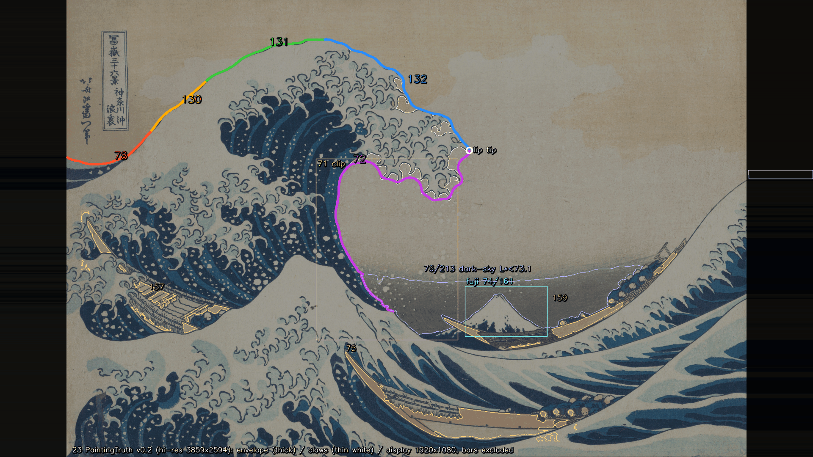

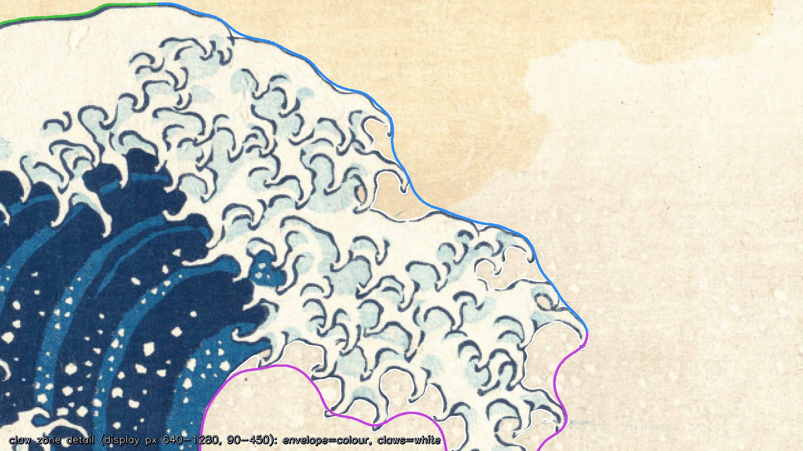

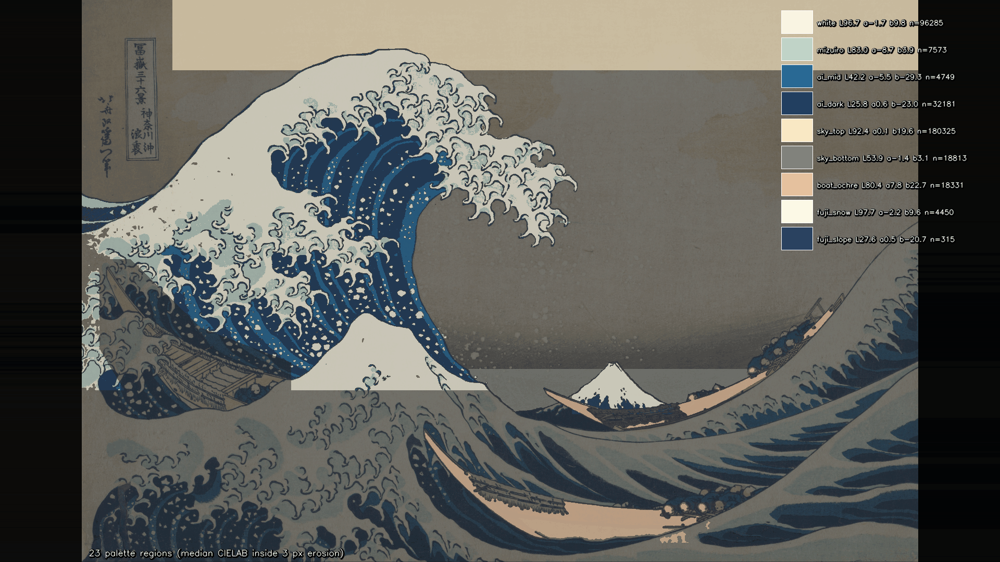

図は人が確かめるための重ね図で、容量を抑えるため256色のPNGにしている（線と文字の色はそのまま残した）。測定には使わない。

## 評価器（[evaluate.py](../../Tools/PaintingTruth/evaluate.py)）

- 入力：1920×1080の描画PNG。ID画像（1920×1080または3840×2160、領域ごとに単色）と `idmap.json` を渡すとIDモードになる。3840×2160の場合は2×2の平均で被覆率にする。
- ID画像がない場合は色モードになり、原画と同じ空抽出を描画にかける（手動の障壁は使わない。障壁は原画に固有の注記だからである）。自己テストで、原画を表示→参照→表示と再標本化しただけでも細い輪郭線が切れ、空が中船の船体へ漏れることがわかった。v0.1では、障壁のない色モードで唇の右端の爪群の漏れがそのまま再現される（包絡版の132で94.4 px、72で81.7 px、爪入り版の132で62.9 px、富士の稜線で95.4 px、暗い空で95.6 px。記録のみ）。このため、**色モードでは輪郭の合否を出さない**（`not-judged`とし、項目は`incomplete`になる）。色のΔE00は両方のモードで判定する。
- 出力：`metrics.json`（項目番号 → 値 → pass / fail / record-only / incomplete）と偏差の重ね図（緑 ≤2 px、黄 ≤4 px、赤 >4 px）。判定は包絡版を既定とし（`--judged-version`）、爪入り版は `78_claws` などの名前で記録する。判定を確定値として扱うのは、較正門（`Docs/Evidence/ArtFirst/23/23_gate.json`）が全項目合格で、かつ門を回した時の `truth_manifest.json` と `painting_truth.json` のSHA-256が今のファイルと同じときだけである。そうでなければ `provisional: true` と理由（`gate.refused_ja`）を出力する（第2部で追加、修正1回目で真値の照合を追加）。
- 修正2回目の変更：参照画像を高解像度にし、表示フレームへの縮小を3×3超標本化にした。描画側の線幅（記録のみ）は真値の線幅プロファイルと同じ点・同じ半深さ全幅の測り方にし、区間ごとに真値の中央値との比を出す。自己テストの真値の完全性に水色の規則と、途切れの閉じも外した対照を加えた。Canny支持率は凍結時の大きさ（1旧参照px）で判定し、1高解像度pxの割合も記録する。

## 自己テスト（第1部の較正項目）

この節の表と本文の数値は真値v0.1の時点の記録である。証拠の図のファイルは修正2回目で作り直したので、今はv0.2の図になっている。v0.2の値は上の「修正2回目」の節にある。

`py -3.10 Tools/PaintingTruth/evaluate.py --selftest` の結果（[selftest.json](../Evidence/ArtFirst/23/selftest.json)）：

| 項目 | 基準 | 結果 | 判定 |
| --- | --- | --- | --- |
| Sharma 2005 のCIEDE2000 34組 | 誤差 < 1×10⁻⁴ | 最大 4.95×10⁻⁵（入れ替えても同じ） | 合格 |
| 原画と自身 | 0 px | 輪郭・色の26測定すべて 0 | 合格 |
| 3.0 px 平行移動 | 3.0 ± 0.1 px | 主浪5区間の和集合：x方向・y方向とも3.000（包絡版・爪入り版）。4×4超標本化した円の斜め移動：3.029 | 合格 |
| 平塗り色区の読み戻し | ΔE00 < 0.5 | 最大 0.288（空下。8bit量子化の誤差のみ） | 合格 |
| 目標からCannyエッジまで ≤1参照px の割合 | ≥ 95% | 爪入り版の全区間で 98.68%（132：96.63%、72：99.35%） | 合格 |
| 既存のUnity記録とのカメラ照合（補助） | — | Euler差 1.3×10⁻⁵°、富士頂点 1.1×10⁻⁵ px | 合格 |
| Unity 5点標識と numpy 投影 | ≤ 0.5 px | 第2部で実施（最大 0.023 px） | 合格（下の第2部） |
| 真値の完全性（記録のみ、修正1回目で追加） | — | claw_zone の白い水の色の画素のうち水側 89.1%（障壁なしの対照 60.2%） | 記録のみ |

記録のみの結果もある。原画マスクを斜めに3 px（サブピクセル）動かした場合、区間ごとの値は2.78〜3.06 px（2.78は132）だった。爪入り版の和集合は3.11 pxで、細い爪を線形補間で動かした影響と考えられる。判定には使っていない。真値を3840×2160のID画像にして読み戻すと、主浪5区間は0.24〜0.44 px、71は1.29 px、左奥船は4.21 px（細い断片のため）になった。

**真値の完全性（記録のみ）**：claw_zone の中で、色だけで「白い水」とみなす画素（参照解像度で σ1 px 平滑した L\* ≥ 95、a\* ≤ −0.5、b\* ≤ 9）を数え、真値（爪入り版）で水側に入っている割合を出した（`selftest.json` の `truth_completeness_record`）。v0.1では7,726画素のうち89.1%が水側で、空側に残った20参照px²以上の塊は3つ（計443 px²）だった。右上の淡い空（参照px 約700〜740, 93〜120、藍線のない空）が2つ、下向きの爪の鉤の中の小さな白（約554〜559, 299〜306、24 px²、空か水か判別しにくい）が1つで、どれも直していない。手動の障壁を外した対照（v0と同じ規則）では60.2%で、爪群の漏れ（約569〜632, 195〜237 の840 px² など）を含む11の塊（計2,280 px²）が出る。淡い空のように色だけでは空と区別できない所も数に入るため、合否には使わない。

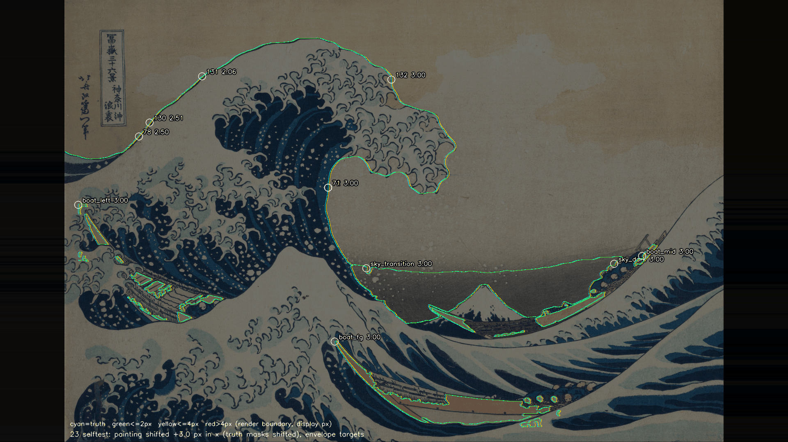

## 第2部：較正門のUnity項目

この節の表と本文の数値は真値v0.1の時点の記録である。証拠の図のファイルは修正2回目で作り直したので、今はv0.2の図になっている。v0.2の値は上の「修正2回目」の節にある。

[AF23CalibrationGate.cs](../../Unity/Assets/GreatWave/ArtFirst/Editor/AF23CalibrationGate.cs) をUnity 6000.4.3f1のbatchmodeで実行した（Direct3D11、RTX 3080、Linear色空間、Built-in RP）。保存しない空のシーンを作り、PaintingCam v1は `painting_truth.json` を直接読んで組んだ。標識と色区の定義は [unity_gate.json](../../Tools/PaintingTruth/unity_gate.json) にある。描画は `Camera.Render → RenderTexture → ReadPixels → PNG` のPCオフスクリーン描画で、測定と判定は [gate_part2.py](../../Tools/PaintingTruth/gate_part2.py) が行う。

**世界標識5点**：半径8 px相当の円板を、画像面に平行（カメラと同じ回転）に置いた。画像面に平行な平面の投影は相似変換になるので、円の像の中心が中心点の投影と一致する。線形のRT（sRGB変換なし）にMSAA 8x・1920×1080で描き、被覆率で重み付けた重心を求めた。標識は点灯している色成分の組で見分けており、numpyの予測位置は探索に使っていない。

| 標識 | 世界座標 | 視点深度 | 描画の重心（表示px） | numpy投影（表示px） | 差 |
| --- | --- | --- | --- | --- | --- |
| A 左上 | (−22, 24, 6) | 70.6 m | (315.984, 76.985) | (315.995, 76.994) | 0.014 px |
| B 右上 | (20, 30, 80) | 143.1 m | (1373.897, 333.340) | (1373.892, 333.329) | 0.011 px |
| C 左下・近 | (−6, 1.6, −44) | 18.0 m | (268.147, 959.836) | (268.157, 959.833) | 0.010 px |
| D 右下 | (11, 1.5, −20) | 41.2 m | (1673.963, 862.387) | (1673.970, 862.389) | 0.007 px |
| E 富士頂・遠 | (37, 15.9, 420) | 479.1 m | (1229.074, 713.495) | (1229.076, 713.472) | 0.023 px |

最大0.023 px（基準 ≤0.5 px）で合格。画素中心を整数とする座標の約束と、上下・左右の向きがUnityとnumpyで一致していることも、これで確かめられた。記録のみの値は次のとおり。MSAAなしで描いた同じ標識は最大0.112 px。Unityの `WorldToViewportPoint` の数式だけで比べた差は最大0.00016 px。`worldToCameraMatrix` と `projectionMatrix` の差は最大2.8×10⁻⁷（floatとfloat64の差）。

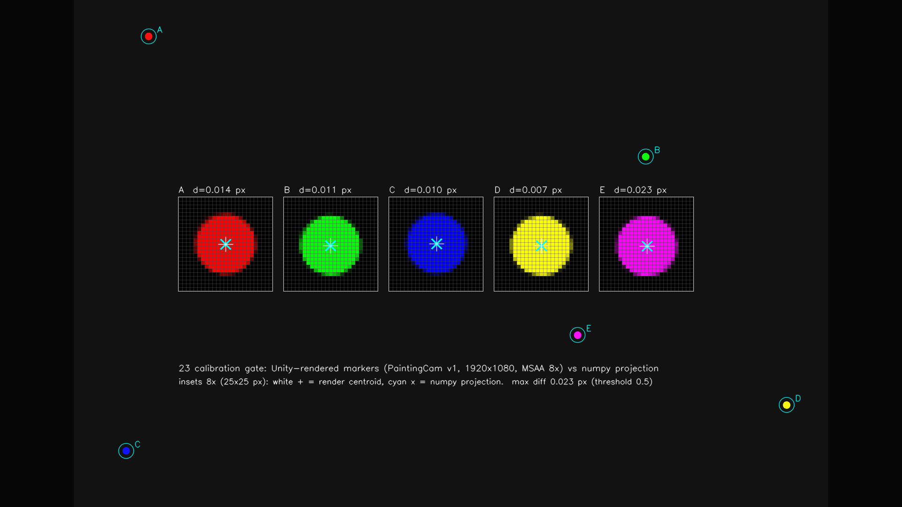

**平塗り色区**：調色板9色と灰3段を、カメラから5 mの画像面に平行な四角形として無光照で描いた。色は `Color` 型のプロパティに8bit sRGBの値で渡した。Linear色空間ではUnityがこれを線形に直してシェーダーへ渡し、sRGBのRTへ書くときにsRGBへ戻す。経路は基線の色画像と同じにした（sRGBのRT、MSAA 8x → 解決 → RGB24 → PNG）。色区の縁から6 px内側の中央値を、調色板のLab（灰は入力値）と比べた。

- 12色すべてで、読み戻した8bit値が入力と完全に一致した（最大差0。色区の画素数も四角形の画素数と一致）。
- 調色板に対するΔE00は最大0.288（空下）で、基準 <0.5 を満たし合格。0でないのは、調色板のLabを8bit sRGBへ丸めた分で、第1部のnumpyの平塗り試験と同じ値である。
- 対照（記録のみ）：同じ色区を線形のRTへ描くと、sRGBへの符号化が抜けてΔE00は6.5〜26.2になった。色空間の扱いを誤れば、この試験で検出できる。

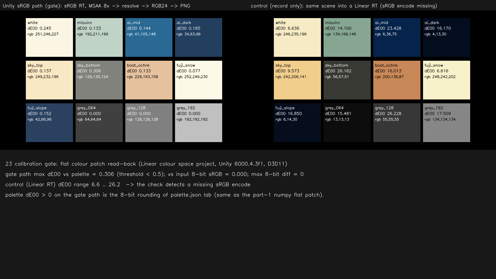

### 較正門の判定（[23_gate.json](../Evidence/ArtFirst/23/23_gate.json)）

| 項目 | 基準 | 結果 | 判定 |
| --- | --- | --- | --- |
| Sharma 2005 のCIEDE2000 34組（第1部） | 誤差 < 1×10⁻⁴ | 4.95×10⁻⁵ | 合格 |
| 原画と自身（第1部） | 0 px | 0 | 合格 |
| 3.0 px 平行移動（第1部） | 3.0 ± 0.1 px | 3.000〜3.029 | 合格 |
| 平塗り色区の読み戻し：numpy（第1部） | ΔE00 < 0.5 | 0.288 | 合格 |
| 目標からCannyエッジまで ≤1参照px（第1部） | ≥ 95% | 98.68% | 合格 |
| Unity 5点標識と numpy 投影（第2部） | ≤ 0.5 px | 最大 0.023 px | 合格 |
| 平塗り色区の読み戻し：Unity（第2部） | ΔE00 < 0.5 | 最大 0.288 | 合格 |
| 既存のUnity記録とのカメラ照合（補助） | — | Euler差 1.3×10⁻⁵° | 合格 |

**較正門は全項目合格で閉じた（真値v0.1で回し直した結果）。** 番号26の前提（作業計画4.2節：番号26の着手前に全項目の合格が必要）を満たす。しきい値は計画のまま変えていない。これ以降、評価器は `23_gate.json` を読み、全項目合格で、かつ門を回した時の真値（`truth_manifest.json` 42d4a92c…、`painting_truth.json` 578116e0…）が今と同じなら `provisional: false` を出力する。

### 較正門が確かめないこと

較正門が確かめるのは、評価器の測り方（CIEDE2000の式、輪郭距離、平行移動、画面写像、Unityの投影と色の経路）と、真値の折れ線が原画のエッジに乗っているか（Canny支持率、つまり精度）である。**真値が原画の水の面を漏れなく含むか（完全性）は判定しない。** 真値v0は唇の右端の爪群を空として抜いていたが、抜けた所の境界も藍線に沿っていたため、Canny支持率は98.56%で合格していた。完全性は、自己テストの記録のみの項目（上の「真値の完全性」、`23_gate.json` の `records.truth_completeness`）と、人が拡大図で確かめることで見る。この記述は `23_gate.json` の `scope_ja` と `painting_truth.json` の `calibration_gate_ja.scope_ja` にも書いた。

## 第2部：M1 Revision01の基線差

この節の表と本文の数値は真値v0.1の時点の記録である。証拠の図のファイルは修正2回目で作り直したので、今はv0.2の図になっている。v0.2の値は上の「修正2回目」の節にある。

`M1_StaticComposition_Revision01.unity` を開き、M1の視点0「原画比較視点」にしたうえで、同じシーンをPaintingCam v1から描いた。視点0のカメラとPaintingCam v1の位置差と角度差はどちらも0だった。背景色（空）はシーンのカメラの値 (0.90, 0.85, 0.71) を使った。

- 色画像：1920×1080、sRGBのRT、MSAA 8x。
- ID画像：3840×2160、MSAAなし。空はカメラの背景、三船は各船の子孫、ほかはすべて other とした。マテリアルはメモリ上で差し替えて戻し、資産は書き換えていない。
- シーンは保存していない。シーンと依存資産24件のSHA-256は描画の前後で一致した。シーンのGitブロブも HEAD と同じである。
- 評価器v0のIDモードで測った（包絡版で判定）。較正門の合格後に評価したので `provisional: false` になっている。下の「評価器の判定」は評価器がこの描画に出した値である。M1 Revision01は判定の対象ではなく、番号23の成果としては出発点の記録（record-only）として扱う。

| 項目 | 目標 | 最大（表示px） | p95 | 真値→描画の最大 | 評価器の判定 |
| --- | --- | --- | --- | --- | --- |
| 78 | 左端から斜め上への外形 | 404.7 | 383.1 | 61.7 | 不合格 |
| 130 | 左側の傾き | 50.2 | 46.0 | 47.6 | 不合格 |
| 131 | 上側へのつながり | 41.0 | 34.4 | 35.7 | 不合格 |
| 132 | 船側への曲がり | 248.5 | 239.2 | 140.6 | 不合格 |
| 72 | 内側輪郭 | 404.6 | 292.9 | 118.2 | 不合格 |
| 71 | 唇の下の空域（IoU 0.689） | 404.6 | 299.3 | 118.2 | 不合格 |
| 76 | 暗い空の境界 | 描画側の境界なし（∞） | — | — | 不合格 |
| 76 | 空下の色 ΔE00 | 27.64 | — | — | 不合格 |
| 213 | 明暗の移行線 | 描画側の境界なし（∞） | — | — | 不合格 |
| 212 | 空上の色 ΔE00 | 3.71 | — | — | 合格 |
| 74・161 | 富士の稜線（記録のみ） | 155.9 | 50.7 | 53.1 | 記録のみ |
| 75 | 前景船（記録のみ） | 189.7 | 153.2 | 61.7 | 記録のみ |
| 157 | 左奥船（記録のみ） | 169.4 | 143.1 | 169.4 | 記録のみ |
| 159 | 中船（記録のみ） | 176.8 | 162.7 | 136.3 | 記録のみ |
| 162 | 富士の雪・山肌 ΔE00（記録のみ） | 9.02・5.27 | — | — | 記録のみ |
| 265 | 水色・藍中 ΔE00（記録のみ） | 66.23・50.97 | — | — | 記録のみ |

読み方の注意：

- 78・72・71の約405 pxは、どれも同じ点（表示px (442, 749)）から来ている。M1の弧の左の足元では、原画なら水のところに空が見えている。評価器は描画側の境界点を最も近い真値の区間へ割り当てるので、この空の境界が78・72・71に割り当てられた。原画の輪郭の側から見た差（真値→描画の最大）は、78で62 px、72で118 pxである。
- 132の248 pxは、M1の唇が原画より右（表示px (1353, 314)）へ張り出していることによる。真値v0.1で輪郭の値が変わったのは132・72・71のp95とp50だけで（132のp95は237.7→239.2）、最大値と判定は修正前と同じだった。色では、調色板の更新で265の水色（66.15→66.23）と162の富士の雪（9.01→9.02）が少し変わった。
- 表にない213の記録として、船の黄土の色のΔE00（34.29、記録のみ）も `metrics.json` の213に入っている。
- 76・213：M1の空は一様な単色なので、暗い空と明暗の移行線が描画側に存在しない。
- 212（空上の色）の3.71は、M1のカメラ背景色がたまたま原画の空上に近いためで、212の受入を意味しない。空の穹は番号27で作る。
- 爪入り版（記録のみ）は132が238.5 px、72が404.6 pxで、ほかは包絡版と同じだった。線幅（記録のみ）は16.0 pxと出たが、M1には藍の輪郭線がないため意味のある値ではない。
- 値の一覧は [23_baseline_M1R01_metrics.json](../Evidence/ArtFirst/23/23_baseline_M1R01_metrics.json) にある。番号23の [metrics.json](../Evidence/ArtFirst/23/metrics.json) でも、各項目の `baseline_M1R01` に入れた。

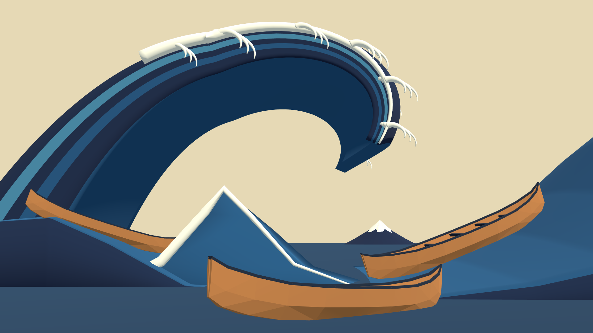

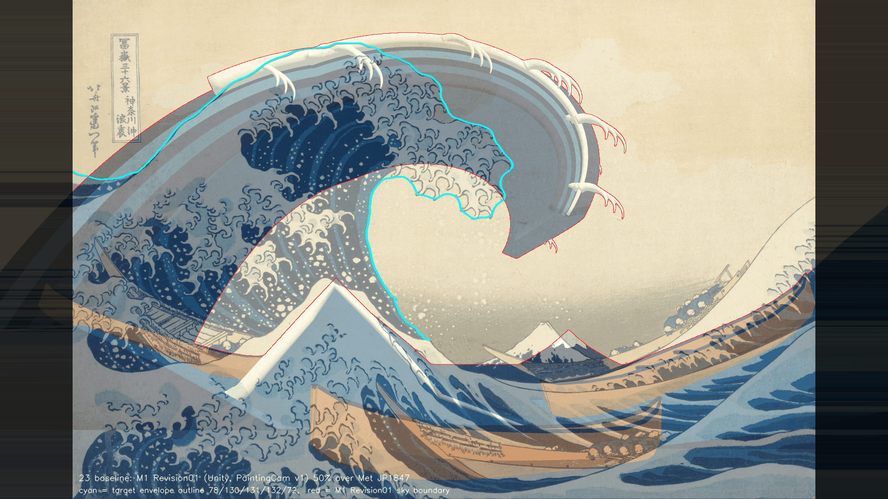

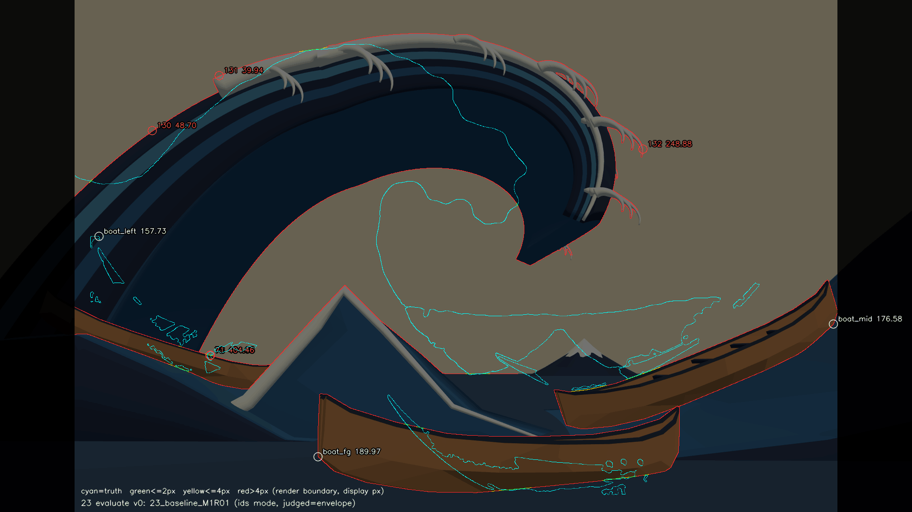

偏差図では、(442, 749) 付近で78・72・71のラベルが重なって読みにくい。値は上の表とJSONで確かめられる。

## 未実施・保留

- t\* = 12.0 sは暫定。区間の境界点（78/130/131/132）と71の弦（x=690）は、利用者の確認待ち。
- 包絡版のclaw_zone内は形態処理で作った滑らかな包絡で、爪の付け根を手で描いたものではない。本当に「爪なし」の形として使えるかは、番号24/26の生成器で確かめる。
- backlogの「水色」（73・263・265）が調色板の「水色」（淡い青灰）と「藍中」のどちらに当たるかは決まっていない。265は両方を記録のみとし、番号28で確定する。
- 船のマスクは黄土色の船体だけで、左奥船は断片的。74・75・157・159・161・162は計画どおり報告項目のままにした。
- 線幅は記録のみ。修正2回目で高解像度原画から測れるようになり、区間の中央値での±20%判定は可能、爪を含む132・72の点ごとの判定は不可と確かめた。判定を始めるかは番号36で決める。
- 較正門で確かめたのは、Unity Editor（Built-in RP、Linear、Direct3D11）のオフスクリーン描画の経路である。PCビルドとHMD（シングルパス・インスタンシング）での一致は確かめていない。HMDは未所持。
- 番号24の記録（`Docs/Evidence/ArtFirst/24/metrics.json` など）は真値v0.1で評価したもので、この番号の真値v0.2とは一致しない。24のファイルは変えていない（v0.2での再評価は上の「修正2回目」）。24のK\*は、番号26でv0.2の包絡版から作り直す。
- （修正1回目の記録）番号24 v0 のプレビューは、修正前の真値v0（`truth_manifest.json` ac4a13cb…、包絡版の132は爪群の下へくぼんだ形）から作り、較正門が閉じる前に評価したもので、`provisional: true` のままである。24が記録した真値・評価器のSHA-256（`painting_truth.json`、`truthlib.py`、`evaluate.py`、`main_wave_outline_envelope.json`、`truth_manifest.json`）は、この番号でコミットするファイルと一致しない。調色板の白・水色も8bitで1段変わった。24はその後、真値v0.1で作り直し、較正門を通った評価器で評価し直した（番号24の記録を参照）。
- 手動の障壁4本の置き方（修正2回目で1本追加）、途切れの閉じ（半径3 px）、爪の間の空の入り込み（旧参照px 約656〜690, 218〜238）を空とした判断は、[唇の右端の拡大](../Evidence/ArtFirst/23/23_lip_closeup_x5.png)と[波頭上部の爪の拡大](../Evidence/ArtFirst/23/23_crest_closeup.png)で利用者に抜き取り確認してもらう。
- 真値の完全性の記録で空側に残った白い塊4つ（右上の淡い空2つ、爪の鉤の中の小さな白、唇の下の空域の淡く白い所）は直していない。
- Canny支持率の距離のしきい値は、凍結時の1旧参照px（= 3.2151高解像度px）の大きさで判定した（99.14%）。1高解像度pxと読み替えると90.84%で95%に届かない。どちらを較正門の基準とするかは利用者の確認待ち。
- 唇先端（132と72の境）は「包絡線のclaw_zone内でxが最大の点」で、包絡線がほぼ鉛直な所にあるため、v0.2で2.5 px下へ動いた。区間の境界点とあわせて利用者の確認待ち。
- （修正2回目で解消）残っていた空の入り込み（コミット前の独立レビューで判明）：波頭上部の爪1か所（参照px 約569〜584, 133〜157、表示px 約918〜939, 167〜200、約145参照px²）で、淡い水色の爪体と鉤の柄の下の白い通り道が空と判定されている。入口は約(581〜584, 153〜156)の藍線の途切れ。判定に使う包絡版は x≈597 で外側を通るので影響せず、爪入り版（記録のみ）と完全性の記録だけに影響する。修正1回目の時点では番号29で直す予定だったが、修正2回目で高解像度の途切れの閉じと障壁 `crest_hook_bottom_gap` により閉じた。完全性の記録にも水色の規則を加えた。
- （修正2回目で解消）コードとJSONの文字列に残っていた「編号」は、修正2回目で `Tools/PaintingTruth` と Unity の AF23 のファイルについて「番号」に直した。番号24のファイル（`Tools/GWWaveGen/`、AF24）には残っているが、24のファイルは変えていない。
- 各バックログ項目の合否は、この番号では出していない。

## 再現方法と生成物

リポジトリの根で次を実行する（Python 3.10.6、numpy 2.2.6、OpenCV 4.12.0、Pillow 12.0.0、Unity 6000.4.3f1）。

```
py -3.10 Tools/PaintingTruth/register.py --evidence Docs/Evidence/ArtFirst/23
py -3.10 Tools/PaintingTruth/extract.py --evidence Docs/Evidence/ArtFirst/23
powershell -NoProfile -ExecutionPolicy Bypass -File Tools/PaintingTruth/run_af23_part2.ps1
py -3.10 Tools/PaintingTruth/evaluate.py --render R.png [--ids ID.png --idmap idmap.json] --out-dir DIR
```

`register.py` は位置合わせ（約15秒）、`extract.py` は真値の抽出と確認図・記録（約1.5分）。`run_af23_part2.ps1` は、自己テスト（第1部の較正項目、約50秒）、Unity batchmode（`GreatWave.ArtFirst.EditorTools.AF23CalibrationGate.RunAll`）、`gate_part2.py`（修正2回目から番号24のt\*の再評価を含む）を順に実行する。Unityは同じプロジェクトで1プロセスだけ動かし、30分を超えたら止める。並行作業があるときは、呼び出す側で `Unity/Build/unity.lock` を作ってから実行し、終わったら消す（修正2回目はこの手順で2回実行した）。

- 凍結する基準：`Tools/PaintingTruth/painting_truth.json`（v0.2）、`manual_annotations.json`（v0.2、手動の障壁4本を含む）。原画：`Docs/References/Met_JP1847_DP130155.jpg`（v0.2）。旧原画 `Met_JP1847.jpg` は履歴として残す。較正門の入力：`Tools/PaintingTruth/unity_gate.json`（色区の色は extract.py が調色板に合わせる）。
- 抽出した真値（約1.8 MB）：`Tools/PaintingTruth/targets/`。生成器が次に使うのは `main_wave_outline_envelope.json`（包絡版、表示pxと参照pxの両方）。爪入り版は `main_wave_outline_claws.json`、富士の稜線・暗い空と移行線・71・三船の折れ線は `other_polylines.json`、評価器が使う被覆率マスクは `masks/` にある。手動の障壁は `regions.json` の `barriers_ref`・`barriers_display` にも写した。ハッシュは `targets/truth_manifest.json` に記録した。修正1回目でも3回実行し、真値の出力のハッシュがすべて一致することを確かめた。修正2回目で線幅プロファイル `line_width_profile.json` を加え、2回続けて実行して出力のハッシュが一致することを確かめた。
- Unity側：`Unity/Assets/GreatWave/ArtFirst/Editor/AF23CalibrationGate.cs`、`AF23GateFlat.shader`（無光照の単色）。
- 証拠（約9.0 MB）：`Docs/Evidence/ArtFirst/23/`。修正2回目で `23_registration.png`・`23_registration.json`（位置合わせ）、`23_crest_closeup.png`（波頭上部の爪）、`23_line_width_profile.png`・`23_line_width.json`（線幅）、`23_extract_record.json`（v0.1との差、障壁を外した記録、途切れの閉じの半径）、`23_recheck24_metrics.json`・`23_recheck24_overlay.png`（番号24の再評価）を加えた。そのほかは修正2回目の内容で作り直した。第1部の重ね図PNG 5枚と `selftest.json`。修正1回目で加えた `23_lip_closeup_x5.png`（唇の右端、表示pxの5倍）と `23_claw_zone_sky_tint.png`（claw_zone全体の空の斜線図。修正1回目は障壁なし／v0.1、修正2回目で作り直して今はv0.1／v0.2）。第2部の `23_gate.json`、`23_gate_markers.png`、`23_gate_flat_patch.png`、`23_baseline_M1R01_render.png`、`23_baseline_M1R01_blend.png`、`23_baseline_M1R01_overlay.png`、`23_baseline_M1R01_metrics.json`。両部をまとめた `metrics.json` と `run.json`。`run.json` の `part2` に、第2部のコマンド、Unityの版、入出力のSHA-256を記録した。
- 改行：`.gitattributes` の `-text` により、`Tools/PaintingTruth/`・`Docs/Evidence/ArtFirst/`・`Unity/Assets/GreatWave/ArtFirst/` などはcheckoutでも元bytes（`extract.py` と `painting_truth.json` はCRLF、ほかはLF）のまま保つ。記録したSHA-256はこの元bytesの値である。修正2回目の高解像度原画 `Docs/References/Met_JP1847_DP130155.jpg`（SHA-256 は painting_truth.json と run.json に記録）も元bytesで保つため、進行役が修正2回目のコミットで `.gitattributes` に `/Docs/References/Met_JP1847*.jpg -text` を加えた。
- Gitに入れないもの：
  - `Tools/PaintingTruth/build/painting_display.png`（表示フレームの原画、約3.5 MB。extract.pyで決定的に再生成できる）。修正1回目で `.gitignore` に `/Tools/PaintingTruth/build/` を加えた。
  - `Unity/Build/ArtFirst/23/`（既存の規則でGit対象外）：Unityの生の描画、3840×2160のID画像、Unityの報告JSON、評価器の生出力（`recheck24/` を含む）。SHA-256は `run.json` の `part2.not_committed` にある。
- 参照モデル（Q5の `wave_repair_zbrush2.obj`）はこの番号では使っていない。
