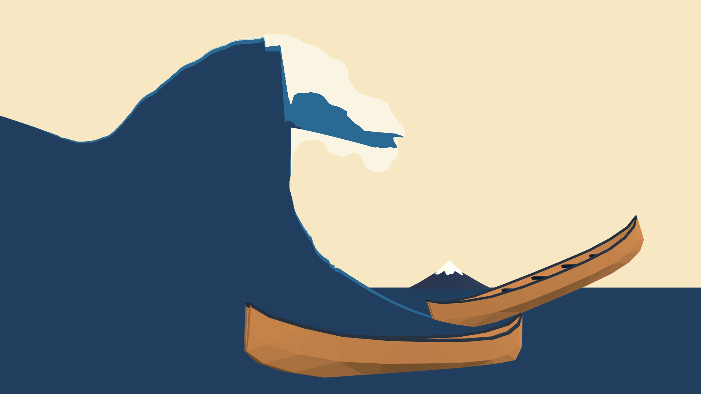
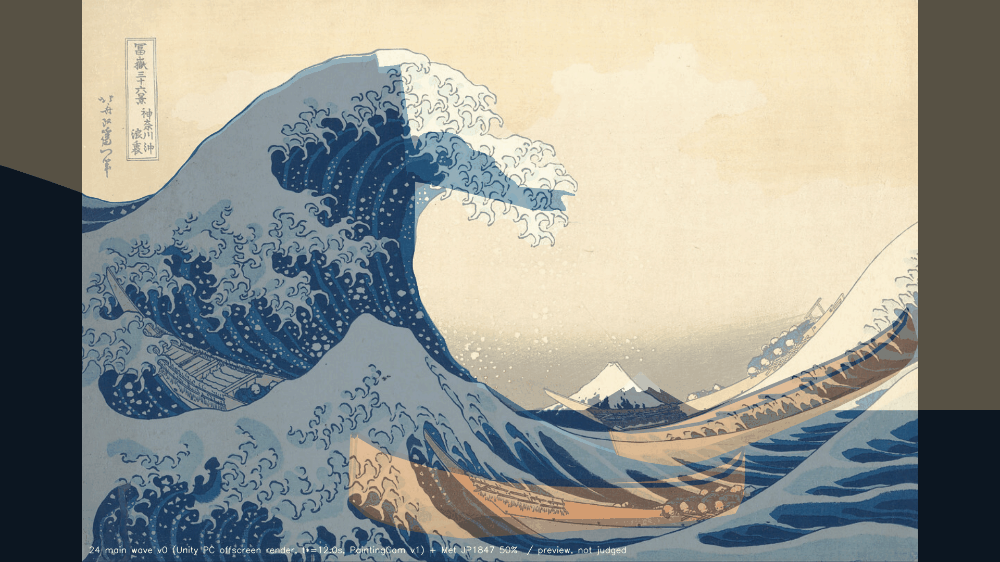
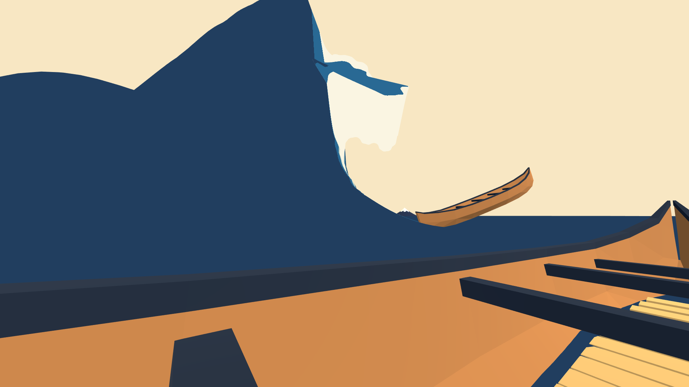
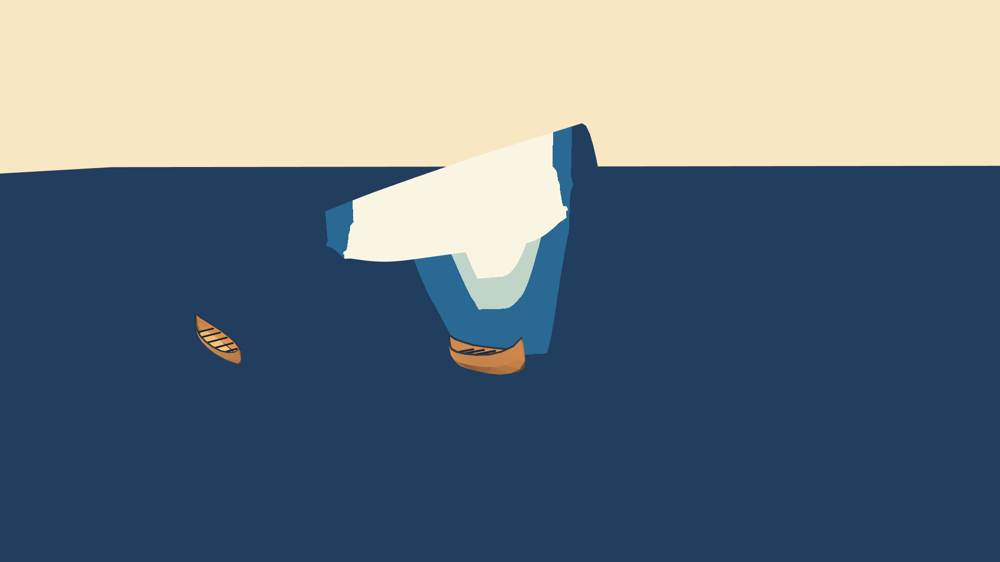

# 24：最初の画面：主役波 v0（プレビュー・合否判定なし）

日付：2026-09-25（初回）、2026-09-26（修正1回目）／結果：原画の包絡輪郭（爪なし）から固定位相の水面シートを作り、Unity で原画視点・船上座席・側面を描画した。修正1回目では、番号23で直した真値 v0.1（唇の右端の爪群を水域に入れた版）から K\* を作り直した。t\* = 12.0 s の原画視点で、主浪の輪郭の最大距離は 78・130・131・132 が 1 px 未満、72 が 10.54 px（v0 の目安 ≤12 px の範囲）。形成（0〜17 s）の2視点の動画も作り直した。**これはプレビューで、どの項目も合否を判定していない。**

この「24」は2026-09-25の新作業計画での番号で、旧設計書の24とは別である。

- 時間の上限：1日（計画 §4.2 の24）。初回と修正1回目を合わせて、上限の内で終えた。
- 修正回数：1（同じ問題の修正は2回まで）。修正1回目は、進行役のレビュー後に番号23の真値を直したことを受けた作り直しである。
- 対応するバックログ：判定なし。記録した項目は、原画視点・t\* の 68・69・70・71・72・78・94・130・131・132、形成の連続性の 80・106・107・111（形成の判定は番号30、輪郭の判定は番号26で ≤4 px）。
- 証拠の種類：Unity 6000.4.3f1 Editor の batchmode による **PC のオフスクリーン描画**（RTX 3080、Direct3D11、Linear 色空間）と、numpy による幾何・連続性の検査。HMD 実機の結果ではない。
- 評価器の状態（[metrics.json](../Evidence/ArtFirst/24/metrics.json) の `evaluator.status_ja` を、評価器の `provisional` の値から生成した文）：「評価器の判定は暫定ではない（provisional: false）。番号23の較正門（Docs/Evidence/ArtFirst/23/23_gate.json）は全項目合格で、門を回した時の真値（truth_manifest.json・painting_truth.json の SHA-256）が今と一致した。ただし 24 はプレビューなので、評価器の合否は採らず記録だけにする。」

## 見るもの

| 原画視点（t\* = 12.0 s、PaintingCam v1） | 原画 50% 重ね |
| --- | --- |
|  |  |
| **船上座席（t\*）** | **側面（t\*）** |
|  |  |

- 形成動画（30 fps、17.000 s、510 フレーム、1920×1080）：[原画視点](../Evidence/ArtFirst/24/24_formation_painting.mp4)／[船上座席](../Evidence/ArtFirst/24/24_formation_boat.mp4)
- [輪郭の偏差図](../Evidence/ArtFirst/24/24_painting_contour_overlay.png)（評価器の出力。水色が真値、緑 ≤2 px、黄 ≤4 px、赤 >4 px）
- [唇の拡大図](../Evidence/ArtFirst/24/24_lip_closeup_x2.png)（修正1回目で追加。左は偏差図の表示 px x 690〜1250・y 40〜560 を2倍、右は同じ範囲の描画と原画の 50% 重ね）
- 数値：[metrics.json](../Evidence/ArtFirst/24/metrics.json)、実行条件と SHA-256：[run.json](../Evidence/ArtFirst/24/run.json)

画像と動画はすべて Unity の実描画で、表示窓の録画ではない。原画重ねは、この描画に原画（1606×1080 の中央配置）を 50% で重ねた確認用の図で、256 色 PNG にしている。唇の拡大図も人が見るための図である。どちらも測定には使っていない。

## 修正1回目（2026-09-26）

### 理由

初回の K\* は、番号23の真値 v0 の包絡輪郭から作っていた。v0 では唇の右端の爪群が空として抜けていた（爪群の上縁の藍線が参照 px 約 (601–606, 198–199) で切れていたため。詳細は[番号23](Step_23_ja.md)）。番号23で真値を v0.1 に直したので、同じ生成器・同じパラメータで K\* と形成を作り直した。

### 変えたこと

1. **K\* の作り直し**：`params_v0.json` は変えていない。入力の包絡輪郭（`main_wave_outline_envelope.json`）が v0.1 になったため、主断面の唇の上側が、爪群の分だけ外へ広がった（[唇の拡大図](../Evidence/ArtFirst/24/24_lip_closeup_x2.png)）。断面の全弧長は 262.4 m から 261.1 m、唇の先端の世界座標は (1.57, 13.8, −2.38) から (1.54, 13.9, −2.38) になった。稜線の高さ 20.8 m は変わらない。
2. **法線反転の除去**：天井の角（72 の上半分で表示 x が最小の点）を断面へ移すと、透視と再標本化のため、角の直後に a が減る（左へ戻る）短い線分が1本残っていた。唇を潰した奥の行では、これが平らな海の中の小さな折り返しになり、形成の途中で頂点法線が反転していた（初回 8 頂点・フレーム、真値 v0.1 で角を直す前は 5 頂点・フレーム）。角の添字を断面の a の局所最小まで進めた（249 → 250。`wave_v0_meta.json` の `sweep.lip_corner_index_before_refine`）。反転は 0 になった。numpy の試算では、この変更で輪郭の最大値は変わらず、72 の p95 が 4.51 → 4.56 px になった。
3. **ffmpeg の場所**：`af24_evidence.py` に `--ffmpeg`・`--ffprobe` を加えた。省略すると環境変数 `GW_FFMPEG`・`GW_FFPROBE`、それもなければ既定値（`G:\ffmpeg-2024-12-19-git-494c961379-full_build\bin\ffmpeg.exe`、ffprobe は同じフォルダー）を使う。`run_af24.ps1` には `-Ffmpeg` を加えた。今回は既定値で動かし、決め方を run.json の `ffmpeg_resolved` に残した。
4. **記録の文面**：初回は「評価器は番号23第2部が未実施のため暫定値」と固定で書いていた。今回から、評価器の `provisional` と較正門の状態から文を作り、metrics.json の `preview_ja`・`evaluator.status_ja` に入れる。連続性の注記（法線反転・最大変位の位置）も continuity.json の値から作るようにした。
5. **唇の拡大図**を証拠に加えた。

評価器・真値・較正門には手を入れていない。

### 修正前との比較（Unity、ID モード、包絡版、表示 px）

| 項目 | 初回 最大／p95（真値 v0） | 修正1回目 最大／p95（真値 v0.1） |
| --- | --- | --- |
| 78 | 0.81／0.52 | 0.82／0.52 |
| 130 | 0.77／0.44 | 0.72／0.48 |
| 131 | 0.72／0.48 | 0.71／0.55 |
| 132 | 10.35／5.97 | **0.86／0.54** |
| 72 | 10.54／4.00 | 10.54／**4.31** |
| 71（参考） | 42.99／16.40（IoU 0.975） | 42.99／16.37（IoU 0.976） |
| 132 爪入り版（記録） | 91.85 | 43.92 |
| 72 爪入り版（記録） | 36.76 | 36.94 |

- 初回と修正1回目では、真値の版が違う（v0 → v0.1）。132 は物差しそのものが変わったので、数値の差をそのまま改善量とは読めない。
- 132 の最大は 10.35 px（唇の上側の縦の段）から 0.86 px（唇の先端 (1108, 353)）になった。
- **72 は良くなっていない**。最大は初回と同じ値・同じ位置（10.54 px、(1080, 395)、唇先端の下）で、p95 は 4.00 → 4.31 px とわずかに悪くなった。
- 72 の最大について numpy の試算で切り分けた（生成器は変えていない）。(1080, 395) 付近を覆うのは主断面ではなく、減衰 D = 0.74〜0.98 の行（c = −15〜+9 m）の、唇先端の直後の下側の列（190〜196）だった。唇の厚みを潰す段階を外すと 72 の最大は 36.06 px に悪くなり、カメラ側の唇を海面へ下げる段階を外しても最大は 10.54 px のまま（p95 は 4.56 → 2.17 px）だった。つまり最大は「海面へ下げる段階」からではなく、p95 の悪化の一部はこの段階から来ている。初回の記録では「唇の厚みを鉛直に潰す段階1が C 字形にくぼんだ輪郭で少し外へ出るため」と書いたが、これは確かめていなかった。原因の特定と対策は、唇の厚みと立体の解釈を決める番号26で行う。

## 作ったもの

### gw_wavegen v0（[gw_wavegen.py](../../Tools/GWWaveGen/gw_wavegen.py)、[params_v0.json](../../Tools/GWWaveGen/params_v0.json)）

numpy と OpenCV だけで書いた。出力は全フレーム同じ頂点数・同じ添字の水面シート（320×200 = 64,000 頂点、126,962 三角形、UV と UV2 つき）で、30 Hz・510 フレームの頂点位置を1つのファイルに書き出す。

**主断面**は、PaintingCam の水平前方に垂直な鉛直面で、右船（15_revision_layout.json の M1 middle boat、(11.6, 2, −2)）を通る面にした。カメラから水平に 59.5 m の位置になる。理由は次の3つ。

1. 右船と主断面が同じ奥行きにあるので、原画上の船と波の大きさの比が、そのまま世界の大きさの比になる（70 の比較が意味をもつ）。
2. 旧 M1 Revision01 の静止波（z −24〜22 m）と同じ場所に入るため、3隻・座席・富士の構図をそのまま使える。
3. 面がカメラに正対するので、原画の輪郭が横に縮まずに断面へ写る。

この面へ、包絡輪郭（78→130→131→132→唇先端→72）を PaintingCam の光線に沿って逆投影した。稜線は海面から 20.8 m（旧波の 21.35 m と同程度）、唇の先端は世界座標 (1.54, 13.9, −2.38) になった。原画の左端の輪郭は右下がりで始まるため、画面外に長さ 55 m の背後の山を置いて海面へ下ろし、72 の下端からは 14.2 m の延長で海面へ下ろした。断面の全弧長は 261 m。

**掃引**では、断面を主断面と平行な鉛直面に並べた（波峰線方向 c = −42〜+36 m、負がカメラ側）。各断面は PaintingCam を中心に相似変形（倍率 1 + c/59.5）しているので、減衰していない断面はどの奥行きでも原画の同じ輪郭へ投影される。

両端を平らな海へ落とす減衰には、断面の面内で水域の内側へ動かす変形を使った。

1. 唇の上側（132）と下側（天井）を、同じ横位置の反対側との中点へ鉛直に寄せ、唇の厚みを潰す（厚みの 85% まで）。
2. 潰した唇を、稜線と天井の角を結ぶ弦の中点へ縮める。天井の角は、断面の a の局所最小の点にする（修正1回目）。
3. 高さを海面へ潰す。
4. カメラ側の断面は、唇以外を海面の高さまで下げる（原画視点では輪郭の内側＝下へ動く）。

残す割合 D（1 で原形、0 で平らな海）は c = −6〜+3 m で 1（唇が巻いたまま）、その外側でガウス型に 0 へ下がる（カメラ側 σ = 16 m、奥側 σ = 12 m）。最初は転角を縮める方法（θ = A·θ\*）で端を減衰させたが、巻きがほどけると波が高くなり、numpy の試算で 78 の輪郭が最大 580 px はみ出した。そのため上の方式に変えた。この試算は初回の証拠より前の設計作業で、修正回数には数えていない。ただし上の比較のとおり、D が 1 に近い行の唇は原画視点で 72 の外へ最大約 10 px 出ている。

**形成**は、各断面の K\* 形状を転角で補間した（θ = s·θ\*）。s は予備 2 s のあと smootherstep で 0 から 1 へ上がり、t\* = 12.0 s で 1 になる。唇は位相を 0.25 遅らせた。転角補間は巻きがほどけた途中で K\* より高くなるため、行ごとに高さを K\* の最大までに抑えた。予備（0〜2 s）は平らな海、定格（12〜17 s）は静止する。

### Unity（[AF24FirstLight.cs](../../Unity/Assets/GreatWave/ArtFirst/Editor/AF24FirstLight.cs)、[AF24WavePlayer.cs](../../Unity/Assets/GreatWave/ArtFirst/Scripts/AF24WavePlayer.cs)、[AF24Palette.shader](../../Unity/Assets/GreatWave/ArtFirst/Shaders/AF24Palette.shader)、[AF24IdFlat.shader](../../Unity/Assets/GreatWave/ArtFirst/Shaders/AF24IdFlat.shader)）

修正1回目では Unity 側のコード・シェーダー・マテリアルを変えていない。

- M1 Revision01 の構図シーンを別名 `Assets/GreatWave/Scenes/Tests/AF24_FirstLight.unity` で保存し、新シーンだけを変えた。元シーンの SHA-256 は作業の前後で一致した（6014cd11…）。
- 新シーンは `BuildAndRender` が実行のたびに M1 Revision01 から複製して作り直す。コードが同じでも、新シーンのファイルの SHA-256 は初回と修正1回目で変わった（今回の値は run.json）。
- 新シーンで非表示にしたもの：旧い静止波、右の上り斜面と左の支持斜面、旧い唇の白帯と爪 27 個、範囲図（元から非表示）。前景の旧うねり、3隻、富士は残した。
- 参照海面は、新シーンだけ波の平らな部分と同じ藍濃の無光照マテリアルにした（M1_Sea.mat は変えていない）。
- 波は CPU で毎フレーム更新する（Mesh.vertices の差し替えと法線の再計算）。メッシュはシーンに保存せず、`Unity/Build/ArtFirst/24/wave/wave_v0.gwb` から読む。
- 仮の平塗りシェーダーは無光照・両面で、番号23の調色板の藍濃・藍中・水色・白を帯で塗る。帯の座標は「白帯（稜線から唇・天井の角まで）からの弧長距離」と「断面の減衰」の和で、原画の縞や色区とは対応させていない。SPI の立体視マクロは Sampling19Surface.cginc と同じ形で入れたが、立体視での描画は確かめていない。
- 描画：Camera.Render → RenderTexture（MSAA 8x を解決）→ ReadPixels → PNG。PaintingCam v1 と船上座席（15_revision_layout.json の eyeWorld、注視点 (−7, 5, 3)、縦画角 80°）で各 510 フレーム。側面（(53, 22, −2) → (−1, 7, 0)、60°）は t\* の1枚。510 フレーム×2視点の描画は約 45 秒だった。
- 評価用に、t\* の ID 画像（3840×2160、MSAA なし）を別に描いた。空はカメラ背景、3隻はそれぞれの色、それ以外は黒で、使われた色は4色だけだった。

## 結果（修正1回目、t\* = 12.0 s、PaintingCam v1、1920×1080、ID モード、包絡版、真値 v0.1）

| 項目 | 最大 (px) | p95 (px) | 判定 |
| --- | --- | --- | --- |
| 78 左端から斜め上への外形 | 0.82 | 0.52 | なし（プレビュー） |
| 130 左側の傾き | 0.72 | 0.48 | なし |
| 131 上側へのつながり | 0.71 | 0.55 | なし |
| 132 船側への曲がり | 0.86 | 0.54 | なし |
| 72 内側の輪郭 | 10.54 | 4.31 | なし |
| 71 内側の空域（参考） | 42.99 | 16.37 | なし（IoU 0.976） |

- 5区間とも v0 の目安（≤12 px）の範囲に入った。番号26の基準（≤4 px）には、72 がまだ届いていない。評価器の生の判定（metrics.json の `evaluator_raw_verdict_not_adopted`）も 72 だけが fail だが、24 では採らない。
- 132 の最大は唇の先端 (1108, 353)、72 の最大は唇先端の下 (1080, 395)。72 については上の「修正前との比較」を参照。
- 71 の最大は空域の下辺（(1045, 744)）で、原画では前景の波と右船が境を作る場所である。v0 の場面は前景の旧うねりと参照海面のままなので、主浪の形の差ではない。
- numpy のラスタライズによる事前の試算（78 0.92、130 0.66、131 0.98、132 0.67、72 10.65 px）と、Unity の実描画の値の差は 0.3 px 以内だった。
- 69：右船は画面内（表示 px x 1166〜1763）。70：稜線の高さ 20.8 m が右船の全長 18 m（10 m × 配置倍率 1.8）を超える。94：PaintingCam は 510 フレームとも同じ位置・向き・画角。68：2視点とも同じメッシュの同じフレームを描いた。いずれも記録のみ。
- 空上の色は ΔE00 0.17 で、Linear 色空間での色の受け渡しが正しいことを確かめた。そのほかの色の値は仮の平塗りなので記録だけにした。

## 形成の連続性（記録のみ。判定は番号30）

| 検査（全 510 フレーム） | 結果 |
| --- | --- |
| 頂点数・添字数（numpy／Unity） | 64,000 頂点・380,886 添字で全フレーム一定 |
| NaN・非有限値 | 0 |
| 断面の自己交差（t\* の全200行と、5フレームおきの9行） | 0 |
| 前フレームとの法線の反転 | 0（初回は 8 頂点・フレーム。修正1回目の2で除いた）。前フレームとの法線の内積の最小は 0.943 |
| 30 Hz の最大変位 | 原画輪郭に対応する列で 0.51 m、全頂点で 0.77 m（フレーム 235、行 148・列 8 の左の平らな海。PaintingCam では画面外） |
| t\* と K\* の差 | 0 m |
| 動画 | 2本とも 510 フレーム・17.000 s を全デコードで確認。ループ中の t\* のフレームと、あとで単独に描いた t\* は画素まで一致した |

## v0 のまま残した限界

1. **色**：仮の平塗りで、原画の縞・白の分布とは違う。原画視点では波体のほとんどが藍濃になり、形が読みにくい。色は番号28（投影焼き込み・SDF）で作り直す。
2. **動き**：t ≈ 8〜9 s に波が一度大きく立ち上がり（波頭が画面上端に届く）、その後に唇が巻いて K\* へ下がる。「立ち上がってから巻く」動きにはなったが、見え方の調整はしていない。唇の軌跡・足跡の移動・keypose は番号30で作る。
3. **立体の形**：原画視点の輪郭を保つため、断面を PaintingCam 中心に相似変形した。そのため側面から見ると、波はカメラ側へ細くなる楔形で、唇が巻いているのは c = −6〜+3 m の狭い範囲だけである。唇は厚みのない一枚の面で、唇厚 ≥0.3 m の正則化は入れていない。減衰の途中の行の唇が 72 の外へ最大約 10 px 出る問題も残っている。立体の解釈（30°／45°／60°）と唇の厚みは番号26で決める。
4. **船**：M1 Revision01 の仮配置のまま。支持斜面を隠したため、左船と右船が形成の途中で宙に浮いて見える（左船は t\* で波に隠れる）。番号27で配置し直す。
5. **再生方式**：v0 は CPU でのメッシュ更新で、keypose テクスチャと SPI シェーダーによる再生は未実装。計画どおり CP1 の前に接続する。
6. **HMD**：未所持。VR の項目はすべて未検証。

## 再現方法と生成物

リポジトリの根で次を実行する（Python 3.10.6、numpy 2.2.6、OpenCV 4.12.0、Pillow 12.0.0、Unity 6000.4.3f1、ffmpeg 2024-12-19）。3段がまとめて約1.5分で終わる（修正1回目の実測 88 秒）。

```
powershell -File Tools/GWWaveGen/run_af24.ps1 [-Ffmpeg <ffmpeg.exe>]
```

中身は次の3段である。

```
py -3.10 Tools/GWWaveGen/gw_wavegen.py --preview --export
E:/6000.4.3f1/Editor/Unity.exe -batchmode -projectPath G:/Unity/GreatWave_2026_Fresh/Unity -executeMethod GreatWave.ArtFirst.EditorTools.AF24FirstLight.BuildAndRender -logFile Unity/Build/ArtFirst/24/unity_af24_render.log -quit
py -3.10 Tools/GWWaveGen/af24_evidence.py [--ffmpeg <ffmpeg.exe>] [--ffprobe <ffprobe.exe>]
```

- ffmpeg の場所は `--ffmpeg`（`run_af24.ps1` では `-Ffmpeg`）、環境変数 `GW_FFMPEG`、既定値の順に決める。ffprobe は `--ffprobe`、環境変数 `GW_FFPROBE`、ffmpeg と同じフォルダーの順。見つからなければ、証拠を書き換える前に止まる。
- Git に入れるもの：生成器・パラメータ・証拠のまとめ（`Tools/GWWaveGen/`）、Unity のスクリプト・シェーダー・マテリアル・新シーン（`Unity/Assets/GreatWave/ArtFirst/`、`AF24_FirstLight.unity`）、証拠（`Docs/Evidence/ArtFirst/24/`、約 3.0 MB）。
- Git に入れないもの：`Unity/Build/ArtFirst/24/`（既存の `.gitignore` の `/Unity/Build/` で対象外）。頂点ファイル `wave_v0.gwb`（394 MB、SHA-256 752c03e1…ae92642）、全フレームの PNG（2×510 枚）、ID 画像、評価器の出力、Unity のログ。`.gwb` は修正1回目でも同じ入力で2回書き出し、SHA-256 が一致した。各ファイルのハッシュは run.json に記録した。
- 旧試作の禁止場所と 732e198 より前の履歴には触れていない。Houdini は使っていない。
