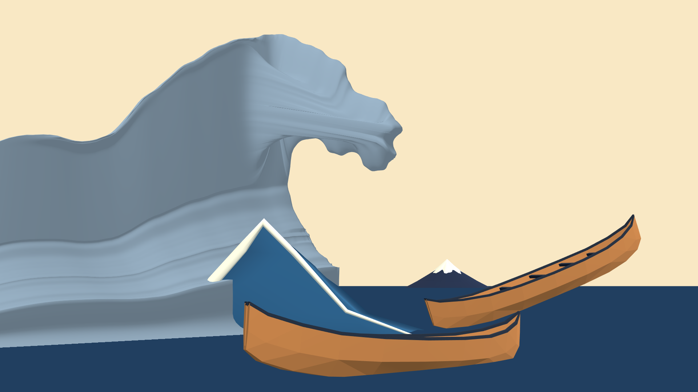
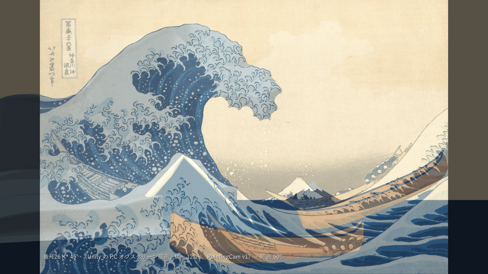
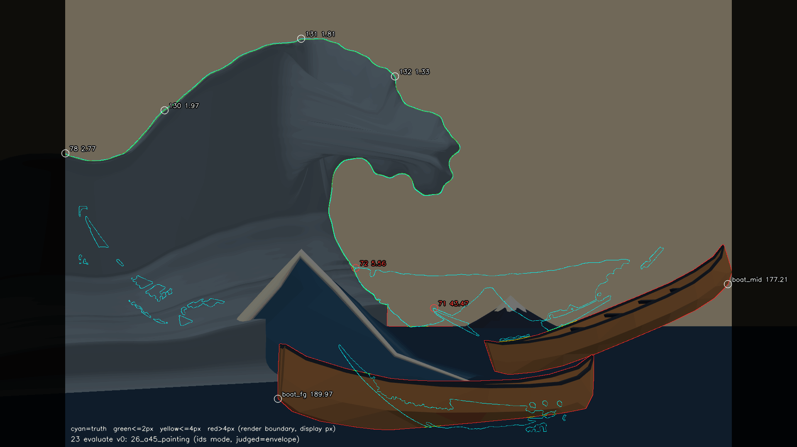
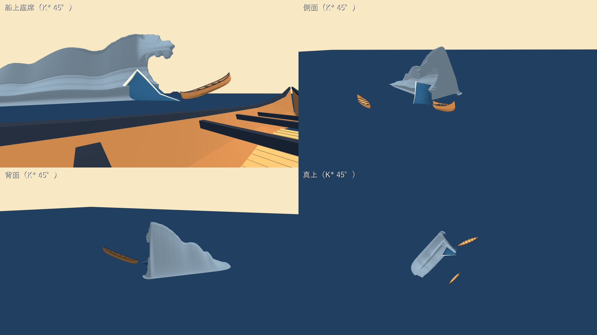

# 26：主役波の終態 K*（立体解釈 30°／45°／60°）

日付：2026-09-26／結果：原画の包絡輪郭から、立体解釈 3 案（波峰線と画面のなす角 30°・45°・60°）の K\* を固定位相の水面シート（400×200 = 80,000 頂点）で作り、Unity で原画視点・評価器用 ID 画像・船上座席・側面・背面・真上を描いた。t\* = 12.0 s の PaintingCam v1 で、外輪郭 78・130・131・132 は 3 案とも最大 ≤4 px（1.33〜2.77 px）で合格。**内輪郭 72 は 3 案とも最大 4 px を超えた**（4.55／5.56／5.15 px、p95 は 1.56〜2.74 px）。最大の所は、真値の内壁の外縁にある藍線の半幅より細い 2 つの小さな形（しぶきの点が輪郭線に付いた所）である。71 は空域の下辺（前景の旧うねり）で 43.47 px の不合格、69 は右船の船尾が黒帯に 1 px かかって不合格、70 は合格。68 は 3 案とも条件を満たしたが、船上機位（座席の船、D7）が未裁定なので**暫定合格（船上機位D7未裁定）**とした（定義シート第11行）。Blender の検査（非多様体・面の反転・自己交差 = 0）と座席からの 5 万本の射線（穴・切断端・開いた背面 = 0）は 3 案とも通った。**番号26 の受入はすべては満たしていない。**

- 時間の上限：2.5 日（作業計画 §4.2 の26）。実績は約 4 時間（2026-09-26 03:00〜07:00 頃、同じ時計）。
- 修正回数：0（初回の納品）。作る途中の試行（下の「作る途中で直したこと」）は、納品した画像に対する修正ではないので数えていない。コミット前の独立レビューの指摘で、68 の判定の表記（暫定合格）、参照モデルの比率の表（座標の列を除いた）、run.json のコマンドの記録を直した。記録と文書だけの直しで、K\*・画像・評価の数値は変えていない（run.json の `post_review_edits_ja`）。
- 対応するバックログ：68・69・70・71・72・78・130・131・132（G1）。事前検査として 83・115・116（判定は番号41）。
- 証拠の種類：Unity 6000.4.3f1 Editor の batchmode による **PC のオフスクリーン描画**（RTX 3080、Direct3D11、Linear 色空間）、評価器（ID モード）、Blender 5.2.2 ヘッドレスのメッシュ検査と射線検査、numpy の生成器の検査。HMD 実機の結果ではない。
- 評価器の状態：3 案とも `provisional: false`。較正門（23_gate.json）は全項目合格で、門を回した時の真値 v0.2（truth_manifest.json 8c99033e…）が今と一致した。真値 v0.2 と較正門の記録は番号23修正02の作業ツリーの状態（この番号の着手時点で未コミット）で、この番号では変えていない。この番号は番号23修正02 に依存するので、コミットは 23修正02 の後に置く。
- 判定の前提（暫定）：t\* = 12.0 s と、78・130・131・132 の区間の境界点（唇先端を含む）は、[Step_23](Step_23_ja.md) でまだ暫定である（利用者の確認待ち）。外輪郭の合否は、この暫定の t\* と区間の境界での値で、これらが変われば測り直す。船上の機位（座席の船、D7）も未裁定なので、船上の座席を使う 68 は暫定合格にとどめた（定義シート第11行：原画／船上の機位が決まるまでは合格としない）。
- 参照モデル（Q5、`wave_repair_zbrush2.obj`）は、使う前に SHA-256（ab4124f9…3d40）を照合し、読み取りだけで比率・断面・偏差・並べ図の記録に使った。形状はリポジトリにも成果物にも入れていない（下の「参照モデルとの比較」）。

## 見るもの

| 原画視点 K\* 45°（Unity、t\*） | 原画 50% 重ね（45°） |
| --- | --- |
|  |  |
| **輪郭の偏差図（45°、評価器）** | **船上座席・側面・背面・真上（45°）** |
|  |  |

- 30°：[原画視点](../Evidence/ArtFirst/26/26_a30_painting.png)／[50% 重ね](../Evidence/ArtFirst/26/26_a30_overlay50.png)／[偏差図](../Evidence/ArtFirst/26/26_a30_contour.png)／[4 視点](../Evidence/ArtFirst/26/26_a30_views.png)
- 60°：[原画視点](../Evidence/ArtFirst/26/26_a60_painting.png)／[50% 重ね](../Evidence/ArtFirst/26/26_a60_overlay50.png)／[偏差図](../Evidence/ArtFirst/26/26_a60_contour.png)／[4 視点](../Evidence/ArtFirst/26/26_a60_views.png)
- [72 の最大の所の拡大（3 案）](../Evidence/ArtFirst/26/26_72_closeups.png)
- 参照モデルとの比較（記録のみ）：[原画視点の重ね図](../Evidence/ArtFirst/26/26_ref_painting_overlay.png)／[断面の比較](../Evidence/ArtFirst/26/26_ref_sections.png)／[船上・側面・背面の並べ図](../Evidence/ArtFirst/26/26_compare_views.png)
- 数値：[metrics.json](../Evidence/ArtFirst/26/metrics.json)、実行条件と SHA-256：[run.json](../Evidence/ArtFirst/26/run.json)

画像は Unity の実描画（色は形を読むための仮のクレイ表示で、原画の色ではない。色は番号28）。原画 50% 重ね・偏差図・拡大図は人が見るための図（256 色 PNG を含む）で、測定には使っていない。並べ図は Blender Workbench の描画で、参照モデルは Unity のプロジェクトへ入れていない。

## 結果（t\* = 12.0 s、PaintingCam v1、1920×1080、ID モード 3840×2160、包絡版、真値 v0.2）

最大／p95（表示 px）。判定は評価器の値（しきい値 4 px）。

| 項目 | 30° | 45° | 60° |
| --- | --- | --- | --- |
| 78 左端から斜め上への外形 | 2.03／1.68 合格 | 2.77／1.54 合格 | 2.17／1.55 合格 |
| 130 左側の傾き | 2.12／2.01 合格 | 1.97／1.91 合格 | 2.02／1.91 合格 |
| 131 上側へのつながり | 1.80／1.70 合格 | 1.81／1.71 合格 | 1.79／1.66 合格 |
| 132 船側への曲がり | 1.40／1.26 合格 | 1.33／1.24 合格 | 1.55／1.27 合格 |
| **72 内側の輪郭** | **4.55／2.42 不合格** | **5.56／1.56 不合格** | **5.15／2.74 不合格** |
| 71 内側の空域 | 43.47／23.63 不合格（IoU 0.965） | 43.47／23.87 不合格 | 43.47／24.27 不合格 |
| 68 上側が下側より船側 | 暫定合格（船上機位D7未裁定） | 暫定合格（船上機位D7未裁定） | 暫定合格（船上機位D7未裁定） |
| 69 右船と波の上下が画面内 | 不合格（右船の船尾が x = 1763） | 不合格（同） | 不合格（同） |
| 70 波の上下 > 右船の全長 | 合格（803 px > 627 px） | 合格 | 合格 |

- 外輪郭（78・130・131・132）の値は、藍線の半幅だけ内側へ補正した目標に合わせた結果で、補正の分（78 1.39、130 1.67、131 1.43、132 1.15 px）を含む。
- **72**：最大の所は、30°・45° が (856, 647)、60° が (915, 723)。前者は真値の内壁の外縁から右へ延びる幅 2 px・長さ約 7 px の細い突起、後者は内壁に付いた小さな輪で、どちらもしぶきの点が輪郭線に付いた所である（[拡大図](../Evidence/ArtFirst/26/26_72_closeups.png)）。藍線の半幅の内側補正（72 は 1.31 px）より細いので補正後の目標から消え、滑らかな内壁ではここに届かない。記録として、この 2 か所の周り 12 px の真値点と、そこへ割り当たる描画点を除いた 72 を測った（metrics.json の `items.72.record_excluding_truth_micro_features`）。30° 3.24／2.39 px、45° 1.76／1.49 px で 4 px 以内、60° は 5.02／2.56 px で、最大は唇先の下 (1097, 366) だった。60° の唇先の周りは、面の折り返しを避けるため貼り付け（投影固定）から外した所で、逆畳み込みだけでは唇先の下の内輪郭に届いていない。
- **71**：最大は (1045, 744) で、空域の下辺（原画では前景の波・右船との境）。この場面の下辺は M1 Revision01 の前景の旧うねり（仮形状）のままで、主役波の形ではない（番号27・39 の範囲）。主役波がつくる上辺と左辺は 72 と同じ点列である。
- **69**：右船（M1 Revision01 の仮配置）の ID 画像の範囲が x 1166〜1763 で、採点列の右端 1762 を 1 px 越える。波の上端は y 93.6、主断面の真下の海面は y 896.5 で、どちらも画面内。右船の配置は番号27 で直す。
- **68**：座席（前景の船の eyeWorld）から唇先までの水平距離は 17.4／22.8／26.2 m、内壁の下端までは 23.5／26.7／28.5 m で、3 案とも上側が船側にある。同じ .gwb を同じ Unity の実行で原画視点と船上座席に描いた。座席は D7 の裁定前の仮の座席（M1 の前景の船）なので、判定は「暫定合格（船上機位D7未裁定）」とした（metrics.json の `items.68` は `pass-conditional`）。座席の船が決まったら測り直す。
- **70**：波の上下（頂の像から主断面の真下の海面の像まで）803 px に対し、右船の像の長さ（ID 画像の主軸方向）627 px。3D では頂の高さ 20.8 m、右船の全長 18 m。

## 立体の検査（Blender 5.2.2 ヘッドレス、Unity と同じ OBJ）

| 検査 | 30° | 45° | 60° |
| --- | --- | --- | --- |
| 3 面以上が接する辺（非多様体） | 0 | 0 | 0 |
| 巻き方向が食い違う辺（面の反転） | 0 | 0 | 0 |
| 自己交差する面の組（頂点を共有しない面の BVH 重なり） | 0 | 0 | 0 |
| 面積がほぼ 0 の面 | 0 | 0 | 0 |
| 縁の辺（格子の外周 1,196 と一致） | 1,196 | 1,196 | 1,196 |
| 座席から 5 万本：開いた背面／切断端／穴 | 0／0／0 | 0／0／0 | 0／0／0 |
| 同：K\* の表に当たった射線 | 25,242 | 25,985 | 28,689 |

射線は座席の目の位置から、座席カメラの前方（注視点 (−7, 5, 3)）を中心とする半球へ一様に出した。K\* と海面（y = −0.07）だけを置き、船と前景は入れていない。シートの縁は平らな海の高さ（y = 0）にあり、縁の頂点で海面より 5 cm 以上高いものは 0 だった。穴は「K\* に当たらず、シートの高さ y = 0 を通る点が K\* の平面図の足跡の内側にある射線」とした（縁の下の 7 cm のすき間から海面に当たる射線は穴に数えない）。これは 83・115・116 の事前検査で、座席は D7 の裁定前の前景の船のまま。合否は番号41 で決める。

## 作り方（gw_wavegen v1、[gw_wavegen_v1.py](../../Tools/GWWaveGen/gw_wavegen_v1.py)、[params_v1_kstar.json](../../Tools/GWWaveGen/params_v1_kstar.json)）

番号24 の v0（[gw_wavegen.py](../../Tools/GWWaveGen/gw_wavegen.py)）と 24 の証拠は変えていない。v1 は v0 のカメラ・投影・断面の自己交差の関数を読み込んで使う。

1. **立体解釈の角度**：波峰線（主断面の位置での水平な接線 e）と画面の水平方向 ea のなす角を α とする。e = cos α·ea + sin α·h（右奥へ）、進行方向 t = sin α·ea − cos α·h（右手前）。α = 90° が番号24 v0（波峰線が視線の向き）にあたる。断面は e に垂直な平行の鉛直面で、行（c）は e の向きに並ぶ。
2. **波頂の錨点**：原画の包絡輪郭の最上点を通る光線と、番号24 の主断面（右船を通り PaintingCam の水平前方に垂直な鉛直面）の交点。3 案とも頂は同じ 3D 位置（世界 (−7.23, 20.75, −2.71)、海面から 20.75 m）。
3. **主断面 P0**：原画の包絡輪郭の最上点 → 132 → 唇先端 → 72 → 内壁の下端を、区間ごとの藍線の半幅（線幅プロファイルの区間中央値の半分）だけ水側へ補正し、補正でできた小さな輪を切り取ってから、主断面（錨点を通り e に垂直）へ光線に沿って逆投影した。鋭い角（向きが 50° 以上変わる所）は必ず標本点にして弧長で一様に 290 点に並べた。背面の坂は smoothstep の曲線で、0.5H の高さでの壁の厚さが参照モデル（Q5）の中央値に近い 0.27H になるように足の位置を決めた。内壁の下端からは鉛直に下り、半径 1.5 m で前へ向きを変えて海面へ下ろした。前後に平らな海を付けて 400 列にした。
4. **行の族（200 行、手前 150・奥 49、0 の近くを密に）**：各行は P0 を e の向きへ平行移動し、次の最小の変形を加える。
   - 手前の肩（c < 0）：唇を縮めた状態で、原画の許容領域（空でない所。主浪の輪郭の近くは藍線の半幅だけ内側）に収まる最大の高さ D（y だけを D 倍）。画面の左端より外（行の頂の像が x < 157）では 2 m 先から幅 8 m で海面へ下げ、単調に低くした。
   - 唇：強さ λ(c) = exp(−(c/σ)²)。λ が 1→0.5 で唇の上側と下側を中線へ寄せて厚みを潰し（最大 85%、唇先の 1.5 m 以内は潰さない）、0.5→0 で頂と角を結ぶ直線へ縮める。σ は像の上の距離で決め（手前 44 px、奥 23 px）、唇の点が c 方向 1 m で像の上を動く量で割って m にした（30°：手前 1.13 m・奥 0.59 m、45°：1.45・0.76、60°：2.03・1.06）。
   - 奥（c > 0）：唇先から先（唇の下側・内壁・谷）を後ろへ下げる r(c)（0.3 m までは 2 次、その先は傾き β の直線）。β は内壁の点を c 方向と −t 方向へ動かしたときの像の横移動の比の 1.4 倍（30°：2.72、45°：1.54、60°：0.91）。各点の後退は、同じ高さの背面の坂との水平距離の 0.8 倍まで。高さ D は 1.2 m までは 1 で、その先 σ 2 m のガウスで海面へ下げ、唇が消えた行では許容領域に収まる最大値まで下げる（背面の坂の足へ向けて縮め、横の縮みは 0.35 倍まで）。
5. **逆畳み込み**：主断面の輪郭部分（最上点〜内壁の下端）を断面内の法線方向へ少しずつ動かし、全行の像のうち最も外へ出る点が補正後の目標にちょうど接するようにした（包絡線）。移動の最大は 0.33／0.26／0.31 m（H の 1.6／1.3／1.5%）。
6. **投影固定と TPS**：像が補正後の目標から 3 px 以内の頂点（はみ出しを含む）と、主断面の輪郭の頂点すべてを、断面内の法線方向へ動かして目標の射線上（符号付き距離 0）へ置いた（1 回 0.1 m、主断面は 0.5 m まで、3 回）。鋭い角の周りと唇先の周り（±6 列）は、法線が定まらず面が折り返すので貼り付けに使わない。移動量を (σ, c) 空間の薄板スプライン（TPS、正則化 0.1、制御点は 0.5 m 格子ごとに 1 点）で内部へ広げ、シルエットの頂点から (σ, c) で 2 m 程度で 0 へ減衰させた。
7. **折り返しの解消**：近くの三角形（同じ帯と隣の帯、列の差 6 以内）の交差を numpy で調べ、交差した頂点とその近くを平滑化した（主断面の輪郭の頂点は動かさない）。平滑化で目標の外へ出た頂点は内側へ戻し、交差がなくなるまで繰り返した。最後の移動の最大は 0.28／0.10／0.17 m。

| 作業計画 4.0 の条件 | 30° | 45° | 60° |
| --- | --- | --- | --- |
| 固定位相 400×200、UV つき | 80,000 頂点・158,802 三角形 | 同 | 同 |
| 内部の変位（TPS、全回の合計）／局所寸法（行の頂の高さ） | 0.44 m／3.5% | 0.33 m／2.9% | 0.40 m／2.1% |
| 唇の厚み（主断面、唇先から 0.75 m 奥の鉛直） | 1.18 m | 1.48 m | 2.93 m |
| 唇の厚み（唇が残る行の最小） | 0.88 m | 1.30 m | 1.66 m |
| 両端は海面まで（最初と最後の行の最大高さ） | 0 m | 0 m | 0 m |
| 断面は波峰線に垂直：手前の肩と主断面（波峰線と断面の法線のなす角の最大） | 2.3° | 2.1° | 2.5° |
| 同：奥の端（c 0.05〜2.8 m） | 68.6° | 70.9° | 71.5° |
| 画面内の頂点で補正後の目標から外へ出た最大 | 1.91 px | 2.28 px | 5.67 px |

- 60° の 5.67 px（藍線の外縁からは 4.36 px）は、唇の下側の爪の包絡のくぼみ (915, 427) の頂点で、鋭い角として貼り付けから外した所である。
- 局所寸法は「その行の頂の高さ（1 m 未満は 1 m）」と定義した。逆畳み込みの移動（上の 5）と折り返しの解消の移動（上の 7）は、いずれも H の 1.6% 以下。
- 断面の平面はすべて平行（法線 e）。手前の肩では頂の頂点の列が e に沿うので、断面は波峰線に垂直になる。奥の端では唇と内壁を後ろへ下げ、背面の坂の足へ向けて縮めるので、頂の頂点の列が後ろへ曲がり、最大約 70° ずれる。
- 生成は決定的で、同じ入力で 2 回書き出した 60° の .gwb と .obj の SHA-256 が一致した。

## 解釈ごとの形（船上・側面・背面・真上の図を見て）

- **手前の肩**：原画の左の輪郭（78・130・131）は、手前の肩の頂が左手前へ下がりながら描く包絡線になった。頂の高さがピークの半分を超える区間は 30°・45° で約 22.3〜22.5 m（1.07〜1.08H）、60° で 38.9 m（1.87H）。60° は肩が長く、画面左端の外で輪郭が上がり直す所（78 の左端）に対応して、c ≈ −33 m にもう一つ高まり（D 0.62）ができた（[側面](../Evidence/ArtFirst/26/26_a60_views.png)）。
- **奥の端**：原画では唇の右と下が空なので、斜めの解釈では波の奥の端を早く終える必要がある。3 案とも頂から約 3〜3.5 m で高さが半分、約 5 m で海面になり、背面から見ると急な端（崖）になる（[背面](../Evidence/ArtFirst/26/26_a45_views.png)）。
- **唇**：唇が残る範囲は波峰線の方向に頂から手前へ約 1〜2 m、奥へ約 0.5〜1 m と短い。船上座席から見ると、長い壁の右端に巻いた唇が付く形になる。α が小さいほど唇は前へ長く（唇先の断面内の位置 15.8／11.7／9.8 m）、断面の張り出しは大きい（0.54H／0.41H／0.34H）。
- 番号24 v0 の楔形（光線に沿う錐）とは違い、どの案も断面が波峰線に沿って本当に変わる 3D の形になった。ただし斜めの解釈では、原画の空（唇の右と管の中）に収めるための制約が強く、壁が薄く、肩の断面は鋭い稜になる（[断面の比較](../Evidence/ArtFirst/26/26_ref_sections.png)）。

## 参照モデル（Q5）との比較（記録のみ。合否には数えない）

作業計画 9.4 の解B（[align_B_upright.json](../Evidence/ArtFirst/26/reference/align_B_upright.json)）で参照モデルを世界座標へ置いて比べた。解A（[align_A_free.json](../Evidence/ArtFirst/26/reference/align_A_free.json)）と断面比率の表（[profile_metrics.json](../Evidence/ArtFirst/26/reference/profile_metrics.json)、作業計画 9.3 の元の値）も reference/ に置いた。比率の表は、進行役の 9.2〜9.3 の解析の断面ごとの表から、比率に使う列（H、0.5H での壁の厚さ、唇の張り出し、唇先の鉛直の厚さ、背面から唇先の幅）と H との比だけを残したもので、測れなかった値は null にした。断面の位置と、波峰・唇先・海面・0.3H の波面の座標の列は入れていない（最初は元の表をそのまま置いていたが、コミット前の独立レビューの指摘で座標の列を除いた）。形状を再現できる派生物（頂点・減面メッシュ・波峰や唇先の点列・断面の座標）は入れていない。中央部 6 断面の比は 9.3 の表と同じ範囲になる（壁 0.21〜0.31H、張り出し 0.37〜0.61H、唇先の厚さ 0.02〜0.08H、背面から唇先 0.66〜0.79H）。

| 量 | 参照モデル中央部（9.3） | 30° | 45° | 60° |
| --- | --- | --- | --- | --- |
| 0.5H での壁の厚さ／H | 0.21〜0.31（中央値 0.26） | 0.28 | 0.28 | 0.27 |
| 唇の張り出し（0.3H の内壁 → 唇先）／H | 0.37〜0.61（中央値 0.50） | 0.54 | 0.41 | 0.34 |
| 唇先から 0.75 m 奥の鉛直の厚さ | 0.02〜0.08H | 0.057H | 0.071H | 0.141H |
| 頂がピークの半分を超える区間／H | 約 1.2 | 1.07 | 1.08 | 1.87 |

- 自己検査（45°）：壁の厚さ 0.28H・唇の張り出し 0.41H で、どちらも参照モデル中央部の範囲（0.21〜0.31H、0.37〜0.61H）に入った。唇の張り出しは目標 0.45〜0.55H より小さい。張り出しは原画の唇先と内壁の像から決まり（投影固定）、比率に合わせて動かしていない（D6 の既定：原画 4 px を優先）。
- 偏差（参照モデルの面から K\* の面までの最短距離。参照モデル自身の海面より 0.25H 以上高い頂点から無作為に 20 万点）：

| | 平均 | p50 | p95 | 最大 |
| --- | --- | --- | --- | --- |
| 30° | 4.02 m（0.19H） | 3.55 m（0.17H） | 9.06 m（0.44H） | 11.42 m（0.55H） |
| 45° | 4.30 m（0.21H） | 3.76 m（0.18H） | 9.61 m（0.46H） | 12.55 m（0.60H） |
| 60° | 4.71 m（0.23H） | 4.40 m（0.21H） | 10.16 m（0.49H） | 13.11 m（0.63H） |

  選んだ頂点は海の塊・船の浮彫・前景の小波をおおむね除くが、爪（唇の縁の指状の突起と波頂の背面のとげ）は除けていない。p95・最大には爪と、参照モデルの背面の広い塊（K\* の背面は薄い壁）が効いている。
- 並べ図では、参照モデルは船上から見て座席から約 14〜20 m のまとまった塊、K\* は左手前へ長く下がる肩と右端の唇である。参照モデルの原画視点の重ね図では、K\* の輪郭は真値の包絡輪郭に重なり、参照モデルは 30〜150 px 離れる（9.4 の記録と同じ）。

## 番号28 へ渡すもの（Git 対象外、`Unity/Build/ArtFirst/26/kstar/`）

| ファイル | 内容 |
| --- | --- |
| `kstar_a30.gwb`・`kstar_a45.gwb`・`kstar_a60.gwb` | 番号24 と同じ GWW0 書式（1 フレーム、t\* のフレーム番号 0）。4,145,656 bytes |
| `kstar_a30.obj`・`kstar_a45.obj`・`kstar_a60.obj` | 同じ頂点・UV・三角形の OBJ（Unity のワールド座標のまま、m、左手系・Y 上）。約 10.3 MB |
| `kstar_aXX_meta.json` | 書式、UV の並び、主断面 P0、行ごとの変形量（c, D, κ, m, r）、検査、参照比率の自己検査 |
| `kstar_aXX_rows.npz` | 行ごとの断面内座標 (a, y) と主断面（numpy） |

- 頂点の添字 = 行 × 400 + 列。行は波峰線方向の断面 c（手前の端 c = −75 m → 奥の端 c = +10 m、主断面は行 150）、列は断面の弧長 σ。
- **UV0 = (σ / σ_total, (c − c_min) / (c_max − c_min))**。u は後ろの平らな海（0）→ 背面の坂 → 頂（列 90）→ 唇の上側 → 唇先端（列 200）→ 唇の下側 → 角（列 314）→ 内壁 → 内壁の下端（列 379）→ 谷 → 前の平らな海（1）。全行で同じ列は同じ u。**UV2 = (σ [m], c [m])**。
- 三角形は番号24 と同じ向き（平らな海で +Y が表）。表が空気の側で、唇の下面・内壁も表から見える。
- SHA-256：30° .gwb b86b2513…979f、45° .gwb 0021696e…6ff4、60° .gwb 833d1438…f2ae（全桁と .obj は run.json の `not_committed_sha256`）。

## 作る途中で直したこと（納品前の試行。修正回数には数えない）

- 断面を一つの平面へ全部逆投影するだけだと、30° では背面が 200 m 奥まで伸び、頂より高くなった。手前の肩の行が左の輪郭をつくる包絡線の読み方に切り替えた。
- 唇を弦へ直線で縮めると、手前の行の唇の下側が管の中の空へ下がった。厚みを縦に潰してから縮める順（番号24 v0 と同じ考え方）にした。
- 奥の行を高さだけ下げると内壁の上部が空域へ出た。唇先から先を後ろへ下げ、背面の坂の足へ向けて縮める形にした。
- 藍線の半幅の内側補正で爪の包絡のくぼみに小さな輪ができ、断面が折り返した。輪を切り取り、鋭い角を標本点にした。
- 貼り付け（投影固定）と TPS が唇先・鋭い角で面を折り返したので、そこを貼り付けから外し、残った交差を平滑化で解いた。
- 手前の高さ D の平滑化が強いと肩全体が 5〜10 px 下がったので、行ごとの揺れだけを取る σ 1 行にした。

## 限界と保留

1. **72 の 4 px**：真値 v0.2 の内壁の外縁にある、藍線の半幅より細い 2 つの小さな形で超えた。滑らかな内壁と半幅の補正では届かない。p95 は 1.56〜2.74 px。この 2 か所を除くと 30°・45° は 4 px 以内（3.24・1.76 px）だが、60° は唇先の下 (1097, 366) で 5.02 px が残る。
2. **71・69**：主役波以外（前景の旧うねり、右船の仮配置）で決まる。番号27・39 の範囲。
3. **奥の端と唇の範囲**：斜めの解釈では、原画の空に収めるため、奥の端が約 5 m で終わり、唇は頂の前後 1〜2 m にしかない。船上から見た「頭上を覆う唇」（108・109）は、この形のままでは作れない（D7 とあわせて番号30 の前に決める必要がある）。
4. **断面の向き**：奥の端（c 0.6〜3.8 m）では頂の頂点の列が後ろへ曲がり、断面の法線と最大約 70° ずれる。
5. **60° の二つ目の高まり**：画面左端の外の c ≈ −33 m に、78 の左端の上がりに対応する高まりができた。
6. **形の確認は PC の画像だけ**：HMD は未所持。船上・側面・背面の見え方は PC のオフスクリーン描画で、立体視での見え方は確かめていない。色は仮のクレイ表示。
7. 真値 v0.2・較正門の記録は番号23修正02 の作業ツリー（この番号の作業時点で未コミット）を使った。この番号の評価は番号23修正02 に依存するので、コミットは 23修正02 の後に置く。
8. **68 は暫定合格**：座席は D7 の裁定前の仮の座席（M1 の前景の船）で、定義シート第11行により最終の合格にしない。t\* と 78・130・131・132 の区間の境界点も Step_23 で暫定のままなので、これらが決まったら外輪郭と 68 を測り直す。

## 利用者に決めてほしいこと

- **D6（立体解釈の選択）**：30°／45°／60° のどれを採るか。原画 4 px（V2）と船上の立体（V3）がぶつかったときにどちらを優先するか。既定値（利用者未回答）は 45°・原画 4 px を優先。今回の結果では、外輪郭は 3 案とも合格、72 は 3 案とも真値の小さな形で不合格（その 2 か所を除くと 45° 1.76 px・30° 3.24 px は 4 px 以内、60° は唇先の下で 5.02 px）。船上から見た形は、60° が肩が長く唇が厚い、30° が唇が長く前へ出る。
- **72 の扱い**（作業計画の損切りの 3 択に、今回の原因に合う案を加えた）：(1) 72 を p95（≤4 px）で判定する、(2) 真値から藍線の半幅より細いしぶきの形を 72 の対象から外す（番号23 の真値の修正。23 は修正2回で上限に達しているので利用者の判断が要る。外すと 45°・30° は 4 px 以内）、(3) TPS の上限を緩める（今回の原因には効かない）、(4) 別の立体解釈に替える（真値の小さな形には効かない。60° は唇先の下の 5.02 px も残る）。
- **71**：番号26 では主役波がつくる上辺・左辺だけで判定し、下辺は前景の波（番号39）の後で判定するか。
- **69**：右船の配置（番号27）の後で判定し直すか。
- **斜めの解釈の奥の端・唇の範囲**（上の限界 3）をこのまま受け入れるか、D19 の (b)（参照モデルの外皮への貼り付け）など別の読み方を試すか。
- 引き続き保留：D7（座席の船）、D18〜D20（参照モデルの出所・範囲・爪）。

## 再現方法と生成物

リポジトリの根で次を実行する（Python 3.10.6、numpy 2.2.6、OpenCV 4.12.0、Pillow 12.0.0、Unity 6000.4.3f1、Blender 5.2.2 LTS）。全体で約 10〜15 分（生成器が 3 案で約 5〜10 分、Unity は起動を含めて約 20 秒）。

```
powershell -NoProfile -ExecutionPolicy Bypass -File Tools/GWWaveGen/run_af26.ps1 [-TempDir <一時フォルダー>] [-SkipReference] [-KeepTemp]
```

中身は次の段である。Unity は `Unity/Build/unity.lock` を作ってから 1 プロセスだけ動かし、終わったら消す（30 分で止める）。

```
py -3.10 Tools/GWWaveGen/gw_wavegen_v1.py
E:/6000.4.3f1/Editor/Unity.exe -batchmode -projectPath G:/Unity/GreatWave_2026_Fresh/Unity -executeMethod GreatWave.ArtFirst.EditorTools.AF26KStar.BuildAndRender -logFile Unity/Build/ArtFirst/26/unity_af26.log -quit
blender --background --factory-startup --python-exit-code 1 --python Tools/GWWaveGen/af26_blender_qa.py -- Unity/Build/ArtFirst/26/kstar Unity/Build/ArtFirst/26/af26_blender_qa.json <座席 eyeWorld xyz> -7 5 3
py -3.10 Tools/GWWaveGen/af26_reference.py --align Docs/Evidence/ArtFirst/26/reference/align_B_upright.json --out-dir Unity/Build/ArtFirst/26/ref --tmp-dir <一時フォルダー>
blender --background --factory-startup --python-exit-code 1 --python Tools/GWWaveGen/af26_blender_ref.py -- G:/research/model/wave_repair_zbrush2.obj <align_B_upright.json> Unity/Build/ArtFirst/26/kstar <一時フォルダー>/ref_selected_world.npy Unity/Build/ArtFirst/26/ref
py -3.10 Tools/GWWaveGen/af26_evidence.py
```

- Git に入れるもの：生成器と実行の手順（`Tools/GWWaveGen/gw_wavegen_v1.py`、`params_v1_kstar.json`、`af26_evidence.py`、`af26_blender_qa.py`、`af26_reference.py`、`af26_blender_ref.py`、`run_af26.ps1`）、Unity のスクリプト・シェーダー・マテリアル・新シーン（`AF26KStar.cs`、`AF26KStarMesh.cs`、`AF26Clay.shader`、`AF26_Clay.mat`、`AF26_SeaFlat.mat`、`Scenes/Tests/AF26_KStar.unity`）、証拠（`Docs/Evidence/ArtFirst/26/`、約 7 MB、参照モデルの整列の変換と比率の表を含む）。
- Git に入れないもの：`Unity/Build/ArtFirst/26/`（既存の `/Unity/Build/` の規則で対象外）。K\* の .gwb・.obj・meta・rows、Unity の描画と ID 画像、評価器の出力、Blender の検査と比較の出力、ログ。ハッシュは run.json にある。
- 新シーン `AF26_KStar.unity` は、実行のたびに M1 Revision01 から複製して作り直す。元シーンの SHA-256 は作業の前後で一致した（af26_build_report.json）。旧い静止波・斜面・範囲図・白帯と爪 27 個を新シーンだけで非表示にした（番号24 と同じ）。番号24 の `AF24 ID Flat` シェーダーは読むだけで使った。
- 参照モデルの一時キャッシュ（OBJ を numpy へ変換した npz）は、作るたびに元ファイルの SHA-256 を照合し、Git 対象外の作業フォルダーに置いて、使い終わったら消した。最後に使ったキャッシュの SHA-256 は 6a07d6a5…5042（1,131,888 頂点・1,148,986 面）。解析の途中で別に作った一時キャッシュ（306a5bf3…877e）も消した。
- 旧試作の禁止場所と 732e198 より前の履歴には触れていない。Houdini は使っていない。
